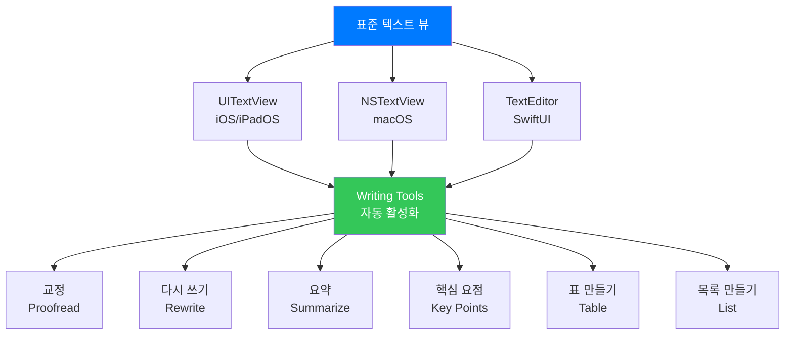
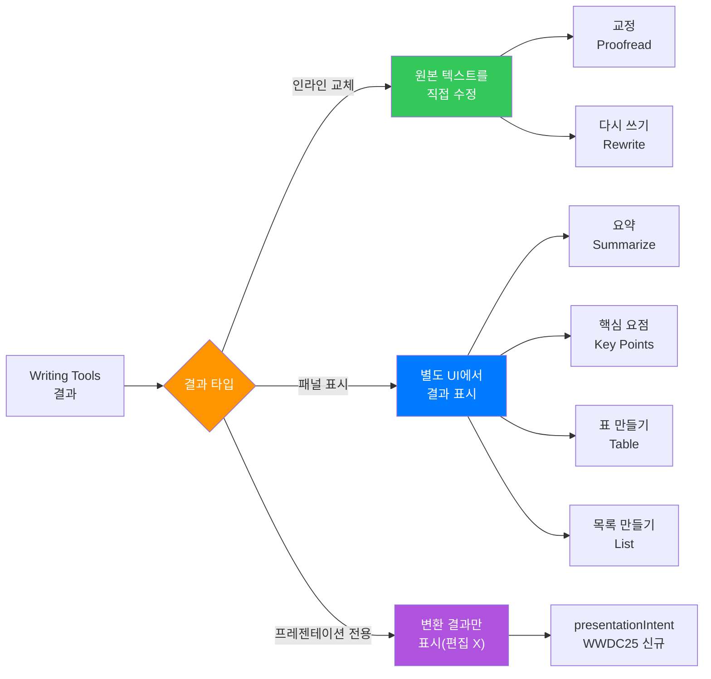
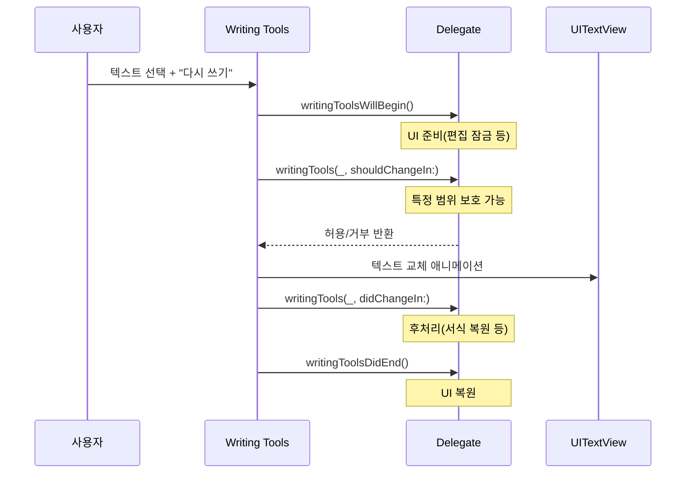
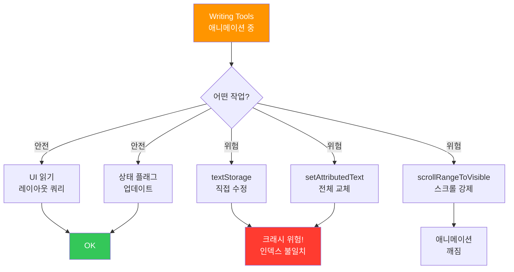
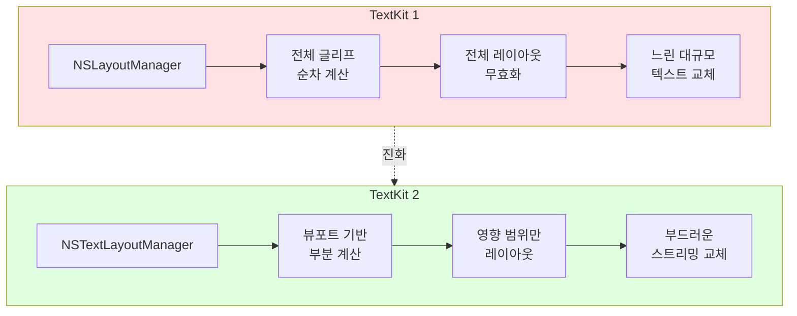

# 02. 표준 텍스트 뷰에서 Writing Tools 활용

> UITextView와 NSTextView에서 Writing Tools를 자연스럽게 통합하고, Delegate를 활용해 세밀하게 제어하는 방법을 배웁니다

## 개요

이 섹션에서는 Apple이 제공하는 표준 텍스트 뷰(UITextView, NSTextView, TextEditor)에서 Writing Tools가 어떻게 자동으로 동작하는지, 그리고 개발자가 이를 세밀하게 제어하는 방법을 알아봅니다. 단순히 "자동 지원"에 머무르지 않고, 실제 앱에서 마주치는 **Undo 통합, 보호 범위 관리, AttributedString 처리, 애니메이션 충돌 방지** 같은 실전 과제를 깊이 다룹니다.

**선수 지식**: [01. Writing Tools 개요와 아키텍처](11-writing-tools-integration/01-writing-tools-overview.md)에서 배운 Writing Tools의 전체 구조와 동작 원리
**학습 목표**:
- UITextView/NSTextView에서 Writing Tools가 자동 활성화되는 원리 이해
- WritingToolsDelegate를 활용한 세밀한 동작 제어 구현
- 텍스트 변경 애니메이션과 사용자 경험 최적화
- AttributedString 보존과 보호 범위 전략 설계
- SwiftUI TextEditor에서의 Writing Tools 활용법

## 왜 알아야 할까?

여러분이 레스토랑에서 풀코스 요리를 주문했다고 상상해보세요. 메인 셰프가 알아서 전채부터 디저트까지 차례로 내주는 게 "표준 텍스트 뷰의 Writing Tools"이에요. 주방 시스템이 이미 갖춰져 있으니, 손님(개발자)은 특별한 요청사항만 전달하면 되죠. 하지만 "땅콩 알레르기가 있다"거나 "디저트는 내가 가져온 걸로"라는 특별 요청이 있다면? 셰프와 소통하는 방법을 알아야 합니다.

UITextView나 NSTextView 같은 표준 텍스트 뷰는 **iOS 18.2 / macOS 15.2부터 Writing Tools를 자동으로 지원**합니다. 코드 한 줄 없이도 사용자는 텍스트를 선택하고 "교정", "요약", "다시 쓰기" 같은 AI 기능을 쓸 수 있거든요. 하지만 "자동으로 된다"와 "잘 동작한다"는 다른 이야기입니다. Undo/Redo 처리, 텍스트 애니메이션, 특정 영역 보호, AttributedString 서식 보존 같은 세부 사항을 제대로 다루지 않으면 사용자 경험이 어색해질 수 있어요.

실무에서 흔히 마주치는 시나리오를 몇 가지 떠올려보죠:
- **마크다운 에디터**: 코드 블록은 AI가 건드리면 안 됨
- **리치 텍스트 에디터**: 볼드/이탤릭 서식이 Writing Tools 적용 후 사라지면 안 됨
- **법률 문서 앱**: 계약 조항의 특정 부분은 절대 수정 불가
- **실시간 협업 앱**: Writing Tools 작업 중 다른 사용자의 변경이 충돌하면?

> 🔥 **실무 팁**: App Store에 출시된 앱이 UITextView를 사용하고 있다면, iOS 18.2 업데이트만으로 사용자에게 Writing Tools가 노출됩니다. 의도하지 않은 동작을 방지하려면 미리 테스트하는 것이 필수예요!

## 핵심 개념

### 개념 1: 표준 텍스트 뷰의 자동 지원

> 💡 **비유**: 새 아파트에 입주하면 기본 인테리어(조명, 콘센트, 수도)가 이미 갖춰져 있는 것처럼, 표준 텍스트 뷰는 Writing Tools "기본 인테리어"가 내장되어 있습니다. 물론 인테리어를 커스터마이징하려면 배선 구조를 이해해야 하듯, 세밀한 제어를 위해서는 내부 동작 원리를 알아야 해요.

Apple의 표준 텍스트 뷰 컴포넌트들은 Writing Tools를 **기본(built-in)으로 지원**합니다. 이는 TextKit 2 기반의 텍스트 시스템과 깊이 통합되어 있기 때문인데요, 별도 코드 없이도 세 가지 핵심 기능이 동작합니다:

> 📊 **그림 1**: 표준 텍스트 뷰의 Writing Tools 자동 지원 구조



각 플랫폼별 지원 현황을 정리하면 다음과 같습니다:

| 플랫폼 | 컴포넌트 | 최소 버전 | Writing Tools 지원 |
|---------|----------|-----------|-------------------|
| iOS/iPadOS | `UITextView` | iOS 18.2 | 자동 (isEditable = true) |
| macOS | `NSTextView` | macOS 15.2 | 자동 (isEditable = true) |
| SwiftUI | `TextEditor` | iOS 18.2 / macOS 15.2 | 자동 |
| UIKit | `UITextField` | - | 미지원 (단일 행) |
| SwiftUI | `TextField` | - | 미지원 (단일 행) |

> ⚠️ **흔한 오해**: "UITextField에서도 Writing Tools가 되겠지?"라고 생각하기 쉽지만, Writing Tools는 **여러 줄 텍스트 뷰**에서만 동작합니다. 단일 행 입력 필드(UITextField, SwiftUI TextField)에서는 활성화되지 않아요. 이는 교정이나 요약 같은 기능이 충분한 텍스트 컨텍스트를 필요로 하기 때문입니다.

가장 기본적인 구현은 놀라울 정도로 간단합니다:

```swift
import UIKit

class SimpleEditorViewController: UIViewController {
    // UITextView를 만들기만 하면 Writing Tools 자동 지원!
    private let textView: UITextView = {
        let tv = UITextView()
        tv.font = .preferredFont(forTextStyle: .body)
        tv.isEditable = true  // 편집 가능해야 Writing Tools 활성화
        tv.translatesAutoresizingMaskIntoConstraints = false
        return tv
    }()
    
    override func viewDidLoad() {
        super.viewDidLoad()
        view.addSubview(textView)
        
        // Auto Layout 설정
        NSLayoutConstraint.activate([
            textView.topAnchor.constraint(equalTo: view.safeAreaLayoutGuide.topAnchor, constant: 16),
            textView.leadingAnchor.constraint(equalTo: view.leadingAnchor, constant: 16),
            textView.trailingAnchor.constraint(equalTo: view.trailingAnchor, constant: -16),
            textView.bottomAnchor.constraint(equalTo: view.bottomAnchor, constant: -16)
        ])
        
        // 샘플 텍스트 설정
        textView.text = "오늘 회의에서 중요한 결정이 내려졌습니다..."
        // 이것만으로 Writing Tools 사용 가능!
    }
}
```

SwiftUI에서는 더 간결합니다:

```swift
import SwiftUI

struct SimpleEditorView: View {
    @State private var text = "오늘 회의에서 중요한 결정이 내려졌습니다..."
    
    var body: some View {
        TextEditor(text: $text)
            .padding()
        // Writing Tools가 자동으로 활성화됨
    }
}
```

하지만 "자동 지원"에는 한계가 있습니다. 시스템이 기본 제공하는 것과 개발자가 추가로 처리해야 하는 것을 구분하는 게 중요하죠:

| 시스템이 자동 처리 | 개발자가 추가 처리 필요 |
|-------------------|----------------------|
| Writing Tools 메뉴 표시 | 특정 범위 보호 (코드 블록 등) |
| 텍스트 교체 애니메이션 | 커스텀 AttributedString 서식 보존 |
| 기본 Undo/Redo 등록 | Undo 그룹핑 최적화 |
| 결과 표시 (인라인/패널) | 변경 중 UI 상태 관리 |

### 개념 2: Writing Tools 결과 타입과 처리 방식

> 💡 **비유**: 커피숍에서 주문할 때, 어떤 음료는 "기존 컵 리필"(인라인 교체)이고, 어떤 음료는 "새 컵에 담아서"(패널 표시) 나오죠. Writing Tools도 결과 유형에 따라 표시 방식이 달라집니다.

Writing Tools는 결과를 두 가지 방식으로 표시하는데, 이를 **결과 옵션(Result Options)**이라고 합니다:

> 📊 **그림 2**: Writing Tools 결과 표시 방식 비교



| 결과 옵션 | 설명 | 해당 기능 | 텍스트 수정 |
|-----------|------|-----------|------------|
| `.default` | 기본 동작 (기능별 자동 선택) | 모든 기능 | 기능에 따라 다름 |
| `.inlineReplacement` | 원본 텍스트를 직접 교체 | 교정, 다시 쓰기 | O |
| `.panel` | 별도 패널에 결과 표시 | 요약, 핵심 요점, 표/목록 | X (원본 유지) |
| `.presentationIntent` | 변환 결과만 표시 (WWDC25) | 읽기 전용 표시 | X (편집 불가) |

`presentationIntent`는 **WWDC25에서 새로 추가**된 옵션으로, 변환된 결과를 읽기 전용으로 보여주고 싶을 때 사용합니다. 예를 들어 이메일 앱에서 요약 결과를 표시하되, 사용자가 원본을 수정하지 못하게 할 때 유용하죠.

결과 옵션은 **OptionSet**이므로 조합해서 사용할 수도 있습니다:

```swift
import UIKit

class ResultAwareEditorViewController: UIViewController, UITextViewDelegate {
    private let textView = UITextView()
    
    override func viewDidLoad() {
        super.viewDidLoad()
        textView.delegate = self
        
        // Writing Tools 결과 옵션 설정
        // .default: 시스템이 자동으로 최적의 표시 방식 선택
        textView.writingToolsResultOptions = .default
    }
    
    // 앱의 용도에 따라 결과 옵션을 전략적으로 설정
    
    func configureForProofreadOnly() {
        // 인라인 교체만 허용 (교정, 다시 쓰기용)
        textView.writingToolsResultOptions = .inlineReplacement
    }
    
    func configureForSummaryOnly() {
        // 패널 표시만 허용 (요약, 핵심 요점용)
        textView.writingToolsResultOptions = .panel
    }
    
    func configureForReadOnlyPresentation() {
        // 프레젠테이션 전용 (WWDC25 신규)
        textView.writingToolsResultOptions = .presentationIntent
    }
    
    func configureForFullSupport() {
        // 인라인 + 패널 모두 허용
        textView.writingToolsResultOptions = [.inlineReplacement, .panel]
    }
}
```

> 🔥 **실무 팁**: 결과 옵션을 `.panel`만으로 제한하면, 사용자에게 "요약"이나 "핵심 요점" 기능만 보이고 "교정"이나 "다시 쓰기"는 숨겨집니다. 읽기 전용에 가까운 뷰에서 유용한 전략이에요. 반대로 문서 편집 앱이라면 `.default`가 가장 안전합니다.

### 개념 3: UIWritingToolsDelegate로 세밀한 제어

> 💡 **비유**: 인테리어 공사를 할 때 "시작합니다", "이 벽은 건드리지 마세요", "다 끝났습니다"를 현장 감독에게 알려주듯, Delegate는 Writing Tools의 각 단계를 보고받고 지시할 수 있는 "현장 감독" 역할입니다.

`UIWritingToolsDelegate`(iOS) 또는 `NSWritingToolsDelegate`(macOS)를 채택하면 Writing Tools의 동작을 세밀하게 제어할 수 있습니다. 이 델리게이트는 4가지 핵심 메서드를 제공합니다:

> 📊 **그림 3**: UIWritingToolsDelegate 호출 시퀀스



각 메서드의 역할과 실전 활용법을 상세히 살펴봅시다:

```swift
import UIKit

class AdvancedEditorViewController: UIViewController, UIWritingToolsDelegate {
    private let textView = UITextView()
    
    // 보호할 텍스트 범위 (예: 인용문, 코드 블록)
    private var protectedRanges: [NSRange] = []
    
    // 변경 전 서식 정보를 저장 (AttributedString 보존용)
    private var preChangeAttributes: [NSRange: [NSAttributedString.Key: Any]] = [:]
    
    override func viewDidLoad() {
        super.viewDidLoad()
        
        // Writing Tools 델리게이트 설정
        textView.writingToolsDelegate = self
        
        setupTextView()
    }
    
    // MARK: - UIWritingToolsDelegate 메서드
    
    /// Writing Tools 작업 시작 직전 호출
    func writingToolsWillBegin(_ textView: UITextView) {
        // 1. 편집 잠금 — 작업 중 사용자 입력 방지
        textView.isEditable = false
        
        // 2. 진행 표시 UI 업데이트
        showProgressIndicator()
        
        // 3. Undo 그룹핑 시작 — 전체 Writing Tools 작업을 하나의 Undo 단위로
        textView.undoManager?.groupsByEvent = false
        textView.undoManager?.beginUndoGrouping()
        
        // 4. 현재 AttributedString 서식 정보 스냅샷 저장
        saveCurrentAttributes()
        
        // 5. 자동 저장, 동기화 등 백그라운드 작업 일시 중지
        pauseBackgroundTasks()
    }
    
    /// 특정 범위의 텍스트 변경 허용 여부 결정
    func writingTools(
        _ textView: UITextView,
        shouldChangeIn affectedRange: NSRange
    ) -> Bool {
        // 보호된 범위와 겹치는지 확인
        for protectedRange in protectedRanges {
            if NSIntersectionRange(affectedRange, protectedRange).length > 0 {
                return false  // 이 범위는 수정하지 않음
            }
        }
        return true  // 변경 허용
    }
    
    /// 텍스트가 실제로 변경된 후 호출
    func writingTools(
        _ textView: UITextView,
        didChangeIn affectedRange: NSRange
    ) {
        // 1. 변경된 범위에 커스텀 서식 복원/적용
        restoreCustomAttributes(in: affectedRange)
        
        // 2. 보호 범위 인덱스 재계산 (텍스트 길이 변경 반영)
        recalculateProtectedRanges()
        
        // 3. 워드 카운트 등 메타데이터 업데이트
        updateWordCount()
    }
    
    /// Writing Tools 작업 완전 종료 후 호출
    func writingToolsDidEnd(_ textView: UITextView) {
        // 1. 편집 잠금 해제
        textView.isEditable = true
        
        // 2. 진행 표시 숨기기
        hideProgressIndicator()
        
        // 3. Undo 그룹 종료 — 전체 변경을 한 번에 되돌릴 수 있음
        textView.undoManager?.endUndoGrouping()
        textView.undoManager?.groupsByEvent = true
        
        // 4. 백그라운드 작업 재개
        resumeBackgroundTasks()
        
        // 5. 변경 사항 외부 동기화 (서버, iCloud 등)
        syncChanges()
    }
    
    // MARK: - 서식 보존 헬퍼
    
    /// 현재 AttributedString의 커스텀 서식 정보를 저장
    private func saveCurrentAttributes() {
        preChangeAttributes.removeAll()
        let attrText = textView.attributedText ?? NSAttributedString()
        
        // 커스텀 속성만 추출 (볼드, 색상, 링크 등)
        attrText.enumerateAttributes(
            in: NSRange(location: 0, length: attrText.length)
        ) { attrs, range, _ in
            // 기본 폰트 외의 커스텀 속성이 있는 범위만 저장
            let customAttrs = attrs.filter { key, _ in
                key == .foregroundColor || key == .link ||
                key == .underlineStyle || key == .backgroundColor
            }
            if !customAttrs.isEmpty {
                preChangeAttributes[range] = customAttrs
            }
        }
    }
    
    /// 변경된 범위에 이전 서식 복원
    private func restoreCustomAttributes(in changedRange: NSRange) {
        guard let attrText = textView.attributedText else { return }
        let mutable = NSMutableAttributedString(attributedString: attrText)
        
        // 변경된 범위와 겹치는 이전 서식 찾아서 적용
        for (savedRange, attrs) in preChangeAttributes {
            let intersection = NSIntersectionRange(savedRange, changedRange)
            if intersection.length > 0 {
                for (key, value) in attrs {
                    mutable.addAttribute(key, value: value, range: intersection)
                }
            }
        }
        
        textView.attributedText = mutable
    }
    
    // MARK: - 보호 범위 설정 헬퍼
    
    /// 특정 패턴(예: 코드 블록)을 보호 범위로 등록
    func registerProtectedRanges() {
        let text = textView.text ?? ""
        let nsText = text as NSString
        
        // "```"로 감싼 코드 블록을 보호
        let codeBlockPattern = "```[\\s\\S]*?```"
        if let regex = try? NSRegularExpression(pattern: codeBlockPattern) {
            let matches = regex.matches(
                in: text,
                range: NSRange(location: 0, length: nsText.length)
            )
            protectedRanges = matches.map { $0.range }
        }
    }
    
    private func recalculateProtectedRanges() {
        // 텍스트 변경 후 보호 범위를 재탐지
        registerProtectedRanges()
    }
    
    // MARK: - UI / 상태 헬퍼
    
    private func setupTextView() {
        textView.font = .preferredFont(forTextStyle: .body)
        textView.isEditable = true
        textView.translatesAutoresizingMaskIntoConstraints = false
        view.addSubview(textView)
        
        NSLayoutConstraint.activate([
            textView.topAnchor.constraint(equalTo: view.safeAreaLayoutGuide.topAnchor),
            textView.leadingAnchor.constraint(equalTo: view.leadingAnchor, constant: 16),
            textView.trailingAnchor.constraint(equalTo: view.trailingAnchor, constant: -16),
            textView.bottomAnchor.constraint(equalTo: view.bottomAnchor)
        ])
    }
    
    private func showProgressIndicator() { /* 진행 표시 UI */ }
    private func hideProgressIndicator() { /* 숨기기 */ }
    private func pauseBackgroundTasks() { /* 백그라운드 작업 일시 중지 */ }
    private func resumeBackgroundTasks() { /* 백그라운드 작업 재개 */ }
    private func syncChanges() { /* 변경 사항 동기화 */ }
    private func updateWordCount() { /* 글자 수 갱신 */ }
}
```

### 개념 4: 텍스트 변경 애니메이션과 충돌 방지

Writing Tools가 인라인 교체를 수행할 때, 시스템은 **자동으로 타이핑 애니메이션**을 제공합니다. 이는 사용자에게 "AI가 직접 타이핑하는 듯한" 자연스러운 경험을 주기 위한 것인데요, 이 과정에서 개발자가 주의해야 할 **타이밍 이슈**가 존재합니다.

> 📊 **그림 4**: 인라인 교체 애니메이션과 금지 구간


> 📊 **그림 5**: 애니메이션 중 안전한 작업 vs 위험한 작업



이 점을 고려한 **안전한 패턴**은 다음과 같습니다:

```swift
import UIKit

class AnimationAwareEditorVC: UIViewController, UIWritingToolsDelegate {
    private let textView = UITextView()
    private var isWritingToolsActive = false
    
    // 지연 처리할 작업 큐
    private var deferredOperations: [() -> Void] = []
    
    override func viewDidLoad() {
        super.viewDidLoad()
        textView.writingToolsDelegate = self
        textView.delegate = self
        setupTextView()
    }
    
    func writingToolsWillBegin(_ textView: UITextView) {
        isWritingToolsActive = true
        deferredOperations.removeAll()
        
        // 중요: 애니메이션 중에는 textStorage 직접 수정 금지!
        // NSTextStorage.beginEditing()/endEditing() 호출하지 않기
    }
    
    func writingTools(
        _ textView: UITextView,
        didChangeIn affectedRange: NSRange
    ) {
        // didChange는 각 청크(chunk)마다 호출될 수 있음
        // 무거운 작업은 여기서 하지 말고 큐에 넣기
        let operation = { [weak self] in
            self?.updateCustomOverlays(for: affectedRange)
            self?.notifyAccessibility(changedRange: affectedRange)
        }
        deferredOperations.append(operation)
    }
    
    func writingToolsDidEnd(_ textView: UITextView) {
        isWritingToolsActive = false
        
        // 전체 레이아웃 재계산 (안전하게)
        textView.setNeedsLayout()
        textView.layoutIfNeeded()
        
        // 지연된 작업 일괄 실행
        for operation in deferredOperations {
            operation()
        }
        deferredOperations.removeAll()
    }
    
    private func setupTextView() {
        textView.font = .preferredFont(forTextStyle: .body)
        textView.isEditable = true
        textView.translatesAutoresizingMaskIntoConstraints = false
        view.addSubview(textView)
        NSLayoutConstraint.activate([
            textView.topAnchor.constraint(equalTo: view.safeAreaLayoutGuide.topAnchor),
            textView.leadingAnchor.constraint(equalTo: view.leadingAnchor, constant: 16),
            textView.trailingAnchor.constraint(equalTo: view.trailingAnchor, constant: -16),
            textView.bottomAnchor.constraint(equalTo: view.bottomAnchor)
        ])
    }
    
    private func updateCustomOverlays(for range: NSRange) {
        // 커스텀 오버레이 위치 업데이트
    }
    
    private func notifyAccessibility(changedRange: NSRange) {
        // VoiceOver 등 접근성 알림
        UIAccessibility.post(
            notification: .screenChanged,
            argument: textView
        )
    }
}

// MARK: - UITextViewDelegate

extension AnimationAwareEditorVC: UITextViewDelegate {
    func textViewDidChange(_ textView: UITextView) {
        guard !isWritingToolsActive else {
            // Writing Tools가 활성화된 동안에는 자동 저장 등 후처리 건너뛰기
            return
        }
        // 일반적인 텍스트 변경 처리
        autoSave()
    }
    
    private func autoSave() {
        // 자동 저장 로직
    }
}
```

> ⚠️ **흔한 오해**: "Writing Tools 애니메이션 중에 NSTextStorage를 직접 수정해도 괜찮겠지?"라고 생각할 수 있지만, 절대 금물입니다! 애니메이션 중 텍스트 저장소를 직접 건드리면 인덱스 불일치로 크래시가 발생할 수 있어요. 반드시 `writingToolsDidEnd()` 이후에 수정하세요.

### 개념 5: SwiftUI에서의 Writing Tools 제어

SwiftUI에서는 `writingToolsBehavior` modifier를 통해 Writing Tools를 제어합니다. UIKit의 Delegate 방식보다는 선언적이지만, 결과 옵션과 동작 모드를 정밀하게 설정할 수 있습니다:

```swift
import SwiftUI

struct WritingToolsEditorView: View {
    @State private var text = ""
    @State private var isProcessing = false
    
    var body: some View {
        VStack(spacing: 16) {
            // 기본: Writing Tools 완전 지원
            TextEditor(text: $text)
                .writingToolsBehavior(.automatic)
                .frame(height: 200)
                .border(Color.gray.opacity(0.3))
            
            // Writing Tools 명시적 비활성화
            TextEditor(text: $text)
                .writingToolsBehavior(.disabled)
                .frame(height: 100)
                .overlay(
                    Text("Writing Tools 비활성화됨")
                        .foregroundColor(.secondary)
                        .opacity(text.isEmpty ? 1 : 0),
                    alignment: .topLeading
                )
        }
        .padding()
    }
}

// MARK: - Writing Tools 결과 옵션 설정 (SwiftUI)
struct ResultOptionsEditorView: View {
    @State private var noteText = ""
    
    var body: some View {
        TextEditor(text: $noteText)
            .writingToolsBehavior(.automatic)
            // 인라인 교체만 허용 (패널 결과 비활성화)
            .writingToolsResultOptions(.inlineReplacement)
            .padding()
    }
}
```

SwiftUI에서 UIKit Delegate 수준의 세밀한 제어가 필요하다면, `UIViewRepresentable`로 래핑하는 방법이 있습니다:

```swift
import SwiftUI
import UIKit

/// UIWritingToolsDelegate를 지원하는 SwiftUI 텍스트 에디터
struct DelegateAwareTextEditor: UIViewRepresentable {
    @Binding var text: String
    var protectedPatterns: [String]  // 보호할 정규식 패턴 목록
    
    func makeUIView(context: Context) -> UITextView {
        let textView = UITextView()
        textView.font = .preferredFont(forTextStyle: .body)
        textView.isEditable = true
        textView.delegate = context.coordinator
        textView.writingToolsDelegate = context.coordinator
        return textView
    }
    
    func updateUIView(_ textView: UITextView, context: Context) {
        if textView.text != text {
            textView.text = text
        }
        context.coordinator.updateProtectedRanges(
            in: textView, patterns: protectedPatterns
        )
    }
    
    func makeCoordinator() -> Coordinator {
        Coordinator(parent: self)
    }
    
    class Coordinator: NSObject, UITextViewDelegate, UIWritingToolsDelegate {
        let parent: DelegateAwareTextEditor
        var protectedRanges: [NSRange] = []
        
        init(parent: DelegateAwareTextEditor) {
            self.parent = parent
        }
        
        func updateProtectedRanges(
            in textView: UITextView, patterns: [String]
        ) {
            protectedRanges.removeAll()
            let text = textView.text ?? ""
            let nsText = text as NSString
            
            for pattern in patterns {
                guard let regex = try? NSRegularExpression(
                    pattern: pattern
                ) else { continue }
                let matches = regex.matches(
                    in: text,
                    range: NSRange(location: 0, length: nsText.length)
                )
                protectedRanges.append(contentsOf: matches.map { $0.range })
            }
        }
        
        // MARK: - UIWritingToolsDelegate
        
        func writingTools(
            _ textView: UITextView,
            shouldChangeIn affectedRange: NSRange
        ) -> Bool {
            for protected in protectedRanges {
                if NSIntersectionRange(
                    affectedRange, protected
                ).length > 0 {
                    return false
                }
            }
            return true
        }
        
        func writingToolsDidEnd(_ textView: UITextView) {
            parent.text = textView.text ?? ""
        }
        
        // MARK: - UITextViewDelegate
        
        func textViewDidChange(_ textView: UITextView) {
            parent.text = textView.text ?? ""
        }
    }
}

// 사용 예시
struct ContentView: View {
    @State private var markdown = "# 제목\n\n본문 텍스트...\n\n```swift\nlet x = 1\n```"
    
    var body: some View {
        DelegateAwareTextEditor(
            text: $markdown,
            protectedPatterns: ["```[\\s\\S]*?```"]  // 코드 블록 보호
        )
        .padding()
    }
}
```

> 💡 **알고 계셨나요?**: Writing Tools는 원래 WWDC24에서 iOS 18용으로 처음 공개되었지만, 실제 출시는 iOS 18.2까지 지연되었습니다. Apple이 품질에 대한 확신이 생길 때까지 기다린 건데요, 이 때문에 초기 Beta에서 개발하던 앱들은 API가 변경되어 코드를 수정해야 했습니다. WWDC25에서는 `presentationIntent` 옵션과 함께 더 세분화된 제어 API가 추가되었죠.

## 실습: 직접 해보기

보호 영역이 있는 고급 텍스트 에디터를 만들어봅시다. 코드 블록은 Writing Tools가 수정하지 못하도록 보호하면서, 일반 텍스트만 AI가 개선할 수 있는 에디터입니다. 추가로 **Undo 통합**, **상태 표시**, **서식 보존**까지 구현합니다.

```swift
import UIKit

/// 보호 영역이 있는 고급 Writing Tools 에디터
class ProtectedRangeEditorViewController: UIViewController {
    
    // MARK: - UI 컴포넌트
    
    private let textView: UITextView = {
        let tv = UITextView()
        tv.font = .preferredFont(forTextStyle: .body)
        tv.isEditable = true
        tv.allowsEditingTextAttributes = true
        tv.translatesAutoresizingMaskIntoConstraints = false
        return tv
    }()
    
    private let statusLabel: UILabel = {
        let label = UILabel()
        label.font = .preferredFont(forTextStyle: .caption1)
        label.textColor = .secondaryLabel
        label.translatesAutoresizingMaskIntoConstraints = false
        return label
    }()
    
    // MARK: - 상태
    
    /// 보호할 범위 목록 (코드 블록 등)
    private var protectedRanges: [NSRange] = []
    
    /// Writing Tools 활성 여부
    private var isWritingToolsActive = false
    
    /// 변경 이전 텍스트 길이 (범위 재계산용)
    private var preChangeLength: Int = 0
    
    /// 보호 거부 횟수 (디버깅용)
    private var rejectionCount = 0
    
    // MARK: - Lifecycle
    
    override func viewDidLoad() {
        super.viewDidLoad()
        title = "Writing Tools 에디터"
        setupUI()
        loadSampleContent()
    }
    
    private func setupUI() {
        view.backgroundColor = .systemBackground
        view.addSubview(textView)
        view.addSubview(statusLabel)
        
        // Writing Tools 델리게이트 연결
        textView.writingToolsDelegate = self
        
        NSLayoutConstraint.activate([
            textView.topAnchor.constraint(
                equalTo: view.safeAreaLayoutGuide.topAnchor, constant: 8
            ),
            textView.leadingAnchor.constraint(
                equalTo: view.leadingAnchor, constant: 16
            ),
            textView.trailingAnchor.constraint(
                equalTo: view.trailingAnchor, constant: -16
            ),
            textView.bottomAnchor.constraint(
                equalTo: statusLabel.topAnchor, constant: -8
            ),
            
            statusLabel.leadingAnchor.constraint(
                equalTo: view.leadingAnchor, constant: 16
            ),
            statusLabel.trailingAnchor.constraint(
                equalTo: view.trailingAnchor, constant: -16
            ),
            statusLabel.bottomAnchor.constraint(
                equalTo: view.safeAreaLayoutGuide.bottomAnchor, constant: -8
            )
        ])
        
        updateStatus("준비 완료 — 텍스트를 선택하고 Writing Tools를 사용해보세요")
    }
    
    /// 코드 블록이 포함된 샘플 콘텐츠 로드
    private func loadSampleContent() {
        let sampleText = """
        프로젝트 회의 요약
        
        오늘 팀 회의에서 새로운 기능 개발 일정을 논의했습니다. \
        주요 안건은 다음과 같습니다.
        
        첫째, API 리팩토링이 필요합니다. 현재 코드는 다음과 같습니다:
        
        ```swift
        func fetchData() async throws -> [Item] {
            let url = URL(string: "https://api.example.com/items")!
            let (data, _) = try await URLSession.shared.data(from: url)
            return try JSONDecoder().decode([Item].self, from: data)
        }
        ```
        
        이 코드를 개선하여 에러 핸들링을 강화할 예정입니다. \
        데드라인은 다음 주 금요일로 설정했습니다.
        """
        
        textView.text = sampleText
        
        // 코드 블록 범위를 보호 영역으로 등록
        detectAndProtectCodeBlocks()
    }
    
    /// 코드 블록 패턴을 찾아 보호 범위로 등록
    private func detectAndProtectCodeBlocks() {
        guard let text = textView.text else { return }
        let nsText = text as NSString
        
        let pattern = "```[\\s\\S]*?```"
        guard let regex = try? NSRegularExpression(pattern: pattern) else {
            return
        }
        
        let matches = regex.matches(
            in: text,
            range: NSRange(location: 0, length: nsText.length)
        )
        
        protectedRanges = matches.map { $0.range }
        
        // 보호 영역 시각적 표시 (회색 배경)
        highlightProtectedRanges()
        
        updateStatus("보호 영역 \(protectedRanges.count)개 감지됨")
    }
    
    /// 보호된 범위에 회색 배경 적용
    private func highlightProtectedRanges() {
        let mutable = NSMutableAttributedString(string: textView.text ?? "")
        
        // 기본 스타일 적용
        let fullRange = NSRange(location: 0, length: mutable.length)
        mutable.addAttribute(
            .font,
            value: UIFont.preferredFont(forTextStyle: .body),
            range: fullRange
        )
        
        // 보호 영역에 회색 배경 + 모노스페이스 폰트
        for range in protectedRanges {
            mutable.addAttribute(
                .backgroundColor,
                value: UIColor.systemGray5,
                range: range
            )
            mutable.addAttribute(
                .font,
                value: UIFont.monospacedSystemFont(
                    ofSize: 14, weight: .regular
                ),
                range: range
            )
        }
        
        textView.attributedText = mutable
    }
    
    private func updateStatus(_ message: String) {
        statusLabel.text = message
    }
}

// MARK: - UIWritingToolsDelegate

extension ProtectedRangeEditorViewController: UIWritingToolsDelegate {
    
    func writingToolsWillBegin(_ textView: UITextView) {
        isWritingToolsActive = true
        rejectionCount = 0
        preChangeLength = (textView.text ?? "").count
        updateStatus("Writing Tools 처리 중...")
        
        // Undo 그룹핑 시작
        textView.undoManager?.groupsByEvent = false
        textView.undoManager?.beginUndoGrouping()
    }
    
    func writingTools(
        _ textView: UITextView,
        shouldChangeIn affectedRange: NSRange
    ) -> Bool {
        // 보호 범위와 겹치는지 확인
        for protected in protectedRanges {
            let intersection = NSIntersectionRange(affectedRange, protected)
            if intersection.length > 0 {
                rejectionCount += 1
                updateStatus("코드 블록 보호됨 (거부 \(rejectionCount)건)")
                return false
            }
        }
        return true
    }
    
    func writingTools(
        _ textView: UITextView,
        didChangeIn affectedRange: NSRange
    ) {
        // 변경 후 보호 범위 재계산 (텍스트 길이가 바뀌었을 수 있음)
        let currentLength = (textView.text ?? "").count
        let delta = currentLength - preChangeLength
        preChangeLength = currentLength
        
        detectAndProtectCodeBlocks()
        updateStatus("텍스트 변경 적용됨 (길이 변화: \(delta > 0 ? "+" : "")\(delta))")
    }
    
    func writingToolsDidEnd(_ textView: UITextView) {
        isWritingToolsActive = false
        
        // Undo 그룹핑 종료
        textView.undoManager?.endUndoGrouping()
        textView.undoManager?.groupsByEvent = true
        
        let canUndo = textView.undoManager?.canUndo ?? false
        updateStatus(
            "Writing Tools 완료" +
            (rejectionCount > 0 ? " (보호 거부 \(rejectionCount)건)" : "") +
            (canUndo ? " — Cmd+Z로 되돌릴 수 있습니다" : "")
        )
    }
}
```

## 더 깊이 알아보기

### TextKit 1에서 TextKit 2로의 진화

Writing Tools가 표준 텍스트 뷰에서 "그냥 동작"할 수 있는 배경에는 **TextKit 2**가 있습니다. Apple은 iOS 15/macOS 12에서 TextKit 2를 도입하면서 텍스트 렌더링 엔진을 완전히 재설계했는데요.

TextKit 1(NSLayoutManager 기반)은 순차적 글리프 레이아웃에 의존했기 때문에, 대규모 텍스트 변경 시 전체 레이아웃을 다시 계산해야 했습니다. 반면 TextKit 2(NSTextLayoutManager 기반)는 **뷰포트 기반 레이아웃**을 사용하여, 화면에 보이는 부분만 레이아웃을 계산합니다. 이 덕분에 Writing Tools의 스트리밍 텍스트 교체 애니메이션이 부드럽게 동작할 수 있죠.

재미있는 점은, Apple이 TextKit 2를 처음 공개했을 때(2021년)에는 아직 Writing Tools 같은 AI 기능의 계획이 공개되지 않았다는 겁니다. 하지만 돌이켜보면, 뷰포트 기반 레이아웃과 비동기 텍스트 업데이트 구조는 마치 AI 텍스트 생성을 위해 미리 준비한 것 같은 설계였어요.

> 📊 **그림 6**: TextKit 1 vs TextKit 2 레이아웃 비교



### macOS에서의 NSWritingToolsDelegate

macOS에서는 `NSWritingToolsDelegate`를 사용하며, UIKit 버전과 거의 동일한 인터페이스를 제공합니다:

```swift
import AppKit

class MacEditorViewController: NSViewController, NSWritingToolsDelegate {
    let textView = NSTextView()
    
    func writingToolsWillBegin(_ textView: NSTextView) {
        // macOS에서의 시작 처리 — UIKit과 동일 패턴
        textView.isEditable = false
    }
    
    func writingTools(
        _ textView: NSTextView,
        shouldChangeIn affectedRange: NSRange
    ) -> Bool {
        // macOS에서의 범위 보호 — UIKit과 동일 로직 공유 가능
        return true
    }
    
    func writingTools(
        _ textView: NSTextView,
        didChangeIn affectedRange: NSRange
    ) {
        // macOS에서의 변경 후처리
    }
    
    func writingToolsDidEnd(_ textView: NSTextView) {
        // macOS에서의 종료 처리
        textView.isEditable = true
    }
}
```

> 💡 **알고 계셨나요?**: UIKit의 `UIWritingToolsDelegate`와 AppKit의 `NSWritingToolsDelegate`는 메서드 시그니처가 거의 동일합니다. 이는 Apple이 **Catalyst 호환성**과 개발자 경험을 고려해 의도적으로 통일한 것이에요. 크로스 플랫폼 앱을 만들 때 Delegate 보호 로직을 프로토콜 익스텐션으로 공유할 수 있어 효율적이죠.

### 실전 고려사항: 동시성과 상태 관리

Writing Tools는 시스템이 주도하는 비동기 작업이기 때문에, 앱의 다른 비동기 작업과 충돌할 수 있습니다. 특히 주의해야 할 패턴:

```swift
// 실시간 저장 + Writing Tools 충돌 방지 패턴
class SafeEditorVC: UIViewController, UIWritingToolsDelegate {
    private let textView = UITextView()
    private var isWritingToolsActive = false
    private var pendingSaveWorkItem: DispatchWorkItem?
    
    func writingToolsWillBegin(_ textView: UITextView) {
        isWritingToolsActive = true
        
        // 진행 중인 자동 저장 취소
        pendingSaveWorkItem?.cancel()
        pendingSaveWorkItem = nil
    }
    
    func writingToolsDidEnd(_ textView: UITextView) {
        isWritingToolsActive = false
        
        // Writing Tools 완료 후 0.5초 뒤 자동 저장 재개
        let workItem = DispatchWorkItem { [weak self] in
            self?.performAutoSave()
        }
        pendingSaveWorkItem = workItem
        DispatchQueue.main.asyncAfter(
            deadline: .now() + 0.5,
            execute: workItem
        )
    }
    
    private func performAutoSave() {
        guard !isWritingToolsActive else { return }
        // 안전하게 저장 실행
    }
}
```

## 흔한 오해와 팁

> ⚠️ **흔한 오해**: "Writing Tools는 항상 전체 텍스트를 처리한다"고 생각하기 쉽지만, 실제로는 **사용자가 선택한 범위**만 처리합니다. 텍스트를 선택하지 않으면 시스템이 적절한 범위(문단 등)를 자동으로 감지하지만, 정확한 결과를 위해서는 처리할 범위를 선택하는 것이 좋습니다.

> 🔥 **실무 팁**: `isEditable = false`로 설정된 UITextView에서도 Writing Tools의 **패널 기능**(요약, 핵심 요점)은 동작할 수 있습니다. 읽기 전용 뷰에서 요약 기능을 제공하고 싶다면, 완전히 비활성화하지 말고 `writingToolsResultOptions = .panel`로 설정해보세요.

> 💡 **알고 계셨나요?**: Writing Tools의 "교정(Proofread)" 기능은 변경 사항을 하나씩 확인할 수 있는 UI를 제공합니다. 각 수정 제안에 대해 "수락" 또는 "거부"를 선택할 수 있어서, 전체 변경을 한 번에 적용하는 "다시 쓰기"보다 더 안전한 옵션이에요.

> 🔥 **실무 팁**: `didChangeIn:` 콜백은 Writing Tools가 텍스트를 청크 단위로 스트리밍할 때 **여러 번 호출**될 수 있습니다. 이 콜백에서 무거운 작업(네트워크 요청, 전체 레이아웃 재계산 등)을 하면 UI가 버벅일 수 있어요. 가벼운 상태 업데이트만 하고, 무거운 작업은 `writingToolsDidEnd()` 이후로 미루세요.

## 핵심 정리

| 개념 | 설명 |
|------|------|
| 자동 지원 | UITextView, NSTextView, TextEditor는 코드 없이 Writing Tools 자동 지원 |
| 결과 옵션 | `.inlineReplacement`(직접 교체), `.panel`(별도 표시), `.presentationIntent`(읽기 전용, WWDC25 신규) |
| Delegate | `UIWritingToolsDelegate`로 시작/종료/범위 보호/후처리 세밀 제어 |
| 보호 범위 | `shouldChangeIn:` 메서드에서 `false` 반환으로 특정 영역 보호 |
| Undo 통합 | `beginUndoGrouping()`/`endUndoGrouping()`으로 전체 변경을 한 번에 되돌리기 |
| 서식 보존 | `willBegin`에서 AttributedString 스냅샷, `didChange`에서 복원 |
| 애니메이션 안전 | 처리 중 textStorage 직접 수정 금지, 무거운 작업은 `didEnd` 이후 |
| SwiftUI | `.writingToolsBehavior(.automatic/.disabled)` + `UIViewRepresentable`로 Delegate 활용 |

## 다음 섹션 미리보기

지금까지 표준 텍스트 뷰에서 Writing Tools를 활용하는 방법을 배웠는데요, 모든 앱이 UITextView나 NSTextView만 쓰는 건 아니죠. WKWebView로 웹 콘텐츠를 편집하거나, 완전히 커스텀한 텍스트 엔진을 사용하는 앱도 많습니다. [03. 커스텀 텍스트 뷰 지원](11-writing-tools-integration/03-custom-text-views.md)에서는 이런 비표준 텍스트 뷰에서도 Writing Tools를 통합하는 방법을 알아봅니다.

## 참고 자료

- [Writing Tools - Apple Developer](https://developer.apple.com/writing-tools/) - Writing Tools 공식 개발자 페이지
- [WWDC24: Get started with Writing Tools](https://developer.apple.com/videos/play/wwdc2024/10168/) - Writing Tools 소개 세션
- [WWDC25: What's new in Writing Tools](https://developer.apple.com/videos/play/wwdc2025/269/) - WWDC25 신규 기능 (presentationIntent 등)
- [UIWritingToolsDelegate - Apple Documentation](https://developer.apple.com/documentation/uikit/uiwritingtoolsdelegate) - iOS 델리게이트 공식 문서
- [NSWritingToolsDelegate - Apple Documentation](https://developer.apple.com/documentation/appkit/nswritingtoolsdelegate) - macOS 델리게이트 공식 문서
- [Adopting Writing Tools in your app - Apple Tutorial](https://developer.apple.com/tutorials/WritingTools) - 단계별 구현 튜토리얼