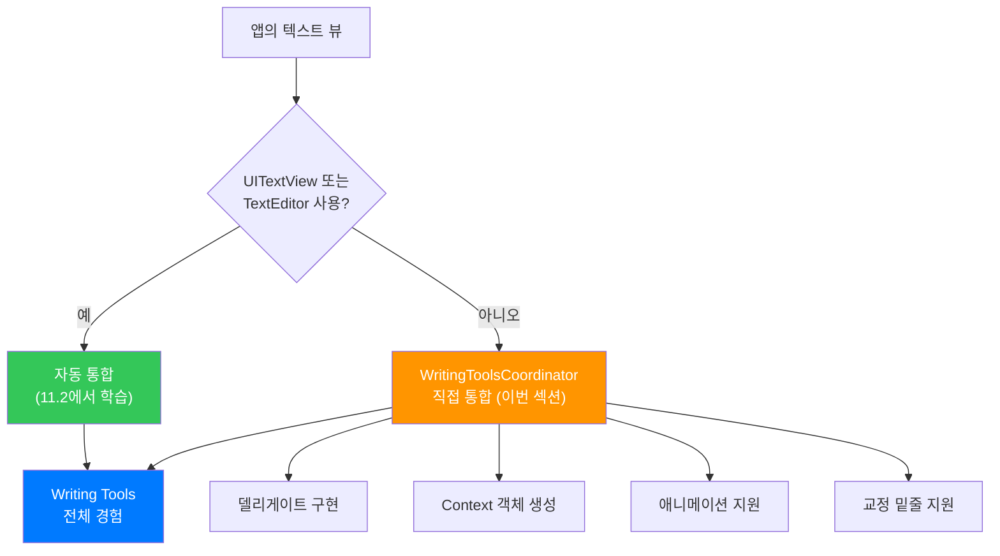
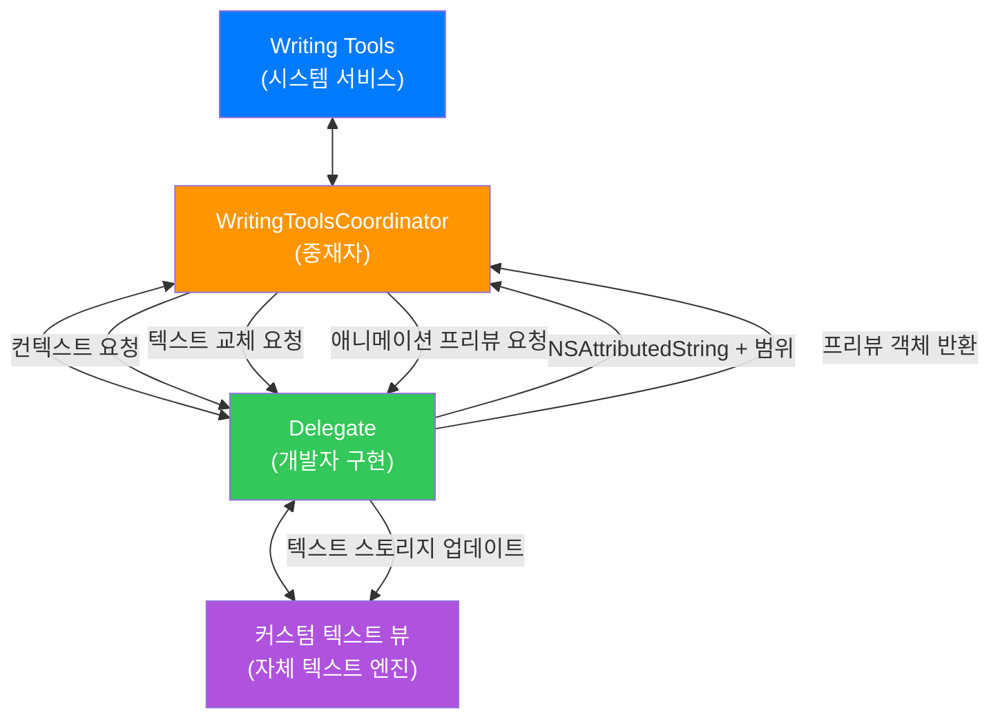
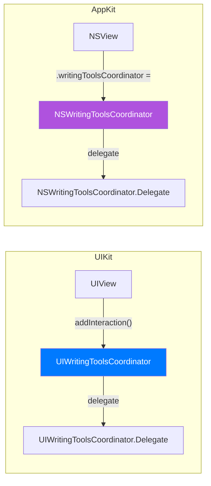
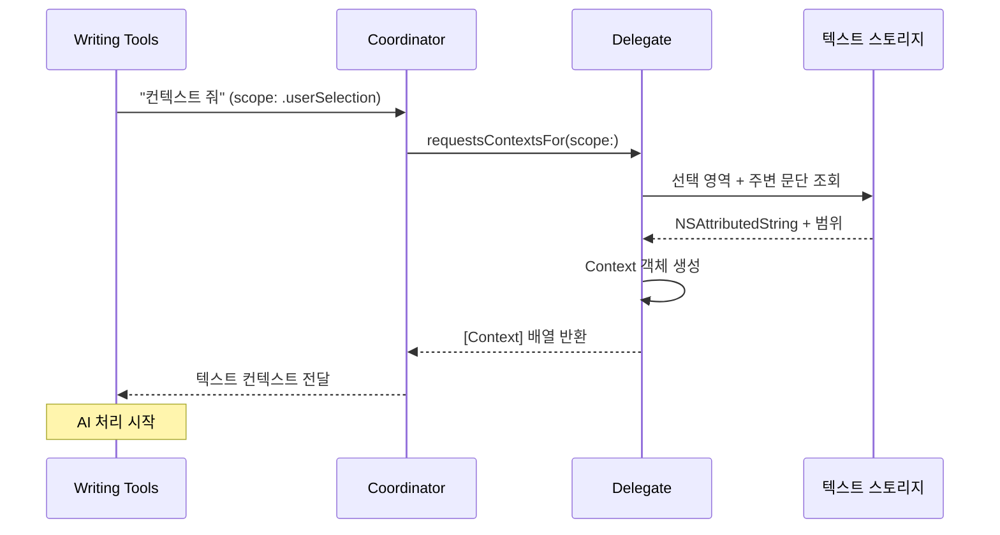
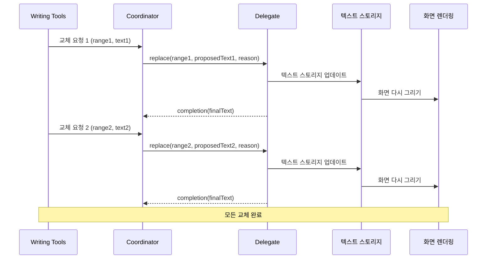
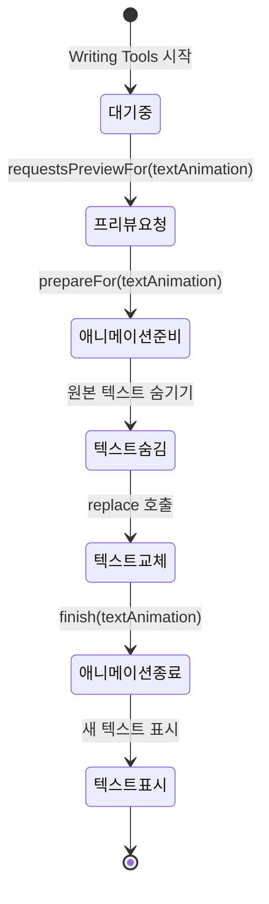
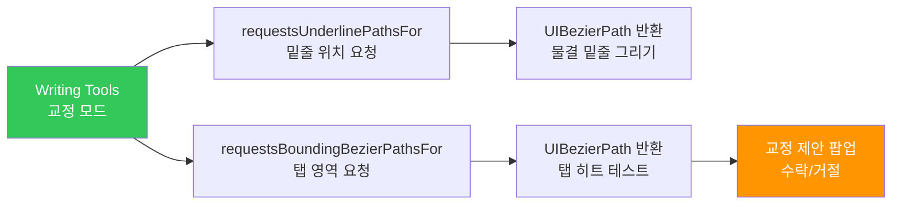

# 커스텀 에디터에서 Writing Tools 통합

> UIWritingToolsCoordinator와 NSWritingToolsCoordinator를 사용해 자체 텍스트 엔진에 Writing Tools의 전체 경험을 통합하는 방법을 배웁니다.

## 개요

이전 섹션 [02. 표준 텍스트 뷰에서 Writing Tools 활용](11-ch11-writing-tools-통합/02-02-표준-텍스트-뷰에서-writing-tools-활용.md)에서는 `UITextView`와 `TextEditor`에서 Writing Tools를 활성화하고 델리게이트로 라이프사이클을 관리하는 방법을 배웠습니다. 하지만 세상의 모든 텍스트 에디터가 UITextView를 쓰는 건 아니죠. 게임 엔진의 텍스트 입력, 자체 마크다운 렌더러, 커스텀 코드 에디터처럼 **자체 텍스트 엔진**을 사용하는 앱은 어떻게 해야 할까요?

이번 섹션에서는 WWDC25에서 새로 소개된 `WritingToolsCoordinator` API를 사용해 완전히 커스텀한 텍스트 뷰에 Writing Tools의 전체 경험 — 인라인 리라이팅, 교정 밑줄, 애니메이션까지 — 을 통합하는 방법을 다룹니다.

> 💡 **용어 정리**: `WritingToolsCoordinator`는 `UIWritingToolsCoordinator`(UIKit)와 `NSWritingToolsCoordinator`(AppKit)의 통칭입니다. 이 섹션에서 플랫폼 구분 없이 "WritingToolsCoordinator"라고 하면 두 플랫폼 모두를 가리키며, 플랫폼별 차이가 있는 경우에만 접두사를 명시합니다.

**선수 지식**: [01. Writing Tools 시스템 서비스 개요](11-ch11-writing-tools-통합/01-01-writing-tools-시스템-서비스-개요.md)의 Writing Tools 기능 범위, [02. 표준 텍스트 뷰에서 Writing Tools 활용](11-ch11-writing-tools-통합/02-02-표준-텍스트-뷰에서-writing-tools-활용.md)의 `WritingToolsBehavior`와 델리게이트 패턴, `NSAttributedString` 기초

**학습 목표**:
- `UIWritingToolsCoordinator` / `NSWritingToolsCoordinator`의 역할과 설계를 이해한다
- 코디네이터 델리게이트의 핵심 메서드 5가지를 구현한다
- Context 객체를 올바르게 생성하고 텍스트 범위를 관리한다
- 인라인 애니메이션과 교정 밑줄을 커스텀 뷰에서 지원한다

## 왜 알아야 할까?

표준 `UITextView`는 훌륭하지만, 실제 프로덕션 앱에서는 자체 텍스트 엔진을 쓰는 경우가 생각보다 많습니다. 몇 가지 예를 들어볼까요?

- **게임 엔진 기반 앱**: Unity나 Metal로 렌더링하면서 텍스트 입력을 받는 앱
- **커스텀 마크다운 에디터**: 라이브 프리뷰를 제공하는 마크다운/리치 텍스트 에디터
- **PDF 주석 도구**: 자체 텍스트 레이어에 주석을 다는 앱
- **코드 에디터**: 구문 강조를 자체 구현하는 IDE 앱

이런 앱들은 UITextView를 쓰지 않기 때문에 Writing Tools의 자동 통합이 작동하지 않습니다. WWDC25 이전에는 사실상 Writing Tools를 사용할 방법이 없었죠. `WritingToolsCoordinator`는 바로 이 문제를 해결합니다. 커스텀 텍스트 엔진에 Writing Tools의 **전체 경험** — 인라인 리라이팅 애니메이션, 교정 밑줄, 후속 요청까지 — 을 가져올 수 있게 해주는 브릿지 API입니다.

> 📊 **그림 1**: 표준 텍스트 뷰 vs 커스텀 텍스트 뷰의 Writing Tools 통합 경로



## 핵심 개념

### 개념 1: WritingToolsCoordinator의 역할과 구조

> 💡 **비유**: `WritingToolsCoordinator`는 **통역사**와 같습니다. 회의에서 한국어를 쓰는 사람(커스텀 텍스트 엔진)과 영어를 쓰는 사람(Writing Tools 시스템 서비스)이 대화해야 할 때, 통역사가 중간에서 양쪽의 말을 번역해 주죠. 코디네이터도 마찬가지로, Writing Tools가 "이 텍스트를 보여줘"라고 요청하면 커스텀 엔진의 방식으로 변환하고, 커스텀 엔진이 텍스트를 바꾸면 Writing Tools에게 알려줍니다.

`UIWritingToolsCoordinator`(UIKit)와 `NSWritingToolsCoordinator`(AppKit)는 Writing Tools 시스템 서비스와 여러분의 커스텀 텍스트 뷰 사이의 **중재자** 역할을 하는 객체입니다. 표준 텍스트 뷰에서는 시스템이 자동으로 이 중재를 처리하지만, 커스텀 뷰에서는 개발자가 직접 코디네이터를 설정하고 델리게이트를 구현해야 합니다.

> 📊 **그림 2**: WritingToolsCoordinator의 아키텍처



코디네이터를 뷰에 연결하는 방법은 플랫폼에 따라 다릅니다:

```swift
import UIKit

// UIKit — UIInteraction으로 추가
class CustomTextView: UIView {
    func configureWritingTools() {
        // 1. Writing Tools 사용 가능 여부 확인
        guard UIWritingToolsCoordinator.isWritingToolsAvailable else { return }
        
        // 2. 코디네이터 생성 (delegate는 self)
        let coordinator = UIWritingToolsCoordinator(delegate: self)
        
        // 3. UIInteraction으로 뷰에 추가
        addInteraction(coordinator)
    }
}
```

```swift
import AppKit

// AppKit — 프로퍼티에 직접 할당
class CustomTextView: NSView {
    func configureWritingTools() {
        guard NSWritingToolsCoordinator.isWritingToolsAvailable else { return }
        
        let coordinator = NSWritingToolsCoordinator(delegate: self)
        
        // 동작 모드와 결과 형식 설정
        coordinator.preferredBehavior = .complete
        coordinator.preferredResultOptions = [.richText, .list, .table]
        
        // 뷰의 writingToolsCoordinator 프로퍼티에 할당
        writingToolsCoordinator = coordinator
    }
}
```

UIKit에서는 `UIInteraction` 프로토콜을 활용하는데, 이는 드래그 앤 드롭(`UIDragInteraction`)이나 컨텍스트 메뉴(`UIContextMenuInteraction`)와 같은 패턴입니다. 뷰에 `addInteraction()`으로 붙이면 끝이죠. AppKit에서는 조금 다르게 뷰의 `writingToolsCoordinator` 프로퍼티에 직접 할당하는 방식입니다.

> 📊 **그림 3**: 플랫폼별 코디네이터 연결 방식 비교



### 개념 2: Context 객체 — Writing Tools에 텍스트 전달하기

> 💡 **비유**: 병원에 가면 의사에게 **차트(Context)**를 건네죠. 차트에는 환자의 현재 상태(선택된 텍스트), 과거 병력(앞뒤 문단의 맥락)이 담겨 있습니다. Context 객체도 마찬가지로, Writing Tools라는 의사에게 "지금 이 텍스트를 처리해 주세요"라고 전달하는 차트입니다.

델리게이트에서 가장 먼저 구현해야 할 메서드는 **컨텍스트 제공**입니다. Writing Tools가 "어떤 텍스트를 작업할까요?"라고 물으면, 델리게이트가 `Context` 객체를 만들어서 반환합니다.

> 📊 **그림 4**: Context 객체의 구성과 흐름



`Context`는 두 가지 핵심 요소로 구성됩니다:

1. **`NSAttributedString`**: 작업할 텍스트 (선택 영역 + 주변 문단)
2. **선택 범위 (`NSRange`)**: 실제로 수정할 텍스트의 범위

```swift
import UIKit

extension CustomTextView: UIWritingToolsCoordinator.Delegate {
    
    /// Writing Tools가 작업할 컨텍스트를 요청할 때 호출
    func writingToolsCoordinator(
        _ coordinator: UIWritingToolsCoordinator,
        requestsContextsFor scope: UIWritingToolsCoordinator.ContextScope,
        completion: @escaping ([UIWritingToolsCoordinator.Context]) -> Void
    ) {
        var contexts = [UIWritingToolsCoordinator.Context]()
        
        switch scope {
        case .userSelection:
            // 사용자가 선택한 텍스트로 컨텍스트 생성
            let context = createContextForSelection()
            contexts.append(context)
            
        case .fullDocument:
            // 전체 문서로 컨텍스트 생성
            let context = createContextForFullDocument()
            contexts.append(context)
            
        @unknown default:
            break
        }
        
        // 나중에 참조할 수 있도록 저장
        storedContexts = contexts
        completion(contexts)
    }
    
    /// 선택 영역 기반 Context 생성
    private func createContextForSelection() -> UIWritingToolsCoordinator.Context {
        // 선택 범위의 텍스트 가져오기
        let selectedText = textStorage.attributedSubstring(from: selectedRange)
        
        // 주변 문단도 포함하면 Writing Tools가 더 나은 결과를 만듦
        let expandedRange = expandToParagraphBoundaries(selectedRange)
        let contextText = textStorage.attributedSubstring(from: expandedRange)
        
        // 확장된 범위 내에서의 상대적 선택 위치 계산
        let relativeSelection = NSRange(
            location: selectedRange.location - expandedRange.location,
            length: selectedRange.length
        )
        
        return UIWritingToolsCoordinator.Context(
            attributedString: contextText,
            range: relativeSelection
        )
    }
}
```

> ⚠️ **흔한 오해**: "Context에는 선택된 텍스트만 넣으면 된다" — 사실 **주변 문단을 함께 포함**하면 Writing Tools가 문맥을 더 잘 이해합니다. 예를 들어 "그것은 좋은 방법이다"라는 문장만 주면 "그것"이 무엇인지 모르지만, 앞 문단을 포함하면 대명사의 맥락을 파악해서 더 정확한 리라이팅을 할 수 있습니다.

**중요한 규칙**: Context 객체가 반환하는 범위(range)는 모두 **Context의 attributedString에 대한 상대적 위치**입니다. 전체 문서에서의 위치가 아닙니다! 따라서 Writing Tools가 돌려주는 범위를 텍스트 스토리지에 적용할 때는 반드시 오프셋 변환을 해야 합니다.

### 개념 3: 텍스트 교체 처리 — replace 델리게이트

> 💡 **비유**: 편집자가 원고를 검토하면서 "이 문단을 이렇게 바꾸세요"라고 포스트잇을 붙이는 것처럼, Writing Tools는 `replace` 메서드를 통해 "이 범위를 이 텍스트로 바꿔주세요"라고 요청합니다. 한 번에 모든 수정을 보내는 게 아니라, **각 수정 사항마다 개별적으로** 요청합니다.

Writing Tools가 텍스트를 처리하고 나면, 결과를 적용하기 위해 `replace` 델리게이트 메서드를 호출합니다. 이 메서드는 **수정 사항마다 개별적으로** 호출될 수 있으므로, 같은 컨텍스트에서 여러 번 호출될 수 있다는 점을 기억하세요.

> 📊 **그림 5**: 텍스트 교체 과정의 전체 흐름



```swift
extension CustomTextView: UIWritingToolsCoordinator.Delegate {
    
    /// Writing Tools가 텍스트 교체를 요청할 때 호출
    func writingToolsCoordinator(
        _ coordinator: UIWritingToolsCoordinator,
        replace range: NSRange,
        in context: UIWritingToolsCoordinator.Context,
        proposedText replacementText: NSAttributedString,
        reason: UIWritingToolsCoordinator.TextReplacementReason,
        animationParameters: UIWritingToolsCoordinator.AnimationParameters?,
        completion: @escaping (NSAttributedString?) -> Void
    ) {
        // Context 범위를 전체 문서 범위로 변환
        let documentRange = convertToDocumentRange(range, in: context)
        
        // Undo 지원을 위해 기존 텍스트 저장
        let previousText = textStorage.attributedSubstring(from: documentRange)
        undoManager?.registerUndo(withTarget: self) { target in
            target.textStorage.replaceCharacters(
                in: NSRange(location: documentRange.location, 
                           length: replacementText.length),
                with: previousText
            )
        }
        
        // 텍스트 스토리지 업데이트
        textStorage.replaceCharacters(in: documentRange, with: replacementText)
        
        // 레이아웃 재계산 및 화면 갱신
        setNeedsLayout()
        setNeedsDisplay()
        
        // 최종 적용된 텍스트를 반환 (nil이면 proposedText 그대로 사용됨)
        completion(nil)
    }
    
    /// Context 내부 범위 → 전체 문서 범위로 변환
    private func convertToDocumentRange(
        _ range: NSRange,
        in context: UIWritingToolsCoordinator.Context
    ) -> NSRange {
        // storedContexts에서 이 context의 문서 내 시작 위치를 찾아 오프셋 더하기
        guard let offset = contextDocumentOffsets[context] else {
            return range
        }
        return NSRange(location: range.location + offset, length: range.length)
    }
}
```

`reason` 파라미터는 왜 텍스트가 교체되는지를 알려줍니다. 사용자가 Writing Tools의 제안을 수락한 것인지, 원본으로 되돌리는 것인지 구분할 수 있어 Undo/Redo 로직에 유용합니다.

### 개념 4: 애니메이션과 프리뷰 지원

Writing Tools의 `.complete` 모드에서는 텍스트가 교체될 때 매끄러운 애니메이션이 표시됩니다. 원본 텍스트가 사라지면서 새 텍스트가 나타나는 이 애니메이션을 커스텀 뷰에서도 지원하려면, **프리뷰 객체**를 제공해야 합니다.

> 📊 **그림 6**: 애니메이션 라이프사이클



```swift
extension CustomTextView: UIWritingToolsCoordinator.Delegate {
    
    /// 애니메이션 프리뷰 요청 — 텍스트의 스냅샷 이미지 반환
    func writingToolsCoordinator(
        _ coordinator: UIWritingToolsCoordinator,
        requestsPreviewFor textAnimation: UIWritingToolsCoordinator.TextAnimation,
        of range: NSRange,
        in context: UIWritingToolsCoordinator.Context,
        completion: @escaping (UITargetedPreview?) -> Void
    ) {
        let documentRange = convertToDocumentRange(range, in: context)
        
        // 텍스트 범위의 화면 좌표 계산
        guard let textRect = boundingRect(for: documentRange) else {
            completion(nil)
            return
        }
        
        // 투명 배경의 스냅샷 이미지 생성
        let renderer = UIGraphicsImageRenderer(bounds: textRect)
        let snapshot = renderer.image { rendererContext in
            // 해당 범위의 텍스트만 렌더링 (투명 배경)
            renderText(in: documentRange, to: rendererContext.cgContext)
        }
        
        // UITargetedPreview 생성
        let imageView = UIImageView(image: snapshot)
        imageView.frame = textRect
        let target = UIPreviewTarget(container: self, center: textRect.center)
        let parameters = UIPreviewParameters()
        parameters.backgroundColor = .clear
        
        let preview = UITargetedPreview(
            view: imageView,
            parameters: parameters,
            target: target
        )
        completion(preview)
    }
    
    /// 애니메이션 시작 전 — 원본 텍스트 숨기기
    func writingToolsCoordinator(
        _ coordinator: UIWritingToolsCoordinator,
        prepareFor textAnimation: UIWritingToolsCoordinator.TextAnimation,
        for range: NSRange,
        in context: UIWritingToolsCoordinator.Context,
        completion: @escaping () -> Void
    ) {
        let documentRange = convertToDocumentRange(range, in: context)
        // 해당 범위의 텍스트를 투명하게 만들어 숨김
        hiddenRanges.insert(documentRange)
        setNeedsDisplay()
        completion()
    }
    
    /// 애니메이션 종료 — 텍스트 다시 표시
    func writingToolsCoordinator(
        _ coordinator: UIWritingToolsCoordinator,
        finish textAnimation: UIWritingToolsCoordinator.TextAnimation,
        for range: NSRange,
        in context: UIWritingToolsCoordinator.Context,
        completion: @escaping () -> Void
    ) {
        let documentRange = convertToDocumentRange(range, in: context)
        // 숨김 해제
        hiddenRanges.remove(documentRange)
        setNeedsDisplay()
        completion()
    }
}
```

프리뷰를 제공하면 Writing Tools는 원본 텍스트 프리뷰를 페이드 아웃하면서 동시에 새 텍스트를 페이드 인하는 매끄러운 트랜지션 애니메이션을 보여줍니다. 더 세밀한 애니메이션을 원한다면 **줄 단위 프리뷰**를 반환할 수 있습니다 — 전체 범위에 대해 하나의 프리뷰 대신, 각 줄마다 별도의 프리뷰를 반환하면 텍스트가 줄 단위로 매끄럽게 전환됩니다.

### 개념 5: 교정 밑줄과 상태 관리

Writing Tools의 교정(Proofread) 기능은 수정된 부분에 물결 모양 밑줄을 표시합니다. 커스텀 뷰에서 이를 지원하려면 밑줄 경로와 바운딩 경로를 제공해야 합니다.

> 📊 **그림 7**: 교정 밑줄 렌더링 흐름



```swift
extension CustomTextView: UIWritingToolsCoordinator.Delegate {
    
    /// 교정 밑줄 경로 제공 — 텍스트 아래에 물결 밑줄 표시
    func writingToolsCoordinator(
        _ coordinator: UIWritingToolsCoordinator,
        requestsUnderlinePathsFor range: NSRange,
        in context: UIWritingToolsCoordinator.Context,
        completion: @escaping ([UIBezierPath]) -> Void
    ) {
        let documentRange = convertToDocumentRange(range, in: context)
        var paths = [UIBezierPath]()
        
        // 각 줄의 하단에 밑줄 경로 생성
        enumerateLineRects(in: documentRange) { lineRect in
            let underlinePath = UIBezierPath()
            let y = lineRect.maxY + 2  // 텍스트 아래 2pt
            underlinePath.move(to: CGPoint(x: lineRect.minX, y: y))
            underlinePath.addLine(to: CGPoint(x: lineRect.maxX, y: y))
            paths.append(underlinePath)
        }
        
        completion(paths)
    }
    
    /// 바운딩 경로 제공 — 사용자 탭 시 교정 제안 팝업 표시
    func writingToolsCoordinator(
        _ coordinator: UIWritingToolsCoordinator,
        requestsBoundingBezierPathsFor range: NSRange,
        in context: UIWritingToolsCoordinator.Context,
        completion: @escaping ([UIBezierPath]) -> Void
    ) {
        let documentRange = convertToDocumentRange(range, in: context)
        var paths = [UIBezierPath]()
        
        // 각 줄의 바운딩 박스를 경로로 변환
        enumerateLineRects(in: documentRange) { lineRect in
            let boundingPath = UIBezierPath(
                roundedRect: lineRect.insetBy(dx: -2, dy: -2),
                cornerRadius: 4
            )
            paths.append(boundingPath)
        }
        
        completion(paths)
    }
    
    /// 상태 변화 알림 — Undo 코얼레싱, 동기화 중단 등
    func writingToolsCoordinator(
        _ coordinator: UIWritingToolsCoordinator,
        willChangeToState state: UIWritingToolsCoordinator.State,
        completion: @escaping () -> Void
    ) {
        switch state {
        case .interacting:
            // Writing Tools UI가 표시됨 — 편집 잠금
            isUserEditingEnabled = false
            undoManager?.beginUndoGrouping()
            
        case .none:
            // Writing Tools 종료 — 편집 해제
            isUserEditingEnabled = true
            undoManager?.endUndoGrouping()
            
        @unknown default:
            break
        }
        
        completion()
    }
}
```

`willChangeToState`는 선택 사항이지만 매우 유용합니다. Writing Tools가 활성화되면 사용자의 직접 편집을 잠그고, Undo 그룹을 시작하여 Writing Tools의 모든 변경을 한 번에 되돌릴 수 있게 합니다.

## 실습: 직접 해보기

커스텀 텍스트 뷰에 `UIWritingToolsCoordinator`를 통합하는 완전한 예제를 만들어 보겠습니다. 간단한 `NSAttributedString` 기반 텍스트 렌더링 뷰에 Writing Tools의 전체 경험을 추가합니다.

```swift
import UIKit

// MARK: - 커스텀 텍스트 뷰 (자체 렌더링 엔진)

/// NSAttributedString을 직접 렌더링하는 커스텀 텍스트 뷰
class SimpleCustomTextView: UIView, UITextInput {
    
    // 텍스트 스토리지
    var textStorage = NSMutableAttributedString(
        string: "이것은 커스텀 텍스트 뷰입니다. Writing Tools가 이 텍스트를 교정하고 리라이팅할 수 있습니다. 자체 렌더링 엔진을 사용하는 앱에서도 Apple Intelligence의 글쓰기 도우미를 활용할 수 있죠.",
        attributes: [
            .font: UIFont.preferredFont(forTextStyle: .body),
            .foregroundColor: UIColor.label
        ]
    )
    
    // 현재 선택 범위
    var selectedRange = NSRange(location: 0, length: 0)
    
    // 애니메이션 중 숨길 범위
    private var hiddenRanges = Set<NSRange>()
    
    // Context의 문서 내 오프셋 매핑
    private var contextDocumentOffsets = 
        [ObjectIdentifier: Int]()
    
    // Writing Tools 코디네이터 참조
    private var writingToolsCoord: UIWritingToolsCoordinator?
    
    // 저장된 컨텍스트
    private var storedContexts = [UIWritingToolsCoordinator.Context]()
    
    // 사용자 편집 가능 여부
    var isUserEditingEnabled = true
    
    // MARK: - 초기화
    
    override init(frame: CGRect) {
        super.init(frame: frame)
        setupView()
    }
    
    required init?(coder: NSCoder) {
        super.init(coder: coder)
        setupView()
    }
    
    private func setupView() {
        backgroundColor = .systemBackground
        isUserInteractionEnabled = true
        
        // Writing Tools 코디네이터 설정
        configureWritingTools()
    }
    
    /// Writing Tools 코디네이터 생성 및 뷰에 연결
    func configureWritingTools() {
        // 가용성 확인
        guard UIWritingToolsCoordinator.isWritingToolsAvailable else {
            print("Writing Tools를 사용할 수 없는 기기입니다")
            return
        }
        
        // 코디네이터 생성
        let coordinator = UIWritingToolsCoordinator(delegate: self)
        writingToolsCoord = coordinator
        
        // UIInteraction으로 뷰에 추가
        addInteraction(coordinator)
        
        print("Writing Tools 코디네이터가 연결되었습니다")
    }
    
    // MARK: - 텍스트 렌더링
    
    override func draw(_ rect: CGRect) {
        super.draw(rect)
        
        guard let context = UIGraphicsGetCurrentContext() else { return }
        
        // NSAttributedString을 직접 렌더링
        let drawRect = bounds.insetBy(dx: 16, dy: 16)
        textStorage.draw(in: drawRect)
    }
    
    // MARK: - 유틸리티
    
    /// 지정 범위를 포함하는 문단 경계로 확장
    func expandToParagraphBoundaries(_ range: NSRange) -> NSRange {
        let string = textStorage.string as NSString
        return string.paragraphRange(for: range)
    }
    
    /// 범위에 해당하는 화면 좌표 반환
    func boundingRect(for range: NSRange) -> CGRect? {
        // 간단한 구현 — 실제 앱에서는 텍스트 레이아웃 매니저 사용
        let drawRect = bounds.insetBy(dx: 16, dy: 16)
        return drawRect  // 단순화
    }
    
    /// 줄 단위 사각형 열거
    func enumerateLineRects(
        in range: NSRange,
        block: (CGRect) -> Void
    ) {
        // 텍스트 레이아웃 엔진에서 줄 단위 좌표 계산
        let drawRect = bounds.insetBy(dx: 16, dy: 16)
        block(drawRect)  // 단순화
    }
}

// MARK: - WritingToolsCoordinator Delegate 구현

extension SimpleCustomTextView: UIWritingToolsCoordinator.Delegate {
    
    // 1) 컨텍스트 제공
    func writingToolsCoordinator(
        _ coordinator: UIWritingToolsCoordinator,
        requestsContextsFor scope: UIWritingToolsCoordinator.ContextScope,
        completion: @escaping ([UIWritingToolsCoordinator.Context]) -> Void
    ) {
        let attributedString: NSAttributedString
        let range: NSRange
        
        switch scope {
        case .userSelection where selectedRange.length > 0:
            // 선택된 텍스트 + 주변 문단
            let expanded = expandToParagraphBoundaries(selectedRange)
            attributedString = textStorage.attributedSubstring(from: expanded)
            range = NSRange(
                location: selectedRange.location - expanded.location,
                length: selectedRange.length
            )
            
        default:
            // 전체 문서
            attributedString = NSAttributedString(attributedString: textStorage)
            range = NSRange(location: 0, length: textStorage.length)
        }
        
        let context = UIWritingToolsCoordinator.Context(
            attributedString: attributedString,
            range: range
        )
        
        storedContexts = [context]
        completion([context])
    }
    
    // 2) 텍스트 교체
    func writingToolsCoordinator(
        _ coordinator: UIWritingToolsCoordinator,
        replace range: NSRange,
        in context: UIWritingToolsCoordinator.Context,
        proposedText replacementText: NSAttributedString,
        reason: UIWritingToolsCoordinator.TextReplacementReason,
        animationParameters: UIWritingToolsCoordinator.AnimationParameters?,
        completion: @escaping (NSAttributedString?) -> Void
    ) {
        // 텍스트 스토리지에 변경 적용
        textStorage.replaceCharacters(in: range, with: replacementText)
        
        // 화면 갱신
        setNeedsDisplay()
        
        // nil 반환 = proposedText를 그대로 최종 텍스트로 사용
        completion(nil)
    }
    
    // 3) 선택 범위 업데이트
    func writingToolsCoordinator(
        _ coordinator: UIWritingToolsCoordinator,
        select ranges: [NSValue],
        in context: UIWritingToolsCoordinator.Context,
        completion: @escaping () -> Void
    ) {
        // 첫 번째 범위로 선택 업데이트
        if let firstRange = ranges.first?.rangeValue {
            selectedRange = firstRange
            setNeedsDisplay()
        }
        completion()
    }
    
    // 4) 상태 변화 대응
    func writingToolsCoordinator(
        _ coordinator: UIWritingToolsCoordinator,
        willChangeToState state: UIWritingToolsCoordinator.State,
        completion: @escaping () -> Void
    ) {
        switch state {
        case .interacting:
            isUserEditingEnabled = false
        case .none:
            isUserEditingEnabled = true
        @unknown default:
            break
        }
        completion()
    }
}
```

```swift
import SwiftUI

// MARK: - SwiftUI에서 커스텀 텍스트 뷰 사용

/// UIViewRepresentable로 커스텀 텍스트 뷰를 SwiftUI에 통합
struct CustomTextEditorView: UIViewRepresentable {
    func makeUIView(context: Context) -> SimpleCustomTextView {
        let view = SimpleCustomTextView(frame: .zero)
        return view
    }
    
    func updateUIView(_ uiView: SimpleCustomTextView, context: Context) {
        // 필요 시 업데이트
    }
}

/// 메인 화면
struct CustomEditorDemoView: View {
    var body: some View {
        NavigationStack {
            VStack(spacing: 16) {
                Text("커스텀 텍스트 엔진 + Writing Tools")
                    .font(.headline)
                
                Text("아래 텍스트를 선택한 후 Writing Tools를 실행해 보세요")
                    .font(.caption)
                    .foregroundStyle(.secondary)
                
                CustomTextEditorView()
                    .frame(height: 300)
                    .clipShape(RoundedRectangle(cornerRadius: 12))
                    .overlay(
                        RoundedRectangle(cornerRadius: 12)
                            .stroke(Color.gray.opacity(0.3))
                    )
                    .padding(.horizontal)
                
                Spacer()
            }
            .navigationTitle("커스텀 에디터 데모")
        }
    }
}
```

**실행 방법**:
1. Xcode 26에서 iOS 26 타겟의 프로젝트를 생성합니다
2. `SimpleCustomTextView`와 `CustomEditorDemoView`를 추가합니다
3. Apple Intelligence가 활성화된 기기에서 빌드/실행합니다
4. 텍스트를 선택하고 컨텍스트 메뉴에서 Writing Tools를 실행합니다

> 🔥 **실무 팁**: 실제 프로덕션 앱에서는 `UITextInput` 프로토콜을 완전히 구현해야 합니다. 위 예제는 핵심 흐름을 보여주기 위해 단순화한 것이므로, 실제로는 `insertText(_:)`, `deleteBackward()`, `selectedTextRange` 등의 메서드도 구현해야 텍스트 선택과 입력이 정상 동작합니다.

## 더 깊이 알아보기

### WritingToolsCoordinator의 탄생 — "모든 텍스트 앱을 위한 AI"

WritingToolsCoordinator가 등장한 배경에는 흥미로운 이야기가 있습니다. WWDC24에서 Writing Tools가 처음 공개되었을 때, 개발자 커뮤니티에서 가장 많이 나온 피드백이 "우리 앱은 UITextView를 안 쓰는데요?"였습니다. PDF 편집 앱, 게임 엔진 기반 앱, 크로스 플랫폼 프레임워크(Flutter, React Native) 등 자체 텍스트 렌더링을 사용하는 앱은 Writing Tools의 혜택을 전혀 받을 수 없었죠.

Apple은 이 피드백을 반영해 1년간 개발한 결과물이 바로 `WritingToolsCoordinator`입니다. WWDC25의 "Dive deeper into Writing Tools" 세션에서 처음 소개되었는데, 발표자가 강조한 핵심 메시지는 "어떤 텍스트 엔진을 쓰든, Writing Tools의 **전체 경험**을 제공할 수 있다"였습니다. 단순히 텍스트를 바꿔주는 것이 아니라, 인라인 애니메이션, 교정 밑줄, 후속 요청까지 포함한 완전한 경험을 말하는 것이죠.

이 설계 방식은 Apple의 다른 시스템 서비스 통합 패턴과 일치합니다. 드래그 앤 드롭(`UIDragInteraction`), 컨텍스트 메뉴(`UIContextMenuInteraction`), 포인터 효과(`UIPointerInteraction`)와 같이, `UIInteraction` 프로토콜을 통해 뷰에 "능력"을 추가하는 패턴이죠. WritingToolsCoordinator도 이 철학을 따라 `addInteraction()`으로 뷰에 붙이는 방식을 채택했습니다.

### 비동기 델리게이트 설계의 이유

WritingToolsCoordinator의 모든 델리게이트 메서드가 `completion` 핸들러를 사용하는 비동기 방식인 점도 주목할 만합니다. 이는 단순히 "모던한 API 설계"가 아니라, **대용량 텍스트 처리**를 염두에 둔 실용적인 결정입니다. 수십만 글자의 문서에서 컨텍스트를 만들거나 프리뷰를 렌더링하는 작업은 시간이 걸릴 수 있으므로, 동기 반환으로는 메인 스레드를 차단할 위험이 있습니다. 비동기 completion 패턴 덕분에 백그라운드에서 처리하고 준비가 되면 반환할 수 있습니다.

## 흔한 오해와 팁

> ⚠️ **흔한 오해**: "WritingToolsCoordinator만 추가하면 Writing Tools가 바로 동작한다" — 코디네이터를 뷰에 추가하는 것은 시작일 뿐입니다. 최소한 `requestsContextsFor`(컨텍스트 제공)와 `replace`(텍스트 교체) 델리게이트를 구현해야 기본적인 동작이 가능합니다. 애니메이션과 교정 밑줄까지 지원하려면 프리뷰와 경로 관련 메서드도 구현해야 합니다.

> 💡 **알고 계셨나요?**: `WritingToolsCoordinator`는 **복수 컨텍스트**를 지원합니다. 이메일 앱처럼 제목 필드와 본문 필드가 별도의 텍스트 스토리지를 사용하는 경우, `requestsContextsFor`에서 여러 개의 Context를 배열로 반환할 수 있습니다. Writing Tools는 각 컨텍스트를 독립적으로 처리합니다.

> 🔥 **실무 팁**: 텍스트 레이아웃이 외부 요인(화면 회전, 폰트 크기 변경 등)으로 변경되면 반드시 `coordinator.updateForReflowedText()`를 호출하세요. 이 메서드는 Writing Tools에 레이아웃이 변경되었음을 알려서, 교정 밑줄과 애니메이션 프리뷰를 새 위치에 맞게 다시 요청하게 합니다. 호출하지 않으면 밑줄이 엉뚱한 위치에 표시됩니다.

> 🔥 **실무 팁**: 사용자가 Writing Tools 외부에서 텍스트를 변경한 경우(예: 실시간 협업 기능으로 다른 사용자가 텍스트를 수정), `coordinator.updateRange(_:withText:)`를 호출하여 코디네이터에 변경 사항을 알려야 합니다. 그래야 Writing Tools가 올바른 범위에서 작업을 계속할 수 있습니다.

## 핵심 정리

| 개념 | 설명 |
|------|------|
| `WritingToolsCoordinator` | `UIWritingToolsCoordinator`(UIKit)와 `NSWritingToolsCoordinator`(AppKit)의 통칭. 커스텀 텍스트 뷰와 Writing Tools 사이의 중재자 |
| `UIWritingToolsCoordinator` | UIKit에서 커스텀 뷰에 Writing Tools를 통합하는 코디네이터. `UIInteraction`으로 뷰에 추가 |
| `NSWritingToolsCoordinator` | AppKit 버전. `writingToolsCoordinator` 프로퍼티에 할당 |
| `isWritingToolsAvailable` | 코디네이터의 정적 프로퍼티. 현재 기기에서 Writing Tools 사용 가능 여부 확인 |
| `Context` | `NSAttributedString` + 선택 범위로 구성. Writing Tools에 작업 대상 텍스트 전달 |
| `requestsContextsFor` | 델리게이트 핵심 메서드 1 — 컨텍스트 제공 |
| `replace` | 델리게이트 핵심 메서드 2 — 텍스트 교체 처리 |
| `requestsPreviewFor` | 선택 메서드 — 애니메이션용 프리뷰 제공 |
| `prepareFor` / `finish` | 선택 메서드 — 애니메이션 전후 텍스트 숨기기/표시 |
| `requestsUnderlinePathsFor` | 선택 메서드 — 교정 밑줄 경로 제공 |
| `willChangeToState` | 선택 메서드 — 상태 변화에 따른 편집 잠금, Undo 그룹 관리 |
| `updateForReflowedText()` | 레이아웃 변경 시 코디네이터에 알림 |
| `updateRange(_:withText:)` | 외부 텍스트 변경 시 코디네이터에 알림 |

## 다음 섹션 미리보기

지금까지 Writing Tools의 개념(11.1), 표준 뷰 활용(11.2), 커스텀 에디터 통합(11.3)을 배웠습니다. 다음 섹션 [04. 실습: AI 강화 메모 앱](11-ch11-writing-tools-통합/04-04-실습-ai-강화-메모-앱.md)에서는 이 모든 것을 종합하여 Foundation Models 프레임워크와 Writing Tools를 결합한 완전한 메모 앱을 만듭니다. 사용자가 직접 작성한 텍스트를 Writing Tools로 교정하고, Foundation Models로 요약이나 태그를 자동 생성하는 실전 프로젝트입니다.

## 참고 자료

- [Dive deeper into Writing Tools — WWDC25](https://developer.apple.com/videos/play/wwdc2025/265/) - WritingToolsCoordinator API를 최초 소개한 공식 세션. 델리게이트 구현, 애니메이션, 교정 밑줄을 단계별로 설명
- [UIWritingToolsCoordinator — Apple Developer Documentation](https://developer.apple.com/documentation/uikit/uiwritingtoolscoordinator) - UIKit WritingToolsCoordinator 공식 API 레퍼런스
- [NSWritingToolsCoordinator — Apple Developer Documentation](https://developer.apple.com/documentation/appkit/nswritingtoolscoordinator) - AppKit WritingToolsCoordinator 공식 API 레퍼런스
- [Adding Writing Tools support to a custom UIKit view — Apple Developer](https://developer.apple.com/documentation/uikit/adding-writing-tools-support-to-a-custom-uiview) - 커스텀 UIKit 뷰에 Writing Tools를 추가하는 공식 가이드
- [Enhancing your custom text engine with Writing Tools — Apple Developer](https://developer.apple.com/documentation/appkit/enhancing-your-custom-text-engine-with-writing-tools) - AppKit 커스텀 텍스트 엔진용 통합 가이드
- [Get started with Writing Tools — WWDC24](https://developer.apple.com/videos/play/wwdc2024/10168/) - Writing Tools의 기초 개념과 표준 텍스트 뷰 통합을 다루는 세션

---
### 🔗 Related Sessions
- [writingtoolsbehavior](11-ch11-writing-tools-통합/01-01-writing-tools-시스템-서비스-개요.md) (prerequisite)
- [writing tools](01-ch1-apple-intelligence와-온디바이스-ai/01-01-apple-intelligence-개요.md) (prerequisite)
