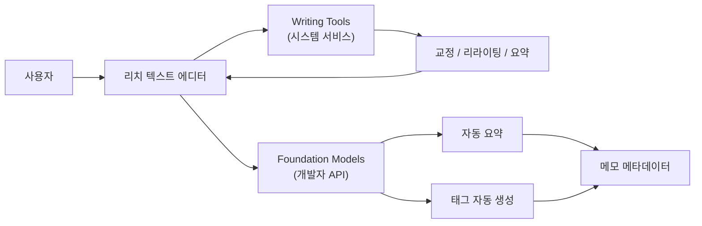
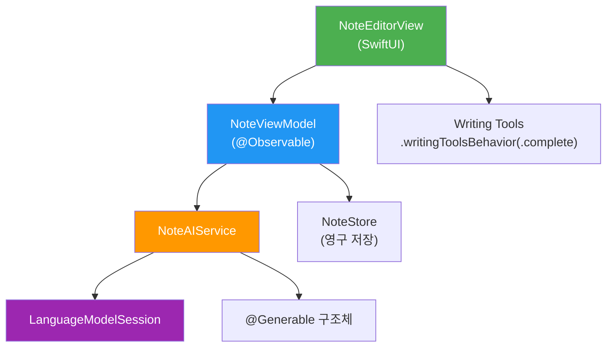
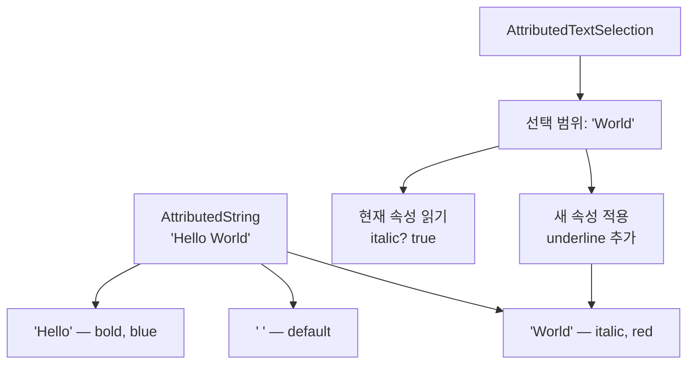
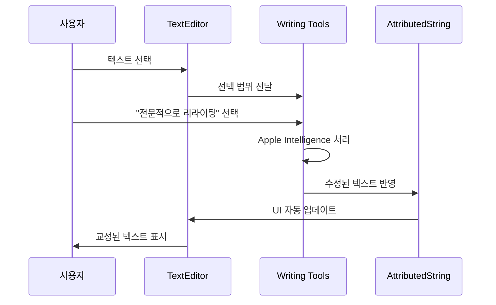
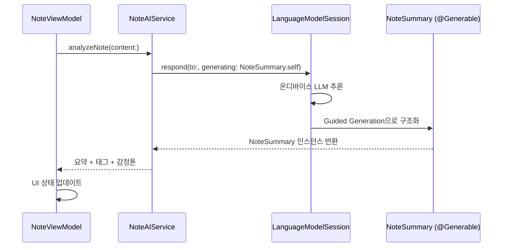
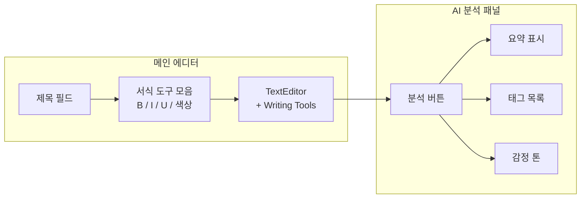

# 04. 실습: AI 강화 메모 앱

> Writing Tools와 Foundation Models를 결합한 리치 텍스트 메모 앱을 처음부터 끝까지 구현합니다.

## 개요

이 섹션에서는 Ch11 전체에서 배운 Writing Tools 통합 기술과 Foundation Models 프레임워크를 결합하여, 실제로 동작하는 **AI 강화 메모 앱**을 구현합니다. 시스템이 제공하는 교정·리라이팅 기능 위에, 온디바이스 LLM으로 자동 요약과 태그 생성까지 추가하는 것이 목표입니다.

**선수 지식**: 
- [Writing Tools 시스템 서비스 개요](11-ch11-writing-tools-통합/01-01-writing-tools-시스템-서비스-개요.md)에서 배운 WritingToolsBehavior 설정
- [표준 텍스트 뷰에서 Writing Tools 활용](11-ch11-writing-tools-통합/02-02-표준-텍스트-뷰에서-writing-tools-활용.md)에서 배운 델리게이트 콜백
- [커스텀 에디터에서 Writing Tools 통합](11-ch11-writing-tools-통합/03-03-커스텀-에디터에서-writing-tools-통합.md)에서 배운 WritingToolsCoordinator (고급 커스텀 통합 패턴)
- [Foundation Models 프레임워크 기초](03-ch3-foundation-models-프레임워크-시작하기/01-01-systemlanguagemodel-이해하기.md) 및 [@Generable 구조화 출력](05-ch5-generable-구조화-출력/01-01-guided-generation-개념과-동작-원리.md)

**학습 목표**:
- iOS 26의 리치 텍스트 TextEditor와 AttributedString을 활용한 메모 앱 UI 구현
- Writing Tools(.complete 모드)를 통합하여 시스템 교정/리라이팅 기능 연동
- Foundation Models의 @Generable로 메모 자동 요약 및 태그 생성 구현
- MVVM 아키텍처로 AI 서비스 레이어와 UI를 분리하는 실전 패턴 습득

## 왜 알아야 할까?

메모 앱은 전 세계적으로 가장 많이 사용되는 생산성 도구 중 하나입니다. Apple의 Notes 앱만 해도 수억 명이 매일 사용하죠. 그런데 "메모를 작성하는 것"과 "메모를 정리하는 것"은 완전히 다른 작업입니다. 대부분의 사용자가 메모를 적은 뒤 분류하거나 요약하지 않고 그대로 방치하거든요.

여기서 AI가 빛을 발합니다. Writing Tools가 문장을 다듬어주고, Foundation Models가 내용을 자동으로 요약하고 태그를 붙여준다면? 사용자는 **적기만 하면 되는** 메모 앱을 갖게 됩니다. 이 프로젝트는 Apple Intelligence의 두 축 — 시스템 서비스(Writing Tools)와 개발자 프레임워크(Foundation Models) — 을 하나의 앱에서 결합하는 실전 경험을 제공합니다.

> 📊 **그림 1**: AI 강화 메모 앱의 두 가지 AI 축



## 핵심 개념

### 개념 1: 앱 아키텍처 설계

> 💡 **비유**: 레스토랑을 떠올려보세요. 홀(UI)에서 손님이 주문하면, 주방(Service 레이어)에서 요리사 두 명이 일합니다. 한 명은 기본 양념 담당(Writing Tools — 시스템이 알아서 처리), 다른 한 명은 특별 소스 담당(Foundation Models — 개발자가 직접 레시피 작성). 이 둘이 협력해서 완성된 요리가 다시 홀로 나갑니다.

이 프로젝트의 아키텍처는 MVVM 패턴을 기반으로, AI 기능을 별도의 서비스 레이어로 분리합니다. Writing Tools는 SwiftUI TextEditor에 자동 통합되므로 뷰 레벨에서 설정만 하면 되고, Foundation Models 호출은 `NoteAIService`라는 전용 클래스가 담당합니다.

> 📊 **그림 2**: MVVM + AI 서비스 레이어 아키텍처



핵심 컴포넌트는 다음과 같습니다:

| 컴포넌트 | 역할 | 파일 |
|----------|------|------|
| `NoteEditorView` | 리치 텍스트 편집 + Writing Tools 설정 | Views/ |
| `NoteViewModel` | 메모 상태 관리 + AI 요청 조율 | ViewModels/ |
| `NoteAIService` | Foundation Models 호출 래퍼 | Services/ |
| `NoteSummary` | @Generable 구조화 출력 모델 | Models/ |
| `Note` | 메모 데이터 모델 | Models/ |

#### 표준 통합 vs 커스텀 통합: 어떤 방식을 선택할까?

이 프로젝트에서는 `.writingToolsBehavior(.complete)` — 즉 **표준 통합 방식**을 사용합니다. [이전 섹션](11-ch11-writing-tools-통합/03-03-커스텀-에디터에서-writing-tools-통합.md)에서 배운 `WritingToolsCoordinator`는 강력하지만, SwiftUI `TextEditor`를 사용하는 이 프로젝트에서는 **필요하지 않습니다**. 그 이유를 정리하면:

| 기준 | 표준 통합 (`.complete`) | 커스텀 통합 (`WritingToolsCoordinator`) |
|------|----------------------|--------------------------------------|
| 적합한 에디터 | SwiftUI TextEditor, UITextView | 자체 텍스트 엔진 (게임, 코드 에디터 등) |
| 구현 난이도 | 한 줄 | 델리게이트 5+ 메서드 구현 |
| 인라인 교체 | 시스템 자동 처리 | 직접 범위 계산 + 애니메이션 구현 |
| 프리뷰 경험 | 시스템 기본 | 완전 커스텀 가능 |

**언제 `WritingToolsCoordinator`가 필요한가?** 직접 텍스트 렌더링 파이프라인을 관리하는 앱 — 예를 들어 `CoreText` 기반 코드 에디터, PDF 주석 도구, 게임 내 채팅 입력 등 — 에서는 시스템이 텍스트를 어떻게 교체해야 하는지 알 수 없으므로 `WritingToolsCoordinator`로 직접 제어해야 합니다. SwiftUI의 표준 `TextEditor`나 UIKit의 `UITextView`를 쓴다면 `.writingToolsBehavior(.complete)` 한 줄이면 충분합니다.

### 개념 2: AttributedString 기초와 리치 텍스트 에디터

> 💡 **비유**: 일반 `String`이 흑백 사진이라면, `AttributedString`은 컬러 사진입니다. 같은 "Hello World"라는 텍스트지만, 각 글자마다 색상, 굵기, 밑줄 같은 **속성(attribute)**을 개별적으로 입힐 수 있죠.

iOS 26에서 SwiftUI의 `TextEditor`가 `AttributedString` 바인딩을 지원하면서, 별도 라이브러리 없이도 리치 텍스트 편집이 가능해졌습니다. 이전 섹션에서 `String` 기반 `TextEditor`만 다뤘는데, 이 프로젝트에서는 서식 있는 텍스트를 다루므로 `AttributedString`의 핵심을 짚고 넘어가겠습니다.

#### AttributedString 핵심 개념

`AttributedString`은 텍스트와 속성을 함께 담는 Swift 네이티브 타입입니다. Foundation 프레임워크에 포함되어 있으며, 기존 Objective-C의 `NSAttributedString`보다 타입 안전하고 Swift 친화적입니다.

```swift
import Foundation

// 기본 생성 — 일반 문자열에서 변환
var text = AttributedString("안녕하세요, AI 메모 앱입니다!")

// 특정 범위에 속성 적용
if let range = text.range(of: "AI 메모 앱") {
    text[range].font = .title.bold()             // 굵은 제목 폰트
    text[range].foregroundColor = .blue           // 파란색
    text[range].underlineStyle = .single          // 밑줄
}

// 플레인 텍스트 추출 (AI 분석 시 사용)
let plain = String(text.characters)  // "안녕하세요, AI 메모 앱입니다!"
```

#### AttributedTextSelection

`AttributedTextSelection`은 iOS 26에서 새로 추가된 타입으로, 리치 텍스트 에디터에서 **현재 선택 범위와 커서 위치**를 추적합니다. 서식 도구 모음에서 "지금 선택된 텍스트가 볼드인가?"를 확인하거나, 선택 범위에 새 속성을 적용할 때 사용합니다.

```swift
@State private var selection = AttributedTextSelection()

// 선택 범위의 현재 속성 읽기
let attrs = selection.typingAttributes(in: text)
let isBold = (attrs.font ?? .default).resolve(in: fontContext).isBold

// 선택 범위에 속성 적용
text.transformAttributes(in: &selection) { container in
    container.font = (container.font ?? .default).bold(true)
}
```

> 📊 **그림 3**: AttributedString과 AttributedTextSelection의 관계



핵심 포인트를 정리하면:

| 타입 | 역할 | 주요 사용처 |
|------|------|------------|
| `AttributedString` | 텍스트 + 속성(서식) 데이터 | TextEditor 바인딩, 서식 적용 |
| `AttributedTextSelection` | 선택 범위 / 커서 위치 추적 | 서식 도구 모음, Writing Tools 연동 |
| `String(text.characters)` | 플레인 텍스트 추출 | AI 분석용 텍스트 전달 |

이제 이 두 타입이 TextEditor와 Writing Tools에서 어떻게 조합되는지 살펴보겠습니다.

### 개념 3: Writing Tools와 리치 텍스트 에디터 통합

> 💡 **비유**: Word 프로세서에 비서가 내장된 것과 비슷합니다. 텍스트를 선택하면 비서가 "이 문장 좀 다듬어볼까요?"라고 제안합니다. `.writingToolsBehavior(.complete)`는 비서에게 "전체 기능 다 사용해도 돼"라고 허락하는 것이죠.

iOS 26에서 SwiftUI의 `TextEditor`는 `AttributedString` 바인딩을 지원하므로, 리치 텍스트 편집이 기본 내장되어 있습니다. 여기에 `.writingToolsBehavior(.complete)`를 붙이면 교정, 리라이팅, 요약 등 Writing Tools의 전체 기능이 활성화됩니다.

```swift
import SwiftUI

struct NoteEditorView: View {
    @Bindable var viewModel: NoteViewModel
    @State private var selection = AttributedTextSelection()
    @Environment(\.fontResolutionContext) private var fontContext
    
    var body: some View {
        VStack(spacing: 0) {
            // 서식 도구 모음
            FormattingToolbar(
                text: $viewModel.content,
                selection: $selection,
                fontContext: fontContext
            )
            
            // 리치 텍스트 에디터 + Writing Tools 완전 통합
            TextEditor(
                text: $viewModel.content,
                selection: $selection
            )
            .writingToolsBehavior(.complete)       // Writing Tools 전체 기능 활성화
            .writingToolsAffordanceVisibility(.automatic) // macOS 어포던스 자동 표시
            .font(.body)
            .padding()
        }
    }
}
```

Writing Tools가 텍스트를 수정하면, `AttributedString` 바인딩이 자동으로 업데이트되어 뷰에 반영됩니다. 서식 정보도 함께 유지되므로, 볼드 처리한 텍스트를 Writing Tools가 리라이팅해도 서식이 보존됩니다.

> 📊 **그림 4**: Writing Tools 통합 흐름



### 개념 4: @Generable로 메모 분석 구조체 설계

> 💡 **비유**: 도서관 사서에게 "이 책 읽고 한 줄 요약이랑 분류 태그 붙여주세요"라고 부탁하는 것과 같습니다. @Generable은 사서가 정확히 어떤 양식에 맞춰 결과를 돌려줘야 하는지를 지정하는 양식지입니다.

Foundation Models의 `@Generable` 매크로를 사용하면, 모델이 자유 텍스트가 아닌 **정해진 구조**로 응답합니다. 메모 분석을 위해 요약과 태그를 동시에 생성하는 구조체를 설계합니다.

여기서 **감정 분석(Sentiment Analysis)**이라는 개념이 등장합니다. 감정 분석은 텍스트에서 글쓴이의 감정이나 톤을 자동으로 판별하는 NLP(자연어 처리) 기법입니다. "이 메모가 긍정적인 내용인가, 부정적인 내용인가, 아니면 단순 정보 전달인가?"를 파악하는 것이죠. 메모 앱에서는 사용자가 작성한 메모의 분위기를 자동으로 태깅하여 나중에 감정별로 메모를 필터링하거나 회고할 때 활용할 수 있습니다.

```swift
import FoundationModels

// 메모 분석 결과를 담을 구조화 출력
@Generable
struct NoteSummary {
    @Guide(description: "메모 내용을 2-3문장으로 요약")
    var summary: String
    
    @Guide(
        description: "메모의 주제를 나타내는 태그, 최소 1개 최대 5개",
        .count(1...5)
    )
    var tags: [String]
    
    @Guide(description: "메모의 감정 톤 — 긍정/중립/부정/정보전달 중 하나",
           .enum(SentimentTone.self))
    var sentiment: SentimentTone
}

// 감정 톤(Sentiment Tone) 열거형
// 감정 분석 결과를 미리 정의된 카테고리로 제한합니다
@Generable
enum SentimentTone: String, CaseIterable {
    case positive = "긍정"       // 기쁨, 감사, 희망 등
    case neutral = "중립"        // 사실 기록, 일상 메모
    case negative = "부정"       // 불만, 걱정, 스트레스 등
    case informative = "정보전달" // 학습 노트, 레퍼런스 등
}
```

`@Guide` 매크로의 `.count(1...5)`는 배열의 길이를 제한하고, `.enum()`은 열거형 중 하나를 선택하도록 강제합니다. 이렇게 하면 모델이 항상 파싱 가능한 구조화된 결과를 반환하죠.

### 개념 5: AI 서비스 레이어 구현

> 💡 **비유**: 자동차의 엔진룸과 운전석을 분리하는 것처럼, AI 호출 로직을 UI에서 완전히 분리합니다. 운전자(뷰)는 액셀만 밟으면 되고, 엔진(서비스)이 알아서 동력을 전달합니다.

`NoteAIService`는 Foundation Models와의 모든 상호작용을 캡슐화합니다. 모델 가용성 확인, 세션 생성, 요청/응답 처리를 한 곳에서 관리하므로 테스트와 유지보수가 편리합니다.

```swift
import FoundationModels
import Foundation

/// 메모 AI 기능을 제공하는 서비스 레이어
actor NoteAIService {
    private var session: LanguageModelSession?
    
    /// AI 모델 사용 가능 여부
    var isAvailable: Bool {
        SystemLanguageModel.default.isAvailable
    }
    
    /// 새 세션 생성 (메모 분석 전용 인스트럭션)
    private func createSession() -> LanguageModelSession {
        LanguageModelSession(
            instructions: """
            당신은 메모 분석 어시스턴트입니다.
            사용자의 메모를 읽고 핵심을 간결하게 요약하세요.
            태그는 메모의 주제를 정확히 반영하는 단어로 생성하세요.
            한국어로 응답하세요.
            """
        )
    }
    
    /// 메모 내용을 분석하여 요약과 태그 생성
    func analyzeNote(content: String) async throws -> NoteSummary {
        let session = createSession()
        self.session = session
        
        let prompt = "다음 메모를 분석해주세요:\n\n\(content)"
        let response = try await session.respond(
            to: prompt,
            generating: NoteSummary.self  // 구조화 출력으로 응답 받기
        )
        
        return response.content
    }
    
    /// 메모 제목 자동 생성
    func generateTitle(for content: String) async throws -> String {
        let session = createSession()
        let response = try await session.respond(
            to: "다음 메모의 제목을 10자 이내로 만들어주세요:\n\n\(content)"
        )
        return response.content
    }
}
```

`actor` 키워드를 사용한 이유는, Foundation Models 호출이 비동기이고 여러 뷰에서 동시에 분석을 요청할 수 있기 때문입니다. `actor`가 자동으로 직렬화해주므로 데이터 경합을 걱정할 필요가 없습니다.

> 📊 **그림 5**: AI 분석 요청 흐름



## 실습: 직접 해보기

이제 전체 코드를 조합하여 완성된 AI 강화 메모 앱을 구현합니다. 순서대로 따라 해보세요.

### Step 1: 데이터 모델

```swift
import Foundation

/// 메모 데이터 모델
struct Note: Identifiable, Codable {
    let id: UUID
    var title: String
    var plainContent: String          // 저장/분석용 플레인 텍스트
    var tags: [String]
    var summary: String?
    var sentiment: String?            // SentimentTone.rawValue 저장
    let createdAt: Date
    var updatedAt: Date
    
    init(
        id: UUID = UUID(),
        title: String = "새 메모",
        plainContent: String = "",
        tags: [String] = [],
        summary: String? = nil,
        sentiment: String? = nil,
        createdAt: Date = .now,
        updatedAt: Date = .now
    ) {
        self.id = id
        self.title = title
        self.plainContent = plainContent
        self.tags = tags
        self.summary = summary
        self.sentiment = sentiment
        self.createdAt = createdAt
        self.updatedAt = updatedAt
    }
}
```

### Step 2: ViewModel

```swift
import SwiftUI
import FoundationModels

@Observable
class NoteViewModel {
    // MARK: - 편집 상태
    var content: AttributedString = AttributedString()
    var note: Note
    
    // MARK: - AI 분석 상태
    var isAnalyzing = false
    var analysisError: String?
    
    // MARK: - 의존성
    private let aiService = NoteAIService()
    
    init(note: Note = Note()) {
        self.note = note
        // 저장된 플레인 텍스트를 AttributedString으로 변환
        self.content = AttributedString(note.plainContent)
    }
    
    /// AI 모델 사용 가능 여부
    var isAIAvailable: Bool {
        get async { await aiService.isAvailable }
    }
    
    /// 메모 내용을 AI로 분석 (요약 + 태그 생성)
    func analyzeWithAI() async {
        // AttributedString에서 플레인 텍스트 추출
        let plainText = String(content.characters)
        
        guard !plainText.trimmingCharacters(in: .whitespacesAndNewlines).isEmpty else {
            analysisError = "분석할 내용이 없습니다."
            return
        }
        
        isAnalyzing = true
        analysisError = nil
        
        do {
            let result = try await aiService.analyzeNote(content: plainText)
            
            // 분석 결과를 메모에 반영
            note.summary = result.summary
            note.tags = result.tags
            note.sentiment = result.sentiment.rawValue
            note.updatedAt = .now
        } catch {
            analysisError = "AI 분석 실패: \(error.localizedDescription)"
        }
        
        isAnalyzing = false
    }
    
    /// 제목 자동 생성
    func generateTitle() async {
        let plainText = String(content.characters)
        guard !plainText.isEmpty else { return }
        
        do {
            let title = try await aiService.generateTitle(for: plainText)
            note.title = title
            note.updatedAt = .now
        } catch {
            analysisError = "제목 생성 실패: \(error.localizedDescription)"
        }
    }
    
    /// 편집 내용을 메모에 동기화
    func syncContent() {
        note.plainContent = String(content.characters)
        note.updatedAt = .now
    }
}
```

### Step 3: 서식 도구 모음

```swift
import SwiftUI

/// 리치 텍스트 서식 도구 모음
struct FormattingToolbar: View {
    @Binding var text: AttributedString
    @Binding var selection: AttributedTextSelection
    let fontContext: FontResolutionContext
    
    var body: some View {
        HStack(spacing: 12) {
            // 볼드 토글
            Toggle("볼드", systemImage: "bold", isOn: boldBinding)
                .toggleStyle(.button)
                .accessibilityLabel("볼드 서식")
            
            // 이탤릭 토글
            Toggle("이탤릭", systemImage: "italic", isOn: italicBinding)
                .toggleStyle(.button)
                .accessibilityLabel("이탤릭 서식")
            
            // 밑줄 토글
            Toggle("밑줄", systemImage: "underline", isOn: underlineBinding)
                .toggleStyle(.button)
                .accessibilityLabel("밑줄 서식")
            
            Divider().frame(height: 20)
            
            // 텍스트 색상
            ColorPicker("텍스트 색상", selection: foregroundColorBinding)
                .labelsHidden()
                .accessibilityLabel("텍스트 색상 선택")
        }
        .padding(.horizontal)
        .padding(.vertical, 8)
    }
    
    // MARK: - 서식 바인딩
    
    private var boldBinding: Binding<Bool> {
        Binding(
            get: {
                let font = selection.typingAttributes(in: text).font
                return (font ?? .default).resolve(in: fontContext).isBold
            },
            set: { isBold in
                text.transformAttributes(in: &selection) {
                    $0.font = ($0.font ?? .default).bold(isBold)
                }
            }
        )
    }
    
    private var italicBinding: Binding<Bool> {
        Binding(
            get: {
                let font = selection.typingAttributes(in: text).font
                return (font ?? .default).resolve(in: fontContext).isItalic
            },
            set: { isItalic in
                text.transformAttributes(in: &selection) {
                    $0.font = ($0.font ?? .default).italic(isItalic)
                }
            }
        )
    }
    
    private var underlineBinding: Binding<Bool> {
        Binding(
            get: {
                selection.typingAttributes(in: text).underlineStyle != nil
            },
            set: { isUnderline in
                text.transformAttributes(in: &selection) {
                    $0.underlineStyle = isUnderline ? .single : nil
                }
            }
        )
    }
    
    private var foregroundColorBinding: Binding<Color> {
        Binding(
            get: { .primary },
            set: { newColor in
                text.transformAttributes(in: &selection) {
                    $0.foregroundColor = newColor
                }
            }
        )
    }
}
```

### Step 4: AI 분석 결과 패널

```swift
import SwiftUI

/// AI 분석 결과를 표시하는 사이드 패널
struct AIAnalysisPanel: View {
    let note: Note
    let isAnalyzing: Bool
    let error: String?
    let onAnalyze: () -> Void
    let onGenerateTitle: () -> Void
    
    var body: some View {
        VStack(alignment: .leading, spacing: 16) {
            // 헤더
            Label("AI 분석", systemImage: "sparkles")
                .font(.headline)
            
            // 분석 버튼
            HStack(spacing: 8) {
                Button(action: onAnalyze) {
                    Label("요약 & 태그", systemImage: "wand.and.stars")
                }
                .buttonStyle(.borderedProminent)
                .disabled(isAnalyzing)
                
                Button(action: onGenerateTitle) {
                    Label("제목 생성", systemImage: "textformat")
                }
                .buttonStyle(.bordered)
                .disabled(isAnalyzing)
            }
            
            if isAnalyzing {
                ProgressView("분석 중...")
                    .padding(.vertical, 4)
            }
            
            // 에러 표시
            if let error {
                Label(error, systemImage: "exclamationmark.triangle")
                    .foregroundStyle(.red)
                    .font(.caption)
            }
            
            Divider()
            
            // 요약 표시
            if let summary = note.summary {
                VStack(alignment: .leading, spacing: 4) {
                    Text("요약")
                        .font(.subheadline.bold())
                    Text(summary)
                        .font(.body)
                        .foregroundStyle(.secondary)
                }
            }
            
            // 태그 표시
            if !note.tags.isEmpty {
                VStack(alignment: .leading, spacing: 4) {
                    Text("태그")
                        .font(.subheadline.bold())
                    FlowLayout(spacing: 6) {
                        ForEach(note.tags, id: \.self) { tag in
                            Text("#\(tag)")
                                .font(.caption)
                                .padding(.horizontal, 8)
                                .padding(.vertical, 4)
                                .background(.blue.opacity(0.1))
                                .clipShape(Capsule())
                        }
                    }
                }
            }
            
            // 감정 톤 표시
            if let sentiment = note.sentiment {
                HStack {
                    Text("톤")
                        .font(.subheadline.bold())
                    Text(sentiment)
                        .font(.body)
                        .padding(.horizontal, 8)
                        .padding(.vertical, 2)
                        .background(.green.opacity(0.1))
                        .clipShape(Capsule())
                }
            }
            
            Spacer()
        }
        .padding()
        .frame(width: 260)
    }
}
```

### Step 5: 메인 에디터 뷰 통합

```swift
import SwiftUI

struct NoteEditorView: View {
    @State var viewModel: NoteViewModel
    @State private var selection = AttributedTextSelection()
    @State private var showAIPanel = true
    @Environment(\.fontResolutionContext) private var fontContext
    
    var body: some View {
        HStack(spacing: 0) {
            // 메인 에디터 영역
            VStack(spacing: 0) {
                // 제목 필드
                TextField("메모 제목", text: $viewModel.note.title)
                    .font(.title.bold())
                    .textFieldStyle(.plain)
                    .padding(.horizontal)
                    .padding(.top, 12)
                
                Divider().padding(.horizontal)
                
                // 서식 도구 모음
                FormattingToolbar(
                    text: $viewModel.content,
                    selection: $selection,
                    fontContext: fontContext
                )
                
                Divider()
                
                // 리치 텍스트 에디터 (Writing Tools 완전 활성화)
                TextEditor(
                    text: $viewModel.content,
                    selection: $selection
                )
                .writingToolsBehavior(.complete)
                .font(.body)
                .padding()
                .onChange(of: viewModel.content) {
                    viewModel.syncContent()  // 편집 내용을 메모에 동기화
                }
            }
            
            // AI 분석 사이드 패널
            if showAIPanel {
                Divider()
                AIAnalysisPanel(
                    note: viewModel.note,
                    isAnalyzing: viewModel.isAnalyzing,
                    error: viewModel.analysisError,
                    onAnalyze: { Task { await viewModel.analyzeWithAI() } },
                    onGenerateTitle: { Task { await viewModel.generateTitle() } }
                )
            }
        }
        .toolbar {
            ToolbarItem(placement: .primaryAction) {
                Button {
                    withAnimation { showAIPanel.toggle() }
                } label: {
                    Label(
                        showAIPanel ? "패널 숨기기" : "AI 패널",
                        systemImage: "sparkles"
                    )
                }
                .accessibilityLabel("AI 분석 패널 토글")
            }
        }
        .navigationTitle("")
    }
}
```

### Step 6: 앱 진입점

```swift
import SwiftUI

@main
struct AINoteApp: App {
    var body: some Scene {
        WindowGroup {
            NavigationStack {
                NoteEditorView(viewModel: NoteViewModel())
            }
        }
    }
}
```

### Step 7: FlowLayout 헬퍼 (태그 표시용)

```swift
import SwiftUI

/// 태그를 자연스럽게 줄바꿈하는 레이아웃
struct FlowLayout: Layout {
    var spacing: CGFloat = 6
    
    func sizeThatFits(
        proposal: ProposedViewSize,
        subviews: Subviews,
        cache: inout ()
    ) -> CGSize {
        let result = arrange(proposal: proposal, subviews: subviews)
        return result.size
    }
    
    func placeSubviews(
        in bounds: CGRect,
        proposal: ProposedViewSize,
        subviews: Subviews,
        cache: inout ()
    ) {
        let result = arrange(proposal: proposal, subviews: subviews)
        for (index, position) in result.positions.enumerated() {
            subviews[index].place(
                at: CGPoint(
                    x: bounds.minX + position.x,
                    y: bounds.minY + position.y
                ),
                proposal: .unspecified
            )
        }
    }
    
    private func arrange(
        proposal: ProposedViewSize,
        subviews: Subviews
    ) -> (positions: [CGPoint], size: CGSize) {
        let maxWidth = proposal.width ?? .infinity
        var positions: [CGPoint] = []
        var x: CGFloat = 0
        var y: CGFloat = 0
        var rowHeight: CGFloat = 0
        
        for subview in subviews {
            let size = subview.sizeThatFits(.unspecified)
            if x + size.width > maxWidth, x > 0 {
                x = 0
                y += rowHeight + spacing
                rowHeight = 0
            }
            positions.append(CGPoint(x: x, y: y))
            rowHeight = max(rowHeight, size.height)
            x += size.width + spacing
        }
        
        return (positions, CGSize(
            width: maxWidth,
            height: y + rowHeight
        ))
    }
}
```

> 📊 **그림 6**: 완성된 앱의 화면 구성



## 더 깊이 알아보기

### Writing Tools의 탄생 배경

Writing Tools는 2024년 WWDC에서 iOS 18과 함께 처음 공개되었습니다. Apple의 Craig Federighi는 키노트에서 "모든 텍스트 입력 필드가 AI 비서를 갖게 된다"고 표현했는데, 이것이 정확히 Writing Tools의 철학입니다. 특이한 점은, 이 기능이 서드파티 앱에도 **자동으로** 적용된다는 것이었죠. UITextView나 NSTextView를 사용하는 모든 앱이 아무 코드 변경 없이 교정·리라이팅 기능을 얻었습니다.

2025년 WWDC25에서는 한 단계 더 나아갔습니다. `WritingToolsCoordinator` API가 추가되어 커스텀 텍스트 엔진에서도 완전한 Writing Tools 경험 — 인라인 교체, 교정 밑줄, 애니메이션 프리뷰 — 을 구현할 수 있게 되었습니다. 또한 사용자가 변환 후 "더 따뜻하게", "더 격식체로" 같은 후속 요청(follow-up request)을 할 수 있는 기능도 추가되었죠.

### Foundation Models와의 만남

흥미로운 점은 Writing Tools와 Foundation Models 프레임워크가 같은 온디바이스 LLM을 공유한다는 것입니다. Apple의 기술 보고서([arxiv.org/abs/2507.13575](https://arxiv.org/abs/2507.13575))에 따르면, 약 3B 파라미터의 온디바이스 모델이 Writing Tools의 교정·리라이팅과 Foundation Models의 텍스트 생성을 모두 담당합니다. 같은 엔진의 다른 얼굴인 셈이죠. 이 설계 덕분에 하나의 모델만 메모리에 올리면 두 기능 모두 사용할 수 있어, 리소스 효율이 매우 높습니다.

### 감정 분석의 역사

감정 분석(Sentiment Analysis)은 NLP에서 가장 오래된 응용 분야 중 하나입니다. 2000년대 초반 Bo Pang과 Lillian Lee의 영화 리뷰 감정 분류 연구가 시초로 꼽히는데, 당시에는 단순히 긍정/부정 두 가지로만 분류했습니다. 이후 "중립", "혼합 감정", "풍자(sarcasm)" 같은 세밀한 분류로 발전했죠. 우리 앱에서는 4가지 톤(긍정/중립/부정/정보전달)으로 분류하는데, 이 정도면 개인 메모의 감정 추적에 충분합니다. 흥미로운 점은, LLM 등장 이전에는 감정 분석을 위해 별도의 학습 데이터셋과 분류 모델이 필요했지만, 이제는 `@Generable` 열거형 하나로 끝난다는 것입니다.

## 흔한 오해와 팁

> ⚠️ **흔한 오해**: "Writing Tools와 Foundation Models를 동시에 쓰면 모델이 두 번 로드되어 메모리가 부족해진다" — 사실이 아닙니다. 두 기능은 동일한 온디바이스 모델을 공유하므로 추가 메모리 부담이 거의 없습니다. 다만 **동시에** 두 기능을 호출하면 추론 큐가 직렬화되어 응답이 느려질 수 있으니, Writing Tools 활성 상태(`isWritingToolsActive`)를 체크한 후 Foundation Models 호출을 하는 것이 좋습니다.

> ⚠️ **흔한 오해**: "`AttributedString`과 `NSAttributedString`은 같은 거 아닌가요?" — 둘은 서로 다른 타입입니다. `AttributedString`은 Swift 네이티브 타입으로 값 타입(struct)이고, `NSAttributedString`은 Objective-C 기반 참조 타입(class)입니다. SwiftUI의 `TextEditor`는 `AttributedString`만 받으므로, UIKit에서 넘어온 코드에서 `NSAttributedString`을 쓰고 있었다면 `AttributedString(nsAttributedString)`으로 변환해야 합니다.

> 💡 **알고 계셨나요?**: iOS 26에서 Writing Tools는 **Shortcuts** 액션으로도 제공됩니다. 즉, 메모 앱에서 "매일 오후 6시에 오늘의 메모를 교정"하는 자동화를 사용자가 직접 만들 수 있습니다. 앱 개발자가 별도로 구현하지 않아도 시스템이 자동으로 노출해줍니다.

> 🔥 **실무 팁**: `AttributedString`에서 Foundation Models로 보낼 텍스트를 추출할 때, `String(content.characters)`로 플레인 텍스트를 뽑으세요. 서식 정보까지 포함하면 토큰이 낭비되고 모델이 HTML/마크업 태그에 혼란을 겪습니다. AI 분석에는 항상 플레인 텍스트만 전달하되, 결과는 다시 `AttributedString`으로 포매팅해서 보여주는 것이 베스트 프랙티스입니다.

> 🔥 **실무 팁**: `NoteAIService`를 `actor`로 선언하면 Swift Concurrency가 자동으로 직렬화하므로, 사용자가 "분석" 버튼을 빠르게 여러 번 탭해도 동시성 문제가 발생하지 않습니다. 추가로 UI에서 `isAnalyzing` 플래그로 버튼을 비활성화하면 이중 요청 자체를 방지할 수 있습니다.

## 핵심 정리

| 개념 | 설명 |
|------|------|
| `AttributedString` | Swift 네이티브 리치 텍스트 타입. 텍스트 + 속성(볼드, 색상 등)을 함께 저장하며 `TextEditor`에 바인딩 |
| `AttributedTextSelection` | 리치 텍스트 에디터의 선택 범위/커서 위치를 추적. 서식 도구 모음에서 현재 속성 읽기/쓰기에 사용 |
| `.writingToolsBehavior(.complete)` | Writing Tools의 전체 기능(교정, 리라이팅, 요약, 톤 변환)을 텍스트 에디터에 활성화 |
| 표준 통합 vs `WritingToolsCoordinator` | SwiftUI TextEditor 사용 시 `.complete`로 충분. 자체 텍스트 엔진일 때만 Coordinator 필요 |
| `@Generable` + `@Guide` | Foundation Models의 구조화 출력으로 요약, 태그, 감정 톤을 타입 안전하게 생성 |
| 감정 분석 (Sentiment Analysis) | 텍스트의 감정/톤을 자동 분류하는 NLP 기법. `@Generable enum`으로 카테고리 제한 |
| `NoteAIService (actor)` | AI 호출 로직을 actor로 격리하여 동시성 안전 보장 + 테스트 용이성 확보 |
| Writing Tools + Foundation Models 결합 | 시스템 수준 교정(Writing Tools)과 커스텀 AI 분석(Foundation Models)을 하나의 앱에 공존시키는 패턴 |

## 다음 섹션 미리보기

Ch11에서는 Writing Tools라는 **시스템 수준 AI 서비스**를 앱에 통합하는 방법을 배웠습니다. 다음 챕터 [Ch12. Image Playground와 시각 AI](12-ch12-image-playground와-시각-ai/01-01-image-playground-프레임워크-개요.md)에서는 Apple Intelligence의 또 다른 축인 **시각 AI**로 넘어갑니다. Image Playground 프레임워크를 사용해 앱 안에서 AI 이미지를 생성하고, Genmoji와 Visual Intelligence까지 활용하는 방법을 다룹니다. 텍스트 AI와 시각 AI를 모두 갖추면, 진정한 AI 네이티브 앱에 한 걸음 더 다가서게 됩니다.

## 참고 자료

- [Dive deeper into Writing Tools — WWDC25](https://developer.apple.com/videos/play/wwdc2025/265/) - Writing Tools의 최신 API, WritingToolsCoordinator, follow-up 요청 등을 상세히 다루는 공식 세션
- [Building AI features using Foundation Models — Swift with Majid](https://swiftwithmajid.com/2025/08/19/building-ai-features-using-foundation-models/) - LanguageModelSession, GenerationOptions 등 Foundation Models 실전 패턴
- [Using rich text in the TextEditor with SwiftUI — Create with Swift](https://www.createwithswift.com/using-rich-text-in-the-texteditor-with-swiftui/) - iOS 26의 TextEditor + AttributedString + AttributedTextSelection 완전 가이드
- [Exploring Apple Intelligence: Writing Tools — Create with Swift](https://www.createwithswift.com/exploring-apple-intelligence-writing-tools/) - WritingToolsBehavior 옵션과 UIKit 델리게이트 패턴 정리
- [How to adjust Apple Intelligence writing tools for text views — Hacking with Swift](https://www.hackingwithswift.com/quick-start/swiftui/how-to-adjust-apple-intelligence-writing-tools-for-text-views) - SwiftUI에서 Writing Tools 동작 조절하기
- [Code-along: Cook up a rich text experience in SwiftUI with AttributedString — WWDC25](https://developer.apple.com/videos/play/wwdc2025/280/) - 리치 텍스트 편집의 공식 코드-어롱 세션

---
### 🔗 Related Sessions
- [generationoptions](03-ch3-foundation-models-프레임워크-시작하기/04-04-generationoptions와-생성-제어.md) (prerequisite)
- [@generable](05-ch5-generable-구조화-출력/01-01-guided-generation-개념과-동작-원리.md) (prerequisite)
- [writingtoolsbehavior](11-ch11-writing-tools-통합/01-01-writing-tools-시스템-서비스-개요.md) (prerequisite)
- [uiwritingtoolscoordinator](11-ch11-writing-tools-통합/03-03-커스텀-에디터에서-writing-tools-통합.md) (prerequisite)
