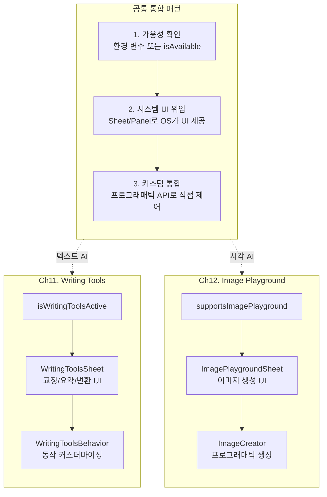
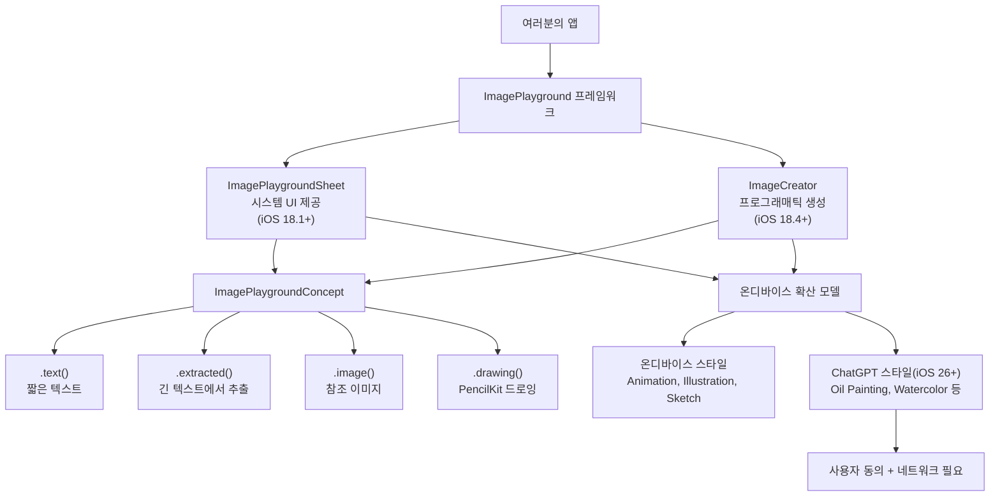
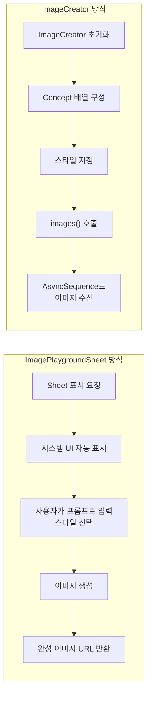
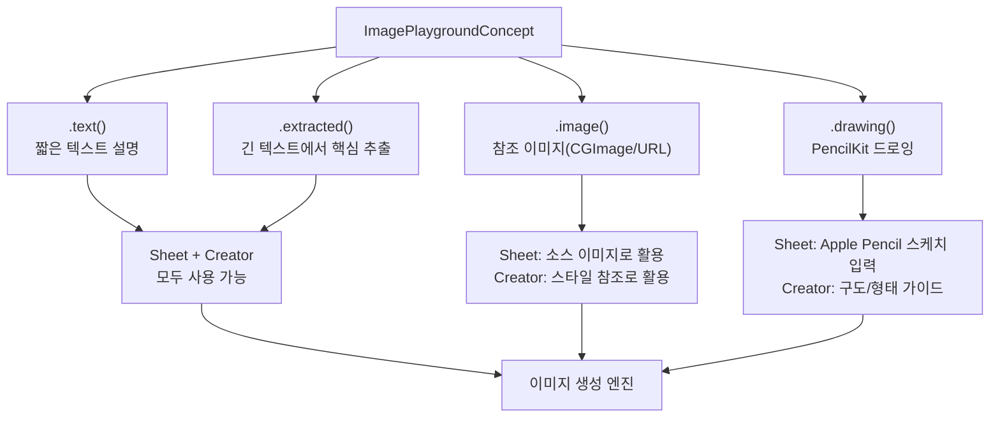
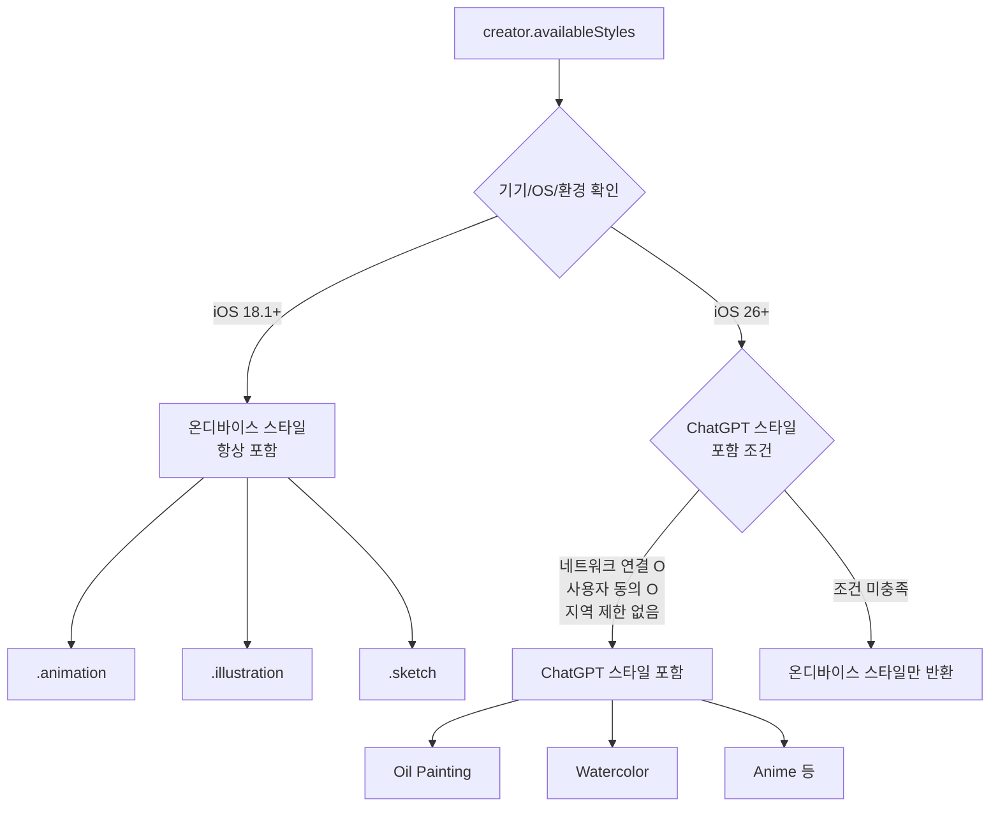
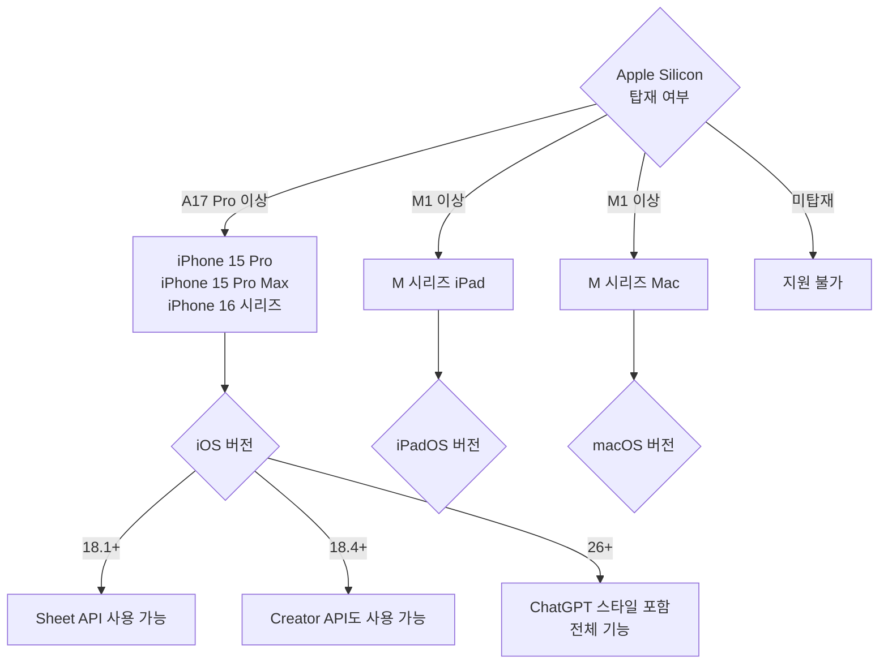
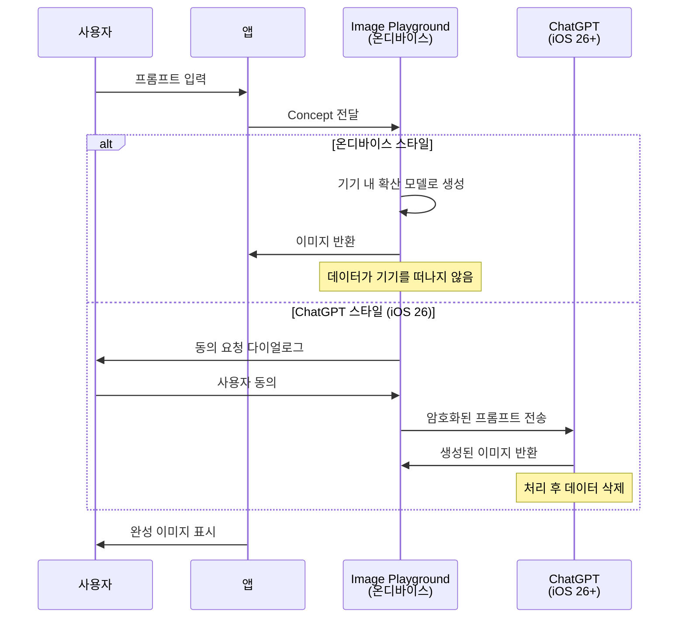

# Image Playground 프레임워크 개요

> Apple Intelligence의 AI 이미지 생성 시스템 — Image Playground 프레임워크의 기능, 지원 스타일, 시스템 요구사항, 프라이버시 모델을 살펴봅니다.

## 개요

이 섹션에서는 Apple이 제공하는 AI 이미지 생성 시스템인 Image Playground 프레임워크를 전체적으로 조망합니다. 앞서 [Writing Tools 시스템 서비스 개요](11-ch11-writing-tools-통합/01-01-writing-tools-시스템-서비스-개요.md)에서 Apple Intelligence의 텍스트 처리 서비스를 배웠다면, 이번에는 **시각 AI** 영역으로 진입합니다.

Ch11의 Writing Tools와 Ch12의 Image Playground는 **동일한 시스템 서비스 통합 패턴**을 공유합니다. 이 패턴을 먼저 정리하면 이후 학습이 훨씬 수월해집니다:

> 📊 **그림 0**: Apple Intelligence 시스템 서비스 통합의 공통 패턴



| 통합 단계 | Writing Tools (Ch11) | Image Playground (Ch12) |
|-----------|---------------------|------------------------|
| **가용성 확인** | `isWritingToolsActive` | `supportsImagePlayground` |
| **시스템 UI 위임** | WritingToolsSheet — 텍스트 교정/변환 UI 자동 제공 | ImagePlaygroundSheet — 이미지 생성 UI 자동 제공 |
| **커스텀 통합** | WritingToolsBehavior로 동작 세부 제어 | ImageCreator로 프로그래매틱 이미지 생성 |

이 패턴을 이해하면 Apple Intelligence의 다른 시스템 서비스도 같은 사고 모델로 접근할 수 있습니다. 이번 섹션에서는 이 세 단계가 이미지 생성 맥락에서 어떻게 구현되는지 살펴보겠습니다.

**선수 지식**:
- [Apple Intelligence 개요](01-ch1-apple-intelligence와-온디바이스-ai/01-01-apple-intelligence-개요.md)에서 다룬 Apple Intelligence 아키텍처
- [온디바이스 AI의 장점과 한계](01-ch1-apple-intelligence와-온디바이스-ai/03-03-온디바이스-ai의-장점과-한계.md)에서 배운 프라이버시 모델
- SwiftUI 기본 뷰 구성 능력

**학습 목표**:
- Image Playground 프레임워크의 전체 구조와 두 가지 API 경로를 이해한다
- 세 가지 온디바이스 스타일(Animation, Illustration, Sketch)과 iOS 26의 ChatGPT 스타일을 구분한다
- 시스템 요구사항과 기기별 지원 범위를 파악한다
- 이미지 생성의 프라이버시 모델과 데이터 흐름을 설명할 수 있다

## 왜 알아야 할까?

앱에 이미지 생성 기능을 넣으려면 어떻게 해야 할까요? 과거에는 외부 AI 서비스의 API를 호출하고, API 키를 관리하며, 네트워크 지연을 감수해야 했습니다. 비용도 만만치 않았죠.

Image Playground는 이 모든 것을 **시스템 레벨**에서 해결합니다. 마치 `UIImagePickerController`로 카메라를 불러오듯, **몇 줄의 코드**로 AI 이미지 생성 기능을 앱에 통합할 수 있거든요. API 키 관리도, 서버 비용도, 별도의 모델 호스팅도 필요 없습니다. 이것이 Image Playground만의 고유한 가치입니다 — **이미지 생성이라는 복잡한 AI 기능을 시스템 프레임워크 수준으로 단순화**한 것이죠.

특히 iOS 26부터는 ChatGPT 연동으로 스타일이 대폭 확장되어, 온디바이스 3가지 스타일에 더해 Oil Painting, Watercolor, Anime 같은 다양한 스타일까지 제공됩니다. 이제 이미지 생성은 "있으면 좋은" 기능이 아니라 **사용자가 기대하는 기본 기능**이 되어가고 있습니다.

## 핵심 개념

### 개념 1: Image Playground란 무엇인가?

> 💡 **비유**: Image Playground는 마치 **앱 안에 내장된 전문 일러스트레이터**입니다. 여러분이 "고양이가 우주복을 입고 달 위를 걷는 모습"이라고 묘사하면, 이 일러스트레이터가 즉석에서 그림을 그려줍니다. 외부 프리랜서(외부 API)를 고용할 필요 없이, 이미 여러분의 회사(기기)에 상주하는 직원인 셈이죠.

Image Playground는 Apple Intelligence의 일부로, **온디바이스 확산 모델(Diffusion Model)**을 기반으로 이미지를 생성하는 시스템 서비스입니다. 개발자는 `ImagePlayground` 프레임워크를 통해 이 기능을 앱에 통합할 수 있습니다.

핵심 특징은 크게 세 가지입니다:

1. **시스템 서비스**: 앱이 아니라 OS 레벨에서 동작하므로, 모든 앱이 동일한 모델을 공유합니다
2. **온디바이스 우선**: 기본 스타일은 서버 통신 없이 기기에서 직접 생성합니다
3. **두 가지 API 경로**: UI를 직접 제공하는 Sheet 방식과 프로그래매틱 생성 방식을 모두 지원합니다

> 📊 **그림 1**: Image Playground 프레임워크의 전체 구조



프레임워크를 사용하려면 `import ImagePlayground`를 추가하면 됩니다:

```swift
import SwiftUI
import ImagePlayground  // Image Playground 프레임워크 임포트

struct ContentView: View {
    // 이미지 생성 지원 여부를 환경 변수로 확인
    @Environment(\.supportsImagePlayground) private var supportsImagePlayground
    
    var body: some View {
        if supportsImagePlayground {
            Text("Image Playground를 사용할 수 있습니다!")
        } else {
            Text("이 기기에서는 Image Playground를 사용할 수 없습니다.")
        }
    }
}
```

### 개념 2: 두 가지 API 경로 — Sheet vs Creator

> 💡 **비유**: 식당에 비유하면, `ImagePlaygroundSheet`는 **풀서비스 레스토랑**입니다. 웨이터(시스템 UI)가 메뉴를 보여주고, 주문을 받고, 음식을 가져다줍니다. 반면 `ImageCreator`는 **테이크아웃 주방**이에요. 여러분이 직접 레시피(프롬프트)를 전달하면, 주방에서 조리한 음식(이미지)만 받아갑니다. UI는 여러분이 알아서 만들어야 하죠.

> 📊 **그림 2**: Sheet와 Creator API의 비교



**ImagePlaygroundSheet** (iOS 18.1+)는 Apple이 디자인한 전체 화면 시스템 UI를 표시합니다. 사용자가 직접 텍스트를 입력하고, 스타일을 선택하며, 생성된 이미지를 확인할 수 있습니다. 개발자는 완성된 이미지의 URL만 콜백으로 받습니다:

```swift
struct SheetExampleView: View {
    @State private var isPresented = false
    @State private var generatedImageURL: URL?
    
    var body: some View {
        VStack {
            // 생성된 이미지 표시
            if let url = generatedImageURL {
                AsyncImage(url: url) { image in
                    image.resizable().scaledToFit()
                } placeholder: {
                    ProgressView()
                }
            }
            
            Button("이미지 생성하기") {
                isPresented = true
            }
        }
        // Sheet를 통한 이미지 생성
        .imagePlaygroundSheet(
            isPresented: $isPresented,
            concepts: [.text("일몰이 아름다운 해변")],  // 초기 프롬프트
            onCompletion: { url in
                generatedImageURL = url  // 생성 완료 시 URL 수신
            },
            onCancellation: {
                print("사용자가 취소했습니다")
            }
        )
    }
}
```

**ImageCreator** (iOS 18.4+)는 UI 없이 프로그래매틱하게 이미지를 생성합니다. 커스텀 UI를 만들거나, 자동화된 이미지 생성 파이프라인이 필요할 때 사용합니다:

```swift
import ImagePlayground

func generateImageProgrammatically() async throws {
    // ImageCreator 초기화 (지원되지 않는 기기에서는 throw)
    let creator = try await ImageCreator()
    
    // 사용 가능한 스타일 확인
    let availableStyles = creator.availableStyles
    guard let style = availableStyles.first else { return }
    
    // 이미지 생성 (AsyncSequence 반환)
    let images = creator.images(
        for: [.text("우주를 탐험하는 고양이")],
        style: style,
        limit: 1  // 최대 4장까지 생성 가능
    )
    
    // 결과를 비동기적으로 수신
    for try await image in images {
        let cgImage = image.cgImage
        // cgImage를 UIImage 또는 SwiftUI Image로 변환하여 사용
    }
}
```

| 특성 | ImagePlaygroundSheet | ImageCreator |
|------|---------------------|-------------|
| **최소 버전** | iOS 18.1 / macOS 15.1 | iOS 18.4 / macOS 15.4 |
| **UI 제공** | 시스템 전체 화면 UI | UI 없음 (직접 구현) |
| **사용자 개입** | 필수 (사용자가 조작) | 없음 (자동 생성) |
| **반환 타입** | 이미지 파일 URL | CGImage (AsyncSequence) |
| **최대 생성 수** | 제한 없음 (사용자 선택) | 호출당 최대 4장 |
| **적합한 용도** | 사용자 주도 이미지 생성 | 앱 자동화, 커스텀 UI |

### 개념 3: Concept — 이미지를 묘사하는 방법

> 💡 **비유**: Concept는 일러스트레이터에게 전달하는 **브리프(brief)**입니다. "빨간 드레스를 입은 여성"이라고 말할 수도 있고(텍스트), 참고 사진을 보여줄 수도 있으며(이미지), 대략적인 스케치를 전달할 수도 있죠(드로잉). Image Playground의 `ImagePlaygroundConcept`는 바로 이 브리프의 디지털 버전입니다.

`ImagePlaygroundConcept`는 이미지 생성의 입력을 정의하는 구조체로, 네 가지 팩토리 메서드를 제공합니다:

> 📊 **그림 3**: ImagePlaygroundConcept의 네 가지 타입과 활용 범위



```swift
import ImagePlayground
import PencilKit

// 1. 짧은 텍스트 설명 — 가장 기본적인 Concept
let textConcept = ImagePlaygroundConcept.text("해질녘 파리의 에펠탑")

// 2. 긴 텍스트에서 핵심 개념 추출 (최대 250단어)
let articleText = """
서울은 대한민국의 수도로, 현대적인 고층 빌딩과 전통 한옥 마을이 
공존하는 독특한 도시입니다. 남산타워에서 바라보는 야경은 특히 유명합니다.
"""
let extractedConcept = ImagePlaygroundConcept.extracted(
    from: articleText,
    title: "서울의 야경"  // 추출 방향을 가이드하는 제목
)

// 3. 참조 이미지 제공 (CGImage 또는 URL)
//    — 생성 엔진이 이미지의 구도, 색감, 피사체를 참고하여 새 이미지를 생성
let imageConcept = ImagePlaygroundConcept.image(url: photoURL)

// 4. PencilKit 드로잉 (iPad에서 Apple Pencil로 그린 스케치)
//    — 사용자의 대략적인 스케치를 기반으로 완성도 높은 이미지를 생성
let drawingConcept = ImagePlaygroundConcept.drawing(pkDrawing)
```

네 가지 Concept 타입의 역할과 사용 시점을 정리하면:

| Concept 타입 | 입력 | 역할 | 주요 사용 시나리오 |
|-------------|------|------|------------------|
| `.text()` | 짧은 문자열 | 직접적인 이미지 묘사 | 프롬프트 입력, 키워드 기반 생성 |
| `.extracted()` | 긴 텍스트 + 제목 | AI가 핵심을 추출하여 묘사 | 기사/블로그 내용 기반 이미지 |
| `.image()` | CGImage 또는 URL | 참조 이미지의 구도/분위기 반영 | 사진을 일러스트로 변환, 스타일 참조 |
| `.drawing()` | PKDrawing | 스케치의 형태/구도를 기반으로 생성 | Apple Pencil 스케치 → 완성 이미지 |

> 💡 **알고 계셨나요?**: `.text()`와 `.extracted()`는 가장 많이 사용되는 기본 Concept이지만, `.image()`와 `.drawing()` Concept이야말로 Image Playground의 진정한 차별점입니다. 특히 `.image()` Concept은 사용자의 실제 사진을 기반으로 일러스트를 생성할 수 있어서, 프로필 아바타나 스티커 생성 같은 기능에 핵심적이죠. `.drawing()` Concept은 iPad + Apple Pencil 환경에서 "대충 그린 스케치를 AI가 완성해주는" 경험을 만들어냅니다. 이 두 Concept의 활용법은 [ImageCreator로 프로그래매틱 생성](12-ch12-image-playground와-시각-ai/03-03-imagecreator로-프로그래매틱-생성.md)에서 본격적으로 다룹니다.

여러 Concept을 **배열로 조합**하여 더 풍부한 이미지를 생성할 수 있습니다:

```swift
// 텍스트와 이미지 Concept을 결합 — 참조 사진의 분위기 + 텍스트 묘사
let concepts: [ImagePlaygroundConcept] = [
    .text("수채화 스타일의 풍경"),
    .image(url: referencePhotoURL)
]

// 텍스트와 드로잉 Concept을 결합 — 스케치 구도 + 텍스트 디테일
let sketchConcepts: [ImagePlaygroundConcept] = [
    .text("숲속의 오두막집"),
    .drawing(userSketch)  // 사용자가 그린 대략적인 집 스케치
]
```

### 개념 4: 스타일 — 온디바이스와 ChatGPT

Image Playground는 두 가지 범주의 스타일을 지원합니다.

**온디바이스 스타일** (iOS 18.1+, 네트워크 불필요):

| 스타일 | 설명 | 특징 |
|--------|------|------|
| `.animation` | 3D 애니메이션 영화 스타일 | Pixar/Disney 느낌의 볼륨감 |
| `.illustration` | 2D 평면 일러스트레이션 | 깔끔한 라인, 플랫 디자인 |
| `.sketch` | 손으로 그린 스케치 | 연필/펜 드로잉 느낌 |

**ChatGPT 스타일** (iOS 26+, 사용자 동의 필요):
iOS 26에서 Apple은 ChatGPT와의 연동을 통해 Oil Painting, Watercolor, Vector, Anime, Print 등의 추가 스타일을 도입했습니다. 또한 "Any Style" 옵션으로 사용자가 원하는 스타일을 자유롭게 묘사할 수도 있습니다.

> 📊 **그림 4**: 스타일 분류와 availableStyles 반환 조건



ChatGPT 스타일이 `availableStyles`에 포함되려면 **세 가지 조건**이 모두 충족되어야 합니다:

1. **iOS 26 이상**: OS가 ChatGPT 연동을 지원해야 합니다
2. **네트워크 연결**: ChatGPT 서버와의 통신이 필요하므로 인터넷 연결이 필수입니다
3. **사용자 동의**: 사용자가 시스템 설정에서 ChatGPT 확장 기능 사용에 동의해야 합니다. 동의하지 않았거나 아직 동의 요청을 받지 않은 경우 ChatGPT 스타일은 목록에 나타나지 않습니다

따라서 `availableStyles`의 반환값은 **실행 환경에 따라 동적으로 달라집니다**. 항상 이 프로퍼티를 확인한 후 스타일을 선택해야 합니다:

```swift
// 스타일을 명시적으로 지정
let images = creator.images(
    for: [.text("봄날의 벚꽃")],
    style: .illustration,  // 온디바이스 스타일 지정
    limit: 2
)

// 사용 가능한 스타일 확인 (기기/OS/환경에 따라 동적으로 달라짐)
let styles = creator.availableStyles
for style in styles {
    print("사용 가능: \(style)")
}

// ChatGPT 스타일 사용 가능 여부를 별도 체크하는 패턴
let hasChatGPTStyles = styles.contains { style in
    // 온디바이스 3종(.animation, .illustration, .sketch) 외의 스타일이 있으면
    // ChatGPT 연동이 활성화된 것
    style != .animation && style != .illustration && style != .sketch
}
```

> ⚠️ **흔한 오해**: "모든 스타일이 모든 기기에서 동일하게 작동한다"고 생각하기 쉬운데, 실제로는 `availableStyles` 프로퍼티를 **반드시 확인**해야 합니다. 기기 성능, OS 버전, 네트워크 상태, 사용자의 ChatGPT 동의 여부에 따라 사용 가능한 스타일이 달라지거든요. 특히 ChatGPT 스타일은 비행기 모드에서는 목록에 나타나지 않습니다.

### 개념 5: 시스템 요구사항과 가용성 확인

Image Playground는 Apple Intelligence 지원 기기에서만 동작합니다. 모든 기기에서 실행되는 앱을 만든다면, **가용성 체크는 필수**입니다.

> 📊 **그림 5**: 기기별 Image Playground 지원 현황



**하드웨어 요구사항**:
- **iPhone**: A17 Pro 칩 이상 (iPhone 15 Pro, iPhone 15 Pro Max, iPhone 16 시리즈)
- **iPad**: M1 칩 이상
- **Mac**: M1 칩 이상
- **Vision Pro**: visionOS 2.4+

**소프트웨어 요구사항**:
- ImagePlaygroundSheet: iOS 18.1 / macOS 15.1 이상
- ImageCreator: iOS 18.4 / macOS 15.4 이상
- ChatGPT 스타일: iOS 26 / macOS 26 이상

```swift
import ImagePlayground

struct SafeImageView: View {
    @Environment(\.supportsImagePlayground) private var isSupported
    
    var body: some View {
        Group {
            if isSupported {
                ImagePlaygroundButton()  // Image Playground 기능 제공
            } else {
                FallbackImagePicker()    // 대체 기능 제공
            }
        }
    }
}

// UIKit에서의 가용성 확인
func checkAvailabilityUIKit() {
    if ImagePlaygroundViewController.isAvailable {
        // Image Playground 사용 가능
    } else {
        // 폴백 UI 표시
    }
}
```

> 🔥 **실무 팁**: 시뮬레이터에서는 `ImageCreator`가 **동작하지 않습니다**. 반드시 실제 기기에서 테스트해야 합니다. 개발 초기에는 `ImagePlaygroundSheet`를 우선 통합하고, 실기기 테스트 단계에서 `ImageCreator`로 확장하는 전략이 효율적입니다.

## 실습: 직접 해보기

지금까지 배운 내용을 종합하여, Image Playground의 가용성을 확인하고 Sheet API를 통해 이미지를 생성하는 간단한 앱을 만들어 봅시다.

```swift
import SwiftUI
import ImagePlayground

// MARK: - Image Playground 데모 앱
struct ImagePlaygroundDemoView: View {
    // Image Playground 지원 여부 확인
    @Environment(\.supportsImagePlayground) private var supportsImagePlayground
    
    @State private var showPlayground = false
    @State private var generatedImageURL: URL?
    @State private var prompt = "벚꽃이 흩날리는 서울의 봄"
    
    var body: some View {
        NavigationStack {
            VStack(spacing: 24) {
                // 지원 상태 표시
                statusBadge
                
                // 프롬프트 입력 영역
                VStack(alignment: .leading, spacing: 8) {
                    Text("이미지 설명")
                        .font(.headline)
                    TextField("어떤 이미지를 만들까요?", text: $prompt)
                        .textFieldStyle(.roundedBorder)
                }
                .padding(.horizontal)
                
                // 생성된 이미지 표시
                if let url = generatedImageURL {
                    AsyncImage(url: url) { phase in
                        switch phase {
                        case .success(let image):
                            image
                                .resizable()
                                .scaledToFit()
                                .clipShape(RoundedRectangle(cornerRadius: 16))
                                .shadow(radius: 8)
                        case .failure:
                            Label("이미지를 불러올 수 없습니다", systemImage: "exclamationmark.triangle")
                        case .empty:
                            ProgressView("로딩 중...")
                        @unknown default:
                            EmptyView()
                        }
                    }
                    .frame(maxHeight: 300)
                    .padding(.horizontal)
                } else {
                    // 플레이스홀더
                    RoundedRectangle(cornerRadius: 16)
                        .fill(.quaternary)
                        .frame(height: 200)
                        .overlay {
                            VStack(spacing: 8) {
                                Image(systemName: "wand.and.stars")
                                    .font(.largeTitle)
                                Text("이미지가 여기에 표시됩니다")
                                    .font(.caption)
                            }
                            .foregroundStyle(.secondary)
                        }
                        .padding(.horizontal)
                }
                
                Spacer()
                
                // 생성 버튼
                Button {
                    showPlayground = true
                } label: {
                    Label("Image Playground 열기", systemImage: "paintbrush.pointed")
                        .frame(maxWidth: .infinity)
                        .padding()
                        .background(supportsImagePlayground ? Color.accentColor : Color.gray)
                        .foregroundStyle(.white)
                        .clipShape(RoundedRectangle(cornerRadius: 12))
                }
                .disabled(!supportsImagePlayground)
                .padding(.horizontal)
            }
            .padding(.vertical)
            .navigationTitle("Image Playground 데모")
            // Image Playground Sheet 연결
            .imagePlaygroundSheet(
                isPresented: $showPlayground,
                concepts: [.text(prompt)],  // 입력한 프롬프트를 Concept으로 전달
                onCompletion: { url in
                    generatedImageURL = url  // 완성된 이미지 URL 저장
                },
                onCancellation: {
                    // 사용자가 Sheet를 닫았을 때의 처리
                    print("이미지 생성이 취소되었습니다")
                }
            )
        }
    }
    
    // 지원 상태 배지
    @ViewBuilder
    private var statusBadge: some View {
        HStack {
            Image(systemName: supportsImagePlayground ? "checkmark.circle.fill" : "xmark.circle.fill")
            Text(supportsImagePlayground ? "Image Playground 사용 가능" : "이 기기에서는 사용할 수 없습니다")
        }
        .font(.subheadline)
        .foregroundStyle(supportsImagePlayground ? .green : .red)
        .padding(.horizontal, 16)
        .padding(.vertical, 8)
        .background(.ultraThinMaterial, in: Capsule())
    }
}
```

이 코드의 핵심 포인트를 정리하면:

1. `@Environment(\.supportsImagePlayground)`으로 **가용성을 런타임에 확인**합니다
2. `.imagePlaygroundSheet()` 모디파이어 하나로 **전체 이미지 생성 UI를 제공**합니다
3. `concepts:` 파라미터에 `.text()` Concept을 전달하여 **초기 프롬프트를 설정**합니다
4. `onCompletion` 콜백에서 **생성된 이미지의 파일 URL**을 받아 표시합니다

## 더 깊이 알아보기

### Image Playground의 탄생 — WWDC24에서 WWDC25까지

Image Playground는 2024년 6월 WWDC24에서 Apple Intelligence와 함께 처음 발표되었습니다. 당시 Apple의 크레이그 페더리기(Craig Federighi)는 "모든 사람이 창작자가 될 수 있다"는 비전을 제시하며, 텍스트만으로 이미지를 생성하는 데모를 선보였죠.

그런데 흥미로운 점이 있습니다. Apple은 다른 AI 이미지 생성 서비스들과는 **완전히 다른 철학**을 택했습니다. Midjourney나 DALL-E가 사실적인(photorealistic) 이미지를 추구한 반면, Apple은 **의도적으로** Animation, Illustration, Sketch라는 비사실적 스타일만 제공했습니다. 왜 그랬을까요?

Apple은 딥페이크(deepfake)와 AI 생성 가짜 사진의 위험성을 인식하고, **"이것은 AI가 만든 이미지"임이 한눈에 보이는 스타일만** 선택한 것입니다. 누가 봐도 일러스트레이션이지 실제 사진이 아니니까요. 이것은 기술적 한계가 아닌 **의식적인 디자인 결정**이었습니다.

그리고 1년 후 WWDC25에서 Apple은 ChatGPT와의 연동을 발표하며 Oil Painting, Watercolor, Anime 등의 추가 스타일을 도입했습니다. 다만 이 스타일들은 온디바이스가 아닌 ChatGPT 서버를 통해 생성되기 때문에, **반드시 사용자의 명시적 동의**를 필요로 합니다. Apple의 프라이버시 원칙을 지키면서도 기능을 확장한 영리한 전략이죠.

### 프라이버시 아키텍처 — 이미지가 기기를 떠나지 않는 구조

Image Playground의 프라이버시 모델에서 주목할 점은 **이미지 생성이라는 특수한 맥락**에서의 설계입니다. 텍스트 처리와 달리, 이미지 생성에는 사용자의 사진(`.image()` Concept)이나 개인적인 묘사가 입력될 수 있어서 데이터 민감도가 더 높거든요. Apple은 이를 온디바이스/서버 이원 구조로 해결했습니다:

> 📊 **그림 6**: Image Playground의 프라이버시 데이터 흐름



온디바이스 스타일의 경우, 텍스트 프롬프트부터 최종 이미지까지 **전부 기기 안에서 처리**됩니다. Apple Silicon의 Neural Engine이 확산 모델 추론을 담당하며, 생성된 이미지는 앱의 샌드박스 내 임시 디렉토리에 저장됩니다.

ChatGPT 스타일을 사용할 때는 Apple이 중간자 역할을 합니다. 사용자의 IP 주소는 ChatGPT에 전달되지 않고, 프롬프트는 처리 후 삭제됩니다. 그리고 가장 중요한 것은 — **ChatGPT 전송 전 반드시 사용자의 명시적 동의를 받는다**는 점입니다.

## 흔한 오해와 팁

> ⚠️ **흔한 오해**: "Image Playground로 사실적인 사진을 생성할 수 있다"고 생각하시는 분들이 있는데, 이는 사실이 아닙니다. Apple은 의도적으로 비사실적 스타일만 제공합니다. 포토리얼리스틱 이미지가 필요하다면 다른 서드파티 서비스를 고려해야 합니다.

> 💡 **알고 계셨나요?**: `ImageCreator`는 iOS 18.1이 아닌 **iOS 18.4**에서 추가되었습니다. 초기에는 Sheet UI만 사용할 수 있었고, 개발자들의 요청에 따라 3개월 뒤 프로그래매틱 API가 추가된 거예요. 만약 iOS 18.1~18.3을 지원해야 한다면 Sheet API만 사용할 수 있습니다.

> 🔥 **실무 팁**: `ImageCreator`를 사용할 때는 항상 `do-catch`로 감싸세요. 특히 `backgroundCreationForbidden` 에러를 주의해야 합니다. 앱이 백그라운드로 전환되면 이미지 생성이 즉시 중단되거든요. 긴 생성 작업은 사용자에게 "앱을 열어두세요"라는 안내를 표시하는 것이 좋습니다.

```swift
// ImageCreator 에러 처리 패턴
func safeGenerateImage() async {
    do {
        let creator = try await ImageCreator()
        
        guard let style = creator.availableStyles.first else {
            print("사용 가능한 스타일이 없습니다")
            return
        }
        
        let images = creator.images(
            for: [.text("서울의 야경")],
            style: style,
            limit: 1
        )
        
        for try await image in images {
            // 이미지 처리
            let _ = image.cgImage
        }
    } catch let error as ImageCreator.Error {
        switch error {
        case .notSupported:
            print("이 기기에서는 이미지 생성을 지원하지 않습니다")
        case .unavailable:
            print("서비스가 일시적으로 사용 불가합니다")
        case .backgroundCreationForbidden:
            print("앱이 포그라운드에 있어야 합니다")
        case .creationCancelled:
            print("생성이 취소되었습니다")
        case .unsupportedLanguage:
            print("지원되지 않는 언어입니다")
        default:
            print("이미지 생성 실패: \(error)")
        }
    } catch {
        print("예상치 못한 오류: \(error)")
    }
}
```

## 핵심 정리

| 개념 | 설명 |
|------|------|
| **Image Playground** | Apple Intelligence의 온디바이스 AI 이미지 생성 시스템 서비스 |
| **시스템 서비스 통합 패턴** | 가용성 확인 → 시스템 UI 위임 → 커스텀 통합 (Writing Tools와 동일 패턴) |
| **ImagePlaygroundSheet** | 시스템 UI를 자동 제공하는 Sheet 방식 API (iOS 18.1+) |
| **ImageCreator** | UI 없이 프로그래매틱하게 이미지를 생성하는 API (iOS 18.4+) |
| **ImagePlaygroundConcept** | 이미지 설명을 전달하는 구조체 — `.text()`, `.extracted()`, `.image()`, `.drawing()` |
| **.image() / .drawing()** | 참조 이미지와 PencilKit 스케치 기반 생성 — ImageCreator에서 본격 활용 (12.3 참고) |
| **온디바이스 스타일** | Animation, Illustration, Sketch — 네트워크 불필요 |
| **ChatGPT 스타일** | Oil Painting, Watercolor, Anime 등 — iOS 26+, 네트워크 연결 + 사용자 동의 필요 시 availableStyles에 포함 |
| **가용성 확인** | SwiftUI: `supportsImagePlayground` 환경 변수, UIKit: `ImagePlaygroundViewController.isAvailable` |
| **하드웨어 요건** | A17 Pro(iPhone), M1+(iPad/Mac) 이상의 Apple Silicon 필수 |

## 다음 섹션 미리보기

이번 섹션에서 Image Playground의 전체 그림을 파악했으니, 다음 [ImagePlaygroundSheet 통합](12-ch12-image-playground와-시각-ai/02-02-imageplaygroundsheet-통합.md)에서는 `ImagePlaygroundSheet`를 실제 SwiftUI 앱에 통합하는 방법을 본격적으로 다룹니다. 초기 Concept 설정, 소스 이미지 연결, 복수 Concept 조합, 그리고 생성된 이미지의 저장과 공유까지 — 실전에 바로 쓸 수 있는 패턴들을 배울 거예요.

## 참고 자료

- [Image Playground — Apple Developer Documentation](https://developer.apple.com/documentation/imageplayground) - Image Playground 프레임워크의 공식 API 문서. 클래스, 프로토콜, 에러 타입 등 전체 레퍼런스
- [Bringing Image Playground to your app — Create with Swift](https://www.createwithswift.com/bringing-image-playground-to-your-app/) - ImagePlaygroundSheet 통합 과정을 단계별로 설명하는 실전 튜토리얼
- [Generating images programmatically with Image Playground — Create with Swift](https://www.createwithswift.com/generating-images-programmatically-with-image-playground/) - ImageCreator API를 활용한 프로그래매틱 이미지 생성 가이드
- [Generating images in Swift using Image Playground — Swift with Majid](https://swiftwithmajid.com/2025/11/11/generating-images-in-swift-using-image-playground/) - ImageCreator의 AsyncSequence 패턴과 스타일 관리 실전 사례
- [Discover machine learning & AI frameworks on Apple platforms — WWDC25](https://developer.apple.com/videos/play/wwdc2025/360/) - WWDC25에서 발표된 Apple ML/AI 프레임워크 생태계 전체 조망
- [Apple Intelligence gets even more powerful — Apple Newsroom](https://www.apple.com/newsroom/2025/06/apple-intelligence-gets-even-more-powerful-with-new-capabilities-across-apple-devices/) - iOS 26의 ChatGPT 스타일 통합 등 Image Playground 최신 업데이트 발표

---
### 🔗 Related Sessions
- [apple intelligence](01-ch1-apple-intelligence와-온디바이스-ai/01-01-apple-intelligence-개요.md) (prerequisite)
