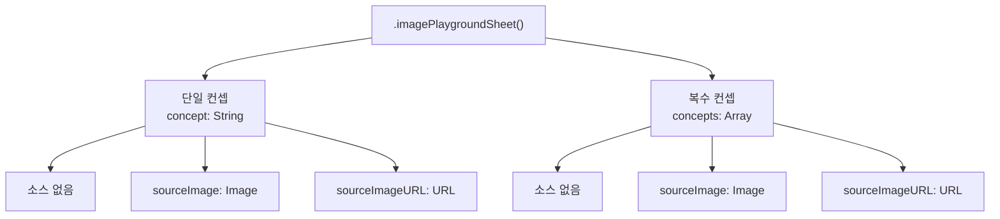
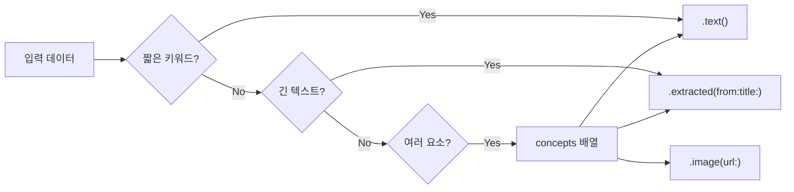
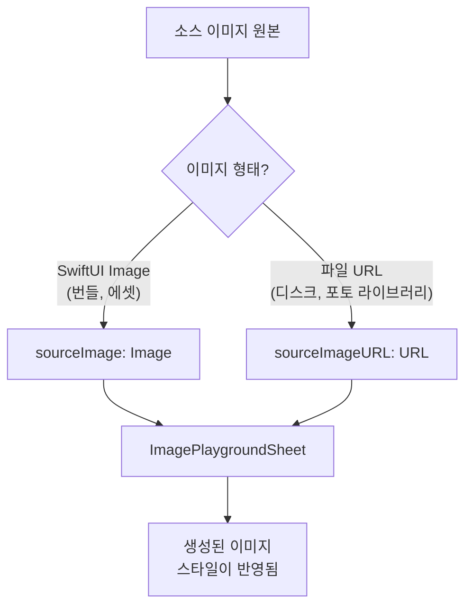
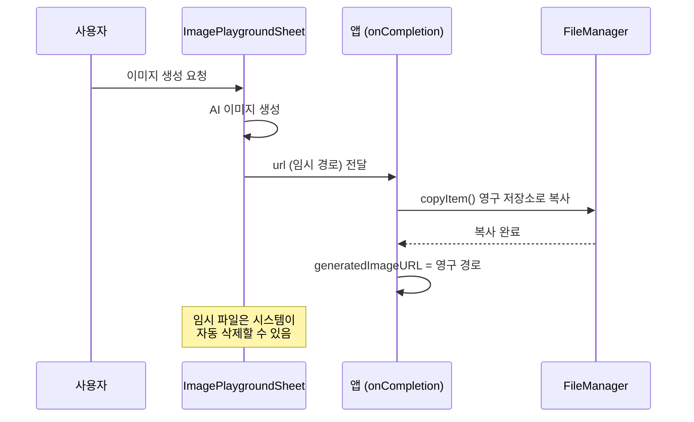
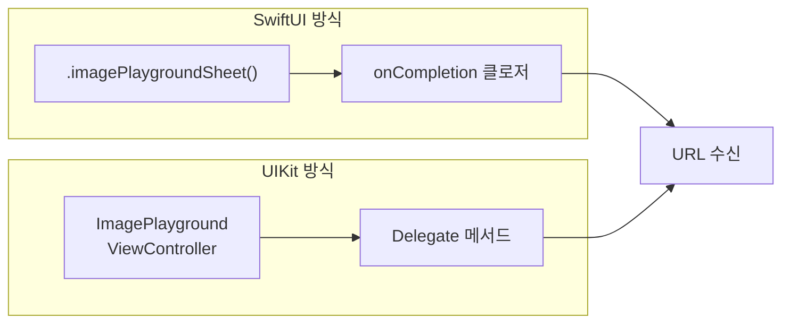

# ImagePlaygroundSheet 통합

> SwiftUI와 UIKit에서 Image Playground 시트를 통합하고, 초기 컨셉 설정부터 생성 이미지 저장까지 전체 워크플로를 구현합니다.

## 개요

[이전 섹션](12-ch12-image-playground와-시각-ai/01-01-image-playground-프레임워크-개요.md)에서 Image Playground 프레임워크의 두 가지 API 경로와 Concept 타입을 살펴보았습니다. 이번 섹션에서는 그 중 첫 번째 경로인 **ImagePlaygroundSheet**를 실제 앱에 통합하는 방법을 깊이 있게 다룹니다.

**선수 지식**: Image Playground 프레임워크 개요, SwiftUI 기본 뷰 모디파이어, `@State`/`@Binding` 패턴
**학습 목표**:
- `.imagePlaygroundSheet()` 모디파이어의 모든 변형과 파라미터를 이해한다
- 텍스트 컨셉과 추출 컨셉을 상황에 맞게 사용한다
- 생성된 이미지 URL을 영구 저장소로 안전하게 이동한다
- UIKit의 `ImagePlaygroundViewController`로 동일 기능을 구현한다

## 왜 알아야 할까?

앱에 AI 이미지 생성 기능을 넣는다고 상상해보세요. 프로필 사진 생성, 스토리 일러스트, 아이디어 시각화 등 활용 시나리오는 무궁무진합니다. 그런데 이미지 생성 AI를 밑바닥부터 만들려면? 모델 학습, 서버 인프라, 비용 관리까지 엄청난 노력이 필요하죠.

ImagePlaygroundSheet는 Apple이 제공하는 **"완성형 UI"** 입니다. `.sheet()`처럼 한 줄의 모디파이어로 Image Playground 전체 인터페이스를 앱에 붙일 수 있거든요. 사용자는 이미 익숙한 Apple의 이미지 생성 UI를 그대로 사용하고, 개발자는 **생성 결과 URL만 받아서** 앱 로직에 활용하면 됩니다. 온디바이스 프라이버시는 덤이고요.

## 핵심 개념

### 모디파이어 변형과 파라미터 체계

> 💡 **비유**: ImagePlaygroundSheet는 **사진 인화소**와 비슷합니다. 고객(앱)이 "이런 느낌의 사진 만들어주세요"라고 주문서(Concept)를 내면, 인화소(Sheet)가 알아서 작업하고, 완성된 사진의 수령 주소(URL)만 돌려주는 거죠. 참고 사진(sourceImage)을 같이 내밀 수도 있고요.

`.imagePlaygroundSheet()` 모디파이어는 **6가지 변형(overload)**이 존재합니다. 핵심 차이는 컨셉을 단일/복수로 전달하는지, 소스 이미지를 `Image`/`URL`로 전달하는지에 따라 갈립니다.

> 📊 **그림 1**: imagePlaygroundSheet 모디파이어 변형 체계



주요 파라미터를 정리하면 이렇습니다:

| 파라미터 | 타입 | 설명 |
|---------|------|------|
| `isPresented` | `Binding<Bool>` | 시트 표시 여부 |
| `concept` | `String` | 단일 텍스트 컨셉 (간편 버전) |
| `concepts` | `[ImagePlaygroundConcept]` | 복수 컨셉 배열 |
| `sourceImage` | `Image` | SwiftUI Image 소스 |
| `sourceImageURL` | `URL` | 파일 경로 기반 소스 이미지 |
| `onCompletion` | `(URL) -> Void` | 생성 완료 시 임시 URL 수신 |
| `onCancellation` | `() -> Void` | 사용자 취소 시 호출 (선택) |

가장 간단한 형태부터 살펴보겠습니다:

```swift
import SwiftUI
import ImagePlayground

struct SimplePlaygroundView: View {
    @State private var showPlayground = false
    @State private var generatedImageURL: URL?
    
    var body: some View {
        VStack {
            Button("이미지 생성하기") {
                showPlayground = true
            }
            // 가장 간단한 형태 — 빈 캔버스로 시작
            .imagePlaygroundSheet(isPresented: $showPlayground) { url in
                generatedImageURL = url
            }
        }
    }
}
```

컨셉 없이 호출하면 사용자가 직접 텍스트를 입력하는 빈 캔버스 상태로 시트가 열립니다. 앱이 미리 컨셉을 지정하려면 `concept` 또는 `concepts` 파라미터를 사용하면 됩니다.

### Concept 설정 전략: 단일 vs 복수, 텍스트 vs 추출

> 💡 **비유**: 컨셉 설정은 **화가에게 그림을 의뢰**하는 것과 같습니다. "빨간 고양이"라고 짧게 말하면 단일 텍스트 컨셉이고, 긴 소설 원고를 건네며 "이 분위기로 그려주세요"라고 하면 추출(extracted) 컨셉입니다. 여러 키워드를 나열하면 복수 컨셉이 되죠.

> 📊 **그림 2**: Concept 타입별 사용 시나리오



**단일 텍스트 컨셉** — 키워드나 짧은 문장에 적합:

```swift
// concept 파라미터에 String을 직접 전달
.imagePlaygroundSheet(
    isPresented: $showPlayground,
    concept: "파란 눈의 흰 고양이가 우주에서 떠다니는 모습"
) { url in
    generatedImageURL = url
}
```

**복수 컨셉 배열** — 여러 요소를 조합할 때:

```swift
// concepts 배열로 여러 Concept 조합
.imagePlaygroundSheet(
    isPresented: $showPlayground,
    concepts: [
        .text("중세 기사"),        // 키워드 컨셉
        .text("용과 싸우는 장면"),   // 장면 설명
        .text("일몰 배경")         // 배경 설명
    ]
) { url in
    generatedImageURL = url
}
```

**추출(Extracted) 컨셉** — 긴 텍스트에서 핵심 요소를 자동 추출:

```swift
let storyText = """
어린 마법사 소녀가 깊은 숲속에서 빛나는 크리스탈을 발견했다.
크리스탈에서 나오는 보라색 빛이 온 숲을 밝히자,
숨어있던 작은 요정들이 하나둘 모습을 드러냈다.
요정들은 날개를 펄럭이며 소녀 주위를 맴돌았다.
"""

// 긴 텍스트에서 핵심 시각 요소를 자동 추출
.imagePlaygroundSheet(
    isPresented: $showPlayground,
    concepts: [
        .extracted(from: storyText, title: "마법의 숲")
    ]
) { url in
    generatedImageURL = url
}
```

`.extracted(from:title:)`는 모델이 긴 텍스트에서 시각적으로 중요한 요소를 알아서 뽑아줍니다. `title` 파라미터는 선택이지만, 맥락을 잡아주는 데 큰 도움이 됩니다. 아동 동화 앱이나 글쓰기 앱에서 사용자의 텍스트를 바로 이미지로 변환할 때 아주 유용하죠.

> ⚠️ **흔한 오해**: `.text()`에 긴 문장을 넣어도 "어느 정도"는 동작합니다. 하지만 Apple은 `.text()`는 **단어나 짧은 문장**에 최적화되어 있다고 명시합니다. 250자 이상의 텍스트라면 반드시 `.extracted(from:title:)`를 사용하세요. 긴 텍스트를 `.text()`에 넣으면 내부적으로 잘리면서 의도치 않은 결과가 나올 수 있습니다.

### 소스 이미지 연결과 스타일 가이드

> 💡 **비유**: 소스 이미지는 화가에게 **참고 사진**을 건네는 것과 같습니다. "이 사진처럼, 하지만 좀 더 판타지풍으로"라고 요청하는 거죠. 참고 사진이 있으면 화가도 고객이 원하는 방향을 더 정확히 이해할 수 있습니다.

소스 이미지를 전달하는 방법은 두 가지입니다:

> 📊 **그림 3**: 소스 이미지 전달 경로



```swift
// 방법 1: SwiftUI Image 직접 전달 (번들 이미지, SF Symbols 등)
.imagePlaygroundSheet(
    isPresented: $showPlayground,
    concepts: [.text("수채화 스타일 풍경")],
    sourceImage: Image("myLandscape")  // Asset Catalog 이미지
) { url in
    generatedImageURL = url
}

// 방법 2: 파일 URL 전달 (사진 라이브러리, 다운로드 파일 등)
.imagePlaygroundSheet(
    isPresented: $showPlayground,
    concepts: [.text("만화 스타일")],
    sourceImageURL: photoFileURL  // 디스크의 이미지 파일 URL
) { url in
    generatedImageURL = url
}
```

iOS 18.4+에서는 시트의 동작을 세밀하게 제어하는 추가 모디파이어도 제공됩니다:

```swift
.imagePlaygroundSheet(isPresented: $showPlayground) { url in
    generatedImageURL = url
}
// 개인화 정책 — 사용자 사진 기반 생성 제한
.imagePlaygroundPersonalizationPolicy(.disabled)
// 생성 스타일 제한 — 특정 스타일만 허용
.imagePlaygroundGenerationStyle(.sketch)
```

> 🔥 **실무 팁**: `.imagePlaygroundPersonalizationPolicy()`와 `.imagePlaygroundGenerationStyle()`은 반드시 `.imagePlaygroundSheet()` **뒤에** 체이닝해야 합니다. 순서가 바뀌면 **조용히 무시**되어 디버깅이 매우 어렵습니다.

### 생성 결과 URL 처리와 영구 저장

> 💡 **비유**: `onCompletion`으로 받는 URL은 **편의점 사물함 번호**와 같습니다. 잠시 맡겨둔 물건을 찾아가는 건 여러분 몫이에요. 시간이 지나면 사물함은 비워지니까, 중요한 물건이라면 빨리 집으로 가져가야(영구 저장소로 이동) 합니다.

`onCompletion` 클로저가 넘겨주는 URL은 **임시 디렉토리**에 위치한 파일입니다. 앱이 종료되거나 시스템이 정리하면 사라지기 때문에, 반드시 영구 저장소로 복사해야 합니다.

> 📊 **그림 4**: 생성 이미지 URL 처리 흐름



```swift
import SwiftUI
import ImagePlayground

struct ImageSaveView: View {
    @State private var showPlayground = false
    @State private var savedImageURL: URL?
    
    var body: some View {
        VStack(spacing: 20) {
            if let savedImageURL {
                AsyncImage(url: savedImageURL) { image in
                    image
                        .resizable()
                        .scaledToFit()
                        .frame(maxHeight: 300)
                        .clipShape(RoundedRectangle(cornerRadius: 16))
                } placeholder: {
                    ProgressView()
                }
            }
            
            Button("이미지 생성") { showPlayground = true }
                .buttonStyle(.borderedProminent)
                .imagePlaygroundSheet(
                    isPresented: $showPlayground,
                    concepts: [.text("귀여운 로봇이 커피를 마시는 모습")]
                ) { temporaryURL in
                    // 임시 URL → 영구 저장소로 이동
                    savedImageURL = saveImagePermanently(from: temporaryURL)
                }
        }
        .padding()
    }
    
    /// 임시 URL의 이미지를 Documents 디렉토리로 복사
    private func saveImagePermanently(from tempURL: URL) -> URL? {
        let fileManager = FileManager.default
        
        guard let documentsDir = fileManager.urls(
            for: .documentDirectory,
            in: .userDomainMask
        ).first else { return nil }
        
        // UUID 기반 고유 파일명 생성
        let fileName = "\(UUID().uuidString).png"
        let destinationURL = documentsDir.appendingPathComponent(fileName)
        
        do {
            // 같은 경로에 파일이 있으면 먼저 삭제
            if fileManager.fileExists(atPath: destinationURL.path) {
                try fileManager.removeItem(at: destinationURL)
            }
            try fileManager.copyItem(at: tempURL, to: destinationURL)
            return destinationURL
        } catch {
            print("이미지 저장 실패: \(error.localizedDescription)")
            return nil
        }
    }
}
```

### UIKit 통합: ImagePlaygroundViewController

SwiftUI가 아닌 UIKit 기반 앱에서도 동일한 기능을 사용할 수 있습니다. `ImagePlaygroundViewController`를 직접 생성하고, **Delegate 패턴**으로 결과를 수신합니다.

> 📊 **그림 5**: UIKit vs SwiftUI 통합 비교



```swift
import UIKit
import ImagePlayground

class ImageGeneratorViewController: UIViewController,
    ImagePlaygroundViewController.Delegate {
    
    private var generatedImageView: UIImageView!
    
    override func viewDidLoad() {
        super.viewDidLoad()
        setupUI()
    }
    
    private func setupUI() {
        // 이미지 뷰 설정
        generatedImageView = UIImageView()
        generatedImageView.contentMode = .scaleAspectFit
        generatedImageView.translatesAutoresizingMaskIntoConstraints = false
        view.addSubview(generatedImageView)
        
        // 생성 버튼
        let generateButton = UIButton(type: .system)
        generateButton.setTitle("이미지 생성", for: .normal)
        generateButton.addTarget(
            self,
            action: #selector(showPlayground),
            for: .touchUpInside
        )
        generateButton.translatesAutoresizingMaskIntoConstraints = false
        view.addSubview(generateButton)
        
        NSLayoutConstraint.activate([
            generatedImageView.centerXAnchor.constraint(equalTo: view.centerXAnchor),
            generatedImageView.topAnchor.constraint(equalTo: view.safeAreaLayoutGuide.topAnchor, constant: 20),
            generatedImageView.widthAnchor.constraint(equalToConstant: 300),
            generatedImageView.heightAnchor.constraint(equalToConstant: 300),
            generateButton.centerXAnchor.constraint(equalTo: view.centerXAnchor),
            generateButton.topAnchor.constraint(equalTo: generatedImageView.bottomAnchor, constant: 20)
        ])
    }
    
    @objc private func showPlayground() {
        // 가용성 확인
        guard ImagePlaygroundViewController.isAvailable else {
            showAlert(message: "이 기기에서는 Image Playground를 사용할 수 없습니다.")
            return
        }
        
        let playground = ImagePlaygroundViewController()
        playground.delegate = self  // Delegate 설정 필수!
        
        // 컨셉 설정
        playground.concepts = [
            .text("우주를 탐험하는 고양이 우주비행사"),
            .text("별이 가득한 은하수 배경")
        ]
        
        present(playground, animated: true)
    }
    
    // MARK: - Delegate 메서드
    
    /// 이미지 생성 완료 시 호출
    func imagePlaygroundViewController(
        _ controller: ImagePlaygroundViewController,
        didCreateImageAt imageURL: URL
    ) {
        // UIImage로 로드
        if let image = UIImage(contentsOfFile: imageURL.path) {
            generatedImageView.image = image
        }
        
        // 시트 닫기 (수동으로 해야 함!)
        controller.dismiss(animated: true)
    }
    
    /// 사용자가 취소한 경우 (선택 구현)
    func imagePlaygroundViewControllerDidCancel(
        _ controller: ImagePlaygroundViewController
    ) {
        controller.dismiss(animated: true)
    }
    
    private func showAlert(message: String) {
        let alert = UIAlertController(
            title: "알림", message: message, preferredStyle: .alert
        )
        alert.addAction(UIAlertAction(title: "확인", style: .default))
        present(alert, animated: true)
    }
}
```

UIKit에서 주의할 점이 있습니다. SwiftUI의 `.imagePlaygroundSheet()`은 시트를 자동으로 닫아주지만, UIKit의 `ImagePlaygroundViewController`는 Delegate 메서드 안에서 **직접 `dismiss()`를 호출**해야 합니다. 이걸 빠뜨리면 이미지가 생성되어도 시트가 안 닫히는 버그가 발생합니다.

## 실습: 직접 해보기

스토리 텍스트를 입력하면 AI가 삽화를 생성하고, 생성된 이미지를 앱 내에 저장/표시하는 **스토리 삽화 생성기**를 만들어봅시다.

```swift
import SwiftUI
import ImagePlayground

// MARK: - 데이터 모델
struct StoryCard: Identifiable {
    let id = UUID()
    var text: String           // 스토리 텍스트
    var imageURL: URL?         // 생성된 삽화 URL
    var createdAt: Date = .now
}

// MARK: - 메인 뷰
struct StoryIllustratorView: View {
    @Environment(\.supportsImagePlayground) private var supportsImagePlayground
    
    @State private var storyText = ""
    @State private var showPlayground = false
    @State private var cards: [StoryCard] = []
    @State private var currentEditingIndex: Int?
    
    var body: some View {
        NavigationStack {
            VStack(spacing: 16) {
                // 스토리 입력 영역
                storyInputSection
                
                // 생성된 카드 목록
                ScrollView {
                    LazyVStack(spacing: 16) {
                        ForEach(cards) { card in
                            StoryCardView(card: card)
                        }
                    }
                    .padding(.horizontal)
                }
            }
            .navigationTitle("스토리 삽화 생성기")
            // Image Playground 시트 연결
            .imagePlaygroundSheet(
                isPresented: $showPlayground,
                concepts: buildConcepts()
            ) { url in
                handleGeneratedImage(url: url)
            } onCancellation: {
                // 취소 시 입력 필드 유지 (초기화하지 않음)
                currentEditingIndex = nil
            }
        }
    }
    
    // 스토리 입력 UI
    private var storyInputSection: some View {
        VStack(spacing: 12) {
            TextEditor(text: $storyText)
                .frame(height: 120)
                .overlay(
                    RoundedRectangle(cornerRadius: 12)
                        .stroke(.secondary.opacity(0.3), lineWidth: 1)
                )
                .padding(.horizontal)
            
            Button {
                showPlayground = true
            } label: {
                Label("삽화 생성", systemImage: "wand.and.sparkles")
                    .frame(maxWidth: .infinity)
            }
            .buttonStyle(.borderedProminent)
            .disabled(storyText.isEmpty || !supportsImagePlayground)
            .padding(.horizontal)
        }
    }
    
    /// 스토리 텍스트 길이에 따라 적절한 Concept 타입 선택
    private func buildConcepts() -> [ImagePlaygroundConcept] {
        guard !storyText.isEmpty else { return [] }
        
        if storyText.count > 100 {
            // 긴 텍스트 → extracted로 핵심 시각 요소 자동 추출
            return [.extracted(from: storyText, title: "스토리 삽화")]
        } else {
            // 짧은 텍스트 → text 컨셉으로 직접 전달
            return [.text(storyText)]
        }
    }
    
    /// 생성된 이미지를 영구 저장하고 카드에 추가
    private func handleGeneratedImage(url: URL) {
        guard let permanentURL = saveToDocuments(tempURL: url) else { return }
        
        let newCard = StoryCard(
            text: storyText,
            imageURL: permanentURL
        )
        cards.insert(newCard, at: 0)
        storyText = ""  // 입력 필드 초기화
    }
    
    /// 임시 파일을 Documents 디렉토리로 복사
    private func saveToDocuments(tempURL: URL) -> URL? {
        let fm = FileManager.default
        guard let docsDir = fm.urls(
            for: .documentDirectory, in: .userDomainMask
        ).first else { return nil }
        
        let dest = docsDir.appendingPathComponent("\(UUID().uuidString).png")
        
        do {
            try fm.copyItem(at: tempURL, to: dest)
            return dest
        } catch {
            print("저장 실패: \(error)")
            return nil
        }
    }
}

// MARK: - 카드 뷰
struct StoryCardView: View {
    let card: StoryCard
    
    var body: some View {
        VStack(alignment: .leading, spacing: 12) {
            if let imageURL = card.imageURL {
                AsyncImage(url: imageURL) { image in
                    image
                        .resizable()
                        .scaledToFill()
                        .frame(height: 200)
                        .clipShape(RoundedRectangle(cornerRadius: 12))
                } placeholder: {
                    ProgressView()
                        .frame(height: 200)
                }
            }
            
            Text(card.text)
                .font(.body)
                .foregroundStyle(.secondary)
                .lineLimit(3)
            
            Text(card.createdAt, style: .relative)
                .font(.caption2)
                .foregroundStyle(.tertiary)
        }
        .padding()
        .background(.regularMaterial, in: RoundedRectangle(cornerRadius: 16))
    }
}
```

이 실습에서 눈여겨볼 포인트가 몇 가지 있습니다:

1. **`buildConcepts()`**: 텍스트 길이에 따라 `.text()`와 `.extracted()` 중 자동 선택
2. **`onCancellation`**: 취소 시 입력 텍스트를 유지해서 UX를 해치지 않음
3. **`saveToDocuments()`**: 임시 URL을 Documents로 즉시 복사
4. **`@Environment(\.supportsImagePlayground)`**: 미지원 기기에서 버튼 비활성화

## 더 깊이 알아보기

### Image Playground의 탄생 배경

Image Playground는 2024년 WWDC에서 Apple Intelligence의 일부로 처음 발표되었습니다. 하지만 재미있는 건, Apple이 AI 이미지 생성 분야에 뛰어든 타이밍이죠. 2022년 Stable Diffusion이 오픈소스로 풀리면서 AI 이미지 생성이 폭발적으로 성장했고, DALL·E와 Midjourney가 시장을 선도하고 있었습니다.

Apple은 이 경쟁에서 독특한 포지션을 잡았습니다. "가장 뛰어난 이미지"가 아니라 **"가장 안전한 이미지"**를 목표로 한 거죠. 실제 인물 사진을 생성하지 않고, 세 가지 스타일(Animation, Illustration, Sketch)로 제한하며, 온디바이스 처리로 프라이버시를 보장하는 방향을 선택했습니다. iOS 18.4에서는 ChatGPT 기반의 네 번째 스타일도 추가되었지만, 핵심 철학은 변함없습니다.

`.imagePlaygroundSheet()` 모디파이어라는 설계도 Apple다운 결정입니다. 복잡한 생성 로직을 추상화하고, 개발자에게는 "결과 URL만" 넘기는 형태는 `UIImagePickerController`의 철학과 정확히 같습니다. 카메라 앱을 직접 만들 필요 없이, 시스템 UI를 빌려서 결과만 받는 패턴이죠. 2008년 iPhone SDK의 카메라 API에서 시작된 이 패턴이, 2024년 AI 이미지 생성으로 확장된 겁니다.

## 흔한 오해와 팁

> ⚠️ **흔한 오해**: "onCompletion의 URL을 그대로 `@State`에 저장하면 되지 않나요?" — 안 됩니다! 이 URL은 **시스템 임시 디렉토리**를 가리킵니다. 앱을 재시작하거나 시스템이 디스크 공간을 정리하면 파일이 삭제됩니다. 반드시 `FileManager.copyItem()`으로 Documents나 Application Support 디렉토리로 복사하세요.

> 💡 **알고 계셨나요?**: `sourceImageURL` 파라미터는 non-optional `URL` 타입입니다. 소스 이미지 없이 이 변형을 써야 하는 상황이라면, 개발자 Chris Wu가 발견한 우회법으로 `URL(string: "about:blank")!`를 전달하면 빈 상태로 동작합니다. 다만 이건 공식 API가 아닌 우회법이므로, 소스 이미지가 선택적이라면 `sourceImage: Image` 변형이나 소스 파라미터 없는 변형을 사용하는 게 안전합니다.

> 🔥 **실무 팁**: `supportsImagePlayground` 환경 값과 `ImagePlaygroundViewController.isAvailable` 정적 프로퍼티를 **둘 다** 체크하는 것이 가장 안전합니다. 전자는 SwiftUI 뷰 내에서, 후자는 ViewModel이나 UIKit 코드에서 사용하세요. 그리고 미지원 기기에서는 `ContentUnavailableView`로 명확한 안내를 제공하세요.

## 핵심 정리

| 개념 | 설명 |
|------|------|
| `.imagePlaygroundSheet()` | SwiftUI 뷰 모디파이어로 Image Playground UI를 한 줄에 통합 |
| `concept: String` | 단일 짧은 텍스트 컨셉 전달 (간편 버전) |
| `concepts: [ImagePlaygroundConcept]` | 복수 컨셉 배열로 세밀한 제어 |
| `.text()` | 단어/짧은 문장 기반 컨셉 — 키워드에 적합 |
| `.extracted(from:title:)` | 긴 텍스트에서 시각 요소 자동 추출 — 스토리/글에 적합 |
| `sourceImage` / `sourceImageURL` | 참고 이미지를 전달하여 스타일 가이드 역할 |
| `onCompletion: (URL)` | 생성된 이미지의 **임시** URL 수신 — 영구 저장 필수 |
| `ImagePlaygroundViewController` | UIKit용 통합 — Delegate 패턴, 수동 dismiss 필요 |
| `supportsImagePlayground` | SwiftUI 환경 값으로 기기 호환성 확인 |
| `.imagePlaygroundGenerationStyle()` | iOS 18.4+ 생성 스타일 제한 모디파이어 |

## 다음 섹션 미리보기

이번 섹션에서는 Apple이 제공하는 **완성형 시스템 UI**인 ImagePlaygroundSheet를 활용했습니다. 하지만 때로는 시트 UI 없이 백그라운드에서 프로그래매틱하게 이미지를 생성하고 싶을 때가 있죠. [다음 섹션](12-ch12-image-playground와-시각-ai/03-03-imagecreator-api-프로그래매틱-생성.md)에서는 **ImageCreator API**를 사용하여 UI 없이 코드로 직접 이미지를 생성하고, 진행 상태를 모니터링하며, 배치 생성까지 구현하는 방법을 다룹니다.

## 참고 자료

- [Bringing Image Playground to your app — Create with Swift](https://www.createwithswift.com/bringing-image-playground-to-your-app/) - SwiftUI/UIKit 통합의 전체 과정을 코드와 함께 설명하는 포괄적인 튜토리얼
- [How to generate images using Image Playground — Hacking with Swift](https://www.hackingwithswift.com/quick-start/swiftui/how-to-generate-images-using-image-playground) - imagePlaygroundSheet의 핵심 사용법과 파일 저장 패턴을 간결하게 정리
- [Exploring ImagePlayground: AI-Powered Image Generation in iOS 18 — AppCoda](https://www.appcoda.com/imageplaygroundsheet/) - 단일/복수 컨셉, 소스 이미지 연결 등 다양한 변형을 실습 중심으로 다룸
- [imagePlaygroundSheet — Apple Developer Documentation](https://developer.apple.com/documentation/swiftui/view/imageplaygroundsheet(ispresented:concepts:sourceimage:oncompletion:oncancellation:)) - 공식 API 레퍼런스
- [Dealing With Image Playground and Source Image URLs — Chris Wu](https://chriswu.com/posts/swiftui/iplay/) - sourceImageURL의 non-optional 이슈와 실전 우회법

---
### 🔗 Related Sessions
- [image playground](01-ch1-apple-intelligence와-온디바이스-ai/01-01-apple-intelligence-개요.md) (prerequisite)
- [imageplaygroundsheet](12-ch12-image-playground와-시각-ai/01-01-image-playground-프레임워크-개요.md) (prerequisite)
- [imagecreator](12-ch12-image-playground와-시각-ai/01-01-image-playground-프레임워크-개요.md) (prerequisite)
- [imageplaygroundconcept](12-ch12-image-playground와-시각-ai/01-01-image-playground-프레임워크-개요.md) (prerequisite)
- [supportsimageplayground](12-ch12-image-playground와-시각-ai/01-01-image-playground-프레임워크-개요.md) (prerequisite)
