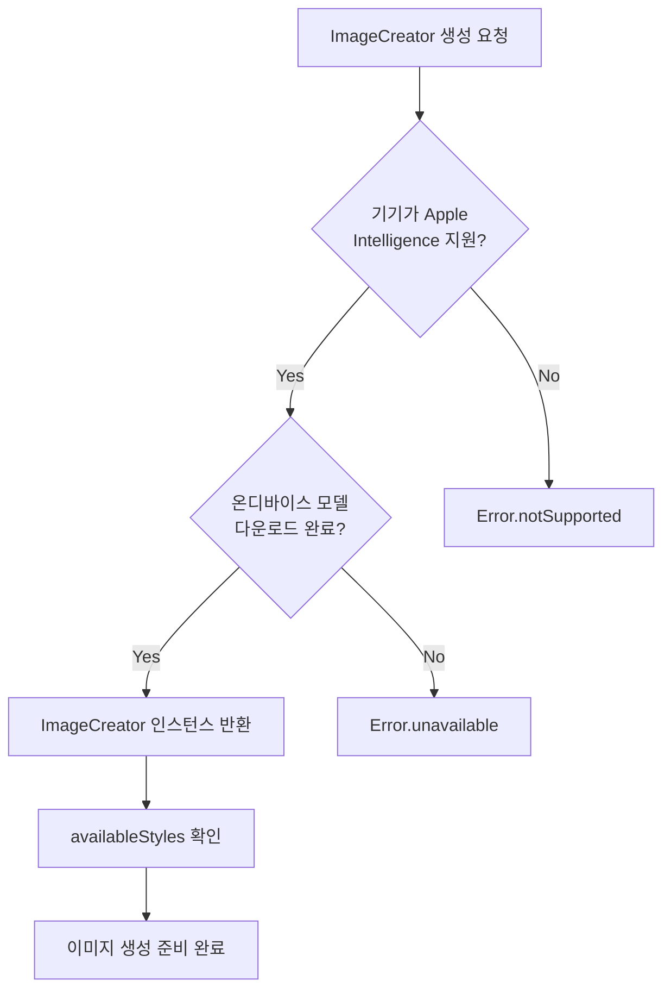
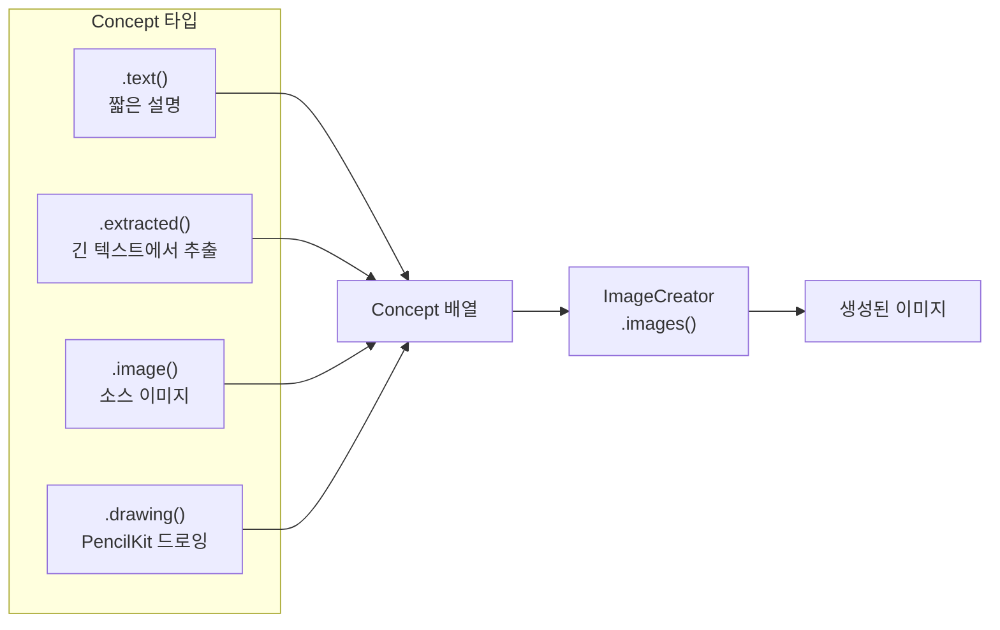
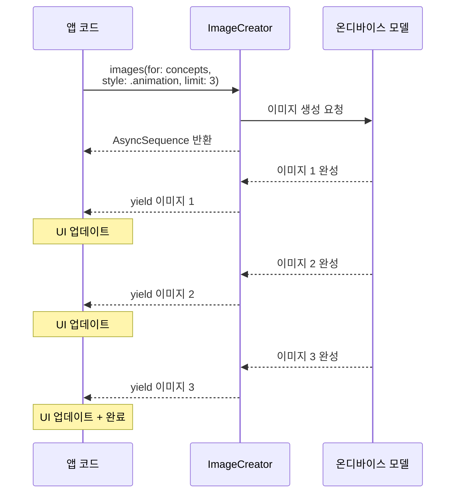
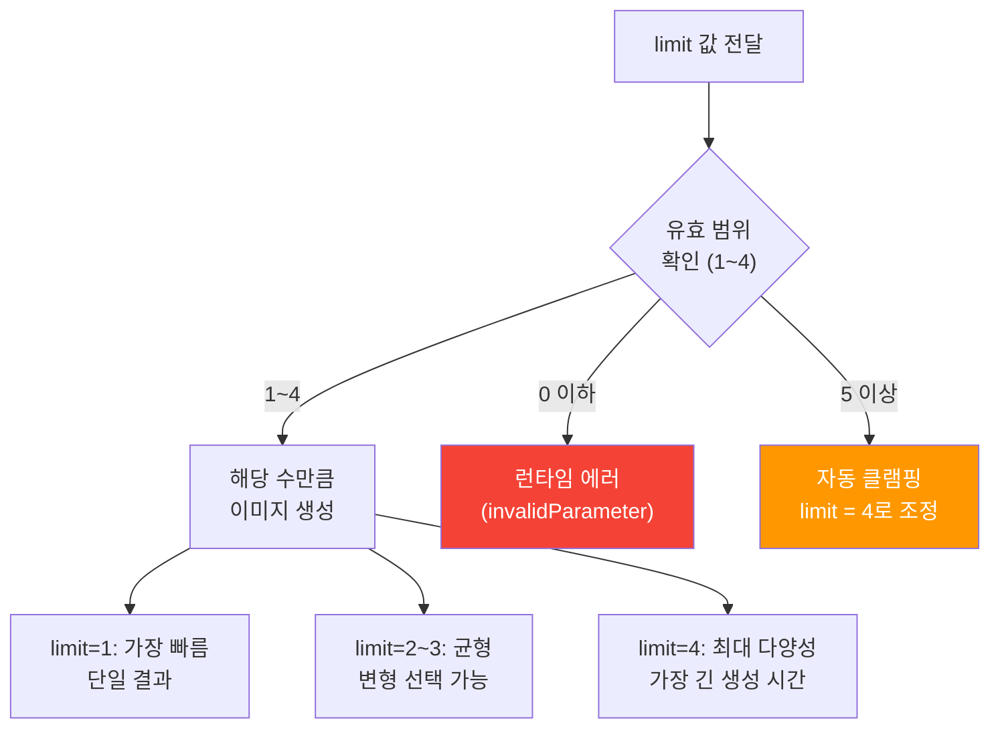
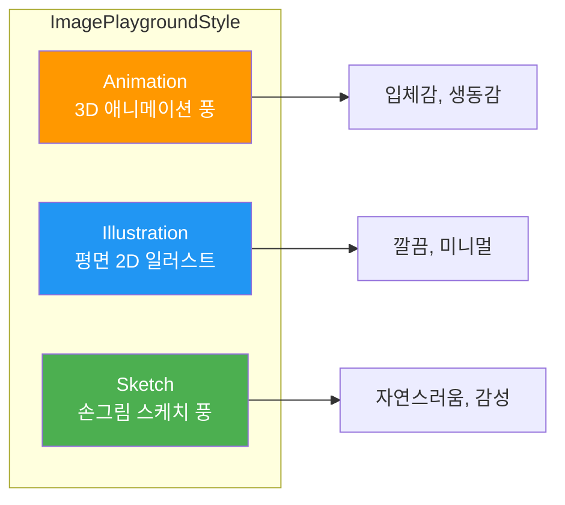
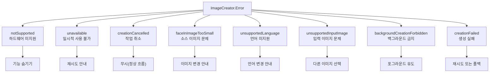

# 03. ImageCreator API 프로그래매틱 생성

> UI 없이 코드만으로 AI 이미지를 생성하는 ImageCreator API의 모든 것

## 개요

앞서 [02. ImagePlaygroundSheet 통합](12-ch12-image-playground와-시각-ai/02-02-imageplaygroundsheet-통합.md)에서는 Apple이 제공하는 시스템 UI를 통해 사용자가 직접 이미지를 생성하는 방법을 배웠습니다. 하지만 모든 상황에서 전체 화면 시트를 띄울 수 있는 건 아니죠. 예를 들어, 채팅 앱에서 메시지마다 자동으로 썸네일을 생성하거나, 동화책 앱에서 스토리에 맞는 삽화를 배치하고 싶다면? 이때 필요한 것이 바로 **ImageCreator API**입니다.

이 섹션에서는 ImagePlaygroundSheet 없이 **순수 코드만으로** 이미지를 생성하는 프로그래매틱 워크플로를 완전히 파헤칩니다.

**선수 지식**: [01. Image Playground 프레임워크 개요](12-ch12-image-playground와-시각-ai/01-01-image-playground-프레임워크-개요.md)의 Concept 타입과 스타일 개념, Swift Concurrency 기초(async/await, AsyncSequence)

**학습 목표**:
- ImageCreator 인스턴스를 안전하게 생성하고 가용성을 확인한다
- `images(for:style:limit:)` 메서드로 프로그래매틱 이미지 생성을 수행한다
- AsyncSequence 기반 결과 수신과 SwiftUI 바인딩을 구현한다
- 에러 타입별 적절한 복구 전략을 설계한다

## 왜 알아야 할까?

ImagePlaygroundSheet는 편리하지만, 본질적으로 **사용자 주도(User-Initiated)** 인터랙션입니다. 사용자가 시트를 열고, 프롬프트를 수정하고, 마음에 드는 이미지를 고릅니다. 반면 실제 앱 개발에서는 **앱 주도(App-Initiated)** 이미지 생성이 필요한 경우가 훨씬 많습니다.

- **콘텐츠 자동 생성**: 블로그 글마다 대표 이미지를 자동으로 만들어야 할 때
- **배치 처리**: 캐릭터 카드 10장을 한 번에 생성해야 할 때
- **커스텀 UX**: 시스템 시트가 아닌, 앱만의 독자적인 이미지 생성 흐름을 제공할 때
- **백그라운드 준비**: 사용자가 다음 화면으로 넘어가기 전에 미리 이미지를 준비해둘 때

ImageCreator는 이 모든 시나리오를 가능하게 하는 **프로그래머의 무기**입니다.

## 핵심 개념

### 개념 1: ImageCreator 인스턴스 생성

> 💡 **비유**: ImagePlaygroundSheet가 "사진관에 가서 사진을 찍는 것"이라면, ImageCreator는 "사진관의 장비를 우리 스튜디오에 들여놓는 것"입니다. 장비를 설치하려면 먼저 건물이 그 장비를 감당할 수 있는지 확인해야 하죠.

ImageCreator는 일반적인 `init()`이 아니라 **비동기 초기화**를 사용합니다. 왜일까요? 초기화 시점에 기기가 Apple Intelligence를 지원하는지, 온디바이스 모델이 사용 가능한지를 확인해야 하기 때문입니다.

> 📊 **그림 1**: ImageCreator 초기화와 가용성 확인 흐름



ImageCreator의 전체 초기화 흐름을 단계별로 살펴보겠습니다. import부터 가용 스타일 확인, 그리고 실제 이미지 생성 호출까지 한 흐름으로 연결되는 코드입니다:

```swift
import ImagePlayground
import SwiftUI

// 1단계: ImageCreator 생성 — 반드시 do-catch로 감싸기
do {
    // 비동기 초기화: 기기 호환성 + 모델 상태를 런타임에 확인
    let creator = try await ImageCreator()
    
    // 2단계: 사용 가능한 스타일 확인
    let styles = creator.availableStyles
    print("사용 가능한 스타일: \(styles)")
    // 예: [.animation, .illustration, .sketch]
    
    // 3단계: 스타일 선택 후 이미지 생성 요청
    guard let style = styles.first else {
        print("사용 가능한 스타일이 없습니다")
        return
    }
    
    let concepts: [ImagePlaygroundConcept] = [
        .text("벚꽃이 만개한 일본 정원의 돌다리")
    ]
    
    // 4단계: images() 호출 — AsyncSequence 반환
    let imageStream = creator.images(
        for: concepts,
        style: style,
        limit: 2  // 최대 4까지 가능
    )
    
    // 5단계: 생성된 이미지를 하나씩 수신
    for try await image in imageStream {
        if let cgImage = image.cgImage {
            print("이미지 생성 완료: \(cgImage.width)x\(cgImage.height)")
        }
    }
    
} catch ImageCreator.Error.notSupported {
    // 영구적 에러: Apple Intelligence 미지원 하드웨어
    // → 이 기기에서는 복구 불가. UI에서 해당 기능을 숨기세요
    print("이 기기에서는 이미지 생성을 사용할 수 없습니다")
    
} catch ImageCreator.Error.unavailable {
    // 일시적 에러: 모델 다운로드 미완료, 디스크 부족 등
    // → 잠시 후 재시도하거나, 사용자에게 설정 확인을 안내
    print("이미지 생성이 일시적으로 사용 불가합니다. 설정 > Apple Intelligence에서 상태를 확인하세요")
    
} catch {
    // 기타 예상치 못한 에러
    print("예상치 못한 에러: \(error)")
}
```

초기화 **전에** SwiftUI 환경 변수로 미리 체크하는 것이 더 좋은 패턴입니다:

```swift
struct ContentView: View {
    // 기기 지원 여부를 환경 변수로 미리 확인
    @Environment(\.supportsImagePlayground) private var supportsImagePlayground
    
    var body: some View {
        if supportsImagePlayground {
            ImageGeneratorView()
        } else {
            Text("이 기기에서는 AI 이미지 생성을 사용할 수 없습니다")
                .foregroundStyle(.secondary)
        }
    }
}
```

> ⚠️ **흔한 오해**: "`supportsImagePlayground`가 `true`이면 ImageCreator 초기화가 항상 성공한다"고 생각하기 쉽습니다. 하지만 환경 변수는 기기의 **하드웨어 능력**만 확인합니다. 모델이 아직 다운로드되지 않았거나 디스크 공간이 부족하면 초기화가 실패할 수 있으므로, `do-catch`는 항상 필요합니다.

### 개념 2: Concept 구성 — 이미지의 레시피 만들기

> 💡 **비유**: 이미지 생성을 요리에 비유하면, `ImagePlaygroundConcept`은 **레시피 카드**입니다. "토마토 소스 파스타"라고 한 줄로 적을 수도 있고, 요리책에서 핵심 재료를 뽑아낼 수도 있고, 참고 사진을 첨부할 수도 있죠. ImageCreator는 이 레시피 카드들을 조합하여 하나의 요리(이미지)를 완성합니다.

[01. Image Playground 프레임워크 개요](12-ch12-image-playground와-시각-ai/01-01-image-playground-프레임워크-개요.md)에서 배운 네 가지 Concept 타입을 다시 정리해보겠습니다. ImageCreator에서는 이들을 **배열로 조합**하여 전달합니다.

> 📊 **그림 2**: ImagePlaygroundConcept의 네 가지 타입과 조합



각 Concept 타입의 프로그래매틱 사용법을 살펴보겠습니다:

```swift
import ImagePlayground

// 1. 텍스트 Concept — 짧고 구체적인 설명에 적합
let textConcept = ImagePlaygroundConcept.text("우주복을 입은 고양이가 달에서 낚시하는 모습")

// 2. 추출 Concept — 긴 텍스트에서 AI가 핵심 요소를 추출
let storyText = """
어느 날 작은 마을에 파란 모자를 쓴 마법사가 나타났습니다.
마법사는 황금빛 지팡이를 들고 마을 광장에 서서
하늘에 무지개를 그렸습니다.
"""
let extractedConcept = ImagePlaygroundConcept.extracted(
    from: storyText,
    title: "마법사의 무지개"  // 선택사항: 추출 방향 가이드
)

// 3. 이미지 Concept — 소스 이미지의 스타일/구도 참조
let sourceImage: CGImage = // ... 소스 이미지 로드
let imageConcept = ImagePlaygroundConcept.image(sourceImage)

// 4. 복수 Concept 조합 — 텍스트 + 이미지를 함께 전달
let combinedConcepts: [ImagePlaygroundConcept] = [
    .text("일본풍 정원"),
    .image(sourceImage)
]
```

> 🔥 **실무 팁**: `.text()` Concept에는 한두 문장의 짧고 구체적인 설명이 가장 효과적입니다. "아름다운 풍경"처럼 추상적인 프롬프트보다 "벚꽃이 만개한 일본 정원에 돌다리가 놓인 연못"처럼 구체적인 디테일을 넣으세요. 한편, 블로그 글이나 동화 본문처럼 긴 텍스트라면 `.extracted(from:title:)`을 사용하여 AI가 핵심 시각 요소를 자동으로 뽑아내게 하는 것이 훨씬 자연스럽습니다.

### 개념 3: images() 메서드와 AsyncSequence 패턴

> 💡 **비유**: `images()` 메서드는 **빵집의 오븐**과 같습니다. 반죽(Concept)을 넣고 구워달라고 하면, 빵이 하나씩 구워질 때마다 전달해줍니다. 한 번에 최대 4개까지 주문할 수 있고, 다 구워질 때까지 기다리지 않아도 됩니다.

`images(for:style:limit:)` 메서드는 `AsyncSequence`를 반환합니다. 이는 생성된 이미지를 **하나씩 스트리밍**으로 받을 수 있다는 뜻이죠. [06. 스트리밍 응답과 실시간 UI](06-ch6-스트리밍-응답과-실시간-ui/01-01-streamresponse-api-기초.md)에서 배운 Foundation Models의 `streamResponse()`와 비슷한 패턴입니다.

> 📊 **그림 3**: images() 메서드의 AsyncSequence 동작 흐름



핵심 API의 실제 사용법입니다:

```swift
import ImagePlayground
import SwiftUI

@Observable
class ImageGeneratorViewModel {
    var generatedImages: [CGImage] = []
    var isGenerating = false
    var errorMessage: String?
    
    func generateImages(prompt: String) async {
        isGenerating = true
        errorMessage = nil
        generatedImages = []
        
        do {
            // 1. ImageCreator 인스턴스 생성
            let creator = try await ImageCreator()
            
            // 2. 사용 가능한 스타일 중 첫 번째 선택
            guard let style = creator.availableStyles.first else {
                errorMessage = "사용 가능한 스타일이 없습니다"
                isGenerating = false
                return
            }
            
            // 3. 이미지 생성 — AsyncSequence 반환
            let imageStream = creator.images(
                for: [.text(prompt)],   // Concept 배열
                style: style,            // 스타일 지정
                limit: 3                 // 최대 3장 생성 (허용 범위: 1~4)
            )
            
            // 4. 이미지가 생성될 때마다 하나씩 수신
            for try await image in imageStream {
                if let cgImage = image.cgImage {
                    generatedImages.append(cgImage)
                }
            }
        } catch {
            errorMessage = "이미지 생성 실패: \(error.localizedDescription)"
        }
        
        isGenerating = false
    }
}
```

#### limit 파라미터 상세

`limit` 파라미터에 대해 정확히 짚고 넘어가겠습니다. [Apple 공식 문서(ImageCreator)](https://developer.apple.com/documentation/ImagePlayground/ImageCreator)에 따르면, `limit`의 유효 범위는 **1~4**입니다.

> 📊 **그림 3-1**: limit 파라미터의 동작 방식



Apple의 구현에서 `limit`에 4를 초과하는 값을 전달하면 **자동으로 4로 클램핑(clamping)** 됩니다. 즉, `limit: 10`을 전달해도 에러가 발생하지 않고 최대 4장까지만 생성됩니다. 반면 0 이하의 값은 유효하지 않은 입력으로 간주되어 에러가 발생할 수 있습니다. 안전한 코드를 위해 항상 1~4 범위 내의 값을 명시적으로 전달하세요.

```swift
// limit 값별 권장 사용 시나리오
let singleImage = creator.images(for: concepts, style: style, limit: 1)
// → 썸네일, 프로필 이미지 등 단일 결과가 필요할 때 (가장 빠름)

let multipleImages = creator.images(for: concepts, style: style, limit: 4)
// → 갤러리, 변형 선택 UI 등 여러 후보가 필요할 때 (가장 느림)

// ⚠️ 범위 밖 값은 피하세요
// limit: 0  → 에러 발생 가능
// limit: 10 → 자동으로 4로 조정되지만, 의도가 불명확해짐
```

이 최대 4장 제한은 ImagePlaygroundSheet의 내부 동작과도 일치합니다. 시트 UI에서도 사용자에게 한 번에 최대 4개의 변형을 보여주는데, 이는 온디바이스 메모리 제약과 사용자 경험의 균형점으로 Apple이 설정한 기기 최적화 한도입니다.

### 개념 4: 스타일 선택과 availableStyles

모든 기기에서 세 가지 스타일(Animation, Illustration, Sketch)이 모두 지원되는 것은 아닙니다. `availableStyles` 프로퍼티로 현재 기기에서 실제로 사용 가능한 스타일을 확인해야 합니다.

> 📊 **그림 4**: 스타일별 특성 비교



```swift
func generateWithPreferredStyle(
    prompt: String,
    preferredStyle: ImagePlaygroundStyle = .animation
) async throws -> [CGImage] {
    let creator = try await ImageCreator()
    
    // 선호 스타일이 사용 가능한지 확인, 아니면 첫 번째 가용 스타일로 폴백
    let style: ImagePlaygroundStyle
    if creator.availableStyles.contains(preferredStyle) {
        style = preferredStyle
    } else if let fallback = creator.availableStyles.first {
        style = fallback
        print("'\(preferredStyle)' 스타일을 사용할 수 없어 '\(fallback)'로 대체합니다")
    } else {
        throw ImageCreator.Error.unavailable
    }
    
    var results: [CGImage] = []
    let imageStream = creator.images(
        for: [.text(prompt)],
        style: style,
        limit: 2
    )
    
    for try await image in imageStream {
        if let cgImage = image.cgImage {
            results.append(cgImage)
        }
    }
    
    return results
}
```

### 개념 5: 에러 처리 전략

ImageCreator는 8가지 구체적인 에러 타입을 정의합니다. 각각에 대해 적절한 복구 전략이 필요합니다.

> 📊 **그림 5**: ImageCreator 에러 타입과 복구 전략



에러별 처리를 구현한 코드입니다:

```swift
func handleImageGeneration(prompt: String) async -> GenerationResult {
    do {
        let creator = try await ImageCreator()
        guard let style = creator.availableStyles.first else {
            return .failure("사용 가능한 스타일이 없습니다")
        }
        
        var images: [CGImage] = []
        for try await image in creator.images(for: [.text(prompt)], style: style, limit: 1) {
            if let cgImage = image.cgImage {
                images.append(cgImage)
            }
        }
        return .success(images)
        
    } catch ImageCreator.Error.notSupported {
        // 영구적 — 이 기기에서는 불가능
        return .failure("이 기기에서는 AI 이미지 생성을 지원하지 않습니다")
        
    } catch ImageCreator.Error.unavailable {
        // 일시적 — 나중에 재시도 가능
        return .failure("이미지 생성이 일시적으로 불가합니다. 잠시 후 다시 시도해주세요")
        
    } catch ImageCreator.Error.creationCancelled {
        // Task 취소에 의한 정상 종료
        return .cancelled
        
    } catch ImageCreator.Error.unsupportedLanguage {
        // 프롬프트 언어가 지원되지 않음
        return .failure("이 언어는 아직 지원되지 않습니다. 영어나 한국어로 시도해보세요")
        
    } catch ImageCreator.Error.backgroundCreationForbidden {
        // 앱이 백그라운드로 전환됨
        return .failure("이미지 생성 중 앱이 백그라운드로 전환되었습니다. 다시 시도해주세요")
        
    } catch ImageCreator.Error.faceInImageTooSmall {
        // 소스 이미지의 얼굴이 너무 작음
        return .failure("소스 이미지에서 얼굴을 인식하기 어렵습니다. 더 선명한 사진을 사용해주세요")
        
    } catch {
        return .failure("알 수 없는 오류: \(error.localizedDescription)")
    }
}
```

## 실습: 직접 해보기

ImageCreator를 활용한 완전한 **AI 이미지 갤러리 생성기**를 만들어보겠습니다. 사용자가 텍스트를 입력하면 여러 스타일로 이미지를 생성하고, 갤러리 형태로 보여주는 앱입니다.

```swift
import SwiftUI
import ImagePlayground

// MARK: - ViewModel

@Observable
class AIImageGalleryViewModel {
    var images: [GeneratedImage] = []
    var isGenerating = false
    var progress: String = ""
    var errorMessage: String?
    
    // 생성된 이미지를 식별하기 위한 모델
    struct GeneratedImage: Identifiable {
        let id = UUID()
        let cgImage: CGImage
        let style: ImagePlaygroundStyle
        let prompt: String
    }
    
    /// 여러 스타일로 이미지를 배치 생성
    func generateGallery(prompt: String) async {
        isGenerating = true
        errorMessage = nil
        images = []
        
        do {
            let creator = try await ImageCreator()
            let availableStyles = creator.availableStyles
            
            guard !availableStyles.isEmpty else {
                errorMessage = "사용 가능한 스타일이 없습니다"
                isGenerating = false
                return
            }
            
            // 사용 가능한 각 스타일로 1장씩 생성
            for (index, style) in availableStyles.enumerated() {
                progress = "스타일 \(index + 1)/\(availableStyles.count) 생성 중..."
                
                let imageStream = creator.images(
                    for: [.text(prompt)],
                    style: style,
                    limit: 1
                )
                
                for try await image in imageStream {
                    if let cgImage = image.cgImage {
                        let generated = GeneratedImage(
                            cgImage: cgImage,
                            style: style,
                            prompt: prompt
                        )
                        images.append(generated)
                    }
                }
            }
            
            progress = "\(images.count)장 생성 완료!"
            
        } catch ImageCreator.Error.notSupported {
            errorMessage = "이 기기에서는 AI 이미지 생성을 지원하지 않습니다"
        } catch ImageCreator.Error.backgroundCreationForbidden {
            errorMessage = "앱이 활성 상태일 때만 이미지를 생성할 수 있습니다"
        } catch is CancellationError {
            progress = "생성이 취소되었습니다"
        } catch {
            errorMessage = "생성 실패: \(error.localizedDescription)"
        }
        
        isGenerating = false
    }
}

// MARK: - View

struct AIImageGalleryView: View {
    @Environment(\.supportsImagePlayground) private var supportsImagePlayground
    @State private var viewModel = AIImageGalleryViewModel()
    @State private var prompt = ""
    @State private var generationTask: Task<Void, Never>?
    
    var body: some View {
        NavigationStack {
            VStack(spacing: 16) {
                // 프롬프트 입력
                HStack {
                    TextField("이미지 설명을 입력하세요", text: $prompt)
                        .textFieldStyle(.roundedBorder)
                    
                    Button {
                        generationTask = Task {
                            await viewModel.generateGallery(prompt: prompt)
                        }
                    } label: {
                        Image(systemName: "wand.and.stars")
                    }
                    .disabled(prompt.isEmpty || viewModel.isGenerating)
                }
                .padding(.horizontal)
                
                // 진행 상태 표시
                if viewModel.isGenerating {
                    ProgressView(viewModel.progress)
                }
                
                // 에러 메시지
                if let error = viewModel.errorMessage {
                    Label(error, systemImage: "exclamationmark.triangle")
                        .foregroundStyle(.red)
                        .padding()
                }
                
                // 생성된 이미지 갤러리
                ScrollView {
                    LazyVGrid(columns: [
                        GridItem(.flexible()),
                        GridItem(.flexible())
                    ], spacing: 12) {
                        ForEach(viewModel.images) { item in
                            VStack {
                                Image(item.cgImage, scale: 1, label: Text(item.prompt))
                                    .resizable()
                                    .scaledToFit()
                                    .clipShape(RoundedRectangle(cornerRadius: 12))
                                
                                Text(styleName(item.style))
                                    .font(.caption)
                                    .foregroundStyle(.secondary)
                            }
                        }
                    }
                    .padding()
                }
                
                // 취소 버튼
                if viewModel.isGenerating {
                    Button("생성 취소", role: .destructive) {
                        generationTask?.cancel()
                    }
                }
            }
            .navigationTitle("AI 이미지 갤러리")
        }
    }
    
    /// 스타일 이름을 한국어로 변환
    private func styleName(_ style: ImagePlaygroundStyle) -> String {
        switch style {
        case .animation: return "애니메이션"
        case .illustration: return "일러스트"
        case .sketch: return "스케치"
        @unknown default: return "기타"
        }
    }
}
```

**핵심 포인트**: 이 실습에서 주목할 부분은 `generationTask`를 `@State`로 보관하여 **취소 가능하게** 만든 점입니다. 사용자가 "생성 취소" 버튼을 누르면 `task.cancel()`이 호출되고, `for try await` 루프가 `CancellationError`와 함께 종료됩니다. 이는 Swift Concurrency의 **협력적 취소(Cooperative Cancellation)** 패턴을 그대로 활용한 것입니다.

## 더 깊이 알아보기

### ImageCreator의 탄생 배경

Image Playground가 처음 공개된 WWDC24에서는 `ImagePlaygroundSheet`만 제공되었습니다. 개발자 커뮤니티에서 가장 많이 요청한 피드백이 바로 "프로그래매틱 API가 없다"는 것이었죠. Apple Developer Forums에는 "시트를 띄우지 않고 백그라운드에서 이미지를 생성할 수 없나요?"라는 질문이 쏟아졌습니다.

Apple은 이 피드백을 반영하여 **iOS 18.4** (2025년 3월)에 `ImageCreator` 클래스를 추가했습니다. 흥미로운 점은, ImageCreator가 처음부터 `AsyncSequence` 기반으로 설계되었다는 것입니다. 이는 Apple이 Swift Concurrency를 프레임워크 설계의 핵심 패턴으로 완전히 채택했음을 보여주는 사례입니다. Foundation Models 프레임워크의 `streamResponse()`도 같은 철학을 따르고 있죠.

### 온디바이스 이미지 생성의 기술적 도전

Apple의 온디바이스 이미지 생성 모델은 Diffusion 기반 모델로 추정됩니다. 일반적인 클라우드 기반 이미지 생성(Stable Diffusion XL, DALL-E 3 등)이 수십 GB의 GPU 메모리를 사용하는 것과 달리, iPhone의 제한된 메모리와 배터리 안에서 동작해야 합니다. 이를 위해 Apple은 Neural Engine(ANE) 가속을 적극 활용하며, 모델 양자화와 최적화를 통해 기기에서의 실행을 가능하게 했습니다. `backgroundCreationForbidden` 에러가 존재하는 이유도 여기에 있습니다. 이미지 생성은 **시스템 리소스를 집중적으로 사용**하는 작업이므로, 앱이 포그라운드에 있을 때만 허용하여 배터리와 열 관리를 보호하는 것이죠.

## 흔한 오해와 팁

> ⚠️ **흔한 오해**: "ImageCreator로 생성한 이미지는 영구적으로 저장된다"고 생각하는 분이 많습니다. 실제로는 ImagePlaygroundSheet와 마찬가지로 **임시 경로**에 생성되므로, 앱의 Documents 디렉토리 등 영구 저장소로 직접 이동하거나 CGImage를 Data로 변환하여 저장해야 합니다.

> 💡 **알고 계셨나요?**: ImageCreator의 `images()` 메서드는 Swift의 `AsyncSequence`를 반환하기 때문에, `for try await` 루프 외에도 `.first(where:)`, `.map()`, `.prefix()` 같은 시퀀스 연산자를 사용할 수 있습니다. 예를 들어 첫 번째 이미지만 필요하면 `imageStream.first(where: { _ in true })`로 간결하게 작성할 수 있습니다.

> 🔥 **실무 팁**: 배치 이미지 생성 시 **TaskGroup**과 결합하면 여러 프롬프트의 이미지를 동시에 생성할 수 있지만, 주의가 필요합니다. 온디바이스 모델은 하드웨어 리소스를 공유하므로 동시에 너무 많은 생성 요청을 보내면 오히려 전체 속도가 느려질 수 있습니다. 실무에서는 동시 생성 수를 **2~3개**로 제한하는 것이 좋습니다.

## 핵심 정리

| 개념 | 설명 |
|------|------|
| `ImageCreator()` | 비동기 초기화, `try await`으로 생성. 기기 호환성을 런타임에 확인 |
| `availableStyles` | 현재 기기에서 사용 가능한 스타일 배열 (animation, illustration, sketch) |
| `images(for:style:limit:)` | 핵심 생성 메서드. Concept 배열 + 스타일 + 최대 수(1~4)를 받아 AsyncSequence 반환 |
| `limit` 파라미터 | 유효 범위 1~4. 초과 시 자동 클램핑(4로 조정), 0 이하는 에러. Apple 공식 문서 기준 |
| `ImagePlaygroundConcept` | `.text()`, `.extracted()`, `.image()`, `.drawing()` 네 가지 타입으로 이미지 생성 지시 |
| AsyncSequence 패턴 | `for try await image in stream`으로 이미지를 하나씩 수신. Swift Concurrency 취소도 자동 지원 |
| 에러 처리 | 8가지 구체적 에러 타입(`notSupported`, `unavailable`, `backgroundCreationForbidden` 등)별 분기 처리 필수 |
| 가용성 확인 | `@Environment(\.supportsImagePlayground)` + `do-catch` 이중 체크 패턴 권장 |

## 다음 섹션 미리보기

이번 섹션에서는 ImageCreator로 **텍스트 기반** 이미지 생성에 집중했습니다. 다음 [04. Genmoji와 Visual Intelligence](12-ch12-image-playground와-시각-ai/04-04-genmoji와-visual-intelligence.md)에서는 Apple Intelligence의 또 다른 시각 AI 기능들을 살펴봅니다. 맞춤형 이모지를 생성하는 **Genmoji**와 카메라를 통해 실시간으로 주변 세계를 이해하는 **Visual Intelligence**의 아키텍처와 활용법을 다루겠습니다.

## 참고 자료

- [ImageCreator — Apple Developer Documentation](https://developer.apple.com/documentation/ImagePlayground/ImageCreator) - ImageCreator의 공식 API 레퍼런스. limit 파라미터 범위, 에러 타입 등 정확한 스펙 확인
- [ImageCreator.images(for:style:limit:) — Apple Developer Documentation](https://developer.apple.com/documentation/imageplayground/imagecreator/images(for:style:limit:)) - images() 메서드의 파라미터 상세 및 반환 타입 공식 문서
- [Generating images programmatically with Image Playground — Create with Swift](https://www.createwithswift.com/generating-images-programmatically-with-image-playground/) - ImageCreator API의 실전 사용법을 단계별로 다루는 튜토리얼
- [Generating images in Swift using Image Playground — Swift with Majid](https://swiftwithmajid.com/2025/11/11/generating-images-in-swift-using-image-playground/) - AsyncSequence 패턴과 스타일 선택에 대한 실용적 가이드
- [Image Playground — Apple Developer Documentation](https://developer.apple.com/documentation/imageplayground) - Image Playground 프레임워크 전체 문서
- [Starting dynamic image generation with ImageCreator — DevelopersIO](https://dev.classmethod.jp/en/articles/ios18-4-imagecreator-dynamic-image-generation/) - iOS 18.4의 ImageCreator 도입 배경과 실습 예제

---
### 🔗 Related Sessions
- [imageplaygroundsheet](12-ch12-image-playground와-시각-ai/01-01-image-playground-프레임워크-개요.md) (prerequisite)
- [imageplaygroundconcept](12-ch12-image-playground와-시각-ai/01-01-image-playground-프레임워크-개요.md) (prerequisite)
- [supportsimageplayground](12-ch12-image-playground와-시각-ai/01-01-image-playground-프레임워크-개요.md) (prerequisite)
- [imageplaygroundstyle](12-ch12-image-playground와-시각-ai/01-01-image-playground-프레임워크-개요.md) (prerequisite)
