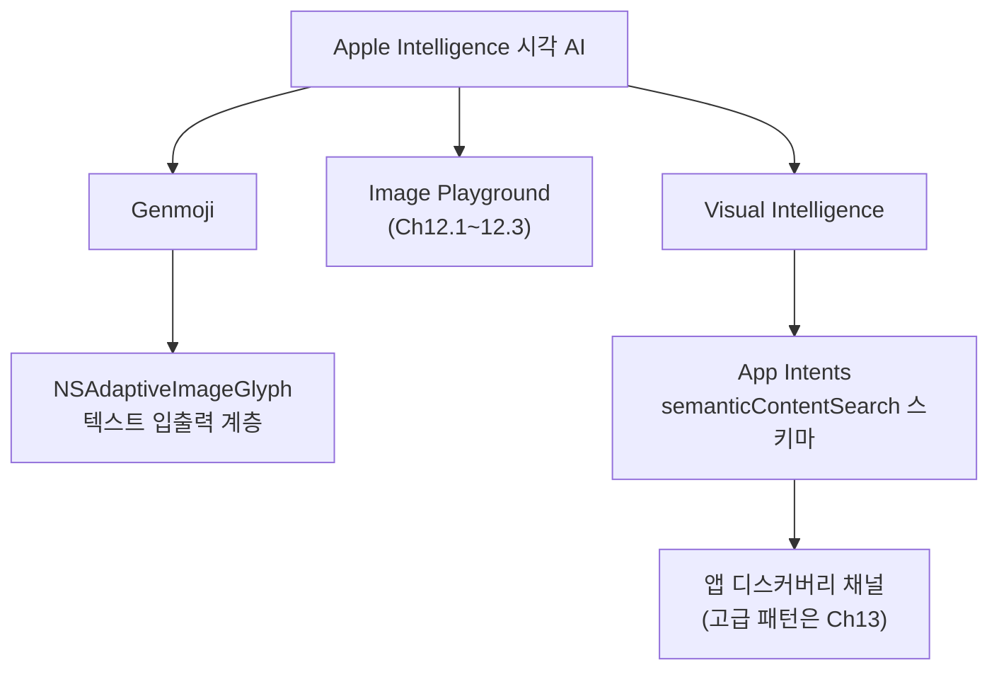
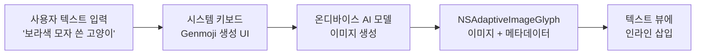
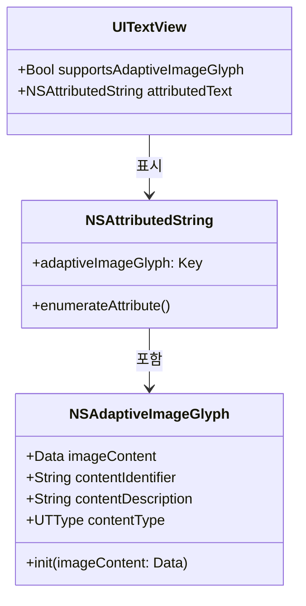
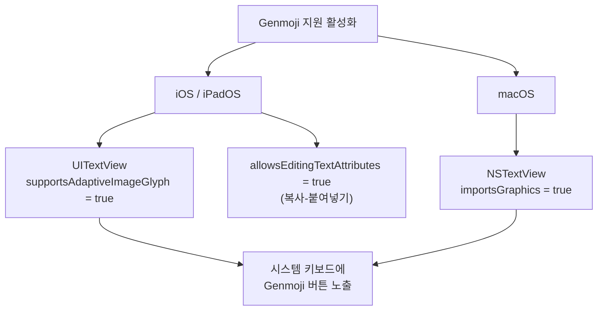
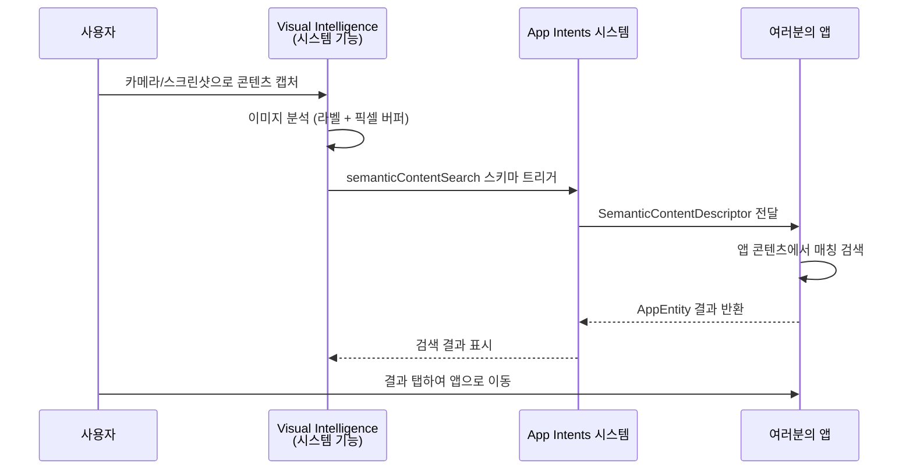
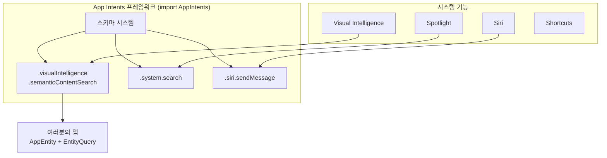
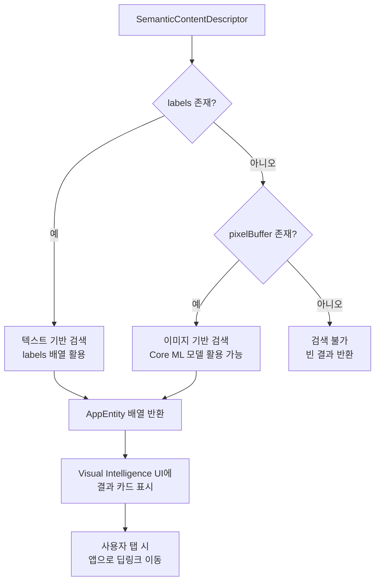

# Genmoji와 Visual Intelligence

> Apple Intelligence의 시각 AI 기능인 Genmoji 생성과 Visual Intelligence 카메라 인식을 앱에 통합하는 방법을 배웁니다.

## 개요

이 섹션에서는 Apple Intelligence의 두 가지 시각 AI 기능을 다룹니다. Genmoji는 사용자가 텍스트 설명으로 맞춤 이모지를 생성하는 기능이고, Visual Intelligence는 카메라나 스크린샷으로 주변 세계를 인식하고 앱 콘텐츠와 연결하는 시스템 기능입니다. 두 기능 모두 시스템 서비스로 동작하며, 개발자는 특정 API를 통해 앱에 통합할 수 있습니다.

이 두 기능은 성격이 상당히 다릅니다 — Genmoji는 **텍스트 입출력 계층의 확장**이고, Visual Intelligence는 **앱 디스커버리 채널의 확장**입니다. 그래서 이 섹션에서는 각각의 핵심 통합 패턴에 집중하고, Visual Intelligence의 고급 App Intents 패턴(엔티티 쿼리 최적화, 복합 스키마 조합 등)은 [Ch13. App Intents와 시스템 통합](13-ch13-app-intents와-시스템-통합/01-app-intents-프레임워크-개요.md)에서 더 깊이 다룹니다.

**선수 지식**: [Image Playground 프레임워크 개요](12-ch12-image-playground와-시각-ai/01-01-image-playground-프레임워크-개요.md)에서 배운 Apple Intelligence 시각 AI의 전체 구조, [ImageCreator API 프로그래매틱 생성](12-ch12-image-playground와-시각-ai/03-03-imagecreator-api-프로그래매틱-생성.md)에서 다룬 프로그래매틱 이미지 생성 패턴

**학습 목표**:
- Genmoji의 동작 원리와 NSAdaptiveImageGlyph API의 4가지 핵심 프로퍼티를 이해한다
- SwiftUI/UIKit에서 Genmoji 입력·표시·저장을 구현한다
- Visual Intelligence 시스템 기능의 아키텍처와 App Intents 기반 통합 방식을 이해한다
- App Intents의 semanticContentSearch 스키마를 활용한 검색 결과 제공을 구현한다

## 왜 알아야 할까?

이모지는 디지털 커뮤니케이션의 핵심이 된 지 오래입니다. 그런데 유니코드 이모지에는 한계가 있죠 — "보라색 모자를 쓴 고양이"를 정확히 표현할 이모지는 없습니다. Genmoji는 바로 이 한계를 AI로 해결합니다. 사용자가 텍스트로 설명하면 그 즉시 맞춤 이모지가 생성되거든요.

Visual Intelligence는 더 근본적인 변화입니다. 사용자가 카메라를 들거나 스크린샷을 찍으면 Apple Intelligence가 화면 속 콘텐츠를 이해하고, **여러분의 앱이 그 결과를 제공**할 수 있게 됩니다. 예를 들어 여행 앱이라면 사용자가 랜드마크 사진을 찍었을 때 관련 여행 정보가 Visual Intelligence 결과에 바로 나타나는 거죠.

> 📊 **그림 0**: 이 섹션에서 다루는 두 가지 시각 AI 기능의 위치



메시징 앱이라면 Genmoji 지원은 필수이고, 콘텐츠 중심 앱이라면 Visual Intelligence 통합은 강력한 사용자 유입 채널이 됩니다.

## 핵심 개념

### 개념 1: Genmoji의 동작 원리

> 💡 **비유**: Genmoji는 "나만의 도장"을 만드는 것과 비슷합니다. 기존 이모지가 문구점에서 파는 기성 도장이라면, Genmoji는 원하는 디자인을 설명하면 즉석에서 새겨주는 맞춤 도장이에요. 그리고 이 도장은 편지(텍스트) 위에 바로 찍을 수 있습니다.

Genmoji는 시스템 키보드에 내장된 AI 이미지 생성 기능입니다. 사용자가 텍스트로 설명하면 온디바이스 모델이 정사각형 이미지를 생성하고, 이것이 텍스트 안에 인라인으로 삽입됩니다. 핵심은 Genmoji가 유니코드 이모지가 아니라 **이미지 글리프**라는 점입니다.

> 📊 **그림 1**: Genmoji 생성 및 렌더링 파이프라인



Genmoji의 기술적 기반은 `NSAdaptiveImageGlyph`입니다. iOS 18에서 도입된 이 클래스는 네 가지 핵심 프로퍼티를 가지는데, 각각의 역할을 정확히 이해해야 올바르게 저장하고 복원할 수 있습니다:

```swift
// NSAdaptiveImageGlyph의 4가지 핵심 프로퍼티
let glyph: NSAdaptiveImageGlyph

// 1. imageContent — 이미지 바이너리 데이터
//    다양한 해상도를 포함하는 이미지 데이터. 텍스트 크기에 따라 적절한 해상도가 자동 선택됨
let imageData: Data = glyph.imageContent
print("이미지 크기: \(imageData.count) bytes")

// 2. contentIdentifier — 글로벌 고유 식별자
//    UUID 기반의 고유 ID. 동일 Genmoji를 여러 곳에서 사용할 때 중복 저장 방지에 활용
let id: String = glyph.contentIdentifier
print("고유 ID: \(id)")  // 예: "8F3A2B1C-D4E5-6F78-9A0B-1C2D3E4F5678"

// 3. contentDescription — 접근성용 대체 텍스트
//    VoiceOver가 읽어주는 텍스트. 시스템이 자동 생성하거나 사용자가 편집 가능
let altText: String = glyph.contentDescription
print("접근성 설명: \(altText)")  // 예: "보라색 모자를 쓴 고양이"

// 4. contentType — 이미지 포맷 타입
//    UTType으로 표현되는 이미지 형식. 주로 .png
let type: UTType = glyph.contentType
print("포맷: \(type.identifier)")  // 예: "public.png"
```

각 프로퍼티의 활용 시나리오를 정리하면 다음과 같습니다:

| 프로퍼티 | 타입 | 용도 | 활용 시나리오 |
|----------|------|------|--------------|
| `imageContent` | `Data` | 실제 이미지 바이너리 | 서버 전송, 로컬 캐싱, 렌더링 |
| `contentIdentifier` | `String` | UUID 기반 고유 ID | 중복 방지, DB 키, 캐시 키 |
| `contentDescription` | `String` | 접근성 대체 텍스트 | VoiceOver, 검색, 폴백 표시 |
| `contentType` | `UTType` | 이미지 포맷 정보 | 저장 시 확장자 결정, 디코딩 |

> 📊 **그림 2**: NSAdaptiveImageGlyph의 데이터 구조



중요한 점은 Genmoji가 `NSAttributedString`의 어트리뷰트로 저장된다는 것입니다. 즉, 일반 `String`에는 Genmoji를 담을 수 없고, 반드시 `NSAttributedString`이나 `AttributedString`을 사용해야 합니다.

### 개념 2: SwiftUI/UIKit에서 Genmoji 활성화

> 💡 **비유**: 가게 문에 "카드 결제 가능" 스티커를 붙이는 것과 같습니다. 텍스트 뷰에 `supportsAdaptiveImageGlyph = true`라는 "Genmoji 사용 가능" 딱지를 붙이면, 시스템 키보드가 알아서 Genmoji 생성 버튼을 노출합니다.

앱에서 Genmoji를 지원하려면 텍스트 입력 뷰가 이미지 글리프를 받아들일 수 있다고 시스템에 알려야 합니다. UIKit에서는 `UITextView`의 한 줄 설정으로 끝납니다:

```swift
import UIKit

// UIKit에서 Genmoji 활성화 — 딱 한 줄!
let textView = UITextView()
textView.supportsAdaptiveImageGlyph = true  // Genmoji 입력 활성화
textView.allowsEditingTextAttributes = true // 복사-붙여넣기 지원
```

SwiftUI에서는 `UIViewRepresentable`로 래핑하여 사용합니다:

```swift
import SwiftUI

/// Genmoji를 지원하는 SwiftUI 텍스트 에디터
struct GenmojiTextEditor: UIViewRepresentable {
    @Binding var attributedText: NSAttributedString
    
    func makeUIView(context: Context) -> UITextView {
        let textView = UITextView()
        textView.isEditable = true
        textView.font = .preferredFont(forTextStyle: .body)
        
        // Genmoji 지원의 핵심 — 이 두 줄이 전부입니다
        textView.supportsAdaptiveImageGlyph = true
        textView.allowsEditingTextAttributes = true
        
        textView.delegate = context.coordinator
        return textView
    }
    
    func updateUIView(_ uiView: UITextView, context: Context) {
        if uiView.attributedText != attributedText {
            uiView.attributedText = attributedText
        }
    }
    
    func makeCoordinator() -> Coordinator {
        Coordinator(self)
    }
    
    class Coordinator: NSObject, UITextViewDelegate {
        var parent: GenmojiTextEditor
        
        init(_ parent: GenmojiTextEditor) {
            self.parent = parent
        }
        
        func textViewDidChange(_ textView: UITextView) {
            // attributedText로 바인딩하여 Genmoji 데이터 보존
            parent.attributedText = textView.attributedText
        }
    }
}
```

macOS에서는 `NSTextView`에 `importsGraphics = true`를 설정합니다:

```swift
// macOS에서 Genmoji 활성화
let textView = NSTextView()
textView.importsGraphics = true  // macOS용 이미지 글리프 지원
```

> 📊 **그림 3**: 플랫폼별 Genmoji 활성화 API



### 개념 3: Genmoji 데이터 추출과 저장

> 💡 **비유**: Genmoji가 들어간 텍스트를 저장하는 것은 사진이 붙은 편지를 보관하는 것과 같습니다. 글자만 따로 보관하면 사진을 잃어버리죠. 사진(Genmoji)의 위치와 데이터를 함께 기록해야 나중에 원본 그대로 복원할 수 있습니다.

Genmoji가 포함된 텍스트를 데이터베이스나 서버에 저장하려면 `NSAttributedString`에서 이미지 글리프를 추출해야 합니다. `enumerateAttribute(_:in:)` 메서드로 모든 Genmoji를 순회할 수 있습니다:

```swift
/// NSAttributedString에서 Genmoji 데이터를 분리 추출
func extractGenmoji(from attributedString: NSAttributedString) 
    -> (text: String, glyphs: [(range: NSRange, id: String)], data: [String: Data]) {
    
    let plainText = attributedString.string
    var glyphRanges: [(range: NSRange, id: String)] = []
    var glyphData: [String: Data] = [:]
    
    // .adaptiveImageGlyph 어트리뷰트를 순회하며 Genmoji 수집
    attributedString.enumerateAttribute(
        .adaptiveImageGlyph,
        in: NSRange(location: 0, length: attributedString.length)
    ) { value, range, _ in
        guard let glyph = value as? NSAdaptiveImageGlyph else { return }
        
        let id = glyph.contentIdentifier
        glyphRanges.append((range: range, id: id))
        
        // 동일 Genmoji는 한 번만 저장 (중복 방지)
        if glyphData[id] == nil {
            glyphData[id] = glyph.imageContent
        }
    }
    
    return (plainText, glyphRanges, glyphData)
}
```

저장된 데이터로부터 원래의 `NSAttributedString`을 복원하는 것도 간단합니다:

```swift
/// 저장된 데이터로 Genmoji가 포함된 NSAttributedString 복원
func restoreGenmoji(
    text: String,
    glyphRanges: [(range: NSRange, id: String)],
    glyphData: [String: Data]
) -> NSAttributedString {
    
    let result = NSMutableAttributedString(string: text)
    
    // 각 범위에 NSAdaptiveImageGlyph를 다시 삽입
    for (range, id) in glyphRanges {
        guard let data = glyphData[id] else { continue }
        let glyph = NSAdaptiveImageGlyph(imageContent: data)
        result.addAttribute(.adaptiveImageGlyph, value: glyph, range: range)
    }
    
    return result
}
```

RTFD 포맷을 사용하면 더 간단하게 직렬화/역직렬화할 수 있습니다:

```swift
// RTFD 포맷으로 일괄 직렬화 (Genmoji 포함)
let rtfdData = try attributedString.data(
    from: NSRange(location: 0, length: attributedString.length),
    documentAttributes: [.documentType: NSAttributedString.DocumentType.rtfd]
)

// RTFD에서 복원 — Genmoji가 자동으로 복원됨
let restored = try NSAttributedString(
    data: rtfdData,
    documentAttributes: nil
)
```

### 개념 4: Visual Intelligence 시스템 기능 개요

> 💡 **비유**: Visual Intelligence는 "AI 안내 데스크"와 같습니다. 사용자가 사진(카메라나 스크린샷)을 들고 "이게 뭐예요?"하고 물으면, 시스템이 여러 앱에게 "혹시 이거 아는 사람?"하고 물어봅니다. 여러분의 앱이 "아, 그거 우리 앱에 있어요!"하고 답하면, 사용자가 바로 여러분의 앱으로 이동할 수 있는 거죠.

Visual Intelligence는 iOS 26에서 크게 확장된 Apple Intelligence의 **시스템 기능**입니다. 원래 iPhone 카메라 버튼으로만 작동하던 것이 이제 **스크린샷에서도** 작동합니다. 사용자가 스크린샷 버튼을 누르면 화면 속 콘텐츠를 Visual Intelligence가 분석하고, 관련 앱의 결과를 보여줍니다.

> ⚠️ **흔한 오해**: "Visual Intelligence 통합에는 별도의 `VisualIntelligence` 프레임워크를 import해야 한다"고 생각하기 쉽지만, 실제로는 **`AppIntents` 프레임워크만 import하면 됩니다**. Visual Intelligence는 독립 프레임워크가 아니라 시스템 기능이며, 개발자는 App Intents에 추가된 `visualIntelligence.semanticContentSearch` 스키마를 구현하는 방식으로 통합합니다. 즉, 여러분이 작성하는 코드는 App Intents 코드입니다.

> 📊 **그림 4**: Visual Intelligence 앱 통합 아키텍처



개발자 관점에서 Visual Intelligence 통합의 핵심은 **App Intents 프레임워크의 스키마 확장**입니다. 별도 프레임워크를 import하는 것이 아니라, App Intents에 새로 추가된 `visualIntelligence.semanticContentSearch` 스키마를 구현하면 됩니다. 이 구조 덕분에 Siri, Shortcuts, Spotlight, Visual Intelligence가 모두 하나의 통합된 App Intents 스키마 시스템을 공유하게 됩니다. `semanticContentSearch` 스키마의 심화 활용 — 엔티티 쿼리 최적화, 복합 스키마 조합, 다른 시스템 인텐트와의 연동 패턴 등 — 은 [Visual Intelligence 고급 통합](13-ch13-app-intents와-시스템-통합/03-visual-intelligence-고급-통합.md)에서 전문적으로 다룹니다.

```swift
import AppIntents  // Visual Intelligence용 별도 import는 없음!

// Visual Intelligence 검색 인텐트 정의
// App Intents의 스키마를 통해 Visual Intelligence 시스템 기능과 통합
@AppIntent(schema: .visualIntelligence.semanticContentSearch)
struct SearchByImageIntent {
    // 시스템이 자동으로 전달하는 시각 콘텐츠 설명자
    var semanticContent: SemanticContentDescriptor
    
    @Dependency
    var searchService: SearchService
    
    func perform() async throws -> some IntentResult {
        // 라벨(텍스트 설명) 또는 픽셀 버퍼(이미지 데이터)로 검색
        if let labels = semanticContent.labels {
            await searchService.searchByLabels(labels)
        } else if let pixelBuffer = semanticContent.pixelBuffer {
            await searchService.searchByImage(pixelBuffer)
        }
        return .result()
    }
}
```

> 📊 **그림 5**: Visual Intelligence 통합의 기술 스택 — 별도 프레임워크가 아닌 App Intents 확장



이 섹션에서는 Visual Intelligence 통합의 기본 패턴(스키마 구현, 엔티티 정의, 검색 결과 반환)을 다룹니다. App Intents 프레임워크의 전체 아키텍처와 스키마 시스템에 대한 체계적인 이해는 [App Intents 프레임워크 개요](13-ch13-app-intents와-시스템-통합/01-app-intents-프레임워크-개요.md)에서 시작하여, `semanticContentSearch` 스키마의 심화 패턴(엔티티 쿼리 퍼포먼스 튜닝, `@UnionValue` 고급 조합, Spotlight·Siri 스키마와의 다중 통합)은 [Visual Intelligence 고급 통합](13-ch13-app-intents와-시스템-통합/03-visual-intelligence-고급-통합.md)에서 본격적으로 다룹니다.

### 개념 5: Visual Intelligence 엔티티와 검색 결과

> 💡 **비유**: Visual Intelligence에 검색 결과를 제공하는 것은 백화점 안내 데스크에 매장 카탈로그를 등록하는 것과 같습니다. 고객(사용자)이 "이런 물건 어디 있어요?"하고 물으면, 안내 데스크(Visual Intelligence)가 등록된 카탈로그(AppEntity)에서 찾아 안내해줍니다.

Visual Intelligence에 검색 결과를 반환하려면 앱의 콘텐츠를 `AppEntity`로 모델링해야 합니다. 여러 종류의 콘텐츠를 반환해야 한다면 `@UnionValue`를 사용합니다:

```swift
import AppIntents

// 앱 엔티티 정의 — Visual Intelligence 결과로 표시될 콘텐츠
struct LandmarkEntity: AppEntity {
    static var defaultQuery = LandmarkEntityQuery()
    static var typeDisplayRepresentation: TypeDisplayRepresentation = "랜드마크"
    
    var id: String
    var name: String
    var imageURL: URL?
    var description: String
    
    var displayRepresentation: DisplayRepresentation {
        DisplayRepresentation(
            title: "\(name)",
            subtitle: "\(description)",
            image: imageURL.map { .init(url: $0) }
        )
    }
}

// 여러 엔티티 타입을 하나의 결과로 반환할 때
@UnionValue
enum VisualSearchResult {
    case landmark(LandmarkEntity)
    case product(ProductEntity)
    case collection(CollectionEntity)
}
```

`EntityQuery`를 구현하여 Visual Intelligence가 전달하는 시각 정보를 기반으로 검색을 수행합니다:

```swift
struct LandmarkEntityQuery: EntityQuery {
    func entities(for identifiers: [String]) async throws -> [LandmarkEntity] {
        // ID 기반 조회 — 사용자가 결과를 탭했을 때
        try await LandmarkStore.shared.fetch(ids: identifiers)
    }
    
    func suggestedEntities() async throws -> [LandmarkEntity] {
        // Visual Intelligence가 추천 결과를 요청할 때
        try await LandmarkStore.shared.popular()
    }
}
```

여기서 다루는 `AppEntity`와 `EntityQuery`는 Visual Intelligence 통합의 기본 구현입니다. 대량의 엔티티를 다루는 앱에서의 쿼리 퍼포먼스 최적화, 인덱싱 전략, 그리고 `@UnionValue`를 활용한 복합 결과 타입 설계 같은 고급 패턴은 [AppEntity와 EntityQuery 설계](13-ch13-app-intents와-시스템-통합/02-appentity와-entityquery-설계.md)에서 체계적으로 다룹니다.

> 📊 **그림 6**: Visual Intelligence 검색 결과 반환 흐름



## 실습: 직접 해보기

Genmoji를 지원하는 메시지 작성 뷰와 Visual Intelligence 검색을 구현하는 실습을 진행합니다.

### Part 1: Genmoji 지원 메시지 컴포저

```swift
import SwiftUI
import UIKit

// MARK: - Genmoji 지원 메시지 컴포저

/// Genmoji 입력과 표시를 지원하는 완전한 메시지 작성 뷰
struct GenmojiMessageComposer: View {
    @State private var attributedText = NSAttributedString()
    @State private var messages: [MessageItem] = []
    
    var body: some View {
        VStack(spacing: 0) {
            // 메시지 목록
            ScrollView {
                LazyVStack(alignment: .leading, spacing: 12) {
                    ForEach(messages) { message in
                        MessageBubble(message: message)
                    }
                }
                .padding()
            }
            
            Divider()
            
            // Genmoji 지원 입력 영역
            HStack(alignment: .bottom) {
                GenmojiTextEditor(attributedText: $attributedText)
                    .frame(minHeight: 36, maxHeight: 120)
                    .padding(.horizontal, 12)
                    .padding(.vertical, 8)
                    .background(.regularMaterial)
                    .clipShape(RoundedRectangle(cornerRadius: 20))
                
                Button(action: sendMessage) {
                    Image(systemName: "arrow.up.circle.fill")
                        .font(.title2)
                        .foregroundStyle(.blue)
                }
                .disabled(attributedText.length == 0)
            }
            .padding(.horizontal)
            .padding(.vertical, 8)
        }
        .navigationTitle("Genmoji 채팅")
    }
    
    private func sendMessage() {
        // Genmoji 데이터를 RTFD로 직렬화하여 저장
        let data = try? attributedText.data(
            from: NSRange(location: 0, length: attributedText.length),
            documentAttributes: [
                .documentType: NSAttributedString.DocumentType.rtfd
            ]
        )
        
        let message = MessageItem(
            id: UUID().uuidString,
            rtfdData: data,
            timestamp: Date()
        )
        messages.append(message)
        attributedText = NSAttributedString() // 입력 초기화
    }
}

// MARK: - 메시지 데이터 모델

struct MessageItem: Identifiable {
    let id: String
    let rtfdData: Data?
    let timestamp: Date
    
    /// RTFD 데이터에서 Genmoji 포함 텍스트 복원
    var attributedContent: NSAttributedString? {
        guard let data = rtfdData else { return nil }
        return try? NSAttributedString(data: data, documentAttributes: nil)
    }
}

// MARK: - 메시지 버블 뷰

struct MessageBubble: View {
    let message: MessageItem
    
    var body: some View {
        HStack {
            Spacer()
            // Genmoji가 포함된 AttributedString 표시
            if let content = message.attributedContent {
                AttributedTextView(attributedString: content)
                    .padding(.horizontal, 16)
                    .padding(.vertical, 10)
                    .background(.blue)
                    .foregroundStyle(.white)
                    .clipShape(RoundedRectangle(cornerRadius: 18))
            }
        }
    }
}

// MARK: - NSAttributedString을 표시하는 읽기 전용 뷰

struct AttributedTextView: UIViewRepresentable {
    let attributedString: NSAttributedString
    
    func makeUIView(context: Context) -> UITextView {
        let textView = UITextView()
        textView.isEditable = false
        textView.isScrollEnabled = false
        textView.backgroundColor = .clear
        textView.textContainerInset = .zero
        // 읽기 전용이어도 Genmoji 렌더링을 위해 활성화
        textView.supportsAdaptiveImageGlyph = true
        return textView
    }
    
    func updateUIView(_ uiView: UITextView, context: Context) {
        uiView.attributedText = attributedString
    }
}
```

### Part 2: Visual Intelligence 검색 통합

```swift
import AppIntents

// MARK: - Visual Intelligence 검색 인텐트

/// 사용자가 카메라/스크린샷으로 캡처한 콘텐츠를 앱에서 검색
/// 참고: AppIntents 프레임워크의 스키마를 통해 Visual Intelligence 시스템 기능과 통합
/// semanticContentSearch 스키마의 고급 패턴은 Ch13에서 상세히 다룸
@AppIntent(schema: .visualIntelligence.semanticContentSearch)
struct VisualSearchIntent {
    // 시스템이 자동 주입하는 시각 콘텐츠 정보
    var semanticContent: SemanticContentDescriptor
    
    @Dependency
    var navigator: AppNavigator
    
    func perform() async throws -> some IntentResult {
        // 1. 라벨(텍스트 설명)이 있으면 텍스트 검색 우선
        if let labels = semanticContent.labels {
            let query = labels.joined(separator: " ")
            await navigator.showSearchResults(query: query)
        }
        // 2. 픽셀 버퍼(이미지)가 있으면 이미지 유사도 검색
        else if let pixelBuffer = semanticContent.pixelBuffer {
            await navigator.showImageSearchResults(buffer: pixelBuffer)
        }
        
        return .result()
    }
}

// MARK: - 앱 엔티티 정의

/// Visual Intelligence 결과로 표시될 앱 콘텐츠
struct PlaceEntity: AppEntity {
    static var defaultQuery = PlaceEntityQuery()
    static var typeDisplayRepresentation: TypeDisplayRepresentation = "장소"
    
    var id: String
    var name: String
    var category: String
    var thumbnailURL: URL?
    
    var displayRepresentation: DisplayRepresentation {
        DisplayRepresentation(
            title: "\(name)",
            subtitle: "\(category)",
            image: thumbnailURL.map { .init(url: $0) }
        )
    }
}

// MARK: - 엔티티 쿼리

struct PlaceEntityQuery: EntityQuery {
    func entities(for identifiers: [String]) async throws -> [PlaceEntity] {
        // Visual Intelligence 결과에서 사용자가 탭한 항목 조회
        try await PlaceStore.shared.fetchByIds(identifiers)
    }
    
    func suggestedEntities() async throws -> [PlaceEntity] {
        // 추천 결과 제공
        try await PlaceStore.shared.trending()
    }
}

// MARK: - 앱 내비게이터

@Observable
class AppNavigator {
    var currentSearchQuery: String?
    
    func showSearchResults(query: String) {
        currentSearchQuery = query
        // 앱 내 검색 화면으로 네비게이션
    }
    
    func showImageSearchResults(buffer: CVPixelBuffer) {
        // Core ML 모델로 이미지 특징 추출 후 유사 콘텐츠 검색
        // Ch17에서 다루는 하이브리드 패턴 적용 가능
    }
}
```

```run:swift
// Genmoji 지원 확인 코드 (개념 시연용)
let textView = UITextView()
textView.supportsAdaptiveImageGlyph = true

print("Genmoji 지원 활성화: \(textView.supportsAdaptiveImageGlyph)")
print("편집 속성 허용: \(textView.allowsEditingTextAttributes)")

// NSAdaptiveImageGlyph의 4가지 프로퍼티 확인
let sampleData = Data([0x89, 0x50, 0x4E, 0x47]) // PNG 헤더 예시
let glyph = NSAdaptiveImageGlyph(imageContent: sampleData)
print("--- NSAdaptiveImageGlyph 프로퍼티 ---")
print("1. imageContent 크기: \(glyph.imageContent.count) bytes")
print("2. contentIdentifier: \(glyph.contentIdentifier)")
print("3. contentDescription: \(glyph.contentDescription)")
print("4. contentType: \(glyph.contentType.identifier)")
```

```output
Genmoji 지원 활성화: true
편집 속성 허용: false
--- NSAdaptiveImageGlyph 프로퍼티 ---
1. imageContent 크기: 4 bytes
2. contentIdentifier: 8F3A2B1C-D4E5-6F78-9A0B-1C2D3E4F5678
3. contentDescription: 
4. contentType: public.png
```

## 더 깊이 알아보기

### Genmoji의 탄생 — 유니코드 이모지의 한계에서 시작

이모지는 1999년 일본 NTT 도코모의 쿠리타 시게타카(栗田穣崇)가 i-mode 서비스를 위해 만든 176개의 12×12 픽셀 아이콘에서 시작되었습니다. 2010년 유니코드 6.0에 편입되면서 전 세계적으로 퍼졌죠. 하지만 유니코드 이모지에는 근본적인 한계가 있습니다 — 새 이모지를 추가하려면 유니코드 컨소시엄의 승인을 받아야 하고, 이 과정이 보통 2년 이상 걸립니다.

Apple은 2024년 WWDC에서 이 문제에 대한 해답을 제시했습니다. AI가 실시간으로 이미지를 생성하면 유니코드 프로세스를 기다릴 필요가 없다는 발상이었죠. 핵심 기술적 과제는 "어떻게 이미지를 텍스트처럼 자연스럽게 흘려보내느냐"였는데, Apple은 `NSAdaptiveImageGlyph`라는 새 데이터 타입으로 이를 해결했습니다. 이 타입은 여러 해상도의 이미지를 담고, 텍스트 메트릭(정렬, 크기 조절)을 자동으로 계산하여 어떤 폰트 크기에서도 자연스럽게 인라인으로 표시됩니다.

### Visual Intelligence의 진화 — 카메라에서 스크린까지

Visual Intelligence는 2024년 iPhone 16의 카메라 컨트롤 버튼과 함께 출발했습니다. 처음에는 카메라로 보는 것만 인식했지만, 2025년 iOS 26에서 스크린샷으로 확장되었습니다. 이는 단순한 기능 확장이 아닌 철학적 전환입니다 — "카메라가 세상을 본다"에서 "AI가 사용자의 맥락을 이해한다"로 바뀐 것입니다. 개발자에게는 새로운 앱 디스커버리 채널이 열린 셈이죠.

흥미롭게도 Apple이 Visual Intelligence 통합에 **기존의 App Intents 프레임워크를 확장**하는 방식을 택한 것은 주목할 만합니다. 새 프레임워크를 만드는 대신 기존의 App Intents 스키마 시스템에 `.visualIntelligence.semanticContentSearch`를 추가한 것인데, 이는 Siri, Shortcuts, Spotlight, 그리고 Visual Intelligence가 모두 하나의 통합 스키마 시스템을 공유하게 되었다는 뜻입니다. 이 통합 아키텍처의 더 깊은 구조와 활용법은 [App Intents 프레임워크 개요](13-ch13-app-intents와-시스템-통합/01-app-intents-프레임워크-개요.md)에서 시작하여, [Visual Intelligence 고급 통합](13-ch13-app-intents와-시스템-통합/03-visual-intelligence-고급-통합.md)에서 실전 패턴을 다룹니다.

## 흔한 오해와 팁

> ⚠️ **흔한 오해**: "Genmoji는 유니코드 이모지처럼 `String`에 담을 수 있다." 아닙니다! Genmoji는 `NSAdaptiveImageGlyph`라는 이미지 데이터이며, 반드시 `NSAttributedString`이나 RTFD 포맷으로 저장해야 합니다. 일반 `String`으로 변환하면 Genmoji 데이터가 소실됩니다.

> ⚠️ **흔한 오해**: "Visual Intelligence를 앱에 통합하려면 `import VisualIntelligence`가 필요하다." Visual Intelligence는 별도의 프레임워크가 아니라 **시스템 기능**입니다. 개발자는 `import AppIntents`만 하고, `.visualIntelligence.semanticContentSearch` 스키마를 구현하면 됩니다. App Intents가 Visual Intelligence와 여러분의 앱 사이를 연결하는 다리 역할을 합니다.

> 💡 **알고 계셨나요?**: Visual Intelligence의 `SemanticContentDescriptor`는 `labels`(텍스트 설명 배열)과 `pixelBuffer`(원본 이미지) 두 가지를 모두 제공합니다. Apple의 온디바이스 모델이 이미 이미지를 분석해서 라벨을 생성해주기 때문에, 대부분의 앱은 복잡한 이미지 분석 없이 `labels` 텍스트만으로 검색을 구현할 수 있습니다.

> 🔥 **실무 팁**: Genmoji를 서버에 전송해야 할 때는 RTFD 직렬화가 가장 안전합니다. 하지만 RTFD는 Apple 전용 포맷이므로, 크로스 플랫폼이 필요한 경우에는 `extractGenmoji()` 패턴으로 텍스트와 이미지 데이터를 분리하여 JSON + Base64로 전송하세요. `contentIdentifier`를 키로 사용하면 중복 전송도 방지할 수 있습니다.

> 🔥 **실무 팁**: Visual Intelligence 통합 시, 엔티티의 `displayRepresentation`에 **썸네일 이미지를 반드시 포함**하세요. Visual Intelligence UI에서 이미지 없는 결과는 사용자 탭률이 현저히 낮습니다. `DisplayRepresentation`의 `image` 파라미터에 URL을 전달하면 시스템이 비동기로 로드합니다.

## 핵심 정리

| 개념 | 설명 |
|------|------|
| Genmoji | AI가 텍스트 설명으로 생성하는 맞춤 이모지. 유니코드가 아닌 이미지 글리프 |
| NSAdaptiveImageGlyph | Genmoji의 기반 데이터 타입. imageContent, contentIdentifier, contentDescription, contentType 보유 |
| supportsAdaptiveImageGlyph | UITextView에서 Genmoji 입력을 활성화하는 Bool 프로퍼티 |
| RTFD 직렬화 | Genmoji가 포함된 NSAttributedString을 저장/복원하는 가장 간단한 방법 |
| Visual Intelligence | 카메라/스크린샷으로 주변 세계를 인식하고 앱 콘텐츠와 연결하는 **시스템 기능** (별도 프레임워크 아님) |
| semanticContentSearch | App Intents의 스키마. Visual Intelligence 시스템이 앱에 검색을 요청하는 진입점. 심화 패턴은 [Ch13 Visual Intelligence 고급 통합](13-ch13-app-intents와-시스템-통합/03-visual-intelligence-고급-통합.md)에서 다룸 |
| SemanticContentDescriptor | Visual Intelligence가 전달하는 시각 정보. labels(텍스트)와 pixelBuffer(이미지) 포함 |
| @UnionValue | 여러 AppEntity 타입을 하나의 검색 결과로 반환할 때 사용하는 매크로 |

## 다음 섹션 미리보기

다음 섹션 [실습: AI 스토리북 생성기](12-ch12-image-playground와-시각-ai/05-05-실습-ai-스토리북-생성기.md)에서는 이번 챕터에서 배운 Image Playground, ImageCreator, Genmoji를 모두 결합한 실전 프로젝트를 구현합니다. Foundation Models 프레임워크로 스토리를 생성하고, ImageCreator로 삽화를 만들고, Genmoji로 캐릭터 이모지를 추가하는 완전한 AI 스토리북 앱을 만들어볼 예정입니다.

## 참고 자료

- [Bring expression to your app with Genmoji — WWDC24](https://developer.apple.com/videos/play/wwdc2024/10220/) - Genmoji API의 공식 소개. NSAdaptiveImageGlyph의 구조와 통합 방법을 상세히 설명
- [Enabling Genmoji in your app — Create with Swift](https://www.createwithswift.com/enabling-genmoji-in-your-app/) - SwiftUI에서 Genmoji를 활성화하는 단계별 구현 가이드
- [Integrating your app with Visual Intelligence — Apple Developer](https://developer.apple.com/documentation/AppIntents/integrating-your-app-with-visual-intelligence) - App Intents를 통한 Visual Intelligence 시스템 기능 통합 공식 문서
- [Explore new advances in App Intents — WWDC25](https://developer.apple.com/videos/play/wwdc2025/275/) - App Intents의 Visual Intelligence 스키마 확장과 @AppIntent 매크로 사용법
- [Reading and displaying Genmoji in non-rich text contexts — Create with Swift](https://www.createwithswift.com/reading-and-displaying-genmoji-in-non-rich-text-formatted-data-context/) - Genmoji 데이터 추출·분리·복원 패턴의 상세 가이드

---
### 🔗 Related Sessions
- [image playground](01-ch1-apple-intelligence와-온디바이스-ai/01-01-apple-intelligence-개요.md) (prerequisite)
- [imageplaygroundsheet](12-ch12-image-playground와-시각-ai/01-01-image-playground-프레임워크-개요.md) (prerequisite)
- [imagecreator](12-ch12-image-playground와-시각-ai/01-01-image-playground-프레임워크-개요.md) (prerequisite)
- [appentity](13-ch13-app-intents와-siri-연동/01-01-app-intents-프레임워크-개요.md) (prerequisite)
