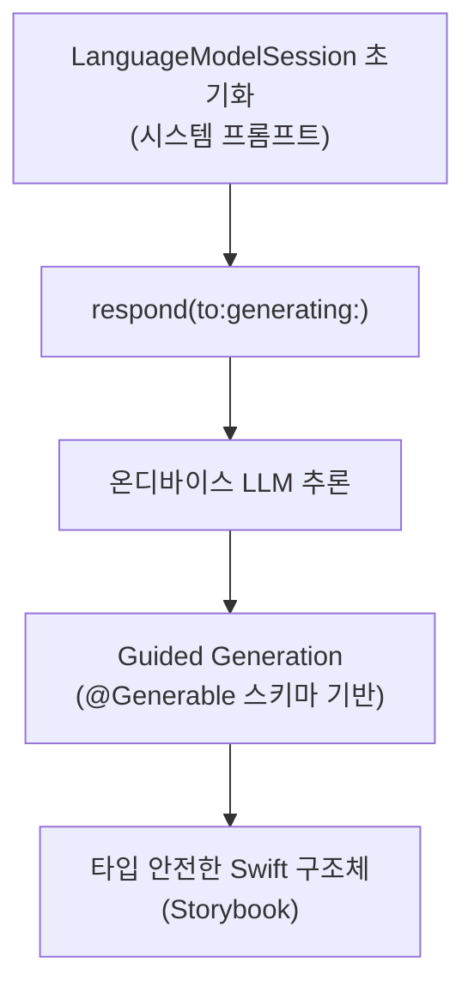
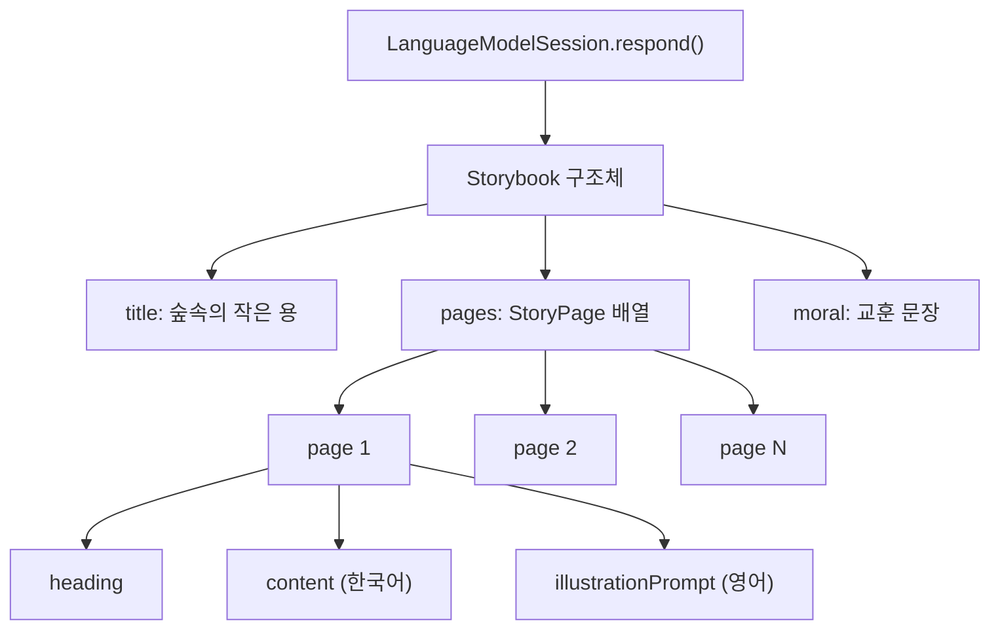
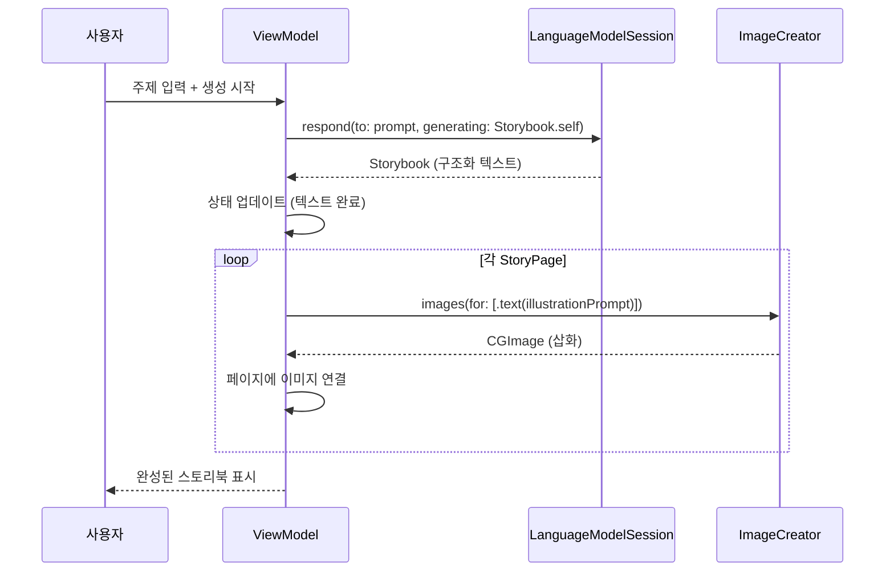
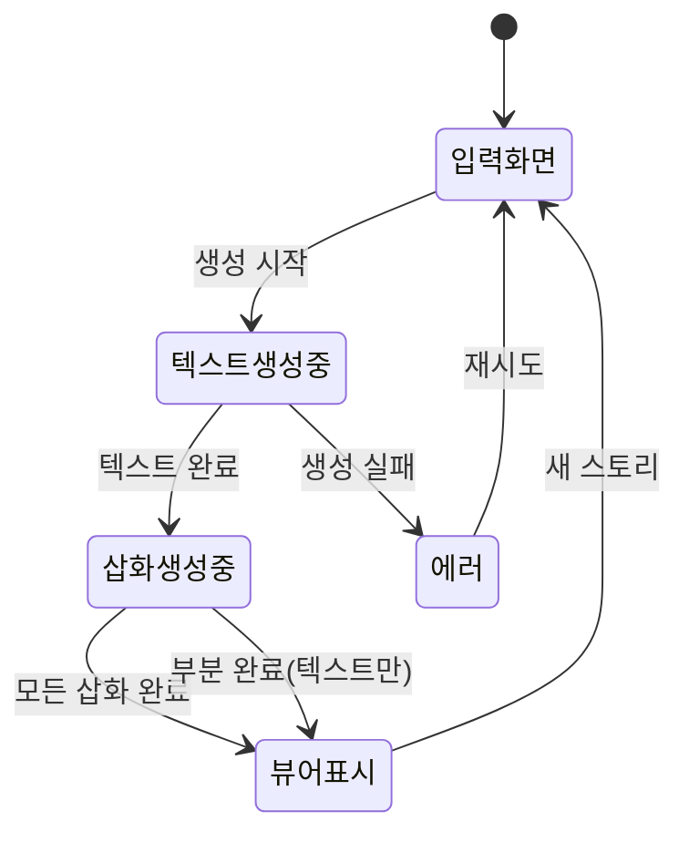
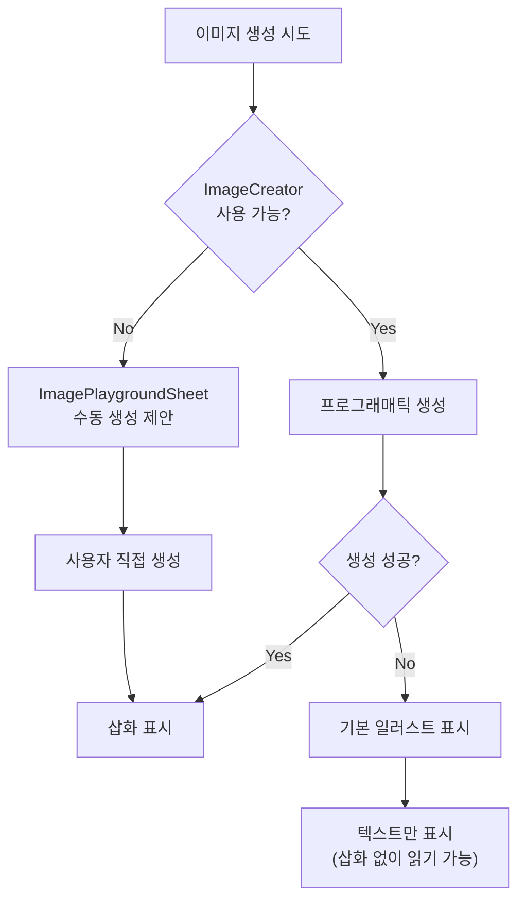

# 실습: AI 스토리북 생성기

> Foundation Models로 동화 텍스트를 생성하고, Image Playground로 각 장면의 삽화를 만들어 인터랙티브 스토리북 뷰어로 결합하는 실전 프로젝트

## 개요

이 섹션에서는 지금까지 배운 Foundation Models 프레임워크와 Image Playground를 하나의 완성된 앱으로 통합합니다. 사용자가 주제를 입력하면 AI가 여러 페이지의 동화를 생성하고, 각 페이지에 어울리는 삽화를 자동으로 만들어주는 **AI 스토리북 생성기**를 구현합니다.

이 프로젝트에서는 [Ch5에서 배운 @Generable 구조화 출력](05-ch5-generable-구조화-출력/02-02-generable-매크로-적용하기.md)과 [Ch6의 스트리밍 패턴](06-ch6-스트리밍-응답과-실시간-ui/02-02-swiftui-실시간-텍스트-렌더링.md)을 Image Playground와 결합합니다. Foundation Models 세션 생성이나 `@Generable` 매크로가 익숙하지 않다면, 먼저 해당 챕터를 복습하고 오시는 것을 권장합니다.

**선수 지식**:
- [LanguageModelSession과 @Generable 구조화 출력](05-ch5-generable-구조화-출력/02-02-generable-매크로-적용하기.md)
- [스트리밍 응답과 실시간 UI](06-ch6-스트리밍-응답과-실시간-ui/02-02-swiftui-실시간-텍스트-렌더링.md)
- [ImagePlaygroundSheet 통합](12-ch12-image-playground와-시각-ai/02-02-imageplaygroundsheet-통합.md)
- [ImageCreator API 프로그래매틱 생성](12-ch12-image-playground와-시각-ai/03-03-imagecreator-api-프로그래매틱-생성.md)

**학습 목표**:
- Foundation Models와 Image Playground를 하나의 파이프라인으로 결합한다
- @Generable로 구조화된 스토리 데이터를 생성한다
- ImageCreator로 스토리 텍스트 기반 삽화를 프로그래매틱하게 생성한다
- 페이지 넘김, 진행 상태, 에러 복구가 포함된 인터랙티브 뷰어를 구현한다

## 왜 알아야 할까?

"AI가 글을 쓰고, AI가 그림을 그리고, 사용자는 읽기만 하면 된다" — 이게 바로 **생성형 AI 앱의 미래**입니다. 텍스트 생성과 이미지 생성을 결합하는 패턴은 동화책뿐 아니라 프레젠테이션 자동 생성, 교육 콘텐츠, 소셜 미디어 포스트, 제품 카탈로그 등 수많은 실제 앱에서 활용됩니다.

Apple의 Foundation Models 프레임워크와 Image Playground는 모두 **온디바이스**에서 동작하기 때문에, 서버 비용 없이 사용자 프라이버시를 보장하면서도 강력한 생성형 AI 경험을 제공할 수 있습니다. WWDC25에서 Apple이 소개한 *Lil Artist* 앱이 바로 이 패턴의 대표적인 예시인데요, 이번 실습에서 우리도 같은 구조의 앱을 직접 만들어보겠습니다.

> 📊 **그림 1**: AI 스토리북 생성기의 전체 워크플로


## 핵심 개념

### 개념 0: Foundation Models 세션 설정 — 빠른 복습

> 💡 **비유**: 카페에 가서 주문하려면 먼저 카운터에 가서 메뉴판을 받아야 하듯이, Foundation Models를 사용하려면 먼저 `LanguageModelSession`을 초기화해야 합니다. 세션이 바로 우리 앱과 온디바이스 AI 사이의 "대화 창구"거든요.

이 프로젝트에서는 Foundation Models의 두 가지 핵심 기능을 동시에 활용합니다. [Ch3에서 배운 LanguageModelSession 초기화](03-ch3-첫-번째-ai-기능-구현/02-02-languagemodelsession-생성과-응답-받기.md)와 [Ch5에서 배운 @Generable 구조화 출력](05-ch5-generable-구조화-출력/02-02-generable-매크로-적용하기.md)이죠. 코드로 간략히 복습해보겠습니다:

```swift
import FoundationModels

// 1. 세션 생성 — 시스템 프롬프트로 역할 부여
let session = LanguageModelSession {
    "당신은 어린이를 위한 동화 작가입니다."
}

// 2. 구조화 출력 요청 — generating: 파라미터로 @Generable 타입 지정
let response = try await session.respond(
    to: "고양이 모험 동화를 만들어주세요.",
    generating: Storybook.self  // @Generable 구조체
)

// 3. 타입 안전한 결과 사용
let storybook: Storybook = response.content
print(storybook.title)       // "용감한 고양이 미미의 모험"
print(storybook.pages.count) // 4
```

`LanguageModelSession`은 대화 히스토리를 자동으로 관리해주고, `respond(to:generating:)` 메서드는 LLM의 자유 텍스트 출력을 우리가 정의한 Swift 구조체로 변환해줍니다. 이 패턴이 익숙하지 않다면 [Ch5. @Generable 매크로 적용하기](05-ch5-generable-구조화-출력/02-02-generable-매크로-적용하기.md)를 먼저 읽고 오세요.

> 📊 **그림 2**: Foundation Models 세션에서 구조화 출력까지의 흐름



### 개념 1: 스토리 데이터 모델 설계

> 💡 **비유**: 스토리북을 만드는 과정을 생각해보세요. 작가가 먼저 줄거리를 짜고(구조화), 그 다음 삽화가가 각 장면에 맞는 그림을 그리죠(이미지 생성). 우리 앱도 똑같습니다 — Foundation Models가 작가, ImageCreator가 삽화가 역할을 합니다.

AI 스토리북 생성기의 첫 단계는 스토리를 **구조화된 데이터**로 받는 것입니다. 단순한 텍스트 덩어리가 아니라, 각 페이지의 제목, 본문, 삽화 프롬프트가 분리된 형태로요. 이를 위해 `@Generable` 매크로를 활용합니다.

```swift
import FoundationModels

// MARK: - 스토리북 데이터 모델

/// 전체 스토리북 구조
@Generable
struct Storybook {
    @Guide(description: "동화의 제목")
    var title: String
    
    @Guide(description: "3~5개의 스토리 페이지 배열")
    var pages: [StoryPage]
    
    @Guide(description: "동화의 교훈이나 메시지를 한 문장으로")
    var moral: String
}

/// 개별 스토리 페이지
@Generable
struct StoryPage {
    @Guide(description: "페이지 번호 (1부터 시작)")
    var pageNumber: Int
    
    @Guide(description: "이 페이지의 짧은 제목")
    var heading: String
    
    @Guide(description: "이 페이지의 스토리 본문 (3~5문장)")
    var content: String
    
    @Guide(description: "이 장면을 묘사하는 삽화 설명 (영어, 50단어 이내)")
    var illustrationPrompt: String
}
```

여기서 핵심은 `illustrationPrompt` 프로퍼티입니다. Foundation Models가 스토리를 생성하면서 동시에 각 장면에 어울리는 **삽화 설명**을 영어로 만들어줍니다. 이 설명이 나중에 ImageCreator의 입력으로 들어가거든요.

`@Generable`은 이 구조체의 스키마 정보를 컴파일 타임에 생성하고, `@Guide`는 각 프로퍼티에 대한 힌트를 LLM에 전달합니다. 배열 타입(`[StoryPage]`)도 지원하기 때문에, LLM이 여러 페이지를 자동으로 생성할 수 있습니다. 이 메커니즘의 자세한 동작 원리는 [Ch5. Guided Generation 내부 구조](05-ch5-generable-구조화-출력/03-03-guide-매크로로-출력-제어하기.md)에서 확인하세요.

> 📊 **그림 3**: @Generable 기반 스토리 데이터 흐름



#### 왜 illustrationPrompt는 영어로 작성할까?

Image Playground의 이미지 생성 모델은 내부적으로 **영어 기반 텍스트-이미지 모델**을 사용합니다. [ImageCreator 세션](12-ch12-image-playground와-시각-ai/03-03-imagecreator-api-프로그래매틱-생성.md)에서 `.text()` 컨셉을 전달할 때, 영어 프롬프트가 한국어보다 의도한 장면을 더 정확하게 생성합니다. 이는 모델의 학습 데이터가 영어 캡션 위주로 구성되어 있기 때문인데요, 실제로 같은 장면을 한국어와 영어로 각각 요청해보면 차이가 뚜렷합니다:

- `"숲속에서 빛나는 반딧불이와 함께 앉아있는 작은 주황색 고양이"` → 일부 키워드 누락, 추상적 결과
- `"A small orange tabby cat sitting on a mossy rock in a magical forest with glowing fireflies"` → 구체적이고 풍부한 장면 생성

그래서 우리는 **이중 언어 전략**을 사용합니다 — 스토리 본문(`content`)은 한국어로 독자에게 자연스럽게, 삽화 지시(`illustrationPrompt`)는 영어로 모델에게 정확하게 전달하는 거죠. `@Guide`의 description에 "영어로 50단어 이내"라고 명시해두면 Foundation Models가 이 규칙을 자동으로 따릅니다.

### 개념 2: 텍스트-이미지 생성 파이프라인

> 💡 **비유**: 영화 제작을 떠올려보세요. 시나리오 작가가 대본을 먼저 완성한 뒤, 스토리보드 아티스트가 각 장면을 그립니다. 동시에 진행하면 앞뒤가 안 맞겠죠? 우리 파이프라인도 **순차적 2단계 구조**입니다 — 먼저 텍스트, 그 다음 이미지.

스토리 생성과 이미지 생성을 하나의 파이프라인으로 연결하는 것이 이 프로젝트의 핵심 아키텍처입니다.

> 📊 **그림 4**: 2단계 생성 파이프라인 시퀀스



파이프라인의 핵심 원칙은 세 가지입니다:

1. **순차 실행**: 텍스트가 먼저 완성된 뒤 이미지 생성 시작 (삽화 프롬프트가 텍스트에 포함되므로)
2. **점진적 UI 업데이트**: 텍스트가 완성되면 바로 읽을 수 있게 보여주고, 이미지는 준비되는 대로 채움
3. **독립적 이미지 생성**: 각 페이지의 이미지는 서로 독립적이므로 병렬 처리 가능

```swift
import ImagePlayground

// MARK: - 스토리 생성 서비스

@Observable
class StorybookGenerator {
    var storybook: Storybook?
    var pageImages: [Int: CGImage] = [:]  // pageNumber → CGImage
    var generationPhase: GenerationPhase = .idle
    var errorMessage: String?
    
    enum GenerationPhase: String {
        case idle = "대기 중"
        case generatingStory = "스토리 작성 중..."
        case generatingImages = "삽화 생성 중..."
        case complete = "완료!"
        case failed = "실패"
    }
    
    private let session: LanguageModelSession
    
    init() {
        // 시스템 프롬프트로 동화 작가 역할 부여
        self.session = LanguageModelSession {
            """
            당신은 어린이를 위한 동화 작가입니다.
            사용자가 제시한 주제로 아름다운 동화를 만들어주세요.
            각 페이지는 3~5문장으로, 총 4~5페이지로 구성합니다.
            illustrationPrompt는 반드시 영어로 작성하세요.
            """
        }
    }
    
    /// 전체 생성 파이프라인 실행
    func generate(topic: String) async {
        generationPhase = .generatingStory
        errorMessage = nil
        pageImages = [:]
        
        do {
            // 1단계: 스토리 텍스트 생성
            let response = try await session.respond(
                to: "\(topic)에 대한 동화를 만들어주세요.",
                generating: Storybook.self
            )
            self.storybook = response.content
            
            // 2단계: 삽화 생성
            generationPhase = .generatingImages
            try await generateIllustrations()
            
            generationPhase = .complete
        } catch {
            generationPhase = .failed
            errorMessage = error.localizedDescription
        }
    }
    
    /// 각 페이지의 삽화를 ImageCreator로 생성
    private func generateIllustrations() async throws {
        guard let pages = storybook?.pages else { return }
        
        let creator = try await ImageCreator()
        
        // 각 페이지의 삽화를 순차 생성
        for page in pages {
            let concepts: [ImagePlaygroundConcept] = [
                .text(page.illustrationPrompt)  // 영어 프롬프트 전달
            ]
            
            let images = creator.images(
                for: concepts,
                style: .animation,  // 동화에 어울리는 애니메이션 스타일
                limit: 1
            )
            
            for try await image in images {
                pageImages[page.pageNumber] = image.cgImage
            }
        }
    }
}
```

> ⚠️ **흔한 오해**: "ImageCreator로 여러 페이지를 동시에 병렬 생성하면 더 빠르지 않을까?" — 실제로는 Image Playground의 온디바이스 생성 모델이 GPU/Neural Engine을 집중적으로 사용하기 때문에, 병렬 호출해도 리소스 경합으로 전체 시간이 비슷하거나 오히려 느려질 수 있습니다. 순차 실행이 안정적입니다.

### 개념 3: 인터랙티브 스토리북 뷰어

> 💡 **비유**: 전자책 리더기를 떠올려보세요. 페이지를 넘기면 텍스트와 삽화가 함께 나타나고, 아직 로딩 중인 이미지는 플레이스홀더가 보이죠. 우리 뷰어도 같은 UX를 구현합니다.

뷰어는 `TabView`의 `.page` 스타일을 활용해 자연스러운 페이지 넘김을 구현합니다. 이미지가 아직 생성되지 않은 페이지는 로딩 인디케이터를 보여주고, 완성되면 애니메이션과 함께 삽화가 나타납니다.

> 📊 **그림 5**: 스토리북 뷰어의 상태 전이



뷰어의 핵심 설계 원칙은 **점진적 공개(Progressive Disclosure)**입니다. 텍스트가 완성되는 즉시 읽을 수 있게 하고, 이미지는 백그라운드에서 하나씩 채워나갑니다.

```swift
import SwiftUI

// MARK: - 스토리 페이지 뷰

struct StoryPageView: View {
    let page: StoryPage
    let illustration: CGImage?
    
    var body: some View {
        ScrollView {
            VStack(spacing: 24) {
                // 삽화 영역
                illustrationSection
                
                // 텍스트 영역
                VStack(alignment: .leading, spacing: 12) {
                    Text(page.heading)
                        .font(.title2)
                        .fontWeight(.bold)
                    
                    Text(page.content)
                        .font(.body)
                        .lineSpacing(6)
                }
                .padding(.horizontal, 24)
            }
            .padding(.vertical, 20)
        }
    }
    
    @ViewBuilder
    private var illustrationSection: some View {
        if let cgImage = illustration {
            // 삽화가 준비된 경우
            Image(decorative: cgImage, scale: 1.0)
                .resizable()
                .aspectRatio(contentMode: .fit)
                .clipShape(RoundedRectangle(cornerRadius: 16))
                .shadow(radius: 8)
                .padding(.horizontal, 20)
                .transition(.opacity.combined(with: .scale))
                .accessibilityLabel(page.illustrationPrompt)
        } else {
            // 삽화 생성 중 플레이스홀더
            RoundedRectangle(cornerRadius: 16)
                .fill(.tertiary)
                .aspectRatio(4/3, contentMode: .fit)
                .overlay {
                    VStack(spacing: 8) {
                        ProgressView()
                        Text("삽화 생성 중...")
                            .font(.caption)
                            .foregroundStyle(.secondary)
                    }
                }
                .padding(.horizontal, 20)
        }
    }
}
```

### 개념 4: 에러 복구와 폴백 전략

> 💡 **비유**: 비행기가 한 엔진이 고장 나도 나머지 엔진으로 날 수 있는 것처럼, 우리 앱도 이미지 생성이 실패해도 텍스트 스토리는 온전히 보여줄 수 있어야 합니다.

실전 앱에서 가장 중요한 건 **우아한 실패 처리(Graceful Degradation)**입니다. Image Playground를 지원하지 않는 기기, 이미지 생성 실패, 모델 가용성 문제 등 다양한 상황에 대비해야 합니다.

> 📊 **그림 6**: 에러 복구 폴백 전략



```swift
// MARK: - 에러 복구를 포함한 안전한 삽화 생성

extension StorybookGenerator {
    /// 폴백 전략이 포함된 삽화 생성
    func generateIllustrationsWithFallback() async {
        guard let pages = storybook?.pages else { return }
        
        // ImageCreator 가용성 확인
        do {
            let creator = try await ImageCreator()
            
            for page in pages {
                do {
                    let images = creator.images(
                        for: [.text(page.illustrationPrompt)],
                        style: .animation,
                        limit: 1
                    )
                    
                    for try await image in images {
                        // 메인 스레드에서 UI 업데이트
                        pageImages[page.pageNumber] = image.cgImage
                    }
                } catch {
                    // 개별 페이지 실패 시 건너뛰고 계속 진행
                    print("Page \(page.pageNumber) 삽화 생성 실패: \(error)")
                    // 해당 페이지는 이미지 없이 텍스트만 표시
                }
            }
        } catch ImageCreator.Error.notSupported {
            // 기기가 지원하지 않는 경우 — 텍스트만 표시
            print("이 기기는 Image Playground를 지원하지 않습니다.")
        } catch {
            print("ImageCreator 초기화 실패: \(error)")
        }
        
        // 이미지 유무와 관계없이 완료로 전환
        generationPhase = .complete
    }
}
```

## 실습: 직접 해보기

지금부터 앞에서 살펴본 개념들을 모두 합쳐서 완전한 **AI 스토리북 생성기** 앱을 구현합니다. Xcode 26에서 새로운 SwiftUI 프로젝트를 생성하고, 아래 코드를 따라 작성해보세요.

### Step 1: 데이터 모델 정의

`Models/StorybookModels.swift` 파일을 생성합니다:

```swift
import FoundationModels
import ImagePlayground
import SwiftUI

// MARK: - 스토리북 데이터 모델

/// 전체 스토리북 — @Generable로 LLM이 이 스키마에 맞춰 생성
@Generable
struct Storybook {
    @Guide(description: "동화의 제목")
    var title: String
    
    @Guide(description: "4~5개의 스토리 페이지 배열")
    var pages: [StoryPage]
    
    @Guide(description: "동화의 교훈을 한 문장으로 요약")
    var moral: String
}

/// 개별 스토리 페이지 — 텍스트(한국어)와 삽화 프롬프트(영어)를 분리
@Generable
struct StoryPage {
    @Guide(description: "페이지 번호, 1부터 시작")
    var pageNumber: Int
    
    @Guide(description: "이 페이지의 짧은 소제목")
    var heading: String
    
    @Guide(description: "이 페이지의 스토리 본문, 3~5문장")
    var content: String
    
    @Guide(description: "이 장면의 삽화를 묘사하는 설명, 영어로 50단어 이내, 동화 일러스트 스타일")
    var illustrationPrompt: String
}

/// 완성된 스토리 페이지 (이미지 포함)
struct CompletedPage: Identifiable {
    let id: Int          // pageNumber
    let heading: String
    let content: String
    let illustration: CGImage?
}
```

### Step 2: ViewModel 구현

`ViewModels/StorybookViewModel.swift` 파일을 생성합니다:

```swift
import SwiftUI
import FoundationModels
import ImagePlayground

@Observable
class StorybookViewModel {
    // MARK: - Published State
    var storybook: Storybook?
    var completedPages: [CompletedPage] = []
    var phase: Phase = .idle
    var currentPageIndex: Int = 0
    var progress: Double = 0.0
    var errorMessage: String?
    var supportsImages: Bool = true
    
    enum Phase: Equatable {
        case idle
        case writingStory
        case creatingIllustrations(current: Int, total: Int)
        case complete
        case failed(String)
        
        var description: String {
            switch self {
            case .idle: return "주제를 입력하세요"
            case .writingStory: return "AI가 동화를 쓰고 있어요..."
            case .creatingIllustrations(let c, let t): 
                return "삽화 생성 중 (\(c)/\(t))..."
            case .complete: return "스토리북 완성!"
            case .failed(let msg): return "오류: \(msg)"
            }
        }
    }
    
    // MARK: - 스토리 생성 메인 함수
    
    func createStorybook(topic: String, genre: String) async {
        phase = .writingStory
        progress = 0.0
        errorMessage = nil
        completedPages = []
        storybook = nil
        currentPageIndex = 0
        
        do {
            // 1단계: Foundation Models 세션 생성 + 스토리 텍스트 생성
            // LanguageModelSession 초기화 — Ch3에서 배운 패턴과 동일
            let session = LanguageModelSession {
                """
                당신은 어린이를 위한 동화 작가입니다.
                장르: \(genre)
                규칙:
                - 페이지는 정확히 4개로 구성
                - 각 페이지는 3~5문장의 본문
                - illustrationPrompt는 반드시 영어로, 장면을 구체적으로 묘사
                - 어린이(5~10세)가 읽기 적합한 내용
                - 마지막에 교훈이 자연스럽게 드러나도록
                """
            }
            
            // respond(to:generating:)으로 구조화 출력 — Ch5에서 배운 패턴
            let response = try await session.respond(
                to: "'\(topic)'을 주제로 동화를 만들어주세요.",
                generating: Storybook.self
            )
            
            self.storybook = response.content
            progress = 0.3  // 텍스트 생성 완료 = 30%
            
            // 텍스트만으로 먼저 페이지 구성 (이미지는 nil)
            self.completedPages = response.content.pages.map { page in
                CompletedPage(
                    id: page.pageNumber,
                    heading: page.heading,
                    content: page.content,
                    illustration: nil
                )
            }
            
            // 2단계: ImageCreator로 삽화 생성
            await createIllustrations(for: response.content.pages)
            
            phase = .complete
            progress = 1.0
            
        } catch {
            phase = .failed(error.localizedDescription)
            errorMessage = error.localizedDescription
        }
    }
    
    // MARK: - 삽화 생성
    
    private func createIllustrations(for pages: [StoryPage]) async {
        let total = pages.count
        
        do {
            let creator = try await ImageCreator()
            
            for (index, page) in pages.enumerated() {
                phase = .creatingIllustrations(
                    current: index + 1, total: total
                )
                
                do {
                    // 영어 illustrationPrompt를 ImageCreator에 전달
                    // 영어 프롬프트가 더 정확한 결과를 만드는 이유:
                    // Image Playground 모델의 학습 데이터가 영어 캡션 기반
                    let concepts: [ImagePlaygroundConcept] = [
                        .text(page.illustrationPrompt)
                    ]
                    
                    let images = creator.images(
                        for: concepts,
                        style: .animation,
                        limit: 1
                    )
                    
                    for try await image in images {
                        // 해당 페이지에 이미지 업데이트
                        if let pageIndex = completedPages.firstIndex(
                            where: { $0.id == page.pageNumber }
                        ) {
                            completedPages[pageIndex] = CompletedPage(
                                id: page.pageNumber,
                                heading: page.heading,
                                content: page.content,
                                illustration: image.cgImage
                            )
                        }
                    }
                } catch {
                    // 개별 삽화 실패 시 건너뛰기
                    print("삽화 \(page.pageNumber) 생성 실패: \(error)")
                }
                
                // 진행률: 30%(텍스트) + 70%(이미지) 비율로 계산
                progress = 0.3 + 0.7 * Double(index + 1) / Double(total)
            }
        } catch ImageCreator.Error.notSupported {
            supportsImages = false
            print("이 기기는 Image Playground를 지원하지 않습니다.")
        } catch {
            print("ImageCreator 초기화 실패: \(error)")
        }
    }
    
    // MARK: - 내비게이션
    
    func nextPage() {
        guard currentPageIndex < completedPages.count - 1 else { return }
        currentPageIndex += 1
    }
    
    func previousPage() {
        guard currentPageIndex > 0 else { return }
        currentPageIndex -= 1
    }
    
    func reset() {
        storybook = nil
        completedPages = []
        phase = .idle
        currentPageIndex = 0
        progress = 0.0
        errorMessage = nil
    }
}
```

### Step 3: SwiftUI 뷰 구현

`Views/StorybookView.swift` 파일을 생성합니다:

```swift
import SwiftUI

struct StorybookView: View {
    @State private var viewModel = StorybookViewModel()
    @State private var topic = ""
    @State private var selectedGenre = "판타지"
    @Environment(\.supportsImagePlayground) private var supportsPlayground
    
    private let genres = ["판타지", "모험", "우정", "자연", "우주"]
    
    var body: some View {
        NavigationStack {
            Group {
                switch viewModel.phase {
                case .idle:
                    inputView
                case .writingStory, .creatingIllustrations:
                    progressView
                case .complete:
                    storybookReaderView
                case .failed:
                    errorView
                }
            }
            .navigationTitle("AI 스토리북")
            .animation(.easeInOut, value: viewModel.phase)
        }
    }
    
    // MARK: - 입력 화면
    
    private var inputView: some View {
        VStack(spacing: 32) {
            Spacer()
            
            Image(systemName: "book.and.wreath")
                .font(.system(size: 64))
                .foregroundStyle(.tint)
            
            Text("어떤 동화를 만들까요?")
                .font(.title2)
                .fontWeight(.semibold)
            
            VStack(spacing: 16) {
                TextField("예: 용감한 고양이의 모험", text: $topic)
                    .textFieldStyle(.roundedBorder)
                    .font(.body)
                
                // 장르 선택 피커
                Picker("장르", selection: $selectedGenre) {
                    ForEach(genres, id: \.self) { genre in
                        Text(genre).tag(genre)
                    }
                }
                .pickerStyle(.segmented)
            }
            .padding(.horizontal, 32)
            
            Button {
                Task {
                    await viewModel.createStorybook(
                        topic: topic,
                        genre: selectedGenre
                    )
                }
            } label: {
                Label("동화 만들기", systemImage: "sparkles")
                    .font(.headline)
                    .frame(maxWidth: .infinity)
            }
            .buttonStyle(.borderedProminent)
            .controlSize(.large)
            .disabled(topic.trimmingCharacters(in: .whitespaces).isEmpty)
            .padding(.horizontal, 32)
            
            if !supportsPlayground {
                // Image Playground 미지원 기기 안내
                Label(
                    "이 기기는 삽화 생성을 지원하지 않아 텍스트만 제공됩니다.",
                    systemImage: "info.circle"
                )
                .font(.caption)
                .foregroundStyle(.secondary)
            }
            
            Spacer()
        }
    }
    
    // MARK: - 진행 상태 화면
    
    private var progressView: some View {
        VStack(spacing: 24) {
            Spacer()
            
            ProgressView(value: viewModel.progress) {
                Text(viewModel.phase.description)
                    .font(.headline)
            }
            .padding(.horizontal, 48)
            
            // 텍스트가 이미 생성되었다면 미리보기 제공
            if let storybook = viewModel.storybook {
                VStack(spacing: 8) {
                    Text(storybook.title)
                        .font(.title3)
                        .fontWeight(.bold)
                    
                    Text("\(storybook.pages.count)페이지 동화가 완성되었어요!")
                        .font(.subheadline)
                        .foregroundStyle(.secondary)
                }
                .padding()
                .background(.regularMaterial, in: RoundedRectangle(cornerRadius: 12))
            }
            
            Spacer()
        }
    }
    
    // MARK: - 스토리북 리더 화면
    
    private var storybookReaderView: some View {
        VStack(spacing: 0) {
            // 스토리 제목
            if let title = viewModel.storybook?.title {
                Text(title)
                    .font(.title)
                    .fontWeight(.bold)
                    .padding(.top, 8)
            }
            
            // 페이지 뷰 (스와이프로 넘김)
            TabView(selection: $viewModel.currentPageIndex) {
                ForEach(
                    Array(viewModel.completedPages.enumerated()),
                    id: \.element.id
                ) { index, page in
                    StoryPageView(
                        page: page,
                        pageNumber: index + 1,
                        totalPages: viewModel.completedPages.count
                    )
                    .tag(index)
                }
                
                // 마지막: 교훈 페이지
                if let moral = viewModel.storybook?.moral {
                    MoralPageView(moral: moral) {
                        viewModel.reset()
                        topic = ""
                    }
                    .tag(viewModel.completedPages.count)
                }
            }
            .tabViewStyle(.page(indexDisplayMode: .always))
        }
    }
    
    // MARK: - 에러 화면
    
    private var errorView: some View {
        VStack(spacing: 16) {
            Image(systemName: "exclamationmark.triangle")
                .font(.largeTitle)
                .foregroundStyle(.red)
            
            Text(viewModel.errorMessage ?? "알 수 없는 오류가 발생했습니다.")
                .multilineTextAlignment(.center)
            
            Button("다시 시도") {
                viewModel.reset()
            }
            .buttonStyle(.bordered)
        }
        .padding()
    }
}
```

### Step 4: 개별 페이지 뷰와 교훈 페이지

```swift
// MARK: - 스토리 페이지 뷰

struct StoryPageView: View {
    let page: CompletedPage
    let pageNumber: Int
    let totalPages: Int
    
    var body: some View {
        ScrollView {
            VStack(spacing: 20) {
                // 삽화 영역
                Group {
                    if let cgImage = page.illustration {
                        Image(decorative: cgImage, scale: 1.0)
                            .resizable()
                            .aspectRatio(contentMode: .fit)
                            .clipShape(RoundedRectangle(cornerRadius: 16))
                            .shadow(color: .black.opacity(0.15), radius: 10, y: 5)
                            .transition(.opacity)
                    } else {
                        // 이미지 로딩 중 또는 미지원
                        RoundedRectangle(cornerRadius: 16)
                            .fill(
                                LinearGradient(
                                    colors: [.purple.opacity(0.2), .blue.opacity(0.2)],
                                    startPoint: .topLeading,
                                    endPoint: .bottomTrailing
                                )
                            )
                            .aspectRatio(4/3, contentMode: .fit)
                            .overlay {
                                Image(systemName: "photo.artframe")
                                    .font(.system(size: 40))
                                    .foregroundStyle(.secondary)
                            }
                    }
                }
                .padding(.horizontal, 20)
                
                // 텍스트 영역
                VStack(alignment: .leading, spacing: 12) {
                    Text(page.heading)
                        .font(.title2)
                        .fontWeight(.bold)
                        .accessibilityAddTraits(.isHeader)
                    
                    Text(page.content)
                        .font(.system(.body, design: .serif))
                        .lineSpacing(8)
                        .accessibilityLabel("페이지 \(pageNumber): \(page.content)")
                }
                .padding(.horizontal, 24)
                
                // 페이지 번호
                Text("\(pageNumber) / \(totalPages)")
                    .font(.caption)
                    .foregroundStyle(.tertiary)
                    .padding(.bottom, 20)
            }
            .padding(.top, 12)
        }
    }
}

// MARK: - 교훈 페이지

struct MoralPageView: View {
    let moral: String
    let onNewStory: () -> Void
    
    var body: some View {
        VStack(spacing: 32) {
            Spacer()
            
            Image(systemName: "sparkles")
                .font(.system(size: 48))
                .foregroundStyle(.yellow.gradient)
            
            Text("이 동화의 교훈")
                .font(.title2)
                .fontWeight(.bold)
            
            Text(moral)
                .font(.system(.title3, design: .serif))
                .italic()
                .multilineTextAlignment(.center)
                .padding(.horizontal, 32)
            
            Button {
                onNewStory()
            } label: {
                Label("새 동화 만들기", systemImage: "plus.circle")
                    .font(.headline)
            }
            .buttonStyle(.borderedProminent)
            .controlSize(.large)
            
            Spacer()
        }
    }
}
```

### Step 5: 앱 엔트리 포인트

```swift
import SwiftUI

@main
struct AIStorybookApp: App {
    var body: some Scene {
        WindowGroup {
            StorybookView()
        }
    }
}
```

이 앱을 실행하면 다음과 같은 흐름으로 동작합니다:

```run:swift
// 시뮬레이션: 앱의 콘솔 로그 출력 예시
print("=== AI 스토리북 생성기 ===")
print("[Phase 1] 스토리 텍스트 생성 시작...")
print("[Phase 1] 완료: '숲속의 작은 용' (4페이지)")
print("[Phase 2] 삽화 생성 시작...")
print("[Phase 2] 페이지 1/4 삽화 완료")
print("[Phase 2] 페이지 2/4 삽화 완료")
print("[Phase 2] 페이지 3/4 삽화 완료")
print("[Phase 2] 페이지 4/4 삽화 완료")
print("[완료] 스토리북이 준비되었습니다!")
```

```output
=== AI 스토리북 생성기 ===
[Phase 1] 스토리 텍스트 생성 시작...
[Phase 1] 완료: '숲속의 작은 용' (4페이지)
[Phase 2] 삽화 생성 시작...
[Phase 2] 페이지 1/4 삽화 완료
[Phase 2] 페이지 2/4 삽화 완료
[Phase 2] 페이지 3/4 삽화 완료
[Phase 2] 페이지 4/4 삽화 완료
[완료] 스토리북이 준비되었습니다!
```

## 더 깊이 알아보기

### "인터랙티브 스토리북"의 역사 — CYOA에서 AI까지

AI가 스토리를 생성하는 앱은 갑자기 등장한 개념이 아닙니다. 1979년 출판된 **"Choose Your Own Adventure(CYOA)"** 시리즈는 독자가 선택지를 골라 다른 결말로 이어지는 **인터랙티브 소설**의 시초였습니다. 2억 5천만 부 이상 팔린 이 시리즈는 "독자가 이야기에 참여한다"는 혁신적 컨셉을 대중화했죠.

2010년대에 들어서면서 *Inkle Studios*의 *80 Days*나 *Episodes* 같은 앱이 모바일에서 인터랙티브 스토리를 구현했고, 2020년대에는 GPT 기반의 *AI Dungeon*이 AI가 실시간으로 스토리를 생성하는 새로운 장르를 열었습니다.

Apple이 WWDC25에서 Foundation Models와 Image Playground를 동시에 발표한 것은 우연이 아닙니다. **텍스트 + 이미지 = 완전한 스토리**라는 공식을 온디바이스에서 구현할 수 있게 된 것이죠. Apple이 데모로 보여준 *Lil Artist* 앱이 바로 이 비전의 구현체였습니다 — 아이가 주제를 말하면 AI가 동화를 쓰고 삽화까지 그려주는 앱이었거든요.

### 프로젝트 확장 아이디어

이 스토리북 생성기를 더 발전시킬 수 있는 방향들입니다:

- **스트리밍 텍스트**: `session.streamResponse()`로 텍스트가 한 글자씩 나타나는 효과 — [스트리밍 응답 세션](06-ch6-스트리밍-응답과-실시간-ui/02-02-swiftui-실시간-텍스트-렌더링.md)에서 배운 패턴 활용
- **ImagePlaygroundSheet 폴백**: ImageCreator가 지원되지 않을 때 사용자가 직접 Sheet에서 이미지를 만들도록 안내 — [ImagePlaygroundSheet 통합](12-ch12-image-playground와-시각-ai/02-02-imageplaygroundsheet-통합.md) 참조
- **Siri 연동**: "시리야, 우주 탐험 동화 만들어줘" — [App Intents와 Siri 연동](13-ch13-app-intents와-siri-연동/01-01-app-intents-프레임워크-개요.md)에서 다룰 예정
- **Genmoji 삽입**: 스토리 텍스트 안에 AI 이모지를 삽입 — [Genmoji 세션](12-ch12-image-playground와-시각-ai/04-04-genmoji와-visual-intelligence.md)에서 배운 NSAdaptiveImageGlyph 활용

## 흔한 오해와 팁

> ⚠️ **흔한 오해**: "Foundation Models와 ImageCreator를 동시에 호출하면 더 빠를 거야" — Foundation Models는 텍스트를 먼저 생성해야 `illustrationPrompt`를 얻을 수 있으므로, 두 API는 반드시 **순차적**으로 호출해야 합니다. 텍스트 없이 이미지를 만들 수는 없거든요.

> 💡 **알고 계셨나요?**: Image Playground의 `.animation` 스타일은 Apple이 자체 개발한 Diffusion 모델을 기반으로 합니다. 이 모델은 약 10초 이내에 이미지를 생성할 수 있는데, 이는 Neural Engine의 전용 하드웨어 가속 덕분이에요. 서버 기반 이미지 생성 서비스(DALL-E, Midjourney 등)와 달리 네트워크 지연이 전혀 없죠.

> 🔥 **실무 팁**: `illustrationPrompt`를 영어로 생성하되, 구체적인 시각 요소를 포함시키세요. "A cat in a forest"보다 "A small orange tabby cat sitting on a mossy rock in a magical forest with glowing fireflies"가 훨씬 좋은 결과를 만듭니다. `@Guide`의 description에 이런 스타일 가이드를 넣어두면 Foundation Models가 알아서 따라줍니다.

> 🔥 **실무 팁**: `CompletedPage`를 struct로 만들고 이미지가 들어올 때마다 새 인스턴스로 교체하는 패턴에 주목하세요. `CGImage`는 참조 타입이지만, 감싸고 있는 struct가 바뀌면 SwiftUI가 변화를 감지해서 해당 페이지만 다시 그립니다 — `@Observable`과 struct의 궁합이 빛나는 순간입니다.

## 핵심 정리

| 개념 | 설명 |
|------|------|
| **Foundation Models 세션** | `LanguageModelSession` 초기화 + 시스템 프롬프트로 동화 작가 역할 부여 (Ch3/Ch5 패턴) |
| **2단계 파이프라인** | Foundation Models(텍스트) → ImageCreator(이미지) 순차 실행 |
| **@Generable 스토리 모델** | `Storybook` + `StoryPage` 구조체로 구조화 출력 수신 |
| **이중 언어 전략** | 스토리 본문(한국어) + 삽화 프롬프트(영어) — 영어 프롬프트가 이미지 품질을 높임 |
| **점진적 UI 업데이트** | 텍스트 완성 즉시 표시, 이미지는 준비되는 대로 채움 |
| **Graceful Degradation** | ImageCreator 미지원 시 텍스트만 표시, 개별 이미지 실패 시 건너뛰기 |
| **TabView 페이지 뷰어** | `.page` 스타일로 자연스러운 스와이프 내비게이션 |
| **CompletedPage 패턴** | struct 교체로 SwiftUI 변경 감지 + 이미지 점진적 로딩 |

## 다음 섹션 미리보기

챕터 12를 마무리하며 Image Playground의 모든 기능을 실전 프로젝트로 체험해보았습니다. 다음 챕터인 [Ch13. App Intents와 Siri 연동](13-ch13-app-intents와-siri-연동/01-01-app-intents-프레임워크-개요.md)에서는 우리가 만든 AI 기능들을 Siri와 Shortcuts에서도 사용할 수 있게 만듭니다. "시리야, 고양이 동화 만들어줘"라고 말하면 이 스토리북 생성기가 작동하는 미래, 생각만 해도 멋지지 않나요?

## 참고 자료

- [Bringing Image Playground to your app — Create with Swift](https://www.createwithswift.com/bringing-image-playground-to-your-app/) - ImagePlaygroundSheet와 ImageCreator의 SwiftUI 통합 방법을 코드 예제와 함께 상세히 설명
- [Generating images programmatically with Image Playground — Create with Swift](https://www.createwithswift.com/generating-images-programmatically-with-image-playground/) - ImageCreator API의 프로그래매틱 사용법, 스타일 선택, 에러 처리까지 다루는 실전 가이드
- [The Ultimate Guide to the Foundation Models Framework — AzamSharp](https://azamsharp.com/2025/06/18/the-ultimate-guide-to-the-foundation-models-framework.html) - @Generable, LanguageModelSession, Tool 프로토콜의 종합 가이드
- [Meet the Foundation Models framework — WWDC25](https://developer.apple.com/videos/play/wwdc2025/286/) - Apple 공식 Foundation Models 프레임워크 소개 세션
- [Deep dive into the Foundation Models framework — WWDC25](https://developer.apple.com/videos/play/wwdc2025/301/) - Guided Generation, 스트리밍, Tool Calling의 심화 구현
- [Foundation Models — Apple Developer Documentation](https://developer.apple.com/documentation/FoundationModels) - 공식 API 레퍼런스

---
### 🔗 Related Sessions
- [respond(generating:)](05-ch5-generable-구조화-출력/01-01-guided-generation-개념과-동작-원리.md) (prerequisite)
- [@generable](05-ch5-generable-구조화-출력/01-01-guided-generation-개념과-동작-원리.md) (prerequisite)
- [imagecreator](12-ch12-image-playground와-시각-ai/01-01-image-playground-프레임워크-개요.md) (prerequisite)
- [imageplaygroundconcept](12-ch12-image-playground와-시각-ai/01-01-image-playground-프레임워크-개요.md) (prerequisite)
- [supportsimageplayground](12-ch12-image-playground와-시각-ai/01-01-image-playground-프레임워크-개요.md) (prerequisite)
- [imageplaygroundstyle](12-ch12-image-playground와-시각-ai/01-01-image-playground-프레임워크-개요.md) (prerequisite)
