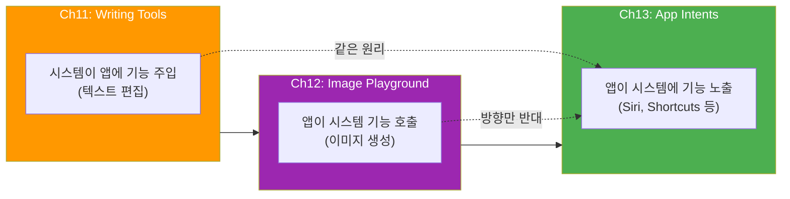
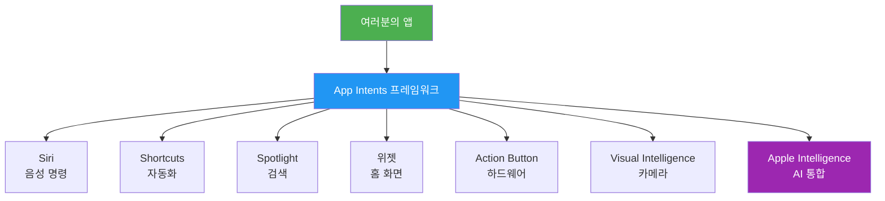
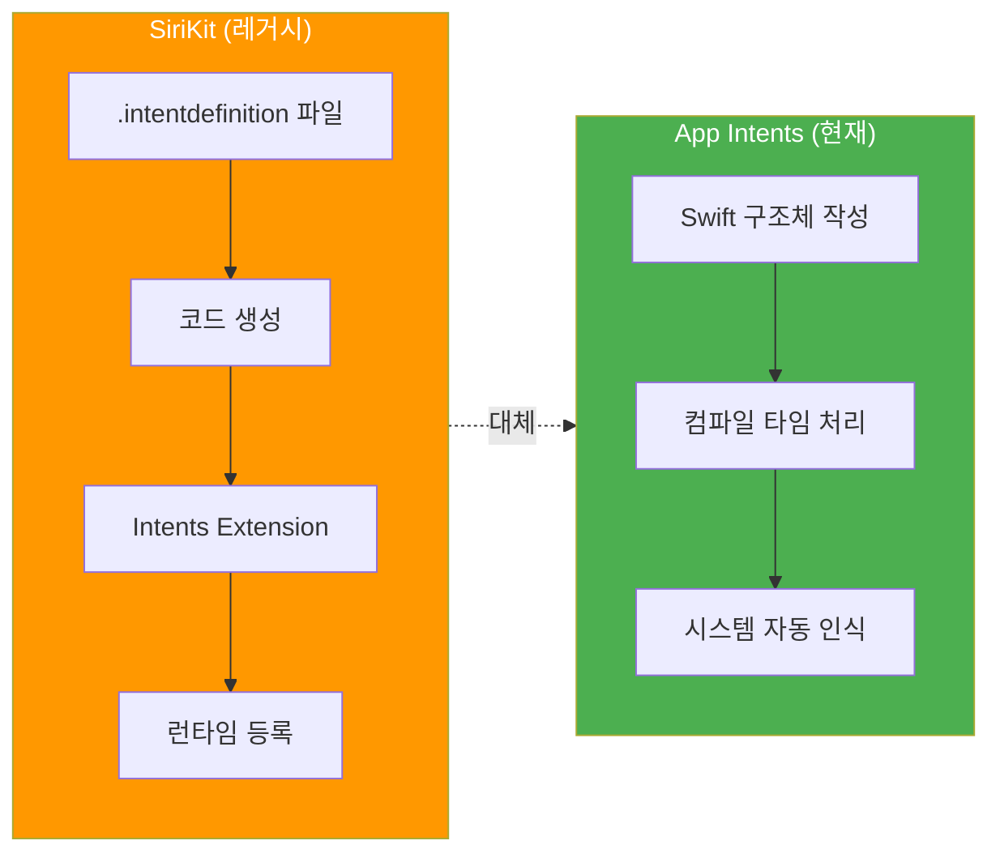
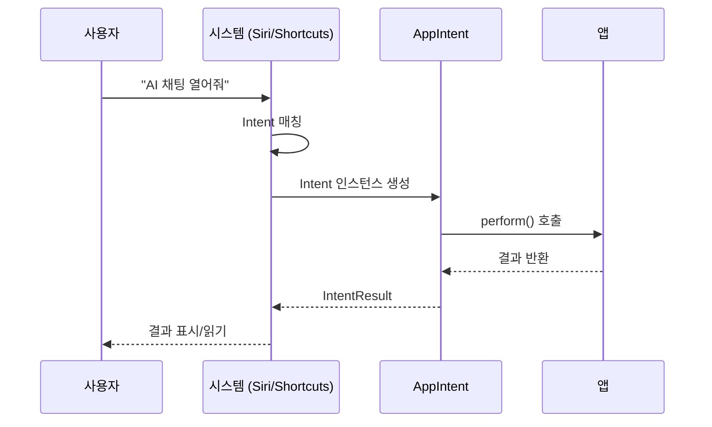
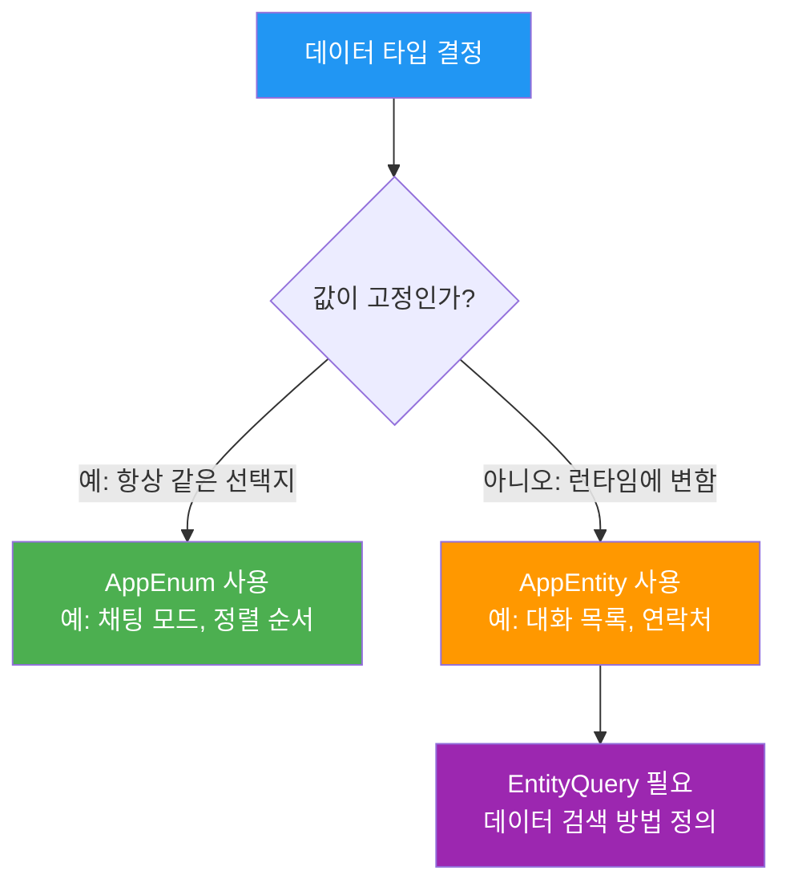
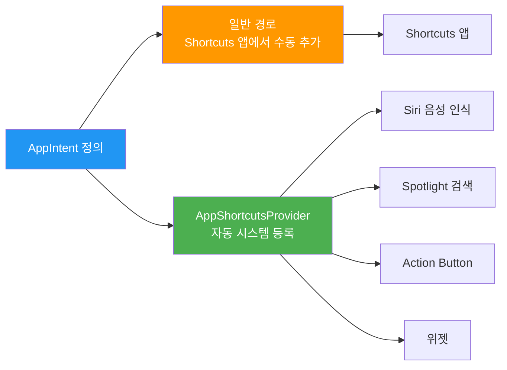

# 01. App Intents 프레임워크 개요

> App Intents의 역할과 구조를 이해하고, Siri·Shortcuts·Spotlight 통합의 첫걸음을 내딛습니다.

## 개요

이 섹션에서는 App Intents 프레임워크가 무엇이고, 왜 Apple 플랫폼에서 핵심적인 역할을 하는지 알아봅니다. 앱의 기능을 시스템 전체에 노출하는 방법의 기초를 배우게 됩니다.

**선수 지식**: [Foundation Models 프레임워크 시작하기](03-ch3-foundation-models-프레임워크-시작하기/01-01-systemlanguagemodel-이해하기.md)에서 배운 온디바이스 AI 개념, [Writing Tools 통합](11-ch11-writing-tools-통합/01-01-writing-tools-시스템-서비스-개요.md)과 [Image Playground](12-ch12-image-playground와-시각-ai/01-01-image-playground-프레임워크-개요.md)에서 경험한 Apple Intelligence 시스템 서비스 통합

**학습 목표**:
- App Intents 프레임워크의 역할과 구조를 이해한다
- AppIntent, AppEntity, AppEnum의 핵심 프로토콜을 파악한다
- Siri, Shortcuts, Spotlight 통합의 작동 원리를 설명할 수 있다
- 간단한 AppIntent를 직접 정의해본다

## 왜 알아야 할까?

### Ch11–12에서 여기까지: 시스템 서비스 통합의 다음 단계

잠깐, 지금까지의 여정을 돌아볼까요? [Ch11 Writing Tools](11-ch11-writing-tools-통합/01-01-writing-tools-시스템-서비스-개요.md)에서는 텍스트 편집 영역에 Apple Intelligence의 글쓰기 기능을 **시스템이 알아서** 주입해주는 경험을 했습니다. [Ch12 Image Playground](12-ch12-image-playground와-시각-ai/01-01-image-playground-프레임워크-개요.md)에서는 이미지 생성이라는 시스템 서비스를 앱 안에 자연스럽게 녹여냈고요.

두 챕터에서 공통적으로 배운 핵심이 하나 있는데요 — 바로 **"앱이 시스템에 자신을 열어주는 패턴"**입니다. Writing Tools에서는 `isWritingToolsActive`로 시스템의 편집 요청에 응답했고, Image Playground에서는 `ImagePlaygroundSheet`로 시스템의 이미지 생성 능력을 앱 안에 끌어들였죠. 이 패턴, 기억나시나요?

> 📊 **그림 0**: Ch11–12에서 Ch13으로의 연결 — 시스템 통합 패턴의 진화



Ch13에서 배울 App Intents는 이 흐름의 **완성판**입니다. Ch11–12에서는 시스템이 제공하는 서비스를 "가져다 쓰는" 쪽이었다면, App Intents는 반대로 **여러분의 앱 기능을 시스템에 내보내는** 것입니다. 화살표 방향만 바뀌었을 뿐, "앱과 시스템이 약속된 프로토콜로 소통한다"는 핵심 원리는 동일합니다. Ch11에서 `WritingToolsCoordinator`를 채택했듯이, 여기서는 `AppIntent` 프로토콜을 채택합니다. 도메인이 시각 AI에서 시스템 통합으로 바뀌어서 낯설게 느껴질 수 있지만, 이미 두 챕터에 걸쳐 시스템 서비스 통합을 경험한 여러분이라면 충분히 익숙한 패턴입니다.

### 앱 밖에서 앱을 쓸 수 있다면?

이제 본론으로 들어가 볼게요. 여러분이 [Ch10](10-ch10-실전-프로젝트-ai-채팅봇-앱/01-01-채팅봇-앱-아키텍처-설계.md)에서 만든 AI 채팅봇 앱을 떠올려 보세요. 사용자가 앱을 열고, 채팅 화면으로 이동하고, 질문을 타이핑해야 비로소 AI 기능을 쓸 수 있었죠. 하지만 "시리야, 채팅봇에서 오늘 날씨 물어봐"라고 말 한마디로 같은 결과를 얻을 수 있다면 어떨까요?

App Intents는 바로 이 **"앱 밖에서 앱의 기능을 사용하는"** 다리 역할을 합니다. iOS 26에서는 Apple Intelligence가 Siri를 통해 앱의 의도(Intent)를 직접 이해하고 실행할 수 있게 되었습니다. 즉, App Intents를 구현하지 않으면 여러분의 앱은 Apple Intelligence 생태계에서 **보이지 않는 존재**가 됩니다.

간단한 비교를 해볼까요? Ch11–12에서 했던 것과 Ch13에서 할 것의 차이입니다:

| 항목 | Ch11 Writing Tools | Ch12 Image Playground | Ch13 App Intents |
|------|-------------------|----------------------|-----------------|
| **통합 방향** | 시스템 → 앱 (기능 주입) | 앱 ↔ 시스템 (서비스 호출) | 앱 → 시스템 (기능 노출) |
| **핵심 프로토콜** | `WritingToolsCoordinator` | `ImagePlaygroundSheet` | `AppIntent`, `AppEntity` |
| **트리거** | 사용자가 텍스트 선택 | 사용자가 버튼 탭 | **Siri 음성, Shortcuts, Spotlight 등** |
| **익숙한 패턴** | 프로토콜 채택 + 콜백 | View modifier + 콜백 | **프로토콜 채택 + perform()** |

보시다시피, 핵심 패턴은 "프로토콜 채택 → 시스템과 소통"으로 동일합니다. 도메인만 달라졌을 뿐이에요.

> 📊 **그림 1**: App Intents가 연결하는 시스템 서비스들



하나의 프레임워크를 배우면 7가지 이상의 시스템 접점을 동시에 얻는 셈이죠. 이보다 효율적인 투자가 있을까요?

## 핵심 개념

### 개념 1: App Intents란 무엇인가 — "메뉴판" 비유

> 💡 **비유**: 레스토랑의 **메뉴판**을 생각해보세요. 손님(시스템)은 메뉴판을 보고 무엇을 주문할 수 있는지 알게 됩니다. App Intents는 여러분의 앱이 시스템에 건네는 "메뉴판"입니다. "이런 기능이 있어요, 이런 데이터를 다뤄요"라고 시스템에 알려주는 거죠.

App Intents 프레임워크는 WWDC22에서 처음 소개되었고, 기존의 SiriKit Intents를 대체하는 차세대 통합 프레임워크입니다. 핵심 철학은 단순합니다: **Swift 코드 자체가 진실의 원천(source of truth)**이라는 것이죠.

기존 SiriKit에서는 `.intentdefinition` 파일을 만들고, 코드를 생성하고, Extension을 별도로 구성해야 했습니다. App Intents에서는 Swift 구조체 하나면 됩니다. 컴파일 타임에 시스템이 앱의 능력을 자동으로 파악하기 때문에, 별도 설정 파일이나 런타임 등록이 필요 없습니다.

Ch11에서 `isWritingToolsActive`를 통해 시스템의 요청에 응답하는 구조를 기억하시나요? App Intents도 마찬가지입니다. 프로토콜을 채택하고 필수 메서드를 구현하면, 시스템이 알아서 여러분의 앱을 발견하고 호출합니다. 다만 이번에는 **시스템이 앱의 기능을 호출하는 방향**이라는 점이 다릅니다.

> 📊 **그림 2**: SiriKit vs App Intents 비교



App Intents의 세계에서는 세 가지 핵심 구성요소가 있습니다:

| 구성요소 | 역할 | 비유 |
|---------|------|------|
| **Intent** (동사) | 앱이 수행할 수 있는 **액션** | 메뉴의 "주문하기", "취소하기" |
| **Entity** (명사) | 앱이 다루는 **데이터** | 메뉴의 "아메리카노", "라떼" |
| **Query** (질문) | 데이터를 **찾는 방법** | "아메리카노가 뭐예요?" |

### 개념 2: AppIntent 프로토콜 — 첫 번째 의도 정의하기

> 💡 **비유**: AppIntent는 레스토랑 직원에게 주는 **주문서**입니다. "무슨 주문인지(title)", "어떻게 처리하는지(perform)"가 적혀 있으면 직원이 알아서 처리해줍니다.

AppIntent 프로토콜은 최소 두 가지만 요구합니다: 이름(`title`)과 실행 로직(`perform()`). 정말 간단하죠?

```swift
import AppIntents

// 가장 간단한 AppIntent — 앱을 열고 특정 화면으로 이동
struct OpenChatIntent: AppIntent {
    // 시스템에 표시될 이름 (Siri, Shortcuts에서 보임)
    static let title: LocalizedStringResource = "AI 채팅 열기"
    
    // 이 Intent는 앱을 포그라운드로 가져옴
    static let supportedModes: IntentModes = .foreground
    
    // Intent 실행 로직
    @MainActor
    func perform() async throws -> some IntentResult {
        // 실제로는 네비게이션 로직이 여기에
        return .result()
    }
}
```

여기서 눈여겨볼 점이 몇 가지 있는데요:

1. **`struct`입니다**: 클래스가 아니라 값 타입이에요. 가볍고 안전합니다.
2. **`async throws`입니다**: 비동기 작업과 에러 처리를 자연스럽게 지원합니다.
3. **`some IntentResult`**: Opaque return type으로 다양한 결과 조합이 가능합니다.

> 📊 **그림 3**: AppIntent의 생명주기



`perform()` 메서드의 반환 타입은 다양한 프로토콜을 조합할 수 있습니다:

```swift
// 값을 반환하면서 Siri가 읽어줄 대화도 포함
func perform() async throws -> some ReturnsValue<String> & ProvidesDialog {
    let answer = "오늘 서울 날씨는 맑음, 25도입니다."
    return .result(
        value: answer,
        dialog: "오늘 날씨를 알려드릴게요. \(answer)"
    )
}
```

### 개념 3: AppEntity와 AppEnum — 앱의 "명사" 정의하기

> 💡 **비유**: Intent가 "주문서"라면, Entity는 **메뉴에 있는 음식 그 자체**입니다. "아메리카노 한 잔 주세요"에서 "아메리카노"가 Entity이고, "한 잔 주세요"가 Intent인 거죠.

앱의 데이터를 시스템에 노출하려면 두 가지 방법이 있습니다:

**AppEnum** — 값이 고정된 경우 (메뉴판의 사이즈: S/M/L)

```swift
// 고정된 선택지 — 컴파일 타임에 모든 값을 알 수 있음
enum ChatMode: String, AppEnum {
    case general    // 일반 대화
    case creative   // 창작 모드
    case coding     // 코딩 도우미
    
    static let typeDisplayRepresentation: TypeDisplayRepresentation = "채팅 모드"
    
    static let caseDisplayRepresentations: [ChatMode: DisplayRepresentation] = [
        .general: DisplayRepresentation(
            title: "일반 대화",
            image: .init(systemName: "bubble.left.and.bubble.right")
        ),
        .creative: DisplayRepresentation(
            title: "창작 모드",
            image: .init(systemName: "paintbrush")
        ),
        .coding: DisplayRepresentation(
            title: "코딩 도우미",
            image: .init(systemName: "chevron.left.forwardslash.chevron.right")
        )
    ]
}
```

**AppEntity** — 값이 동적인 경우 (메뉴판에 매일 바뀌는 오늘의 특선)

```swift
// 동적 데이터 — 앱의 데이터베이스에서 가져옴
struct ConversationEntity: AppEntity {
    var id: UUID                        // 고유 식별자 (필수)
    
    @Property(title: "제목")
    var title: String
    
    @Property(title: "마지막 메시지")
    var lastMessage: String
    
    // 시스템에 표시될 타입 이름
    static let typeDisplayRepresentation = TypeDisplayRepresentation(name: "대화")
    
    // 각 인스턴스의 표시 방법
    var displayRepresentation: DisplayRepresentation {
        DisplayRepresentation(title: "\(title)")
    }
    
    // 이 Entity를 찾는 방법 (Query)
    static let defaultQuery = ConversationEntityQuery()
}
```

> 📊 **그림 4**: AppEnum vs AppEntity 선택 기준



### 개념 4: EntityQuery — 시스템이 데이터를 찾는 방법

> 💡 **비유**: EntityQuery는 도서관의 **사서**와 같습니다. "이 ISBN 번호의 책 찾아주세요(ID 검색)", "추천 도서 뭐 있어요?(추천)", "Swift 관련 책 있어요?(문자열 검색)" — 사서가 이런 질문에 답하듯, Query가 시스템의 질문에 답합니다.

EntityQuery는 앱이 실행되지 않은 상태에서도 시스템이 데이터를 조회할 수 있게 해주는 핵심 구성요소입니다. 가장 기본적인 질문은 "이 ID에 해당하는 Entity가 뭐야?"입니다:

```swift
struct ConversationEntityQuery: EntityQuery {
    // 의존성 주입 — 데이터 소스 접근
    @Dependency var chatStore: ChatStore
    
    // 필수: ID로 Entity 조회
    func entities(for identifiers: [ConversationEntity.ID]) async throws -> [ConversationEntity] {
        chatStore
            .conversations(for: identifiers)
            .map { ConversationEntity(id: $0.id, title: $0.title, lastMessage: $0.lastMessage) }
    }
    
    // 선택: 추천 목록 (Shortcuts 파라미터 선택 시 표시)
    func suggestedEntities() async throws -> [ConversationEntity] {
        chatStore
            .recentConversations(limit: 5)
            .map { ConversationEntity(id: $0.id, title: $0.title, lastMessage: $0.lastMessage) }
    }
}
```

Query에는 여러 수준이 있습니다:

| Query 타입 | 기능 | 사용 시점 |
|-----------|------|----------|
| `EntityQuery` | ID 기반 조회 | 기본 (필수) |
| `EnumerableEntityQuery` | 전체 목록 반환 | 선택지가 적을 때 |
| `EntityStringQuery` | 문자열 검색 | 사용자가 타이핑으로 검색할 때 |
| `EntityPropertyQuery` | 속성 기반 필터/정렬 | 복잡한 필터링이 필요할 때 |

### 개념 5: AppShortcutsProvider — Siri에 자동 등록하기

> 💡 **비유**: AppShortcutsProvider는 레스토랑의 **"오늘의 추천 메뉴" 보드**입니다. 전체 메뉴(Intent들)에서 손님이 가장 많이 찾을 것을 골라 눈에 띄게 전시하는 거죠. Siri가 바로 인식하는 "즉석 메뉴"를 만드는 겁니다.

일반 AppIntent는 사용자가 Shortcuts 앱에서 직접 찾아 추가해야 합니다. 하지만 AppShortcutsProvider를 통해 등록하면, 별도 설정 없이 Siri와 Spotlight에서 바로 사용할 수 있게 됩니다:

```swift
struct MyChatAppShortcuts: AppShortcutsProvider {
    static var appShortcuts: [AppShortcut] {
        // Siri 문구와 Intent를 연결
        AppShortcut(
            intent: OpenChatIntent(),
            phrases: [
                "Open chat in \(.applicationName)",
                "\(.applicationName)에서 채팅 열기"
            ],
            shortTitle: "AI 채팅",
            systemImageName: "bubble.left.and.text.bubble.right"
        )
    }
}
```

> 📊 **그림 5**: Intent가 시스템에 노출되는 두 가지 경로



`phrases`에는 `\(.applicationName)` 플레이스홀더가 반드시 포함되어야 합니다. 이렇게 해야 시스템이 여러분의 앱과 문구를 정확히 연결할 수 있거든요.

## 실습: 직접 해보기

AI 채팅봇 앱에 Siri로 호출 가능한 첫 번째 Intent를 추가해봅시다. 앱의 채팅 모드를 선택하고 새 대화를 시작하는 Intent입니다.

Ch11에서 `WritingToolsCoordinator`를 채택해 시스템 서비스에 응답했던 것처럼, 이번에는 `AppIntent`를 채택해 시스템에 기능을 노출하는 겁니다. 패턴은 익숙하니, 코드에 집중해보세요.

```swift
import AppIntents
import SwiftUI

// MARK: - 1단계: 채팅 모드 AppEnum 정의

enum ChatMode: String, AppEnum {
    case general
    case creative
    case coding
    
    static let typeDisplayRepresentation: TypeDisplayRepresentation = "채팅 모드"
    
    static let caseDisplayRepresentations: [ChatMode: DisplayRepresentation] = [
        .general: "일반 대화",
        .creative: "창작 모드",
        .coding: "코딩 도우미"
    ]
}

// MARK: - 2단계: 새 대화 시작 Intent 정의

struct StartChatIntent: AppIntent {
    static let title: LocalizedStringResource = "새 AI 대화 시작"
    static let description: IntentDescription = "선택한 모드로 새로운 AI 대화를 시작합니다."
    
    // 파라미터: 어떤 모드로 시작할지
    @Parameter(title: "모드", requestValueDialog: "어떤 모드로 대화할까요?")
    var mode: ChatMode
    
    // 파라미터 요약 — Shortcuts 앱에서 보이는 문장
    static var parameterSummary: some ParameterSummary {
        Summary("\(\.$mode) 모드로 새 대화 시작")
    }
    
    // 의존성 주입 — 앱의 채팅 서비스
    @Dependency
    var chatService: ChatService
    
    @MainActor
    func perform() async throws -> some ReturnsValue<String> & ProvidesDialog {
        // 새 대화 생성
        let conversation = try await chatService.createConversation(mode: mode)
        
        // Siri가 읽어줄 결과
        let modeText = mode.caseDisplayRepresentations[mode]?.title ?? "일반"
        return .result(
            value: conversation.id.uuidString,
            dialog: "\(modeText) 모드로 새 대화를 시작했어요."
        )
    }
}

// MARK: - 3단계: AppShortcutsProvider로 Siri 자동 등록

struct ChatAppShortcuts: AppShortcutsProvider {
    static var appShortcuts: [AppShortcut] {
        AppShortcut(
            intent: StartChatIntent(),
            phrases: [
                "Start a chat in \(.applicationName)",
                "\(.applicationName)에서 새 대화 시작",
                "\(.applicationName)에서 \(\.$mode) 모드로 대화"
            ],
            shortTitle: "새 AI 대화",
            systemImageName: "bubble.left.and.text.bubble.right"
        )
    }
}

// MARK: - 4단계: 앱 진입점에서 의존성 등록

@main
struct MyChatApp: App {
    init() {
        // App Intents가 사용할 의존성 등록
        AppDependencyManager.shared.add { ChatService.shared }
    }
    
    var body: some Scene {
        WindowGroup {
            ContentView()
        }
    }
}
```

```run:swift
// 실행 결과 시뮬레이션: Intent가 등록되면 시스템에서 보이는 정보
let intentTitle = "새 AI 대화 시작"
let modes = ["일반 대화", "창작 모드", "코딩 도우미"]

print("=== App Intents 등록 정보 ===")
print("Intent: \(intentTitle)")
print("파라미터: 채팅 모드")
print("선택 가능한 모드:")
for (index, mode) in modes.enumerated() {
    print("  \(index + 1). \(mode)")
}
print("\nSiri 문구: \"MyChatApp에서 코딩 도우미 모드로 대화\"")
print("→ StartChatIntent(mode: .coding) 실행됨")
```

```output
=== App Intents 등록 정보 ===
Intent: 새 AI 대화 시작
파라미터: 채팅 모드
선택 가능한 모드:
  1. 일반 대화
  2. 창작 모드
  3. 코딩 도우미

Siri 문구: "MyChatApp에서 코딩 도우미 모드로 대화"
→ StartChatIntent(mode: .coding) 실행됨
```

이 코드를 프로젝트에 추가하기만 하면, 별도의 설정 파일 없이 Shortcuts 앱에서 "새 AI 대화 시작" 액션이 나타나고, Siri에 등록된 문구로 음성 호출이 가능해집니다. 코드가 곧 설정인 거죠!

## 더 깊이 알아보기

### App Intents의 탄생 — SiriKit의 한계를 넘어서

App Intents의 역사를 이해하려면 2016년으로 거슬러 올라가야 합니다. Apple은 iOS 10에서 **SiriKit**을 처음 공개했는데요, 당시에는 메시징, 결제 등 **Apple이 미리 정해둔 도메인**에서만 Siri 통합이 가능했습니다. "우리가 정한 틀 안에서만 쓰세요"라는 접근이었죠.

2018년 iOS 12에서 **Siri Shortcuts**가 등장하면서 상황이 바뀌기 시작했습니다. `NSUserActivity` 기반으로 앱의 모든 기능을 Siri에 노출할 수 있게 되었지만, 여전히 `.intentdefinition` 파일을 만들고 코드를 생성하는 과정이 번거로웠습니다. Intents Extension이라는 별도 타겟도 필요했고요.

그러다 WWDC22에서 드디어 **App Intents** 프레임워크가 등장합니다. Apple의 엔지니어들은 "Swift 코드 자체가 곧 선언"이라는 철학 아래, 구조체 하나로 모든 것을 해결하는 프레임워크를 만들었습니다. 특히 컴파일 타임에 메타데이터를 추출하는 방식은, 개발자가 실수로 등록을 빠뜨리는 문제를 원천적으로 없앴죠.

2025년 WWDC25에서는 App Intents가 한 단계 더 진화했습니다. **Interactive Snippets**(SnippetIntent)로 Siri 응답에 인터랙티브 UI를 보여줄 수 있게 되었고, **Visual Intelligence** 통합으로 카메라에서 인식한 객체를 바로 앱의 Entity와 연결할 수 있게 되었습니다. 또한 `@AppIntent` 매크로가 기존 `@AssistantIntent`를 대체하여, Siri뿐 아니라 시스템 전체의 AI 통합을 하나의 매크로로 처리하게 되었습니다.

> 💡 **알고 계셨나요?**: App Intents는 앱을 실행하지 않아도 동작합니다. 컴파일 타임에 추출된 메타데이터 덕분에, 시스템은 앱의 바이너리를 직접 읽어 어떤 Intent와 Entity가 있는지 파악합니다. 이것이 `static let title`처럼 모든 표시 정보가 상수여야 하는 이유입니다 — 런타임이 아닌 컴파일 타임에 평가되어야 하니까요.

### 왜 "Intents"에서 "App Intents"로 바뀌었을까?

이름 변경에도 의미가 있습니다. 기존 "Intents"는 Siri에 종속된 개념이었지만, "App Intents"는 **앱 자체가 주인공**이라는 선언입니다. Siri는 App Intents를 소비하는 여러 클라이언트 중 하나일 뿐이고, Shortcuts, Spotlight, 위젯, Action Button, 심지어 Apple Pencil Pro의 Squeeze 제스처까지 모두 같은 Intent를 소비합니다. "한 번 정의하면 어디서든 사용"이라는 Apple 플랫폼의 오랜 철학이 가장 잘 드러나는 프레임워크라고 할 수 있습니다.

## 흔한 오해와 팁

> ⚠️ **흔한 오해**: "App Intents는 Siri 전용 프레임워크다" — 아닙니다! Siri는 App Intents를 소비하는 **7가지 이상의 시스템 서비스 중 하나**일 뿐입니다. Shortcuts, Spotlight, 위젯, Action Button, Visual Intelligence, Apple Intelligence까지, 하나의 Intent 정의가 모든 곳에서 작동합니다.

> ⚠️ **흔한 오해**: "AppEntity의 displayRepresentation에 함수 호출을 넣어도 된다" — 주의하세요! `TypeDisplayRepresentation`과 `caseDisplayRepresentations`는 **컴파일 타임 상수**여야 합니다. `String(format:...)`이나 `Date()`같은 런타임 함수를 호출하면 빌드 에러가 납니다. `displayRepresentation`(인스턴스 프로퍼티)에서만 동적 값을 사용할 수 있습니다.

> 🔥 **실무 팁**: AppIntent에 파라미터가 있으면 반드시 `init()` 기본 이니셜라이저를 제공해야 합니다. `@Parameter`가 있는 프로퍼티는 시스템이 런타임에 값을 주입하므로, 초기값 없이 생성할 수 있어야 합니다. `@Parameter`에 기본값을 설정하거나 옵셔널로 선언하면 됩니다.

> 🔥 **실무 팁**: WWDC25에서 App Intents를 **Swift Packages와 static libraries**에도 넣을 수 있게 되었습니다. 여러 앱에서 공통 Intent를 공유해야 한다면, `AppIntentsPackage` 프로토콜을 채택한 패키지를 만들고 `includedPackages`로 연결하세요.

## 핵심 정리

| 개념 | 설명 |
|------|------|
| **App Intents** | 앱 기능을 시스템에 노출하는 Swift 기반 통합 프레임워크 |
| **AppIntent** | 앱의 **액션**(동사)을 정의하는 프로토콜. `title` + `perform()` 필수 |
| **AppEntity** | 앱의 **동적 데이터**(명사)를 정의하는 프로토콜. ID + Query 필수 |
| **AppEnum** | 앱의 **고정된 선택지**를 정의하는 프로토콜. String RawValue 필수 |
| **EntityQuery** | 시스템이 Entity를 조회하는 방법. `entities(for:)` 필수 구현 |
| **AppShortcutsProvider** | Intent를 Siri/Spotlight에 자동 등록하는 진입점 |
| **@Parameter** | Intent에 입력 파라미터를 추가하는 프로퍼티 래퍼 |
| **@Dependency** | Intent/Query에 앱의 서비스를 주입하는 프로퍼티 래퍼 |
| **컴파일 타임 처리** | 설정 파일 없이 Swift 코드에서 메타데이터 자동 추출 |
| **시스템 통합 패턴** | Ch11–12의 프로토콜 채택 패턴과 동일, 방향만 앱→시스템으로 전환 |

## 다음 섹션 미리보기

이제 App Intents의 전체 그림을 이해했으니, [다음 섹션](13-ch13-app-intents와-siri-연동/02-02-appintent로-액션-정의하기.md)에서는 AppIntent를 본격적으로 깊이 파봅니다. 파라미터 요약(ParameterSummary), 다양한 반환 타입 조합, 확인 대화(Confirmation), 그리고 WWDC25에서 새로 추가된 Interactive Snippets까지 — Intent 하나로 풍부한 사용자 경험을 만드는 방법을 배웁니다.

## 참고 자료

- [App Intents — Apple Developer Documentation](https://developer.apple.com/documentation/appintents) - App Intents 프레임워크 공식 레퍼런스. 프로토콜 정의와 API 목록의 출발점
- [Get to know App Intents — WWDC25](https://developer.apple.com/videos/play/wwdc2025/244/) - App Intents의 기초 개념부터 AppEntity, EntityQuery, AppShortcutsProvider까지 단계별 설명
- [Explore new advances in App Intents — WWDC25](https://developer.apple.com/videos/play/wwdc2025/275/) - 2025년 신기능: Interactive Snippets, Visual Intelligence 통합, Undo 지원, Spotlight 연동 강화
- [App Intents Tutorial: A Field Guide for iOS Developers — Superwall](https://superwall.com/blog/an-app-intents-field-guide-for-ios-developers/) - 실전 예제 중심의 App Intents 입문 튜토리얼
- [Creating an Intent using AppIntent and AppEnum protocols — Create with Swift](https://www.createwithswift.com/creating-an-intent-using-appintent-and-appenum-protocols/) - AppEnum과 AppIntent 조합의 실용적 구현 가이드