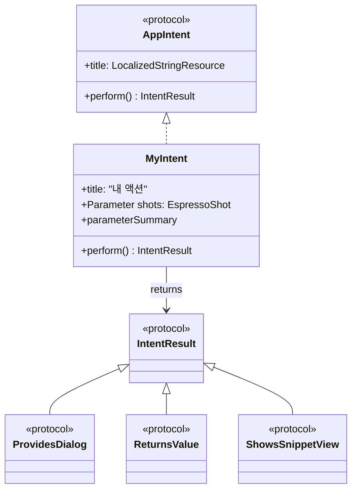
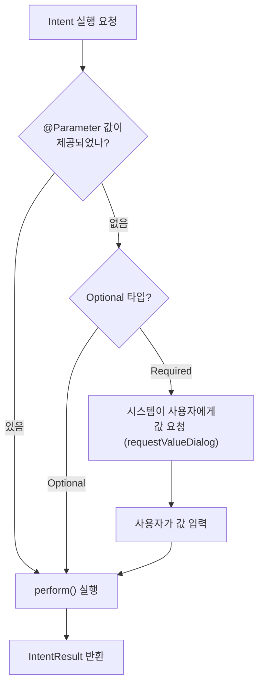
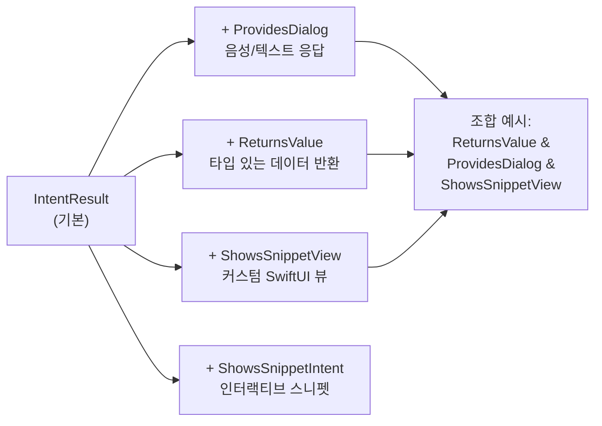
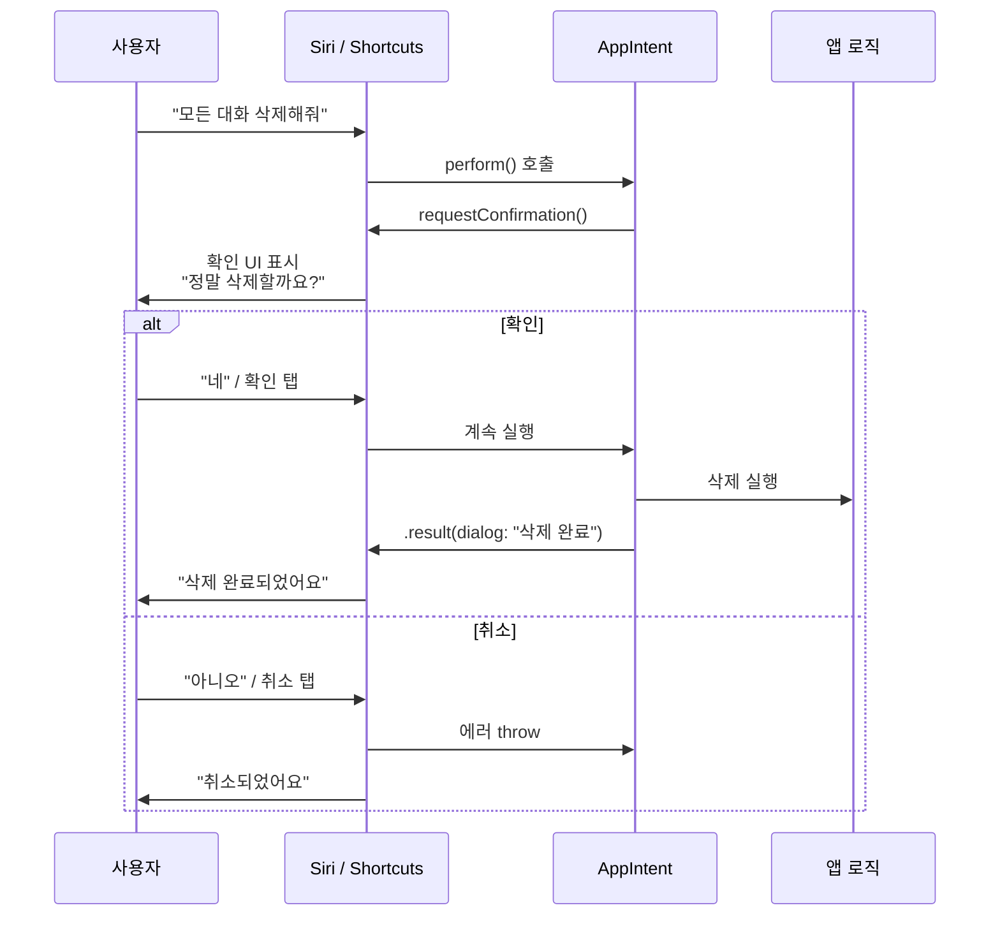
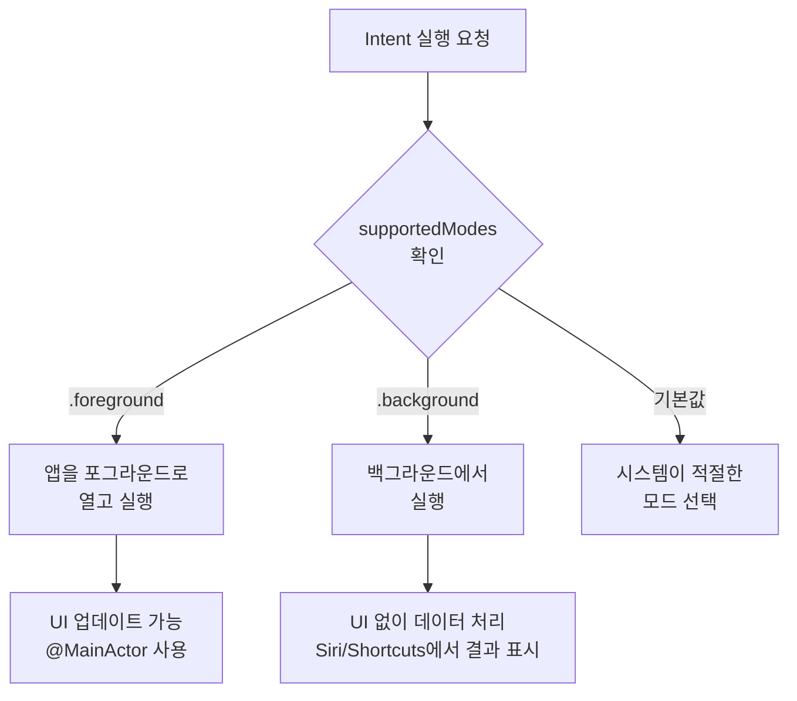

# 02. AppIntent로 액션 정의하기

> AppIntent 프로토콜을 구현하여 앱의 핵심 기능을 Siri, Shortcuts, Spotlight에 노출하는 액션을 정의합니다.

## 개요

이 섹션에서는 App Intents 프레임워크의 핵심인 **AppIntent 프로토콜**을 실제로 구현하는 방법을 배웁니다. 앞서 [App Intents 프레임워크 개요](13-ch13-app-intents와-siri-연동/01-01-app-intents-프레임워크-개요.md)에서 프레임워크의 전체 구조를 살펴봤다면, 이번에는 직접 코드를 작성하면서 "동사"에 해당하는 Intent를 만들어보겠습니다.

**선수 지식**: App Intents 프레임워크의 3축 구조(AppIntent, AppEntity, EntityQuery), Swift Concurrency(async/await) 기본 이해

**학습 목표**:
- AppIntent 프로토콜의 필수 요소(title, perform)를 구현할 수 있다
- @Parameter로 사용자 입력을 받고 parameterSummary로 설명을 제공할 수 있다
- IntentResult의 다양한 반환 타입(ProvidesDialog, ReturnsValue, ShowsSnippetView)을 조합할 수 있다
- requestConfirmation으로 사용자 확인 UI를 구현할 수 있다

## 왜 알아야 할까?

앱에 아무리 훌륭한 AI 기능을 넣어도, 사용자가 앱을 열고 → 화면을 찾고 → 버튼을 탭해야만 쓸 수 있다면 어떨까요? "Siri야, 오늘 일정 요약해줘"라고 한마디면 될 일을 매번 5번의 탭으로 해결해야 하는 거죠. 문제는 **앱의 기능이 앱 안에 갇혀 있다**는 겁니다.

**AppIntent는 이 감옥의 문을 여는 열쇠**입니다. 앱의 기능을 **구조화된 액션**으로 정의하면, 시스템이 그 기능을 이해하고 적재적소에서 실행할 수 있게 됩니다. 한 번 정의한 액션이 Siri 음성 명령, Shortcuts 자동화, Spotlight 검색, Action Button, 그리고 Apple Intelligence까지 — 코드 한 곳에서 여러 시스템 경험으로 자동 확장되는 구조예요.

구조화된 액션이 없으면 어떻게 될까요? Siri는 앱에 "질문하기" 기능이 있는지조차 모릅니다. Shortcuts에서 앱을 연결할 수도 없고, Apple Intelligence가 앱의 맥락을 활용할 수도 없어요. **AppIntent를 정의하지 않은 앱은 시스템의 눈에 보이지 않는 앱**이나 마찬가지입니다.

특히 [Foundation Models 프레임워크](03-ch3-foundation-models-프레임워크-시작하기/01-01-systemlanguagemodel-이해하기.md)와 결합하면, "AI에게 질문하기"나 "대화 요약하기" 같은 AI 기능을 Siri 한마디로 실행할 수 있게 됩니다. Ch10에서 만든 [AI 채팅봇 앱](10-ch10-실전-프로젝트-ai-채팅봇-앱/01-01-채팅봇-앱-아키텍처-설계.md)에 이 기능을 추가하는 것이 이 챕터의 최종 목표입니다.

## 핵심 개념

### 개념 1: AppIntent 프로토콜의 구조

> 💡 **비유**: AppIntent는 식당의 **메뉴판 항목**과 같습니다. 메뉴에는 요리 이름(title), 재료 목록(@Parameter), 조리법(perform)이 적혀 있죠. 손님(시스템)은 메뉴판만 보고 주문할 수 있고, 주방(앱)은 조리법대로 요리를 만들어 내놓습니다. 메뉴판을 잘 작성하면 손님이 무엇을 시킬 수 있는지 한눈에 알 수 있는 것처럼, AppIntent를 잘 정의하면 시스템이 앱의 기능을 자연스럽게 이해합니다.

AppIntent 프로토콜은 세 가지 필수 요소로 구성됩니다:

1. **`title`** — Intent의 이름 (LocalizedStringResource)
2. **`perform()`** — 실제 실행 로직 (async throws)
3. **반환 타입** — IntentResult 프로토콜을 따르는 결과

> 📊 **그림 1**: AppIntent 프로토콜의 핵심 구조



가장 간단한 AppIntent 구현을 살펴볼까요?

```swift
import AppIntents

// 가장 단순한 AppIntent — 앱 내 특정 화면으로 이동
struct NavigateToChatsIntent: AppIntent {
    // 1. 시스템에 표시될 제목 (Shortcuts, Siri에서 보임)
    static let title: LocalizedStringResource = "채팅 목록 열기"
    
    // 2. 선택: Intent에 대한 상세 설명
    static let description = IntentDescription("AI 채팅봇의 채팅 목록 화면을 엽니다.")
    
    // 3. 앱을 포그라운드로 열어야 하는 경우
    static let openAppWhenRun: Bool = true
    
    // 4. 실제 실행 로직
    @MainActor
    func perform() async throws -> some IntentResult {
        Navigator.shared.navigate(to: .chatList)
        return .result()
    }
}
```

여기서 주목할 점 몇 가지가 있어요:

- **`title`은 반드시 상수(`static let`)**여야 합니다. 시스템이 **빌드 타임**에 메타데이터를 추출하기 때문이에요. 런타임에 동적으로 바꿀 수 없습니다.
- **`openAppWhenRun`**을 `true`로 설정하면 Intent 실행 시 앱이 포그라운드로 올라옵니다. UI 네비게이션이 필요한 경우에 사용하죠.
- **`@MainActor`**를 `perform()`에 붙이면 메인 스레드에서 실행됩니다. UI 업데이트가 필요한 Intent에서 사용합니다.

### 개념 2: @Parameter로 사용자 입력 받기

> 💡 **비유**: @Parameter는 온라인 주문 폼의 **입력 필드**와 같아요. 필수 필드를 빈칸으로 두면 "이 항목을 입력해주세요"라고 안내가 뜨죠. @Parameter도 마찬가지로, 값이 없으면 시스템이 사용자에게 묻습니다.

@Parameter 프로퍼티 래퍼를 사용하면 Intent에 입력 파라미터를 추가할 수 있습니다. 파라미터는 Siri의 음성 입력, Shortcuts의 UI, 또는 코드에서 직접 전달할 수 있어요.

> 📊 **그림 2**: @Parameter의 값 해석 흐름



```swift
import AppIntents

struct AskAIIntent: AppIntent {
    static let title: LocalizedStringResource = "AI에게 질문하기"
    static let description = IntentDescription("AI 채팅봇에게 질문을 보냅니다.")
    
    // 필수 파라미터 — 값이 없으면 시스템이 사용자에게 묻는다
    @Parameter(title: "질문", requestValueDialog: "어떤 질문을 하시겠어요?")
    var question: String
    
    // 선택 파라미터 — Optional이므로 값이 없어도 실행 가능
    @Parameter(title: "대화 스타일", default: .casual)
    var style: ConversationStyle?
    
    // 빈 이니셜라이저 필수 (시스템이 인스턴스를 생성할 때 사용)
    init() {}
    
    // 코드에서 직접 생성할 때 사용하는 편의 이니셜라이저
    init(question: String, style: ConversationStyle? = nil) {
        self.question = question
        self.style = style
    }
    
    // 파라미터 요약 — Shortcuts UI에서 자연어로 표시
    static var parameterSummary: some ParameterSummary {
        Summary("AI에게 \(\.$question) 질문하기")
    }
    
    func perform() async throws -> some IntentResult & ProvidesDialog {
        let answer = try await AIService.shared.ask(question, style: style ?? .casual)
        return .result(dialog: "\(answer)")
    }
}
```

**중요한 규칙**: @Parameter가 있는 Intent에는 반드시 **빈 이니셜라이저(`init()`)가 필요**합니다. 시스템이 런타임에 Intent 인스턴스를 생성할 때 이 이니셜라이저를 사용하거든요. 이걸 빼먹으면 컴파일 에러가 발생합니다.

**parameterSummary**는 Shortcuts 앱에서 사용자에게 보여주는 자연어 설명이에요. `\(\.$question)`처럼 **프로퍼티 래퍼의 프로젝트 값**(`$` prefix)을 사용한다는 점에 주의하세요.

`perform()` 내부에서 파라미터 값을 동적으로 요청할 수도 있습니다:

```swift
func perform() async throws -> some IntentResult & ProvidesDialog {
    // 런타임에 값이 없으면 사용자에게 요청
    if style == nil {
        style = try await $style.requestValue("어떤 스타일로 대화할까요?")
    }
    
    let answer = try await AIService.shared.ask(question, style: style!)
    return .result(dialog: "\(answer)")
}
```

### 개념 3: IntentResult 반환 타입 조합

> 💡 **비유**: IntentResult의 프로토콜 조합은 **카페 주문의 옵션**과 비슷해요. 기본 커피(IntentResult)에 샷 추가(ProvidesDialog), 시럽 추가(ReturnsValue), 휘핑 추가(ShowsSnippetView)를 자유롭게 조합하는 것처럼, 반환 타입도 필요한 기능을 `&`로 조합합니다.

`perform()`의 반환 타입은 `some IntentResult`를 기본으로 하되, 여러 프로토콜을 `&`로 결합하여 풍부한 결과를 제공할 수 있습니다.

> 📊 **그림 3**: IntentResult 프로토콜 조합 패턴



각 프로토콜이 어떤 역할을 하는지 살펴보겠습니다:

```swift
// 1. 기본 — 결과만 반환 (Siri는 "완료"만 말함)
func perform() async throws -> some IntentResult {
    doSomething()
    return .result()
}

// 2. ProvidesDialog — Siri가 말할 텍스트를 포함
func perform() async throws -> some IntentResult & ProvidesDialog {
    return .result(dialog: "카페인 75mg을 기록했어요.")
}

// 3. ReturnsValue — Shortcuts에서 다음 액션으로 값을 전달
func perform() async throws -> some IntentResult & ReturnsValue<String> & ProvidesDialog {
    let summary = try await AIService.shared.summarize(text)
    return .result(value: summary, dialog: "요약이 완료되었어요.")
}

// 4. ShowsSnippetView — 커스텀 SwiftUI 뷰 표시
func perform() async throws -> some IntentResult & ProvidesDialog & ShowsSnippetView {
    let stats = await ChatStore.shared.todayStats()
    return .result(
        dialog: "오늘의 대화 통계입니다.",
        view: ChatStatsView(stats: stats) // 커스텀 SwiftUI 뷰
    )
}
```

> ⚠️ **흔한 오해**: `ReturnsValue<T>`의 제네릭 타입 `T`는 아무 타입이나 쓸 수 있는 게 아닙니다. 기본 타입(String, Int, Double, Bool)이거나, `AppEntity` 또는 `AppEnum`을 채택한 타입이어야 합니다. 그래야 Shortcuts 앱에서 다음 액션의 입력으로 연결할 수 있거든요.

### 개념 4: 확인 UI와 requestConfirmation

> 💡 **비유**: 온라인 쇼핑에서 "결제하기" 버튼을 누르면 "정말 주문하시겠습니까?"라는 확인 팝업이 뜨죠? `requestConfirmation`이 바로 그 역할입니다. 되돌리기 어려운 작업 전에 사용자의 최종 확인을 받는 안전장치예요.

데이터를 삭제하거나 메시지를 전송하는 등 **되돌리기 어려운 작업**에서는 사용자 확인이 필수입니다. `requestConfirmation`을 사용하면 Siri와 Shortcuts 모두에서 확인 UI를 자동으로 표시할 수 있어요.

> 📊 **그림 4**: requestConfirmation 실행 흐름



```swift
struct DeleteAllChatsIntent: AppIntent {
    static let title: LocalizedStringResource = "모든 대화 삭제"
    static let description = IntentDescription("AI 채팅봇의 모든 대화 기록을 삭제합니다.")
    
    func perform() async throws -> some IntentResult & ProvidesDialog & ShowsSnippetView {
        let chatCount = await ChatStore.shared.totalCount()
        
        // 사용자에게 확인 요청 — 취소하면 에러가 throw됨
        try await requestConfirmation(
            result: .result(
                dialog: "\(chatCount)개의 대화를 모두 삭제할까요?",
                view: DeleteConfirmationView(count: chatCount)
            ),
            confirmationActionName: .destructive // 빨간 버튼 스타일
        )
        
        // 확인된 경우에만 여기 도달
        await ChatStore.shared.deleteAll()
        
        return .result(
            dialog: "\(chatCount)개의 대화가 삭제되었어요.",
            view: DeleteCompletionView()
        )
    }
}
```

`confirmationActionName`에는 액션의 성격에 맞는 버튼 라벨을 지정할 수 있습니다:

| 값 | 용도 | 버튼 스타일 |
|------|------|------|
| `.destructive` | 삭제, 초기화 | 빨간색 |
| `.send` | 메시지 전송 | 파란색 |
| `.order` | 주문, 구매 | 파란색 |
| `.buy` | 결제 | 파란색 |
| `.confirm` | 일반 확인 | 기본 |

### 개념 5: supportedModes와 실행 환경 제어

iOS 26에서 추가된 `supportedModes` 프로퍼티를 사용하면 Intent가 **포그라운드에서만** 실행되도록 제한할 수 있습니다. 이전의 `openAppWhenRun`보다 더 명확한 제어를 제공합니다.

> 📊 **그림 5**: Intent 실행 모드와 환경



```swift
struct OpenChatIntent: AppIntent {
    static let title: LocalizedStringResource = "특정 대화 열기"
    
    // iOS 26+: 이 Intent는 반드시 포그라운드에서만 실행됨
    static let supportedModes: IntentModes = .foreground
    
    @Parameter(title: "대화")
    var chat: ChatEntity
    
    @MainActor
    func perform() async throws -> some IntentResult {
        Navigator.shared.openChat(chat.id)
        return .result()
    }
}
```

반면, AI에게 질문하고 결과만 반환하는 Intent는 백그라운드에서도 충분합니다:

```swift
struct QuickAskIntent: AppIntent {
    static let title: LocalizedStringResource = "빠른 질문"
    
    // 앱을 열지 않고 백그라운드에서 실행 가능
    static let openAppWhenRun: Bool = false
    
    @Parameter(title: "질문")
    var question: String
    
    func perform() async throws -> some IntentResult & ProvidesDialog {
        let answer = try await AIService.shared.ask(question)
        return .result(dialog: "\(answer)")
    }
}
```

## 실습: 직접 해보기

AI 채팅봇 앱에 세 가지 AppIntent를 구현해봅시다: 빠른 질문, 대화 요약, 대화 삭제(확인 포함).

```swift
import AppIntents
import SwiftUI

// MARK: - 대화 스타일 AppEnum

enum ConversationStyle: String, AppEnum {
    case casual    // 편한 대화체
    case formal    // 격식체
    case concise   // 간결 요약체
    
    static let typeDisplayRepresentation: TypeDisplayRepresentation = "대화 스타일"
    static let caseDisplayRepresentations: [ConversationStyle: DisplayRepresentation] = [
        .casual: DisplayRepresentation(title: "편한 대화",
                                       image: .init(systemName: "bubble.left")),
        .formal: DisplayRepresentation(title: "격식체",
                                       image: .init(systemName: "text.book.closed")),
        .concise: DisplayRepresentation(title: "간결 요약",
                                        image: .init(systemName: "text.justify.leading"))
    ]
}

// MARK: - Intent 1: AI에게 빠른 질문

struct QuickAskAIIntent: AppIntent {
    static let title: LocalizedStringResource = "AI에게 빠른 질문"
    static let description = IntentDescription(
        "AI 채팅봇에게 질문을 보내고 답변을 받습니다."
    )
    
    // 필수 파라미터
    @Parameter(title: "질문 내용", requestValueDialog: "무엇이 궁금하세요?")
    var question: String
    
    // 선택 파라미터 (기본값 있음)
    @Parameter(title: "대화 스타일", default: .casual)
    var style: ConversationStyle
    
    init() {}
    init(question: String, style: ConversationStyle = .casual) {
        self.question = question
        self.style = style
    }
    
    // Shortcuts에서 표시되는 자연어 요약
    static var parameterSummary: some ParameterSummary {
        Summary("AI에게 \(\.$style) 스타일로 \(\.$question) 질문하기")
    }
    
    func perform() async throws -> some IntentResult & ReturnsValue<String> & ProvidesDialog {
        // Foundation Models 프레임워크로 AI 응답 생성
        let session = LanguageModelSession()
        let stylePrompt = switch style {
        case .casual: "친근한 대화체로 답변해줘."
        case .formal: "격식체로 정중하게 답변하세요."
        case .concise: "핵심만 3줄 이내로 답변해."
        }
        
        let response = try await session.respond(
            to: "\(stylePrompt)\n\n질문: \(question)"
        )
        let answer = response.content
        
        // Siri가 읽어줄 다이얼로그 + Shortcuts에서 사용할 값 반환
        return .result(
            value: answer,
            dialog: "\(answer)"
        )
    }
}

// MARK: - Intent 2: 최근 대화 요약 (ShowsSnippetView 활용)

struct SummarizeChatIntent: AppIntent {
    static let title: LocalizedStringResource = "최근 대화 요약"
    static let description = IntentDescription(
        "가장 최근 AI 대화의 핵심 내용을 요약합니다."
    )
    
    func perform() async throws -> some IntentResult & ProvidesDialog & ShowsSnippetView {
        guard let lastChat = await ChatStore.shared.mostRecent() else {
            return .result(
                dialog: "아직 대화 기록이 없어요.",
                view: EmptyChatView()
            )
        }
        
        // AI로 대화 요약 생성
        let session = LanguageModelSession()
        let summary = try await session.respond(
            to: "다음 대화를 3줄로 요약해줘:\n\(lastChat.transcript)"
        )
        
        return .result(
            dialog: "최근 대화 요약이에요. \(summary.content)",
            view: ChatSummarySnippetView(
                chatTitle: lastChat.title,
                summary: summary.content,
                messageCount: lastChat.messages.count,
                date: lastChat.lastModified
            )
        )
    }
}

// 스니펫 뷰 — Siri/Shortcuts에서 표시되는 커스텀 UI
struct ChatSummarySnippetView: View {
    let chatTitle: String
    let summary: String
    let messageCount: Int
    let date: Date
    
    var body: some View {
        VStack(alignment: .leading, spacing: 8) {
            HStack {
                Image(systemName: "bubble.left.and.bubble.right")
                    .foregroundStyle(.blue)
                Text(chatTitle)
                    .font(.headline)
                Spacer()
                Text("\(messageCount)개 메시지")
                    .font(.caption)
                    .foregroundStyle(.secondary)
            }
            
            Divider()
            
            Text(summary)
                .font(.body)
                .lineLimit(4)
            
            Text(date, style: .relative)
                .font(.caption2)
                .foregroundStyle(.tertiary)
        }
        .padding()
    }
}

// MARK: - Intent 3: 대화 삭제 (Confirmation 포함)

struct DeleteChatIntent: AppIntent {
    static let title: LocalizedStringResource = "대화 삭제"
    static let description = IntentDescription(
        "선택한 대화를 삭제합니다. 삭제 전 확인을 요청합니다."
    )
    
    @Parameter(title: "대화 제목", requestValueDialog: "어떤 대화를 삭제할까요?")
    var chatTitle: String
    
    init() {}
    init(chatTitle: String) { self.chatTitle = chatTitle }
    
    static var parameterSummary: some ParameterSummary {
        Summary("\(\.$chatTitle) 대화 삭제하기")
    }
    
    func perform() async throws -> some IntentResult & ProvidesDialog {
        guard let chat = await ChatStore.shared.find(byTitle: chatTitle) else {
            return .result(dialog: "'\(chatTitle)' 대화를 찾을 수 없어요.")
        }
        
        // 삭제 전 사용자 확인 요청
        try await requestConfirmation(
            result: .result(
                dialog: "'\(chat.title)' 대화(\(chat.messages.count)개 메시지)를 삭제할까요? 이 작업은 되돌릴 수 없어요."
            ),
            confirmationActionName: .destructive
        )
        
        // 사용자가 확인한 경우에만 실행됨
        await ChatStore.shared.delete(chat.id)
        
        return .result(dialog: "'\(chat.title)' 대화가 삭제되었어요.")
    }
}
```

```run:swift
// AppIntent의 기본 구조를 확인하는 간단한 시뮬레이션
struct SimpleGreetingIntent {
    static let title = "인사하기"
    var name: String = "Swift 개발자"
    
    func perform() -> String {
        return "안녕하세요, \(name)님! AI 채팅봇이 준비되었어요."
    }
}

let intent = SimpleGreetingIntent(name: "Jason")
let result = intent.perform()
print("Intent 결과: \(result)")
print("Intent 제목: \(SimpleGreetingIntent.title)")
```

```output
Intent 결과: 안녕하세요, Jason님! AI 채팅봇이 준비되었어요.
Intent 제목: 인사하기
```

## 더 깊이 알아보기

### App Intents의 탄생 — SiriKit에서의 진화

App Intents는 하루아침에 만들어진 프레임워크가 아닙니다. 2016년 iOS 10에서 **SiriKit**이 처음 등장했을 때, Apple은 미리 정의된 도메인(메시징, 결제, 운동 등)만 지원했어요. "Siri야, OO에게 메시지 보내줘"는 가능했지만, "Siri야, 내 앱에서 XX 해줘"는 불가능했죠.

2018년 iOS 12에서 **Shortcuts**와 **Custom Intents**가 추가되며 자유도가 높아졌지만, Intent Definition 파일(.intentdefinition)을 Xcode에서 GUI로 편집해야 했고, 자동 생성된 코드와 수동 코드 사이의 불일치 문제가 끊이지 않았습니다.

2022년 WWDC에서 Apple은 이 모든 문제를 해결하기 위해 **App Intents** 프레임워크를 발표합니다. 핵심 아이디어는 심플했어요 — "코드가 곧 정의다." 별도의 설정 파일 없이, Swift 코드만으로 Intent를 정의하고 시스템이 **빌드 타임**에 자동으로 메타데이터를 추출하는 방식이죠.

이 설계 철학은 2025년 WWDC에서 더 진화합니다. **App Intents Packages**를 통해 여러 타겟(앱, 위젯, 익스텐션)에서 Intent를 공유할 수 있게 되었고, **SnippetIntent**로 인터랙티브한 커스텀 UI를 Siri 결과에 넣을 수 있게 되었습니다.

> 💡 **알고 계셨나요?**: App Intents의 빌드 타임 메타데이터 추출은 Swift 매크로 시스템과 같은 원리를 사용합니다. `static let title`이 반드시 상수여야 하는 이유도 여기에 있어요 — 컴파일러가 값을 미리 읽어서 시스템 데이터베이스에 등록해야 하니까요. 이 덕분에 앱이 실행되지 않은 상태에서도 Siri가 어떤 Intent가 사용 가능한지 알 수 있습니다.

## 흔한 오해와 팁

> ⚠️ **흔한 오해**: "AppIntent에 `init()`을 안 써도 컴파일되던데요?" — 파라미터가 없는 Intent는 Swift가 자동으로 기본 이니셜라이저를 생성하기 때문에 컴파일됩니다. 하지만 @Parameter가 하나라도 있으면 **반드시 빈 `init()`을 명시적으로 선언**해야 해요. 시스템이 런타임에 Intent 인스턴스를 생성한 뒤 파라미터를 주입하는 방식이기 때문입니다.

> 💡 **알고 계셨나요?**: `perform()` 메서드의 반환 타입에서 `some IntentResult & ProvidesDialog`처럼 `&`로 프로토콜을 조합하는 패턴은 Swift의 **Opaque Return Type + Protocol Composition** 기능을 활용한 것입니다. 이 패턴 덕분에 컴파일 타임에 반환 타입이 확정되면서도 유연한 조합이 가능해졌죠.

> 🔥 **실무 팁**: `requestConfirmation()`을 호출하면 사용자가 취소할 경우 에러가 throw됩니다. 별도로 에러를 처리할 필요 없이, `perform()` 자체가 `throws`이므로 에러가 자동으로 시스템에 전파되어 "취소되었습니다" 메시지가 표시됩니다. 불필요한 do-catch를 추가하지 마세요.

> 🔥 **실무 팁**: `parameterSummary`는 단순히 보기 좋은 설명이 아닙니다. macOS의 Spotlight에서 Intent를 바로 실행하려면, parameterSummary에 **모든 필수 파라미터가 포함**되어야 합니다. WWDC25에서 새로 추가된 기능이에요.

## 핵심 정리

| 개념 | 설명 |
|------|------|
| **AppIntent 프로토콜** | title(이름) + perform()(실행 로직) + IntentResult(반환)의 3요소 |
| **@Parameter** | Intent의 입력 파라미터 정의. Optional이면 선택, 아니면 시스템이 값 요청 |
| **parameterSummary** | Shortcuts UI에 표시되는 자연어 설명. `\(\.$param)` 문법 사용 |
| **ProvidesDialog** | Siri가 말할 텍스트를 반환 |
| **ReturnsValue\<T\>** | Shortcuts에서 다음 액션으로 전달할 타입 있는 값 반환 |
| **ShowsSnippetView** | 커스텀 SwiftUI 뷰를 Siri/Shortcuts 결과에 표시 |
| **requestConfirmation** | 위험한 작업 전 사용자 확인 UI 표시. 취소 시 에러 throw |
| **supportedModes** | Intent 실행 환경 제어 (.foreground / .background) |
| **openAppWhenRun** | true면 Intent 실행 시 앱이 포그라운드로 전환 |
| **빈 init() 필수** | @Parameter가 있는 Intent에 반드시 필요 (시스템 인스턴스 생성용) |

## 다음 섹션 미리보기

지금까지 "동사"에 해당하는 AppIntent를 구현했습니다. 하지만 "AI 채팅봇에서 **최근 대화**를 열어줘"처럼, Intent가 **앱의 데이터**(명사)를 다루려면 어떻게 해야 할까요? 다음 섹션 [AppEntity와 EntityQuery](13-ch13-app-intents와-siri-연동/03-03-appentity와-entityquery.md)에서는 앱의 데이터 모델을 시스템에 노출하는 방법을 배웁니다. 대화 목록, 즐겨찾기 같은 동적 데이터를 Siri가 검색하고 참조할 수 있게 만드는 핵심 기술이에요.

## 참고 자료

- [App Intents — Apple Developer Documentation](https://developer.apple.com/documentation/appintents) - AppIntent 프로토콜의 공식 레퍼런스
- [Get to know App Intents — WWDC25](https://developer.apple.com/videos/play/wwdc2025/244/) - iOS 26 새 기능(supportedModes, Packages 등) 소개 세션
- [App Intents Tutorial: A Field Guide for iOS Developers — Superwall](https://superwall.com/blog/an-app-intents-field-guide-for-ios-developers/) - @Parameter, IntentResult 조합, 실전 구현 가이드
- [App Intents Interactive Snippets in iOS 26 — Superwall](https://superwall.com/blog/app-intents-interactive-snippets-in-ios-26/) - SnippetIntent와 인터랙티브 UI 구현 심화 자료
- [Integrating actions with Siri and Apple Intelligence — Apple Developer](https://developer.apple.com/documentation/appintents/integrating-actions-with-siri-and-apple-intelligence) - Siri + Apple Intelligence 통합 공식 가이드

---
### 🔗 Related Sessions
- [foundation models 프레임워크](01-ch1-apple-intelligence와-온디바이스-ai/01-01-apple-intelligence-개요.md) (prerequisite)
- [app intents 프레임워크](13-ch13-app-intents와-siri-연동/01-01-app-intents-프레임워크-개요.md) (prerequisite)
- [appintent](13-ch13-app-intents와-siri-연동/01-01-app-intents-프레임워크-개요.md) (prerequisite)
- [appentity](13-ch13-app-intents와-siri-연동/01-01-app-intents-프레임워크-개요.md) (prerequisite)
- [appenum](13-ch13-app-intents와-siri-연동/01-01-app-intents-프레임워크-개요.md) (prerequisite)
- [intentresult](13-ch13-app-intents와-siri-연동/01-01-app-intents-프레임워크-개요.md) (prerequisite)
- [@parameter](13-ch13-app-intents와-siri-연동/01-01-app-intents-프레임워크-개요.md) (prerequisite)
- [displayrepresentation](13-ch13-app-intents와-siri-연동/01-01-app-intents-프레임워크-개요.md) (prerequisite)
