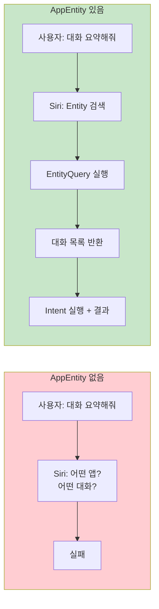
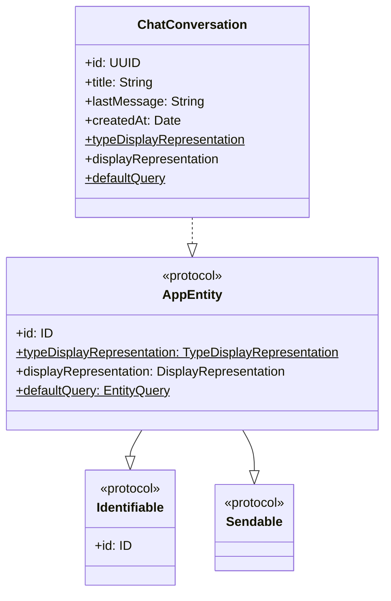
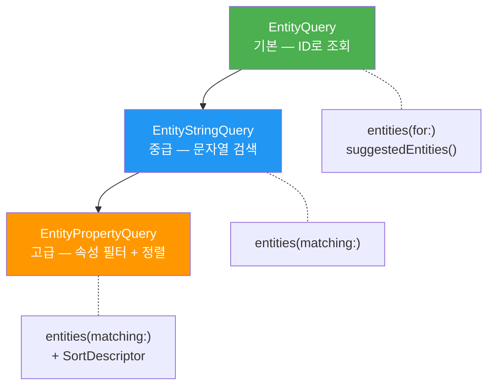
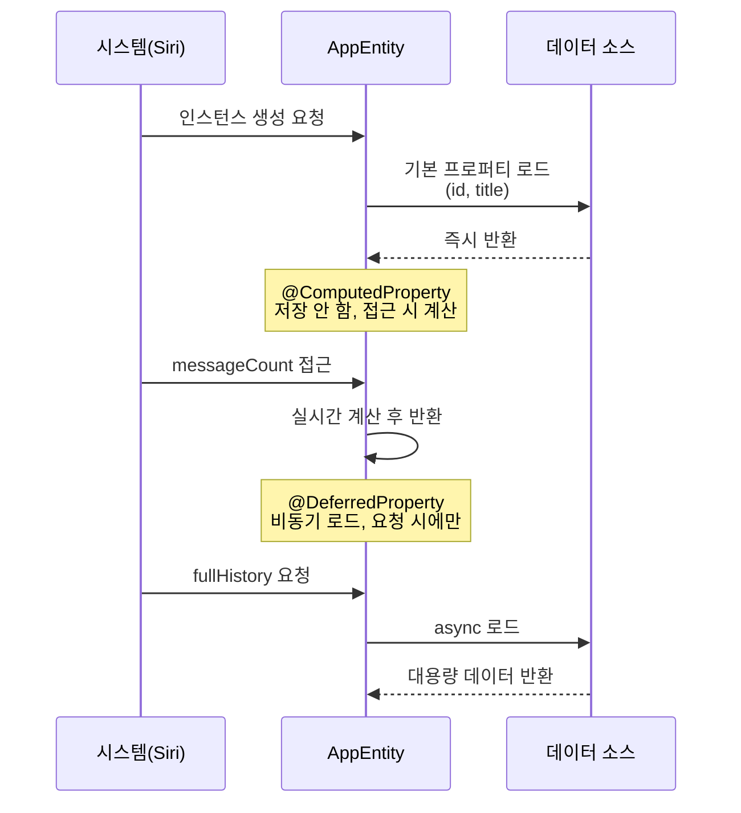
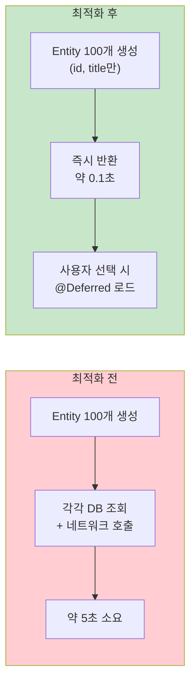
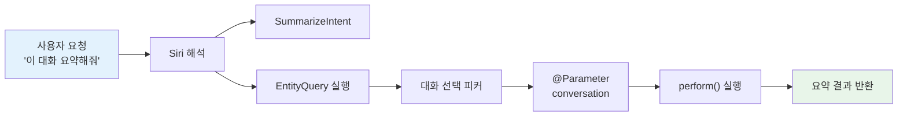

# 03. AppEntity와 EntityQuery

> AppEntity 프로토콜로 앱의 동적 데이터를 시스템에 노출하고, EntityQuery로 Siri와 Shortcuts가 앱 데이터를 검색·참조할 수 있게 만듭니다.

## 개요

이 섹션에서는 App Intents 프레임워크의 "명사" 역할을 하는 **AppEntity**와, 그 명사를 찾아주는 **EntityQuery** 시스템을 다룹니다. 앞서 [02. AppIntent로 액션 정의하기](13-ch13-app-intents와-siri-연동/02-02-appintent로-액션-정의하기.md)에서 배운 Intent가 "동사"라면, 이번에 배울 Entity는 그 동사가 작용하는 "대상"입니다.

**선수 지식**:
- [01. App Intents 프레임워크 개요](13-ch13-app-intents와-siri-연동/01-01-app-intents-프레임워크-개요.md)에서 배운 AppEntity, AppEnum, EntityQuery의 역할
- [02. AppIntent로 액션 정의하기](13-ch13-app-intents와-siri-연동/02-02-appintent로-액션-정의하기.md)의 @Parameter, IntentResult 패턴
- Swift 프로토콜과 제네릭 기본 지식

**학습 목표**:
- AppEntity 프로토콜의 필수 요구사항 3가지를 구현할 수 있다
- TypeDisplayRepresentation과 DisplayRepresentation의 차이를 이해한다
- EntityQuery, EntityStringQuery, EntityPropertyQuery를 상황에 맞게 선택·구현한다
- @ComputedProperty와 @DeferredProperty 매크로로 Entity 성능을 최적화한다

## 왜 알아야 할까?

"Siri야, 어제 정리한 메모 열어줘." 사용자가 이렇게 말했는데 Siri가 "어떤 메모인지 모르겠어요"라고 답한다면? 실제로 AppEntity를 구현하지 않은 앱에서 흔히 일어나는 일입니다. 메모 앱 안에는 수백 개의 메모가 있지만, Siri 입장에서는 그 데이터가 **보이지 않거든요**.

AppEntity는 이 벽을 허무는 열쇠입니다 — 앱 안에만 갇혀 있던 데이터를 시스템 전체에 "이런 것들이 있어요"라고 알려주는 역할을 하죠.

실제로 Apple Intelligence가 강화된 Siri는 사용자의 자연어 요청을 해석할 때, 앱이 노출한 Entity를 참조하여 "어떤 대화?", "어떤 메모?"를 정확히 특정합니다. AppEntity 없이는 Intent의 파라미터로 앱 데이터를 받을 수 없고, Siri와의 자연스러운 대화도 불가능해요.

> 📊 **그림 1**: AppEntity가 없는 경우 vs 있는 경우의 Siri 상호작용



## 핵심 개념

### 개념 1: AppEntity — 앱 데이터의 여권

> 💡 **비유**: AppEntity는 앱 데이터의 **여권**이에요. 여권이 있어야 해외(시스템 서비스)에 나갈 수 있듯이, 앱 내부 모델에 AppEntity "여권"을 발급하면 Siri, Shortcuts, Spotlight 등 시스템 어디서든 인식됩니다.

AppEntity 프로토콜을 채택하면 세 가지를 반드시 구현해야 합니다:

| 요구사항 | 역할 | 비유 |
|----------|------|------|
| `typeDisplayRepresentation` | 엔티티 **타입**의 이름 (static) | 여권의 "국적" |
| `displayRepresentation` | 개별 인스턴스의 표시 정보 | 여권의 "이름과 사진" |
| `defaultQuery` | 엔티티를 찾는 기본 검색 방법 (static) | 여권 조회 시스템 |

> 📊 **그림 2**: AppEntity 프로토콜의 세 가지 필수 요구사항



아래는 AI 채팅봇 앱의 대화(Conversation)를 AppEntity로 만드는 코드입니다:

```swift
import AppIntents

// 앱의 대화 데이터 모델을 AppEntity로 확장
struct ChatConversation: AppEntity {
    // Identifiable 요구: 고유 식별자
    var id: UUID
    var title: String
    var lastMessage: String
    var createdAt: Date
    var isPinned: Bool
    
    // 1) 타입 표시: Siri UI에서 "대화"라는 카테고리명으로 표시
    static var typeDisplayRepresentation: TypeDisplayRepresentation = "대화"
    
    // 2) 인스턴스 표시: 각 대화가 UI에 어떻게 보일지 정의
    var displayRepresentation: DisplayRepresentation {
        DisplayRepresentation(
            title: "\(title)",
            subtitle: "\(lastMessage)",
            image: isPinned 
                ? .init(systemName: "pin.fill") 
                : .init(systemName: "bubble.left.fill")
        )
    }
    
    // 3) 기본 쿼리: 이 엔티티를 찾는 방법
    static var defaultQuery = ChatConversationQuery()
}
```

**TypeDisplayRepresentation**은 문자열 리터럴로 간단히 쓸 수도 있고, 복수형·동의어를 지정할 수도 있습니다:

```swift
// 간단한 형태
static var typeDisplayRepresentation: TypeDisplayRepresentation = "대화"

// 복수형과 동의어까지 지정하는 형태
static var typeDisplayRepresentation: TypeDisplayRepresentation = .init(
    name: LocalizedStringResource("대화"),
    numericFormat: "\(placeholder: .int) 개의 대화",
    synonyms: ["채팅", "메시지", "대화방"]
)
```

**DisplayRepresentation**은 개별 인스턴스가 Shortcuts 피커나 Siri 결과에서 어떻게 보이는지 결정합니다. title, subtitle, image를 조합하여 풍부한 UI를 제공할 수 있어요.

### 개념 2: EntityQuery — 데이터를 찾는 검색 엔진

> 💡 **비유**: EntityQuery는 도서관의 **사서** 같은 존재입니다. "이 책 찾아주세요"(ID 검색)라고 하면 정확히 그 책을 가져오고, "추천 도서 있나요?"(추천 목록)라고 하면 인기 도서를 보여주죠. 더 나아가 "제목에 'Swift'가 들어간 책"(문자열 검색)이나 "2025년 이후 출판된 프로그래밍 책"(속성 검색)처럼 다양한 검색도 처리합니다.

EntityQuery에는 세 가지 레벨이 있습니다:

> 📊 **그림 3**: EntityQuery의 세 가지 레벨



**레벨 1: EntityQuery (기본)**

가장 기본적인 쿼리로, 두 가지 메서드만 구현하면 됩니다:

```swift
struct ChatConversationQuery: EntityQuery {
    // 필수: ID 배열로 특정 엔티티 조회
    func entities(for identifiers: [UUID]) async throws -> [ChatConversation] {
        // 데이터 소스에서 해당 ID의 대화를 찾아 반환
        let store = ChatStore.shared
        return store.conversations.filter { identifiers.contains($0.id) }
    }
    
    // 선택(권장): Shortcuts 피커에 표시할 추천 목록
    func suggestedEntities() async throws -> [ChatConversation] {
        // 최근 대화 5개를 추천으로 표시
        let store = ChatStore.shared
        return Array(store.conversations
            .sorted { $0.createdAt > $1.createdAt }
            .prefix(5))
    }
    
    // 선택: 기본값 반환 (파라미터 미지정 시)
    func defaultResult() async -> ChatConversation? {
        try? await suggestedEntities().first
    }
}
```

`entities(for:)` 메서드는 시스템이 특정 엔티티를 "다시 불러올 때" 호출합니다. 예를 들어, 사용자가 Shortcuts에서 대화를 선택한 뒤 나중에 다시 그 Shortcut을 실행하면, 저장된 ID로 이 메서드를 호출하죠.

**레벨 2: EntityStringQuery (문자열 검색)**

사용자가 텍스트를 입력해서 엔티티를 검색할 수 있게 합니다:

```swift
struct ChatConversationQuery: EntityStringQuery {
    // EntityQuery의 메서드들도 그대로 구현
    func entities(for identifiers: [UUID]) async throws -> [ChatConversation] {
        ChatStore.shared.conversations.filter { identifiers.contains($0.id) }
    }
    
    func suggestedEntities() async throws -> [ChatConversation] {
        Array(ChatStore.shared.conversations.prefix(5))
    }
    
    // EntityStringQuery 추가 요구: 문자열 매칭
    func entities(matching query: String) async throws -> [ChatConversation] {
        // 제목이나 마지막 메시지에 검색어가 포함된 대화 반환
        let store = ChatStore.shared
        guard !query.isEmpty else {
            return try await suggestedEntities()
        }
        return store.conversations.filter { conversation in
            conversation.title.localizedCaseInsensitiveContains(query) ||
            conversation.lastMessage.localizedCaseInsensitiveContains(query)
        }
    }
}
```

EntityStringQuery를 채택하면 Shortcuts 피커에 **검색 바**가 자동으로 나타납니다. 사용자가 "Swift 관련"이라고 입력하면 해당 대화만 필터링되죠.

**레벨 3: EntityPropertyQuery (속성 기반 검색)**

가장 강력한 쿼리로, 여러 속성을 조합한 복잡한 검색과 정렬을 지원합니다:

```swift
struct ChatConversationQuery: EntityPropertyQuery {
    // 검색 가능한 속성 목록 선언
    static var properties = QueryProperties {
        Property(\ChatConversation.$title) {
            EqualToComparator { $0 }
            ContainsComparator { $0 }
        }
        Property(\ChatConversation.$isPinned) {
            EqualToComparator { $0 }
        }
    }
    
    // 정렬 기준 선언
    static var sortingOptions = SortingOptions {
        SortableBy(\ChatConversation.$createdAt)
        SortableBy(\ChatConversation.$title)
    }
    
    func entities(for identifiers: [UUID]) async throws -> [ChatConversation] {
        ChatStore.shared.conversations.filter { identifiers.contains($0.id) }
    }
    
    func suggestedEntities() async throws -> [ChatConversation] {
        Array(ChatStore.shared.conversations.prefix(5))
    }
    
    // 속성 기반 필터 + 정렬로 엔티티 검색
    func entities(
        matching comparators: [ResultComparator],
        mode: ComparatorMode,
        sortedBy: [Sort<ChatConversation>],
        limit: Int?
    ) async throws -> [ChatConversation] {
        var results = ChatStore.shared.conversations
        // comparators 적용 (프레임워크가 자동 처리)
        // sortedBy 적용
        if let limit { results = Array(results.prefix(limit)) }
        return results
    }
}
```

### 개념 3: Entity 프로퍼티 최적화 — @ComputedProperty와 @DeferredProperty

> 💡 **비유**: 이력서를 생각해보세요. 이름과 연락처는 항상 적혀 있어야 하지만(일반 프로퍼티), "경력 요약"은 필요할 때 계산하면 되고(@ComputedProperty), "추천서"는 면접관이 요청해야 준비하면 됩니다(@DeferredProperty). 모든 걸 미리 준비하면 비용이 너무 크니까요.

WWDC25에서 도입된 이 두 매크로는 Entity 인스턴스화 비용을 크게 줄여줍니다. 왜 이것이 중요할까요? Siri가 `suggestedEntities()`를 호출하면 여러 Entity가 한꺼번에 생성되는데, 각 Entity가 무거운 데이터를 모두 들고 있으면 응답이 느려지거든요.

> 📊 **그림 4**: 프로퍼티 종류별 데이터 로딩 시점



#### @ComputedProperty — 저장하지 않고 계산

`@ComputedProperty`는 Entity에 값을 저장하지 않고, **접근할 때마다 동기적으로 계산**합니다. 원본 데이터 소스에서 파생할 수 있는 값에 적합하죠.

```swift
struct ChatConversation: AppEntity {
    var id: UUID
    var title: String
    var lastMessage: String
    var createdAt: Date
    var isPinned: Bool
    
    // @ComputedProperty: 저장하지 않고 접근 시 계산
    // — Entity를 가볍게 유지하면서 파생 데이터 제공
    @ComputedProperty
    var messageCount: Int {
        ChatStore.shared.messageCount(for: id)
    }
    
    // 여러 파생 값을 효율적으로 제공
    @ComputedProperty
    var isRecent: Bool {
        createdAt > Date.now.addingTimeInterval(-86400) // 24시간 이내
    }
    
    @ComputedProperty
    var summary: String {
        "\(title) (\(messageCount)개 메시지)"
    }
    
    static var typeDisplayRepresentation: TypeDisplayRepresentation = "대화"
    
    var displayRepresentation: DisplayRepresentation {
        DisplayRepresentation(title: "\(title)", subtitle: "\(lastMessage)")
    }
    
    static var defaultQuery = ChatConversationQuery()
}
```

`@ComputedProperty`를 사용하면 Entity를 직렬화할 때 해당 프로퍼티는 **인코딩에서 제외**됩니다. 시스템이 Entity를 저장했다가 복원할 때 불필요한 데이터를 줄이는 효과가 있어요.

#### @DeferredProperty — 비동기 지연 로딩

`@DeferredProperty`는 한 단계 더 나아갑니다. **비동기** getter를 허용해서, 네트워크 요청이나 대용량 데이터 로드처럼 비용이 큰 작업을 "시스템이 실제로 요청할 때만" 수행하죠.

```swift
struct ChatConversation: AppEntity {
    var id: UUID
    var title: String
    var lastMessage: String
    var createdAt: Date
    var isPinned: Bool
    
    // @DeferredProperty: 비동기로 나중에 로드
    // — 대화 전체 기록은 사용자가 "상세 보기"를 요청할 때만 필요
    @DeferredProperty
    var fullHistory: [String]
    
    // @DeferredProperty: 네트워크 요청이 필요한 데이터
    @DeferredProperty
    var aiSummary: String
    
    static var typeDisplayRepresentation: TypeDisplayRepresentation = "대화"
    
    var displayRepresentation: DisplayRepresentation {
        DisplayRepresentation(title: "\(title)", subtitle: "\(lastMessage)")
    }
    
    static var defaultQuery = ChatConversationQuery()
}
```

`@DeferredProperty`로 선언한 프로퍼티의 실제 로딩은 EntityQuery의 특수 메서드에서 처리합니다:

```swift
struct ChatConversationQuery: EntityStringQuery {
    func entities(for identifiers: [UUID]) async throws -> [ChatConversation] {
        ChatStore.shared.conversations.filter { identifiers.contains($0.id) }
    }
    
    func suggestedEntities() async throws -> [ChatConversation] {
        // 추천 목록 반환 시에는 fullHistory를 로드하지 않음 — 가볍게!
        Array(ChatStore.shared.conversations.prefix(5))
    }
    
    func entities(matching query: String) async throws -> [ChatConversation] {
        guard !query.isEmpty else { return try await suggestedEntities() }
        return ChatStore.shared.conversations.filter {
            $0.title.localizedCaseInsensitiveContains(query)
        }
    }
}
```

#### 성능 비교: 최적화 전 vs 후

세 가지 접근 방식의 차이를 실감하기 위해, 대화 100개를 한꺼번에 로드하는 상황을 비교해봅시다:

> 📊 **그림 5**: 프로퍼티 전략별 성능 차이



```swift
// ❌ 최적화 전: 모든 프로퍼티를 미리 로드
struct NaiveConversation: AppEntity {
    var id: UUID
    var title: String
    var messageCount: Int          // 매번 DB 조회
    var fullHistory: [String]      // 매번 전체 로드
    var aiSummary: String          // 매번 네트워크 호출
    // Entity 100개 생성 시 → DB 조회 100회 + 네트워크 100회
    // ...
}

// ✅ 최적화 후: 필요한 시점에만 로드
struct OptimizedConversation: AppEntity {
    var id: UUID
    var title: String              // 기본 프로퍼티만 즉시 로드
    
    @ComputedProperty
    var messageCount: Int {        // 접근 시에만 동기 계산
        ChatStore.shared.messageCount(for: id)
    }
    
    @DeferredProperty
    var fullHistory: [String]      // 시스템 요청 시에만 비동기 로드
    
    @DeferredProperty
    var aiSummary: String          // 시스템 요청 시에만 네트워크 호출
    // Entity 100개 생성 시 → id, title만 로드. 나머지는 선택된 1개만 로드
    // ...
}
```

| 구분 | 일반 프로퍼티 | @ComputedProperty | @DeferredProperty |
|------|-------------|-------------------|-------------------|
| 저장 여부 | Entity에 저장 | 저장 안 함 | 저장 안 함 |
| 로드 시점 | 인스턴스 생성 시 | 접근 시 (동기) | 시스템 요청 시 (비동기) |
| 직렬화 | 포함 | 제외 | 제외 |
| 적합한 용도 | 항상 필요한 핵심 데이터 | 파생 값, 경량 계산 | 네트워크/DB의 대용량 데이터 |
| 예시 | id, title | messageCount, isRecent | fullHistory, aiSummary |

> 🔥 **실무 팁**: `suggestedEntities()`가 반환하는 Entity 목록이 Shortcuts 피커에 즉시 표시된다는 점을 기억하세요. 이 목록의 각 Entity가 무거우면 피커가 느리게 열립니다. `@ComputedProperty`와 `@DeferredProperty`를 적극 활용해서, 피커에 표시되는 Entity는 **title과 subtitle만 들고 있는 깃털처럼 가벼운 객체**로 만드세요.

### 개념 4: UniqueAppEntity — 싱글턴 엔티티

앱에 단 하나만 존재하는 데이터 — 예를 들어 "현재 사용자 프로필"이나 "앱 설정" — 에는 `UniqueAppEntity`를 사용합니다:

```swift
struct CurrentUserProfile: UniqueAppEntity {
    var id: UUID
    var name: String
    var aiModelPreference: String
    
    static var typeDisplayRepresentation: TypeDisplayRepresentation = "내 프로필"
    
    var displayRepresentation: DisplayRepresentation {
        DisplayRepresentation(title: "\(name)")
    }
    
    // UniqueAppEntity는 defaultQuery 대신 이것을 구현
    static func defaultValue() async -> CurrentUserProfile {
        // 현재 로그인한 사용자 반환
        await UserStore.shared.currentUser
    }
}
```

UniqueAppEntity는 EntityQuery가 필요 없습니다. 항상 하나의 인스턴스만 존재하므로 `defaultValue()` 하나만 구현하면 됩니다.

### 개념 5: Intent에서 Entity 사용하기 — @Parameter 연결

> 💡 **비유**: 동사(Intent)와 명사(Entity)를 조합하면 문장이 됩니다. "**이 대화를** 요약해줘"에서 "이 대화"가 Entity 파라미터고, "요약해줘"가 Intent의 perform()입니다.

> 📊 **그림 6**: Intent와 Entity의 연결 흐름



```swift
struct SummarizeConversationIntent: AppIntent {
    static var title: LocalizedStringResource = "대화 요약"
    static var description: IntentDescription = "선택한 대화의 내용을 AI로 요약합니다"
    
    // Entity를 파라미터로 받기
    @Parameter(title: "대화", description: "요약할 대화를 선택하세요")
    var conversation: ChatConversation
    
    // @Parameter에 옵셔널 Entity — 지정하지 않으면 기본값 사용
    @Parameter(title: "출력 형식", default: .bullet)
    var format: SummaryFormat
    
    func perform() async throws -> some IntentResult & ProvidesDialog {
        // conversation 엔티티의 데이터를 활용
        let summary = try await AIService.shared.summarize(
            conversation: conversation,
            format: format
        )
        return .result(dialog: "\(summary)")
    }
    
    // 파라미터 요약 — Shortcuts UI에 표시
    static var parameterSummary: some ParameterSummary {
        Summary("\(\.$conversation) 대화를 \(\.$format)(으)로 요약")
    }
}

// 요약 형식 AppEnum
enum SummaryFormat: String, AppEnum {
    case bullet = "bullet"
    case paragraph = "paragraph"
    case oneLine = "oneLine"
    
    static var typeDisplayRepresentation: TypeDisplayRepresentation = "요약 형식"
    static var caseDisplayRepresentations: [SummaryFormat: DisplayRepresentation] = [
        .bullet: "글머리 기호",
        .paragraph: "문단",
        .oneLine: "한 줄 요약"
    ]
}
```

`@Parameter`의 타입을 AppEntity로 지정하면, Shortcuts와 Siri가 자동으로 해당 Entity의 `defaultQuery`를 사용하여 피커 UI를 생성합니다. 사용자는 제안 목록에서 선택하거나, EntityStringQuery가 구현되어 있다면 텍스트로 검색할 수도 있어요.

## 실습: 직접 해보기

AI 채팅봇 앱의 대화 데이터를 AppEntity로 노출하고, 검색 가능한 쿼리와 요약 Intent를 연결하는 전체 코드를 작성해봅시다.

```swift
import AppIntents
import Foundation

// MARK: - 데이터 저장소 (실습용 싱글턴)

@Observable
final class ChatStore: Sendable {
    static let shared = ChatStore()
    
    var conversations: [ChatConversation] = [
        ChatConversation(
            id: UUID(), title: "Swift 질문",
            lastMessage: "옵셔널 체이닝이 뭔가요?",
            createdAt: .now.addingTimeInterval(-3600),
            isPinned: true
        ),
        ChatConversation(
            id: UUID(), title: "여행 계획",
            lastMessage: "제주도 3일 일정 추천해줘",
            createdAt: .now.addingTimeInterval(-7200),
            isPinned: false
        ),
        ChatConversation(
            id: UUID(), title: "레시피 추천",
            lastMessage: "간단한 파스타 레시피 알려줘",
            createdAt: .now,
            isPinned: false
        )
    ]
    
    func messageCount(for id: UUID) -> Int {
        // 실제로는 메시지 DB 조회
        Int.random(in: 3...20)
    }
}

// MARK: - AppEntity 정의

struct ChatConversation: AppEntity, Identifiable {
    var id: UUID
    var title: String
    var lastMessage: String
    var createdAt: Date
    var isPinned: Bool
    
    // 타입 수준 표시: "대화" 카테고리
    static var typeDisplayRepresentation: TypeDisplayRepresentation = .init(
        name: "대화",
        numericFormat: "\(placeholder: .int)개의 대화"
    )
    
    // 인스턴스 표시: 개별 대화의 UI 정보
    var displayRepresentation: DisplayRepresentation {
        DisplayRepresentation(
            title: "\(title)",
            subtitle: "\(lastMessage)",
            image: isPinned
                ? .init(systemName: "pin.fill")
                : .init(systemName: "bubble.left.fill")
        )
    }
    
    // @ComputedProperty: 메시지 수를 저장하지 않고 접근 시 계산
    @ComputedProperty
    var messageCount: Int {
        ChatStore.shared.messageCount(for: id)
    }
    
    // @DeferredProperty: 전체 대화 기록은 필요할 때만 비동기 로드
    @DeferredProperty
    var fullHistory: [String]
    
    // 기본 쿼리 지정
    static var defaultQuery = ChatConversationQuery()
}

// MARK: - EntityStringQuery (문자열 검색 지원)

struct ChatConversationQuery: EntityStringQuery {
    
    // ID로 엔티티 조회 (시스템이 저장된 ID로 재조회 시 호출)
    func entities(for identifiers: [UUID]) async throws -> [ChatConversation] {
        ChatStore.shared.conversations.filter { identifiers.contains($0.id) }
    }
    
    // 추천 목록 (피커 초기 표시)
    func suggestedEntities() async throws -> [ChatConversation] {
        // 고정된 대화 우선, 최신순 정렬
        ChatStore.shared.conversations.sorted { lhs, rhs in
            if lhs.isPinned != rhs.isPinned { return lhs.isPinned }
            return lhs.createdAt > rhs.createdAt
        }
    }
    
    // 문자열 검색 (검색바에 입력 시 호출)
    func entities(matching query: String) async throws -> [ChatConversation] {
        guard !query.isEmpty else {
            return try await suggestedEntities()
        }
        return ChatStore.shared.conversations.filter { conversation in
            conversation.title.localizedCaseInsensitiveContains(query) ||
            conversation.lastMessage.localizedCaseInsensitiveContains(query)
        }
    }
    
    // 기본값 (파라미터 미지정 시)
    func defaultResult() async -> ChatConversation? {
        ChatStore.shared.conversations.first { $0.isPinned }
    }
}

// MARK: - Intent에서 Entity 활용

struct SummarizeConversationIntent: AppIntent {
    static var title: LocalizedStringResource = "대화 요약"
    static var description: IntentDescription = "AI로 선택한 대화를 요약합니다"
    
    @Parameter(title: "대화")
    var conversation: ChatConversation
    
    func perform() async throws -> some IntentResult & ProvidesDialog {
        let msgCount = ChatStore.shared.messageCount(for: conversation.id)
        let summary = """
        '\(conversation.title)' 대화 요약:
        • 메시지 수: \(msgCount)개
        • 마지막 메시지: \(conversation.lastMessage)
        • 고정 여부: \(conversation.isPinned ? "고정됨" : "고정 안 됨")
        """
        return .result(dialog: "\(summary)")
    }
    
    static var parameterSummary: some ParameterSummary {
        Summary("\(\.$conversation) 대화를 요약")
    }
}

struct PinConversationIntent: AppIntent {
    static var title: LocalizedStringResource = "대화 고정"
    
    @Parameter(title: "대화")
    var conversation: ChatConversation
    
    func perform() async throws -> some IntentResult & ProvidesDialog {
        // 실제로는 데이터 소스 업데이트
        return .result(dialog: "'\(conversation.title)' 대화를 고정했습니다")
    }
}
```

```run:swift
// 실행 예시: EntityQuery 동작 확인
let query = ChatConversationQuery()

// 추천 엔티티 조회
let suggested = try await query.suggestedEntities()
print("=== 추천 대화 목록 ===")
for conv in suggested {
    let pin = conv.isPinned ? "📌" : "  "
    print("\(pin) \(conv.title): \(conv.lastMessage)")
}

// 문자열 검색
let results = try await query.entities(matching: "Swift")
print("\n=== 'Swift' 검색 결과 ===")
for conv in results {
    print("- \(conv.title)")
}
```

```output
=== 추천 대화 목록 ===
📌 Swift 질문: 옵셔널 체이닝이 뭔가요?
   레시피 추천: 간단한 파스타 레시피 알려줘
   여행 계획: 제주도 3일 일정 추천해줘

=== 'Swift' 검색 결과 ===
- Swift 질문
```

## 더 깊이 알아보기

### App Intents의 탄생 — SiriKit에서의 대전환

App Intents의 역사를 이해하려면 2016년으로 돌아가야 합니다. iOS 10에서 Apple은 **SiriKit**을 공개했는데, 이는 메시지, 결제 등 미리 정의된 **도메인**에서만 동작했습니다. 개발자가 자유롭게 기능을 정의할 수 없었기에, "Siri야, 내 앱에서 이것 좀 해줘"라는 요청은 대부분 불가능했죠.

2018년 iOS 12에서 **Shortcuts**가 등장하며 상황이 바뀌기 시작했습니다. `NSUserActivity` 기반으로 앱의 특정 화면을 Shortcut으로 등록할 수 있게 되었고, `INIntent`를 직접 정의하는 **Custom Intents**도 가능해졌어요. 하지만 Intent Definition 파일(.intentdefinition)이라는 별도의 설정 파일이 필요했고, Objective-C 런타임에 의존하는 구조적 한계가 있었습니다.

2022년 WWDC22에서 마침내 **App Intents** 프레임워크가 발표됩니다. 이 프레임워크는 설정 파일 대신 **Swift 코드만으로** Intent와 Entity를 정의하고, **컴파일 타임에 메타데이터를 추출**하는 혁신적인 접근을 도입했어요. 더 이상 런타임 오버헤드도 없고, Swift의 타입 시스템이 제공하는 안전성도 그대로 활용할 수 있게 된 거죠.

그리고 2025년, Apple Intelligence와 결합된 App Intents는 단순한 Shortcut 도구를 넘어, Siri가 앱의 데이터를 **자연어로** 이해하고 조작하는 핵심 인프라로 진화했습니다. AppEntity와 EntityQuery는 이 진화의 중심에 있는 프로토콜입니다.

### 왜 "Entity"라는 이름일까?

"Entity"라는 용어는 데이터베이스의 **ER 다이어그램**(Entity-Relationship Diagram)에서 유래했습니다. 1976년 Peter Chen이 제안한 이 개념에서 Entity는 "독립적으로 식별 가능한 데이터 단위"를 의미합니다. App Intents의 AppEntity도 같은 철학을 따릅니다 — 앱에서 독립적으로 식별할 수 있는(Identifiable) 데이터 단위를 시스템에 노출하는 것이죠.

## 흔한 오해와 팁

> ⚠️ **흔한 오해**: "AppEntity는 앱의 모든 데이터 모델에 적용해야 한다"
> 
> 아닙니다! 시스템에 노출할 **필요가 있는** 데이터만 AppEntity로 만드세요. 내부 캐시, 임시 상태, 구현 세부사항은 Entity로 만들 이유가 없습니다. Entity가 많아지면 시스템이 인덱싱해야 할 양이 늘어나고, Siri의 추론도 느려질 수 있어요.

> 💡 **알고 계셨나요?**: AppEntity의 `id`는 반드시 **안정적**(stable)이어야 합니다. 시스템은 사용자가 선택한 Entity의 ID를 저장해뒀다가 나중에 `entities(for:)`로 다시 조회합니다. 만약 앱 재시작 때마다 ID가 바뀌면, 이전에 설정한 Shortcut이 "엔티티를 찾을 수 없음" 에러를 내뱉게 됩니다. UUID를 영구 저장하거나, SwiftData/Core Data의 `PersistentIdentifier`를 활용하세요.

> 🔥 **실무 팁**: `suggestedEntities()`는 사용자 경험에 직접적인 영향을 미칩니다. 단순히 "전체 목록"을 반환하지 말고, **최근 사용, 즐겨찾기, 자주 사용하는 항목** 순으로 정렬하세요. 사용자가 피커에서 원하는 항목을 빨리 찾을수록 Shortcut 설정 경험이 좋아집니다. `@IntentParameterDependency`를 활용하면 다른 파라미터의 값에 따라 추천 목록을 동적으로 필터링할 수도 있어요.

> 🔥 **실무 팁**: EntityStringQuery의 `entities(matching:)`에서 빈 문자열이 들어올 수 있습니다. 이 경우 `suggestedEntities()`와 동일한 결과를 반환하는 것이 관례입니다. 빈 문자열에 빈 배열을 반환하면 사용자가 검색바를 지웠을 때 목록이 사라져버려요.

## 핵심 정리

| 개념 | 설명 |
|------|------|
| AppEntity | 앱 데이터를 시스템(Siri, Shortcuts)에 노출하는 프로토콜. id, typeDisplayRepresentation, displayRepresentation, defaultQuery 필수 |
| TypeDisplayRepresentation | 엔티티 **타입** 전체의 이름. "대화", "레시피" 등. 복수형, 동의어 지정 가능 |
| DisplayRepresentation | 개별 엔티티 **인스턴스**의 표시 정보. title, subtitle, image 조합 |
| EntityQuery | 기본 쿼리. `entities(for:)` + `suggestedEntities()` |
| EntityStringQuery | 문자열 검색 추가. `entities(matching:)` 구현. 피커에 검색바 활성화 |
| EntityPropertyQuery | 속성 필터 + 정렬. `QueryProperties` + `SortingOptions` 선언 |
| @ComputedProperty | 저장 없이 접근 시 동기 계산. Entity를 가볍게 유지하며 파생 데이터 제공 |
| @DeferredProperty | 비동기 지연 로딩. 비용 큰 데이터를 시스템 요청 시에만 로드 |
| UniqueAppEntity | 싱글턴 엔티티. Query 대신 `defaultValue()` 구현 |
| @IntentParameterDependency | Query 내에서 다른 파라미터 값 참조. 동적 필터링에 활용 |

## 다음 섹션 미리보기

AppEntity로 앱 데이터를 시스템에 노출하는 방법을 익혔으니, 다음 [04. Siri + Apple Intelligence 통합](13-ch13-app-intents와-siri-연동/04-04-siri-apple-intelligence-통합.md)에서는 이 Entity와 Intent를 **Apple Intelligence의 Siri**와 연결합니다. AssistantSchemas로 Siri의 자연어 이해와 매핑하고, AppShortcutsProvider로 "앱 설치 즉시" 사용 가능한 Siri 명령을 등록하는 방법을 다룹니다. "채팅 요약해줘"라고 말하면 앱이 바로 반응하는 경험을 만들어볼 거예요.

## 참고 자료

- [App Intents — Apple Developer Documentation](https://developer.apple.com/documentation/appintents) - AppEntity, EntityQuery 등 모든 프로토콜의 공식 레퍼런스
- [Get to know App Intents — WWDC25](https://developer.apple.com/videos/play/wwdc2025/244/) - App Intents 프레임워크 입문. Entity와 Query의 역할을 시각적으로 설명
- [Explore new advances in App Intents — WWDC25](https://developer.apple.com/videos/play/wwdc2025/275/) - @ComputedProperty, @DeferredProperty 등 최신 기능 소개
- [Mastering App Intents: Querying Made Easy — Lickability](https://lickability.com/blog/app-intents/) - EntityQuery 구현 패턴과 @IntentParameterDependency 활용 사례
- [App Intent driven development in Swift — SwiftLee](https://www.avanderlee.com/swift/app-intent-driven-development/) - AppEntity를 앱 아키텍처의 핵심으로 활용하는 실전 접근법
- [Using App Intents in a SwiftUI app — Create with Swift](https://www.createwithswift.com/using-app-intents-swiftui-app/) - SwiftUI 앱에서 AppEntity와 EntityQuery를 통합하는 단계별 튜토리얼

---
### 🔗 Related Sessions
- [app intents 프레임워크](13-ch13-app-intents와-siri-연동/01-01-app-intents-프레임워크-개요.md) (prerequisite)
- [appintent](13-ch13-app-intents와-siri-연동/01-01-app-intents-프레임워크-개요.md) (prerequisite)
- [appenum](13-ch13-app-intents와-siri-연동/01-01-app-intents-프레임워크-개요.md) (prerequisite)
- [intentresult](13-ch13-app-intents와-siri-연동/01-01-app-intents-프레임워크-개요.md) (prerequisite)
- [@parameter](13-ch13-app-intents와-siri-연동/01-01-app-intents-프레임워크-개요.md) (prerequisite)
- [parametersummary](13-ch13-app-intents와-siri-연동/02-02-appintent로-액션-정의하기.md) (prerequisite)
