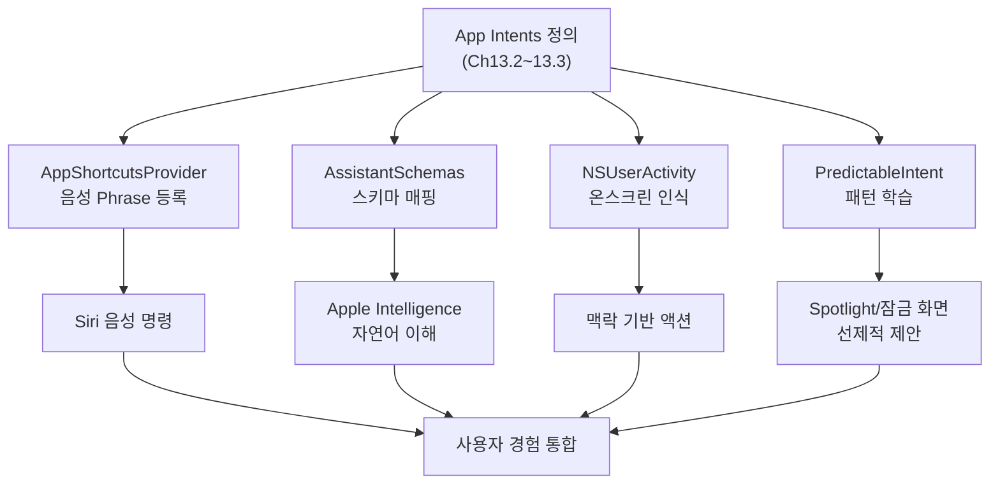
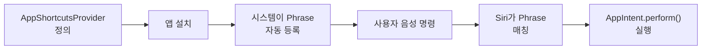
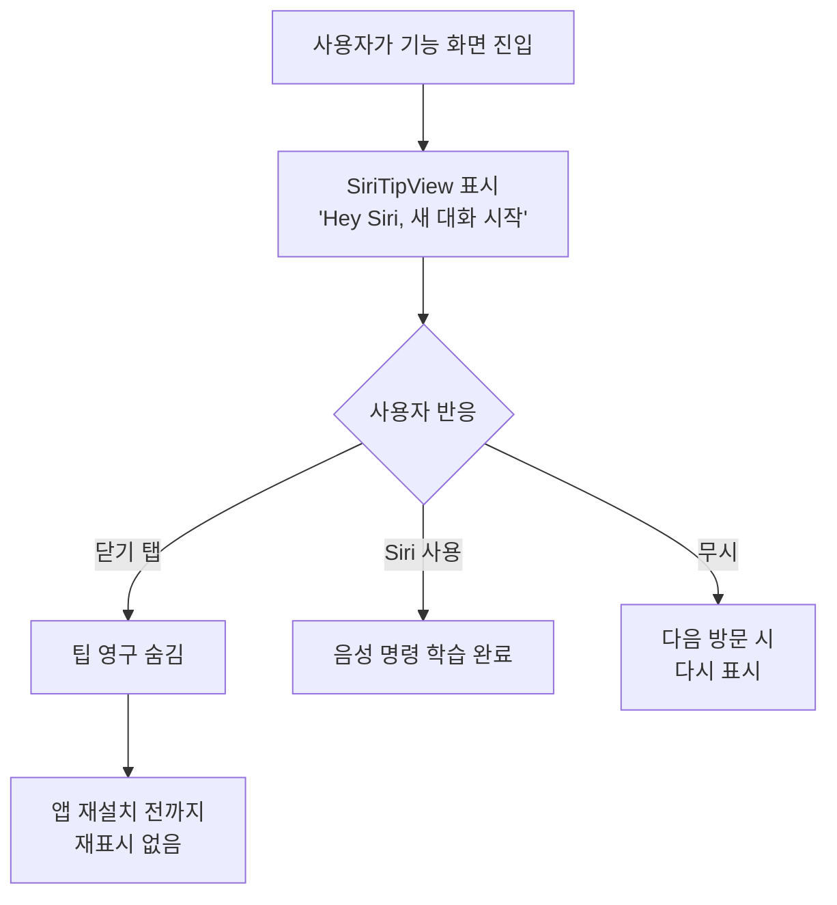
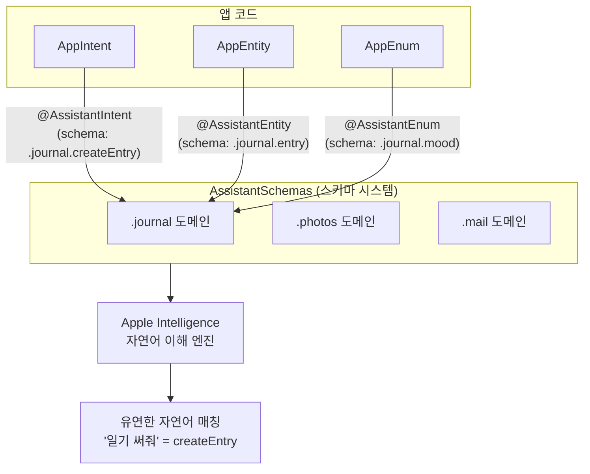
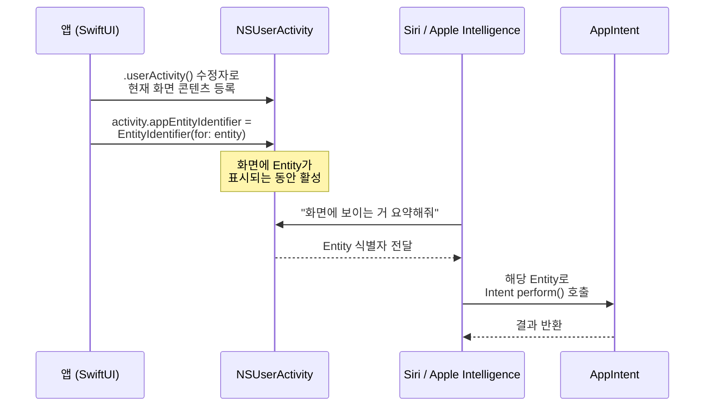
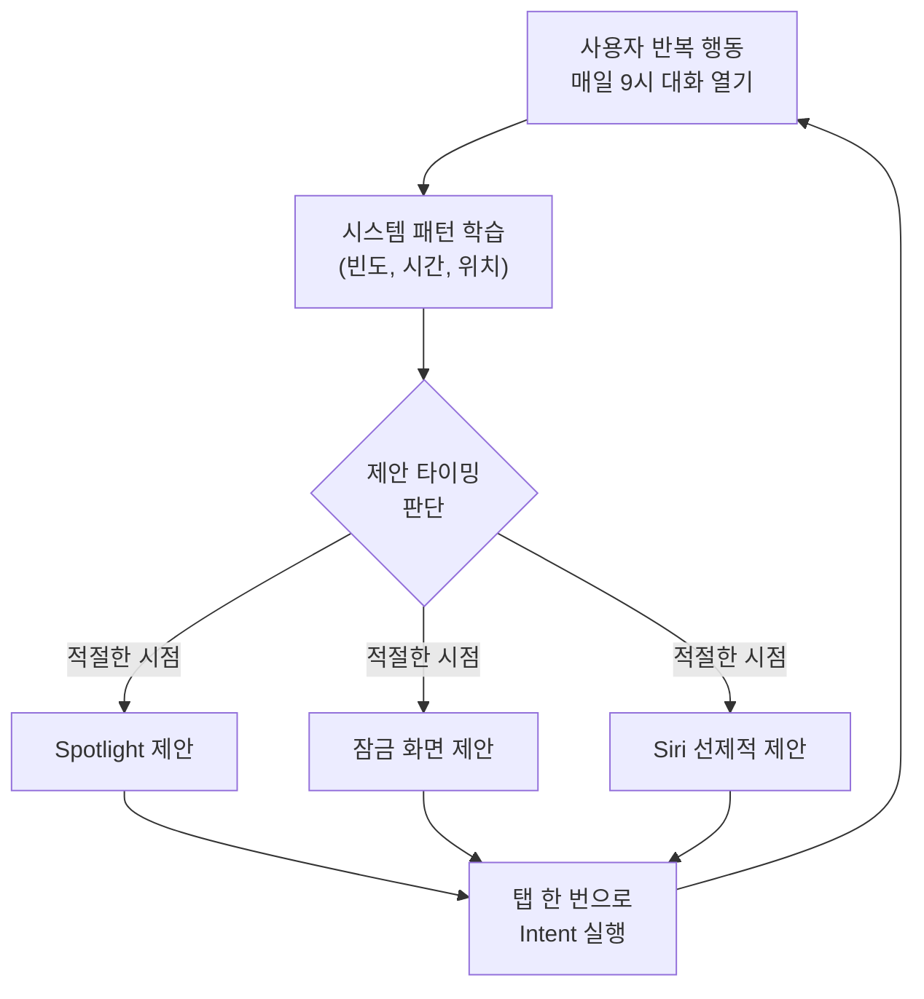

# 04. Siri + Apple Intelligence 통합

> AppShortcutsProvider와 AssistantSchemas로 앱의 AI 기능을 Siri에 노출하고, 온스크린 인식과 개인 컨텍스트로 자연어 앱 제어를 구현합니다.

## 개요

이 섹션에서는 앞서 정의한 AppIntent와 AppEntity를 **Siri와 Apple Intelligence에 연결하는 마지막 퍼즐 조각**을 다룹니다. AppShortcutsProvider로 음성 명령을 등록하고, AssistantSchemas로 Apple Intelligence의 자연어 이해 시스템에 앱 구조를 매핑하며, NSUserActivity를 통해 화면에 보이는 콘텐츠를 Siri가 인식하도록 만드는 과정을 학습합니다.

**선수 지식**: [AppIntent로 액션 정의하기](13-ch13-app-intents와-siri-연동/02-02-appintent로-액션-정의하기.md)에서 다룬 Intent 구현과 [AppEntity와 EntityQuery](13-ch13-app-intents와-siri-연동/03-03-appentity와-entityquery.md)에서 배운 Entity/Query 패턴

**학습 목표**:
- AppShortcutsProvider로 Siri 음성 명령을 등록하고 SiriTipView로 사용자를 안내한다
- AssistantSchemas 스키마 시스템과 세 가지 매크로(@AssistantIntent, @AssistantEntity, @AssistantEnum)의 관계를 이해한다
- NSUserActivity와 EntityIdentifier로 온스크린 콘텐츠를 Siri에 노출한다
- PredictableIntent와 IntentPredictionConfiguration으로 사용 패턴 학습 기반 제안을 활성화한다

## 왜 알아야 할까?

여러분이 멋진 AI 채팅봇 앱을 만들었다고 생각해 보세요. [Foundation Models 프레임워크](03-ch3-foundation-models-프레임워크-시작하기/01-01-systemlanguagemodel-이해하기.md)로 온디바이스 추론도 하고, [Tool Calling](07-ch7-tool-calling-기초/01-01-tool-calling-개념과-아키텍처.md)으로 외부 데이터도 가져오죠. 하지만 사용자가 이 기능을 쓰려면 **매번 앱을 열고, 화면을 탐색하고, 버튼을 눌러야** 합니다.

Siri + Apple Intelligence 통합은 이 장벽을 없애줍니다. "Siri야, 내 AI 채팅에서 오늘 할 일 정리해줘"라고 말하면 앱이 열리지 않아도 결과가 돌아옵니다. 화면에 보이는 콘텐츠를 Siri가 직접 이해하고, 사용자의 행동 패턴을 학습해서 **필요한 시점에 앱 기능을 먼저 제안**하기도 하죠.

App Intents를 정의하는 것은 식당의 메뉴판을 만든 것이고, 이번 섹션에서 배울 내용은 그 메뉴판을 **Siri라는 AI 웨이터에게 건네주는 과정**입니다. 웨이터가 메뉴를 이해해야 손님(사용자)의 자연어 주문을 정확한 요리(앱 기능)로 연결할 수 있으니까요.

> 📊 **그림 1**: Siri + Apple Intelligence 통합의 전체 구조



## 핵심 개념

### 개념 1: AppShortcutsProvider — Siri에 음성 명령 등록하기

> 💡 **비유**: AppShortcutsProvider는 레스토랑의 **추천 메뉴 보드**와 같습니다. 전체 메뉴(AppIntent)에서 가장 인기 있는 요리를 골라 입구에 크게 써놓으면, 손님이 메뉴판을 뒤적이지 않아도 바로 주문할 수 있죠. 마찬가지로 AppShortcutsProvider는 앱에서 가장 유용한 Intent를 골라 Siri가 **설치 즉시 인식**하도록 등록합니다.

AppShortcutsProvider는 앱이 설치되는 순간 자동으로 Siri에 음성 명령(Phrase)을 등록하는 프로토콜입니다. 사용자가 별도 설정을 하지 않아도, "Siri야, [앱 이름]에서 [동작]해줘"라고 말하면 바로 동작합니다.

> 📊 **그림 2**: AppShortcutsProvider 등록 흐름



AppShortcutsProvider를 구현하려면 네 가지 요소가 필요합니다:

```swift
import AppIntents

struct AIChatShortcutsProvider: AppShortcutsProvider {
    static var appShortcuts: [AppShortcut] {
        // 1. 새 대화 시작 단축어
        AppShortcut(
            intent: StartNewChatIntent(),
            phrases: [
                // 모든 phrase에 .applicationName 필수 포함
                "Start a new chat in \(.applicationName)",
                "\(.applicationName)에서 새 대화 시작",
                "\(.applicationName) 새 채팅"
            ],
            shortTitle: "새 대화",        // Spotlight/위젯에 표시
            systemImageName: "bubble.left.fill"  // SF Symbol
        )

        // 2. 특정 대화 열기 (Entity 파라미터 바인딩)
        AppShortcut(
            intent: OpenChatIntent(),
            phrases: [
                "Open \(\.$conversation) in \(.applicationName)",
                "\(.applicationName)에서 \(\.$conversation) 열기"
            ],
            shortTitle: "대화 열기",
            systemImageName: "bubble.left.and.bubble.right"
        )
    }
}
```

핵심 규칙이 몇 가지 있는데요:

- **모든 Phrase에 `\(.applicationName)`을 반드시 포함**해야 합니다 — Siri가 어떤 앱의 명령인지 식별하는 데 필수입니다
- **`\(\.$파라미터)`로 Entity를 바인딩**하면, 사용자가 "AI 채팅에서 **여행 계획** 열어줘"처럼 Entity 이름을 직접 말할 수 있습니다
- Phrase는 **짧고 기억하기 쉬운** 자연어로 작성합니다 — 사용자가 정확한 문구를 말해야 하니까요

앱 데이터가 변경되면(새 대화 생성, 삭제 등) 시스템에 알려야 합니다:

```swift
// Entity 변경 시 호출
func onConversationCreated() {
    AIChatShortcutsProvider.updateAppShortcutParameters()
}
```

### 개념 2: SiriTipView — 사용자에게 음성 명령 안내하기

> 💡 **비유**: 좋은 레스토랑에서 웨이터가 "오늘의 추천 메뉴는 파스타입니다"라고 한마디 해주면 주문이 쉬워지듯, SiriTipView는 사용자에게 **"이 기능을 Siri로도 쓸 수 있어요"**라고 살짝 알려주는 UI 컴포넌트입니다.

SiriTipView는 SwiftUI 뷰로, 사용자에게 특정 Siri 음성 명령을 안내하는 배너를 표시합니다. 사용자가 닫으면 다시 나타나지 않아, 학습 후에는 방해가 되지 않습니다.

> 📊 **그림 3**: SiriTipView의 사용자 여정



```swift
import AppIntents

struct ChatListView: View {
    @State private var isVisible = true

    var body: some View {
        NavigationStack {
            VStack {
                // Siri 팁 배너 — 네비게이션 바 아래에 배치
                SiriTipView(
                    intent: StartNewChatIntent(),
                    isVisible: $isVisible
                )

                // 대화 목록
                List(conversations) { conversation in
                    ChatRow(conversation: conversation)
                }
            }
            .navigationTitle("AI 채팅")
        }
    }
}
```

SiriTipView는 해당 Intent에 연결된 Phrase를 자동으로 표시하므로, 별도로 텍스트를 지정할 필요가 없습니다. `isVisible` 바인딩으로 프로그래밍 방식의 표시/숨김도 제어할 수 있죠.

### 개념 3: AssistantSchemas — Apple Intelligence에 앱 구조 매핑하기

> 💡 **비유**: 해외 레스토랑에 가면 현지 메뉴를 이해할 수 없어서 당황하죠. 이때 **국제 표준 메뉴 코드**가 있다면? "MC-001 = 파스타"처럼 어떤 나라의 웨이터든 같은 의미로 이해할 수 있을 겁니다. AssistantSchemas가 바로 이 표준 코드입니다 — 앱의 Intent와 Entity를 **Apple Intelligence가 이해하는 표준 틀**에 매핑합니다.

**AssistantSchemas**는 Apple이 미리 정의한 **도메인별 스키마 시스템(네임스페이스)**입니다. 일기(`.journal`), 사진(`.photos`), 메일(`.mail`) 등 다양한 도메인에 대해 표준 액션과 객체 타입을 정의하고 있죠. 여러분의 앱은 이 스키마 시스템에 매핑함으로써, Siri가 단순 Phrase 매칭이 아닌 **의미 기반 자연어 이해**로 사용자의 요청을 처리할 수 있게 됩니다.

이 스키마 시스템은 **세 가지 매크로(컴포넌트)**로 구성됩니다:

| 매크로 | 역할 | 매핑 대상 | 예시 |
|--------|------|-----------|------|
| `@AssistantIntent(schema:)` | 앱의 **액션**을 스키마 동작에 매핑 | AppIntent | `.journal.createEntry` |
| `@AssistantEntity(schema:)` | 앱의 **데이터 객체**를 스키마 엔티티에 매핑 | AppEntity | `.journal.entry` |
| `@AssistantEnum(schema:)` | 앱의 **열거형 값**을 스키마 열거형에 매핑 | AppEnum | `.photos.assetType` |

> 📊 **그림 4**: AssistantSchemas 스키마 시스템과 세 가지 매크로의 관계



즉, **AssistantSchemas는 스키마들을 모아둔 시스템/네임스페이스**이고, 세 가지 `@Assistant~` 매크로는 여러분의 코드를 그 시스템에 연결하는 **다리** 역할을 합니다. 이 구분을 명확히 이해하면 공식 문서를 읽을 때 혼란이 줄어듭니다.

```swift
import AppIntents

// Intent를 Assistant Schema에 매핑
@AssistantIntent(schema: .journal.createEntry)
struct CreateJournalEntryIntent: AppIntent {
    static let title: LocalizedStringResource = "일기 작성"

    // 스키마가 기대하는 파라미터와 매칭
    @Parameter(title: "내용")
    var content: String

    @Parameter(title: "기분")
    var mood: MoodEnum?

    func perform() async throws -> some IntentResult & ProvidesDialog {
        // 일기 저장 로직
        let entry = JournalManager.shared.create(
            content: content,
            mood: mood
        )
        return .result(dialog: "일기가 저장되었습니다.")
    }
}

// Enum을 Assistant Schema에 매핑
@AssistantEnum(schema: .journal.mood)
enum MoodEnum: String, AppEnum {
    case happy, sad, neutral, excited

    static var typeDisplayRepresentation: TypeDisplayRepresentation {
        "기분"
    }

    static var caseDisplayRepresentations: [MoodEnum: DisplayRepresentation] {
        [
            .happy: "행복",
            .sad: "슬픔",
            .neutral: "보통",
            .excited: "신남"
        ]
    }
}
```

AssistantSchemas를 적용하면 사용자가 **등록한 Phrase와 정확히 일치하지 않아도** Siri가 의도를 이해합니다. "일기 써줘", "오늘 있었던 일 기록", "journal 작성" 같은 다양한 표현이 모두 `createEntry`로 연결되는 거죠.

> ⚠️ **흔한 오해**: "AssistantSchemas만 쓰면 AppShortcutsProvider는 필요 없나요?" — 아닙니다! 두 가지는 **보완 관계**입니다. AppShortcutsProvider는 **설치 즉시 작동하는 정확한 Phrase**를 등록하고, AssistantSchemas의 매크로들은 **유연한 자연어 이해**를 가능하게 합니다. 둘 다 구현하는 것이 가장 좋은 사용자 경험을 제공합니다.

### 개념 4: 온스크린 인식 — NSUserActivity와 EntityIdentifier

> 💡 **비유**: 도서관에서 사서에게 "지금 읽고 있는 이 책 예약해줘"라고 말하면, 사서는 여러분이 **지금 손에 들고 있는 책**이 뭔지 볼 수 있어야 합니다. NSUserActivity는 앱이 Siri(사서)에게 "지금 사용자 화면에 이것이 보이고 있어요"라고 알려주는 메커니즘입니다.

온스크린 인식은 Siri가 현재 화면에 표시된 콘텐츠를 이해하고 그에 대해 액션을 취할 수 있게 하는 기능입니다. SwiftUI의 `.userActivity()` 수정자와 `EntityIdentifier`를 결합하여 구현합니다.

> 📊 **그림 5**: 온스크린 인식 데이터 흐름



```swift
import AppIntents

struct ConversationDetailView: View {
    let conversation: ConversationEntity

    var body: some View {
        ScrollView {
            // 대화 내용 표시
            ForEach(conversation.messages) { message in
                MessageBubble(message: message)
            }
        }
        // 이 화면이 보이는 동안 Siri에 콘텐츠 노출
        .userActivity(
            "com.myapp.viewingConversation"
        ) { activity in
            activity.title = "\(conversation.name) 대화 보는 중"
            // Entity와 UserActivity를 연결하는 핵심!
            activity.appEntityIdentifier = EntityIdentifier(
                for: conversation
            )
            activity.isEligibleForSearch = true   // Spotlight 검색 허용
            activity.isEligibleForPrediction = true // Siri 제안 허용
        }
    }
}
```

`EntityIdentifier`가 핵심 연결 고리입니다. 이것이 NSUserActivity와 AppEntity를 이어주면, Siri는 "화면에 보이는 대화를 요약해줘" 같은 맥락 기반 요청을 처리할 수 있게 됩니다.

### 개념 5: PredictableIntent — 사용 패턴 학습과 선제적 제안

> 💡 **비유**: 단골 카페에서 바리스타가 "오늘도 아메리카노 한 잔 하시겠어요?"라고 물어보는 것처럼, PredictableIntent를 채택하면 시스템이 사용자의 **행동 패턴을 학습**하여 적절한 시점에 앱 기능을 제안합니다.

PredictableIntent 프로토콜은 시스템에게 "이 Intent의 사용 패턴을 추적해도 됩니다"라고 선언하는 것입니다. 사용자가 매일 아침 특정 대화를 열면, 잠금 화면이나 Spotlight에 해당 Intent가 제안으로 나타납니다. 이 메커니즘의 핵심은 **IntentPredictionConfiguration**인데요, 이것이 시스템에게 "어떤 파라미터 조합으로, 어떤 문구를 제안하면 되는지"를 알려줍니다.

> 📊 **그림 6**: PredictableIntent 학습 및 제안 사이클



```swift
import AppIntents

// PredictableIntent 채택으로 시스템 학습 활성화
struct OpenChatIntent: AppIntent, PredictableIntent {
    static let title: LocalizedStringResource = "대화 열기"

    @Parameter(title: "대화")
    var conversation: ConversationEntity

    // IntentPredictionConfiguration: 제안 UI에 표시할 문구 정의
    static var predictionConfiguration: some IntentPredictionConfiguration {
        IntentPrediction(parameters: \.$conversation) { conversation in
            DisplayRepresentation(
                title: "\(conversation) 대화 열기",
                subtitle: "AI 채팅"
            )
        }
    }

    func perform() async throws -> some IntentResult {
        // 대화 화면으로 이동
        await NavigationManager.shared.navigate(to: conversation)
        return .result()
    }
}
```

`IntentPredictionConfiguration`은 각 파라미터 조합에 대해 사용자에게 보여줄 제안 문구를 정의합니다. "**여행 계획** 대화 열기", "**업무 요약** 대화 열기"처럼 구체적인 제안이 나타나므로, 탭 한 번으로 원하는 기능에 도달할 수 있습니다.

파라미터가 여러 개인 경우, 각각의 조합에 대해 별도의 `IntentPrediction`을 정의할 수도 있습니다:

```swift
struct SendMessageIntent: AppIntent, PredictableIntent {
    static let title: LocalizedStringResource = "메시지 보내기"

    @Parameter(title: "대화")
    var conversation: ConversationEntity

    @Parameter(title: "메시지")
    var message: String

    // 여러 파라미터 조합에 대한 예측 설정
    static var predictionConfiguration: some IntentPredictionConfiguration {
        // 대화만 지정된 경우의 제안
        IntentPrediction(parameters: \.$conversation) { conversation in
            DisplayRepresentation(
                title: "\(conversation)에 메시지 보내기",
                subtitle: "AI 채팅"
            )
        }

        // 파라미터 없이 Intent 자체를 제안
        IntentPrediction() {
            DisplayRepresentation(
                title: "AI 대화에 메시지 보내기",
                subtitle: "최근 대화"
            )
        }
    }

    func perform() async throws -> some IntentResult & ProvidesDialog {
        // 메시지 전송 로직
        await ChatStore.shared.send(message, to: conversation.id)
        return .result(dialog: "메시지를 보냈습니다.")
    }
}
```

> 💡 **알고 계셨나요?**: PredictableIntent의 제안은 **온디바이스에서 학습**됩니다. 사용자의 행동 패턴 데이터가 Apple 서버로 전송되지 않으며, 기기 내 ML 모델이 시간대, 위치, 빈도 등을 종합적으로 분석합니다. 이것이 Apple이 말하는 "프라이버시를 지키면서도 똑똑한 제안"의 실체입니다.

## 실습: 직접 해보기

AI 채팅 앱에 Siri 통합을 완전하게 구현해 보겠습니다. AppShortcutsProvider, AssistantSchemas, 온스크린 인식, PredictableIntent를 모두 결합합니다.

```swift
import SwiftUI
import AppIntents
import FoundationModels

// MARK: - 1. Entity 정의 (AssistantSchema 매핑)

@AssistantEntity(schema: .journal.entry)
struct ChatConversationEntity: AppEntity, IndexedEntity {
    static var typeDisplayRepresentation: TypeDisplayRepresentation {
        TypeDisplayRepresentation(
            name: "AI 대화",
            numericFormat: "\(placeholder: .int)개의 대화"
        )
    }

    var id: UUID
    var name: String
    var createdAt: Date

    var displayRepresentation: DisplayRepresentation {
        DisplayRepresentation(
            title: "\(name)",
            subtitle: "생성: \(createdAt.formatted(.dateTime.month().day()))"
        )
    }

    // 검색을 위한 인덱싱
    @Property(indexingKey: \.displayName)
    var displayName: String { name }

    static var defaultQuery = ChatConversationQuery()
}

// MARK: - 2. EntityQuery 구현

struct ChatConversationQuery: EntityStringQuery {
    @Dependency
    private var chatStore: ChatStore

    func entities(for identifiers: [UUID]) async throws -> [ChatConversationEntity] {
        // 식별자로 대화 조회
        await chatStore.conversations(for: identifiers)
    }

    func entities(matching string: String) async throws -> [ChatConversationEntity] {
        // 문자열 검색
        await chatStore.searchConversations(matching: string)
    }

    func suggestedEntities() async throws -> [ChatConversationEntity] {
        // 최근 대화 5개 제안
        await chatStore.recentConversations(limit: 5)
    }
}

// MARK: - 3. Intent 정의 (AssistantSchema + PredictableIntent)

@AssistantIntent(schema: .system.search)
struct SearchChatIntent: AppIntent, PredictableIntent {
    static let title: LocalizedStringResource = "AI 대화 검색"

    @Parameter(title: "검색어")
    var criteria: StringSearchCriteria

    @Dependency
    private var chatStore: ChatStore

    static var predictionConfiguration: some IntentPredictionConfiguration {
        IntentPrediction(parameters: \.$criteria) { criteria in
            DisplayRepresentation(
                title: "'\(criteria)' 대화 검색",
                subtitle: "AI 채팅"
            )
        }
    }

    func perform() async throws -> some IntentResult & ReturnsValue<[ChatConversationEntity]> {
        let results = await chatStore.searchConversations(
            matching: criteria.term
        )
        return .result(value: results)
    }
}

struct SummarizeChatIntent: AppIntent {
    static let title: LocalizedStringResource = "대화 요약"

    @Parameter(title: "대화")
    var conversation: ChatConversationEntity

    func perform() async throws -> some IntentResult & ProvidesDialog {
        // Foundation Models로 대화 요약 생성
        let session = LanguageModelSession()
        let messages = await ChatStore.shared.messages(for: conversation.id)
        let prompt = "다음 대화를 3줄로 요약해주세요:\n\(messages.map(\.text).joined(separator: "\n"))"

        let response = try await session.respond(to: prompt)
        return .result(dialog: "\(response.content)")
    }
}

// MARK: - 4. AppShortcutsProvider

struct AIChatShortcuts: AppShortcutsProvider {
    static var appShortcuts: [AppShortcut] {
        AppShortcut(
            intent: SummarizeChatIntent(),
            phrases: [
                "Summarize \(\.$conversation) in \(.applicationName)",
                "\(.applicationName)에서 \(\.$conversation) 요약",
                "\(.applicationName) 대화 요약"
            ],
            shortTitle: "대화 요약",
            systemImageName: "text.quote"
        )

        AppShortcut(
            intent: SearchChatIntent(),
            phrases: [
                "Search in \(.applicationName)",
                "\(.applicationName)에서 검색"
            ],
            shortTitle: "대화 검색",
            systemImageName: "magnifyingglass"
        )
    }
}

// MARK: - 5. 온스크린 인식 통합 뷰

struct ChatDetailView: View {
    let conversation: ChatConversationEntity
    @State private var showSiriTip = true
    @State private var messages: [ChatMessage] = []

    var body: some View {
        VStack(spacing: 0) {
            // Siri 팁 표시 — 사용자에게 음성 명령 안내
            SiriTipView(
                intent: SummarizeChatIntent(),
                isVisible: $showSiriTip
            )

            // 대화 메시지 목록
            ScrollView {
                LazyVStack(spacing: 12) {
                    ForEach(messages) { message in
                        MessageBubble(message: message)
                    }
                }
                .padding()
            }
        }
        .navigationTitle(conversation.name)
        // 온스크린 인식 — 이 화면이 보일 때 Siri에 노출
        .userActivity("com.aichat.viewing") { activity in
            activity.title = "\(conversation.name) 대화"
            activity.appEntityIdentifier = EntityIdentifier(
                for: conversation
            )
            activity.isEligibleForSearch = true
            activity.isEligibleForPrediction = true
        }
        .task {
            messages = await ChatStore.shared.messages(
                for: conversation.id
            )
        }
    }
}
```

```run:swift
// 실행 예시: AppShortcuts 등록 검증
let shortcuts = AIChatShortcuts.appShortcuts
print("등록된 단축어 수: \(shortcuts.count)")
for shortcut in shortcuts {
    print("- \(shortcut.shortTitle)")
}
```

```output
등록된 단축어 수: 2
- 대화 요약
- 대화 검색
```

## 더 깊이 알아보기

### SiriKit에서 App Intents까지 — 음성 비서 API의 진화

Apple의 음성 비서 통합 API는 흥미로운 진화를 거쳤습니다. 2016년 iOS 10에서 처음 등장한 **SiriKit**은 메시징, 결제 등 **Apple이 미리 정의한 10여 개 도메인**에서만 작동했습니다. 여러분의 앱이 "메시지 보내기" 카테고리에 해당하지 않으면 Siri와 통합할 방법이 없었죠.

2018년 iOS 12에서 **Siri Shortcuts**가 등장하며 이 제한이 느슨해졌습니다. `INIntent`와 `NSUserActivity` 기반으로 사용자가 직접 단축어를 만들 수 있었지만, Objective-C 기반의 복잡한 설정(Intent Definition File, IntentHandler Extension 등)이 필요했습니다.

2022년 WWDC22에서 대전환이 일어납니다. **App Intents 프레임워크**가 발표되며, Swift 네이티브 코드만으로 — 별도의 설정 파일이나 Extension 없이 — Siri 통합이 가능해졌습니다. 그리고 2024년 WWDC24에서 **AssistantSchemas**가 추가되며, Apple Intelligence의 자연어 이해와 앱이 직접 연결되는 현재의 구조가 완성되었습니다.

재미있는 점은, SiriKit 시절 Apple이 엄격하게 도메인을 제한했던 이유입니다. 당시 Siri의 자연어 이해 능력이 제한적이라 **정해진 틀 안에서만** 정확한 매칭이 가능했거든요. 하지만 Apple Intelligence의 대규모 언어 모델이 탑재되면서, 이제 Siri는 스키마(도메인)를 참고하되 **유연한 의미 해석**이 가능해졌습니다. 기술의 발전이 API 설계 철학 자체를 바꾼 좋은 사례입니다.

### 온스크린 인식의 프라이버시 설계

Apple이 온스크린 인식을 구현하면서 가장 중점을 둔 것은 프라이버시입니다. 화면 캡처를 서버로 보내는 방식이 아니라, **앱이 명시적으로 `NSUserActivity`에 등록한 Entity만** Siri가 인식합니다. 즉, 개발자가 노출하겠다고 선언한 정보만 접근 가능하고, 사용자의 화면 내용이 무분별하게 수집되지 않죠. 이는 [Private Cloud Compute](01-ch1-apple-intelligence와-온디바이스-ai/04-04-private-cloud-compute-아키텍처.md)와 함께 Apple Intelligence의 프라이버시 중심 설계를 구성합니다.

## 흔한 오해와 팁

> ⚠️ **흔한 오해**: "AssistantSchemas에 내 앱 도메인이 없으면 Apple Intelligence와 통합할 수 없다" — 그렇지 않습니다. AssistantSchemas는 Siri의 **자연어 이해를 강화**하는 추가 레이어입니다. AppShortcutsProvider만으로도 Siri 통합은 완전히 동작합니다. 스키마는 "더 똑똑한 매칭"을 원할 때 적용하세요.

> ⚠️ **흔한 오해**: "PredictableIntent를 채택하면 모든 Intent 실행이 자동으로 제안된다" — 아닙니다. `IntentPredictionConfiguration`을 반드시 구현해야 합니다. 이 설정이 없으면 시스템은 어떤 파라미터 조합을 어떤 문구로 제안할지 알 수 없어서, 학습 데이터가 쌓여도 제안이 나타나지 않습니다.

> 💡 **알고 계셨나요?**: AppShortcutsProvider의 Phrase에 대한 대안 앱 이름을 등록할 수 있습니다. Info.plist에 `INAlternativeAppNames`를 설정하면, 긴 앱 이름 대신 짧은 별칭으로 Siri를 호출할 수 있습니다. 예를 들어 "MyAmazingAIChatBot" 대신 "AI챗"으로 호출 가능하죠.

> 🔥 **실무 팁**: Siri 통합을 디버깅할 때는 **Shortcuts 앱**이 최고의 도구입니다. Shortcuts에서 여러분의 AppShortcut이 올바르게 나타나는지, 파라미터가 제대로 바인딩되는지 확인할 수 있습니다. 또한 `updateAppShortcutParameters()`를 호출한 후 Entity 목록이 갱신되는지 반드시 테스트하세요. 이 호출을 빠뜨리면 사용자가 새로 만든 데이터를 Siri로 접근할 수 없습니다.

> 🔥 **실무 팁**: `supportedModes`를 활용하면 Intent가 **백그라운드에서만** 실행되도록 제한할 수 있습니다. 대화 요약처럼 앱 UI가 필요 없는 작업은 `.background`로 설정하면, Siri가 앱을 열지 않고 결과를 바로 보여줘서 사용자 경험이 훨씬 매끄럽습니다.

## 핵심 정리

| 개념 | 설명 |
|------|------|
| **AppShortcutsProvider** | 앱 설치 즉시 Siri에 음성 Phrase를 등록하는 프로토콜. 모든 Phrase에 `.applicationName` 필수 |
| **SiriTipView** | 사용자에게 Siri 음성 명령을 안내하는 SwiftUI 배너. 닫으면 재표시 안 됨 |
| **AssistantSchemas** | Apple이 정의한 도메인별 스키마 시스템(네임스페이스). 세 가지 매크로로 앱 코드를 매핑 |
| **@AssistantIntent / Entity / Enum** | AssistantSchemas의 구성 매크로. 각각 액션, 데이터 객체, 열거형을 스키마에 연결 |
| **NSUserActivity + EntityIdentifier** | `.userActivity()` 수정자로 현재 화면의 Entity를 Siri에 노출. 온스크린 인식의 핵심 |
| **PredictableIntent** | 사용 패턴을 시스템이 학습하여 Spotlight/잠금 화면에 자동 제안. `IntentPredictionConfiguration` 필수 |
| **IntentPredictionConfiguration** | 파라미터 조합별 제안 문구를 정의. PredictableIntent가 실제 제안으로 나타나기 위한 필수 설정 |
| **updateAppShortcutParameters()** | Entity 데이터 변경 시 시스템에 알려 Phrase 바인딩 갱신 |
| **INAlternativeAppNames** | Info.plist에서 앱의 짧은 별칭을 등록, 음성 호출 편의성 향상 |

## 다음 섹션 미리보기

지금까지 App Intents의 구조(13.1), Intent 정의(13.2), Entity와 Query(13.3), 그리고 이번 섹션에서 Siri + Apple Intelligence 통합까지 완성했습니다. 다음 섹션 [실습: AI 채팅봇의 Siri 통합](13-ch13-app-intents와-siri-연동/05-05-실습-ai-채팅봇의-siri-통합.md)에서는 이 모든 개념을 **하나의 완전한 프로젝트**로 결합합니다. [Ch10에서 만든 AI 채팅봇 앱](10-ch10-실전-프로젝트-ai-채팅봇-앱/01-01-채팅봇-앱-아키텍처-설계.md)에 Siri 통합을 적용하여, "대화 시작", "요약", "검색" 등의 기능을 음성으로 제어하는 완전한 경험을 구현해 봅니다.

## 참고 자료

- [Integrating actions with Siri and Apple Intelligence — Apple Developer Documentation](https://developer.apple.com/documentation/appintents/integrating-actions-with-siri-and-apple-intelligence) - Siri + Apple Intelligence 통합의 공식 가이드. AssistantSchemas 매핑과 온스크린 인식 구현 방법을 다룹니다
- [Explore new advances in App Intents — WWDC25](https://developer.apple.com/videos/play/wwdc2025/275/) - WWDC25에서 발표된 App Intents 최신 기능. SnippetIntent, PredictableIntent, Visual Intelligence 통합 등을 설명합니다
- [Creating App Intents using Assistant Schemas — Create with Swift](https://www.createwithswift.com/creating-app-intents-using-assistant-schemas/) - AssistantSchemas의 세 가지 매크로 활용법을 실습 중심으로 설명하는 튜토리얼
- [Performing your app actions with Siri through App Shortcuts Provider — Create with Swift](https://www.createwithswift.com/performing-your-app-actions-with-siri-through-app-shortcuts-provider/) - AppShortcutsProvider와 SiriTipView의 완전한 구현 가이드
- [Making onscreen content available to Siri and Apple Intelligence — Apple Developer](https://developer.apple.com/documentation/appintents/making-onscreen-content-available-to-siri-and-apple-intelligence) - NSUserActivity와 EntityIdentifier를 활용한 온스크린 인식 구현 공식 문서

---
### 🔗 Related Sessions
- [appentity](13-ch13-app-intents와-siri-연동/01-01-app-intents-프레임워크-개요.md) (prerequisite)
- [intentresult](13-ch13-app-intents와-siri-연동/01-01-app-intents-프레임워크-개요.md) (prerequisite)
- [@parameter](13-ch13-app-intents와-siri-연동/01-01-app-intents-프레임워크-개요.md) (prerequisite)
- [displayrepresentation](13-ch13-app-intents와-siri-연동/01-01-app-intents-프레임워크-개요.md) (prerequisite)
- [entityquery](13-ch13-app-intents와-siri-연동/01-01-app-intents-프레임워크-개요.md) (prerequisite)
- [entitystringquery](13-ch13-app-intents와-siri-연동/03-03-appentity와-entityquery.md) (prerequisite)
