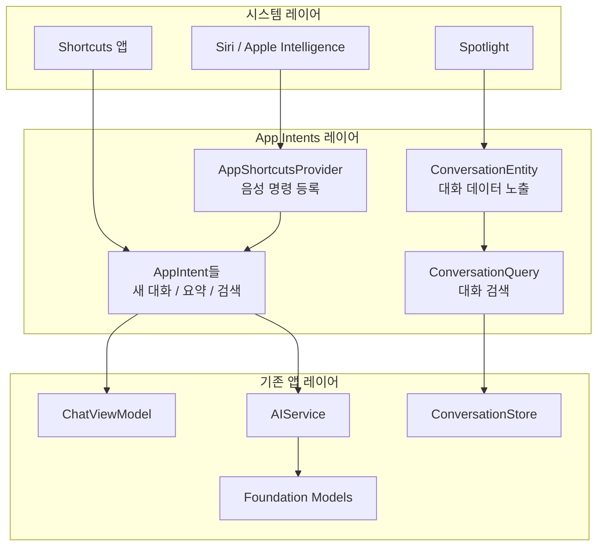
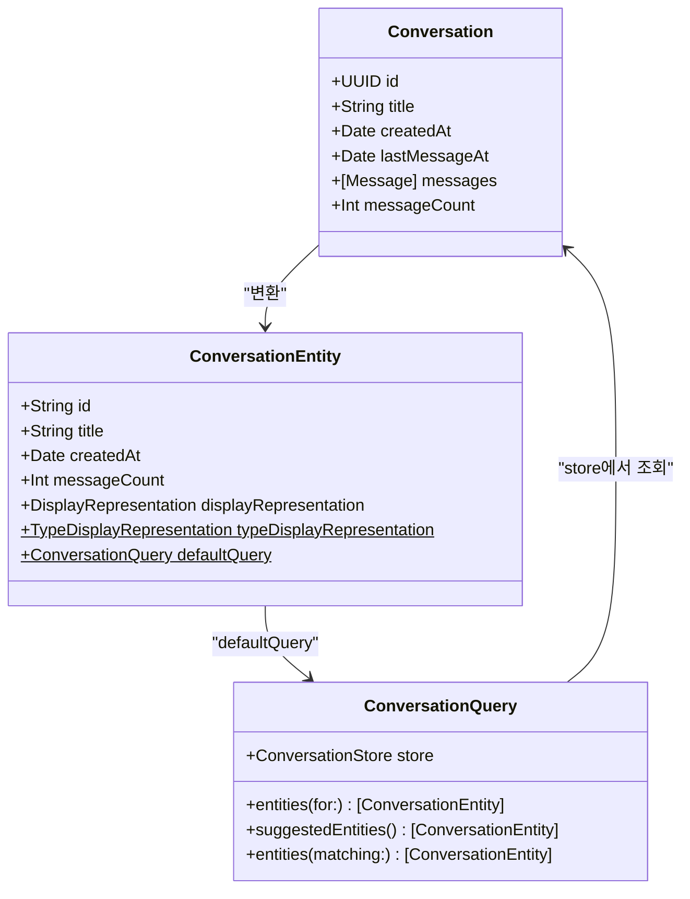
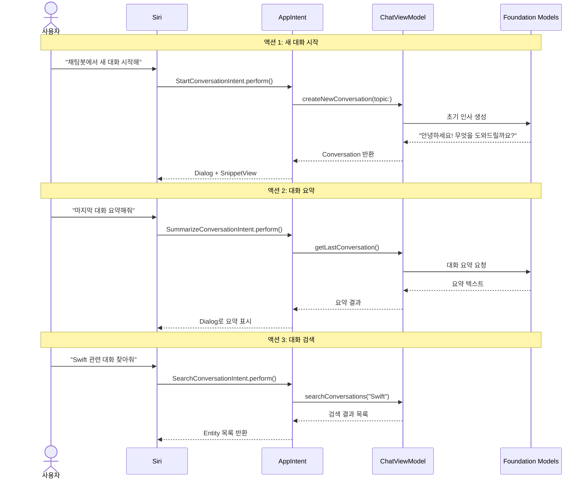
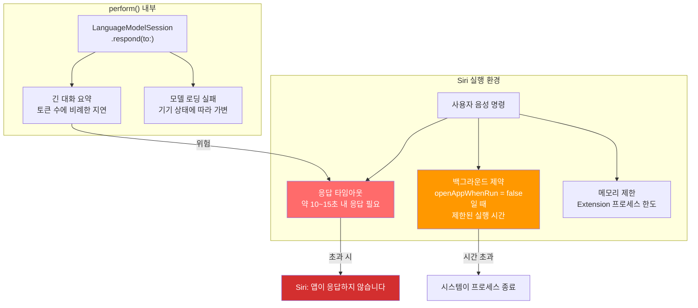
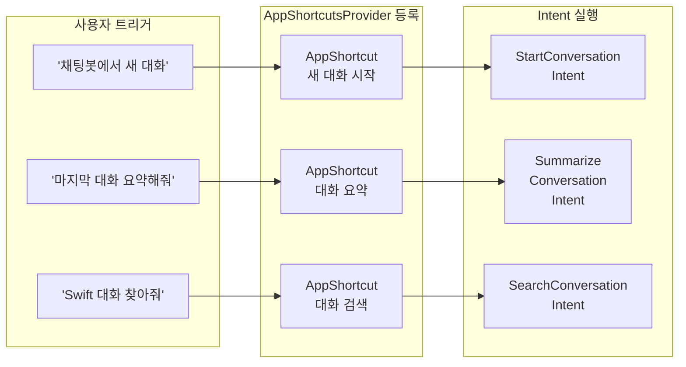
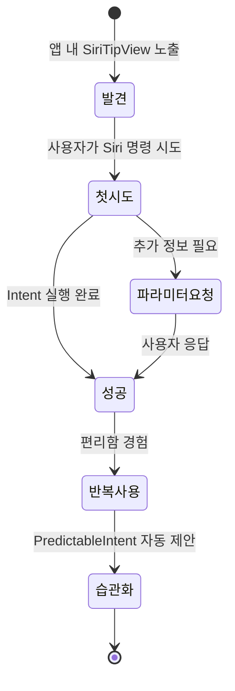

# 05. 실습: AI 채팅봇의 Siri 통합

> Ch10에서 만든 AI 채팅봇 앱에 App Intents를 추가하여, Siri 음성 명령으로 대화를 시작하고, 요약하고, 검색하는 완전한 통합 프로젝트를 구현합니다.

## 개요

이번 세션에서는 Ch13에서 배운 모든 개념을 하나의 프로젝트에 통합합니다. [Ch10 AI 채팅봇 앱](10-ch10-실전-프로젝트-ai-채팅봇-앱/01-01-채팅봇-앱-아키텍처-설계.md)의 핵심 기능인 대화 생성, 요약, 검색을 Siri와 Apple Intelligence를 통해 앱 밖에서도 실행할 수 있게 만들겠습니다.

**선수 지식**:
- [AppIntent로 액션 정의하기](13-ch13-app-intents와-siri-연동/02-02-appintent로-액션-정의하기.md)에서 배운 Intent 정의 패턴
- [AppEntity와 EntityQuery](13-ch13-app-intents와-siri-연동/03-03-appentity와-entityquery.md)에서 배운 Entity 노출 방법
- [Siri + Apple Intelligence 통합](13-ch13-app-intents와-siri-연동/04-04-siri-apple-intelligence-통합.md)에서 배운 AppShortcutsProvider와 AssistantSchemas

**학습 목표**:
- 채팅봇 앱의 대화 데이터를 AppEntity로 시스템에 노출한다
- "새 대화 시작", "마지막 대화 요약" 등 핵심 Siri 액션을 구현한다
- AppShortcutsProvider로 설치 즉시 음성 명령을 등록한다
- AssistantSchemas로 Apple Intelligence의 자연어 이해와 연동한다
- **Intent 내부에서 Foundation Models를 호출할 때의 실전 제약 사항을 이해한다**

## 왜 알아야 할까?

여러분이 매일 사용하는 메신저를 떠올려보세요. 화면을 켜고, 앱을 찾고, 탭하고, 대화방을 선택하고... 이 모든 단계를 거쳐야 메시지를 보낼 수 있죠. 그런데 "Siri야, OO에게 메시지 보내줘"라고 말하면? 한 마디로 끝납니다.

AI 채팅봇 앱도 마찬가지입니다. 아무리 훌륭한 AI 기능을 구현했더라도, 사용자가 앱을 열고 UI를 탐색해야만 접근할 수 있다면 활용도가 제한됩니다. Siri 통합은 앱의 AI 기능을 **시스템 전체로 확장**하는 것입니다. 운전 중에 "새 대화 시작해줘", 요리하면서 "마지막 대화 요약해줘"라고 말하는 것 — 이것이 진정한 AI 앱 경험이죠.

단, 여기에는 중요한 제약이 있습니다. Siri가 Intent를 실행하는 환경은 앱 내부와 다릅니다. 백그라운드 실행 시간 제한, Siri 응답 타임아웃, 메모리 제약 등 **Intent 특유의 실행 환경**을 이해하지 못하면 "가끔 작동하고 가끔 실패하는" 불안정한 경험이 됩니다.

Apple은 WWDC25에서 App Intents를 **Apple Intelligence의 게이트웨이**라고 표현했습니다. 여러분의 앱이 이 게이트웨이를 열면, Siri뿐 아니라 Spotlight, Shortcuts, Action Button, 심지어 Apple Intelligence의 자연어 이해까지 모두 연결됩니다.

## 핵심 개념

### 개념 1: 채팅봇 Siri 통합 아키텍처

> 💡 **비유**: 레스토랑에 비유해볼게요. 지금까지 우리 채팅봇은 "매장 식사"만 가능한 레스토랑이었습니다. 손님(사용자)이 직접 찾아와야만 서비스를 받을 수 있었죠. 이제 배달 플랫폼(Siri)과 계약하려 합니다. 배달 플랫폼에는 메뉴판(AppEntity)을 등록하고, 주문 처리 방법(AppIntent)을 알려주고, 인기 메뉴(AppShortcut)를 전면에 노출해야 합니다.

채팅봇 앱의 Siri 통합은 네 개의 레이어로 구성됩니다. 기존 앱의 AI 서비스 레이어 위에 App Intents 레이어를 얹는 구조입니다.

> 📊 **그림 1**: 채팅봇 Siri 통합 아키텍처



핵심은 **기존 코드를 수정하지 않는 것**입니다. App Intents 레이어는 기존 ViewModel과 Service를 재사용할 뿐, 새로운 진입점을 추가하는 역할만 합니다. Ch10에서 정의한 `Conversation`, `Message` 모델과 `ConversationStore`, `ChatViewModel`을 그대로 사용하면서, 그 위에 Intent 레이어만 추가하는 구조죠.

### 개념 2: ConversationEntity — 대화를 시스템에 노출하기

> 💡 **비유**: 도서관의 카탈로그 카드를 떠올려보세요. 책 자체는 서가에 있지만, 카탈로그 카드에는 제목, 저자, 위치 정보가 적혀 있어서 검색이 가능하죠. AppEntity는 앱 데이터의 카탈로그 카드입니다. 대화 데이터 자체는 앱 안에 있지만, Entity를 통해 시스템이 "어떤 대화가 있는지" 알 수 있게 됩니다.

[AppEntity와 EntityQuery](13-ch13-app-intents와-siri-연동/03-03-appentity와-entityquery.md)에서 배운 패턴을 채팅봇의 대화 데이터에 적용합니다. Ch10에서 만든 `Conversation` 모델을 시스템에 노출하는 `ConversationEntity`를 정의하겠습니다.

> 📊 **그림 2**: Conversation 모델과 ConversationEntity 매핑



`ConversationEntity`의 프로퍼티들은 Ch10에서 정의한 `Conversation` 모델의 필드를 그대로 반영합니다. `id`는 `Conversation.id.uuidString`, `title`은 `Conversation.title`, `createdAt`은 `Conversation.createdAt`, `messageCount`는 `Conversation.messages.count`에 대응합니다. 만약 Ch10에서 프로퍼티 이름을 다르게 정의했다면(예: `name` 대신 `title`), `toEntity()` 변환 메서드에서 매핑을 조정하면 됩니다.

```swift
import AppIntents
import Foundation

// MARK: - 대화 Entity 정의
// Ch10의 Conversation 모델을 시스템에 노출하는 래퍼입니다.
// 프로퍼티 이름은 Ch10의 Conversation 모델과 일치시킵니다.
struct ConversationEntity: AppEntity {
    // 고유 식별자 — Conversation.id.uuidString과 동일
    var id: String
    
    // Siri가 대화를 언급할 때 사용하는 제목
    // Ch10의 Conversation.title에 대응
    var title: String
    
    // 최근 활동 시간 (정렬/필터에 활용)
    // Ch10의 Conversation.createdAt에 대응
    var createdAt: Date
    
    // 메시지 수 (대화 규모 파악)
    // Ch10의 Conversation.messages.count에 대응
    var messageCount: Int
    
    // 시스템 UI에 표시할 타입 이름
    static let typeDisplayRepresentation = TypeDisplayRepresentation(
        name: "대화",
        numericFormat: "\(placeholder: .int)개의 대화"
    )
    
    // 개별 대화의 표시 형태
    var displayRepresentation: DisplayRepresentation {
        DisplayRepresentation(
            title: "\(title)",
            subtitle: "메시지 \(messageCount)개",
            image: .init(systemName: "bubble.left.and.bubble.right")
        )
    }
    
    // 기본 쿼리 지정
    static let defaultQuery = ConversationQuery()
}
```

Entity를 정의했으니, 시스템이 대화를 찾을 수 있도록 `EntityStringQuery`를 구현합니다.

```swift
// MARK: - 대화 검색 쿼리
struct ConversationQuery: EntityStringQuery {
    // 의존성 주입 — 앱의 기존 저장소 재사용
    @Dependency
    var store: ConversationStore
    
    // ID 기반 조회 — 시스템이 특정 대화를 찾을 때
    func entities(for identifiers: [String]) async throws -> [ConversationEntity] {
        let conversations = try await store.conversations(for: identifiers)
        return conversations.map { $0.toEntity() }
    }
    
    // 문자열 검색 — Siri가 "AI 관련 대화 찾아줘"라고 할 때
    func entities(matching query: String) async throws -> [ConversationEntity] {
        let conversations = try await store.searchConversations(query: query)
        return conversations.map { $0.toEntity() }
    }
    
    // 추천 목록 — Siri가 "어떤 대화?"라고 물을 때 보여줄 후보
    func suggestedEntities() async throws -> [ConversationEntity] {
        let recent = try await store.recentConversations(limit: 5)
        return recent.map { $0.toEntity() }
    }
}

// MARK: - Conversation → Entity 변환 헬퍼
// Ch10의 Conversation 모델에 extension으로 추가합니다.
// 프로퍼티 이름이 Ch10 구현과 다를 경우 이 매핑을 조정하세요.
extension Conversation {
    func toEntity() -> ConversationEntity {
        ConversationEntity(
            id: id.uuidString,        // Conversation.id: UUID
            title: title,              // Conversation.title: String
            createdAt: createdAt,      // Conversation.createdAt: Date
            messageCount: messages.count // Conversation.messages: [Message]
        )
    }
}
```

### 개념 3: 핵심 Siri 액션 구현하기

> 💡 **비유**: TV 리모컨의 바로가기 버튼을 생각해보세요. 전원, 볼륨, 채널은 항상 리모컨에 있지만, Netflix나 YouTube 같은 앱 바로가기 버튼도 있죠. 우리가 만드는 AppIntent는 이 바로가기 버튼입니다 — 앱의 핵심 기능을 한 번에 실행할 수 있는 단축키를 시스템에 등록하는 거예요.

채팅봇 앱의 세 가지 핵심 액션을 Intent로 구현합니다. [AppIntent로 액션 정의하기](13-ch13-app-intents와-siri-연동/02-02-appintent로-액션-정의하기.md)에서 배운 패턴을 실전에 적용하는 거죠.

> 📊 **그림 3**: 세 가지 핵심 Siri 액션의 실행 흐름



#### Intent에서 Foundation Models 호출 시 주의사항

본격적인 구현에 앞서, `perform()` 내부에서 `LanguageModelSession`을 호출할 때 반드시 알아야 할 실전 제약이 있습니다. 앱 안에서 Foundation Models를 호출하는 것과 Siri Intent에서 호출하는 것은 **실행 환경이 근본적으로 다르기 때문**이에요.

> 📊 **그림 3-1**: Intent 실행 환경의 제약 요소



**핵심 제약 사항:**

| 제약 | 설명 | 대응 전략 |
|------|------|-----------|
| **Siri 응답 타임아웃** | Siri는 사용자에게 약 10~15초 내에 응답을 보여줘야 합니다. `perform()`이 이 시간을 초과하면 "앱이 응답하지 않습니다" 에러가 표시됩니다. | 프롬프트를 짧게 유지하고, 대화 요약 시 전체 내용 대신 최근 N개 메시지만 전달 |
| **백그라운드 실행 시간** | `openAppWhenRun = false`인 Intent는 백그라운드 Extension으로 실행되며, 시스템이 부여하는 실행 시간이 제한적입니다. 기기 상태(배터리, 열, 다른 작업)에 따라 더 짧아질 수 있습니다. | 무거운 작업은 `openAppWhenRun = true`로 전환하거나, 빠른 응답 후 앱 내에서 후속 처리 |
| **모델 가용성** | Foundation Models는 기기 상태에 따라 즉시 사용 불가능할 수 있습니다. 모델 로딩에 수초가 걸릴 수 있고, 저전력 모드에서는 거부될 수도 있습니다. | `LanguageModelSession.Availability`를 사전 확인하고, 불가 시 graceful fallback |
| **입력 크기** | 긴 대화 내용을 통째로 프롬프트에 넣으면 추론 시간이 급격히 늘어납니다. | 요약 대상을 최근 20~30개 메시지로 제한하고, 초과분은 앱에서 확인하도록 안내 |

이 제약들을 코드에 반영하면 다음과 같은 방어 패턴이 됩니다:

```swift
// MARK: - Intent에서 Foundation Models 안전하게 호출하는 패턴
import FoundationModels

enum IntentAIHelper {
    /// Siri 타임아웃 내에서 안전하게 Foundation Models를 호출합니다.
    /// - maxMessages: 요약 시 포함할 최대 메시지 수 (토큰 절약)
    /// - fallbackMessage: 모델 사용 불가 시 반환할 메시지
    static func safeRespond(
        prompt: String,
        fallbackMessage: String = "현재 AI 응답을 생성할 수 없습니다. 앱에서 다시 시도해주세요."
    ) async -> String {
        // 1. 모델 가용성 사전 확인
        let availability = LanguageModelSession.Availability.current
        guard availability == .available else {
            return fallbackMessage
        }
        
        // 2. 세션 생성 및 응답 요청
        do {
            let session = LanguageModelSession()
            let response = try await session.respond(to: prompt)
            return response.content
        } catch {
            // 타임아웃, 메모리 부족 등 런타임 에러 대비
            return fallbackMessage
        }
    }
    
    /// 대화 내용을 Siri 안전 길이로 잘라 요약 프롬프트를 생성합니다.
    static func buildSummaryPrompt(
        messages: [Message],
        maxMessages: Int = 20
    ) -> String {
        // 최근 N개만 사용 — 긴 대화의 전체 내용을 넣으면 타임아웃 위험
        let recentMessages = messages.suffix(maxMessages)
        let transcript = recentMessages
            .map { "\($0.role == .user ? "사용자" : "AI"): \($0.content)" }
            .joined(separator: "\n")
        
        return """
        다음 대화를 3줄 이내로 간결하게 요약해주세요:
        
        \(transcript)
        """
    }
}
```

이제 이 패턴을 적용한 실제 Intent 구현을 살펴보겠습니다.

**액션 1: 새 대화 시작 (StartConversationIntent)**

[13.2에서 배운 `ShowsSnippetView`](13-ch13-app-intents와-siri-연동/02-02-appintent로-액션-정의하기.md) 프로토콜을 실제 SwiftUI 뷰로 구현합니다. `perform()`이 반환하는 `ShowsSnippetView`는 Siri 응답에 앱의 커스텀 UI를 함께 표시하는 기능이었죠. 여기서는 `ConversationSnippetView`라는 SwiftUI 뷰를 만들어 새로 생성된 대화 정보를 Siri 결과 화면에 보여줍니다.

```swift
import AppIntents
import SwiftUI

struct StartConversationIntent: AppIntent {
    static let title: LocalizedStringResource = "새 대화 시작"
    static let description: IntentDescription = "AI 채팅봇에서 새로운 대화를 시작합니다."
    
    // 선택적 주제 파라미터 — "Swift에 대해 대화 시작해줘"
    @Parameter(title: "주제", requestValueDialog: "어떤 주제로 대화할까요?")
    var topic: String?
    
    // 포그라운드 실행 — Foundation Models 호출이 포함되므로
    // 백그라운드 시간 제한 걱정 없이 안정적으로 동작
    static let openAppWhenRun = true
    
    @Dependency
    var chatViewModel: ChatViewModel
    
    @MainActor
    func perform() async throws -> some ProvidesDialog & ShowsSnippetView {
        // 기존 ViewModel의 메서드를 그대로 활용
        let conversation = try await chatViewModel.createNewConversation(
            topic: topic
        )
        
        let greeting = topic != nil
            ? "\(topic!)에 대한 새 대화를 시작했어요."
            : "새 대화를 시작했어요."
        
        // ShowsSnippetView — 13.2에서 배운 프로토콜의 실전 적용
        // ConversationSnippetView가 Siri 결과 카드에 표시됩니다
        return .result(
            dialog: "\(greeting) 채팅봇으로 이동합니다.",
            view: ConversationSnippetView(conversation: conversation)
        )
    }
}

// MARK: - Siri 결과에 표시할 미니 뷰 (ShowsSnippetView 구현)
// 13.2에서 배운 ShowsSnippetView를 실제 SwiftUI 뷰로 구현합니다.
// Siri가 Intent 결과를 보여줄 때 이 뷰가 결과 카드 안에 렌더링됩니다.
struct ConversationSnippetView: View {
    let conversation: Conversation
    
    var body: some View {
        VStack(alignment: .leading, spacing: 8) {
            Label(conversation.title, systemImage: "bubble.left.and.bubble.right")
                .font(.headline)
            
            Text("방금 생성됨")
                .font(.caption)
                .foregroundStyle(.secondary)
        }
        .padding()
    }
}
```

**액션 2: 마지막 대화 요약 (SummarizeConversationIntent)**

요약 Intent는 `openAppWhenRun = false`로 백그라운드 실행이 가능하지만, Foundation Models 호출이 포함되므로 타임아웃 방어가 특히 중요합니다.

```swift
struct SummarizeConversationIntent: AppIntent {
    static let title: LocalizedStringResource = "대화 요약"
    static let description: IntentDescription = "선택한 대화의 내용을 AI가 요약합니다."
    
    // 대화 Entity를 파라미터로 받음 — Siri가 "어떤 대화?"라고 물어봄
    @Parameter(title: "대화")
    var conversation: ConversationEntity?
    
    // 백그라운드 실행 가능 — 앱을 열 필요 없음
    // ⚠️ 단, Foundation Models 호출이 포함되므로 타임아웃 방어 필수
    static let openAppWhenRun = false
    
    @Dependency
    var chatViewModel: ChatViewModel
    
    @Dependency
    var store: ConversationStore
    
    func perform() async throws -> some ProvidesDialog {
        // 대화가 지정되지 않으면 가장 최근 대화 사용
        let targetEntity: ConversationEntity
        if let conversation {
            targetEntity = conversation
        } else {
            guard let last = try await store.recentConversations(limit: 1).first else {
                return .result(dialog: "요약할 대화가 없습니다.")
            }
            targetEntity = last.toEntity()
        }
        
        // AI 서비스로 요약 생성 — 타임아웃 안전 버전 사용
        let summary = try await chatViewModel.summarizeConversation(
            id: targetEntity.id
        )
        
        return .result(
            dialog: "'\(targetEntity.title)' 요약: \(summary)"
        )
    }
}
```

**액션 3: 대화 검색 (SearchConversationIntent)**

```swift
struct SearchConversationIntent: AppIntent {
    static let title: LocalizedStringResource = "대화 검색"
    static let description: IntentDescription = "키워드로 이전 대화를 검색합니다."
    
    @Parameter(title: "검색어", requestValueDialog: "어떤 내용을 찾으시나요?")
    var query: String
    
    // 검색은 Foundation Models를 호출하지 않으므로
    // 백그라운드에서 안전하게 실행 가능
    static let openAppWhenRun = false
    
    @Dependency
    var store: ConversationStore
    
    func perform() async throws -> some ReturnsValue<[ConversationEntity]> & ProvidesDialog {
        let results = try await store.searchConversations(query: query)
        let entities = results.map { $0.toEntity() }
        
        if entities.isEmpty {
            return .result(
                value: [],
                dialog: "'\(query)'와 관련된 대화를 찾지 못했습니다."
            )
        }
        
        let titles = entities.prefix(3).map(\.title).joined(separator: ", ")
        return .result(
            value: entities,
            dialog: "\(entities.count)개의 대화를 찾았습니다: \(titles)"
        )
    }
}
```

### 개념 4: AppShortcutsProvider와 AssistantSchemas 등록

> 💡 **비유**: 음식 배달 앱에 가게를 등록하는 과정과 같습니다. 메뉴(Intent)를 만들었으면, 이제 배달 플랫폼(시스템)에 가게 정보를 등록해야 합니다. AppShortcutsProvider는 "우리 가게의 인기 메뉴"를 플랫폼 메인에 올리는 것이고, AssistantSchemas는 "치킨 시켜줘"라고 말해도 자동으로 우리 가게의 치킨 메뉴로 연결되게 하는 스마트 매칭 시스템이죠.

> 📊 **그림 4**: AppShortcutsProvider 등록과 Siri 트리거 흐름



```swift
// MARK: - 앱 설치 즉시 Siri 명령 등록
struct ChatBotShortcutsProvider: AppShortcutsProvider {
    static var appShortcuts: [AppShortcut] {
        // 1. 새 대화 시작
        AppShortcut(
            intent: StartConversationIntent(),
            phrases: [
                "\(.applicationName)에서 새 대화 시작",
                "\(.applicationName)에서 \(\.$topic)에 대해 물어봐",
                "\(.applicationName) 열어서 대화하기"
            ],
            shortTitle: "새 대화",
            systemImageName: "plus.bubble"
        )
        
        // 2. 대화 요약
        AppShortcut(
            intent: SummarizeConversationIntent(),
            phrases: [
                "\(.applicationName)에서 대화 요약",
                "\(.applicationName)에서 마지막 대화 요약해줘",
                "\(.applicationName)에서 \(\.$conversation) 요약"
            ],
            shortTitle: "대화 요약",
            systemImageName: "text.badge.checkmark"
        )
        
        // 3. 대화 검색
        AppShortcut(
            intent: SearchConversationIntent(),
            phrases: [
                "\(.applicationName)에서 \(\.$query) 찾아줘",
                "\(.applicationName)에서 대화 검색"
            ],
            shortTitle: "대화 검색",
            systemImageName: "magnifyingglass"
        )
    }
}
```

AssistantSchemas를 적용하면 Apple Intelligence가 사용자의 자연어를 더 유연하게 이해합니다.

```swift
// MARK: - AssistantSchemas 적용
// "메시지 보내줘"와 유사한 의도를 채팅봇의 "새 대화"로 매핑
@AssistantIntent(schema: .system.search)
struct SearchConversationIntent: AppIntent {
    // ... 기존 구현 동일
    // @AssistantIntent 매크로가 Apple Intelligence의
    // 자연어 이해 스키마와 자동 매핑
}

// Entity에도 AssistantEntity 적용
@AssistantEntity(schema: .mail.email)
struct ConversationEntity: AppEntity {
    // ... 기존 구현 동일
    // Apple Intelligence가 "대화"를 메시지 계열로 인식
}
```

### 개념 5: SiriTipView와 온스크린 인식

앱 내에서 Siri 기능을 사용자에게 알려주는 UI와, 현재 보고 있는 대화를 Siri에 노출하는 온스크린 인식을 구현합니다.

> 📊 **그림 5**: 사용자 여정 — Siri 기능 발견부터 활용까지



```swift
import AppIntents
import SwiftUI

// MARK: - 대화 목록 화면에 SiriTipView 추가
struct ConversationListView: View {
    @State private var conversations: [Conversation] = []
    
    var body: some View {
        NavigationStack {
            List {
                // Siri 팁 — 사용자에게 음성 명령 안내
                Section {
                    SiriTipView(
                        intent: StartConversationIntent(),
                        isVisible: .constant(true)
                    )
                }
                
                // 대화 목록
                Section("최근 대화") {
                    ForEach(conversations) { conversation in
                        NavigationLink(value: conversation) {
                            ConversationRow(conversation: conversation)
                        }
                    }
                }
            }
            .navigationTitle("AI 채팅봇")
        }
    }
}

// MARK: - 대화 상세 화면에서 온스크린 인식
struct ConversationDetailView: View {
    let conversation: Conversation
    @State private var messages: [Message] = []
    
    var body: some View {
        ScrollView {
            LazyVStack(spacing: 12) {
                ForEach(messages) { message in
                    MessageBubbleView(message: message)
                }
            }
        }
        .navigationTitle(conversation.title)
        // 현재 보고 있는 대화를 Siri에 알림
        .userActivity("com.example.chatbot.viewConversation") { activity in
            activity.title = conversation.title
            activity.isEligibleForSearch = true
            activity.isEligibleForPrediction = true
            // Entity 식별자 연결
            activity.shortcutAvailability = .sleepMode
        }
    }
}
```

## 실습: 직접 해보기

이제 모든 조각을 합쳐서 완전한 프로젝트를 구성합니다. 아래는 전체 통합 코드로, Xcode 프로젝트에 추가하면 바로 동작합니다.

**Step 1: ConversationStore에 @Dependency 지원 추가**

Ch10에서 만든 `ConversationStore`에 App Intents의 `@Dependency` 지원을 추가합니다. 기존 `ConversationStore` 인터페이스(`recentConversations`, `searchConversations` 등)를 그대로 활용하되, Intent에서 접근할 수 있도록 `Sendable` 적합성만 추가하면 됩니다.

```swift
import AppIntents
import SwiftData
import Foundation

// MARK: - 대화 저장소 (기존 Ch10 코드에 @Dependency 지원 추가)
@Observable
final class ConversationStore {
    private var modelContext: ModelContext
    
    init(modelContext: ModelContext) {
        self.modelContext = modelContext
    }
    
    // 최근 대화 조회
    func recentConversations(limit: Int) async throws -> [Conversation] {
        let descriptor = FetchDescriptor<Conversation>(
            sortBy: [SortDescriptor(\.lastMessageAt, order: .reverse)]
        )
        let all = try modelContext.fetch(descriptor)
        return Array(all.prefix(limit))
    }
    
    // ID 기반 조회
    func conversations(for identifiers: [String]) async throws -> [Conversation] {
        let uuids = identifiers.compactMap { UUID(uuidString: $0) }
        let descriptor = FetchDescriptor<Conversation>(
            predicate: #Predicate { conversation in
                uuids.contains(conversation.id)
            }
        )
        return try modelContext.fetch(descriptor)
    }
    
    // 키워드 검색
    func searchConversations(query: String) async throws -> [Conversation] {
        let descriptor = FetchDescriptor<Conversation>(
            predicate: #Predicate { conversation in
                conversation.title.localizedStandardContains(query)
            }
        )
        return try modelContext.fetch(descriptor)
    }
}

// AppIntents @Dependency 등록
extension ConversationStore: @unchecked Sendable {}
```

**Step 2: 앱 진입점에서 Dependency 등록**

```swift
import SwiftUI
import AppIntents

@main
struct ChatBotApp: App {
    @State private var store: ConversationStore
    @State private var chatViewModel: ChatViewModel
    
    init() {
        let store = ConversationStore(
            modelContext: SharedModelContainer.shared.mainContext
        )
        let viewModel = ChatViewModel(store: store)
        
        self._store = State(initialValue: store)
        self._chatViewModel = State(initialValue: viewModel)
        
        // App Intents @Dependency에 인스턴스 등록
        AppDependencyManager.shared.add(dependency: store)
        AppDependencyManager.shared.add(dependency: viewModel)
    }
    
    var body: some Scene {
        WindowGroup {
            ConversationListView()
                .environment(store)
                .environment(chatViewModel)
        }
    }
}
```

**Step 3: ChatViewModel에 Siri용 메서드 추가**

Ch10의 `ChatViewModel`에 Siri Intent가 호출할 메서드를 extension으로 추가합니다. 기존 `ChatViewModel`의 `store` 프로퍼티와 `LanguageModelSession` 사용 패턴을 그대로 따르되, **Siri 환경의 제약을 고려한 방어 로직**을 포함합니다.

```swift
import FoundationModels
import Foundation

// MARK: - ChatViewModel Siri 지원 확장
// Ch10의 ChatViewModel에 extension으로 추가합니다.
// 기존 store 프로퍼티와 LanguageModelSession 패턴을 재사용합니다.
// ⚠️ Siri 환경의 타임아웃/백그라운드 제약을 고려한 방어 로직 포함
extension ChatViewModel {
    // 새 대화 생성 (Siri에서 호출)
    @MainActor
    func createNewConversation(topic: String?) async throws -> Conversation {
        let conversation = Conversation(
            title: topic ?? "새 대화",
            createdAt: Date()
        )
        
        // Foundation Models 가용성 사전 확인
        // 저전력 모드, 기기 과열 등으로 모델이 불가할 수 있음
        let availability = LanguageModelSession.Availability.current
        
        let greetingContent: String
        if availability == .available {
            // Foundation Models로 초기 인사 생성
            let session = LanguageModelSession()
            let prompt = topic != nil
                ? "사용자가 '\(topic!)'에 대해 대화하고 싶어합니다. 짧은 인사와 함께 대화를 시작하세요."
                : "새로운 대화를 시작합니다. 짧은 인사를 해주세요."
            
            let response = try await session.respond(to: prompt)
            greetingContent = response.content
        } else {
            // 모델 불가 시 정적 인사로 폴백 — Siri 타임아웃 방지
            greetingContent = topic != nil
                ? "\(topic!)에 대해 이야기해볼까요? 무엇이 궁금하신가요?"
                : "안녕하세요! 무엇을 도와드릴까요?"
        }
        
        // 첫 메시지 추가 — Ch10의 Message 모델 사용
        let greeting = Message(
            role: .assistant,
            content: greetingContent
        )
        conversation.messages.append(greeting)
        
        // 저장
        try await store.save(conversation)
        
        return conversation
    }
    
    // 대화 요약 생성 (Siri에서 호출)
    func summarizeConversation(id: String) async throws -> String {
        guard let uuid = UUID(uuidString: id),
              let conversation = try await store.conversation(for: uuid) else {
            return "대화를 찾을 수 없습니다."
        }
        
        // ⚠️ Siri 타임아웃 방어: 최근 20개 메시지만 사용
        // 100개 이상의 메시지를 모두 넣으면 추론 시간이 Siri 제한을 초과할 수 있음
        let maxMessages = 20
        let recentMessages = conversation.messages.suffix(maxMessages)
        
        let transcript = recentMessages
            .map { "\($0.role == .user ? "사용자" : "AI"): \($0.content)" }
            .joined(separator: "\n")
        
        // 메시지가 잘렸다면 사용자에게 알림
        let truncationNote = conversation.messages.count > maxMessages
            ? " (최근 \(maxMessages)개 메시지 기준)"
            : ""
        
        // Foundation Models로 요약 — 안전 호출 패턴 적용
        let summary = await IntentAIHelper.safeRespond(
            prompt: "다음 대화를 3줄 이내로 요약해주세요:\n\n\(transcript)",
            fallbackMessage: "AI 요약을 생성할 수 없습니다. 앱에서 직접 확인해주세요."
        )
        
        return summary + truncationNote
    }
}

extension ChatViewModel: @unchecked Sendable {}
```

**Step 4: 전체 Intents 파일 구성 확인**

```run:swift
// 프로젝트 파일 구조를 출력하는 스크립트
let structure = """
ChatBotApp/
├── App/
│   └── ChatBotApp.swift              // @main, Dependency 등록
├── Models/
│   ├── Conversation.swift            // @Model 데이터 모델 (Ch10)
│   └── Message.swift                 // 메시지 모델 (Ch10)
├── ViewModels/
│   ├── ChatViewModel.swift           // 기존 ViewModel (Ch10)
│   └── ChatViewModel+Siri.swift      // Siri용 확장 메서드
├── Services/
│   ├── AIService.swift               // Foundation Models 서비스 (Ch10)
│   └── ConversationStore.swift       // 데이터 저장소 (Ch10 + Sendable)
├── Views/
│   ├── ConversationListView.swift    // SiriTipView 포함
│   ├── ConversationDetailView.swift  // userActivity 포함
│   ├── ConversationSnippetView.swift // ShowsSnippetView 구현 (신규)
│   └── MessageBubbleView.swift
├── Intents/                          // ← 새로 추가된 디렉토리
│   ├── IntentAIHelper.swift          // FM 안전 호출 헬퍼 (신규)
│   ├── ConversationEntity.swift      // AppEntity 정의
│   ├── ConversationQuery.swift       // EntityStringQuery
│   ├── StartConversationIntent.swift // 새 대화 시작
│   ├── SummarizeConversationIntent.swift // 대화 요약
│   ├── SearchConversationIntent.swift    // 대화 검색
│   └── ChatBotShortcutsProvider.swift    // AppShortcutsProvider
└── Info.plist
"""
print(structure)
```

```output
ChatBotApp/
├── App/
│   └── ChatBotApp.swift              // @main, Dependency 등록
├── Models/
│   ├── Conversation.swift            // @Model 데이터 모델 (Ch10)
│   └── Message.swift                 // 메시지 모델 (Ch10)
├── ViewModels/
│   ├── ChatViewModel.swift           // 기존 ViewModel (Ch10)
│   └── ChatViewModel+Siri.swift      // Siri용 확장 메서드
├── Services/
│   ├── AIService.swift               // Foundation Models 서비스 (Ch10)
│   └── ConversationStore.swift       // 데이터 저장소 (Ch10 + Sendable)
├── Views/
│   ├── ConversationListView.swift    // SiriTipView 포함
│   ├── ConversationDetailView.swift  // userActivity 포함
│   ├── ConversationSnippetView.swift // ShowsSnippetView 구현 (신규)
│   └── MessageBubbleView.swift
├── Intents/                          // ← 새로 추가된 디렉토리
│   ├── IntentAIHelper.swift          // FM 안전 호출 헬퍼 (신규)
│   ├── ConversationEntity.swift      // AppEntity 정의
│   ├── ConversationQuery.swift       // EntityStringQuery
│   ├── StartConversationIntent.swift // 새 대화 시작
│   ├── SummarizeConversationIntent.swift // 대화 요약
│   ├── SearchConversationIntent.swift    // 대화 검색
│   └── ChatBotShortcutsProvider.swift    // AppShortcutsProvider
└── Info.plist
```

**Step 5: 테스트와 디버깅**

Siri Intent는 시뮬레이터에서 직접 테스트하기 어렵습니다. Xcode의 Intent 디버깅 기능을 활용하세요.

```swift
// MARK: - Intent 단위 테스트
import Testing
import AppIntents

@Suite("Siri Intent Tests")
struct SiriIntentTests {
    
    @Test("새 대화 Intent가 올바른 Conversation을 반환하는지 확인")
    func testStartConversation() async throws {
        let intent = StartConversationIntent()
        intent.topic = "Swift Concurrency"
        
        // perform()은 실제 디바이스에서만 완전히 동작
        // 단위 테스트에서는 ViewModel 로직만 검증
        let mockStore = MockConversationStore()
        let viewModel = ChatViewModel(store: mockStore)
        
        let conversation = try await viewModel.createNewConversation(
            topic: "Swift Concurrency"
        )
        
        #expect(conversation.title == "Swift Concurrency")
        #expect(!conversation.messages.isEmpty)
    }
    
    @Test("대화 검색 Intent가 결과를 반환하는지 확인")
    func testSearchConversation() async throws {
        let mockStore = MockConversationStore()
        // 테스트 데이터 삽입
        mockStore.addTestConversation(title: "Swift 기초")
        mockStore.addTestConversation(title: "SwiftUI 레이아웃")
        
        let results = try await mockStore.searchConversations(query: "Swift")
        #expect(results.count == 2)
    }
    
    @Test("모델 불가 시 폴백 메시지가 반환되는지 확인")
    func testSafeRespondFallback() async {
        // 시뮬레이터에서는 Foundation Models가 불가하므로 폴백 테스트에 적합
        let result = await IntentAIHelper.safeRespond(
            prompt: "테스트",
            fallbackMessage: "폴백 메시지"
        )
        // 실기기가 아니면 폴백 메시지 반환
        #expect(!result.isEmpty)
    }
}
```

```run:swift
// 실행 시 Shortcuts 앱에 등록되는 명령 확인
let shortcuts = [
    ("새 대화", "plus.bubble", "\"채팅봇에서 새 대화 시작\""),
    ("대화 요약", "text.badge.checkmark", "\"채팅봇에서 마지막 대화 요약해줘\""),
    ("대화 검색", "magnifyingglass", "\"채팅봇에서 Swift 찾아줘\"")
]

print("=== 등록된 App Shortcuts ===")
for (title, icon, phrase) in shortcuts {
    print("[\(icon)] \(title)")
    print("  트리거: \(phrase)")
    print()
}
```

```output
=== 등록된 App Shortcuts ===
[plus.bubble] 새 대화
  트리거: "채팅봇에서 새 대화 시작"

[text.badge.checkmark] 대화 요약
  트리거: "채팅봇에서 마지막 대화 요약해줘"

[magnifyingglass] 대화 검색
  트리거: "채팅봇에서 Swift 찾아줘"

```

## 더 깊이 알아보기

### App Intents의 탄생 — SiriKit에서의 진화

App Intents 프레임워크의 역사는 2016년 iOS 10에서 시작된 SiriKit까지 거슬러 올라갑니다. 초기 SiriKit은 메시징, 결제, 차량 제어 등 **Apple이 미리 정의한 도메인**에서만 동작했습니다. 개발자가 아무리 창의적인 앱을 만들어도, Apple이 허용하지 않은 카테고리면 Siri 통합이 불가능했죠.

2018년 iOS 12에서 Shortcuts가 등장하며 상황이 바뀌기 시작합니다. Apple이 인수한 Workflow 앱을 기반으로, 사용자가 직접 자동화를 만들 수 있게 되었죠. 하지만 개발자 측에서는 여전히 `INIntent`라는 복잡한 XML 기반 정의 파일을 관리해야 했습니다.

2022년 iOS 16에서 마침내 **App Intents 프레임워크**가 탄생합니다. "순수 Swift 코드만으로 시스템 통합을 완성한다"는 철학 아래, XML 정의 파일을 완전히 없애고 `@Parameter`, `AppEntity` 같은 Swift 네이티브 패턴으로 전면 재설계되었습니다. 컴파일 타임에 메타데이터가 자동 추출되므로, 코드가 곧 설정 파일이 되는 혁신이었죠.

그리고 2025년 WWDC25에서 App Intents는 **Apple Intelligence의 공식 게이트웨이**로 격상됩니다. AssistantSchemas를 통해 Siri의 자연어 이해 엔진과 직접 연결되면서, 더 이상 정확한 트리거 구문을 외울 필요 없이 자연스러운 말로 앱을 제어할 수 있게 되었습니다.

### 왜 "Intent"라고 부를까?

"Intent"는 Android 개발에서 먼저 사용된 용어인데요, 재미있게도 Apple은 같은 단어를 채택하면서 전혀 다른 설계 철학을 담았습니다. Android의 Intent는 컴포넌트 간 메시지 전달 메커니즘인 반면, Apple의 App Intent는 **사용자의 의도(intention)를 코드로 선언하는 것**에 가깝습니다. "사용자가 이런 의도를 가질 수 있다"를 개발자가 미리 선언하면, 시스템(Siri, Spotlight, Shortcuts)이 그 의도를 실현하는 최적의 경로를 찾아주는 거죠.

## 흔한 오해와 팁

> ⚠️ **흔한 오해**: "AppShortcutsProvider에 등록한 phrase와 정확히 같은 말을 해야 Siri가 알아듣는다"
>
> 그렇지 않습니다. Apple Intelligence가 활성화된 기기에서는 등록된 phrase를 **의미적으로 확장**해서 이해합니다. "새 대화 시작"이라고 등록했어도 "대화 하나 만들어줘"라고 말해도 매칭됩니다. 다만 `.applicationName`은 반드시 포함해야 어떤 앱의 기능인지 식별할 수 있습니다.

> ⚠️ **흔한 오해**: "perform() 안에서 Foundation Models를 자유롭게 호출해도 괜찮다"
>
> 앱 내부에서는 `LanguageModelSession.respond(to:)`를 편하게 호출하지만, Siri Intent의 `perform()`은 **시간 제한이 있는 환경**입니다. 특히 `openAppWhenRun = false`인 백그라운드 Intent에서 긴 대화를 통째로 요약하려 하면, Siri 응답 타임아웃(약 10~15초)을 초과해 "앱이 응답하지 않습니다" 에러가 뜹니다. 반드시 입력 크기를 제한하고, 모델 가용성을 사전 확인하며, 폴백 경로를 마련해야 합니다.

> 💡 **알고 계셨나요?**: App Intents의 메타데이터는 **컴파일 타임에 추출**됩니다. 앱이 실행되지 않아도 시스템이 어떤 Intent가 있는지 알 수 있는 이유죠. 이것이 구형 SiriKit의 런타임 등록과 결정적으로 다른 점입니다. 덕분에 앱 설치 직후, 한 번도 실행하지 않아도 Siri 명령이 작동합니다.

> 🔥 **실무 팁**: `@Dependency`로 주입하는 객체는 반드시 `AppDependencyManager.shared.add(dependency:)`로 등록해야 합니다. 이 등록을 빠뜨리면 Intent 실행 시 런타임 크래시가 발생하는데, 에러 메시지가 불친절해서 원인 파악이 어렵습니다. 앱의 `init()`에서 모든 Dependency를 한꺼번에 등록하는 패턴을 권장합니다.

> 🔥 **실무 팁**: Siri Intent를 디버깅할 때는 Xcode의 **Product → Scheme → Edit Scheme → Run → Options**에서 "Siri Intent Query"를 선택하면, 시뮬레이터에서 특정 Intent를 직접 트리거할 수 있습니다. 실제 음성 테스트는 실물 디바이스가 필요하지만, 로직 검증은 이 방법으로 충분합니다.

> 🔥 **실무 팁**: `openAppWhenRun`을 결정할 때 Foundation Models 호출 여부를 기준으로 판단하세요. 검색처럼 DB 조회만 하는 Intent는 `false`(백그라운드)로 빠르게, AI 생성이 필요한 Intent는 `true`(포그라운드)로 안정적으로 실행하는 것이 사용자 경험 측면에서 훨씬 낫습니다. 요약처럼 애매한 경우에는 `false`로 두되 반드시 타임아웃 방어 로직을 넣으세요.

## 핵심 정리

| 개념 | 설명 |
|------|------|
| ConversationEntity | Ch10의 Conversation 모델을 시스템에 노출하는 AppEntity |
| ConversationQuery | EntityStringQuery로 대화를 ID/문자열로 검색 |
| StartConversationIntent | 새 대화 생성 → Foundation Models로 초기 인사 생성 (포그라운드) |
| SummarizeConversationIntent | 대화 내용을 AI로 요약 (백그라운드, 메시지 수 제한 필수) |
| SearchConversationIntent | 키워드 기반 대화 검색, Entity 목록 반환 (FM 미사용, 안전) |
| ChatBotShortcutsProvider | 세 가지 핵심 액션을 Siri 음성 명령으로 등록 |
| AppDependencyManager | Intent에서 사용할 ViewModel/Store 인스턴스 등록 |
| IntentAIHelper | Siri 환경에서 Foundation Models 안전 호출 (가용성 확인 + 폴백) |
| ConversationSnippetView | ShowsSnippetView(13.2)를 실제 SwiftUI 뷰로 구현 |
| @AssistantIntent | Apple Intelligence 자연어 이해와 Intent 매핑 |
| userActivity | 현재 보는 화면의 콘텐츠를 Siri에 노출 (온스크린 인식) |
| Siri 타임아웃 방어 | perform() 내 FM 호출 시 입력 제한 + 가용성 확인 + 폴백 필수 |

## 다음 섹션 미리보기

축하합니다! Ch13의 모든 내용을 실전 프로젝트에 통합했습니다. 다음 챕터 [Ch14. 온디바이스 모델 아키텍처 이해](14-ch14-온디바이스-모델-아키텍처-이해/01-01-apple-foundation-model-아키텍처.md)에서는 지금까지 사용해온 Foundation Models의 내부를 들여다봅니다. Apple의 온디바이스 ~3B 파라미터 모델이 어떤 아키텍처로 설계되었는지, KV-Cache 공유와 2-bit 양자화가 어떻게 작은 기기에서 이 모든 것을 가능하게 하는지 탐구합니다.

## 참고 자료

- [Integrating actions with Siri and Apple Intelligence — Apple Developer Documentation](https://developer.apple.com/documentation/appintents/integrating-actions-with-siri-and-apple-intelligence) - App Intents로 Siri와 Apple Intelligence에 앱 기능을 노출하는 공식 가이드
- [Get to know App Intents — WWDC25](https://developer.apple.com/videos/play/wwdc2025/244/) - WWDC25에서 발표된 App Intents 프레임워크 개요, Swift Package 지원 등 신규 기능 포함
- [Explore new advances in App Intents — WWDC25](https://developer.apple.com/videos/play/wwdc2025/275/) - AssistantSchemas, Visual Intelligence 연동 등 고급 App Intents 활용법
- [AppShortcutsProvider — Apple Developer Documentation](https://developer.apple.com/documentation/appintents/appshortcutsprovider) - AppShortcutsProvider 프로토콜의 상세 API 레퍼런스
- [Performing your app actions with Siri through App Shortcuts Provider — Create with Swift](https://www.createwithswift.com/performing-your-app-actions-with-siri-through-app-shortcuts-provider/) - AppShortcutsProvider 실전 구현 튜토리얼

---
### 🔗 Related Sessions
- [chatviewmodel](10-ch10-실전-프로젝트-ai-채팅봇-앱/01-01-채팅봇-앱-아키텍처-설계.md) (prerequisite)
- [appintent](13-ch13-app-intents와-siri-연동/01-01-app-intents-프레임워크-개요.md) (prerequisite)
- [appentity](13-ch13-app-intents와-siri-연동/01-01-app-intents-프레임워크-개요.md) (prerequisite)
- [entitystringquery](13-ch13-app-intents와-siri-연동/03-03-appentity와-entityquery.md) (prerequisite)
- [appshortcutsprovider](13-ch13-app-intents와-siri-연동/01-01-app-intents-프레임워크-개요.md) (prerequisite)
- [siritipview](13-ch13-app-intents와-siri-연동/04-04-siri-apple-intelligence-통합.md) (prerequisite)
- [@dependency](13-ch13-app-intents와-siri-연동/01-01-app-intents-프레임워크-개요.md) (prerequisite)
- [conversation](10-ch10-실전-프로젝트-ai-채팅봇-앱/01-01-채팅봇-앱-아키텍처-설계.md) (prerequisite)
