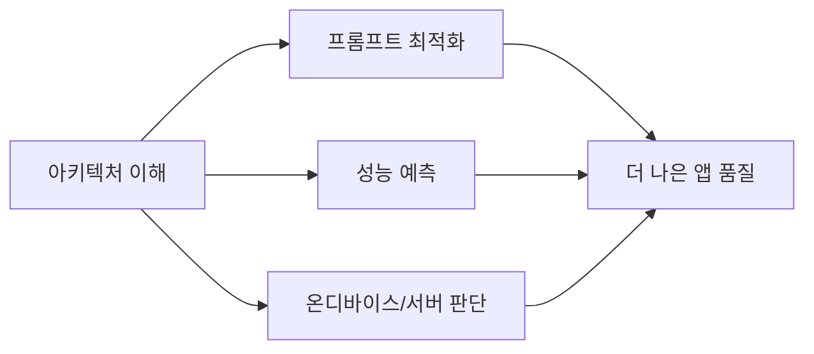
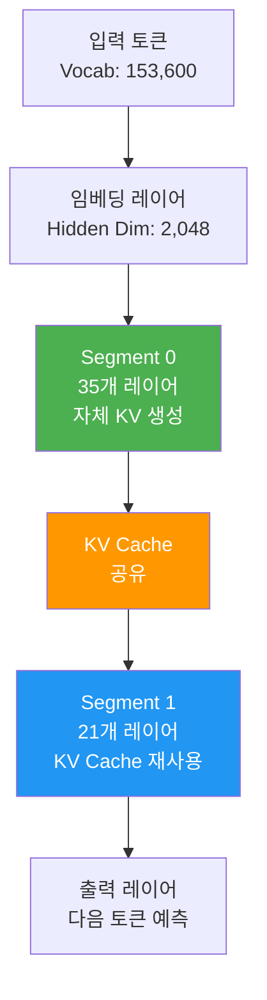
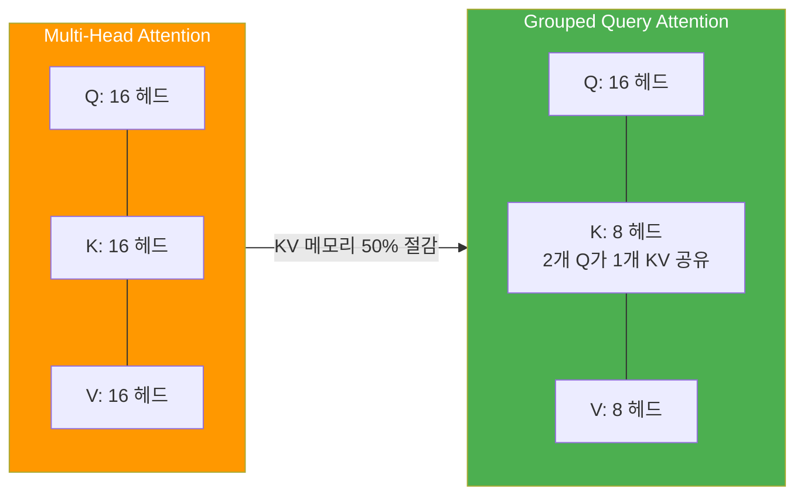
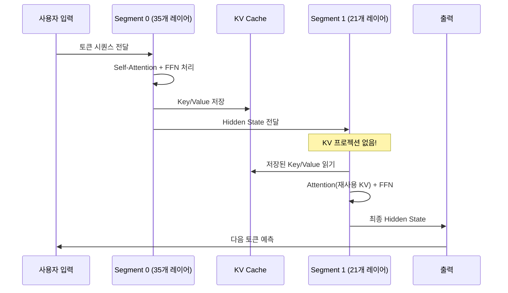
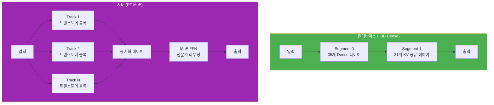

# 01. Apple Foundation Model 아키텍처

> Apple의 온디바이스 ~3B 파라미터 Foundation Language Model의 내부 구조를 파헤칩니다

## 개요

이 섹션에서는 Apple Intelligence의 심장부인 온디바이스 Foundation Language Model의 아키텍처를 깊이 있게 살펴봅니다. ~3B(약 31.8억) 파라미터를 가진 이 모델이 어떤 구조로 설계되었는지, 그리고 왜 그런 선택을 했는지 이해하게 됩니다.

**선수 지식**: [Ch1~Ch13](01-ch1-apple-intelligence와-온디바이스-ai/01-01-apple-intelligence-개요.md)에서 다룬 Foundation Models 프레임워크 사용법, [Private Cloud Compute 아키텍처](01-ch1-apple-intelligence와-온디바이스-ai/04-04-private-cloud-compute-아키텍처.md)에 대한 기본 이해
**학습 목표**:
- Apple 온디바이스 ~3B 모델의 전체 아키텍처를 설명할 수 있다
- 56개 레이어 Two-Segment 설계의 원리와 이유를 이해한다
- Grouped Query Attention, SwiGLU 등 핵심 구성 요소의 역할을 파악한다
- 온디바이스 모델과 서버 모델(PT-MoE)의 아키텍처 차이를 비교할 수 있다

## 왜 알아야 할까?

여러분이 지금까지 `LanguageModelSession`을 통해 호출해 온 그 모델—도대체 내부에서 무슨 일이 벌어지고 있는 걸까요?

"그냥 API 쓰면 되지, 왜 내부 구조까지 알아야 해?"라고 생각할 수 있습니다. 하지만 모델의 아키텍처를 이해하면 실무에서 크게 달라지는 것들이 있거든요:

- **프롬프트 길이 전략**: 컨텍스트 윈도우가 4,096 토큰인지 65,000 토큰인지에 따라 프롬프트 설계가 완전히 달라집니다
- **성능 예측**: 왜 첫 토큰은 빠르고, 긴 입력은 느려지는지 구조적으로 이해할 수 있습니다
- **기기별 최적화**: iPhone 15 Pro에서 초당 30토큰이 나오는 이유, 구형 기기에서 왜 사용 불가한지 아키텍처로 설명됩니다
- **온디바이스 vs 서버 판단**: 어떤 작업이 온디바이스에 적합하고, 어떤 작업이 Private Cloud Compute로 넘어가야 하는지 근거를 갖게 됩니다

> 📊 **그림 1**: 모델 아키텍처 이해가 앱 개발에 미치는 영향



## 핵심 개념

### 개념 1: 전체 아키텍처 개관 — ~3B 파라미터의 지도

> 💡 **비유**: 아파트를 설계한다고 생각해보세요. 56층짜리 건물인데, 1~35층(Segment 0)은 각 층마다 자체 수도관과 전기 배선이 있습니다. 반면 36~56층(Segment 1)은 아래층의 수도관을 공유하죠. 이렇게 하면 건물 전체 비용과 무게를 줄이면서도 충분히 살기 좋은 아파트가 됩니다. Apple의 온디바이스 모델이 정확히 이런 구조입니다.

Apple의 온디바이스 Foundation Language Model(내부 코드명 AFMTextV7)은 총 **3,178,001,792개(~3B, 약 31.8억)**의 파라미터를 가진 Transformer 기반 언어 모델입니다. 이후로는 이 모델을 **~3B 모델**로 지칭하겠습니다. 일반적인 Transformer와는 다른 독특한 설계를 채택했는데요, 바로 **Two-Segment 아키텍처**입니다.

모델의 전체 **56개 레이어**는 두 세그먼트로 분할됩니다:
- **Segment 0**: 35개 레이어 — 자체 Key/Value를 생성하고 저장
- **Segment 1**: 21개 레이어 — Segment 0의 KV Cache를 재사용

> 📊 **그림 2**: Apple 온디바이스 ~3B 모델의 Two-Segment 아키텍처



핵심 사양을 표로 정리하면 다음과 같습니다:

| 구성 요소 | 사양 |
|-----------|------|
| **총 파라미터** | 3,178,001,792 (~3B) |
| **Hidden Dimension** | 2,048 |
| **Attention Heads** | 16개/레이어 |
| **Head Dimension** | 128 (2,048 / 16) |
| **Feed-Forward Dimension** | 6,656 (3.25x 확장) |
| **활성화 함수** | SwiGLU |
| **어휘 크기** | 153,600 토큰 |
| **총 레이어** | 56개 (Segment 0: 35개 + Segment 1: 21개) |
| **RoPE theta** | 500,000 |

이 수치들이 왜 이런 값으로 결정되었는지, 하나씩 뜯어보겠습니다.

### 개념 2: Transformer 레이어의 내부 — Attention과 SwiGLU

> 💡 **비유**: 카페에서 16명의 바리스타(Attention Head)가 동시에 일하고 있다고 상상해보세요. 각 바리스타는 128가지 맛(Head Dimension)을 구별할 수 있습니다. 손님의 주문(입력 토큰)이 들어오면, 16명 모두가 각자의 관점에서 주문을 분석한 뒤, 결과를 합쳐서 최종 음료를 만듭니다. 이게 바로 Multi-Head Attention입니다.

Apple의 각 Transformer 레이어는 두 가지 핵심 블록으로 구성됩니다:

**1) Grouped Query Attention (GQA)**

일반적인 Multi-Head Attention에서는 Query, Key, Value가 모두 같은 수(16개)의 헤드를 가집니다. 하지만 Apple 모델은 **Grouped Query Attention**을 사용하여 Key와 Value의 헤드 수를 줄였습니다. Query 16개 헤드에 대해 KV 헤드를 8개로 묶으면, KV Cache의 메모리 사용량이 절반으로 줄어들죠.

> 📊 **그림 3**: Multi-Head Attention vs Grouped Query Attention



**2) SwiGLU Feed-Forward Network**

전통적인 Transformer는 ReLU 활성화 함수를 사용하지만, Apple 모델은 **SwiGLU**를 채택했습니다. SwiGLU는 Swish 활성화 함수와 Gated Linear Unit을 결합한 것으로, 같은 파라미터 수 대비 더 높은 표현력을 제공합니다.

```swift
// SwiGLU의 개념을 Swift로 표현하면 이런 느낌입니다
// 실제 모델 내부는 ANE(Neural Engine)에서 최적화되어 실행됩니다

func swiGLU(input x: [Float], weightGate wG: [[Float]], weightUp wU: [[Float]]) -> [Float] {
    let gate = matmul(x, wG)       // 게이트 경로
    let up = matmul(x, wU)         // 업 프로젝션 경로
    let swish = gate.map { $0 * sigmoid($0) }  // Swish 활성화
    return zip(swish, up).map { $0 * $1 }       // 요소별 곱
}
// Feed-Forward Dimension이 6,656인 이유:
// SwiGLU는 3개의 가중치 행렬을 사용하므로
// 일반 FFN 대비 2/3 크기 x 확장 비율 = 3.25x가 됩니다
```

> ⚠️ **흔한 오해**: "SwiGLU는 그냥 ReLU보다 좋은 활성화 함수"라고 단순화하는 경우가 많습니다. 사실 SwiGLU는 활성화 함수가 아니라 **Feed-Forward Network의 구조 자체를 바꾸는 것**입니다. 게이트 메커니즘이 추가되어 파라미터는 늘지만, 같은 총 파라미터 예산에서 더 높은 성능을 냅니다.

### 개념 3: Two-Segment 설계 — KV Cache 공유의 비밀

> 💡 **비유**: 책을 읽을 때를 생각해보세요. 처음 읽을 때(Segment 0)는 중요한 내용에 밑줄을 긋고 메모를 합니다. 두 번째 읽을 때(Segment 1)는 새로 메모하지 않고, 처음에 만든 메모를 참조하면서 더 깊이 이해하죠. Apple 모델도 마찬가지입니다—Segment 0이 만든 "메모"(KV Cache)를 Segment 1이 재활용합니다.

Apple이 56개 레이어를 Segment 0(35개) + Segment 1(21개)로 나눈 것은 단순한 설계가 아닙니다. 이 5:3 비율은 치밀한 실험의 결과입니다:

- **Segment 0 (35개 레이어)**: 전체의 62.5%. 각 레이어가 자체 Key와 Value를 생성하고 저장합니다
- **Segment 1 (21개 레이어)**: 전체의 37.5%. Key/Value 프로젝션이 **완전히 제거**되었습니다. Segment 0의 KV Cache를 그대로 재사용합니다

이 설계의 효과는 놀랍습니다:

| 지표 | 개선폭 |
|------|--------|
| KV Cache 메모리 | **37.5% 감소** |
| Time-to-First-Token | **~37.5% 감소** |
| 모델 품질 손실 | **미미함** |

> 📊 **그림 4**: Two-Segment에서의 추론(Inference) 흐름



Prefill(입력 처리) 단계에서 Segment 1은 KV를 생성할 필요가 없으므로, **그 연산을 완전히 건너뛸 수 있습니다**. 이것이 Time-to-First-Token이 극적으로 개선되는 핵심 이유입니다.

```swift
import FoundationModels

// 실제 앱에서 Two-Segment 아키텍처의 효과를 체감하는 코드
// Time-to-First-Token이 빠른 이유가 바로 이 구조 덕분입니다

let session = LanguageModelSession()

// 긴 프롬프트를 보내도 첫 응답이 빠른 이유:
// Segment 1이 Prefill을 건너뛰기 때문
let longPrompt = """
다음 기사를 3줄로 요약해주세요:
\(articleText)  // 긴 텍스트
"""

// iPhone 15 Pro 기준:
// - 프롬프트 토큰당 ~0.6ms (Prefill)
// - 생성 속도: ~30 tokens/sec (Decode)
let response = try await session.respond(to: longPrompt)
```

### 개념 4: 토크나이저와 어휘 — 153,600 토큰의 세계

Apple 모델의 토크나이저는 몇 가지 주목할 특징이 있습니다:

- **어휘 크기**: 153,600 토큰 (GPT-4의 100,277보다 큼)
- **다국어 지원**: 초기 100K에서 150K로 확장하여 15개 언어를 효율적으로 커버
- **공유 임베딩**: 입력(Input)과 출력(Output) 임베딩 테이블을 공유하여 메모리 절약
- **RoPE 위치 인코딩**: theta = 500,000으로 설정, 이론적으로 ~205,000 토큰까지 확장 가능

```run:swift
// 토크나이저의 효율성을 확인하는 개념적 코드
// 같은 문장이 언어별로 몇 개의 토큰으로 분해되는지 비교

let examples = [
    ("English", "The quick brown fox jumps over the lazy dog"),
    ("한국어", "빠른 갈색 여우가 게으른 개를 뛰어넘는다"),
    ("日本語", "素早い茶色の狐が怠け者の犬を飛び越える")
]

for (lang, text) in examples {
    // 153,600 토큰 어휘로 다국어를 효율적으로 처리
    print("\(lang): \"\(text)\"")
    print("  → 약 \(text.count / 2)~\(text.count) 토큰으로 인코딩")
}
print("\n어휘 크기: 153,600 (15개 언어 지원)")
```

```output
English: "The quick brown fox jumps over the lazy dog"
  → 약 22~44 토큰으로 인코딩
한국어: "빠른 갈색 여우가 게으른 개를 뛰어넘는다"
  → 약 10~20 토큰으로 인코딩
日本語: "素早い茶色の狐が怠け者の犬を飛び越える"
  → 약 10~20 토큰으로 인코딩

어휘 크기: 153,600 (15개 언어 지원)
```

### 개념 5: 온디바이스 vs 서버 모델 (PT-MoE) 비교

> 💡 **비유**: 동네 카페(온디바이스)와 대형 프랜차이즈 본사 주방(서버)을 비교해볼까요? 동네 카페는 바리스타 1명이 모든 메뉴를 담당합니다(Dense 모델). 빠르고, 손님 정보가 밖에 나가지 않죠. 반면 본사 주방에는 커피 전문가, 디저트 전문가, 음료 전문가가 따로 있어서(MoE), 복잡한 주문도 처리할 수 있지만, 주문서를 보내야 합니다.

서버에서 실행되는 PT-MoE(Parallel-Track Mixture-of-Experts) 모델은 온디바이스 ~3B 모델과 근본적으로 다른 설계 철학을 가집니다:

> 📊 **그림 5**: 온디바이스 ~3B 모델 vs 서버 PT-MoE 모델 구조 비교



| 특성 | 온디바이스 (~3B) | 서버 (PT-MoE) |
|------|-----------------|---------------|
| **구조** | Dense Transformer | Parallel-Track MoE |
| **레이어** | 56개 (Segment 0: 35개 + Segment 1: 21개) | 다수 트랙 x 블록 |
| **어텐션** | GQA (전역) | 로컬/글로벌 교대 |
| **위치 인코딩** | RoPE (전체) | RoPE(로컬) + NoPE(글로벌) |
| **FFN** | Dense SwiGLU | MoE (Top-K 라우팅) |
| **양자화** | 2-bit QAT | 3.56-bit ASTC |
| **컨텍스트** | ~4,096 토큰 | ~65,000 토큰 |
| **비전** | ViTDet-L (300M) | ViT-g (1B) |
| **추론 위치** | 기기 내 | Private Cloud Compute |
| **프라이버시** | 데이터 기기 잔류 | 처리 후 즉시 삭제 |

서버 모델의 PT-MoE 설계에서 주목할 점은 **동기화 오버헤드 감소**입니다. 일반적인 Tensor Parallelism은 매 레이어마다 GPU 간 통신(2L번)이 필요하지만, PT-MoE는 트랙 블록 경계에서만 동기화하므로 L/D번(D=블록 깊이)으로 줄어듭니다. D=4이면 **87.5%** 감소라는 놀라운 효율을 달성하죠.

## 실습: 직접 해보기

모델 아키텍처의 사양을 코드로 탐색하고, 실제 앱에서 모델의 특성을 확인하는 유틸리티를 만들어봅시다.

```swift
import SwiftUI
import FoundationModels

// MARK: - 모델 아키텍처 사양 정리

/// Apple 온디바이스 모델의 알려진 아키텍처 사양
struct OnDeviceModelSpec {
    // 공개된 아키텍처 정보 기반
    static let totalParameters: Int = 3_178_001_792  // ~3B(약 31.8억)
    static let hiddenDimension: Int = 2_048
    static let attentionHeads: Int = 16
    static let headDimension: Int = 128          // 2048 / 16
    static let feedForwardDimension: Int = 6_656  // 3.25x 확장
    static let vocabularySize: Int = 153_600
    static let totalLayers: Int = 56              // Segment 0: 35개 + Segment 1: 21개
    static let segment0Layers: Int = 35           // 자체 KV 생성
    static let segment1Layers: Int = 21           // KV 재사용
    static let ropeTheta: Int = 500_000
    
    /// KV Cache 메모리 절감률 계산
    static var kvCacheReduction: Double {
        Double(segment1Layers) / Double(totalLayers) // 37.5%
    }
    
    /// 파라미터를 사람이 읽기 쉬운 형태로 반환
    static var formattedParameters: String {
        "~3B"  // 약 31.8억
    }
}

// MARK: - 모델 가용성 및 성능 확인 뷰

struct ModelArchitectureView: View {
    @State private var isAvailable = false
    @State private var modelInfo = ""
    @State private var isChecking = false
    
    var body: some View {
        NavigationStack {
            List {
                // 아키텍처 사양 섹션
                Section("아키텍처 사양") {
                    specRow("총 파라미터", OnDeviceModelSpec.formattedParameters)
                    specRow("Hidden Dim", "\(OnDeviceModelSpec.hiddenDimension)")
                    specRow("Attention Heads", "\(OnDeviceModelSpec.attentionHeads)")
                    specRow("총 레이어", "\(OnDeviceModelSpec.totalLayers) (35+21)")
                    specRow("어휘 크기", "\(OnDeviceModelSpec.vocabularySize)")
                    specRow("활성화 함수", "SwiGLU")
                    specRow("KV Cache 절감", String(format: "%.1f%%",
                        OnDeviceModelSpec.kvCacheReduction * 100))
                }
                
                // 실시간 모델 상태 섹션
                Section("모델 상태") {
                    HStack {
                        Text("온디바이스 모델")
                        Spacer()
                        if isChecking {
                            ProgressView()
                        } else {
                            Image(systemName: isAvailable ? "checkmark.circle.fill" : "xmark.circle.fill")
                                .foregroundStyle(isAvailable ? .green : .red)
                        }
                    }
                    
                    if !modelInfo.isEmpty {
                        Text(modelInfo)
                            .font(.caption)
                            .foregroundStyle(.secondary)
                    }
                }
                
                // 성능 벤치마크 섹션 (공개 수치)
                Section("iPhone 15 Pro 벤치마크") {
                    specRow("Prefill 속도", "~0.6ms / 프롬프트 토큰")
                    specRow("생성 속도", "~30 tokens/sec")
                    specRow("양자화", "2-bit QAT (평균 3.7 bpw)")
                }
            }
            .navigationTitle("모델 아키텍처")
            .task {
                await checkModelAvailability()
            }
        }
    }
    
    /// 모델 가용성을 확인하는 비동기 함수
    private func checkModelAvailability() async {
        isChecking = true
        defer { isChecking = false }
        
        // SystemLanguageModel을 통해 모델 상태 확인
        let availability = SystemLanguageModel.default.availability
        
        switch availability {
        case .available:
            isAvailable = true
            modelInfo = "온디바이스 ~3B 모델 사용 가능"
        case .unavailable:
            isAvailable = false
            modelInfo = "이 기기에서 사용 불가 (Apple Silicon 필요)"
        default:
            isAvailable = false
            modelInfo = "모델 상태 확인 중..."
        }
    }
    
    /// 사양 행을 표시하는 헬퍼 뷰
    private func specRow(_ label: String, _ value: String) -> some View {
        HStack {
            Text(label)
                .foregroundStyle(.secondary)
            Spacer()
            Text(value)
                .fontDesign(.monospaced)
        }
    }
}
```

```run:swift
// 아키텍처 사양을 확인하는 간단한 계산 예제

let totalLayers = 56
let segment0 = 35
let segment1 = 21

// KV Cache 절감률
let kvReduction = Double(segment1) / Double(totalLayers) * 100
print("Two-Segment 아키텍처:")
print("  Segment 0: \(segment0)개 레이어 (KV 생성)")
print("  Segment 1: \(segment1)개 레이어 (KV 재사용)")
print("  KV Cache 메모리 절감: \(String(format: "%.1f", kvReduction))%")

// GQA 메모리 절감
let queryHeads = 16
let kvHeads = 8
let gqaReduction = (1.0 - Double(kvHeads) / Double(queryHeads)) * 100
print("\nGrouped Query Attention:")
print("  Query Heads: \(queryHeads), KV Heads: \(kvHeads)")
print("  KV 메모리 추가 절감: \(String(format: "%.0f", gqaReduction))%")

// 복합 절감 효과
let combinedReduction = (1.0 - (1.0 - kvReduction/100) * (1.0 - gqaReduction/100)) * 100
print("\n복합 KV Cache 절감률: \(String(format: "%.1f", combinedReduction))%")
```

```output
Two-Segment 아키텍처:
  Segment 0: 35개 레이어 (KV 생성)
  Segment 1: 21개 레이어 (KV 재사용)
  KV Cache 메모리 절감: 37.5%

Grouped Query Attention:
  Query Heads: 16, KV Heads: 8
  KV 메모리 추가 절감: 50%

복합 KV Cache 절감률: 68.8%
```

## 더 깊이 알아보기

### Transformer의 여정: Attention Is All You Need에서 Apple Silicon까지

2017년 Google의 Vaswani 등이 발표한 "Attention Is All You Need" 논문은 AI 역사를 바꾼 전환점이었습니다. 원래 기계 번역용으로 설계된 Transformer 아키텍처가, 불과 8년 만에 여러분의 iPhone 안에서 실시간으로 동작하게 된 거죠.

흥미로운 점은 Apple이 이 여정에서 택한 전략입니다. OpenAI가 GPT-4로 수천억 파라미터의 거대 모델을 추구할 때, Apple은 반대 방향을 선택했습니다—**"작지만 똑똑한 모델"**. ~3B 파라미터로 충분한 성능을 내면서, 사용자의 기기에서 직접 실행되는 모델을 만든 거죠.

이 결정의 배경에는 Apple의 핵심 가치인 **프라이버시**가 있었습니다. 사용자의 데이터가 서버로 나가지 않으려면 모델이 기기 안에 있어야 하고, 기기 안에 들어가려면 모델이 충분히 작아야 합니다. 2-bit 양자화(QAT)로 모델 크기를 약 **0.9GB**까지 압축한 것도 이런 철학의 결과입니다.

### SwiGLU의 탄생 — Noam Shazeer의 기여

SwiGLU 활성화 함수를 제안한 사람은 Google의 Noam Shazeer인데요, 사실 그는 원래 Transformer 논문의 공동 저자이기도 합니다. 2020년 논문 "GLU Variants Improve Transformer"에서 SwiGLU를 포함한 여러 GLU 변형을 실험했고, SwiGLU가 가장 좋은 성능을 보였습니다. 재미있는 것은 논문에서 본인이 "왜 SwiGLU가 잘 작동하는지 이론적으로 설명하기 어렵다"고 솔직하게 인정했다는 점입니다. 이후 Meta의 LLaMA, Google의 PaLM 2, 그리고 Apple의 온디바이스 모델까지 거의 모든 최신 LLM이 SwiGLU를 채택하게 되었습니다.

### Apple의 드래프트 모델 — 48M의 작은 영웅

Apple은 온디바이스 ~3B 모델과 함께 약 **4,877만 파라미터**의 초소형 드래프트(Draft) 모델도 운용합니다. 12개 레이어, Hidden Dimension 256, 8개 Attention Head로 구성된 이 모델은 **Speculative Decoding**에 사용됩니다. 큰 모델이 검증만 하면 되므로 전체 생성 속도가 빨라지는 기법이죠.

## 흔한 오해와 팁

> ⚠️ **흔한 오해**: "3B 파라미터면 GPT-4 같은 대형 모델보다 훨씬 못하지 않나요?"
> 
> 파라미터 수만으로 모델 성능을 판단하는 것은 위험합니다. Apple의 ~3B 모델은 2-bit QAT, KV-cache 공유 등의 최적화와 함께 특정 태스크(요약, 엔티티 추출, 짧은 대화)에 집중 학습되어, 해당 영역에서는 훨씬 큰 오픈소스 모델과 경쟁할 만한 성능을 보입니다. RLHF 후 인간 평가에서 16:9 승률을 기록했습니다.

> 💡 **알고 계셨나요?**: Apple은 모델 학습 데이터를 수집할 때 `Applebot`이라는 웹 크롤러를 사용하는데, `robots.txt`를 철저히 준수합니다. 또한 사용자의 개인 데이터는 **절대** 학습에 사용하지 않습니다. 학습 데이터는 웹 크롤링 + 라이선스된 출판물 + 공개 데이터셋 + 고품질 합성 데이터로 구성됩니다.

> 🔥 **실무 팁**: `GenerationOptions`에서 `maximumResponseTokens`를 설정할 때, 온디바이스 모델의 컨텍스트 윈도우(기본 ~4,096 토큰)를 고려하세요. 프롬프트 + 응답 합계가 이 한도를 넘으면 품질이 급격히 떨어집니다. 긴 컨텍스트가 필요한 작업은 Private Cloud Compute(서버 모델, ~65K 토큰)로 넘어갑니다.

## 핵심 정리

| 개념 | 설명 |
|------|------|
| AFMTextV7 | Apple 온디바이스 Foundation Model, ~3B(약 31.8억) 파라미터 |
| Two-Segment 설계 | 56개 레이어를 Segment 0(35개, KV 생성) + Segment 1(21개, KV 재사용)로 분할, KV Cache 37.5% 절감 |
| Grouped Query Attention | Query 16헤드, KV 8헤드로 KV 메모리 50% 추가 절감 |
| SwiGLU | Swish + Gated Linear Unit 결합 FFN, 같은 파라미터에서 더 높은 표현력 |
| 153,600 토큰 어휘 | 15개 언어 지원, 공유 임베딩으로 메모리 효율화 |
| RoPE (theta=500K) | 회전 위치 인코딩, 이론적 ~205K 토큰까지 확장 가능 |
| PT-MoE | 서버 모델 아키텍처, Parallel-Track + MoE + 로컬/글로벌 어텐션 교대 |
| 드래프트 모델 | ~48M 파라미터 초소형 모델, Speculative Decoding용 |

## 다음 섹션 미리보기

이번 섹션에서 모델의 전체 구조를 살펴봤다면, 다음 섹션 [02. KV-Cache 공유와 메모리 최적화](14-ch14-온디바이스-모델-아키텍처-이해/02-02-kv-cache-공유와-메모리-최적화.md)에서는 Two-Segment 설계의 핵심인 KV-Cache 공유 메커니즘을 더 깊이 파고듭니다. Segment 0과 Segment 1 사이의 KV 매핑이 어떻게 이루어지는지, 메모리 사용량을 프로파일링하는 방법, 그리고 앱 개발자가 이를 어떻게 활용할 수 있는지 실전적으로 다룹니다.

## 참고 자료

- [Apple Intelligence Foundation Language Models: Tech Report 2025](https://arxiv.org/abs/2507.13575) - Apple의 온디바이스/서버 모델 아키텍처의 모든 기술적 세부사항을 담은 공식 기술 보고서
- [Updates to Apple's On-Device and Server Foundation Language Models](https://machinelearning.apple.com/research/apple-foundation-models-2025-updates) - 2025년 업데이트된 모델의 아키텍처 변경사항과 성능 개선 내용
- [Meet the Foundation Models framework — WWDC25](https://developer.apple.com/videos/play/wwdc2025/286/) - Foundation Models 프레임워크 소개와 API 사용법
- [Deep dive into the Foundation Models framework — WWDC25](https://developer.apple.com/videos/play/wwdc2025/301/) - Guided Generation, Tool Calling 등 심화 기능
- [Apple Foundation Model Architecture Analysis (GitHub)](https://github.com/fguzman82/apple-foundation-model-analysis) - AFMTextV7 모델의 레이어별 상세 분석 프로젝트
- [Introducing Apple's On-Device and Server Foundation Models](https://machinelearning.apple.com/research/introducing-apple-foundation-models) - Apple의 최초 Foundation Model 공개 블로그 포스트

---
### 🔗 Related Sessions
- [generationoptions](03-ch3-foundation-models-프레임워크-시작하기/04-04-generationoptions와-생성-제어.md) (prerequisite)
- [foundation models 프레임워크](01-ch1-apple-intelligence와-온디바이스-ai/01-01-apple-intelligence-개요.md) (prerequisite)
- [private cloud compute](01-ch1-apple-intelligence와-온디바이스-ai/01-01-apple-intelligence-개요.md) (prerequisite)
