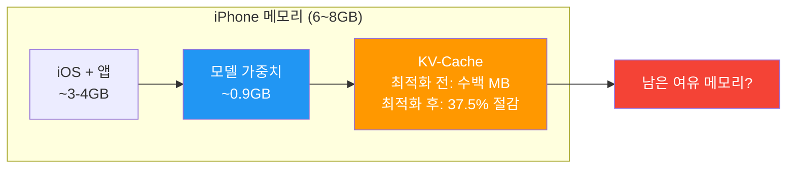
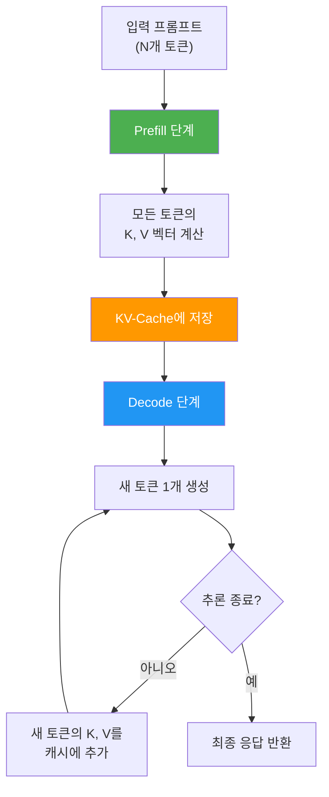
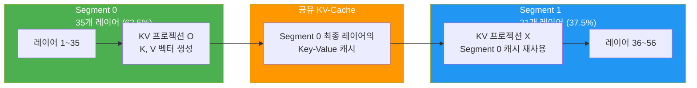
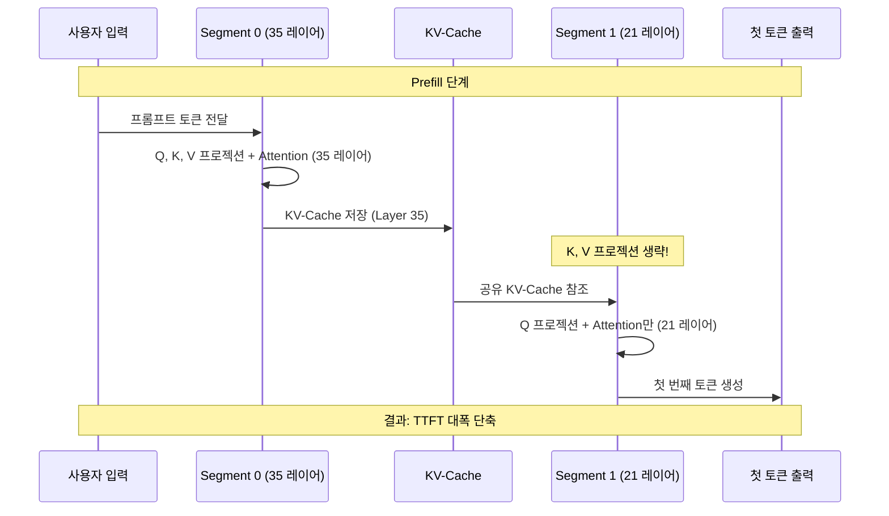
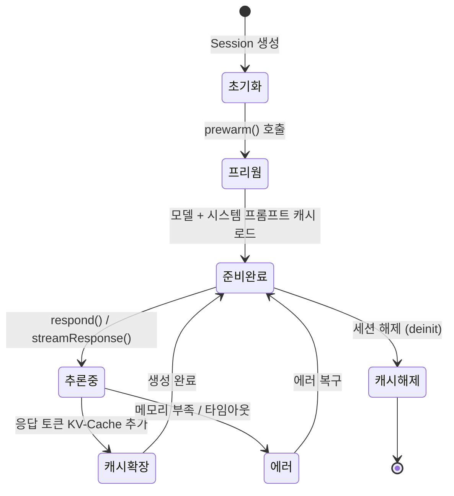
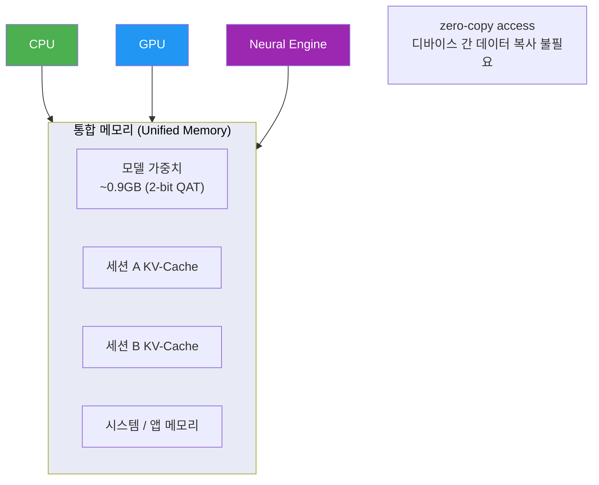
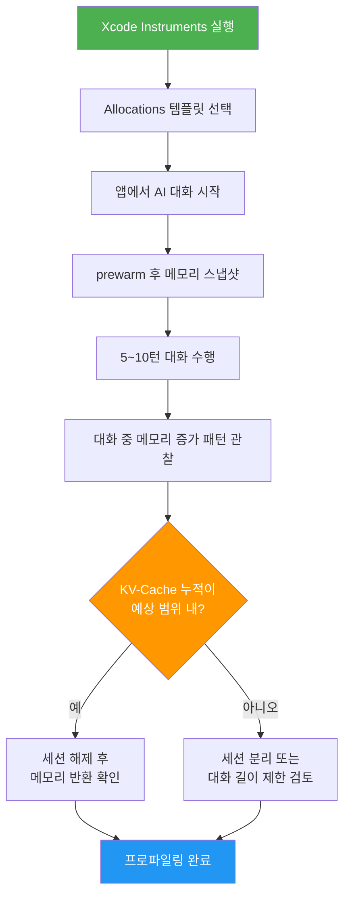

# KV-Cache 공유와 메모리 최적화

> Apple 온디바이스 모델의 KV-Cache 공유 메커니즘과 메모리 최적화 전략을 깊이 파헤칩니다

## 개요

이 섹션에서는 [이전 섹션](14-ch14-온디바이스-모델-아키텍처-이해/01-01-apple-foundation-model-아키텍처.md)에서 소개한 Two-Segment 아키텍처의 **핵심 동작 원리**인 KV-Cache 공유 메커니즘을 상세히 분석합니다. iPhone이라는 제한된 메모리 환경에서 ~3B 파라미터 모델을 어떻게 효율적으로 실행하는지, 그 비밀이 바로 여기에 있습니다.

**선수 지식**: [Apple Foundation Model 아키텍처](14-ch14-온디바이스-모델-아키텍처-이해/01-01-apple-foundation-model-아키텍처.md)에서 배운 Two-Segment 설계, Grouped Query Attention, Segment 0/Segment 1 구조

**학습 목표**:
- KV-Cache가 무엇이고, Transformer 추론에서 왜 메모리 병목이 되는지 이해한다
- Apple의 Two-Segment KV-Cache 공유가 37.5% 메모리 절감을 달성하는 원리를 설명할 수 있다
- `LanguageModelSession`의 KV-Cache 관리 전략과 `prewarm()` 활용법을 익힌다
- Instruments를 활용한 메모리 프로파일링과 멀티세션 최적화를 적용할 수 있다

## 왜 알아야 할까?

여러분이 iPhone에서 AI 기능을 구현한다고 상상해보세요. 사용자는 동시에 메시지도 보내고, 사진도 편집하고, 음악도 듣고 있는데요. 이 와중에 여러분의 AI 기능이 메모리를 너무 많이 차지하면? 앱이 강제 종료됩니다. iOS는 메모리 압박 상황에서 가차 없이 앱을 죽이거든요.

~3B 파라미터 모델은 2-bit 양자화로 **모델 가중치만 약 0.9GB**입니다. 여기에 KV-Cache가 추가되면 메모리 사용량이 급격히 늘어나죠. 일반적인 Transformer에서 KV-Cache는 컨텍스트 길이에 **선형적으로** 증가합니다. 4K 토큰 컨텍스트라면 수백 MB가 추가로 필요할 수 있어요.

> 📊 **그림 1**: KV-Cache가 온디바이스 AI 메모리에서 차지하는 비중



Apple이 KV-Cache 공유라는 아키텍처 혁신을 도입한 이유가 바로 이겁니다. **37.5%의 KV-Cache 메모리를 절감**하면서 동시에 **첫 번째 토큰 생성 시간(TTFT)까지 크게 줄인** 이 기법은, 온디바이스 AI의 실현 가능성을 결정짓는 핵심 기술입니다.

## 핵심 개념

### 개념 1: KV-Cache란 무엇인가?

> 💡 **비유**: KV-Cache는 **시험 중 메모지**와 같습니다. 객관식 시험을 풀 때, 1번 문제를 풀면서 읽은 지문의 핵심 내용을 메모지에 적어두면 2번, 3번 문제를 풀 때 지문을 다시 읽지 않아도 되죠? Transformer의 KV-Cache도 마찬가지입니다. 이전 토큰들을 처리하면서 계산한 Key와 Value를 저장해두면, 새 토큰을 생성할 때 이전 토큰들을 다시 계산하지 않아도 됩니다.

Transformer 모델이 텍스트를 생성할 때, Self-Attention 연산은 이전의 모든 토큰에 대한 Key(K)와 Value(V) 벡터가 필요합니다. KV-Cache 없이는 새 토큰을 생성할 때마다 **이전 토큰 전체를 다시 계산**해야 하므로, 생성 속도가 극도로 느려집니다.

> 📊 **그림 2**: KV-Cache의 동작 원리 — Prefill과 Decode 단계



KV-Cache의 메모리 사용량은 다음 공식으로 계산됩니다:

$$\text{KV-Cache 크기} = 2 \times L \times S \times H_{kv} \times D_h \times B$$

여기서:
- $L$ = Transformer 레이어 수
- $S$ = 시퀀스 길이 (컨텍스트 윈도우)
- $H_{kv}$ = KV 헤드 수 (GQA에서는 Query 헤드보다 적음)
- $D_h$ = 헤드 차원
- $B$ = 바이트 수 (FP16이면 2, INT8이면 1)

이게 의미하는 바는, 레이어가 많고 시퀀스가 길어질수록 KV-Cache가 기하급수적으로 커진다는 것입니다. Apple의 온디바이스 모델은 56개 레이어, 4K 컨텍스트를 지원하니, 최적화 없이는 수백 MB의 KV-Cache가 필요해집니다.

```swift
// KV-Cache 메모리 추정 (개념적 코드)
struct KVCacheEstimator {
    let layers: Int           // Transformer 레이어 수
    let sequenceLength: Int   // 시퀀스 길이
    let kvHeads: Int          // KV 헤드 수 (GQA)
    let headDim: Int          // 헤드 차원
    let bytesPerWeight: Int   // 양자화 수준 (FP16=2, INT8=1)
    
    // KV-Cache 총 메모리 (바이트)
    var totalMemoryBytes: Int {
        // Key + Value 두 가지이므로 x2
        2 * layers * sequenceLength * kvHeads * headDim * bytesPerWeight
    }
    
    // MB 단위 변환
    var totalMemoryMB: Double {
        Double(totalMemoryBytes) / (1024.0 * 1024.0)
    }
    
    // Apple Two-Segment 적용 시 (Segment 0 레이어만 캐시 생성)
    func twoSegmentMemoryMB(segment0Layers: Int) -> Double {
        let bytes = 2 * segment0Layers * sequenceLength * kvHeads * headDim * bytesPerWeight
        return Double(bytes) / (1024.0 * 1024.0)
    }
    
    // 절감률 계산
    func savingsPercent(segment0Layers: Int) -> Double {
        let standard = totalMemoryMB
        let optimized = twoSegmentMemoryMB(segment0Layers: segment0Layers)
        return (1.0 - optimized / standard) * 100
    }
}
```

### 개념 2: Two-Segment KV-Cache 공유 메커니즘

> 💡 **비유**: 회사의 회의록 시스템을 생각해보세요. 부서가 둘(기획팀과 개발팀)로 나뉘어 있는데, 기획팀이 작성한 회의록을 개발팀이 **그대로 참조**하는 겁니다. 개발팀은 자체 회의록을 따로 만들지 않고, 기획팀의 회의록을 읽으면서 자기 업무를 수행하죠. 이렇게 하면 전체 문서 저장 공간이 크게 줄어듭니다.

Apple의 핵심 혁신은 모델을 **Segment 0**과 **Segment 1**로 나누되, Segment 1이 자체 KV 프로젝션을 가지지 않는 것입니다. [이전 섹션](14-ch14-온디바이스-모델-아키텍처-이해/01-01-apple-foundation-model-아키텍처.md)에서 배운 것처럼, Segment 0은 35개 레이어(62.5%), Segment 1은 21개 레이어(37.5%)로 구성됩니다.

> 📊 **그림 3**: Two-Segment KV-Cache 공유 아키텍처



이 설계의 핵심 포인트를 정리하면:

1. **Segment 0 (35개 레이어)**: 일반적인 Transformer처럼 각 레이어가 Key, Value 프로젝션을 수행하고, KV-Cache를 생성합니다.
2. **Segment 1 (21개 레이어)**: Key, Value 프로젝션이 **완전히 제거**되었습니다. 대신 Segment 0의 최종 레이어에서 생성된 KV-Cache를 그대로 사용합니다.
3. **메모리 절감**: 56개 레이어 중 21개(37.5%)가 자체 KV-Cache를 만들지 않으므로, KV-Cache 메모리가 **정확히 37.5% 감소**합니다.

> ⚠️ **흔한 오해**: "Segment 1이 KV-Cache를 공유한다"는 것은 Segment 0의 모든 레이어의 캐시를 사용한다는 뜻이 아닙니다. Segment 0의 **마지막 레이어(Layer 35)**에서 생성한 KV-Cache만을 Segment 1의 모든 21개 레이어가 공유하는 것입니다. 이는 각 Segment 1 레이어가 동일한 Attention context를 참조하되, Query만 다르게 계산한다는 의미입니다.

```swift
// Two-Segment KV-Cache 공유의 메모리 절감 시뮬레이션
struct TwoSegmentKVAnalysis {
    // Apple AFMTextV7 스펙
    let segment0Layers = 35     // Segment 0: 62.5%
    let segment1Layers = 21     // Segment 1: 37.5%
    let totalLayers = 56
    let kvHeads = 8             // GQA KV 헤드 수
    let headDim = 128           // 헤드 차원
    let maxSequence = 4096      // 최대 컨텍스트
    
    // 일반 모델의 KV-Cache (모든 레이어가 자체 캐시 보유)
    var standardKVCacheMB: Double {
        let bytes = 2 * totalLayers * maxSequence * kvHeads * headDim * 1 // INT8
        return Double(bytes) / (1024.0 * 1024.0)
    }
    
    // Apple Two-Segment KV-Cache (Segment 0만 캐시 생성)
    var sharedKVCacheMB: Double {
        // Segment 0: 35개 레이어의 KV-Cache
        // Segment 1: 추가 캐시 없음 (Segment 0 최종 레이어 재사용)
        let bytes = 2 * segment0Layers * maxSequence * kvHeads * headDim * 1
        return Double(bytes) / (1024.0 * 1024.0)
    }
    
    // 절감률
    var savingsPercent: Double {
        (1.0 - sharedKVCacheMB / standardKVCacheMB) * 100
    }
}
```

```run:swift
// 메모리 절감 효과 출력
let segment0 = 35
let segment1 = 21
let total = segment0 + segment1

let standardCacheLayers = total       // 일반: 56개 레이어 전체
let sharedCacheLayers = segment0      // Apple: 35개 레이어만

let savingsPercent = Double(segment1) / Double(total) * 100

print("=== Two-Segment KV-Cache 메모리 분석 ===")
print("총 레이어: \(total)개")
print("Segment 0 (캐시 생성): \(segment0)개 레이어")
print("Segment 1 (캐시 공유): \(segment1)개 레이어")
print("KV-Cache 메모리 절감: \(String(format: "%.1f", savingsPercent))%")
print("Segment 1 비율: \(segment1)/\(total) = \(String(format: "%.1f", Double(segment1)/Double(total)*100))%")
```

```output
=== Two-Segment KV-Cache 메모리 분석 ===
총 레이어: 56개
Segment 0 (캐시 생성): 35개 레이어
Segment 1 (캐시 공유): 21개 레이어
KV-Cache 메모리 절감: 37.5%
Segment 1 비율: 21/56 = 37.5%
```

### 개념 3: Prefill 단계 최적화와 TTFT 개선

> 💡 **비유**: 식당에서 주문을 받을 때, 1번~35번 테이블은 직접 돌아다니면서 주문을 받지만(Prefill), 36번~56번 테이블은 "1번 테이블과 같은 거요!"라고 외치기만 하면 됩니다. 결과적으로 주문 접수 시간이 37.5% 단축되는 셈이죠.

KV-Cache 공유의 두 번째 이점은 **Time-to-First-Token(TTFT)** 개선입니다. Prefill 단계에서 Segment 1은 KV 프로젝션 연산 자체를 수행하지 않으므로, 이 단계의 전체 연산량이 줄어듭니다.

> 📊 **그림 4**: Prefill 단계에서의 연산 절감 비교



Apple의 Tech Report에 따르면, iPhone 15 Pro에서 측정한 성능은 다음과 같습니다:

| 지표 | 수치 |
|------|------|
| 프롬프트 토큰 처리 속도 | ~0.6ms/토큰 |
| 토큰 생성 속도 | ~30 tokens/sec |
| KV-Cache 메모리 절감 | 37.5% |
| TTFT 개선 | Segment 1 Prefill 연산 건너뜀 |

```swift
// Prefill 최적화 효과를 보여주는 개념 코드
struct PrefillOptimization {
    // Prefill 시간 추정 (개념적)
    func estimatePrefillTime(
        promptTokens: Int,
        msPerTokenSegment0: Double = 0.6,
        segment0Ratio: Double = 0.625,  // 35/56
        segment1Ratio: Double = 0.375   // 21/56
    ) -> (standard: Double, optimized: Double) {
        let totalTime = Double(promptTokens) * msPerTokenSegment0
        
        // 일반 모델: 전체 레이어 Prefill
        let standardTime = totalTime / segment0Ratio // Segment 0 비율로 역산
        
        // Apple 모델: Segment 1의 KV 연산 건너뜀
        // Segment 1은 Q 프로젝션만 수행하므로 약 1/3의 연산
        let optimizedTime = totalTime + (totalTime * segment1Ratio / segment0Ratio * 0.33)
        
        return (standard: standardTime, optimized: optimizedTime)
    }
}
```

### 개념 4: LanguageModelSession의 KV-Cache 관리와 prewarm()

> 💡 **비유**: `LanguageModelSession`은 **브라우저 탭**과 비슷합니다. 탭을 열면 해당 페이지의 캐시가 유지되고, 탭을 닫으면 캐시가 해제됩니다. 여러 탭을 열면 메모리를 더 많이 사용하지만, 같은 페이지를 다시 열 때는 캐시 덕분에 빠르게 로드되죠. `prewarm()`은 페이지를 백그라운드에서 미리 로드하는 것과 같습니다.

Foundation Models 프레임워크에서 `LanguageModelSession`은 KV-Cache와 직접 연결되어 있습니다. 세션이 생성되면 KV-Cache가 할당되고, 세션에 메시지를 추가할 때마다 캐시가 확장됩니다. 이 설계가 중요한 이유는, **개발자가 무심코 캐시를 무효화하는 것을 방지**하기 위해 세션을 append-only로 설계했기 때문입니다.

> 📊 **그림 5**: LanguageModelSession의 KV-Cache 라이프사이클



`prewarm()`이 내부적으로 하는 일을 단계별로 살펴보면:

1. **모델 로드**: 아직 메모리에 없다면 모델 가중치를 로드합니다
2. **시스템 프롬프트 Prefill**: `instructions`로 설정한 시스템 프롬프트에 대해 Segment 0의 KV-Cache를 미리 계산합니다
3. **Segment 1 준비**: Segment 0의 최종 레이어 KV를 Segment 1이 참조할 수 있도록 연결합니다
4. **대기 상태 진입**: 사용자 입력이 들어오면 즉시 추론을 시작할 수 있는 상태가 됩니다

```swift
import FoundationModels

// KV-Cache를 효율적으로 관리하는 ViewModel
@Observable
final class KVCacheAwareViewModel {
    private var session: LanguageModelSession?
    private(set) var isWarmedUp = false
    private(set) var responseText = ""
    
    // 앱 시작 시 또는 뷰 나타날 때 세션 프리웜
    func warmUp() async {
        guard !isWarmedUp else { return }
        
        let session = LanguageModelSession()
        
        // prewarm()으로 KV-Cache를 미리 채움
        // 시스템 프롬프트의 KV-Cache가 미리 계산됨
        // → 첫 응답의 TTFT 최대 40% 개선
        try? await session.prewarm()
        
        self.session = session
        self.isWarmedUp = true
    }
    
    // 세션 내에서 대화 (KV-Cache가 누적 확장)
    func send(_ message: String) async throws {
        guard let session else { return }
        
        // 이전 대화의 KV-Cache가 유지된 상태에서
        // 새 메시지의 KV만 추가로 계산 → 빠른 응답
        let response = try await session.respond(to: message)
        responseText = response.content
    }
    
    // 세션 초기화 (KV-Cache 완전 해제)
    func resetSession() {
        // 기존 세션의 KV-Cache 메모리가 해제됨
        session = nil
        isWarmedUp = false
        responseText = ""
    }
}
```

> 🔥 **실무 팁**: `prewarm()`은 `viewDidAppear`이나 앱 진입 시점에 호출하세요. 이렇게 하면 시스템 프롬프트에 대한 KV-Cache가 미리 계산되어, 사용자가 실제로 AI 기능을 사용할 때 **TTFT를 최대 40%까지 줄일 수 있습니다**. 단, `prewarm()`은 비동기이므로 UI를 블로킹하지 않도록 주의하세요.

### 개념 5: 멀티세션 시나리오와 통합 메모리 관리

> 💡 **비유**: Apple Silicon의 통합 메모리는 **공유 사무실 책상**과 같습니다. CPU, GPU, Neural Engine이 각자 책상을 가지는 대신, 하나의 넓은 책상을 함께 쓰는 거죠. 서류(KV-Cache 데이터)를 한 사람이 쓰고 다른 사람에게 넘길 때 복사할 필요 없이 그냥 밀어주면 됩니다. 이것이 **zero-copy access**입니다.

Apple Silicon의 통합 메모리 아키텍처(UMA)는 KV-Cache 최적화에서 큰 이점을 제공합니다. CPU, GPU, Neural Engine이 동일한 물리 메모리 풀을 공유하므로, KV-Cache 데이터를 디바이스 간에 복사할 필요가 없습니다.

> 📊 **그림 6**: Apple Silicon 통합 메모리에서의 KV-Cache 관리



여러 `LanguageModelSession`을 동시에 운용할 때는 메모리 관리가 중요합니다. 각 세션이 자체 KV-Cache를 보유하므로, 세션이 많아질수록 메모리 사용량이 선형 증가하거든요.

```swift
import FoundationModels

// 멀티세션 메모리 관리 패턴
@Observable
final class MultiSessionManager {
    // 활성 세션들 (각각 자체 KV-Cache 보유)
    private var sessions: [String: LanguageModelSession] = [:]
    
    // 최대 동시 세션 수 제한
    private let maxConcurrentSessions = 3
    
    // 세션 생성 (KV-Cache 할당)
    func createSession(id: String, instructions: String) async throws -> LanguageModelSession {
        // 세션 수 제한 — 메모리 보호
        if sessions.count >= maxConcurrentSessions {
            // 가장 오래된 세션 해제 (LRU 방식)
            if let oldestKey = sessions.keys.first {
                releaseSession(id: oldestKey)
            }
        }
        
        let session = LanguageModelSession(
            instructions: instructions
        )
        
        // 시스템 프롬프트 KV-Cache 프리웜
        try await session.prewarm()
        sessions[id] = session
        return session
    }
    
    // 비활성 세션 정리 (메모리 확보)
    func releaseSession(id: String) {
        // 세션 해제 → KV-Cache 메모리 반환
        sessions.removeValue(forKey: id)
    }
    
    // 전체 세션 정리
    func releaseAllSessions() {
        sessions.removeAll()
        // 모든 KV-Cache 메모리가 해제됨
    }
    
    // 활성 세션 수 확인
    var activeSessionCount: Int {
        sessions.count
    }
    
    // 메모리 경고 대응
    func handleMemoryPressure() {
        // 현재 사용 중이 아닌 세션부터 해제
        let keepCount = 1  // 최소 1개 세션만 유지
        while sessions.count > keepCount {
            if let key = sessions.keys.first {
                releaseSession(id: key)
            }
        }
    }
}
```

### 개념 6: 메모리 프로파일링과 실전 최적화

> 💡 **비유**: 메모리 프로파일링은 **가계부 작성**과 같습니다. 돈이 어디에 얼마나 쓰이는지 기록하지 않으면 어디서 절약할 수 있는지 알 수 없죠. Instruments의 메모리 프로파일러도 마찬가지입니다. KV-Cache가 실제로 얼마나 메모리를 사용하는지 측정해야 최적화 방향을 잡을 수 있습니다.

온디바이스 AI 앱을 출시하기 전에는 반드시 **Instruments**로 메모리 프로파일링을 수행해야 합니다. 특히 KV-Cache는 대화가 길어질수록 누적되므로, 장시간 사용 시나리오를 테스트하는 것이 중요합니다.

> 📊 **그림 7**: 메모리 프로파일링 워크플로



실전에서 메모리를 모니터링하는 유틸리티를 만들어보겠습니다:

```swift
import Foundation
import os

// MARK: - 메모리 모니터링 유틸리티

/// AI 세션의 메모리 사용량을 추적하는 모니터
struct AIMemoryMonitor {
    private static let logger = Logger(
        subsystem: "com.example.app",
        category: "AIMemory"
    )
    
    // 현재 앱의 메모리 사용량 (바이트)
    static var currentMemoryUsage: UInt64 {
        var info = mach_task_basic_info()
        var count = mach_msg_type_number_t(
            MemoryLayout<mach_task_basic_info>.size
        ) / 4
        
        let result = withUnsafeMutablePointer(to: &info) {
            $0.withMemoryRebound(to: integer_t.self, capacity: Int(count)) {
                task_info(mach_task_self_, task_flavor_t(MACH_TASK_BASIC_INFO), $0, &count)
            }
        }
        
        return result == KERN_SUCCESS ? info.resident_size : 0
    }
    
    // 메모리 사용량을 MB로 반환
    static var currentMemoryMB: Double {
        Double(currentMemoryUsage) / (1024.0 * 1024.0)
    }
    
    // KV-Cache 관련 메모리 변화 로깅
    static func logMemorySnapshot(label: String) {
        let memMB = currentMemoryMB
        logger.info("[\(label)] 메모리: \(String(format: "%.1f", memMB)) MB")
    }
    
    // 세션 생성 전후 메모리 차이 측정
    static func measureSessionOverhead(
        action: () async throws -> Void
    ) async rethrows -> Double {
        let before = currentMemoryMB
        try await action()
        let after = currentMemoryMB
        let delta = after - before
        
        logger.info("세션 오버헤드: \(String(format: "%.1f", delta)) MB (전: \(String(format: "%.1f", before)), 후: \(String(format: "%.1f", after)))")
        
        return delta
    }
}
```

iOS에서 메모리 경고에 대응하는 것도 필수입니다. 특히 KV-Cache는 즉시 해제할 수 있는 메모리이므로, 메모리 압박 시 가장 먼저 정리 대상이 되어야 합니다:

```swift
import UIKit
import FoundationModels

// MARK: - 메모리 경고 대응 패턴

@Observable
final class MemoryAwareAICoordinator {
    private var session: LanguageModelSession?
    private var memoryObserver: NSObjectProtocol?
    
    init() {
        // 메모리 경고 감지
        memoryObserver = NotificationCenter.default.addObserver(
            forName: UIApplication.didReceiveMemoryWarningNotification,
            object: nil,
            queue: .main
        ) { [weak self] _ in
            self?.handleMemoryWarning()
        }
    }
    
    deinit {
        if let observer = memoryObserver {
            NotificationCenter.default.removeObserver(observer)
        }
    }
    
    private func handleMemoryWarning() {
        AIMemoryMonitor.logMemorySnapshot(label: "메모리 경고 수신")
        
        // KV-Cache가 포함된 세션 즉시 해제
        session = nil
        
        AIMemoryMonitor.logMemorySnapshot(label: "세션 해제 완료")
        // 사용자가 다시 AI를 사용할 때 세션 재생성
    }
}
```

## 실습: 직접 해보기

KV-Cache 관리를 실전에 적용하는 완전한 예제를 구현해보겠습니다. 메모리 효율을 고려한 AI 서비스 레이어를 만들어봅시다.

```swift
import FoundationModels
import SwiftUI

// MARK: - KV-Cache 최적화 AI 서비스

/// 메모리 효율적인 AI 서비스
/// - prewarm()으로 TTFT 최적화
/// - 세션 재사용으로 KV-Cache 누적 활용
/// - 메모리 압박 시 자동 세션 정리
@Observable
final class MemoryEfficientAIService {
    private var session: LanguageModelSession?
    private(set) var isReady = false
    private(set) var turnCount = 0
    
    // 세션 초기화 + 프리웜
    func initialize(systemPrompt: String) async {
        // 1. 모델 가용성 확인
        let availability = SystemLanguageModel.default.availability
        guard availability == .available else {
            print("모델 사용 불가: \(availability)")
            return
        }
        
        // 2. 세션 생성 (KV-Cache 할당 시작)
        let newSession = LanguageModelSession(
            instructions: systemPrompt
        )
        
        // 3. 프리웜 — 시스템 프롬프트의 KV-Cache 미리 계산
        // 이 단계에서 Segment 0의 35개 레이어가 KV 프로젝션 수행
        // Segment 1의 21개 레이어는 KV 프로젝션 생략 (37.5% 절감)
        do {
            try await newSession.prewarm()
            self.session = newSession
            self.isReady = true
            print("AI 서비스 준비 완료 (KV-Cache 프리웜됨)")
        } catch {
            print("프리웜 실패: \(error)")
        }
    }
    
    // 대화 전송 (KV-Cache 누적 활용)
    func chat(_ message: String) async throws -> String {
        guard let session else {
            throw AIServiceError.notInitialized
        }
        
        // KV-Cache가 누적 유지되므로:
        // - 이전 대화 맥락을 다시 계산하지 않음
        // - 새 메시지 토큰의 KV만 추가 계산
        // - 멀티턴 대화에서 점점 빨라지는 효과
        let response = try await session.respond(to: message)
        turnCount += 1
        
        return response.content
    }
    
    // 메모리 압박 시 세션 정리
    func handleMemoryWarning() {
        session = nil
        isReady = false
        turnCount = 0
        // KV-Cache 메모리 즉시 해제
        print("메모리 경고: AI 세션 및 KV-Cache 해제됨")
    }
    
    enum AIServiceError: LocalizedError {
        case notInitialized
        
        var errorDescription: String? {
            switch self {
            case .notInitialized:
                return "AI 서비스가 초기화되지 않았습니다"
            }
        }
    }
}

// MARK: - SwiftUI View

struct KVCacheDemoView: View {
    @State private var aiService = MemoryEfficientAIService()
    @State private var userInput = ""
    @State private var messages: [(role: String, text: String)] = []
    @State private var isLoading = false
    
    var body: some View {
        NavigationStack {
            VStack {
                // 상태 표시
                HStack {
                    Circle()
                        .fill(aiService.isReady ? .green : .red)
                        .frame(width: 8, height: 8)
                    Text(aiService.isReady 
                         ? "준비됨 (대화 \(aiService.turnCount)턴)" 
                         : "초기화 중...")
                        .font(.caption)
                        .foregroundStyle(.secondary)
                    Spacer()
                }
                .padding(.horizontal)
                
                // 대화 목록
                ScrollView {
                    LazyVStack(alignment: .leading, spacing: 12) {
                        ForEach(Array(messages.enumerated()), id: \.offset) { _, msg in
                            MessageBubble(role: msg.role, text: msg.text)
                        }
                    }
                    .padding()
                }
                
                // 입력 영역
                HStack {
                    TextField("메시지 입력...", text: $userInput)
                        .textFieldStyle(.roundedBorder)
                        .disabled(!aiService.isReady || isLoading)
                    
                    Button {
                        Task { await sendMessage() }
                    } label: {
                        Image(systemName: "arrow.up.circle.fill")
                            .font(.title2)
                    }
                    .disabled(userInput.isEmpty || isLoading)
                }
                .padding()
            }
            .navigationTitle("KV-Cache 데모")
            .task {
                // 뷰 로드 시 세션 프리웜
                await aiService.initialize(
                    systemPrompt: "당신은 친절한 AI 도우미입니다. 간결하게 답변하세요."
                )
            }
        }
    }
    
    private func sendMessage() async {
        let text = userInput
        userInput = ""
        messages.append((role: "user", text: text))
        isLoading = true
        
        do {
            let response = try await aiService.chat(text)
            messages.append((role: "assistant", text: response))
        } catch {
            messages.append((role: "system", text: "오류: \(error.localizedDescription)"))
        }
        
        isLoading = false
    }
}

// 메시지 버블 컴포넌트
struct MessageBubble: View {
    let role: String
    let text: String
    
    var body: some View {
        HStack {
            if role == "user" { Spacer() }
            Text(text)
                .padding(12)
                .background(role == "user" ? Color.blue : Color(.systemGray5))
                .foregroundStyle(role == "user" ? .white : .primary)
                .clipShape(RoundedRectangle(cornerRadius: 16))
            if role != "user" { Spacer() }
        }
    }
}
```

```run:swift
// 메모리 사용 시뮬레이션 출력
let modelWeightsMB = 900.0      // ~0.9GB (2-bit QAT)
let systemPromptTokens = 200
let userTurnTokens = 50
let assistantTurnTokens = 150
let kvPerTokenKB = 0.5          // KV-Cache 토큰당 약 0.5KB (INT8, GQA)

// 시나리오별 메모리 사용량 계산
let systemKVMB = Double(systemPromptTokens) * kvPerTokenKB / 1024.0
let turn1KV = Double(userTurnTokens + assistantTurnTokens) * kvPerTokenKB / 1024.0
let turn5KV = turn1KV * 5.0

print("=== 온디바이스 AI 메모리 사용 시뮬레이션 ===")
print("")
print("모델 가중치: \(String(format: "%.0f", modelWeightsMB)) MB")
print("")
print("[세션 초기화 직후]")
print("  시스템 프롬프트 KV-Cache: \(String(format: "%.2f", systemKVMB)) MB")
print("  총 메모리: \(String(format: "%.0f", modelWeightsMB + systemKVMB)) MB")
print("")
print("[1턴 대화 후]")
print("  누적 KV-Cache: \(String(format: "%.2f", systemKVMB + turn1KV)) MB")
print("  총 메모리: \(String(format: "%.0f", modelWeightsMB + systemKVMB + turn1KV)) MB")
print("")
print("[5턴 대화 후]")
print("  누적 KV-Cache: \(String(format: "%.2f", systemKVMB + turn5KV)) MB")
print("  총 메모리: \(String(format: "%.0f", modelWeightsMB + systemKVMB + turn5KV)) MB")
print("")
print("* KV-Cache는 Two-Segment 공유로 37.5% 절감된 수치입니다")
```

```output
=== 온디바이스 AI 메모리 사용 시뮬레이션 ===

모델 가중치: 900 MB
  
[세션 초기화 직후]
  시스템 프롬프트 KV-Cache: 0.10 MB
  총 메모리: 900 MB

[1턴 대화 후]
  누적 KV-Cache: 0.20 MB
  총 메모리: 900 MB

[5턴 대화 후]
  누적 KV-Cache: 0.58 MB
  총 메모리: 901 MB

* KV-Cache는 Two-Segment 공유로 37.5% 절감된 수치입니다
```

## 더 깊이 알아보기

### KV-Cache의 역사: 메모리와 속도의 끝없는 전쟁

KV-Cache 자체는 Transformer가 처음 등장한 2017년 "Attention Is All You Need" 논문 시절부터 존재했습니다. 하지만 당시 모델이 수천만 파라미터 수준이었기에 큰 문제가 아니었죠.

상황이 변한 건 2020년 GPT-3(175B)부터입니다. 모델이 커지고 컨텍스트 윈도우가 길어지면서, KV-Cache가 **모델 가중치보다 더 많은 메모리**를 차지하는 상황이 벌어졌습니다. 이후 학계에서는 KV-Cache 최적화가 뜨거운 연구 분야가 되었습니다.

2023년에 등장한 **Grouped Query Attention(GQA)**은 KV 헤드 수를 줄여 캐시 크기를 감소시키는 방법이었고, Apple도 이를 채택했습니다. 하지만 Apple은 여기서 한 발 더 나아갔습니다.

2024~2025년에 발표한 **Two-Segment 아키텍처**는 GQA로도 부족한 메모리 절감을 달성하기 위해, 모델 구조 자체를 변형한 것입니다. 레이어의 일부에서 KV 프로젝션을 아예 제거한다는 것은 꽤 급진적인 결정이었는데요. Apple의 연구진은 Segment 0의 최종 레이어 KV가 Segment 1의 Attention에 충분한 정보를 제공한다는 것을 실험적으로 검증했습니다. 흥미롭게도, 이 설계는 모델 품질에서 거의 손실이 없으면서 **메모리와 속도 두 마리 토끼**를 잡았습니다.

> 💡 **알고 계셨나요?**: Apple의 KV-Cache 공유 아이디어는 완전히 새로운 것은 아닙니다. 학계에서는 "Cross-Layer Attention"이라는 유사한 개념이 연구되어 왔는데, 여러 레이어가 하나의 KV-Cache를 공유하는 방식입니다. Apple은 이를 **Two-Segment라는 실용적인 형태**로 발전시켜, 모바일 디바이스에서 실제로 동작하는 수준으로 구현한 최초의 사례입니다.

### Apple Silicon과 KV-Cache: 하드웨어-소프트웨어 공동 설계

Apple이 이런 최적화를 할 수 있는 배경에는 **하드웨어와 소프트웨어를 함께 설계하는 Apple의 고유한 강점**이 있습니다. Neural Engine의 KV-Cache 업데이트 최적화, 통합 메모리를 활용한 zero-copy 접근, 그리고 모델 아키텍처 자체의 변형까지—이 모든 것이 하나의 일관된 전략 아래에서 이루어졌습니다.

## 흔한 오해와 팁

> ⚠️ **흔한 오해**: "세션을 새로 만들면 KV-Cache가 자동으로 이전 세션에서 복사된다"고 생각하는 분들이 있습니다. **아닙니다.** 새 `LanguageModelSession`은 완전히 비어 있는 KV-Cache로 시작합니다. 이전 대화 맥락을 유지하려면 동일한 세션 인스턴스를 재사용해야 합니다. 이것이 [멀티턴 대화의 컨텍스트 관리](09-ch9-세션-관리와-멀티턴-대화/01-01-멀티턴-대화의-컨텍스트-관리.md)에서 세션 관리가 중요한 이유입니다.

> 💡 **알고 계셨나요?**: KV-Cache의 8-bit 양자화도 적용됩니다. Apple은 모델 가중치를 2-bit로 양자화하면서, KV-Cache도 INT8로 양자화하여 메모리를 추가로 절감합니다. FP16 KV-Cache 대비 **50% 추가 절감** 효과가 있죠. 이 모든 최적화를 합치면, Apple의 온디바이스 모델은 놀라울 정도로 작은 메모리 풋프린트로 동작합니다.

> 🔥 **실무 팁**: iOS에서 메모리 경고(`UIApplication.didReceiveMemoryWarningNotification`)를 감지하면 비활성 AI 세션을 즉시 해제하세요. KV-Cache가 차지하는 메모리가 즉시 반환됩니다. 사용자가 다시 AI 기능을 사용할 때 세션을 재생성하면 됩니다. [성능 최적화와 프로파일링](18-ch18-성능-최적화와-프로파일링/02-02-메모리와-배터리-최적화.md)에서 이 패턴을 더 자세히 다룹니다.

## 핵심 정리

| 개념 | 설명 |
|------|------|
| KV-Cache | Transformer 추론 시 이전 토큰의 Key/Value를 저장하여 재계산 방지. 메모리와 속도의 트레이드오프 |
| Two-Segment 공유 | Segment 1(21개 레이어)이 Segment 0 최종 레이어의 KV-Cache를 재사용. **37.5% 메모리 절감** |
| Prefill 최적화 | Segment 1에서 KV 프로젝션 생략 → **TTFT 대폭 개선** |
| `prewarm()` | 세션 생성 후 호출하여 시스템 프롬프트 KV-Cache를 미리 계산. TTFT 최대 40% 단축 |
| 통합 메모리(UMA) | Apple Silicon에서 CPU/GPU/ANE가 KV-Cache를 zero-copy로 공유 |
| KV-Cache INT8 양자화 | FP16 대비 50% 추가 메모리 절감. 모델 가중치 2-bit + KV INT8 = 극한 압축 |
| 멀티세션 관리 | 세션 수 제한 + LRU 정리로 KV-Cache 메모리 제어. 메모리 경고 시 비활성 세션 즉시 해제 |
| 메모리 프로파일링 | Instruments의 Allocations으로 KV-Cache 증가 패턴 측정. `task_info`로 런타임 모니터링 |

## 다음 섹션 미리보기

다음 [2-bit 양자화와 온디바이스 최적화](14-ch14-온디바이스-모델-아키텍처-이해/03-03-2-bit-양자화와-온디바이스-최적화.md)에서는 KV-Cache 최적화와 함께 Apple 온디바이스 모델의 또 다른 핵심 기술인 **2-bit Quantization-Aware Training(QAT)**을 심도 있게 다룹니다. 모델 가중치를 2비트로 압축하면서도 품질 손실을 최소화하는 비밀, learnable weight clipping과 초기화 전략, 그리고 이것이 KV-Cache 공유와 결합하여 어떻게 iPhone에서의 ~3B 모델 실행을 가능하게 하는지 알아봅니다.

## 참고 자료

- [Apple Intelligence Foundation Language Models: Tech Report 2025](https://arxiv.org/abs/2507.13575) - KV-Cache 공유와 Two-Segment 아키텍처의 원본 기술 보고서. 37.5% 절감 수치의 근거
- [Updates to Apple's On-Device and Server Foundation Language Models](https://machinelearning.apple.com/research/apple-foundation-models-2025-updates) - Apple ML Research의 2025년 업데이트. Two-Segment 설계의 5:3 비율 설명
- [Deep dive into the Foundation Models framework — WWDC25](https://developer.apple.com/videos/play/wwdc2025/301/) - LanguageModelSession의 KV-Cache 관리와 prewarm() 활용법 공식 가이드
- [Meet the Foundation Models framework — WWDC25](https://developer.apple.com/videos/play/wwdc2025/286/) - Foundation Models 프레임워크 입문과 세션 관리 전략
- [Foundation Models — Apple Developer Documentation](https://developer.apple.com/documentation/FoundationModels) - LanguageModelSession, prewarm() 등 공식 API 문서

---
### 🔗 Related Sessions
- [2-bit qat](01-ch1-apple-intelligence와-온디바이스-ai/03-03-온디바이스-ai의-장점과-한계.md) (prerequisite)
- [segment 0/segment 1](14-ch14-온디바이스-모델-아키텍처-이해/01-01-apple-foundation-model-아키텍처.md) (prerequisite)
- [afmtextv7](14-ch14-온디바이스-모델-아키텍처-이해/01-01-apple-foundation-model-아키텍처.md) (prerequisite)
