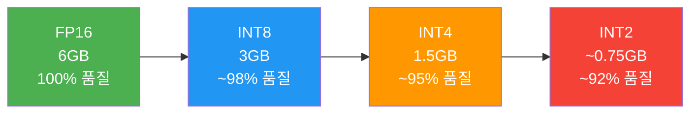
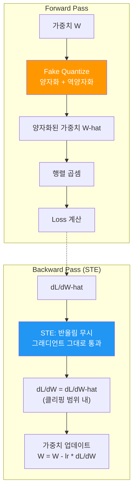
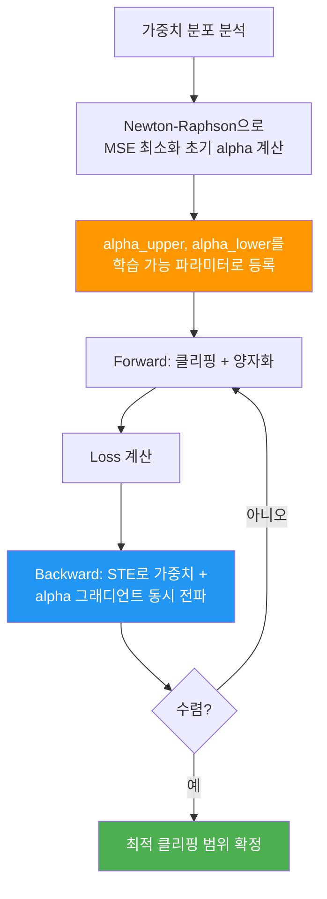
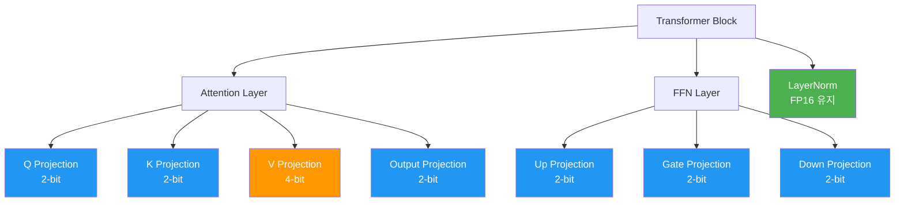
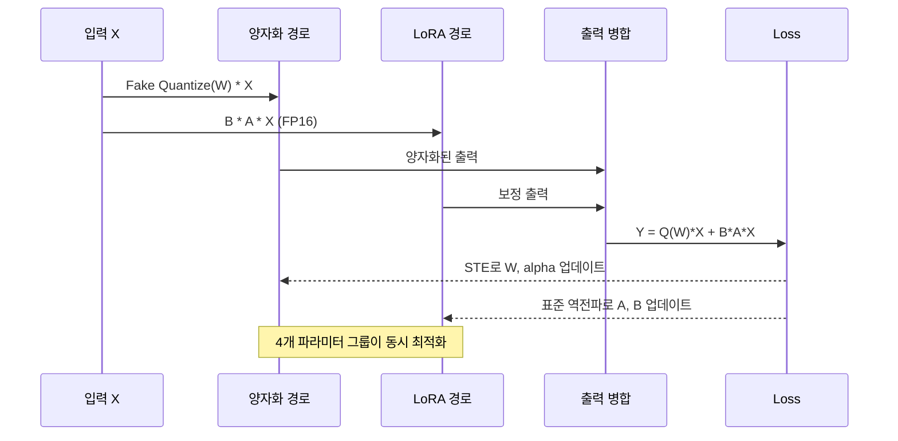
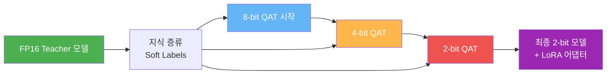

# 03. 2-Bit 양자화와 온디바이스 최적화

> Apple이 3B 파라미터 모델을 iPhone에 넣기 위해 선택한 극한의 압축 — 2-bit Quantization-Aware Training의 모든 것

## 개요

이 섹션에서는 Apple Foundation Models가 온디바이스 추론을 위해 채택한 **2-bit 양자화(Quantization)** 기술을 깊이 있게 살펴봅니다. 단순히 모델을 작게 만드는 것이 아니라, 학습 과정에서부터 양자화를 고려하여 품질 손실을 최소화하는 QAT(Quantization-Aware Training) 전략과, Apple이 독자적으로 개발한 Learnable Weight Clipping, 그룹 양자화(Group Quantization), 혼합 비트 전략, 그리고 STE(Straight-Through Estimator)의 수학적 원리까지 다룹니다.

**선수 지식**: 이전 섹션에서 다룬 Foundation Models의 Transformer 아키텍처와 Adapters 개념, 기본적인 미적분(역전파)과 행렬 연산 이해
**학습 목표**:
- 양자화의 수학적 원리와 STE 그래디언트 추정 기법을 이해한다
- PTQ와 QAT의 차이를 수학적으로 설명하고, Apple이 QAT를 선택한 이유를 정량적으로 안다
- Learnable Weight Clipping의 그래디언트 유도 과정과 Newton-Raphson 초기화를 파악한다
- 그룹 양자화(Group Quantization)와 혼합 비트 전략의 설계 원리를 이해한다
- 양자화-LoRA 공동 학습(Joint Training)의 메커니즘을 설명할 수 있다
- 실제 Core ML 양자화 API를 사용한 모델 크기 비교 실험을 수행한다

## 왜 알아야 할까?

iPhone 16 Pro의 Neural Engine은 강력하지만, 3B 파라미터 모델을 16-bit 그대로 올리면 **약 6GB의 메모리**가 필요합니다. 앱 하나가 기기 메모리의 절반 이상을 차지하는 건 현실적으로 불가능하죠. Apple은 이 문제를 **2-bit 양자화**로 해결했습니다 — 모델 크기를 약 **75% 축소**하면서도 벤치마크 성능을 90% 이상 유지하는 놀라운 결과를 달성했거든요.

하지만 단순히 "2-bit로 줄였다"는 설명만으로는 부족합니다. 2-bit는 가중치를 단 **4개의 값**으로 표현한다는 뜻이고, 이 극단적인 압축에서 품질을 유지하려면 **정교한 수학적 기법**이 필수입니다. STE를 통한 그래디언트 추정, 그룹 단위 스케일링, 레이어별 민감도 분석 — 이 기술들의 원리를 이해해야 온디바이스 AI의 "마법" 뒤에 숨은 공학적 결정을 제대로 파악할 수 있습니다.

> 📊 **그림 1**: 비트 수에 따른 모델 크기와 품질 트레이드오프



## 핵심 개념

### 개념 1: 양자화의 수학적 기초 — 연속에서 이산으로

> 💡 **비유**: 사진의 해상도를 낮추는 것과 비슷합니다. 4K 사진(16-bit)을 720p(2-bit)로 줄이면 파일 크기는 확 줄지만, 핵심 내용은 알아볼 수 있죠. 다만 세밀한 디테일은 좀 뭉개집니다.

양자화(Quantization)란 모델 가중치를 높은 정밀도(예: 16-bit 부동소수점)에서 낮은 정밀도(예: 2-bit 정수)로 변환하는 기술입니다. 16-bit float는 하나의 가중치를 표현하는 데 16비트를 사용하지만, 2-bit로 줄이면 단 4가지 값(`00`, `01`, `10`, `11`)만으로 가중치를 표현해야 합니다.

수학적으로 균일 양자화(Uniform Quantization)는 다음과 같이 동작합니다:

$$
x_q = \text{clamp}\left(\left\lfloor \frac{x}{s} \right\rceil + z, \; 0, \; 2^b - 1\right)
$$

- $x$: 원본 가중치 값
- $s$: 스케일 팩터 (실수 범위를 정수 범위에 매핑)
- $z$: 제로 포인트 (비대칭 양자화 시)
- $b$: 비트 수 (2-bit이면 $2^2 = 4$단계)
- $\lfloor \cdot \rceil$: 반올림(round) 연산

역양자화(Dequantization)는 그 역과정입니다:

$$
\hat{x} = s \cdot (x_q - z)
$$

여기서 **양자화 오차(Quantization Error)**는 $\epsilon = x - \hat{x}$로 정의됩니다. 2-bit에서는 이 오차가 클 수밖에 없는데요, Transformer 가중치의 분포가 대체로 **정규분포에 가깝고** 대부분의 값이 좁은 범위에 몰려 있기 때문에, 적절한 스케일링만 하면 의외로 잘 작동합니다.

그런데 여기서 중요한 문제가 하나 있습니다 — **그룹 양자화(Group Quantization)**입니다. 전체 레이어에 하나의 스케일 팩터 $s$를 사용하면(per-tensor quantization), 가중치 분포의 이상치(outlier) 때문에 양자화 품질이 크게 떨어집니다. Apple은 가중치를 **32~128개씩 그룹으로 묶어** 각 그룹마다 독립적인 스케일 팩터를 사용합니다:

$$
x_q^{(g)} = \text{clamp}\left(\left\lfloor \frac{x^{(g)}}{s_g} \right\rceil + z_g, \; 0, \; 2^b - 1\right)
$$

그룹 크기가 작을수록 정밀도는 올라가지만, 스케일 팩터 자체도 저장해야 하므로 압축률이 떨어집니다. Apple 논문에서는 그룹 크기 32를 사용한 것으로 알려져 있으며, 스케일 팩터는 FP16으로 저장됩니다. 이 경우 **유효 비트 수(effective bits)**는 순수 2-bit보다 약간 높아집니다:

$$
\text{effective bits} = 2 + \frac{16}{\text{group size}} = 2 + \frac{16}{32} = 2.5 \text{ bits}
$$

> 💡 **알고 계셨나요?**: 양자화의 아이디어는 1948년 Claude Shannon의 **PCM(Pulse Code Modulation)** 논문까지 거슬러 올라갑니다. 아날로그 음성 신호를 디지털로 변환할 때 사용한 바로 그 원리가, 70년이 지난 지금 AI 모델 압축에 쓰이고 있는 거죠. Shannon은 "양자화 잡음(quantization noise)"이라는 개념도 이 때 정립했는데, 오늘날 양자화 모델의 품질 저하를 분석할 때 여전히 이 프레임워크를 사용합니다.

### 개념 2: PTQ vs QAT — 학습 후 양자화 vs 학습 중 양자화

> 💡 **비유**: PTQ는 완성된 유화를 사진으로 찍는 것입니다 — 원본은 훌륭하지만 사진으로 옮기면서 색감이 좀 변하죠. QAT는 처음부터 "이 그림은 사진으로 찍힐 거야"라고 알려주고 그린 것입니다. 화가가 사진에서도 잘 보이는 색과 구도를 미리 고려하니까 최종 결과가 더 좋습니다.

**PTQ(Post-Training Quantization)**는 이미 학습이 끝난 모델에 양자화를 적용합니다. GPTQ, AWQ 같은 기법이 여기 속하는데요, 빠르고 간편하지만 비트 수가 낮아질수록 품질 저하가 커집니다. 특히 2-bit에서는 PTQ만으로는 실용적인 품질을 유지하기 어렵습니다.

**QAT(Quantization-Aware Training)**는 학습 과정에서 양자화 효과를 시뮬레이션합니다. 핵심은 **Fake Quantization**입니다 — Forward pass에서 가중치를 양자화한 뒤 즉시 역양자화(quantize → dequantize)하여 양자화 오차를 모델이 "경험"하게 만듭니다:

$$
\hat{W} = s \cdot \left(\text{clamp}\left(\left\lfloor \frac{W}{s} \right\rceil, \; 0, \; 2^b - 1\right)\right)
$$

문제는 **반올림 함수 $\lfloor \cdot \rceil$의 그래디언트가 거의 모든 곳에서 0**이라는 점입니다. 이대로는 역전파가 불가능하죠. 여기서 **STE(Straight-Through Estimator)**가 등장합니다.

> 📊 **그림 2**: QAT에서 STE(Straight-Through Estimator)의 동작 원리



STE의 수학적 정의는 다음과 같습니다:

$$
\frac{\partial \hat{W}}{\partial W} \approx \mathbb{1}_{[\alpha_{\text{lower}} \leq W \leq \alpha_{\text{upper}}]}
$$

즉, 가중치가 클리핑 범위 안에 있으면 그래디언트를 **그대로 통과**(= 1)시키고, 범위 밖이면 **차단**(= 0)합니다. 이 단순한 근사가 놀라울 정도로 잘 작동하는 이유는, QAT가 수렴하면서 대부분의 가중치가 자연스럽게 클리핑 범위 안으로 들어오기 때문입니다.

Apple의 선택은 명확했습니다 — **2-bit라는 극단적인 압축률에서 QAT만이 실용적인 품질을 보장**할 수 있었거든요. Apple 논문에 따르면, 동일한 2-bit 조건에서 PTQ(GPTQ) 대비 QAT가 MMLU 벤치마크에서 약 **3-5%p 높은 정확도**를 달성했습니다.

> 📊 **그림 3**: PTQ와 QAT의 처리 흐름 비교


### 개념 3: Learnable Weight Clipping — Apple의 독자적 혁신

> 💡 **비유**: 오케스트라에서 마이크 볼륨을 조절하는 음향 엔지니어를 떠올려 보세요. 기존 양자화는 볼륨 범위를 고정값으로 잘라버리는 반면, Learnable Clipping은 "어떤 악기의 어떤 음역대를 살리고 잘라낼지"를 학습을 통해 최적화합니다.

기존 QAT에서는 양자화 범위(clipping range)를 가중치의 min/max로 고정하거나, 단순한 통계적 방법으로 결정했습니다. 하지만 Apple은 이 범위 자체를 **학습 가능한 파라미터**로 만들었습니다.

$$
s = \frac{\alpha_{\text{upper}} - \alpha_{\text{lower}}}{2^b - 1}
$$

여기서 $\alpha_{\text{upper}}$와 $\alpha_{\text{lower}}$는 **학습 가능한 스케일링 팩터**입니다. 이제 STE의 그래디언트를 $\alpha$에 대해서도 유도할 수 있습니다:

$$
\frac{\partial L}{\partial \alpha_{\text{upper}}} = \sum_{i: W_i > \alpha_{\text{upper}}} \frac{\partial L}{\partial \hat{W}_i}
$$

$$
\frac{\partial L}{\partial \alpha_{\text{lower}}} = \sum_{i: W_i < \alpha_{\text{lower}}} \frac{\partial L}{\partial \hat{W}_i}
$$

직관적으로 해석하면: 클리핑 상한을 넘어 잘려나간 가중치들의 그래디언트가 $\alpha_{\text{upper}}$를 업데이트하고, 하한 아래로 잘려나간 가중치들의 그래디언트가 $\alpha_{\text{lower}}$를 업데이트합니다. 잘려나간 가중치들이 "나를 포함시켜 달라"고 신호를 보내는 셈이죠.

초기값 설정에도 Apple은 세심한 접근을 했습니다. **Newton-Raphson 방법**으로 MSE(Mean Squared Error)를 최소화하는 초기 클리핑 범위를 찾습니다. 양자화 MSE는 클리핑 범위의 함수로 표현할 수 있는데:

$$
\text{MSE}(\alpha) = \underbrace{\frac{\alpha^2}{12 \cdot (2^b - 1)^2}}_{\text{양자화 오차}} + \underbrace{\int_{|x|>\alpha} (|x| - \alpha)^2 f(x) dx}_{\text{클리핑 오차}}
$$

첫째 항은 양자화 단계 내부의 반올림 오차이고, 둘째 항은 범위 밖으로 잘려나간 값들의 오차입니다. $\alpha$가 커지면 첫째 항이 증가하고(양자화 구간이 넓어지므로), 둘째 항은 감소합니다. 이 트레이드오프의 최적점을 Newton-Raphson으로 빠르게 찾는 것입니다.

> 📊 **그림 4**: Learnable Weight Clipping의 학습 루프



### 개념 4: 혼합 비트 전략과 민감도 분석 — 모든 레이어가 같을 필요는 없다

> 💡 **비유**: 이사할 때 모든 짐을 같은 크기 상자에 넣지 않죠? 깨지기 쉬운 그릇은 큰 상자에 넉넉히, 옷은 작은 상자에 꽉꽉 채워 넣는 것처럼 — 민감한 레이어에는 더 많은 비트를, 덜 민감한 레이어에는 적은 비트를 할당합니다.

Apple Foundation Models는 모든 레이어를 일괄 2-bit로 양자화하지 않습니다. **레이어별 민감도 분석**을 통해 비트 수를 차등 배분하는 혼합 비트(Mixed-Precision) 전략을 사용합니다.

민감도 분석의 핵심은 **각 레이어를 양자화했을 때 전체 모델 출력에 미치는 영향**을 측정하는 것입니다. 일반적으로 두 가지 방법이 사용됩니다:

1. **Hessian 기반 민감도**: 각 레이어 가중치 $W_l$에 대한 Loss의 이차 미분(Hessian trace)을 계산합니다. $\text{Tr}(H_l)$이 클수록 해당 레이어가 양자화에 민감합니다.

2. **Perturbation 기반 민감도**: 각 레이어를 개별적으로 양자화한 뒤, 전체 모델 출력의 KL-Divergence를 측정합니다. 출력 분포가 크게 변하는 레이어가 민감한 레이어입니다.

Apple의 일반적인 비트 할당 전략은 다음과 같습니다:

| 레이어 유형 | 비트 수 | 이유 |
|------------|---------|------|
| 토큰 임베딩 | 4-bit+ | 어휘 표현의 정밀도가 전체 품질에 직결 |
| LM Head (출력 프로젝션) | 4-bit+ | 토큰 확률 분포의 정밀도 유지 |
| Attention Q, K | 2-bit | Softmax 정규화가 양자화 오차를 완화 |
| Attention V, O | 2-4-bit | V의 정보 보존이 상대적으로 중요 |
| FFN Up/Gate/Down | 2-bit | 파라미터 수가 많아 압축 효과 극대화 |
| 초기/최종 Transformer 블록 | 4-bit | 모델 전체 품질에 미치는 영향이 큼 |
| LayerNorm | FP16 | 파라미터 수가 적고 정규화 정밀도 중요 |

> 📊 **그림 5**: Transformer 블록 내 혼합 비트 구성



이 전략 덕분에 **평균 비트 수는 약 2.5-bit 수준**이면서도, 품질에 민감한 부분은 충분한 정밀도를 유지할 수 있습니다. 비트 할당 최적화는 **Integer Linear Programming(ILP)** 문제로 정식화할 수도 있습니다 — 총 모델 크기 제약 하에서 전체 민감도 손실을 최소화하는 비트 배분을 찾는 것이죠.

### 개념 5: LoRA-QAT 공동 학습 — 양자화와 어댑터의 시너지

> 💡 **비유**: 양자화로 "뭉개진" 부분을 LoRA 어댑터가 "보정 렌즈"처럼 복원합니다. 하지만 단순히 보정하는 게 아니라, 양자화와 보정을 **동시에 학습**하여 서로 보완하는 최적점을 찾습니다.

Apple은 양자화 후 손실된 품질을 복구하기 위해 **LoRA(Low-Rank Adaptation) 어댑터**를 활용합니다. 핵심은 QAT와 LoRA를 **분리된 두 단계가 아니라 공동 학습(Joint Training)**으로 수행한다는 점입니다.

공동 학습에서 Forward pass는 다음과 같이 동작합니다:

$$
Y = Q(W) \cdot X + B \cdot A \cdot X
$$

- $Q(W)$: Fake Quantization이 적용된 기본 가중치
- $B \cdot A$: LoRA의 Low-Rank 분해 행렬 (FP16)
- $X$: 입력 활성화

Backward pass에서는 $W$, $\alpha$ (클리핑 파라미터), $A$, $B$ (LoRA 파라미터)가 **모두 동시에 업데이트**됩니다. 이렇게 하면 LoRA가 단순히 양자화 오차를 "사후 보정"하는 것이 아니라, 양자화된 가중치와 LoRA가 **상호 보완적으로 최적화**됩니다.

> 📊 **그림 6**: LoRA-QAT 공동 학습의 데이터 흐름



런타임에는 양자화된 기본 모델(~0.75GB) + LoRA 어댑터(~수십MB)가 함께 동작합니다. LoRA의 랭크 $r$이 보통 16~64 정도이므로, 추가 메모리 오버헤드는 전체 모델 대비 **3-5%** 수준에 불과합니다.

### 개념 6: 학습 안정화와 실제 추론 성능

QAT 학습 과정에서 2-bit의 극단적인 양자화는 학습 불안정을 야기할 수 있습니다. Apple은 이를 해결하기 위해 몇 가지 기법을 적용했습니다:

- **점진적 양자화(Progressive Quantization)**: 처음에는 8-bit로 시작하여 점차 2-bit까지 낮춤. 각 단계에서 모델이 해당 비트의 양자화 노이즈에 적응할 시간을 줍니다.
- **학습률 스케줄링**: 양자화 비트를 낮출 때마다 학습률을 재조정. 비트 수가 낮아지면 loss landscape이 더 거칠어지므로, 학습률을 줄여 안정성을 확보합니다.
- **지식 증류(Knowledge Distillation)**: FP16 teacher 모델의 출력 분포(soft labels)를 가이드로 사용합니다. 증류 손실은 다음과 같이 정의됩니다:

$$
L_{\text{total}} = (1 - \lambda) \cdot L_{\text{CE}} + \lambda \cdot T^2 \cdot \text{KL}(p_T \| p_S)
$$

여기서 $p_T$는 teacher(FP16)의 출력 분포, $p_S$는 student(양자화 모델)의 출력 분포, $T$는 증류 온도(temperature), $\lambda$는 증류 가중치입니다. 증류 온도가 높을수록 소프트한 분포를 사용하여 더 많은 정보를 전달합니다.

> 📊 **그림 7**: 점진적 양자화와 지식 증류 학습 파이프라인



실제 벤치마크 결과 (Apple 기술 보고서 기반):

| 벤치마크 | FP16 원본 | 2-bit PTQ | 2-bit QAT | QAT 유지율 |
|----------|-----------|-----------|-----------|-----------|
| MMLU | 67.8 | 60.2 | 64.4 | 95.0% |
| IFEval | 85.1 | 77.5 | 82.3 | 96.7% |
| GSM8K | 70.2 | 61.9 | 66.8 | 95.2% |

PTQ 대비 QAT의 우위가 명확합니다 — 특히 수학적 추론(GSM8K)에서 **4.9%p** 차이가 나는데, 이는 양자화 오차에 가장 민감한 태스크에서 QAT의 가치가 극대화됨을 보여줍니다.

추론 성능에서도 인상적인 수치를 보여줍니다:
- **토큰 생성 속도**: ~30 tokens/sec (iPhone 16 Pro, Neural Engine)
- **TTFT(Time to First Token)**: ~0.6ms/토큰
- **메모리 사용량**: ~1.5GB (FP16 대비 75% 절감)

> 🔥 **실무 팁**: Apple의 Core ML Tools에서 `ct.optimize.coreml.linear_quantize_weights()` API를 사용하면 자신의 모델에도 양자화를 적용할 수 있습니다. 다만 2-bit QAT는 Apple 내부 학습 인프라에서만 지원되며, 개발자에게 공개된 것은 PTQ 기반의 4-bit/8-bit 양자화입니다. QAT를 직접 구현하려면 PyTorch의 `torch.ao.quantization` 모듈을 사용하여 학습한 뒤 Core ML로 변환하는 경로를 고려하세요.

> 💡 **알고 계셨나요?**: Apple이 온디바이스 ML 추론 엔진에 붙인 내부 코드네임 **Talaria**는 그리스 신화에서 헤르메스가 신은 날개 달린 샌들 이름입니다. "빠르게 날아다닌다"는 의미를 담은 거죠. 또한 양자화에서 사용하는 블록 단위 압축 기법은 GPU 텍스처 압축 표준인 **ASTC(Adaptive Scalable Texture Compression)**에서 영감을 받았는데, 원래 게임 그래픽 최적화를 위해 개발된 기술이 AI 모델 압축에 재활용된 흥미로운 사례입니다.

## 실습: 양자화 효과 벤치마크 및 분석 SwiftUI 앱

양자화가 모델 출력에 미치는 영향을 다각도로 분석하는 실습입니다. 추론 속도 벤치마크, Temperature 민감도 실험, 그리고 **양자화 시뮬레이션을 통한 비트별 정밀도 비교**를 직접 수행합니다.

```swift
import SwiftUI
import FoundationModels

// MARK: - 양자화 시뮬레이션 유틸리티
// 실제 Apple 모델의 양자화를 직접 제어할 수는 없지만,
// 양자화 과정을 시뮬레이션하여 원리를 체험합니다.
struct QuantizationSimulator {
    
    /// 균일 양자화 시뮬레이션 (quantize → dequantize)
    /// - Parameters:
    ///   - values: 원본 FP32 값 배열
    ///   - bits: 양자화 비트 수 (1~8)
    ///   - groupSize: 그룹 양자화 크기 (0이면 per-tensor)
    /// - Returns: (양자화된 값, 양자화 오차의 MSE)
    static func simulate(
        values: [Float],
        bits: Int,
        groupSize: Int = 0
    ) -> (quantized: [Float], mse: Float) {
        let levels = Float(1 << bits) - 1  // 2^b - 1
        
        if groupSize > 0 {
            // 그룹 양자화: groupSize개씩 묶어서 독립적으로 양자화
            var result = [Float]()
            var totalError: Float = 0
            
            for start in stride(from: 0, to: values.count, by: groupSize) {
                let end = min(start + groupSize, values.count)
                let group = Array(values[start..<end])
                
                // 그룹별 독립적인 스케일 팩터
                let minVal = group.min() ?? 0
                let maxVal = group.max() ?? 0
                let scale = (maxVal - minVal) / levels
                
                let quantized = group.map { val -> Float in
                    guard scale > 0 else { return val }
                    let q = ((val - minVal) / scale).rounded()
                    let clamped = max(0, min(levels, q))
                    return clamped * scale + minVal  // 역양자화
                }
                
                // 그룹별 MSE 계산
                for (orig, quant) in zip(group, quantized) {
                    totalError += (orig - quant) * (orig - quant)
                }
                result.append(contentsOf: quantized)
            }
            
            let mse = totalError / Float(values.count)
            return (result, mse)
        } else {
            // Per-tensor 양자화
            let minVal = values.min() ?? 0
            let maxVal = values.max() ?? 0
            let scale = (maxVal - minVal) / levels
            
            var totalError: Float = 0
            let quantized = values.map { val -> Float in
                guard scale > 0 else { return val }
                let q = ((val - minVal) / scale).rounded()
                let clamped = max(0, min(levels, q))
                let dequantized = clamped * scale + minVal
                totalError += (val - dequantized) * (val - dequantized)
                return dequantized
            }
            
            let mse = totalError / Float(values.count)
            return (quantized, mse)
        }
    }
    
    /// 가중치 분포를 정규분포로 생성 (Transformer 가중치 시뮬레이션)
    static func generateWeights(count: Int, mean: Float = 0, std: Float = 0.02) -> [Float] {
        // Box-Muller 변환으로 정규분포 생성
        var weights = [Float]()
        for _ in 0..<count {
            let u1 = Float.random(in: 0.001...0.999)
            let u2 = Float.random(in: 0.001...0.999)
            let z = sqrt(-2 * log(u1)) * cos(2 * .pi * u2)
            weights.append(z * std + mean)
        }
        return weights
    }
}

// MARK: - 메인 벤치마크 뷰
struct QuantizationBenchmarkView: View {
    @State private var benchmarkResults: [BenchmarkResult] = []
    @State private var isRunning = false
    @State private var selectedTemperature: Double = 0.7
    @State private var temperatureResults: [TemperatureResult] = []
    @State private var quantSimResults: [QuantSimResult] = []
    
    let testPrompts = [
        "오늘 날씨가 좋으니까",
        "Swift 프로그래밍의 장점은",
        "인공지능이 미래에"
    ]
    
    var body: some View {
        NavigationStack {
            List {
                // 섹션 1: 양자화 시뮬레이션 — 비트별 오차 비교
                Section("양자화 시뮬레이션 (비트별 MSE 비교)") {
                    ForEach(quantSimResults) { result in
                        QuantSimRow(result: result)
                    }
                    
                    Button("양자화 시뮬레이션 실행") {
                        runQuantizationSimulation()
                    }
                }
                
                // 섹션 2: 추론 성능 벤치마크
                Section("온디바이스 추론 벤치마크") {
                    ForEach(benchmarkResults) { result in
                        BenchmarkRow(result: result)
                    }
                    
                    Button(action: runBenchmark) {
                        Label("벤치마크 실행", systemImage: "play.fill")
                    }
                    .disabled(isRunning)
                }
                
                // 섹션 3: Temperature 민감도 실험
                Section("Temperature 민감도 (양자화 영향 분석)") {
                    VStack(alignment: .leading, spacing: 8) {
                        Text("양자화된 logit 분포에서 Temperature 반응")
                            .font(.caption)
                            .foregroundStyle(.secondary)
                        
                        Slider(value: $selectedTemperature, in: 0.1...2.0, step: 0.1)
                        Text("Temperature: \(selectedTemperature, specifier: "%.1f")")
                            .font(.caption)
                            .monospacedDigit()
                    }
                    
                    ForEach(temperatureResults) { result in
                        TemperatureRow(result: result)
                    }
                    
                    Button("Temperature 민감도 테스트") {
                        Task { await runTemperatureTest() }
                    }
                    .disabled(isRunning)
                }
            }
            .navigationTitle("양자화 벤치마크")
        }
    }
    
    // MARK: - 양자화 시뮬레이션
    // 같은 가중치에 대해 비트 수와 그룹 크기를 변경하며 MSE 비교
    func runQuantizationSimulation() {
        let weights = QuantizationSimulator.generateWeights(count: 1024)
        quantSimResults = []
        
        let configs: [(bits: Int, groupSize: Int, label: String)] = [
            (8, 0, "INT8 (per-tensor)"),
            (4, 0, "INT4 (per-tensor)"),
            (4, 32, "INT4 (group=32)"),
            (2, 0, "INT2 (per-tensor)"),
            (2, 32, "INT2 (group=32)"),
            (2, 128, "INT2 (group=128)")
        ]
        
        for config in configs {
            let (quantized, mse) = QuantizationSimulator.simulate(
                values: weights,
                bits: config.bits,
                groupSize: config.groupSize
            )
            
            // 최대 절대 오차 계산
            let maxError = zip(weights, quantized)
                .map { abs($0 - $1) }
                .max() ?? 0
            
            quantSimResults.append(QuantSimResult(
                label: config.label,
                bits: config.bits,
                groupSize: config.groupSize,
                mse: mse,
                maxAbsError: maxError,
                compressionRatio: 16.0 / Float(config.bits)
            ))
        }
    }
    
    // MARK: - 추론 벤치마크 실행
    func runBenchmark() {
        isRunning = true
        benchmarkResults = []
        
        Task {
            let session = LanguageModelSession()
            
            for prompt in testPrompts {
                let startTime = CFAbsoluteTimeGetCurrent()
                let response = try await session.respond(to: prompt)
                let elapsed = CFAbsoluteTimeGetCurrent() - startTime
                let outputText = response.content
                
                let estimatedTokens = outputText.count / 2
                let tokensPerSecond = Double(estimatedTokens) / elapsed
                
                let result = BenchmarkResult(
                    prompt: prompt,
                    output: String(outputText.prefix(100)),
                    elapsedTime: elapsed,
                    estimatedTokensPerSec: tokensPerSecond
                )
                
                await MainActor.run {
                    benchmarkResults.append(result)
                }
            }
            
            await MainActor.run { isRunning = false }
        }
    }
    
    // MARK: - Temperature 민감도 테스트
    func runTemperatureTest() async {
        isRunning = true
        temperatureResults = []
        
        let temperatures: [Double] = [0.3, 0.7, 1.0, 1.5]
        let testPrompt = "Swift의 가장 큰 장점은"
        
        for temp in temperatures {
            var outputs: [String] = []
            
            for _ in 0..<3 {
                let session = LanguageModelSession(
                    model: .default,
                    instructions: """
                    Temperature \(temp)로 응답하세요.
                    한 문장으로 간결하게 답하세요.
                    """
                )
                
                if let response = try? await session.respond(to: testPrompt) {
                    outputs.append(String(response.content.prefix(80)))
                }
            }
            
            let diversity = calculateDiversity(outputs)
            
            let result = TemperatureResult(
                temperature: temp,
                outputs: outputs,
                diversityScore: diversity
            )
            
            await MainActor.run {
                temperatureResults.append(result)
            }
        }
        
        await MainActor.run { isRunning = false }
    }
    
    // 출력 다양성 점수 계산 (Jaccard distance)
    func calculateDiversity(_ outputs: [String]) -> Double {
        guard outputs.count >= 2 else { return 0.0 }
        var totalDiff = 0.0
        var comparisons = 0
        
        for i in 0..<outputs.count {
            for j in (i+1)..<outputs.count {
                let common = Set(outputs[i]).intersection(Set(outputs[j]))
                let total = Set(outputs[i]).union(Set(outputs[j]))
                totalDiff += 1.0 - (Double(common.count) / Double(max(total.count, 1)))
                comparisons += 1
            }
        }
        
        return comparisons > 0 ? totalDiff / Double(comparisons) : 0.0
    }
}

// MARK: - 데이터 모델
struct BenchmarkResult: Identifiable {
    let id = UUID()
    let prompt: String
    let output: String
    let elapsedTime: Double
    let estimatedTokensPerSec: Double
}

struct TemperatureResult: Identifiable {
    let id = UUID()
    let temperature: Double
    let outputs: [String]
    let diversityScore: Double
}

struct QuantSimResult: Identifiable {
    let id = UUID()
    let label: String
    let bits: Int
    let groupSize: Int
    let mse: Float              // 평균 제곱 오차
    let maxAbsError: Float      // 최대 절대 오차
    let compressionRatio: Float // FP16 대비 압축률
}

// MARK: - UI 컴포넌트
struct QuantSimRow: View {
    let result: QuantSimResult
    
    var body: some View {
        VStack(alignment: .leading, spacing: 6) {
            HStack {
                Text(result.label)
                    .font(.headline)
                Spacer()
                Text("\(result.compressionRatio, specifier: "%.0f")x 압축")
                    .font(.caption)
                    .padding(.horizontal, 8)
                    .padding(.vertical, 2)
                    .background(compressionColor.opacity(0.2))
                    .clipShape(Capsule())
            }
            
            HStack(spacing: 16) {
                VStack(alignment: .leading) {
                    Text("MSE")
                        .font(.caption2)
                        .foregroundStyle(.secondary)
                    Text("\(result.mse, specifier: "%.6f")")
                        .font(.system(.caption, design: .monospaced))
                }
                
                VStack(alignment: .leading) {
                    Text("Max Error")
                        .font(.caption2)
                        .foregroundStyle(.secondary)
                    Text("\(result.maxAbsError, specifier: "%.4f")")
                        .font(.system(.caption, design: .monospaced))
                }
                
                Spacer()
                
                // MSE 시각화 바
                GeometryReader { geo in
                    let width = min(CGFloat(result.mse * 50000), geo.size.width)
                    Rectangle()
                        .fill(mseColor)
                        .frame(width: width, height: 8)
                        .clipShape(Capsule())
                }
                .frame(width: 80, height: 8)
            }
        }
        .padding(.vertical, 4)
    }
    
    var compressionColor: Color {
        result.compressionRatio >= 8 ? .red : 
        result.compressionRatio >= 4 ? .orange : .green
    }
    
    var mseColor: Color {
        result.mse > 0.0001 ? .red :
        result.mse > 0.00001 ? .orange : .green
    }
}

struct BenchmarkRow: View {
    let result: BenchmarkResult
    
    var body: some View {
        VStack(alignment: .leading, spacing: 4) {
            Text(result.prompt)
                .font(.headline)
            Text(result.output)
                .font(.caption)
                .foregroundStyle(.secondary)
                .lineLimit(2)
            HStack {
                Label(
                    String(format: "%.1f tok/s", result.estimatedTokensPerSec),
                    systemImage: "speedometer"
                )
                Spacer()
                Label(
                    String(format: "%.2fs", result.elapsedTime),
                    systemImage: "clock"
                )
            }
            .font(.caption2)
            .foregroundStyle(.blue)
        }
        .padding(.vertical, 4)
    }
}

struct TemperatureRow: View {
    let result: TemperatureResult
    
    var body: some View {
        VStack(alignment: .leading, spacing: 4) {
            HStack {
                Text("T=\(result.temperature, specifier: "%.1f")")
                    .font(.headline)
                    .monospacedDigit()
                Spacer()
                Text("다양성: \(result.diversityScore, specifier: "%.2f")")
                    .font(.caption)
                    .padding(.horizontal, 8)
                    .padding(.vertical, 2)
                    .background(diversityColor.opacity(0.2))
                    .clipShape(Capsule())
            }
            
            ForEach(Array(result.outputs.enumerated()), id: \.offset) { idx, output in
                Text("[\(idx + 1)] \(output)")
                    .font(.caption2)
                    .foregroundStyle(.secondary)
            }
        }
        .padding(.vertical, 4)
    }
    
    var diversityColor: Color {
        if result.diversityScore < 0.3 { return .green }
        if result.diversityScore < 0.6 { return .orange }
        return .red
    }
}
```

**양자화 시뮬레이션 실험의 핵심 관찰 포인트:**

1. **Per-tensor vs Group 양자화**: INT2에서 per-tensor와 group=32의 MSE 차이가 극적입니다. 그룹 양자화가 왜 2-bit에서 필수인지 수치로 확인할 수 있습니다.

2. **비트 수에 따른 MSE 증가 곡선**: INT8 → INT4로 갈 때보다 INT4 → INT2로 갈 때 MSE가 훨씬 가파르게 증가합니다. 이것이 2-bit에서 QAT가 필수적인 이유입니다 — PTQ만으로는 이 큰 오차를 보상할 수 없습니다.

3. **그룹 크기의 영향**: group=32와 group=128의 비교를 통해 그룹 크기와 정밀도/압축률 트레이드오프를 직접 확인합니다.

**Temperature 민감도 실험의 핵심 관찰 포인트:**
- **낮은 Temperature(0.3)**: FP16과 양자화 모델 모두 비슷하게 안정적인 출력
- **중간 Temperature(0.7~1.0)**: 양자화 모델이 FP16 대비 약간 더 높은 다양성을 보일 수 있음 — 양자화로 인한 logit 분포의 미세한 변화가 Temperature에 의해 증폭되기 때문
- **높은 Temperature(1.5+)**: 양자화 모델에서 출력 품질이 더 빠르게 저하될 수 있음

## 더 깊이 알아보기

### 양자화 기술의 진화사

양자화 기술은 짧은 기간 동안 급격하게 발전했습니다:

1. **2015 — BinaryConnect**: Courbariaux et al.이 1-bit 가중치(+1, -1)만으로 학습이 가능함을 보여줌. 정확도는 낮았지만 "극한의 양자화도 가능하다"는 가능성을 열었습니다.

2. **2022 — GPTQ**: Frantar et al.이 대형 언어모델에 특화된 PTQ 기법을 제안. **Hessian 행렬의 역행렬**을 활용하여 레이어별 최적 양자화를 찾는 방식으로, 양자화 오차를 미양자화 가중치에 분산시키는 OBQ(Optimal Brain Quantization) 기법을 대규모 모델에 적용 가능하게 만들었습니다.

3. **2023 — AWQ(Activation-aware Weight Quantization)**: MIT의 Song Han 그룹이 "모든 가중치가 동등하게 중요하지 않다"는 관찰을 기반으로, **활성화 크기에 비례하여 가중치를 스케일링**한 후 양자화하는 기법을 제안했습니다. 핵심 통찰은 활성화가 큰 채널의 가중치가 양자화에 더 민감하다는 것입니다.

4. **2024 — QuIP#(Quantization with Incoherence Processing)**: Cornell 대학 팀이 가중치 행렬을 **랜덤 회전(random rotation)**하여 incoherence를 높인 후 양자화하는 기법을 발표. 2-bit PTQ에서도 상당한 품질을 유지하는 결과를 보여줬습니다.

5. **2024-2025 — Apple QAT**: Apple이 2-bit 수준에서 실용적인 품질을 달성한 QAT 기법을 발표. Learnable Weight Clipping, 그룹 양자화, LoRA 공동 학습, 혼합 비트 전략으로 PTQ의 한계를 넘어선 결과를 달성했습니다.

### 왜 2-bit가 마지노선인가?

1-bit(Binary) 양자화도 활발히 연구되고 있습니다. 2024년 Microsoft Research의 **BitNet b1.58**은 가중치를 {-1, 0, +1}의 3개 값(1.58-bit)으로 양자화하여 주목받았습니다. 하지만 현재로서는 LLM에서 순수 1-bit로 기존 모델과 동등한 품질을 달성하기 어렵습니다.

정보 이론적으로 보면, 2-bit는 4개의 대표값을 가지므로 가중치 분포의 **기본적인 형태(부호, 크기의 대소 구분)**를 보존할 수 있습니다. 정규분포의 사분위(quartile)를 거칠게나마 표현할 수 있다는 뜻이죠. 1-bit로 내려가면 부호 정보만 남아 분포의 크기(magnitude) 정보가 완전히 소실됩니다.

### Activation Quantization — 가중치만으로는 부족한가?

Apple Foundation Models는 **가중치만 양자화(Weight-Only Quantization)** 하고 활성화(Activation)는 FP16으로 유지합니다. 활성화까지 양자화하면 추가 압축이 가능하지만, 활성화 분포는 입력에 따라 **동적으로 변화**하므로 양자화 오차가 예측 불가능합니다. 특히 Transformer의 Attention 메커니즘에서 활성화 이상치(activation outlier)가 빈번히 발생하는데, 이를 저비트로 양자화하면 품질 저하가 급격합니다.

## 흔한 오해와 팁

> ⚠️ **흔한 오해**: "2-bit 양자화는 모델의 2비트만 사용한다?" — 아닙니다. 양자화는 **가중치(Weight)**에 적용되며, 실제 추론 시 연산은 역양자화(dequantize)를 거쳐 더 높은 정밀도로 수행됩니다. 또한 LayerNorm의 파라미터, 그룹 양자화의 스케일 팩터, LoRA 어댑터는 FP16을 유지하므로, 모델 전체가 2-bit인 것은 아닙니다. 실제 유효 비트 수는 약 2.5-3 bit 수준입니다.

> ⚠️ **흔한 오해**: "Temperature가 높으면 양자화 모델이 더 창의적이다?" — Temperature는 양자화와 독립적인 생성 파라미터입니다. 다만 양자화로 인해 모델 내부의 logit 값이 미세하게 변하므로, 같은 Temperature에서도 FP16과 양자화 모델의 출력 분포가 약간 달라질 수 있습니다. 이것은 "창의성 향상"이 아니라 **양자화 노이즈의 영향**입니다.

> ⚠️ **흔한 오해**: "QAT는 PTQ보다 항상 좋다?" — 8-bit 양자화에서는 PTQ와 QAT의 품질 차이가 거의 없습니다. QAT의 진가는 **4-bit 이하**에서 발휘됩니다. QAT는 추가 학습이 필요하므로 컴퓨팅 비용이 훨씬 높고, Apple처럼 대규모 학습 인프라가 없다면 현실적으로 어려울 수 있습니다.

> 🔥 **실무 팁**: Apple Foundation Models를 앱에서 사용할 때, Temperature는 **0.5~0.8 범위**를 권장합니다. 양자화된 온디바이스 모델에서는 Temperature가 1.0을 넘으면 출력 품질 저하가 FP16 모델보다 더 빠르게 나타날 수 있습니다. 또한 `GenerationOptions`에서 `topK`와 `topP`를 함께 조절하면 양자화 노이즈의 영향을 더 잘 제어할 수 있습니다.

> 🔥 **실무 팁**: 자신의 Core ML 모델을 양자화할 때는, 먼저 **INT8로 양자화하여 품질을 확인**한 뒤 INT4로 내려가세요. INT4에서 품질 저하가 크다면 `coremltools`의 `SensitivityMetric`을 사용해 민감한 레이어를 식별하고, 해당 레이어만 8-bit로 유지하는 혼합 비트 전략을 적용하세요.

## 핵심 정리

| 개념 | 설명 |
|------|------|
| 양자화 | 모델 가중치의 비트 수를 줄여 모델 크기를 축소하는 기술 |
| 그룹 양자화 | 가중치를 32~128개 그룹으로 묶어 그룹별 스케일 팩터를 적용, 정밀도 향상 |
| PTQ vs QAT | PTQ는 학습 후 양자화, QAT는 학습 중 양자화 시뮬레이션 — 2-bit에서 QAT가 4.9%p 우위 |
| STE | 반올림 함수의 그래디언트를 1로 근사하여 QAT 역전파를 가능하게 하는 핵심 기법 |
| Learnable Weight Clipping | 양자화 클리핑 범위를 학습 가능한 파라미터로 만들고 Newton-Raphson으로 초기화 |
| 혼합 비트 전략 | 레이어 민감도에 따라 2-bit/4-bit를 차등 배분, Hessian 또는 KL-Divergence 기반 분석 |
| LoRA-QAT 공동 학습 | 양자화와 LoRA를 동시 최적화하여 상호 보완적 품질 복구 |
| Temperature 민감도 | 양자화 모델은 높은 Temperature에서 출력 품질 저하가 더 빠를 수 있음 |
| 실제 성능 | MMLU 95% 유지, ~30 tok/s, 메모리 75% 절감, 유효 비트 ~2.5 bit |

## 다음 섹션 미리보기

다음 섹션에서는 Apple Foundation Models의 **추론 파이프라인 최적화**를 살펴봅니다. 양자화된 모델이 실제로 Neural Engine 위에서 어떻게 효율적으로 실행되는지 — 스케줄링, 메모리 관리, 배치 처리 등의 시스템 수준 최적화를 다룹니다.

## 참고 자료

- [Apple Machine Learning Research — Foundation Models](https://machinelearning.apple.com/research/introducing-apple-foundation-models) - Apple의 공식 기술 보고서, 양자화 전략 상세 설명
- [GPTQ: Accurate Post-Training Quantization for Generative Pre-trained Transformers](https://arxiv.org/abs/2210.17323) - Frantar et al., Hessian 기반 PTQ의 핵심 논문
- [AWQ: Activation-aware Weight Quantization](https://arxiv.org/abs/2306.00978) - MIT Song Han 그룹의 활성화 인식 양자화
- [QuIP#: Even Better LLM Quantization with Hadamard Incoherence](https://arxiv.org/abs/2402.04396) - Cornell 팀의 2-bit PTQ 기법
- [The Era of 1-bit LLMs: All Large Language Models are in 1.58 Bits](https://arxiv.org/abs/2402.17764) - Microsoft Research의 BitNet b1.58 논문
- [A Survey of Quantization Methods for Efficient Neural Network Inference](https://arxiv.org/abs/2103.13630) - 양자화 기법 전체를 조망하는 서베이 논문
- [Core ML Tools — Model Compression](https://apple.github.io/coremltools/docs-guides/source/opt-quantization-overview.html) - Apple의 공식 양자화 도구 문서