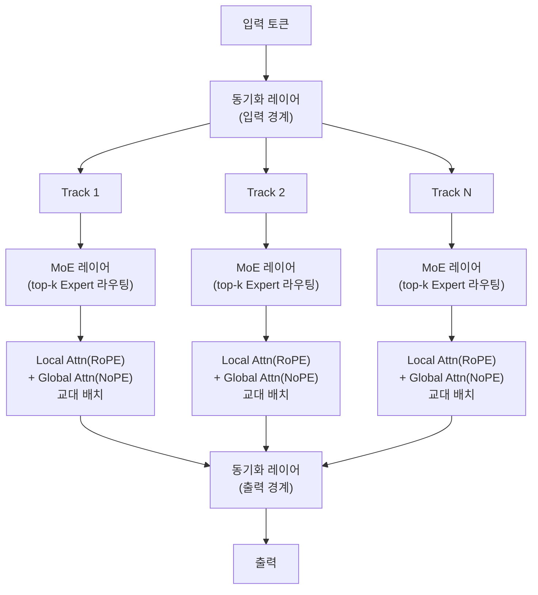
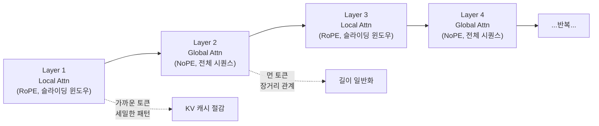
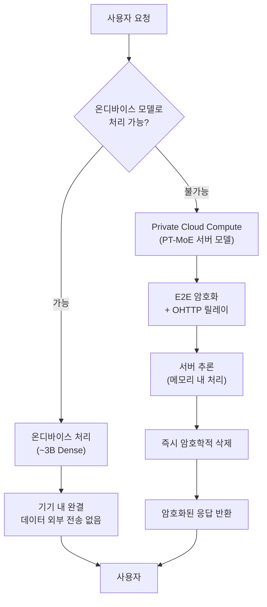
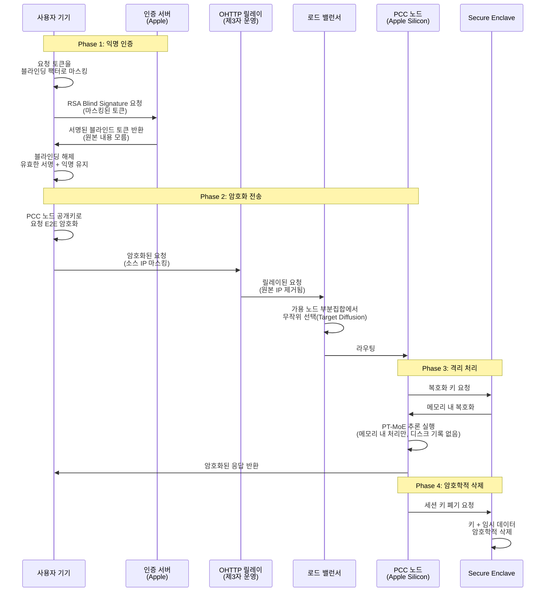
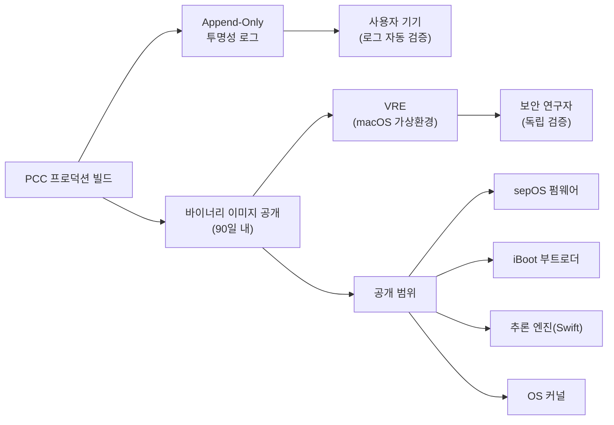
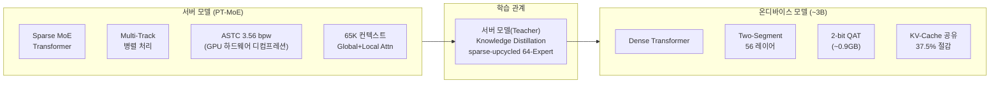

# 04. 서버 모델과 Private Cloud Compute

> Apple의 PT-MoE 서버 모델 아키텍처와 Private Cloud Compute의 보안 격리 컴퓨팅으로, 온디바이스 AI의 한계를 프라이버시를 지키며 확장하는 방법을 배웁니다.

## 개요

이 섹션에서는 Apple Intelligence의 "두 번째 두뇌"인 서버 모델과 그것을 안전하게 감싸는 Private Cloud Compute(PCC) 인프라를 깊이 있게 살펴봅니다. 앞서 [01. Apple Foundation Model 아키텍처](14-ch14-온디바이스-모델-아키텍처-이해/01-01-apple-foundation-model-아키텍처.md)에서 온디바이스 ~3B 모델의 구조를 배웠고, [02. KV-Cache 공유와 메모리 최적화](14-ch14-온디바이스-모델-아키텍처-이해/02-02-kv-cache-공유와-메모리-최적화.md)와 [03. 2-bit 양자화와 온디바이스 최적화](14-ch14-온디바이스-모델-아키텍처-이해/03-03-2-bit-양자화와-온디바이스-최적화.md)에서 그 모델을 작고 빠르게 만드는 기법들을 다뤘습니다. 이번에는 그 온디바이스 모델이 감당하기 어려운 복잡한 요청을 처리하는 서버 측 이야기입니다.

PCC의 개요와 5대 원칙의 "무엇(What)"은 이미 [04. Private Cloud Compute 아키텍처](01-ch1-apple-intelligence와-온디바이스-ai/04-04-private-cloud-compute-아키텍처.md)에서 다뤘습니다. 이번 세션은 **"어떻게(How)"**에 집중합니다 — PT-MoE의 구체적인 레이어 설계, ASTC 서버 양자화, 암호화 프로토콜의 기술적 구현, 그리고 개발자가 서버 라우팅을 고려한 코드를 작성하는 방법입니다.

**선수 지식**: 
- Ch14 이전 세션의 온디바이스 모델 아키텍처, KV-Cache, 양자화 개념
- Transformer 기본 구조(Attention, FFN)에 대한 이해
- [04. Private Cloud Compute 아키텍처](01-ch1-apple-intelligence와-온디바이스-ai/04-04-private-cloud-compute-아키텍처.md)에서 배운 PCC 5대 원칙 개요

**학습 목표**:
- PT-MoE(Parallel-Track Mixture of Experts) 서버 모델의 아키텍처와 레이어 구성을 설명할 수 있다
- ASTC 서버 양자화가 온디바이스 2-bit QAT와 어떻게 다른지 이해한다
- PCC의 암호화 프로토콜(RSA Blind Signature, OHTTP, ASTC)의 구현 수준 동작을 파악한다
- Foundation Models 프레임워크에서 서버 라우팅을 고려한 GuardRail 구성과 분기 코드를 작성할 수 있다

## 왜 알아야 할까?

여러분의 iPhone에는 ~3B 파라미터의 강력한 온디바이스 모델이 있습니다. 하지만 솔직히 말하면, 3B 모델로는 한계가 있죠. 65,000 토큰에 달하는 긴 문서를 요약하거나, 복잡한 코드를 분석하거나, 여러 도구를 동시에 호출하는 정교한 추론이 필요할 때 — 더 큰 두뇌가 필요합니다.

전통적인 클라우드 AI 서비스는 이 문제를 쉽게 풀지만, 대가가 큽니다. 여러분의 개인 데이터가 서버에 저장되고, 관리자가 접근할 수 있으며, 광고 타겟팅에 활용될 수도 있거든요. Apple은 "프라이버시를 포기하지 않으면서 클라우드 AI의 성능을 얻는 방법"이라는 난제에 도전했고, 그 답이 바로 Private Cloud Compute입니다.

iOS/macOS 개발자로서 이 아키텍처를 이해해야 하는 이유는 명확합니다. Foundation Models 프레임워크를 사용할 때, 여러분의 요청이 온디바이스에서 처리될지 서버로 갈지를 이해해야 적절한 UX를 설계할 수 있고, 사용자에게 프라이버시 보장을 자신 있게 설명할 수 있습니다.

## 핵심 개념

### 개념 1: PT-MoE 서버 모델 아키텍처

> 💡 **비유**: 큰 병원을 생각해보세요. 모든 환자를 한 명의 의사가 보는 게 아니라, 전문 분야별 의사팀(Track)이 있고, 각 팀 안에도 세부 전문가(Expert)가 있습니다. 환자(토큰)가 들어오면 접수처(라우터)가 가장 적합한 전문가에게 배정하죠. 모든 의사가 동시에 일하지 않아도 되니 효율적이고, 필요한 전문가만 투입되니 비용도 적습니다. 이것이 PT-MoE의 핵심 아이디어입니다.

Apple의 서버 모델은 **Parallel-Track Mixture of Experts(PT-MoE)** 라는 독자적인 Transformer 아키텍처를 사용합니다. 기존 MoE가 단일 경로에서 Expert를 선택하는 방식이라면, PT-MoE는 여러 개의 **독립적인 트랙(Track)**이 병렬로 토큰을 처리하고, 각 트랙 내부에 MoE 레이어를 배치하는 구조입니다.

> 📊 **그림 1**: PT-MoE 아키텍처의 레이어 구성



**PT-MoE의 3가지 핵심 설계 원칙:**

**1) Track Parallelism (트랙 병렬성)**: 모델을 여러 개의 작은 Transformer(트랙)로 분할합니다. 각 트랙은 독립적으로 토큰을 처리하며, 동기화는 트랙 블록의 입력과 출력 경계에서만 일어납니다. L개 레이어에 깊이 D인 트랙 블록이 있다면, 동기화 오버헤드가 기존 텐서 병렬리즘의 2L에서 L/D로 줄어듭니다. D=4이면 **87.5% 동기화 오버헤드 감소**입니다. 이 차이가 왜 중요할까요? 텐서 병렬리즘에서는 매 레이어마다 All-Reduce 통신이 필요하지만, PT-MoE는 4개 레이어를 묶은 트랙 블록 단위로만 동기화하므로, GPU 간 네트워크 대역폭 병목이 크게 줄어듭니다.

**2) Mixture of Experts (전문가 혼합)**: 각 트랙 블록 내부에 MoE 레이어가 있어, 입력 토큰마다 top-k 라우팅으로 가장 적합한 Expert 모듈에 배정됩니다. Apple의 교사(teacher) 모델은 64개의 Expert를 사용하며, 각 토큰은 이 중 소수의 Expert만 활성화합니다. 이 "sparse-upcycled" 방식으로 전체 파라미터 중 일부만 활성화되므로, 모델 용량은 크지만 추론 비용은 낮습니다. 특히 Apple은 이 64-Expert 교사 모델을 처음부터 학습시킨 것이 아니라, 기존 Dense 모델을 **sparse-upcycling**하여 만들었는데, 이 방법으로 교사 모델 학습 비용을 **90%나 절감**했습니다.

**3) Interleaved Global-Local Attention**: 슬라이딩 윈도우 로컬 어텐션(RoPE 포함)과 전역 어텐션(위치 임베딩 없음, NoPE)을 교대로 배치합니다. 로컬 어텐션은 가까운 토큰 간의 세밀한 패턴을 잡고, 전역 어텐션은 멀리 떨어진 토큰 간 관계를 파악합니다. NoPE(No Positional Embedding) 전역 어텐션의 핵심 장점은 학습 시 사용한 컨텍스트 길이를 넘어서도 **길이 일반화(length generalization)**가 가능하다는 것입니다. 이 설계 덕분에 65K 토큰까지의 긴 컨텍스트에서도 성능 저하 없이 동작하며, 로컬 어텐션이 KV 캐시 크기를 줄여 메모리 효율도 높아집니다.

> 📊 **그림 2**: Interleaved Attention 레이어 패턴



### 서버 모델의 ASTC 양자화

온디바이스 모델이 2-bit QAT로 ~0.9GB까지 압축되는 반면, 서버 모델은 **ASTC(Adaptive Scalable Texture Compression) 3.56 bpw(bits per weight)** 방식을 사용합니다. 이름에서 알 수 있듯이, 원래 GPU 텍스처 압축을 위해 설계된 포맷인데요 — Apple은 이것을 모델 가중치 압축에 창의적으로 재활용했습니다.

왜 GPU 텍스처 포맷을 쓸까요? Apple Silicon GPU에는 ASTC 하드웨어 디코더가 내장되어 있기 때문입니다. 소프트웨어로 디컴프레션할 필요 없이 GPU가 직접 압축된 가중치를 읽으면서 실시간으로 풀 수 있어, 메모리 대역폭과 저장 공간을 절약하면서도 디컴프레션 오버헤드가 거의 제로에 가깝습니다.

| 항목 | 온디바이스 (2-bit QAT) | 서버 (ASTC 3.56 bpw) |
|------|----------------------|---------------------|
| **압축률** | 극한 (2 bpw) | 중간 (3.56 bpw) |
| **디컴프레션** | CPU/소프트웨어 | GPU 하드웨어 (제로 오버헤드) |
| **품질 손실** | QAT로 학습 시 보상 | 최소 (높은 비트 할당) |
| **설계 목표** | 메모리 제약 기기에 탑재 | 서버 GPU 대역폭 최적화 |

> 💡 **알고 계셨나요?**: Apple의 온디바이스 모델은 서버 모델로부터 **지식 증류(Knowledge Distillation)**를 통해 학습됩니다. 정확히는 64-Expert MoE 모델을 교사로 사용하는데, 이 교사 모델을 "sparse-upcycled" 방식으로 만들어 교사 모델 학습 비용을 **90%나 줄였다**고 합니다. Dense 모델의 FFN(Feed-Forward Network) 가중치를 복제하여 여러 Expert로 초기화하고, 라우터만 새로 학습시키는 방식이죠. 큰 모델이 작은 모델의 선생님 역할을 하는 셈인데, 선생님 양성 비용까지 최적화한 것입니다.

### 개념 2: 온디바이스 ↔ 서버 라우팅

> 💡 **비유**: 동네 의원과 대학병원의 관계를 생각해보세요. 감기 같은 간단한 증상은 동네 의원(온디바이스)에서 처리하고, 정밀 검사가 필요한 복잡한 케이스만 대학병원(서버)으로 의뢰합니다. 중요한 건 — 대학병원에 갈 때도 진료 기록이 병원 밖으로 유출되지 않는다는 점이죠.

Apple Intelligence는 **"가능한 한 온디바이스, 필요할 때만 서버"** 원칙으로 동작합니다. 이 라우팅 결정은 시스템 수준에서 투명하게 이루어지며, Foundation Models 프레임워크가 자동으로 관리합니다.

> 📊 **그림 3**: 온디바이스 vs 서버 라우팅 결정 흐름



**라우팅 결정 기준:**

| 기준 | 온디바이스 | 서버 (PCC) |
|------|-----------|------------|
| 작업 복잡도 | 간단한 텍스트 생성, 요약 | 복잡한 추론, 긴 문서 분석 |
| 컨텍스트 길이 | 짧은 대화, 단문 | 65K 토큰까지의 긴 컨텍스트 |
| 멀티모달 | 제한적 비전 | 고해상도 이미지 분석(ViT-g) |
| 모델 가용성 | 모델 다운로드 완료 시 | 온디바이스 불가 시 폴백 |
| 네트워크 | 오프라인 가능 | 네트워크 필수 |

> ⚠️ **흔한 오해**: "Foundation Models 프레임워크로 서버 모델을 직접 선택해서 호출할 수 있다"고 생각하는 분들이 있습니다. 실제로는 **시스템이 자동으로 라우팅을 결정**합니다. 개발자는 `LanguageModelSession`을 통해 요청을 보내고, 온디바이스에서 처리할지 PCC로 보낼지는 Apple Intelligence 시스템이 작업 복잡도, 모델 가용성, 네트워크 상태 등을 종합적으로 판단합니다. 개발자가 제어할 수 있는 것은 `GuardRail` 설정을 통한 안전성 제약과, 가용성 확인을 통한 UX 분기입니다.

### 개념 3: PCC 암호화 프로토콜의 구현 수준 동작

PCC의 5대 보안 원칙(무상태, 강제 가능, 비특권, 비표적성, 검증 가능)은 [04. Private Cloud Compute 아키텍처](01-ch1-apple-intelligence와-온디바이스-ai/04-04-private-cloud-compute-아키텍처.md)에서 이미 다뤘으니, 여기서는 그 원칙들이 **기술적으로 어떻게 구현되는지** 프로토콜 수준에서 살펴봅시다.

> 💡 **비유**: 편지를 보낸다고 생각해보세요. 일반 우편은 우체국 직원이 내용을 볼 수 있지만, PCC는 세 겹의 보호막이 있습니다. 첫째, 편지를 수신자만 열 수 있는 금고에 넣고(E2E 암호화), 둘째, 보낸 사람 주소를 지운 채 중개인이 배달하며(OHTTP 릴레이), 셋째, 보낸 사람의 자격만 증명하되 신원은 숨깁니다(RSA Blind Signature).

> 📊 **그림 4**: PCC 요청의 전체 암호화 프로토콜 흐름



**프로토콜별 구현 상세:**

**RSA Blind Signature (비표적성 구현)**

일반적인 인증 토큰은 "누가 요청했는지"를 서버가 알 수 있습니다. RSA Blind Signature는 이 문제를 수학적으로 해결합니다. 사용자 기기가 요청 토큰에 **블라인딩 팩터(blinding factor)**를 곱하여 마스킹한 뒤 인증 서버에 보내면, 서버는 마스킹된 상태로 서명합니다. 기기는 서명을 받은 후 블라인딩을 해제하면 유효한 서명이 남지만, 인증 서버는 실제 요청 내용을 전혀 알지 못합니다. 결과적으로 "이 사용자는 Apple 기기의 정당한 사용자다"라는 자격만 증명되고, "어떤 사용자인지"는 수학적으로 추적이 불가능합니다.

**OHTTP Relay (네트워크 비표적성)**

Oblivious HTTP 릴레이는 **제3자가 운영**합니다. Apple이 아닌 독립적인 엔티티가 릴레이를 담당하므로, 두 가지 정보가 분리됩니다:
- **릴레이 운영자**: 소스 IP는 알지만 요청 내용은 모름 (E2E 암호화)
- **PCC 노드**: 요청 내용은 알지만 소스 IP는 모름 (릴레이가 제거)

이 분리 덕분에 어떤 단일 주체도 "누가 무엇을 요청했는지"를 완전히 알 수 없습니다.

**Target Diffusion (로드 밸런싱 비표적성)**

공격자가 특정 PCC 노드를 장악하더라도 특정 사용자의 데이터를 노릴 수 없도록, 로드 밸런서는 가용 노드의 **부분집합만 반환**합니다. 어떤 요청이 어떤 노드에서 처리될지 예측이 불가능하죠.

### 개념 4: PCC Virtual Research Environment(VRE)와 투명성 검증

PCC의 가장 혁신적인 측면 중 하나는 **검증 가능한 투명성(Verifiable Transparency)**입니다. Apple은 역사적으로 폐쇄적인 생태계로 유명했지만, PCC에서는 정반대의 전략을 택했습니다.

모든 PCC 프로덕션 빌드가 **append-only 투명성 로그**에 게시됩니다. 이 로그는 한번 기록되면 수정이나 삭제가 불가능한 구조여서, Apple이 과거 빌드를 은밀히 변경하는 것이 기술적으로 불가능합니다. 그리고 바이너리 이미지가 90일 내에 공개되는데, 여기서 놀라운 점은 **sepOS 펌웨어와 iBoot 부트로더까지 평문으로 공개**한다는 것입니다 — Apple 역사상 전례가 없는 일이었죠.

보안 연구자들은 macOS용 **PCC Virtual Research Environment(VRE)**에서 직접 검증할 수 있습니다. VRE는 PCC 노드의 실행 환경을 macOS 가상 머신으로 재현한 것으로, 연구자가 실제 프로덕션 코드를 로컬에서 분석하고 취약점을 찾을 수 있게 합니다.

> 📊 **그림 5**: PCC 투명성 검증 체계



특히 사용자 기기도 투명성 로그를 자동으로 검증합니다. PCC에 요청을 보내기 전에 기기가 해당 노드의 빌드가 투명성 로그에 등록되어 있는지 확인하고, 등록되지 않은 빌드의 노드에는 요청을 보내지 않습니다.

### 개념 5: 하드웨어 보안 스택과 Swift 추론 엔진

PCC 노드는 사실상 서버 랙에 들어간 거대한 iPhone입니다. Apple Silicon 서버 칩에 동일한 보안 기술이 적용됩니다:

```swift
// PCC 하드웨어 보안 스택을 구조체로 모델링
struct PCCSecurityStack {
    // 하드웨어 계층
    struct Hardware {
        let chip = "Apple Silicon (서버용)"
        let secureEnclave = true  // 암호화 키 관리, 매 재부팅마다 키 재생성
        let secureBoot = true     // 서명된 OS만 부팅, 변조 시 부팅 거부
        let pointerAuth = true    // PAC: 메모리 공격 방어
    }
    
    // OS 계층 — iOS/macOS의 경량 서브셋
    struct OperatingSystem {
        let base = "iOS/macOS 경량 서브셋"
        let signedSystemVolume = true        // 코드/모델 무결성 보장
        let trustedExecutionMonitor = true   // TEM: 서명된 코드만 실행 허용
        let noRemoteShell = true             // SSH 등 원격 접근 완전 차단
        let noInteractiveDebugger = true     // lldb 등 디버거 없음
        let noGeneralLogging = true          // 사용자 데이터 포함 로그 불가
        let structuredMetricsOnly = true     // 사전 정의 메트릭만 외부 전송
    }
    
    // 네트워크 계층
    struct Network {
        let e2eEncryption = true        // 디바이스 → PCC 노드 직접 암호화
        let ohttpRelay = true           // 제3자 운영, IP 마스킹
        let rsaBlindSignature = true    // 익명 인증, 사용자 추적 불가
        let targetDiffusion = true      // 노드 부분집합 라우팅
    }
    
    // 코드 안전성 — 추론 엔진이 Swift로 작성된 이유
    struct CodeSafety {
        let inferenceLanguage = "Swift"     // 메모리 안전 언어
        // C/C++ 대비 방지되는 공격:
        // - Buffer overflow
        // - Use-after-free
        // - Type confusion
        let sandboxing = true               // 프로세스 격리
        let codeSigningRequired = true      // 모든 실행 코드 서명 필수
    }
}
```

추론 레이어가 **Swift로 작성**되어 있다는 점이 주목할 만합니다. 대부분의 AI 프레임워크가 C/C++/CUDA 기반인데, Apple이 Swift를 선택한 것은 메모리 안전성(buffer overflow, use-after-free, type confusion 등)을 언어 수준에서 방지하기 위해서입니다. PCC 노드에서는 원격 디버깅이 불가능하므로, 런타임에 메모리 취약점이 발견되더라도 패치할 수 없습니다 — 따라서 취약점 자체가 발생하지 않도록 언어 선택부터 방어한 것이죠.

### 온디바이스 vs 서버 모델 성능 비교

두 모델의 차이를 한눈에 비교해봅시다:

> 📊 **그림 6**: 온디바이스 모델 vs 서버 모델 아키텍처 비교



| 항목 | 온디바이스 (~3B) | 서버 (PT-MoE) |
|------|-----------------|--------------|
| **아키텍처** | Dense Transformer | Sparse MoE + Track Parallelism |
| **파라미터** | ~3.18B (전체 활성) | 대규모 (일부만 활성) |
| **컨텍스트** | 제한적 | 65K 토큰 |
| **양자화** | 2-bit QAT (~0.9GB) | ASTC 3.56 bpw (GPU 하드웨어 디컴프레션) |
| **비전** | 제한적 | ViT-g (1B 파라미터) |
| **어텐션** | GQA + Two-Segment | Interleaved Global(NoPE)/Local(RoPE) |
| **학습 데이터** | 증류 기반 | 14T 텍스트 + 6B 이미지-텍스트 |
| **프라이버시** | 완전 로컬 | PCC 보호 |
| **오프라인** | 가능 | 불가능 |

## 실습: 직접 해보기

서버 라우팅을 고려한 코드 패턴을 작성해봅시다. `LanguageModelSession` 기본 사용법은 [01. Apple Foundation Model 아키텍처](14-ch14-온디바이스-모델-아키텍처-이해/01-01-apple-foundation-model-아키텍처.md)에서 다뤘으니, 여기서는 **서버 모델 특화 관심사** — GuardRail 구성, 네트워크 상태 기반 분기, 라우팅 인지 UX — 에 집중합니다.

### 실습 1: GuardRail 구성과 서버 라우팅 인지 서비스

서버로 요청이 라우팅될 때는 네트워크 레이턴시, 오프라인 폴백, 안전성 가드레일을 고려해야 합니다:

```swift
import FoundationModels
import Foundation

/// 서버 라우팅을 인지하는 AI 서비스
/// — 온디바이스/서버 차이에 따른 UX 분기에 집중
@Observable
final class ServerAwareAIService {
    var routingInfo: RoutingInfo = .unknown
    var isProcessing = false
    
    /// 라우팅 상태 — 사용자에게 투명하게 표시
    enum RoutingInfo: CustomStringConvertible {
        case unknown
        case localOnly           // 오프라인, 온디바이스만 가능
        case fullCapability      // 온라인, 필요시 서버 사용 가능
        case degraded(String)    // 모델 미준비 등
        
        var description: String {
            switch self {
            case .unknown: return "확인 중..."
            case .localOnly: return "오프라인 모드 (기기 내 처리)"
            case .fullCapability: return "전체 기능 사용 가능"
            case .degraded(let reason): return "제한 모드: \(reason)"
            }
        }
    }
    
    /// 모델 + 네트워크 상태를 종합하여 라우팅 정보 갱신
    func updateRoutingInfo() async {
        let availability = SystemLanguageModel.default.availability
        
        guard case .available = availability else {
            routingInfo = .degraded("모델 준비 중")
            return
        }
        
        // 네트워크 가용성에 따른 분기
        // 실제로는 NWPathMonitor 등으로 확인
        let hasNetwork = await checkNetworkAvailability()
        routingInfo = hasNetwork ? .fullCapability : .localOnly
    }
    
    /// 요청 복잡도에 따른 GuardRail 구성
    /// — 서버로 갈 가능성이 높은 요청에 더 엄격한 가드레일 적용
    func processWithGuardRails(
        prompt: String,
        instructions: String,
        complexity: RequestComplexity
    ) async throws -> String {
        isProcessing = true
        defer { isProcessing = false }
        
        // GuardRail 구성 — 서버 전송 시 추가 안전 계층
        let session: LanguageModelSession
        
        switch complexity {
        case .simple:
            // 온디바이스 처리 가능성 높음
            // 기본 GuardRail로 충분
            session = LanguageModelSession(
                instructions: instructions
            )
            
        case .complex:
            // 서버 라우팅 가능성 높음
            // 오프라인 시 사용자에게 제한 안내
            if case .localOnly = routingInfo {
                return "현재 오프라인 상태입니다. "
                    + "이 요청은 서버 처리가 필요할 수 있어 "
                    + "결과 품질이 제한될 수 있습니다."
            }
            
            session = LanguageModelSession(
                instructions: """
                \(instructions)
                
                안전 지침: 개인 식별 정보를 생성하지 마세요.
                응답에 외부 URL이나 실행 코드를 포함하지 마세요.
                """
            )
            
        case .multimodal:
            // 이미지 분석 — 서버 ViT-g 필요
            guard case .fullCapability = routingInfo else {
                return "이미지 분석에는 네트워크 연결이 필요합니다."
            }
            
            session = LanguageModelSession(
                instructions: instructions
            )
        }
        
        let response = try await session.respond(to: prompt)
        return response.content
    }
    
    enum RequestComplexity {
        case simple       // 단문 생성 — 온디바이스 가능성 높음
        case complex      // 긴 컨텍스트/멀티툴 — 서버 가능성 높음
        case multimodal   // 이미지 분석 — 서버 ViT-g 필요
    }
    
    private func checkNetworkAvailability() async -> Bool {
        // 실제 구현에서는 NWPathMonitor 사용
        // 여기서는 간략화
        return true
    }
}
```

### 실습 2: 프라이버시 보장 정보 표시 뷰

사용자에게 AI 처리의 프라이버시 보장을 투명하게 안내하는 UI를 만들어봅시다. [04. Private Cloud Compute 아키텍처](01-ch1-apple-intelligence와-온디바이스-ai/04-04-private-cloud-compute-아키텍처.md)에서 배운 5대 원칙을 사용자 친화적으로 표현합니다:

```swift
import SwiftUI

/// PCC 프라이버시 보장을 사용자에게 투명하게 안내하는 뷰
struct PrivacyBadgeView: View {
    let routingInfo: ServerAwareAIService.RoutingInfo
    
    var body: some View {
        HStack(spacing: 8) {
            Image(systemName: iconName)
                .foregroundStyle(iconColor)
            Text(label)
                .font(.caption)
                .foregroundStyle(.secondary)
        }
        .padding(.horizontal, 12)
        .padding(.vertical, 6)
        .background(.ultraThinMaterial)
        .clipShape(Capsule())
        .help(detailedExplanation)  // 툴팁으로 상세 설명
    }
    
    private var iconName: String {
        switch routingInfo {
        case .localOnly: return "iphone"
        case .fullCapability: return "lock.icloud"
        default: return "questionmark.circle"
        }
    }
    
    private var iconColor: Color {
        switch routingInfo {
        case .localOnly: return .green
        case .fullCapability: return .blue
        default: return .gray
        }
    }
    
    private var label: String {
        switch routingInfo {
        case .localOnly: return "기기에서 처리"
        case .fullCapability: return "Apple Intelligence"
        default: return "확인 중"
        }
    }
    
    /// PCC 5대 원칙 기반 상세 설명
    private var detailedExplanation: String {
        switch routingInfo {
        case .localOnly:
            return "데이터가 기기를 떠나지 않습니다. 오프라인에서도 동작합니다."
        case .fullCapability:
            return """
            서버 처리 시에도 프라이버시가 보호됩니다:
            • 종단간 암호화 전송 (E2E)
            • 처리 후 즉시 암호학적 삭제 (무상태)
            • Apple 직원 포함 누구도 접근 불가 (비특권)
            • 특정 사용자 표적 공격 불가 (비표적성)
            • 독립 보안 연구자 검증 가능 (투명성)
            """
        default:
            return "AI 처리를 준비하고 있습니다."
        }
    }
}
```

### 실습 3: 서버 라우팅 가능성 분석기

```run:swift
// 요청 특성을 분석하여 온디바이스/서버 라우팅 가능성을 판단하는 유틸리티
// 실제 라우팅은 시스템이 결정하지만, UX 설계 시 참고할 수 있는 휴리스틱

struct RoutingHeuristic {
    /// 요청 특성으로 예상 처리 경로를 분석
    static func analyze(
        promptTokens: Int,
        requiresVision: Bool,
        toolCount: Int,
        contextTurns: Int
    ) -> String {
        var serverFactors: [String] = []
        var score = 0
        
        // 65K 토큰 컨텍스트는 서버 PT-MoE 전용 영역
        if promptTokens > 4000 {
            score += 3
            serverFactors.append("긴 컨텍스트(\(promptTokens) 토큰)")
        } else if promptTokens > 1000 {
            score += 1
        }
        
        // 고해상도 이미지 분석은 서버 ViT-g (1B 파라미터)
        if requiresVision {
            score += 2
            serverFactors.append("이미지 분석(서버 ViT-g)")
        }
        
        // 복수 Tool 동시 호출은 서버 유리
        if toolCount > 2 {
            score += 2
            serverFactors.append("복수 Tool(\(toolCount)개)")
        }
        
        // 긴 멀티턴 대화 → 서버 컨텍스트 활용
        if contextTurns > 10 {
            score += 2
            serverFactors.append("멀티턴(\(contextTurns)턴)")
        }
        
        let path: String
        let uxAdvice: String
        
        if score >= 4 {
            path = "서버(PCC) 가능성 높음"
            uxAdvice = "네트워크 상태 확인 필수, 오프라인 폴백 안내 표시"
        } else if score >= 2 {
            path = "온디바이스/서버 혼합"
            uxAdvice = "정상 동작, 네트워크 없어도 기본 기능 가능"
        } else {
            path = "온디바이스 가능성 높음"
            uxAdvice = "오프라인에서도 정상 동작 예상"
        }
        
        let factors = serverFactors.isEmpty ? "없음" : serverFactors.joined(separator: ", ")
        return "\(path) | 서버 요인: \(factors) | UX: \(uxAdvice)"
    }
}

print("=== 라우팅 가능성 분석 ===\n")

print("시나리오 1 — 짧은 텍스트 생성:")
print(RoutingHeuristic.analyze(
    promptTokens: 200, requiresVision: false, toolCount: 0, contextTurns: 1
))

print("\n시나리오 2 — 이미지 설명 요청:")
print(RoutingHeuristic.analyze(
    promptTokens: 500, requiresVision: true, toolCount: 0, contextTurns: 2
))

print("\n시나리오 3 — 긴 문서 + 멀티툴 분석:")
print(RoutingHeuristic.analyze(
    promptTokens: 12000, requiresVision: true, toolCount: 4, contextTurns: 20
))
```

```output
=== 라우팅 가능성 분석 ===

시나리오 1 — 짧은 텍스트 생성:
온디바이스 가능성 높음 | 서버 요인: 없음 | UX: 오프라인에서도 정상 동작 예상

시나리오 2 — 이미지 설명 요청:
온디바이스/서버 혼합 | 서버 요인: 이미지 분석(서버 ViT-g) | UX: 정상 동작, 네트워크 없어도 기본 기능 가능

시나리오 3 — 긴 문서 + 멀티툴 분석:
서버(PCC) 가능성 높음 | 서버 요인: 긴 컨텍스트(12000 토큰), 이미지 분석(서버 ViT-g), 복수 Tool(4개), 멀티턴(20턴) | UX: 네트워크 상태 확인 필수, 오프라인 폴백 안내 표시
```

## 더 깊이 알아보기

### PCC 탄생의 비하인드 스토리

Private Cloud Compute의 개발은 Apple 내부에서 오랫동안 논의된 "클라우드 AI의 딜레마"에서 시작되었습니다. 2023년 즈음, AI 기능 경쟁이 치열해지면서 Apple도 서버 기반 AI가 필요하다는 것은 명확했지만, Apple의 DNA인 프라이버시를 포기할 수는 없었죠.

Craig Federighi가 WWDC에서 PCC를 발표할 때 "기존의 어떤 클라우드 서비스와도 근본적으로 다르다"고 강조한 이유가 있습니다. 전통적인 Confidential Computing은 하드웨어 TEE(Trusted Execution Environment)에 의존하지만, Apple은 자체 실리콘의 Secure Enclave부터 OS, 네트워크 프로토콜까지 **전 스택을 직접 설계**했기 때문입니다.

### Mixture of Experts의 역사

MoE 아이디어 자체는 1991년 Robert Jacobs, Michael Jordan 등이 발표한 "Adaptive Mixtures of Local Experts" 논문으로 거슬러 올라갑니다. 30년 넘은 아이디어가 현대 AI에서 부활한 셈이죠. 현대적인 Sparse MoE가 Transformer에 본격 적용된 것은 2021~2022년 Google의 Switch Transformer와 GLaM을 통해서였습니다. Apple의 PT-MoE는 여기에 **트랙 병렬리즘**이라는 독자적인 차원을 추가하여, 서버에서의 저지연 추론에 최적화한 아키텍처입니다. 기존 MoE의 Expert 라우팅 불균형(일부 Expert에 토큰이 몰리는) 문제를 트랙 분할로 자연스럽게 완화한 것도 PT-MoE만의 장점입니다.

## 흔한 오해와 팁

> ⚠️ **흔한 오해**: "PCC는 결국 Apple 서버에 데이터를 보내는 거니까 OpenAI API와 비슷한 것 아닌가?"라고 생각할 수 있습니다. 근본적으로 다릅니다. OpenAI 등 일반 클라우드 AI는 관리자 접근, 데이터 로깅, 모델 학습 재활용이 가능한 구조입니다. PCC는 하드웨어 수준(Secure Enclave)에서 데이터 격리를 강제하고, 원격 접근 자체가 불가능하며, 처리 후 암호학적으로 삭제됩니다. "신뢰(trust)" 기반이 아니라 "검증(verify)" 기반입니다.

> 💡 **알고 계셨나요?**: PCC 노드 간 통신에서 사용하는 OHTTP(Oblivious HTTP) 릴레이는 **제3자가 운영**합니다. 즉, Apple이 직접 운영하는 것이 아니라 독립적인 엔티티가 릴레이를 담당하여, Apple조차 요청의 출처 IP를 알 수 없는 이중 보호를 구현합니다. 이것은 Tor 네트워크의 양파 라우팅과 유사한 개념이지만, 실시간 AI 추론에 적합하도록 최적화된 것이죠.

> 🔥 **실무 팁**: Foundation Models 프레임워크를 사용할 때, 오프라인 환경에서의 폴백 전략을 반드시 설계하세요. 온디바이스 모델은 오프라인에서 동작하지만, 복잡한 요청이 서버로 라우팅되어야 할 때 네트워크가 없으면 품질이 떨어지거나 실패할 수 있습니다. `SystemLanguageModel.default.availability`를 주기적으로 확인하고, 네트워크 상태에 따라 UI에서 사용자 기대치를 적절히 관리하는 것이 좋은 UX 패턴입니다.

> 🔥 **실무 팁**: PT-MoE 서버 모델이 65K 토큰 컨텍스트를 지원한다고 해서, 항상 긴 프롬프트를 보내는 것이 좋은 전략은 아닙니다. 프롬프트가 길어지면 서버 처리 가능성이 높아지고, 이는 네트워크 의존도 증가와 레이턴시 상승을 의미합니다. [02. 시스템 프롬프트/Instructions 설계](04-ch4-프롬프트-엔지니어링-실전/02-02-시스템-프롬프트instructions-설계.md)에서 배운 것처럼, 간결하고 효과적인 프롬프트가 온디바이스 처리 가능성을 높이고 사용자 경험을 개선합니다.

## 핵심 정리

| 개념 | 설명 |
|------|------|
| **PT-MoE** | Parallel-Track MoE. 복수 트랙이 병렬 처리, 각 트랙 내 Expert 라우팅으로 서버 추론 최적화 |
| **Track Parallelism** | 동기화를 트랙 블록 경계에서만 수행, D=4일 때 87.5% 오버헤드 감소 |
| **Interleaved Attention** | Local(RoPE) + Global(NoPE) 교대 배치, 65K 토큰 길이 일반화 |
| **ASTC 3.56 bpw** | GPU 하드웨어 디컴프레션 활용 서버 양자화, 디컴프레션 오버헤드 제로 |
| **라우팅 결정** | 시스템 자동 판단. 작업 복잡도, 컨텍스트 길이, 모델 가용성 기반 |
| **RSA Blind Signature** | 자격만 증명하고 신원은 수학적으로 추적 불가능한 익명 인증 |
| **OHTTP Relay** | 제3자 운영, 소스 IP와 요청 내용을 분리하여 이중 보호 |
| **Target Diffusion** | 가용 노드 부분집합만 반환, 특정 노드 표적 공격 방지 |
| **VRE** | PCC 가상 연구 환경, 보안 연구자가 프로덕션 코드를 직접 검증 |
| **Secure Enclave** | 재부팅마다 키 재생성, 이전 데이터 물리적 복구 불가 |
| **Knowledge Distillation** | 서버 모델(교사) → 온디바이스 모델(학생), 90% 교사 비용 절감 |

## 다음 섹션 미리보기

다음 섹션 [05. 멀티모달과 다국어 지원](14-ch14-온디바이스-모델-아키텍처-이해/05-05-멀티모달과-다국어-지원.md)에서는 Apple Foundation Model이 텍스트를 넘어 **이미지를 이해**하는 방법과, 한국어를 포함한 **다국어를 지원**하는 메커니즘을 다룹니다. 서버 모델의 ViT-g 비전 인코더가 어떻게 이미지를 토큰으로 변환하는지, 그리고 153K 크기의 다국어 어휘가 어떻게 설계되었는지를 배우게 됩니다. 이번 세션에서 배운 온디바이스/서버 모델의 차이가 멀티모달 처리에서 어떤 역할을 하는지 직접 확인해보세요.

## 참고 자료

- [Private Cloud Compute: A new frontier for AI privacy in the cloud — Apple Security Research](https://security.apple.com/blog/private-cloud-compute/) - PCC의 아키텍처, 5대 보안 원칙, 암호화 프로토콜을 공식 설명하는 핵심 문서
- [Apple Intelligence Foundation Language Models: Tech Report 2025 — arXiv](https://arxiv.org/abs/2507.13575) - PT-MoE 아키텍처, 학습 데이터, 성능 벤치마크를 담은 Apple의 공식 기술 보고서
- [Updates to Apple's On-Device and Server Foundation Language Models — Apple ML Research](https://machinelearning.apple.com/research/apple-foundation-models-2025-updates) - 2025년 업데이트된 서버 모델의 Track Parallelism, MoE, Interleaved Attention 상세 설명
- [Security research on Private Cloud Compute — Apple Security Research](https://security.apple.com/blog/pcc-security-research/) - PCC Virtual Research Environment(VRE) 사용법과 보안 연구 가이드
- [Private Cloud Compute Documentation — Apple](https://security.apple.com/documentation/private-cloud-compute/) - PCC 기술 문서와 투명성 로그 접근 방법
- [Deep dive into the Foundation Models framework — WWDC25](https://developer.apple.com/videos/play/wwdc2025/301/) - Foundation Models의 서버 라우팅과 세션 관리를 다루는 WWDC 세션

---
### 🔗 Related Sessions
- [2-bit qat](01-ch1-apple-intelligence와-온디바이스-ai/03-03-온디바이스-ai의-장점과-한계.md) (prerequisite)
