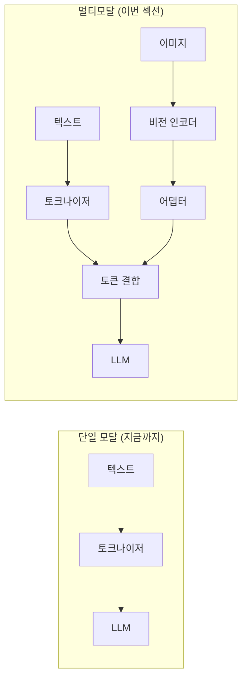
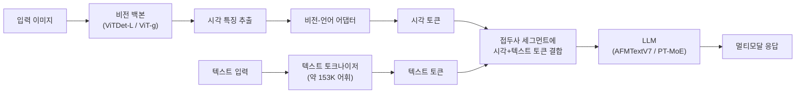
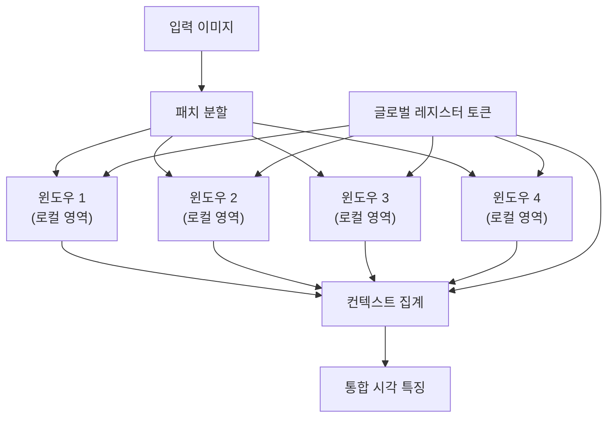
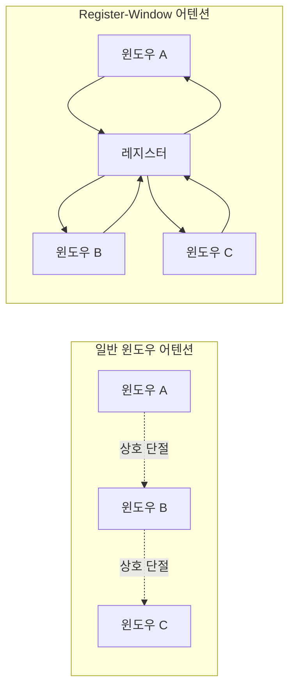
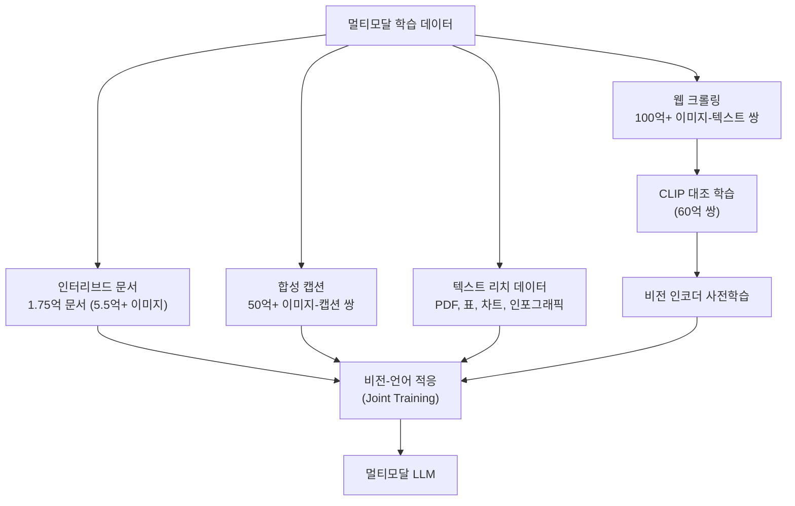
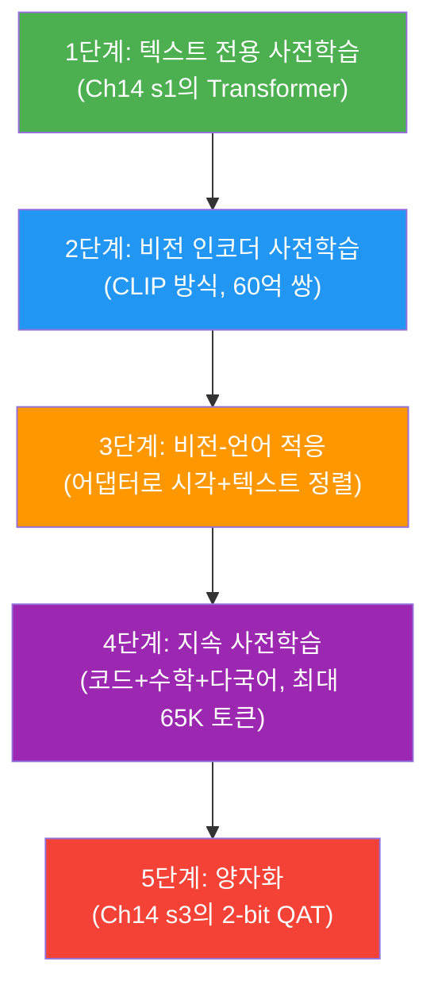
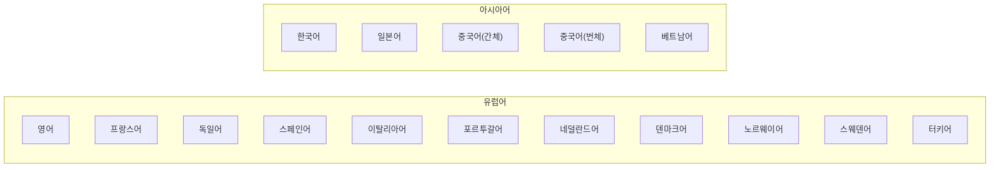
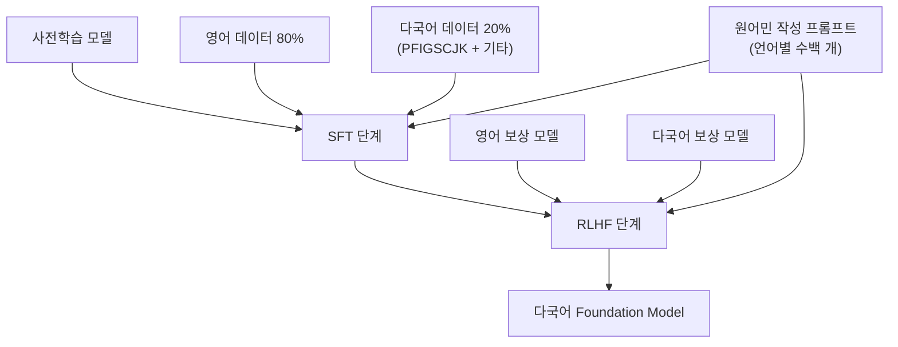
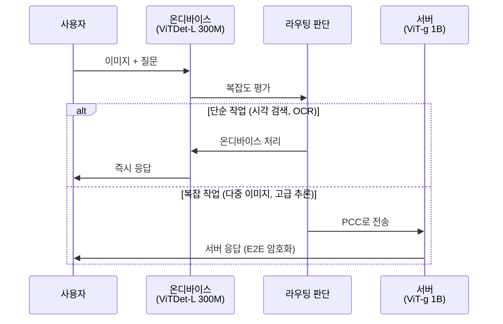
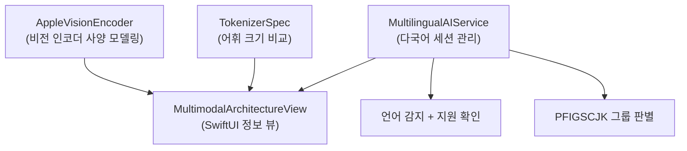

# 멀티모달과 다국어 지원

> Apple 온디바이스/서버 Foundation Model의 이미지 이해(멀티모달) 아키텍처와 16개 언어 지원 메커니즘을 깊이 탐구합니다.

## 개요

이 섹션에서는 Apple Foundation Model이 텍스트를 넘어 **이미지를 이해**하는 멀티모달 능력과, **16개 언어**를 지원하기 위한 어휘 설계 및 학습 전략을 살펴봅니다.

지금까지의 여정을 잠깐 돌아볼까요? Ch14 첫 번째 섹션에서 모델의 전체 뼈대(Transformer + Two-Segment 구조)를 조감도로 살펴봤고, 이어서 KV-Cache 공유로 메모리를 아끼는 법, 2-bit QAT로 모델을 경량화하는 법, 그리고 서버 확장(PT-MoE + PCC)까지 단계별로 깊이를 더해왔습니다. 이번 섹션은 그 마지막 퍼즐 조각 — 모델이 **무엇을 보고**, **어떤 언어로 말하는지**에 대한 이야기입니다.

난이도가 한 단계 올라가지만, 걱정하지 마세요. 이전 세션에서 익힌 개념들이 다리 역할을 해줄 겁니다. 특히 Two-Segment 구조에서 배운 "접두사 + 생성 세그먼트" 개념이 멀티모달에서도 그대로 적용되거든요.

**선수 지식**:
- [Apple Foundation Model 아키텍처](14-ch14-온디바이스-모델-아키텍처-이해/01-01-apple-foundation-model-아키텍처.md)의 Two-Segment 구조 — 시각 토큰이 접두사 세그먼트에 들어갑니다
- [모델 경량화와 2-bit QAT](14-ch14-온디바이스-모델-아키텍처-이해/03-03-모델-경량화와-2-bit-qat.md)의 양자화 개념 — 비전 인코더도 압축됩니다
- [서버 모델과 Private Cloud Compute](14-ch14-온디바이스-모델-아키텍처-이해/04-04-서버-모델과-private-cloud-compute.md)의 온디바이스/서버 라우팅

**학습 목표**:
- 비전 인코더가 이미지를 LLM이 이해하는 토큰으로 변환하는 기본 원리를 이해한다
- 온디바이스(ViTDet-L)와 서버(ViT-g) 비전 인코더의 구조와 차이를 설명할 수 있다
- Register-Window 메커니즘의 동작 원리를 이해한다
- 약 153K(153,600) 다국어 어휘 설계와 학습 전략(SFT/RLHF 80:20)을 파악한다
- PFIGSCJK 평가 체계와 다국어 성능 특성을 이해한다
- 멀티모달 + 다국어 기능이 실제 앱에서 어떻게 활용되는지 코드로 확인한다

## 왜 알아야 할까?

여러분의 앱 사용자는 **텍스트만 입력하지 않습니다**. 사진을 찍어서 "이게 뭐야?"라고 묻고, 영수증 사진으로 가계부를 정리하고, 한국어로 질문하면 한국어로 답을 기대하죠. Apple Intelligence가 Visual Intelligence로 카메라에 비친 레스토랑 정보를 알려주고, 캘린더에 전단지 속 일정을 자동 추가하는 것 — 이 모든 것이 멀티모달과 다국어 지원 아키텍처 위에서 동작합니다.

조금 더 구체적으로 생각해볼까요? 지금까지 배운 것과 연결해보면:

- **Two-Segment 구조**에서 "접두사 세그먼트"에 텍스트뿐 아니라 **이미지 토큰**도 들어갑니다. 비전 인코더는 이 이미지 토큰을 만드는 장치예요.
- **2-bit QAT**로 압축한 온디바이스 모델 위에서 비전 인코더도 함께 경량화됩니다.
- **서버 라우팅**에서 복잡한 이미지 분석 요청이 PCC로 넘어가는 이유도 서버 비전 인코더의 능력 차이 때문이죠.

iOS/macOS 개발자로서 이 아키텍처를 이해하면:
- **온디바이스 vs 서버** 어디서 이미지 처리가 일어나는지 예측할 수 있고
- **지원 언어별 성능 특성**을 고려한 UX를 설계할 수 있으며
- **Core ML 커스텀 모델과의 하이브리드** 전략을 세울 때 Apple 비전 인코더의 역할을 정확히 이해할 수 있습니다

## 핵심 개념

### 개념 0: 멀티모달이란? — 텍스트와 이미지의 만남

본격적인 아키텍처에 들어가기 전에, "멀티모달"이 정확히 무엇인지부터 짚고 갑시다.

> 💡 **비유**: 사람은 눈으로 보고, 귀로 듣고, 손으로 만지면서 세상을 이해합니다. 각각이 하나의 "모달리티(modality)"예요. AI에서 멀티모달이란 **텍스트, 이미지, 오디오 등 여러 종류의 입력을 동시에 이해**하는 능력입니다. 지금까지 배운 Foundation Model은 주로 "텍스트만" 처리했는데, 여기에 "눈"을 달아주는 것이 멀티모달 아키텍처입니다.

그런데 문제가 있습니다. LLM은 **토큰(숫자로 표현된 단어 조각)**을 입력으로 받는데, 이미지는 픽셀의 2D 배열이잖아요. 이 두 세계를 어떻게 연결할까요?

> 📊 **그림 1**: 단일 모달 vs 멀티모달 — 입력 타입의 확장



핵심은 **비전 인코더**와 **어댑터**라는 두 부품입니다:
1. **비전 인코더**: 이미지 → 시각 특징 벡터 (이미지의 "의미"를 숫자로 추출)
2. **어댑터**: 시각 특징 → LLM 토큰 형식으로 변환 (차원과 표현을 맞춰주는 브릿지)

이전 섹션의 Two-Segment 구조를 기억하시나요? 접두사 세그먼트에 시스템 프롬프트와 사용자 텍스트가 들어갔죠. 멀티모달에서는 **변환된 시각 토큰도 이 접두사 세그먼트에 함께** 들어갑니다. LLM 입장에서는 텍스트 토큰이든 시각 토큰이든 그냥 "입력 토큰의 나열"로 보이는 거예요.

이 기본 원리를 이해했다면, 이제 Apple이 구체적으로 어떤 비전 인코더를 선택했는지 살펴봅시다.

### 개념 1: 비전 인코더 — 모델에게 "눈"을 달아주다

> 💡 **비유**: 외국어 통역사를 떠올려보세요. 통역사는 상대방의 말(이미지)을 듣고, 우리가 이해할 수 있는 언어(토큰 임베딩)로 변환합니다. 비전 인코더가 바로 그 "시각 통역사"입니다. 이미지의 픽셀을 LLM이 이해하는 토큰 표현으로 번역해주는 거죠.

좀 더 구체적으로 볼게요. 비전 인코더가 하는 일을 단계별로 풀면:

1. **이미지를 작은 조각(패치)으로 자른다** — 예를 들어 224×224 이미지를 16×16 크기의 패치 196개로 나눔
2. **각 패치를 벡터로 변환한다** — 각 패치가 하나의 "시각 토큰"이 됨
3. **Transformer로 패치 간 관계를 학습한다** — 어떤 패치가 중요한지, 패치 사이의 연관성은 뭔지
4. **최종 시각 특징을 어댑터에 전달한다** — LLM 토큰과 같은 차원으로 변환

Apple의 멀티모달 아키텍처는 두 가지 핵심 구성요소로 이루어져 있습니다:

1. **비전 백본(Vision Backbone)**: 이미지에서 풍부한 시각 특징(feature)을 추출
2. **비전-언어 어댑터(Vision-Language Adapter)**: 추출된 시각 특징을 LLM의 토큰 표현과 정렬(align)

온디바이스와 서버 모델은 서로 다른 비전 백본을 사용합니다:

| 구분 | 온디바이스 | 서버 |
|------|-----------|------|
| **비전 백본** | ViTDet-L (300M 파라미터) | ViT-g (1B 파라미터) |
| **특징** | 경량, Register-Window 메커니즘 | 고정밀, 대규모 |
| **압축** | 2-bpw QAT (Ch14 s3에서 배운 방식) | 3.56-bpw ASTC |
| **용도** | 일상적 시각 검색, 문서 인식 | 복잡한 멀티모달 추론 |

> 📊 **그림 2**: 멀티모달 처리 파이프라인 — 이미지가 텍스트 토큰과 합쳐지는 과정



왜 온디바이스(300M)와 서버(1B)의 크기 차이가 3배 이상일까요? [모델 경량화와 2-bit QAT](14-ch14-온디바이스-모델-아키텍처-이해/03-03-모델-경량화와-2-bit-qat.md)에서 배운 것처럼, 온디바이스 환경에서는 메모리와 전력 예산이 제한적이기 때문입니다. 비전 인코더도 LLM 본체와 마찬가지로 이 예산 안에서 동작해야 하거든요.

비전 인코더의 학습은 **CLIP(Contrastive Language-Image Pre-training)** 방식의 대조 학습으로 이루어집니다. 60억 개 이상의 이미지-텍스트 쌍에서 "이 이미지와 이 텍스트는 같은 것을 설명한다"는 관계를 학습하는 거죠. 이 과정을 통해 비전 인코더는 이미지의 의미를 LLM이 이해할 수 있는 벡터 공간으로 사상(mapping)할 수 있게 됩니다.

```swift
import FoundationModels

// 멀티모달 처리는 Apple Intelligence 시스템 레벨에서 동작합니다.
// Foundation Models 프레임워크는 현재 텍스트 기반 API를 제공하며,
// 이미지 이해는 Visual Intelligence 등 시스템 서비스를 통해 활용됩니다.

// 모델 가용성 확인 — 멀티모달 기능 포함
let availability = SystemLanguageModel.default.availability

switch availability {
case .available:
    // 온디바이스 모델 사용 가능 (ViTDet-L 비전 인코더 포함)
    print("온디바이스 모델 준비 완료")
case .unavailable(let reason):
    // 서버 모델로 폴백 시 ViT-g 비전 인코더 사용
    print("온디바이스 불가: \(reason)")
@unknown default:
    break
}
```

### 개념 2: Register-Window 메커니즘 — 나무와 숲을 동시에 보다

이제 온디바이스 비전 인코더의 핵심 기술로 들어가겠습니다. 난이도가 살짝 올라가지만, 비유와 함께 차근차근 풀어볼게요.

먼저 배경 지식 하나. 일반적인 Vision Transformer(ViT)는 이미지 전체에 대해 **글로벌 어텐션**을 수행합니다. 모든 패치가 서로를 바라보는 거죠. 문제는? 이미지 크기가 커지면 계산량이 패치 수의 **제곱(`O(n²)`)**에 비례해서 폭발합니다. 스마트폰에서는 감당이 안 되죠.

해결책은 **윈도우 어텐션** — 이미지를 작은 영역(윈도우)으로 나눠서 각 윈도우 안에서만 어텐션을 수행하는 것입니다. 계산량은 확 줄지만, 윈도우 사이가 단절되어 **전체 맥락을 놓치는** 새로운 문제가 생깁니다.

> 💡 **비유**: 미술관에서 거대한 그림을 감상할 때를 생각해보세요. 가까이 가면 붓터치의 디테일(로컬)이 보이고, 멀리 서면 전체 구도(글로벌)가 보입니다. Register-Window는 이 두 시점을 **동시에** 캡처하는 메커니즘입니다. "글로벌 레지스터 토큰"이라는 특별한 관찰자가 각 로컬 윈도우를 돌아다니며 전체 맥락을 수집하는 거죠.

Apple은 온디바이스 모델의 ViTDet-L에 독자적인 **Register-Window(RW) 메커니즘**을 추가해서 이 딜레마를 해결했습니다.

> 📊 **그림 3**: Register-Window 메커니즘의 동작 원리



**동작 과정**을 단계별로 풀어보면:

1. 이미지를 여러 **로컬 윈도우**로 분할 — 각 윈도우는 이미지의 한 영역만 담당
2. **글로벌 레지스터 토큰**(특별한 학습 가능 벡터)이 각 윈도우와 어텐션을 수행 — 각 영역의 핵심 정보를 수집
3. 레지스터 토큰에 축적된 글로벌 정보가 다시 각 윈도우에 전파 — "옆 윈도우에 이런 게 있더라"
4. 최종적으로 **로컬 디테일 + 글로벌 맥락**이 통합된 시각 특징 생성

쉽게 말해, 레지스터 토큰은 **윈도우 사이를 떠돌아다니는 메신저**입니다. 각 윈도우는 자기 영역만 열심히 보되, 메신저가 "전체적으로는 이런 그림이야"라고 알려주는 거죠.

> 📊 **그림 4**: Register-Window vs 일반 윈도우 어텐션 비교



이 설계가 왜 중요할까요? 두 가지 이점이 있습니다:

- **효율성**: 일반적인 글로벌 어텐션이 `O(n²)`인 반면, Register-Window는 윈도우 수에 선형적인 오버헤드만 추가 → **온디바이스 환경에 이상적**
- **표현력**: 300M이라는 경량 모델로도 문서 속 표, 차트, 인포그래픽 같은 텍스트가 풍부한 이미지를 효과적으로 이해 가능

Ch14 s3에서 배운 2-bit QAT도 여기서 적용된다는 점을 기억하세요. 비전 인코더 자체도 압축되어 온디바이스에서 동작합니다.

```swift
/// 비전 인코더의 역할을 개념적으로 보여주는 구조체
/// (실제 Apple 내부 구현은 비공개이지만, 아키텍처 이해를 위한 모델링)
struct VisionEncoderSpec {
    let backbone: String          // "ViTDet-L" 또는 "ViT-g"
    let parameters: Int           // 파라미터 수
    let mechanism: String         // "Register-Window" 또는 "Standard"
    let patchSize: Int            // 이미지 패치 크기 (보통 14x14 또는 16x16)
    
    /// 온디바이스 비전 인코더 사양
    static let onDevice = VisionEncoderSpec(
        backbone: "ViTDet-L",
        parameters: 300_000_000,  // 3억 파라미터
        mechanism: "Register-Window",
        patchSize: 16
    )
    
    /// 서버 비전 인코더 사양
    static let server = VisionEncoderSpec(
        backbone: "ViT-g",
        parameters: 1_000_000_000, // 10억 파라미터
        mechanism: "Standard ViT",
        patchSize: 14
    )
    
    /// 이미지를 패치로 분할했을 때의 토큰 수 추정
    /// 예: 224x224 이미지, 패치 크기 16 → (224/16)² = 196 토큰
    func estimateTokenCount(imageSize: Int) -> Int {
        let patchesPerSide = imageSize / patchSize
        return patchesPerSide * patchesPerSide
    }
}
```

### 개념 3: 멀티모달 학습 데이터 — 100억 쌍의 시각-언어 정렬

비전 인코더의 구조를 이해했으니, 이제 "어떻게 학습하는지"를 알아봅시다. 좋은 통역사가 되려면 많은 대화를 경험해야 하듯, 비전 인코더도 엄청난 양의 이미지-텍스트 쌍으로 학습합니다.

> 📊 **그림 5**: 멀티모달 학습 데이터 구성



| 데이터 유형 | 규모 | 용도 |
|------------|------|------|
| 웹 이미지-텍스트 쌍 | 100억+ | 기본 시각-언어 정렬 |
| 인터리브드 문서 | 1.75억 문서 (5.5억+ 이미지) | 문맥 속 이미지 이해 |
| 합성 캡션 | 50억+ | 다양한 세밀도의 설명 학습 |
| 텍스트 리치 데이터 | 별도 큐레이션 | 표/차트/문서 이해 |

학습은 여러 단계로 나뉘는데, 각 단계가 이전 세션에서 배운 개념과 연결됩니다:

> 📊 **그림 6**: 멀티모달 학습 단계 — 이전 세션 개념과의 연결



1. **텍스트 전용 사전학습** — LLM의 언어 능력 확보 (Ch14 s1에서 배운 Transformer 아키텍처)
2. **비전 인코더 사전학습** — CLIP 방식으로 60억 쌍에서 시각 특징 학습
3. **비전-언어 적응** — 시각 특징을 LLM 토큰과 정렬 (텍스트 능력 훼손 없이!)
4. **지속 사전학습** — 코드, 수학, 다국어 포함, 최대 65K 토큰 시퀀스
5. **양자화** — Ch14 s3에서 배운 2-bit QAT로 온디바이스 배포

특히 3단계에서 "텍스트 능력을 훼손하지 않으면서" 멀티모달 적응을 수행하는 것이 기술적 핵심입니다. 이는 어댑터 레이어를 별도로 학습하고, LLM 본체의 가중치 변화를 최소화하는 전략으로 달성됩니다. 마치 통역사를 따로 고용하면서도 원래 팀원들의 업무에는 영향을 주지 않는 것과 같죠.

### 개념 4: 약 153K 다국어 어휘 — 16개 언어를 품다

이제 멀티모달에서 다국어로 주제를 전환합니다. LLM이 다양한 언어를 이해하려면 **토크나이저**(텍스트를 토큰으로 변환하는 장치)부터 다국어를 지원해야 합니다.

토크나이저가 뭔지 간단히 복습할까요? Ch14 s1에서 어휘(vocabulary)의 개념을 다뤘는데, 토크나이저는 텍스트를 이 어휘에 있는 토큰 단위로 쪼개는 역할입니다. 영어 "Hello"는 하나의 토큰이지만, 한국어 "안녕하세요"는 어휘에 포함되어 있지 않으면 "안", "녕", "하세", "요" 같은 서브워드로 쪼개질 수 있어요. 어휘에 한국어 서브워드가 많을수록 더 효율적으로 (더 적은 토큰으로) 한국어를 표현할 수 있습니다.

> 💡 **비유**: 영어만 아는 사전에 한국어, 일본어, 중국어 단어를 추가하는 걸 상상해보세요. 단순히 단어를 추가하면 사전이 너무 두꺼워집니다. Apple의 해법은 **공유 가능한 서브워드(subword)**를 영리하게 설계해서, 사전 크기를 약 50% 늘리면서도 16개 언어를 효과적으로 커버하는 것이었습니다.

Apple Foundation Model의 텍스트 토크나이저는 어휘(vocabulary) 크기를 **약 100K에서 약 153K(153,600)**로 확장했습니다. [Apple Foundation Model 아키텍처](14-ch14-온디바이스-모델-아키텍처-이해/01-01-apple-foundation-model-아키텍처.md)에서 살펴본 것처럼, 이 153,600이라는 숫자는 모델의 임베딩 테이블 크기를 직접 결정하는 핵심 하이퍼파라미터입니다. 약 50% 증가처럼 보이지만, 실제로는 비영어 텍스트의 토큰 표현 효율이 **25% 이상 개선**되는 효과를 가져왔습니다. 즉, 같은 한국어 문장을 더 적은 토큰으로 표현할 수 있게 된 거죠.

**지원 언어 16개:**

> 📊 **그림 7**: Apple Foundation Model 지원 언어 분포



**다국어 학습 전략**의 핵심은 세 가지입니다:

**1) SFT/RLHF 80:20 비율**
지도 미세조정(SFT)과 인간 피드백 강화학습(RLHF) 단계에서 영어와 다국어 데이터를 **80:20 비율**로 혼합합니다. 영어가 기반이지만, 20%의 다국어 데이터로 각 언어의 자연스러움을 확보합니다. 이 비율은 단순히 데이터를 섞는 것이 아니라, 영어 기반 능력의 훼손 없이 다국어 능력을 최대화하는 **최적점**으로 실험적으로 도출된 것입니다.

> 📊 **그림 8**: SFT/RLHF 다국어 학습 파이프라인



**2) 원어민 작성 프롬프트**
번역된 프롬프트는 부자연스럽다는 평가를 받았기 때문에, Apple은 각 지원 언어마다 **수백 개의 원어민 작성 프롬프트**를 별도 수집했습니다. 한국어 프롬프트는 한국어 원어민이 직접 작성한 것이죠.

**3) PFIGSCJK 평가 체계**
Apple은 다국어 성능을 체계적으로 측정하기 위해 **PFIGSCJK**라는 평가 언어 그룹을 정의했습니다:
- **P**ortuguês (포르투갈어)
- **F**rançais (프랑스어)
- **I**taliano (이탈리아어)
- **G**erman (독일어)
- **S**panish (스페인어)
- **C**hinese (중국어)
- **J**apanese (일본어)
- **K**orean (한국어)

이 8개 언어는 유럽 로마자 계열, CJK(한중일) 계열을 모두 포함하여 다국어 모델의 **균형 잡힌 성능 평가**를 가능하게 합니다. Apple의 벤치마크에서 온디바이스 모델은 PFIGSCJK **전 언어에서 Qwen-2.5-3B를 상회**하는 성능을 기록했습니다.

```swift
/// 다국어 어휘 확장의 효과를 보여주는 구조체
struct TokenizerSpec {
    let vocabularySize: Int
    let version: String
    
    /// 이전 버전 (영어 중심)
    static let v1 = TokenizerSpec(vocabularySize: 100_000, version: "2024")
    
    /// 현재 버전 (다국어 확장 — 약 153K)
    static let v2 = TokenizerSpec(vocabularySize: 153_600, version: "2025")
    
    /// 언어별 토큰 효율 추정 (문자당 평균 토큰 수, 낮을수록 효율적)
    static let tokenEfficiency: [String: Double] = [
        "English": 0.25,    // ~4자 = 1토큰
        "한국어": 0.5,       // ~2자 = 1토큰 (153K 어휘 기준)
        "日本語": 0.45,      // 한자/히라가나 혼합
        "中文": 0.55,        // 한자 단위
        "Français": 0.28,
        "Deutsch": 0.30,
        "Español": 0.27
    ]
}
```

### 개념 5: 온디바이스 vs 서버 — 멀티모달 능력의 스펙트럼

마지막으로, 지금까지 배운 모든 것을 종합해봅시다. 어떤 작업이 온디바이스에서 처리되고, 어떤 작업이 서버로 넘어가는지 이해하는 것은 앱 성능 설계에 중요합니다. [서버 모델과 Private Cloud Compute](14-ch14-온디바이스-모델-아키텍처-이해/04-04-서버-모델과-private-cloud-compute.md)에서 배운 라우팅 메커니즘이 여기서도 동일하게 적용됩니다.

> 💡 **비유**: 동네 병원과 대학 병원의 관계와 비슷합니다. 감기처럼 간단한 건 동네 병원(온디바이스)에서 바로 처리하고, 정밀 검사가 필요한 건 대학 병원(서버)으로 의뢰하죠. 어디로 갈지 판단하는 "접수 데스크"가 라우팅 판단에 해당합니다.

> 📊 **그림 9**: 온디바이스와 서버의 멀티모달 처리 분담



| 처리 위치 | 비전 인코더 | 모델 압축 | 주요 활용 사례 |
|-----------|-----------|----------|--------------|
| **온디바이스** | ViTDet-L (300M) | 2-bpw QAT | 시각 검색, 문서 OCR, 사진 분석, 캘린더 이벤트 추출 |
| **서버 (PCC)** | ViT-g (1B) | 3.56-bpw ASTC | 복잡한 멀티모달 추론, 다중 이미지 비교, 고급 문서 분석 |

이 표에서 "2-bpw QAT"와 "3.56-bpw ASTC"는 Ch14 s3에서 자세히 다뤘던 양자화 방식입니다. 서버 모델이 3.56-bpw로 온디바이스(2-bpw)보다 높은 비트를 사용하는 이유는, 서버 환경에서는 메모리 여유가 있으므로 더 높은 정밀도를 유지할 수 있기 때문입니다.

Apple의 벤치마크에 따르면:
- **온디바이스 모델**은 Gemma-3-4B와 경쟁력 있는 성능을 보여줍니다
- **서버 모델**은 Qwen-2.5-VL 대비 **50% 미만의 FLOPS**로 동등 이상의 성능을 달성합니다
- PFIGSCJK 8개 언어 평가에서 온디바이스 모델이 Qwen-2.5-3B를 **전 언어에서 상회**합니다

## 실습: 직접 해보기

멀티모달 처리는 시스템 레벨에서 동작하지만, Foundation Models 프레임워크를 통해 **다국어 텍스트 생성**과 **이미지 관련 메타데이터 처리**를 직접 체험할 수 있습니다. 다음은 다국어 지원과 비전 인코더 사양을 활용하는 실전 코드입니다.

먼저 이 실습의 전체 구조를 파악해봅시다:

> 📊 **그림 10**: 실습 코드 구조 — 세 개의 핵심 모듈



```swift
import FoundationModels
import SwiftUI

// MARK: - 비전 인코더 사양 모델링

/// Apple 비전 인코더의 아키텍처를 코드로 표현
/// Two-Segment 구조(Ch14 s1)의 접두사 세그먼트에 시각 토큰을 공급하는 역할
struct AppleVisionEncoder {
    enum Tier: String, CaseIterable {
        case onDevice = "온디바이스"
        case server = "서버"
    }
    
    let tier: Tier
    let backbone: String
    let parameters: Int
    let compressionBPW: Double  // Ch14 s3의 양자화 수준
    
    /// 온디바이스 비전 인코더
    static let onDevice = AppleVisionEncoder(
        tier: .onDevice,
        backbone: "ViTDet-L + Register-Window",
        parameters: 300_000_000,
        compressionBPW: 2.0  // 2-bit QAT
    )
    
    /// 서버 비전 인코더
    static let server = AppleVisionEncoder(
        tier: .server,
        backbone: "ViT-g (Standard ViT)",
        parameters: 1_000_000_000,
        compressionBPW: 3.56  // ASTC
    )
    
    /// 파라미터 수를 읽기 쉬운 형태로 표시
    var formattedParams: String {
        if parameters >= 1_000_000_000 {
            return "\(parameters / 1_000_000_000)B"
        }
        return "\(parameters / 1_000_000)M"
    }
}

// MARK: - 다국어 세션 관리 서비스

/// 다국어 대응 AI 서비스
@Observable
final class MultilingualAIService {
    /// Apple Foundation Model이 지원하는 16개 언어
    static let supportedLanguages: [(code: String, name: String, region: String)] = [
        ("en", "English", "유럽"),
        ("fr", "Français", "유럽"),
        ("de", "Deutsch", "유럽"),
        ("es", "Español", "유럽"),
        ("it", "Italiano", "유럽"),
        ("pt", "Português", "유럽"),
        ("nl", "Nederlands", "유럽"),
        ("da", "Dansk", "유럽"),
        ("no", "Norsk", "유럽"),
        ("sv", "Svenska", "유럽"),
        ("tr", "Türkçe", "유럽"),
        ("ko", "한국어", "아시아"),
        ("ja", "日本語", "아시아"),
        ("zh-Hans", "简体中文", "아시아"),
        ("zh-Hant", "繁體中文", "아시아"),
        ("vi", "Tiếng Việt", "아시아")
    ]
    
    /// PFIGSCJK 평가 언어 그룹
    static let pfigscjkLanguages = ["pt", "fr", "it", "de", "es", "zh-Hans", "ja", "ko"]
    
    /// 토크나이저 어휘 크기 (약 153K)
    static let vocabularySize = 153_600
    
    private var session: LanguageModelSession?
    var currentLanguage: String = "ko"
    var isAvailable: Bool = false
    
    /// 모델 가용성 확인 후 세션 초기화
    func initialize() async {
        let availability = SystemLanguageModel.default.availability
        guard availability == .available else {
            isAvailable = false
            return
        }
        
        session = LanguageModelSession()
        isAvailable = true
    }
    
    /// 현재 기기 언어에 맞는 프롬프트로 응답 생성
    func generateLocalizedResponse(prompt: String) async throws -> String {
        guard let session else {
            throw AIServiceError.notInitialized
        }
        
        // 시스템 언어 감지하여 응답 언어 지정
        let locale = Locale.current
        let languageCode = locale.language.languageCode?.identifier ?? "en"
        
        // 해당 언어가 지원되는지 확인
        let isSupported = Self.supportedLanguages.contains { $0.code == languageCode }
        
        // 실무 팁: Instructions는 영어로, 응답 언어만 지정하는 것이 안정적
        // (SFT 학습 비율이 영어 80%이기 때문)
        let instructions = if isSupported {
            "Respond in \(languageCode). Be concise and helpful."
        } else {
            "Respond in English. Be concise and helpful."
        }
        
        let response = try await session.respond(
            to: prompt,
            instructions: Instructions(instructions)
        )
        
        return response.content
    }
    
    /// 해당 언어가 PFIGSCJK 평가 그룹인지 확인
    func isPFIGSCJK(_ languageCode: String) -> Bool {
        Self.pfigscjkLanguages.contains(languageCode)
    }
    
    enum AIServiceError: Error, LocalizedError {
        case notInitialized
        case unsupportedLanguage(String)
        
        var errorDescription: String? {
            switch self {
            case .notInitialized:
                return "AI 서비스가 초기화되지 않았습니다"
            case .unsupportedLanguage(let lang):
                return "\(lang)은(는) 지원되지 않는 언어입니다"
            }
        }
    }
}

// MARK: - 멀티모달 아키텍처 정보 뷰

struct MultimodalArchitectureView: View {
    let encoders = [AppleVisionEncoder.onDevice, AppleVisionEncoder.server]
    
    var body: some View {
        List {
            Section("비전 인코더 비교") {
                ForEach(encoders, id: \.tier) { encoder in
                    VStack(alignment: .leading, spacing: 8) {
                        Text(encoder.tier.rawValue)
                            .font(.headline)
                        
                        LabeledContent("백본", value: encoder.backbone)
                        LabeledContent("파라미터", value: encoder.formattedParams)
                        LabeledContent("압축", value: "\(encoder.compressionBPW) bpw")
                    }
                    .padding(.vertical, 4)
                }
            }
            
            Section("토크나이저") {
                LabeledContent("어휘 크기", value: "\(MultilingualAIService.vocabularySize.formatted()) 토큰")
            }
            
            Section("지원 언어 (\(MultilingualAIService.supportedLanguages.count)개)") {
                // 지역별 그룹핑
                let grouped = Dictionary(
                    grouping: MultilingualAIService.supportedLanguages,
                    by: { $0.region }
                )
                
                ForEach(Array(grouped.keys.sorted()), id: \.self) { region in
                    DisclosureGroup(region) {
                        ForEach(grouped[region] ?? [], id: \.code) { lang in
                            LabeledContent(lang.name, value: lang.code)
                        }
                    }
                }
            }
        }
        .navigationTitle("멀티모달 아키텍처")
    }
}
```

```run:swift
// 비전 인코더 사양 및 어휘 크기 출력 예시
let onDevice = AppleVisionEncoder.onDevice
let server = AppleVisionEncoder.server

print("=== Apple 비전 인코더 비교 ===")
print("온디바이스: \(onDevice.backbone) (\(onDevice.formattedParams))")
print("서버:     \(server.backbone) (\(server.formattedParams))")
print("")
print("토크나이저 어휘: \(MultilingualAIService.vocabularySize) 토큰 (약 153K)")
print("지원 언어: \(MultilingualAIService.supportedLanguages.count)개")
print("PFIGSCJK: \(MultilingualAIService.pfigscjkLanguages.count)개 평가 언어")
print("아시아 언어: 한국어, 日本語, 简体中文, 繁體中文, Tiếng Việt")
```

```output
=== Apple 비전 인코더 비교 ===
온디바이스: ViTDet-L + Register-Window (300M)
서버:     ViT-g (Standard ViT) (1B)

토크나이저 어휘: 153600 토큰 (약 153K)
지원 언어: 16개
PFIGSCJK: 8개 평가 언어
아시아 언어: 한국어, 日本語, 简体中文, 繁體中文, Tiếng Việt
```

## 더 깊이 알아보기

### ViT의 탄생과 Apple의 변주

Vision Transformer(ViT)는 2020년 Google Brain 팀의 Alexey Dosovitskiy 등이 발표한 "An Image is Worth 16x16 Words"라는 논문에서 탄생했습니다. 이름이 재미있죠 — 이미지 한 장이 16×16 크기의 "단어" 여러 개로 이루어져 있다는 뜻입니다. NLP에서 성공한 Transformer를 이미지에 그대로 적용하자는 대담한 발상이었고, 당시 CNN이 지배하던 컴퓨터 비전 분야에 큰 파장을 일으켰습니다.

Apple이 선택한 **ViTDet**은 Meta(Facebook AI Research)의 Yanghao Li 등이 2022년에 발표한 변형입니다. "Detection" 작업에 최적화된 ViT라는 뜻인데, 핵심은 **윈도우 어텐션**입니다. 전체 이미지에 대해 글로벌 어텐션을 수행하면 계산량이 이미지 크기의 제곱에 비례하지만, 윈도우 단위로 나누면 선형에 가까워집니다.

Apple은 여기에 **Register-Window**라는 독자 메커니즘을 더했습니다. 2023년 Google DeepMind와 Meta가 발표한 "Vision Transformers Need Registers"라는 연구에서 영감을 받은 것으로, 레지스터 토큰이 어텐션 맵의 아티팩트를 제거하고 글로벌 정보를 효과적으로 전파하는 역할을 합니다.

### 다국어 AI의 "Curse of Multilinguality"

다국어 모델을 만들 때 가장 큰 도전은 **"다국어의 저주(Curse of Multilinguality)"**입니다. 같은 크기의 모델에 더 많은 언어를 넣으면, 각 언어의 성능이 떨어지는 현상이죠. Google의 mBERT, Meta의 XLM-R 연구에서 반복적으로 관찰된 문제입니다.

Apple은 이를 해결하기 위해 두 가지 전략을 택했습니다:
1. **어휘 확장** (100K → 약 153K(153,600)): 약 50% 더 많은 토큰으로 비영어 언어의 토큰화 효율을 개선
2. **80:20 혼합 비율**: 영어 기반을 훼손하지 않으면서 다국어 능력을 확보하는 황금 비율

RLHF 결과, 다국어 작업에서 **16:9의 승/패 비율**을 기록했다는 것은 사람 평가자 25명 중 16명이 Apple 모델의 다국어 응답을 더 선호했다는 뜻입니다.

### 153,600이라는 숫자의 비밀

어휘 크기가 왜 하필 153,600일까요? 이는 **하드웨어 최적화**와 관련이 있습니다. GPU/NPU의 행렬 연산은 특정 배수(64, 128, 256 등)에 맞춰져 있을 때 가장 효율적입니다. 153,600 = 600 × 256 = 1,200 × 128로, 임베딩 테이블의 메모리 정렬과 연산 효율을 동시에 만족하는 값입니다. 순수하게 언어학적으로만 어휘를 설계한 것이 아니라, **실리콘 레벨의 효율**까지 고려한 엔지니어링인 셈이죠.

## 흔한 오해와 팁

> ⚠️ **흔한 오해**: "Foundation Models 프레임워크에서 직접 이미지를 세션에 넣을 수 있다"
>
> 현재 Foundation Models 프레임워크(`LanguageModelSession`)의 공개 API는 **텍스트 기반 입출력**에 초점을 맞추고 있습니다. 이미지 이해(Visual Intelligence, 사진 분석, 문서 OCR 등)는 Apple Intelligence의 **시스템 레벨 서비스**로 동작합니다. 개발자가 이미지를 직접 세션에 전달하는 API는 향후 확장될 가능성이 있지만, 현재는 텍스트 + 구조화 출력 + Tool Calling이 공개 API의 범위입니다.

> ⚠️ **흔한 오해**: "어휘 크기가 150K다"
>
> 간혹 '150K'로 반올림하여 표기하는 경우가 있지만, Apple 기술 보고서에 명시된 정확한 어휘 크기는 **153,600(약 153K)**입니다. 이 차이는 임베딩 테이블 크기를 직접 결정하므로, 모델 메모리 계산이나 양자화 분석 시에는 정확한 값을 사용해야 합니다.

> ⚠️ **흔한 오해**: "멀티모달이면 아무 이미지나 잘 이해한다"
>
> 온디바이스 모델(ViTDet-L, 300M)은 **텍스트가 풍부한 이미지**(문서, 표, 차트)에 특화되어 있습니다. 복잡한 장면 이해, 다중 이미지 비교, 세밀한 시각 추론은 서버 모델(ViT-g, 1B)로 라우팅됩니다. 앱을 설계할 때 온디바이스에서 어떤 이미지 작업이 가능한지 현실적으로 파악하는 것이 중요합니다.

> 💡 **알고 계셨나요?**: Apple의 멀티모달 학습 데이터에는 **50억 개 이상의 합성 캡션**이 포함되어 있습니다. 이는 실제 사람이 작성한 캡션보다 훨씬 많은 양인데, 합성 데이터가 다양한 세밀도(간단한 설명 ~ 상세한 분석)의 이미지 이해를 가능하게 하기 때문입니다. AI가 AI를 학습시키는 셈이죠.

> 🔥 **실무 팁**: 한국어 앱을 개발할 때, Foundation Models의 한국어 성능은 PFIGSCJK 평가에서 Qwen-2.5-3B를 상회하는 수준입니다. 하지만 **프롬프트를 한국어로 작성할 때**는 Instructions를 영어로, 사용자 대면 응답만 한국어로 지정하는 것이 더 안정적인 결과를 줄 수 있습니다. 이는 SFT 학습 비율(영어 80%)과 관련이 있습니다.

> 🔥 **실무 팁**: 앱에서 이미지 관련 AI 기능이 필요하다면, 단순한 분류/인식은 [Core ML](15-ch15-core-ml-기초/01-01-core-ml-프레임워크-소개.md)로, 이미지에 대한 자연어 질의응답은 시스템의 Visual Intelligence를 활용하고, 텍스트 기반 추론은 Foundation Models 프레임워크로 — 이렇게 **역할을 분리**하는 것이 현재 가장 실용적인 접근입니다.

## 핵심 정리

| 개념 | 설명 |
|------|------|
| 멀티모달 기본 원리 | 비전 인코더가 이미지를 토큰으로 변환 → 어댑터로 LLM 토큰과 정렬 → Two-Segment 접두사에 결합 |
| ViTDet-L (온디바이스) | 300M 파라미터, Register-Window 메커니즘으로 로컬+글로벌 시각 특징 동시 캡처 |
| ViT-g (서버) | 1B 파라미터, 표준 Vision Transformer. 복잡한 멀티모달 추론 담당 |
| Register-Window | 글로벌 레지스터 토큰이 로컬 윈도우를 순회하며 전체 맥락을 수집. 선형적 오버헤드로 글로벌 정보 확보 |
| 비전-언어 어댑터 | 비전 인코더의 시각 특징을 LLM 토큰 표현과 정렬하는 브릿지 모듈 |
| 약 153K(153,600) 어휘 | 100K에서 확장, 16개 언어의 토큰화 효율 25% 이상 개선. 하드웨어 정렬 최적 값 |
| SFT/RLHF 80:20 | 영어 80% + 다국어 20% 혼합 학습으로 기반 능력과 다국어 능력 동시 확보 |
| 원어민 프롬프트 | 번역이 아닌 각 언어 원어민이 직접 작성한 학습 프롬프트 |
| PFIGSCJK | 포르투갈/프랑스/이탈리아/독일/스페인/중국/일본/한국어 — 8개 핵심 평가 언어 그룹 |

## 다음 섹션 미리보기

Ch14의 모든 여정을 마쳤습니다! 모델의 뼈대(아키텍처)부터 메모리(KV-Cache), 경량화(2-bit QAT), 서버 확장(PT-MoE + PCC), 그리고 멀티모달/다국어까지 — Apple Foundation Model의 내부를 속속들이 살펴봤습니다. 이 다섯 개 섹션의 난이도가 점진적으로 올라갔는데, 그만큼 여러분의 이해도 깊어졌을 거라 믿습니다.

다음 챕터 [Ch15. Core ML 기초](15-ch15-core-ml-기초/01-01-core-ml-프레임워크-소개.md)에서는 Apple의 또 다른 ML 축인 **Core ML 프레임워크**를 다룹니다. Foundation Models가 범용 언어 모델이라면, Core ML은 **특정 작업에 최적화된 커스텀 모델**을 온디바이스에서 실행하는 프레임워크입니다. 이미지 분류, 객체 감지, 텍스트 분류 등 전문화된 ML 작업을 Core ML로 처리하고, Foundation Models와 결합하는 하이브리드 전략의 기초를 배우게 됩니다.

## 참고 자료

- [Updates to Apple's On-Device and Server Foundation Language Models](https://machinelearning.apple.com/research/apple-foundation-models-2025-updates) - 2025년 모델 업데이트의 멀티모달/다국어 아키텍처 상세 설명
- [Apple Intelligence Foundation Language Models: Tech Report 2025](https://arxiv.org/abs/2507.13575) - 전체 기술 보고서. 비전 인코더, 토크나이저, 벤치마크 포함
- [Meet the Foundation Models framework — WWDC25](https://developer.apple.com/videos/play/wwdc2025/286/) - Foundation Models 프레임워크 소개 세션
- [Deep dive into the Foundation Models framework — WWDC25](https://developer.apple.com/videos/play/wwdc2025/301/) - 프레임워크 심화. Guided Generation, Tool Calling 포함
- [Foundation Models — Apple Developer Documentation](https://developer.apple.com/documentation/FoundationModels) - 공식 API 레퍼런스
- [Apple's Foundation Models framework unlocks new intelligent app experiences](https://www.apple.com/newsroom/2025/09/apples-foundation-models-framework-unlocks-new-intelligent-app-experiences/) - Apple 뉴스룸 공식 발표

---
### 🔗 Related Sessions
- [private cloud compute](01-ch1-apple-intelligence와-온디바이스-ai/01-01-apple-intelligence-개요.md) (prerequisite)
- [pt-moe](01-ch1-apple-intelligence와-온디바이스-ai/03-03-온디바이스-ai의-장점과-한계.md) (prerequisite)
- [2-bit qat](01-ch1-apple-intelligence와-온디바이스-ai/03-03-온디바이스-ai의-장점과-한계.md) (prerequisite)
- [afmtextv7](14-ch14-온디바이스-모델-아키텍처-이해/01-01-apple-foundation-model-아키텍처.md) (prerequisite)
- [two-segment 설계](14-ch14-온디바이스-모델-아키텍처-이해/01-01-apple-foundation-model-아키텍처.md) (prerequisite)
