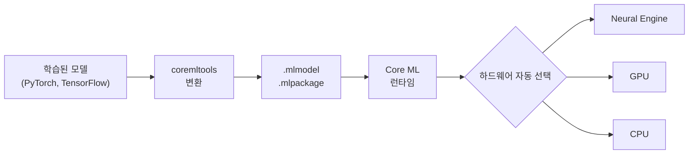
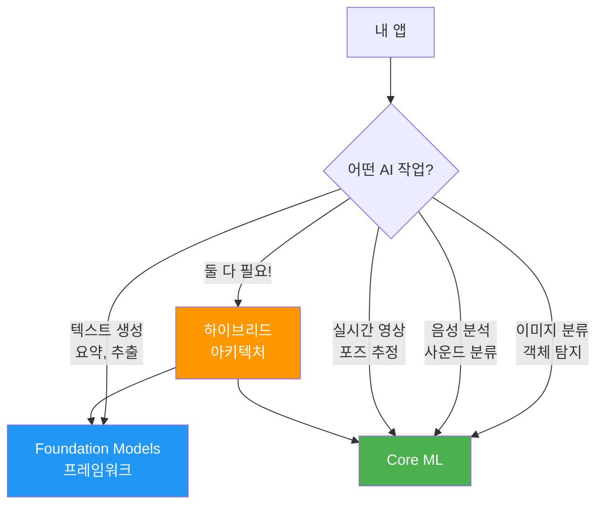
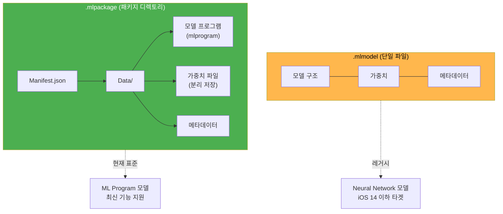
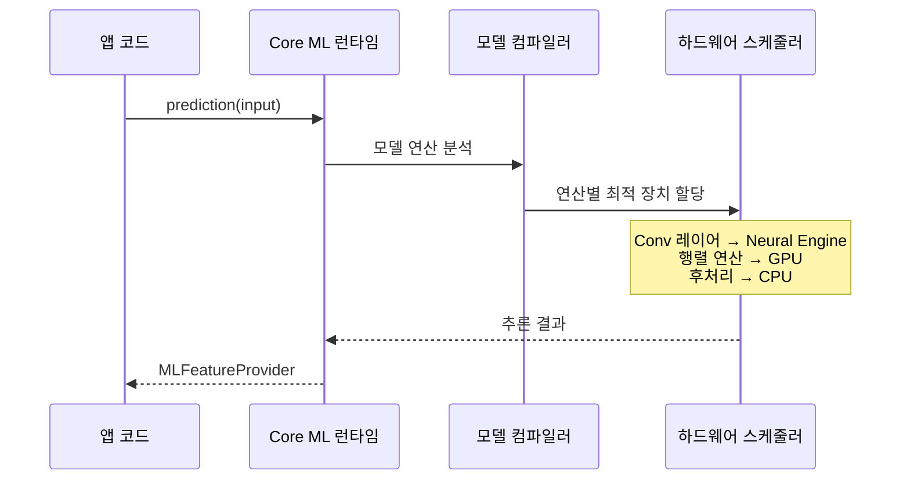

# Core ML 프레임워크 소개

> Apple의 온디바이스 머신러닝 추론 엔진 Core ML의 역할과 Foundation Models 프레임워크와의 차이를 이해합니다

## 개요

이 섹션에서는 Core ML 프레임워크가 무엇이고, 왜 Apple 플랫폼의 ML 생태계에서 핵심적인 위치를 차지하는지 알아봅니다. 앞서 [Ch14. 온디바이스 모델 아키텍처 이해](14-ch14-온디바이스-모델-아키텍처-이해/01-01-apple-foundation-model-아키텍처.md)에서 Apple의 Foundation Language Model이 어떤 구조로 설계되었고, 어떤 제약 안에서 동작하는지를 이론적으로 살펴봤습니다. 이제 Ch15에서는 관점을 전환합니다 — Foundation Models가 **할 수 없는 영역**을 채워주는 **범용 ML 추론 엔진**, Core ML의 세계로 넘어갈 차례입니다.

**선수 지식**: Foundation Models 프레임워크 기본 사용법 (Ch3~Ch9), Apple Silicon과 Neural Engine 개념 (Ch14)
**학습 목표**:
- Core ML이 Apple ML 생태계에서 어떤 역할을 하는지 설명할 수 있다
- `.mlmodel`과 `.mlpackage` 두 모델 형식의 차이를 구분할 수 있다
- Core ML과 Foundation Models 프레임워크의 용도 차이를 명확히 이해한다
- MLModel API의 기본 구조를 파악한다

## 왜 알아야 할까?

Ch14에서 우리는 Apple의 Foundation Language Model 아키텍처를 뜯어봤습니다. ~3B 파라미터의 경량 Transformer가 어떻게 iPhone 위에서 효율적으로 동작하는지, 양자화와 어댑터가 어떤 역할을 하는지 이해했죠. 그런데 이 과정에서 한 가지 분명해진 것이 있습니다 — **Foundation Models 프레임워크의 경계**입니다.

Foundation Models는 Apple이 사전 학습한 단일 언어 모델에 접근하는 프레임워크입니다. 텍스트 생성, 요약, 구조화 추출에는 뛰어나지만, 세 가지 근본적 한계가 있어요:

1. **텍스트 전용**: 이미지 분류, 객체 탐지, 음성 분석, 포즈 추정 같은 비텍스트 작업을 처리할 수 없습니다
2. **커스텀 모델 불가**: 개발자가 직접 학습한 모델을 배포할 방법이 없습니다. Apple이 제공하는 모델만 사용해야 하죠
3. **고정된 아키텍처**: 모델 구조나 크기를 선택할 수 없습니다. Apple이 정한 ~3B 모델 하나뿐입니다

그렇다면 **"사진 속 물체를 인식하거나, 음성을 분류하거나, 내가 직접 학습한 도메인 특화 모델을 앱에 넣으려면?"** — 이것이 Core ML의 영역입니다.

실제로 테니스 코칭 앱 SwingVision은 Core ML로 영상 프레임에서 동작 데이터를 추출하고, Foundation Models로 그 데이터를 자연어 코칭 피드백으로 변환합니다. **두 프레임워크는 경쟁이 아니라 보완 관계**이고, 진정한 AI 앱은 이 둘을 함께 활용할 줄 알아야 합니다.

## 핵심 개념

### 개념 1: Core ML이란 무엇인가

> 💡 **비유**: Core ML은 **만능 공연장**과 같습니다. 공연장 자체에는 특정 공연이 들어있지 않지만, 오케스트라든 발레든 뮤지컬이든 어떤 공연(모델)이라도 무대에 올릴 수 있는 인프라를 갖추고 있죠. 반면 Foundation Models 프레임워크는 이미 **전속 밴드가 상주하는 라이브 바** — 별도의 섭외 없이 바로 음악(텍스트 생성)을 들을 수 있지만, 연주 장르(언어 처리)는 정해져 있습니다.

Core ML은 2017년 WWDC에서 iOS 11과 함께 처음 소개된 Apple의 **범용 온디바이스 ML 추론 엔진**입니다. 핵심 역할은 단순합니다:

1. 개발자가 준비한 학습 완료 모델(`.mlmodel` 또는 `.mlpackage`)을 받아서
2. Apple Silicon의 최적 하드웨어(Neural Engine, GPU, CPU)를 자동 선택하고
3. 온디바이스에서 빠르고 효율적으로 추론을 실행한다

> 📊 **그림 1**: Core ML의 기본 동작 흐름



위 그림에서 **coremltools**가 등장하는데요, 이것은 Apple이 제공하는 **오픈소스 Python 패키지**(`pip install coremltools`)로, PyTorch나 TensorFlow로 학습한 모델을 Core ML 형식(`.mlmodel`/`.mlpackage`)으로 변환해주는 도구입니다. 쉽게 말해, 외부 세계의 모델을 Apple 세계로 들여오는 **통역사** 역할이죠. coremltools의 실제 사용법은 [05. coremltools 기초 — Python에서 모델 변환](15-ch15-core-ml-기초/05-05-coremltools-기초-python에서-모델-변환.md)에서 직접 실습합니다.

Core ML 자체에는 **어떤 모델도 내장되어 있지 않습니다**. 이것이 Foundation Models 프레임워크와의 가장 근본적인 차이점이에요. Foundation Models는 Apple이 사전 학습한 ~3B 파라미터 언어 모델이 이미 기기에 설치되어 있지만, Core ML은 **빈 엔진** — 개발자가 모델을 가져와야 합니다. 다시 공연장 비유로 돌아가면, Core ML은 무대와 음향 시스템은 갖추고 있지만 공연 프로그램은 개발자가 채워 넣어야 하는 것이고, Foundation Models는 이미 레퍼토리가 정해진 상주 극단이 있는 전용 극장인 셈입니다.

바로 이 "빈 엔진"이라는 특성이 Core ML의 핵심 강점이기도 합니다. Ch14에서 본 Foundation Models는 Apple이 정해놓은 모델 하나만 사용할 수 있지만, Core ML에는 **여러분이 직접 학습한 어떤 모델이든** 올릴 수 있거든요. 피부과 전문 이미지 분류기든, 공장 소음 감지 모델이든, 도메인에 특화된 모델을 자유롭게 배포할 수 있다는 점이 실무에서 결정적인 차이를 만듭니다.

```swift
import CoreML

// Core ML: 개발자가 모델 파일을 제공해야 함
let imageClassifier = try MLModel(contentsOf: modelURL)

// Foundation Models: 모델이 이미 기기에 있음
import FoundationModels
let session = LanguageModelSession()
```

### 개념 2: Core ML vs Foundation Models — 언제 무엇을 쓸까

> 💡 **비유**: 주방에 비유하면, Core ML은 **전문 도구 세트**(파스타 머신, 제빵 오븐, 소시지 그라인더)와 같아요. 각 도구는 특정 요리에 최적화되어 있죠. Foundation Models는 **만능 셰프** — 레시피를 말하면 알아서 요리하지만, 전문 장비가 필요한 세밀한 작업에는 한계가 있습니다.

두 프레임워크의 핵심 차이를 정리해볼까요?

> 📊 **그림 2**: Core ML과 Foundation Models의 역할 분담



| 기준 | Core ML | Foundation Models |
|------|---------|-------------------|
| **모델 제공** | 개발자가 가져옴 | Apple이 내장 |
| **지원 작업** | 이미지, 오디오, 텍스트, 표 형식 등 범용 | 텍스트 생성/요약/추출 특화 |
| **출력 특성** | 결정적(동일 입력 → 동일 출력) | 생성적(매번 다른 출력 가능) |
| **최소 지원** | iOS 11+ (거의 모든 기기) | iOS 26+ (iPhone 15 Pro 이상) |
| **모델 관리** | 개발자가 업데이트/관리 | Apple이 자동 관리 |
| **커스터마이징** | 자유로움 (어떤 모델이든 가능) | 제한적 (Apple 모델만 사용) |
| **모델 변환 도구** | coremltools (Python) | 불필요 (내장 모델) |

> ⚠️ **흔한 오해**: "Foundation Models가 나왔으니 Core ML은 레거시다"라고 생각하기 쉽지만, 사실은 정반대입니다. Core ML은 **이미지, 오디오, 비디오** 같은 비텍스트 영역을 담당하고, Foundation Models는 **언어 처리**를 담당합니다. 둘은 보완 관계입니다.

### 개념 3: 모델 형식 — .mlmodel과 .mlpackage

Core ML이 지원하는 모델 형식은 두 가지입니다. 이 둘의 차이를 이해하는 것이 모델 통합의 첫걸음이에요.

> 💡 **비유**: `.mlmodel`은 **단일 압축 파일**처럼 모든 것이 하나에 들어있고, `.mlpackage`는 **폴더형 프로젝트**처럼 구조, 가중치, 메타데이터가 분리되어 있어서 관리와 수정이 더 유연합니다.

> 📊 **그림 3**: 두 모델 형식의 구조 비교



**`.mlmodel` (Neural Network 형식)**
- Core ML 초기부터 사용된 **단일 파일** 형식
- 모델 구조와 가중치가 하나의 파일에 통합
- iOS 11부터 지원, 하위 호환성이 뛰어남
- coremltools에서 `convert_to="neuralnetwork"` 옵션으로 생성

**`.mlpackage` (ML Program 형식)**
- coremltools 7.0부터 **기본 변환 형식**
- 모델 구조(프로그램)와 가중치가 분리되어 디렉토리 구조로 저장
- 메타데이터 편집이 유연하고 최신 최적화 기능을 지원
- 대용량 모델(LLM, Diffusion 모델)에 적합

```swift
// Xcode에 .mlmodel 또는 .mlpackage를 드래그하면
// Swift 클래스가 자동 생성됩니다

// 자동 생성된 클래스 사용 예시
let model = try MobileNetV2(configuration: MLModelConfiguration())

// 또는 URL로 직접 로드
let config = MLModelConfiguration()
config.computeUnits = .all  // Neural Engine + GPU + CPU 모두 활용
let model = try MLModel(contentsOf: modelURL, configuration: config)
```

> 🔥 **실무 팁**: 2025년 이후로 새 프로젝트를 시작한다면 `.mlpackage`를 선택하세요. coremltools 7.0+에서는 `convert()` 메서드가 기본적으로 ML Program(`.mlpackage`)을 생성합니다. `.mlmodel`은 iOS 14 이하를 타겟해야 할 때만 사용하면 됩니다.

### 개념 4: Core ML의 하드웨어 가속 전략

Core ML의 가장 강력한 장점 중 하나는 **하드웨어 추상화**입니다. 개발자가 Neural Engine, GPU, CPU 중 어느 것을 쓸지 일일이 결정할 필요가 없어요.

> 📊 **그림 4**: Core ML의 하드웨어 가속 계층



```swift
// computeUnits로 하드웨어 선호도를 힌트로 제공
let config = MLModelConfiguration()

// 모든 하드웨어 활용 (기본값, 권장)
config.computeUnits = .all

// Neural Engine + CPU만 (GPU를 다른 작업에 양보)
config.computeUnits = .cpuAndNeuralEngine

// CPU만 (테스트/디버깅용)
config.computeUnits = .cpuOnly

let model = try MLModel(contentsOf: url, configuration: config)
```

| 하드웨어 | 강점 | 적합한 작업 |
|---------|------|------------|
| **Neural Engine (ANE)** | ML 전용, 최고 전력 효율 | CNN, Transformer 추론 |
| **GPU** | 높은 병렬 처리량 | 대규모 행렬 연산, 이미지 처리 |
| **CPU** | 범용성, 정밀도 | 후처리, 작은 모델, 폴백 |

## 실습: 직접 해보기

Core ML 모델을 로드하고 기본 정보를 확인하는 간단한 실습을 해봅시다. Xcode에서 새 iOS 프로젝트를 만들고 Apple의 MobileNetV2 모델을 추가한 뒤 다음 코드를 작성합니다.

```swift
import CoreML
import SwiftUI

// MARK: - Core ML 모델 탐색기
struct ModelExplorerView: View {
    @State private var modelInfo: String = "모델 로딩 중..."
    
    var body: some View {
        NavigationStack {
            ScrollView {
                Text(modelInfo)
                    .font(.system(.body, design: .monospaced))
                    .padding()
                    .frame(maxWidth: .infinity, alignment: .leading)
            }
            .navigationTitle("Core ML 모델 탐색기")
            .task {
                await loadModelInfo()
            }
        }
    }
    
    func loadModelInfo() async {
        do {
            // MLModelConfiguration으로 하드웨어 설정
            let config = MLModelConfiguration()
            config.computeUnits = .all  // 모든 하드웨어 활용
            
            // Xcode에 추가한 MobileNetV2 모델 로드
            let model = try MobileNetV2(configuration: config)
            
            // 모델의 기본 정보 탐색
            let description = model.model.modelDescription
            
            var info = "=== 모델 정보 ===\n\n"
            
            // 입력 정보
            info += "📥 입력:\n"
            for (name, feature) in description.inputDescriptionsByName {
                info += "  - \(name): \(featureTypeName(feature.type))\n"
                if let constraint = feature.imageConstraint {
                    info += "    크기: \(constraint.pixelsWide) x \(constraint.pixelsHigh)\n"
                }
            }
            
            // 출력 정보
            info += "\n📤 출력:\n"
            for (name, feature) in description.outputDescriptionsByName {
                info += "  - \(name): \(featureTypeName(feature.type))\n"
            }
            
            // 메타데이터
            info += "\n📋 메타데이터:\n"
            if let metadata = description.metadata[.description] as? String {
                info += "  설명: \(metadata)\n"
            }
            if let author = description.metadata[.author] as? String {
                info += "  제작: \(author)\n"
            }
            if let license = description.metadata[.license] as? String {
                info += "  라이선스: \(license)\n"
            }
            
            modelInfo = info
        } catch {
            modelInfo = "❌ 모델 로드 실패: \(error.localizedDescription)"
        }
    }
    
    // MLFeatureType을 사람이 읽을 수 있는 이름으로 변환
    func featureTypeName(_ type: MLFeatureType) -> String {
        switch type {
        case .image: return "이미지(Image)"
        case .dictionary: return "딕셔너리(Dictionary)"
        case .string: return "문자열(String)"
        case .double: return "실수(Double)"
        case .int64: return "정수(Int64)"
        case .multiArray: return "다차원 배열(MultiArray)"
        case .sequence: return "시퀀스(Sequence)"
        @unknown default: return "알 수 없음"
        }
    }
}
```

```run:swift
// Core ML 모델 메타데이터 출력 (시뮬레이션)
print("=== 모델 정보 ===")
print("")
print("📥 입력:")
print("  - image: 이미지(Image)")
print("    크기: 224 x 224")
print("")
print("📤 출력:")
print("  - classLabelProbs: 딕셔너리(Dictionary)")
print("  - classLabel: 문자열(String)")
print("")
print("📋 메타데이터:")
print("  설명: MobileNetV2 이미지 분류 모델")
print("  제작: Apple")
print("  라이선스: MIT")
```

```output
=== 모델 정보 ===

📥 입력:
  - image: 이미지(Image)
    크기: 224 x 224

📤 출력:
  - classLabelProbs: 딕셔너리(Dictionary)
  - classLabel: 문자열(String)

📋 메타데이터:
  설명: MobileNetV2 이미지 분류 모델
  제작: Apple
  라이선스: MIT
```

이 실습에서 핵심적으로 확인할 것은 세 가지입니다:

1. **`MLModelConfiguration`**: 하드웨어 설정과 최적화 옵션을 담는 구성 객체
2. **`modelDescription`**: 모델의 입출력 스키마와 메타데이터를 탐색하는 진입점
3. **자동 생성 클래스**: Xcode가 `.mlmodel`/`.mlpackage` 파일에서 Swift 클래스를 자동 생성

## 더 깊이 알아보기

### Core ML의 탄생 — WWDC 2017의 조용한 혁명

2017년 6월 WWDC에서 Apple은 iOS 11과 함께 Core ML을 발표했습니다. 사실 당시 머신러닝 추론은 이미 가능했지만 — Accelerate 프레임워크로 행렬 연산을 직접 짜거나, Metal로 GPU 커널을 작성해야 했어요. Core ML은 이 모든 복잡성을 **"모델 파일 하나 드래그하면 끝"**이라는 경험으로 바꿔버렸습니다.

같은 해 9월, Apple은 A11 Bionic 칩에 최초의 **Neural Engine**을 탑재합니다. 초당 6000억 회 연산이 가능한 이 전용 하드웨어는 Face ID와 Animoji를 구동했고, Core ML은 이 Neural Engine을 개발자에게 투명하게 제공하는 통로가 되었죠.

이후 Core ML은 매년 진화했습니다:
- **Core ML 2** (2018): 모델 크기 최적화, Batch 추론
- **Core ML 3** (2019): 온디바이스 학습(on-device training), Create ML 앱
- **Core ML 4** (2020): 모델 암호화, 더 많은 레이어 타입
- **Core ML 5~6** (2021~2023): ML Program 형식, 성능 리포트
- **Core ML 7+** (2024~): Stateful 모델, MLTensor, LLM/Diffusion 압축

그리고 2025년 WWDC에서 Foundation Models 프레임워크가 등장하면서, Core ML은 "범용 ML 추론"이라는 자신만의 영역을 더 명확히 하게 됩니다. 두 프레임워크는 각자의 역할이 뚜렷한 파트너인 셈이죠.

> 💡 **알고 계셨나요?**: Core ML이 2017년에 첫 등장했을 때, Apple은 이미 내부적으로 수백 개의 ML 모델을 사용하고 있었습니다. Siri의 음성 인식, 사진 앱의 얼굴 인식, QuickType 키보드의 예측 입력 — 이 모든 것이 독자적인 ML 파이프라인으로 돌아가고 있었는데, Core ML은 이런 내부 경험을 외부 개발자에게 열어준 프레임워크였습니다.

## 흔한 오해와 팁

> ⚠️ **흔한 오해**: "Core ML은 학습(Training)도 할 수 있다" — Core ML은 기본적으로 **추론(Inference) 전용** 프레임워크입니다. Core ML 3에서 온디바이스 학습 기능이 추가되긴 했지만, 이는 사전 학습된 모델의 미세 조정(fine-tuning)에 한정됩니다. 본격적인 모델 학습은 Create ML이나 PyTorch/TensorFlow에서 하고, Core ML은 그 결과물을 **실행**하는 역할입니다.

> 💡 **알고 계셨나요?**: Xcode에 `.mlmodel` 파일을 추가하면 빌드 시 자동으로 `.mlmodelc`(컴파일된 형태)로 변환됩니다. 이 컴파일 과정에서 모델이 타겟 디바이스의 하드웨어에 최적화되기 때문에, 앱에 포함되는 모델 크기와 원본 크기가 다를 수 있습니다.

> 🔥 **실무 팁**: `computeUnits`를 `.all`로 설정하면 Core ML이 연산별로 최적 하드웨어를 자동 선택합니다. 특별한 이유가 없다면 `.all`을 사용하되, **앱에서 Metal 렌더링(게임 등)을 동시에 하고 있다면** `.cpuAndNeuralEngine`으로 설정해서 GPU 리소스 경합을 피하세요.

## 핵심 정리

| 개념 | 설명 |
|------|------|
| **Core ML** | Apple의 범용 온디바이스 ML 추론 엔진. 개발자가 모델을 제공하면 최적 하드웨어에서 실행 |
| **Foundation Models** | Apple 내장 ~3B LLM에 접근하는 프레임워크. 텍스트 생성/요약 특화 |
| **.mlmodel** | 단일 파일 모델 형식 (레거시, Neural Network). 넓은 호환성 |
| **.mlpackage** | 패키지 디렉토리 형식 (ML Program). 현재 표준, 최신 기능 지원 |
| **computeUnits** | Neural Engine/GPU/CPU 중 어떤 하드웨어를 활용할지 설정 (.all 권장) |
| **coremltools** | Apple의 오픈소스 Python 패키지. PyTorch/TensorFlow 모델을 `.mlmodel`/`.mlpackage`로 변환 |
| **자동 생성 API** | Xcode가 모델 파일에서 Swift/ObjC 인터페이스를 자동 생성 |

## 다음 섹션 미리보기

이번 섹션에서 Core ML이 무엇이고 왜 필요한지 이해했으니, 다음 [02. Core ML 모델 통합하기](15-ch15-core-ml-기초/02-02-core-ml-모델-통합하기.md)에서는 실제로 `.mlmodel`/`.mlpackage` 파일을 Xcode 프로젝트에 추가하고, 자동 생성된 Swift 클래스를 활용해 추론을 실행하는 과정을 단계별로 실습합니다.

## 참고 자료

- [Core ML Overview — Apple Developer](https://developer.apple.com/machine-learning/core-ml/) - Core ML의 공식 소개 페이지. 지원 기능, 하드웨어 가속, 최신 업데이트를 한눈에 확인
- [Discover machine learning & AI frameworks on Apple platforms — WWDC25](https://developer.apple.com/videos/play/wwdc2025/360/) - Apple ML/AI 프레임워크 생태계 전체를 조망하는 세션. Core ML과 Foundation Models의 위치 파악에 필수
- [Core ML vs Foundation Models: Which Should You Use? — DEV Community](https://dev.to/arshtechpro/core-ml-vs-foundation-models-which-should-you-use-3jo0) - 두 프레임워크의 실전 비교 분석. 언제 무엇을 쓸지에 대한 명확한 가이드
- [Core ML | Apple Developer Documentation](https://developer.apple.com/documentation/coreml) - Core ML API의 공식 레퍼런스 문서
- [Getting Started — Guide to Core ML Tools](https://apple.github.io/coremltools/docs-guides/source/introductory-quickstart.html) - coremltools를 사용한 모델 변환 빠른 시작 가이드

---
### 🔗 Related Sessions
- [foundation models 프레임워크](01-ch1-apple-intelligence와-온디바이스-ai/01-01-apple-intelligence-개요.md) (prerequisite)
