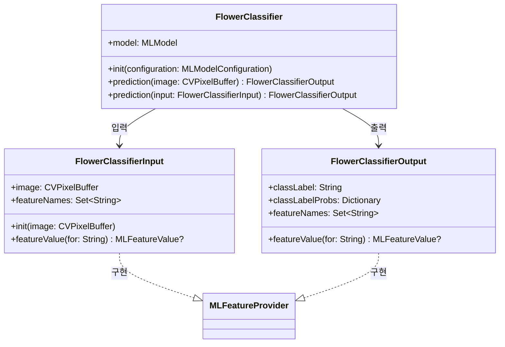
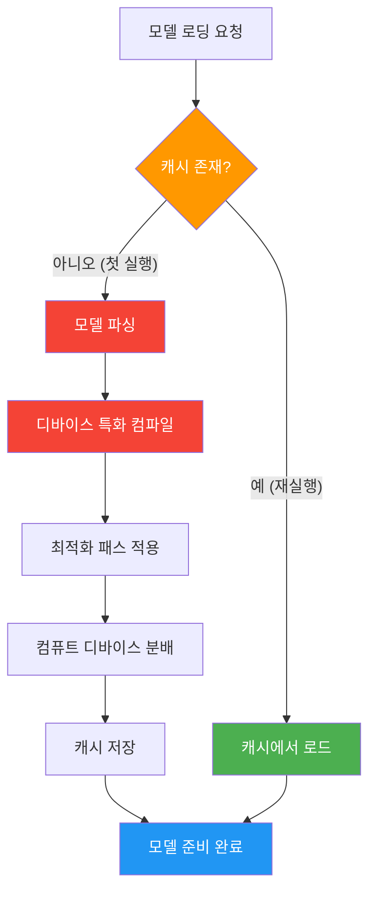
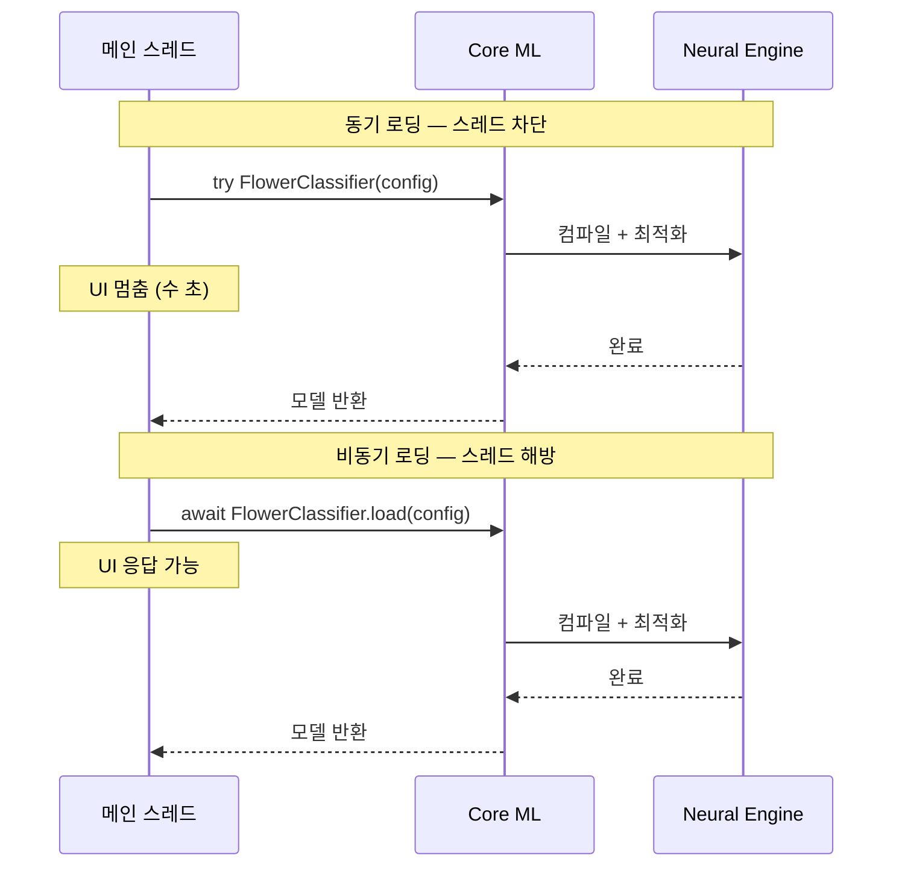
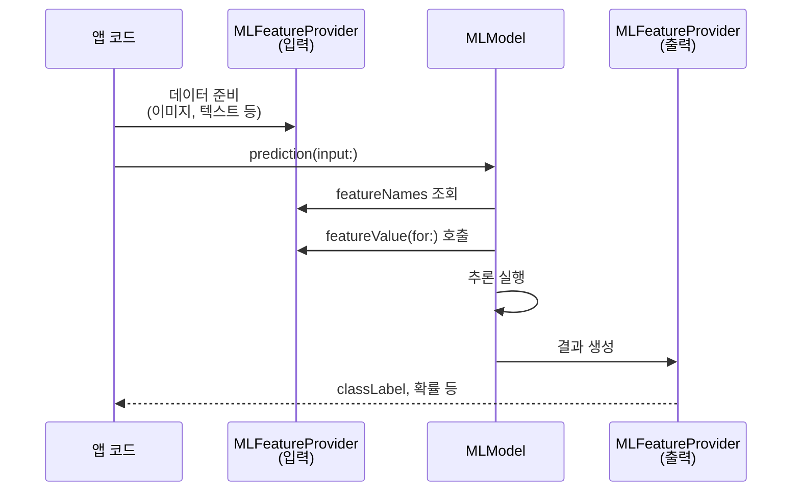
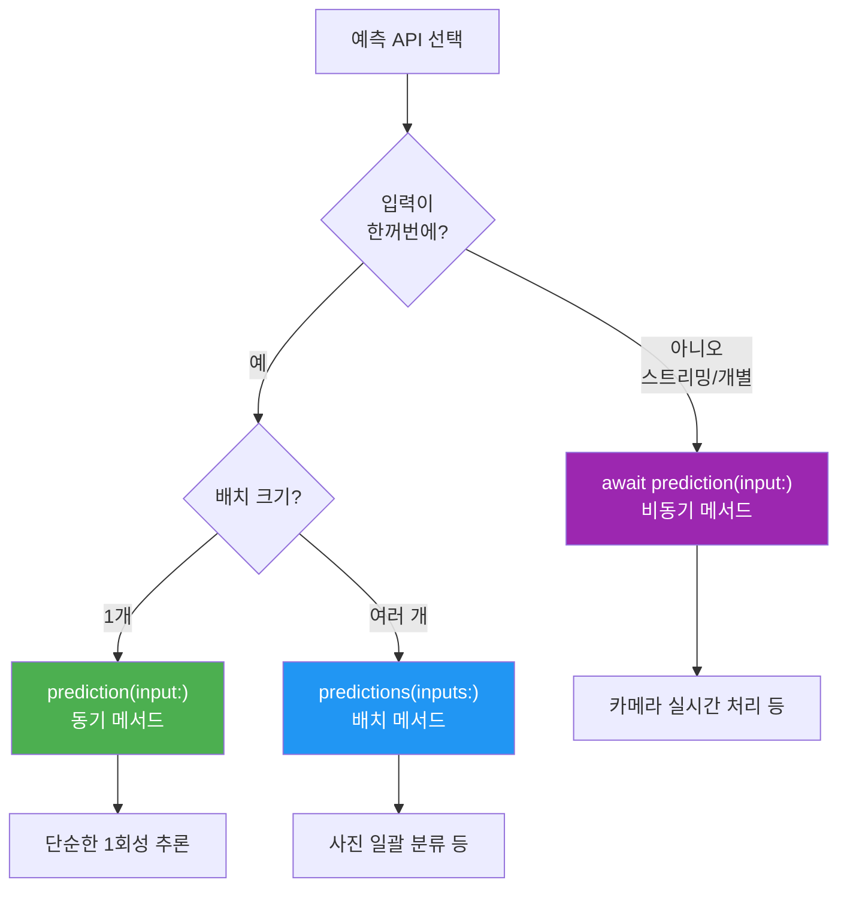

# Core ML 모델 통합하기

> Xcode에 ML 모델을 추가하고, 자동 생성된 Swift 인터페이스로 온디바이스 추론을 실행하는 방법을 배웁니다.

## 개요

이 섹션에서는 Core ML 모델을 실제 앱에 통합하는 전 과정을 다룹니다. `.mlmodel` 또는 `.mlpackage` 파일을 Xcode 프로젝트에 추가하면, Xcode가 자동으로 Swift 인터페이스를 생성해줍니다. 이 자동 생성된 클래스를 사용해 모델 로딩부터 `prediction()` 호출, 결과 처리까지의 워크플로를 익혀보겠습니다.

**선수 지식**: [Core ML 프레임워크 소개](15-ch15-core-ml-기초/01-01-core-ml-프레임워크-소개.md)에서 배운 Core ML의 역할, `.mlmodel`과 `.mlpackage` 형식의 차이, `MLModelConfiguration` 기본 개념

**학습 목표**:
- Xcode에 `.mlmodel`/`.mlpackage` 파일을 추가하고 자동 생성 인터페이스를 이해한다
- `MLModel` 로딩과 `MLModelConfiguration`을 활용해 모델을 초기화한다
- `prediction()` 메서드로 추론을 실행하고 결과를 처리한다
- `MLFeatureProvider` 프로토콜의 역할과 사용법을 이해한다
- 동기 vs 비동기 로딩/예측 API의 차이를 이해하고 상황에 맞게 선택한다

## 왜 알아야 할까?

Core ML 모델을 "가지고 있는 것"과 "앱에서 실제로 동작하게 만드는 것"은 완전히 다른 이야기입니다. 아무리 뛰어난 ML 모델도 앱에 제대로 통합하지 못하면 무용지물이죠. 다행히 Apple은 이 과정을 극적으로 단순화했습니다 — Xcode에 모델 파일을 드래그하면 Swift 클래스가 자동 생성되고, 단 몇 줄의 코드로 예측을 실행할 수 있거든요.

이번 섹션에서 배우는 통합 워크플로는 이미지 분류, 텍스트 분석, 객체 탐지 등 **모든 Core ML 기반 기능의 공통 기반**입니다. 이후 챕터에서 다룰 [이미지 분류 모델 활용](15-ch15-core-ml-기초/03-03-이미지-분류-모델-활용.md)이나 [Core ML 모델을 Tool로 래핑하기](17-ch17-foundation-models-core-ml-하이브리드/02-02-core-ml-모델을-tool로-래핑하기.md)의 토대가 되는 핵심 스킬이기도 합니다.

## 핵심 개념

### 개념 1: Xcode 모델 통합 워크플로

> 💡 **비유**: 외국어 사전을 앱에 넣는다고 상상해보세요. 사전 파일(`.mlmodel`)을 책장(Xcode)에 꽂으면, 도서관 시스템이 자동으로 목차와 검색 인터페이스(Swift 클래스)를 만들어줍니다. 여러분은 그 인터페이스로 "이 단어 찾아줘"라고 요청(`prediction`)만 하면 되는 거죠.

Core ML 모델을 앱에 통합하는 과정은 놀랍도록 단순합니다. 크게 세 단계로 이루어집니다.

> 📊 **그림 1**: Core ML 모델 통합 워크플로


**1단계 — 모델 파일 추가**: `.mlmodel` 또는 `.mlpackage` 파일을 Xcode 프로젝트 네비게이터에 드래그합니다. "Copy items if needed"를 체크하고 타겟에 추가하면 끝입니다.

**2단계 — 자동 컴파일**: Xcode가 빌드 시 소스 모델을 `.mlmodelc`(컴파일된 형식)로 변환합니다. 이 과정에서 디바이스에 최적화된 바이너리가 생성되는데요, 같은 모델이라도 iPhone과 Mac에서 컴파일 결과가 다를 수 있습니다 — Neural Engine 아키텍처와 메모리 구성이 다르기 때문이죠. `.mlpackage`도 마찬가지로 Xcode가 빌드 타임에 자동으로 `.mlmodelc`로 변환하므로, 개발자가 별도로 신경 쓸 건 없습니다.

**3단계 — Swift 인터페이스 자동 생성**: Xcode가 모델 이름과 동일한 Swift 클래스를 자동 생성합니다. 이 클래스에는 타입 안전한 입력/출력 구조체와 `prediction()` 메서드가 포함됩니다. 예를 들어 `FlowerClassifier.mlmodel`을 추가하면 `FlowerClassifier`, `FlowerClassifierInput`, `FlowerClassifierOutput` 세 개의 클래스가 자동으로 만들어집니다.

Xcode에서 `.mlmodel` 파일을 클릭하면 모델 미리보기를 볼 수 있습니다. 여기서 모델의 입출력 형식, 크기, 메타데이터를 확인할 수 있어요. 심지어 **Performance Report**를 생성해 실제 디바이스에서의 로딩 시간과 추론 속도까지 측정할 수 있습니다. **Preview** 탭에서는 실제 데이터를 넣어서 코드 작성 없이 모델 동작을 검증할 수도 있죠.

### 개념 2: 자동 생성 Swift 인터페이스

> 💡 **비유**: 해외에서 가전제품을 구매하면 전압 어댑터가 필요하죠. Xcode의 자동 생성 클래스는 바로 그 "어댑터"입니다. ML 모델이 요구하는 복잡한 입출력 형식을 여러분에게 익숙한 Swift 타입으로 자동 변환해주거든요.

예를 들어, `FlowerClassifier.mlmodel`이라는 이미지 분류 모델을 프로젝트에 추가하면, Xcode는 아래와 같은 구조의 Swift 코드를 자동 생성합니다:

> 📊 **그림 2**: 자동 생성 클래스 구조



자동 생성된 클래스의 핵심 구성 요소를 살펴보겠습니다:

```swift
// Xcode가 자동 생성하는 코드 (직접 작성할 필요 없음)

// 1. 메인 모델 클래스
class FlowerClassifier {
    let model: MLModel
    
    // 설정과 함께 초기화
    init(configuration: MLModelConfiguration = .init()) throws
    
    // 타입 안전한 예측 메서드
    func prediction(image: CVPixelBuffer) throws -> FlowerClassifierOutput
    
    // Input 객체를 사용하는 예측 메서드
    func prediction(input: FlowerClassifierInput) throws -> FlowerClassifierOutput
    
    // 비동기 예측 (iOS 17+ / macOS 14+)
    func prediction(input: FlowerClassifierInput) async throws -> FlowerClassifierOutput
    
    // 배치 예측
    func predictions(inputs: [FlowerClassifierInput]) throws -> [FlowerClassifierOutput]
}

// 2. 입력 구조 — MLFeatureProvider 프로토콜 준수
class FlowerClassifierInput: MLFeatureProvider {
    var image: CVPixelBuffer
    var featureNames: Set<String> { ["image"] }
    func featureValue(for featureName: String) -> MLFeatureValue?
}

// 3. 출력 구조 — MLFeatureProvider 프로토콜 준수
class FlowerClassifierOutput: MLFeatureProvider {
    let classLabel: String                      // 최종 분류 결과
    let classLabelProbs: [String: Double]        // 각 클래스별 확률
    var featureNames: Set<String> { ["classLabel", "classLabelProbs"] }
    func featureValue(for featureName: String) -> MLFeatureValue?
}
```

여기서 주목할 점이 있습니다. 자동 생성된 `prediction()` 메서드는 **두 가지 형태**로 제공됩니다:
- **편의 메서드**: `prediction(image:)` — 개별 파라미터를 직접 전달
- **Input 기반 메서드**: `prediction(input:)` — `FlowerClassifierInput` 객체를 전달

어떤 것을 사용하든 결과는 동일하지만, Input 기반 방식이 더 유연하고 재사용에 유리합니다.

> ⚠️ **흔한 오해**: "자동 생성 코드를 수정해야 한다"고 생각하는 분이 있는데, 절대 직접 수정하면 안 됩니다! 빌드할 때마다 Xcode가 다시 생성하기 때문에 변경 사항이 사라져요. 대신 **extension으로 기능을 확장**하세요.

### 개념 3: MLModel 로딩 — 동기 vs 비동기

> 💡 **비유**: 자동차 시동을 거는 것과 비슷합니다. 엔진(모델)을 켤 때 연료 종류(computeUnits)와 시동 방식(동기/비동기)을 선택할 수 있는데, 이 선택이 성능에 큰 영향을 미칩니다. 동기 시동은 엔진이 걸릴 때까지 운전석에서 아무것도 못 하고 기다리는 거고, 비동기 시동은 리모컨으로 시동을 걸어두고 다른 준비를 하는 것이죠.

모델 로딩은 앱 성능에 직접적인 영향을 미치는 중요한 단계입니다. 특히 **첫 번째 로딩**과 **이후 로딩**의 동작이 다릅니다.

> 📊 **그림 3**: 모델 로딩 — 캐시 여부에 따른 흐름



첫 번째 실행 시에는 디바이스별 컴파일이 필요해서 시간이 걸릴 수 있지만, 이후에는 캐시된 결과를 사용해 빠르게 로드됩니다. Xcode의 Core ML Instrument를 사용하면 로딩 트레이스에서 "prepare and cache"(미캐시)와 "cached"(캐시) 라벨로 이를 확인할 수 있습니다.

Core ML은 모델을 로딩하는 **두 가지 방식**을 제공합니다. 각각의 특성과 적합한 상황이 다르므로, 이 차이를 확실히 이해해두는 것이 중요합니다.

> 📊 **그림 3-1**: 동기 vs 비동기 로딩 비교



```swift
import CoreML

// ─────────────────────────────────────
// 방법 A: 동기 로딩 — 자동 생성 이니셜라이저
// ─────────────────────────────────────
// 호출 스레드를 차단하므로, 메인 스레드에서 사용하면 UI가 멈춤
// 모델이 작거나 백그라운드 스레드에서 호출할 때 적합

let config = MLModelConfiguration()
config.computeUnits = .cpuAndNeuralEngine

// 자동 생성 클래스의 동기 이니셜라이저
let classifierSync = try FlowerClassifier(configuration: config)

// URL 기반 동기 로딩 — 동적 경로가 필요할 때
let modelURL = Bundle.main.url(
    forResource: "FlowerClassifier",
    withExtension: "mlmodelc"
)!
let rawModel = try MLModel(contentsOf: modelURL, configuration: config)

// ─────────────────────────────────────
// 방법 B: 비동기 로딩 — async/await (권장)
// ─────────────────────────────────────
// 호출 스레드를 차단하지 않으므로, 메인 스레드에서도 안전
// iOS 16+ / macOS 13+ 에서 사용 가능

// 자동 생성 클래스의 비동기 로딩
let classifierAsync = try await FlowerClassifier.load(
    configuration: config
)

// URL 기반 비동기 로딩
let rawModelAsync = try await MLModel.load(
    contentsOf: modelURL,
    configuration: config
)
```

두 방식의 선택 기준을 정리하면 이렇습니다:

| 기준 | 동기 로딩 (`init(configuration:)`) | 비동기 로딩 (`load(configuration:)`) |
|------|------|------|
| **스레드 차단** | 호출 스레드 차단 | 차단 없음 |
| **사용 위치** | 백그라운드 스레드에서만 | 어디서든 안전 (메인 스레드 포함) |
| **적합한 상황** | 앱 초기화 시 DispatchQueue에서, 소형 모델 | SwiftUI `.task`, 대형 모델, 사용자 대면 화면 |
| **최소 지원** | iOS 11+ | iOS 16+ / macOS 13+ |
| **실전 권장도** | 레거시 호환 필요 시 | 신규 프로젝트 기본값 |

> 🔥 **실무 팁**: 모델 로딩은 **절대 메인 스레드에서 동기로 하지 마세요**. 특히 첫 실행 시 디바이스 컴파일 때문에 수 초가 걸릴 수 있습니다. iOS 16+ 타겟이라면 `await .load(configuration:)`을, 레거시 지원이 필요하면 `DispatchQueue.global()`에서 동기 `init`을 호출하세요.

```swift
// 실전 패턴: SwiftUI에서 비동기 로딩
struct ContentView: View {
    @State private var model: FlowerClassifier?
    
    var body: some View {
        Group {
            if let model {
                ClassifierView(model: model)
            } else {
                ProgressView("모델 로딩 중...")
            }
        }
        .task {
            // .task는 뷰가 나타날 때 비동기 실행
            let config = MLModelConfiguration()
            config.computeUnits = .all
            model = try? await FlowerClassifier.load(configuration: config)
        }
    }
}

// 레거시 패턴: iOS 15 이하 지원이 필요할 때
func loadModelLegacy(completion: @escaping (FlowerClassifier?) -> Void) {
    DispatchQueue.global(qos: .userInitiated).async {
        let config = MLModelConfiguration()
        let model = try? FlowerClassifier(configuration: config)
        DispatchQueue.main.async {
            completion(model)  // UI 업데이트는 메인 스레드에서
        }
    }
}
```

### 개념 4: MLFeatureProvider와 입출력 처리

> 💡 **비유**: `MLFeatureProvider`는 택배 상자의 "송장"과 같습니다. 택배를 보낼 때 내용물(데이터), 수취인(feature 이름), 상품 종류(데이터 타입)를 송장에 기록하죠. ML 모델도 마찬가지로 입력 데이터에 이름과 타입을 붙여서 전달해야 합니다.

`MLFeatureProvider`는 Core ML의 데이터 교환 프로토콜입니다. 자동 생성 클래스가 이를 구현하므로 보통 직접 다룰 일은 적지만, 원리를 이해하면 동적 입력이나 커스텀 전처리가 필요할 때 큰 도움이 됩니다.

> 📊 **그림 4**: MLFeatureProvider 데이터 흐름



```swift
// MLFeatureProvider 프로토콜의 핵심 구조
protocol MLFeatureProvider {
    // 이 Provider가 가진 모든 feature 이름
    var featureNames: Set<String> { get }
    
    // 특정 이름의 feature 값을 반환
    func featureValue(for featureName: String) -> MLFeatureValue?
}

// MLFeatureValue — 다양한 데이터 타입을 감싸는 래퍼
let intValue = MLFeatureValue(int64: 42)
let doubleValue = MLFeatureValue(double: 3.14)
let stringValue = MLFeatureValue(string: "positive")
let imageValue = try MLFeatureValue(
    imageAt: imageURL,
    pixelsWide: 224,
    pixelsHigh: 224,
    pixelFormatType: kCVPixelFormatType_32BGRA
)
```

자동 생성 클래스를 사용하면 `MLFeatureProvider`를 직접 구현할 필요가 없지만, **동적으로 입력을 구성**해야 할 때는 `MLDictionaryFeatureProvider`가 편리합니다:

```swift
// 동적 입력 구성 — 모델 이름을 런타임에 결정할 때 유용
let inputFeatures = try MLDictionaryFeatureProvider(
    dictionary: [
        "image": MLFeatureValue(pixelBuffer: pixelBuffer),
        "confidenceThreshold": MLFeatureValue(double: 0.8)
    ]
)

// MLModel 직접 사용
let output = try model.prediction(from: inputFeatures)

// 결과 추출
let label = output.featureValue(for: "classLabel")?.stringValue
let probs = output.featureValue(for: "classLabelProbs")?.dictionaryValue
```

### 개념 5: 동기 vs 비동기 예측 API

WWDC23에서 Apple은 Core ML에 **async 예측 API**를 도입했습니다. 이전에는 추론을 직렬로 처리해야 했지만, 이제 Swift Concurrency와 자연스럽게 결합할 수 있습니다.

> 📊 **그림 5**: 예측 API 선택 가이드



```swift
// 1. 동기 예측 — 간단한 1회성 추론
func classifySync(image: CVPixelBuffer) throws -> String {
    let input = FlowerClassifierInput(image: image)
    let output = try classifier.prediction(input: input)  // 동기, 스레드 차단
    return output.classLabel
}

// 2. 비동기 예측 — UI 차단 없이 추론 (iOS 17+ 권장)
func classifyAsync(image: CVPixelBuffer) async throws -> String {
    let input = FlowerClassifierInput(image: image)
    let output = try await classifier.prediction(input: input)  // 비동기, 안전
    return output.classLabel
}

// 3. 배치 예측 — 여러 이미지를 한번에 분류
func classifyBatch(images: [CVPixelBuffer]) throws -> [String] {
    let inputs = images.map { FlowerClassifierInput(image: $0) }
    let outputs = try classifier.predictions(inputs: inputs)
    return outputs.map { $0.classLabel }
}

// 4. 비동기 동시 예측 — 여러 추론을 파이프라인으로 실행
func classifyConcurrently(images: [CVPixelBuffer]) async throws -> [String] {
    // withTaskGroup으로 여러 예측을 동시 실행
    try await withTaskGroup(of: (Int, String).self) { group in
        for (index, image) in images.enumerated() {
            group.addTask {
                let input = FlowerClassifierInput(image: image)
                let output = try await self.classifier.prediction(input: input)
                return (index, output.classLabel)
            }
        }
        
        var results = [(Int, String)]()
        for try await result in group {
            results.append(result)
        }
        return results.sorted { $0.0 < $1.0 }.map { $0.1 }
    }
}
```

비동기 API의 장점은 **동시 예측**이 가능하다는 점입니다. WWDC23에서 Apple은 이미지 컬러화 작업에서 동시 실행 시 약 **2배의 처리량 향상**을 시연했습니다. Neural Engine이 여러 예측을 파이프라인으로 처리할 수 있기 때문이죠.

| 예측 API | 최소 지원 | 스레드 동작 | 적합한 상황 |
|----------|-----------|-----------|-------------|
| `prediction(input:)` 동기 | iOS 11+ | 호출 스레드 차단 | 백그라운드 1회성 추론 |
| `await prediction(input:)` 비동기 | iOS 17+ | 차단 없음, Concurrency 호환 | 실시간 처리, 다중 추론 |
| `predictions(inputs:)` 배치 | iOS 11+ | 호출 스레드 차단 | 대량 일괄 처리 |

## 실습: 직접 해보기

텍스트 감성 분석 모델을 Xcode에 통합하고, SwiftUI 앱에서 사용자 입력을 분석하는 예제를 만들어봅시다. 여기서는 Apple의 Core ML 도구로 변환된 텍스트 분류 모델을 사용한다고 가정합니다.

```swift
import SwiftUI
import CoreML
import NaturalLanguage

// MARK: - 감성 분석 서비스
// Core ML 모델을 래핑한 서비스 레이어

@Observable
class SentimentAnalyzer {
    private var model: MLModel?
    var isModelLoaded = false
    var errorMessage: String?
    
    // 비동기 모델 로딩 — async/await 패턴 (권장)
    func loadModel() async {
        do {
            // MLModelConfiguration으로 컴퓨트 유닛 설정
            let config = MLModelConfiguration()
            config.computeUnits = .all  // 가용한 모든 컴퓨트 유닛 활용
            
            // 번들에서 컴파일된 모델 로드
            guard let modelURL = Bundle.main.url(
                forResource: "SentimentClassifier",
                withExtension: "mlmodelc"
            ) else {
                errorMessage = "모델 파일을 찾을 수 없습니다"
                return
            }
            
            // 비동기로 모델 로딩 — 메인 스레드 차단 없이 안전하게 로드
            model = try await MLModel.load(
                contentsOf: modelURL,
                configuration: config
            )
            isModelLoaded = true
        } catch {
            errorMessage = "모델 로딩 실패: \(error.localizedDescription)"
        }
    }
    
    // 텍스트 감성 분석 수행
    func analyze(text: String) async throws -> SentimentResult {
        guard let model else {
            throw SentimentError.modelNotLoaded
        }
        
        // MLDictionaryFeatureProvider로 동적 입력 구성
        let input = try MLDictionaryFeatureProvider(
            dictionary: ["text": MLFeatureValue(string: text)]
        )
        
        // 비동기 예측 실행
        let output = try await model.prediction(from: input)
        
        // 결과 추출
        let label = output.featureValue(for: "label")?.stringValue ?? "neutral"
        
        return SentimentResult(
            text: text,
            sentiment: label,
            confidence: 0.0
        )
    }
}

// MARK: - 데이터 모델

struct SentimentResult: Identifiable {
    let id = UUID()
    let text: String
    let sentiment: String   // "positive", "negative", "neutral"
    let confidence: Double
    
    var emoji: String {
        switch sentiment {
        case "positive": return "😊"
        case "negative": return "😞"
        default: return "😐"
        }
    }
}

enum SentimentError: LocalizedError {
    case modelNotLoaded
    
    var errorDescription: String? {
        switch self {
        case .modelNotLoaded:
            return "모델이 아직 로딩되지 않았습니다"
        }
    }
}

// MARK: - SwiftUI 뷰

struct SentimentView: View {
    @State private var analyzer = SentimentAnalyzer()
    @State private var inputText = ""
    @State private var results: [SentimentResult] = []
    @State private var isAnalyzing = false
    
    var body: some View {
        NavigationStack {
            VStack(spacing: 16) {
                // 모델 상태 표시
                if !analyzer.isModelLoaded {
                    ProgressView("모델 로딩 중...")
                        .padding()
                }
                
                // 텍스트 입력
                TextField("분석할 텍스트를 입력하세요", text: $inputText)
                    .textFieldStyle(.roundedBorder)
                    .padding(.horizontal)
                    .disabled(!analyzer.isModelLoaded)
                
                // 분석 버튼
                Button("감성 분석") {
                    Task {
                        await analyzeSentiment()
                    }
                }
                .buttonStyle(.borderedProminent)
                .disabled(inputText.isEmpty || !analyzer.isModelLoaded || isAnalyzing)
                
                // 결과 리스트
                List(results) { result in
                    HStack {
                        Text(result.emoji)
                            .font(.title)
                        VStack(alignment: .leading) {
                            Text(result.text)
                                .font(.body)
                            Text(result.sentiment.uppercased())
                                .font(.caption)
                                .foregroundStyle(.secondary)
                        }
                    }
                }
            }
            .navigationTitle("감성 분석기")
        }
        .task {
            // 뷰 로드 시 모델 비동기 로딩
            await analyzer.loadModel()
        }
    }
    
    private func analyzeSentiment() async {
        isAnalyzing = true
        defer { isAnalyzing = false }
        
        do {
            let result = try await analyzer.analyze(text: inputText)
            results.insert(result, at: 0)  // 최신 결과를 맨 위에
            inputText = ""
        } catch {
            analyzer.errorMessage = error.localizedDescription
        }
    }
}
```

이 코드의 핵심 포인트를 정리하면:

1. **서비스 분리**: `SentimentAnalyzer`가 모델 로딩과 예측을 캡슐화
2. **비동기 로딩**: `MLModel.load(contentsOf:configuration:)`으로 UI 차단 방지
3. **동적 입력**: `MLDictionaryFeatureProvider`로 유연한 입력 구성
4. **에러 처리**: 모델 미로드, 예측 실패 등 구체적 에러 처리
5. **SwiftUI 통합**: `@Observable` + `.task` 수정자로 자연스러운 생명주기 관리

## 더 깊이 알아보기

### Core ML의 탄생 — "ML을 모두에게"

Core ML은 2017년 WWDC에서 처음 공개되었습니다. 당시 ML 모델을 모바일 앱에 통합하려면 TensorFlow Lite의 C++ 바인딩을 직접 다루거나, 모델 파싱 코드를 처음부터 작성해야 했습니다. Apple의 ML 팀 엔지니어들은 "개발자가 ML 전문가가 아니어도 ML의 혜택을 누릴 수 있어야 한다"는 비전을 세웠고, 그 결과물이 Core ML이었습니다.

흥미로운 점은 Core ML 이전에도 Apple에는 ML 프레임워크가 있었다는 것입니다. 2014년의 Metal Performance Shaders(MPS)와 2016년의 BNNS(Basic Neural Network Subroutines)가 그것인데, 둘 다 저수준 API여서 일반 앱 개발자가 사용하기엔 진입 장벽이 너무 높았습니다. Core ML은 이 저수준 엔진들을 감싸는 **고수준 추상화 레이어**로, "드래그 앤 드롭으로 ML 모델을 앱에 넣는다"는 혁신적인 경험을 만들어냈습니다.

자동 생성 Swift 인터페이스라는 아이디어도 파격적이었습니다. 당시 Android의 TensorFlow Lite는 개발자가 입출력 텐서의 형식, 크기, 타입을 직접 관리해야 했거든요. Xcode가 모델 메타데이터를 읽어 타입 안전한 Swift 코드를 자동 생성한다는 접근은 개발자 생산성을 극적으로 높였고, 이후 다른 플랫폼도 비슷한 방향을 따르게 됩니다.

### 왜 `.mlmodelc`가 따로 있을까?

소스 모델(`.mlmodel`)과 컴파일된 모델(`.mlmodelc`)이 분리된 이유가 궁금하실 수 있습니다. 소스 모델은 편집과 변환에 최적화된 형식이고, 컴파일된 모델은 **특정 디바이스에서의 실행**에 최적화된 형식입니다. 같은 `.mlmodel`이라도 iPhone과 Mac에서 컴파일 결과가 다를 수 있어요 — Neural Engine 아키텍처, GPU 종류, 메모리 구성이 다르기 때문입니다. 이 때문에 첫 실행 시 디바이스별 특화 컴파일이 필요한 것이고, 그 결과를 캐시해두는 것입니다.

## 흔한 오해와 팁

> ⚠️ **흔한 오해**: "`.mlmodel`을 프로젝트에 넣으면 앱 용량이 두 배가 된다"고 생각하는 분이 있습니다. 실제로는 Xcode가 빌드 시 소스 모델을 `.mlmodelc`로 변환하고, **최종 앱 번들에는 컴파일된 `.mlmodelc`만 포함**됩니다. 소스 모델은 개발 편의를 위해 프로젝트에 있을 뿐, 배포 패키지에는 들어가지 않아요.

> 💡 **알고 계셨나요?**: Xcode의 모델 미리보기에서 **Preview** 탭을 사용하면 실제 이미지나 텍스트를 넣어서 모델 동작을 코드 작성 없이 테스트할 수 있습니다. 심지어 Mac의 카메라나 마이크를 실시간 입력으로 사용할 수도 있어요! 모델 통합 전에 기대한 대로 동작하는지 빠르게 검증하기 좋습니다.

> 🔥 **실무 팁**: `computeUnits`를 `.all`로 설정하면 Core ML이 자동으로 최적의 하드웨어를 선택합니다. 하지만 **디버깅이 목적이라면** `.cpuOnly`로 설정하세요. CPU 실행은 결과가 결정적(deterministic)이라서 테스트 재현성이 보장됩니다. GPU/Neural Engine은 부동소수점 연산 차이로 미세하게 다른 결과가 나올 수 있거든요.

## 핵심 정리

| 개념 | 설명 |
|------|------|
| **모델 추가** | `.mlmodel`/`.mlpackage`를 Xcode에 드래그 → 자동 컴파일 + Swift 클래스 생성 |
| **자동 생성 클래스** | 모델명과 동일한 Swift 클래스, Input/Output 구조체 자동 생성 |
| **MLModelConfiguration** | `computeUnits`, 정밀도 등 모델 실행 환경 설정 |
| **동기 로딩** | `init(configuration:)` — 스레드 차단, 백그라운드에서만 사용 |
| **비동기 로딩** | `await .load(configuration:)` — 차단 없음, iOS 16+, 권장 방식 |
| **prediction()** | 동기/비동기/배치 3가지 형태, 상황에 따라 선택 |
| **MLFeatureProvider** | 모델 입출력의 공통 프로토콜, 자동 생성 클래스가 자동 구현 |
| **MLDictionaryFeatureProvider** | 런타임에 동적으로 입력을 구성할 때 사용 |
| **비동기 예측** | `await prediction(input:)` — 스레드 안전, 동시 실행 가능 (iOS 17+) |
| **모델 캐싱** | 첫 로딩 시 디바이스 특화 컴파일 → 이후 캐시 사용으로 빠른 로드 |

## 다음 섹션 미리보기

이번 섹션에서 Core ML 모델의 일반적인 통합 워크플로를 익혔다면, 다음 섹션 [이미지 분류 모델 활용](15-ch15-core-ml-기초/03-03-이미지-분류-모델-활용.md)에서는 실제 Vision 프레임워크와 결합하여 카메라 입력을 분류하는 **이미지 분류 앱**을 만들어봅니다. `VNCoreMLRequest`를 사용해 이미지 전처리를 자동화하고, 실시간 분류 결과를 SwiftUI에 표시하는 실전 패턴을 다룹니다.

## 참고 자료

- [Integrating a Core ML Model into Your App — Apple Developer Documentation](https://developer.apple.com/documentation/coreml/integrating-a-core-ml-model-into-your-app) - 공식 가이드, 모델 추가부터 예측까지의 전체 워크플로
- [Improve Core ML integration with async prediction — WWDC23](https://developer.apple.com/videos/play/wwdc2023/10049/) - 비동기 예측 API 도입 배경과 동시 처리 패턴 설명
- [Core ML Overview — Apple Developer](https://developer.apple.com/machine-learning/core-ml/) - Core ML 기능 요약, 지원 모델 형식, 도구 소개
- [Discover machine learning & AI frameworks on Apple platforms — WWDC25](https://developer.apple.com/videos/play/wwdc2025/360/) - Apple ML/AI 프레임워크 생태계와 Core ML의 위치
- [Core ML Documentation — Apple Developer](https://developer.apple.com/documentation/coreml) - MLModel, MLFeatureProvider 등 전체 API 레퍼런스

---
### 🔗 Related Sessions
- [core ml](01-ch1-apple-intelligence와-온디바이스-ai/02-02-apple-aiml-프레임워크-생태계.md) (prerequisite)
- [.mlmodel 형식](15-ch15-core-ml-기초/01-01-core-ml-프레임워크-소개.md) (prerequisite)
- [.mlpackage 형식](15-ch15-core-ml-기초/01-01-core-ml-프레임워크-소개.md) (prerequisite)
- [computeunits](15-ch15-core-ml-기초/01-01-core-ml-프레임워크-소개.md) (prerequisite)
