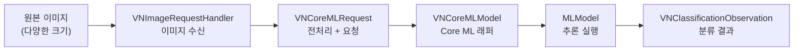
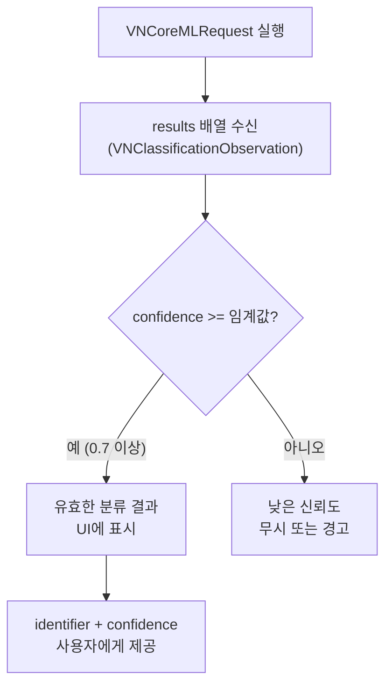
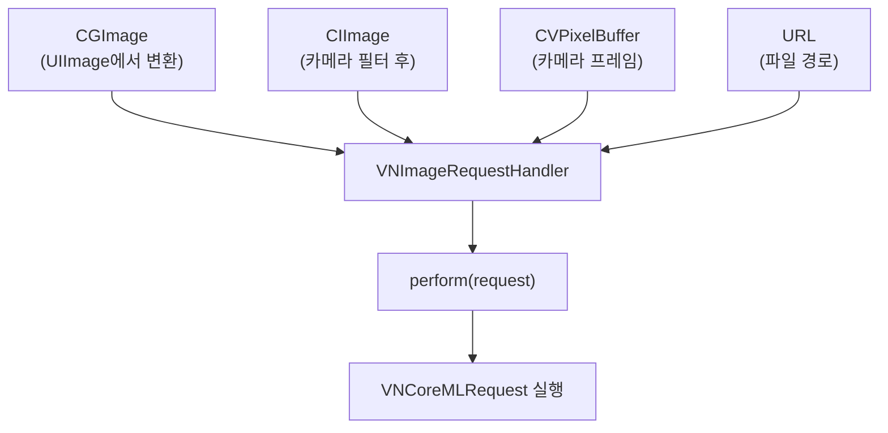
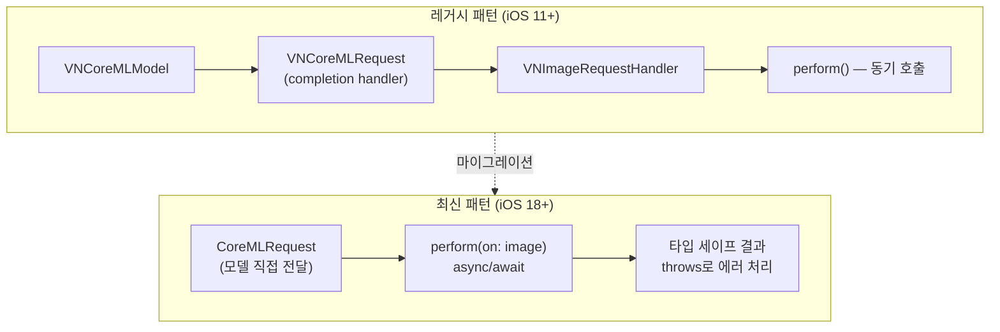
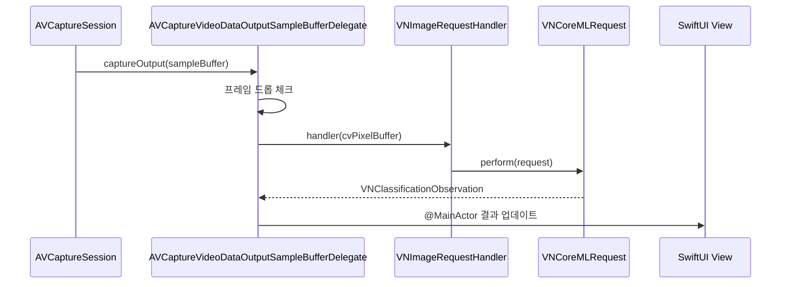
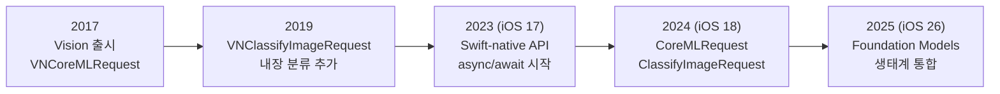

# 03. 이미지 분류 모델 활용

> Vision 프레임워크와 Core ML을 연동하여 이미지 분류 모델을 실행하고, 카메라 피드에서 실시간 분류를 구현합니다.

## 개요

이 섹션에서는 Apple의 Vision 프레임워크를 활용해 Core ML 이미지 분류 모델을 실전에서 사용하는 방법을 배웁니다. 단순히 모델을 로딩하고 prediction()을 호출하는 것을 넘어, Vision이 제공하는 자동 전처리, 결과 해석, 그리고 실시간 카메라 분류까지 다룹니다. iOS 26에서 도입된 최신 async/await Vision API도 함께 살펴봅니다.

**선수 지식**: [Core ML 프레임워크 소개](15-ch15-core-ml-기초/01-01-core-ml-프레임워크-소개.md)에서 배운 Core ML 개요, [Core ML 모델 통합하기](15-ch15-core-ml-기초/02-02-core-ml-모델-통합하기.md)에서 다룬 MLModel 로딩과 prediction 패턴

**학습 목표**:
- Vision 프레임워크의 역할과 Core ML과의 연동 구조를 이해한다
- VNCoreMLRequest로 이미지 분류 파이프라인을 구성한다
- iOS 26의 최신 async/await Vision API 패턴을 익힌다
- VNClassificationObservation의 신뢰도(confidence)를 해석하고 필터링한다
- AVCaptureSession을 활용해 실시간 카메라 분류를 구현한다

## 왜 알아야 할까?

이전 섹션에서 Core ML 모델을 로딩하고 직접 prediction()을 호출하는 방법을 배웠는데요. 그런데 실제로 이미지 모델을 사용하려면 한 가지 골치 아픈 문제가 있습니다 — **이미지 전처리**입니다. 모델은 보통 224×224 픽셀의 정사각형 이미지를 기대하는데, 사용자가 제공하는 사진은 4032×3024 같은 고해상도에 다양한 비율이죠. 직접 리사이징하고, 크롭하고, 픽셀 버퍼로 변환하는 코드를 매번 작성하는 건 정말 번거로운 일입니다.

Vision 프레임워크는 바로 이 문제를 해결해줍니다. Core ML 모델을 Vision에 감싸면, 이미지 크기 조정부터 픽셀 포맷 변환까지 **모든 전처리를 자동으로** 처리해주거든요. 게다가 카메라 프레임이나 사진 라이브러리 이미지 등 다양한 입력 소스를 일관된 API로 처리할 수 있습니다.

실무에서 이미지 분류는 놀라울 만큼 다양한 곳에 쓰입니다:
- 사진 앱의 자동 앨범 분류
- 음식 사진 인식으로 칼로리 추정
- 제조 라인의 불량품 검출
- 의료 이미지 사전 스크리닝

## 핵심 개념

### 개념 1: Vision + Core ML 연동 구조

> 💡 **비유**: 레스토랑에 비유하면, Core ML 모델은 **셰프**(요리하는 사람)이고, Vision 프레임워크는 **주방 매니저**(재료 손질, 접시 세팅 등을 담당하는 사람)입니다. 셰프에게 통째 생선을 던져주면 곤란하잖아요? 주방 매니저가 적절히 손질해서 셰프가 바로 조리할 수 있도록 준비해주는 거죠.

Vision 프레임워크는 Core ML과 함께 사용할 때 세 단계 파이프라인으로 동작합니다:

1. **VNCoreMLModel**: Core ML 모델을 Vision이 이해할 수 있는 형태로 래핑
2. **VNCoreMLRequest**: 이미지 분석 요청을 정의 (전처리 옵션 포함)
3. **VNImageRequestHandler**: 실제 이미지를 받아 요청을 실행

> 📊 **그림 1**: Vision + Core ML 이미지 분류 파이프라인



직접 `prediction()`을 호출하는 것과 비교하면 차이가 명확합니다:

| 방식 | 이미지 리사이징 | 픽셀 포맷 변환 | 결과 형태 | 카메라 연동 | 에러 처리 |
|------|:---:|:---:|------|:---:|:---:|
| 직접 Core ML | 수동 | 수동 | MLFeatureProvider | 수동 | 수동 |
| Vision 연동 (레거시) | 자동 | 자동 | VNClassificationObservation | 용이 | completion handler |
| Vision 연동 (최신) | 자동 | 자동 | ClassificationObservation | 용이 | async/await + throws |

코드로 살펴볼까요? 먼저 **레거시 패턴**(iOS 11+, completion handler 기반)입니다. 기존 프로젝트나 하위 호환이 필요한 경우 이 방식을 사용합니다:

```swift
import Vision
import CoreML

// 1. Core ML 모델을 Vision 모델로 래핑
let mlModel = try MobileNetV2(configuration: MLModelConfiguration()).model
let visionModel = try VNCoreMLModel(for: mlModel)

// 2. 이미지 분석 요청 생성 (completion handler 패턴)
let request = VNCoreMLRequest(model: visionModel) { request, error in
    guard let results = request.results as? [VNClassificationObservation] else { return }
    
    // 상위 3개 결과 출력
    for observation in results.prefix(3) {
        print("\(observation.identifier): \(observation.confidence * 100)%")
    }
}

// 3. 전처리 옵션 설정 — 모델 학습 시 사용한 방식과 맞춰야 함
request.imageCropAndScaleOption = .centerCrop

// 4. 이미지 핸들러로 실행
let handler = VNImageRequestHandler(cgImage: someImage, options: [:])
try handler.perform([request])
```

다음은 **최신 패턴**(iOS 18+/macOS 15+)입니다. Vision 프레임워크가 Swift-native API로 리팩토링되면서 async/await를 완벽하게 지원하게 되었습니다:

```swift
import Vision
import CoreML

// 최신 Swift Vision API — async/await 패턴
func classifyImage(_ cgImage: CGImage) async throws -> [ClassificationObservation] {
    // 1. Core ML 모델을 Vision에 등록
    let mlModel = try MobileNetV2(configuration: .init()).model
    let coreMLRequest = CoreMLRequest(model: mlModel)
    
    // 2. async/await로 직접 실행 — completion handler 불필요
    let results = try await coreMLRequest.perform(on: cgImage)
    
    // 3. 결과가 타입 세이프하게 반환됨
    return results
}

// 사용 예시
Task {
    let results = try await classifyImage(someImage)
    for observation in results.prefix(3) {
        print("\(observation.identifier): \(observation.confidence * 100)%")
    }
}
```

> ⚠️ **흔한 오해**: "레거시 API는 당장 마이그레이션해야 하나요?" — 아닙니다. `VNCoreMLRequest`와 `VNImageRequestHandler`는 deprecated 경고가 나오더라도 당분간 동작합니다. 다만, 새 프로젝트라면 async/await 기반의 최신 API를 사용하는 것이 코드 가독성과 에러 처리 면에서 훨씬 유리합니다.

`imageCropAndScaleOption`이 중요한데요, 이 속성이 모델에 입력되기 전 이미지를 어떻게 가공할지를 결정합니다:

- `.centerCrop`: 중앙을 기준으로 정사각형으로 자르고 리사이징 (가장 일반적)
- `.scaleFill`: 비율 무시하고 가득 채우기
- `.scaleFit`: 비율 유지하며 맞추기 (여백 발생 가능)

### 개념 2: VNClassificationObservation 결과 해석

> 💡 **비유**: 이미지 분류 결과는 시험 채점표와 비슷합니다. "이 사진은 고양이일 확률 92%, 호랑이일 확률 5%, 개일 확률 2%..." 이런 식으로 모든 후보에 대한 확률(신뢰도)을 알려주죠. 우리가 할 일은 이 채점표에서 합격선(threshold)을 정하는 겁니다.

`VNClassificationObservation`은 Vision이 반환하는 분류 결과 객체로, 두 가지 핵심 프로퍼티를 가집니다:

- **`identifier`**: 분류 레이블 문자열 (예: `"golden retriever"`, `"pizza"`)
- **`confidence`**: 0.0~1.0 사이의 신뢰도 값

> 📊 **그림 2**: 신뢰도 기반 결과 필터링 흐름



신뢰도를 해석할 때 주의할 점이 있습니다. 결과 배열은 이미 신뢰도 내림차순으로 정렬되어 있고, 모든 observation의 confidence 합은 1.0이 됩니다. 실무에서는 보통 두 가지 전략을 조합합니다:

```swift
// 분류 결과 처리 유틸리티
struct ClassificationResult {
    let label: String      // 분류 레이블
    let confidence: Float  // 신뢰도 (0.0~1.0)
    
    /// 퍼센트 문자열 (예: "92.3%")
    var percentageString: String {
        String(format: "%.1f%%", confidence * 100)
    }
}

func processClassifications(_ results: [VNClassificationObservation]) -> [ClassificationResult] {
    // 전략 1: 절대 임계값 — 신뢰도 10% 미만은 제외
    let filtered = results.filter { $0.confidence > 0.1 }
    
    // 전략 2: 상위 N개만 취득
    let topResults = filtered.prefix(5)
    
    return topResults.map { observation in
        ClassificationResult(
            label: observation.identifier,
            confidence: observation.confidence
        )
    }
}
```

> ⚠️ **흔한 오해**: "신뢰도 90%면 거의 확실한 거 아냐?" — 꼭 그렇지는 않습니다. 모델이 학습하지 않은 종류의 이미지(예: 추상화)를 입력하면 엉뚱한 레이블에 높은 신뢰도를 부여할 수 있어요. 신뢰도는 "모델이 아는 범위 안에서의 상대적 확률"이지, 절대적 정확도가 아닙니다. 이를 **과잉 확신(overconfidence)** 문제라고 하는데, 실무에서는 반드시 입력 이미지가 모델의 학습 도메인에 속하는지 별도로 검증해야 합니다.

### 개념 3: VNImageRequestHandler의 다양한 입력 소스

> 💡 **비유**: `VNImageRequestHandler`는 **만능 어댑터**입니다. USB-C, Lightning, HDMI — 어떤 케이블을 꽂든 알아서 변환해주는 멀티 어댑터처럼, 어떤 형태의 이미지 데이터를 넣든 Vision이 처리할 수 있게 변환해줍니다.

`VNImageRequestHandler`는 다양한 초기화 방법을 제공합니다. 실무에서 자주 사용하는 입력 소스별 패턴을 정리하면:

> 📊 **그림 3**: 다양한 입력 소스에서 Vision 처리까지의 경로



```swift
import Vision
import UIKit

// 1. UIImage에서 — 사진 라이브러리, 번들 이미지
func classifyFromUIImage(_ image: UIImage) throws {
    guard let cgImage = image.cgImage else { return }
    let handler = VNImageRequestHandler(cgImage: cgImage, options: [:])
    try handler.perform([classificationRequest])
}

// 2. URL에서 — 파일 시스템의 이미지
func classifyFromURL(_ url: URL) throws {
    let handler = VNImageRequestHandler(url: url, options: [:])
    try handler.perform([classificationRequest])
}

// 3. CVPixelBuffer에서 — 카메라 프레임 (실시간 처리)
func classifyFromPixelBuffer(_ buffer: CVPixelBuffer) throws {
    let handler = VNImageRequestHandler(cvPixelBuffer: buffer, options: [:])
    try handler.perform([classificationRequest])
}

// 4. CIImage에서 — Core Image 필터 적용 후
func classifyFromCIImage(_ ciImage: CIImage) throws {
    let handler = VNImageRequestHandler(ciImage: ciImage, options: [:])
    try handler.perform([classificationRequest])
}
```

`options` 딕셔너리에는 이미지 방향 정보를 전달할 수 있습니다. 카메라로 찍은 사진은 EXIF 방향이 중요한데요, 잘못된 방향 정보를 주면 분류 정확도가 크게 떨어집니다:

```swift
// 카메라 EXIF 방향 반영
let handler = VNImageRequestHandler(
    cgImage: cgImage,
    orientation: .right, // 카메라 방향에 맞게 설정
    options: [:]
)
```

### 개념 4: 최신 Vision API — async/await 패턴 (iOS 18+)

> 💡 **비유**: 기존의 completion handler 패턴이 **전화 주문**(주문하고 끊은 다음 콜백 기다리기)이라면, async/await 패턴은 **카운터 주문**(주문하고 바로 앞에서 받기)입니다. 코드 흐름이 훨씬 직관적이죠.

Vision 프레임워크는 iOS 17부터 Swift Concurrency를 지원하기 시작했고, iOS 18/macOS 15에서 본격적으로 Swift-native 타입이 도입되었습니다. WWDC24에서 발표된 `CoreMLRequest`, `ClassifyImageRequest` 등의 새 타입은 기존 `VN` 접두어 클래스를 대체합니다.

> 📊 **그림 4**: 레거시 vs 최신 Vision API 비교



두 패턴을 나란히 비교해보면 차이가 확연합니다:

```swift
// ━━━━━━━━━━━━━━━━━━━━━━━━━━━━━━━
// 레거시 패턴 (iOS 11+) — completion handler
// ━━━━━━━━━━━━━━━━━━━━━━━━━━━━━━━
func classifyLegacy(image: CGImage) {
    let mlModel = try! MobileNetV2(configuration: .init()).model
    let visionModel = try! VNCoreMLModel(for: mlModel)
    
    let request = VNCoreMLRequest(model: visionModel) { request, error in
        // 콜백 안에서 결과 처리 — 에러 처리가 분산됨
        if let error = error {
            print("에러: \(error)")
            return
        }
        guard let results = request.results as? [VNClassificationObservation] else { return }
        // 타입 캐스팅 필요 (as? 실패 가능)
        print(results.first?.identifier ?? "없음")
    }
    
    let handler = VNImageRequestHandler(cgImage: image, options: [:])
    try! handler.perform([request]) // 동기 호출
}

// ━━━━━━━━━━━━━━━━━━━━━━━━━━━━━━━
// 최신 패턴 (iOS 18+) — async/await
// ━━━━━━━━━━━━━━━━━━━━━━━━━━━━━━━
func classifyModern(image: CGImage) async throws {
    let mlModel = try MobileNetV2(configuration: .init()).model
    let request = CoreMLRequest(model: mlModel)
    
    // async/await — 에러는 throws로 일원화
    let observations = try await request.perform(on: image)
    
    // 타입 세이프 — 캐스팅 불필요
    if let top = observations.first {
        print("\(top.identifier): \(top.confidence)")
    }
}
```

최신 API의 장점을 정리하면:

| 특성 | 레거시 (VNCoreMLRequest) | 최신 (CoreMLRequest) |
|------|:---:|:---:|
| 에러 처리 | completion에서 별도 체크 | throws로 통합 |
| 타입 안전성 | as? 캐스팅 필요 | 제네릭으로 타입 보장 |
| 동시성 모델 | DispatchQueue 수동 관리 | async/await 네이티브 |
| 코드 라인 수 | 15~20줄 | 5~8줄 |
| 최소 지원 | iOS 11 | iOS 18 |

> 🔥 **실무 팁**: 최소 배포 타겟이 iOS 18 이상이라면 새 API로 시작하세요. iOS 17 이하를 지원해야 한다면 `if #available(iOS 18, *)` 분기로 양쪽 모두 구현하는 것이 가장 안전합니다. Apple은 레거시 API를 바로 제거하지는 않지만, 향후 새로운 기능은 최신 API에만 추가될 가능성이 높습니다.

### 개념 5: 실시간 카메라 분류 아키텍처

> 💡 **비유**: 실시간 카메라 분류는 **공항 보안 검색대**와 같습니다. 컨베이어 벨트(카메라 프레임)가 쉴 새 없이 흘러가고, X-ray 기사(Vision + Core ML)가 각 프레임을 빠르게 검사하죠. 단, 모든 프레임을 검사하면 과부하가 걸리니까, 일정 간격으로 샘플링해서 처리하는 게 핵심입니다.

실시간 분류는 AVFoundation의 카메라 파이프라인과 Vision을 결합합니다:

> 📊 **그림 5**: 실시간 카메라 분류 시퀀스



카메라 매니저의 핵심 구현을 살펴보겠습니다:

```swift
import AVFoundation
import Vision

/// 카메라 프레임을 캡처하고 분류를 실행하는 매니저
class CameraClassifier: NSObject, ObservableObject {
    private let captureSession = AVCaptureSession()
    private let videoOutput = AVCaptureVideoDataOutput()
    private let processingQueue = DispatchQueue(label: "vision.processing")
    
    // 분류 결과를 UI에 바인딩
    @Published var topClassification: String = "분석 중..."
    @Published var confidence: Float = 0.0
    
    // 프레임 드롭 제어 — 매 프레임 처리하면 과부하
    private var isProcessing = false
    
    // MARK: - Vision 요청 설정
    private lazy var classificationRequest: VNCoreMLRequest = {
        guard let model = try? VNCoreMLModel(
            for: MobileNetV2(configuration: .init()).model
        ) else {
            fatalError("모델 로딩 실패")
        }
        
        let request = VNCoreMLRequest(model: model) { [weak self] request, error in
            self?.handleClassification(request: request, error: error)
        }
        request.imageCropAndScaleOption = .centerCrop
        return request
    }()
    
    // MARK: - 카메라 세션 구성
    func setupCamera() {
        captureSession.sessionPreset = .medium // 분류에는 높은 해상도 불필요
        
        guard let camera = AVCaptureDevice.default(.builtInWideAngleCamera,
                                                     for: .video,
                                                     position: .back),
              let input = try? AVCaptureDeviceInput(device: camera) else { return }
        
        captureSession.addInput(input)
        
        // 비디오 출력 설정 — 최신 프레임만 유지
        videoOutput.alwaysDiscardsLateVideoFrames = true
        videoOutput.setSampleBufferDelegate(self, queue: processingQueue)
        captureSession.addOutput(videoOutput)
        
        // 백그라운드에서 세션 시작
        DispatchQueue.global(qos: .userInitiated).async { [weak self] in
            self?.captureSession.startRunning()
        }
    }
    
    // MARK: - 결과 처리
    private func handleClassification(request: VNRequest, error: Error?) {
        defer { isProcessing = false } // 처리 완료 → 다음 프레임 허용
        
        guard let results = request.results as? [VNClassificationObservation],
              let top = results.first else { return }
        
        // UI 업데이트는 메인 스레드에서
        DispatchQueue.main.async { [weak self] in
            self?.topClassification = top.identifier
            self?.confidence = top.confidence
        }
    }
}
```

그리고 `AVCaptureVideoDataOutputSampleBufferDelegate`를 구현합니다:

```swift
extension CameraClassifier: AVCaptureVideoDataOutputSampleBufferDelegate {
    func captureOutput(_ output: AVCaptureOutput,
                       didOutput sampleBuffer: CMSampleBuffer,
                       from connection: AVCaptureConnection) {
        // 이전 프레임 처리 중이면 이번 프레임은 건너뛰기
        guard !isProcessing else { return }
        isProcessing = true
        
        guard let pixelBuffer = CMSampleBufferGetImageBuffer(sampleBuffer) else {
            isProcessing = false
            return
        }
        
        // Vision 핸들러로 분류 실행
        let handler = VNImageRequestHandler(
            cvPixelBuffer: pixelBuffer,
            orientation: .right, // 후면 카메라 기본 방향
            options: [:]
        )
        
        do {
            try handler.perform([classificationRequest])
        } catch {
            print("분류 실패: \(error.localizedDescription)")
            isProcessing = false
        }
    }
}
```

> 🔥 **실무 팁**: `alwaysDiscardsLateVideoFrames = true`와 `isProcessing` 플래그의 조합이 핵심입니다. 카메라는 초당 30프레임을 쏟아내지만, Core ML 추론은 프레임당 수십 ms가 걸리거든요. 처리 중인 프레임이 있으면 나머지는 과감히 버려야 앱이 버벅이지 않습니다.

## 실습: 직접 해보기

사진 라이브러리에서 선택한 이미지를 분류하는 완전한 SwiftUI 앱을 만들어봅시다. MobileNetV2 모델을 사용합니다. (Apple Developer에서 [Core ML 모델 갤러리](https://developer.apple.com/machine-learning/models/)로부터 MobileNetV2.mlmodel을 다운로드하여 프로젝트에 추가하세요.)

아래 코드는 **최신 async/await API**를 우선 사용하되, iOS 18 미만에서는 레거시 패턴으로 폴백하는 실전형 구현입니다:

```swift
import SwiftUI
import PhotosUI
import Vision
import CoreML

// MARK: - 분류 결과 모델
struct ImageClassification: Identifiable {
    let id = UUID()
    let label: String
    let confidence: Float
    
    var percentText: String {
        String(format: "%.1f%%", confidence * 100)
    }
}

// MARK: - 분류 서비스
@Observable
class ImageClassifierService {
    var classifications: [ImageClassification] = []
    var isClassifying = false
    var errorMessage: String?
    
    private let mlModel: MLModel
    
    init() {
        let config = MLModelConfiguration()
        config.computeUnits = .all // Neural Engine 포함 전체 활용
        self.mlModel = try! MobileNetV2(configuration: config).model
    }
    
    // MARK: - 분류 실행 (최신 API 우선)
    func classify(image: UIImage) {
        guard let cgImage = image.cgImage else {
            errorMessage = "이미지를 변환할 수 없습니다"
            return
        }
        
        isClassifying = true
        classifications = []
        errorMessage = nil
        
        Task {
            do {
                let results: [ImageClassification]
                
                if #available(iOS 18, *) {
                    // 최신 async/await 패턴
                    results = try await classifyWithModernAPI(cgImage)
                } else {
                    // 레거시 completion handler 패턴
                    results = try await classifyWithLegacyAPI(cgImage)
                }
                
                await MainActor.run {
                    self.classifications = results
                    self.isClassifying = false
                }
            } catch {
                await MainActor.run {
                    self.errorMessage = "분류 실패: \(error.localizedDescription)"
                    self.isClassifying = false
                }
            }
        }
    }
    
    // MARK: - 최신 API (iOS 18+)
    @available(iOS 18, *)
    private func classifyWithModernAPI(_ cgImage: CGImage) async throws -> [ImageClassification] {
        let request = CoreMLRequest(model: mlModel)
        let observations = try await request.perform(on: cgImage)
        
        return observations
            .filter { $0.confidence > 0.01 }
            .prefix(5)
            .map { ImageClassification(label: $0.identifier, confidence: $0.confidence) }
    }
    
    // MARK: - 레거시 API (iOS 11+)
    private func classifyWithLegacyAPI(_ cgImage: CGImage) async throws -> [ImageClassification] {
        try await withCheckedThrowingContinuation { continuation in
            guard let visionModel = try? VNCoreMLModel(for: mlModel) else {
                continuation.resume(throwing: ClassificationError.modelLoadFailed)
                return
            }
            
            let request = VNCoreMLRequest(model: visionModel) { request, error in
                if let error = error {
                    continuation.resume(throwing: error)
                    return
                }
                
                let results = (request.results as? [VNClassificationObservation] ?? [])
                    .filter { $0.confidence > 0.01 }
                    .prefix(5)
                    .map { ImageClassification(label: $0.identifier, confidence: $0.confidence) }
                
                continuation.resume(returning: Array(results))
            }
            request.imageCropAndScaleOption = .centerCrop
            
            let handler = VNImageRequestHandler(cgImage: cgImage, orientation: .up, options: [:])
            do {
                try handler.perform([request])
            } catch {
                continuation.resume(throwing: error)
            }
        }
    }
    
    enum ClassificationError: Error {
        case modelLoadFailed
    }
}

// MARK: - SwiftUI 뷰
struct ImageClassifierView: View {
    @State private var classifier = ImageClassifierService()
    @State private var selectedItem: PhotosPickerItem?
    @State private var selectedImage: UIImage?
    
    var body: some View {
        NavigationStack {
            VStack(spacing: 20) {
                // 이미지 표시 영역
                if let image = selectedImage {
                    Image(uiImage: image)
                        .resizable()
                        .scaledToFit()
                        .frame(maxHeight: 300)
                        .clipShape(RoundedRectangle(cornerRadius: 12))
                } else {
                    ContentUnavailableView(
                        "이미지를 선택하세요",
                        systemImage: "photo.on.rectangle",
                        description: Text("사진 라이브러리에서 분류할 이미지를 골라보세요")
                    )
                    .frame(height: 300)
                }
                
                // 사진 선택 버튼
                PhotosPicker(selection: $selectedItem, matching: .images) {
                    Label("사진 선택", systemImage: "photo.badge.plus")
                        .font(.headline)
                }
                .buttonStyle(.borderedProminent)
                
                // 분류 결과 목록
                if classifier.isClassifying {
                    ProgressView("분류 중...")
                } else if !classifier.classifications.isEmpty {
                    resultsList
                }
                
                // 에러 표시
                if let error = classifier.errorMessage {
                    Text(error)
                        .foregroundStyle(.red)
                        .font(.caption)
                }
                
                Spacer()
            }
            .padding()
            .navigationTitle("이미지 분류")
            .onChange(of: selectedItem) { _, newItem in
                loadAndClassify(item: newItem)
            }
        }
    }
    
    // MARK: - 결과 리스트 뷰
    private var resultsList: some View {
        VStack(alignment: .leading, spacing: 8) {
            Text("분류 결과")
                .font(.headline)
            
            ForEach(classifier.classifications) { result in
                HStack {
                    Text(result.label)
                        .font(.body)
                    Spacer()
                    Text(result.percentText)
                        .font(.body.monospacedDigit())
                        .foregroundStyle(.secondary)
                    
                    // 신뢰도 바
                    RoundedRectangle(cornerRadius: 4)
                        .fill(barColor(for: result.confidence))
                        .frame(width: CGFloat(result.confidence) * 100, height: 8)
                }
            }
        }
        .padding()
        .background(.regularMaterial, in: RoundedRectangle(cornerRadius: 12))
    }
    
    // MARK: - 헬퍼
    private func loadAndClassify(item: PhotosPickerItem?) {
        guard let item else { return }
        
        Task {
            guard let data = try? await item.loadTransferable(type: Data.self),
                  let uiImage = UIImage(data: data) else { return }
            
            selectedImage = uiImage
            classifier.classify(image: uiImage)
        }
    }
    
    private func barColor(for confidence: Float) -> Color {
        switch confidence {
        case 0.7...: .green
        case 0.3...: .orange
        default: .red
        }
    }
}
```

이 코드를 실행하면 사진을 선택할 때마다 MobileNetV2가 상위 5개 분류 결과를 신뢰도와 함께 표시합니다. Neural Engine이 있는 기기에서는 추론이 수 밀리초 안에 완료되어 거의 즉각적인 반응을 보여줍니다. iOS 18 이상에서는 최신 async API가, 그 이하에서는 레거시 API가 자동으로 선택됩니다.

> 💡 **알고 계셨나요?**: MobileNetV2 모델의 `.mlpackage` 파일 크기는 약 24MB에 불과하지만, ImageNet의 1,000개 카테고리를 분류할 수 있습니다. Apple이 Core ML 갤러리에서 제공하는 이 모델은 이미 Core ML 형식으로 최적화되어 있어 별도 변환 없이 바로 사용할 수 있어요.

## 더 깊이 알아보기

### Vision 프레임워크의 탄생 배경

Vision 프레임워크는 2017년 WWDC에서 처음 공개되었습니다. 당시 Apple은 Core ML과 함께 Vision을 발표했는데, 재미있는 배경이 있습니다. Core ML 이전에 개발자들이 직접 머신러닝 모델을 iOS에 통합하려면 TensorFlow Lite나 Caffe2를 직접 빌드하고, Metal 셰이더로 GPU 가속을 구현하고, 입력 텐서를 수동으로 구성해야 했거든요. 이 과정이 너무 복잡해서 실제로 온디바이스 ML을 활용하는 앱은 극소수였습니다.

Apple 엔지니어팀은 "**모델을 실행하는 건 쉽게, 이미지를 모델에 맞게 준비하는 것도 쉽게**"라는 철학으로 Vision을 설계했습니다. 특히 `VNCoreMLRequest`가 핵심이었는데, 이 클래스 하나로 이미지 전처리 → 추론 → 결과 수신의 전 과정을 표준화했죠.

### MobileNet의 혁신

MobileNetV2가 이미지 분류의 대표 모델이 된 것도 흥미로운 이야기입니다. 2018년 Google 연구팀(Mark Sandler 등)이 발표한 이 모델은 **Inverted Residual** 구조와 **Linear Bottleneck**이라는 두 가지 핵심 아이디어로, 데스크톱 수준의 정확도를 모바일 기기에서 달성했습니다. "적은 연산으로 더 나은 정확도"라는 목표를 실현한 것이죠. Apple이 Core ML 모델 갤러리에 MobileNetV2를 기본 모델로 제공하는 것도 이런 효율성 때문입니다.

### Vision API의 진화 — Objective-C에서 Swift Concurrency까지

Vision 프레임워크는 해마다 진화해왔습니다. 처음 출시 당시에는 Objective-C 기반의 `VN` 접두어 클래스와 completion handler 패턴이 전부였는데요, 점차 Swift-native API로 전환되고 있습니다.

> 📊 **그림 6**: Vision API 진화 타임라인



이 전환은 단순한 API 리네이밍이 아닙니다. 핵심적인 변화를 정리하면:

| 세대 | 시기 | 요청 타입 | 실행 방식 | 결과 타입 |
|------|------|---------|-----------|----------|
| 1세대 | 2017 (iOS 11) | `VNCoreMLRequest` | completion handler | `[Any]` → 캐스팅 |
| 2세대 | 2019 (iOS 13) | `VNClassifyImageRequest` | completion handler | `[VNClassificationObservation]` |
| 3세대 | 2024 (iOS 18) | `CoreMLRequest` | async/await | 타입 세이프 결과 |

Apple이 이런 전환을 추진하는 이유는 명확합니다. Swift Concurrency가 앱의 메인 스레드 안전성을 보장하는 핵심 도구가 되면서, Vision처럼 무거운 작업을 수행하는 프레임워크가 가장 먼저 최적화 대상이 된 것이죠. 새 API에서는 `@MainActor` 격리나 `Sendable` 준수가 기본으로 적용되어, 실시간 카메라 분류 같은 동시성 코드를 훨씬 안전하게 작성할 수 있습니다.

## 흔한 오해와 팁

> ⚠️ **흔한 오해**: "Vision을 쓰면 Core ML보다 느린 거 아냐?" — 아닙니다. Vision의 전처리 오버헤드는 무시할 수준(수 마이크로초)이며, 내부적으로 Core ML과 동일한 추론 경로를 탑니다. 오히려 Vision이 이미지 포맷을 최적으로 변환해주기 때문에 직접 구현한 전처리보다 빠를 수 있습니다.

> 💡 **알고 계셨나요?**: `VNImageRequestHandler`에 여러 요청을 배열로 전달하면(`perform([request1, request2, ...])`) 같은 이미지에 대해 분류와 객체 탐지를 동시에 실행할 수 있습니다. Vision이 내부적으로 이미지 전처리를 공유하기 때문에 개별 실행보다 효율적이에요.

> 🔥 **실무 팁**: 실시간 카메라 분류 시 `captureSession.sessionPreset`을 `.high`가 아닌 `.medium`으로 설정하세요. 이미지 분류 모델은 어차피 224×224로 축소하므로, 고해상도 프레임을 캡처하는 건 메모리와 배터리 낭비입니다. `.medium`(720p)이면 분류 정확도에 전혀 차이가 없으면서 전력 소모를 크게 줄일 수 있습니다.

> 🔥 **실무 팁**: 이미지 방향(`orientation`) 파라미터를 절대 무시하지 마세요. 카메라로 찍은 사진은 기기 방향에 따라 EXIF 정보가 달라지는데, Vision에 올바른 방향을 전달하지 않으면 모델이 회전된 이미지를 분석하게 되어 정확도가 급격히 떨어집니다. `CGImagePropertyOrientation`을 사용해 EXIF 방향을 CGImage 방향으로 변환하세요.

> 🔥 **실무 팁**: 레거시 `VNCoreMLRequest`에서 최신 `CoreMLRequest`로 마이그레이션할 때, `withCheckedThrowingContinuation`으로 감싸면 기존 코드를 async/await 인터페이스로 점진적으로 전환할 수 있습니다. 실습 코드의 `classifyWithLegacyAPI()` 메서드가 바로 이 패턴입니다.

## 핵심 정리

| 개념 | 설명 |
|------|------|
| VNCoreMLModel | Core ML 모델을 Vision 프레임워크에서 사용할 수 있도록 래핑하는 클래스 (레거시) |
| VNCoreMLRequest | Vision에서 Core ML 모델 추론을 실행하는 이미지 분석 요청 (레거시, completion handler) |
| CoreMLRequest | iOS 18+의 최신 Vision API — async/await 네이티브, 타입 세이프 결과 반환 |
| VNImageRequestHandler | 다양한 소스(CGImage, URL, CVPixelBuffer 등)의 이미지를 받아 요청을 실행 |
| VNClassificationObservation | 분류 결과 — `identifier`(레이블)와 `confidence`(0.0~1.0) 포함 |
| imageCropAndScaleOption | 모델에 입력되기 전 이미지 전처리 방식 (.centerCrop, .scaleFill 등) |
| 실시간 분류 | AVCaptureSession + Vision 조합, 프레임 드롭으로 과부하 방지 필수 |
| 신뢰도 필터링 | 절대 임계값 + 상위 N개 조합으로 의미 있는 결과만 추출 |
| API 마이그레이션 | `if #available(iOS 18, *)`로 최신/레거시 분기, 점진적 전환 가능 |

## 다음 섹션 미리보기

이번 섹션에서는 Apple이 제공하는 사전 학습 모델(MobileNetV2)을 활용했는데요, 실제로는 더 다양하고 특화된 모델이 필요한 경우가 많습니다. 다음 섹션 [Hugging Face Core ML 모델 갤러리](15-ch15-core-ml-기초/04-04-hugging-face-core-ml-모델-갤러리.md)에서는 Hugging Face의 Core ML 갤러리에서 수백 가지 사전 변환 모델을 탐색하고, 원하는 모델을 프로젝트에 통합하는 방법을 배웁니다. Apple 갤러리를 넘어서는 더 넓은 모델 생태계를 경험할 수 있을 거예요.

## 참고 자료

- [Classifying Images with Vision and Core ML — Apple Developer Documentation](https://developer.apple.com/documentation/CoreML/classifying-images-with-vision-and-core-ml) - Vision + Core ML 이미지 분류의 공식 가이드, 전체 구현 패턴 포함
- [VNCoreMLRequest — Apple Developer Documentation](https://developer.apple.com/documentation/vision/vncoremlrequest) - VNCoreMLRequest API 레퍼런스, imageCropAndScaleOption 등 속성 상세
- [Vision — Apple Developer Documentation](https://developer.apple.com/documentation/vision) - Vision 프레임워크 전체 레퍼런스
- [Core ML Models Gallery — Apple Developer](https://developer.apple.com/machine-learning/models/) - MobileNetV2 등 사전 학습된 Core ML 모델 다운로드
- [Discover Swift enhancements in the Vision framework — WWDC24](https://developer.apple.com/videos/play/wwdc2024/10163/) - Vision 프레임워크의 최신 Swift API 개선사항, CoreMLRequest 등 소개
- [Using an Image Classification ML Model in an iOS App with SwiftUI — Create with Swift](https://www.createwithswift.com/tutorial-core-ml-using-an-image-classification-machine-learning-model-in-an-ios-app-with-swiftui/) - SwiftUI에서 이미지 분류 모델을 통합하는 실전 튜토리얼

---
### 🔗 Related Sessions
- [core ml](01-ch1-apple-intelligence와-온디바이스-ai/02-02-apple-aiml-프레임워크-생태계.md) (prerequisite)
- [computeunits](15-ch15-core-ml-기초/01-01-core-ml-프레임워크-소개.md) (prerequisite)
