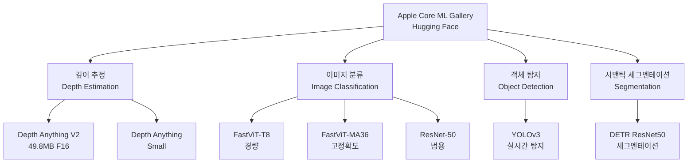
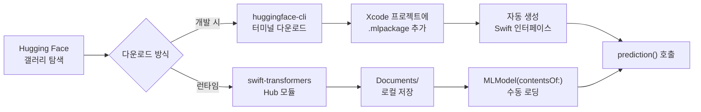
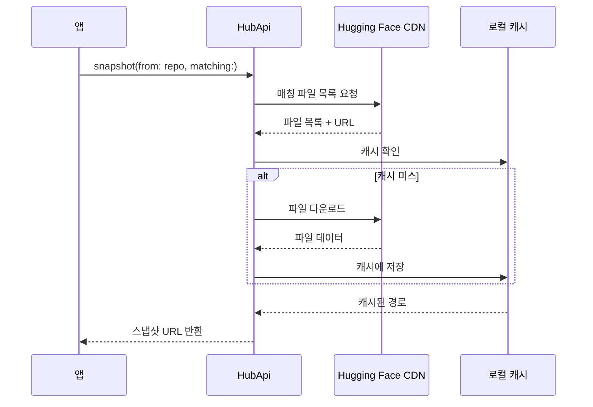
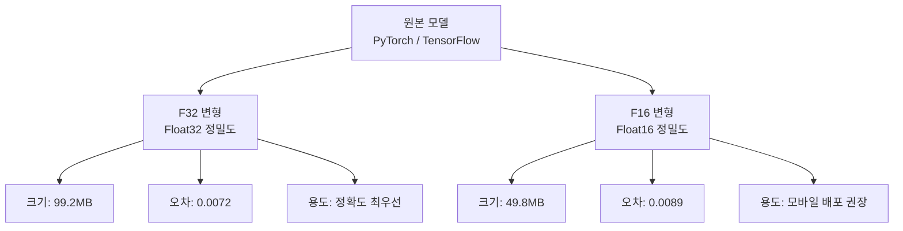
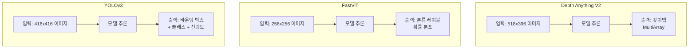

# Hugging Face Core ML 모델 갤러리

> Apple 공식 Core ML 갤러리에서 사전 변환된 최첨단 모델을 다운로드하고, 내 앱에 즉시 통합하는 방법을 배웁니다.

## 개요

이 섹션에서는 Apple이 Hugging Face에 공개한 Core ML 갤러리 모델 컬렉션을 탐색하고, 실제 앱에 통합하는 전체 워크플로를 학습합니다. 직접 모델을 학습하거나 변환하지 않고도, 검증된 최첨단 모델을 몇 분 만에 프로젝트에 추가할 수 있습니다.

**선수 지식**: [Core ML 모델 통합하기](15-ch15-core-ml-기초/02-02-core-ml-모델-통합하기.md)에서 배운 MLModel 로딩과 prediction API, [이미지 분류 모델 활용](15-ch15-core-ml-기초/03-03-이미지-분류-모델-활용.md)에서 배운 Vision 프레임워크 연동 패턴

**학습 목표**:
- Apple Core ML 갤러리의 구성과 제공 모델 카테고리를 파악한다
- `huggingface-cli`와 `swift-transformers` 패키지로 모델을 다운로드한다
- Depth Anything V2, FastViT 등 갤러리 모델을 앱에 통합한다
- 모델 변형(F16/F32) 간 성능-정확도 트레이드오프를 이해한다

## 왜 알아야 할까?

ML 앱 개발에서 가장 큰 진입 장벽 중 하나는 "좋은 모델을 어디서 구하느냐"입니다. 직접 학습하려면 데이터 수집, GPU 자원, 학습 파이프라인 구축에 수주~수개월이 걸리죠. Python으로 학습된 모델을 `coremltools`로 변환하는 과정에서도 호환성 문제가 자주 발생합니다.

Apple은 이 문제를 해결하기 위해 Hugging Face에 **공식 Core ML 갤러리**를 운영하고 있습니다. 깊이 추정, 이미지 분류, 객체 탐지, 시맨틱 세그멘테이션 등 검증된 모델이 `.mlpackage` 형식으로 변환되어 있어, 다운로드 후 바로 Xcode에 추가할 수 있습니다. 더 나아가 Hugging Face의 `swift-transformers` 패키지에 포함된 `Hub` 모듈을 사용하면 앱 내에서 런타임에 모델을 다운로드하는 것까지 가능합니다.

## 핵심 개념

### 개념 1: Apple Core ML 갤러리 구조

> 💡 **비유**: Core ML 갤러리는 "앱스토어의 ML 버전"이라고 생각하면 됩니다. 앱스토어에서 이미 만들어진 앱을 설치하듯, 갤러리에서 이미 변환 완료된 ML 모델을 다운로드해서 내 프로젝트에 넣기만 하면 되거든요.

Apple은 Hugging Face(허깅 페이스)에 공식 조직 계정(`apple`)을 운영하며, **Core ML Gallery Models** 컬렉션을 통해 검증된 모델을 제공합니다. 이 모델들은 Apple 엔지니어가 직접 `.mlpackage` 형식으로 변환하고, Neural Engine 최적화까지 완료한 것들입니다.

> 📊 **그림 1**: Core ML 갤러리 모델 카테고리 구조



현재 갤러리에 제공되는 주요 모델을 정리하면 다음과 같습니다:

| 모델 | 태스크 | 크기 (F16) | 특징 |
|------|--------|-----------|------|
| **Depth Anything V2** | 깊이 추정 | 49.8MB | 실시간 단안 깊이맵 생성, CVPR 2024 기반 |
| **Depth Anything** | 깊이 추정 | ~49MB | 1세대 모델, V2 대비 정확도 낮지만 호환성 우수 |
| **FastViT-T8** | 이미지 분류 | ~8MB | 모바일 최적화 경량 모델, ICCV 2023 |
| **FastViT-SA12** | 이미지 분류 | ~24MB | 정확도와 속도의 균형 모델 |
| **FastViT-MA36** | 이미지 분류 | ~88MB | 고정확도 분류, 서버/데스크탑 권장 |
| **ResNet-50** | 이미지 분류 | ~25MB | ImageNet 기준(baseline) 모델, 범용 |
| **MobileNetV2** | 이미지 분류 | ~14MB | Google의 경량 분류 모델 |
| **YOLOv3** | 객체 탐지 | ~8.9MB | 80종 객체 실시간 탐지 |
| **DETR ResNet50** | 세그멘테이션 | ~43MB | Transformer 기반 픽셀 수준 영역 분할 |

각 모델은 Hugging Face 모델 카드에서 벤치마크 결과, 라이선스(대부분 MIT 또는 Apache 2.0), 그리고 입출력 스펙을 확인할 수 있습니다. 모델 저장소 이름은 `apple/coreml-{모델명}` 패턴을 따르므로, `apple/coreml-depth-anything-v2-small`처럼 검색하면 됩니다.

여기에 더해 Apple 개발자 사이트(`developer.apple.com/machine-learning/models/`)에서도 직접 다운로드할 수 있는 모델을 제공하는데요, 갤러리의 모델과 상당 부분 겹치면서도 BERT-SQuAD(질의응답), MNIST(손글씨) 같은 추가 모델이 포함되어 있습니다.

### 개념 2: 모델 다운로드 워크플로

> 💡 **비유**: 모델을 가져오는 방법은 두 가지입니다. "마트에 가서 직접 사오는 것"(CLI 다운로드)과 "배달 앱으로 주문하는 것"(앱 내 런타임 다운로드)이죠. 개발 중에는 CLI가 편하고, 출시 후 모델 업데이트가 필요하면 런타임 다운로드가 유리합니다.

> 📊 **그림 2**: 모델 다운로드에서 앱 통합까지의 워크플로



**방법 1: `huggingface-cli`로 터미널 다운로드**

가장 일반적인 방법입니다. Homebrew로 CLI를 설치하고, 원하는 모델을 지정해서 받습니다.

```console
# huggingface-cli 설치
$ brew install huggingface-cli

# 특정 모델만 다운로드 (F16 권장)
$ huggingface-cli download \
  --local-dir models --local-dir-use-symlinks False \
  apple/coreml-depth-anything-v2-small \
  --include "DepthAnythingV2SmallF16.mlpackage/*"

# 전체 변형 다운로드
$ huggingface-cli download \
  --local-dir models --local-dir-use-symlinks False \
  apple/coreml-depth-anything-v2-small
```

다운로드된 `.mlpackage` 파일을 Xcode 프로젝트에 드래그하면, [이전 섹션](15-ch15-core-ml-기초/02-02-core-ml-모델-통합하기.md)에서 배운 것처럼 자동으로 Swift 인터페이스가 생성됩니다.

**방법 2: `swift-transformers` Hub 모듈로 런타임 다운로드**

앱이 출시된 뒤 모델을 업데이트하거나, 사용자 선택에 따라 다른 모델을 제공해야 한다면 런타임 다운로드가 필요합니다. Hugging Face의 공식 Swift 패키지인 `swift-transformers`에 포함된 `Hub` 모듈이 이 역할을 합니다.

```swift
// Package.swift에 의존성 추가
// .package(url: "https://github.com/huggingface/swift-transformers.git", from: "0.1.12")
// 타겟 dependencies에 "Hub" 추가

import Hub

/// Hugging Face에서 Core ML 모델을 다운로드하는 매니저
@Observable
class ModelDownloader {
    var downloadProgress: Double = 0
    var isDownloading = false
    
    /// 지정한 모델을 로컬에 다운로드
    func downloadModel(
        repoId: String,
        matching globs: [String] = ["*.mlpackage/*"]
    ) async throws -> URL {
        isDownloading = true
        defer { isDownloading = false }
        
        // HubApi 인스턴스 생성
        let hubApi = HubApi()
        let repo = Hub.Repo(id: repoId)
        
        // snapshot으로 매칭되는 파일 일괄 다운로드
        // 기본 캐시 위치: ~/.cache/huggingface/hub
        let snapshotURL = try await hubApi.snapshot(
            from: repo,
            matching: globs
        )
        
        return snapshotURL
    }
    
    /// 특정 파일만 다운로드 (가벼운 용도)
    func downloadSingleFile(
        repoId: String,
        filename: String
    ) async throws -> URL {
        let hubApi = HubApi()
        let repo = Hub.Repo(id: repoId)
        
        // 개별 파일 다운로드
        let fileURL = try await hubApi.snapshot(
            from: repo,
            matching: [filename]
        )
        
        return fileURL
    }
}
```

> 📊 **그림 5**: HubApi 다운로드 흐름



> ⚠️ **흔한 오해**: 온라인에서 `HubClient.default` 또는 `client.downloadFile` 같은 API 예제를 볼 수 있는데, 이는 오래된 버전이거나 잘못된 정보입니다. 2024년 이후 `swift-transformers` 패키지의 `Hub` 모듈에서는 **`HubApi`** 클래스와 **`snapshot(from:matching:)`** 메서드가 공식 API입니다. 반드시 최신 문서를 확인하세요.

### 개념 3: 모델 변형과 정밀도 선택

> 💡 **비유**: 사진을 저장할 때 RAW(원본 화질)로 저장할지 JPEG(압축)으로 저장할지 선택하는 것과 비슷해요. F32(Float32)는 RAW처럼 정확하지만 크고, F16(Float16)은 JPEG처럼 약간의 정확도를 양보하는 대신 절반 크기에 더 빠릅니다.

Apple 갤러리 모델은 대부분 **두 가지 변형**을 제공합니다:

> 📊 **그림 3**: F32 vs F16 정밀도 비교



Depth Anything V2 Small 모델을 예로 들면:

| 항목 | F32 | F16 |
|------|-----|-----|
| 파라미터 수 | 24.8M | 24.8M |
| 파일 크기 | 99.2MB | 49.8MB |
| Abs-Rel 오차 | 0.0072 | 0.0089 |
| iPhone 15 Pro 추론 | ~40ms | ~34ms |
| MacBook M3 Max 추론 | ~30ms | ~25ms |

실무에서는 **거의 항상 F16을 선택**합니다. 파일 크기가 절반이면서 추론 속도도 더 빠르고, 0.002 수준의 정확도 차이는 실제 사용자 경험에서 구분할 수 없는 수준이거든요. Neural Engine 자체가 F16에 최적화되어 있기 때문에, F32를 넣어도 내부적으로 F16으로 다운캐스팅되는 경우가 많습니다.

### 개념 4: 갤러리 모델의 입출력 이해와 통합

갤러리 모델을 사용할 때 가장 중요한 것은 **각 모델의 입출력 스펙을 정확히 파악**하는 것입니다. Hugging Face 모델 카드에는 입력 이미지 크기, 출력 형식, 전처리 요구사항이 명시되어 있습니다.

> 📊 **그림 4**: 갤러리 모델별 입출력 파이프라인 비교



모델마다 기대하는 입력 해상도가 다르다는 점에 주의하세요. [이전 섹션](15-ch15-core-ml-기초/03-03-이미지-분류-모델-활용.md)에서 배운 Vision 프레임워크의 `VNCoreMLRequest`를 사용하면, `imageCropAndScaleOption`이 자동으로 리사이징을 처리해줍니다. 하지만 Vision 프레임워크를 거치지 않고 직접 `MLModel`에 입력할 때는 모델 카드에 명시된 크기로 직접 변환해야 합니다.

```swift
import CoreML
import CoreImage

/// Depth Anything V2 모델 래퍼
class DepthEstimator {
    private let model: MLModel
    private let context = CIContext()
    
    // 모델이 기대하는 입력 크기
    private let inputWidth = 518
    private let inputHeight = 396
    
    init() throws {
        // Xcode에 추가된 모델을 컴파일된 경로에서 로딩
        let config = MLModelConfiguration()
        config.computeUnits = .all  // Neural Engine 우선 사용
        
        guard let modelURL = Bundle.main.url(
            forResource: "DepthAnythingV2SmallF16",
            withExtension: "mlmodelc"
        ) else {
            throw DepthEstimatorError.modelNotFound
        }
        
        self.model = try MLModel(contentsOf: modelURL, configuration: config)
    }
    
    /// 입력 이미지에서 깊이맵 생성
    func estimateDepth(from image: CGImage) async throws -> MLMultiArray {
        // 모델 입력 크기로 리사이징
        let ciImage = CIImage(cgImage: image)
        let scaleX = CGFloat(inputWidth) / ciImage.extent.width
        let scaleY = CGFloat(inputHeight) / ciImage.extent.height
        let resized = ciImage.transformed(by: CGAffineTransform(scaleX: scaleX, y: scaleY))
        
        // CVPixelBuffer로 변환
        guard let pixelBuffer = context.render(resized) else {
            throw DepthEstimatorError.preprocessingFailed
        }
        
        // 예측 실행
        let input = try MLDictionaryFeatureProvider(
            dictionary: ["image": MLFeatureValue(pixelBuffer: pixelBuffer)]
        )
        let result = try await model.prediction(from: input)
        
        guard let depthMap = result.featureValue(for: "depth")?.multiArrayValue else {
            throw DepthEstimatorError.invalidOutput
        }
        
        return depthMap
    }
}

enum DepthEstimatorError: Error {
    case modelNotFound
    case preprocessingFailed
    case invalidOutput
}
```

> ⚠️ **흔한 오해**: "갤러리 모델은 그냥 넣으면 바로 되겠지?"라고 생각하기 쉽지만, 모델마다 입력 형식이 다릅니다. 반드시 Hugging Face 모델 카드의 입출력 스펙을 확인하세요. 입력 키 이름(`"image"`, `"input_image"` 등)이 모델마다 다를 수 있습니다.

## 실습: 직접 해보기

Depth Anything V2 모델을 사용해서 사진의 깊이를 추정하고, SwiftUI로 시각화하는 완전한 앱을 만들어봅시다.

**Step 1: 모델 다운로드 및 프로젝트 추가**

```console
# 터미널에서 F16 모델 다운로드
$ huggingface-cli download \
  --local-dir ./models --local-dir-use-symlinks False \
  apple/coreml-depth-anything-v2-small \
  --include "DepthAnythingV2SmallF16.mlpackage/*"
```

다운로드된 `DepthAnythingV2SmallF16.mlpackage`를 Xcode 프로젝트에 드래그합니다.

**Step 2: 깊이 추정 서비스 구현**

```swift
import CoreML
import Vision
import CoreImage
import UIKit

/// Vision 프레임워크를 활용한 깊이 추정 서비스
class DepthEstimationService {
    private let model: VNCoreMLModel
    private let context = CIContext()
    
    init() throws {
        // Xcode가 자동 생성한 클래스 사용
        let config = MLModelConfiguration()
        config.computeUnits = .all
        
        let coreMLModel = try DepthAnythingV2SmallF16(configuration: config).model
        self.model = try VNCoreMLModel(for: coreMLModel)
    }
    
    /// CGImage에서 깊이맵을 생성하여 UIImage로 반환
    func estimateDepth(from cgImage: CGImage) async throws -> UIImage {
        try await withCheckedThrowingContinuation { continuation in
            let request = VNCoreMLRequest(model: model) { request, error in
                if let error {
                    continuation.resume(throwing: error)
                    return
                }
                
                // Vision의 결과에서 깊이 데이터 추출
                guard let results = request.results as? [VNCoreMLFeatureValueObservation],
                      let depthArray = results.first?.featureValue.multiArrayValue else {
                    continuation.resume(
                        throwing: NSError(domain: "DepthService", code: -1)
                    )
                    return
                }
                
                // MLMultiArray → 그레이스케일 UIImage 변환
                let depthImage = self.renderDepthMap(depthArray)
                continuation.resume(returning: depthImage)
            }
            
            // 입력 이미지 자동 리사이징 설정
            request.imageCropAndScaleOption = .scaleFill
            
            let handler = VNImageRequestHandler(
                cgImage: cgImage,
                orientation: .up,
                options: [:]
            )
            
            do {
                try handler.perform([request])
            } catch {
                continuation.resume(throwing: error)
            }
        }
    }
    
    /// MLMultiArray 깊이맵을 컬러 UIImage로 변환
    private func renderDepthMap(_ depthArray: MLMultiArray) -> UIImage {
        let width = depthArray.shape[2].intValue   // 너비
        let height = depthArray.shape[1].intValue   // 높이
        
        // 깊이 값 범위 정규화
        let pointer = depthArray.dataPointer.assumingMemoryBound(to: Float.self)
        let count = width * height
        var minVal: Float = .infinity
        var maxVal: Float = -.infinity
        
        for i in 0..<count {
            let val = pointer[i]
            minVal = min(minVal, val)
            maxVal = max(maxVal, val)
        }
        
        let range = maxVal - minVal
        
        // 그레이스케일 비트맵 생성 (가까울수록 밝게)
        var pixels = [UInt8](repeating: 0, count: count)
        for i in 0..<count {
            let normalized = (pointer[i] - minVal) / range
            pixels[i] = UInt8(normalized * 255)
        }
        
        let colorSpace = CGColorSpaceCreateDeviceGray()
        guard let provider = CGDataProvider(data: Data(pixels) as CFData),
              let cgImage = CGImage(
                  width: width, height: height,
                  bitsPerComponent: 8, bitsPerPixel: 8,
                  bytesPerRow: width,
                  space: colorSpace,
                  bitmapInfo: CGBitmapInfo(rawValue: 0),
                  provider: provider,
                  decode: nil,
                  shouldInterpolate: false,
                  intent: .defaultIntent
              ) else {
            return UIImage()
        }
        
        return UIImage(cgImage: cgImage)
    }
}
```

**Step 3: SwiftUI 뷰 구현**

```swift
import SwiftUI
import PhotosUI

/// 깊이 추정 데모 화면
struct DepthEstimationView: View {
    @State private var selectedItem: PhotosPickerItem?
    @State private var originalImage: UIImage?
    @State private var depthImage: UIImage?
    @State private var isProcessing = false
    @State private var errorMessage: String?
    
    private let service: DepthEstimationService? = {
        try? DepthEstimationService()
    }()
    
    var body: some View {
        NavigationStack {
            VStack(spacing: 20) {
                // 원본 이미지와 깊이맵 비교
                HStack(spacing: 12) {
                    imagePanel(title: "원본", image: originalImage)
                    imagePanel(title: "깊이맵", image: depthImage)
                }
                .frame(maxHeight: 300)
                .padding(.horizontal)
                
                // 사진 선택 버튼
                PhotosPicker(
                    selection: $selectedItem,
                    matching: .images
                ) {
                    Label("사진 선택", systemImage: "photo.on.rectangle")
                        .font(.headline)
                        .frame(maxWidth: .infinity)
                        .padding()
                        .background(.blue)
                        .foregroundStyle(.white)
                        .clipShape(RoundedRectangle(cornerRadius: 12))
                }
                .padding(.horizontal)
                
                if isProcessing {
                    ProgressView("깊이 추정 중...")
                }
                
                if let errorMessage {
                    Text(errorMessage)
                        .foregroundStyle(.red)
                        .font(.caption)
                }
            }
            .navigationTitle("Depth Anything V2")
            .onChange(of: selectedItem) { _, newItem in
                Task { await processSelectedPhoto(newItem) }
            }
        }
    }
    
    /// 이미지 패널 컴포넌트
    @ViewBuilder
    private func imagePanel(title: String, image: UIImage?) -> some View {
        VStack {
            Text(title)
                .font(.caption)
                .foregroundStyle(.secondary)
            
            if let image {
                Image(uiImage: image)
                    .resizable()
                    .scaledToFit()
                    .clipShape(RoundedRectangle(cornerRadius: 8))
            } else {
                RoundedRectangle(cornerRadius: 8)
                    .fill(.quaternary)
                    .overlay {
                        Image(systemName: "photo")
                            .font(.largeTitle)
                            .foregroundStyle(.tertiary)
                    }
            }
        }
    }
    
    /// 선택된 사진을 처리
    private func processSelectedPhoto(_ item: PhotosPickerItem?) async {
        guard let item,
              let data = try? await item.loadTransferable(type: Data.self),
              let uiImage = UIImage(data: data),
              let cgImage = uiImage.cgImage else { return }
        
        originalImage = uiImage
        depthImage = nil
        errorMessage = nil
        isProcessing = true
        
        do {
            depthImage = try await service?.estimateDepth(from: cgImage)
        } catch {
            errorMessage = "깊이 추정 실패: \(error.localizedDescription)"
        }
        
        isProcessing = false
    }
}
```

```run:swift
// 모델 메타데이터 확인 예제
import CoreML

let config = MLModelConfiguration()
config.computeUnits = .all

let model = try DepthAnythingV2SmallF16(configuration: config).model
let description = model.modelDescription

print("모델 입력:")
for (name, feature) in description.inputDescriptionsByName {
    print("  \(name): \(feature.type.rawValue) — \(feature.name)")
}

print("\n모델 출력:")
for (name, feature) in description.outputDescriptionsByName {
    print("  \(name): \(feature.type.rawValue) — \(feature.name)")
}

print("\n모델 메타데이터:")
for (key, value) in description.metadata {
    print("  \(key): \(value)")
}
```

```output
모델 입력:
  image: 5 — image

모델 출력:
  depth: 3 — depth

모델 메타데이터:
  MLModelAuthorKey: Apple
  MLModelDescriptionKey: Depth Anything V2 Small (Float16)
```

## 더 깊이 알아보기

### Hugging Face와 Apple의 만남 — 오픈소스 ML의 전환점

Apple은 오랫동안 "비밀주의"로 유명했습니다. 하지만 2023년부터 놀라운 변화가 시작됐어요. Apple은 Hugging Face에 공식 조직을 만들고, 자사 연구 모델을 속속 공개하기 시작했습니다.

2024년 중반, Apple은 **Core ML Gallery**라는 이름으로 약 20개의 사전 변환 모델과 4개의 데이터셋을 Hugging Face에 공개했습니다. VentureBeat는 이를 "Apple이 오픈소스 AI를 포용하다"라고 보도했죠. 이 모델들은 단순 공개가 아니라, Apple Silicon의 Neural Engine에 최적화된 `.mlpackage` 형식으로 변환까지 완료한 것이어서 개발자들이 즉시 사용할 수 있었습니다.

특히 **Depth Anything V2**는 CVPR 2024에서 발표된 논문을 기반으로 하는데, 불과 24.8M 파라미터로 iPhone에서 ~31ms 만에 고품질 깊이맵을 생성합니다. AR 앱, 사진 보정, 3D 재구성 등에 즉시 활용할 수 있어서 갤러리에서 가장 인기 있는 모델(다운로드 664건+)이 되었습니다.

**FastViT** 시리즈도 주목할 만합니다. Apple ML Research 팀이 ICCV 2023에서 발표한 이 모델은 기존 Vision Transformer(ViT)의 무거운 연산을 하이브리드 구조로 경량화했어요. T8 변형은 불과 8MB로 모바일에서도 빠르게 이미지를 분류할 수 있습니다.

### 모델 생태계의 확장 — 갤러리 너머

갤러리 모델 외에도 Apple은 Hugging Face에 여러 흥미로운 컬렉션을 운영합니다:

- **MobileCLIP2**: 이미지와 텍스트를 동시에 이해하는 모바일 최적화 모델. FastVLM의 비전 인코더로도 사용됩니다.
- **FastVLM**: CVPR 2025에 발표된 비전-언어 모델. LLaVA-OneVision-0.5B 대비 85배 빠른 TTFT(Time-to-First-Token)를 달성했습니다.
- **DepthPro**: ICLR 2025에서 발표된 메트릭 깊이 추정 모델. 카메라 내부 파라미터 없이도 절대 거리를 추정합니다.
- **OpenELM**: Apple의 오픈소스 트랜스포머 언어 모델.
- **Core ML Stable Diffusion**: Stable Diffusion의 Core ML 변환 버전.

## 흔한 오해와 팁

> ⚠️ **흔한 오해**: "Hugging Face 모델은 Python 전용이다" — 아닙니다! Apple Core ML 갤러리의 모델은 이미 `.mlpackage`로 변환되어 있어서, Python 없이도 Swift/Xcode만으로 바로 사용할 수 있습니다. 다만 `coreml-` 접두사가 없는 모델(예: `apple/FastVLM-7B`)은 PyTorch 형식이므로 `coremltools`로 직접 변환해야 합니다.

> 💡 **알고 계셨나요?**: `swift-transformers`의 `Hub` 모듈은 Python의 `huggingface_hub` 라이브러리와 **같은 캐시 디렉토리**(`~/.cache/huggingface/hub`)를 공유합니다. 즉, Python으로 이미 받아둔 모델을 Swift에서 다시 다운로드할 필요가 없고, 그 반대도 마찬가지예요. 두 생태계를 오가며 작업하는 개발자에게 아주 편리한 설계입니다.

> 🔥 **실무 팁**: 앱 배포 시 모델 크기가 고민된다면, **앱 번들에는 모델을 포함하지 않고 첫 실행 시 다운로드**하는 전략을 고려하세요. `Hub` 모듈의 `snapshot(from:matching:)`은 캐시 기반이라 이미 다운로드된 파일은 재다운로드하지 않고, `MLModelCollection`을 사용하면 Apple의 CDN을 통한 모델 배포도 가능합니다. App Store의 200MB 셀룰러 다운로드 제한을 우회하면서도 큰 모델을 제공할 수 있습니다.

> 🔥 **실무 팁**: 모델 성능 벤치마크를 할 때는 반드시 **첫 추론을 제외**하세요. Core ML은 첫 실행 시 모델 컴파일과 Neural Engine 워밍업을 수행하므로 첫 추론이 2-5배 느립니다. 두 번째 추론부터가 실제 성능입니다.

## 핵심 정리

| 개념 | 설명 |
|------|------|
| Core ML 갤러리 | Apple이 Hugging Face에 공개한 `.mlpackage` 변환 완료 모델 컬렉션 |
| `huggingface-cli` | 터미널에서 모델을 다운로드하는 CLI 도구 (개발 시 권장) |
| `swift-transformers` Hub | 앱 내 런타임 모델 다운로드를 위한 Swift 패키지의 Hub 모듈 (`HubApi` 클래스) |
| `HubApi.snapshot()` | 저장소에서 매칭되는 파일을 로컬 캐시에 다운로드하는 핵심 메서드 |
| F16 vs F32 | F16은 절반 크기 + 빠른 추론, F32는 최대 정확도. 모바일은 F16 권장 |
| 모델 카드 | Hugging Face의 모델 설명 페이지. 입출력 스펙, 벤치마크, 라이선스 정보 포함 |
| Depth Anything V2 | 단안 깊이 추정 모델 (49.8MB F16, iPhone에서 ~31ms 추론) |
| FastViT | Apple의 하이브리드 Vision Transformer (8~88MB, 모바일 이미지 분류) |
| `VNCoreMLRequest` | Vision 프레임워크가 자동 전처리를 포함하여 Core ML 모델을 실행하는 요청 |

## 다음 섹션 미리보기

갤러리에서 원하는 모델을 찾지 못하거나, 모델이 너무 크다면 어떻게 해야 할까요? 다음 섹션 [모델 최적화: 양자화와 압축](15-ch15-core-ml-기초/05-05-모델-최적화-양자화와-압축.md)에서는 `coremltools`를 사용해 모델을 양자화하고, 정확도 손실 없이 크기를 줄이는 기법을 배웁니다. [Ch14](14-ch14-온디바이스-모델-아키텍처-이해/03-03-2-bit-양자화와-온디바이스-최적화.md)에서 이론으로 배운 2-bit QAT를 실제 Core ML 모델에 적용하는 방법도 다룹니다.

## 참고 자료

- [Core ML Gallery Models — Apple Hugging Face Collection](https://huggingface.co/collections/apple/core-ml-gallery-models) - Apple 공식 Core ML 변환 모델 전체 목록
- [Apple Developer — Core ML Models](https://developer.apple.com/machine-learning/models/) - Apple 개발자 사이트의 공식 Core ML 모델 다운로드 페이지
- [Depth Anything V2 Small Core ML — Hugging Face](https://huggingface.co/apple/coreml-depth-anything-v2-small) - 깊이 추정 모델 카드, 벤치마크, 다운로드 안내
- [swift-transformers GitHub — Hub Module](https://github.com/huggingface/swift-transformers) - Hugging Face Hub 모델 다운로드를 위한 공식 Swift 패키지 (HubApi 클래스 포함)
- [coreml-examples — Hugging Face GitHub](https://github.com/huggingface/coreml-examples) - Depth Anything V2 등 Core ML 모델의 Swift 예제 프로젝트 모음
- [FastVLM: Efficient Vision Encoding — Apple ML Research](https://machinelearning.apple.com/research/fast-vision-language-models) - Apple의 최신 비전-언어 모델 연구

---
### 🔗 Related Sessions
- [computeunits](15-ch15-core-ml-기초/01-01-core-ml-프레임워크-소개.md) (prerequisite)
- [vncoremlmodel](15-ch15-core-ml-기초/03-03-이미지-분류-모델-활용.md) (prerequisite)
- [vncoremlrequest](15-ch15-core-ml-기초/03-03-이미지-분류-모델-활용.md) (prerequisite)
- [vnimagerequesthandler](15-ch15-core-ml-기초/03-03-이미지-분류-모델-활용.md) (prerequisite)
