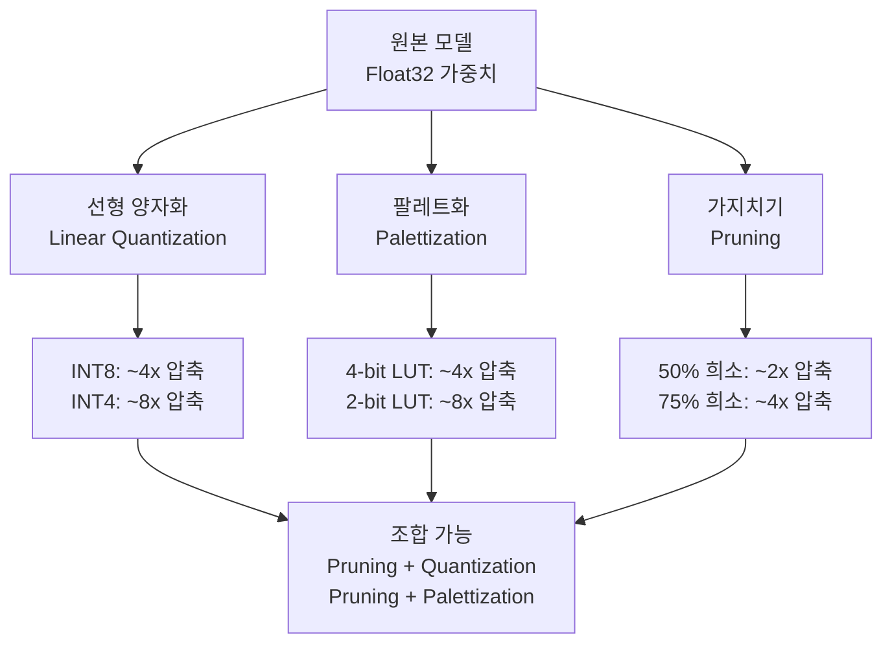
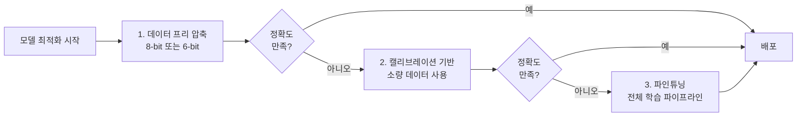
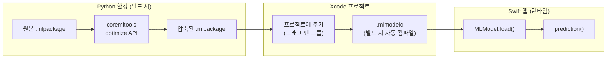
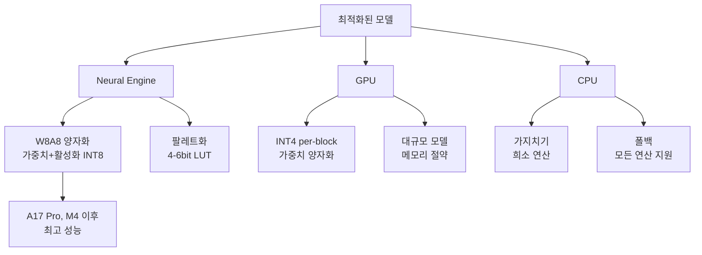
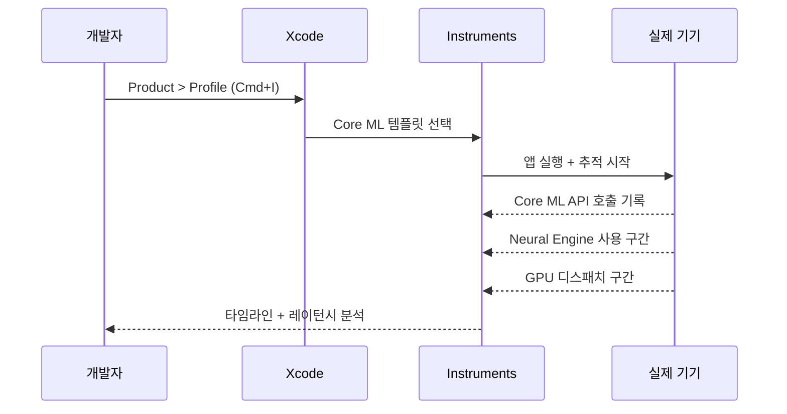
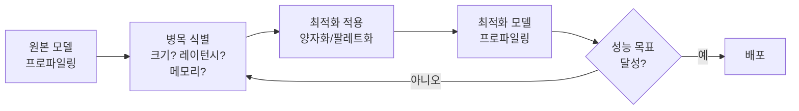

# 05. 모델 최적화: 양자화와 압축

> Core ML 모델의 크기를 줄이고 추론 속도를 높이는 양자화(Quantization), 팔레트화(Palettization), 가지치기(Pruning) 기법을 익힙니다.

## 개요

이 섹션에서는 학습이 완료된 Core ML 모델을 더 작고 빠르게 만드는 최적화 기법을 다룹니다. [이전 섹션](15-ch15-core-ml-기초/04-04-hugging-face-core-ml-모델-갤러리.md)에서 Hugging Face Gallery의 F16/F32 변형을 비교하며 모델 크기와 성능 간 트레이드오프를 살짝 맛봤는데요, 이번에는 그 트레이드오프를 직접 제어하는 방법을 배웁니다.

**선수 지식**: Core ML 모델 로딩과 `MLModelConfiguration`의 `computeUnits` 설정([02. Core ML 모델 통합하기](15-ch15-core-ml-기초/02-02-core-ml-모델-통합하기.md)), F16/F32 정밀도의 차이([04. Hugging Face Core ML 모델 갤러리](15-ch15-core-ml-기초/04-04-hugging-face-core-ml-모델-갤러리.md))

**학습 목표**:
- 양자화, 팔레트화, 가지치기 세 가지 최적화 기법의 원리와 차이를 이해한다
- coremltools로 사후 학습(post-training) 최적화를 적용한다
- Neural Engine / GPU / CPU별 최적 실행 전략을 선택한다
- Xcode Instruments로 Core ML 모델 성능을 프로파일링한다

## 왜 알아야 할까?

앱 크기는 사용자 경험에 직접적인 영향을 미칩니다. App Store에서 200MB를 넘으면 셀룰러 다운로드 경고가 뜨고, 기기 저장 공간이 부족한 사용자는 앱을 삭제하겠죠. 그런데 고성능 ML 모델은 쉽게 수백 MB에 달합니다. Depth Anything V2 모델만 해도 F32 버전이 약 100MB가 넘었던 거 기억하시죠?

양자화와 압축은 이 문제를 해결하는 핵심 무기입니다. 모델 크기를 2~8배까지 줄이면서도 정확도 손실은 최소화할 수 있거든요. 게다가 크기만 줄어드는 게 아닙니다 — 최적화된 모델은 Neural Engine에서 더 빠르게 실행되고, 메모리 사용량도 줄어들며, 배터리 소모도 적어집니다. Apple의 온디바이스 Foundation Model 자체도 [2-bit QAT](14-ch14-온디바이스-모델-아키텍처-이해/03-03-2-bit-양자화와-온디바이스-최적화.md)를 사용한다는 걸 떠올려 보세요. Apple조차 양자화 없이는 3B 파라미터 모델을 iPhone에서 돌릴 수 없었습니다.

## 핵심 개념

### 개념 1: 세 가지 압축 기법 — 양자화, 팔레트화, 가지치기

> 💡 **비유**: 그림 파일 압축을 생각해보세요. **양자화**는 2400만 색상의 사진을 256색으로 줄이는 것과 비슷합니다 — 색상 표현 범위를 줄이지만 전체적인 그림은 보존돼요. **팔레트화**는 실제로 쓰이는 색상만 골라서 "팔레트(색상표)"를 만드는 거고, **가지치기**는 거의 보이지 않는 세밀한 점들을 지워버리는 겁니다.

Core ML Tools(`coremltools`)는 세 가지 핵심 최적화 기법을 제공합니다:

**1. 선형 양자화(Linear Quantization)**
Float16/Float32 가중치를 INT8 또는 INT4 정수로 변환합니다. 각 값의 범위를 선형으로 매핑하는 방식이죠. 가장 간단하면서도 효과적인 압축 방법입니다.

**2. 팔레트화(Palettization)**
가중치를 k-means 클러스터링으로 묶고, 각 클러스터의 중심값(centroid)을 룩업 테이블(LUT)에 저장합니다. 개별 가중치는 원래 값 대신 LUT 인덱스만 저장하므로 1, 2, 3, 4, 6, 8비트까지 압축할 수 있습니다.

**3. 가지치기(Pruning)**
0에 가까운 가중치를 아예 0으로 만들어 "희소(sparse)" 표현을 가능하게 합니다. 0인 값은 저장하지 않아도 되니까 모델이 작아지고, Neural Engine에서 0과의 곱셈을 건너뛰어 연산도 빨라집니다. 가지치기의 핵심은 **어떤 가중치를 0으로 만들 것인가**인데요, 가장 일반적인 전략은 **크기 기반 가지치기(magnitude pruning)**입니다. 절대값이 가장 작은 가중치부터 순서대로 제거하는 거죠 — 값이 작을수록 모델 출력에 미치는 영향도 적으니까요.

가지치기 비율(sparsity)은 전체 가중치 중 0으로 만들 비율을 뜻합니다. 예를 들어 50% 가지치기는 가중치의 절반을 0으로 만드는 것이고, 75% 가지치기는 3/4을 제거합니다. 비율이 높을수록 압축률은 올라가지만 정확도 손실 위험도 커지므로, 보통 50~75% 범위에서 시작하여 정확도를 확인하며 조절합니다.

> 📊 **그림 1**: 세 가지 모델 압축 기법 비교



이 세 기법은 **조합해서 사용**할 수도 있습니다. 예를 들어 가지치기로 50%를 희소화한 뒤, 나머지 가중치를 4-bit로 팔레트화하면 단독 적용보다 훨씬 높은 압축률을 달성합니다.

### 개념 2: 최적화 워크플로 — 데이터 없이 vs 데이터로

> 💡 **비유**: 옷을 수선하는 세 가지 방법을 상상해보세요. **데이터 프리**는 재봉사가 옷만 보고 적당히 줄이는 것(빠르지만 핏이 약간 어색할 수 있음), **캘리브레이션**은 한 번 입어보고 조정하는 것(더 나은 핏), **파인튜닝**은 맞춤 제작처럼 여러 번 피팅하면서 완벽하게 맞추는 것(최고의 핏, 하지만 시간이 오래 걸림)입니다.

coremltools는 세 단계의 최적화 워크플로를 지원합니다:

| 워크플로 | 필요한 것 | 소요 시간 | 정확도 보존 |
|---------|----------|----------|-----------|
| **데이터 프리** | 모델만 | 초~분 | 6-8bit 양호 |
| **캘리브레이션** | 모델 + 소량 데이터(~128 샘플) | 분~시간 | 4bit도 양호 |
| **파인튜닝** | 모델 + 전체 학습 파이프라인 | 시간~일 | 2-4bit도 우수 |

iOS 앱 개발자 입장에서는 **데이터 프리** 방식이 가장 실용적입니다. 학습 환경 없이 변환된 `.mlpackage` 파일만으로 바로 압축할 수 있거든요. 정확도 저하가 심하면 그때 캘리브레이션을 고려하면 됩니다.

> 📊 **그림 2**: 최적화 워크플로 선택 흐름



### 개념 3: coremltools로 사후 학습 최적화 적용하기

> 💡 **비유**: 이미 구운 빵의 크기를 줄이는 것과 비슷합니다. 반죽 단계(학습)로 돌아갈 필요 없이, 완성된 빵(학습 완료 모델)을 그대로 압축하는 거죠.

> ⚠️ **중요: Python 전처리 단계입니다!** 아래 코드에서 사용하는 `coremltools`는 **Python 라이브러리**입니다. 모델 최적화는 앱 빌드 전에 Mac의 Python 환경에서 한 번만 실행하는 **전처리(preprocessing) 단계**이지, Swift 앱 코드가 아닙니다. `linear_quantize_weights()`, `palettize_weights()`, `prune_weights()` 같은 함수들은 모두 Python API입니다.
>
> 전체 워크플로를 정리하면:
> 1. **Python** (coremltools): 원본 `.mlpackage` → 최적화 적용 → 압축된 `.mlpackage` 저장
> 2. **Xcode**: 압축된 `.mlpackage`를 프로젝트에 추가 (드래그 앤 드롭)
> 3. **Swift** (앱 코드): `MLModel.load()`로 로드하여 사용 — 원본과 **동일한 API**

coremltools의 `optimize.coreml` 모듈은 변환된 Core ML 모델에 직접 압축을 적용합니다. Python 환경에서 실행하고, 결과물인 `.mlpackage`를 Xcode 프로젝트에 추가하면 됩니다.

> 📊 **그림 3-1**: Python 최적화 → Swift 앱 통합 워크플로



**선형 양자화 — INT8 가중치 압축:**

```python
# ⚠️ Python 스크립트 — 빌드 전에 Mac 터미널에서 실행
import coremltools as ct
from coremltools.optimize.coreml import (
    linear_quantize_weights,
    OpLinearQuantizerConfig,
    OptimizationConfig,
)

# 1. 원본 Core ML 모델 로드
model = ct.models.MLModel("MyClassifier.mlpackage")

# 2. INT8 양자화 설정 (per-channel이 Neural Engine에 최적)
op_config = OpLinearQuantizerConfig(
    mode="linear_symmetric",      # 대칭 양자화
    dtype="int8",                 # INT8 정밀도
    granularity="per_channel"     # 채널별 스케일 (NE 최적)
)
config = OptimizationConfig(global_config=op_config)

# 3. 양자화 적용
quantized_model = linear_quantize_weights(model, config=config)

# 4. 저장 → 이 파일을 Xcode 프로젝트에 추가
quantized_model.save("MyClassifier_INT8.mlpackage")
```

**팔레트화 — 4-bit LUT 압축:**

```python
# ⚠️ Python 스크립트 — 빌드 전에 Mac 터미널에서 실행
from coremltools.optimize.coreml import (
    palettize_weights,
    OpPalettizerConfig,
    OptimizationConfig,
)

# 4-bit 팔레트화 설정 (16개 클러스터)
op_config = OpPalettizerConfig(
    nbits=4,                          # 4-bit (2^4 = 16 centroids)
    granularity="per_grouped_channel", # 그룹별 채널 (정확도 보존)
    group_size=32                      # 그룹 크기
)
config = OptimizationConfig(global_config=op_config)

# 팔레트화 적용
palettized_model = palettize_weights(model, config=config)
palettized_model.save("MyClassifier_4bit.mlpackage")
```

**가지치기 — 크기 기반 희소화:**

```python
# ⚠️ Python 스크립트 — 빌드 전에 Mac 터미널에서 실행
from coremltools.optimize.coreml import (
    prune_weights,
    OpMagnitudePrunerConfig,
    OptimizationConfig,
)

# 50% 크기 기반 가지치기 설정
op_config = OpMagnitudePrunerConfig(
    target_sparsity=0.5,              # 가중치의 50%를 0으로
    weight_threshold=1e-7             # 이 값보다 작은 가중치 제거
)
config = OptimizationConfig(global_config=op_config)

# 가지치기 적용
pruned_model = prune_weights(model, config=config)
pruned_model.save("MyClassifier_Pruned50.mlpackage")
```

가지치기와 양자화를 **순차적으로 조합**하면 더 높은 압축률을 달성할 수 있습니다:

```python
# ⚠️ Python 스크립트 — 가지치기 + 양자화 조합
# Step 1: 가지치기 적용
pruned_model = prune_weights(model, config=prune_config)

# Step 2: 가지치기된 모델에 양자화 추가 적용
combined_model = linear_quantize_weights(pruned_model, config=int8_config)
combined_model.save("MyClassifier_Pruned_INT8.mlpackage")
# 결과: 가지치기(~2x) + 양자화(~4x) ≈ ~8x 압축
```

**Swift에서 최적화된 모델 사용하기 — 코드 변경 제로:**

최적화된 `.mlpackage`를 Xcode 프로젝트에 추가하면, Swift 코드는 원본 모델과 **완전히 동일합니다**. Core ML 런타임이 내부적으로 역양자화와 희소 연산을 처리하기 때문에, 개발자는 최적화 여부를 신경 쓸 필요가 없습니다:

```swift
import CoreML

// 원본 모델이든, INT8 양자화 모델이든, 4-bit 팔레트 모델이든
// Swift 코드는 동일합니다!
let config = MLModelConfiguration()
config.computeUnits = .all  // Neural Engine 우선

// 최적화된 모델 로드 (Xcode가 빌드 시 .mlmodelc로 자동 컴파일)
let model = try await MLModel.load(
    contentsOf: MyClassifier_INT8.urlOfModelInThisBundle,
    configuration: config
)

// 예측 — 원본과 동일한 인터페이스
let prediction = try await model.prediction(from: input)
```

> ⚠️ **흔한 오해**: "양자화하면 Swift 코드를 바꿔야 하나요?" — 아닙니다! 양자화된 `.mlpackage`는 원본과 동일한 Swift 인터페이스를 제공합니다. `prediction()` 호출 코드는 한 줄도 바꿀 필요 없어요. Core ML 런타임이 내부적으로 역양자화를 처리합니다. 바뀌는 건 Python에서 모델을 전처리하는 단계뿐입니다.

### 개념 4: Neural Engine vs GPU vs CPU — 최적 실행 전략

> 💡 **비유**: 주방에 전자레인지(Neural Engine), 오븐(GPU), 가스레인지(CPU)가 있다고 생각해보세요. 전자레인지는 정해진 요리를 가장 빠르고 에너지 효율적으로 데우지만, 모든 요리를 할 수 있는 건 아닙니다. 오븐은 범용성이 좋고, 가스레인지는 무엇이든 되지만 가장 느립니다.

Apple Silicon의 각 연산 유닛은 서로 다른 최적화 기법에 유리합니다:

| 연산 유닛 | 최적 시나리오 | 양자화 이점 |
|----------|-------------|-----------|
| **Neural Engine** | INT8 가중치+활성화(W8A8), 팔레트화 | A17 Pro/M4 이후 INT8 처리량 대폭 향상 |
| **GPU** | INT4 per-block 양자화, 대규모 모델 | 메모리 대역폭 병목 해소에 효과적 |
| **CPU** | 가지치기(희소 연산) | 0 연산 건너뛰기로 속도 향상 |

> 📊 **그림 4**: 하드웨어별 최적 양자화 전략



실제 하드웨어별 벤치마크를 보면 차이가 극적입니다. W8A8(가중치 INT8 + 활성화 INT8) 모드의 Neural Engine 성능을 살펴보죠:

| 모델 | 기기 | Float16 | W8A8 | 속도 향상 |
|------|------|---------|------|----------|
| MobileNetv2 | iPhone 14 Pro | 0.48ms | 0.27ms | **1.8x** |
| ResNet50 | iPhone 14 Pro | 1.52ms | 0.94ms | **1.6x** |
| ResNet50 | iPhone 15 Pro | 1.52ms | 0.77ms | **2.0x** |

A17 Pro 칩부터 Neural Engine의 INT8 처리 경로가 대폭 개선되어, 같은 양자화라도 신형 하드웨어에서 더 큰 이점을 얻습니다.

Swift에서 컴퓨트 유닛을 지정하는 방법은 이미 익숙하시죠:

```swift
import CoreML

// Neural Engine 우선 실행 (양자화 모델에 최적)
let config = MLModelConfiguration()
config.computeUnits = .all  // NE > GPU > CPU 순으로 자동 선택

// GPU 사용 시 Core ML과 분리하고 싶을 때
let cpuNEConfig = MLModelConfiguration()
cpuNEConfig.computeUnits = .cpuAndNeuralEngine  // GPU 제외
```

> 🔥 **실무 팁**: 모델 최적화 후에는 반드시 **타겟 하드웨어에서** 벤치마크를 돌려야 합니다. 시뮬레이터에서는 Neural Engine을 사용할 수 없어서 실제 성능 차이를 확인할 수 없거든요. 가장 오래된 지원 기기에서 테스트하는 게 안전합니다.

### 개념 5: Xcode Instruments로 Core ML 프로파일링

> 💡 **비유**: 자동차 성능을 높이려면 먼저 어디서 병목이 생기는지 계기판을 봐야 하듯이, ML 모델 최적화도 프로파일링으로 현재 상태를 진단하는 것부터 시작합니다.

Xcode의 Instruments 앱에는 Core ML 전용 프로파일링 도구가 내장되어 있습니다:

> 📊 **그림 5**: Instruments 프로파일링 워크플로



**Core ML Instrument**가 보여주는 정보:
- 모델 로딩 시간 및 예측(prediction) 레이턴시
- 연산이 Neural Engine, GPU, CPU 중 어디에서 실행되었는지
- 모델 컴파일(`.mlmodelc`) 캐시 히트 여부
- 메모리 할당 및 해제 패턴

**프로파일링 코드 삽입 패턴:**

```swift
import CoreML
import os.log

let logger = Logger(subsystem: "com.app.ml", category: "Performance")

func profilePrediction(model: MLModel, input: MLFeatureProvider) async {
    let signpost = OSSignposter(logger: logger)
    
    // 예측 구간을 Signpost로 마킹 → Instruments에서 시각화
    let state = signpost.beginInterval("ML Prediction")
    
    do {
        let result = try await model.prediction(from: input)
        signpost.endInterval("ML Prediction", state)
        
        // 결과 처리
        logger.info("예측 완료: \(result.featureNames)")
    } catch {
        signpost.endInterval("ML Prediction", state, "\(error)")
    }
}
```

> 📊 **그림 6**: 모델 최적화 전후 비교 워크플로



## 실습: 직접 해보기

이번 실습에서는 Python(coremltools)으로 모델을 최적화하고, Swift 앱에서 원본과 양자화 모델의 성능을 비교하는 벤치마크를 만들어 봅니다.

> 💡 **실습 구조**: Step 1은 **Python** 환경(터미널)에서 모델을 최적화하는 전처리 단계이고, Step 2~3은 **Swift**(Xcode)에서 최적화된 모델을 로드하여 벤치마크하는 앱 코드입니다.

### Step 1: Python에서 모델 양자화 (coremltools — 전처리 단계)

터미널에서 실행합니다:

```console
pip install coremltools
```

```python
# ⚠️ Python 스크립트 (optimize_model.py)
# Mac 터미널에서 실행: python optimize_model.py
# 결과물(.mlpackage)을 Xcode 프로젝트에 추가하면 됩니다.

import coremltools as ct
from coremltools.optimize.coreml import (
    linear_quantize_weights,
    palettize_weights,
    prune_weights,
    OpLinearQuantizerConfig,
    OpPalettizerConfig,
    OpMagnitudePrunerConfig,
    OptimizationConfig,
)
import os

# 원본 모델 로드 (MobileNetV2 예시)
model = ct.models.MLModel("MobileNetV2.mlpackage")

# --- INT8 양자화 ---
int8_config = OptimizationConfig(
    global_config=OpLinearQuantizerConfig(
        mode="linear_symmetric",
        dtype="int8",
        granularity="per_channel"
    )
)
model_int8 = linear_quantize_weights(model, config=int8_config)
model_int8.save("MobileNetV2_INT8.mlpackage")

# --- 4-bit 팔레트화 ---
pal4_config = OptimizationConfig(
    global_config=OpPalettizerConfig(
        nbits=4,
        granularity="per_grouped_channel",
        group_size=32
    )
)
model_pal4 = palettize_weights(model, config=pal4_config)
model_pal4.save("MobileNetV2_4bit.mlpackage")

# --- 50% 가지치기 ---
prune_config = OptimizationConfig(
    global_config=OpMagnitudePrunerConfig(
        target_sparsity=0.5,
        weight_threshold=1e-7
    )
)
model_pruned = prune_weights(model, config=prune_config)
model_pruned.save("MobileNetV2_Pruned50.mlpackage")

# 크기 비교 출력
def get_model_size(path):
    total = 0
    for dirpath, _, filenames in os.walk(path):
        for f in filenames:
            total += os.path.getsize(os.path.join(dirpath, f))
    return total / (1024 * 1024)  # MB

print(f"원본:          {get_model_size('MobileNetV2.mlpackage'):.1f} MB")
print(f"INT8 양자화:    {get_model_size('MobileNetV2_INT8.mlpackage'):.1f} MB")
print(f"4-bit 팔레트:   {get_model_size('MobileNetV2_4bit.mlpackage'):.1f} MB")
print(f"50% 가지치기:   {get_model_size('MobileNetV2_Pruned50.mlpackage'):.1f} MB")
```

```output
원본:          13.5 MB
INT8 양자화:    3.6 MB
4-bit 팔레트:   2.1 MB
50% 가지치기:   7.8 MB
```

> 이 Python 스크립트의 출력물(`.mlpackage` 파일들)을 Xcode 프로젝트의 리소스로 추가하세요. Xcode가 빌드 시 자동으로 `.mlmodelc`로 컴파일합니다.

### Step 2: Swift 벤치마크 앱 구현

세 가지 모델(원본, INT8, 4-bit)을 프로젝트에 추가한 뒤, 추론 시간을 비교합니다:

```swift
import CoreML
import SwiftUI

// MARK: - 벤치마크 모델 래퍼
@Observable
class ModelBenchmark {
    var results: [BenchmarkResult] = []
    var isRunning = false
    
    struct BenchmarkResult: Identifiable {
        let id = UUID()
        let name: String           // 모델 이름
        let sizeInMB: Double       // 파일 크기
        let avgLatencyMs: Double   // 평균 추론 시간
        let iterations: Int        // 반복 횟수
    }
    
    /// 모델 하나의 벤치마크 실행
    func benchmark(
        modelName: String,
        input: MLFeatureProvider,
        iterations: Int = 50
    ) async throws -> BenchmarkResult {
        // 모델 로드 (Neural Engine 우선)
        let config = MLModelConfiguration()
        config.computeUnits = .all
        
        guard let url = Bundle.main.url(
            forResource: modelName,
            withExtension: "mlmodelc"
        ) else {
            throw BenchmarkError.modelNotFound(modelName)
        }
        
        let model = try await MLModel.load(
            contentsOf: url,
            configuration: config
        )
        
        // 웜업 (첫 실행은 컴파일 포함이므로 제외)
        _ = try model.prediction(from: input)
        
        // 반복 측정
        var totalTime: Double = 0
        for _ in 0..<iterations {
            let start = CFAbsoluteTimeGetCurrent()
            _ = try model.prediction(from: input)
            let elapsed = (CFAbsoluteTimeGetCurrent() - start) * 1000
            totalTime += elapsed
        }
        
        // 모델 파일 크기 계산
        let sizeInMB = Self.fileSize(at: url)
        
        return BenchmarkResult(
            name: modelName,
            sizeInMB: sizeInMB,
            avgLatencyMs: totalTime / Double(iterations),
            iterations: iterations
        )
    }
    
    /// 모든 변형 비교 벤치마크
    func runComparison(
        modelNames: [String],
        input: MLFeatureProvider
    ) async {
        isRunning = true
        results = []
        
        for name in modelNames {
            do {
                let result = try await benchmark(
                    modelName: name, input: input
                )
                results.append(result)
            } catch {
                print("[\(name)] 벤치마크 실패: \(error)")
            }
        }
        
        isRunning = false
    }
    
    private static func fileSize(at url: URL) -> Double {
        let manager = FileManager.default
        guard let enumerator = manager.enumerator(at: url, includingPropertiesForKeys: [.fileSizeKey]) else {
            return 0
        }
        var total: Int64 = 0
        for case let fileURL as URL in enumerator {
            let values = try? fileURL.resourceValues(forKeys: [.fileSizeKey])
            total += Int64(values?.fileSize ?? 0)
        }
        return Double(total) / (1024 * 1024)
    }
}

enum BenchmarkError: LocalizedError {
    case modelNotFound(String)
    
    var errorDescription: String? {
        switch self {
        case .modelNotFound(let name):
            return "모델 '\(name)'을 번들에서 찾을 수 없습니다."
        }
    }
}
```

### Step 3: 벤치마크 결과 UI

```swift
struct BenchmarkView: View {
    @State private var benchmark = ModelBenchmark()
    
    var body: some View {
        NavigationStack {
            List {
                if benchmark.isRunning {
                    HStack {
                        ProgressView()
                        Text("벤치마크 실행 중...")
                    }
                }
                
                ForEach(benchmark.results) { result in
                    VStack(alignment: .leading, spacing: 8) {
                        Text(result.name)
                            .font(.headline)
                        
                        HStack {
                            Label(
                                String(format: "%.1f MB", result.sizeInMB),
                                systemImage: "doc.fill"
                            )
                            Spacer()
                            Label(
                                String(format: "%.2f ms", result.avgLatencyMs),
                                systemImage: "timer"
                            )
                        }
                        .font(.subheadline)
                        .foregroundStyle(.secondary)
                        
                        // 상대 비교 바
                        if let maxLatency = benchmark.results.map(\.avgLatencyMs).max(),
                           maxLatency > 0 {
                            ProgressView(
                                value: result.avgLatencyMs,
                                total: maxLatency
                            )
                            .tint(barColor(for: result.avgLatencyMs, max: maxLatency))
                        }
                    }
                    .padding(.vertical, 4)
                }
            }
            .navigationTitle("모델 벤치마크")
            .toolbar {
                Button("실행") {
                    Task {
                        // 실제 사용 시 적절한 입력 데이터를 생성하세요
                        await benchmark.runComparison(
                            modelNames: [
                                "MobileNetV2",       // 원본
                                "MobileNetV2_INT8",  // INT8 양자화
                                "MobileNetV2_4bit"   // 4-bit 팔레트
                            ],
                            input: createDummyInput()
                        )
                    }
                }
                .disabled(benchmark.isRunning)
            }
        }
    }
    
    private func barColor(for value: Double, max: Double) -> Color {
        let ratio = value / max
        if ratio < 0.5 { return .green }
        if ratio < 0.8 { return .orange }
        return .red
    }
}
```

## 더 깊이 알아보기

### 양자화의 역사 — 통신 공학에서 AI까지

양자화(Quantization)라는 용어는 AI보다 훨씬 오래되었습니다. 1928년 벨 연구소의 해리 나이퀴스트(Harry Nyquist)가 전화 통신에서 아날로그 음성 신호를 디지털로 변환하는 과정을 처음 체계화했는데, 이때 연속적인 파형을 이산적인 값으로 "양자화"하는 개념이 등장했습니다. 이후 1948년 클로드 섀넌의 정보 이론에서 양자화의 수학적 기초가 완성되었죠.

딥러닝에서의 가중치 양자화는 2015년경부터 본격적으로 연구되기 시작했습니다. 결정적 계기는 모바일 배포였어요. Google이 TensorFlow Lite를 발표하면서 "INT8 양자화로 정확도 1% 미만 손실에 4배 크기 감소"라는 결과를 보여주자, 업계 전체가 주목했습니다.

Apple은 2023년 WWDC에서 coremltools의 `optimize` API를 대대적으로 개편하며, PyTorch 학습 시간 양자화와 Core ML 변환 후 양자화를 모두 지원하는 통합 파이프라인을 공개했습니다. 특히 **Mixed-Bit Palettization(MBP)**은 Apple 고유의 기법으로, 레이어마다 다른 비트 수를 자동으로 결정하여 Neural Engine의 지원 비트폭(1, 2, 4, 6, 8)에 맞춘 최적의 "팔레트화 레시피"를 생성합니다.

그리고 [Ch14에서 배운 것처럼](14-ch14-온디바이스-모델-아키텍처-이해/03-03-2-bit-양자화와-온디바이스-최적화.md), Apple 자체 Foundation Model은 2-bit QAT(Quantization-Aware Training)를 사용합니다. 학습 단계부터 2비트 양자화를 시뮬레이션하면서 훈련하기 때문에, 3B 파라미터 모델이 iPhone에서 실시간으로 동작할 수 있는 거죠.

## 흔한 오해와 팁

> ⚠️ **흔한 오해**: "양자화하면 무조건 정확도가 떨어진다" — 8-bit 양자화는 대부분의 모델에서 정확도 변화가 0.5% 이내입니다. 사람의 눈으로는 구별할 수 없는 수준이에요. 4-bit 이하로 내려갈 때부터 주의가 필요하고, 이때는 캘리브레이션이나 파인튜닝으로 보상할 수 있습니다.

> ⚠️ **흔한 오해**: "coremltools 코드를 Swift 앱에 넣어야 하나요?" — 아닙니다! `coremltools`는 Python 라이브러리이고, 모델 최적화는 **빌드 전 전처리 단계**입니다. `linear_quantize_weights()`, `palettize_weights()`, `prune_weights()` 등은 모두 개발 Mac의 Python 환경에서 한 번만 실행합니다. 결과물인 `.mlpackage`를 Xcode에 추가하면, Swift 코드에서는 `MLModel.load()`로 로드할 뿐 — 최적화 관련 코드는 앱에 포함되지 않습니다.

> 💡 **알고 계셨나요?**: Apple의 Neural Engine은 팔레트화된 가중치를 **네이티브로** 처리합니다. 즉, 런타임에 역양자화(dequantization)를 하지 않고 LUT 인덱스를 직접 연산에 사용하기 때문에, 크기 감소뿐 아니라 순수한 추론 속도 향상도 얻을 수 있습니다.

> 🔥 **실무 팁**: 모델을 배포할 때 여러 변형을 준비하세요. App Thinning을 활용하면 기기 세대별로 다른 최적화 모델을 전달할 수 있습니다. 예를 들어, A17 Pro 이상에서는 W8A8 모델을, 구형 기기에서는 가중치만 INT8인 경량 모델을 사용하는 식이죠. `MLModelConfiguration`의 `computeUnits`를 기기별로 조정하는 것도 잊지 마세요.

> 🔥 **실무 팁**: `computeUnits = .cpuAndNeuralEngine`은 GPU를 많이 사용하는 앱(게임, AR 등)에서 유용합니다. Core ML이 GPU를 점유하지 않으므로 렌더링 성능에 영향을 주지 않거든요. 반대로 ML 추론이 핵심인 앱이라면 `.all`로 두어 런타임이 최적의 유닛을 자동 선택하게 하세요.

## 핵심 정리

| 개념 | 설명 |
|------|------|
| 선형 양자화 | Float 가중치를 INT8/INT4로 변환. 가장 간단하고 범용적인 압축 기법 |
| 팔레트화 | k-means 클러스터링 + LUT. 1~8-bit 지원. Neural Engine 네이티브 처리 |
| 가지치기 | 크기 기반으로 0에 가까운 가중치를 제거. 희소 표현으로 크기와 연산량 감소 |
| 데이터 프리 워크플로 | 모델만으로 압축. 초~분 소요. 6-8bit에서 정확도 양호 |
| coremltools (Python) | 빌드 전 전처리 단계에서 사용하는 Python 최적화 도구. Swift 앱 코드 아님 |
| W8A8 모드 | 가중치 + 활성화 모두 INT8. Neural Engine에서 최대 2x 속도 향상 |
| computeUnits | `.all`, `.cpuAndGPU`, `.cpuAndNeuralEngine`, `.cpuOnly` 중 선택 |
| Core ML Instrument | Xcode Instruments로 모델 레이턴시, 연산 유닛 분배 시각화 |
| 기법 조합 | 가지치기 + 양자화를 순차 적용하면 단독보다 높은 압축률 달성 |

## 다음 섹션 미리보기

Ch15의 Core ML 기초를 모두 마쳤습니다! 모델을 로드하고, 예측을 실행하고, Vision과 연동하고, Hugging Face에서 가져오고, 최적화까지 적용할 수 있게 되었죠. 다음 [Ch16. Create ML로 커스텀 모델 학습](16-ch16-create-ml로-커스텀-모델-학습/01-01-create-ml-개요와-워크플로.md)에서는 남이 만든 모델을 가져다 쓰는 단계를 넘어, **나만의 데이터로 커스텀 모델을 직접 학습**하는 방법을 배웁니다. Create ML의 GUI와 Swift 코드 기반 학습 파이프라인을 모두 다루며, 학습한 모델은 지금 배운 최적화 기법으로 경량화하여 앱에 배포하게 됩니다.

## 참고 자료

- [Optimization Overview — Guide to Core ML Tools](https://apple.github.io/coremltools/docs-guides/source/opt-overview.html) - coremltools 최적화 기법 전체 개요와 워크플로 선택 가이드
- [Quantization Performance — Guide to Core ML Tools](https://apple.github.io/coremltools/docs-guides/source/opt-quantization-perf.html) - INT8/INT4 양자화의 하드웨어별 성능 벤치마크 데이터
- [Use Core ML Tools for machine learning model compression — WWDC23](https://developer.apple.com/videos/play/wwdc2023/10047/) - Apple 공식 모델 압축 워크플로 세션 (팔레트화, 양자화, 가지치기)
- [Optimize your Core ML usage — WWDC22](https://developer.apple.com/videos/play/wwdc2022/10027/) - Core ML 프로파일링과 Instruments 사용법
- [Palettization Algorithms — Guide to Core ML Tools](https://apple.github.io/coremltools/docs-guides/source/opt-palettization-algos.html) - k-means, DKM, SKM 등 팔레트화 알고리즘 상세 비교
- [Core ML Overview — Apple Developer](https://developer.apple.com/machine-learning/core-ml/) - Core ML 최적화 및 Neural Engine 하드웨어 개요

---
### 🔗 Related Sessions
- [core ml](01-ch1-apple-intelligence와-온디바이스-ai/02-02-apple-aiml-프레임워크-생태계.md) (prerequisite)
- [computeunits](15-ch15-core-ml-기초/01-01-core-ml-프레임워크-소개.md) (prerequisite)
