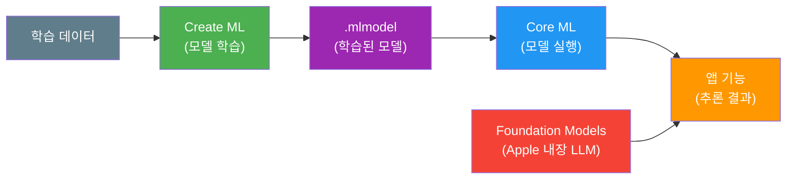
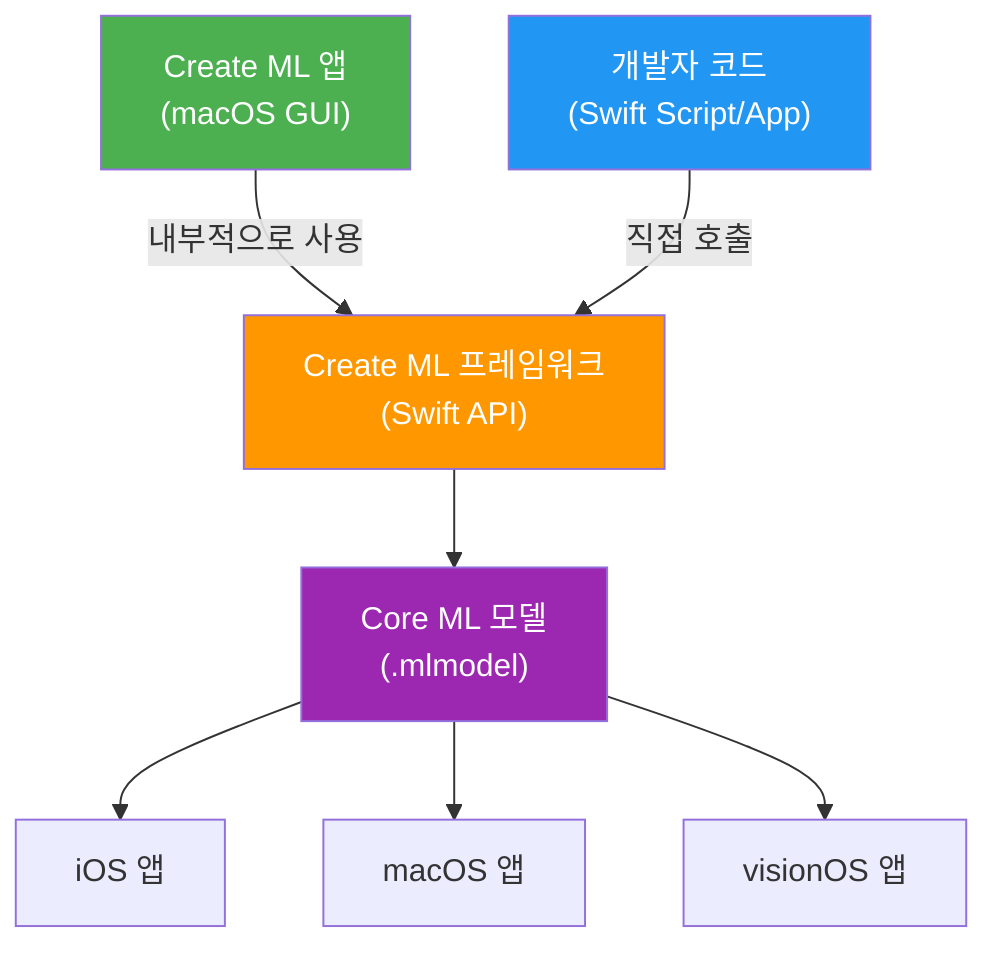
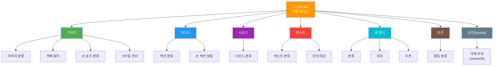
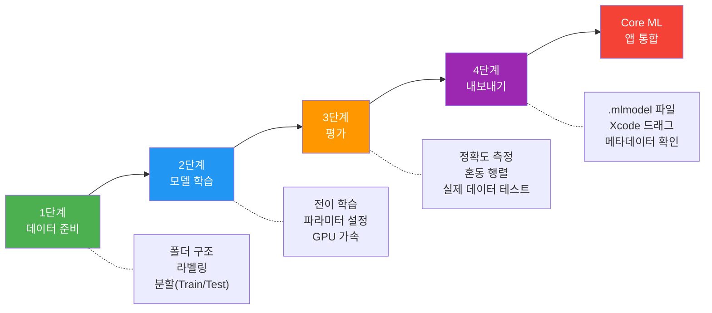
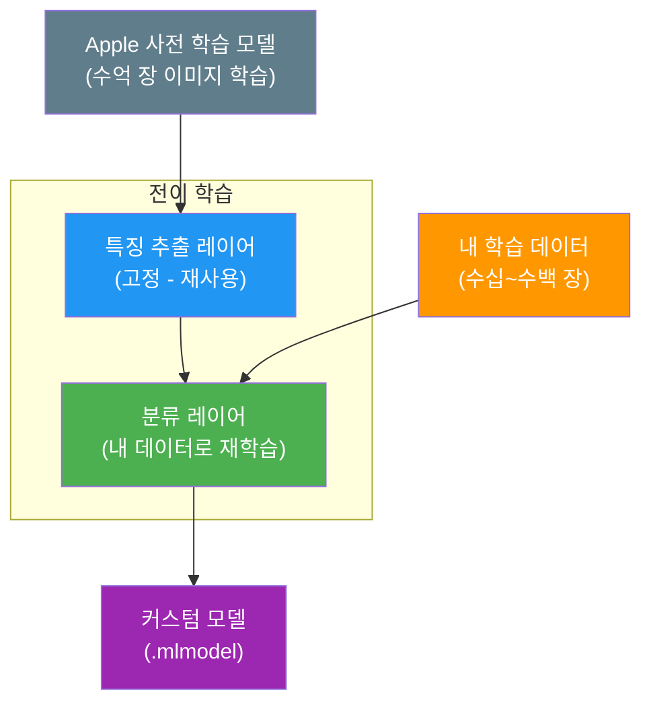

# Create ML 개요와 워크플로

> Create ML 앱과 프레임워크의 차이를 이해하고, 커스텀 모델 학습의 전체 워크플로를 파악합니다.

## 개요

이 섹션에서는 Apple이 제공하는 Create ML의 두 가지 형태 — GUI 기반의 **Create ML 앱**과 코드 기반의 **Create ML 프레임워크** — 를 비교하고, 커스텀 ML 모델을 만드는 전체 워크플로를 살펴봅니다. [Core ML 프레임워크 소개](15-ch15-core-ml-기초/01-01-core-ml-프레임워크-소개.md)에서 배운 Core ML이 "학습된 모델을 앱에서 실행하는 프레임워크"였다면, Create ML은 그 모델을 직접 "만드는" 도구입니다.

**선수 지식**:
- [Core ML 프레임워크 소개](15-ch15-core-ml-기초/01-01-core-ml-프레임워크-소개.md)의 `.mlmodel` 개념
- [Core ML 모델 통합하기](15-ch15-core-ml-기초/02-02-core-ml-모델-통합하기.md)의 모델 로드/추론 흐름
- Swift 기본 문법과 async/await

**학습 목표**:
- Create ML 앱과 Create ML 프레임워크의 차이점과 각각의 적합한 사용 시나리오를 구분한다
- Create ML이 지원하는 태스크 유형(이미지, 텍스트, 사운드, 표 형식 등)을 파악한다
- 데이터 준비 → 학습 → 평가 → 내보내기 워크플로를 이해한다
- 전이 학습(Transfer Learning)의 원리와 Create ML에서의 활용 방식을 설명한다

## 왜 알아야 할까?

앱에 AI 기능을 넣고 싶은데, 기성 모델이 내 데이터에 맞지 않는 경우가 생각보다 많습니다. 예를 들어 반려동물 사진 앱에서 "우리 집 고양이"와 "이웃집 고양이"를 구분하고 싶다면요? 또는 고객 리뷰에서 긍정/부정/중립을 분류하는데, 내 앱 도메인에 특화된 모델이 필요하다면요?

이럴 때 Create ML이 답입니다. Python이나 PyTorch를 몰라도, Mac 한 대와 학습 데이터만 있으면 Swift 생태계 안에서 커스텀 모델을 만들어 Core ML로 바로 배포할 수 있거든요. 특히 [Foundation Models + Core ML 하이브리드](17-ch17-foundation-models-core-ml-하이브리드/01-01-하이브리드-아키텍처-설계-전략.md) 챕터에서 배울 하이브리드 아키텍처를 위해서도, 커스텀 모델 학습 능력은 필수적입니다.

> 📊 **그림 1**: Create ML의 위치 — Apple ML 생태계 전체 구조



## 핵심 개념

### 개념 1: Create ML의 두 얼굴 — 앱 vs 프레임워크

> 💡 **비유**: Create ML 앱은 "자동 세탁기"이고, Create ML 프레임워크는 "수동 세탁 + 건조 + 다림질 라인"입니다. 세탁기는 버튼 하나로 끝나지만, 세탁 라인은 물 온도, 세제 양, 건조 시간을 세밀하게 조절할 수 있죠. 간단한 빨래는 세탁기, 정장 세탁은 세탁 라인이 적합한 것처럼요.

**Create ML 앱**은 Xcode 메뉴에서 바로 열 수 있는 macOS 전용 GUI 애플리케이션입니다. 드래그 앤 드롭으로 데이터를 넣고, 몇 번의 클릭으로 모델을 학습시킬 수 있습니다. 코드가 한 줄도 필요 없죠.

**Create ML 프레임워크**는 그 앱의 내부 엔진이기도 한 Swift API입니다. iOS, iPadOS, macOS, tvOS, visionOS, watchOS 등 Apple 플랫폼 전반에서 사용할 수 있고, 코드로 학습 워크플로를 완전히 제어할 수 있습니다.

> 📊 **그림 2**: Create ML 앱과 프레임워크의 관계



두 방식의 핵심 차이를 정리하면 이렇습니다:

| 구분 | Create ML 앱 | Create ML 프레임워크 |
|------|-------------|---------------------|
| **인터페이스** | GUI (드래그 앤 드롭) | Swift 코드 |
| **플랫폼** | macOS 전용 | iOS/iPadOS/macOS/tvOS/visionOS/watchOS |
| **적합한 상황** | 빠른 프로토타이핑, 비개발자 | 자동화, 앱 내 학습, CI/CD 통합 |
| **제어 수준** | 기본 파라미터 조절 | 완전한 프로그래매틱 제어 |
| **온디바이스 학습** | 불가 (Mac에서만) | 가능 (사용자 기기에서 동적 학습) |

앱에서 시작해서 프레임워크로 옮기는 것이 가장 자연스러운 학습 경로입니다. 앱으로 빠르게 실험하고, 결과가 만족스러우면 프레임워크 코드로 전환해 자동화하는 거죠.

```swift
// Create ML 앱 열기: Xcode → 메뉴바 → Xcode → Open Developer Tool → Create ML
// 또는 Spotlight에서 "Create ML" 검색

// Create ML 프레임워크는 코드에서 직접 import
import CreateML

// 이미지 분류기를 코드로 학습하는 예시 (간략 버전)
let trainingData = MLImageClassifier.DataSource.labeledDirectories(at: trainingURL)
let classifier = try MLImageClassifier(trainingData: trainingData)
try classifier.write(to: outputURL)
```

### 개념 2: 지원 태스크 유형 — 무엇을 학습시킬 수 있나?

> 💡 **비유**: Create ML의 태스크 유형들은 마치 요리 학원의 "코스"와 같습니다. 한식 코스, 양식 코스, 제과 코스가 각각 다른 재료와 기법을 사용하듯, 이미지 분류, 텍스트 분류, 사운드 분류는 각각 다른 데이터 형태와 알고리즘을 사용합니다. 하지만 "재료 준비 → 조리 → 시식 → 완성"이라는 기본 워크플로는 동일하죠.

Create ML은 놀라울 정도로 다양한 태스크를 지원합니다:

> 📊 **그림 3**: Create ML 지원 태스크 맵



가장 많이 쓰이는 태스크를 간략히 살펴보면:

- **이미지 분류(Image Classification)**: "이 사진은 고양이? 개?" 같은 라벨 분류. 가장 기본이자 가장 인기 있는 태스크
- **객체 탐지(Object Detection)**: 사진 안에서 "어디에" "무엇이" 있는지 찾아내기. 바운딩 박스 좌표까지 출력
- **텍스트 분류(Text Classification)**: 리뷰가 긍정인지 부정인지, 이메일이 스팸인지 아닌지 판별
- **표 형식(Tabular)**: 엑셀처럼 구조화된 데이터에서 분류·회귀·추천 모델 학습
- **사운드 분류(Sound Classification)**: 아기 울음, 유리 깨지는 소리, 악기 소리 등 구분

### 개념 3: 핵심 워크플로 — 데이터에서 앱까지 4단계

> 💡 **비유**: 모델 학습은 "시험 공부"와 놀랍도록 비슷합니다. 교재를 구하고(데이터 준비), 공부하고(학습), 모의고사로 실력을 점검하고(평가), 시험장에 가는(앱 배포) 과정이죠. 교재의 질이 나쁘면 아무리 공부해도 좋은 성적이 안 나오듯, 데이터 품질이 모델 성능의 80%를 좌우합니다.

> 📊 **그림 4**: Create ML 전체 워크플로



**1단계: 데이터 준비**

이미지 분류를 예로 들면, 폴더 이름이 곧 라벨이 됩니다:

```
TrainingData/
├── Cat/
│   ├── cat_001.jpg
│   ├── cat_002.jpg
│   └── ...
├── Dog/
│   ├── dog_001.jpg
│   └── ...
└── Bird/
    ├── bird_001.jpg
    └── ...
```

일반적으로 카테고리당 최소 10~50장 이상의 이미지가 필요하지만, Create ML의 전이 학습 덕분에 수천 장 없이도 꽤 좋은 결과를 얻을 수 있습니다. 학습 데이터(Training)와 테스트 데이터(Testing)는 보통 **80:20** 비율로 나누는데요, Create ML 앱에서는 이것도 자동으로 해줍니다.

**2단계: 모델 학습**

Create ML은 대부분의 태스크에서 **전이 학습(Transfer Learning)**을 사용합니다. Apple이 수억 장의 이미지로 미리 학습해둔 거대한 모델의 지식을 "빌려와서", 마지막 층만 내 데이터로 다시 학습하는 방식이죠. 덕분에 학습 속도가 빠르고, 적은 데이터로도 좋은 성능을 낼 수 있습니다.

**3단계: 평가**

학습이 끝나면 테스트 데이터로 성능을 측정합니다. 정확도(Accuracy), 정밀도(Precision), 재현율(Recall) 등의 지표를 확인하고, Create ML 앱에서는 혼동 행렬(Confusion Matrix)을 시각적으로 보여주기도 합니다. iPhone 카메라를 Continuity로 연결해서 실시간 테스트도 가능하죠.

**4단계: 내보내기**

만족스러운 모델이 나오면 `.mlmodel` 파일로 내보냅니다. 이 파일을 Xcode 프로젝트에 드래그하면 자동으로 Swift 인터페이스가 생성되고, [Core ML 모델 통합하기](15-ch15-core-ml-기초/02-02-core-ml-모델-통합하기.md)에서 배운 것처럼 앱에서 바로 사용할 수 있습니다.

### 개념 4: 전이 학습 — Create ML의 비밀 무기

> 💡 **비유**: 전이 학습은 "경력직 채용"과 같습니다. 신입 사원을 처음부터 가르치는 대신, 이미 풍부한 경험이 있는 경력직을 데려와서 우리 회사의 업무 방식만 짧게 교육하는 거죠. Apple이 미리 학습시킨 모델은 이미 "세상을 보는 눈"을 갖고 있어서, 내 도메인에 맞게 약간만 조정하면 됩니다.

> 📊 **그림 5**: 전이 학습(Transfer Learning) 구조



전이 학습의 이점을 정리하면:

- **적은 데이터**: 카테고리당 수십 장으로도 유의미한 결과
- **빠른 학습**: 분 단위로 완료 (전체 학습은 시간~일 단위)
- **작은 모델**: 전체 모델보다 훨씬 가벼운 `.mlmodel` 파일
- **높은 정확도**: 사전 학습된 풍부한 특징 표현을 활용

## 실습: 직접 해보기

Create ML 프레임워크를 사용해 Swift 코드로 이미지 분류기를 학습하는 전체 과정을 구현해 봅시다. 이 코드는 macOS의 Swift Playground나 Command Line Tool 프로젝트에서 실행할 수 있습니다.

```swift
import CreateML
import Foundation

// MARK: - 1단계: 학습 데이터 경로 설정
// 폴더 이름이 라벨 역할을 합니다 (Cat/, Dog/, Bird/ 등)
let trainingDataURL = URL(fileURLWithPath: "/Users/yourname/MLData/Training")
let testingDataURL = URL(fileURLWithPath: "/Users/yourname/MLData/Testing")

// MARK: - 2단계: 데이터 소스 생성
// .labeledDirectories: 폴더명 = 라벨로 자동 매핑
let trainingData = MLImageClassifier.DataSource.labeledDirectories(at: trainingDataURL)
let testingData = MLImageClassifier.DataSource.labeledDirectories(at: testingDataURL)

// MARK: - 3단계: 학습 파라미터 설정
let parameters = MLImageClassifier.ModelParameters(
    validation: .split(strategy: .automatic),  // 자동 검증 분할
    maxIterations: 25,                          // 최대 반복 횟수
    augmentation: [.crop, .blur, .flip(axis: .horizontal)]  // 데이터 증강
)

// MARK: - 4단계: 모델 학습
print("🚀 모델 학습을 시작합니다...")
let classifier = try MLImageClassifier(
    trainingData: trainingData,
    parameters: parameters
)
print("✅ 학습 완료!")

// MARK: - 5단계: 모델 평가
let evaluation = classifier.evaluation(on: testingData)
print("📊 테스트 정확도: \(evaluation.accuracy * 100)%")

// MARK: - 6단계: 모델 메타데이터 설정 및 내보내기
let metadata = MLModelMetadata(
    author: "My App Team",                   // 제작자
    shortDescription: "반려동물 이미지 분류기",  // 모델 설명
    version: "1.0"                            // 버전
)

let outputURL = URL(fileURLWithPath: "/Users/yourname/Desktop/PetClassifier.mlmodel")
try classifier.write(to: outputURL, metadata: metadata)
print("💾 모델이 저장되었습니다: \(outputURL.path)")
```

Create ML 앱을 사용하는 경우의 단계도 확인해 봅시다:

```swift
// Create ML 앱에서의 워크플로 (코드 불필요, GUI 조작)
//
// 1. Xcode 메뉴 → Open Developer Tool → Create ML
// 2. New Document → Image Classification 템플릿 선택
// 3. Training Data: 폴더를 드래그 앤 드롭
// 4. Train 버튼 클릭
// 5. Evaluation 탭에서 정확도 확인
// 6. Output 탭에서 .mlmodel 파일 드래그하여 Xcode 프로젝트에 추가
//
// 팁: Preview 탭에서 iPhone 카메라(Continuity)로 실시간 테스트 가능!
```

학습된 모델을 앱에서 사용하는 것은 이전 챕터에서 배운 Core ML 통합과 동일합니다:

```run:swift
// 학습된 모델 로드 (Xcode가 자동 생성한 클래스 사용)
import CoreML

// Xcode에 .mlmodel을 추가하면 PetClassifier 클래스가 자동 생성됨
let model = try PetClassifier(configuration: MLModelConfiguration())
let prediction = try model.prediction(image: inputImage)
print("예측 결과: \(prediction.classLabel)")
print("신뢰도: \(prediction.classLabelProbs[prediction.classLabel] ?? 0)")
```

```output
예측 결과: Cat
신뢰도: 0.9542
```

## 더 깊이 알아보기

### Create ML의 탄생 — WWDC 2018의 혁명

Create ML은 **WWDC 2018**에서 처음 세상에 공개되었습니다. 당시 Apple의 머신러닝 팀은 흥미로운 질문에서 출발했죠: "왜 ML 모델을 만들려면 반드시 Python과 TensorFlow를 거쳐야 할까?"

그 전까지 iOS 개발자가 커스텀 모델을 만들려면 Python으로 학습 → coremltools로 변환 → Xcode에서 사용이라는 긴 여정이 필요했습니다. Swift만 아는 개발자에게는 큰 진입 장벽이었죠.

Create ML은 이 장벽을 허물었습니다. Swift Playground에서 단 3줄로 이미지 분류기를 만들 수 있게 된 거죠. 이듬해 **WWDC 2019**에서는 한 걸음 더 나아가 전용 **Create ML 앱**을 출시했습니다. 코드 한 줄 없이도 드래그 앤 드롭만으로 모델을 만들 수 있게 된 것입니다.

**WWDC 2020**에서는 학습 제어(일시정지, 재개, 연장) 기능과 스타일 전이(Style Transfer) 지원이 추가되었고, **WWDC 2022**에서는 **Create ML Components**라는 한 단계 더 진화한 API가 등장했습니다. Components는 학습 파이프라인의 각 단계 — 전처리(Transformer), 특징 추출(Feature Extractor), 학습 알고리즘(Estimator) — 를 독립적인 블록으로 분리하여 레고처럼 자유롭게 조합할 수 있게 해주는 API입니다. 예를 들어 Apple이 제공하는 이미지 특징 추출기에 커스텀 전처리 단계를 끼워 넣거나, 표준 분류기 대신 자신만의 알고리즘을 연결하는 것이 가능해졌죠. Components의 구체적인 사용법과 커스텀 파이프라인 구성은 [Create ML Components 활용](16-ch16-create-ml로-커스텀-모델-학습/04-04-create-ml-components-활용.md)에서 자세히 다룹니다.

### 전이 학습의 마법 — 왜 적은 데이터로도 잘 될까?

2018년 논문에서 널리 알려진 개념인 전이 학습(Transfer Learning)은 사실 수십 년 전부터 연구되던 아이디어였습니다. 핵심은 "한 도메인에서 배운 지식을 다른 도메인에 재활용한다"는 것인데, Create ML은 Apple이 수억 장의 이미지로 미리 학습시킨 Vision 모델의 특징 추출(Feature Extraction) 능력을 그대로 빌려옵니다.

이 사전 학습 모델은 "가장자리 → 질감 → 패턴 → 물체"를 인식하는 계층적 특징을 이미 갖고 있기 때문에, 새로운 카테고리를 추가할 때 마지막 분류 계층만 재학습하면 됩니다. 그래서 카테고리당 10~50장으로도 90% 이상의 정확도를 달성할 수 있는 것이죠.

> 📊 **그림 6**: 전이 학습 vs 처음부터 학습 비교


## 흔한 오해와 팁

> ⚠️ **흔한 오해**: "Create ML로 만든 모델은 성능이 떨어진다"라고 생각하는 분이 있습니다. 하지만 Create ML은 Apple의 최적화된 전이 학습 모델을 기반으로 하기 때문에, 도메인 특화 태스크에서는 범용 모델보다 오히려 더 높은 정확도를 보이는 경우가 많습니다. 물론 GPT 수준의 범용 언어 모델을 만드는 용도는 아닙니다 — 특정 분류/탐지 태스크에 특화된 도구라는 점을 기억하세요.

> 💡 **알고 계셨나요?**: Create ML 앱에서 학습한 모델은 iPhone 카메라를 Continuity로 연결해서 **실시간 미리보기**가 가능합니다. 학습 → 평가 → 실물 테스트를 한 화면에서 할 수 있어서, "이 모델 진짜 실전에서도 되나?" 하는 불안감을 바로 해소할 수 있죠.

> 🔥 **실무 팁**: Create ML 프레임워크를 사용한 코드 기반 학습은 **CI/CD 파이프라인**에 통합할 수 있습니다. 새로운 학습 데이터가 들어올 때마다 자동으로 모델을 재학습하고, 테스트 정확도가 임계값 이상이면 앱 번들에 포함시키는 자동화가 가능합니다. macOS용 Swift 스크립트로 `swift run` 명령 한 줄이면 됩니다.

## 핵심 정리

| 개념 | 설명 |
|------|------|
| **Create ML 앱** | Xcode Developer Tools에 포함된 macOS GUI 도구. 드래그 앤 드롭으로 모델 학습 |
| **Create ML 프레임워크** | Swift API로 프로그래매틱 모델 학습. 모든 Apple 플랫폼 지원, 온디바이스 학습 가능 |
| **전이 학습** | Apple 사전 학습 모델의 특징 추출을 재활용하여 적은 데이터로 빠르게 학습 |
| **지원 태스크** | 이미지 분류, 객체 탐지, 텍스트 분류, 사운드 분류, 표 형식, 모션, 공간 추적 등 |
| **워크플로** | 데이터 준비 → 학습 → 평가 → .mlmodel 내보내기 → Core ML 앱 통합 |
| **데이터 증강** | crop, blur, flip 등으로 제한된 학습 데이터를 인위적으로 확장하여 성능 향상 |
| **Create ML Components** | 학습 파이프라인을 Transformer, Estimator 등 블록으로 분리하여 조합하는 고급 API ([상세](16-ch16-create-ml로-커스텀-모델-학습/04-04-create-ml-components-활용.md)) |

## 다음 섹션 미리보기

다음 [이미지 분류 모델 학습](16-ch16-create-ml로-커스텀-모델-학습/02-02-이미지-분류-모델-학습.md)에서는 이번 섹션에서 배운 워크플로를 실제로 적용합니다. 반려동물 사진 데이터셋을 직접 준비하고, Create ML 앱과 프레임워크 양쪽 모두에서 이미지 분류 모델을 학습시켜 봅니다. 데이터 증강, 하이퍼파라미터 튜닝, 혼동 행렬 분석까지 실전 이미지 분류의 전 과정을 다룹니다.

## 참고 자료

- [Create ML Overview — Apple Developer](https://developer.apple.com/machine-learning/create-ml/) - Create ML의 공식 소개 페이지. 지원 태스크 목록과 기능 개요를 한눈에 확인할 수 있습니다
- [Discover machine learning & AI frameworks on Apple platforms — WWDC25](https://developer.apple.com/videos/play/wwdc2025/360/) - Apple ML 프레임워크 생태계에서 Create ML의 위치와 역할을 설명하는 세션
- [Create ML Explained: Apple's Toolchain to Build and Train Machine Learning Models — Create with Swift](https://www.createwithswift.com/create-ml-explained-apples-toolchain-to-build-and-train-machine-learning-models/) - Create ML의 역사, 앱 vs 프레임워크 비교, 워크플로를 상세히 설명하는 튜토리얼
- [Train a Core ML model — Develop in Swift Tutorials (Apple)](https://developer.apple.com/tutorials/develop-in-swift/train-a-core-ml-model) - Apple 공식 Swift 튜토리얼에서 Create ML로 모델을 학습하는 핸즈온 가이드
- [Control training in Create ML with Swift — WWDC20](https://developer.apple.com/videos/play/wwdc2020/10156/) - 코드 기반 학습 제어(일시정지, 재개, 연장)를 다루는 세션

---
### 🔗 Related Sessions
- [core ml](01-ch1-apple-intelligence와-온디바이스-ai/02-02-apple-aiml-프레임워크-생태계.md) (prerequisite)
