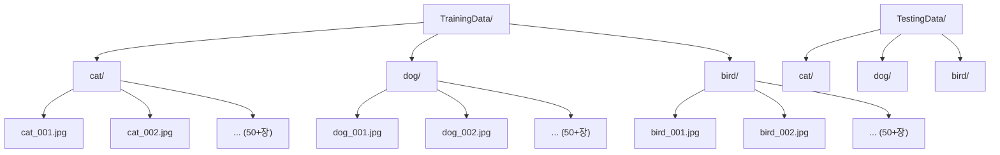
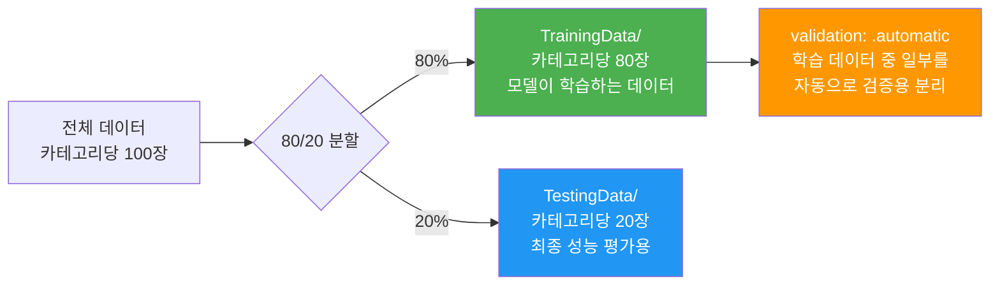
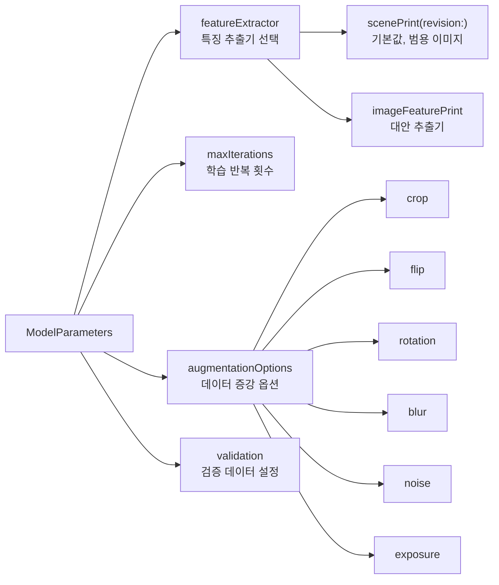
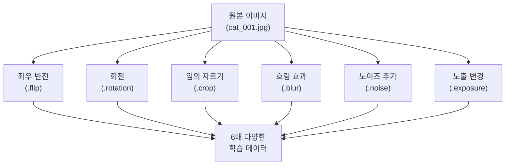
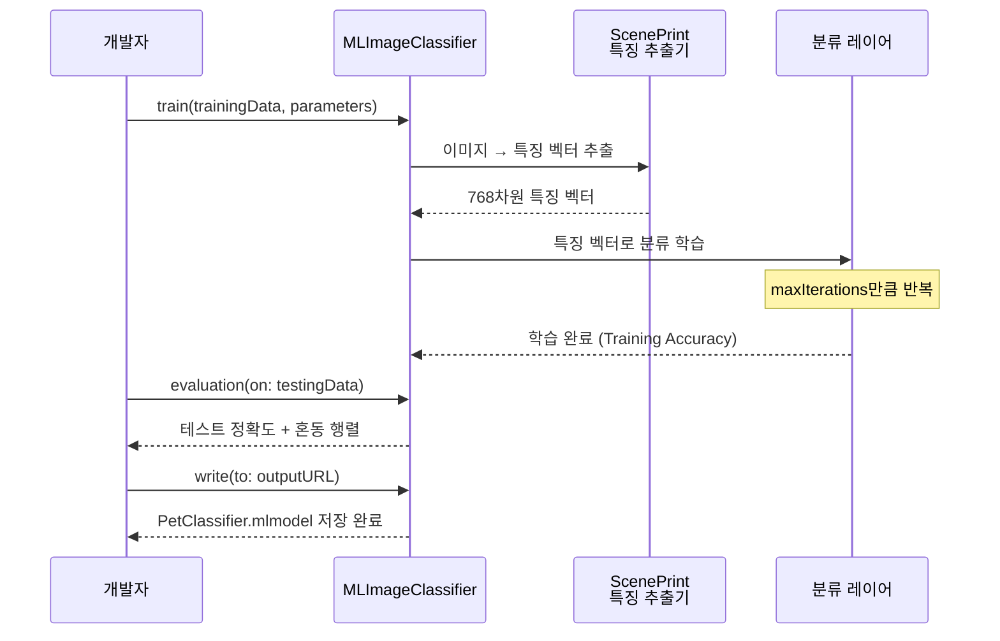
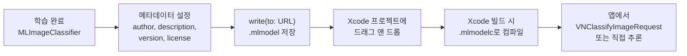

# 이미지 분류 모델 학습

> Create ML의 MLImageClassifier로 커스텀 이미지 분류 모델을 학습하고, 평가하고, .mlmodel로 내보내는 전체 과정을 마스터합니다.

## 개요

이 섹션에서는 실제 이미지 데이터를 준비하고 Create ML로 이미지 분류 모델을 학습하는 **엔드투엔드 워크플로**를 다룹니다. 폴더 구조 설계부터 `MLImageClassifier` 설정, 학습 실행, 정확도 평가, 최종 `.mlmodel` 내보내기까지 — 커스텀 모델을 앱에 탑재하기 위한 모든 단계를 실습합니다.

**선수 지식**: [Create ML 개요와 워크플로](16-ch16-create-ml로-커스텀-모델-학습/01-01-create-ml-개요와-워크플로.md)에서 배운 4단계 워크플로(데이터 준비 → 학습 → 평가 → 내보내기)와 전이 학습 개념
**학습 목표**:
- 이미지 분류에 적합한 폴더 구조로 학습 데이터를 정리한다
- `MLImageClassifier`의 `ModelParameters`를 이해하고 최적 설정을 선택한다
- 데이터 증강(Augmentation)으로 적은 데이터에서도 성능을 높인다
- 혼동 행렬(Confusion Matrix)과 정확도 지표로 모델을 평가한다
- 학습된 모델을 `.mlmodel`로 내보내 Core ML 앱에 통합한다

## 왜 알아야 할까?

여러분이 만드는 앱에 "사진 속 음식 종류 인식", "반려동물 품종 분류", "문서 유형 자동 분류" 같은 기능을 넣고 싶다고 해보죠. Hugging Face나 Apple 모델 갤러리에서 딱 맞는 모델을 찾기 어려운 경우가 많습니다. **내 데이터에 특화된 분류 모델**이 필요한 거죠.

Create ML의 이미지 분류는 바로 이 문제를 해결합니다. 전이 학습 덕분에 **수십~수백 장의 이미지만으로도** 놀라울 정도의 정확도를 달성할 수 있고, 학습된 모델은 온디바이스에서 실시간으로 동작하니까요. [Core ML 프레임워크](15-ch15-core-ml-기초/01-01-core-ml-프레임워크-소개.md)에서 배운 것처럼, `.mlmodel` 파일 하나로 앱에 바로 통합할 수 있습니다.

## 핵심 개념

### 개념 1: 학습 데이터 폴더 구조

> 💡 **비유**: 사진 앨범을 정리한다고 생각해보세요. "가족 여행", "친구 모임", "풍경" 같은 폴더를 만들고, 각 사진을 알맞은 폴더에 넣잖아요? Create ML의 이미지 분류 데이터도 정확히 같은 방식입니다. **폴더 이름이 곧 라벨(정답)** 이 되거든요.

`MLImageClassifier`는 `labeledDirectories`라는 데이터 소스를 사용합니다. 최상위 폴더 안에 라벨별 하위 폴더를 만들고, 각 폴더에 해당 라벨의 이미지를 넣는 것이 전부입니다.

> 📊 **그림 1**: 이미지 분류 학습 데이터 폴더 구조



**핵심 규칙은 간단합니다:**

| 규칙 | 설명 | 예시 |
|------|------|------|
| 폴더 이름 = 라벨 | 폴더 이름이 그대로 분류 카테고리가 됨 | `cat/`, `dog/`, `bird/` |
| 80/20 분할 | 전체 이미지의 ~80%는 Training, ~20%는 Testing으로 분리 | 100장이면 80장 학습 + 20장 테스트 |
| 라벨당 최소 10장 | 전이 학습 덕에 적은 수로도 가능하지만, 실무에서는 50장 이상 권장 | cat/ 폴더에 50장 이상 |
| 균등 분포 | 라벨 간 이미지 수가 비슷할수록 편향 없는 모델 학습 가능 | cat 50장, dog 50장, bird 50장 |
| 다양성 확보 | 각도, 조명, 배경이 다양한 이미지를 포함해야 실전 성능 향상 | 실내/실외, 낮/밤 사진 혼합 |
| 데이터 누출 방지 | 같은 이미지가 Training과 Testing에 동시에 있으면 안 됨 | 완전히 분리된 별도 촬영분 사용 |

> 📊 **그림 2**: 80/20 데이터 분할 전략



Training 데이터 안에서도 Create ML이 자동으로 일부를 **검증(Validation)** 데이터로 분리합니다. 검증 데이터는 학습 중간에 과적합 여부를 체크하는 데 쓰이고, Testing 데이터는 학습이 완전히 끝난 뒤 **최종 성적표**를 매기는 데 사용되죠.

```swift
import CreateML
import Foundation

// 학습 데이터와 테스트 데이터 경로 지정
let trainingDir = URL(fileURLWithPath: "/Users/you/Desktop/TrainingData")
let testingDir = URL(fileURLWithPath: "/Users/you/Desktop/TestingData")

// labeledDirectories — 폴더명이 자동으로 라벨이 됨
let trainingData = MLImageClassifier.DataSource.labeledDirectories(at: trainingDir)
let testingData = MLImageClassifier.DataSource.labeledDirectories(at: testingDir)
```

> ⚠️ **흔한 오해**: "이미지가 수천 장은 있어야 하지 않나요?" — 전이 학습 덕분에 카테고리당 **50~100장**으로도 충분히 높은 정확도를 달성할 수 있습니다. Apple의 ScenePrint 특징 추출기가 이미 수백만 장의 이미지에서 학습된 지식을 가지고 있기 때문이죠.

### 개념 2: MLImageClassifier와 ModelParameters

> 💡 **비유**: 요리할 때 레시피(모델 타입)를 선택한 뒤, 불 세기(maxIterations), 양념 종류(featureExtractor), 조리법 변형(augmentationOptions)을 조절하는 것과 비슷합니다. `ModelParameters`가 바로 이 **조리 설정표** 역할을 하는 거죠.

`MLImageClassifier.ModelParameters`는 학습 과정 전체를 제어하는 설정 구조체입니다. 핵심 파라미터 세 가지를 살펴보겠습니다.

> 📊 **그림 3**: ModelParameters의 핵심 구성 요소



**Feature Extractor — 특징 추출기**

특징 추출기는 전이 학습의 핵심이에요. Apple이 미리 수백만 장의 이미지로 학습해둔 신경망이 이미지에서 "특징(feature)"을 뽑아내고, 우리는 그 특징을 기반으로 **마지막 분류 레이어만 새로 학습**합니다.

Apple의 ScenePrint는 여러 리비전(revision)을 거치며 발전해왔는데, 현재 최신은 **revision 2**입니다. 리비전이 올라갈수록 더 다양한 시각적 패턴을 인식하고 더 정밀한 특징 벡터를 추출합니다. 특별한 이유가 없다면 항상 최신 리비전을 사용하는 것이 좋습니다.

```swift
// ScenePrint — 가장 범용적인 기본 추출기
let params = MLImageClassifier.ModelParameters(
    featureExtractor: .scenePrint(revision: 2),  // 최신 리비전 사용
    validation: .split(strategy: .automatic),     // 자동 검증 분할
    maxIterations: 25,                            // 학습 반복 횟수
    augmentationOptions: [.crop, .flip, .rotation] // 데이터 증강
)
```

| 파라미터 | 기본값 | 설명 |
|---------|--------|------|
| `featureExtractor` | `.scenePrint(revision: 2)` | 사전 학습된 특징 추출 모델. 리비전 번호가 높을수록 최신 |
| `maxIterations` | `25` | 학습 반복 횟수. 과적합 주의 |
| `validation` | `.split(strategy: .automatic)` | 학습 데이터의 일부를 자동 분할하여 검증 |
| `augmentationOptions` | `[]` | 데이터 증강 옵션 세트 |

### 개념 3: 데이터 증강 (Augmentation)

> 💡 **비유**: 같은 셀카를 찍어도 고개를 살짝 돌리거나, 조명이 달라지거나, 배경이 바뀌면 다른 사진처럼 보이잖아요? 데이터 증강은 기존 이미지를 **살짝 변형해서 새로운 학습 데이터를 만들어내는** 기법입니다. 하나의 고양이 사진에서 뒤집기, 회전, 자르기 등을 적용하면 여러 장의 "새로운" 학습 데이터가 생기는 셈이죠.

> 📊 **그림 4**: 데이터 증강 파이프라인 — 하나의 원본에서 다양한 변형 생성



`MLImageClassifier.ImageAugmentationOptions`는 `OptionSet` 프로토콜을 채택하므로, 여러 옵션을 배열처럼 조합할 수 있습니다:

```swift
// 실무에서 자주 쓰는 증강 조합
let augmentations: MLImageClassifier.ImageAugmentationOptions = [
    .crop,      // 이미지를 임의로 잘라냄 — 위치 불변성
    .flip,      // 좌우 반전 — 방향 불변성
    .rotation,  // 소폭 회전 — 각도 불변성
    .blur,      // 흐림 효과 — 화질 변동 대응
    .noise,     // 노이즈 추가 — 실제 카메라 노이즈 대응
    .exposure   // 밝기/노출 변경 — 조명 변동 대응
]
```

> 🔥 **실무 팁**: 모든 증강을 한꺼번에 켜면 학습 시간이 크게 늘어납니다. 먼저 `.crop`과 `.flip`만 사용해보고, 정확도가 부족하면 하나씩 추가하는 것이 효율적이에요.

### 개념 4: 학습 실행과 평가

학습을 시작하면 Create ML은 콘솔에 에포크(epoch)별 진행 상황과 정확도를 출력합니다. 학습이 완료되면 **테스트 데이터**로 모델 성능을 평가하는 것이 중요한데요 — 이때 핵심 지표가 바로 **혼동 행렬(Confusion Matrix)** 입니다.

> 📊 **그림 5**: 이미지 분류 모델의 학습 → 평가 → 내보내기 흐름



혼동 행렬은 **모델이 어떤 카테고리를 잘 맞히고, 어디서 혼동하는지**를 한눈에 보여줍니다. 예를 들어, "고양이"를 "개"로 잘못 분류한 횟수가 많다면 해당 카테고리의 학습 데이터를 보강해야 하죠.

```swift
import CreateML
import Foundation

// 1) 모델 학습
let classifier = try MLImageClassifier(
    trainingData: trainingData,
    parameters: params
)

// 2) 학습 정확도 확인
let trainingAccuracy = (1.0 - classifier.trainingMetrics.classificationError) * 100
print("학습 정확도: \(String(format: "%.1f", trainingAccuracy))%")

// 3) 테스트 데이터로 평가
let evaluation = classifier.evaluation(on: testingData)
let testAccuracy = (1.0 - evaluation.classificationError) * 100
print("테스트 정확도: \(String(format: "%.1f", testAccuracy))%")

// 4) 혼동 행렬 확인
if let confusion = evaluation.confusion {
    print("혼동 행렬:")
    print(confusion)
}
```

### 개념 5: .mlmodel 내보내기와 메타데이터

학습과 평가가 끝나면 모델을 `.mlmodel` 파일로 저장합니다. 이때 **메타데이터**를 함께 기록해두면 나중에 Xcode에서 모델 정보를 확인할 때 매우 유용합니다.

> 📊 **그림 6**: .mlmodel 내보내기 후 Core ML 앱 통합까지의 흐름



```swift
// 메타데이터 설정
let metadata = MLModelMetadata(
    author: "Your Name",
    shortDescription: "반려동물 품종 분류 모델 — cat, dog, bird",
    version: "1.0.0"
)

// .mlmodel 파일로 저장
let outputURL = URL(fileURLWithPath: "/Users/you/Desktop/PetClassifier.mlmodel")
try classifier.write(to: outputURL, metadata: metadata)
print("모델 저장 완료: \(outputURL.lastPathComponent)")
```

저장된 `.mlmodel` 파일을 Xcode 프로젝트에 드래그하면, [Core ML 모델 통합](15-ch15-core-ml-기초/02-02-core-ml-모델-통합하기.md)에서 배운 것처럼 자동으로 Swift 인터페이스가 생성됩니다.

## 실습: 직접 해보기

Mac의 Playground나 Swift 스크립트에서 실행할 수 있는 **음식 이미지 분류 모델** 학습 전체 코드입니다.

> 먼저 데스크톱에 아래 폴더 구조를 만들어주세요:
> - `FoodTraining/pizza/`, `FoodTraining/sushi/`, `FoodTraining/salad/` — 각 50장 이상
> - `FoodTesting/pizza/`, `FoodTesting/sushi/`, `FoodTesting/salad/` — 각 10장 이상

```swift
import CreateML
import Foundation

// ============================================
// 음식 이미지 분류 모델 학습 — 전체 파이프라인
// ============================================

// MARK: - 1. 데이터 경로 설정
let trainingDir = URL(fileURLWithPath: "/Users/you/Desktop/FoodTraining")
let testingDir = URL(fileURLWithPath: "/Users/you/Desktop/FoodTesting")

// MARK: - 2. 모델 파라미터 설정
let parameters = MLImageClassifier.ModelParameters(
    featureExtractor: .scenePrint(revision: 2),   // Apple 기본 특징 추출기
    validation: .split(strategy: .automatic),       // 학습 데이터의 일부를 자동 검증용으로 분할
    maxIterations: 20,                              // 20회 반복 (과적합 방지)
    augmentationOptions: [.crop, .flip, .rotation]  // 자르기 + 반전 + 회전 증강
)

// MARK: - 3. 모델 학습
print("🚀 모델 학습 시작...")
let startTime = Date()

let classifier = try MLImageClassifier(
    trainingData: .labeledDirectories(at: trainingDir),
    parameters: parameters
)

let elapsed = Date().timeIntervalSince(startTime)
print("✅ 학습 완료! 소요 시간: \(String(format: "%.1f", elapsed))초")

// MARK: - 4. 학습 정확도 확인
let trainError = classifier.trainingMetrics.classificationError
let trainAccuracy = (1.0 - trainError) * 100
print("📊 학습 정확도: \(String(format: "%.1f", trainAccuracy))%")

// MARK: - 5. 검증 정확도 확인
let valError = classifier.validationMetrics.classificationError
let valAccuracy = (1.0 - valError) * 100
print("📊 검증 정확도: \(String(format: "%.1f", valAccuracy))%")

// MARK: - 6. 테스트 데이터로 최종 평가
let testMetrics = classifier.evaluation(
    on: .labeledDirectories(at: testingDir)
)
let testError = testMetrics.classificationError
let testAccuracy = (1.0 - testError) * 100
print("📊 테스트 정확도: \(String(format: "%.1f", testAccuracy))%")

// MARK: - 7. 성능 판단
if testAccuracy >= 90 {
    print("🎉 훌륭한 성능입니다!")
} else if testAccuracy >= 80 {
    print("👍 양호합니다. 데이터를 추가하면 더 좋아질 수 있어요.")
} else {
    print("⚠️ 성능 개선이 필요합니다. 데이터 품질과 양을 확인하세요.")
}

// MARK: - 8. 메타데이터와 함께 모델 저장
let metadata = MLModelMetadata(
    author: "My App Team",
    shortDescription: "음식 이미지 분류 — pizza, sushi, salad (3 classes)",
    version: "1.0.0"
)

let outputURL = URL(fileURLWithPath: "/Users/you/Desktop/FoodClassifier.mlmodel")
try classifier.write(to: outputURL, metadata: metadata)
print("💾 모델 저장 완료: \(outputURL.path)")
```

```output
🚀 모델 학습 시작...
✅ 학습 완료! 소요 시간: 12.3초
📊 학습 정확도: 98.7%
📊 검증 정확도: 94.2%
📊 테스트 정확도: 92.5%
🎉 훌륭한 성능입니다!
💾 모델 저장 완료: /Users/you/Desktop/FoodClassifier.mlmodel
```

> 💡 **알고 계셨나요?**: Create ML 앱의 GUI에서도 동일한 작업을 할 수 있습니다. Xcode 메뉴 → Open Developer Tool → Create ML에서 Image Classifier 템플릿을 선택하고, Training Data 영역에 폴더를 드래그하면 됩니다. 코드를 한 줄도 쓰지 않고도 모델을 학습할 수 있죠!

## 더 깊이 알아보기

### 전이 학습의 역사 — 왜 50장으로도 되는 걸까?

이미지 분류의 역사를 거슬러 올라가면, 2012년 **AlexNet**이 ImageNet 대회에서 압도적 성능으로 우승하면서 딥러닝 시대가 열렸습니다. 하지만 당시에는 수백만 장의 이미지와 강력한 GPU가 필요했죠.

전환점은 2014년경, 연구자들이 재미있는 사실을 발견하면서 찾아왔습니다. ImageNet으로 학습된 모델의 앞쪽 레이어들은 **범용적인 시각 특징**(가장자리, 질감, 패턴)을 학습하고, 뒤쪽 레이어만 구체적인 카테고리를 학습한다는 거예요. 그래서 앞쪽 레이어는 그대로 두고 **마지막 레이어만 새 데이터로 교체 학습**하면 적은 데이터로도 새로운 분류 작업을 할 수 있다는 것이죠. 이것이 바로 **전이 학습(Transfer Learning)** 입니다.

Apple의 ScenePrint는 이 원리를 극대화한 것입니다. Apple이 보유한 방대한 이미지 데이터로 사전 학습된 모델이 768차원의 특징 벡터를 추출하고, 우리는 그 벡터 위에 간단한 분류기를 얹는 거예요. 그래서 50장 정도의 이미지로도 놀라운 정확도를 달성할 수 있는 겁니다.

### ScenePrint의 내부 동작과 버전 히스토리

ScenePrint가 이미지를 처리하면, 299×299 크기로 리사이즈한 뒤 다층 합성곱 신경망을 통과시켜 768차원 부동소수점 벡터를 출력합니다. 이 벡터가 이미지의 "지문"에 해당하는데, 비슷한 이미지는 벡터 공간에서 가까이 위치하게 됩니다. `MLImageClassifier`는 이 벡터들을 로지스틱 회귀(Logistic Regression)로 분류하는 것이 전부입니다.

ScenePrint는 Apple이 지속적으로 개선해온 특징 추출기입니다. **revision 1**은 초기 버전으로 기본적인 이미지 특징을 추출했고, **revision 2**에서는 더 넓은 범위의 시각적 패턴을 인식하도록 사전 학습 데이터와 네트워크 구조가 업그레이드되었습니다. API에서 `.scenePrint(revision: 2)`처럼 리비전 번호를 명시적으로 지정할 수 있으며, 새로운 OS 버전에서 더 높은 리비전이 추가될 수 있으니 Apple 문서에서 최신 리비전을 확인하는 것이 좋습니다.

## 흔한 오해와 팁

> ⚠️ **흔한 오해**: "학습 정확도가 99%면 완벽한 모델이다" — **절대 아닙니다!** 학습 정확도가 99%인데 테스트 정확도가 70%라면, 모델이 학습 데이터를 **외워버린 것**입니다(과적합). 항상 **테스트 정확도**를 기준으로 성능을 판단하세요. 학습 정확도와 테스트 정확도의 격차가 10% 이상이면 과적합을 의심해야 합니다.

> 💡 **알고 계셨나요?**: Create ML은 내부적으로 이미지를 299×299 픽셀로 리사이즈합니다. 따라서 초고해상도 원본 이미지를 그대로 넣을 필요가 없어요. 미리 적절한 크기(500×500 정도)로 줄여두면 학습 속도가 크게 빨라집니다.

> 🔥 **실무 팁**: 모델 성능이 기대에 못 미칠 때 체크리스트:
> 1. **데이터 품질** — 잘못 분류된 이미지가 섞여 있지 않은지 확인
> 2. **라벨 불균형** — 한 카테고리만 이미지가 많고 다른 건 적지 않은지 확인
> 3. **증강 추가** — `.blur`, `.noise`, `.exposure`를 추가하여 다양성 확보
> 4. **maxIterations 조정** — 너무 적으면 학습 부족, 너무 많으면 과적합
> 5. **혼동 행렬 분석** — 어떤 카테고리끼리 혼동되는지 파악 후 해당 데이터 보강

## 핵심 정리

| 개념 | 설명 |
|------|------|
| 폴더 구조 | 최상위 폴더 안에 라벨별 하위 폴더, 폴더명 = 분류 카테고리 |
| DataSource | `.labeledDirectories(at:)`로 폴더 구조에서 자동 라벨링 |
| ScenePrint | Apple 기본 특징 추출기, 768차원 벡터 출력. revision 번호로 버전 관리 |
| ModelParameters | featureExtractor, maxIterations, augmentationOptions, validation 설정 |
| 데이터 증강 | crop, flip, rotation, blur, noise, exposure — 적은 데이터를 다양하게 |
| 80/20 분할 | 학습 80%, 테스트 20% 분리. 같은 이미지가 양쪽에 있으면 안 됨 |
| 혼동 행렬 | 모델이 어떤 카테고리를 혼동하는지 보여주는 평가 도구 |
| .mlmodel 저장 | `write(to:metadata:)`로 내보내기, Xcode에서 Core ML로 통합 |

## 다음 섹션 미리보기

이미지 분류 모델을 학습해봤으니, 다음 섹션 [텍스트 분류와 표 형식 모델](16-ch16-create-ml로-커스텀-모델-학습/03-03-텍스트-분류와-표-형식-모델.md)에서는 **텍스트 데이터와 CSV/JSON 표 형식 데이터**를 다루는 모델을 학습합니다. 이메일 스팸 필터, 감성 분석, 부동산 가격 예측 등 이미지가 아닌 데이터에 Create ML을 적용하는 방법을 배우게 됩니다.

## 참고 자료

- [Creating an Image Classifier Model — Apple Developer Documentation](https://developer.apple.com/documentation/createml/creating-an-image-classifier-model) - Create ML 이미지 분류의 공식 가이드. 폴더 구조부터 내보내기까지 전체 워크플로 설명
- [MLImageClassifier — Apple Developer Documentation](https://developer.apple.com/documentation/createml/mlimageclassifier) - MLImageClassifier API 레퍼런스. ModelParameters, DataSource, 평가 메서드 상세 문서
- [Create ML Overview — Apple Developer](https://developer.apple.com/machine-learning/create-ml/) - Create ML 프레임워크와 앱의 전체 개요 및 지원 태스크 목록
- [Introduction to Create ML: How to Train Your Own Machine Learning Model in Xcode — AppCoda](https://www.appcoda.com/create-ml/) - 이미지 분류 모델 학습의 실전 튜토리얼. GUI 앱 사용법 포함
- [MLImageClassifier.ModelParameters — Apple Developer Documentation](https://developer.apple.com/documentation/createml/mlimageclassifier/modelparameters-swift.struct) - featureExtractor, augmentationOptions, maxIterations 등 파라미터 상세 설명

---
### 🔗 Related Sessions
- [create ml 프레임워크](16-ch16-create-ml로-커스텀-모델-학습/01-01-create-ml-개요와-워크플로.md) (prerequisite)
- [전이 학습(transfer learning)](16-ch16-create-ml로-커스텀-모델-학습/01-01-create-ml-개요와-워크플로.md) (prerequisite)
- [데이터 증강(augmentation)](16-ch16-create-ml로-커스텀-모델-학습/01-01-create-ml-개요와-워크플로.md) (prerequisite)
