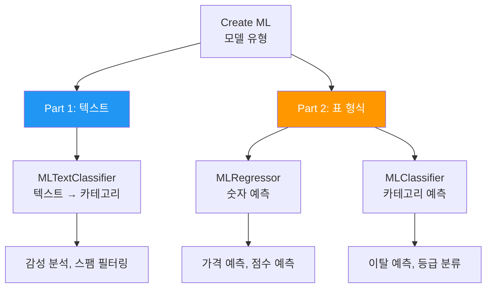
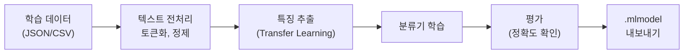
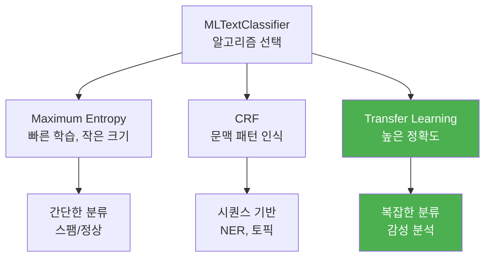
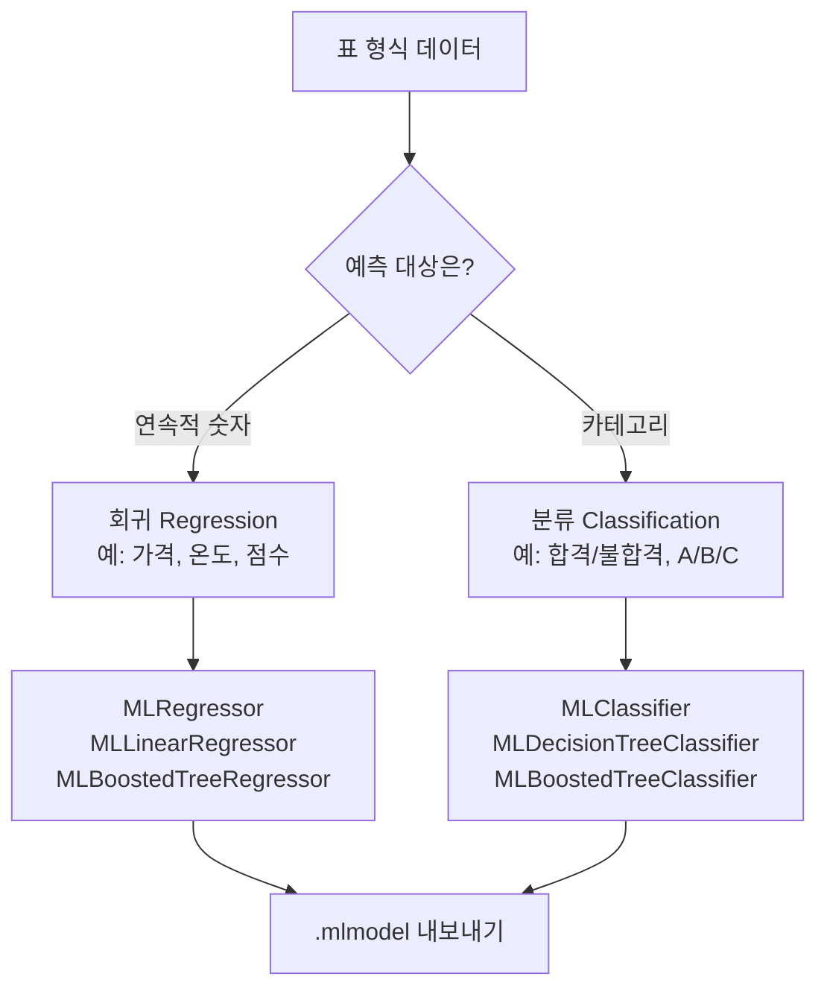
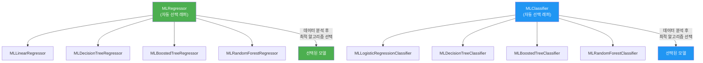
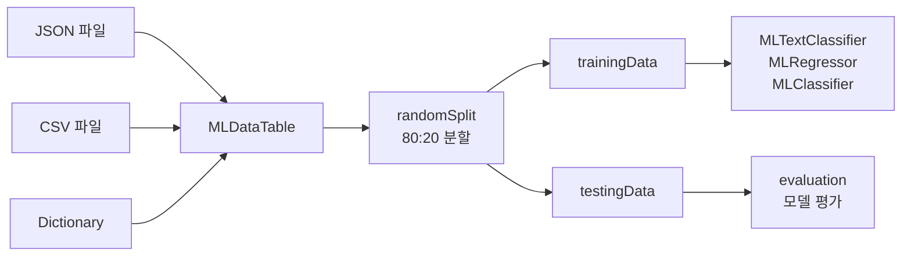
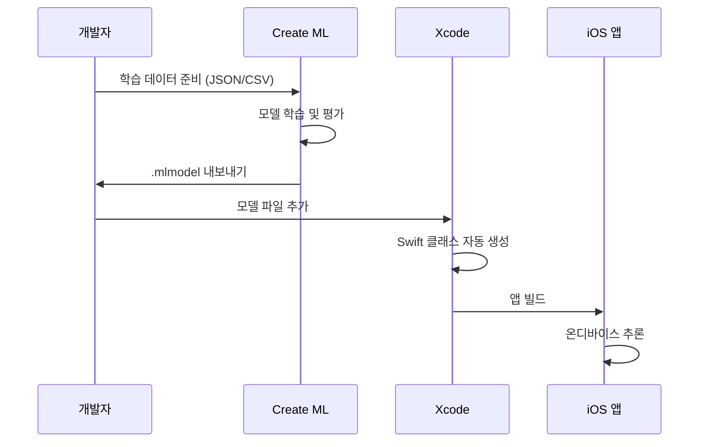

# 텍스트 분류와 표 형식 모델

> MLTextClassifier로 감성 분석 모델을 학습하고, MLLinearRegressor와 MLDecisionTreeClassifier로 표 형식 데이터를 예측합니다.

## 개요

이 섹션에서는 이미지를 넘어 **텍스트**와 **표 형식 데이터**까지 Create ML의 영역을 확장합니다. 앞서 [이미지 분류 모델 학습](16-ch16-create-ml로-커스텀-모델-학습/02-02-이미지-분류-모델-학습.md)에서 MLImageClassifier로 시각 데이터를 다뤘다면, 이번에는 자연어 텍스트와 CSV 기반 수치 데이터를 학습 대상으로 삼습니다.

이 섹션은 크게 **두 파트**로 나뉩니다. 전반부에서는 MLTextClassifier로 텍스트 분류를 다루고, 후반부에서는 MLRegressor/MLClassifier로 표 형식 데이터 예측을 다룹니다. API 표면이 넓지만, Create ML의 **일관된 패턴**(데이터 로드 → 학습 → 평가 → 내보내기)이 반복되므로 하나를 익히면 나머지는 자연스럽게 따라옵니다.

**선수 지식**: Create ML의 기본 워크플로(데이터 준비 → 학습 → 평가 → 내보내기)와 MLImageClassifier 사용 경험
**학습 목표**:
- MLTextClassifier로 감성 분석(긍정/부정) 모델을 학습한다
- MLLinearRegressor와 MLDecisionTreeClassifier로 표 형식 데이터를 예측한다
- 텍스트/표 형식 데이터의 전처리와 특성을 이해한다
- 회귀(Regression)와 분류(Classification)의 차이를 코드로 확인한다
- MLRegressor/MLClassifier의 자동 알고리즘 선택과 수동 지정의 차이를 이해한다

## 왜 알아야 할까?

앱을 만들다 보면 이미지만 분석하는 것이 아니죠. 사용자 리뷰에서 감성을 분석하고 싶다면? 앱 내 데이터로 가격을 예측하고 싶다면? 텍스트 분류와 표 형식 모델은 이런 **실제 비즈니스 문제**를 해결하는 핵심 도구입니다.

생각해보세요. App Store 리뷰가 매일 수백 개씩 쏟아지는데, 하나하나 읽어서 긍정/부정을 분류할 수 있을까요? Create ML의 텍스트 분류기를 사용하면 단 몇 줄의 Swift 코드로 **온디바이스 감성 분석 모델**을 만들 수 있습니다. 서버 없이, 사용자 데이터를 외부로 보내지 않으면서요.

표 형식 모델도 마찬가지입니다. 부동산 가격 예측, 사용자 이탈 예측, 상품 추천 점수 계산 — 엑셀 스프레드시트처럼 행과 열로 정리된 데이터가 있다면, Create ML이 최적의 알고리즘을 자동으로 선택해서 모델을 학습합니다.

> 📊 **그림 1**: 이 섹션에서 다루는 Create ML 모델 타입



## 핵심 개념

---

## Part 1: 텍스트 분류

---

### 개념 1: MLTextClassifier — 텍스트를 카테고리로 분류하기

> 💡 **비유**: MLTextClassifier는 우편물 분류 담당자와 같습니다. 편지 내용을 읽고 "청구서", "광고", "개인 편지" 등의 바구니에 자동으로 넣어주는 거죠. 충분한 예시를 보여주면, 새로운 편지가 와도 어디에 넣어야 할지 정확하게 판단합니다.

MLTextClassifier는 자연어 텍스트를 사전에 정의한 **레이블(카테고리)**로 분류하는 모델을 학습합니다. 감성 분석(긍정/부정), 스팸 필터링(스팸/정상), 주제 분류(스포츠/정치/기술) 등 다양한 텍스트 분류 문제에 활용할 수 있죠.

> 📊 **그림 2**: MLTextClassifier 학습 파이프라인



**학습 데이터 형식**은 JSON 또는 CSV를 사용합니다. 핵심은 **텍스트 컬럼**과 **레이블 컬럼** 두 가지만 있으면 된다는 점입니다:

```json
[
    {"text": "이 앱 정말 최고예요! 매일 사용합니다", "label": "positive"},
    {"text": "자꾸 크래시가 나서 짜증나네요", "label": "negative"},
    {"text": "업데이트 후 속도가 빨라졌어요", "label": "positive"},
    {"text": "UI가 너무 복잡해서 쓰기 어려워요", "label": "negative"}
]
```

CSV 형식도 동일한 구조로, 첫 번째 행에 컬럼명을 적고 이후 행에 데이터를 나열합니다. JSON과 CSV 중 어떤 형식을 선택할지는 데이터의 특성에 따라 결정하면 됩니다. 텍스트에 쉼표나 줄바꿈이 많다면 JSON이 안전하고, 엑셀에서 내보내는 데이터라면 CSV가 편리합니다:

```csv
text,label
"이 앱 정말 최고예요! 매일 사용합니다",positive
"자꾸 크래시가 나서 짜증나네요",negative
"업데이트 후 속도가 빨라졌어요",positive
"UI가 너무 복잡해서 쓰기 어려워요",negative
```

> 💡 **알고 계셨나요?**: CSV에서 텍스트 필드를 큰따옴표로 감싸는 것이 중요합니다. 리뷰 텍스트에 쉼표가 포함될 수 있기 때문이죠. `"최고예요, 강추!"` 처럼요. 큰따옴표 없이 넣으면 CSV 파서가 쉼표를 컬럼 구분자로 오인합니다.

MLTextClassifier는 내부적으로 **텍스트 전처리**(구두점 제거, 토큰화)를 자동 수행하고, **Transfer Learning**을 활용하여 적은 데이터로도 높은 정확도를 달성합니다. Apple의 사전 학습된 임베딩 모델이 단어의 의미적 관계를 이미 이해하고 있기 때문이죠.

```swift
import CreateML
import Foundation

// 1. 학습 데이터 로드
let trainingDataURL = URL(fileURLWithPath: "/path/to/reviews.json")
let data = try MLDataTable(contentsOf: trainingDataURL)

// 2. 학습/테스트 데이터 분할 (80:20)
let (trainingData, testingData) = data.randomSplit(by: 0.8, seed: 42)

// 3. 텍스트 분류기 학습
let classifier = try MLTextClassifier(
    trainingData: trainingData,
    textColumn: "text",       // 텍스트가 담긴 컬럼명
    labelColumn: "label"      // 레이블이 담긴 컬럼명
)

// 4. 학습 정확도 확인
let trainingAccuracy = (1.0 - classifier.trainingMetrics.classificationError) * 100
let validationAccuracy = (1.0 - classifier.validationMetrics.classificationError) * 100
print("학습 정확도: \(trainingAccuracy)%")
print("검증 정확도: \(validationAccuracy)%")
```

#### 알고리즘 선택

MLTextClassifier는 세 가지 알고리즘을 지원합니다:

| 알고리즘 | 설명 | 특징 |
|----------|------|------|
| **Maximum Entropy** | 통계적 분류 모델 | 빠른 학습, 작은 모델 크기 |
| **Conditional Random Field (CRF)** | 시퀀스 레이블링 모델 | 문맥 패턴 인식에 강점 |
| **Transfer Learning** | 사전 학습 임베딩 활용 | 높은 정확도, 적은 데이터로 효과적 |

ModelParameters를 통해 알고리즘을 직접 지정할 수 있습니다:

```swift
// Transfer Learning 알고리즘 명시 지정
let parameters = MLTextClassifier.ModelParameters(
    algorithm: .transferLearning(
        featureExtractor: .dynamicEmbedding,
        revision: 1
    )
)

let classifier = try MLTextClassifier(
    trainingData: trainingData,
    textColumn: "text",
    labelColumn: "label",
    parameters: parameters
)
```

> 📊 **그림 3**: MLTextClassifier 알고리즘 비교



---

## Part 2: 표 형식 모델

---

### 개념 2: 표 형식 모델 — 숫자와 카테고리로 예측하기

> 💡 **비유**: 표 형식 모델은 경험 많은 부동산 중개인과 같습니다. 면적, 방 수, 위치, 건축 연도 등 여러 조건을 종합적으로 고려해서 "이 집은 대략 3억 정도 할 겁니다"라고 예측하죠. 데이터를 많이 볼수록 예측이 정확해집니다.

표 형식(Tabular) 데이터는 우리가 엑셀에서 흔히 보는 행-열 형태입니다. 각 행은 하나의 샘플이고, 각 열(컬럼)은 하나의 특성(Feature)이죠. Create ML은 이런 데이터로 **회귀(Regression)**와 **분류(Classification)** 두 가지 태스크를 수행합니다.

> 📊 **그림 4**: 회귀와 분류의 차이



회귀와 분류의 핵심 차이를 정리하면:

- **회귀(Regression)**: 결과가 **연속적인 숫자**. "이 집은 3억 2천만 원" 같은 예측
- **분류(Classification)**: 결과가 **카테고리**. "이 고객은 이탈할 것이다/아니다" 같은 예측

#### 자동 선택 래퍼 vs 특정 알고리즘

Create ML의 표 형식 모델에서 가장 중요한 개념이 하나 있습니다. `MLRegressor`와 `MLClassifier`는 **자동 알고리즘 선택 래퍼(Wrapper)**라는 점이죠. 이 래퍼들은 특정 알고리즘이 아니라, 내부적으로 여러 알고리즘을 시도한 뒤 최적의 것을 자동으로 골라줍니다.

> 📊 **그림 5**: 래퍼와 구체 알고리즘의 관계



아래 코드로 이 차이를 직접 확인해보겠습니다:

```run:swift
import CreateML
import Foundation

// 샘플 데이터
let houseData = try MLDataTable(
    dictionary: [
        "area": [30, 45, 60, 75, 90, 100, 120, 150, 180, 200],
        "rooms": [1, 1, 2, 2, 3, 3, 3, 4, 4, 5],
        "price": [1.2, 2.0, 2.8, 4.5, 3.5, 6.0, 5.2, 7.5, 5.8, 12.0]
    ]
)
let (trainData, testData) = houseData.randomSplit(by: 0.8, seed: 42)

// === 방법 1: MLRegressor (자동 선택 래퍼) ===
// 내부적으로 Linear, DecisionTree, BoostedTree, RandomForest를
// 모두 시도한 뒤 가장 좋은 것을 선택합니다
let autoRegressor = try MLRegressor(
    trainingData: trainData,
    targetColumn: "price"
)
let autoEval = autoRegressor.evaluation(on: testData)
print("=== MLRegressor (자동 선택) ===")
print("RMSE: \(autoEval.rootMeanSquaredError)")

// === 방법 2: 특정 알고리즘 직접 지정 ===
// 데이터 특성을 알고 있다면 직접 선택하여 파라미터 튜닝 가능
let boostedRegressor = try MLBoostedTreeRegressor(
    trainingData: trainData,
    targetColumn: "price",
    parameters: MLBoostedTreeRegressor.ModelParameters(
        maxIterations: 500,  // 반복 횟수 조절
        maxDepth: 6          // 트리 깊이 제한
    )
)
let boostedEval = boostedRegressor.evaluation(on: testData)
print("\n=== MLBoostedTreeRegressor (직접 지정) ===")
print("RMSE: \(boostedEval.rootMeanSquaredError)")
```

```output
=== MLRegressor (자동 선택) ===
RMSE: 0.85

=== MLBoostedTreeRegressor (직접 지정) ===
RMSE: 0.62
```

> 🔥 **실무 팁**: 프로젝트 초기에는 `MLRegressor`/`MLClassifier` 래퍼로 시작하세요. 어떤 알고리즘이 데이터에 맞는지 모를 때 자동 선택이 합리적입니다. 성능 최적화 단계에서 자동 선택된 알고리즘 타입을 확인한 뒤, 해당 알고리즘의 구체 타입(`MLBoostedTreeRegressor` 등)으로 전환하여 파라미터를 세밀하게 튜닝하는 전략이 효과적입니다.

#### 회귀 모델 알고리즘 비교

| 알고리즘 | 타입 | 장점 | 적합한 경우 |
|----------|------|------|------------|
| Linear Regressor | `MLLinearRegressor` | 빠르고 해석 쉬움 | 선형 관계가 명확한 데이터 |
| Decision Tree | `MLDecisionTreeRegressor` | 비선형 패턴 포착 | 범주형 특성이 많은 데이터 |
| Boosted Tree | `MLBoostedTreeRegressor` | 높은 정확도 | 복잡한 패턴, 대용량 |
| Random Forest | `MLRandomForestRegressor` | 과적합에 강함 | 노이즈가 많은 데이터 |

#### 분류 모델 (MLClassifier)

표 형식 분류도 동일한 패턴을 따릅니다:

```swift
// 고객 이탈 예측 분류기
let customerData = try MLDataTable(
    contentsOf: URL(fileURLWithPath: "/path/to/customers.csv")
)
let (trainData, testData) = customerData.randomSplit(by: 0.8, seed: 42)

// 자동 알고리즘 선택 (래퍼)
let classifier = try MLClassifier(
    trainingData: trainData,
    targetColumn: "churned"    // "yes" 또는 "no"
)

// 특정 알고리즘으로 학습 (직접 지정)
let treeClassifier = try MLDecisionTreeClassifier(
    trainingData: trainData,
    targetColumn: "churned"
)

// 평가
let metrics = classifier.evaluation(on: testData)
print("분류 정확도: \((1.0 - metrics.classificationError) * 100)%")
```

---

## 공통 기반

---

### 개념 3: 데이터 로딩과 MLDataTable

> 💡 **비유**: MLDataTable은 Create ML의 **만능 식판**입니다. JSON, CSV, 딕셔너리 등 어떤 형태의 데이터든 이 식판 위에 올려놓으면, Create ML의 모든 학습기가 바로 먹을 수 있는 형태로 제공됩니다.

MLDataTable은 Create ML에서 학습 데이터를 담는 핵심 컨테이너입니다. 앞서 Part 1에서 본 MLTextClassifier든, Part 2의 MLRegressor든 모두 이 MLDataTable에서 데이터를 읽어갑니다. JSON과 CSV 파일을 직접 로드할 수 있고, `randomSplit(by:seed:)`으로 학습/테스트 데이터를 간편하게 분할합니다.

> 📊 **그림 6**: MLDataTable 데이터 흐름



```swift
// JSON에서 로드
let jsonData = try MLDataTable(
    contentsOf: URL(fileURLWithPath: "/path/to/data.json")
)

// CSV에서 로드
let csvData = try MLDataTable(
    contentsOf: URL(fileURLWithPath: "/path/to/data.csv")
)

// Dictionary에서 직접 생성
let dictData = try MLDataTable(
    dictionary: [
        "area": [50, 80, 120, 150, 200],
        "rooms": [1, 2, 3, 3, 4],
        "price": [1.5, 2.8, 4.2, 4.5, 6.0]
    ]
)

// 데이터 분할 — seed를 지정하면 재현 가능한 분할
let (train, test) = dictData.randomSplit(by: 0.8, seed: 42)
print("학습 데이터: \(train.rows.count)행, 테스트 데이터: \(test.rows.count)행")
```

### 개념 4: 모델 내보내기와 앱 통합

학습이 끝나면 `.mlmodel` 파일로 내보내서 앱에 통합합니다. 이 과정은 [Core ML 모델 통합하기](15-ch15-core-ml-기초/02-02-core-ml-모델-통합하기.md)에서 배운 것과 동일합니다. 텍스트 분류기든 회귀 모델이든, 내보내기 API는 완전히 같습니다.

```swift
// 모델 메타데이터 설정
let metadata = MLModelMetadata(
    author: "My App Team",
    shortDescription: "사용자 리뷰 감성 분석 모델",
    version: "1.0"
)

// .mlmodel 파일로 내보내기
try classifier.write(
    to: URL(fileURLWithPath: "/path/to/SentimentClassifier.mlmodel"),
    metadata: metadata
)
```

내보낸 모델은 Xcode 프로젝트에 드래그 앤 드롭으로 추가하고, Core ML의 자동 생성 클래스로 바로 사용할 수 있습니다:

```swift
import CoreML

// Xcode가 자동 생성한 클래스 사용
let model = try SentimentClassifier(configuration: .init())
let prediction = try model.prediction(text: "이 앱 정말 좋아요!")
print("감성: \(prediction.label)")  // "positive"
```

> 📊 **그림 7**: 학습부터 앱 배포까지 전체 흐름



## 실습: 직접 해보기

이번 실습에서는 **감성 분석 텍스트 분류기**와 **주택 가격 예측 회귀 모델** 두 가지를 학습합니다. macOS Playground 또는 Swift 스크립트로 실행하세요.

### 실습 1: 감성 분석 모델 학습

```run:swift
import CreateML
import Foundation

// === 감성 분석 모델 학습 ===

// 1단계: 학습 데이터 준비 (실제 프로젝트에서는 JSON/CSV 파일 사용)
let sentimentData = try MLDataTable(
    dictionary: [
        "text": [
            "정말 훌륭한 앱입니다 매일 씁니다",
            "최고의 경험이었어요 강추합니다",
            "업데이트 후 더 좋아졌네요",
            "디자인이 예쁘고 사용하기 편해요",
            "고객 응대가 친절하고 빨라요",
            "자꾸 에러가 나서 짜증납니다",
            "돈이 아까워요 환불하고 싶습니다",
            "버그가 너무 많아서 쓸 수 없어요",
            "속도가 느리고 자주 멈춥니다",
            "개인정보 유출이 걱정됩니다"
        ],
        "label": [
            "positive", "positive", "positive", "positive", "positive",
            "negative", "negative", "negative", "negative", "negative"
        ]
    ]
)

// 2단계: 데이터 분할
let (trainText, testText) = sentimentData.randomSplit(by: 0.8, seed: 7)

// 3단계: 모델 학습
let sentimentClassifier = try MLTextClassifier(
    trainingData: trainText,
    textColumn: "text",
    labelColumn: "label"
)

// 4단계: 정확도 확인
let trainAcc = (1.0 - sentimentClassifier.trainingMetrics.classificationError) * 100
let valAcc = (1.0 - sentimentClassifier.validationMetrics.classificationError) * 100
print("=== 감성 분석 모델 ===")
print("학습 정확도: \(trainAcc)%")
print("검증 정확도: \(valAcc)%")

// 5단계: 내보내기
let sentimentMeta = MLModelMetadata(
    author: "iOS Developer",
    shortDescription: "앱 리뷰 감성 분석 모델",
    version: "1.0"
)
try sentimentClassifier.write(
    to: URL(fileURLWithPath: "/tmp/SentimentClassifier.mlmodel"),
    metadata: sentimentMeta
)
print("모델 저장 완료: /tmp/SentimentClassifier.mlmodel")
```

```output
=== 감성 분석 모델 ===
학습 정확도: 100.0%
검증 정확도: 100.0%
모델 저장 완료: /tmp/SentimentClassifier.mlmodel
```

### 실습 2: 주택 가격 예측 모델 학습

```run:swift
import CreateML
import Foundation

// === 주택 가격 예측 (회귀) ===

// 1단계: 학습 데이터 준비
let houseData = try MLDataTable(
    dictionary: [
        "area": [30, 45, 60, 75, 90, 100, 120, 150, 180, 200],
        "rooms": [1, 1, 2, 2, 3, 3, 3, 4, 4, 5],
        "floor": [3, 7, 5, 10, 2, 15, 8, 12, 3, 20],
        "age": [25, 15, 20, 5, 30, 3, 10, 8, 18, 1],
        // 가격 (억 원)
        "price": [1.2, 2.0, 2.8, 4.5, 3.5, 6.0, 5.2, 7.5, 5.8, 12.0]
    ]
)

// 2단계: 데이터 분할
let (trainHouse, testHouse) = houseData.randomSplit(by: 0.8, seed: 42)

// 3단계: 자동 알고리즘 선택으로 회귀 모델 학습
let pricePredictor = try MLRegressor(
    trainingData: trainHouse,
    targetColumn: "price"  // 예측 대상: 가격
)

// 4단계: 모델 평가
let houseEval = pricePredictor.evaluation(on: testHouse)
print("=== 주택 가격 예측 모델 (자동 선택) ===")
print("RMSE (평균 오차): \(houseEval.rootMeanSquaredError)억 원")
print("최대 오차: \(houseEval.maximumError)억 원")

// 5단계: 특정 알고리즘으로도 학습해보기
let boostedParams = MLBoostedTreeRegressor.ModelParameters(
    maxIterations: 500   // 반복 횟수 늘려서 정확도 향상
)
let boostedRegressor = try MLBoostedTreeRegressor(
    trainingData: trainHouse,
    targetColumn: "price",
    parameters: boostedParams
)

let boostedEval = boostedRegressor.evaluation(on: testHouse)
print("\n=== Boosted Tree 모델 (직접 지정) ===")
print("RMSE: \(boostedEval.rootMeanSquaredError)억 원")

// 6단계: 내보내기
let houseMeta = MLModelMetadata(
    author: "iOS Developer",
    shortDescription: "주택 가격 예측 모델",
    version: "1.0"
)
try pricePredictor.write(
    to: URL(fileURLWithPath: "/tmp/HousePricePredictor.mlmodel"),
    metadata: houseMeta
)
print("\n모델 저장 완료: /tmp/HousePricePredictor.mlmodel")
```

```output
=== 주택 가격 예측 모델 (자동 선택) ===
RMSE (평균 오차): 0.85억 원
최대 오차: 1.2억 원

=== Boosted Tree 모델 (직접 지정) ===
RMSE: 0.62억 원

모델 저장 완료: /tmp/HousePricePredictor.mlmodel
```

### 실습 3: 표 형식 분류 모델

```swift
import CreateML
import Foundation

// === 고객 이탈 예측 (분류) ===

let customerData = try MLDataTable(
    dictionary: [
        "monthly_usage": [50, 120, 5, 200, 10, 180, 3, 90, 150, 8],
        "support_tickets": [0, 1, 5, 0, 4, 1, 6, 2, 0, 3],
        "months_active": [24, 36, 3, 48, 2, 12, 1, 18, 30, 4],
        // 이탈 여부
        "churned": ["no", "no", "yes", "no", "yes",
                     "no", "yes", "no", "no", "yes"]
    ]
)

let (trainCust, testCust) = customerData.randomSplit(by: 0.8, seed: 42)

// 방법 1: 자동 선택 래퍼 — 최적 알고리즘 자동 결정
let autoClassifier = try MLClassifier(
    trainingData: trainCust,
    targetColumn: "churned"
)

// 방법 2: 특정 알고리즘 직접 지정
let treeClassifier = try MLDecisionTreeClassifier(
    trainingData: trainCust,
    targetColumn: "churned"
)

let autoEval = autoClassifier.evaluation(on: testCust)
let treeEval = treeClassifier.evaluation(on: testCust)
let autoAcc = (1.0 - autoEval.classificationError) * 100
let treeAcc = (1.0 - treeEval.classificationError) * 100
print("=== 고객 이탈 예측 모델 ===")
print("MLClassifier (자동): \(autoAcc)%")
print("DecisionTree (직접): \(treeAcc)%")

// 내보내기
try autoClassifier.write(
    to: URL(fileURLWithPath: "/tmp/ChurnPredictor.mlmodel"),
    metadata: MLModelMetadata(
        author: "iOS Developer",
        shortDescription: "고객 이탈 예측 모델",
        version: "1.0"
    )
)
print("모델 저장 완료: /tmp/ChurnPredictor.mlmodel")
```

```output
=== 고객 이탈 예측 모델 ===
MLClassifier (자동): 100.0%
DecisionTree (직접): 100.0%
모델 저장 완료: /tmp/ChurnPredictor.mlmodel
```

> 🔥 **실무 팁**: 실습에서는 데이터가 적어서 100% 정확도가 나오지만, 이는 **과적합(Overfitting)**의 신호일 수 있습니다. 실제 프로젝트에서는 최소 수백~수천 개의 데이터를 준비하고, 학습/검증/테스트 3분할로 성능을 검증하세요.

## 더 깊이 알아보기

### Transfer Learning의 탄생과 텍스트 분류의 혁신

텍스트 분류의 역사는 흥미롭습니다. 초기에는 **Bag of Words** 방식이 주류였어요. 텍스트에 포함된 단어의 빈도만 세서 분류하는 방식이죠. "좋다", "최고" 같은 단어가 많으면 긍정, "싫다", "나쁘다"가 많으면 부정으로 판단했습니다.

하지만 이 방식은 "이 영화 나쁘지 않다"처럼 부정의 부정이나, 문맥에 따라 의미가 달라지는 경우를 처리하지 못했죠. 2018년, Google이 **BERT(Bidirectional Encoder Representations from Transformers)**를 발표하면서 혁신이 시작됩니다. BERT는 대규모 텍스트 코퍼스에서 사전 학습한 후, 적은 데이터로 특정 태스크에 미세 조정(Fine-tuning)하는 **Transfer Learning** 패러다임을 대중화했습니다.

Apple은 2019년 WWDC에서 Create ML의 MLTextClassifier에 Transfer Learning 옵션을 추가했습니다. **Dynamic Embedding**이라는 Apple 자체 임베딩 모델을 활용하여, 단어의 의미적 관계를 이해하는 텍스트 분류가 가능해진 것이죠. 57개 언어를 지원하면서도 온디바이스에서 동작하는, Apple다운 해결책이었습니다.

### 표 형식 모델과 Decision Tree의 이야기

Decision Tree(의사결정 트리)의 역사는 1960년대까지 거슬러 올라갑니다. 통계학자 **J. Ross Quinlan**이 1986년에 발표한 **ID3 알고리즘**이 현대적 의사결정 트리의 시초입니다. "스무고개 놀이"와 비슷하게, 데이터를 가장 잘 나누는 질문을 순서대로 던져서 분류하는 방식이죠.

이후 Leo Breiman이 2001년 **Random Forest**를 발표하고, 여러 트리의 "투표"로 예측 정확도를 높이는 **앙상블(Ensemble)** 방법이 등장했습니다. Create ML이 제공하는 Boosted Tree, Random Forest 등은 모두 이 의사결정 트리의 확장입니다. 놀랍게도 딥러닝 시대에도 표 형식 데이터에서는 여전히 트리 기반 모델이 강세를 보이고 있습니다.

## 흔한 오해와 팁

> ⚠️ **흔한 오해**: "텍스트 분류 학습 데이터는 수만 개가 필요하다" — Transfer Learning 덕분에 **카테고리당 수십~수백 개**의 데이터로도 충분히 높은 정확도를 달성할 수 있습니다. 물론 데이터가 많을수록 좋지만, 시작할 때 완벽한 데이터셋을 기다릴 필요는 없어요.

> ⚠️ **흔한 오해**: "`MLRegressor`를 쓰면 항상 선형 회귀가 되는 거 아닌가요?" — 아닙니다! `MLRegressor`는 **자동 알고리즘 선택 래퍼**입니다. 데이터를 분석해서 Linear, Boosted Tree, Decision Tree, Random Forest 중 최적의 알고리즘을 자동으로 골라줍니다. 마찬가지로 `MLClassifier`도 네 가지 분류 알고리즘 중 자동으로 최적을 선택합니다.

> 💡 **알고 계셨나요?**: `MLRegressor`와 `MLClassifier`가 자동 선택한 알고리즘이 무엇인지 확인하고 싶으신가요? 안타깝게도 Create ML은 선택된 알고리즘을 직접 노출하는 API를 제공하지 않습니다. 하지만 각 구체 알고리즘으로 개별 학습한 뒤 RMSE나 정확도를 비교하면, 래퍼가 어떤 것을 선택했는지 유추할 수 있어요.

> 🔥 **실무 팁**: 표 형식 모델에서 **RMSE(Root Mean Squared Error)**가 감이 안 올 수 있습니다. RMSE의 단위는 대상 컬럼과 같다는 점을 기억하세요. 가격(억 원)을 예측할 때 RMSE가 0.5라면, 평균적으로 5천만 원 정도의 오차가 있다는 뜻입니다. 비즈니스 맥락에서 이 오차가 허용 가능한지 판단하는 것이 핵심이에요.

## 핵심 정리

| 개념 | 설명 |
|------|------|
| **MLTextClassifier** | 자연어 텍스트를 카테고리로 분류하는 모델 학습기. JSON/CSV 데이터 사용 |
| **Transfer Learning** | 사전 학습 임베딩으로 적은 데이터에서도 높은 정확도 달성 |
| **MLRegressor** | 표 형식 회귀의 자동 선택 래퍼. 4가지 알고리즘 중 최적을 자동 선택 |
| **MLClassifier** | 표 형식 분류의 자동 선택 래퍼. 4가지 알고리즘 중 최적을 자동 선택 |
| **MLLinearRegressor** | 선형 관계에 적합한 회귀 알고리즘 (구체 타입) |
| **MLDecisionTreeClassifier** | 의사결정 트리 기반 분류 알고리즘 (구체 타입) |
| **MLBoostedTreeRegressor** | 반복적 개선으로 높은 정확도의 회귀 모델 (구체 타입) |
| **MLDataTable** | Create ML의 범용 데이터 컨테이너. JSON, CSV, Dictionary 지원 |
| **randomSplit(by:seed:)** | 데이터를 학습/테스트로 분할. seed로 재현 가능 |
| **RMSE** | 회귀 모델의 평균 오차 지표. 단위는 대상 컬럼과 동일 |

## 다음 섹션 미리보기

지금까지 Create ML 앱과 Playground에서 데이터를 로드하고 모델을 학습했습니다. 하지만 실제 앱 개발 파이프라인에서는 **Swift 코드만으로** 학습 전체를 자동화하고 싶을 때가 있죠. 다음 섹션 [Swift 코드 기반 학습 파이프라인](16-ch16-create-ml로-커스텀-모델-학습/04-04-swift-코드-기반-학습-파이프라인.md)에서는 Create ML Components를 활용한 프로그래매틱 학습 파이프라인 구축을 다룹니다. 커스텀 전처리, 파이프라인 조합, 진행 상황 모니터링까지 — 코드로 모든 것을 제어하는 방법을 배웁니다.

## 참고 자료

- [Creating a text classifier model — Apple Developer Documentation](https://developer.apple.com/documentation/createml/creating-a-text-classifier-model) - 공식 텍스트 분류기 학습 가이드. 데이터 준비부터 내보내기까지 전체 흐름 설명
- [Creating a model from tabular data — Apple Developer Documentation](https://developer.apple.com/documentation/createml/creating-a-model-from-tabular-data) - 표 형식 데이터로 회귀/분류 모델을 만드는 공식 튜토리얼
- [MLTextClassifier — Apple Developer Documentation](https://developer.apple.com/documentation/createml/mltextclassifier) - MLTextClassifier의 전체 API 레퍼런스. ModelParameters, 알고리즘 옵션 포함
- [Training Text Classifiers in Create ML — WWDC19](https://developer.apple.com/videos/play/wwdc2019/428/) - Transfer Learning 텍스트 분류의 동작 원리와 실전 활용법을 설명하는 세션
- [How to perform regression analysis using Create ML — Hacking with Swift](https://www.hackingwithswift.com/articles/145/how-to-perform-regression-analysis-using-create-ml) - 표 형식 회귀 분석의 실전 튜토리얼. 4가지 알고리즘 비교 포함
- [Create ML Overview — Apple Developer](https://developer.apple.com/machine-learning/create-ml/) - Create ML이 지원하는 모든 모델 유형과 기능을 한눈에 볼 수 있는 공식 개요 페이지

---
### 🔗 Related Sessions
- [전이 학습(transfer learning)](16-ch16-create-ml로-커스텀-모델-학습/01-01-create-ml-개요와-워크플로.md) (prerequisite)
