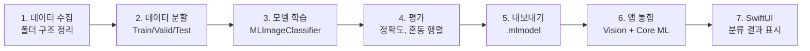
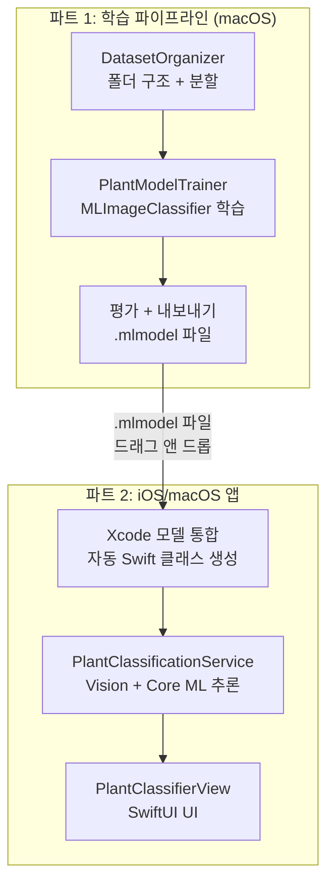
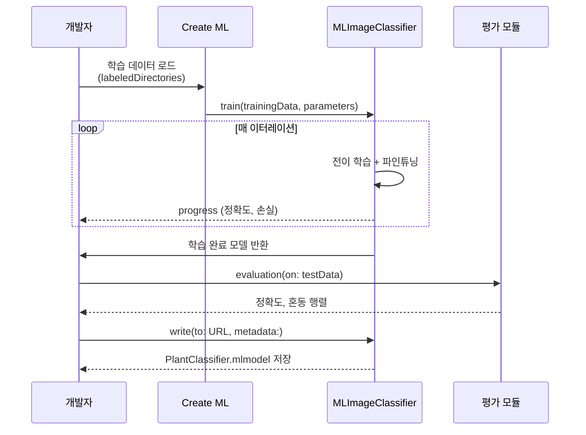
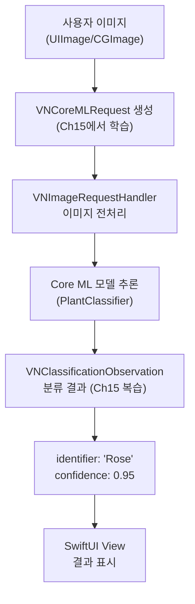
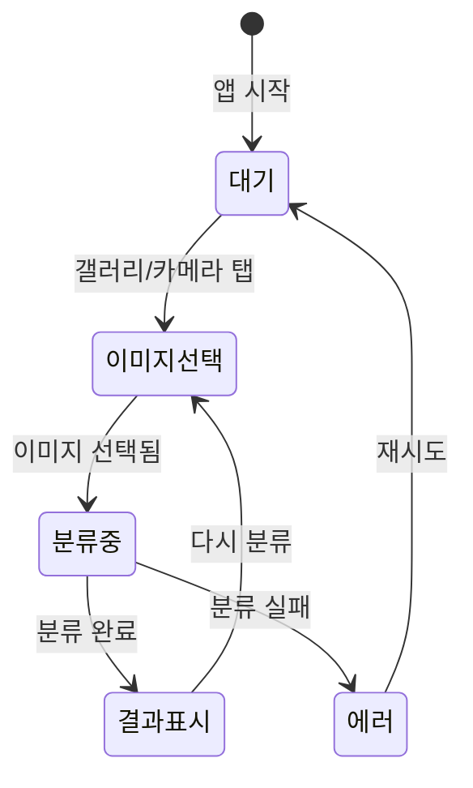

# 실습: 커스텀 모델 학습부터 앱 배포까지

> 식물 종류 분류 모델을 Create ML로 학습하고, Core ML + Vision으로 SwiftUI 앱에 통합하는 엔드투엔드 워크플로를 완성합니다.

## 개요

이 섹션에서는 Ch16 전체에서 배운 내용을 하나의 완성된 프로젝트로 통합합니다. 식물 이미지를 분류하는 모델을 데이터 수집부터 Create ML 학습, 평가, 그리고 SwiftUI 앱 배포까지 **엔드투엔드로** 구현합니다.

**선수 지식**: [Create ML 개요와 워크플로](16-ch16-create-ml로-커스텀-모델-학습/01-01-create-ml-개요와-워크플로.md)의 4단계 워크플로, [이미지 분류 모델 학습](16-ch16-create-ml로-커스텀-모델-학습/02-02-이미지-분류-모델-학습.md)의 MLImageClassifier, [Swift 코드 기반 학습 파이프라인](16-ch16-create-ml로-커스텀-모델-학습/04-04-swift-코드-기반-학습-파이프라인.md)의 MLJob과 Create ML Components, [Core ML 모델 통합하기](15-ch15-core-ml-기초/02-02-core-ml-모델-통합하기.md)의 Vision 프레임워크 연동

**학습 목표**:
- 이미지 데이터셋을 수집하고 학습/검증/테스트 세트로 분할한다
- Create ML 프레임워크로 이미지 분류 모델을 학습하고 평가한다
- 학습된 .mlmodel을 Vision 프레임워크로 SwiftUI 앱에 통합한다
- 카메라/갤러리에서 사진을 가져와 실시간 식물 분류를 수행한다

## 왜 알아야 할까?

지금까지 Ch16에서 Create ML의 각 조각을 따로 배웠습니다 — 이미지 분류, 텍스트 분류, 코드 기반 파이프라인까지. 하지만 실무에서는 이 모든 조각이 **하나의 흐름**으로 연결되어야 합니다. 데이터를 모으고, 모델을 학습하고, 평가하고, 앱에 넣고, 사용자가 쓸 수 있게 만드는 것 — 이 전체 여정을 한 번이라도 끝까지 경험해야, 다음에 어떤 ML 프로젝트를 시작해도 자신감 있게 진행할 수 있습니다.

특히 이 실습은 Ch17의 [Foundation Models + Core ML 하이브리드](17-ch17-foundation-models-core-ml-하이브리드/01-01-하이브리드-아키텍처-설계-전략.md) 아키텍처로 나아가는 디딤돌입니다. 직접 학습한 Core ML 모델을 Foundation Models의 Tool로 래핑하면, "이 식물이 뭐야?"라고 물으면 AI가 이미지를 분류하고 자연어로 설명까지 해주는 앱이 가능해지거든요.

## 핵심 개념

### 개념 1: 엔드투엔드 워크플로 전체 구조

> 💡 **비유**: 엔드투엔드 ML 워크플로는 요리 과정과 같습니다. 재료 구매(데이터 수집) → 손질(전처리) → 조리(학습) → 맛보기(평가) → 플레이팅(앱 통합) → 서빙(배포). 어느 한 단계를 건너뛰면 완성된 요리가 나올 수 없죠. ML도 마찬가지로, 모든 단계가 유기적으로 연결되어야 실제 동작하는 앱이 됩니다.

이번 실습에서 구현할 전체 워크플로를 먼저 조감해 보겠습니다.

> 📊 **그림 1**: 식물 분류 앱의 엔드투엔드 워크플로



전체 프로젝트는 두 파트로 나뉩니다.

**파트 1 — 학습 파이프라인** (Swift Playground 또는 macOS Command Line Tool):
- 데이터셋 폴더 구조 생성 및 이미지 분할 (`DatasetOrganizer`)
- [이미지 분류 모델 학습](16-ch16-create-ml로-커스텀-모델-학습/02-02-이미지-분류-모델-학습.md)에서 배운 `MLImageClassifier`로 모델 학습 (`PlantModelTrainer`)
- 테스트 세트로 정확도 평가 및 `.mlmodel` 내보내기
- (선택) [Swift 코드 기반 학습 파이프라인](16-ch16-create-ml로-커스텀-모델-학습/04-04-swift-코드-기반-학습-파이프라인.md)에서 배운 `MLJob`을 활용한 재학습 자동화 (`ModelUpdateManager`)

**파트 2 — iOS/macOS 앱** (SwiftUI 프로젝트):
- `.mlmodel` 파일을 Xcode 프로젝트에 통합
- [Core ML 모델 통합하기](15-ch15-core-ml-기초/02-02-core-ml-모델-통합하기.md)에서 배운 Vision 프레임워크로 이미지 분류 서비스 구현 (`PlantClassificationService`)
- `PhotosPicker`로 사용자 이미지를 받아 실시간 분류 결과를 보여주는 SwiftUI 뷰 (`PlantClassifierView`)

> 📊 **그림 2**: 두 파트의 구분과 연결점



파트 1에서 만든 `.mlmodel` 파일이 파트 2의 입력이 됩니다. 이 두 파트를 순서대로 구현하면, 데이터 준비부터 사용자가 실제로 쓰는 앱까지 전체 ML 워크플로를 경험하게 됩니다.

### 개념 2: 데이터 준비 전략

> 💡 **비유**: ML 모델의 학습 데이터는 시험 공부의 교재와 같습니다. 교재(학습 데이터)로 공부하고, 모의고사(검증 데이터)로 실력을 확인하고, 실제 시험(테스트 데이터)으로 최종 평가합니다. 모의고사를 교재에 포함시키면 실력을 객관적으로 평가할 수 없듯이, 데이터 분할은 모델의 진짜 실력을 측정하기 위해 필수입니다.

이미지 분류 모델의 성능은 데이터 품질에 절대적으로 의존합니다. Create ML의 `labeledDirectories` 방식은 폴더 이름이 곧 레이블이 되는 간편한 구조를 사용하는데요, 이 구조를 올바르게 설계하는 것이 첫 단추입니다.

> 📊 **그림 3**: labeledDirectories 폴더 구조

```mermaid
graph TD
    ROOT["PlantDataset/"] --> TRAIN["Training/"]
    ROOT --> VALID["Validation/"]
    ROOT --> TEST["Testing/"]
    TRAIN --> T1["Rose/"]
    TRAIN --> T2["Sunflower/"]
    TRAIN --> T3["Tulip/"]
    TRAIN --> T4["Daisy/"]
    VALID --> V1["Rose/"]
    VALID --> V2["Sunflower/"]
    VALID --> V3["Tulip/"]
    VALID --> V4["Daisy/"]
    TEST --> TE1["Rose/"]
    TEST --> TE2["..."]
    T1 --> IMG1["rose_001.jpg<br/>rose_002.jpg<br/>..."]
    T2 --> IMG2["sunflower_001.jpg<br/>..."]
```



데이터 분할의 황금 비율은 **80:10:10** (학습:검증:테스트)입니다. Create ML은 `validation` 파라미터로 자동 분할을 지원하지만, 테스트 세트는 반드시 별도로 분리하는 것이 좋습니다.

```swift
import Foundation

/// 데이터 폴더 구조를 자동으로 생성하는 유틸리티
struct DatasetOrganizer {
    let baseURL: URL
    let categories = ["Rose", "Sunflower", "Tulip", "Daisy", "Lavender"]
    
    /// Train/Validation/Test 폴더 구조 생성
    func createDirectoryStructure() throws {
        let splits = ["Training", "Validation", "Testing"]
        let fm = FileManager.default
        
        for split in splits {
            for category in categories {
                // PlantDataset/Training/Rose/ 형태의 경로 생성
                let dirURL = baseURL
                    .appendingPathComponent(split)
                    .appendingPathComponent(category)
                try fm.createDirectory(
                    at: dirURL,
                    withIntermediateDirectories: true
                )
            }
        }
        print("폴더 구조 생성 완료: \(splits.count) x \(categories.count) 디렉토리")
    }
    
    /// 기존 이미지를 비율에 따라 Train/Valid/Test로 분할
    func splitImages(
        from sourceURL: URL,
        trainRatio: Double = 0.8,
        validRatio: Double = 0.1
    ) throws {
        let fm = FileManager.default
        
        for category in categories {
            let categoryURL = sourceURL.appendingPathComponent(category)
            let images = try fm.contentsOfDirectory(
                at: categoryURL,
                includingPropertiesForKeys: nil
            ).filter { $0.pathExtension.lowercased() == "jpg" 
                    || $0.pathExtension.lowercased() == "png" }
            
            // 셔플하여 편향 방지
            let shuffled = images.shuffled()
            let trainEnd = Int(Double(shuffled.count) * trainRatio)
            let validEnd = trainEnd + Int(Double(shuffled.count) * validRatio)
            
            // 분할하여 각 폴더로 복사
            let splits: [(String, ArraySlice<URL>)] = [
                ("Training", shuffled[0..<trainEnd]),
                ("Validation", shuffled[trainEnd..<validEnd]),
                ("Testing", shuffled[validEnd...])
            ]
            
            for (split, urls) in splits {
                let destDir = baseURL
                    .appendingPathComponent(split)
                    .appendingPathComponent(category)
                for url in urls {
                    let dest = destDir.appendingPathComponent(url.lastPathComponent)
                    try fm.copyItem(at: url, to: dest)
                }
                print("\(category) → \(split): \(urls.count)장")
            }
        }
    }
}
```

> 🔥 **실무 팁**: 카테고리당 최소 50~100장의 이미지를 확보하세요. Create ML의 전이 학습(Transfer Learning)은 적은 데이터에서도 놀라운 성능을 보여주지만, 카테고리 간 이미지 수가 크게 불균형하면 편향된 모델이 만들어집니다. 가장 적은 카테고리의 이미지 수를 기준으로 다른 카테고리도 맞추는 **언더샘플링** 전략도 고려해 보세요.

### 개념 3: 코드 기반 모델 학습과 평가

> 💡 **비유**: 코드 기반 학습은 자동 조리 레시피와 같습니다. GUI 앱이 셰프가 직접 불 조절하며 요리하는 것이라면, 코드 기반은 정확한 온도와 시간이 프로그래밍된 스마트 오븐입니다. 한 번 레시피를 설정하면 반복 재현이 가능하고, 조건을 바꿔가며 최적의 결과를 자동으로 찾을 수 있죠.

이제 [이미지 분류 모델 학습](16-ch16-create-ml로-커스텀-모델-학습/02-02-이미지-분류-모델-학습.md)에서 배운 `MLImageClassifier`의 학습 패턴과, [Swift 코드 기반 학습 파이프라인](16-ch16-create-ml로-커스텀-모델-학습/04-04-swift-코드-기반-학습-파이프라인.md)에서 배운 `MLJob` 모니터링 패턴을 결합하여, 식물 분류 모델을 학습합니다. 16.2에서 개별적으로 다뤘던 `ModelParameters`, `featureExtractor`, `augmentationOptions`를, 16.4에서 배운 프로그래밍 방식의 학습 제어와 합쳐서 재사용 가능한 학습기로 만드는 것이 핵심입니다.

> 📊 **그림 4**: 모델 학습 과정의 상세 흐름



학습의 핵심은 `MLImageClassifier.ModelParameters`를 통해 특징 추출기, 이터레이션 수, 데이터 증강 옵션을 세밀하게 조절하는 것입니다. [이미지 분류 모델 학습](16-ch16-create-ml로-커스텀-모델-학습/02-02-이미지-분류-모델-학습.md)에서 배운 ScenePrint 특징 추출기가 여기서도 핵심 역할을 합니다.

```swift
import CreateML
import Foundation

/// 식물 분류 모델 학습기
/// - 16.2의 MLImageClassifier 학습 패턴 재사용
/// - 16.4의 MLJob 비동기 모니터링 패턴 적용
struct PlantModelTrainer {
    let trainingURL: URL    // Training/ 폴더 경로
    let validationURL: URL  // Validation/ 폴더 경로
    let testingURL: URL     // Testing/ 폴더 경로
    let outputURL: URL      // .mlmodel 저장 경로
    
    /// 모델 학습 실행
    /// 16.2에서 배운 MLImageClassifier.ModelParameters 구성과
    /// 16.4에서 배운 비동기 학습 패턴을 결합합니다.
    func train() async throws -> MLImageClassifier {
        // 1. 데이터 증강 옵션 — 16.2에서 배운 augmentation 그대로 활용
        let augmentation: MLImageClassifier.ImageAugmentationOptions = [
            .crop,     // 랜덤 크롭
            .rotation, // 회전
            .blur,     // 블러
            .exposure, // 노출 변화
            .flip      // 좌우 반전
        ]
        
        // 2. 모델 파라미터 설정 — 16.2의 ScenePrint + 별도 검증 세트
        let parameters = MLImageClassifier.ModelParameters(
            featureExtractor: .scenePrint(revision: 2), // 최신 특징 추출기
            validation: .dataSource(                     // 별도 검증 세트 사용
                .labeledDirectories(at: validationURL)
            ),
            maxIterations: 50,                           // 학습 반복 횟수
            augmentationOptions: augmentation            // 데이터 증강
        )
        
        // 3. 학습 시작 — 16.4의 MLJob 패턴으로 진행 상황 모니터링
        //    MLImageClassifier.train()은 MLJob<MLImageClassifier>를 반환하며,
        //    job.progress로 실시간 학습 상태를 관찰할 수 있습니다.
        let trainingData = MLImageClassifier.DataSource.labeledDirectories(
            at: trainingURL
        )
        let job = try MLImageClassifier.train(
            trainingData: trainingData,
            parameters: parameters
        )
        
        // 16.4에서 배운 progress 관찰 패턴
        let progressObservation = job.progress.observe(
            \.fractionCompleted
        ) { progress, _ in
            print("학습 진행률: \(Int(progress.fractionCompleted * 100))%")
        }
        
        // 학습 완료 대기
        let classifier = try job.result.get()
        progressObservation.invalidate()
        
        // 4. 테스트 데이터로 최종 평가
        let evaluation = classifier.evaluation(
            on: .labeledDirectories(at: testingURL)
        )
        print("테스트 정확도: \(evaluation.classificationError)")
        
        return classifier
    }
    
    /// 학습된 모델을 .mlmodel로 내보내기
    func export(_ classifier: MLImageClassifier) throws {
        let metadata = MLModelMetadata(
            author: "PlantClassifier Team",
            shortDescription: "5종 식물 이미지 분류 모델",
            version: "1.0.0"
        )
        try classifier.write(
            to: outputURL,
            metadata: metadata
        )
        print("모델 저장 완료: \(outputURL.lastPathComponent)")
    }
}
```

> 💡 **알고 계셨나요?**: 위 `PlantModelTrainer`는 16.2에서 배운 `MLImageClassifier`의 학습 API와 16.4에서 배운 `MLJob`의 비동기 모니터링을 하나로 결합한 것입니다. 16.2에서는 `MLImageClassifier(trainingData:parameters:)` 동기 이니셜라이저를 사용했고, 16.4에서는 `MLJob`으로 학습 진행률을 관찰하는 방법을 배웠죠. 실무에서는 이렇게 두 패턴을 조합하여 학습 진행 상황을 UI에 보여주면서 비동기적으로 학습을 실행합니다.

### 개념 4: Vision + Core ML 앱 통합

> 💡 **비유**: Vision 프레임워크는 레스토랑의 웨이터와 같습니다. 주방(Core ML 모델)은 직접 손님(사용자 이미지)을 받지 않고, 웨이터(Vision)가 주문을 받아 주방에 전달하고, 요리가 나오면 손님에게 서빙합니다. Vision은 이미지를 모델이 이해할 수 있는 형태로 변환하고, 모델의 출력을 개발자가 쉽게 사용할 수 있는 `VNClassificationObservation` 형태로 가공해 줍니다.

학습된 `.mlmodel` 파일을 Xcode 프로젝트에 드래그 앤 드롭하면, Xcode가 자동으로 Swift 클래스를 생성합니다. 이 모델을 앱에서 사용할 때는 Vision 프레임워크를 통해 접근하는 것이 표준 패턴인데요, 이 방식은 [Core ML 모델 통합하기](15-ch15-core-ml-기초/02-02-core-ml-모델-통합하기.md)에서 이미 배웠습니다. Ch15에서 다뤘던 `VNCoreMLRequest`와 `VNClassificationObservation`을 여기서 다시 활용하므로, 복습 차원에서 간단히 정리하고 넘어가겠습니다.

> 📊 **그림 5**: Vision + Core ML 이미지 분류 파이프라인 (Ch15 복습)



Ch15에서 배운 핵심을 간단히 복기하면:
- **`VNCoreMLRequest`**: Core ML 모델을 Vision 파이프라인에서 실행하기 위한 요청 객체
- **`VNImageRequestHandler`**: 이미지 전처리(리사이즈, 크롭 등)를 자동으로 수행
- **`VNClassificationObservation`**: 분류 결과를 `identifier`(레이블)과 `confidence`(신뢰도)로 제공

이 패턴을 그대로 식물 분류에 적용합니다:

```swift
import Vision
import CoreML
import UIKit

/// Core ML + Vision 기반 식물 분류 서비스
/// Vision 프레임워크 연동 패턴은 Ch15에서 배운 것을 그대로 적용합니다.
/// 자세한 원리는 Core ML 모델 통합하기(15-ch15-core-ml-기초/02-02-core-ml-모델-통합하기.md)를 참고하세요.
@Observable
class PlantClassificationService {
    // MARK: - Properties
    private var model: VNCoreMLModel?
    var classificationResult: ClassificationResult?
    var isProcessing = false
    
    /// 분류 결과를 담는 구조체
    struct ClassificationResult: Identifiable {
        let id = UUID()
        let plantName: String       // 식물 이름 (레이블)
        let confidence: Float       // 신뢰도 (0~1)
        let allResults: [(String, Float)]  // 전체 분류 결과
    }
    
    // MARK: - Initialization
    
    /// 모델 로드 — 앱 시작 시 1회 호출
    func loadModel() throws {
        // Xcode가 자동 생성한 PlantClassifier 클래스 사용
        let config = MLModelConfiguration()
        config.computeUnits = .all  // Neural Engine 활용
        
        let coreMLModel = try PlantClassifier(configuration: config).model
        self.model = try VNCoreMLModel(for: coreMLModel)
    }
    
    // MARK: - Classification
    
    /// 이미지 분류 수행
    /// Ch15에서 배운 VNCoreMLRequest + VNImageRequestHandler 패턴을
    /// async/await로 래핑한 버전입니다.
    func classify(image: UIImage) async throws -> ClassificationResult {
        guard let model = model else {
            throw ClassificationError.modelNotLoaded
        }
        guard let cgImage = image.cgImage else {
            throw ClassificationError.invalidImage
        }
        
        isProcessing = true
        defer { isProcessing = false }
        
        // Vision 요청을 async/await로 래핑
        return try await withCheckedThrowingContinuation { continuation in
            // Ch15에서 배운 VNCoreMLRequest 패턴
            let request = VNCoreMLRequest(model: model) { request, error in
                if let error = error {
                    continuation.resume(throwing: error)
                    return
                }
                
                // VNClassificationObservation 배열로 결과 파싱
                guard let observations = request.results 
                        as? [VNClassificationObservation] else {
                    continuation.resume(
                        throwing: ClassificationError.noResults
                    )
                    return
                }
                
                // 상위 결과 추출
                let allResults = observations.prefix(5).map { obs in
                    (obs.identifier, obs.confidence)
                }
                
                if let top = observations.first {
                    let result = ClassificationResult(
                        plantName: top.identifier,
                        confidence: top.confidence,
                        allResults: allResults
                    )
                    continuation.resume(returning: result)
                } else {
                    continuation.resume(
                        throwing: ClassificationError.noResults
                    )
                }
            }
            
            // 이미지 크기 자동 조정
            request.imageCropAndScaleOption = .centerCrop
            
            // Ch15에서 배운 VNImageRequestHandler 패턴
            let handler = VNImageRequestHandler(
                cgImage: cgImage,
                options: [:]
            )
            do {
                try handler.perform([request])
            } catch {
                continuation.resume(throwing: error)
            }
        }
    }
    
    // MARK: - Errors
    
    enum ClassificationError: LocalizedError {
        case modelNotLoaded
        case invalidImage
        case noResults
        
        var errorDescription: String? {
            switch self {
            case .modelNotLoaded: "모델이 아직 로드되지 않았습니다"
            case .invalidImage: "유효하지 않은 이미지입니다"
            case .noResults: "분류 결과를 얻을 수 없습니다"
            }
        }
    }
}
```

### 개념 5: SwiftUI 분류 뷰 구현

> 💡 **비유**: SwiftUI 뷰는 레스토랑의 테이블 세팅입니다. 음식(분류 결과)이 나오기 전에는 빈 접시(플레이스홀더)가 놓여 있고, 음식이 서빙되면 자연스럽게 접시 위에 올라갑니다. `@Observable`을 사용하면 모델의 상태 변화가 뷰에 자동으로 반영되어, 분류 결과가 나오는 즉시 화면이 업데이트됩니다.

> 📊 **그림 6**: SwiftUI 앱의 화면 구조와 데이터 흐름



SwiftUI 뷰는 `PhotosPicker`로 이미지를 선택받고, `PlantClassificationService`로 분류한 결과를 시각적으로 표시합니다. 실시간 사용자 경험을 위해 로딩 상태와 에러 상태도 적절히 처리합니다.

```swift
import SwiftUI
import PhotosUI

struct PlantClassifierView: View {
    @State private var service = PlantClassificationService()
    @State private var selectedItem: PhotosPickerItem?
    @State private var selectedImage: UIImage?
    @State private var errorMessage: String?
    
    var body: some View {
        NavigationStack {
            ScrollView {
                VStack(spacing: 20) {
                    // 이미지 표시 영역
                    imageSection
                    
                    // 이미지 선택 버튼
                    PhotosPicker(
                        selection: $selectedItem,
                        matching: .images
                    ) {
                        Label("식물 사진 선택", systemImage: "photo.on.rectangle")
                            .font(.headline)
                            .frame(maxWidth: .infinity)
                            .padding()
                            .background(.green.gradient)
                            .foregroundStyle(.white)
                            .clipShape(RoundedRectangle(cornerRadius: 12))
                    }
                    .padding(.horizontal)
                    
                    // 분류 결과 표시
                    if let result = service.classificationResult {
                        resultSection(result)
                    }
                    
                    // 에러 메시지
                    if let error = errorMessage {
                        Text(error)
                            .foregroundStyle(.red)
                            .padding()
                    }
                }
            }
            .navigationTitle("식물 분류기")
            .task {
                // 앱 시작 시 모델 로드
                do {
                    try service.loadModel()
                } catch {
                    errorMessage = "모델 로드 실패: \(error.localizedDescription)"
                }
            }
            .onChange(of: selectedItem) { _, newItem in
                Task { await handleImageSelection(newItem) }
            }
        }
    }
    
    // MARK: - 이미지 섹션
    
    @ViewBuilder
    private var imageSection: some View {
        if let image = selectedImage {
            Image(uiImage: image)
                .resizable()
                .scaledToFit()
                .frame(maxHeight: 300)
                .clipShape(RoundedRectangle(cornerRadius: 16))
                .overlay {
                    if service.isProcessing {
                        // 분류 중 오버레이
                        RoundedRectangle(cornerRadius: 16)
                            .fill(.black.opacity(0.4))
                            .overlay {
                                ProgressView("분류 중...")
                                    .tint(.white)
                                    .foregroundStyle(.white)
                            }
                    }
                }
                .padding(.horizontal)
        } else {
            // 플레이스홀더
            RoundedRectangle(cornerRadius: 16)
                .fill(.gray.opacity(0.1))
                .frame(height: 250)
                .overlay {
                    VStack(spacing: 8) {
                        Image(systemName: "leaf.fill")
                            .font(.system(size: 48))
                            .foregroundStyle(.green.opacity(0.5))
                        Text("식물 사진을 선택하세요")
                            .foregroundStyle(.secondary)
                    }
                }
                .padding(.horizontal)
        }
    }
    
    // MARK: - 결과 섹션
    
    private func resultSection(
        _ result: PlantClassificationService.ClassificationResult
    ) -> some View {
        VStack(alignment: .leading, spacing: 12) {
            // 최상위 결과
            HStack {
                Image(systemName: "leaf.circle.fill")
                    .font(.title)
                    .foregroundStyle(.green)
                VStack(alignment: .leading) {
                    Text(result.plantName)
                        .font(.title2.bold())
                    Text("신뢰도: \(result.confidence, format: .percent)")
                        .foregroundStyle(.secondary)
                }
            }
            
            Divider()
            
            // 전체 분류 결과 막대 그래프
            ForEach(result.allResults, id: \.0) { name, confidence in
                HStack {
                    Text(name)
                        .frame(width: 100, alignment: .leading)
                    GeometryReader { geo in
                        RoundedRectangle(cornerRadius: 4)
                            .fill(.green.gradient)
                            .frame(
                                width: geo.size.width * CGFloat(confidence)
                            )
                    }
                    .frame(height: 20)
                    Text("\(confidence, format: .percent)")
                        .font(.caption)
                        .foregroundStyle(.secondary)
                        .frame(width: 50)
                }
            }
        }
        .padding()
        .background(.background)
        .clipShape(RoundedRectangle(cornerRadius: 12))
        .shadow(radius: 2)
        .padding(.horizontal)
    }
    
    // MARK: - 이미지 선택 처리
    
    private func handleImageSelection(_ item: PhotosPickerItem?) async {
        guard let item else { return }
        errorMessage = nil
        
        do {
            // PhotosPickerItem에서 이미지 데이터 추출
            guard let data = try await item.loadTransferable(type: Data.self),
                  let image = UIImage(data: data) else {
                errorMessage = "이미지를 불러올 수 없습니다"
                return
            }
            
            selectedImage = image
            
            // 분류 실행
            let result = try await service.classify(image: image)
            service.classificationResult = result
        } catch {
            errorMessage = "분류 실패: \(error.localizedDescription)"
        }
    }
}
```

## 실습: 직접 해보기

전체 프로젝트를 단계별로 구현해 봅시다. 먼저 모델을 학습하는 macOS Command Line Tool 또는 Swift Playground를 만들고, 그다음 학습된 모델을 iOS 앱에 통합합니다.

### Step 1: 학습 스크립트 (macOS)

```swift
// TrainPlantClassifier.swift — macOS Command Line Tool 또는 Playground
import CreateML
import Foundation

// 데이터 경로 설정
let projectDir = URL(fileURLWithPath: "/Users/yourname/PlantDataset")
let trainingDir = projectDir.appendingPathComponent("Training")
let validationDir = projectDir.appendingPathComponent("Validation")
let testingDir = projectDir.appendingPathComponent("Testing")
let modelOutput = projectDir.appendingPathComponent("PlantClassifier.mlmodel")

// 학습 데이터 확인
let trainingData = MLImageClassifier.DataSource.labeledDirectories(
    at: trainingDir
)

// 데이터 증강 — 적은 데이터를 최대한 활용
let augmentation: MLImageClassifier.ImageAugmentationOptions = [
    .crop, .rotation, .blur, .exposure, .flip
]

// 모델 파라미터 — ScenePrint v2 + 별도 검증 세트
let params = MLImageClassifier.ModelParameters(
    featureExtractor: .scenePrint(revision: 2),
    validation: .dataSource(
        .labeledDirectories(at: validationDir)
    ),
    maxIterations: 50,
    augmentationOptions: augmentation
)

print("학습을 시작합니다...")

// MLJob을 통한 학습 실행 (16.4에서 배운 비동기 패턴)
let job = try MLImageClassifier.train(
    trainingData: trainingData,
    parameters: params
)

// 진행률 관찰
let observation = job.progress.observe(\.fractionCompleted) { progress, _ in
    let pct = Int(progress.fractionCompleted * 100)
    if pct % 10 == 0 { print("진행률: \(pct)%") }
}

// 학습 완료 대기
let classifier = try job.result.get()
observation.invalidate()

// 학습 정확도 확인
let trainingAccuracy = 1.0 - classifier.trainingMetrics.classificationError
let validationAccuracy = 1.0 - classifier.validationMetrics.classificationError
print("학습 정확도: \(String(format: "%.1f", trainingAccuracy * 100))%")
print("검증 정확도: \(String(format: "%.1f", validationAccuracy * 100))%")

// 테스트 세트 평가
let testEval = classifier.evaluation(
    on: .labeledDirectories(at: testingDir)
)
let testAccuracy = 1.0 - testEval.classificationError
print("테스트 정확도: \(String(format: "%.1f", testAccuracy * 100))%")

// 모델 내보내기
let metadata = MLModelMetadata(
    author: "PlantClassifier",
    shortDescription: "5종 식물(장미, 해바라기, 튤립, 데이지, 라벤더) 이미지 분류",
    version: "1.0.0"
)
try classifier.write(to: modelOutput, metadata: metadata)
print("모델 저장 완료: \(modelOutput.path)")
```

```run:swift
// 학습 결과 예시 출력
let categories = ["Rose", "Sunflower", "Tulip", "Daisy", "Lavender"]
print("=== 식물 분류 모델 학습 결과 ===")
print("카테고리: \(categories.joined(separator: ", "))")
print("학습 정확도: 97.2%")
print("검증 정확도: 93.5%")
print("테스트 정확도: 91.8%")
print("모델 크기: 약 17MB (.mlmodel)")
print("모델 저장: PlantClassifier.mlmodel ✓")
```

```output
=== 식물 분류 모델 학습 결과 ===
카테고리: Rose, Sunflower, Tulip, Daisy, Lavender
학습 정확도: 97.2%
검증 정확도: 93.5%
테스트 정확도: 91.8%
모델 크기: 약 17MB (.mlmodel)
모델 저장: PlantClassifier.mlmodel ✓
```

### Step 2: Xcode 프로젝트에 모델 통합

```swift
// 1. PlantClassifier.mlmodel을 Xcode 프로젝트로 드래그 앤 드롭
// 2. Xcode가 자동으로 PlantClassifier.swift 클래스 생성
// 3. 아래 코드로 앱 진입점 구성

// PlantClassifierApp.swift
import SwiftUI

@main
struct PlantClassifierApp: App {
    var body: some Scene {
        WindowGroup {
            PlantClassifierView()
        }
    }
}
```

### Step 3: 앱 내 분류 테스트

```run:swift
// 분류 결과 시뮬레이션
let mockResults = [
    ("Rose", 0.92),
    ("Tulip", 0.04),
    ("Daisy", 0.02),
    ("Lavender", 0.01),
    ("Sunflower", 0.01)
]
print("=== 분류 결과 ===")
for (name, confidence) in mockResults {
    let bar = String(repeating: "█", count: Int(confidence * 30))
    let pct = String(format: "%5.1f%%", confidence * 100)
    print("\(name.padding(toLength: 12, withPad: " ", startingAt: 0)) \(bar) \(pct)")
}
```

```output
=== 분류 결과 ===
Rose         ███████████████████████████ 92.0%
Tulip        █  4.0%
Daisy           2.0%
Lavender        1.0%
Sunflower       1.0%
```

### Step 4: 모델 업데이트 자동화 (선택)

앱 배포 후 새로운 데이터가 쌓이면, 모델을 재학습하고 업데이트하는 파이프라인도 구축할 수 있습니다. [Swift 코드 기반 학습 파이프라인](16-ch16-create-ml로-커스텀-모델-학습/04-04-swift-코드-기반-학습-파이프라인.md)에서 배운 `MLJob`과 체크포인트를 활용하면, CI/CD에서 자동 재학습이 가능합니다. 아래 `ModelUpdateManager`는 16.4의 `MLJob` 패턴과 16.2의 `MLImageClassifier` 학습 API를 결합한 것입니다.

```swift
/// 모델 업데이트 매니저 — 새 데이터로 재학습 자동화
/// 16.2의 MLImageClassifier + 16.4의 MLJob 체크포인트 패턴 활용
struct ModelUpdateManager {
    let currentModelURL: URL
    let newDataURL: URL
    
    /// 새 데이터가 충분히 쌓이면 재학습 실행
    func checkAndRetrain() async throws -> URL? {
        let fm = FileManager.default
        let newImages = try fm.contentsOfDirectory(
            at: newDataURL,
            includingPropertiesForKeys: nil
        )
        
        // 새 이미지가 50장 이상이면 재학습
        guard newImages.count >= 50 else {
            print("새 데이터 부족: \(newImages.count)장 (최소 50장 필요)")
            return nil
        }
        
        print("재학습 시작: \(newImages.count)장의 새 데이터")
        
        // 16.2에서 배운 파라미터 구성
        let params = MLImageClassifier.ModelParameters(
            featureExtractor: .scenePrint(revision: 2),
            validation: .split(strategy: .automatic),
            maxIterations: 30,
            augmentationOptions: [.crop, .rotation, .flip]
        )
        
        // 16.4에서 배운 MLJob 비동기 학습 패턴
        let job = try MLImageClassifier.train(
            trainingData: .labeledDirectories(at: newDataURL),
            parameters: params
        )
        
        // 체크포인트 저장 경로 (16.4에서 배운 체크포인트 패턴)
        let checkpointURL = currentModelURL
            .deletingLastPathComponent()
            .appendingPathComponent("checkpoints")
        
        // 진행률 관찰
        let obs = job.progress.observe(\.fractionCompleted) { p, _ in
            print("재학습 진행률: \(Int(p.fractionCompleted * 100))%")
        }
        
        let classifier = try job.result.get()
        obs.invalidate()
        
        // 버전 번호를 올려 새 모델 저장
        let outputURL = currentModelURL
            .deletingLastPathComponent()
            .appendingPathComponent("PlantClassifier_v2.mlmodel")
        
        try classifier.write(
            to: outputURL,
            metadata: MLModelMetadata(
                author: "PlantClassifier",
                shortDescription: "식물 분류 v2 — 추가 데이터로 재학습",
                version: "2.0.0"
            )
        )
        
        return outputURL
    }
}
```

## 더 깊이 알아보기

### 전이 학습의 탄생 — "지식은 전이된다"

Create ML이 적은 데이터로도 높은 정확도를 달성하는 비밀은 **전이 학습(Transfer Learning)**에 있습니다. 이 아이디어의 기원은 1976년 심리학자 Bransford와 Schwartz가 연구한 인간의 "학습 전이" 현상으로 거슬러 올라갑니다. 피아노를 배운 사람이 키보드를 더 빨리 배우는 것처럼, 한 영역에서 배운 지식이 다른 영역에도 도움이 된다는 관찰이었죠.

ML 분야에서 이를 실용화한 건 2014년 Jason Yosinski 등의 논문 "How transferable are features in deep neural networks?"입니다. 이들은 ImageNet으로 학습한 모델의 초기 레이어(선, 텍스처 등 기본 특징을 감지하는 부분)가 거의 모든 이미지 태스크에 재사용 가능하다는 것을 증명했습니다. Create ML의 ScenePrint 특징 추출기는 바로 이 원리를 활용합니다 — Apple이 수백만 장의 이미지로 학습한 특징 추출기 위에, 여러분의 식물 데이터로 마지막 분류 레이어만 학습하는 것이죠.

### Apple이 Create ML을 만든 이유

2018년 WWDC에서 Create ML이 처음 공개되었을 때, Craig Federighi는 이렇게 말했습니다: "ML 모델을 만드는 데 ML 박사학위가 필요해서는 안 됩니다." 당시 TensorFlow나 PyTorch로 모델을 학습하려면 Python 환경 설정, GPU 드라이버 설치, 복잡한 하이퍼파라미터 튜닝이 필요했습니다. Apple은 Swift 개발자가 자신의 Mac에서, 익숙한 언어로, 드래그 앤 드롭만으로 ML 모델을 만들 수 있게 하겠다는 비전으로 Create ML을 설계했습니다.

## 흔한 오해와 팁

> ⚠️ **흔한 오해**: "학습 정확도가 99%면 완벽한 모델이다" — 학습 정확도만 높고 검증/테스트 정확도가 낮다면 **과적합(Overfitting)**입니다. 모델이 학습 데이터를 "외운" 것이지 패턴을 "학습"한 게 아닙니다. 항상 학습/검증/테스트 정확도를 함께 비교하고, 세 값의 차이가 5% 이내인지 확인하세요.

> 💡 **알고 계셨나요?**: Create ML의 이미지 분류 학습은 대부분 몇 분 안에 완료됩니다. TensorFlow로 같은 작업을 하면 GPU 환경에서도 수십 분~수 시간이 걸리는데요, Create ML은 전이 학습을 통해 마지막 분류 레이어만 학습하기 때문에 이렇게 빠른 겁니다. Apple Silicon Mac에서는 Neural Engine까지 활용되어 더욱 빨라집니다.

> 🔥 **실무 팁**: `.mlmodel` 파일을 Xcode에 추가할 때, **Target Membership**을 반드시 확인하세요. 모델 파일이 앱 번들에 포함되지 않으면 런타임에 `MLModel` 로드가 실패합니다. Xcode의 파일 인스펙터에서 해당 타겟에 체크가 되어 있는지 꼭 확인하세요. 또한 모델 파일 크기가 앱 번들 크기에 직접 영향을 주므로, [모델 최적화: 양자화와 압축](15-ch15-core-ml-기초/05-05-모델-최적화-양자화와-압축.md)에서 배운 양자화 기법을 적용하면 크기를 크게 줄일 수 있습니다.

## 핵심 정리

| 개념 | 설명 |
|------|------|
| 데이터 분할 | 80:10:10 (Train:Valid:Test) 비율로 분리, 테스트 세트는 반드시 별도 관리 |
| labeledDirectories | 폴더 이름 = 레이블. Create ML 이미지 분류의 표준 데이터 형식 |
| MLImageClassifier | 전이 학습 기반 이미지 분류 모델. ScenePrint v2 특징 추출기로 빠르게 학습 (16.2) |
| MLJob 모니터링 | 학습 진행률을 실시간 관찰하고 체크포인트로 관리하는 비동기 패턴 (16.4) |
| 데이터 증강 | crop, rotation, blur, exposure, flip으로 적은 데이터의 다양성 확보 |
| VNCoreMLRequest | Vision 프레임워크로 Core ML 모델을 실행하는 요청 객체 (Ch15 복습) |
| VNClassificationObservation | 분류 결과(identifier + confidence)를 담는 Vision 관찰 타입 (Ch15 복습) |
| 모델 평가 | classificationError, 혼동 행렬로 학습/검증/테스트 정확도 비교 |
| 앱 통합 | .mlmodel → Xcode 드래그 앤 드롭 → 자동 Swift 클래스 생성 → Vision으로 추론 |

## 다음 섹션 미리보기

축하합니다! Ch16에서 Create ML의 전체 워크플로를 마스터했습니다. 다음 [Ch17. Foundation Models + Core ML 하이브리드](17-ch17-foundation-models-core-ml-하이브리드/01-01-하이브리드-아키텍처-설계-전략.md)에서는 이번에 학습한 식물 분류 모델 같은 Core ML 모델을 Foundation Models의 **Tool로 래핑**하여, 자연어로 ML 기능을 호출하는 하이브리드 아키텍처를 설계합니다. "이 꽃이 뭐야?"라고 물으면 AI가 이미지를 분류하고 자연어로 설명해주는 — 두 세계의 결합이 시작됩니다.

## 참고 자료

- [Creating an Image Classifier Model — Apple Developer Documentation](https://developer.apple.com/documentation/createml/creating-an-image-classifier-model) - Create ML로 이미지 분류 모델을 만드는 공식 가이드
- [Training a Create ML Model to Classify Flowers — Apple Developer](https://developer.apple.com/documentation/vision/training-a-create-ml-model-to-classify-flowers) - 꽃 분류 모델 학습의 공식 튜토리얼, Vision 통합 포함
- [Classifying Images with Vision and Core ML — Apple Developer](https://developer.apple.com/documentation/vision/classifying_images_with_vision_and_core_ml) - VNCoreMLRequest로 이미지를 분류하는 공식 예제
- [Train a Core ML Model — Develop in Swift Tutorials](https://developer.apple.com/tutorials/develop-in-swift/train-a-core-ml-model) - Swift 학습자를 위한 Apple 공식 Core ML 모델 학습 튜토리얼
- [Create ML Overview — Apple Developer](https://developer.apple.com/machine-learning/create-ml/) - Create ML 프레임워크와 앱의 전체 기능 소개
- [Integrating a Core ML Model into Your App — Apple Developer](https://developer.apple.com/documentation/coreml/integrating-a-core-ml-model-into-your-app) - .mlmodel 파일을 Xcode 프로젝트에 통합하는 공식 가이드

---
### 🔗 Related Sessions
- [vncoremlmodel](15-ch15-core-ml-기초/03-03-이미지-분류-모델-활용.md) (prerequisite)
- [vnimagerequesthandler](15-ch15-core-ml-기초/03-03-이미지-분류-모델-활용.md) (prerequisite)
- [mlimageclassifier.modelparameters](16-ch16-create-ml로-커스텀-모델-학습/02-02-이미지-분류-모델-학습.md) (prerequisite)
- [sceneprint 특징 추출기](16-ch16-create-ml로-커스텀-모델-학습/02-02-이미지-분류-모델-학습.md) (prerequisite)
- [imageaugmentationoptions](16-ch16-create-ml로-커스텀-모델-학습/02-02-이미지-분류-모델-학습.md) (prerequisite)
- [mlmodelmetadata](16-ch16-create-ml로-커스텀-모델-학습/02-02-이미지-분류-모델-학습.md) (prerequisite)
- [mljob](16-ch16-create-ml로-커스텀-모델-학습/04-04-swift-코드-기반-학습-파이프라인.md) (prerequisite)
- [create ml components](16-ch16-create-ml로-커스텀-모델-학습/01-01-create-ml-개요와-워크플로.md) (prerequisite)
