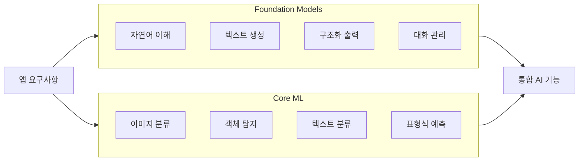
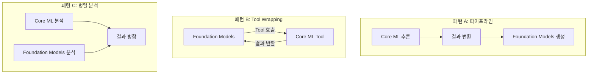
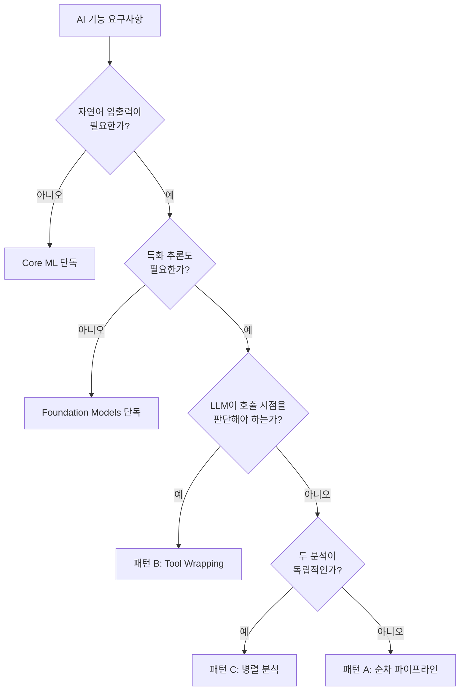
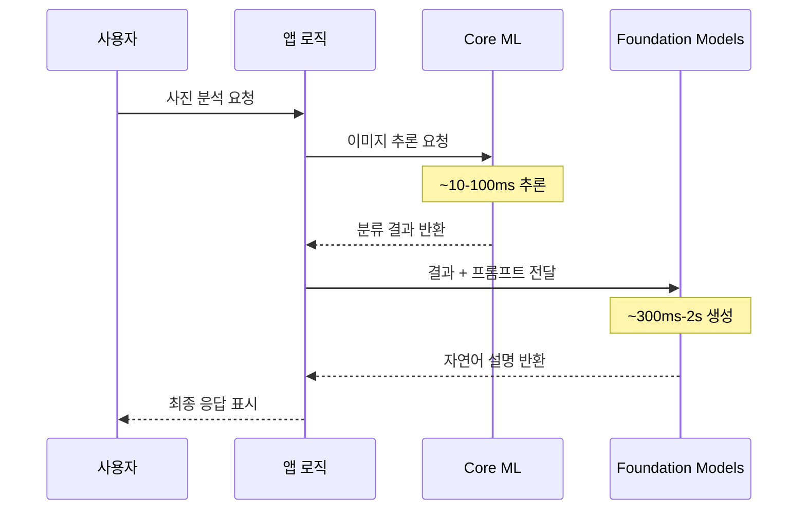

# 하이브리드 아키텍처 설계 전략

> Foundation Models의 범용 언어 이해력과 Core ML의 특화 추론을 결합하는 하이브리드 AI 아키텍처를 설계한다

## 개요

이 섹션에서는 Apple 플랫폼에서 Foundation Models 프레임워크와 Core ML을 **하나의 파이프라인으로 결합**하는 하이브리드 아키텍처의 **설계 개념과 패턴**을 배웁니다. 아직 복잡한 구현에 들어가기 전, "왜 두 프레임워크를 결합하는가"와 "어떤 패턴이 있는가"를 개념 중심으로 이해하는 데 집중합니다.

Ch16에서 Core ML의 기초를 익혔다면, 이번 섹션은 **Core ML과 Foundation Models를 연결하는 다리** 역할을 합니다. 복잡한 구현은 이후 섹션에서 단계별로 진행하니, 여기서는 큰 그림을 잡는 데 집중하세요.

**선수 지식**:
- [Foundation Models 프레임워크의 기본 사용법](03-ch3-foundation-models-프레임워크-시작하기/01-01-systemlanguagemodel-이해하기.md) — LanguageModelSession, 텍스트 생성
- [Tool Calling 아키텍처](07-ch7-tool-calling-기초/01-01-tool-calling-개념과-아키텍처.md) — Tool 프로토콜, 호출 흐름
- [Core ML 모델 통합](15-ch15-core-ml-기초/02-02-core-ml-모델-통합하기.md) — 모델 로딩, 추론 실행

**학습 목표**:
- Foundation Models와 Core ML의 역할 차이를 명확히 구분한다
- 하이브리드 아키텍처의 3가지 설계 패턴을 개념적으로 이해한다
- 사용 시나리오별 최적의 프레임워크 조합 전략을 수립한다
- 파이프라인 설계 시 고려해야 할 성능·프라이버시 트레이드오프를 파악한다

## 왜 알아야 할까?

실제 앱에서 AI 기능을 구현하다 보면, 하나의 프레임워크만으로는 부족한 순간을 자주 만나게 됩니다. Ch16에서 Core ML로 이미지를 분류하고, 수치 예측을 해봤죠? 그런데 여기서 한 발 더 나아가 볼까요?

사진 앱에서 "이 사진에 뭐가 있는지 설명해줘"라는 기능을 만든다고 합시다. Foundation Models는 자연어를 잘 이해하고 생성하지만, 사진 속 객체를 인식하는 건 Core ML의 Vision 모델이 훨씬 정확합니다. 반대로 Core ML은 "고양이 85%, 소파 92%"라는 숫자만 뱉을 뿐, "소파 위에서 낮잠 자는 귀여운 고양이네요!"라는 자연스러운 문장은 만들지 못하죠.

Apple이 실제로 이 접근법을 밀고 있다는 증거도 있습니다. WWDC25에서 소개된 **SwingVision** 앱은 Core ML로 테니스 경기 영상을 분석한 뒤, 그 결과를 Foundation Models에 넘겨 자연어로 코칭 피드백을 생성합니다. 또 **VLLO**는 Vision 프레임워크로 영상을 분석하고, Foundation Models로 배경 음악과 스티커를 추천하죠.

이처럼 **"분석은 특화 모델, 설명은 언어 모델"**이라는 분업 구조가 현대 온디바이스 AI 앱의 핵심 패턴입니다. 이번 섹션에서는 이 분업의 **설계 원칙**을 먼저 잡고, 다음 섹션부터 본격 구현에 들어갑니다.

## 핵심 개념

### 개념 1: 두 프레임워크의 역할 분담 — 무엇이 다른가?

> 💡 **비유**: 병원에서의 역할 분담을 떠올려보세요. **Core ML은 MRI 판독 전문의**입니다 — "이 영상에서 종양이 3mm 크기로 발견됨"이라고 정확하게 진단하죠. **Foundation Models는 담당 주치의**입니다 — 환자에게 "검사 결과 작은 혹이 발견됐는데요, 현재 단계에서는 수술 없이 경과 관찰이 가능합니다"라고 이해하기 쉽게 설명해줍니다. 둘 다 의사지만, 하는 일이 완전히 다르죠.

Ch16에서 Core ML 모델을 로딩하고 추론하는 법을 배웠는데요, 그때 느꼈을 겁니다 — Core ML은 **숫자와 레이블**을 돌려줄 뿐, 사람에게 친절한 설명은 해주지 않죠. 반면 Foundation Models는 자연어에 능하지만, 이미지를 직접 분류하거나 객체를 탐지하는 건 못합니다. 이 차이가 하이브리드의 출발점이에요.

| 특성 | Foundation Models | Core ML |
|------|-------------------|---------|
| **모델 종류** | ~3B 범용 언어 모델 | 특화 ML 모델 (이미지, 텍스트, 표형식 등) |
| **입력** | 자연어 텍스트 | 이미지, 오디오, 숫자, 텍스트 등 다양 |
| **출력** | 자연어, 구조화 데이터(@Generable) | 분류 레이블, 확률, 좌표, 임베딩 |
| **강점** | 언어 이해, 추론, 생성, 대화 | 정밀 분류, 탐지, 세그멘테이션, 회귀 |
| **맞춤화** | 프롬프트 엔지니어링, LoRA 어댑터 | Create ML로 커스텀 학습, Transfer Learning |

> 📊 **그림 1**: Foundation Models와 Core ML의 역할 비교



핵심은 **"어떤 작업을 어떤 프레임워크에 맡길 것인가"**를 판단하는 기준을 갖는 것입니다. 판단 기준은 간단합니다:

- **"이해해줘" / "설명해줘" / "대화하자"** → Foundation Models
- **"분류해줘" / "찾아줘" / "측정해줘"** → Core ML

이 판단 기준만 확실히 잡아두면, 아래에서 배울 설계 패턴이 자연스럽게 따라옵니다.

```swift
import FoundationModels
import CoreML

// MARK: - 역할 분담의 핵심: 각 프레임워크의 강점을 살린다

/// Foundation Models: 자연어 이해와 생성
/// - 사용자 의도 파악, 응답 생성, 대화 맥락 관리
let session = LanguageModelSession()

/// Core ML: 특화 추론
/// - 이미지 분류, 감정 분석, 숫자 예측 등 정밀 작업
let classifier = try ImageClassifier(configuration: .init())
```

### 개념 2: 하이브리드 아키텍처의 3가지 설계 패턴

> 💡 **비유**: 요리에 비유하면, **패턴 A**는 "재료 손질사가 채소를 다듬고 → 셰프가 요리하는" 순차 흐름이고, **패턴 B**는 "AI 셰프가 냉장고에 있는 재료(도구)를 스스로 골라 쓰는" 자율 흐름이고, **패턴 C**는 "둘이 동시에 각자 요리해서 한 상에 합치는" 병렬 흐름입니다.

세 패턴의 차이를 먼저 그림으로 보고, 하나씩 살펴볼게요.

> 📊 **그림 2**: 3가지 하이브리드 설계 패턴



#### 패턴 A: 순차 파이프라인 (Core ML → Foundation Models)

가장 직관적인 패턴입니다. Core ML이 먼저 특화 추론을 수행하고, 그 결과를 Foundation Models가 받아서 자연어로 가공합니다. 앞서 소개한 SwingVision이 바로 이 패턴이죠.

Ch16에서 Core ML 모델이 "golden_retriever, 94%"라는 결과를 돌려주는 걸 봤을 텐데요, 이 숫자를 Foundation Models에 넘기면 "골든 리트리버가 보이네요!"라는 자연어로 바뀌는 겁니다. 말하자면 **Core ML이 데이터를 만들고, Foundation Models가 사람 말로 번역**하는 구조예요.

```swift
// 패턴 A: 순차 파이프라인 — 가장 흔하고 이해하기 쉬운 패턴
// Core ML이 분석하고, Foundation Models가 설명한다

struct SequentialPipeline {
    let imageClassifier: ImageClassifier  // Core ML 모델
    let session = LanguageModelSession()  // Foundation Models 세션
    
    func analyzeAndDescribe(image: CGImage) async throws -> String {
        // Step 1: Core ML로 이미지 분류 (Ch16에서 배운 것과 동일!)
        let prediction = try imageClassifier.prediction(image: image)
        let topLabel = prediction.classLabel          // "golden_retriever"
        let confidence = prediction.confidence         // 0.94
        
        // Step 2: 분류 결과를 Foundation Models에 전달
        // — 핵심 정보만 요약해서 넘기는 게 포인트
        let prompt = """
        사진 분석 결과: \(topLabel) (신뢰도: \(Int(confidence * 100))%)
        이 분석 결과를 바탕으로 사용자에게 친근하게 설명해주세요.
        """
        
        let response = try await session.respond(to: prompt)
        return response.content  // "골든 리트리버가 보이네요! 94%의 확신을..."
    }
}
```

#### 패턴 B: Tool Wrapping (Foundation Models가 Core ML을 도구로 사용)

Foundation Models의 Tool Calling 메커니즘을 활용해, Core ML 모델을 **Tool로 래핑**합니다. LLM이 필요할 때 스스로 Core ML을 호출하므로, 개발자가 호출 시점을 하드코딩할 필요가 없습니다. Ch7에서 배운 Tool 프로토콜을 기억하시죠? 그걸 Core ML과 연결하는 겁니다.

아래는 Tool Wrapping 패턴의 **구조를 이해하기 위한 예시 스니펫**입니다. `SentimentAnalysisTool`의 완전한 구현(에러 처리, 모델 초기화, 실전 통합)은 [다음 섹션](17-ch17-foundation-models-core-ml-하이브리드/02-02-core-ml-모델을-tool로-래핑하기.md)에서 단계별로 다룹니다.

```swift
// 패턴 B: Core ML 모델을 Tool 프로토콜로 래핑 (개념 스니펫)
// 완전한 구현은 다음 섹션 "Core ML 모델을 Tool로 래핑하기"에서 다룹니다

struct SentimentAnalysisTool: Tool {
    let name = "analyzeSentiment"
    let description = "텍스트의 감정을 분석합니다 (긍정/부정/중립)"
    
    struct Input: Codable {
        @Guide(description: "감정을 분석할 텍스트")
        var text: String
    }
    
    struct Output: Codable {
        var sentiment: String
        var confidence: Double
    }
    
    // Core ML 감정 분석 모델
    private let model: SentimentClassifier
    
    func call(_ input: Input) async throws -> Output {
        // Core ML 모델로 실제 감정 분석 수행
        let prediction = try model.prediction(text: input.text)
        return Output(
            sentiment: prediction.label,
            confidence: prediction.confidence
        )
    }
}
```

#### 패턴 C: 병렬 분석 후 병합

두 프레임워크가 동시에 독립적인 분석을 수행하고, 결과를 합칩니다. 예를 들어 리뷰 분석에서 Core ML은 별점을 예측하고, Foundation Models는 핵심 키워드를 추출한 뒤, 최종 리포트로 병합하는 식입니다.

```swift
// 패턴 C: 병렬 분석 후 병합
// 두 프레임워크가 동시에 작업하고 결과를 합친다

func parallelAnalysis(reviewText: String) async throws -> ReviewReport {
    // 두 분석을 동시에 실행 (Swift Concurrency의 async let)
    async let mlResult = sentimentModel.prediction(text: reviewText)
    async let llmResult = session.respond(to: """
        다음 리뷰에서 핵심 키워드 3개를 추출하세요: \(reviewText)
    """)
    
    // 결과 병합
    let sentiment = try await mlResult
    let keywords = try await llmResult
    
    return ReviewReport(
        sentiment: sentiment.label,
        confidence: sentiment.confidence,
        keywords: keywords.content
    )
}
```

### 개념 3: 사용 시나리오별 패턴 선택 기준

> 💡 **비유**: 택배 시스템에서 **급한 편지는 오토바이(Core ML — 빠르고 가벼움)**로, **큰 물건은 트럭(Foundation Models — 느리지만 다재다능)**으로, 그리고 **대량 배송은 양쪽 다(병렬)** 동원하는 것과 같습니다.

어떤 패턴을 선택할지는 **작업의 성격**에 따라 결정됩니다. 아래 의사결정 흐름도를 따라가면 자연스럽게 적절한 패턴에 도달합니다.

> 📊 **그림 3**: 시나리오별 패턴 선택 의사결정 흐름



구체적인 앱 시나리오별 추천 패턴을 정리해보면:

| 시나리오 | Core ML 역할 | FM 역할 | 추천 패턴 |
|---------|-------------|---------|----------|
| 사진 설명 생성 | 이미지 분류/탐지 | 자연어 설명 생성 | A (순차) |
| AI 채팅봇 + 감정 분석 | 감정 분류 | 대화 관리, 응답 생성 | B (Tool) |
| 상품 리뷰 분석 | 별점 예측 | 키워드 추출, 요약 | C (병렬) |
| 스포츠 코칭 (SwingVision) | 동작 분석 | 피드백 텍스트 생성 | A (순차) |
| 영상 편집 보조 (VLLO) | 장면 분석 | 음악/스티커 추천 | A (순차) |
| 스마트 검색 | 임베딩 유사도 | 자연어 쿼리 이해 | B (Tool) |

### 개념 4: 아키텍처 설계 시 고려사항

하이브리드 아키텍처를 설계할 때 알아두어야 할 주요 고려사항들입니다. 이 섹션에서는 **개념적으로 무엇을 신경 써야 하는지** 파악하고, 구체적인 최적화 기법은 이후 섹션에서 다룹니다.

> 📊 **그림 4**: 하이브리드 파이프라인의 데이터 흐름과 시간 분배



**1) 레이턴시 예산 분배**

순차 파이프라인에서는 두 단계의 시간이 합산됩니다. 위 다이어그램에서 보듯이 Core ML 추론은 보통 10~100ms로 빠른 반면, Foundation Models 생성은 300ms~2초가 걸립니다. 전체 시간의 대부분은 Foundation Models 쪽이라는 걸 기억하세요.

**2) 메모리 풋프린트**

Foundation Models의 ~3B 모델은 상당한 메모리를 차지합니다. Core ML 모델을 동시에 로딩하면 메모리 압박이 커질 수 있는데요, 다행히 Apple의 온디바이스 모델은 2-bit 양자화(QAT) 덕분에 약 0.7GB로 압축되어 있어서 Core ML 모델과 공존할 여유가 있습니다.

**3) Neural Engine 경합 가능성**

두 프레임워크 모두 Apple Silicon의 Neural Engine(ANE)을 활용할 수 있는데, 동시에 실행하면 경합이 발생할 수 있습니다. 이 문제의 진단 방법과 구체적인 해결 전략은 [Ch18. 성능 최적화와 모니터링](18-ch18-성능-최적화와-모니터링/01-01-instruments로-ai-파이프라인-프로파일링하기.md)에서 Instruments를 사용한 프로파일링과 함께 자세히 다룹니다. 지금은 **"동시 실행 시 경합이 생길 수 있다"**는 점만 인지해두세요.

**4) 에러 전파**

파이프라인에서 앞 단계의 실패가 뒷 단계에 영향을 줍니다. 각 단계마다 폴백 전략을 설계해야 합니다.

아래는 이런 고려사항들을 반영한 기본적인 하이브리드 서비스 구조입니다:

```swift
// 하이브리드 아키텍처의 기본 구조 — 고려사항을 반영한 설계

struct HybridAIService {
    // Core ML 모델 설정
    private let mlConfig: MLModelConfiguration = {
        let config = MLModelConfiguration()
        // ANE 경합 완화를 위해 CPU+GPU 사용 (자세한 전략은 Ch18에서)
        config.computeUnits = .cpuAndGPU
        return config
    }()
    
    // Foundation Models 세션
    private let session = LanguageModelSession()
    
    // 모델 가용성 확인
    var isAvailable: Bool {
        SystemLanguageModel.default.isAvailable
    }
    
    // 폴백이 포함된 하이브리드 분석
    func analyze(image: CGImage) async throws -> String {
        // Core ML 실패 시 Foundation Models만으로 폴백
        let classificationResult: String
        do {
            let model = try ImageClassifier(configuration: mlConfig)
            let prediction = try model.prediction(image: image)
            classificationResult = "분석 결과: \(prediction.classLabel)"
        } catch {
            classificationResult = "이미지 분석을 수행할 수 없습니다"
        }
        
        // Foundation Models로 최종 응답 생성
        let response = try await session.respond(to: """
            \(classificationResult)
            이 정보를 바탕으로 사용자에게 도움이 되는 설명을 작성하세요.
        """)
        return response.content
    }
}
```

## 실습: 직접 해보기

실제로 하이브리드 아키텍처를 구현하는 **사진 분석 서비스**를 만들어봅시다. 패턴 A(순차 파이프라인)를 활용하여 이미지 분류 결과를 자연어 설명으로 변환합니다.

Ch16에서 Vision 프레임워크를 사용해본 경험이 있다면, Step 1이 익숙할 거예요. 새로운 부분은 Step 2 — Core ML 결과를 Foundation Models에 넘기는 **연결 부분**입니다.

```swift
import SwiftUI
import FoundationModels
import CoreML
import Vision

// MARK: - 1단계: 하이브리드 서비스 프로토콜 정의

/// AI 서비스의 추상화 — 테스트 시 Mock으로 교체 가능
protocol HybridAIServiceProtocol {
    func analyzeImage(_ image: CGImage) async throws -> AnalysisResult
}

// MARK: - 2단계: 분석 결과 모델

/// Core ML + Foundation Models의 결합 결과
struct AnalysisResult {
    let classifications: [(label: String, confidence: Float)]  // Core ML 결과
    let description: String                                      // FM 생성 텍스트
    let processingTime: TimeInterval                            // 총 처리 시간
}

// MARK: - 3단계: 하이브리드 서비스 구현

final class PhotoAnalysisService: HybridAIServiceProtocol {
    
    // Core ML: 이미지 분류 담당 (Ch16에서 배운 VNClassifyImageRequest)
    private let classificationRequest = VNClassifyImageRequest()
    
    // Foundation Models: 자연어 설명 담당
    private let session = LanguageModelSession()
    
    func analyzeImage(_ image: CGImage) async throws -> AnalysisResult {
        let startTime = CFAbsoluteTimeGetCurrent()
        
        // ── Step 1: Core ML (Vision) 이미지 분류 ──
        // Ch16에서 다뤘던 VNImageRequestHandler와 동일한 패턴입니다
        let handler = VNImageRequestHandler(cgImage: image)
        try handler.perform([classificationRequest])
        
        // 상위 3개 분류 결과 추출
        let observations = classificationRequest.results ?? []
        let topResults = observations.prefix(3).map {
            (label: $0.identifier, confidence: $0.confidence)
        }
        
        // ── Step 2: 분류 결과를 Foundation Models에 전달 ──
        // 핵심: 원시 텐서가 아닌, 요약된 텍스트로 전달
        let classificationSummary = topResults.map { result in
            "- \(result.label): \(Int(result.confidence * 100))%"
        }.joined(separator: "\n")
        
        let prompt = """
        당신은 사진 분석 전문가입니다.
        
        이미지 분류 결과:
        \(classificationSummary)
        
        위 분석 결과를 바탕으로 사용자에게 사진 내용을 자연스러운 한국어로 
        2-3문장으로 설명해주세요. 기술적 용어 대신 일상적인 표현을 사용하세요.
        """
        
        let response = try await session.respond(to: prompt)
        
        let elapsed = CFAbsoluteTimeGetCurrent() - startTime
        
        return AnalysisResult(
            classifications: topResults,
            description: response.content,
            processingTime: elapsed
        )
    }
}

// MARK: - 4단계: SwiftUI 뷰 모델

@Observable
final class PhotoAnalysisViewModel {
    var analysisResult: AnalysisResult?
    var isAnalyzing = false
    var errorMessage: String?
    
    private let service: HybridAIServiceProtocol
    
    init(service: HybridAIServiceProtocol = PhotoAnalysisService()) {
        self.service = service
    }
    
    func analyze(image: CGImage) {
        isAnalyzing = true
        errorMessage = nil
        
        Task {
            do {
                let result = try await service.analyzeImage(image)
                await MainActor.run {
                    self.analysisResult = result
                    self.isAnalyzing = false
                }
            } catch {
                await MainActor.run {
                    self.errorMessage = "분석 실패: \(error.localizedDescription)"
                    self.isAnalyzing = false
                }
            }
        }
    }
}

// MARK: - 5단계: SwiftUI 뷰

struct PhotoAnalysisView: View {
    @State private var viewModel = PhotoAnalysisViewModel()
    
    var body: some View {
        VStack(spacing: 20) {
            // 분석 결과 표시
            if let result = viewModel.analysisResult {
                VStack(alignment: .leading, spacing: 12) {
                    Text("AI 분석 결과")
                        .font(.headline)
                    
                    // Core ML 분류 결과 (Raw 데이터)
                    ForEach(result.classifications, id: \.label) { item in
                        HStack {
                            Text(item.label)
                            Spacer()
                            Text("\(Int(item.confidence * 100))%")
                                .foregroundStyle(.secondary)
                        }
                    }
                    
                    Divider()
                    
                    // Foundation Models 자연어 설명
                    Text(result.description)
                        .font(.body)
                    
                    Text("처리 시간: \(String(format: "%.2f", result.processingTime))초")
                        .font(.caption)
                        .foregroundStyle(.tertiary)
                }
                .padding()
                .background(.regularMaterial)
                .clipShape(RoundedRectangle(cornerRadius: 12))
            }
            
            if viewModel.isAnalyzing {
                ProgressView("Core ML + Foundation Models 분석 중...")
            }
            
            if let error = viewModel.errorMessage {
                Text(error)
                    .foregroundStyle(.red)
                    .font(.caption)
            }
        }
        .padding()
    }
}
```

패턴 선택이 아직 헷갈린다면, 아래 도우미 코드를 실행해서 감을 잡아보세요:

```run:swift
// 하이브리드 아키텍처의 패턴 선택 도우미
// 요구사항을 입력하면 적절한 패턴을 추천합니다

struct PatternAdvisor {
    enum Pattern: String {
        case sequential = "패턴 A: 순차 파이프라인"
        case toolWrapping = "패턴 B: Tool Wrapping"
        case parallel = "패턴 C: 병렬 분석"
        case coreMLOnly = "Core ML 단독"
        case fmOnly = "Foundation Models 단독"
    }
    
    static func recommend(
        needsNaturalLanguage: Bool,
        needsSpecializedML: Bool,
        isIndependent: Bool,
        llmDecides: Bool
    ) -> Pattern {
        switch (needsNaturalLanguage, needsSpecializedML) {
        case (false, true): return .coreMLOnly
        case (true, false): return .fmOnly
        case (true, true) where llmDecides: return .toolWrapping
        case (true, true) where isIndependent: return .parallel
        case (true, true): return .sequential
        default: return .fmOnly
        }
    }
}

// 시나리오 테스트
let scenarios = [
    ("사진 설명 생성", true, true, false, false),
    ("AI 채팅봇 + 감정분석", true, true, false, true),
    ("상품 리뷰 분석", true, true, true, false),
    ("이미지 분류만", false, true, false, false),
    ("텍스트 요약", true, false, false, false),
]

for (name, nl, ml, indep, llm) in scenarios {
    let pattern = PatternAdvisor.recommend(
        needsNaturalLanguage: nl,
        needsSpecializedML: ml,
        isIndependent: indep,
        llmDecides: llm
    )
    print("[\(name)] → \(pattern.rawValue)")
}
```

```output
[사진 설명 생성] → 패턴 A: 순차 파이프라인
[AI 채팅봇 + 감정분석] → 패턴 B: Tool Wrapping
[상품 리뷰 분석] → 패턴 C: 병렬 분석
[이미지 분류만] → Core ML 단독
[텍스트 요약] → Foundation Models 단독
```

## 더 깊이 알아보기

### "하이브리드"의 역사: 앙상블에서 파이프라인으로

**특화 모델과 범용 모델을 결합한다**는 아이디어는 사실 기계학습의 오래된 전통입니다. 2001년 Netflix Prize에서 우승한 BellKor 팀은 수백 개의 서로 다른 모델을 앙상블(ensemble)하여 단일 모델보다 훨씬 높은 정확도를 달성했죠. "모델 하나로는 부족하다"는 교훈은 이미 20년 전에 입증된 셈입니다.

2020년대에 LLM이 등장하면서 이 아이디어는 새로운 형태로 진화했습니다. 2023년 Microsoft Research의 "HuggingGPT" 논문은 GPT-4가 Hugging Face의 수백 개 특화 모델을 **도구(Tool)로 선택·호출**하는 아키텍처를 제안했습니다. "LLM이 컨트롤러, 특화 모델이 실행자"라는 이 구조가 바로 **패턴 B(Tool Wrapping)**의 학술적 기원이죠.

Apple은 WWDC25에서 이 개념을 온디바이스로 가져왔습니다. Foundation Models 프레임워크의 Tool 프로토콜은 HuggingGPT의 아이디어를 Swift 네이티브로, 그리고 완전히 온디바이스에서 구현한 것입니다. 클라우드 없이도 "LLM + 특화 모델" 하이브리드가 가능해진 건, Apple Silicon의 Neural Engine 덕분이었습니다.

> 💡 **알고 계셨나요?**: Apple의 온디바이스 Foundation Model은 약 3B(30억) 파라미터인데, 2-bit QAT(Quantization-Aware Training)로 압축되어 모델 가중치가 약 0.7GB에 불과합니다. 이 덕분에 Core ML 모델과 동시에 메모리에 올릴 수 있는 여유가 생긴 거죠. 양자화 없이 3B 모델을 올리려면 FP16 기준으로 약 6GB가 필요했을 겁니다.

## 흔한 오해와 팁

> ⚠️ **흔한 오해**: "Foundation Models가 있으면 Core ML은 필요 없다"
> 
> Foundation Models는 범용 언어 모델이라 **"고양이 vs 개"를 97% 정확도로 분류**하는 건 못 합니다. 특정 도메인의 정밀 분류, 객체 탐지, 세그멘테이션 같은 작업은 여전히 Core ML의 특화 모델이 압도적으로 우수합니다. Foundation Models는 "만능"이 아니라 "언어 전문"입니다.

> ⚠️ **흔한 오해**: "항상 하이브리드가 단독보다 낫다"
>
> 하이브리드 아키텍처는 복잡성을 추가합니다. 단순 텍스트 요약은 Foundation Models만으로 충분하고, 이미지 분류만 필요하면 Core ML만 쓰는 게 더 빠르고 안정적입니다. **두 프레임워크 모두 필요한 시나리오에서만** 하이브리드를 도입하세요.

> 🔥 **실무 팁**: 순차 파이프라인(패턴 A)에서 Core ML 결과를 프롬프트에 넘길 때, 원시 데이터(텐서, 좌표 배열)를 그대로 넘기면 토큰을 낭비합니다. **핵심 정보만 요약**하여 넘기세요. 예: `[0.94, 0.03, 0.02, ...]` 대신 `"golden_retriever: 94%"`.

> 🔥 **실무 팁**: 어떤 패턴을 쓸지 고민될 때는 **패턴 A(순차 파이프라인)로 시작**하세요. 가장 단순하고 디버깅이 쉽습니다. 나중에 요구사항이 복잡해지면 패턴 B나 C로 리팩터링해도 늦지 않습니다.

## 핵심 정리

| 개념 | 설명 |
|------|------|
| **역할 분담** | Foundation Models = 언어 이해/생성, Core ML = 특화 정밀 추론 |
| **패턴 A: 순차 파이프라인** | Core ML 추론 → 결과 변환 → FM 생성. 가장 흔하고 시작하기 좋은 패턴 |
| **패턴 B: Tool Wrapping** | Core ML을 Tool 프로토콜로 래핑, FM이 필요 시 자동 호출 |
| **패턴 C: 병렬 분석** | 두 프레임워크가 독립 분석 후 결과 병합 |
| **패턴 선택 기준** | 자연어 필요 여부 → 특화 추론 필요 여부 → 독립성/자율성 판단 |
| **ANE 경합** | 동시 실행 시 경합 가능성 있음. 진단·해결은 Ch18에서 상세히 다룸 |
| **에러 전파** | 파이프라인 각 단계에 독립적 폴백 전략 필요 |

## 다음 섹션 미리보기

이번 섹션에서 배운 3가지 설계 패턴 중 **패턴 B(Tool Wrapping)**를 본격적으로 구현해봅니다. [Core ML 모델을 Tool로 래핑하기](17-ch17-foundation-models-core-ml-하이브리드/02-02-core-ml-모델을-tool로-래핑하기.md)에서는 이미지 분류, 감정 분석 등 다양한 Core ML 모델을 Foundation Models의 Tool 프로토콜에 맞춰 래핑하고, LLM이 자율적으로 필요한 모델을 호출하도록 만들어봅니다. 이 섹션에서 잡은 개념적 기반 위에 실제 코드를 쌓아가는 과정이니, 기대해주세요!

## 참고 자료

- [Discover machine learning & AI frameworks on Apple platforms — WWDC25](https://developer.apple.com/videos/play/wwdc2025/360/) - Apple 플랫폼의 ML/AI 프레임워크 생태계와 각 프레임워크의 역할을 소개하는 공식 세션
- [Apple's Foundation Models framework unlocks new intelligent app experiences — Apple Newsroom](https://www.apple.com/newsroom/2025/09/apples-foundation-models-framework-unlocks-new-intelligent-app-experiences/) - SwingVision, VLLO 등 실제 하이브리드 앱 사례 소개
- [Meet the Foundation Models framework — WWDC25](https://developer.apple.com/videos/play/wwdc2025/286/) - Foundation Models 프레임워크의 기본 사용법과 Tool Calling 소개
- [Deep dive into the Foundation Models framework — WWDC25](https://developer.apple.com/videos/play/wwdc2025/301/) - Guided Generation, Tool Calling 심화, 어댑터 활용
- [Apple Intelligence Foundation Language Models Tech Report 2025](https://arxiv.org/abs/2507.13575) - 온디바이스 ~3B 모델의 2-bit QAT, KV-cache 공유 등 아키텍처 상세
- [Foundation Models — Apple Developer Documentation](https://developer.apple.com/documentation/FoundationModels) - 공식 API 레퍼런스

---
### 🔗 Related Sessions
- [@generable](05-ch5-generable-구조화-출력/01-01-guided-generation-개념과-동작-원리.md) (prerequisite)
