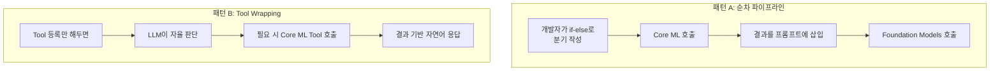
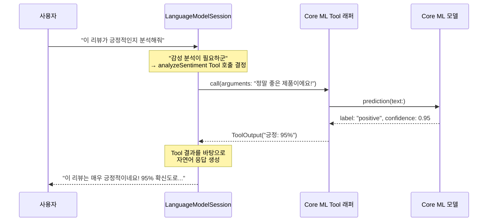
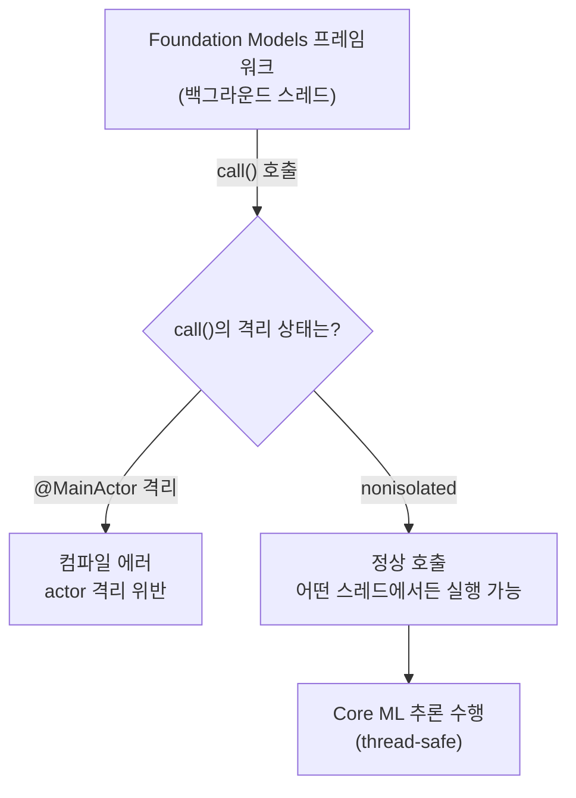
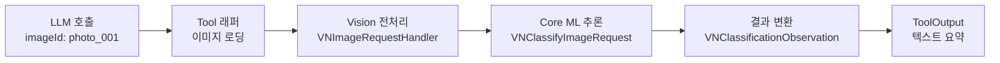
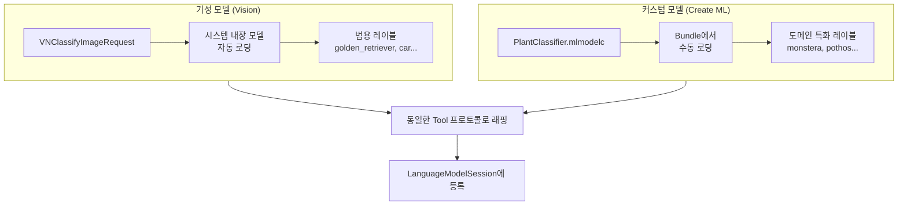
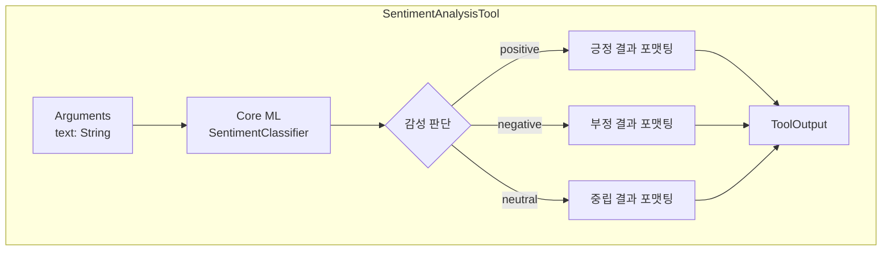
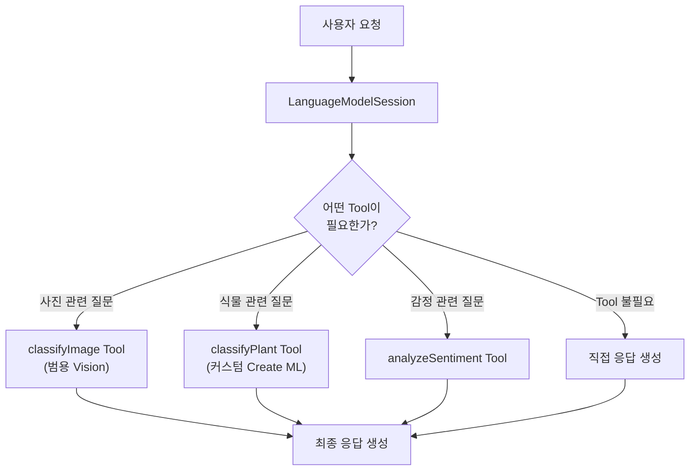
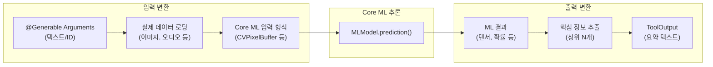

# Core ML 모델을 Tool로 래핑하기

> Core ML 모델을 Foundation Models의 Tool 프로토콜로 래핑하여 LLM이 자율적으로 호출하는 하이브리드 아키텍처를 구현한다

## 개요

이 섹션에서는 [이전 섹션](17-ch17-foundation-models-core-ml-하이브리드/01-01-하이브리드-아키텍처-설계-전략.md)에서 배운 **패턴 B(Tool Wrapping)**를 본격적으로 구현합니다. Core ML 모델을 Foundation Models의 `Tool` 프로토콜에 맞춰 래핑하면, LLM이 대화 흐름 속에서 **필요한 시점에 스스로** Core ML 추론을 호출하게 됩니다.

Vision 프레임워크의 기성 분류기뿐 아니라, [Create ML로 커스텀 모델 학습](16-ch16-create-ml로-커스텀-모델-학습/01-01-create-ml-소개와-학습-워크플로.md) 챕터에서 직접 학습한 **커스텀 모델**도 동일한 패턴으로 Tool에 래핑할 수 있습니다. 기성 모델이든 커스텀 모델이든, Tool 프로토콜 안에서는 모두 같은 방식으로 동작하죠.

**선수 지식**:
- [Tool 프로토콜 구현하기](07-ch7-tool-calling-기초/02-02-tool-프로토콜-구현하기.md) — Tool의 name, description, Arguments, call() 구조
- [세션에 Tool 등록과 호출 흐름](07-ch7-tool-calling-기초/04-04-세션에-tool-등록과-호출-흐름.md) — LanguageModelSession에 Tool 등록하는 방법
- [하이브리드 아키텍처 설계 전략](17-ch17-foundation-models-core-ml-하이브리드/01-01-하이브리드-아키텍처-설계-전략.md) — 3가지 하이브리드 패턴의 개념
- [이미지 분류 모델 학습](16-ch16-create-ml로-커스텀-모델-학습/02-02-이미지-분류-모델-학습.md) — Create ML로 커스텀 이미지 분류기 학습

**학습 목표**:
- Core ML 추론을 Tool 프로토콜의 `call()` 메서드 안에 래핑할 수 있다
- 이미지 분류 Tool을 구현하여 LLM이 사진을 분석하게 만든다
- 텍스트 감성 분석 Tool을 구현하여 LLM이 감정을 판단하게 만든다
- Create ML로 직접 학습한 커스텀 모델을 Tool로 래핑할 수 있다
- Tool Wrapping 시 입출력 변환과 에러 처리 전략을 설계한다

## 왜 알아야 할까?

이전 섹션에서 **패턴 A(순차 파이프라인)**을 보셨죠? Core ML을 먼저 돌리고, 결과를 프롬프트에 넣어서 Foundation Models에 전달하는 방식이었습니다. 이 방식은 직관적이지만, 한 가지 큰 한계가 있습니다 — **개발자가 "언제 Core ML을 호출할지" 하드코딩**해야 한다는 점이에요.

사용자가 "이 사진 좀 분석해줘"라고 말할 때는 Core ML이 필요하지만, "오늘 날씨 어때?"라고 물을 때는 필요 없죠. 이런 분기를 개발자가 전부 `if-else`로 관리해야 할까요? 사용자 요청이 10가지, 100가지가 되면요?

**Tool Wrapping**은 이 문제를 우아하게 해결합니다. Core ML 모델을 Tool 프로토콜로 래핑해두면, LLM이 대화 맥락을 파악해서 **"아, 지금 이미지 분류가 필요하겠군"**이라고 스스로 판단하고 호출합니다. 개발자는 "이 도구가 무엇을 하는지"만 설명하면 됩니다.

더 흥미로운 점은, Ch16에서 직접 학습한 **PlantClassifier** 같은 커스텀 모델도 이 패턴에 그대로 들어맞는다는 거예요. Vision의 기성 분류기를 Tool로 래핑하는 것과, Create ML로 학습한 커스텀 모델을 Tool로 래핑하는 것은 구조적으로 거의 동일합니다. 차이는 "모델을 어디서 가져오느냐"뿐이죠.

> 📊 **그림 1**: 패턴 A(하드코딩 분기)와 패턴 B(Tool Wrapping 자율 선택) 비교



WWDC25에서 Apple이 강조한 Tool Calling의 설계 철학이 바로 이것입니다 — **"개발자는 도구를 만들고, 언제 쓸지는 모델이 결정한다."** Core ML의 정밀한 추론 능력과 LLM의 상황 판단력을 결합하면, 진정한 의미의 지능형 앱을 만들 수 있습니다.

## 핵심 개념

### 개념 1: Tool Wrapping 패턴의 구조

> 💡 **비유**: 병원 접수처를 생각해보세요. 환자(사용자)가 "머리가 아파요"라고 말하면, **접수 데스크(LLM)**가 증상을 듣고 "CT 촬영이 필요하겠네요"라고 판단해서 **방사선과(Core ML 이미지 분석 Tool)**에 의뢰서를 보냅니다. 환자는 "CT 촬영을 해주세요"라고 직접 말할 필요가 없어요. 접수 데스크가 알아서 필요한 검사를 배정하는 거죠. 검사 결과가 나오면, 접수 데스크가 "검사 결과를 봤는데, 크게 걱정하실 건 아닙니다"라고 환자에게 자연스럽게 설명해줍니다.

Tool Wrapping 패턴에서는 **세 가지 구성 요소**가 상호작용합니다:

1. **LanguageModelSession** — 대화를 관리하고, 어떤 Tool을 호출할지 판단
2. **Tool 래퍼** — Core ML 모델을 Tool 프로토콜로 감싼 어댑터
3. **Core ML 모델** — 실제 추론을 수행하는 특화 모델

> 📊 **그림 2**: Tool Wrapping 패턴의 전체 흐름



핵심은 **LLM이 Tool 호출을 "자율적으로" 결정**한다는 점입니다. 개발자는 Tool의 `name`과 `description`만 잘 작성하면, LLM이 대화 맥락에 따라 적절한 시점에 호출합니다.

Tool 프로토콜의 요구사항을 다시 정리해볼까요? [Tool 프로토콜 구현하기](07-ch7-tool-calling-기초/02-02-tool-프로토콜-구현하기.md)에서 배운 구조에 Core ML을 채워 넣는 것이 이번 세션의 핵심입니다.

```swift
import FoundationModels
import CoreML

// Tool Wrapping의 핵심 구조:
// 1. Core ML 모델을 내부에 품고
// 2. Tool 프로토콜의 인터페이스로 노출한다

struct SentimentTool: Tool {
    // LLM이 이 name과 description을 보고 호출 여부를 판단
    let name = "analyzeSentiment"
    let description = "텍스트의 감성을 분석하여 긍정/부정/중립을 판단합니다"

    // 내부에 Core ML 모델을 보유
    private let model: SentimentClassifier

    @Generable
    struct Arguments {
        @Guide(description: "감성을 분석할 텍스트")
        var text: String
    }

    // nonisolated: MainActor 격리를 해제하여 프레임워크가
    // 백그라운드에서 자유롭게 호출할 수 있게 합니다
    nonisolated func call(arguments: Arguments) async throws -> ToolOutput {
        // Core ML 추론을 수행하고, 결과를 텍스트로 변환
        let prediction = try model.prediction(text: arguments.text)
        return ToolOutput("감성: \(prediction.label), 확신도: \(prediction.confidence)")
    }
}
```

이 코드에서 `nonisolated` 키워드가 눈에 들어오시나요? 이 키워드는 Tool Wrapping에서 **반드시 이해해야 할 Swift Concurrency 개념**입니다.

Swift 6의 Strict Concurrency에서는 모든 타입과 메서드가 기본적으로 **actor 격리(isolation)** 규칙을 따릅니다. SwiftUI 뷰에서 사용하는 `@Observable` 클래스가 `@MainActor`로 격리되는 것처럼, 컴파일러가 "이 코드는 어떤 스레드에서 실행되어야 하는지"를 엄격하게 검사하죠.

문제는 Foundation Models 프레임워크가 Tool의 `call()` 메서드를 **프레임워크 내부의 백그라운드 컨텍스트**에서 호출한다는 점입니다. 만약 `call()`이 `@MainActor`에 격리되어 있다면, 프레임워크가 메인 스레드 밖에서 이 메서드를 호출하려 할 때 Swift 컴파일러가 "actor 격리 위반"이라며 컴파일을 거부합니다.

> 📊 **그림 2-1**: nonisolated가 필요한 이유 — actor 격리와 Tool 호출



`nonisolated`를 `call()` 앞에 붙이면, 이 메서드가 **어떤 actor에도 속하지 않는다**고 선언하는 것입니다. 덕분에 Foundation Models 프레임워크가 자유롭게 백그라운드에서 호출할 수 있게 되죠. Core ML의 `prediction()` 메서드 자체가 thread-safe하게 설계되어 있으므로, `nonisolated` 컨텍스트에서 호출해도 안전합니다.

한 가지 주의할 점이 있는데요 — `nonisolated` 메서드 안에서는 `@MainActor`로 격리된 프로퍼티에 직접 접근할 수 없습니다. 만약 Tool이 UI 상태를 업데이트해야 한다면, `call()` 내부에서 `await MainActor.run { ... }`으로 명시적으로 메인 액터에 진입해야 합니다. 하지만 대부분의 경우 Tool은 순수한 추론만 수행하므로, 이런 패턴이 필요하지 않습니다.

### 개념 2: 이미지 분류 Tool 구현

> 💡 **비유**: 여러분의 앱에 **전문 사진 감정사**를 고용한다고 생각하세요. 이 감정사는 Vision 프레임워크라는 돋보기를 들고, 사진을 보면 "이건 골든 리트리버, 94% 확실합니다"라고 알려줍니다. LLM은 이 감정사를 **필요할 때만** 불러서 감정을 의뢰하고, 결과를 받아 사용자에게 자연스럽게 전달합니다.

이미지 분류는 Core ML과 Vision 프레임워크를 결합하여 구현합니다. 여기서 한 가지 중요한 제약이 있는데요 — Foundation Models의 Tool 입력은 `@Generable` 구조체, 즉 **텍스트 기반**입니다. 이미지 바이너리를 직접 전달할 수 없어요. 그래서 **이미지 경로나 식별자를 받아서** Tool 내부에서 이미지를 로딩하는 **간접 참조 패턴**을 사용합니다.

> 📊 **그림 3**: 이미지 분류 Tool의 데이터 변환 흐름



```swift
import FoundationModels
import CoreML
import Vision

// MARK: - 이미지 분류 Tool
// LLM이 "이 사진에 뭐가 있는지 알려줘"라고 판단하면 자동 호출

struct ImageClassificationTool: Tool {
    let name = "classifyImage"
    let description = "이미지를 분류하여 주요 객체를 식별합니다. 사진의 내용을 알고 싶을 때 사용합니다."

    // 앱의 이미지 저장소에서 이미지를 가져오는 서비스
    private let imageStore: ImageStoreProtocol

    init(imageStore: ImageStoreProtocol) {
        self.imageStore = imageStore
    }

    @Generable
    struct Arguments {
        @Guide(description: "분류할 이미지의 고유 식별자")
        var imageId: String
    }

    // nonisolated: 프레임워크가 백그라운드에서 호출할 수 있도록 격리 해제
    nonisolated func call(arguments: Arguments) async throws -> ToolOutput {
        // 1단계: 이미지 로딩 — ID로 앱 내부 저장소에서 가져오기
        guard let cgImage = await imageStore.loadImage(id: arguments.imageId) else {
            return ToolOutput("이미지를 찾을 수 없습니다: \(arguments.imageId)")
        }

        // 2단계: Vision + Core ML로 분류 수행
        let request = VNClassifyImageRequest()
        let handler = VNImageRequestHandler(cgImage: cgImage)
        try handler.perform([request])

        // 3단계: 상위 3개 결과를 텍스트로 변환
        let topResults = (request.results ?? [])
            .prefix(3)
            .map { "\($0.identifier): \(Int($0.confidence * 100))%" }
            .joined(separator: ", ")

        return ToolOutput("이미지 분류 결과 — \(topResults)")
    }
}

// 이미지 저장소 프로토콜 (테스트 시 Mock 가능)
protocol ImageStoreProtocol: Sendable {
    func loadImage(id: String) async -> CGImage?
}
```

여기서 주목할 점이 있습니다. `call()` 메서드의 반환값이 `ToolOutput`(문자열)이라는 거예요. Core ML이 내뱉는 `VNClassificationObservation` 배열을 **LLM이 이해할 수 있는 텍스트**로 변환해야 합니다. 이 "번역" 과정이 Tool Wrapping의 핵심이죠.

또 하나 — `ImageStoreProtocol`로 이미지 로딩을 추상화한 것에 주목하세요. 프로토콜로 분리하면 실제 앱에서는 Photos 프레임워크를, 테스트에서는 Mock을 넣을 수 있습니다. [AI 서비스 모킹과 단위 테스트](19-ch19-테스트와-품질-보증/02-02-ai-서비스-모킹과-단위-테스트.md)에서 이 패턴을 더 깊이 다루게 됩니다.

### 개념 3: Create ML 커스텀 모델을 Tool로 래핑하기

> 💡 **비유**: 위의 Vision 기반 이미지 분류는 **백과사전에서 답을 찾는 것**이라면, Create ML 커스텀 모델은 **여러분이 직접 쓴 전문 가이드북**과 같습니다. 백과사전은 범용적이지만, 여러분의 도메인 — 예를 들어 식물 종 분류 — 에서는 직접 학습시킨 전문 모델이 훨씬 정확하죠. Tool Wrapping 패턴에서는 둘 다 같은 방식으로 "도구함"에 넣을 수 있습니다.

[이미지 분류 모델 학습](16-ch16-create-ml로-커스텀-모델-학습/02-02-이미지-분류-모델-학습.md)에서 Create ML로 직접 학습한 **PlantClassifier.mlmodel**을 기억하시나요? 이 커스텀 모델도 Tool로 래핑할 수 있습니다. 기성 Vision 모델과의 차이점은 크게 두 가지입니다:

1. **모델 로딩 방식**: Vision의 `VNClassifyImageRequest`는 시스템 내장 모델을 자동으로 사용하지만, 커스텀 모델은 **번들에 포함된 `.mlmodelc`를 직접 로딩**해야 합니다
2. **출력 레이블**: 기성 모델은 ImageNet 같은 범용 레이블("golden_retriever", "sofa")을 반환하지만, 커스텀 모델은 **여러분이 정의한 도메인 특화 레이블**("monstera", "fiddle_leaf_fig")을 반환합니다

> 📊 **그림 3-1**: 기성 모델 vs 커스텀 모델 Tool 래핑 비교



```swift
import FoundationModels
import CoreML
import Vision

// MARK: - Create ML 커스텀 이미지 분류 Tool
// Ch16에서 학습한 PlantClassifier 모델을 Tool로 래핑

struct PlantClassificationTool: Tool {
    let name = "classifyPlant"
    let description = "식물 사진을 분석하여 종류를 식별합니다. 식물 이름이나 관리 방법을 알고 싶을 때 사용합니다."

    // Create ML로 학습한 커스텀 모델
    private let model: VNCoreMLModel
    private let imageStore: ImageStoreProtocol

    init(imageStore: ImageStoreProtocol) throws {
        // 번들에 포함된 커스텀 모델을 직접 로딩
        let config = MLModelConfiguration()
        config.computeUnits = .all  // ANE 활용

        let plantModel = try PlantClassifier(configuration: config)
        self.model = try VNCoreMLModel(for: plantModel.model)
        self.imageStore = imageStore
    }

    @Generable
    struct Arguments {
        @Guide(description: "분류할 식물 사진의 고유 식별자")
        var imageId: String
    }

    nonisolated func call(arguments: Arguments) async throws -> ToolOutput {
        guard let cgImage = await imageStore.loadImage(id: arguments.imageId) else {
            return ToolOutput("이미지를 찾을 수 없습니다: \(arguments.imageId)")
        }

        // Vision + 커스텀 Core ML 모델로 분류 수행
        let request = VNCoreMLRequest(model: model)
        let handler = VNImageRequestHandler(cgImage: cgImage)
        try handler.perform([request])

        // 커스텀 모델의 도메인 특화 레이블 추출
        guard let results = request.results as? [VNClassificationObservation] else {
            return ToolOutput("분류 결과를 가져올 수 없습니다")
        }

        let topResults = results.prefix(3).map {
            "\($0.identifier): \(Int($0.confidence * 100))%"
        }.joined(separator: ", ")

        return ToolOutput("식물 분류 결과 — \(topResults)")
    }
}
```

기성 모델(`VNClassifyImageRequest`)과 커스텀 모델(`VNCoreMLRequest`)의 차이를 눈여겨보세요. 기성 모델은 Apple이 제공하는 분류 요청을 사용하지만, 커스텀 모델은 `VNCoreMLRequest(model:)`로 **우리가 학습한 모델을 명시적으로 지정**합니다. Tool 래퍼의 외부 인터페이스 — `name`, `description`, `Arguments`, `ToolOutput` — 는 동일한 패턴이죠.

> 🔥 **실무 팁**: 같은 도메인에 기성 모델과 커스텀 모델을 **동시에 등록**할 수도 있습니다. 예를 들어 `classifyImage`(범용 객체 분류)와 `classifyPlant`(식물 특화 분류)를 함께 등록하면, LLM이 "이 사진에 뭐가 있어?"에는 범용 Tool을, "이 식물 이름이 뭐야?"에는 식물 특화 Tool을 자율 선택합니다. `description`을 명확하게 차별화하는 것이 핵심이에요.

### 개념 4: 텍스트 감성 분석 Tool 구현

> 💡 **비유**: 텍스트 감성 분석 Tool은 **감정 온도계**와 같습니다. 문장을 넣으면 "이 문장은 따뜻합니다(긍정)" 또는 "이 문장은 차갑습니다(부정)"라고 온도를 측정해주죠. LLM은 대화 중 감정 파악이 필요할 때 이 온도계를 꺼냅니다.

텍스트 감성 분석은 이미지 분류보다 구현이 간단합니다. Tool 입력이 이미 텍스트이니까, 이미지 로딩 같은 중간 변환 없이 Core ML 모델에 직접 넘기면 되거든요.

> 📊 **그림 4**: 감성 분석 Tool의 내부 구조



```swift
import FoundationModels
import CoreML
import NaturalLanguage

// MARK: - 감성 분석 Tool (Core ML 기반)
// Create ML로 학습한 텍스트 분류 모델을 래핑

struct SentimentAnalysisTool: Tool {
    let name = "analyzeSentiment"
    let description = "텍스트의 감성(긍정/부정/중립)을 분석합니다. 리뷰, 피드백, 메시지의 감정을 파악할 때 사용합니다."

    // Create ML로 학습한 감성 분류 모델
    private let classifier: NLModel

    init() throws {
        // 번들에 포함된 Core ML 모델을 NLModel로 로딩
        let modelURL = Bundle.main.url(
            forResource: "SentimentClassifier",
            withExtension: "mlmodelc"
        )!
        self.classifier = try NLModel(contentsOf: modelURL)
    }

    @Generable
    struct Arguments {
        @Guide(description: "감성을 분석할 텍스트 (리뷰, 피드백, 메시지 등)")
        var text: String
    }

    // nonisolated: actor 격리 해제 — 프레임워크 백그라운드 호출 허용
    nonisolated func call(arguments: Arguments) async throws -> ToolOutput {
        // Core ML 모델로 감성 분류 수행
        guard let label = classifier.predictedLabel(for: arguments.text) else {
            return ToolOutput("감성을 판단할 수 없습니다")
        }

        // 확률 분포 가져오기 — 상위 3개 후보
        let distribution = classifier.predictedLabelHypotheses(
            for: arguments.text,
            maximumCount: 3
        )

        // LLM이 이해하기 쉬운 형태로 변환
        let details = distribution
            .sorted { $0.value > $1.value }
            .map { "\($0.key): \(Int($0.value * 100))%" }
            .joined(separator: ", ")

        return ToolOutput("감성 분석 결과 — 판정: \(label), 상세: \(details)")
    }
}
```

감성 분석 Tool에서 `NLModel`을 사용한 이유가 궁금하실 수 있는데요. Apple의 Natural Language 프레임워크가 Core ML 모델을 직접 래핑하므로, 텍스트 입력을 별도 전처리 없이 바로 넣을 수 있어서 코드가 훨씬 간결해집니다. [텍스트 분류와 표 형식 모델](16-ch16-create-ml로-커스텀-모델-학습/03-03-텍스트-분류와-표-형식-모델.md)에서 학습한 모델을 여기서 그대로 활용할 수 있죠. 이것이 Ch16 → Ch17의 자연스러운 연결입니다 — **Create ML로 "만들고", Foundation Models로 "활용한다"**.

### 개념 5: Tool 등록과 LLM 자율 호출

> 💡 **비유**: 레스토랑의 메뉴판을 떠올려보세요. 셰프(LLM)에게 "오늘 쓸 수 있는 재료(Tool)는 이겁니다"라고 메뉴판을 건네면, 셰프가 손님의 주문(사용자 요청)에 따라 **적절한 재료를 골라** 요리합니다. 셰프에게 "2번 테이블이 스테이크 주문했으니 소고기를 써"라고 일일이 지시하지 않아도 되죠.

이미지 분류 Tool과 감성 분석 Tool, 그리고 커스텀 식물 분류 Tool까지 `LanguageModelSession`에 등록하면, LLM이 대화 맥락에 따라 자동으로 적절한 Tool을 선택합니다.

> 📊 **그림 5**: 복수 Core ML Tool 등록과 자율 선택 흐름



```swift
import FoundationModels

// MARK: - 복수 Core ML Tool을 세션에 등록 (기성 + 커스텀)

let imageStore = PhotoLibraryImageStore()

// 기성 모델 기반 Tool
let imageClassifier = ImageClassificationTool(imageStore: imageStore)
let sentimentAnalyzer = try SentimentAnalysisTool()

// Create ML 커스텀 모델 기반 Tool
let plantClassifier = try PlantClassificationTool(imageStore: imageStore)

// 세션 생성 시 모든 Tool을 배열로 전달
let session = LanguageModelSession(
    instructions: """
        당신은 AI 비서입니다. 사용자의 요청에 따라 적절한 도구를 활용하세요.
        - 일반 사진/이미지 관련 질문에는 classifyImage 도구를 사용하세요.
        - 식물 종류를 알고 싶을 때는 classifyPlant 도구를 사용하세요.
        - 텍스트의 감정/분위기 분석에는 analyzeSentiment 도구를 사용하세요.
        - 도구가 필요 없는 일반 질문에는 직접 답변하세요.
    """,
    tools: [imageClassifier, plantClassifier, sentimentAnalyzer]
)

// 이제 LLM이 자율적으로 Tool을 선택합니다
let response1 = try await session.respond(
    to: "photo_001 사진에 뭐가 있는지 알려줘"
)
// → LLM이 classifyImage Tool 호출 → "골든 리트리버가 보이네요!"

let response2 = try await session.respond(
    to: "plant_042 이 식물 이름이 뭐야?"
)
// → LLM이 classifyPlant Tool 호출 → "몬스테라(Monstera deliciosa)입니다!"

let response3 = try await session.respond(
    to: "'정말 맛있는 파스타였어요' 이 리뷰의 감정은?"
)
// → LLM이 analyzeSentiment Tool 호출 → "매우 긍정적인 리뷰입니다!"

let response4 = try await session.respond(
    to: "오늘 서울 날씨 어때?"
)
// → Tool 호출 없이 직접 응답 (등록된 Tool에 날씨 기능이 없으므로)
```

`instructions`에 각 Tool의 사용 시점을 힌트로 넣어주면 LLM의 Tool 선택 정확도가 높아집니다. 특히 기성 모델과 커스텀 모델이 **비슷한 도메인**(둘 다 이미지 분류)을 다룰 때, `description`으로 **용도 차이를 명확히** 구분하는 것이 중요합니다. "사진의 내용을 알고 싶을 때" vs "식물 종류를 알고 싶을 때"처럼요.

### 개념 6: Tool 래핑 시 입출력 변환 전략

Tool Wrapping에서 가장 실수하기 쉬운 부분이 **입출력 변환**입니다. Core ML 모델은 텐서, 이미지, 숫자 배열을 다루지만, Tool의 인터페이스는 `@Generable` 구조체(사실상 텍스트 기반)입니다. 이 간극을 어떻게 메울지가 설계의 핵심이에요.

> 📊 **그림 6**: Core ML과 Tool 프로토콜 사이의 데이터 변환 레이어



입출력 변환의 핵심 원칙을 정리하면:

```swift
// MARK: - 입출력 변환 전략

// ❌ 나쁜 예: 원시 데이터를 그대로 ToolOutput에 넣음
// LLM이 이해할 수 없고, 토큰을 낭비
func badOutput() -> ToolOutput {
    let rawProbabilities = "[0.94, 0.03, 0.01, 0.005, 0.003, ...]"
    return ToolOutput(rawProbabilities)  // LLM: "뭐가 뭔지 모르겠는데..."
}

// ✅ 좋은 예: 핵심만 추출하여 라벨과 함께 반환
func goodOutput() -> ToolOutput {
    return ToolOutput("이미지 분류 결과 — golden_retriever: 94%, sofa: 3%")
}

// ✅ 더 좋은 예: 맥락 정보까지 포함하여 LLM의 해석을 돕는다
func betterOutput() -> ToolOutput {
    return ToolOutput("""
    이미지 분류 결과:
    - 주요 객체: golden_retriever (신뢰도 94%)
    - 배경: living_room (신뢰도 87%)
    - 특이사항: 신뢰도가 높아 정확한 분류로 판단됨
    """)
}
```

**입력 변환 패턴 정리**:

| Core ML 입력 타입 | Tool Arguments 설계 | 내부 변환 로직 |
|-------------------|---------------------|----------------|
| `CGImage` / `CVPixelBuffer` | `imageId: String` | ID로 이미지 로딩 → CGImage 변환 |
| `MLMultiArray` | `values: [Double]` | 배열을 MLMultiArray로 변환 |
| `String` (NLModel) | `text: String` | 직접 전달 (변환 불필요) |
| `URL` (사운드 파일) | `audioId: String` | ID로 파일 URL 조회 |

**기성 모델 vs 커스텀 모델 — Tool 래핑 차이 정리**:

| 항목 | 기성 모델 (Vision) | 커스텀 모델 (Create ML) |
|------|---------------------|-------------------------|
| 모델 로딩 | `VNClassifyImageRequest()` 자동 | `VNCoreMLRequest(model:)` 수동 |
| 출력 레이블 | 범용 (ImageNet 등) | 도메인 특화 (직접 정의) |
| description 전략 | "사진의 내용을 알고 싶을 때" | "특정 도메인 분류가 필요할 때" |
| 정확도 | 범용 높음, 특화 도메인 보통 | 특화 도메인 매우 높음 |
| 모델 크기 | 시스템 내장 (번들 0KB) | 번들에 포함 (수 MB) |

## 실습: 직접 해보기

Core ML 이미지 분류 모델, 커스텀 식물 분류 모델, 감성 분석 모델을 Tool로 래핑한 **통합 AI 어시스턴트**를 만들어봅시다. LLM이 사용자 요청에 따라 적절한 Core ML Tool을 자율 선택합니다.

```swift
import SwiftUI
import FoundationModels
import CoreML
import Vision
import NaturalLanguage

// MARK: - 1단계: Core ML Tool 정의

/// 이미지 분류 Tool — Vision 프레임워크 기반 (기성 모델)
struct ImageClassificationTool: Tool {
    let name = "classifyImage"
    let description = "이미지를 분류하여 주요 객체를 식별합니다"

    private let imageStore: ImageStoreProtocol

    init(imageStore: ImageStoreProtocol) {
        self.imageStore = imageStore
    }

    @Generable
    struct Arguments {
        @Guide(description: "분류할 이미지의 고유 식별자")
        var imageId: String
    }

    nonisolated func call(arguments: Arguments) async throws -> ToolOutput {
        guard let cgImage = await imageStore.loadImage(id: arguments.imageId) else {
            return ToolOutput("이미지를 찾을 수 없습니다: \(arguments.imageId)")
        }

        // Vision + Core ML 이미지 분류
        let request = VNClassifyImageRequest()
        let handler = VNImageRequestHandler(cgImage: cgImage)
        try handler.perform([request])

        let results = (request.results ?? []).prefix(3)
        let summary = results.map {
            "\($0.identifier): \(Int($0.confidence * 100))%"
        }.joined(separator: ", ")

        return ToolOutput("이미지 분류 — \(summary)")
    }
}

/// 식물 분류 Tool — Create ML 커스텀 모델 기반
struct PlantClassificationTool: Tool {
    let name = "classifyPlant"
    let description = "식물 사진을 분석하여 종류를 식별합니다"

    private let model: VNCoreMLModel
    private let imageStore: ImageStoreProtocol

    init(imageStore: ImageStoreProtocol) throws {
        let config = MLModelConfiguration()
        config.computeUnits = .all
        let plantModel = try PlantClassifier(configuration: config)
        self.model = try VNCoreMLModel(for: plantModel.model)
        self.imageStore = imageStore
    }

    @Generable
    struct Arguments {
        @Guide(description: "분류할 식물 사진의 고유 식별자")
        var imageId: String
    }

    nonisolated func call(arguments: Arguments) async throws -> ToolOutput {
        guard let cgImage = await imageStore.loadImage(id: arguments.imageId) else {
            return ToolOutput("이미지를 찾을 수 없습니다: \(arguments.imageId)")
        }

        let request = VNCoreMLRequest(model: model)
        let handler = VNImageRequestHandler(cgImage: cgImage)
        try handler.perform([request])

        guard let results = request.results as? [VNClassificationObservation] else {
            return ToolOutput("분류 결과를 가져올 수 없습니다")
        }

        let summary = results.prefix(3).map {
            "\($0.identifier): \(Int($0.confidence * 100))%"
        }.joined(separator: ", ")

        return ToolOutput("식물 분류 — \(summary)")
    }
}

/// 감성 분석 Tool — NLModel 기반
struct SentimentAnalysisTool: Tool {
    let name = "analyzeSentiment"
    let description = "텍스트의 감성을 분석합니다 (긍정/부정/중립)"

    private let classifier: NLModel

    init() throws {
        let url = Bundle.main.url(
            forResource: "SentimentClassifier",
            withExtension: "mlmodelc"
        )!
        self.classifier = try NLModel(contentsOf: url)
    }

    @Generable
    struct Arguments {
        @Guide(description: "감성을 분석할 텍스트")
        var text: String
    }

    nonisolated func call(arguments: Arguments) async throws -> ToolOutput {
        guard let label = classifier.predictedLabel(for: arguments.text) else {
            return ToolOutput("감성을 판단할 수 없습니다")
        }

        let hypotheses = classifier.predictedLabelHypotheses(
            for: arguments.text, maximumCount: 3
        )
        let details = hypotheses
            .sorted { $0.value > $1.value }
            .map { "\($0.key): \(Int($0.value * 100))%" }
            .joined(separator: ", ")

        return ToolOutput("감성 판정: \(label) (\(details))")
    }
}

// MARK: - 2단계: 하이브리드 AI 서비스

/// 기성 + 커스텀 Core ML Tool을 관리하는 통합 서비스
@Observable
final class HybridToolService {
    private let session: LanguageModelSession

    var messages: [(role: String, content: String)] = []
    var isProcessing = false

    init(imageStore: ImageStoreProtocol) throws {
        // 기성 모델 Tool + 커스텀 모델 Tool + 텍스트 Tool
        let imageTool = ImageClassificationTool(imageStore: imageStore)
        let plantTool = try PlantClassificationTool(imageStore: imageStore)
        let sentimentTool = try SentimentAnalysisTool()

        // 세션에 모든 Tool 등록
        self.session = LanguageModelSession(
            instructions: """
                당신은 AI 비서입니다.
                - 일반 사진 분석 요청 시 classifyImage 도구를 사용하세요.
                - 식물 종류 판별 요청 시 classifyPlant 도구를 사용하세요.
                - 텍스트 감정 분석 요청 시 analyzeSentiment 도구를 사용하세요.
                - 분석 결과를 자연스러운 한국어로 설명해주세요.
            """,
            tools: [imageTool, plantTool, sentimentTool]
        )
    }

    /// 사용자 메시지를 처리하고 응답을 반환
    func send(_ userMessage: String) async throws -> String {
        isProcessing = true
        defer { isProcessing = false }

        messages.append((role: "user", content: userMessage))

        // LLM이 자율적으로 필요한 Tool을 호출하고 응답 생성
        let response = try await session.respond(to: userMessage)
        let reply = response.content

        messages.append((role: "assistant", content: reply))
        return reply
    }
}

// MARK: - 3단계: SwiftUI 뷰

struct HybridAssistantView: View {
    @State private var service: HybridToolService?
    @State private var inputText = ""
    @State private var errorMessage: String?

    var body: some View {
        NavigationStack {
            VStack {
                // 대화 히스토리 표시
                ScrollView {
                    LazyVStack(alignment: .leading, spacing: 12) {
                        if let service {
                            ForEach(
                                Array(service.messages.enumerated()),
                                id: \.offset
                            ) { _, message in
                                MessageBubble(
                                    role: message.role,
                                    content: message.content
                                )
                            }
                        }
                    }
                    .padding()
                }

                // 입력 영역
                HStack {
                    TextField("메시지를 입력하세요", text: $inputText)
                        .textFieldStyle(.roundedBorder)

                    Button("전송") {
                        sendMessage()
                    }
                    .disabled(inputText.isEmpty || service?.isProcessing == true)
                }
                .padding()
            }
            .navigationTitle("AI 어시스턴트")
            .task {
                do {
                    let store = PhotoLibraryImageStore()
                    service = try HybridToolService(imageStore: store)
                } catch {
                    errorMessage = "서비스 초기화 실패: \(error.localizedDescription)"
                }
            }
        }
    }

    private func sendMessage() {
        let message = inputText
        inputText = ""

        Task {
            do {
                _ = try await service?.send(message)
            } catch {
                errorMessage = error.localizedDescription
            }
        }
    }
}

/// 메시지 버블 UI 컴포넌트
struct MessageBubble: View {
    let role: String
    let content: String

    var body: some View {
        HStack {
            if role == "user" { Spacer() }

            Text(content)
                .padding(12)
                .background(
                    role == "user"
                        ? Color.blue.opacity(0.2)
                        : Color.gray.opacity(0.15)
                )
                .clipShape(RoundedRectangle(cornerRadius: 12))
                .accessibilityLabel(
                    role == "user" ? "나의 메시지: \(content)" : "AI 응답: \(content)"
                )

            if role != "user" { Spacer() }
        }
    }
}
```

ToolOutput 변환 로직이 어떻게 동작하는지 시뮬레이션해볼까요?

```run:swift
// Tool Wrapping 래퍼가 ToolOutput을 어떻게 구성하는지 시뮬레이션

struct MockClassificationResult {
    let label: String
    let confidence: Float
}

// Core ML 결과를 ToolOutput 문자열로 변환하는 로직
func formatClassificationOutput(_ results: [MockClassificationResult]) -> String {
    let summary = results.map {
        "\($0.label): \(Int($0.confidence * 100))%"
    }.joined(separator: ", ")
    return "이미지 분류 결과 — \(summary)"
}

// 시뮬레이션 1: Vision 기성 모델 결과
let visionResults = [
    MockClassificationResult(label: "golden_retriever", confidence: 0.94),
    MockClassificationResult(label: "labrador", confidence: 0.03),
    MockClassificationResult(label: "dog", confidence: 0.02),
]
print("기성 모델: \(formatClassificationOutput(visionResults))")

// 시뮬레이션 2: Create ML 커스텀 모델 결과
let customResults = [
    MockClassificationResult(label: "monstera_deliciosa", confidence: 0.91),
    MockClassificationResult(label: "philodendron", confidence: 0.05),
    MockClassificationResult(label: "pothos", confidence: 0.03),
]
print("커스텀 모델: \(formatClassificationOutput(customResults))")

// 감성 분석 결과 변환 시뮬레이션
func formatSentimentOutput(label: String, scores: [(String, Double)]) -> String {
    let details = scores.map { "\($0.0): \(Int($0.1 * 100))%" }.joined(separator: ", ")
    return "감성 판정: \(label) (\(details))"
}

let sentimentOutput = formatSentimentOutput(
    label: "positive",
    scores: [("positive", 0.92), ("neutral", 0.06), ("negative", 0.02)]
)
print("감성 분석: \(sentimentOutput)")
```

```output
기성 모델: 이미지 분류 결과 — golden_retriever: 94%, labrador: 3%, dog: 2%
커스텀 모델: 이미지 분류 결과 — monstera_deliciosa: 91%, philodendron: 5%, pothos: 3%
감성 분석: 감성 판정: positive (positive: 92%, neutral: 6%, negative: 2%)
```

## 더 깊이 알아보기

### Tool Calling의 학술적 기원: HuggingGPT에서 Apple까지

"LLM이 특화 모델을 도구로 호출한다"는 아이디어는 어디서 시작되었을까요? 2023년 Microsoft Research에서 발표한 **HuggingGPT** 논문이 그 직접적인 기원입니다. 이 논문은 ChatGPT가 Hugging Face에 등록된 수백 개의 특화 AI 모델 — 이미지 분류, 객체 탐지, 음성 인식, 텍스트 요약 등 — 을 필요에 따라 자율적으로 선택하고 호출하는 시스템을 제안했습니다.

핵심 아이디어는 간단했어요. "LLM은 뛰어난 언어 이해력으로 **어떤 모델이 필요한지 판단**하고, 특화 모델은 **실제 작업을 수행**한다." 이 분업 구조가 바로 오늘 우리가 구현한 Tool Wrapping 패턴의 원형입니다.

Apple은 WWDC25에서 이 개념을 **완전히 온디바이스**로 가져왔습니다. HuggingGPT가 클라우드 API 호출에 의존했다면, Apple의 Foundation Models 프레임워크는 ~3B 온디바이스 LLM이 같은 기기 안의 Core ML 모델을 Tool로 호출합니다. 네트워크 없이, 프라이버시를 완벽히 보장하면서요. 사실 이런 "도구 사용" 발상 자체는 2023년 Meta의 **Toolformer** 논문까지 거슬러 올라갑니다 — "언어 모델이 스스로 API를 호출하는 법을 배울 수 있다"는 것을 처음으로 보여준 연구였죠.

재미있는 점은, Apple이 Foundation Models 프레임워크의 Tool Calling을 설계할 때 **Swift의 타입 시스템**을 적극 활용했다는 것입니다. 다른 플랫폼(OpenAI, Anthropic 등)은 JSON Schema로 Tool의 입출력을 정의하지만, Apple은 `@Generable` 매크로와 Swift 구조체를 사용합니다. 컴파일 타임에 스키마가 검증되니, 런타임에 "Tool 입력이 잘못됨" 같은 에러가 원천 차단되는 거죠.

> 💡 **알고 계셨나요?**: Foundation Models 프레임워크의 Tool Calling은 **병렬 호출**도 자동으로 처리합니다. LLM이 "이 사진도 분석하고, 저 리뷰 감성도 분석해"라고 판단하면, 프레임워크가 두 Tool을 동시에 호출합니다. 이 병렬 처리 메커니즘은 [병렬과 직렬 Tool 호출](08-ch8-tool-calling-심화/02-02-병렬과-직렬-tool-호출.md)에서 자세히 다뤘는데, Core ML Tool에도 동일하게 적용됩니다. 다만 Core ML Tool의 경우 Neural Engine 경합을 주의해야 합니다 — 두 Core ML 모델이 동시에 ANE를 사용하려 하면 성능이 오히려 저하될 수 있거든요.

## 흔한 오해와 팁

> ⚠️ **흔한 오해**: "Tool의 call() 안에서 이미지를 직접 받을 수 있다"
>
> Foundation Models의 Tool 입력은 `@Generable` 구조체, 즉 텍스트 기반 데이터만 지원합니다. 이미지나 오디오 같은 바이너리 데이터를 직접 전달할 수 없어요. 대신 **이미지 ID나 파일 경로를 전달**하고, Tool 내부에서 해당 리소스를 로딩하는 간접 참조 패턴을 사용해야 합니다.

> ⚠️ **흔한 오해**: "description을 대충 써도 LLM이 알아서 판단한다"
>
> `description`은 LLM이 Tool 호출 여부를 결정하는 **거의 유일한 단서**입니다. "이미지를 분류합니다"보다 "이미지를 분류하여 주요 객체를 식별합니다. 사진에 뭐가 있는지 알고 싶을 때 사용합니다"처럼 **언제 사용해야 하는지**까지 명시하면 호출 정확도가 크게 올라갑니다. 특히 기성 모델과 커스텀 모델을 함께 등록할 때, description으로 **용도를 명확히 구분**하지 않으면 LLM이 잘못된 Tool을 호출할 수 있습니다.

> ⚠️ **흔한 오해**: "nonisolated를 안 써도 Tool이 동작한다"
>
> Swift 5 모드에서는 Strict Concurrency가 기본 비활성이라 경고만 뜨고 동작할 수 있습니다. 하지만 Swift 6에서는 `nonisolated`가 없으면 **컴파일 에러**가 발생합니다. Foundation Models 프레임워크가 Tool의 `call()`을 백그라운드 컨텍스트에서 호출하기 때문에, actor 격리를 해제하지 않으면 "call to actor-isolated method in nonisolated context" 에러가 나거든요. 지금부터 `nonisolated`를 습관적으로 붙이세요.

> ⚠️ **흔한 오해**: "Create ML 커스텀 모델은 기성 모델과 래핑 방법이 완전히 다르다"
>
> Tool 프로토콜의 관점에서 보면, 기성 모델이든 커스텀 모델이든 **래핑 패턴은 동일**합니다. `name`, `description`, `Arguments`, `call()` 구조는 같고, 차이는 모델 로딩 방식(`VNClassifyImageRequest` vs `VNCoreMLRequest`)과 출력 레이블의 도메인뿐입니다. Ch16에서 학습한 어떤 모델이든 같은 패턴으로 Tool에 넣을 수 있어요.

> 🔥 **실무 팁**: Core ML 모델 로딩은 비용이 크므로, Tool 생성 시점에 한 번만 로딩하세요. `call()` 안에서 매번 모델을 로딩하면 수백 밀리초의 지연이 발생합니다. Tool을 `struct`로 만들되, 모델은 `init()`에서 로딩하여 프로퍼티로 보관하는 것이 좋습니다.

> 🔥 **실무 팁**: ToolOutput 문자열은 **간결하게** 작성하세요. Core ML이 100개 분류 결과를 반환해도 상위 3개만 넣으면 충분합니다. LLM의 컨텍스트 윈도우는 제한적이고, 긴 Tool 결과는 토큰을 낭비하여 후속 대화 품질을 떨어뜨립니다.

## 핵심 정리

| 개념 | 설명 |
|------|------|
| **Tool Wrapping 패턴** | Core ML 모델을 Tool 프로토콜로 감싸 LLM이 자율 호출하게 하는 하이브리드 패턴 |
| **Tool 프로토콜 필수 요소** | `name`, `description`, `@Generable Arguments`, `nonisolated call()` → `ToolOutput` |
| **nonisolated 키워드** | `call()`의 actor 격리를 해제하여 프레임워크가 백그라운드에서 자유롭게 호출할 수 있게 하는 Swift Concurrency 요구사항 |
| **이미지 분류 Tool** | 이미지 ID를 받아 내부에서 로딩 → Vision/Core ML 추론 → 텍스트 요약 반환 |
| **커스텀 모델 Tool** | Create ML로 학습한 모델을 `VNCoreMLRequest`로 로딩하여 도메인 특화 분류 수행 |
| **감성 분석 Tool** | 텍스트를 받아 NLModel/Core ML 추론 → 감성 레이블+확률 반환 |
| **간접 참조 패턴** | 바이너리 데이터를 직접 전달 불가 → ID/경로로 간접 참조하여 내부에서 로딩 |
| **기성 vs 커스텀 차이** | 모델 로딩 방식과 레이블 도메인만 다르고, Tool 래핑 패턴은 동일 |
| **입출력 변환** | Core ML의 텐서/확률을 LLM이 이해할 수 있는 요약 텍스트로 변환하는 것이 핵심 |
| **description의 중요성** | LLM의 Tool 선택 정확도를 결정하는 가장 중요한 요소 |

## 다음 섹션 미리보기

지금까지 Core ML 모델을 Tool로 래핑하여 LLM이 **개별 모델을 호출**하는 방법을 배웠습니다. 다음 섹션 [LLM-ML 파이프라인 구성](17-ch17-foundation-models-core-ml-하이브리드/03-03-llm-ml-파이프라인-구성.md)에서는 여러 Tool과 LLM을 **체인으로 연결**하여, 사용자 의도 파악 → Core ML 분석 → 결과 해석 → 후속 질문 처리까지 이어지는 멀티스텝 파이프라인을 구축합니다. Tool 하나를 호출하는 것에서, 여러 Tool을 조합하는 오케스트레이션으로 한 단계 올라가는 거죠.

## 참고 자료

- [Deep dive into the Foundation Models framework — WWDC25](https://developer.apple.com/videos/play/wwdc2025/301/) - Tool Calling 심화: Tool 프로토콜 구현, 병렬/직렬 호출, ToolOutput 설계를 상세히 다루는 공식 세션
- [Meet the Foundation Models framework — WWDC25](https://developer.apple.com/videos/play/wwdc2025/286/) - Foundation Models 프레임워크의 전체 구조와 Tool Calling 기본 개념 소개
- [The Ultimate Guide To The Foundation Models Framework — AzamSharp](https://azamsharp.com/2025/06/18/the-ultimate-guide-to-the-foundation-models-framework.html) - RecipeTool 예제를 포함한 Tool 프로토콜 구현 실전 가이드
- [Exploring the Foundation Models framework — Create with Swift](https://www.createwithswift.com/exploring-the-foundation-models-framework/) - FindRestaurantsTool 예제와 LanguageModelSession 통합 방법 상세 설명
- [Foundation Models — Apple Developer Documentation](https://developer.apple.com/documentation/FoundationModels) - Tool 프로토콜, ToolOutput, LanguageModelSession 공식 API 레퍼런스
- [Core ML Overview — Apple Developer](https://developer.apple.com/machine-learning/core-ml/) - Core ML 프레임워크 공식 개요와 온디바이스 추론 최적화 가이드

---
### 🔗 Related Sessions
- [@generable](05-ch5-generable-구조화-출력/01-01-guided-generation-개념과-동작-원리.md) (prerequisite)
- [vision 프레임워크](01-ch1-apple-intelligence와-온디바이스-ai/02-02-apple-aiml-프레임워크-생태계.md) (prerequisite)
