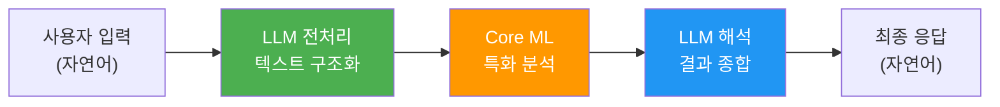
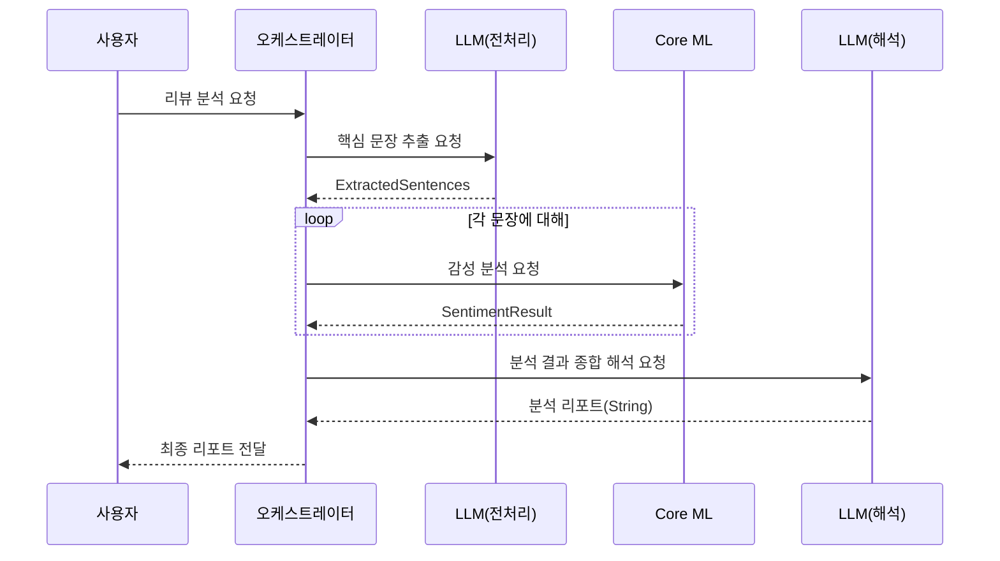
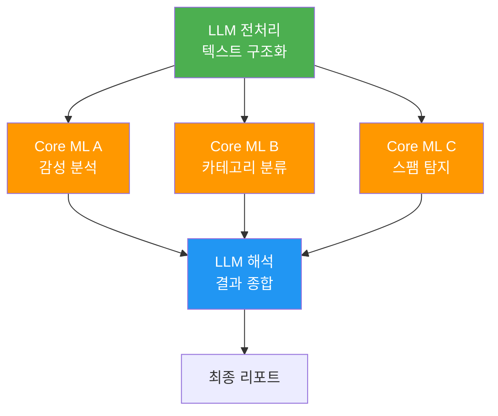
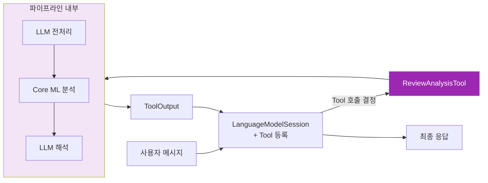

# LLM → ML 파이프라인 구성

> Foundation Models로 텍스트를 전처리·분석한 뒤 Core ML 모델에 전달하고, 그 결과를 다시 LLM이 해석하는 양방향 파이프라인을 구축합니다.

## 개요

이 섹션에서는 Foundation Models(LLM)와 Core ML(특화 ML 모델)을 **순차적으로 연결하는 파이프라인 아키텍처**를 설계하고 구현합니다. 앞서 [하이브리드 아키텍처 설계 전략](17-ch17-foundation-models-core-ml-하이브리드/01-01-하이브리드-아키텍처-설계-전략.md)에서 배운 순차 파이프라인 패턴을 본격적으로 코드로 옮기고, [Core ML 모델을 Tool로 래핑하기](17-ch17-foundation-models-core-ml-하이브리드/02-02-core-ml-모델을-tool로-래핑하기.md)에서 다룬 단일 Tool 래핑을 넘어 **멀티스텝 체인**으로 확장합니다.

**선수 지식**:
- LanguageModelSession의 `respond(to:)` 및 Tool Calling 기본 ([Tool 프로토콜 구현하기](07-ch7-tool-calling-기초/02-02-tool-프로토콜-구현하기.md))
- @Generable 구조화 출력 ([Guided Generation 개념과 동작 원리](05-ch5-generable-구조화-출력/01-01-guided-generation-개념과-동작-원리.md))
- Core ML 모델 로딩과 추론 ([Core ML 모델 통합하기](15-ch15-core-ml-기초/02-02-core-ml-모델-통합하기.md))

**학습 목표**:
- LLM → ML → LLM 양방향 파이프라인의 설계 원리를 이해한다
- 멀티스텝 파이프라인에서 단계 간 데이터 변환 전략을 익힌다
- 파이프라인 오케스트레이터를 구현하여 여러 AI 모델을 체인으로 연결한다

## 왜 알아야 할까?

실제 앱에서 AI가 풀어야 하는 문제는 하나의 모델로 끝나지 않는 경우가 많습니다. 사용자가 "이 제품 리뷰를 분석해줘"라고 요청하면 어떤 일이 벌어질까요?

1. LLM이 자연어 리뷰에서 **핵심 문장을 추출**한다
2. Core ML 감성 분석 모델이 각 문장의 **감성 점수를 산출**한다
3. LLM이 감성 점수와 원문을 종합하여 **사람이 읽기 좋은 분석 리포트를 생성**한다

이 세 단계를 하나의 모델이 처리하려고 하면? Foundation Models의 ~3B 온디바이스 모델은 범용 언어 이해에 탁월하지만, 도메인 특화 분류 정확도에서는 전용 Core ML 모델에 뒤처집니다. 반대로 Core ML 모델은 정확한 분류는 잘하지만 자연어 설명을 생성할 수 없죠.

**파이프라인은 "각 모델이 가장 잘하는 일"만 시키는 분업 전략입니다.** 마치 요리에서 재료 손질 전문가가 준비한 재료를 셰프가 요리하고, 플레이팅 전문가가 마무리하는 것처럼요. 이 섹션에서 배우는 파이프라인 구성 능력은 Ch17 전체의 실전 프로젝트([실습: 스마트 사진 분석 앱](17-ch17-foundation-models-core-ml-하이브리드/05-05-실습-스마트-사진-분석-앱.md))에서 핵심이 됩니다.

## 핵심 개념

### 개념 1: 양방향 파이프라인 아키텍처

> 💡 **비유**: 병원 진료를 생각해보세요. 접수 데스크(LLM)가 환자의 증상을 듣고 정리한 뒤, 검사실(Core ML)에서 혈액검사·X-ray 등 정밀 검사를 수행합니다. 그 결과를 다시 의사(LLM)에게 전달하면, 의사는 검사 결과와 환자 증상을 종합하여 진단서를 작성합니다. 접수 → 검사 → 진단의 **양방향 흐름**이 바로 LLM → ML → LLM 파이프라인이에요.

양방향 파이프라인은 LLM과 ML 모델이 **서로의 출력을 입력으로 활용**하는 구조입니다. 핵심은 각 단계의 역할이 명확하다는 것이죠:

| 단계 | 담당 모델 | 역할 | 출력 |
|------|-----------|------|------|
| 1단계: 전처리 | Foundation Models (LLM) | 비정형 텍스트에서 핵심 키워드/문장 추출 | @Generable 구조체 |
| 2단계: 분석 | Core ML 모델 | 특화 추론 수행 | 수치/레이블 |
| 3단계: 해석 | Foundation Models (LLM) | 결과를 자연어로 해석 | 사용자 친화적 텍스트 |

> 📊 **그림 1**: LLM → ML → LLM 양방향 파이프라인의 기본 흐름



이 패턴이 단순한 Tool Wrapping(Ch17.2)과 다른 점은, Tool Wrapping에서는 LLM이 **한 번** Core ML을 호출하고 끝나지만, 양방향 파이프라인에서는 LLM이 **두 번** 개입한다는 것입니다. 전처리와 후처리를 모두 LLM이 담당하기 때문에, 입력과 출력 양쪽 모두 자연어의 유연함을 살릴 수 있어요.

Swift에서 이 파이프라인의 각 단계는 `async` 함수로 구현됩니다. 각 단계의 프로토콜을 먼저 정의해볼까요?

```swift
import FoundationModels
import CoreML

// MARK: - 파이프라인 단계 프로토콜
/// 파이프라인의 각 단계를 추상화하는 프로토콜
/// 텍스트/구조체 기반의 일반적인 파이프라인 단계에 사용합니다.
/// 다음 섹션에서 다루는 TensorPipelineStep은 이 프로토콜을 확장하여
/// MLTensor 기반 입출력을 추가한 특화 버전입니다.
protocol PipelineStep {
    associatedtype Input
    associatedtype Output
    
    var name: String { get }
    func execute(_ input: Input) async throws -> Output
}

// MARK: - 텐서 기반 파이프라인 단계 (PipelineStep 확장)
/// MLTensor 입출력이 필요한 단계를 위한 특화 프로토콜
/// PipelineStep을 준수하면서 텐서 변환 기능을 추가합니다.
/// 상세 구현은 다음 섹션 "MLTensor와 프레임워크 연동"에서 다룹니다.
protocol TensorPipelineStep: PipelineStep {
    /// 입력을 MLTensor로 변환
    func toTensor(_ input: Input) throws -> MLTensor
    /// MLTensor를 출력 타입으로 변환
    func fromTensor(_ tensor: MLTensor) throws -> Output
}

// MARK: - 파이프라인 오류 정의
enum PipelineError: Error, LocalizedError {
    case preprocessingFailed(String)
    case analysisFailed(String)
    case interpretationFailed(String)
    case stepTimeout(stepName: String)
    
    var errorDescription: String? {
        switch self {
        case .preprocessingFailed(let detail):
            return "전처리 실패: \(detail)"
        case .analysisFailed(let detail):
            return "분석 실패: \(detail)"
        case .interpretationFailed(let detail):
            return "해석 실패: \(detail)"
        case .stepTimeout(let stepName):
            return "\(stepName) 단계 타임아웃"
        }
    }
}
```

> 💡 **PipelineStep과 TensorPipelineStep의 관계**: `PipelineStep`은 **범용 파이프라인 단계 프로토콜**로, 이 섹션에서 다루는 텍스트/구조체 기반 파이프라인에 사용됩니다. 다음 섹션에서 등장하는 `TensorPipelineStep`은 `PipelineStep`을 **상속(확장)**하여 `toTensor(_:)`와 `fromTensor(_:)` 메서드를 추가한 **특화 프로토콜**입니다. 즉, 모든 `TensorPipelineStep`은 `PipelineStep`이기도 하므로, 기존 파이프라인 오케스트레이터에 텐서 기반 단계를 그대로 끼워 넣을 수 있습니다. 이 계층 구조 덕분에 텍스트 → 텐서 → 텍스트처럼 이종 데이터를 다루는 파이프라인도 일관된 인터페이스로 구성할 수 있죠.

### 개념 2: 단계 간 데이터 변환 — 접착제 역할의 @Generable

> 💡 **비유**: 파이프라인의 각 단계는 서로 다른 언어를 쓰는 외국인과 같습니다. LLM은 "자연어"를 말하고, Core ML은 "숫자 배열"을 이해하죠. 이 둘 사이에 **통역사**가 필요한데, 그 역할을 `@Generable` 구조체가 합니다. LLM의 출력을 Swift 타입으로 변환하면, 그 타입의 프로퍼티를 Core ML 입력으로 직접 매핑할 수 있거든요.

파이프라인에서 가장 까다로운 부분은 **단계 간 데이터를 어떻게 변환하느냐**입니다. LLM은 자연어 문자열을 출력하고, Core ML은 `MLFeatureProvider`를 입력으로 받으니까요. 이 간극을 메우는 전략이 세 가지 있습니다:

> 📊 **그림 2**: 세 가지 데이터 변환 전략 비교

```mermaid
flowchart TD
    subgraph S1["전략 1: @Generable 구조화 출력"]
        A1["LLM 출력"] --> B1["@Generable 구조체"]
        B1 --> C1["프로퍼티 매핑"]
        C1 --> D1["Core ML 입력"]
    end
    
    subgraph S2["전략 2: 문자열 파싱"]
        A2["LLM 출력"] --> B2["String"]
        B2 --> C2["수동 파싱"]
        C2 --> D2["Core ML 입력"]
    end
    
    subgraph S3["전략 3: Tool Output 재활용"]
        A3["LLM 출력"] --> B3["Tool.call()"]
        B3 --> C3["ToolOutput"]
        C3 --> D3["다음 LLM 입력"]
    end

    style S1 fill:#E8F5E9
    style S2 fill:#FFF3E0
    style S3 fill:#E3F2FD
```



**전략 1이 권장**되는 이유는 명확합니다. `@Generable`을 사용하면 LLM이 출력 형식을 "추측"할 필요 없이, Guided Generation으로 **구조적으로 보장된** Swift 타입을 생성하거든요. 문자열 파싱(전략 2)은 LLM이 예상 외의 포맷을 반환할 위험이 있어 프로덕션에서는 피해야 합니다.

```swift
import FoundationModels

// MARK: - 1단계 LLM 출력용 @Generable 구조체
/// LLM이 리뷰 텍스트에서 추출한 핵심 문장들
@Generable
struct ExtractedSentences {
    @Guide(description: "원본 텍스트에서 추출한 핵심 평가 문장 목록")
    var sentences: [String]
    
    @Guide(description: "전체 리뷰의 주제 (예: '음식', '서비스', '가격')")
    var topic: String
    
    @Guide(description: "리뷰어가 가장 강조한 포인트 요약")
    var mainPoint: String
}

// MARK: - 2단계 Core ML 분석 결과
/// Core ML 감성 분석 결과를 담는 구조체 (앱 코드에서 직접 생성)
struct SentimentResult {
    let sentence: String
    let label: String        // "positive", "negative", "neutral"
    let confidence: Double   // 0.0 ~ 1.0
}

// MARK: - 3단계 LLM 해석용 입력 구성
/// 분석 결과를 LLM에게 전달할 프롬프트로 변환
func buildInterpretationPrompt(
    originalText: String,
    sentiments: [SentimentResult]
) -> String {
    var prompt = "다음 리뷰의 감성 분석 결과를 종합하여 한국어로 분석 리포트를 작성해주세요.\n\n"
    prompt += "원본 리뷰: \(originalText)\n\n"
    prompt += "감성 분석 결과:\n"
    for result in sentiments {
        prompt += "- \"\(result.sentence)\" → \(result.label) (신뢰도: \(String(format: "%.1f%%", result.confidence * 100)))\n"
    }
    prompt += "\n긍정/부정 비율, 핵심 인사이트, 개선 제안을 포함해주세요."
    return prompt
}
```

여기서 주목할 점은 **1단계 출력(`ExtractedSentences`)과 2단계 입력 사이의 변환**입니다. `ExtractedSentences.sentences` 배열의 각 문자열을 Core ML 모델의 입력으로 직접 전달할 수 있죠. `@Generable`이 보장하는 타입 안전성 덕분에, `sentences`가 nil이거나 잘못된 형식일 걱정이 없습니다.

### 개념 3: 파이프라인 오케스트레이터 설계

> 💡 **비유**: 오케스트라의 지휘자를 생각해보세요. 바이올린(LLM)이 먼저 연주하고, 첼로(Core ML)가 이어받고, 다시 바이올린(LLM)이 마무리합니다. 지휘자(오케스트레이터)는 각 파트의 시작 타이밍을 조율하고, 누군가 실수하면 적절히 대응합니다. 파이프라인 오케스트레이터도 마찬가지로 각 단계의 실행, 데이터 전달, 에러 처리를 총괄하죠.

오케스트레이터는 파이프라인의 **제어 흐름을 관리하는 중앙 컨트롤러**입니다. 단순히 A → B → C를 순서대로 호출하는 것이 아니라, 각 단계의 성공/실패를 감시하고, 필요하면 재시도하거나 폴백 경로를 제공합니다.

> 📊 **그림 3**: 파이프라인 오케스트레이터의 제어 흐름



오케스트레이터를 구현할 때 핵심 설계 결정이 세 가지 있습니다:

**1. 세션 분리 vs 세션 재사용**: 1단계와 3단계가 모두 LLM을 사용하지만, **별도의 `LanguageModelSession`**을 쓰는 것이 좋습니다. 왜냐하면 1단계의 대화 컨텍스트(전처리 지시)가 3단계(해석 지시)에 섞이면 혼란을 줄 수 있거든요. 각 단계에 맞는 instructions를 독립적으로 설정할 수 있다는 장점도 있습니다.

**2. 에러 전파 전략**: 2단계(Core ML)에서 일부 문장의 분석이 실패하면 어떻게 할까요? 전체 파이프라인을 중단하기보다는, 성공한 결과만 모아서 3단계로 넘기는 **부분 성공(partial success)** 전략이 사용자 경험에 유리합니다.

**3. Neural Engine 경합 관리**: LLM과 Core ML이 모두 Neural Engine(ANE)을 사용할 수 있습니다. 순차 파이프라인에서는 동시에 실행되지 않으므로 경합이 적지만, 2단계에서 여러 문장을 **배치로** 분석할 때는 ANE 리소스를 효율적으로 사용하도록 배치 크기를 조절해야 합니다.

```swift
import FoundationModels
import CoreML

// MARK: - 파이프라인 오케스트레이터
@Observable
final class ReviewAnalysisPipeline {
    // 각 단계별 독립 세션
    private var preprocessSession: LanguageModelSession
    private var interpretSession: LanguageModelSession
    private let sentimentModel: MLModel
    
    // 파이프라인 상태 추적
    var currentStep: String = "대기 중"
    var progress: Double = 0.0
    var isRunning: Bool = false
    
    init(sentimentModel: MLModel) {
        // 1단계: 전처리 전용 세션 — 구조화 추출에 특화된 instructions
        self.preprocessSession = LanguageModelSession(
            instructions: """
            당신은 텍스트 분석 전문가입니다. 
            주어진 리뷰에서 핵심 평가 문장만 정확히 추출하세요.
            감정이 담긴 문장을 우선 선택하세요.
            """
        )
        
        // 3단계: 해석 전용 세션 — 리포트 생성에 특화된 instructions
        self.interpretSession = LanguageModelSession(
            instructions: """
            당신은 데이터 분석 리포트 작성 전문가입니다.
            감성 분석 수치를 바탕으로 인사이트를 도출하고,
            비전문가도 이해할 수 있는 한국어 리포트를 작성하세요.
            """
        )
        
        self.sentimentModel = sentimentModel
    }
    
    /// 전체 파이프라인 실행
    func analyze(review: String) async throws -> String {
        isRunning = true
        defer { isRunning = false }
        
        // 1단계: LLM 전처리 — 핵심 문장 추출
        currentStep = "1/3: 핵심 문장 추출 중..."
        progress = 0.1
        
        let extracted = try await preprocessSession.respond(
            to: "다음 리뷰에서 핵심 평가 문장을 추출해주세요:\n\n\(review)",
            generating: ExtractedSentences.self
        )
        progress = 0.33
        
        // 2단계: Core ML 감성 분석 — 각 문장별 분석
        currentStep = "2/3: 감성 분석 수행 중..."
        let sentiments = try await analyzeSentiments(
            sentences: extracted.content.sentences
        )
        progress = 0.66
        
        // 3단계: LLM 해석 — 결과 종합 리포트
        currentStep = "3/3: 분석 리포트 생성 중..."
        let prompt = buildInterpretationPrompt(
            originalText: review,
            sentiments: sentiments
        )
        let report = try await interpretSession.respond(to: prompt)
        progress = 1.0
        currentStep = "완료"
        
        return report.content
    }
    
    /// 2단계: Core ML 배치 감성 분석 (부분 성공 허용)
    private func analyzeSentiments(
        sentences: [String]
    ) async throws -> [SentimentResult] {
        var results: [SentimentResult] = []
        
        for sentence in sentences {
            do {
                // Core ML 모델에 문장 전달
                let input = try MLDictionaryFeatureProvider(
                    dictionary: ["text": MLFeatureValue(string: sentence)]
                )
                let prediction = try sentimentModel.prediction(from: input)
                
                // 결과 변환
                let label = prediction.featureValue(for: "label")?.stringValue ?? "neutral"
                let confidence = prediction.featureValue(for: "confidence")?.doubleValue ?? 0.0
                
                results.append(SentimentResult(
                    sentence: sentence,
                    label: label,
                    confidence: confidence
                ))
            } catch {
                // 부분 성공: 실패한 문장은 "unknown"으로 처리
                results.append(SentimentResult(
                    sentence: sentence,
                    label: "unknown",
                    confidence: 0.0
                ))
            }
        }
        
        return results
    }
}
```

> ⚠️ **흔한 오해**: "LanguageModelSession 하나로 전처리와 해석을 모두 처리하면 토큰을 아낄 수 있지 않나요?"라고 생각하기 쉽습니다. 하지만 온디바이스 모델의 컨텍스트 윈도우는 4096 토큰으로 제한되어 있어서, 전처리 컨텍스트가 해석 단계까지 누적되면 오히려 **토큰 예산 초과로 품질이 떨어집니다**. 세션을 분리하면 각 단계가 깨끗한 컨텍스트에서 시작하므로 더 정확한 결과를 얻을 수 있어요.

### 개념 4: 파이프라인 변형 — 분기와 병합

기본 형태인 직선형(Linear) 파이프라인 외에도, 실전에서는 **분기(Fan-out)와 병합(Fan-in)** 패턴이 자주 사용됩니다. 하나의 LLM 전처리 결과를 여러 Core ML 모델에 동시에 보내고, 모든 결과를 모아서 LLM이 해석하는 패턴이죠.

예를 들어, 제품 리뷰를 분석할 때:
- Core ML 모델 A: 감성 분석 (긍정/부정)
- Core ML 모델 B: 카테고리 분류 (음식/서비스/가격)
- Core ML 모델 C: 스팸 탐지 (진짜 리뷰/가짜 리뷰)

이 세 모델의 결과를 LLM이 종합하면 훨씬 풍부한 분석이 가능합니다.

> 📊 **그림 4**: Fan-out/Fan-in 파이프라인 패턴



Swift Concurrency의 `TaskGroup`을 활용하면 분기 단계를 병렬로 실행할 수 있습니다. 다만, 이전 섹션에서 다룬 **Neural Engine 경합** 문제를 기억하세요 — Core ML 모델 3개가 동시에 ANE를 점유하려 하면 오히려 성능이 저하될 수 있어요. 실무에서는 동시 실행 수를 2개로 제한하는 것이 안전합니다.

```swift
import CoreML

// MARK: - Fan-out 병렬 분석 (동시 실행 제한)
func parallelAnalysis(
    text: String,
    models: [String: MLModel]  // "sentiment", "category", "spam"
) async throws -> [String: MLFeatureProvider] {
    
    try await withThrowingTaskGroup(
        of: (String, MLFeatureProvider).self
    ) { group in
        var results: [String: MLFeatureProvider] = [:]
        
        for (name, model) in models {
            group.addTask {
                let input = try MLDictionaryFeatureProvider(
                    dictionary: ["text": MLFeatureValue(string: text)]
                )
                let prediction = try model.prediction(from: input)
                return (name, prediction)
            }
        }
        
        for try await (name, prediction) in group {
            results[name] = prediction
        }
        
        return results
    }
}
```

### 개념 5: 파이프라인을 Tool로 노출하기

파이프라인 자체를 하나의 **Tool**로 감싸면, LLM이 대화 맥락에 따라 **자율적으로** 파이프라인을 실행할 수 있습니다. 사용자가 "이 리뷰 좀 분석해줘"라고 하면 LLM이 알아서 `ReviewAnalysisTool`을 호출하고, "날씨 어때?"라고 하면 무시하는 거죠.

이것은 Ch17.2에서 배운 단일 모델 Tool Wrapping의 확장판입니다. 차이는 Tool의 `call()` 내부에서 **전체 파이프라인을 실행**한다는 점이에요.

> 📊 **그림 5**: 파이프라인을 Tool로 감싼 구조



```swift
import FoundationModels
import CoreML

// MARK: - 파이프라인 Tool 구현
final class ReviewAnalysisTool: Tool {
    let name = "analyzeReview"
    let description = """
    제품 리뷰를 심층 분석합니다. 핵심 문장 추출, 감성 분석, 
    종합 리포트를 순차적으로 수행합니다. 
    리뷰 분석, 평가 분석, 고객 피드백 분석 요청 시 사용하세요.
    """
    
    // Tool 입력 정의
    @Generable
    struct Arguments {
        @Guide(description: "분석할 리뷰 텍스트 전문")
        var reviewText: String
    }
    
    private let pipeline: ReviewAnalysisPipeline
    
    init(pipeline: ReviewAnalysisPipeline) {
        self.pipeline = pipeline
    }
    
    // nonisolated — Tool 프로토콜 요구사항
    nonisolated func call(arguments: Arguments) async throws -> ToolOutput {
        let report = try await pipeline.analyze(review: arguments.reviewText)
        return ToolOutput(report)
    }
}

// MARK: - 사용 예시
func setupHybridChat() async throws {
    // Core ML 모델 로딩
    let sentimentModel = try MLModel(
        contentsOf: SentimentClassifier.urlOfModelInThisBundle
    )
    
    // 파이프라인 생성
    let pipeline = ReviewAnalysisPipeline(sentimentModel: sentimentModel)
    
    // 파이프라인을 Tool로 감싸서 세션에 등록
    let tool = ReviewAnalysisTool(pipeline: pipeline)
    let session = LanguageModelSession(
        instructions: "사용자의 요청에 따라 적절한 도구를 사용하세요.",
        tools: [tool]
    )
    
    // LLM이 자율적으로 Tool 호출 결정
    let response = try await session.respond(
        to: "이 리뷰 분석해줘: 음식은 맛있었지만 서비스가 너무 느렸어요. 가격 대비 만족스럽지 않습니다."
    )
    print(response.content)
}
```

## 실습: 직접 해보기

실제 동작하는 **리뷰 분석 파이프라인 앱**을 만들어봅시다. 전체 프로젝트 구조를 한 번에 구현합니다.

```swift
import SwiftUI
import FoundationModels
import CoreML

// MARK: - 파이프라인 결과 모델
struct AnalysisReport: Identifiable {
    let id = UUID()
    let originalReview: String
    let extractedSentences: [String]
    let sentimentResults: [SentimentResult]
    let report: String
    let timestamp: Date
}

// MARK: - 1단계 출력용 @Generable
@Generable
struct ReviewExtraction {
    @Guide(description: "리뷰에서 추출한 핵심 평가 문장 목록 (최소 2개, 최대 5개)")
    var sentences: [String]
    
    @Guide(description: "리뷰의 주요 주제 카테고리")
    var category: String
    
    @Guide(description: "전반적인 리뷰 톤 (긍정적/부정적/혼합)")
    var overallTone: String
}

// MARK: - 3단계 출력용 @Generable
@Generable
struct AnalysisSummary {
    @Guide(description: "분석 결과 요약 (2-3문장)")
    var summary: String
    
    @Guide(description: "주요 긍정 포인트 목록")
    var positives: [String]
    
    @Guide(description: "주요 부정 포인트 목록")  
    var negatives: [String]
    
    @Guide(description: "개선 제안 (1-2개)")
    var suggestions: [String]
}

// MARK: - 리뷰 분석 ViewModel
@Observable
final class ReviewAnalysisViewModel {
    var inputReview: String = ""
    var report: AnalysisReport?
    var currentStep: String = ""
    var progress: Double = 0.0
    var isAnalyzing: Bool = false
    var errorMessage: String?
    
    // Core ML 모델 (실제 앱에서는 번들에 포함)
    private var sentimentModel: MLModel?
    
    func loadModel() {
        do {
            // 실제 앱에서는 .mlmodelc 번들에서 로딩
            sentimentModel = try MLModel(
                contentsOf: SentimentClassifier.urlOfModelInThisBundle
            )
        } catch {
            errorMessage = "모델 로딩 실패: \(error.localizedDescription)"
        }
    }
    
    func runPipeline() async {
        guard !inputReview.isEmpty else { return }
        isAnalyzing = true
        errorMessage = nil
        
        do {
            // ── 1단계: LLM 전처리 ──
            currentStep = "핵심 문장 추출 중..."
            progress = 0.1
            
            let preprocessor = LanguageModelSession(
                instructions: "리뷰 텍스트에서 감정이 담긴 핵심 평가 문장만 추출하세요."
            )
            
            let extraction = try await preprocessor.respond(
                to: "다음 리뷰를 분석하세요:\n\(inputReview)",
                generating: ReviewExtraction.self
            )
            progress = 0.33
            
            // ── 2단계: Core ML 감성 분석 ──
            currentStep = "감성 분석 수행 중..."
            var sentiments: [SentimentResult] = []
            let sentences = extraction.content.sentences
            
            for (index, sentence) in sentences.enumerated() {
                let result = analyzeSentiment(text: sentence)
                sentiments.append(result)
                // 문장별 진행률 업데이트
                progress = 0.33 + (0.33 * Double(index + 1) / Double(sentences.count))
            }
            
            // ── 3단계: LLM 결과 해석 ──
            currentStep = "분석 리포트 생성 중..."
            let interpreter = LanguageModelSession(
                instructions: """
                감성 분석 데이터를 바탕으로 구조화된 분석 리포트를 작성하세요.
                긍정/부정 포인트를 명확히 구분하고 개선 제안을 포함하세요.
                """
            )
            
            // 분석 결과를 프롬프트로 조합
            let analysisPrompt = formatAnalysisPrompt(
                review: inputReview,
                extraction: extraction.content,
                sentiments: sentiments
            )
            
            let summary = try await interpreter.respond(
                to: analysisPrompt,
                generating: AnalysisSummary.self
            )
            progress = 1.0
            currentStep = "완료!"
            
            // 결과 조합
            report = AnalysisReport(
                originalReview: inputReview,
                extractedSentences: sentences,
                sentimentResults: sentiments,
                report: summary.content.summary,
                timestamp: .now
            )
        } catch {
            errorMessage = "파이프라인 오류: \(error.localizedDescription)"
        }
        
        isAnalyzing = false
    }
    
    /// Core ML 감성 분석 (모델 없을 때 폴백 포함)
    private func analyzeSentiment(text: String) -> SentimentResult {
        guard let model = sentimentModel else {
            // 모델 없을 때 간단한 폴백 로직
            return SentimentResult(
                sentence: text,
                label: "unknown",
                confidence: 0.0
            )
        }
        
        do {
            let input = try MLDictionaryFeatureProvider(
                dictionary: ["text": MLFeatureValue(string: text)]
            )
            let output = try model.prediction(from: input)
            return SentimentResult(
                sentence: text,
                label: output.featureValue(for: "label")?.stringValue ?? "neutral",
                confidence: output.featureValue(for: "confidence")?.doubleValue ?? 0.0
            )
        } catch {
            return SentimentResult(sentence: text, label: "error", confidence: 0.0)
        }
    }
    
    /// 분석 결과를 3단계 LLM 프롬프트로 포맷팅
    private func formatAnalysisPrompt(
        review: String,
        extraction: ReviewExtraction,
        sentiments: [SentimentResult]
    ) -> String {
        var prompt = "원본 리뷰: \(review)\n"
        prompt += "카테고리: \(extraction.category)\n"
        prompt += "전반적 톤: \(extraction.overallTone)\n\n"
        prompt += "문장별 감성 분석:\n"
        for s in sentiments {
            prompt += "- \"\(s.sentence)\" → \(s.label) (\(String(format: "%.0f%%", s.confidence * 100)))\n"
        }
        return prompt
    }
}

// MARK: - SwiftUI 뷰
struct ReviewAnalysisView: View {
    @State private var viewModel = ReviewAnalysisViewModel()
    
    var body: some View {
        NavigationStack {
            Form {
                // 입력 섹션
                Section("리뷰 입력") {
                    TextEditor(text: $viewModel.inputReview)
                        .frame(minHeight: 100)
                        .accessibilityLabel("분석할 리뷰 텍스트")
                }
                
                // 실행 버튼
                Section {
                    Button(action: {
                        Task { await viewModel.runPipeline() }
                    }) {
                        HStack {
                            if viewModel.isAnalyzing {
                                ProgressView()
                                    .padding(.trailing, 4)
                            }
                            Text(viewModel.isAnalyzing
                                 ? viewModel.currentStep
                                 : "파이프라인 실행")
                        }
                    }
                    .disabled(viewModel.isAnalyzing || viewModel.inputReview.isEmpty)
                    
                    if viewModel.isAnalyzing {
                        ProgressView(value: viewModel.progress)
                            .accessibilityLabel("분석 진행률 \(Int(viewModel.progress * 100))%")
                    }
                }
                
                // 결과 섹션
                if let report = viewModel.report {
                    Section("추출된 문장") {
                        ForEach(report.sentimentResults, id: \.sentence) { result in
                            HStack {
                                Text(result.sentence)
                                    .font(.caption)
                                Spacer()
                                Text(sentimentEmoji(result.label))
                            }
                        }
                    }
                    
                    Section("분석 리포트") {
                        Text(report.report)
                    }
                }
                
                // 에러 표시
                if let error = viewModel.errorMessage {
                    Section {
                        Text(error)
                            .foregroundStyle(.red)
                    }
                }
            }
            .navigationTitle("리뷰 분석 파이프라인")
            .onAppear { viewModel.loadModel() }
        }
    }
    
    private func sentimentEmoji(_ label: String) -> String {
        switch label {
        case "positive": return "(+)"
        case "negative": return "(-)"
        case "neutral":  return "(0)"
        default:         return "(?)"
        }
    }
}
```

```run:swift
// 파이프라인 실행 시뮬레이션 — 각 단계의 데이터 흐름을 확인합니다
let review = "음식은 정말 맛있었지만 서비스가 너무 느렸어요. 가격 대비 만족스럽지 않습니다."

// 1단계 출력 시뮬레이션
let extracted = ["음식은 정말 맛있었다", "서비스가 너무 느렸다", "가격 대비 만족스럽지 않다"]
print("1단계 - 추출된 문장: \(extracted.count)개")

// 2단계 출력 시뮬레이션
let sentiments = [("positive", 0.92), ("negative", 0.88), ("negative", 0.75)]
for (i, (label, conf)) in sentiments.enumerated() {
    print("2단계 - \"\(extracted[i])\" → \(label) (\(Int(conf * 100))%)")
}

// 3단계 입력 구성
print("3단계 - 긍정 1건, 부정 2건 → LLM 해석 전달")
```

```output
1단계 - 추출된 문장: 3개
2단계 - "음식은 정말 맛있었다" → positive (92%)
2단계 - "서비스가 너무 느렸다" → negative (88%)
2단계 - "가격 대비 만족스럽지 않다" → negative (75%)
3단계 - 긍정 1건, 부정 2건 → LLM 해석 전달
```

## 더 깊이 알아보기

### 파이프라인의 역사 — Unix 철학에서 AI 체인까지

파이프라인이라는 개념은 사실 1973년 **Doug McIlroy**가 Unix에 도입한 **파이프(`|`) 연산자**에서 시작되었습니다. `cat file.txt | grep "error" | wc -l`처럼 작은 프로그램을 체인으로 연결하는 Unix 철학 — *"한 가지 일을 잘하는 작은 프로그램을 만들고 조합하라"* — 이 원칙이 50년이 지난 지금 AI 파이프라인에서 다시 빛을 발하고 있어요.

2023-2024년 LangChain, LlamaIndex 같은 프레임워크가 LLM 체인 개념을 대중화했고, Apple은 2025년 WWDC25에서 Foundation Models 프레임워크의 Tool Calling을 통해 이 체인 패턴을 **온디바이스**로 가져왔습니다. 서버로 데이터를 보내지 않고도 기기 안에서 LLM → ML → LLM 파이프라인을 실행할 수 있다는 건, 프라이버시 관점에서 혁명적인 변화죠.

흥미로운 것은 Apple의 접근법이에요. LangChain 같은 프레임워크가 **런타임에 체인을 동적으로 구성**하는 반면, Apple의 Foundation Models는 **컴파일 타임에 타입을 보장**하는 Swift 네이티브 방식을 택했습니다. `@Generable`과 Tool 프로토콜이라는 정적 타입 시스템 위에 체인을 구축하니, 런타임 에러가 줄어들고 Xcode의 자동완성과 리팩토링 지원도 받을 수 있는 거죠.

### SwingVision 사례

WWDC25에서 소개된 SwingVision 앱은 이 하이브리드 파이프라인의 대표적 사례입니다. Core ML이 테니스 경기 영상에서 스윙 동작을 인식하고, Foundation Models가 그 분석 결과를 "포핸드 임팩트 지점이 너무 높습니다. 라켓을 10cm 낮추면 스핀이 개선됩니다"와 같은 **실행 가능한 코칭 피드백**으로 변환합니다.

## 흔한 오해와 팁

> ⚠️ **흔한 오해**: "파이프라인의 모든 단계를 하나의 LLM 프롬프트로 처리하면 더 간단하지 않나요?" — 이론적으로는 맞지만, 온디바이스 ~3B 모델은 복잡한 멀티태스크를 한 번에 수행할 때 정확도가 크게 떨어집니다. 각 단계에 집중된 instructions를 제공하면 작은 모델도 놀라운 성능을 발휘합니다. "작은 모델에게는 한 번에 하나의 명확한 일"이 핵심 원칙이에요.

> 💡 **알고 계셨나요?**: Apple의 온디바이스 Foundation Model은 **KV-Cache 공유** 기술을 사용합니다. 같은 기기에서 여러 LanguageModelSession이 실행될 때, 공통된 시스템 프롬프트 부분의 KV-Cache를 재사용하여 메모리 사용량을 줄입니다. 파이프라인에서 세션을 분리해도 메모리 오버헤드가 생각만큼 크지 않은 이유가 이것이죠. 자세한 내용은 [KV-Cache 공유와 메모리 최적화](14-ch14-온디바이스-모델-아키텍처-이해/02-02-kv-cache-공유와-메모리-최적화.md)를 참고하세요.

> 🔥 **실무 팁**: 파이프라인 디버깅이 어려울 때는 **각 단계의 중간 결과를 로깅**하세요. 특히 1단계 LLM 출력(`ExtractedSentences`)을 콘솔에 찍어보면, Core ML이 이상한 결과를 내는 원인이 대부분 "LLM이 엉뚱한 문장을 추출했기 때문"이라는 걸 금방 알 수 있습니다. Xcode 26의 `#Playground` 매크로를 활용하면 각 단계를 독립적으로 테스트할 수 있어 편리합니다.

## 핵심 정리

| 개념 | 설명 |
|------|------|
| 양방향 파이프라인 | LLM(전처리) → Core ML(분석) → LLM(해석)의 3단계 순차 흐름 |
| @Generable 접착제 | LLM 출력을 Swift 타입으로 변환하여 Core ML 입력과 연결하는 데이터 변환 전략 |
| 세션 분리 원칙 | 전처리/해석 LLM은 별도 LanguageModelSession 사용 (컨텍스트 오염 방지) |
| 부분 성공 전략 | Core ML 분석 단계에서 일부 실패 시 전체 파이프라인을 중단하지 않고 진행 |
| Fan-out / Fan-in | 하나의 LLM 출력을 여러 Core ML 모델에 분기 후 결과를 병합하는 변형 패턴 |
| 파이프라인 Tool 래핑 | 전체 파이프라인을 하나의 Tool로 감싸서 LLM이 자율 호출하도록 구성 |
| PipelineStep 프로토콜 | 범용 파이프라인 단계 추상화. TensorPipelineStep이 이를 확장하여 텐서 입출력 추가 |
| Neural Engine 경합 | LLM과 Core ML이 ANE를 공유하므로, 병렬 실행 시 동시 실행 수를 제한해야 함 |

## 다음 섹션 미리보기

다음 섹션 [MLTensor와 프레임워크 연동](17-ch17-foundation-models-core-ml-하이브리드/04-04-mltensor와-프레임워크-연동.md)에서는 Apple이 새롭게 도입한 **MLTensor** 타입을 활용하여 Foundation Models, Core ML, 그리고 기타 ML 프레임워크 간에 데이터를 효율적으로 교환하는 방법을 다룹니다. 지금까지 문자열 기반으로 데이터를 주고받았다면, MLTensor를 사용하면 **다차원 수치 데이터를 직접 전달**할 수 있어 이미지·오디오 같은 복잡한 데이터 파이프라인에 특히 유용합니다. 이 섹션에서 정의한 `PipelineStep` 프로토콜을 확장한 `TensorPipelineStep`을 구현하여, 텐서 기반 단계를 기존 파이프라인에 자연스럽게 통합하는 방법도 함께 다룹니다.

## 참고 자료

- [Foundation Models — Apple Developer Documentation](https://developer.apple.com/documentation/FoundationModels) - Foundation Models 프레임워크의 공식 API 레퍼런스. LanguageModelSession, Tool 프로토콜의 정확한 시그니처를 확인할 수 있습니다
- [Deep dive into the Foundation Models framework — WWDC25](https://developer.apple.com/videos/play/wwdc2025/301/) - Tool Calling, Guided Generation, 세션 관리의 심화 내용을 다루는 WWDC25 세션. 파이프라인 구성에 필요한 핵심 API가 모두 소개됩니다
- [Discover machine learning & AI frameworks on Apple platforms — WWDC25](https://developer.apple.com/videos/play/wwdc2025/360/) - Foundation Models, Core ML, Create ML 등 Apple ML 프레임워크 생태계 전체를 조망하는 세션. 프레임워크 간 연동 전략을 이해하는 데 유용합니다
- [LLMs Calling LLMs: Building AI Agents with Apple's Foundation Models and Tool Calling](https://www.natashatherobot.com/p/ai-agents-apples-foundation-models-tool-calling) - Tool Calling으로 멀티 에이전트 아키텍처를 구현하는 실전 사례. Coordinator-Planner-Worker 패턴의 구체적 코드를 포함합니다
- [Exploring the Foundation Models framework — Create with Swift](https://www.createwithswift.com/exploring-the-foundation-models-framework/) - LanguageModelSession의 respond/streamResponse API, @Generable/@Guide 매크로 사용법을 예제와 함께 설명하는 튜토리얼
- [Apple Intelligence Foundation Language Models: Tech Report 2025](https://arxiv.org/abs/2507.13575) - Apple 온디바이스 모델의 아키텍처(KV-Cache 공유, 2-bit QAT)를 상세히 다루는 기술 보고서. 파이프라인 성능 최적화의 배경 이해에 도움됩니다

---
### 🔗 Related Sessions
- [@generable](05-ch5-generable-구조화-출력/01-01-guided-generation-개념과-동작-원리.md) (prerequisite)
- [mlfeatureprovider](15-ch15-core-ml-기초/02-02-core-ml-모델-통합하기.md) (prerequisite)
- [하이브리드 아키텍처](17-ch17-foundation-models-core-ml-하이브리드/01-01-하이브리드-아키텍처-설계-전략.md) (prerequisite)
- [tool wrapping 패턴](17-ch17-foundation-models-core-ml-하이브리드/01-01-하이브리드-아키텍처-설계-전략.md) (prerequisite)
- [순차 파이프라인 패턴](17-ch17-foundation-models-core-ml-하이브리드/01-01-하이브리드-아키텍처-설계-전략.md) (prerequisite)
- [neural engine 경합](17-ch17-foundation-models-core-ml-하이브리드/01-01-하이브리드-아키텍처-설계-전략.md) (prerequisite)
