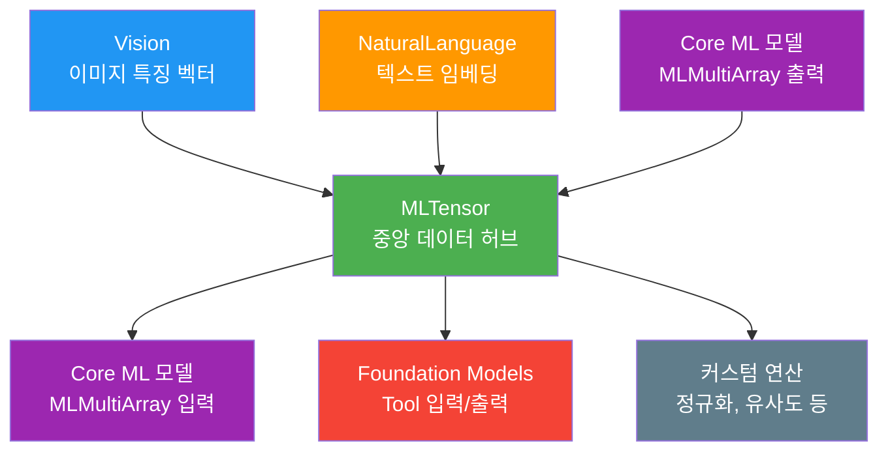
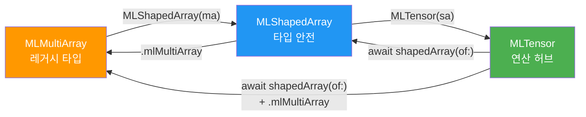
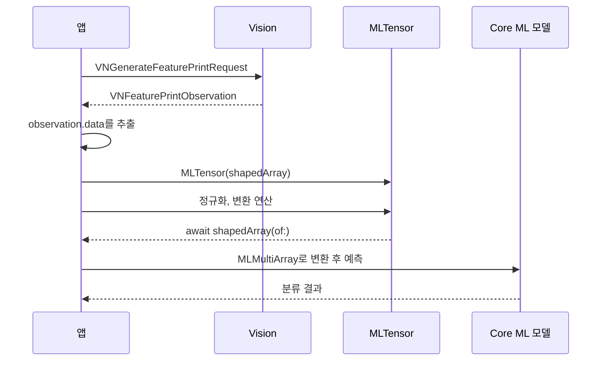
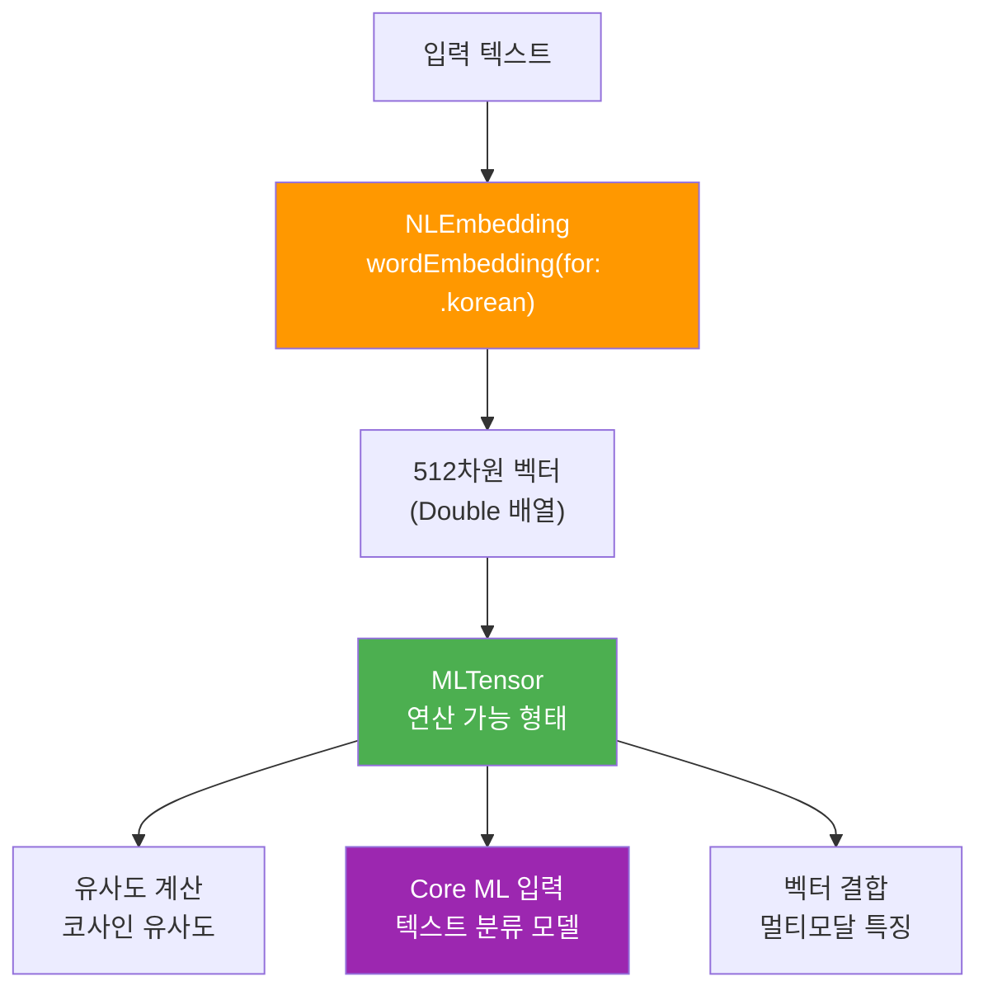

# MLTensor와 프레임워크 연동

> Apple의 MLTensor를 활용하여 Foundation Models, Core ML, Vision, NaturalLanguage 프레임워크 간 다차원 수치 데이터를 효율적으로 교환하는 멀티 프레임워크 파이프라인을 구축한다.

## 개요

이 섹션에서는 Apple이 제공하는 **MLTensor** 타입을 깊이 있게 다루고, 여러 ML 프레임워크 간 데이터를 매끄럽게 연결하는 방법을 학습합니다.

앞서 [LLM → ML 파이프라인 구성](17-ch17-foundation-models-core-ml-하이브리드/03-03-llm-ml-파이프라인-구성.md)에서는 `@Generable` 구조체를 접착제로 활용해 **문자열 기반** 데이터 변환을 다뤘는데요. 이번 섹션에서는 그 한계를 넘어 **수치 데이터(벡터, 행렬, 텐서)**를 프레임워크 간에 직접 교환하는 방법을 배웁니다.

**선수 지식**: [Core ML 모델을 Tool로 래핑하기](17-ch17-foundation-models-core-ml-하이브리드/02-02-core-ml-모델을-tool로-래핑하기.md)의 Tool 래핑 패턴, [이미지 분류 모델 활용](15-ch15-core-ml-기초/03-03-이미지-분류-모델-활용.md)의 Core ML 모델 예측 흐름

**학습 목표**:
- MLTensor의 핵심 개념(지연 실행, 비동기 디스패치)을 이해한다
- MLShapedArray ↔ MLTensor ↔ MLMultiArray 간 변환을 능숙하게 구사한다
- Vision과 NaturalLanguage 프레임워크의 출력을 MLTensor로 변환하여 후처리한다
- 멀티 프레임워크 파이프라인(Vision → MLTensor → Core ML → Foundation Models)을 구축한다

**주요 타입 및 API**:
- `ImageAnalysisPipeline` — Vision + Core ML + Foundation Models를 연결하는 통합 파이프라인
- `VisionFeatureStep` — Vision 특징 벡터를 MLTensor로 추출하는 파이프라인 스텝
- `NormalizationStep` — L2 정규화 텐서 연산 스텝
- `CoreMLClassificationStep` — MLTensor를 Core ML 모델 입력으로 변환하여 분류하는 스텝
- `TensorPipelineStep` — 텐서 기반 파이프라인의 단계 프로토콜
- `FeatureStatistics` — 특징 텐서의 통계(평균, 분산 등) 데이터 모델
- `ClassificationResult` — 분류 결과(라벨, 신뢰도) 데이터 모델
- `MLTensor.shapedArray(of:)` — 지연 실행된 연산을 실체화하여 결과를 추출
- `MLTensor.matmul()` — 행렬 곱셈 연산
- `MLTensor(concatenating:alongAxis:)` — 여러 텐서를 배치로 결합

## 왜 알아야 할까?

실전 AI 앱에서는 한 프레임워크만으로 모든 걸 해결하기 어렵습니다. 사진 앱을 예로 들어볼까요?

1. **Vision**으로 얼굴을 감지하고
2. **Core ML** 감정 분석 모델로 표정을 분류한 뒤
3. **Foundation Models**로 "이 사진에는 행복한 표정의 사람이 있어요"라고 자연어 설명을 생성

이 과정에서 Vision이 출력한 이미지 특징 벡터를 Core ML 모델에 넘기려면 어떻게 해야 할까요? 문자열로 바꿔서? 그건 마치 화가가 그림을 글로 설명하고, 다른 화가가 그 글을 읽고 다시 그리는 것과 같습니다. **데이터 손실과 성능 저하**가 불가피하죠.

**MLTensor**는 이 문제를 해결하는 **공용어**입니다. NumPy처럼 친숙한 API로 다차원 배열 연산을 수행하면서, Apple Silicon의 GPU와 Neural Engine을 자동으로 활용합니다. 프레임워크 간 데이터 변환의 접착제 역할을 하면서 동시에 고성능 수치 연산까지 제공하는 거죠.

## 핵심 개념

### 개념 1: MLTensor — ML 세계의 공용어

> 💡 **비유**: MLTensor는 국제 공항의 **환전소**와 같습니다. 각 나라(프레임워크)는 자국 화폐(데이터 형식)를 사용하지만, 환전소를 거치면 어떤 나라에서든 통용됩니다. MLShapedArray가 "미국 달러"라면, MLMultiArray는 "유로", Vision의 출력은 "일본 엔"이라고 할 수 있죠. MLTensor는 이 모든 통화를 실시간으로 환전해주는 중앙 허브입니다.

MLTensor는 Core ML 프레임워크에 포함된 **다차원 수치 배열** 타입입니다. WWDC 2024에서 처음 소개되었는데요, Python의 NumPy 배열과 매우 유사한 API를 제공합니다. Swift 개발자에게는 낯설 수 있지만, ML 분야에서는 텐서 연산이 기본 중의 기본이거든요.

> 📊 **그림 1**: MLTensor의 위치 — 프레임워크 간 데이터 교환 허브



MLTensor의 핵심 특징 세 가지를 살펴보겠습니다.

**1. 지연 실행(Lazy Evaluation)**

MLTensor의 연산은 즉시 실행되지 않습니다. `shapedArray(of:)` 또는 `cast(to:)`를 호출하는 순간까지 연산 그래프만 구성해두는데요, 이 덕분에 Apple Silicon이 최적의 실행 계획을 세울 수 있습니다:

```swift
import CoreML

// 텐서 생성
let tensor = MLTensor([1.0, 2.0, 3.0, 4.0])

// 여러 연산을 체이닝 — 아직 실행되지 않음!
let result = (tensor * 2.0 + 1.0).mean()

// shapedArray(of:)를 호출하는 순간 모든 연산이 한 번에 실행
let value = await result.shapedArray(of: Float.self)
```

**2. 비동기 디스패치**

모든 MLTensor 연산은 비동기적으로 CPU, GPU, Neural Engine에 분배됩니다. `await` 키워드로 결과를 기다리는 패턴이 Swift Concurrency와 자연스럽게 어울리죠.

**3. NumPy 스타일 API**

행렬 곱셈(`matmul`), 재구성(`reshaped`), 전치(`transposed`) 등 ML에서 자주 쓰는 연산을 기본 제공합니다.

```swift
import CoreML

// 2x3 행렬 생성
let matrix = MLTensor([[1.0, 2.0, 3.0],
                        [4.0, 5.0, 6.0]])

// 재구성: 2x3 → 3x2
let reshaped = matrix.reshaped(to: [3, 2])

// 행렬 곱셈: (2x3) × (3x2) = (2x2)
let product = matrix.matmul(reshaped)

// 결과 꺼내기
let output = await product.shapedArray(of: Float.self)
print("Shape: \(output.shape)") // [2, 2]
```

```output
Shape: [2, 2]
```

### 개념 2: 데이터 타입 간 변환 — 환전의 기술

> 💡 **비유**: 여행 중 환전할 때 수수료와 환율을 따져야 하듯, ML 데이터 변환에서도 **복사 비용**과 **타입 호환성**을 고려해야 합니다. "제로 카피(zero-copy)"는 수수료 없는 환전이고, "데이터 복사"는 수수료를 내는 환전입니다.

Apple ML 생태계에는 세 가지 주요 다차원 배열 타입이 있습니다:

| 타입 | 소속 | 용도 | 특징 |
|------|------|------|------|
| `MLMultiArray` | Core ML (레거시) | 모델 입출력 | Objective-C 호환, 기존 코드 |
| `MLShapedArray` | Core ML (모던) | 타입 안전 모델 입출력 | Swift 제네릭, 타입 안전 |
| `MLTensor` | Core ML (최신) | 수치 연산 + 프레임워크 간 교환 | 지연 실행, GPU/ANE 활용 |

> 📊 **그림 2**: 세 가지 배열 타입 간 변환 흐름



변환 코드를 살펴보겠습니다:

```swift
import CoreML

// === 1. MLMultiArray → MLShapedArray → MLTensor ===

// Core ML 모델 출력 (MLMultiArray)
let multiArray = try MLMultiArray(shape: [1, 512], dataType: .float32)

// MLShapedArray로 변환 (타입 안전)
let shapedArray = MLShapedArray<Float>(multiArray)

// MLTensor로 변환 (연산 가능)
let tensor = MLTensor(shapedArray)


// === 2. MLTensor → MLShapedArray → MLMultiArray ===

// 텐서 연산 수행
let normalized = tensor / tensor.sum()

// MLShapedArray로 변환 (비동기 — 이 시점에 실제 연산 실행)
let resultArray = await normalized.shapedArray(of: Float.self)

// MLMultiArray로 변환 (Core ML 모델 입력용)
let resultMultiArray = resultArray.mlMultiArray
```

> ⚠️ **흔한 오해**: "MLTensor를 만들면 데이터가 바로 복사되는 거 아닌가요?" — 아닙니다! `MLTensor(shapedArray)`는 가능한 한 **제로 카피**로 동작합니다. 실제 데이터 이동은 연산 실행 시점(materialization)까지 지연됩니다. 불필요한 중간 복사를 걱정할 필요가 없어요.

### 개념 3: Vision 프레임워크와 MLTensor 연동

> 💡 **비유**: Vision 프레임워크는 사진관의 **자동 촬영 시스템**과 같습니다. 사진(이미지)을 넣으면 특징 벡터라는 "디지털 지문"을 뽑아내죠. 이 지문을 MLTensor로 변환하면, 다른 프레임워크에서 유사도 비교, 분류 등 다양한 분석을 할 수 있습니다.

Vision 프레임워크의 `VNFeaturePrintObservation`은 이미지의 특징을 **수치 벡터**로 추출합니다. 이 벡터를 MLTensor로 변환하면 Core ML 모델의 입력으로 바로 사용하거나, 이미지 간 유사도를 계산할 수 있죠.

> 📊 **그림 3**: Vision → MLTensor → Core ML 파이프라인



```swift
import Vision
import CoreML

/// Vision의 이미지 특징 벡터를 MLTensor로 변환하는 함수
func extractFeatureTensor(from image: CGImage) async throws -> MLTensor {
    // 1. Vision 요청 생성
    let request = VNGenerateFeaturePrintRequest()
    
    // 2. 요청 실행
    let handler = VNImageRequestHandler(cgImage: image)
    try handler.perform([request])
    
    // 3. 결과에서 특징 벡터 추출
    guard let observation = request.results?.first
            as? VNFeaturePrintObservation else {
        throw FeatureExtractionError.noResults
    }
    
    // 4. 바이트 데이터를 Float 배열로 변환
    let elementCount = observation.elementCount
    let data = observation.data
    let floatArray = data.withUnsafeBytes { buffer in
        Array(buffer.bindMemory(to: Float.self).prefix(elementCount))
    }
    
    // 5. MLTensor로 변환 (1 x elementCount 형태)
    let shapedArray = MLShapedArray<Float>(
        scalars: floatArray,
        shape: [1, elementCount]
    )
    return MLTensor(shapedArray)
}

enum FeatureExtractionError: Error {
    case noResults
}
```

이렇게 추출한 특징 텐서로 이미지 유사도를 계산할 수 있습니다:

```run:swift
// 코사인 유사도 계산 (MLTensor 활용)
func cosineSimilarity(_ a: MLTensor, _ b: MLTensor) async -> Float {
    // 내적 계산
    let dotProduct = (a * b).sum()
    
    // L2 노름 계산
    let normA = (a * a).sum().squareRoot()
    let normB = (b * b).sum().squareRoot()
    
    // 코사인 유사도 = dot(a,b) / (||a|| * ||b||)
    let similarity = dotProduct / (normA * normB)
    
    let result = await similarity.shapedArray(of: Float.self)
    return result.scalars[0]
}

// 사용 예시 (시뮬레이션)
let featureA = MLTensor(MLShapedArray<Float>(
    scalars: [0.5, 0.3, 0.8, 0.1],
    shape: [1, 4]
))
let featureB = MLTensor(MLShapedArray<Float>(
    scalars: [0.4, 0.35, 0.75, 0.15],
    shape: [1, 4]
))

let similarity = await cosineSimilarity(featureA, featureB)
print("이미지 유사도: \(String(format: "%.4f", similarity))")
```

```output
이미지 유사도: 0.9962
```

### 개념 4: NaturalLanguage 프레임워크와 MLTensor 연동

> 💡 **비유**: NaturalLanguage 프레임워크의 임베딩은 **단어 사전**보다 **단어 지도**에 가깝습니다. 사전은 단어의 뜻을 텍스트로 설명하지만, 지도는 의미가 비슷한 단어들을 **가까운 위치**에 배치합니다. "고양이"와 "강아지"는 가까이, "고양이"와 "우주선"은 멀리 있죠. 이 "위치 정보"가 바로 임베딩 벡터이고, MLTensor로 변환하면 수학적 연산을 적용할 수 있습니다.

NaturalLanguage 프레임워크의 `NLEmbedding`은 단어나 문장을 **512차원 벡터**로 변환합니다. 이 벡터를 MLTensor로 가져오면 Core ML 모델의 텍스트 입력으로 활용하거나, Foundation Models의 Tool에서 의미 유사도를 계산하는 데 사용할 수 있습니다.

> 📊 **그림 4**: NaturalLanguage → MLTensor 변환과 활용



```swift
import NaturalLanguage
import CoreML

/// 텍스트를 MLTensor 임베딩 벡터로 변환
func textToTensor(_ text: String, language: NLLanguage = .korean) -> MLTensor? {
    // 1. 단어 임베딩 로드
    guard let embedding = NLEmbedding.wordEmbedding(for: language) else {
        return nil
    }
    
    // 2. 벡터 추출 (512차원 Double 배열)
    guard let vector = embedding.vector(for: text) else {
        return nil
    }
    
    // 3. Double → Float 변환 후 MLTensor 생성
    let floatVector = vector.map { Float($0) }
    let shapedArray = MLShapedArray<Float>(
        scalars: floatVector,
        shape: [1, floatVector.count]
    )
    
    return MLTensor(shapedArray)
}

/// 여러 단어의 임베딩을 배치로 결합
func batchEmbeddings(words: [String], 
                     language: NLLanguage = .korean) -> MLTensor? {
    let tensors = words.compactMap { textToTensor($0, language: language) }
    guard !tensors.isEmpty else { return nil }
    
    // 여러 벡터를 하나의 배치 텐서로 결합 (N x 512)
    return MLTensor(
        concatenating: tensors,
        alongAxis: 0
    )
}
```

### 개념 5: 멀티 프레임워크 파이프라인 설계

> 💡 **비유**: 멀티 프레임워크 파이프라인은 **자동차 조립 라인**과 같습니다. 각 스테이션(프레임워크)은 자기 전문 분야만 처리하고, 컨베이어 벨트(MLTensor)가 부품(데이터)을 다음 스테이션으로 운반합니다. 엔진 조립(Vision)이 끝나면 벨트가 차체 용접(Core ML)으로, 다시 도장(Foundation Models)으로 이동하는 식이죠.

이전 세션에서 배운 [LLM → ML 파이프라인 구성](17-ch17-foundation-models-core-ml-하이브리드/03-03-llm-ml-파이프라인-구성.md)의 `PipelineStep` 프로토콜을 **MLTensor 기반**으로 확장합니다. 핵심 차이는 단계 간 데이터가 문자열이 아닌 **텐서**로 전달된다는 것입니다.

> 📊 **그림 5**: 멀티 프레임워크 파이프라인 전체 아키텍처


```swift
import CoreML
import Vision
import FoundationModels

// MARK: - 텐서 기반 파이프라인 스텝 프로토콜

/// 텐서를 입출력으로 사용하는 파이프라인 단계
protocol TensorPipelineStep {
    associatedtype Input
    associatedtype Output
    
    var name: String { get }
    func process(_ input: Input) async throws -> Output
}

// MARK: - Step 1: Vision 특징 추출 스텝

struct VisionFeatureStep: TensorPipelineStep {
    let name = "Vision 특징 추출"
    
    func process(_ input: CGImage) async throws -> MLTensor {
        // Vision으로 특징 벡터 추출 → MLTensor로 변환
        let request = VNGenerateFeaturePrintRequest()
        let handler = VNImageRequestHandler(cgImage: input)
        try handler.perform([request])
        
        guard let observation = request.results?.first
                as? VNFeaturePrintObservation else {
            throw PipelineError.featureExtractionFailed
        }
        
        let count = observation.elementCount
        let floats = observation.data.withUnsafeBytes { buffer in
            Array(buffer.bindMemory(to: Float.self).prefix(count))
        }
        
        return MLTensor(MLShapedArray<Float>(
            scalars: floats, shape: [1, count]
        ))
    }
}

// MARK: - Step 2: 텐서 정규화 스텝

struct NormalizationStep: TensorPipelineStep {
    let name = "L2 정규화"
    
    func process(_ input: MLTensor) async throws -> MLTensor {
        // L2 정규화: vector / ||vector||
        let norm = (input * input).sum().squareRoot()
        return input / norm
    }
}

// MARK: - Step 3: Core ML 분류 스텝

struct CoreMLClassificationStep: TensorPipelineStep {
    let name = "Core ML 분류"
    let model: MLModel
    
    func process(_ input: MLTensor) async throws -> ClassificationResult {
        // MLTensor → MLShapedArray → MLMultiArray (모델 입력 형식)
        let shapedArray = await input.shapedArray(of: Float.self)
        let multiArray = shapedArray.mlMultiArray
        
        // Core ML 예측
        let inputFeatures = try MLDictionaryFeatureProvider(
            dictionary: ["features": MLFeatureValue(multiArray: multiArray)]
        )
        let prediction = try model.prediction(from: inputFeatures)
        
        // 결과 파싱
        let label = prediction.featureValue(for: "label")?.stringValue ?? "unknown"
        let confidence = prediction.featureValue(for: "confidence")?.doubleValue ?? 0.0
        
        return ClassificationResult(label: label, confidence: confidence)
    }
}

// MARK: - 데이터 모델

struct ClassificationResult {
    let label: String
    let confidence: Double
}

enum PipelineError: Error {
    case featureExtractionFailed
    case classificationFailed
    case modelNotAvailable
}
```

## 실습: 직접 해보기

실제로 Vision, MLTensor, Core ML, Foundation Models를 모두 연결하는 **스마트 이미지 분석 파이프라인**을 구축해보겠습니다. 이 파이프라인은 이미지를 받아 특징을 추출하고, 유사도를 비교한 뒤, Foundation Models로 자연어 설명을 생성합니다.

```swift
import CoreML
import Vision
import FoundationModels

// MARK: - 이미지 분석 파이프라인

final class ImageAnalysisPipeline {
    
    // MARK: - 텐서 유틸리티
    
    /// 이미지에서 특징 텐서를 추출
    func extractFeatures(from image: CGImage) async throws -> MLTensor {
        let request = VNGenerateFeaturePrintRequest()
        let handler = VNImageRequestHandler(cgImage: image)
        try handler.perform([request])
        
        guard let observation = request.results?.first
                as? VNFeaturePrintObservation else {
            throw PipelineError.featureExtractionFailed
        }
        
        // Vision 결과 → Float 배열 → MLTensor
        let count = observation.elementCount
        let floats = observation.data.withUnsafeBytes { buffer in
            Array(buffer.bindMemory(to: Float.self).prefix(count))
        }
        
        return MLTensor(MLShapedArray<Float>(
            scalars: floats, shape: [1, count]
        ))
    }
    
    /// 두 이미지 특징 텐서의 유사도 계산
    func computeSimilarity(_ a: MLTensor, _ b: MLTensor) async -> Float {
        let dotProduct = (a * b).sum()
        let normA = (a * a).sum().squareRoot()
        let normB = (b * b).sum().squareRoot()
        let similarity = dotProduct / (normA * normB)
        
        let result = await similarity.shapedArray(of: Float.self)
        return result.scalars[0]
    }
    
    /// 특징 텐서에서 통계 정보를 추출
    func computeStatistics(_ tensor: MLTensor) async -> FeatureStatistics {
        let mean = await tensor.mean().shapedArray(of: Float.self).scalars[0]
        let maxVal = await tensor.max().shapedArray(of: Float.self).scalars[0]
        let minVal = await tensor.min().shapedArray(of: Float.self).scalars[0]
        
        // 분산 계산: E[(x - mean)^2]
        let centered = tensor - MLTensor(mean)
        let variance = await (centered * centered).mean()
            .shapedArray(of: Float.self).scalars[0]
        
        return FeatureStatistics(
            mean: mean,
            max: maxVal,
            min: minVal,
            variance: variance
        )
    }
    
    /// Foundation Models로 분석 결과를 자연어 설명으로 변환
    func generateDescription(
        classification: String,
        confidence: Double,
        statistics: FeatureStatistics
    ) async throws -> String {
        let session = LanguageModelSession()
        
        let prompt = """
        다음 이미지 분석 결과를 사용자 친화적인 한국어 설명으로 변환해주세요:
        - 분류: \(classification) (신뢰도: \(String(format: "%.1f%%", confidence * 100)))
        - 특징 벡터 통계: 평균=\(statistics.mean), 분산=\(statistics.variance)
        간결하게 2-3문장으로 설명해주세요.
        """
        
        let response = try await session.respond(to: prompt)
        return response.content
    }
}

// MARK: - 지원 타입

struct FeatureStatistics {
    let mean: Float
    let max: Float
    let min: Float
    let variance: Float
}

// MARK: - 전체 파이프라인 실행

func runAnalysisPipeline() async throws {
    let pipeline = ImageAnalysisPipeline()
    
    // 1. 이미지 특징 추출 (Vision → MLTensor)
    // let image: CGImage = ... // 실제 이미지 로드
    // let features = try await pipeline.extractFeatures(from: image)
    
    // 시뮬레이션: 128차원 특징 벡터
    let features = MLTensor(MLShapedArray<Float>(
        scalars: (0..<128).map { _ in Float.random(in: -1...1) },
        shape: [1, 128]
    ))
    
    // 2. 텐서 연산으로 통계 계산 (MLTensor)
    let stats = await pipeline.computeStatistics(features)
    print("특징 벡터 통계:")
    print("  평균: \(String(format: "%.4f", stats.mean))")
    print("  분산: \(String(format: "%.4f", stats.variance))")
    
    // 3. Foundation Models로 자연어 설명 생성
    let description = try await pipeline.generateDescription(
        classification: "풍경 사진",
        confidence: 0.92,
        statistics: stats
    )
    print("\n분석 결과: \(description)")
}
```

**MLTensor로 배치 연산 수행하기** — 여러 이미지의 특징 벡터를 한 번에 처리하는 패턴입니다:

```swift
/// 배치 이미지의 특징 벡터를 한 번에 처리
func batchProcess(featureTensors: [MLTensor]) async -> [Int] {
    // N개의 1×D 텐서를 N×D 배치 텐서로 결합
    let batch = MLTensor(concatenating: featureTensors, alongAxis: 0)
    
    // 배치 정규화 (각 행을 L2 정규화)
    let norms = (batch * batch).sum(alongAxes: 1).squareRoot()
    let normalized = batch / norms
    
    // 유사도 행렬 계산: N×N (한 번의 matmul로 모든 쌍의 유사도 계산)
    let transposed = normalized.transposed(permutation: 1, 0)
    let similarityMatrix = normalized.matmul(transposed)
    
    // 가장 유사한 이미지 쌍 찾기
    let matrixValues = await similarityMatrix.shapedArray(of: Float.self)
    let n = featureTensors.count
    
    // 각 이미지에 대해 가장 유사한 다른 이미지의 인덱스
    var mostSimilar: [Int] = []
    for i in 0..<n {
        var bestIdx = 0
        var bestSim: Float = -1.0
        for j in 0..<n where j != i {
            let sim = matrixValues[scalarAt: i, j]
            if sim > bestSim {
                bestSim = sim
                bestIdx = j
            }
        }
        mostSimilar.append(bestIdx)
    }
    
    return mostSimilar
}
```

## 더 깊이 알아보기

### 텐서의 탄생 — 수학에서 머신러닝까지

"텐서(Tensor)"라는 이름은 라틴어 "tensio(장력)"에서 유래했습니다. 19세기 수학자 **볼데마르 보이트(Woldemar Voigt)**가 1898년 결정학 논문에서 처음 사용한 이 용어는 원래 물리적 "응력"을 다차원으로 표현하기 위한 수학적 도구였습니다.

그런데 놀랍게도, 이 순수 수학 개념이 100년 후 AI 혁명의 핵심 데이터 구조가 될 줄은 아무도 몰랐습니다. Google이 2015년 자사 ML 프레임워크의 이름을 "TensorFlow"로 지은 것도 "텐서가 계산 그래프를 따라 흐른다(flow)"는 의미였죠.

Apple의 MLTensor는 이 계보를 잇되, Apple Silicon의 통합 메모리 아키텍처를 최대한 활용하도록 설계되었습니다. CPU, GPU, Neural Engine이 **같은 메모리**를 공유하기 때문에, 데이터 복사 없이 연산 장치를 바꿀 수 있는 것이 다른 텐서 라이브러리와의 결정적 차이입니다.

### MLTensor의 WWDC 데뷔

MLTensor는 WWDC 2024의 세션 "Deploy machine learning and AI models on-device with Core ML"에서 처음 공개되었습니다. Apple 엔지니어가 Stable Diffusion XL의 디코딩 파이프라인을 예로 들며, 기존의 수십 줄 Accelerate/vDSP 코드를 **단 3줄의 MLTensor 코드**로 대체하는 장면이 가장 큰 박수를 받았습니다. NumPy에 익숙한 ML 연구자들이 Swift로 넘어오는 진입 장벽을 크게 낮춘 순간이었죠.

## 흔한 오해와 팁

> ⚠️ **흔한 오해**: "MLTensor는 GPU에서만 실행된다" — 사실이 아닙니다! MLTensor는 Apple Silicon의 **최적 컴퓨트 유닛을 자동 선택**합니다. 작은 텐서는 CPU에서, 대규모 행렬 연산은 GPU에서, ML 추론은 Neural Engine에서 실행될 수 있습니다. 개발자가 디바이스를 지정할 필요가 없습니다.

> 💡 **알고 계셨나요?**: MLTensor의 `shapedArray(of:)` 호출이 **동기화 포인트(materialization point)**라는 사실이 핵심입니다. 여러 연산을 체이닝한 뒤 한 번만 `shapedArray(of:)`를 호출하면, Apple Silicon이 전체 연산 그래프를 최적화하여 실행합니다. 반대로 매 연산마다 결과를 꺼내면 최적화 기회를 잃게 됩니다. "가능한 한 늦게 꺼내라(late materialization)"가 MLTensor 성능의 핵심 원칙입니다.

> 🔥 **실무 팁**: Foundation Models의 Tool에서 Core ML 모델을 호출할 때, Tool의 `call()` 메서드 안에서 MLTensor 연산을 최소화하세요. Tool 호출은 LLM의 추론 루프 안에서 동기적으로 대기하기 때문에, 무거운 텐서 연산은 **미리 계산해두고 캐싱**하는 것이 사용자 체감 응답 속도를 크게 향상시킵니다. [Core ML 모델을 Tool로 래핑하기](17-ch17-foundation-models-core-ml-하이브리드/02-02-core-ml-모델을-tool로-래핑하기.md)의 간접 참조 패턴과 결합하면 효과적입니다.

## 핵심 정리

| 개념 | 설명 |
|------|------|
| MLTensor | Core ML의 다차원 수치 배열. 지연 실행과 Apple Silicon 자동 디스패치 지원 |
| 지연 실행(Lazy Evaluation) | 연산은 `shapedArray(of:)` 호출 시점까지 실제 실행되지 않음 |
| MLMultiArray → MLTensor | `MLShapedArray(multiArray)` → `MLTensor(shapedArray)` 순서로 변환 |
| MLTensor → MLMultiArray | `await tensor.shapedArray(of:)` → `.mlMultiArray`로 역변환 |
| Vision 연동 | `VNFeaturePrintObservation.data`를 Float 배열로 추출 후 MLTensor 생성 |
| NaturalLanguage 연동 | `NLEmbedding.vector(for:)`의 Double 배열을 MLTensor로 변환 |
| 멀티 프레임워크 파이프라인 | Vision → MLTensor(정규화) → Core ML → Foundation Models 체인 |
| Late Materialization | 가능한 한 연산을 체이닝하고 마지막에 한 번만 결과를 추출하는 성능 원칙 |

## 다음 섹션 미리보기

이번 섹션에서 배운 MLTensor 기반 프레임워크 연동 기술을 총동원하여, 다음 섹션 [실습: 스마트 사진 분석 앱](17-ch17-foundation-models-core-ml-하이브리드/05-05-실습-스마트-사진-분석-앱.md)에서는 **완전한 앱**을 구축합니다. 사용자가 사진을 선택하면 Vision으로 특징을 추출하고, Core ML 모델로 분류한 뒤, Foundation Models가 자연어 설명과 태그를 생성하는 — 하이브리드 아키텍처의 모든 패턴이 하나의 앱에 녹아드는 최종 프로젝트입니다.

## 참고 자료

- [MLTensor — Apple Developer Documentation](https://developer.apple.com/documentation/coreml/mltensor) - MLTensor의 전체 API 레퍼런스. 지원 연산, 타입, 초기화 방법을 확인할 수 있습니다
- [Deploy machine learning and AI models on-device with Core ML — WWDC24](https://developer.apple.com/videos/play/wwdc2024/10161/) - MLTensor가 처음 소개된 세션. Stable Diffusion XL에서의 활용 사례와 MLTensor vs 저수준 API 비교 데모를 볼 수 있습니다
- [Discover machine learning & AI frameworks on Apple platforms — WWDC25](https://developer.apple.com/videos/play/wwdc2025/360/) - 2025년 기준 Apple ML 프레임워크 전체 생태계 맵. Vision, NaturalLanguage, Core ML, Foundation Models의 역할 분담과 통합 전략을 설명합니다
- [Core ML Overview — Apple Developer](https://developer.apple.com/machine-learning/core-ml/) - Core ML의 최신 기능과 MLTensor를 포함한 데이터 타입 생태계 개요
- [Foundation Models — Apple Developer Documentation](https://developer.apple.com/documentation/foundationmodels) - Foundation Models 프레임워크 공식 문서. Tool 프로토콜과의 연동 패턴을 참고할 수 있습니다

---
### 🔗 Related Sessions
- [tool wrapping 패턴](17-ch17-foundation-models-core-ml-하이브리드/01-01-하이브리드-아키텍처-설계-전략.md) (prerequisite)
- [pipelinestep 프로토콜](17-ch17-foundation-models-core-ml-하이브리드/03-03-llm-ml-파이프라인-구성.md) (prerequisite)
- [간접 참조 패턴](17-ch17-foundation-models-core-ml-하이브리드/02-02-core-ml-모델을-tool로-래핑하기.md) (prerequisite)
