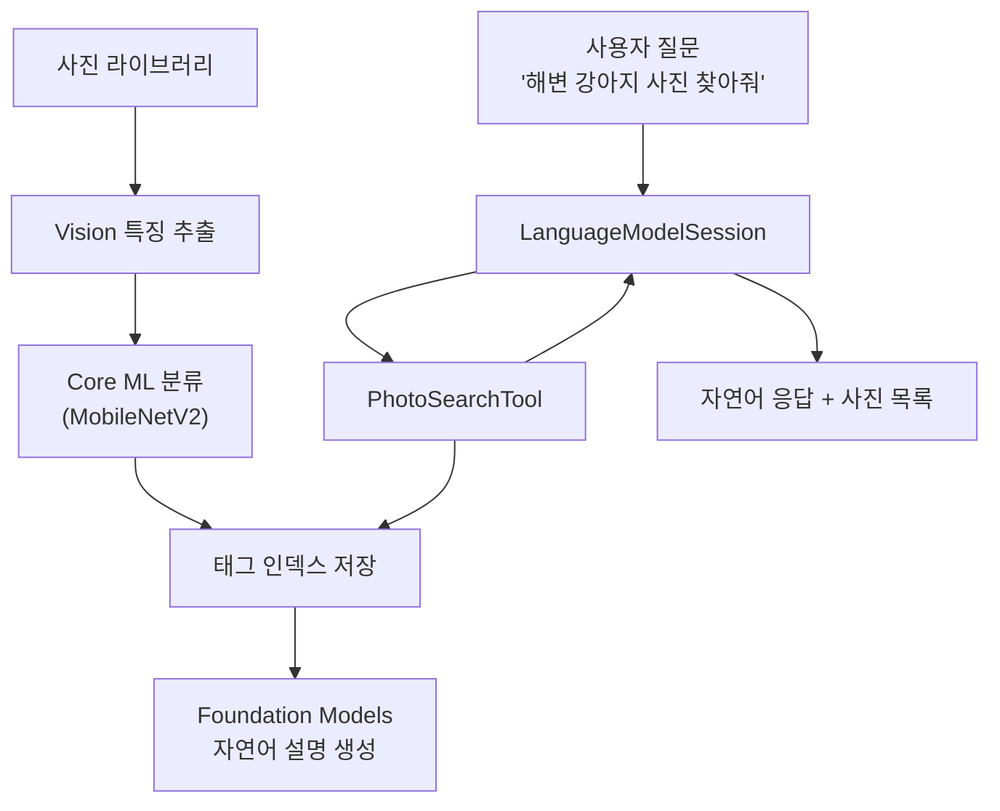
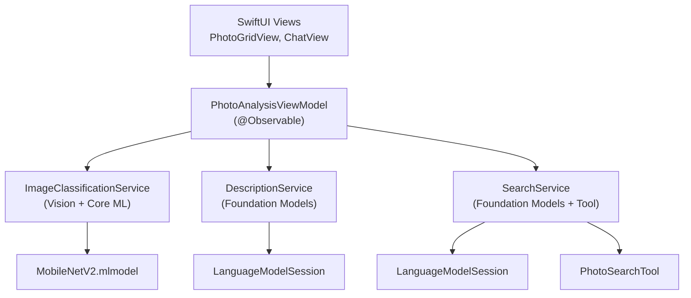
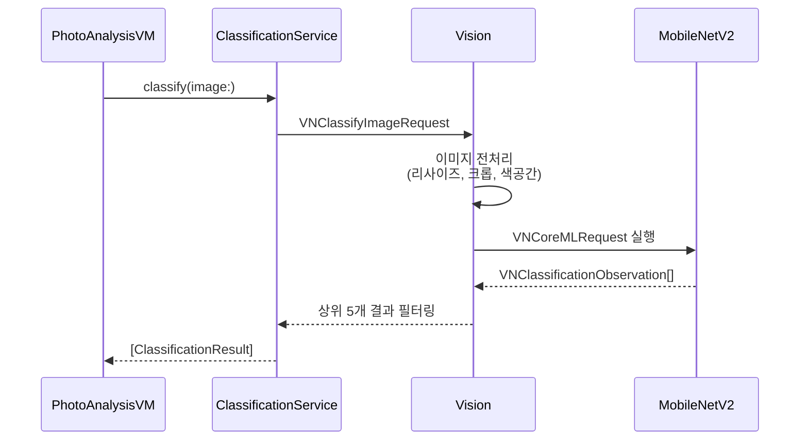
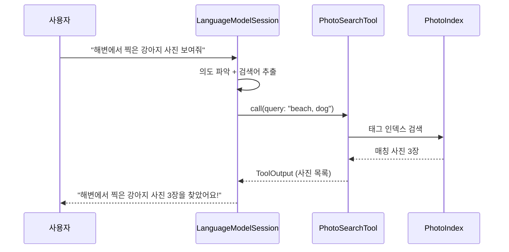
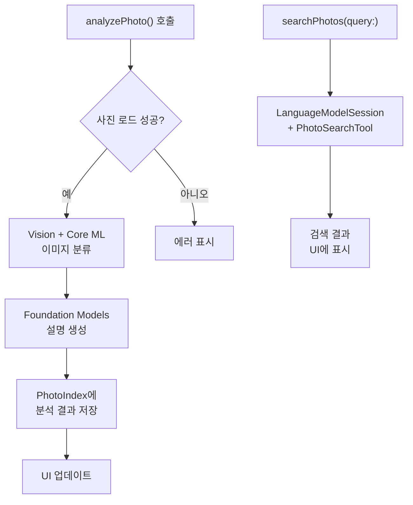

# 실습: 스마트 사진 분석 앱

> Core ML 이미지 분류와 Foundation Models 자연어 생성을 결합하여, 사진을 자동 태깅하고 대화형으로 검색하는 스마트 사진 분석 앱을 만듭니다.

## 개요

이 섹션에서는 Ch17 전체에서 배운 하이브리드 아키텍처 패턴을 하나의 완성된 SwiftUI 앱으로 통합합니다. Vision 프레임워크로 사진의 특징을 추출하고, Core ML 모델(MobileNetV2)로 객체를 분류한 뒤, Foundation Models가 자연어로 사진을 설명하고 대화형 검색을 지원하는 — 말 그대로 "AI가 사진을 이해하는" 앱을 구축합니다.

**선수 지식**:
- [하이브리드 아키텍처 설계 전략](17-ch17-foundation-models-core-ml-하이브리드/01-01-하이브리드-아키텍처-설계-전략.md)의 3가지 설계 패턴
- [Core ML 모델을 Tool로 래핑하기](17-ch17-foundation-models-core-ml-하이브리드/02-02-core-ml-모델을-tool로-래핑하기.md)의 Tool Wrapping 구현법
- [LLM → ML 파이프라인 구성](17-ch17-foundation-models-core-ml-하이브리드/03-03-llm-ml-파이프라인-구성.md)의 양방향 파이프라인 패턴
- [MLTensor와 프레임워크 연동](17-ch17-foundation-models-core-ml-하이브리드/04-04-mltensor와-프레임워크-연동.md)의 텐서 기반 데이터 교환

**학습 목표**:
- Vision + Core ML + Foundation Models를 하나의 SwiftUI 앱에 통합한다
- Core ML 이미지 분류 결과를 Foundation Models의 Tool로 연결한다
- 자동 태깅 파이프라인과 대화형 사진 검색을 구현한다

## 왜 알아야 할까?

여러분의 사진 앨범을 떠올려보세요. 수천 장의 사진 중에서 "지난여름 해변에서 찍은 강아지 사진"을 찾으려면 어떻게 해야 할까요? 날짜와 위치 정보만으로는 한계가 있죠. 만약 앱이 사진 속 객체를 인식하고("해변", "강아지"), 자연어로 설명을 생성하며("모래사장 위에서 뛰어노는 갈색 강아지"), 사용자의 자연어 질문에 답할 수 있다면 — 이것이 바로 하이브리드 AI의 진가입니다.

Apple의 Photos 앱도 비슷한 원리로 동작하는데요, 온디바이스 ML 모델이 사진을 분류하고 인덱싱하면, 자연어 검색 엔진이 "해변 강아지"라는 질의를 매칭합니다. 이 섹션에서 우리는 이런 시스템의 핵심을 직접 구축하면서, Ch17에서 배운 모든 패턴을 실전에 적용합니다.

> 📊 **그림 1**: 스마트 사진 분석 앱의 전체 아키텍처



## 핵심 개념

### 개념 1: 앱 아키텍처 — MVVM + AI 서비스 계층

> 💡 **비유**: 레스토랑을 생각해보세요. 홀(SwiftUI View)에서 주문을 받으면 매니저(ViewModel)가 주방(AI Service)에 전달합니다. 주방에는 여러 요리사(Vision, Core ML, Foundation Models)가 각자 전문 분야를 담당하고, 매니저가 요리 순서를 조율합니다. 이것이 MVVM + AI 서비스 계층의 역할 분담이에요.

스마트 사진 분석 앱의 핵심은 각 AI 프레임워크를 서비스 계층으로 추상화하고, ViewModel이 이를 오케스트레이션하는 구조입니다. 즉, ViewModel은 직접 ML 추론이나 LLM 호출을 하지 않고, 각 서비스에 작업을 위임하고 결과를 조합하는 **지휘자 역할**만 합니다. [하이브리드 아키텍처 설계 전략](17-ch17-foundation-models-core-ml-하이브리드/01-01-하이브리드-아키텍처-설계-전략.md)에서 배운 패턴을 실제 앱 구조에 적용해 봅시다.

> 📊 **그림 2**: MVVM + AI 서비스 계층 구조



프로토콜 기반으로 서비스를 추상화하면 테스트가 쉬워지고, 나중에 모델을 교체하기도 편합니다:

```swift
import Foundation
import CoreImage

// MARK: - 서비스 프로토콜 정의

/// 이미지 분류 결과를 담는 구조체
struct ClassificationResult: Sendable {
    let label: String        // 분류 라벨 (예: "golden retriever")
    let confidence: Float    // 신뢰도 (0.0 ~ 1.0)
}

/// 사진 분석 결과를 담는 구조체
struct PhotoAnalysis: Identifiable, Sendable {
    let id: UUID
    let photoID: String
    let tags: [ClassificationResult]     // Core ML 분류 태그들
    let description: String              // LLM 생성 자연어 설명
    let analyzedAt: Date
}

/// 이미지 분류 서비스 프로토콜
protocol ImageClassificationServiceProtocol: Sendable {
    func classify(image: CIImage) async throws -> [ClassificationResult]
}

/// 자연어 설명 생성 서비스 프로토콜
protocol DescriptionServiceProtocol: Sendable {
    func generateDescription(tags: [ClassificationResult]) async throws -> String
}

/// 사진 검색 서비스 프로토콜
protocol SearchServiceProtocol {
    func search(query: String) async throws -> SearchResponse
}
```

이 구조의 핵심은 **관심사 분리(Separation of Concerns)**인데요, Core ML 분류 로직은 `ImageClassificationService`에, LLM 호출은 `DescriptionService`에, 검색은 `SearchService`에 캡슐화됩니다. ViewModel은 이 서비스들을 조합만 합니다.

### 개념 2: Core ML 이미지 분류 서비스 — Vision + MobileNetV2

> 💡 **비유**: 와인 소믈리에가 와인을 감별하는 과정을 떠올려보세요. 먼저 와인잔에 따라 색과 점도를 관찰(Vision 전처리)하고, 향을 맡고 맛을 보며 품종을 판별(Core ML 분류)합니다. 마찬가지로, Vision이 이미지를 정규화하고 Core ML이 객체를 분류하는 2단계 파이프라인입니다.

[이미지 분류 모델 활용](15-ch15-core-ml-기초/03-03-이미지-분류-모델-활용.md)에서 배운 Vision + Core ML 패턴을 서비스 클래스로 래핑합니다. Apple이 제공하는 MobileNetV2 모델은 1000개 카테고리를 분류하는데, 온디바이스에서 약 30ms 이내로 추론됩니다.

> 📊 **그림 3**: Vision + Core ML 이미지 분류 파이프라인



```swift
import Vision
import CoreML
import CoreImage

/// Vision + Core ML 기반 이미지 분류 서비스
final class ImageClassificationService: ImageClassificationServiceProtocol {
    private let model: VNCoreMLModel
    
    init() throws {
        // MobileNetV2 모델 로드
        let config = MLModelConfiguration()
        config.computeUnits = .all  // ANE + GPU + CPU 자동 선택
        
        let coreMLModel = try MobileNetV2(configuration: config).model
        self.model = try VNCoreMLModel(for: coreMLModel)
    }
    
    func classify(image: CIImage) async throws -> [ClassificationResult] {
        // Ch15에서 다룬 것처럼 withCheckedThrowingContinuation으로
        // 콜백 기반 Vision API를 async/await으로 브릿징합니다.
        // 자세한 패턴은 [이미지 분류 모델 활용](15-ch15-core-ml-기초/03-03-이미지-분류-모델-활용.md)을 참고하세요.
        try await withCheckedThrowingContinuation { continuation in
            let request = VNCoreMLRequest(model: model) { request, error in
                if let error {
                    continuation.resume(throwing: error)
                    return
                }
                
                // VNClassificationObservation에서 상위 5개 추출
                guard let observations = request.results 
                    as? [VNClassificationObservation] else {
                    continuation.resume(returning: [])
                    return
                }
                
                let results = observations
                    .prefix(5)                          // 상위 5개만
                    .filter { $0.confidence > 0.1 }     // 신뢰도 10% 이상
                    .map { ClassificationResult(
                        label: $0.identifier,
                        confidence: $0.confidence
                    )}
                
                continuation.resume(returning: results)
            }
            
            // Vision이 자동으로 이미지 크기/색공간 조정
            request.imageCropAndScaleOption = .centerCrop
            
            let handler = VNImageRequestHandler(ciImage: image)
            do {
                try handler.perform([request])
            } catch {
                continuation.resume(throwing: error)
            }
        }
    }
}
```

왜 Vision을 거쳐야 할까요? Core ML 모델에 직접 `CVPixelBuffer`를 넘길 수도 있지만, Vision이 자동으로 이미지 리사이즈, 크롭, 색공간 변환을 처리해 줍니다. 모델이 학습할 때 224×224 RGB 이미지로 학습했더라도, 개발자는 원본 이미지를 그냥 넘기면 되는 거죠.

### 개념 3: Foundation Models 자연어 설명 — 태그를 문장으로

> 💡 **비유**: 미술관 도슨트를 생각해보세요. 그림에 "유화, 풍경, 일몰, 바다"라는 태그가 붙어 있다면, 도슨트는 이 키워드들을 조합해서 "노을이 물드는 바다 위로 따뜻한 빛이 퍼지는 풍경화입니다"라고 설명합니다. Foundation Models가 바로 이 도슨트 역할이에요.

Core ML이 "golden_retriever, beach, ocean, sand"라는 태그를 출력하면, 이 건조한 라벨을 자연스러운 한국어 문장으로 바꿔야 사용자가 이해하기 쉽겠죠. 이것이 [LLM → ML 파이프라인 구성](17-ch17-foundation-models-core-ml-하이브리드/03-03-llm-ml-파이프라인-구성.md)에서 배운 **ML→LLM 방향 파이프라인**의 실전 적용입니다.

```swift
import FoundationModels

/// @Generable 구조체로 사진 설명 출력을 구조화
@Generable
struct PhotoDescription {
    @Guide(description: "사진의 주요 장면을 자연스러운 한국어로 설명하는 1~2문장")
    var scene: String
    
    @Guide(description: "사진의 감정이나 분위기를 나타내는 단어 3개")
    var mood: [String]
    
    @Guide(description: "검색에 활용할 한국어 태그 5개")
    var searchTags: [String]
}

/// Foundation Models 기반 자연어 설명 생성 서비스
final class DescriptionService: DescriptionServiceProtocol {
    private let session: LanguageModelSession
    
    init() {
        self.session = LanguageModelSession {
            """
            당신은 사진 분석 전문가입니다. 이미지 분류 태그를 받아
            자연스러운 한국어로 사진을 설명합니다.
            태그의 영문 라벨을 한국어로 번역하고, 맥락을 추론하여
            생동감 있는 장면 묘사를 작성하세요.
            """
        }
    }
    
    func generateDescription(
        tags: [ClassificationResult]
    ) async throws -> String {
        // 태그를 프롬프트 문자열로 변환
        let tagString = tags
            .map { "\($0.label) (\(String(format: "%.0f%%", $0.confidence * 100)))" }
            .joined(separator: ", ")
        
        let prompt = """
        다음 이미지 분류 태그를 바탕으로 사진을 설명해주세요:
        태그: \(tagString)
        """
        
        // @Generable 구조화 출력으로 일관된 형식 보장
        let response = try await session.respond(
            to: prompt,
            generating: PhotoDescription.self
        )
        
        return response.content.scene
    }
    
    /// 구조화된 전체 설명 반환 (태그 + 분위기 포함)
    func generateStructuredDescription(
        tags: [ClassificationResult]
    ) async throws -> PhotoDescription {
        let tagString = tags
            .map { "\($0.label) (\(String(format: "%.0f%%", $0.confidence * 100)))" }
            .joined(separator: ", ")
        
        let response = try await session.respond(
            to: "이미지 분류 태그: \(tagString)",
            generating: PhotoDescription.self
        )
        
        return response.content
    }
}
```

`@Generable`을 사용한 이유가 궁금하실 수 있는데요 — 단순 텍스트 응답 대신 구조화 출력을 쓰면, `scene` 필드는 항상 자연어 문장이고 `searchTags`는 항상 배열로 나옵니다. [Guided Generation 개념과 동작 원리](05-ch5-generable-구조화-출력/01-01-guided-generation-개념과-동작-원리.md)에서 배운 것처럼, 파싱 오류 없이 예측 가능한 출력을 받을 수 있습니다.

### 개념 4: PhotoSearchTool — 대화형 사진 검색

> 💡 **비유**: 도서관 사서에게 "바다 관련 책 찾아주세요"라고 말하면, 사서가 직접 서가(인덱스)를 뒤져서 결과를 가져다 줍니다. LLM이 사서이고, `PhotoSearchTool`이 서가를 검색하는 도구인 셈이죠.

[Core ML 모델을 Tool로 래핑하기](17-ch17-foundation-models-core-ml-하이브리드/02-02-core-ml-모델을-tool로-래핑하기.md)에서 배운 Tool Wrapping 패턴을 사진 검색에 적용합니다. LLM이 사용자의 자연어 질문을 이해하고, 적절한 검색어로 `PhotoSearchTool`을 호출하여 매칭되는 사진을 찾아줍니다.

> 📊 **그림 4**: 대화형 사진 검색 흐름



```swift
import FoundationModels

/// 사진 인덱스 — 태그 기반 검색을 위한 인메모리 저장소
///
/// 이 실습에서는 간단한 인메모리 딕셔너리로 구현합니다.
/// 앱을 종료하면 인덱스가 사라지므로, 프로덕션 앱에서는
/// SwiftData로 영속화하는 것이 바람직합니다.
/// (SwiftData 연동 예시는 이 섹션의 범위를 벗어나지만,
/// PhotoAnalysis를 @Model로 변환하면 자연스럽게 확장할 수 있습니다.)
@MainActor
final class PhotoIndex {
    /// photoID → 분석 결과 매핑 (인메모리)
    private var analyses: [String: PhotoAnalysis] = [:]
    
    /// 분석 결과 저장
    func store(_ analysis: PhotoAnalysis) {
        analyses[analysis.photoID] = analysis
    }
    
    /// 키워드로 사진 검색 (태그 + 설명에서 매칭)
    func search(keywords: [String]) -> [PhotoAnalysis] {
        analyses.values.filter { analysis in
            keywords.contains { keyword in
                let lowerKeyword = keyword.lowercased()
                // 태그 라벨에서 검색
                let tagMatch = analysis.tags.contains {
                    $0.label.lowercased().contains(lowerKeyword)
                }
                // 설명 텍스트에서 검색
                let descMatch = analysis.description
                    .lowercased()
                    .contains(lowerKeyword)
                return tagMatch || descMatch
            }
        }
    }
    
    /// 저장된 분석 결과 수
    var count: Int { analyses.count }
}
```

> 💡 **저장 전략 참고**: `PhotoIndex`는 현재 인메모리 딕셔너리(`[String: PhotoAnalysis]`)를 사용합니다. 실습 앱에서는 이 정도면 충분하지만, 실제 출시 앱이라면 `PhotoAnalysis`를 SwiftData의 `@Model`로 전환하여 앱 재시작 후에도 태그 인덱스가 유지되도록 해야 합니다. SwiftData를 사용하면 `#Predicate`로 태그 검색도 더 효율적으로 수행할 수 있죠.

```swift
/// 사진 검색 응답
@Generable
struct SearchResponse {
    @Guide(description: "검색 결과 요약 메시지 (한국어)")
    var message: String
    
    @Guide(description: "찾은 사진 수")
    var count: Int
}

/// Foundation Models Tool 프로토콜을 구현한 사진 검색 도구
struct PhotoSearchTool: Tool {
    let name = "searchPhotos"
    let description = """
        사용자의 사진 라이브러리에서 키워드로 사진을 검색합니다.
        해변, 강아지, 음식 등 사물이나 장면을 검색어로 사용하세요.
        """
    
    let photoIndex: PhotoIndex
    
    @Generable
    struct Arguments {
        @Guide(description: "검색할 키워드 목록 (영문 소문자)")
        var keywords: [String]
    }
    
    nonisolated func call(arguments: Arguments) async throws -> ToolOutput {
        let results = await photoIndex.search(keywords: arguments.keywords)
        
        if results.isEmpty {
            return ToolOutput("검색 결과가 없습니다.")
        }
        
        // 검색 결과를 텍스트로 변환하여 LLM에 전달
        let summary = results.map { analysis in
            let tags = analysis.tags.map(\.label).joined(separator: ", ")
            return "- 사진 \(analysis.photoID): \(analysis.description) [태그: \(tags)]"
        }.joined(separator: "\n")
        
        return ToolOutput("총 \(results.count)장 발견:\n\(summary)")
    }
}
```

여기서 핵심은 `nonisolated` 키워드입니다. Tool 프로토콜의 `call()` 메서드는 Foundation Models 런타임이 백그라운드에서 호출하므로, `@MainActor` 격리를 풀어줘야 합니다. `PhotoIndex`에 접근할 때는 `await`으로 메인 액터 컨텍스트를 거칩니다.

### 개념 5: ViewModel — 파이프라인 오케스트레이터

> 💡 **비유**: 영화 감독이 촬영, 음향, 조명, 편집 팀을 총괄하듯, ViewModel은 분류/설명/검색 서비스를 조율합니다. 각 팀은 전문 역할을 하고, 감독은 순서와 타이밍을 관리하죠.

> 📊 **그림 5**: ViewModel 오케스트레이션 흐름



```swift
import SwiftUI
import FoundationModels
import CoreImage

/// 사진 분석 앱의 핵심 ViewModel
@MainActor
@Observable
final class PhotoAnalysisViewModel {
    // MARK: - 상태
    var analyses: [PhotoAnalysis] = []
    var chatMessages: [ChatMessage] = []
    var isAnalyzing = false
    var isSearching = false
    var errorMessage: String?
    
    // MARK: - 서비스
    private let classificationService: ImageClassificationServiceProtocol
    private let descriptionService: DescriptionServiceProtocol
    private let photoIndex = PhotoIndex()
    private var chatSession: LanguageModelSession?
    
    init(
        classificationService: ImageClassificationServiceProtocol,
        descriptionService: DescriptionServiceProtocol
    ) {
        self.classificationService = classificationService
        self.descriptionService = descriptionService
    }
    
    // MARK: - 사진 분석 파이프라인
    
    /// 개별 사진 분석: 분류 → 설명 생성 → 인덱스 저장
    func analyzePhoto(id: String, image: CIImage) async {
        isAnalyzing = true
        errorMessage = nil
        
        do {
            // 1단계: Core ML 이미지 분류
            let tags = try await classificationService.classify(image: image)
            
            // 2단계: Foundation Models 자연어 설명 생성
            let description = try await descriptionService
                .generateDescription(tags: tags)
            
            // 3단계: 결과 저장
            let analysis = PhotoAnalysis(
                id: UUID(),
                photoID: id,
                tags: tags,
                description: description,
                analyzedAt: Date()
            )
            
            photoIndex.store(analysis)
            analyses.append(analysis)
            
        } catch {
            errorMessage = "사진 분석 실패: \(error.localizedDescription)"
        }
        
        isAnalyzing = false
    }
    
    /// 배치 분석: 여러 사진을 순차 처리
    func analyzePhotos(_ photos: [(id: String, image: CIImage)]) async {
        for photo in photos {
            await analyzePhoto(id: photo.id, image: photo.image)
        }
    }
    
    // MARK: - 대화형 검색
    
    /// 채팅 세션 초기화 (PhotoSearchTool 등록)
    func initializeChatSession() {
        let searchTool = PhotoSearchTool(photoIndex: photoIndex)
        
        chatSession = LanguageModelSession(tools: [searchTool]) {
            """
            당신은 사진 검색 어시스턴트입니다.
            사용자가 찾고 싶은 사진을 자연어로 설명하면,
            searchPhotos 도구를 사용해 사진을 검색합니다.
            검색 결과를 친절한 한국어로 요약해주세요.
            사진을 찾지 못하면 다른 검색어를 제안하세요.
            """
        }
    }
    
    /// 사용자 질문으로 사진 검색
    func searchPhotos(query: String) async {
        guard let session = chatSession else {
            initializeChatSession()
            await searchPhotos(query: query)
            return
        }
        
        isSearching = true
        chatMessages.append(ChatMessage(role: .user, content: query))
        
        do {
            let response = try await session.respond(to: query)
            chatMessages.append(
                ChatMessage(role: .assistant, content: response.content)
            )
        } catch {
            chatMessages.append(
                ChatMessage(
                    role: .assistant,
                    content: "검색 중 오류가 발생했어요: \(error.localizedDescription)"
                )
            )
        }
        
        isSearching = false
    }
}

/// 채팅 메시지 모델
struct ChatMessage: Identifiable {
    let id = UUID()
    let role: Role
    let content: String
    
    enum Role {
        case user, assistant
    }
}
```

`analyzePhoto()`의 실행 순서를 주목해 보세요. Core ML 분류 → Foundation Models 설명 → 인덱스 저장의 3단계가 `async/await`으로 깔끔하게 직렬 연결됩니다. [LLM → ML 파이프라인 구성](17-ch17-foundation-models-core-ml-하이브리드/03-03-llm-ml-파이프라인-구성.md)에서 배운 양방향 파이프라인의 ML→LLM 방향이 바로 여기 적용된 거예요.

## 실습: 직접 해보기

이제 모든 조각을 SwiftUI 화면으로 조합합니다. 탭 기반 인터페이스로 "사진 분석" 탭과 "AI 검색" 탭을 나눕니다.

### 1단계: 메인 앱 진입점

```swift
import SwiftUI

@main
struct SmartPhotoApp: App {
    var body: some Scene {
        WindowGroup {
            ContentView()
        }
    }
}

struct ContentView: View {
    @State private var viewModel: PhotoAnalysisViewModel = {
        // 서비스 초기화
        let classificationService = try! ImageClassificationService()
        let descriptionService = DescriptionService()
        return PhotoAnalysisViewModel(
            classificationService: classificationService,
            descriptionService: descriptionService
        )
    }()
    
    var body: some View {
        TabView {
            Tab("사진 분석", systemImage: "photo.badge.magnifyingglass") {
                PhotoAnalysisView(viewModel: viewModel)
            }
            Tab("AI 검색", systemImage: "bubble.left.and.text.bubble.right") {
                PhotoSearchView(viewModel: viewModel)
            }
        }
    }
}
```

### 2단계: 사진 분석 화면

```swift
import SwiftUI
import PhotosUI
import CoreImage

struct PhotoAnalysisView: View {
    @Bindable var viewModel: PhotoAnalysisViewModel
    @State private var selectedItems: [PhotosPickerItem] = []
    
    var body: some View {
        NavigationStack {
            List {
                // 사진 선택 섹션
                Section {
                    PhotosPicker(
                        selection: $selectedItems,
                        maxSelectionCount: 10,
                        matching: .images
                    ) {
                        Label("사진 선택하기", systemImage: "plus.circle")
                    }
                    .onChange(of: selectedItems) {
                        Task { await loadAndAnalyze() }
                    }
                }
                
                // 분석 진행 표시
                if viewModel.isAnalyzing {
                    Section {
                        HStack {
                            ProgressView()
                            Text("사진 분석 중...")
                                .foregroundStyle(.secondary)
                        }
                    }
                }
                
                // 분석 결과 목록
                Section("분석 결과") {
                    ForEach(viewModel.analyses) { analysis in
                        AnalysisRow(analysis: analysis)
                    }
                }
                
                // 에러 표시
                if let error = viewModel.errorMessage {
                    Section {
                        Text(error)
                            .foregroundStyle(.red)
                    }
                }
            }
            .navigationTitle("스마트 사진 분석")
        }
    }
    
    /// 선택된 사진 로드 → 분석 파이프라인 실행
    private func loadAndAnalyze() async {
        var photos: [(id: String, image: CIImage)] = []
        
        for item in selectedItems {
            guard let data = try? await item.loadTransferable(
                type: Data.self
            ) else { continue }
            
            guard let ciImage = CIImage(data: data) else { continue }
            
            let id = item.itemIdentifier ?? UUID().uuidString
            photos.append((id: id, image: ciImage))
        }
        
        await viewModel.analyzePhotos(photos)
    }
}

/// 개별 분석 결과 행
struct AnalysisRow: View {
    let analysis: PhotoAnalysis
    
    var body: some View {
        VStack(alignment: .leading, spacing: 8) {
            // 자연어 설명
            Text(analysis.description)
                .font(.body)
            
            // 태그 플로우
            FlowLayout(spacing: 6) {
                ForEach(analysis.tags, id: \.label) { tag in
                    Text(tag.label)
                        .font(.caption)
                        .padding(.horizontal, 8)
                        .padding(.vertical, 4)
                        .background(.blue.opacity(0.1))
                        .clipShape(Capsule())
                }
            }
            
            // 분석 시간
            Text(analysis.analyzedAt, style: .relative)
                .font(.caption2)
                .foregroundStyle(.secondary)
        }
        .padding(.vertical, 4)
    }
}
```

### 3단계: 대화형 검색 화면

```swift
struct PhotoSearchView: View {
    @Bindable var viewModel: PhotoAnalysisViewModel
    @State private var inputText = ""
    
    var body: some View {
        NavigationStack {
            VStack(spacing: 0) {
                // 채팅 메시지 목록
                ScrollViewReader { proxy in
                    ScrollView {
                        LazyVStack(alignment: .leading, spacing: 12) {
                            ForEach(viewModel.chatMessages) { message in
                                ChatBubble(message: message)
                                    .id(message.id)
                            }
                            
                            if viewModel.isSearching {
                                HStack {
                                    ProgressView()
                                    Text("검색 중...")
                                        .foregroundStyle(.secondary)
                                }
                                .padding()
                            }
                        }
                        .padding()
                    }
                    .onChange(of: viewModel.chatMessages.count) {
                        if let last = viewModel.chatMessages.last {
                            proxy.scrollTo(last.id, anchor: .bottom)
                        }
                    }
                }
                
                Divider()
                
                // 입력 필드
                HStack {
                    TextField(
                        "사진을 찾아보세요...",
                        text: $inputText
                    )
                    .textFieldStyle(.roundedBorder)
                    .onSubmit { sendMessage() }
                    
                    Button {
                        sendMessage()
                    } label: {
                        Image(systemName: "arrow.up.circle.fill")
                            .font(.title2)
                    }
                    .disabled(inputText.isEmpty || viewModel.isSearching)
                }
                .padding()
            }
            .navigationTitle("AI 사진 검색")
            .onAppear {
                viewModel.initializeChatSession()
            }
        }
    }
    
    private func sendMessage() {
        let query = inputText
        inputText = ""
        Task {
            await viewModel.searchPhotos(query: query)
        }
    }
}

/// 채팅 버블 뷰
struct ChatBubble: View {
    let message: ChatMessage
    
    var body: some View {
        HStack {
            if message.role == .user { Spacer() }
            
            Text(message.content)
                .padding(12)
                .background(
                    message.role == .user
                        ? Color.blue
                        : Color(.systemGray5)
                )
                .foregroundStyle(
                    message.role == .user ? .white : .primary
                )
                .clipShape(RoundedRectangle(cornerRadius: 16))
            
            if message.role == .assistant { Spacer() }
        }
    }
}
```

### 4단계: 간단한 FlowLayout 유틸리티

```swift
import SwiftUI

/// 태그를 자동 줄바꿈하는 레이아웃
struct FlowLayout: Layout {
    var spacing: CGFloat = 8
    
    func sizeThatFits(
        proposal: ProposedViewSize,
        subviews: Subviews,
        cache: inout ()
    ) -> CGSize {
        let result = arrange(
            proposal: proposal,
            subviews: subviews
        )
        return result.size
    }
    
    func placeSubviews(
        in bounds: CGRect,
        proposal: ProposedViewSize,
        subviews: Subviews,
        cache: inout ()
    ) {
        let result = arrange(
            proposal: proposal,
            subviews: subviews
        )
        for (index, position) in result.positions.enumerated() {
            subviews[index].place(
                at: CGPoint(
                    x: bounds.minX + position.x,
                    y: bounds.minY + position.y
                ),
                proposal: .unspecified
            )
        }
    }
    
    private func arrange(
        proposal: ProposedViewSize,
        subviews: Subviews
    ) -> (size: CGSize, positions: [CGPoint]) {
        let maxWidth = proposal.width ?? .infinity
        var positions: [CGPoint] = []
        var x: CGFloat = 0
        var y: CGFloat = 0
        var rowHeight: CGFloat = 0
        
        for subview in subviews {
            let size = subview.sizeThatFits(.unspecified)
            if x + size.width > maxWidth, x > 0 {
                x = 0
                y += rowHeight + spacing
                rowHeight = 0
            }
            positions.append(CGPoint(x: x, y: y))
            rowHeight = max(rowHeight, size.height)
            x += size.width + spacing
        }
        
        return (
            CGSize(width: maxWidth, height: y + rowHeight),
            positions
        )
    }
}
```

### 실행 결과 미리보기

앱을 빌드하고 실행하면 다음과 같은 흐름으로 동작합니다:

```run:swift
// 시뮬레이션: 분석 파이프라인 동작 예시
let tags = ["golden_retriever (92%)", "beach (78%)", "ocean (65%)"]
print("📸 Core ML 분류 완료:")
print("  태그: \(tags.joined(separator: ", "))")
print("")
print("📝 Foundation Models 설명 생성:")
print("  \"햇살 가득한 해변에서 뛰어노는 골든 리트리버의 모습입니다\"")
print("")
print("🔍 검색 질의: \"해변 강아지\"")
print("  → 매칭 사진 1장 발견!")
```

```output
📸 Core ML 분류 완료:
  태그: golden_retriever (92%), beach (78%), ocean (65%)

📝 Foundation Models 설명 생성:
  "햇살 가득한 해변에서 뛰어노는 골든 리트리버의 모습입니다"

🔍 검색 질의: "해변 강아지"
  → 매칭 사진 1장 발견!
```

## 더 깊이 알아보기

### 이미지 인식의 여정 — ImageNet에서 온디바이스까지

사진을 "이해"하는 AI의 역사는 2012년 **AlexNet**의 등장으로 급격히 바뀌었습니다. 토론토 대학의 Alex Krizhevsky가 ImageNet Large Scale Visual Recognition Challenge(ILSVRC)에서 기존 방법들을 압도하는 성능을 보여주면서, 딥러닝 기반 이미지 분류의 시대가 열렸죠.

그런데 이 모델들은 서버에서 돌려야 했습니다. GPU 수십 개가 필요했으니까요. 모바일에서 실시간 분류가 가능해진 건 2017년 Google이 발표한 **MobileNet** 덕분입니다. "깊이별 분리 합성곱(Depthwise Separable Convolution)"이라는 기법으로 연산량을 1/8로 줄이면서도 정확도는 비슷하게 유지했어요. 이듬해 나온 **MobileNetV2**는 "역잔차 블록(Inverted Residual Block)"을 도입해 더 적은 메모리로 더 나은 성능을 냈습니다.

Apple은 이 MobileNetV2를 Core ML 모델로 변환하여 개발자에게 기본 제공합니다. 2017년 WWDC에서 Core ML과 Vision을 함께 발표하면서, iOS 개발자들이 ML 전문 지식 없이도 이미지 분류를 앱에 쉽게 통합할 수 있는 길을 열었죠. 그리고 2025년 WWDC25에서 Foundation Models 프레임워크가 등장하면서, 단순 분류를 넘어 자연어 설명 생성까지 온디바이스로 가능해진 겁니다.

### Neural Engine 경합 관리의 실전

우리 앱에서 주의할 점이 하나 있는데요, Core ML(MobileNetV2)과 Foundation Models(온디바이스 LLM) 모두 Neural Engine(ANE)을 사용하려 합니다. 동시에 실행하면 ANE 경합이 발생할 수 있죠. 그래서 `analyzePhoto()`에서 분류와 설명 생성을 **직렬로** 실행한 겁니다. Core ML 추론이 끝나고 ANE가 해제된 뒤에 Foundation Models가 사용하도록요.

만약 배치 처리 성능을 높이고 싶다면, `MLModelConfiguration`에서 `computeUnits = .cpuAndGPU`로 설정하여 Core ML을 ANE 없이 실행하고, ANE는 Foundation Models에 양보하는 전략도 가능합니다. 이 트레이드오프는 [하이브리드 아키텍처 설계 전략](17-ch17-foundation-models-core-ml-하이브리드/01-01-하이브리드-아키텍처-설계-전략.md)에서 다룬 Neural Engine 경합 해소 원칙과 같습니다.

## 흔한 오해와 팁

> ⚠️ **흔한 오해**: "Core ML 분류와 Foundation Models 설명 생성을 병렬로 실행하면 더 빠르겠지?" — 아닙니다! 두 프레임워크가 Neural Engine을 경합하면 오히려 둘 다 느려집니다. 이미지 분류 결과가 나와야 설명을 생성할 수 있으므로 직렬 파이프라인이 올바른 설계입니다.

> 💡 **알고 계셨나요?**: Apple의 MobileNetV2 Core ML 모델은 약 6.9MB에 불과합니다. 1000개 카테고리를 분류하면서도 이렇게 작을 수 있는 건, 2-bit/4-bit 양자화와 가지치기(Pruning) 덕분이에요. 비교하면, 원본 MobileNetV2 PyTorch 모델은 14MB입니다.

> 🔥 **실무 팁**: `PhotoSearchTool`의 `description`은 LLM이 Tool 호출 여부를 판단하는 핵심 단서입니다. "사진을 검색합니다"보다 "사용자의 사진 라이브러리에서 키워드로 사진을 검색합니다. 해변, 강아지, 음식 등 사물이나 장면을 검색어로 사용하세요."처럼 구체적으로 써야 적중률이 올라갑니다.

> 🔥 **실무 팁**: Vision의 `imageCropAndScaleOption`은 모델 학습 방식에 맞춰 선택해야 합니다. MobileNetV2는 `.centerCrop`이 적합하고, 객체 탐지 모델은 `.scaleFit`을 쓰는 게 일반적입니다.

## 핵심 정리

| 개념 | 설명 |
|------|------|
| MVVM + AI 서비스 | View ↔ ViewModel ↔ 서비스(분류, 설명, 검색) 계층 분리 |
| 이미지 분류 서비스 | Vision 전처리 + MobileNetV2로 상위 5개 태그 추출 |
| 자연어 설명 생성 | @Generable `PhotoDescription`으로 태그 → 한국어 문장 변환 |
| PhotoSearchTool | Tool 프로토콜로 LLM이 태그 인덱스를 자율 검색 |
| PhotoIndex 저장 전략 | 인메모리 딕셔너리 (실습용), 프로덕션은 SwiftData 권장 |
| ANE 경합 회피 | Core ML → Foundation Models 직렬 실행으로 리소스 충돌 방지 |
| 대화형 검색 | LanguageModelSession + Tool로 자연어 사진 검색 구현 |

## 다음 섹션 미리보기

Ch17의 하이브리드 아키텍처를 완성했습니다! 다음 챕터 [AI 추론 성능 프로파일링](18-ch18-성능-최적화와-프로파일링/01-01-ai-추론-성능-프로파일링.md)에서는 이렇게 구축한 하이브리드 앱의 성능을 Instruments로 측정하고 병목을 찾는 방법을 배웁니다. Core ML 추론 시간, Foundation Models 토큰 생성 속도, 메모리 사용량을 프로파일링하여 사용자 체감 성능을 극대화하는 최적화 기법을 다룹니다.

## 참고 자료

- [Foundation Models — Apple Developer Documentation](https://developer.apple.com/documentation/FoundationModels) - Foundation Models 프레임워크 공식 API 레퍼런스
- [Classifying Images with Vision and Core ML — Apple Developer](https://developer.apple.com/documentation/CoreML/classifying-images-with-vision-and-core-ml) - Vision + Core ML 이미지 분류 공식 가이드
- [The Ultimate Guide To The Foundation Models Framework — AzamSharp](https://azamsharp.com/2025/06/18/the-ultimate-guide-to-the-foundation-models-framework.html) - Tool 프로토콜, @Generable, 스트리밍 실전 예제 총정리
- [Core ML Gallery Models — Hugging Face (Apple)](https://huggingface.co/collections/apple/core-ml-gallery-models) - Apple 공인 Core ML 모델 갤러리 (MobileNetV2 포함)
- [Deep dive into the Foundation Models framework — WWDC25](https://developer.apple.com/videos/play/wwdc2025/301/) - Tool Calling, Guided Generation 심층 세션

---
### 🔗 Related Sessions
- [@generable](05-ch5-generable-구조화-출력/01-01-guided-generation-개념과-동작-원리.md) (prerequisite)
- [vncoremlrequest](15-ch15-core-ml-기초/03-03-이미지-분류-모델-활용.md) (prerequisite)
- [하이브리드 아키텍처](17-ch17-foundation-models-core-ml-하이브리드/01-01-하이브리드-아키텍처-설계-전략.md) (prerequisite)
- [tool wrapping 패턴](17-ch17-foundation-models-core-ml-하이브리드/01-01-하이브리드-아키텍처-설계-전략.md) (prerequisite)
- [neural engine 경합](17-ch17-foundation-models-core-ml-하이브리드/01-01-하이브리드-아키텍처-설계-전략.md) (prerequisite)
