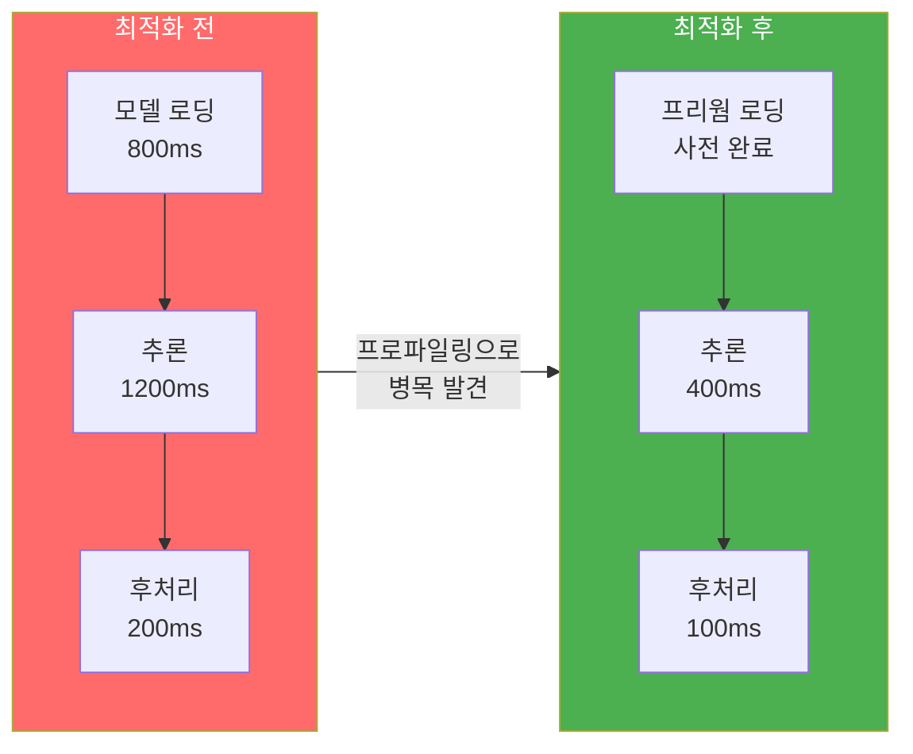
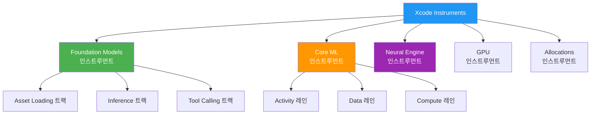
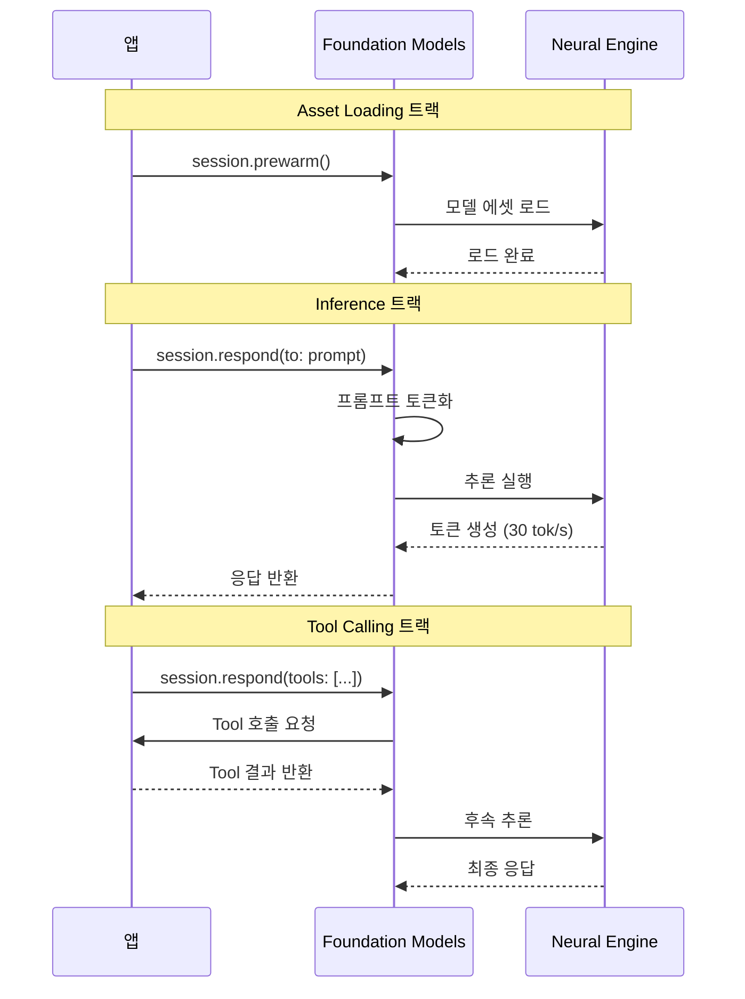
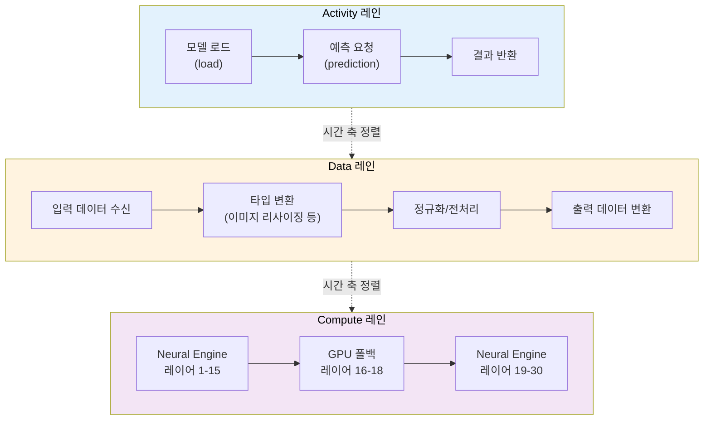
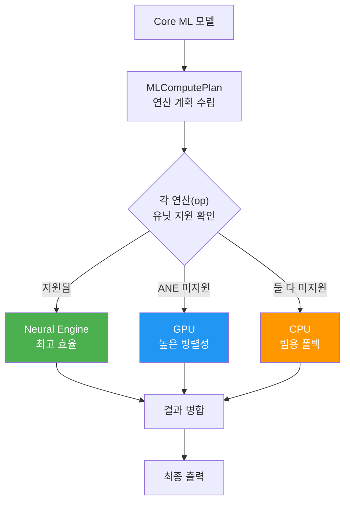
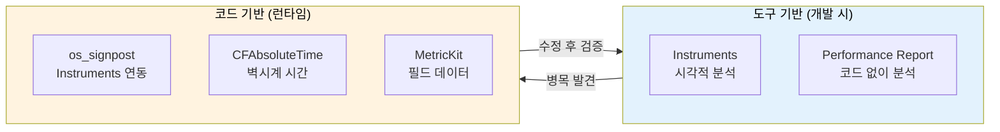

# AI 추론 성능 프로파일링

> Instruments와 Foundation Models 프로파일러로 AI 추론의 병목을 찾고, Neural Engine/GPU/CPU 실행을 분석하는 방법을 배웁니다.

## 개요

앱에 AI 기능을 넣었다면, 다음 질문은 자연스럽게 "얼마나 빠른가?"가 됩니다. 이 섹션에서는 Xcode Instruments를 활용하여 Foundation Models와 Core ML 기반 AI 추론의 성능을 측정하고, 병목 지점을 정확히 찾아내는 방법을 학습합니다.

**선수 지식**: [Core ML 프레임워크 소개](15-ch15-core-ml-기초/01-01-core-ml-프레임워크-소개.md)에서 다룬 Core ML 기본 구조, [Foundation Models + Core ML 하이브리드 아키텍처](17-ch17-foundation-models-core-ml-하이브리드/01-01-하이브리드-아키텍처-설계-전략.md)의 파이프라인 개념

**학습 목표**:
- Xcode Instruments의 Foundation Models 인스트루먼트를 활용하여 LLM 추론 성능을 프로파일링한다
- Core ML Instrument의 Activity/Data/Compute 트랙을 해석하여 병목을 식별한다
- Neural Engine, GPU, CPU 간 연산 분배를 분석하고 최적화 방향을 설정한다
- `os_signpost`와 `CFAbsoluteTimeGetCurrent`로 코드 레벨 성능 측정을 구현한다

## 왜 알아야 할까?

"앱이 느려요"라는 사용자 피드백을 받았을 때, 문제가 네트워크인지, AI 모델 로딩인지, 추론 자체인지 구분할 수 있나요? AI 기능은 일반적인 CRUD 로직과 달리 **수백만 개의 연산**이 하드웨어 가속기를 넘나들며 실행됩니다. 감으로 최적화하면 엉뚱한 곳에 시간을 쏟게 되죠.

Apple Silicon 기기에는 CPU, GPU, **Neural Engine(ANE)** 세 가지 연산 유닛이 있고, Core ML은 모델 구조에 따라 연산을 자동 분배합니다. 이 분배가 적절한지, 어디서 대기 시간이 발생하는지를 **눈으로 확인**하려면 프로파일링이 필수입니다.

> 📊 **그림 1**: AI 추론 성능 최적화 전후 비교



프로파일링은 단순히 "느린 곳 찾기"가 아닙니다. 메모리 사용량, 배터리 소비, 열 발생까지 연결되는 **성능 최적화의 출발점**이거든요.

## 핵심 개념

### 개념 1: Instruments와 AI 프로파일링의 관계

> 💡 **비유**: Instruments는 자동차의 OBD 진단기와 같습니다. 운전자가 "차가 느리다"고 느끼면 엔진 RPM, 연료 분사량, 배기 온도 등을 동시에 측정하여 정확한 원인을 찾죠. Instruments도 마찬가지로 CPU, GPU, Neural Engine, 메모리를 동시에 모니터링하여 AI 추론의 정확한 병목을 알려줍니다.

Xcode의 **Instruments**는 Apple 플랫폼의 성능 프로파일링 도구입니다. AI 추론에 관련된 주요 인스트루먼트는 다음과 같습니다:

| 인스트루먼트 | 역할 | 대상 |
|-------------|------|------|
| **Foundation Models** | LLM 세션의 에셋 로딩, 추론, 토큰 수 추적 | Foundation Models 프레임워크 |
| **Core ML** | 모델 로드/예측 시간, 연산 분배 분석 | Core ML 모델 (.mlmodel) |
| **Neural Engine** | ANE 하드웨어 활용도 모니터링 | Neural Engine 연산 |
| **GPU** | GPU 연산 타임라인과 점유율 | Metal/GPU 기반 연산 |
| **Allocations** | 메모리 할당/해제 패턴 추적 | 모든 메모리 사용 |

> 📊 **그림 2**: Instruments에서 AI 관련 인스트루먼트 구조



**Instruments를 여는 방법**은 간단합니다. Xcode에서 `Product → Profile` (⌘I)을 누르면 템플릿 선택 화면이 뜹니다. **Blank** 템플릿을 선택한 후 `+` 버튼으로 필요한 인스트루먼트를 추가하면 됩니다.

### 개념 2: Foundation Models 인스트루먼트

> 💡 **비유**: Foundation Models 인스트루먼트는 레스토랑의 주방 모니터링 시스템과 같습니다. 주문(프롬프트)이 들어오면 재료 준비 시간(에셋 로딩), 조리 시간(추론), 서빙 시간(응답 전달)을 각각 측정하여 어디서 병목이 생기는지 보여주거든요.

WWDC25 세션 301 *"Deep dive into the Foundation Models framework"*에서 소개된 **Foundation Models 인스트루먼트**는 Xcode 26에서 새롭게 추가되었으며, `LanguageModelSession`의 성능을 전용으로 추적합니다. WWDC25에서 공개된 정보를 기준으로, 다음과 같은 트랙 구조를 제공합니다:

**1. Asset Loading 트랙**: 시스템 언어 모델과 안전성 가드레일 모델을 메모리에 로드하는 시간을 보여줍니다. 첫 번째 요청에서 특히 오래 걸릴 수 있으며, `prewarm()` 호출 시에는 이 트랙에서 에셋 로딩이 미리 수행되는 것을 확인할 수 있습니다.

**2. Inference 트랙**: 프롬프트 처리 시간, 입출력 토큰 수, 총 응답 시간을 표시합니다. 토큰 수는 4,096 토큰 제한을 모니터링하는 데 중요합니다.

**3. Tool Calling 트랙**: 도구 호출이 포함된 세션에서 각 도구의 처리 시간을 하이라이트합니다. 오래 걸리는 도구를 빠르게 식별할 수 있습니다.

> ⚠️ **흔한 오해**: "시뮬레이터에서 프로파일링하면 되겠지?" — 아닙니다! Foundation Models는 **Apple Intelligence 지원 실제 디바이스에서만** 동작합니다. 시뮬레이터에서는 모델 자체가 실행되지 않기 때문에, 토큰 카운트가 0으로 나올 수 있습니다. 반드시 실제 기기에서 프로파일링해야 정확한 데이터를 얻을 수 있습니다.

> 💡 **알고 계셨나요?**: Foundation Models 인스트루먼트의 트랙 이름(Asset Loading, Inference, Tool Calling)은 WWDC25 세션에서 데모로 보여진 구조입니다. Xcode 26의 정식 출시 버전에서는 트랙 이름이나 세부 구조가 다소 변경될 수 있으니, 실제 사용 시 Instruments의 최신 UI를 기준으로 확인하세요.

다음은 프로파일링에 적합한 세션 설정 코드입니다:

```swift
import FoundationModels
import os

// 성능 측정을 위한 signpost 로거
let perfLogger = Logger(subsystem: "com.myapp.ai", category: "Performance")
let signposter = OSSignposter(logger: perfLogger)

class AIProfilingService {
    private var session: LanguageModelSession?
    
    /// 세션 초기화 + 프리웜
    func prepareSession() async throws {
        // 세션 생성 시점 기록
        let state = signposter.beginInterval("SessionSetup")
        
        let session = LanguageModelSession()
        
        // 프리웜으로 에셋 로딩을 미리 수행
        // Instruments의 Asset Loading 트랙에서 확인 가능
        // 참고: 프리웜은 로딩을 "제거"하는 것이 아니라
        // 사용자 요청 시점 이전으로 "이동"시키는 것
        try await session.prewarm()
        
        self.session = session
        signposter.endInterval("SessionSetup", state)
    }
    
    /// 프롬프트가 미리 알려진 경우 — promptPrefix로 추가 최적화
    func prepareWithPrompt(_ prompt: String) async throws {
        let session = LanguageModelSession()
        
        // 프롬프트 프리픽스까지 캐싱하여 첫 토큰 지연 최대 40% 감소
        try await session.prewarm(promptPrefix: prompt)
        
        self.session = session
    }
}
```

> 📊 **그림 3**: Foundation Models 인스트루먼트의 트랙 구조와 시간 흐름



### 개념 3: Core ML Instrument의 3개 레인

> 💡 **비유**: Core ML Instrument의 세 레인은 택배 추적 시스템과 비슷합니다. Activity 레인은 "주문 접수/배송 완료" 같은 큰 이벤트, Data 레인은 "포장 중/라벨 부착" 같은 데이터 변환 과정, Compute 레인은 "트럭 출발/드론 배송" 같은 실제 하드웨어 실행을 보여줍니다.

Core ML Instrument는 `.mlmodel` 기반 모델의 성능을 분석합니다. WWDC22 세션 *"Optimize your Core ML usage"*에서 자세히 설명된 이 인스트루먼트는 이벤트를 세 개의 레인(lane)으로 분류하여 보여주는데요:

**Activity 레인**: Core ML API 호출과 1:1로 대응하는 최상위 이벤트입니다. 모델 로드(`load`)와 예측(`prediction`) 이벤트가 여기에 표시됩니다. 모델을 처음 로드할 때 걸리는 시간과, 이후 캐시된 상태에서 로드하는 시간의 차이를 한눈에 비교할 수 있습니다.

**Data 레인**: Core ML이 모델 입출력 데이터를 변환하거나 검증하는 과정입니다. 이미지 리사이징, 정규화 등 전처리가 여기서 시간을 소비할 수 있습니다. 만약 Data 레인에서 긴 구간이 보인다면, 입력 데이터를 모델이 기대하는 형식으로 미리 변환해두는 것이 효과적입니다.

**Compute 레인**: **가장 중요한 레인**입니다. Core ML이 실제로 Neural Engine, GPU, CPU 중 어디에 연산을 보냈는지를 보여줍니다. 연산 유닛 간 핸드오프 지연도 여기서 확인할 수 있습니다. 예를 들어 ANE에서 GPU로 전환되는 구간이 빈번하다면, 데이터 전송 오버헤드가 전체 성능에 영향을 줄 수 있습니다.

> 📊 **그림 4**: Core ML Instrument의 3개 레인 상세 구조



```swift
import CoreML
import os

class CoreMLProfiler {
    let signposter = OSSignposter(
        logger: Logger(subsystem: "com.myapp.ai", category: "CoreML")
    )
    
    /// Core ML 모델의 로드 + 예측 시간을 수동 측정
    func profilePrediction(
        model: MLModel,
        input: MLFeatureProvider
    ) async throws -> MLFeatureProvider {
        // 1. 예측 시간 측정 시작
        let predState = signposter.beginInterval("Prediction")
        
        let result = try await model.prediction(from: input)
        
        // 2. 예측 시간 측정 종료 — Instruments에서 확인
        signposter.endInterval("Prediction", predState)
        
        return result
    }
    
    /// 간단한 벽시계 시간 측정 (디버그용)
    func measureInferenceTime<T>(
        label: String,
        operation: () async throws -> T
    ) async rethrows -> T {
        let start = CFAbsoluteTimeGetCurrent()
        let result = try await operation()
        let elapsed = CFAbsoluteTimeGetCurrent() - start
        
        // 밀리초 단위로 로그 출력
        perfLogger.info("\(label): \(elapsed * 1000, format: .fixed(precision: 1))ms")
        return result
    }
}
```

### 개념 4: Neural Engine/GPU/CPU 실행 분석

> 💡 **비유**: Apple Silicon의 세 연산 유닛은 주방의 세 셰프와 같습니다. Neural Engine은 **반복적인 대량 작업**(감자 깎기)에 최적화된 전문 장비, GPU는 **다양한 작업을 병렬로** 처리하는 멀티태스킹 셰프, CPU는 **복잡한 판단이 필요한** 수석 셰프입니다. 좋은 주방 매니저(Core ML)는 각 작업을 가장 적합한 셰프에게 배분하죠.

Apple Silicon에서 ML 연산이 실행되는 위치를 이해하는 것은 최적화의 핵심입니다:

| 연산 유닛 | 특장점 | 약점 | 적합한 연산 |
|----------|--------|------|------------|
| **Neural Engine** | 최고 전력 효율, ML 전용 | 지원 op 제한적 | 합성곱, 행렬곱, Transformer |
| **GPU** | 높은 병렬성, 유연성 | 전력 소비 높음 | 커스텀 op, 대규모 행렬 |
| **CPU** | 모든 op 지원 | 가장 느림 | 비표준 op, 분기 로직 |

> 📊 **그림 5**: Apple Silicon의 AI 연산 분배 흐름



WWDC24 세션 *"Deploy machine learning and AI models on-device with Core ML"*에서 소개된 `MLComputePlan` API를 사용하면 코드에서 직접 연산 분배 정보를 확인할 수 있습니다:

```swift
import CoreML

/// MLComputePlan으로 모델의 연산 분배 분석
func analyzeComputePlan(for modelURL: URL) async throws {
    // 컴파일된 모델의 연산 계획 로드
    let compiledURL = try await MLModel.compileModel(at: modelURL)
    let config = MLModelConfiguration()
    
    // 모델 로드
    let model = try MLModel(contentsOf: compiledURL, configuration: config)
    
    // 모델 설명에서 연산 유닛 정보 확인
    let description = model.modelDescription
    
    // 메타데이터 출력
    print("모델: \(description.metadata[.description] ?? "알 수 없음")")
    print("입력: \(description.inputDescriptionsByName.keys.joined(separator: ", "))")
    print("출력: \(description.outputDescriptionsByName.keys.joined(separator: ", "))")
}

/// Xcode에서 Performance Report 대신 코드로 측정
func benchmarkModel(
    model: MLModel,
    input: MLFeatureProvider,
    iterations: Int = 10
) async throws -> (averageMs: Double, minMs: Double, maxMs: Double) {
    var times: [Double] = []
    
    // 웜업 실행 (첫 실행은 캐시 미스로 느릴 수 있음)
    _ = try await model.prediction(from: input)
    
    for _ in 0..<iterations {
        let start = CFAbsoluteTimeGetCurrent()
        _ = try await model.prediction(from: input)
        let elapsed = (CFAbsoluteTimeGetCurrent() - start) * 1000
        times.append(elapsed)
    }
    
    let avg = times.reduce(0, +) / Double(times.count)
    return (avg, times.min()!, times.max()!)
}
```

### 개념 5: 코드 레벨 성능 측정 패턴

실제 앱에서는 Instruments 외에도 **코드에 직접 계측(instrumentation)을 삽입**하여 프로덕션 환경의 성능 데이터를 수집해야 합니다.

> 📊 **그림 6**: 프로파일링 계층 — 도구 vs 코드 레벨



`os_signpost`는 Instruments와 직접 연동되어 커스텀 구간을 타임라인에 표시할 수 있는 가장 강력한 방법입니다:

```swift
import os
import FoundationModels

/// 프로덕션 레벨의 AI 성능 측정기
actor AIPerformanceTracker {
    private let signposter: OSSignposter
    private var metrics: [String: [Double]] = [:]
    
    init() {
        let logger = Logger(subsystem: "com.myapp.ai", category: "Perf")
        self.signposter = OSSignposter(logger: logger)
    }
    
    /// Foundation Models 응답 시간 측정
    func trackResponse(
        session: LanguageModelSession,
        prompt: String
    ) async throws -> String {
        // os_signpost 구간 시작 — Instruments 타임라인에 표시됨
        let state = signposter.beginInterval("LLM Response")
        let wallStart = CFAbsoluteTimeGetCurrent()
        
        let response = try await session.respond(to: prompt)
        
        // 구간 종료
        let wallTime = (CFAbsoluteTimeGetCurrent() - wallStart) * 1000
        signposter.endInterval("LLM Response", state)
        
        // 메트릭 저장
        metrics["llm_response_ms", default: []].append(wallTime)
        
        return response.content
    }
    
    /// 평균/P95 지표 계산
    func summary(for key: String) -> (avg: Double, p95: Double)? {
        guard let values = metrics[key], !values.isEmpty else { return nil }
        let sorted = values.sorted()
        let avg = sorted.reduce(0, +) / Double(sorted.count)
        let p95Index = Int(Double(sorted.count) * 0.95)
        let p95 = sorted[min(p95Index, sorted.count - 1)]
        return (avg, p95)
    }
}
```

## 실습: 직접 해보기

Foundation Models와 Core ML 모델 모두를 프로파일링하는 완전한 예제를 만들어 봅시다. 실제로 Instruments에서 트레이스를 캡처하여 분석하는 워크플로를 체험합니다.

```swift
import SwiftUI
import FoundationModels
import os

// MARK: - 성능 측정 유틸리티

/// 범용 성능 측정 래퍼
struct PerformanceMeasurement {
    let label: String
    let durationMs: Double
    let timestamp: Date
    
    var formatted: String {
        String(format: "%@ — %.1fms", label, durationMs)
    }
}

/// AI 추론 프로파일러
@Observable
class InferenceProfiler {
    private let logger = Logger(subsystem: "com.myapp", category: "Profiler")
    private let signposter: OSSignposter
    
    var measurements: [PerformanceMeasurement] = []
    var isRunning = false
    
    init() {
        self.signposter = OSSignposter(
            logger: Logger(subsystem: "com.myapp", category: "Signpost")
        )
    }
    
    // MARK: - Foundation Models 프로파일링
    
    /// 전체 파이프라인 프로파일링: 세션 생성 → 프리웜 → 추론
    func profileFoundationModels(prompt: String) async throws {
        isRunning = true
        defer { isRunning = false }
        
        // 1단계: 세션 생성 시간 측정
        let sessionResult = try await measure("세션 생성") {
            LanguageModelSession()
        }
        let session = sessionResult.value
        
        // 2단계: 프리웜 시간 측정
        // 프리웜은 에셋 로딩을 이 시점으로 앞당기는 것
        // respond() 호출 시 로딩 대기가 크게 줄어듦
        _ = try await measure("프리웜 (promptPrefix)") {
            try await session.prewarm(promptPrefix: prompt)
        }
        
        // 3단계: 추론 시간 측정
        let inferenceResult = try await measure("추론 (respond)") {
            try await session.respond(to: prompt)
        }
        
        // 결과 로깅
        logger.info("""
        프로파일링 완료:
        - 입력: \(prompt.prefix(50))...
        - 응답 길이: \(inferenceResult.value.content.count)자
        """)
    }
    
    // MARK: - 범용 측정 메서드
    
    /// os_signpost + 벽시계 시간 동시 측정
    private func measure<T>(
        _ label: String,
        operation: () async throws -> T
    ) async rethrows -> (value: T, ms: Double) {
        let state = signposter.beginInterval("\(label)")
        let start = CFAbsoluteTimeGetCurrent()
        
        let result = try await operation()
        
        let elapsed = (CFAbsoluteTimeGetCurrent() - start) * 1000
        signposter.endInterval("\(label)", state)
        
        let measurement = PerformanceMeasurement(
            label: label,
            durationMs: elapsed,
            timestamp: .now
        )
        measurements.append(measurement)
        logger.info("\(measurement.formatted)")
        
        return (result, elapsed)
    }
}

// MARK: - SwiftUI 프로파일링 뷰

struct ProfilingDashboardView: View {
    @State private var profiler = InferenceProfiler()
    @State private var prompt = "Swift 언어의 주요 특징 3가지를 설명해주세요."
    
    var body: some View {
        NavigationStack {
            List {
                // 프롬프트 입력
                Section("프롬프트") {
                    TextField("프롬프트 입력", text: $prompt, axis: .vertical)
                        .lineLimit(3...6)
                }
                
                // 실행 버튼
                Section {
                    Button {
                        Task {
                            try? await profiler.profileFoundationModels(
                                prompt: prompt
                            )
                        }
                    } label: {
                        Label(
                            profiler.isRunning ? "프로파일링 중..." : "프로파일링 시작",
                            systemImage: "gauge.with.dots.needle.33percent"
                        )
                    }
                    .disabled(profiler.isRunning)
                }
                
                // 결과 표시
                Section("측정 결과") {
                    if profiler.measurements.isEmpty {
                        ContentUnavailableView(
                            "아직 측정 결과가 없습니다",
                            systemImage: "chart.bar"
                        )
                    } else {
                        ForEach(
                            Array(profiler.measurements.enumerated()),
                            id: \.offset
                        ) { _, m in
                            HStack {
                                Text(m.label)
                                Spacer()
                                Text(String(format: "%.1fms", m.durationMs))
                                    .monospacedDigit()
                                    .foregroundStyle(colorForDuration(m.durationMs))
                            }
                        }
                        
                        // 총 시간
                        let total = profiler.measurements
                            .map(\.durationMs)
                            .reduce(0, +)
                        HStack {
                            Text("합계")
                                .bold()
                            Spacer()
                            Text(String(format: "%.1fms", total))
                                .bold()
                                .monospacedDigit()
                        }
                    }
                }
            }
            .navigationTitle("AI 추론 프로파일러")
        }
    }
    
    /// 시간에 따른 색상 — 직관적인 성능 인디케이터
    private func colorForDuration(_ ms: Double) -> Color {
        switch ms {
        case ..<100: return .green      // 빠름
        case ..<500: return .orange     // 보통
        default: return .red            // 느림
        }
    }
}
```

위 앱을 실행한 뒤 **⌘I**로 Instruments를 열고, Foundation Models 인스트루먼트를 추가하면 각 단계의 시간을 시각적으로 확인할 수 있습니다.

```run:swift
// 프로파일링 결과 예시 출력
let measurements = [
    ("세션 생성", 12.3),
    ("프리웜 (promptPrefix)", 245.7),
    ("추론 (respond)", 1832.4)
]

print("┌─────────────────────────────┬──────────┐")
print("│ 단계                        │ 시간(ms) │")
print("├─────────────────────────────┼──────────┤")
for (label, ms) in measurements {
    let padded = label.padding(toLength: 27, withPad: " ", startingAt: 0)
    print("│ \(padded) │ \(String(format: "%7.1f", ms)) │")
}
let total = measurements.map(\.1).reduce(0, +)
print("├─────────────────────────────┼──────────┤")
print("│ 합계                        │ \(String(format: "%7.1f", total)) │")
print("└─────────────────────────────┴──────────┘")
print("\n💡 추론이 전체의 \(String(format: "%.0f", (1832.4/total)*100))%를 차지 — 프리웜 덕분에 로딩은 이미 최적화됨")
```

```output
┌─────────────────────────────┬──────────┐
│ 단계                        │ 시간(ms) │
├─────────────────────────────┼──────────┤
│ 세션 생성                    │    12.3 │
│ 프리웜 (promptPrefix)        │   245.7 │
│ 추론 (respond)               │  1832.4 │
├─────────────────────────────┼──────────┤
│ 합계                        │  2090.4 │
└─────────────────────────────┴──────────┘

💡 추론이 전체의 88%를 차지 — 프리웜 덕분에 로딩은 이미 최적화됨
```

## 더 깊이 알아보기

### Instruments의 탄생 — NeXT에서 시작된 성능 집착

Instruments의 뿌리는 2000년대 초반 **Shark**와 **Saturn**이라는 별도의 프로파일링 도구에 있습니다. Steve Jobs가 NeXT에서 가져온 성능 최적화 문화는 Apple에 깊이 뿌리내렸는데요, 2007년 Xcode 3.0에서 Instruments가 처음 등장했을 때 DTrace(Sun Microsystems의 동적 추적 프레임워크)를 기반으로 만들어졌습니다.

재미있는 점은, DTrace의 창시자 Bryan Cantrill이 한 인터뷰에서 "Apple이 DTrace를 가장 아름답게 포장한 팀"이라고 말한 적이 있다는 거예요. 실제로 Instruments의 타임라인 UI는 당시로서는 혁신적이었고, 이 디자인은 거의 20년이 지난 지금까지도 기본 구조가 유지되고 있습니다.

### Neural Engine의 비밀스러운 진화

Apple이 Neural Engine을 처음 도입한 것은 2017년 A11 Bionic(iPhone X)이었습니다. 초기에는 Face ID 전용 정도의 용도였지만, A14부터는 초당 11조 회 연산(11 TOPS)을 처리하게 됐고, M4 칩에서는 **38 TOPS**에 달합니다. 이 성장 속도는 같은 기간 CPU/GPU의 성능 향상을 훨씬 능가하는 것입니다.

흥미로운 사실은 Apple이 Neural Engine의 내부 아키텍처를 거의 공개하지 않는다는 점입니다. 커뮤니티 연구자 Matthijs Hollemans가 [neural-engine](https://github.com/hollance/neural-engine) 리포지토리를 통해 역공학으로 밝혀낸 정보가 공식 문서보다 많을 정도입니다. Instruments에서 "H11ANE"로 시작하는 스레드 이름을 보면 — 이것이 바로 Neural Engine 컨트롤러의 내부 코드명입니다.

## 흔한 오해와 팁

> ⚠️ **흔한 오해**: "Neural Engine에서 실행되면 무조건 빠르다"라고 생각하기 쉽지만, 실제로는 **데이터 전송 오버헤드** 때문에 작은 모델은 CPU가 더 빠를 수 있습니다. Neural Engine은 모델이 충분히 크고, 배치 크기가 클 때 진가를 발휘합니다. Instruments의 Compute 레인에서 ANE와 CPU 간 핸드오프가 빈번하다면, `MLModelConfiguration`의 `computeUnits`를 `.cpuOnly`로 테스트해보세요.

> 💡 **알고 계셨나요?**: `prewarm()`은 모델 에셋 로딩을 "제거"하는 것이 아닙니다. 로딩 작업을 **사용자 요청 시점 이전으로 미리 당겨서** 실행하는 것이죠. Instruments의 Asset Loading 트랙을 보면 프리웜 호출 시점에 로딩이 발생하는 것을 확인할 수 있습니다. 따라서 체감 응답 시간은 크게 줄지만, 총 CPU/메모리 사용량 자체가 줄어드는 것은 아닙니다.

> 🔥 **실무 팁**: `session.prewarm(promptPrefix:)`는 **최소 1초 이상의 여유**가 있을 때만 호출하세요. `viewDidAppear`나 탭 전환 직후가 이상적인 타이밍입니다. 또한 프리웜은 시스템 부하 상황에서 즉시 완료를 보장하지 않으므로, UI에서는 항상 로딩 상태를 표시해야 합니다.

## 핵심 정리

| 개념 | 설명 |
|------|------|
| **Foundation Models 인스트루먼트** | WWDC25에서 소개된 LLM 전용 프로파일러. Asset Loading, Inference, Tool Calling 트랙 제공 |
| **Core ML Instrument** | Activity(API 이벤트), Data(전처리), Compute(하드웨어 분배) 세 레인으로 모델 성능 분석 |
| **Neural Engine** | ML 전용 하드웨어. 전력 효율 최고이나 지원 op 제한적. M4 기준 38 TOPS |
| **MLComputePlan** | WWDC24에서 소개. 각 연산이 어떤 유닛에서 실행되는지 코드로 확인 |
| **os_signpost** | Instruments 타임라인에 커스텀 구간을 표시하는 API. 프로덕션 계측에 필수 |
| **session.prewarm()** | 모델 에셋 로딩을 미리 수행. 로딩을 제거하는 것이 아니라 시점을 앞당기는 것 |
| **실기기 필수** | Foundation Models는 Apple Intelligence 지원 디바이스에서만 동작. 반드시 실제 기기에서 프로파일링 |

## 다음 섹션 미리보기

이번 섹션에서 병목을 **찾는 방법**을 배웠다면, 다음 [메모리와 배터리 최적화](18-ch18-성능-최적화와-프로파일링/02-02-메모리와-배터리-최적화.md)에서는 발견된 병목을 **해결하는 전략**을 다룹니다. 특히 Foundation Models 세션의 메모리 점유 패턴, Core ML 모델의 메모리 매핑 최적화, 그리고 AI 추론이 배터리에 미치는 영향을 줄이는 기법을 학습합니다.

## 참고 자료

- [Foundation Models profiling with Xcode Instruments — Artem Novichkov](https://artemnovichkov.com/blog/foundation-models-profiling-with-xcode-instruments) - Xcode 26의 Foundation Models 인스트루먼트 실전 사용법과 프리웜 최적화 팁
- [Optimize your Core ML usage — WWDC22 (Apple)](https://developer.apple.com/videos/play/wwdc2022/10027/) - Core ML Instrument의 3개 레인 분석법과 모델 로딩 최적화 패턴
- [Deploy machine learning and AI models on-device with Core ML — WWDC24 (Apple)](https://developer.apple.com/videos/play/wwdc2024/10161/) - MLComputePlan API, Performance Report, 연산 유닛별 비용 분석
- [Deep dive into the Foundation Models framework — WWDC25 (Apple)](https://developer.apple.com/videos/play/wwdc2025/301/) - Foundation Models 프레임워크의 내부 구조와 성능 특성
- [prewarm(promptPrefix:) — Apple Developer Documentation](https://developer.apple.com/documentation/foundationmodels/languagemodelsession/prewarm(promptprefix:)) - 세션 프리웜 API 공식 문서
- [Everything we actually know about the Apple Neural Engine — GitHub (hollance)](https://github.com/hollance/neural-engine) - Neural Engine 내부 동작의 커뮤니티 역공학 자료