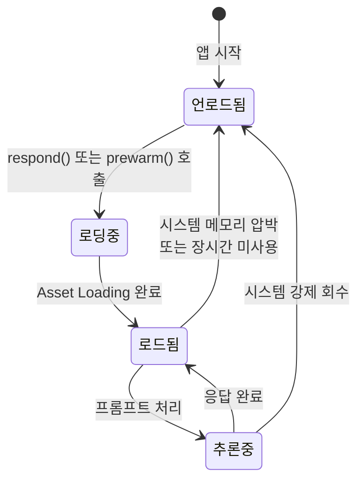
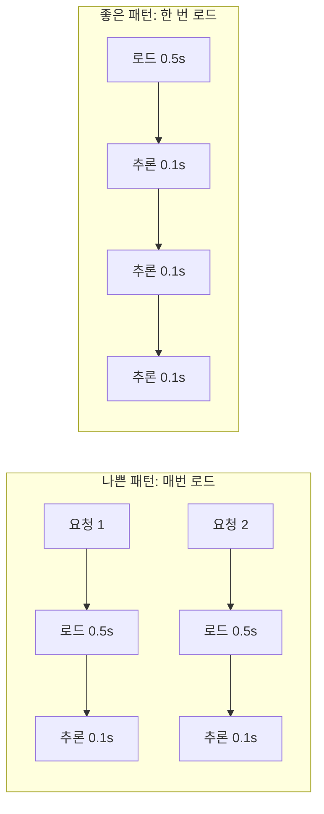
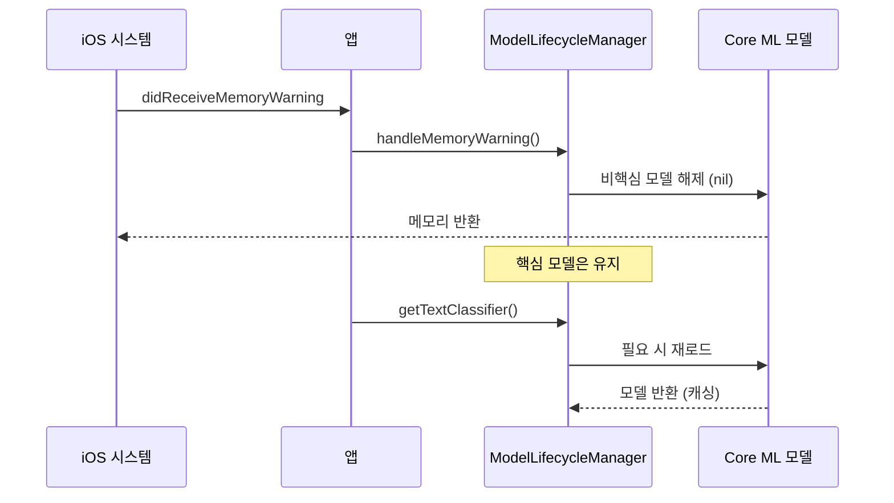
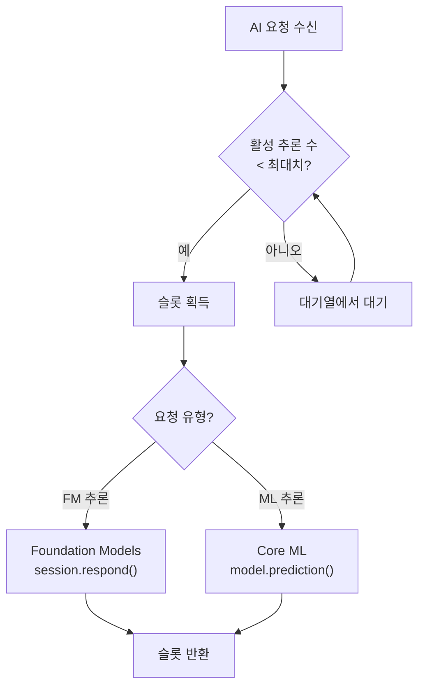
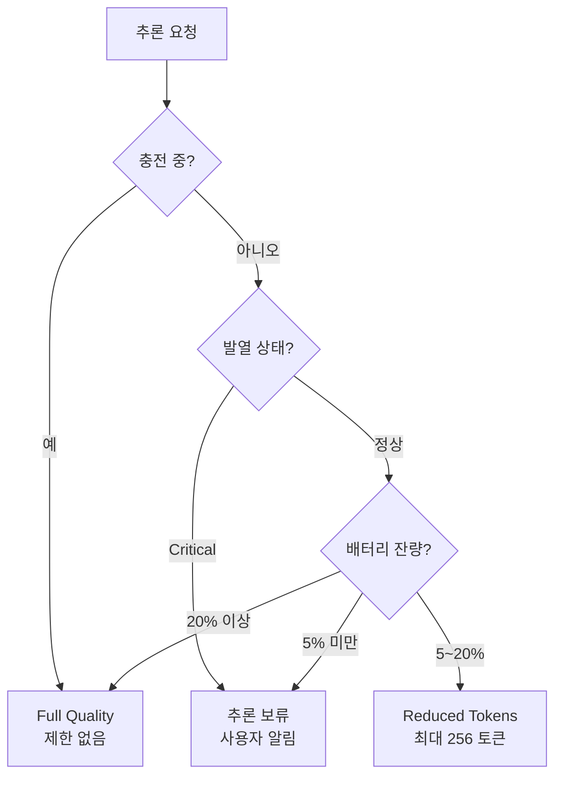

# 메모리와 배터리 최적화

> Foundation Models와 Core ML 기반 AI 기능의 메모리 피크를 제어하고, 배터리 효율을 극대화하는 전략을 학습합니다.

## 개요

이 섹션에서는 온디바이스 AI 모델의 메모리 사용 패턴을 이해하고, 모델 로딩/언로딩 전략, 메모리 피크 제어, 백그라운드 추론 제한, 그리고 Xcode Energy Gauge와 Power Profiler를 활용한 배터리 분석 기법을 배웁니다.

**선수 지식**: [AI 추론 성능 프로파일링](18-ch18-성능-최적화와-프로파일링/01-01-ai-추론-성능-프로파일링.md)에서 배운 Instruments 프로파일링 기초, Foundation Models 인스트루먼트, os_signpost 계측
**학습 목표**:
- Foundation Models 세션의 메모리 생명주기를 이해하고 최적화한다
- Core ML 모델의 로딩/언로딩 전략으로 메모리 피크를 제어한다
- Energy Gauge와 Power Profiler로 AI 추론의 배터리 소비를 분석한다
- 백그라운드 추론 제한과 적응적 품질 조절 패턴을 구현한다

## 왜 알아야 할까?

아무리 똑똑한 AI 기능이라도 배터리를 1시간 만에 소진시키거나, 다른 앱과 메모리 경쟁에서 밀려 크래시가 나면 사용자는 곧바로 기능을 끄게 됩니다. Apple의 온디바이스 모델은 약 3B 파라미터에 [온디바이스 모델 아키텍처](14-ch14-온디바이스-모델-아키텍처-이해/01-01-온디바이스-모델-아키텍처-이해.md)에서 다룬 2-bit QAT(Quantization-Aware Training) 양자화를 적용해도 메모리에 로드되면 **상당한 용량**을 차지합니다. 여기에 KV-Cache, 어댑터, Core ML 모델까지 동시에 올라가면 메모리 압박은 급격히 높아지죠.

특히 iOS는 백그라운드 실행에 매우 엄격합니다. AI 추론이 백그라운드에서 무분별하게 실행되면 시스템이 앱을 강제 종료하거나 사용자의 배터리 경험을 망칩니다. 이 섹션에서는 **"AI 기능은 좋지만, 자원은 현명하게"**라는 원칙을 코드로 구현하는 방법을 배웁니다.

## 핵심 개념

### 개념 1: Foundation Models의 메모리 생명주기

> 💡 **비유**: Foundation Models의 메모리 관리를 도서관에 비유해볼까요? 온디바이스 모델은 거대한 백과사전입니다. 도서관(운영체제)은 이 백과사전을 항상 열어두지 않아요. 누군가 질문하면 그때 꺼내고, 한동안 아무도 안 찾으면 다시 서가에 넣습니다. 여러분이 할 수 있는 건 "곧 질문할 거니까 미리 꺼내둬"(`prewarm`)라고 부탁하는 겁니다.

Foundation Models 프레임워크에서 온디바이스 모델은 **운영체제가 관리**합니다. 개발자가 직접 모델을 로드하거나 언로드할 수 없죠. `session.respond()`를 호출하면 OS가 모델이 메모리에 없을 경우 자동으로 로드하고, 일정 시간 미사용 시 자동으로 언로드합니다.

> 📊 **그림 1**: Foundation Models 메모리 생명주기



이 구조에서 개발자가 제어할 수 있는 핵심 포인트는 세 가지입니다:

1. **Prewarm으로 선제 로딩**: `session.prewarm()`을 호출하면 모델 Asset을 미리 메모리에 올려 첫 토큰 지연(TTFT)을 최대 40%까지 줄일 수 있습니다. 인자 없이 호출하면 모델만 선제 로딩하고, `session.prewarm(promptPrefix:)`를 사용하면 특정 프롬프트 접두어까지 미리 처리하여 추론 시작을 더 빠르게 할 수 있습니다. 메모리 관점에서는 두 형태 모두 동일하게 모델을 메모리에 올립니다.
2. **세션 수명 관리**: `LanguageModelSession` 인스턴스를 불필요하게 오래 유지하면 OS가 모델을 메모리에 계속 잡아둘 수 있습니다.
3. **어댑터 메모리 인지**: 태스크별 어댑터(LoRA)는 rank 16 기준 수십 MB 수준으로, 동적으로 로드/캐시/교체되며 메모리를 추가 소비합니다.

```swift
import FoundationModels

final class AIService {
    // 세션을 lazy로 생성 — 실제 필요할 때만 모델 로드 유도
    private var session: LanguageModelSession?
    
    /// 화면 진입 시 prewarm으로 모델을 미리 올림
    /// - 인자 없는 prewarm(): 모델 Asset만 선제 로딩
    /// - prewarm(promptPrefix:)도 가능: 프롬프트 접두어까지 미리 처리
    func prepareForInteraction() async {
        let newSession = LanguageModelSession()
        try? await newSession.prewarm()
        self.session = newSession
    }
    
    /// AI 기능 화면을 떠날 때 세션 해제 → OS가 모델 회수 가능
    func releaseResources() {
        session = nil
    }
    
    /// 추론 요청
    func generate(prompt: String) async throws -> String {
        guard let session else {
            // 세션이 없으면 새로 생성 (lazy 복원)
            let newSession = LanguageModelSession()
            self.session = newSession
            return try await newSession.respond(to: prompt).content
        }
        return try await session.respond(to: prompt).content
    }
}
```

> ⚠️ **흔한 오해**: "세션을 nil로 만들면 모델이 즉시 메모리에서 해제된다" — 이건 정확하지 않습니다. 세션 해제는 OS에게 "이 모델 더 이상 필요 없어"라는 **힌트**를 줄 뿐이에요. 실제 언로딩 시점은 OS가 결정합니다. 하지만 그 힌트를 주지 않으면 OS는 모델을 계속 잡아두려 하므로, 적극적으로 세션을 해제하는 것이 중요합니다.

### 개념 2: Core ML 모델 로딩/언로딩 전략

> 💡 **비유**: Core ML 모델 관리는 주방의 조리 도구 관리와 비슷합니다. 매번 요리할 때마다 도구를 찾으러 창고에 가면(매번 로딩) 시간이 낭비되고, 모든 도구를 한꺼번에 조리대에 올려두면(전부 메모리 상주) 공간이 부족해져요. **자주 쓰는 도구는 가까이 두고, 가끔 쓰는 것은 필요할 때 꺼내는** 전략이 최적입니다.

Foundation Models와 달리 Core ML 모델은 **개발자가 직접 로딩/언로딩을 제어**합니다. 여기서 가장 흔한 실수는 매 추론마다 모델을 다시 로드하는 패턴이에요.

> 📊 **그림 2**: Core ML 모델 로딩 전략 비교



WWDC22 "Optimize your Core ML usage" 세션에서 Apple은 이 실수로 인해 6.41초가 걸리던 작업이 모델을 한 번만 로드하도록 수정한 후 극적으로 개선된 사례를 보여주었습니다.

```swift
import CoreML

/// 모델 수명 관리자 — 로드/언로드를 명시적으로 제어
final class ModelLifecycleManager {
    // ✅ lazy로 한 번만 로드하여 재사용
    private lazy var imageClassifier: VNCoreMLModel? = {
        guard let model = try? MyImageClassifier(configuration: .init()).model,
              let vnModel = try? VNCoreMLModel(for: model) else {
            return nil
        }
        return vnModel
    }()
    
    // 메모리 압박 시 모델 해제
    private var _textClassifier: MLModel?
    
    /// 필요할 때 로드, 캐시하여 재사용
    func getTextClassifier() throws -> MLModel {
        if let cached = _textClassifier { return cached }
        
        let config = MLModelConfiguration()
        config.computeUnits = .cpuAndNeuralEngine // GPU 경합 방지
        
        let model = try TextSentiment(configuration: config).model
        _textClassifier = model
        return model
    }
    
    /// 메모리 경고 시 비핵심 모델 해제
    func handleMemoryWarning() {
        _textClassifier = nil
        // imageClassifier는 핵심 기능이므로 유지
    }
}
```

메모리 경고 대응은 `NotificationCenter`를 활용합니다:

```swift
// AppDelegate 또는 ObservableObject에서 메모리 경고 감시
NotificationCenter.default.addObserver(
    forName: UIApplication.didReceiveMemoryWarningNotification,
    object: nil,
    queue: .main
) { [weak self] _ in
    self?.modelManager.handleMemoryWarning()
}
```

> 📊 **그림 3**: 메모리 경고 대응 흐름



### 개념 3: 메모리 피크 제어 기법

> 💡 **비유**: 메모리 피크 제어는 가정의 전력 관리와 같습니다. 에어컨, 세탁기, 전자레인지를 동시에 켜면 차단기가 내려가죠. AI 기능도 마찬가지로 Foundation Models 세션, Core ML 모델, 이미지 처리를 동시에 실행하면 메모리 피크가 치솟아 앱이 강제 종료됩니다. **동시 실행을 제한**하는 것이 핵심입니다.

```swift
import os

/// AI 리소스의 동시 사용을 제어하는 관리자
actor AIResourceCoordinator {
    private let logger = Logger(subsystem: "com.app.ai", category: "resource")
    
    // 동시 추론 제한 (Foundation Models + Core ML 합산)
    private let maxConcurrentInferences = 2
    private var activeInferences = 0
    
    /// 추론 슬롯 획득 — 자원이 부족하면 대기
    func acquireSlot() async throws {
        while activeInferences >= maxConcurrentInferences {
            // 100ms 대기 후 재시도
            try await Task.sleep(for: .milliseconds(100))
        }
        activeInferences += 1
        logger.info("추론 슬롯 획득: \(self.activeInferences)/\(self.maxConcurrentInferences)")
    }
    
    /// 추론 완료 후 슬롯 반환
    func releaseSlot() {
        activeInferences = max(0, activeInferences - 1)
        logger.info("추론 슬롯 반환: \(self.activeInferences)/\(self.maxConcurrentInferences)")
    }
    
    /// 현재 메모리 상태 확인
    func currentMemoryUsageMB() -> Double {
        var info = mach_task_basic_info()
        var count = mach_msg_type_number_t(
            MemoryLayout<mach_task_basic_info>.size / MemoryLayout<natural_t>.size
        )
        let result = withUnsafeMutablePointer(to: &info) {
            $0.withMemoryRebound(to: integer_t.self, capacity: Int(count)) {
                task_info(mach_task_self_, task_flavor_t(MACH_TASK_BASIC_INFO), $0, &count)
            }
        }
        guard result == KERN_SUCCESS else { return 0 }
        return Double(info.resident_size) / (1024 * 1024)
    }
}
```

Apple의 온디바이스 모델은 [KV-Cache 공유와 메모리 최적화](14-ch14-온디바이스-모델-아키텍처-이해/02-02-kv-cache-공유와-메모리-최적화.md)에서 다룬 **KV-Cache 공유** 기법으로 메모리 사용량을 37.5% 절약합니다. 모델을 Block 1(62.5% 레이어)과 Block 2(37.5% 레이어)로 나누어, Block 2가 Block 1의 KV-Cache를 재사용하는 구조죠. 이 시스템 수준 최적화 덕분에 3B 모델이 모바일 기기에서 실행 가능한 겁니다. 개발자가 직접 제어할 수는 없지만, 이 메커니즘을 이해하면 **왜 동시 세션이 메모리를 급격히 늘리는지** 파악할 수 있습니다 — 각 세션이 독립적인 KV-Cache를 유지하기 때문이에요.

> 📊 **그림 4**: AI 리소스 동시 사용 제어



### 개념 4: 배터리 최적화와 Energy Gauge 분석

> 💡 **비유**: Energy Gauge는 자동차의 연비 계기판과 같습니다. 주행 중 실시간으로 연료 소비를 보여주듯, Xcode의 Energy Gauge는 앱이 CPU, GPU, Neural Engine을 얼마나 사용하는지 실시간으로 보여줍니다. "연비가 나쁘다"는 걸 알아야 운전 습관(코드)을 고칠 수 있죠.

Xcode의 Debug Navigator에는 **Energy Impact 게이지**가 내장되어 있어 테스트 중 앱의 에너지 영향을 실시간으로 확인할 수 있습니다. AI 추론 시 이 게이지가 "High"를 지속적으로 표시한다면 최적화가 필요한 신호입니다.

WWDC25 "Profile and optimize power usage in your app" 세션에서 Apple은 **Power Profiler** 인스트루먼트를 소개했습니다. 이 도구는 앱별 전력 소비를 CPU, GPU, 디스플레이, 네트워크로 분해하여 보여줍니다.

> 📊 **그림 5**: 적응적 추론의 의사결정 흐름



```swift
import os
import FoundationModels

/// AI 추론의 에너지 효율을 모니터링하는 래퍼
struct EnergyAwareInference {
    private let signposter = OSSignposter(
        subsystem: "com.app.ai",
        category: "energy"
    )
    
    /// 에너지 효율적 추론 — 디바이스 상태에 따라 품질 조절
    func performAdaptiveInference(
        session: LanguageModelSession,
        prompt: String
    ) async throws -> String {
        // 배터리 잔량과 충전 상태 확인
        let batteryLevel = getBatteryLevel()
        let isCharging = isDeviceCharging()
        let thermalState = ProcessInfo.processInfo.thermalState
        
        // 디바이스 상태에 따라 전략 결정
        let strategy = determineStrategy(
            battery: batteryLevel,
            charging: isCharging,
            thermal: thermalState
        )
        
        let state = signposter.beginInterval("adaptiveInference")
        defer { signposter.endInterval("adaptiveInference", state) }
        
        switch strategy {
        case .fullQuality:
            return try await session.respond(to: prompt).content
            
        case .reducedTokens:
            // 최대 토큰 수 제한으로 에너지 절약
            let options = GenerationOptions(maximumResponseTokens: 256)
            return try await session.respond(
                to: prompt,
                options: options
            ).content
            
        case .deferred:
            // 추론을 지연시키고 사용자에게 알림
            throw InferenceError.deferredDueToLowBattery
        }
    }
    
    private func getBatteryLevel() -> Float {
        UIDevice.current.isBatteryMonitoringEnabled = true
        return UIDevice.current.batteryLevel
    }
    
    private func isDeviceCharging() -> Bool {
        UIDevice.current.isBatteryMonitoringEnabled = true
        return UIDevice.current.batteryState == .charging
            || UIDevice.current.batteryState == .full
    }
    
    private func determineStrategy(
        battery: Float,
        charging: Bool,
        thermal: ProcessInfo.ThermalState
    ) -> InferenceStrategy {
        // 충전 중이면 항상 최고 품질
        if charging { return .fullQuality }
        // 발열 심각하면 추론 지연
        if thermal == .critical { return .deferred }
        // 배터리 20% 이하면 토큰 제한
        if battery < 0.2 { return .reducedTokens }
        // 배터리 5% 이하면 추론 지연
        if battery < 0.05 { return .deferred }
        return .fullQuality
    }
}

enum InferenceStrategy {
    case fullQuality    // 제한 없이 추론
    case reducedTokens  // 토큰 수 제한
    case deferred       // 추론 보류
}

enum InferenceError: Error {
    case deferredDueToLowBattery
}
```

### 개념 5: 백그라운드 추론 제한

백그라운드에서 AI 추론을 실행하려면 iOS의 `BGProcessingTask`를 사용해야 합니다. 하지만 배터리를 위해 **제약 조건을 반드시 설정**해야 합니다.

```swift
import BackgroundTasks
import FoundationModels

final class BackgroundAIManager {
    static let taskIdentifier = "com.app.ai.backgroundAnalysis"
    
    /// 백그라운드 태스크 등록 (AppDelegate에서 호출)
    func registerBackgroundTask() {
        BGTaskScheduler.shared.register(
            forTaskWithIdentifier: Self.taskIdentifier,
            using: nil
        ) { task in
            self.handleBackgroundTask(task as! BGProcessingTask)
        }
    }
    
    /// 백그라운드 AI 분석 스케줄링
    func scheduleBackgroundAnalysis() {
        let request = BGProcessingTaskRequest(identifier: Self.taskIdentifier)
        // 충전 중일 때만 실행 — 배터리 보호 핵심!
        request.requiresExternalPower = true
        // 네트워크 불필요 (온디바이스 추론)
        request.requiresNetworkConnectivity = false
        // 최소 1시간 후 실행
        request.earliestBeginDate = Date(timeIntervalSinceNow: 3600)
        
        do {
            try BGTaskScheduler.shared.submit(request)
        } catch {
            print("백그라운드 태스크 스케줄링 실패: \(error)")
        }
    }
    
    private func handleBackgroundTask(_ task: BGProcessingTask) {
        // 태스크 만료 시 정리
        task.expirationHandler = {
            // 진행 중인 추론 취소
            task.setTaskCompleted(success: false)
        }
        
        Task {
            do {
                // 백그라운드 추론 실행
                let session = LanguageModelSession()
                let result = try await session.respond(to: "분석할 내용...")
                
                // 결과 저장
                saveAnalysisResult(result.content)
                task.setTaskCompleted(success: true)
            } catch {
                task.setTaskCompleted(success: false)
            }
        }
    }
    
    private func saveAnalysisResult(_ content: String) {
        // UserDefaults 또는 Core Data에 결과 저장
    }
}
```

> 🔥 **실무 팁**: `requiresExternalPower = true`를 설정하면 디바이스가 충전 중일 때만 백그라운드 AI 추론이 실행됩니다. 배터리로 구동 중인 디바이스에서 무거운 AI 작업을 백그라운드로 돌리는 건 사용자 경험의 최악의 적입니다.

## 실습: 직접 해보기

메모리와 배터리를 모두 고려하는 통합 AI 리소스 매니저를 구현해봅시다.

```swift
import Foundation
import FoundationModels
import CoreML
import os

/// 메모리 + 배터리 통합 AI 리소스 매니저
@Observable
final class SmartAIResourceManager {
    // MARK: - 상태
    private(set) var memoryUsageMB: Double = 0
    private(set) var batteryLevel: Float = 1.0
    private(set) var inferenceStrategy: InferenceStrategy = .fullQuality
    private(set) var isModelLoaded = false
    
    // MARK: - 내부
    private var fmSession: LanguageModelSession?
    private var coreMLModel: MLModel?
    private let logger = Logger(subsystem: "com.app.ai", category: "resource-manager")
    private let signposter = OSSignposter(subsystem: "com.app.ai", category: "perf")
    
    // 메모리 임계값 (MB)
    private let memoryWarningThreshold: Double = 800
    private let memoryCriticalThreshold: Double = 1200
    
    init() {
        setupMemoryWarningObserver()
        startBatteryMonitoring()
    }
    
    // MARK: - Foundation Models 세션 관리
    
    /// 화면 진입 시 호출 — 모델 미리 로드
    func warmUp() async {
        let state = signposter.beginInterval("warmUp")
        
        let session = LanguageModelSession()
        // prewarm(): 모델 Asset 선제 로딩
        // prewarm(promptPrefix:)로 프롬프트 접두어까지 미리 처리도 가능
        try? await session.prewarm()
        fmSession = session
        isModelLoaded = true
        
        signposter.endInterval("warmUp", state)
        logger.info("Foundation Models 세션 준비 완료")
    }
    
    /// 화면 이탈 시 호출 — 리소스 해제
    func coolDown() {
        fmSession = nil
        coreMLModel = nil
        isModelLoaded = false
        logger.info("AI 리소스 해제 — OS 회수 대기")
    }
    
    // MARK: - 적응적 추론
    
    /// 디바이스 상태를 고려한 스마트 추론
    func smartRespond(to prompt: String) async throws -> String {
        updateDeviceState()
        
        let strategy = calculateStrategy()
        self.inferenceStrategy = strategy
        
        switch strategy {
        case .deferred:
            throw InferenceError.deferredDueToLowBattery
            
        case .reducedTokens:
            logger.info("저전력 모드: 토큰 제한 적용")
            return try await respondWithLimit(prompt: prompt, maxTokens: 256)
            
        case .fullQuality:
            return try await respondFull(prompt: prompt)
        }
    }
    
    private func respondFull(prompt: String) async throws -> String {
        let session = try getOrCreateSession()
        let state = signposter.beginInterval("inference-full")
        let result = try await session.respond(to: prompt)
        signposter.endInterval("inference-full", state)
        return result.content
    }
    
    private func respondWithLimit(prompt: String, maxTokens: Int) async throws -> String {
        let session = try getOrCreateSession()
        let state = signposter.beginInterval("inference-reduced")
        let options = GenerationOptions(maximumResponseTokens: maxTokens)
        let result = try await session.respond(to: prompt, options: options)
        signposter.endInterval("inference-reduced", state)
        return result.content
    }
    
    private func getOrCreateSession() throws -> LanguageModelSession {
        if let existing = fmSession { return existing }
        let session = LanguageModelSession()
        fmSession = session
        isModelLoaded = true
        return session
    }
    
    // MARK: - 메모리 모니터링
    
    private func setupMemoryWarningObserver() {
        NotificationCenter.default.addObserver(
            forName: UIApplication.didReceiveMemoryWarningNotification,
            object: nil,
            queue: .main
        ) { [weak self] _ in
            self?.handleMemoryPressure()
        }
    }
    
    private func handleMemoryPressure() {
        logger.warning("메모리 경고 수신 — 비핵심 모델 해제")
        // Core ML 모델 먼저 해제 (재로드 비용이 FM보다 낮음)
        coreMLModel = nil
        updateMemoryUsage()
        
        // 그래도 부족하면 FM 세션도 해제
        if memoryUsageMB > memoryCriticalThreshold {
            logger.warning("메모리 위험 수준 — FM 세션 해제")
            fmSession = nil
            isModelLoaded = false
        }
    }
    
    // MARK: - 배터리/디바이스 상태
    
    private func startBatteryMonitoring() {
        UIDevice.current.isBatteryMonitoringEnabled = true
    }
    
    private func updateDeviceState() {
        batteryLevel = UIDevice.current.batteryLevel
        updateMemoryUsage()
    }
    
    private func updateMemoryUsage() {
        var info = mach_task_basic_info()
        var count = mach_msg_type_number_t(
            MemoryLayout<mach_task_basic_info>.size / MemoryLayout<natural_t>.size
        )
        let result = withUnsafeMutablePointer(to: &info) {
            $0.withMemoryRebound(to: integer_t.self, capacity: Int(count)) {
                task_info(mach_task_self_, task_flavor_t(MACH_TASK_BASIC_INFO), $0, &count)
            }
        }
        if result == KERN_SUCCESS {
            memoryUsageMB = Double(info.resident_size) / (1024 * 1024)
        }
    }
    
    private func calculateStrategy() -> InferenceStrategy {
        let isCharging = UIDevice.current.batteryState == .charging
            || UIDevice.current.batteryState == .full
        let thermal = ProcessInfo.processInfo.thermalState
        
        if isCharging { return .fullQuality }
        if thermal == .critical || batteryLevel < 0.05 { return .deferred }
        if batteryLevel < 0.2 || thermal == .serious { return .reducedTokens }
        if memoryUsageMB > memoryWarningThreshold { return .reducedTokens }
        return .fullQuality
    }
}
```

SwiftUI에서 이 매니저를 활용하는 뷰:

```swift
import SwiftUI
import FoundationModels

struct SmartChatView: View {
    @State private var resourceManager = SmartAIResourceManager()
    @State private var userInput = ""
    @State private var response = ""
    @State private var errorMessage: String?
    
    var body: some View {
        VStack(spacing: 16) {
            // 리소스 상태 표시
            HStack {
                Label(
                    "메모리: \(Int(resourceManager.memoryUsageMB))MB",
                    systemImage: "memorychip"
                )
                Spacer()
                Label(
                    "배터리: \(Int(resourceManager.batteryLevel * 100))%",
                    systemImage: batteryIcon
                )
            }
            .font(.caption)
            .foregroundStyle(.secondary)
            
            // 현재 추론 전략 표시
            strategyBadge
            
            // 응답 영역
            ScrollView {
                Text(response)
                    .frame(maxWidth: .infinity, alignment: .leading)
            }
            
            // 입력 영역
            HStack {
                TextField("메시지를 입력하세요", text: $userInput)
                    .textFieldStyle(.roundedBorder)
                
                Button("전송") {
                    Task { await sendMessage() }
                }
                .disabled(userInput.isEmpty)
            }
            
            if let error = errorMessage {
                Text(error)
                    .font(.caption)
                    .foregroundStyle(.red)
            }
        }
        .padding()
        .task { await resourceManager.warmUp() }
        .onDisappear { resourceManager.coolDown() }
    }
    
    private var batteryIcon: String {
        if resourceManager.batteryLevel > 0.5 { return "battery.100" }
        if resourceManager.batteryLevel > 0.2 { return "battery.50" }
        return "battery.25"
    }
    
    @ViewBuilder
    private var strategyBadge: some View {
        let (text, color): (String, Color) = switch resourceManager.inferenceStrategy {
        case .fullQuality: ("Full Quality", .green)
        case .reducedTokens: ("절전 모드", .orange)
        case .deferred: ("추론 보류", .red)
        }
        Text(text)
            .font(.caption2)
            .padding(.horizontal, 8)
            .padding(.vertical, 2)
            .background(color.opacity(0.2))
            .clipShape(Capsule())
    }
    
    private func sendMessage() async {
        errorMessage = nil
        do {
            response = try await resourceManager.smartRespond(to: userInput)
            userInput = ""
        } catch InferenceError.deferredDueToLowBattery {
            errorMessage = "배터리가 부족하여 AI 기능이 일시 정지되었습니다. 충전 후 다시 시도해주세요."
        } catch {
            errorMessage = "오류가 발생했습니다: \(error.localizedDescription)"
        }
    }
}
```

## 더 깊이 알아보기

### KV-Cache 공유 — 모바일 AI를 가능하게 한 핵심

Apple이 3B 파라미터 모델을 iPhone에서 돌리기로 결심했을 때, 가장 큰 장벽은 메모리였습니다. Transformer 모델의 KV-Cache는 시퀀스 길이에 비례하여 증가하는데, 이걸 그대로 두면 긴 대화에서 메모리가 폭발합니다.

이 문제의 해법이 바로 [온디바이스 모델 아키텍처](14-ch14-온디바이스-모델-아키텍처-이해/02-02-kv-cache-공유와-메모리-최적화.md)에서 자세히 다룬 **KV-Cache 공유** 기법입니다. Apple 연구팀은 모델의 뒷부분 레이어들이 앞부분의 Key-Value 표현을 거의 그대로 활용할 수 있다는 관찰을 바탕으로, Block 2(37.5%)의 Key-Value 프로젝션을 완전히 제거했습니다. 결과적으로 KV-Cache 메모리가 **37.5% 감소**하면서도 모델 품질 저하는 무시할 수준이었죠.

메모리 최적화 관점에서 중요한 실무적 시사점은, 이 공유 구조 때문에 **하나의 세션은 비교적 효율적이지만 복수의 세션을 동시에 유지하면 각각 독립적인 KV-Cache를 할당**받아 메모리가 급증한다는 것입니다. 앞서 구현한 `SmartAIResourceManager`가 세션을 하나만 유지하는 이유이기도 합니다.

이 기법은 2025년 Apple Intelligence Foundation Language Models Tech Report에서 공개되었으며, [온디바이스 모델 아키텍처](14-ch14-온디바이스-모델-아키텍처-이해/01-01-온디바이스-모델-아키텍처-이해.md)에서 다룬 2-bit QAT(Quantization-Aware Training)와 결합하여 평균 3.7 bits-per-weight를 달성 — 정확도 손실 없이 모델 크기를 극적으로 줄였습니다.

### WWDC25의 Power Profiler 도입

WWDC25에서 Apple은 기존의 Energy Gauge를 넘어 **Power Profiler** 인스트루먼트를 Instruments에 추가했습니다. 이전까지는 에너지 영향을 "Low/Medium/High"로만 알 수 있었지만, Power Profiler는 CPU/GPU/디스플레이/네트워크별 전력 소비를 분리 측정하여 보여줍니다. AI 추론처럼 CPU와 Neural Engine을 집중 사용하는 워크로드에서 정확히 어떤 컴포넌트가 배터리를 소모하는지 파악할 수 있게 된 거죠. 더 나아가 **온디바이스 전력 프로파일링**(Xcode 연결 없이 디바이스 단독 측정)까지 지원하여 실제 사용 환경에서의 배터리 영향을 정밀하게 분석할 수 있습니다.

## 흔한 오해와 팁

> ⚠️ **흔한 오해**: "Neural Engine은 항상 CPU/GPU보다 에너지 효율적이다" — Neural Engine은 ML 추론에 최적화되어 있지만, 아주 작은 모델이나 간단한 연산에서는 CPU가 더 효율적일 수 있습니다. `MLModelConfiguration`의 `computeUnits`를 `.all`로 두면 Core ML이 최적 유닛을 자동 선택합니다.

> 💡 **알고 계셨나요?**: Apple의 온디바이스 모델은 LoRA 어댑터를 동적으로 로드/언로드하여 태스크별로 특화됩니다. rank 16 어댑터의 크기는 수십 MB 수준으로, 메인 모델 대비 매우 가볍습니다. 하지만 여러 어댑터를 동시에 캐시하면 누적 메모리가 상당해질 수 있으므로 주의가 필요합니다.

> 🔥 **실무 팁**: `ProcessInfo.processInfo.thermalState`를 모니터링하세요. `.serious`나 `.critical`에서 AI 추론을 계속하면 시스템이 CPU/GPU 클럭을 낮춰 오히려 추론 시간이 더 길어지고, 결과적으로 배터리도 더 많이 소모합니다. 발열이 심할 때는 추론을 잠시 미루는 것이 오히려 에너지 효율적입니다.

> 🔥 **실무 팁**: WWDC25에서 소개된 Power Profiler의 CPU 전력이 감소하면 AI 추론 최적화가 효과를 보고 있다는 신호입니다. Apple의 사례에서 `LazyVStack`으로 변경만으로 CPU 전력이 21에서 4.3으로 **79% 감소**한 예시가 있었습니다. AI UI도 동일 원리를 적용하세요 — 보이지 않는 응답은 렌더링하지 마세요.

## 핵심 정리

| 개념 | 설명 |
|------|------|
| FM 메모리 생명주기 | OS가 모델 로드/언로드를 관리. `prewarm()`으로 선제 로딩, `prewarm(promptPrefix:)`로 프롬프트까지 미리 처리 가능. 세션 nil로 해제 힌트 |
| Core ML 모델 관리 | `lazy`로 한 번 로드, 메모리 경고 시 비핵심 모델 해제, 필요 시 재로드 |
| KV-Cache 공유 | Block 1/2 분할로 KV-Cache 메모리 37.5% 절감 (시스템 수준, 개발자 제어 불가). 상세 구조는 Ch14 참조 |
| 메모리 피크 제어 | `AIResourceCoordinator`로 동시 추론 수 제한, `mach_task_basic_info`로 메모리 모니터링 |
| 적응적 추론 전략 | 배터리 잔량/충전 상태/발열에 따라 Full/Reduced/Deferred 전환 |
| 백그라운드 추론 | `BGProcessingTask` + `requiresExternalPower = true`로 충전 중에만 실행 |
| Energy Gauge | Xcode Debug Navigator에서 실시간 에너지 영향 모니터링 |
| Power Profiler | Instruments에서 CPU/GPU/디스플레이/네트워크별 전력 분해 분석 |

## 다음 섹션 미리보기

메모리와 배터리를 현명하게 관리하는 방법을 배웠으니, 다음 섹션 [비동기 처리와 병렬 최적화](18-ch18-성능-최적화와-프로파일링/03-03-비동기-처리와-병렬-최적화.md)에서는 Swift Concurrency의 `async/await`, `TaskGroup`, Actor를 활용하여 AI 추론의 응답 지연을 줄이고 여러 요청을 효율적으로 병렬 처리하는 패턴을 학습합니다. prewarm과 추론을 병렬로 진행하거나, 여러 Core ML 모델의 예측을 동시에 수행하는 고급 패턴을 다룹니다.

## 참고 자료

- [Profile and optimize power usage in your app — WWDC25](https://developer.apple.com/videos/play/wwdc2025/226/) - Power Profiler 사용법과 에너지 최적화 전략을 상세히 다루는 Apple 공식 세션
- [Optimize your Core ML usage — WWDC22](https://developer.apple.com/videos/play/wwdc2022/10027/) - Core ML 모델 로딩/언로딩 전략, 메모리 최적화, Float16 활용법의 정석
- [Apple Intelligence Foundation Language Models: Tech Report 2025](https://arxiv.org/abs/2507.13575) - KV-Cache 공유, 2-bit QAT 등 온디바이스 모델 아키텍처 최적화의 기술적 배경
- [Deep dive into the Foundation Models framework — WWDC25](https://developer.apple.com/videos/play/wwdc2025/301/) - Foundation Models 세션 관리, prewarm, 생성 옵션에 대한 심층 가이드
- [Analyzing your app's battery use — Apple Developer](https://developer.apple.com/documentation/xcode/analyzing-your-app-s-battery-use) - Xcode Energy Gauge와 배터리 분석 도구 공식 문서
- [Measuring your app's power use with Power Profiler — Apple Developer](https://developer.apple.com/documentation/Xcode/measuring-your-app-s-power-use-with-power-profiler) - Power Profiler 인스트루먼트 사용법 공식 문서

---
### 🔗 Related Sessions
- [generationoptions](03-ch3-foundation-models-프레임워크-시작하기/04-04-generationoptions와-생성-제어.md) (prerequisite)
- [kv-cache 공유](01-ch1-apple-intelligence와-온디바이스-ai/03-03-온디바이스-ai의-장점과-한계.md) (prerequisite)
- [foundation models 인스트루먼트](18-ch18-성능-최적화와-프로파일링/01-01-ai-추론-성능-프로파일링.md) (prerequisite)
- [core ml instrument](15-ch15-core-ml-기초/05-05-모델-최적화-양자화와-압축.md) (prerequisite)
