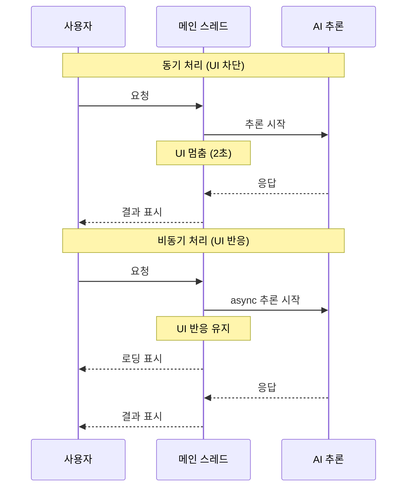
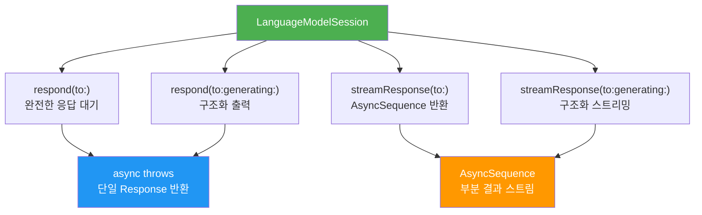
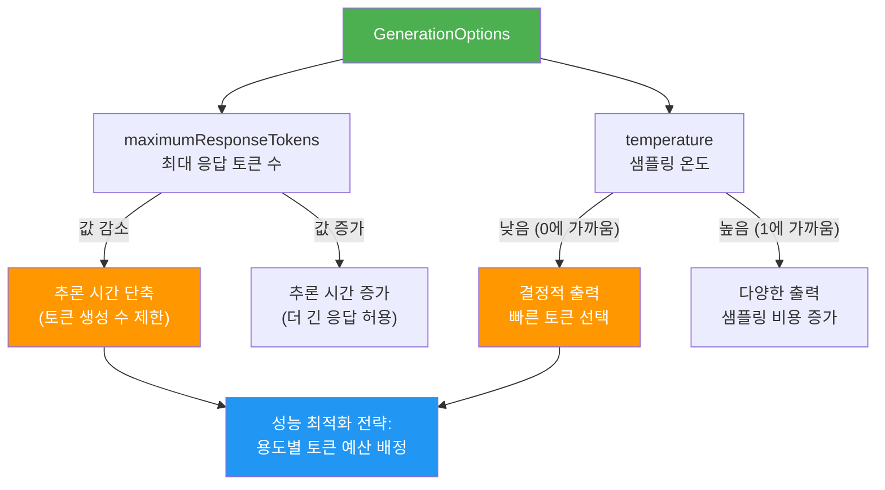
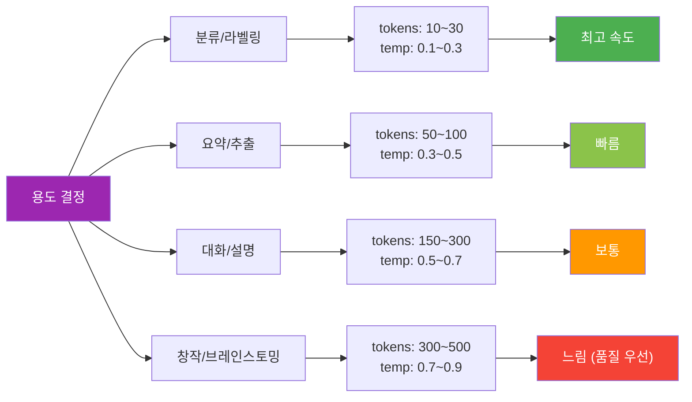
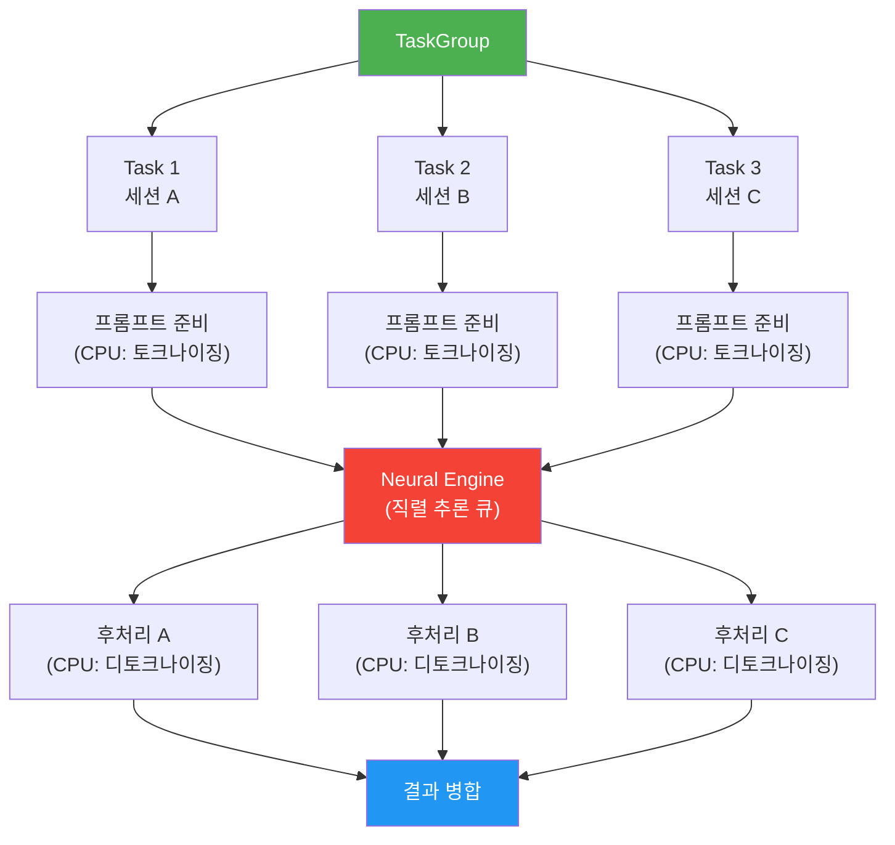
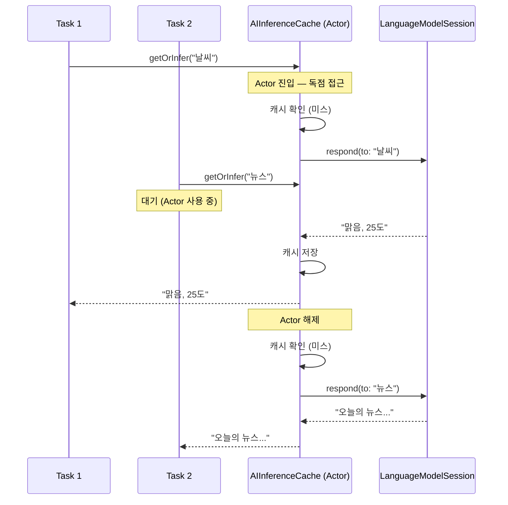
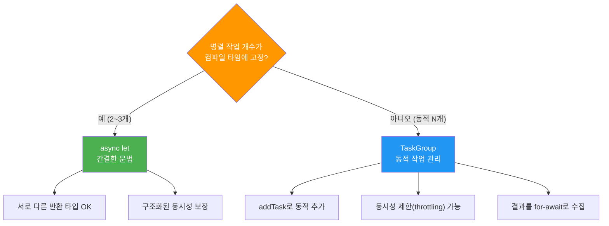
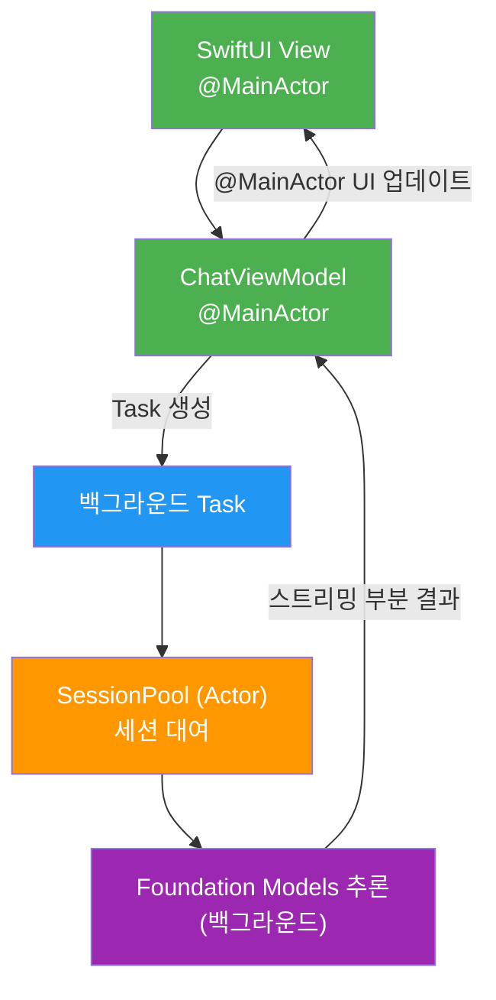

# 비동기 처리와 병렬 최적화

> Swift Concurrency를 활용하여 AI 추론 호출을 최적화하고, 병렬 처리로 응답 지연을 줄이는 전략을 학습합니다.

## 개요

이 섹션에서는 Foundation Models 프레임워크의 비동기 API를 깊이 이해하고, Swift Concurrency의 `async/await`, `TaskGroup`, `Actor`를 활용하여 AI 추론 성능을 극대화하는 방법을 배웁니다. 또한 `GenerationOptions` 파라미터 튜닝이 추론 속도에 미치는 영향을 분석하고, 최적의 설정 전략을 익힙니다.

**선수 지식**: [AI 추론 성능 프로파일링](18-ch18-성능-최적화와-프로파일링/01-01-ai-추론-성능-프로파일링.md)에서 배운 Instruments 계측 기법과 [메모리와 배터리 최적화](18-ch18-성능-최적화와-프로파일링/02-02-메모리와-배터리-최적화.md)의 리소스 관리 패턴, 그리고 [스트리밍 응답과 실시간 UI](06-ch6-스트리밍-응답과-실시간-ui/01-01-streamresponse-api-기초.md)에서 다룬 `streamResponse` API 기초

**학습 목표**:
- Foundation Models의 비동기 API 구조와 Swift Concurrency 통합 방식을 이해한다
- `TaskGroup`을 사용한 병렬 추론 패턴을 구현한다
- `Actor`로 AI 서비스의 상태를 안전하게 격리한다
- `GenerationOptions` 파라미터 튜닝으로 추론 시간을 단축하는 전략을 적용한다
- 메인 스레드 차단 없이 AI 응답을 처리하는 UX 패턴을 적용한다

## 왜 알아야 할까?

AI 추론은 본질적으로 느립니다. 온디바이스 모델이라 해도 토큰을 하나씩 생성하는 과정에서 수백 밀리초에서 수 초의 지연이 발생하죠. 문제는 이 지연이 사용자 경험을 직접적으로 해친다는 점입니다. "앱이 멈췄나?" 하는 의심이 드는 순간 사용자는 떠납니다.

Swift Concurrency는 이 문제를 우아하게 해결합니다. `async/await`로 비동기 호출을 동기 코드처럼 읽기 쉽게 작성하고, `TaskGroup`으로 여러 추론을 동시에 실행하며, `Actor`로 공유 상태를 안전하게 보호할 수 있거든요. 여기에 `GenerationOptions`의 `maximumResponseTokens`나 `temperature` 같은 파라미터를 적절히 조절하면, 모델이 생성하는 토큰 수 자체를 줄여서 추론 시간을 직접적으로 단축할 수도 있습니다. Foundation Models 프레임워크는 처음부터 Swift Concurrency 위에 설계되었기 때문에, 이 도구들을 제대로 활용하면 같은 하드웨어에서도 체감 성능을 극적으로 개선할 수 있습니다.

> 📊 **그림 1**: 동기 vs 비동기 AI 추론의 사용자 체감 차이



## 핵심 개념

### 개념 1: Foundation Models의 비동기 API 구조

> 💡 **비유**: 레스토랑에서 주문을 생각해보세요. 동기 방식은 주문하고 음식이 나올 때까지 카운터 앞에 서서 기다리는 겁니다. 비동기 방식은 주문 번호표를 받고 자리에 앉아 다른 일을 하다가, 번호가 호출되면 음식을 받으러 가는 거죠. Foundation Models의 `async/await`가 바로 이 번호표 시스템입니다.

Foundation Models 프레임워크의 모든 추론 API는 `async throws`로 선언되어 있습니다. `LanguageModelSession`의 핵심 메서드들을 살펴보죠:

```swift
// 기본 텍스트 응답 — async throws
let response = try await session.respond(to: "질문")

// 구조화 출력 — async throws
let result = try await session.respond(to: "분석해줘", generating: AnalysisResult.self)

// 스트리밍 — AsyncSequence 반환
let stream = session.streamResponse(to: "설명해줘")
for try await partial in stream {
    // 부분 결과를 실시간으로 처리
}
```

여기서 중요한 점은 **`LanguageModelSession`은 한 번에 하나의 요청만 처리**한다는 것입니다. 하나의 세션에서 동시에 두 개의 `respond(to:)`를 호출하면 순차적으로 실행됩니다. 병렬 추론이 필요하다면 **별도의 세션 인스턴스를 생성**해야 합니다.

> 📊 **그림 2**: LanguageModelSession의 비동기 API 계층 구조



각 메서드의 실행 특성을 이해하는 것이 최적화의 출발점입니다:

```swift
import FoundationModels

class AIService {
    // 세션은 한 번에 하나의 요청만 처리
    private let session = LanguageModelSession()
    
    // ✅ 순차 호출 — 안전하지만 느림
    func analyzeSequentially(texts: [String]) async throws -> [String] {
        var results: [String] = []
        for text in texts {
            // 각 요청이 이전 요청 완료 후 시작
            let response = try await session.respond(to: text)
            results.append(response.content)
        }
        return results
    }
}
```

> ⚠️ **흔한 오해**: "하나의 세션에서 `async let`으로 여러 요청을 동시에 보내면 병렬 실행된다"고 생각하기 쉽지만, `LanguageModelSession`은 내부적으로 요청을 직렬화합니다. 진정한 병렬 추론에는 **별도의 세션 인스턴스**가 필요합니다.

### 개념 2: GenerationOptions 튜닝으로 추론 시간 제어하기

> 💡 **비유**: 에세이 시험에서 "200자 이내로 답하시오"와 "자유롭게 서술하시오"의 차이를 생각해보세요. 글자 수 제한이 있으면 핵심만 빠르게 쓰고 끝내지만, 제한이 없으면 불필요한 내용까지 장황하게 쓰게 되죠. `GenerationOptions`의 `maximumResponseTokens`가 바로 이 "답안 분량 제한"입니다. 적절한 제한을 두면 모델이 꼭 필요한 토큰만 생성하고 멈추기 때문에, 추론 시간이 비례적으로 줄어듭니다.

비동기 처리와 병렬화가 "추론을 기다리는 방법"을 최적화한다면, `GenerationOptions`는 **"추론 자체의 작업량"을 줄이는** 직접적인 방법입니다. 온디바이스 LLM은 토큰을 하나씩 순차적으로 생성(autoregressive)하므로, 생성할 토큰 수가 줄면 추론 시간도 거의 선형적으로 감소합니다.

> 📊 **그림 3**: GenerationOptions 파라미터가 추론 성능에 미치는 영향



`GenerationOptions`의 핵심 파라미터를 하나씩 살펴보겠습니다:

#### maximumResponseTokens — 토큰 예산 관리

`maximumResponseTokens`는 모델이 생성할 수 있는 최대 토큰 수를 제한합니다. 이 값을 설정하지 않으면 모델은 자연 종료 토큰(EOS)이 나올 때까지 계속 생성하는데, 이는 불필요하게 긴 응답과 추론 시간을 초래할 수 있습니다:

```swift
import FoundationModels

// ❌ 토큰 제한 없음 — 모델이 원하는 만큼 생성 (느릴 수 있음)
let session = LanguageModelSession()
let longResponse = try await session.respond(to: "Swift의 역사를 설명해줘")

// ✅ 토큰 제한 설정 — 짧고 핵심적인 응답 유도
let options = GenerationOptions(maximumResponseTokens: 150)
let conciseResponse = try await session.respond(
    to: "Swift의 역사를 한 문단으로 요약해줘",
    options: options
)
```

용도별로 적절한 토큰 예산을 배정하면 불필요한 추론 시간을 크게 줄일 수 있습니다:

| 용도 | 권장 토큰 수 | 예상 응답 길이 | 성능 효과 |
|------|-------------|---------------|----------|
| 분류/라벨링 | 10~30 | 한 단어~한 줄 | 추론 시간 80%+ 단축 |
| 요약/한 줄 답변 | 50~100 | 1~2문장 | 추론 시간 50~70% 단축 |
| 짧은 설명 | 100~200 | 짧은 문단 | 추론 시간 30~50% 단축 |
| 상세 분석/생성 | 300~500 | 여러 문단 | 기본 성능 |

```swift
import FoundationModels

struct PerformanceOptimizedService {
    /// 감정 분류 — 토큰 최소화로 빠른 응답
    func classifySentiment(_ text: String) async throws -> String {
        let session = LanguageModelSession()
        // 분류 결과는 "긍정", "부정", "중립" 정도 → 토큰 20개면 충분
        let options = GenerationOptions(maximumResponseTokens: 20)
        let response = try await session.respond(
            to: "다음 텍스트의 감정을 '긍정', '부정', '중립' 중 하나로 분류해: \(text)",
            options: options
        )
        return response.content
    }
    
    /// 요약 — 적당한 토큰 예산으로 핵심만
    func summarize(_ text: String) async throws -> String {
        let session = LanguageModelSession()
        let options = GenerationOptions(maximumResponseTokens: 100)
        let response = try await session.respond(
            to: "다음 텍스트를 한 줄로 요약해: \(text)",
            options: options
        )
        return response.content
    }
    
    /// 상세 분석 — 충분한 토큰 허용
    func analyzeInDetail(_ text: String) async throws -> String {
        let session = LanguageModelSession()
        let options = GenerationOptions(maximumResponseTokens: 400)
        let response = try await session.respond(
            to: "다음 텍스트를 주제, 어조, 핵심 논점 관점에서 상세히 분석해: \(text)",
            options: options
        )
        return response.content
    }
}
```

#### temperature — 샘플링 전략과 성능

`temperature`는 토큰 선택의 무작위성을 제어합니다. 낮은 temperature(0에 가까움)는 확률이 가장 높은 토큰을 거의 결정적으로 선택하는 반면, 높은 temperature(1에 가까움)는 확률 분포를 평탄화하여 다양한 토큰이 선택될 가능성을 높입니다:

```swift
import FoundationModels

// 분류/추출 — 낮은 temperature로 일관된 결과
let classificationOptions = GenerationOptions(
    maximumResponseTokens: 30,
    temperature: 0.2  // 결정적, 일관된 출력
)

// 창작/브레인스토밍 — 높은 temperature로 다양한 결과
let creativeOptions = GenerationOptions(
    maximumResponseTokens: 300,
    temperature: 0.8  // 다양하고 창의적인 출력
)
```

성능 관점에서 보면, 낮은 temperature는 탐색 공간이 좁아져 토큰 선택이 빨라질 수 있고, EOS 토큰에 더 빨리 수렴하는 경향이 있습니다. 반면 높은 temperature는 예측하기 어려운 토큰을 선택하면서 응답이 길어지는 경향이 있어, 같은 `maximumResponseTokens` 설정에서도 실제 생성 토큰 수가 달라질 수 있습니다.

> 📊 **그림 4**: 용도별 GenerationOptions 최적 설정 가이드



> ⚠️ **흔한 오해**: "`maximumResponseTokens`를 극단적으로 낮추면 항상 좋다"고 생각하기 쉽지만, 토큰이 부족하면 모델이 문장 중간에서 잘린 불완전한 응답을 반환합니다. 구조화 출력(`generating:` 파라미터)의 경우 JSON 구조가 깨져서 디코딩 에러가 발생할 수도 있어요. **프롬프트의 기대 응답 길이에 맞는 적절한 여유**를 두는 것이 핵심입니다.

> 🔥 **실무 팁**: 병렬 추론과 `GenerationOptions`를 결합하면 효과가 배가됩니다. 예를 들어 10개 텍스트를 분류할 때, `maximumResponseTokens: 20`으로 설정하고 3개 세션으로 병렬 처리하면 — 토큰 제한으로 각 추론이 빨라지는 데다 병렬 파이프라이닝까지 적용되어, 기본 설정 대비 체감 속도가 크게 향상됩니다.

### 개념 3: TaskGroup으로 병렬 추론 구현하기

> 💡 **비유**: 한 명의 셰프(세션)가 10개 주문을 순서대로 처리하면 오래 걸리지만, 3명의 셰프가 나눠서 처리하면 훨씬 빠르죠. `TaskGroup`은 이 "셰프 팀 운영" 시스템입니다. 각 셰프에게 독립된 주방 공간(세션)을 배정하고, 모든 요리가 끝나면 한꺼번에 서빙합니다.

`TaskGroup`은 Swift Concurrency에서 동적 개수의 병렬 작업을 관리하는 핵심 도구입니다. Foundation Models와 함께 사용하면 여러 추론을 동시에 실행할 수 있습니다:

```swift
import FoundationModels

struct ParallelInferenceService {
    /// 여러 프롬프트를 병렬로 추론
    func inferInParallel(prompts: [String]) async throws -> [String] {
        // withThrowingTaskGroup으로 병렬 작업 그룹 생성
        try await withThrowingTaskGroup(of: (Int, String).self) { group in
            for (index, prompt) in prompts.enumerated() {
                group.addTask {
                    // 각 Task마다 독립된 세션 생성 — 핵심!
                    let session = LanguageModelSession()
                    let response = try await session.respond(to: prompt)
                    return (index, response.content)
                }
            }
            
            // 결과를 순서대로 정렬하여 반환
            var results = Array(repeating: "", count: prompts.count)
            for try await (index, content) in group {
                results[index] = content
            }
            return results
        }
    }
}
```

하지만 여기서 주의할 점이 있습니다. 아무리 많은 세션을 만들어도 **Neural Engine은 하드웨어적으로 하나**이기 때문에, 실제 추론은 내부적으로 직렬화됩니다. 그렇다면 병렬 세션의 의미는 무엇일까요?

> 📊 **그림 5**: 병렬 세션의 실제 실행 흐름 — Neural Engine의 직렬 추론과 전후처리 오버랩



Apple의 Neural Engine(ANE)은 Core ML 레벨에서 추론 요청을 직렬 큐로 관리합니다. 이는 ANE가 단일 모델 실행 파이프라인으로 설계되어 있기 때문인데요, [Neural Engine 아키텍처](14-ch14-apple-intelligence-아키텍처-심층-분석/02-02-neural-engine과-온디바이스-추론-파이프라인.md)에서 다룬 것처럼 ANE는 하드웨어 레벨에서 하나의 추론 그래프를 최적화하여 실행하는 구조입니다. 여러 추론 요청이 동시에 들어오면 Core ML의 `MLComputePlan`이 이를 스케줄링하여 순차적으로 ANE에 디스패치합니다.

그럼에도 병렬 세션이 의미 있는 이유는 **전처리와 후처리의 오버랩(파이프라이닝)**에 있습니다:
- 세션 A가 Neural Engine에서 추론하는 동안 세션 B는 프롬프트를 토크나이징(CPU)
- 세션 B의 추론이 끝나면 세션 C가 바로 시작하면서, 세션 B는 결과를 디토크나이징(CPU)
- 이 파이프라이닝 효과로 전체 처리 시간이 단축됨

> 📊 **그림 6**: 파이프라이닝 효과 — 순차 vs 병렬 세션의 타임라인 비교

```mermaid
gantt
    title 순차 처리 vs 병렬 파이프라이닝
    dateFormat X
    axisFormat %s

    section 순차 처리
    준비 A     :a1, 0, 1
    추론 A     :a2, after a1, 3
    후처리 A   :a3, after a2, 1
    준비 B     :b1, after a3, 1
    추론 B     :b2, after b1, 3
    후처리 B   :b3, after b2, 1

    section 병렬 파이프라이닝
    준비 A     :pa1, 0, 1
    추론 A     :pa2, after pa1, 3
    후처리 A   :pa3, after pa2, 1
    준비 B     :pb1, 0, 1
    추론 B     :pb2, after pa2, 3
    후처리 B   :pb3, after pb2, 1
```



세션 수를 무한정 늘리는 것은 오히려 메모리 부담만 키웁니다. 실무에서는 **2~4개 병렬 세션**이 최적인 경우가 많습니다:

```swift
struct ThrottledParallelInference {
    /// 동시 추론 수를 제한하는 병렬 처리
    func inferWithLimit(
        prompts: [String],
        maxConcurrent: Int = 3
    ) async throws -> [String] {
        var results = Array(repeating: "", count: prompts.count)
        
        // 프롬프트를 maxConcurrent 크기의 청크로 분할
        for chunk in stride(from: 0, to: prompts.count, by: maxConcurrent) {
            let end = min(chunk + maxConcurrent, prompts.count)
            let batch = Array(prompts[chunk..<end])
            
            try await withThrowingTaskGroup(of: (Int, String).self) { group in
                for (offset, prompt) in batch.enumerated() {
                    let globalIndex = chunk + offset
                    group.addTask {
                        let session = LanguageModelSession()
                        let response = try await session.respond(to: prompt)
                        return (globalIndex, response.content)
                    }
                }
                
                for try await (index, content) in group {
                    results[index] = content
                }
            }
        }
        
        return results
    }
}
```

### 개념 4: Actor로 AI 서비스 상태 보호하기

> 💡 **비유**: 은행 창구를 생각해보세요. 여러 고객이 동시에 같은 계좌에서 출금하면 잔고가 엉망이 되죠. `Actor`는 이 계좌에 "한 번에 한 명만 접근" 규칙을 자동으로 적용하는 은행 시스템입니다. AI 서비스에서 캐시, 사용 통계, 세션 풀 같은 공유 상태를 보호할 때 꼭 필요합니다.

병렬 추론을 하면 자연스럽게 **공유 상태** 문제가 발생합니다. 추론 결과 캐시, 사용량 카운터, 세션 풀 등을 여러 Task에서 동시에 접근하면 데이터 레이스가 일어날 수 있죠. Swift의 `Actor`가 이 문제를 컴파일 타임에 방지합니다:

```swift
import FoundationModels

/// Actor로 격리된 AI 추론 캐시
actor AIInferenceCache {
    private var cache: [String: String] = [:]  // 프롬프트 → 응답
    private var hitCount = 0
    private var missCount = 0
    
    /// 캐시 조회 또는 추론 실행
    func getOrInfer(prompt: String) async throws -> String {
        // 캐시 히트 — 추론 없이 즉시 반환
        if let cached = cache[prompt] {
            hitCount += 1
            return cached
        }
        
        // 캐시 미스 — 새로운 추론 실행
        missCount += 1
        let session = LanguageModelSession()
        let response = try await session.respond(to: prompt)
        let content = response.content
        
        // 결과를 캐시에 저장
        cache[prompt] = content
        return content
    }
    
    /// 캐시 통계 조회
    var stats: (hits: Int, misses: Int) {
        (hitCount, missCount)
    }
}
```

> 📊 **그림 7**: Actor 격리 패턴의 동작 원리



실전에서는 세션 풀(Session Pool) 패턴을 Actor로 구현하면 세션 생성 비용을 줄이면서도 스레드 안전성을 보장할 수 있습니다:

```swift
import FoundationModels

/// Actor 기반 세션 풀 — 세션 재사용으로 오버헤드 감소
actor SessionPool {
    private var available: [LanguageModelSession] = []
    private let maxSize: Int
    private var created = 0
    
    init(maxSize: Int = 4) {
        self.maxSize = maxSize
    }
    
    /// 세션 대여 — 없으면 새로 생성
    func acquire() -> LanguageModelSession {
        if let session = available.popLast() {
            return session
        }
        created += 1
        return LanguageModelSession()
    }
    
    /// 세션 반납 — 풀 크기 이내면 재사용 대기
    func release(_ session: LanguageModelSession) {
        if available.count < maxSize {
            available.append(session)
        }
        // maxSize 초과 시 세션은 자동 해제(deinit)
    }
    
    var poolStatus: String {
        "사용 가능: \(available.count), 총 생성: \(created)"
    }
}
```

세션 풀과 TaskGroup을 결합하면 리소스를 효율적으로 관리하면서 병렬 추론을 수행할 수 있습니다:

```swift
import FoundationModels

/// 세션 풀 + TaskGroup 결합 패턴
struct PooledParallelInference {
    private let pool = SessionPool(maxSize: 3)
    
    func inferBatch(prompts: [String]) async throws -> [String] {
        try await withThrowingTaskGroup(of: (Int, String).self) { group in
            for (index, prompt) in prompts.enumerated() {
                group.addTask {
                    // 풀에서 세션 대여
                    let session = await pool.acquire()
                    
                    // 추론 완료 후 반드시 반납
                    defer { Task { await pool.release(session) } }
                    
                    let response = try await session.respond(to: prompt)
                    return (index, response.content)
                }
            }
            
            var results = Array(repeating: "", count: prompts.count)
            for try await (index, content) in group {
                results[index] = content
            }
            return results
        }
    }
}
```

> 🔥 **실무 팁**: Actor 내부에서 오래 걸리는 `await` 호출을 하면 Actor reentrancy 문제가 발생할 수 있습니다. 위의 `getOrInfer` 예제에서 같은 프롬프트로 두 번 동시에 호출하면, 첫 번째가 `await session.respond`에서 대기하는 동안 두 번째가 진입하여 캐시 미스로 중복 추론을 할 수 있습니다. 이를 방지하려면 "진행 중" 상태를 별도로 추적하세요:

```swift
actor SmartInferenceCache {
    private var cache: [String: String] = [:]
    // 진행 중인 추론을 추적하여 중복 요청 방지
    private var inProgress: [String: Task<String, Error>] = [:]
    
    func getOrInfer(prompt: String) async throws -> String {
        // 1. 캐시 히트
        if let cached = cache[prompt] {
            return cached
        }
        
        // 2. 이미 진행 중인 동일 요청이 있으면 그 결과를 대기
        if let existingTask = inProgress[prompt] {
            return try await existingTask.value
        }
        
        // 3. 새로운 추론 Task 생성 및 등록
        let task = Task<String, Error> {
            let session = LanguageModelSession()
            let response = try await session.respond(to: prompt)
            return response.content
        }
        inProgress[prompt] = task
        
        do {
            let result = try await task.value
            cache[prompt] = result
            inProgress.removeValue(forKey: prompt)
            return result
        } catch {
            inProgress.removeValue(forKey: prompt)
            throw error
        }
    }
}
```

### 개념 5: async let과 구조화된 동시성

> 💡 **비유**: `async let`은 식당에서 메인 요리와 디저트를 동시에 주문하는 것과 같습니다. 메인이 나올 때까지 디저트를 기다릴 필요 없이, 둘 다 주방에 넣어놓고 먼저 되는 것부터 받는 거죠. 정적으로 개수가 정해진 병렬 작업에 적합합니다.

`TaskGroup`이 동적 개수의 병렬 작업에 적합하다면, `async let`은 **정해진 2~3개의 독립 작업**을 동시에 실행할 때 더 간결합니다:

```swift
import FoundationModels

struct MultiAnalysisService {
    /// 하나의 텍스트를 여러 관점에서 동시에 분석
    func analyzeFromMultipleAngles(text: String) async throws -> AnalysisReport {
        // 세 가지 분석을 동시에 시작 — 각각 토큰 예산 최적화
        async let sentiment = analyzeSentiment(text)
        async let summary = summarize(text)
        async let keywords = extractKeywords(text)
        
        // 모든 결과가 준비될 때까지 대기
        return try await AnalysisReport(
            sentiment: sentiment,
            summary: summary,
            keywords: keywords
        )
    }
    
    private func analyzeSentiment(_ text: String) async throws -> String {
        let session = LanguageModelSession()
        // 감정 분류는 짧은 응답 → 토큰 제한으로 속도 향상
        let options = GenerationOptions(maximumResponseTokens: 30)
        let response = try await session.respond(
            to: "다음 텍스트의 감정을 분석해줘: \(text)",
            options: options
        )
        return response.content
    }
    
    private func summarize(_ text: String) async throws -> String {
        let session = LanguageModelSession()
        let options = GenerationOptions(maximumResponseTokens: 100)
        let response = try await session.respond(
            to: "다음 텍스트를 한 줄로 요약해줘: \(text)",
            options: options
        )
        return response.content
    }
    
    private func extractKeywords(_ text: String) async throws -> String {
        let session = LanguageModelSession()
        let options = GenerationOptions(maximumResponseTokens: 80)
        let response = try await session.respond(
            to: "다음 텍스트의 핵심 키워드 5개를 추출해줘: \(text)",
            options: options
        )
        return response.content
    }
}

struct AnalysisReport {
    let sentiment: String
    let summary: String
    let keywords: String
}
```

> 📊 **그림 8**: async let vs TaskGroup 선택 가이드



| 상황 | 추천 도구 | 이유 |
|------|----------|------|
| 분석 2~3개 동시 실행 | `async let` | 코드가 간결하고 타입 안전 |
| N개 프롬프트 배치 처리 | `TaskGroup` | 동적 개수 지원, 결과 수집 용이 |
| 스트리밍 + 비스트리밍 혼합 | `async let` | 서로 다른 반환 타입 처리 가능 |
| 동시성 제한(throttling) 필요 | `TaskGroup` + 청크 | 메모리/리소스 제어 용이 |

### 개념 6: 메인 스레드 차단 방지 패턴

> 💡 **비유**: UI 스레드는 고속도로의 "긴급 차선"과 같습니다. 이 차선이 막히면 모든 교통(사용자 인터랙션)이 멈추죠. AI 추론 같은 "화물 트럭"은 반드시 일반 차선(백그라운드 스레드)으로 보내야 합니다.

SwiftUI의 `@Observable` ViewModel에서 AI 추론을 호출할 때, 메인 스레드 차단을 방지하는 것이 핵심입니다. Swift 6의 Strict Concurrency에서는 `@MainActor` 격리를 명시적으로 관리해야 합니다:

```swift
import SwiftUI
import FoundationModels

@Observable
@MainActor
class ChatViewModel {
    var messages: [ChatMessage] = []
    var isGenerating = false
    var errorMessage: String?
    
    private let sessionPool = SessionPool(maxSize: 3)
    
    /// AI 응답 생성 — 메인 스레드 차단 없음
    func generateResponse(to userMessage: String) {
        guard !isGenerating else { return }
        
        isGenerating = true
        messages.append(ChatMessage(role: .user, content: userMessage))
        
        // Task로 비동기 작업 시작 — UI 즉시 반환
        Task {
            do {
                let session = await sessionPool.acquire()
                defer { Task { await sessionPool.release(session) } }
                
                // 스트리밍으로 실시간 업데이트
                let placeholder = ChatMessage(role: .assistant, content: "")
                messages.append(placeholder)
                let lastIndex = messages.count - 1
                
                let stream = session.streamResponse(to: userMessage)
                for try await partial in stream {
                    // @MainActor이므로 UI 업데이트 안전
                    messages[lastIndex].content = partial.content
                }
                
                isGenerating = false
            } catch {
                errorMessage = "응답 생성 실패: \(error.localizedDescription)"
                isGenerating = false
            }
        }
    }
}

struct ChatMessage: Identifiable {
    let id = UUID()
    let role: Role
    var content: String
    
    enum Role { case user, assistant }
}
```

> 📊 **그림 9**: MainActor와 백그라운드 작업의 실행 흐름



#### Swift 6.2의 Approachable Concurrency와 `@concurrent`

Swift 6.2(SE-0461)에서는 `nonisolated` 함수의 기본 동작이 변경되었습니다. 기존에는 `nonisolated async` 함수가 글로벌 executor(백그라운드)에서 실행되었지만, Swift 6.2부터는 **호출자의 격리 도메인(isolation domain)을 상속**합니다. 즉, `@MainActor`에서 호출한 `nonisolated async` 함수가 메인 스레드에서 실행될 수 있다는 뜻이죠.

이를 명시적으로 제어하기 위해 SE-0461은 `@concurrent` 어트리뷰트를 도입했습니다. 이 어트리뷰트는 "이 함수는 항상 글로벌 executor에서 실행하라"고 컴파일러에게 알려줍니다:

```swift
import FoundationModels

actor AIProcessor {
    /// @concurrent로 명시적 백그라운드 실행 (Swift 6.2+, SE-0461)
    /// 호출자가 @MainActor이더라도 글로벌 executor에서 실행됨
    @concurrent
    nonisolated func heavyInference(prompt: String) async throws -> String {
        // 이 함수는 항상 글로벌 executor(백그라운드)에서 실행
        let session = LanguageModelSession()
        let response = try await session.respond(to: prompt)
        return response.content
    }
}
```

> ⚠️ **흔한 오해**: `@concurrent`는 "여러 호출을 동시에 실행한다"는 의미가 아닙니다. "호출자의 격리를 상속하지 않고 글로벌 executor에서 실행한다"는 의미입니다. 이름이 직관적이지 않아 혼동하기 쉬운데, SE-0461 제안서를 참고하면 정확한 의미를 이해할 수 있습니다. `Sendable` 준수나 `nonisolated` 키워드와는 별개의 개념이에요.

## 실습: 직접 해보기

여러 텍스트를 병렬로 분석하고, 캐시와 세션 풀을 활용하며, `GenerationOptions`로 용도별 토큰 예산을 최적화하는 완전한 AI 분석 서비스를 구현해봅시다:

```swift
import SwiftUI
import FoundationModels

// MARK: - 세션 풀 (Actor)
actor InferenceSessionPool {
    private var available: [LanguageModelSession] = []
    private let maxSize: Int
    
    init(maxSize: Int = 3) {
        self.maxSize = maxSize
    }
    
    func acquire() -> LanguageModelSession {
        if let session = available.popLast() {
            return session
        }
        return LanguageModelSession()
    }
    
    func release(_ session: LanguageModelSession) {
        if available.count < maxSize {
            available.append(session)
        }
    }
}

// MARK: - 추론 캐시 (Actor)
actor InferenceCache {
    private var cache: [String: String] = [:]
    
    func get(_ key: String) -> String? { cache[key] }
    func set(_ key: String, value: String) { cache[key] = value }
}

// MARK: - 병렬 분석 서비스 (GenerationOptions 최적화 적용)
struct ParallelAnalysisService {
    private let pool = InferenceSessionPool(maxSize: 3)
    private let cache = InferenceCache()
    
    /// 여러 텍스트를 병렬로 요약 — 토큰 예산 최적화 적용
    func summarizeBatch(texts: [String]) async throws -> [String] {
        // 요약은 짧은 응답이면 충분 → 토큰 제한으로 속도 향상
        let options = GenerationOptions(maximumResponseTokens: 100)
        
        return try await withThrowingTaskGroup(of: (Int, String).self) { group in
            for (index, text) in texts.enumerated() {
                group.addTask {
                    // 캐시 확인
                    if let cached = await cache.get(text) {
                        return (index, cached)
                    }
                    
                    // 세션 풀에서 대여
                    let session = await pool.acquire()
                    defer { Task { await pool.release(session) } }
                    
                    // 추론 실행 — GenerationOptions 적용
                    let prompt = "다음 텍스트를 한 줄로 요약해줘: \(text)"
                    let response = try await session.respond(
                        to: prompt,
                        options: options
                    )
                    let result = response.content
                    
                    // 캐시 저장
                    await cache.set(text, value: result)
                    
                    return (index, result)
                }
            }
            
            // 결과를 원래 순서대로 정렬
            var results = Array(repeating: "", count: texts.count)
            for try await (index, content) in group {
                results[index] = content
            }
            return results
        }
    }
}

// MARK: - ViewModel
@Observable
@MainActor
class BatchAnalysisViewModel {
    var inputTexts: [String] = [
        "Swift는 Apple이 2014년 WWDC에서 발표한 프로그래밍 언어입니다.",
        "Foundation Models 프레임워크는 온디바이스 AI를 가능하게 합니다.",
        "Neural Engine은 Apple Silicon의 ML 전용 하드웨어입니다."
    ]
    var summaries: [String] = []
    var isProcessing = false
    var elapsedTime: TimeInterval = 0
    
    private let service = ParallelAnalysisService()
    
    func runBatchAnalysis() {
        guard !isProcessing else { return }
        isProcessing = true
        summaries = []
        
        Task {
            let start = CFAbsoluteTimeGetCurrent()
            
            do {
                // 병렬 배치 요약 실행 (GenerationOptions 자동 적용)
                summaries = try await service.summarizeBatch(texts: inputTexts)
                elapsedTime = CFAbsoluteTimeGetCurrent() - start
            } catch {
                summaries = ["오류 발생: \(error.localizedDescription)"]
            }
            
            isProcessing = false
        }
    }
}

// MARK: - SwiftUI View
struct BatchAnalysisView: View {
    @State private var viewModel = BatchAnalysisViewModel()
    
    var body: some View {
        NavigationStack {
            List {
                Section("입력 텍스트") {
                    ForEach(viewModel.inputTexts, id: \.self) { text in
                        Text(text)
                            .font(.caption)
                            .foregroundStyle(.secondary)
                    }
                }
                
                Section("요약 결과") {
                    if viewModel.isProcessing {
                        ProgressView("병렬 분석 중...")
                    } else if viewModel.summaries.isEmpty {
                        Text("분석 버튼을 눌러주세요")
                            .foregroundStyle(.tertiary)
                    } else {
                        ForEach(viewModel.summaries.indices, id: \.self) { i in
                            VStack(alignment: .leading) {
                                Text("텍스트 \(i + 1)")
                                    .font(.caption)
                                    .foregroundStyle(.blue)
                                Text(viewModel.summaries[i])
                            }
                        }
                        
                        Text("소요 시간: \(viewModel.elapsedTime, specifier: "%.2f")초")
                            .font(.caption)
                            .foregroundStyle(.green)
                    }
                }
            }
            .navigationTitle("병렬 AI 분석")
            .toolbar {
                Button("분석 시작") {
                    viewModel.runBatchAnalysis()
                }
                .disabled(viewModel.isProcessing)
            }
        }
    }
}
```

## 더 깊이 알아보기

### Swift Concurrency의 탄생 — GCD에서 async/await까지

Swift Concurrency는 하루아침에 탄생한 것이 아닙니다. Apple은 2009년에 Grand Central Dispatch(GCD)를 발표하며 동시성 프로그래밍의 혁신을 이끌었지만, 콜백 지옥(callback hell), 데이터 레이스, 우선순위 역전 같은 고질적 문제가 남아있었죠.

2017년, Chris Lattner(Swift 창시자)가 "Swift Concurrency Manifesto"라는 문서를 작성하면서 `async/await`, `Actor` 모델의 청사진이 그려졌습니다. 이후 SE-0296(`async/await`), SE-0306(`Actor`), SE-0317(`TaskGroup`) 등의 Swift Evolution 제안을 거쳐 Swift 5.5(2021)에서 첫 도입되었고, Swift 6(2024)에서 Strict Concurrency가 기본 활성화되며 완성되었습니다.

흥미로운 점은, Actor 모델 자체는 1973년 Carl Hewitt가 MIT에서 제안한 개념이라는 겁니다. 50년 넘은 아이디어가 현대 프로그래밍 언어에서 비로소 실용화된 셈이죠. Erlang/OTP가 Actor 모델을 텔레콤 시스템에 성공적으로 적용한 사례가 Swift 팀에 영감을 주었다고 알려져 있습니다.

Foundation Models 프레임워크가 처음부터 Swift Concurrency 위에 설계된 것은 이런 긴 여정의 결실입니다. `LanguageModelSession`의 모든 메서드가 `async throws`인 이유, `streamResponse`가 `AsyncSequence`를 반환하는 이유 — 모두 이 역사의 연장선에 있습니다.

### Neural Engine과 병렬 추론의 현실

Apple의 Neural Engine(ANE)은 초당 수십 TOPS(Trillion Operations Per Second)의 연산 능력을 가지지만, 단일 추론 파이프라인으로 설계되어 있습니다. WWDC23의 "Explore machine learning on Apple platforms" 세션에서 Apple 엔지니어들이 설명한 것처럼, Core ML은 ANE에 대한 추론 요청을 내부 직렬 큐(serial dispatch queue)로 관리합니다. 여러 `MLModel.prediction()` 호출이 동시에 들어와도 ANE 레벨에서는 하나씩 순차 처리되는 것이죠.

이 아키텍처 결정에는 합리적인 이유가 있습니다. ANE는 모델의 전체 연산 그래프를 한 번에 최적화하여 실행하는데, 이 과정에서 내부 메모리(SRAM)와 데이터 경로를 모델 전용으로 할당합니다. 여러 모델이 동시에 ANE를 점유하면 컨텍스트 스위칭 비용이 추론 자체보다 커질 수 있거든요. 이 내용은 [Neural Engine과 온디바이스 추론 파이프라인](14-ch14-apple-intelligence-아키텍처-심층-분석/02-02-neural-engine과-온디바이스-추론-파이프라인.md)에서 ANE 하드웨어 구조를 다룰 때 더 상세하게 설명합니다.

그럼에도 병렬 세션이 의미 있는 이유는, 토크나이징, 프롬프트 조합, 결과 파싱 등 **추론 전후의 CPU 작업**이 오버랩되어 전체 파이프라인 처리량(throughput)이 증가하기 때문입니다. 특히 토크나이저가 SentencePiece 기반으로 복잡한 전처리를 수행하는 경우, 이 오버랩 효과가 체감될 수 있습니다.

## 흔한 오해와 팁

> ⚠️ **흔한 오해**: "TaskGroup에 Task를 100개 넣으면 100배 빨라진다." 실제로는 Neural Engine이 직렬로 추론하므로, 병렬 세션 수를 늘려도 속도 향상은 전처리/후처리 오버랩에 한정됩니다. 세션 수는 2~4개가 최적이며, 그 이상은 메모리만 낭비합니다.

> 💡 **알고 계셨나요?**: Swift의 `TaskGroup`은 내부적으로 cooperative thread pool 위에서 동작하며, 기본적으로 시스템의 코어 수만큼 스레드를 사용합니다. 하지만 Foundation Models 추론은 Neural Engine이 담당하므로, CPU 코어 수와 AI 추론 병렬성은 별개입니다. CPU 코어는 전처리/후처리에만 활용됩니다.

> 🔥 **실무 팁**: `GenerationOptions`의 `maximumResponseTokens`를 용도에 맞게 설정하는 것은 **가장 쉬우면서도 효과가 큰 최적화**입니다. 분류 작업에 기본값(제한 없음)을 사용하면 모델이 불필요한 설명을 덧붙여 응답이 길어지는 경우가 많습니다. "긍정/부정/중립"만 필요한 분류에 `maximumResponseTokens: 20`을 설정하면, 같은 품질의 결과를 훨씬 빠르게 얻을 수 있습니다.

> 🔥 **실무 팁**: Actor 내부에서 긴 `await` 호출은 Actor reentrancy를 유발합니다. 예를 들어, 캐시 Actor에서 `await session.respond()`를 호출하면 대기 중 다른 호출이 진입할 수 있습니다. 해결책으로 `Task`를 Actor 외부에서 실행하고, Actor에는 캐시 읽기/쓰기만 짧게 위임하는 패턴을 사용하세요. 앞의 `SmartInferenceCache` 예제처럼 진행 중인 Task를 추적하는 것도 좋은 방법입니다.

> 🔥 **실무 팁**: `Task.cancel()`로 진행 중인 추론을 취소할 수 있습니다. `streamResponse`는 `AsyncSequence`이므로 `for try await` 루프에서 `Task.isCancelled`를 체크하거나, `Task`를 직접 취소하면 스트림이 자동으로 종료됩니다. 사용자가 "취소" 버튼을 눌렀을 때 불필요한 추론을 즉시 중단하세요.

## 핵심 정리

| 개념 | 설명 |
|------|------|
| `LanguageModelSession` | 한 번에 하나의 요청만 처리. 병렬 추론에는 별도 세션 인스턴스 필요 |
| `GenerationOptions` | `maximumResponseTokens`와 `temperature`로 추론 작업량을 직접 제어. 용도별 토큰 예산 배정이 핵심 |
| `maximumResponseTokens` | 최대 응답 토큰 수 제한. 분류(20), 요약(100), 상세 분석(400) 등 용도에 맞게 설정하면 추론 시간 비례 단축 |
| `temperature` | 낮으면 결정적/빠른 수렴, 높으면 다양/느린 경향. 분류(0.2), 대화(0.5~0.7), 창작(0.8) |
| `TaskGroup` | 동적 개수의 병렬 추론 관리. `addTask`로 각 Task에 독립 세션 할당 |
| `async let` | 정적 2~3개 독립 작업의 동시 실행. 서로 다른 분석을 동시에 처리할 때 적합 |
| `Actor` | 공유 상태(캐시, 세션 풀, 통계)의 스레드 안전한 격리. 컴파일 타임 보장 |
| Session Pool 패턴 | Actor로 세션 재사용 관리. 세션 생성/해제 오버헤드 감소 |
| `@MainActor` | UI 업데이트를 메인 스레드에서 안전하게 실행. ViewModel에 적용 |
| `@concurrent` (SE-0461) | Swift 6.2에서 도입. 호출자 격리를 상속하지 않고 글로벌 executor에서 실행 선언 |
| Neural Engine 직렬 추론 | ANE는 추론 요청을 직렬 큐로 관리. 병렬 세션의 이점은 전/후처리 오버랩에 한정 |

## 다음 섹션 미리보기

비동기/병렬 처리로 내부 성능을 최적화했다면, 다음은 **사용자가 직접 체감하는 성능**을 개선할 차례입니다. [사용자 체감 성능 개선](18-ch18-성능-최적화와-프로파일링/04-04-사용자-체감-성능-개선.md)에서는 `session.prewarm()`을 활용한 선제적 모델 로딩, 스켈레톤 UI와 점진적 콘텐츠 표시, 응답 지연을 숨기는 UX 테크닉을 배웁니다. 기술적 최적화를 사용자 경험으로 연결하는 마지막 퍼즐 조각이죠.

## 참고 자료

- [Foundation Models — Apple Developer Documentation](https://developer.apple.com/documentation/FoundationModels) - Foundation Models 프레임워크의 공식 API 레퍼런스. LanguageModelSession의 비동기 메서드 시그니처와 GenerationOptions 파라미터 확인
- [Deep dive into the Foundation Models framework — WWDC25](https://developer.apple.com/videos/play/wwdc2025/301/) - Tool Calling의 병렬/직렬 실행, 스트리밍, GenerationOptions 활용 팁을 포함한 심화 세션
- [Meet the Foundation Models framework — WWDC25](https://developer.apple.com/videos/play/wwdc2025/286/) - Foundation Models의 기본 개념과 Swift Concurrency 통합 소개
- [SE-0461: Approachable Concurrency — Swift Evolution](https://github.com/swiftlang/swift-evolution/blob/main/proposals/0461-async-function-isolation.md) - `@concurrent` 어트리뷰트와 `nonisolated(nonsending)` 기본 동작 변경의 공식 제안서
- [Approachable Concurrency in Swift 6.2 — SwiftLee](https://www.avanderlee.com/concurrency/approachable-concurrency-in-swift-6-2-a-clear-guide/) - Swift 6.2의 `@concurrent`, `nonisolated(nonsending)` 등 새로운 동시성 기능 해설
- [Exploring concurrency changes in Swift 6.2 — Donny Wals](https://www.donnywals.com/exploring-concurrency-changes-in-swift-6-2/) - Swift 6.2 동시성 변경사항의 실용적 가이드
- [Building AI features using Foundation Models — Swift with Majid](https://swiftwithmajid.com/2025/08/19/building-ai-features-using-foundation-models/) - Foundation Models를 SwiftUI 앱에 통합하는 실전 패턴

---
### 🔗 Related Sessions
- [foundation models 인스트루먼트](18-ch18-성능-최적화와-프로파일링/01-01-ai-추론-성능-프로파일링.md) (prerequisite)
- [smartairesourcemanager](18-ch18-성능-최적화와-프로파일링/02-02-메모리와-배터리-최적화.md) (prerequisite)
