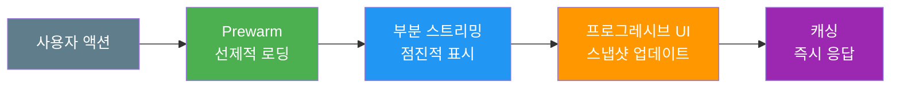
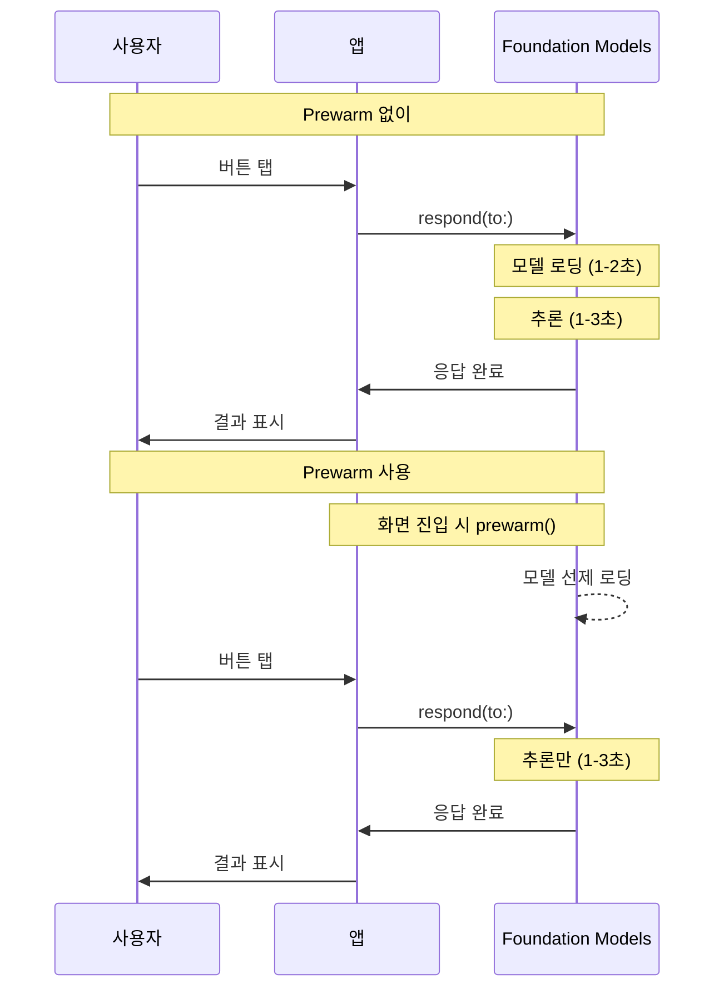
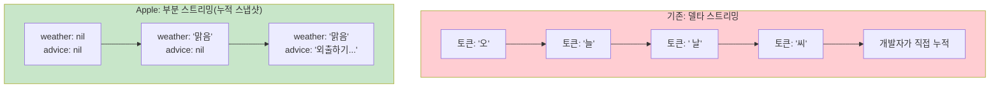
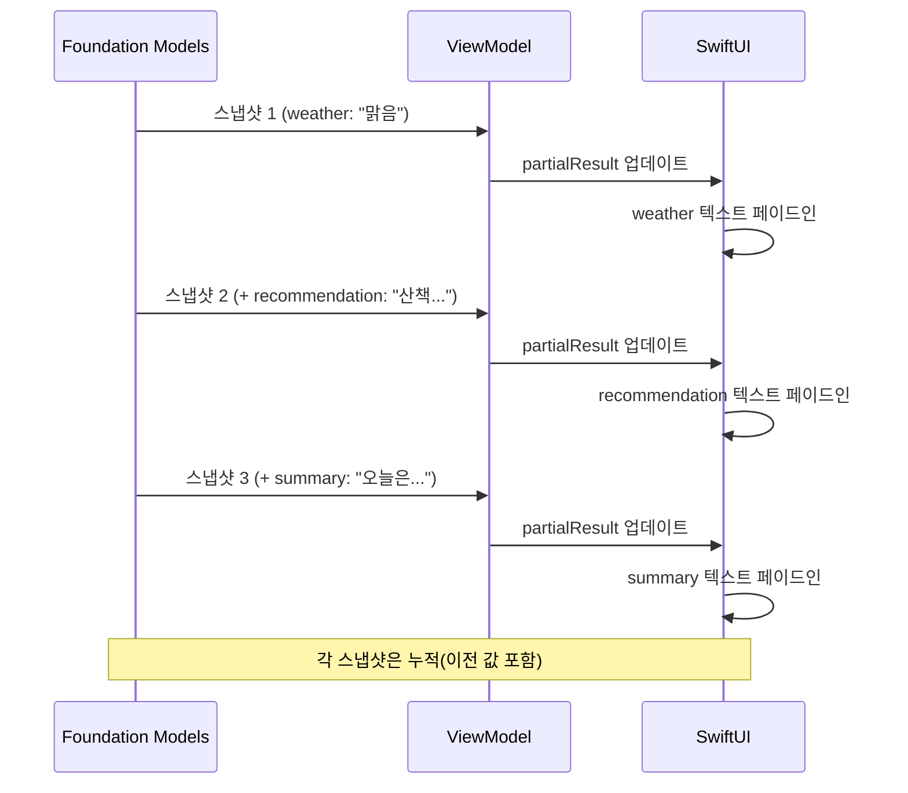
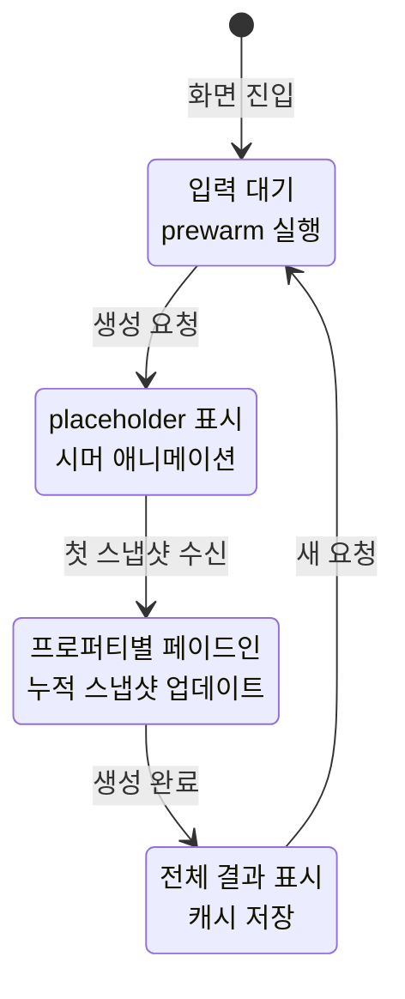
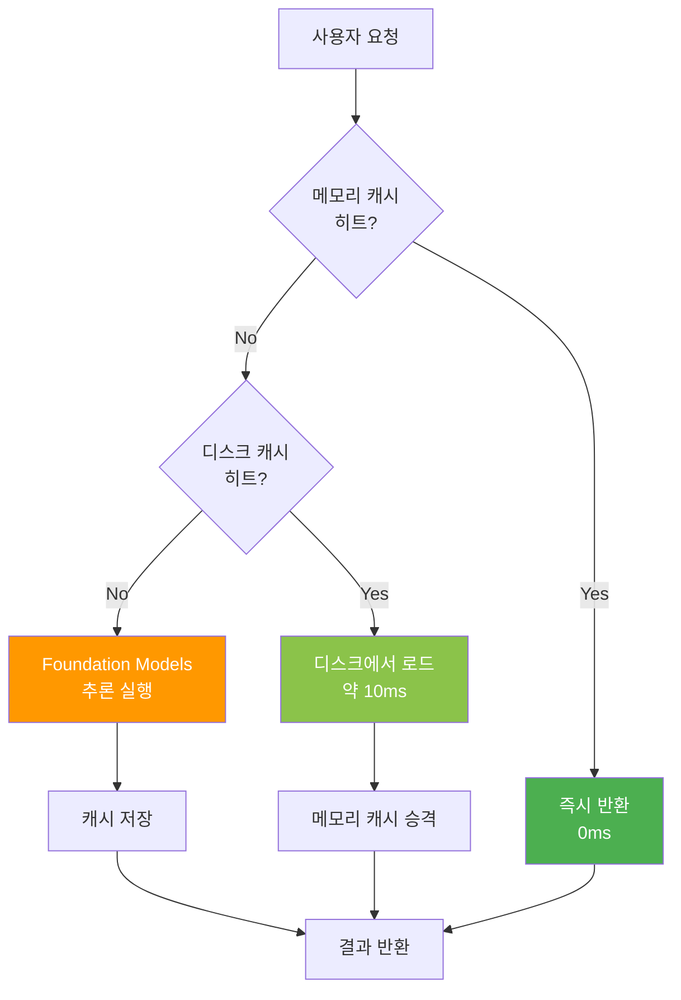
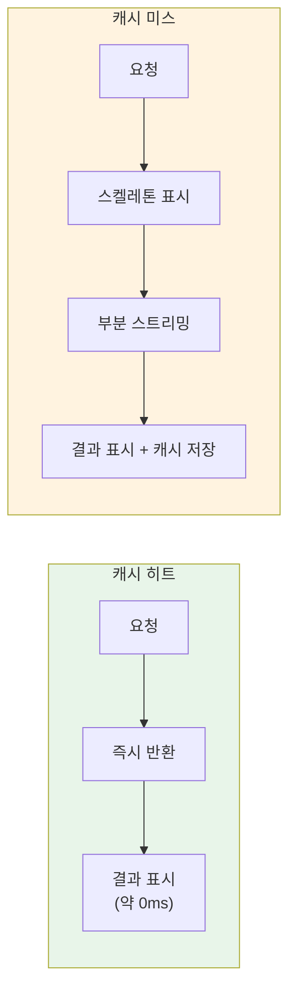

# 사용자 체감 성능 개선

> 부분 스트리밍, 프리페치, 캐싱, 프로그레시브 UI로 AI 기능의 체감 속도를 극대화하는 UX 최적화 전략

## 개요

이 섹션에서는 기술적 성능 지표(TTFT, 토큰/초)를 **사용자가 실제로 느끼는 속도**로 전환하는 방법을 배웁니다. 앞서 [AI 추론 성능 프로파일링](18-ch18-성능-최적화와-프로파일링/01-01-ai-추론-성능-프로파일링.md)에서 병목을 찾고, [메모리와 배터리 최적화](18-ch18-성능-최적화와-프로파일링/02-02-메모리와-배터리-최적화.md)에서 리소스를 아끼고, [비동기 처리와 병렬 최적화](18-ch18-성능-최적화와-프로파일링/03-03-비동기-처리와-병렬-최적화.md)에서 추론 지연을 줄였습니다. 이번에는 그 기술적 최적화를 **사용자 경험**으로 연결합니다.

**선수 지식**: `streamResponse()` API, `PartiallyGenerated` 타입, `async/await` 패턴, SwiftUI 기본 애니메이션
**학습 목표**:
- `prewarm(promptPrefix:)`로 선제적 모델 로딩을 구현한다
- 부분 스트리밍 + 프로그레시브 UI로 체감 지연을 단축한다
- 스켈레톤 로딩과 `.redacted()` 수정자로 대기 경험을 개선한다
- 응답 캐싱으로 반복 요청의 즉시 응답을 구현한다

## 왜 알아야 할까?

사용자에게 "AI가 빠르다"는 느낌을 주는 건 실제 추론 시간만의 문제가 아닙니다. 같은 3초 대기라도 빈 화면을 보는 3초와, 스켈레톤이 반짝이다가 텍스트가 한 글자씩 나타나는 3초는 완전히 다른 경험이죠.

ChatGPT, Gemini 같은 AI 앱들이 모두 스트리밍 응답을 기본으로 채택한 이유가 여기에 있습니다. Apple의 Foundation Models 프레임워크는 **부분 스트리밍(Partial Streaming)**이라는 방식으로 이 문제를 해결하는데요 — 토큰 조각이 아닌 **구조화된 누적 스냅샷**을 스트리밍합니다. [구조화 출력의 부분 스트리밍](06-ch6-스트리밍-응답과-실시간-ui/03-03-구조화-출력의-부분-스트리밍.md)에서 이 메커니즘의 원리를 자세히 배웠죠. 이것을 SwiftUI의 선언적 UI와 결합하면, 최소한의 코드로 놀라울 정도로 매끄러운 AI UX를 구현할 수 있습니다.

> 📊 **그림 1**: 체감 성능 개선의 4가지 전략



## 핵심 개념

### 개념 1: Prewarm — 사용자보다 한 발 앞서기

> 💡 **비유**: 레스토랑에서 예약 손님이 오기 전에 오븐을 미리 예열하는 것과 같습니다. 손님이 도착하자마자 요리를 시작할 수 있죠. `prewarm()`은 사용자가 AI 기능을 쓰기 전에 모델을 미리 메모리에 로딩합니다.

Foundation Models 프레임워크에서 첫 번째 추론 요청은 모델 로딩 시간이 포함되어 가장 느립니다. `prewarm(promptPrefix:)`는 이 로딩을 미리 수행하고, 선택적으로 프롬프트의 앞부분까지 사전 처리합니다.

> 📊 **그림 2**: Prewarm 유무에 따른 체감 지연 비교



**핵심 원칙**: `prewarm()`은 사용자가 AI 기능을 사용할 것으로 **예측**되는 시점에 호출합니다. 최소 1초 이상의 간격이 있어야 의미가 있습니다.

```swift
import FoundationModels

@Observable
final class AIAssistantViewModel {
    private var session = LanguageModelSession()
    private var isPrewarmed = false
    
    // 화면 진입 시 선제적 로딩
    func prepareModel() async {
        guard !isPrewarmed else { return }
        
        // 시스템 프롬프트(instructions)까지 미리 처리
        let systemPrompt = "당신은 친절한 AI 어시스턴트입니다."
        session = LanguageModelSession(instructions: systemPrompt)
        
        do {
            // 모델 로딩 + 프롬프트 프리픽스 사전 처리
            try await session.prewarm(promptPrefix: "사용자의 질문에")
            isPrewarmed = true
        } catch {
            // prewarm 실패는 치명적이지 않음 — 첫 요청 시 자동 로딩
            print("Prewarm 실패 (무시 가능): \(error)")
        }
    }
}
```

**Prewarm 타이밍 전략**:

| 시점 | 구현 | 적합한 상황 |
|------|------|------------|
| 화면 `.onAppear` | `task { await vm.prepareModel() }` | AI 전용 화면 |
| 탭 전환 | 탭 선택 감지 시 호출 | AI 탭이 있는 앱 |
| 앱 포그라운드 복귀 | `scenePhase == .active` | AI가 핵심 기능 |
| 사용자 의도 감지 | 텍스트 입력 시작 시 | 채팅/검색 UI |

```swift
struct AIChatView: View {
    @State private var viewModel = AIAssistantViewModel()
    @State private var userInput = ""
    
    var body: some View {
        VStack {
            TextField("질문을 입력하세요", text: $userInput)
                .onChange(of: userInput) { oldValue, newValue in
                    // 사용자가 타이핑 시작 → 모델 선제 로딩
                    if oldValue.isEmpty && !newValue.isEmpty {
                        Task { await viewModel.prepareModel() }
                    }
                }
        }
        .task {
            // 화면 진입 시에도 prewarm
            await viewModel.prepareModel()
        }
    }
}
```

### 개념 2: 부분 스트리밍과 프로그레시브 UI

> 💡 **비유**: 퍼즐을 맞출 때, 모든 조각이 완성될 때까지 기다리는 대신 맞춰진 부분부터 보여주는 것과 같습니다. Foundation Models는 **누적 스냅샷**을 하나씩 전달하여 UI가 점진적으로 채워집니다.

대부분의 LLM API는 토큰 조각(delta)을 스트리밍합니다. 개발자가 직접 텍스트를 누적하고 파싱해야 하죠. Apple의 Foundation Models는 다른 접근을 취합니다 — **부분 스트리밍(Partial Streaming)**입니다. [구조화 출력의 부분 스트리밍](06-ch6-스트리밍-응답과-실시간-ui/03-03-구조화-출력의-부분-스트리밍.md)에서 자세히 다룬 것처럼, 각 스냅샷은 현재까지 생성된 **전체 상태**를 담고 있어서 개발자가 별도의 누적 로직을 작성할 필요가 없습니다.

> 📊 **그림 3**: 델타 스트리밍 vs 부분 스트리밍(누적 스냅샷)



`@Generable` 매크로를 적용한 구조체에 `streamResponse()`를 사용하면, 프레임워크가 자동으로 `PartiallyGenerated<T>` 타입을 생성합니다. 이 타입에서는 모든 프로퍼티가 Optional로 변환되어, 아직 생성되지 않은 필드는 `nil`로 표시됩니다. Ch6에서 배운 것처럼 각 스냅샷은 **이전 스냅샷을 포함하는 누적 스냅샷**이므로, 항상 최신 스냅샷만 참조하면 됩니다.

```swift
import FoundationModels

@Generable
struct WeatherAdvice {
    @Guide(description: "현재 날씨 상태")
    var weather: String
    
    @Guide(description: "날씨에 맞는 활동 추천")
    var recommendation: String
    
    @Guide(description: "추천 이유 요약")
    var summary: String  // 마지막에 배치 → 앞 필드 참조하여 품질 향상
}
```

**프로퍼티 선언 순서가 중요합니다.** 모델은 선언 순서대로 프로퍼티를 생성하므로, 요약이나 결론 성격의 필드는 마지막에 배치해야 앞선 내용을 참조하여 더 높은 품질의 출력을 만듭니다. 이 점은 [구조화 출력의 부분 스트리밍](06-ch6-스트리밍-응답과-실시간-ui/03-03-구조화-출력의-부분-스트리밍.md)에서 자세히 다뤘습니다.

```swift
@Observable
final class WeatherViewModel {
    var partialResult: WeatherAdvice.PartiallyGenerated?
    var isGenerating = false
    
    private var session = LanguageModelSession()
    
    func generateAdvice(for location: String) async throws {
        isGenerating = true
        defer { isGenerating = false }
        
        let stream = session.streamResponse(
            to: "\(location)의 오늘 날씨에 대한 조언을 해주세요.",
            generating: WeatherAdvice.self
        )
        
        // 누적 스냅샷이 올 때마다 UI 자동 업데이트
        for try await snapshot in stream {
            partialResult = snapshot  // 항상 전체 상태를 포함
        }
    }
}
```

SwiftUI에서는 `PartiallyGenerated`의 Optional 프로퍼티를 활용하여 자연스러운 애니메이션과 함께 표시합니다:

```swift
struct WeatherAdviceView: View {
    @State private var viewModel = WeatherViewModel()
    
    var body: some View {
        VStack(alignment: .leading, spacing: 16) {
            // 날씨 상태 — 생성되면 페이드인
            if let weather = viewModel.partialResult?.weather {
                Text(weather)
                    .font(.title2.bold())
                    .transition(.opacity.combined(with: .move(edge: .top)))
            }
            
            // 추천 활동 — 생성되면 페이드인
            if let recommendation = viewModel.partialResult?.recommendation {
                Text(recommendation)
                    .font(.body)
                    .transition(.opacity)
            }
            
            // 요약 — 마지막으로 생성
            if let summary = viewModel.partialResult?.summary {
                Text(summary)
                    .font(.callout)
                    .foregroundStyle(.secondary)
                    .transition(.opacity.combined(with: .move(edge: .bottom)))
            }
        }
        .animation(.easeInOut(duration: 0.3), value: viewModel.partialResult?.weather)
        .animation(.easeInOut(duration: 0.3), value: viewModel.partialResult?.recommendation)
        .animation(.easeInOut(duration: 0.3), value: viewModel.partialResult?.summary)
    }
}
```

> 📊 **그림 4**: 부분 스트리밍의 프로퍼티별 생성 순서와 UI 반영



### 개념 3: 스켈레톤 로딩 패턴

> 💡 **비유**: 신문 지면에 기사가 들어갈 자리를 회색 박스로 먼저 보여주는 것과 같습니다. 사용자는 "여기에 무언가 나올 거야"라는 기대를 갖게 되고, 실제 콘텐츠가 나타나면 자연스럽게 읽기 시작합니다.

SwiftUI의 `.redacted(reason: .placeholder)` 수정자는 뷰의 텍스트와 이미지를 회색 블록으로 대체합니다. 이것을 시머(shimmer) 애니메이션과 결합하면 전문적인 스켈레톤 로딩 UI를 만들 수 있습니다.

> 📊 **그림 5**: AI 응답 로딩 상태 전이



스켈레톤 UI의 핵심은 **시머(Shimmer) 효과**입니다. 정적인 회색 블록보다 반짝이는 애니메이션이 있으면 "로딩 중"이라는 신호가 훨씬 명확해지죠.

```swift
// MARK: - 시머(Shimmer) 수정자
struct ShimmerModifier: ViewModifier {
    @State private var phase: CGFloat = 0
    
    func body(content: Content) -> some View {
        content
            .overlay(
                LinearGradient(
                    gradient: Gradient(colors: [
                        .clear,
                        .white.opacity(0.4),
                        .clear
                    ]),
                    startPoint: .leading,
                    endPoint: .trailing
                )
                .offset(x: phase)
                .mask(content)
            )
            .onAppear {
                withAnimation(
                    .linear(duration: 1.5)
                    .repeatForever(autoreverses: false)
                ) {
                    phase = 300
                }
            }
    }
}

extension View {
    func shimmer() -> some View {
        modifier(ShimmerModifier())
    }
}
```

이제 AI 응답 카드에 스켈레톤 상태와 실제 콘텐츠 상태를 결합합니다. `.redacted(reason: .placeholder)`는 뷰의 **레이아웃을 유지**하면서 텍스트를 회색 사각형으로 대체하기 때문에, 콘텐츠가 로드되었을 때 레이아웃 점프가 발생하지 않습니다:

```swift
struct AIResponseCard: View {
    let partialResult: WeatherAdvice.PartiallyGenerated?
    let isLoading: Bool
    
    var body: some View {
        VStack(alignment: .leading, spacing: 12) {
            // 날씨 헤더
            Group {
                if let weather = partialResult?.weather {
                    Text(weather)
                        .font(.title2.bold())
                } else {
                    Text("날씨 정보 로딩 중...")
                        .font(.title2.bold())
                        .redacted(reason: .placeholder)
                }
            }
            
            Divider()
            
            // 추천 내용
            Group {
                if let recommendation = partialResult?.recommendation {
                    Text(recommendation)
                        .font(.body)
                } else {
                    // 3줄 분량의 플레이스홀더
                    VStack(alignment: .leading, spacing: 8) {
                        Text("이것은 플레이스홀더 텍스트입니다 충분히 긴 문장")
                            .redacted(reason: .placeholder)
                        Text("두 번째 줄 플레이스홀더 텍스트")
                            .redacted(reason: .placeholder)
                        Text("세 번째 줄 약간 짧은")
                            .redacted(reason: .placeholder)
                    }
                }
            }
            
            // 요약
            Group {
                if let summary = partialResult?.summary {
                    Text(summary)
                        .font(.callout)
                        .foregroundStyle(.secondary)
                } else if isLoading {
                    Text("요약을 생성하는 중입니다")
                        .font(.callout)
                        .redacted(reason: .placeholder)
                }
            }
        }
        .padding()
        .background(.regularMaterial, in: RoundedRectangle(cornerRadius: 12))
        .overlay {
            if isLoading && partialResult == nil {
                // 첫 스냅샷 전: 전체 시머 효과
                RoundedRectangle(cornerRadius: 12)
                    .fill(.clear)
                    .shimmer()
            }
        }
    }
}
```

> 🔥 **실무 팁**: 스켈레톤 UI의 플레이스홀더 텍스트 길이를 예상 응답 길이에 맞추세요. 플레이스홀더가 한 줄인데 실제 응답이 다섯 줄이면, 콘텐츠 전환 시 카드가 갑자기 커지는 **레이아웃 점프**가 발생합니다. 차라리 플레이스홀더를 약간 더 길게 잡는 편이 자연스럽습니다.

### 개념 4: 응답 캐싱 전략

> 💡 **비유**: 자주 주문하는 단골 메뉴를 기억해두는 카페 바리스타와 같습니다. 같은 질문에 매번 모델을 호출할 필요 없이, 이전 답변을 즉시 돌려주면 됩니다.

온디바이스 모델은 같은 입력에 같은 출력(특히 `sampling: .greedy` 모드)을 생성합니다. 자주 반복되는 요청은 캐싱하면 즉시 응답할 수 있죠. 효과적인 캐싱을 위해 **2단계 레이어** 구조를 사용합니다.

> 📊 **그림 6**: 캐싱 레이어 구성



**L1(메모리)**: `NSCache` 기반으로 앱 실행 중 빠르게 접근합니다. 메모리 압력 시 시스템이 자동으로 항목을 정리하므로 별도 관리가 필요 없습니다.

**L2(디스크)**: `FileManager`로 앱 재시작 후에도 캐시를 유지합니다. 디스크 캐시 히트 시 L1으로 승격하여 이후 접근을 가속합니다.

```swift
import Foundation

actor AIResponseCache {
    // L1: 메모리 캐시 (NSCache 기반, 자동 메모리 관리)
    private let memoryCache = NSCache<NSString, CacheEntry>()
    
    // L2: 디스크 캐시 (FileManager 기반)
    private let diskCacheURL: URL
    
    // 캐시 유효기간
    private let ttl: TimeInterval
    
    init(ttl: TimeInterval = 3600) { // 기본 1시간
        self.ttl = ttl
        self.memoryCache.countLimit = 50 // 최대 50개 항목
        self.diskCacheURL = FileManager.default
            .urls(for: .cachesDirectory, in: .userDomainMask)[0]
            .appendingPathComponent("AIResponseCache")
        
        // 디스크 캐시 디렉토리 생성
        try? FileManager.default.createDirectory(
            at: diskCacheURL, withIntermediateDirectories: true
        )
    }
    
    // 캐시 키 생성 — 프롬프트 + 옵션의 해시
    private func cacheKey(prompt: String, options: String = "") -> String {
        let combined = prompt + options
        let data = Data(combined.utf8)
        // SHA256 해시로 일관된 키 생성
        return data.map { String(format: "%02x", $0) }.joined().prefix(32).description
    }
    
    // 캐시 조회
    func get(prompt: String) -> String? {
        let key = cacheKey(prompt: prompt)
        
        // L1: 메모리 캐시 확인
        if let entry = memoryCache.object(forKey: key as NSString),
           entry.isValid(ttl: ttl) {
            return entry.response
        }
        
        // L2: 디스크 캐시 확인
        let fileURL = diskCacheURL.appendingPathComponent(key)
        if let data = try? Data(contentsOf: fileURL),
           let entry = try? JSONDecoder().decode(DiskCacheEntry.self, from: data),
           Date().timeIntervalSince(entry.timestamp) < ttl {
            // L1으로 승격
            memoryCache.setObject(
                CacheEntry(response: entry.response, timestamp: entry.timestamp),
                forKey: key as NSString
            )
            return entry.response
        }
        
        return nil
    }
    
    // 캐시 저장 (L1 + L2 동시 기록)
    func set(prompt: String, response: String) {
        let key = cacheKey(prompt: prompt)
        let now = Date()
        
        // L1: 메모리 캐시
        memoryCache.setObject(
            CacheEntry(response: response, timestamp: now),
            forKey: key as NSString
        )
        
        // L2: 디스크 캐시
        let entry = DiskCacheEntry(response: response, timestamp: now)
        if let data = try? JSONEncoder().encode(entry) {
            let fileURL = diskCacheURL.appendingPathComponent(key)
            try? data.write(to: fileURL)
        }
    }
    
    // 만료된 디스크 캐시 정리
    func evictExpired() {
        guard let files = try? FileManager.default.contentsOfDirectory(
            at: diskCacheURL, includingPropertiesForKeys: [.contentModificationDateKey]
        ) else { return }
        
        for fileURL in files {
            if let data = try? Data(contentsOf: fileURL),
               let entry = try? JSONDecoder().decode(DiskCacheEntry.self, from: data),
               Date().timeIntervalSince(entry.timestamp) >= ttl {
                try? FileManager.default.removeItem(at: fileURL)
            }
        }
    }
}

// MARK: - 캐시 엔트리

final class CacheEntry: NSObject {
    let response: String
    let timestamp: Date
    
    init(response: String, timestamp: Date) {
        self.response = response
        self.timestamp = timestamp
    }
    
    func isValid(ttl: TimeInterval) -> Bool {
        Date().timeIntervalSince(timestamp) < ttl
    }
}

struct DiskCacheEntry: Codable {
    let response: String
    let timestamp: Date
}
```

이 캐시를 ViewModel에 통합하면:

```swift
@Observable
final class CachedAIViewModel {
    var response: String?
    var isFromCache = false
    var isGenerating = false
    
    private var session = LanguageModelSession()
    private let cache = AIResponseCache()
    
    func ask(_ prompt: String) async throws {
        isGenerating = true
        defer { isGenerating = false }
        
        // 1. 캐시 확인 — 즉시 반환
        if let cached = await cache.get(prompt: prompt) {
            response = cached
            isFromCache = true
            return
        }
        
        // 2. 캐시 미스 — 모델 호출
        isFromCache = false
        let result = try await session.respond(to: prompt)
        response = result.content
        
        // 3. 결과 캐싱
        await cache.set(prompt: prompt, response: result.content)
    }
}
```

> 📊 **그림 7**: 캐시 히트 vs 미스 시 사용자 경험 흐름



## 실습: 직접 해보기

모든 체감 성능 전략을 통합한 **AI 여행 추천 카드** 뷰를 만들어봅시다. Prewarm → 스켈레톤 → 부분 스트리밍 → 캐싱까지 전체 플로우를 구현합니다.

```swift
import SwiftUI
import FoundationModels

// MARK: - 모델 정의

@Generable
struct TravelRecommendation {
    @Guide(description: "추천 여행지 이름")
    var destination: String
    
    @Guide(description: "여행지 한 줄 소개")
    var tagline: String
    
    @Guide(description: "추천 활동 3가지")
    var activities: [String]
    
    @Guide(description: "예상 여행 비용 요약")
    var budgetSummary: String
}

// MARK: - ViewModel (모든 최적화 통합)

@Observable
final class TravelViewModel {
    // 상태
    var partialResult: TravelRecommendation.PartiallyGenerated?
    var finalResult: TravelRecommendation?
    var phase: LoadingPhase = .idle
    
    enum LoadingPhase {
        case idle       // 대기
        case skeleton   // 스켈레톤 표시 중
        case streaming  // 부분 스트리밍 수신 중
        case complete   // 완료
    }
    
    private var session: LanguageModelSession
    private let cache = AIResponseCache(ttl: 1800) // 30분 캐시
    private var isPrewarmed = false
    
    init() {
        session = LanguageModelSession(
            instructions: "당신은 전문 여행 컨설턴트입니다. 한국어로 답변합니다."
        )
    }
    
    // 1단계: 선제적 모델 로딩
    func prewarmIfNeeded() async {
        guard !isPrewarmed else { return }
        do {
            try await session.prewarm(promptPrefix: "다음 여행지를 추천해주세요:")
            isPrewarmed = true
        } catch {
            // prewarm 실패는 무시 — 첫 요청 시 자동 로딩
        }
    }
    
    // 2단계: 추천 생성 (캐시 → 부분 스트리밍 폴백)
    func recommend(mood: String) async {
        let prompt = "여행 분위기: \(mood). 국내외 1곳을 추천해주세요."
        
        // 캐시 히트 체크
        // (구조화 출력 캐싱은 JSON으로 직렬화/역직렬화)
        
        phase = .skeleton
        partialResult = nil
        finalResult = nil
        
        do {
            // 부분 스트리밍으로 프로그레시브 표시
            let stream = session.streamResponse(
                to: prompt,
                generating: TravelRecommendation.self
            )
            
            for try await snapshot in stream {
                if phase == .skeleton {
                    phase = .streaming // 첫 스냅샷 → 스트리밍 전환
                }
                partialResult = snapshot
            }
            
            // 최종 결과 확정
            if let final = partialResult {
                finalResult = TravelRecommendation(
                    destination: final.destination ?? "",
                    tagline: final.tagline ?? "",
                    activities: final.activities ?? [],
                    budgetSummary: final.budgetSummary ?? ""
                )
            }
            phase = .complete
            
        } catch {
            phase = .idle
        }
    }
}

// MARK: - 메인 뷰

struct TravelRecommendationView: View {
    @State private var viewModel = TravelViewModel()
    @State private var selectedMood = "힐링"
    
    let moods = ["힐링", "모험", "미식", "문화", "로맨틱"]
    
    var body: some View {
        NavigationStack {
            ScrollView {
                VStack(spacing: 20) {
                    // 분위기 선택 칩
                    ScrollView(.horizontal, showsIndicators: false) {
                        HStack(spacing: 10) {
                            ForEach(moods, id: \.self) { mood in
                                Button(mood) {
                                    selectedMood = mood
                                    Task { await viewModel.recommend(mood: mood) }
                                }
                                .buttonStyle(.borderedProminent)
                                .tint(selectedMood == mood ? .blue : .gray)
                            }
                        }
                        .padding(.horizontal)
                    }
                    
                    // AI 추천 카드
                    TravelCard(
                        partial: viewModel.partialResult,
                        phase: viewModel.phase
                    )
                    .padding(.horizontal)
                }
            }
            .navigationTitle("AI 여행 추천")
            .task {
                // 화면 진입 시 prewarm
                await viewModel.prewarmIfNeeded()
            }
        }
    }
}

// MARK: - 여행 추천 카드 (스켈레톤 + 프로그레시브)

struct TravelCard: View {
    let partial: TravelRecommendation.PartiallyGenerated?
    let phase: TravelViewModel.LoadingPhase
    
    var body: some View {
        VStack(alignment: .leading, spacing: 16) {
            // 여행지 이름
            Group {
                if let dest = partial?.destination {
                    Text(dest)
                        .font(.title.bold())
                        .transition(.blurReplace)
                } else {
                    Text("추천 여행지를 생성 중")
                        .font(.title.bold())
                        .redacted(reason: .placeholder)
                }
            }
            
            // 한 줄 소개
            Group {
                if let tagline = partial?.tagline {
                    Text(tagline)
                        .font(.headline)
                        .foregroundStyle(.secondary)
                        .transition(.opacity)
                } else if phase != .idle {
                    Text("태그라인 플레이스홀더 텍스트입니다")
                        .font(.headline)
                        .redacted(reason: .placeholder)
                }
            }
            
            Divider()
            
            // 추천 활동
            VStack(alignment: .leading, spacing: 8) {
                Text("추천 활동")
                    .font(.subheadline.bold())
                
                if let activities = partial?.activities, !activities.isEmpty {
                    ForEach(Array(activities.enumerated()), id: \.offset) { index, activity in
                        Label(activity, systemImage: "\(index + 1).circle.fill")
                            .transition(.slide.combined(with: .opacity))
                    }
                } else if phase != .idle {
                    // 3개 항목의 스켈레톤
                    ForEach(0..<3, id: \.self) { _ in
                        Label("활동 플레이스홀더 텍스트", systemImage: "circle")
                            .redacted(reason: .placeholder)
                    }
                }
            }
            
            // 예산 요약
            if let budget = partial?.budgetSummary {
                Text(budget)
                    .font(.callout)
                    .padding()
                    .frame(maxWidth: .infinity)
                    .background(.blue.opacity(0.1), in: RoundedRectangle(cornerRadius: 8))
                    .transition(.move(edge: .bottom).combined(with: .opacity))
            }
        }
        .padding()
        .background(.regularMaterial, in: RoundedRectangle(cornerRadius: 16))
        .animation(.spring(duration: 0.4), value: partial?.destination)
        .animation(.spring(duration: 0.4), value: partial?.tagline)
        .animation(.spring(duration: 0.4), value: partial?.activities?.count)
        .animation(.spring(duration: 0.4), value: partial?.budgetSummary)
        .overlay {
            if phase == .skeleton {
                RoundedRectangle(cornerRadius: 16)
                    .fill(.clear)
                    .shimmer()
            }
        }
    }
}
```

```run:swift
// 체감 성능 최적화 전후 비교 시뮬레이션
let scenarios = [
    ("최적화 없음", "모델 로딩 2.1s → 추론 2.8s → 렌더링 0.1s", 5.0),
    ("Prewarm만", "추론 2.8s → 렌더링 0.1s", 2.9),
    ("Prewarm + 스트리밍", "첫 스냅샷 0.5s → 점진 표시", 0.5),
    ("캐시 히트", "즉시 반환", 0.01),
]

print("┌─────────────────────┬──────────────────────────────────────────┬───────────┐")
print("│ 전략                │ 플로우                                   │ 체감 지연  │")
print("├─────────────────────┼──────────────────────────────────────────┼───────────┤")
for (strategy, flow, delay) in scenarios {
    let strategyPad = strategy.padding(toLength: 17, withPad: " ", startingAt: 0)
    let flowPad = flow.padding(toLength: 38, withPad: " ", startingAt: 0)
    print("│ \(strategyPad) │ \(flowPad) │ \(String(format: "%6.2f", delay))s   │")
}
print("└─────────────────────┴──────────────────────────────────────────┴───────────┘")
```

```output
┌─────────────────────┬──────────────────────────────────────────┬───────────┐
│ 전략                │ 플로우                                   │ 체감 지연  │
├─────────────────────┼──────────────────────────────────────────┼───────────┤
│ 최적화 없음          │ 모델 로딩 2.1s → 추론 2.8s → 렌더링 0.1s  │   5.00s   │
│ Prewarm만           │ 추론 2.8s → 렌더링 0.1s                   │   2.90s   │
│ Prewarm + 스트리밍   │ 첫 스냅샷 0.5s → 점진 표시                │   0.50s   │
│ 캐시 히트            │ 즉시 반환                                 │   0.01s   │
└─────────────────────┴──────────────────────────────────────────┴───────────┘
```

## 더 깊이 알아보기

### 체감 성능의 심리학 — "밀러의 법칙"에서 "스켈레톤 스크린"까지

사용자 체감 성능 연구의 역사는 1968년 **로버트 밀러(Robert B. Miller)**의 논문 "Response Time in Man-Computer Conversational Transactions"으로 거슬러 올라갑니다. 밀러는 인간-컴퓨터 상호작용에서 **0.1초, 1초, 10초**라는 세 가지 임계값을 제시했습니다. 0.1초 안에 반응하면 즉각적으로 느끼고, 1초까지는 흐름이 끊기지 않으며, 10초를 넘으면 사용자는 다른 일을 시작한다는 거죠.

이 원칙은 1993년 닐슨 노먼 그룹의 **야콥 닐슨(Jakob Nielsen)**이 "Response Times: The 3 Important Limits"에서 재확인했고, 오늘날까지 UX 설계의 기본 원칙으로 통합니다.

흥미로운 점은 **스켈레톤 스크린**의 등장 배경입니다. 2013년 Luke Wroblewski가 모바일 앱의 로딩 UX를 연구하면서 기존 스피너(spinner) 대신 콘텐츠 레이아웃의 윤곽을 미리 보여주는 패턴을 제안했습니다. Facebook(현 Meta)이 이를 뉴스피드에 적용하면서 폭발적으로 확산되었죠. 연구에 따르면, 스피너는 사용자에게 "기다려라"는 신호를 주지만, 스켈레톤은 "거의 다 됐다"는 기대감을 줍니다. 같은 대기 시간이라도 **체감 시간이 약 30% 단축**된다는 결과가 있습니다.

Apple의 **부분 스트리밍** 방식은 이 심리학을 프레임워크 수준에서 구현한 셈입니다. 토큰 조각 대신 구조화된 누적 스냅샷을 보냄으로써, 개발자가 별도의 파싱 로직 없이도 SwiftUI의 선언적 UI와 자연스럽게 결합되는 프로그레시브 UX를 만들 수 있게 했죠.

### 토큰 경제학과 프롬프트 최적화

체감 성능 개선에서 놓치기 쉬운 부분이 **프롬프트 토큰 비용**입니다. WWDC25 "Deep dive into the Foundation Models framework" 세션에서 Apple은 다음을 강조했습니다:

- instructions와 prompt의 **모든 토큰이 추가 지연**을 만든다
- 모델은 응답 생성 전에 모든 입력 토큰을 처리해야 한다
- Tool의 이름과 설명도 토큰 비용에 포함된다

즉, 간결한 프롬프트가 곧 빠른 응답입니다. [온디바이스 모델 특성과 프롬프트 전략](04-ch4-프롬프트-엔지니어링-실전/01-01-온디바이스-모델-특성과-프롬프트-전략.md)에서 배운 원칙이 성능 최적화와 직결되는 대목입니다.

## 흔한 오해와 팁

> ⚠️ **흔한 오해**: "prewarm()을 앱 시작 시 무조건 호출하면 좋다"
> 아닙니다. prewarm()은 모델을 메모리에 로딩하므로 메모리 압력을 유발합니다. 사용자가 AI 기능을 쓸 가능성이 높은 시점에만 호출하세요. 앱 시작 시 무조건 호출하면, 사용자가 다른 기능만 쓰다 나갈 때 불필요한 리소스를 낭비합니다. Apple 공식 문서도 "최소 1초 이상의 간격이 있을 때만 의미 있다"고 명시합니다.

> 💡 **알고 계셨나요?**: Apple의 부분 스트리밍에서 `@Generable` 매크로가 자동으로 `PartiallyGenerated` 타입을 만들어줍니다. 이 타입은 원본 구조체의 모든 프로퍼티를 Optional로 변환한 것인데, 배열 프로퍼티는 `[Element]?`이 아니라 `[Element.PartiallyGenerated]?`로 재귀적으로 변환됩니다. 덕분에 배열 안의 각 항목도 점진적으로 채워지는 UI를 만들 수 있죠.

> 🔥 **실무 팁**: 캐싱 전략에서 **TTL(Time-to-Live)**을 상황에 맞게 조절하세요. 날씨 정보처럼 자주 바뀌는 데이터는 15~30분, 레시피 추천 같은 정적 콘텐츠는 24시간도 괜찮습니다. 또한 `GenerationOptions(sampling: .greedy)`를 쓰면 동일 입력에 동일 출력이 보장되어 캐시 적중률이 극대화됩니다.

> 🔥 **실무 팁**: 스켈레톤 UI의 레이아웃은 실제 콘텐츠와 **최대한 유사**해야 합니다. 플레이스홀더 텍스트 길이를 예상 응답 길이에 맞추고, 실제 폰트 크기를 동일하게 적용하세요. 레이아웃이 크게 달라지면 콘텐츠 전환 시 "레이아웃 점프"가 발생해 오히려 UX가 나빠집니다.

## 핵심 정리

| 개념 | 설명 |
|------|------|
| `prewarm(promptPrefix:)` | 모델을 메모리에 선제 로딩하고 프롬프트 프리픽스를 사전 처리하여 첫 응답 지연 제거 |
| 부분 스트리밍(Partial Streaming) | 토큰 조각 대신 `PartiallyGenerated<T>` 누적 스냅샷을 스트리밍하여 SwiftUI와 자연스럽게 통합 |
| `.redacted(reason:)` | SwiftUI 뷰를 플레이스홀더로 변환하는 수정자. 시머 애니메이션과 결합하여 스켈레톤 UI 구현 |
| 프로퍼티 선언 순서 | `@Generable`에서 프로퍼티 생성 순서를 결정. 요약/결론은 마지막에 배치 권장 |
| 2단계 캐싱 | NSCache(메모리) + FileManager(디스크)로 반복 요청의 즉시 응답 구현 |
| 로딩 상태 전이 | idle → skeleton → streaming → complete의 4단계 상태 관리로 매끄러운 UX |
| 토큰 경제학 | 프롬프트/Tool 설명의 토큰 수가 지연에 직결 — 간결한 프롬프트가 곧 성능 |

## 다음 섹션 미리보기

지금까지 Ch18 전체에서 프로파일링, 메모리/배터리, 병렬 처리, 체감 성능까지 최적화 기법을 개별적으로 학습했습니다. 다음 [실습: 성능 벤치마크와 최적화 적용](18-ch18-성능-최적화와-프로파일링/05-05-실습-성능-벤치마크와-최적화-적용.md)에서는 이 모든 기법을 하나의 앱에 통합하고, Instruments로 전후 성능을 벤치마킹하여 실제 개선 효과를 수치로 확인합니다. 프로파일링 → 병목 발견 → 최적화 → 검증의 완전한 사이클을 체험해보겠습니다.

## 참고 자료

- [Meet the Foundation Models framework — WWDC25](https://developer.apple.com/videos/play/wwdc2025/286/) - prewarm API, streamResponse(), PartiallyGenerated 타입의 공식 소개
- [Deep dive into the Foundation Models framework — WWDC25](https://developer.apple.com/videos/play/wwdc2025/301/) - 토큰 비용, 프로퍼티 순서, Tool 네이밍 최적화 상세 설명
- [Foundation Models — Apple Developer Documentation](https://developer.apple.com/documentation/FoundationModels) - prewarm(promptPrefix:) 등 공식 API 레퍼런스
- [Building AI features using Foundation Models — Swift with Majid](https://swiftwithmajid.com/2025/08/19/building-ai-features-using-foundation-models/) - SwiftUI 기반 Foundation Models 통합 실전 가이드
- [The magic of redacted modifier in SwiftUI — Swift with Majid](https://swiftwithmajid.com/2020/10/22/the-magic-of-redacted-modifier-in-swiftui/) - .redacted() 수정자의 동작 원리와 활용 패턴
- [How to use the Redacted View Modifier in SwiftUI — SwiftLee](https://www.avanderlee.com/swiftui/redacted-view-modifier/) - 스켈레톤 로딩 구현 실전 가이드

---
### 🔗 Related Sessions
- [generationoptions](03-ch3-foundation-models-프레임워크-시작하기/04-04-generationoptions와-생성-제어.md) (prerequisite)
- [@generable](05-ch5-generable-구조화-출력/01-01-guided-generation-개념과-동작-원리.md) (prerequisite)
- [partiallygenerated](06-ch6-스트리밍-응답과-실시간-ui/03-03-구조화-출력의-부분-스트리밍.md) (prerequisite)
