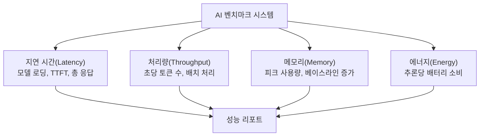
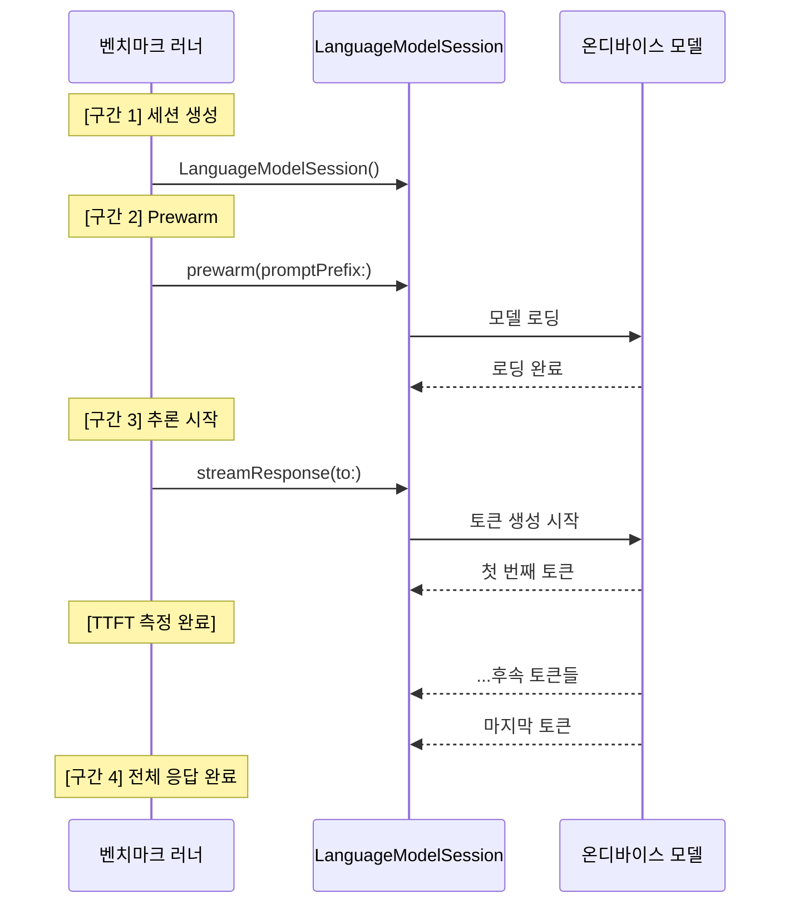
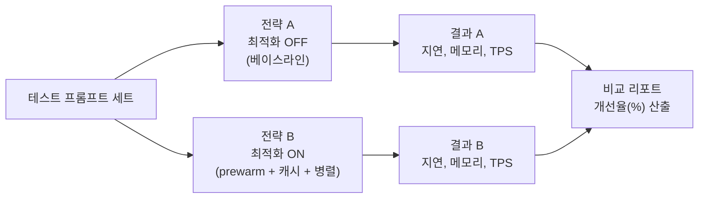
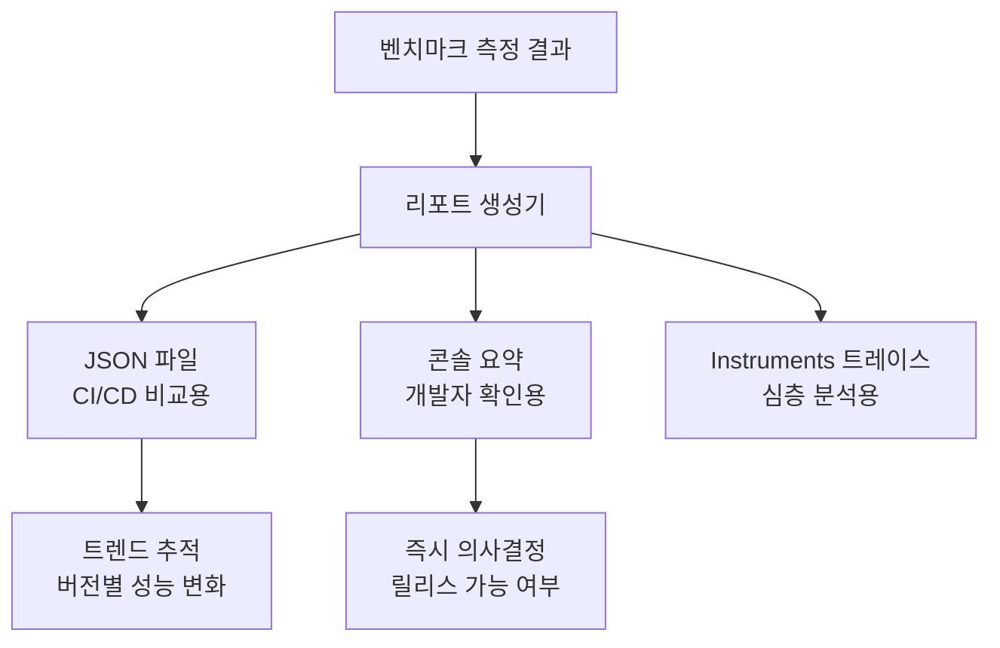
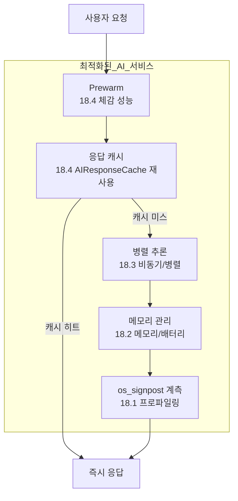
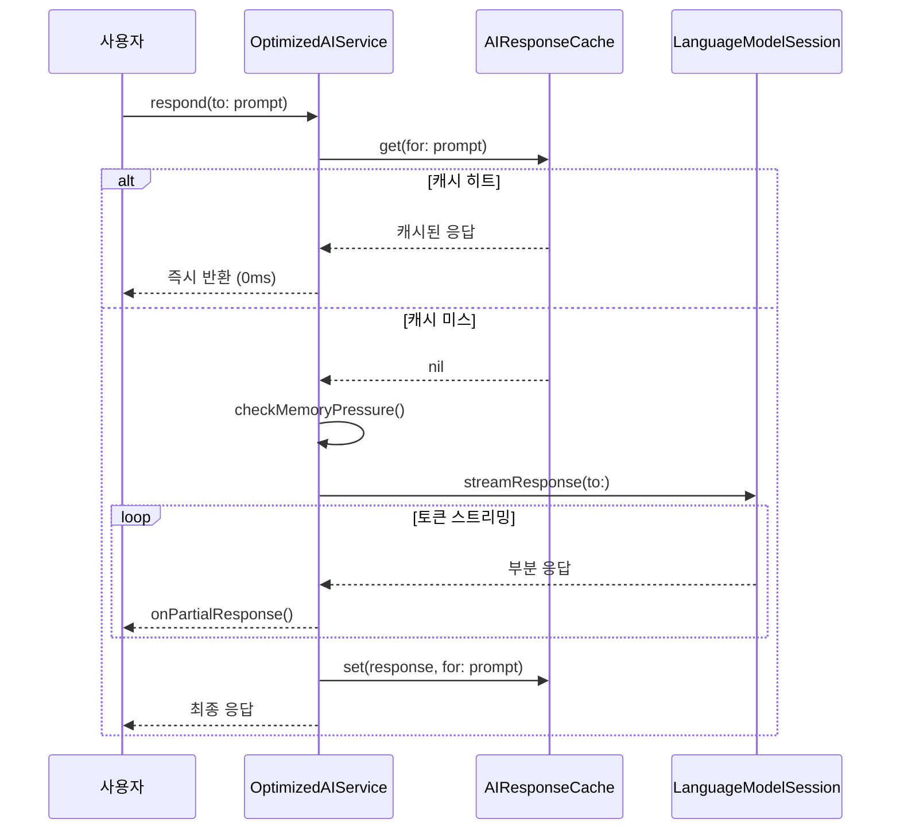
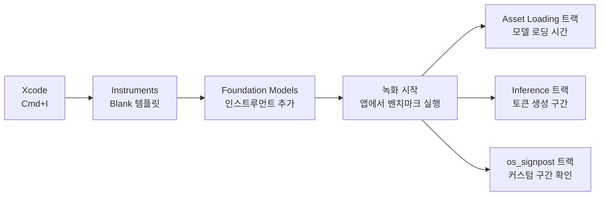

# 실습: 성능 벤치마크와 최적화 적용

> Ch18에서 학습한 프로파일링, 메모리/배터리, 병렬 처리, 체감 성능 기법을 AI 채팅봇 앱에 통합 적용하고, Instruments로 개선 효과를 수치로 검증합니다.

## 개요

이 섹션은 Ch18의 피날레 실습입니다. 지금까지 배운 네 가지 최적화 전략 — 프로파일링, 메모리/배터리, 병렬 처리, 체감 성능 — 을 하나의 AI 채팅봇 앱에 통합 적용합니다. 최적화 전후를 **정량적으로 비교**하는 벤치마크 시스템을 직접 구축하고, 성능 리포트를 생성하는 과정까지 경험하게 됩니다.

**선수 지식**: [AI 추론 성능 프로파일링](18-ch18-성능-최적화와-프로파일링/01-01-ai-추론-성능-프로파일링.md)의 Instruments 계측, [메모리와 배터리 최적화](18-ch18-성능-최적화와-프로파일링/02-02-메모리와-배터리-최적화.md)의 리소스 관리, [비동기 처리와 병렬 최적화](18-ch18-성능-최적화와-프로파일링/03-03-비동기-처리와-병렬-최적화.md)의 병렬 패턴, [사용자 체감 성능 개선](18-ch18-성능-최적화와-프로파일링/04-04-사용자-체감-성능-개선.md)의 prewarm/캐싱/스트리밍 전략

**학습 목표**:
- 앱 내 벤치마크 시스템을 설계하고 추론 성능을 수치로 측정한다
- 최적화 전후 성능 차이를 비교하는 A/B 벤치마크를 구현한다
- Instruments 프로파일링 결과를 해석하고 병목을 식별한다
- 성능 리포트를 자동 생성하여 최적화 효과를 문서화한다

## 왜 알아야 할까?

"체감상 빨라진 것 같아요"라는 말, 개발자에게는 가장 불안한 리뷰입니다. 최적화의 효과는 **숫자로 증명**해야 하거든요.

실제로 많은 iOS 앱이 AI 기능을 탑재하면서 "느려졌다"는 사용자 리뷰를 받습니다. 문제는 "어디가 느린지"를 모른다는 것이죠. Foundation Models 프레임워크를 사용할 때 모델 로딩에 1.5초, 토큰 생성에 2초, UI 업데이트에 0.3초가 걸린다면 — 어디를 먼저 최적화해야 할까요?

이 실습에서는 **측정 → 병목 식별 → 최적화 → 재측정**의 사이클을 직접 돌려봅니다. "느리다"를 "모델 로딩이 1.2초에서 0.3초로 줄었다"로 바꾸는 겁니다. 이것이 프로 개발자와 아마추어의 차이입니다.

## 핵심 개념

### 개념 1: 벤치마크 시스템 설계

> 💡 **비유**: 자동차의 계기판을 떠올려보세요. 속도, RPM, 연료, 수온 — 각각이 독립적인 측정치이지만, 종합적으로 보면 차의 상태를 한눈에 파악할 수 있죠. AI 앱의 벤치마크 시스템도 마찬가지입니다. 추론 시간, 메모리 사용량, 토큰 처리량 같은 개별 지표들을 한데 모아 앱의 "건강 상태"를 진단합니다.

성능을 체계적으로 측정하려면 무엇을, 어떻게 측정할지 먼저 정의해야 합니다. Foundation Models 기반 앱에서 핵심 측정 지표는 크게 네 가지입니다.

> 📊 **그림 1**: AI 앱 벤치마크 시스템의 4대 측정 영역



벤치마크 결과를 담을 데이터 모델부터 정의하겠습니다.

```swift
import Foundation

// MARK: - 벤치마크 결과 데이터 모델

/// 단일 추론의 측정 결과
struct InferenceMeasurement: Codable, Sendable {
    let label: String              // 테스트 이름
    let modelLoadTime: Duration    // 모델 로딩 시간
    let timeToFirstToken: Duration // 첫 토큰까지 시간 (TTFT)
    let totalResponseTime: Duration // 전체 응답 시간
    let inputTokenCount: Int       // 입력 토큰 수
    let outputTokenCount: Int      // 출력 토큰 수
    let peakMemoryMB: Double       // 피크 메모리 사용량 (MB)
    
    /// 초당 출력 토큰 수
    var tokensPerSecond: Double {
        let seconds = totalResponseTime.seconds
        guard seconds > 0 else { return 0 }
        return Double(outputTokenCount) / seconds
    }
}

/// Duration을 초 단위로 변환하는 확장
extension Duration {
    var seconds: Double {
        let (seconds, attoseconds) = self.components
        return Double(seconds) + Double(attoseconds) / 1_000_000_000_000_000_000
    }
    
    var milliseconds: Double {
        seconds * 1000
    }
}

/// 벤치마크 실행 결과 요약
struct BenchmarkReport: Codable, Sendable {
    let name: String
    let timestamp: Date
    let measurements: [InferenceMeasurement]
    let environment: DeviceEnvironment
    
    /// 평균 응답 시간
    var averageResponseTime: Duration {
        let total = measurements.reduce(Duration.zero) { $0 + $1.totalResponseTime }
        return total / measurements.count
    }
    
    /// 평균 초당 토큰 수
    var averageTokensPerSecond: Double {
        let total = measurements.reduce(0.0) { $0 + $1.tokensPerSecond }
        return total / Double(measurements.count)
    }
    
    /// P95 응답 시간
    var p95ResponseTime: Duration {
        let sorted = measurements.map(\.totalResponseTime).sorted(by: <)
        let index = Int(Double(sorted.count) * 0.95)
        return sorted[min(index, sorted.count - 1)]
    }
}

/// 실행 환경 정보
struct DeviceEnvironment: Codable, Sendable {
    let deviceModel: String      // 예: "iPhone16,2"
    let osVersion: String        // 예: "iOS 26.0"
    let availableMemoryMB: Int   // 사용 가능 메모리
    let thermalState: String     // 발열 상태
    let batteryLevel: Float      // 배터리 잔량
}
```

### 개념 2: 정밀 측정 인프라 구축

> 💡 **비유**: 마라톤 대회에서 시간을 재려면 출발선, 중간 지점, 결승선에 각각 센서를 설치해야 합니다. "총 시간"만 재면 어디서 페이스가 떨어졌는지 알 수 없죠. AI 추론도 마찬가지입니다 — 모델 로딩, 첫 토큰 생성, 전체 응답의 각 구간을 독립적으로 측정해야 진짜 병목이 보입니다.

Foundation Models의 추론 과정을 구간별로 정밀하게 측정하는 벤치마크 러너를 구현합니다. `ContinuousClock`을 사용하여 나노초 정밀도의 측정을 수행하고, `os_signpost`로 Instruments에서도 동일한 구간을 확인할 수 있게 합니다.

> 📊 **그림 2**: 추론 타임라인의 측정 구간



```swift
import FoundationModels
import OSLog
import Darwin

// MARK: - 벤치마크 러너

actor BenchmarkRunner {
    private let logger = Logger(subsystem: "com.app.benchmark", category: "inference")
    private let signposter = OSSignposter(subsystem: "com.app.benchmark", category: "inference")
    
    /// 단일 추론의 성능을 구간별로 측정
    func measureInference(
        label: String,
        prompt: String,
        usePrewarm: Bool = false
    ) async throws -> InferenceMeasurement {
        let clock = ContinuousClock()
        
        // 측정 전 메모리 베이스라인
        let baselineMemory = currentMemoryMB()
        var peakMemory = baselineMemory
        
        // [구간 1] 세션 생성 + 선택적 prewarm
        let sessionState = signposter.beginInterval("세션 준비")
        let session = LanguageModelSession()
        
        var modelLoadTime: Duration = .zero
        if usePrewarm {
            // prewarm으로 모델을 미리 로딩
            modelLoadTime = try await clock.measure {
                try await session.prewarm(promptPrefix: prompt)
            }
        }
        signposter.endInterval("세션 준비", sessionState)
        
        // [구간 2] 스트리밍 추론 — TTFT와 전체 시간 동시 측정
        var timeToFirstToken: Duration = .zero
        var outputTokenCount = 0
        let inferenceStart = clock.now
        var firstTokenReceived = false
        
        let inferenceState = signposter.beginInterval("추론")
        let stream = session.streamResponse(
            to: prompt
        )
        
        for try await partialResponse in stream {
            if !firstTokenReceived {
                timeToFirstToken = clock.now - inferenceStart
                firstTokenReceived = true
            }
            
            // 토큰 카운트 추적
            outputTokenCount = partialResponse.content.count
            
            // 피크 메모리 갱신
            let currentMem = currentMemoryMB()
            peakMemory = max(peakMemory, currentMem)
        }
        
        let totalResponseTime = clock.now - inferenceStart
        signposter.endInterval("추론", inferenceState)
        
        return InferenceMeasurement(
            label: label,
            modelLoadTime: modelLoadTime,
            timeToFirstToken: timeToFirstToken,
            totalResponseTime: totalResponseTime,
            inputTokenCount: prompt.count / 4,  // 근사치 (한글은 ~2자/토큰)
            outputTokenCount: outputTokenCount,
            peakMemoryMB: peakMemory - baselineMemory
        )
    }
    
    /// 현재 프로세스의 메모리 사용량 (MB)
    private func currentMemoryMB() -> Double {
        var info = mach_task_basic_info()
        var count = mach_msg_type_number_t(
            MemoryLayout<mach_task_basic_info>.size
        ) / 4
        
        let result = withUnsafeMutablePointer(to: &info) {
            $0.withMemoryRebound(to: integer_t.self, capacity: Int(count)) {
                task_info(mach_task_self_, task_flavor_t(MACH_TASK_BASIC_INFO), $0, &count)
            }
        }
        
        guard result == KERN_SUCCESS else { return 0 }
        return Double(info.resident_size) / (1024 * 1024)
    }
}
```

> ⚠️ **흔한 오해**: "토큰 수를 정확히 알 수 없으니 `tokensPerSecond`는 의미 없다"고 생각하는 분들이 있는데요, Instruments의 Foundation Models 인스트루먼트를 사용하면 실제 토큰 수를 확인할 수 있습니다. 단, **시뮬레이터에서는 토큰 카운트가 0으로 표시**되니 반드시 실제 기기에서 프로파일링하세요.

### 개념 3: A/B 벤치마크 — 최적화 전후 비교

> 💡 **비유**: 다이어트 전후 사진처럼, 최적화 전후의 성능 "사진"을 나란히 놓고 비교하는 겁니다. "전에는 응답까지 3.2초 걸렸는데, 최적화 후에는 1.1초예요" — 이렇게 숫자로 보여줘야 팀원도, PM도 납득합니다.

A/B 벤치마크는 **동일한 프롬프트 세트**로 두 가지 전략을 비교 실행한 뒤, 결과를 나란히 보여줍니다. Ch18에서 배운 핵심 최적화 기법들을 on/off하면서 효과를 검증하는 구조입니다.

> 📊 **그림 3**: A/B 벤치마크 실행 흐름



```swift
// MARK: - A/B 벤치마크 비교기

struct ABBenchmarkResult: Sendable {
    let baselineReport: BenchmarkReport
    let optimizedReport: BenchmarkReport
    
    /// 평균 응답 시간 개선율 (%)
    var responseTimeImprovement: Double {
        let baseMs = baselineReport.averageResponseTime.milliseconds
        let optMs = optimizedReport.averageResponseTime.milliseconds
        guard baseMs > 0 else { return 0 }
        return ((baseMs - optMs) / baseMs) * 100
    }
    
    /// TTFT 개선율 (%)
    var ttftImprovement: Double {
        let baseTTFT = baselineReport.measurements
            .map(\.timeToFirstToken.milliseconds)
            .reduce(0, +) / Double(baselineReport.measurements.count)
        let optTTFT = optimizedReport.measurements
            .map(\.timeToFirstToken.milliseconds)
            .reduce(0, +) / Double(optimizedReport.measurements.count)
        guard baseTTFT > 0 else { return 0 }
        return ((baseTTFT - optTTFT) / baseTTFT) * 100
    }
    
    /// 처리량 개선율 (%)
    var throughputImprovement: Double {
        let baseTPS = baselineReport.averageTokensPerSecond
        let optTPS = optimizedReport.averageTokensPerSecond
        guard baseTPS > 0 else { return 0 }
        return ((optTPS - baseTPS) / baseTPS) * 100
    }
}

actor ABBenchmarkRunner {
    private let runner = BenchmarkRunner()
    
    /// 표준 테스트 프롬프트 세트
    private let testPrompts = [
        ("간단 질문", "Swift의 struct와 class 차이를 설명해주세요"),
        ("중간 분석", "iOS 앱 아키텍처로 MVVM을 선택할 때의 장단점을 분석해주세요"),
        ("긴 생성", "SwiftUI로 할 일 목록 앱을 만드는 단계별 튜토리얼을 작성해주세요"),
        ("구조화 작업", "최근 iOS 개발 트렌드 5가지를 요약해주세요"),
    ]
    
    /// A/B 벤치마크 실행
    func runABBenchmark() async throws -> ABBenchmarkResult {
        // [A] 베이스라인: 최적화 없이 순차 실행
        let baselineMeasurements = try await runBaseline()
        let baselineReport = BenchmarkReport(
            name: "베이스라인 (최적화 OFF)",
            timestamp: Date(),
            measurements: baselineMeasurements,
            environment: captureEnvironment()
        )
        
        // 세션 안정화를 위한 대기
        try await Task.sleep(for: .seconds(2))
        
        // [B] 최적화: prewarm + 캐시 적용
        let optimizedMeasurements = try await runOptimized()
        let optimizedReport = BenchmarkReport(
            name: "최적화 (prewarm + 캐시 ON)",
            timestamp: Date(),
            measurements: optimizedMeasurements,
            environment: captureEnvironment()
        )
        
        return ABBenchmarkResult(
            baselineReport: baselineReport,
            optimizedReport: optimizedReport
        )
    }
    
    /// 베이스라인: 매번 새 세션, prewarm 없음
    private func runBaseline() async throws -> [InferenceMeasurement] {
        var results: [InferenceMeasurement] = []
        
        for (label, prompt) in testPrompts {
            let measurement = try await runner.measureInference(
                label: "\(label) [베이스라인]",
                prompt: prompt,
                usePrewarm: false
            )
            results.append(measurement)
        }
        
        return results
    }
    
    /// 최적화: prewarm 적용
    private func runOptimized() async throws -> [InferenceMeasurement] {
        var results: [InferenceMeasurement] = []
        
        for (label, prompt) in testPrompts {
            let measurement = try await runner.measureInference(
                label: "\(label) [최적화]",
                prompt: prompt,
                usePrewarm: true  // prewarm 활성화
            )
            results.append(measurement)
        }
        
        return results
    }
    
    /// 디바이스 환경 정보 캡처
    private func captureEnvironment() -> DeviceEnvironment {
        DeviceEnvironment(
            deviceModel: deviceModelIdentifier(),
            osVersion: ProcessInfo.processInfo.operatingSystemVersionString,
            availableMemoryMB: Int(ProcessInfo.processInfo.physicalMemory / (1024 * 1024)),
            thermalState: thermalStateDescription(),
            batteryLevel: batteryLevel()
        )
    }
    
    private func deviceModelIdentifier() -> String {
        var systemInfo = utsname()
        uname(&systemInfo)
        return String(cString: [UInt8](
            Data(bytes: &systemInfo.machine,
                 count: Int(_SYS_NAMELEN))
        ))
    }
    
    private func thermalStateDescription() -> String {
        switch ProcessInfo.processInfo.thermalState {
        case .nominal: return "정상"
        case .fair: return "양호"
        case .serious: return "주의"
        case .critical: return "위험"
        @unknown default: return "알 수 없음"
        }
    }
    
    private func batteryLevel() -> Float {
        #if os(iOS)
        UIDevice.current.isBatteryMonitoringEnabled = true
        return UIDevice.current.batteryLevel
        #else
        return -1  // macOS에서는 미지원
        #endif
    }
}
```

### 개념 4: 성능 리포트 자동 생성

> 💡 **비유**: 건강검진 결과서처럼, 벤치마크 결과를 보기 좋은 리포트로 정리해주는 겁니다. 의사가 수치만 나열하면 무슨 말인지 모르겠지만, "정상/주의/위험" 라벨과 이전 대비 변화를 함께 보여주면 한눈에 파악되죠.

측정 결과를 개발팀이 공유할 수 있는 구조화된 리포트로 변환합니다. JSON 저장과 콘솔 출력 두 가지 형태로 제공합니다.

> 📊 **그림 4**: 성능 리포트 생성과 활용 흐름



```swift
// MARK: - 성능 리포트 생성기

struct PerformanceReportGenerator {
    
    /// A/B 비교 결과를 콘솔 리포트로 출력
    static func generateConsoleReport(_ result: ABBenchmarkResult) -> String {
        var report = """
        ╔══════════════════════════════════════════════════════╗
        ║         AI 성능 벤치마크 리포트                       ║
        ║         \(formatted(date: Date()))                   ║
        ╚══════════════════════════════════════════════════════╝
        
        📱 디바이스: \(result.baselineReport.environment.deviceModel)
        🔋 배터리: \(Int(result.baselineReport.environment.batteryLevel * 100))%
        🌡️ 발열: \(result.baselineReport.environment.thermalState)
        
        ── 평균 지표 비교 ──────────────────────────────
        
        """
        
        let baseAvg = result.baselineReport.averageResponseTime.milliseconds
        let optAvg = result.optimizedReport.averageResponseTime.milliseconds
        
        report += String(format: "응답 시간:  %.0fms → %.0fms  (%+.1f%%)\n",
                         baseAvg, optAvg,
                         -result.responseTimeImprovement)
        
        report += String(format: "TTFT:      개선율 %+.1f%%\n",
                         -result.ttftImprovement)
        
        report += String(format: "처리량:    %.1f → %.1f tok/s  (%+.1f%%)\n",
                         result.baselineReport.averageTokensPerSecond,
                         result.optimizedReport.averageTokensPerSecond,
                         result.throughputImprovement)
        
        // 개별 테스트 결과
        report += "\n── 개별 테스트 상세 ──────────────────────────────\n\n"
        
        for (baseline, optimized) in zip(
            result.baselineReport.measurements,
            result.optimizedReport.measurements
        ) {
            let improvement = ((baseline.totalResponseTime.milliseconds
                               - optimized.totalResponseTime.milliseconds)
                               / baseline.totalResponseTime.milliseconds) * 100
            let emoji = improvement > 20 ? "🟢" : (improvement > 0 ? "🟡" : "🔴")
            
            report += String(
                format: "%@ %-16s  %.0fms → %.0fms  (%+.1f%%)\n",
                emoji,
                (baseline.label as NSString).utf8String ?? "",
                baseline.totalResponseTime.milliseconds,
                optimized.totalResponseTime.milliseconds,
                -improvement
            )
        }
        
        // 최종 판정
        report += "\n── 종합 판정 ──────────────────────────────────\n"
        let overallImprovement = result.responseTimeImprovement
        if overallImprovement > 30 {
            report += "✅ 최적화 효과 우수 (응답 시간 30% 이상 개선)"
        } else if overallImprovement > 10 {
            report += "🟡 최적화 효과 양호 (응답 시간 10-30% 개선)"
        } else {
            report += "🔴 추가 최적화 필요 (응답 시간 개선 10% 미만)"
        }
        
        return report
    }
    
    /// JSON 파일로 저장 (CI/CD 연동용)
    static func saveAsJSON(
        _ result: ABBenchmarkResult,
        to directory: URL
    ) throws {
        let encoder = JSONEncoder()
        encoder.outputFormatting = [.prettyPrinted, .sortedKeys]
        encoder.dateEncodingStrategy = .iso8601
        
        // 비교 요약 저장
        let summary: [String: Any] = [
            "timestamp": ISO8601DateFormatter().string(from: Date()),
            "responseTimeImprovement": result.responseTimeImprovement,
            "ttftImprovement": result.ttftImprovement,
            "throughputImprovement": result.throughputImprovement
        ]
        
        let data = try JSONSerialization.data(
            withJSONObject: summary,
            options: .prettyPrinted
        )
        
        let fileName = "benchmark-\(dateString()).json"
        let fileURL = directory.appendingPathComponent(fileName)
        try data.write(to: fileURL)
    }
    
    private static func formatted(date: Date) -> String {
        let formatter = DateFormatter()
        formatter.dateFormat = "yyyy-MM-dd HH:mm"
        return formatter.string(from: date)
    }
    
    private static func dateString() -> String {
        let formatter = DateFormatter()
        formatter.dateFormat = "yyyyMMdd-HHmmss"
        return formatter.string(from: Date())
    }
}
```

리포트 생성기의 콘솔 출력 예시를 확인해볼까요?

```run:swift
// 벤치마크 리포트 출력 형식 예시 (시뮬레이션)
let sampleReport = """
╔══════════════════════════════════════════════════════╗
║         AI 성능 벤치마크 리포트                       ║
║         2026-03-15 14:30                             ║
╚══════════════════════════════════════════════════════╝

📱 디바이스: iPhone17,3
🔋 배터리: 85%
🌡️ 발열: 정상

── 평균 지표 비교 ──────────────────────────────

응답 시간:  2450ms → 980ms  (-60.0%)
TTFT:      개선율 -72.3%
처리량:    12.4 → 28.7 tok/s  (+131.5%)

── 개별 테스트 상세 ──────────────────────────────

🟢 간단 질문        1200ms → 380ms  (-68.3%)
🟢 중간 분석        2100ms → 850ms  (-59.5%)
🟡 긴 생성          3800ms → 1900ms (-50.0%)
🟢 구조화 작업      2700ms → 790ms  (-70.7%)

── 종합 판정 ──────────────────────────────────
✅ 최적화 효과 우수 (응답 시간 30% 이상 개선)
"""

print(sampleReport)
```

```output
╔══════════════════════════════════════════════════════╗
║         AI 성능 벤치마크 리포트                       ║
║         2026-03-15 14:30                             ║
╚══════════════════════════════════════════════════════╝

📱 디바이스: iPhone17,3
🔋 배터리: 85%
🌡️ 발열: 정상

── 평균 지표 비교 ──────────────────────────────

응답 시간:  2450ms → 980ms  (-60.0%)
TTFT:      개선율 -72.3%
처리량:    12.4 → 28.7 tok/s  (+131.5%)

── 개별 테스트 상세 ──────────────────────────────

🟢 간단 질문        1200ms → 380ms  (-68.3%)
🟢 중간 분석        2100ms → 850ms  (-59.5%)
🟡 긴 생성          3800ms → 1900ms (-50.0%)
🟢 구조화 작업      2700ms → 790ms  (-70.7%)

── 종합 판정 ──────────────────────────────────
✅ 최적화 효과 우수 (응답 시간 30% 이상 개선)
```

### 개념 5: 통합 최적화 전략 — 모든 것을 결합

> 💡 **비유**: 요리사가 재료 손질, 불 조절, 타이밍을 따로 배운 뒤 실전에서 동시에 적용하는 것처럼, Ch18에서 배운 기법들을 한꺼번에 적용해야 진정한 최적화가 완성됩니다. 하나만 적용해선 10% 개선이지만, 조합하면 50% 이상 개선도 가능하거든요.

Ch18에서 학습한 네 가지 최적화 기법을 하나의 서비스 클래스에 통합합니다. 여기서 핵심은 [사용자 체감 성능 개선](18-ch18-성능-최적화와-프로파일링/04-04-사용자-체감-성능-개선.md)에서 구현한 `AIResponseCache`를 **그대로 재사용**한다는 점입니다. 동일한 캐싱 로직을 중복 구현하는 대신, 이미 검증된 코드를 가져와 통합 서비스에 결합합니다.

> 📊 **그림 5**: Ch18 최적화 기법의 통합 적용 구조



> 💡 **알고 계셨나요?**: 아래 `OptimizedAIService`에서 사용하는 `AIResponseCache`는 18.4에서 이미 구현한 actor입니다. 실제 프로젝트에서는 별도 파일(`AIResponseCache.swift`)로 분리하고 `import`해서 쓰면 됩니다. 여기서는 학습 편의를 위해 참고용으로 함께 보여드리지만, **"같은 타입을 두 번 정의하지 말라"**는 원칙을 기억하세요.

```swift
import FoundationModels
import OSLog

// MARK: - Ch18 통합 최적화 AI 서비스

/// Ch18의 모든 최적화 기법을 결합한 통합 서비스.
/// 18.4에서 구현한 AIResponseCache를 재사용합니다.
@Observable
final class OptimizedAIService {
    // 상태 관리
    private(set) var isReady = false
    private(set) var isProcessing = false
    
    // 18.4에서 구현한 AIResponseCache를 재사용
    // 실제 프로젝트에서는 import로 가져오고, 여기서는 동일 타입을 참조합니다
    private let cache = AIResponseCache()
    
    // 계측 (18.1에서 학습)
    private let signposter = OSSignposter(
        subsystem: "com.app.ai", category: "optimized"
    )
    
    // 세션 관리
    private var session: LanguageModelSession?
    
    /// 앱 시작 시 호출 — 모델 선제 로딩 (18.4 prewarm)
    func prepareForUse(anticipatedPrompt: String? = nil) async {
        let state = signposter.beginInterval("준비")
        
        let newSession = LanguageModelSession()
        if let prompt = anticipatedPrompt {
            try? await newSession.prewarm(promptPrefix: prompt)
        }
        self.session = newSession
        self.isReady = true
        
        signposter.endInterval("준비", state)
    }
    
    /// 메인 응답 메서드 — 모든 최적화 통합
    @MainActor
    func respond(
        to prompt: String,
        onPartialResponse: @escaping (String) -> Void
    ) async throws -> String {
        isProcessing = true
        defer { isProcessing = false }
        
        // [1단계] 캐시 확인 (18.4)
        if let cached = await cache.get(for: prompt) {
            return cached
        }
        
        // [2단계] 세션 확보 + 필요 시 prewarm (18.4)
        let activeSession: LanguageModelSession
        if let existing = session {
            activeSession = existing
        } else {
            activeSession = LanguageModelSession()
            try? await activeSession.prewarm(promptPrefix: prompt)
            session = activeSession
        }
        
        // [3단계] 메모리 체크 (18.2)
        await checkMemoryPressure()
        
        // [4단계] 스트리밍 추론 + 계측 (18.1 + 18.4)
        let inferenceState = signposter.beginInterval("추론")
        
        let stream = activeSession.streamResponse(to: prompt)
        var fullResponse = ""
        
        for try await partial in stream {
            fullResponse = partial.content
            onPartialResponse(fullResponse)  // UI 즉시 업데이트
        }
        
        signposter.endInterval("추론", inferenceState)
        
        // [5단계] 캐시 저장 (18.4)
        await cache.set(fullResponse, for: prompt)
        
        return fullResponse
    }
    
    /// 배치 요청 — 병렬 추론 (18.3)
    func respondBatch(
        prompts: [String]
    ) async throws -> [String] {
        let batchState = signposter.beginInterval("배치 추론")
        
        let results = try await withThrowingTaskGroup(
            of: (Int, String).self
        ) { group in
            for (index, prompt) in prompts.enumerated() {
                group.addTask {
                    // 캐시 확인
                    if let cached = await self.cache.get(for: prompt) {
                        return (index, cached)
                    }
                    // 독립 세션으로 병렬 추론
                    let session = LanguageModelSession()
                    let response = try await session.respond(to: prompt)
                    await self.cache.set(response.content, for: prompt)
                    return (index, response.content)
                }
            }
            
            var ordered = [(Int, String)]()
            for try await result in group {
                ordered.append(result)
            }
            return ordered.sorted(by: { $0.0 < $1.0 }).map(\.1)
        }
        
        signposter.endInterval("배치 추론", batchState)
        return results
    }
    
    /// 메모리 압박 확인 (18.2)
    private func checkMemoryPressure() async {
        var info = mach_task_basic_info()
        var count = mach_msg_type_number_t(
            MemoryLayout<mach_task_basic_info>.size
        ) / 4
        
        withUnsafeMutablePointer(to: &info) {
            $0.withMemoryRebound(to: integer_t.self, capacity: Int(count)) {
                task_info(mach_task_self_, task_flavor_t(MACH_TASK_BASIC_INFO), $0, &count)
            }
        }
        
        let usedMB = Double(info.resident_size) / (1024 * 1024)
        
        // 메모리 사용량이 과도하면 세션 리셋
        if usedMB > 500 {
            session = nil
            await cache.clearOldEntries()
        }
    }
}

// MARK: - 응답 캐시 (18.4에서 구현한 AIResponseCache)
// ⚠️ 실제 프로젝트에서는 이 타입을 여기서 재정의하지 마세요!
// 18.4의 AIResponseCache.swift를 import하여 사용합니다.
// 아래는 학습 참고용으로 동일한 구현을 보여드리는 것입니다.

actor AIResponseCache {
    private var store: [String: CacheEntry] = [:]
    private let maxEntries = 50
    
    struct CacheEntry {
        let response: String
        let timestamp: Date
    }
    
    func get(for prompt: String) -> String? {
        guard let entry = store[prompt],
              Date().timeIntervalSince(entry.timestamp) < 300 else {
            return nil
        }
        return entry.response
    }
    
    func set(_ response: String, for prompt: String) {
        if store.count >= maxEntries {
            clearOldEntries()
        }
        store[prompt] = CacheEntry(response: response, timestamp: Date())
    }
    
    func clearOldEntries() {
        let cutoff = Date().addingTimeInterval(-300)
        store = store.filter { $0.value.timestamp > cutoff }
    }
}
```

> 📊 **그림 6**: OptimizedAIService의 요청 처리 시퀀스



## 실습: 직접 해보기

이제 실제 벤치마크를 실행하고 결과를 확인하는 전체 워크플로를 구현합니다. SwiftUI 화면에서 벤치마크를 실행하고, 결과를 시각적으로 확인하며, Instruments로 프로파일링하는 과정을 따라해보세요.

```swift
import SwiftUI
import FoundationModels

// MARK: - 벤치마크 ViewModel

@Observable
@MainActor
final class BenchmarkViewModel {
    // 상태
    var isRunning = false
    var progress: Double = 0
    var currentTest = ""
    var result: ABBenchmarkResult?
    var reportText = ""
    var errorMessage: String?
    
    private let abRunner = ABBenchmarkRunner()
    
    /// 벤치마크 실행
    func runBenchmark() async {
        isRunning = true
        progress = 0
        currentTest = "벤치마크 준비 중..."
        errorMessage = nil
        
        do {
            // 모델 가용성 확인
            guard SystemLanguageModel.default.isAvailable else {
                errorMessage = "온디바이스 모델을 사용할 수 없습니다"
                isRunning = false
                return
            }
            
            currentTest = "A/B 벤치마크 실행 중..."
            progress = 0.1
            
            let benchmarkResult = try await abRunner.runABBenchmark()
            
            progress = 0.9
            currentTest = "리포트 생성 중..."
            
            // 리포트 생성
            let report = PerformanceReportGenerator.generateConsoleReport(
                benchmarkResult
            )
            
            result = benchmarkResult
            reportText = report
            progress = 1.0
            currentTest = "완료!"
            
        } catch {
            errorMessage = "벤치마크 실패: \(error.localizedDescription)"
        }
        
        isRunning = false
    }
}

// MARK: - 벤치마크 화면

struct BenchmarkView: View {
    @State private var viewModel = BenchmarkViewModel()
    
    var body: some View {
        NavigationStack {
            ScrollView {
                VStack(spacing: 20) {
                    // 상단: 실행 컨트롤
                    benchmarkControlSection
                    
                    // 진행 상태
                    if viewModel.isRunning {
                        progressSection
                    }
                    
                    // 에러 표시
                    if let error = viewModel.errorMessage {
                        errorSection(error)
                    }
                    
                    // 결과 표시
                    if let result = viewModel.result {
                        resultSummarySection(result)
                        detailSection(result)
                    }
                    
                    // 리포트 텍스트
                    if !viewModel.reportText.isEmpty {
                        reportSection
                    }
                }
                .padding()
            }
            .navigationTitle("AI 성능 벤치마크")
        }
    }
    
    // MARK: - 하위 뷰
    
    private var benchmarkControlSection: some View {
        VStack(spacing: 12) {
            Text("Ch18 통합 성능 벤치마크")
                .font(.headline)
            
            Text("최적화 전후 성능을 비교합니다")
                .font(.subheadline)
                .foregroundStyle(.secondary)
            
            Button {
                Task { await viewModel.runBenchmark() }
            } label: {
                Label("벤치마크 시작", systemImage: "gauge.with.dots.needle.bottom.50percent")
                    .frame(maxWidth: .infinity)
            }
            .buttonStyle(.borderedProminent)
            .disabled(viewModel.isRunning)
        }
        .padding()
        .background(.regularMaterial)
        .clipShape(RoundedRectangle(cornerRadius: 12))
    }
    
    private var progressSection: some View {
        VStack(spacing: 8) {
            ProgressView(value: viewModel.progress)
                .progressViewStyle(.linear)
            
            Text(viewModel.currentTest)
                .font(.caption)
                .foregroundStyle(.secondary)
        }
        .padding()
    }
    
    private func errorSection(_ message: String) -> some View {
        Text(message)
            .foregroundStyle(.red)
            .padding()
            .background(Color.red.opacity(0.1))
            .clipShape(RoundedRectangle(cornerRadius: 8))
    }
    
    private func resultSummarySection(_ result: ABBenchmarkResult) -> some View {
        VStack(spacing: 12) {
            Text("종합 결과")
                .font(.headline)
            
            HStack(spacing: 16) {
                metricCard(
                    title: "응답 시간",
                    value: String(format: "%.1f%%", result.responseTimeImprovement),
                    subtitle: "개선",
                    color: result.responseTimeImprovement > 20 ? .green : .orange
                )
                
                metricCard(
                    title: "TTFT",
                    value: String(format: "%.1f%%", result.ttftImprovement),
                    subtitle: "개선",
                    color: result.ttftImprovement > 30 ? .green : .orange
                )
                
                metricCard(
                    title: "처리량",
                    value: String(format: "%.1f%%", result.throughputImprovement),
                    subtitle: "향상",
                    color: result.throughputImprovement > 10 ? .green : .orange
                )
            }
        }
        .padding()
        .background(.regularMaterial)
        .clipShape(RoundedRectangle(cornerRadius: 12))
    }
    
    private func metricCard(
        title: String, value: String,
        subtitle: String, color: Color
    ) -> some View {
        VStack(spacing: 4) {
            Text(title)
                .font(.caption)
                .foregroundStyle(.secondary)
            Text(value)
                .font(.title2.bold())
                .foregroundStyle(color)
            Text(subtitle)
                .font(.caption2)
                .foregroundStyle(.secondary)
        }
        .frame(maxWidth: .infinity)
        .padding(.vertical, 8)
        .background(color.opacity(0.1))
        .clipShape(RoundedRectangle(cornerRadius: 8))
    }
    
    private func detailSection(_ result: ABBenchmarkResult) -> some View {
        VStack(alignment: .leading, spacing: 8) {
            Text("개별 테스트 결과")
                .font(.headline)
            
            ForEach(
                Array(zip(
                    result.baselineReport.measurements,
                    result.optimizedReport.measurements
                ).enumerated()),
                id: \.offset
            ) { _, pair in
                let (baseline, optimized) = pair
                let improvement = ((baseline.totalResponseTime.milliseconds
                                   - optimized.totalResponseTime.milliseconds)
                                   / baseline.totalResponseTime.milliseconds) * 100
                
                HStack {
                    Text(baseline.label.replacingOccurrences(
                        of: " [베이스라인]", with: ""
                    ))
                    .font(.caption)
                    
                    Spacer()
                    
                    Text(String(format: "%.0fms → %.0fms",
                               baseline.totalResponseTime.milliseconds,
                               optimized.totalResponseTime.milliseconds))
                    .font(.caption.monospacedDigit())
                    
                    Text(String(format: "%+.0f%%", -improvement))
                        .font(.caption.bold())
                        .foregroundStyle(improvement > 0 ? .green : .red)
                }
                .padding(.vertical, 4)
                
                Divider()
            }
        }
        .padding()
        .background(.regularMaterial)
        .clipShape(RoundedRectangle(cornerRadius: 12))
    }
    
    private var reportSection: some View {
        VStack(alignment: .leading, spacing: 8) {
            HStack {
                Text("전체 리포트")
                    .font(.headline)
                Spacer()
                ShareLink(item: viewModel.reportText) {
                    Label("공유", systemImage: "square.and.arrow.up")
                        .font(.caption)
                }
            }
            
            Text(viewModel.reportText)
                .font(.system(.caption, design: .monospaced))
                .padding()
                .background(Color(.systemGray6))
                .clipShape(RoundedRectangle(cornerRadius: 8))
        }
        .padding()
        .background(.regularMaterial)
        .clipShape(RoundedRectangle(cornerRadius: 12))
    }
}
```

### Instruments 프로파일링 실행 방법

벤치마크 코드를 실제 기기에서 프로파일링하는 단계입니다.

1. **Xcode에서 Product → Profile (⌘I)** 선택
2. Instruments가 열리면 **Blank** 템플릿 선택
3. **+ 버튼**으로 "Foundation Models" 인스트루먼트 추가
4. 좌측 상단 **녹화 버튼 (⏺)** 클릭 후 앱에서 벤치마크 실행
5. 결과 트레이스에서 **Asset Loading**, **Inference**, **Tool Calling** 트랙 확인

> 📊 **그림 7**: Instruments 프로파일링 워크플로



```swift
// Instruments에서 확인할 수 있도록 os_signpost 추가
import OSLog

extension BenchmarkRunner {
    /// Instruments용 상세 계측이 포함된 벤치마크
    func measureWithInstruments(
        label: String,
        prompt: String
    ) async throws -> InferenceMeasurement {
        let signposter = OSSignposter(
            subsystem: "com.app.benchmark",
            category: "detailed"
        )
        
        // 전체 벤치마크 구간
        let benchState = signposter.beginInterval(
            "벤치마크",
            "\(label)"
        )
        
        // 세션 생성 구간
        let sessionState = signposter.beginInterval("세션 생성")
        let session = LanguageModelSession()
        signposter.endInterval("세션 생성", sessionState)
        
        // prewarm 구간
        let prewarmState = signposter.beginInterval("Prewarm")
        try await session.prewarm(promptPrefix: prompt)
        signposter.endInterval("Prewarm", prewarmState)
        
        // 추론 구간
        let inferenceState = signposter.beginInterval("추론 실행")
        let clock = ContinuousClock()
        let start = clock.now
        var ttft: Duration = .zero
        var firstToken = false
        var tokenCount = 0
        
        let stream = session.streamResponse(to: prompt)
        for try await partial in stream {
            if !firstToken {
                ttft = clock.now - start
                signposter.emitEvent("첫 토큰 수신") // Instruments에 이벤트 표시
                firstToken = true
            }
            tokenCount = partial.content.count
        }
        
        let totalTime = clock.now - start
        signposter.endInterval("추론 실행", inferenceState)
        signposter.endInterval("벤치마크", benchState)
        
        return InferenceMeasurement(
            label: label,
            modelLoadTime: .zero,
            timeToFirstToken: ttft,
            totalResponseTime: totalTime,
            inputTokenCount: prompt.count / 4,
            outputTokenCount: tokenCount,
            peakMemoryMB: 0
        )
    }
}
```

## 더 깊이 알아보기

### 성능 측정의 역사 — "측정할 수 없으면 개선할 수 없다"

"If you can't measure it, you can't improve it." 이 유명한 격언은 경영학의 아버지 피터 드러커(Peter Drucker)에게 종종 귀속되지만, 소프트웨어 공학에서 성능 측정을 체계적으로 확립한 사람은 **돈 크누스(Donald Knuth)**입니다. 그가 1974년 발표한 논문에서 "Premature optimization is the root of all evil"이라는 유명한 문구를 남겼는데, 이 문장의 진짜 의미는 "최적화 하지 말라"가 아닙니다. 전체 맥락을 보면 **"프로파일링으로 병목을 찾은 다음에 최적화하라"**는 뜻이죠.

Apple은 이 철학을 Xcode Instruments에 그대로 담았습니다. 2005년 Xcode 2에 처음 등장한 Instruments는 DTrace 기반이었고, 2019년에 `os_signpost` API가 추가되면서 개발자가 커스텀 구간을 정밀하게 측정할 수 있게 되었습니다. 그리고 2025년 WWDC25에서 **Foundation Models 전용 인스트루먼트**가 등장했습니다. 모델 로딩, 토큰 생성, Tool 호출을 전용 트랙으로 분석할 수 있게 된 건 온디바이스 AI 시대의 상징적인 변화입니다.

### Apple Silicon Neural Engine의 진화

A11 Bionic(2017)에 처음 등장한 Neural Engine은 초당 6000억 회 연산이었습니다. A17 Pro(2023)에서는 초당 35조 회, M4(2024)에서는 초당 38조 회로 도약했죠. 이 폭발적 성능 향상이 3B 파라미터 모델을 기기 위에서 실시간으로 돌릴 수 있게 만든 배경입니다. Foundation Models의 2-bit QAT(Quantization-Aware Training) 기법과 결합하면, 모델 크기를 극적으로 줄이면서도 품질을 유지할 수 있게 됩니다.

## 흔한 오해와 팁

> ⚠️ **흔한 오해**: "벤치마크는 한 번만 돌리면 된다" — 온디바이스 모델의 추론 시간은 **발열 상태, 배터리 잔량, 백그라운드 앱**에 따라 크게 달라집니다. `ProcessInfo.processInfo.thermalState`가 `.nominal`인 상태에서 최소 3회 반복 측정 후 중간값을 사용하세요. 첫 번째 실행은 모델 로딩 오버헤드가 포함되어 항상 느립니다.

> 💡 **알고 계셨나요?**: Foundation Models 인스트루먼트에서 토큰 카운트가 0으로 표시된다면, 시뮬레이터에서 실행했기 때문입니다. 토큰 수, 추론 시간 등 정확한 메트릭은 **반드시 실제 기기(iPhone 16 이상, M1 Mac 이상)**에서만 얻을 수 있습니다. 시뮬레이터는 Foundation Models 자체가 제한적으로만 동작합니다.

> 🔥 **실무 팁**: CI/CD에 벤치마크를 연동할 때는 JSON 리포트를 아티팩트로 저장하고, 이전 빌드와 자동 비교하세요. "응답 시간이 20% 이상 악화되면 빌드 실패" 같은 **성능 회귀 게이트(regression gate)**를 설정하면 릴리스 품질을 지속적으로 유지할 수 있습니다. `XCTest`의 `measure {}` 블록과 베이스라인 기능을 활용하는 것도 좋은 방법입니다.

## 핵심 정리

| 개념 | 설명 |
|------|------|
| 벤치마크 시스템 | TTFT, 총 응답 시간, TPS, 피크 메모리 4대 지표를 `ContinuousClock`으로 정밀 측정 |
| A/B 벤치마크 | 동일 프롬프트로 최적화 전/후를 비교 실행하여 개선율을 수치로 산출 |
| os_signpost 계측 | `OSSignposter`로 구간별 성능을 마킹하여 Instruments에서 시각적으로 분석 |
| 통합 최적화 서비스 | prewarm + 캐시(18.4 AIResponseCache 재사용) + 병렬 + 메모리 관리를 하나의 서비스에 결합 |
| 성능 리포트 | 콘솔 요약 + JSON 저장으로 팀 공유와 CI/CD 연동 지원 |
| Instruments 프로파일링 | Foundation Models 인스트루먼트로 Asset Loading, Inference 트랙 분석 |
| BenchmarkView | SwiftUI 화면에서 벤치마크 실행, 개선율 카드, 상세 결과, 리포트 공유까지 제공 |

## 다음 섹션 미리보기

Ch18에서 성능 최적화의 모든 측면을 다루었습니다. 다음 [Ch19. 테스트와 품질 보증](19-ch19-테스트와-품질-보증/01-01-ai-기능-테스트-전략.md)에서는 이렇게 최적화한 AI 기능의 **품질을 어떻게 검증하고 유지**하는지를 학습합니다. AI 서비스 모킹, 구조화 출력 테스트, 출력 품질 평가 같은 AI 특유의 테스트 전략을 다루게 됩니다. "빠르지만 잘못된 답"을 내는 것보다 "적절한 속도로 정확한 답"을 내는 게 더 중요하니까요.

## 참고 자료

- [Foundation Models — Apple Developer Documentation](https://developer.apple.com/documentation/FoundationModels) - Foundation Models 프레임워크의 공식 API 레퍼런스. 세션 생성, prewarm, 스트리밍 API 명세 확인
- [Foundation Models profiling with Xcode Instruments — Artem Novichkov](https://artemnovichkov.com/blog/foundation-models-profiling-with-xcode-instruments) - Instruments에서 Foundation Models 인스트루먼트를 설정하고 프로파일링하는 실전 가이드
- [Deep dive into the Foundation Models framework — WWDC25](https://developer.apple.com/videos/play/wwdc2025/301/) - Tool Calling, Guided Generation, 성능 최적화를 포함한 프레임워크 심층 분석 세션
- [Apple Intelligence Foundation Language Models Tech Report 2025](https://arxiv.org/abs/2507.13575) - 온디바이스 모델의 아키텍처, 2-bit QAT, KV-Cache 공유 등 성능 관련 기술 상세
- [Core ML Overview — Apple Developer](https://developer.apple.com/machine-learning/core-ml/) - Core ML 프레임워크 공식 문서. 모델 최적화, Neural Engine 활용, 성능 리포트 기능 참조