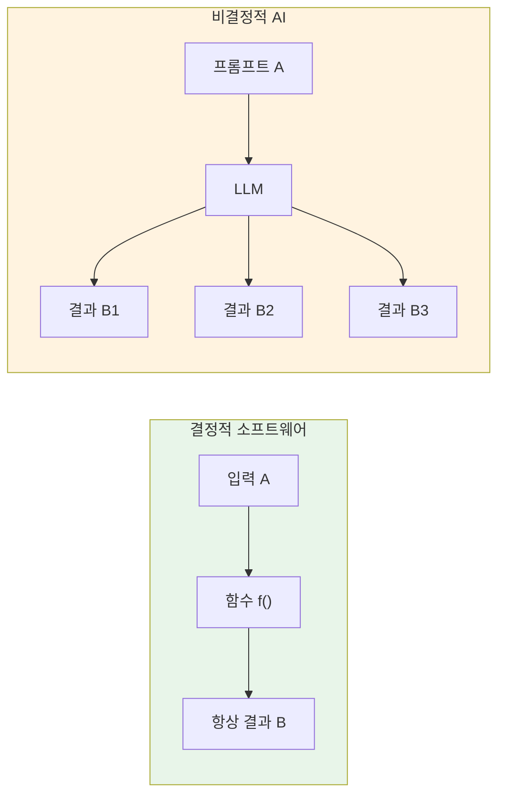
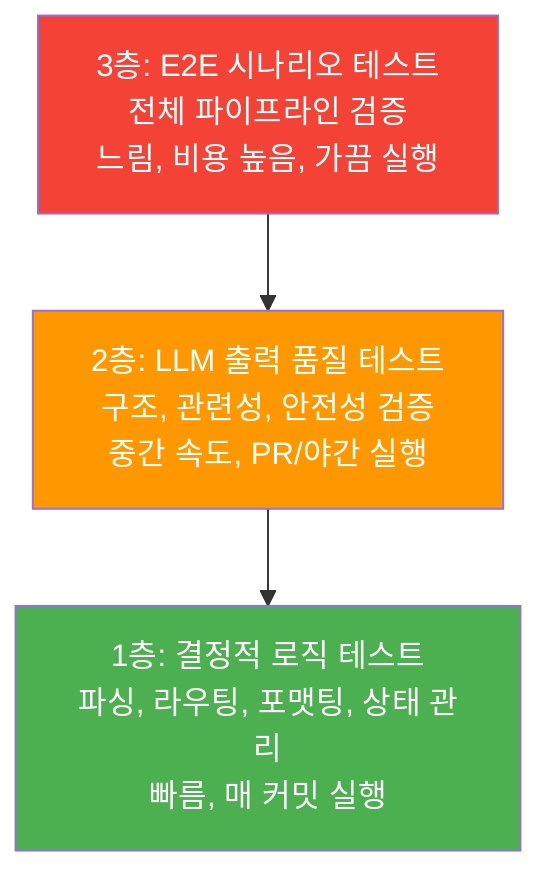
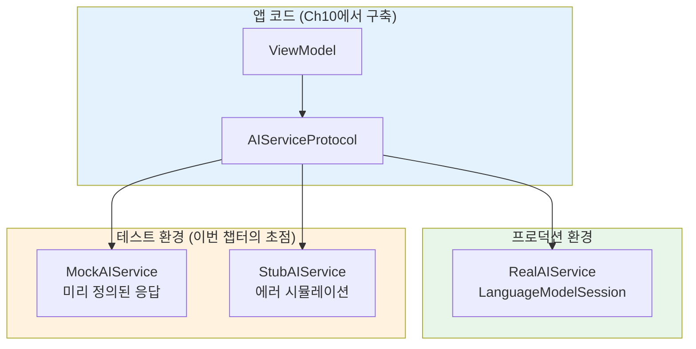
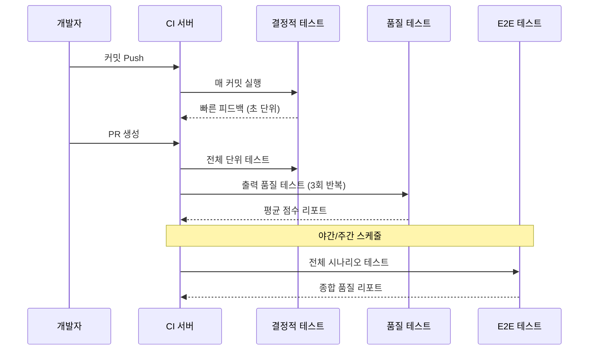
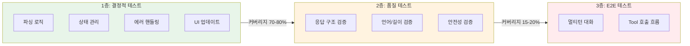

# AI 기능 테스트 전략

> Foundation Models 기반 AI 기능의 비결정적 특성을 이해하고, 효과적인 테스트 전략을 수립합니다

## 개요

이 섹션에서는 AI 기능이 기존 소프트웨어 테스트와 근본적으로 다른 이유를 알아보고, Foundation Models 기반 앱을 체계적으로 검증하기 위한 테스트 전략을 설계합니다. 같은 입력에 다른 출력이 나오는 비결정적(non-deterministic) 특성을 어떻게 다루는지, 결정적 로직과 확률적 출력을 어떻게 분리하여 테스트하는지를 실전 코드와 함께 배웁니다.

**선수 지식**: [성능 벤치마크와 최적화 적용](18-ch18-성능-최적화와-프로파일링/05-05-실습-성능-벤치마크와-최적화-적용.md)에서 다룬 프로파일링 기법, [AI 서비스 레이어 구현](10-ch10-실전-프로젝트-ai-채팅봇-앱/03-03-ai-서비스-레이어-구현.md)에서 구축한 `AIServiceProtocol` 기반 서비스 레이어

**학습 목표**:
- AI 기능의 비결정적 특성이 테스트에 미치는 영향을 설명할 수 있다
- AI 테스트 피라미드(결정적/확률적/E2E)를 설계하고 적용할 수 있다
- Ch10에서 구축한 `AIServiceProtocol`을 활용해 Mock/Stub을 작성할 수 있다
- 결정적 검증과 확률적 검증을 분리하는 테스트 전략을 수립할 수 있다

## 왜 알아야 할까?

여러분이 [Foundation Models 프레임워크](03-ch3-foundation-models-프레임워크-시작하기/01-01-systemlanguagemodel-이해하기.md)로 멋진 AI 기능을 만들었다고 가정해봅시다. 프롬프트를 보내면 잘 동작하고, 구조화 출력도 깔끔하게 나옵니다. 그런데 이걸 어떻게 테스트하죠?

전통적인 소프트웨어에서는 `2 + 2`의 결과가 항상 `4`입니다. 하지만 AI 모델에게 "서울의 맛집을 추천해줘"라고 물으면, 매번 다른 식당 목록이 돌아옵니다. 같은 입력인데 다른 출력 — 이것이 바로 **비결정적(non-deterministic)** 동작이고, 기존 테스트 방법론을 그대로 적용할 수 없는 근본적인 이유입니다.

App Store에 배포된 앱에서 AI 기능이 엉뚱한 답변을 내놓거나, 빈 문자열을 반환하거나, 예상치 못한 형식의 데이터를 뱉어낸다면? 사용자 경험은 바로 무너집니다. 테스트 없이 AI 기능을 출시하는 것은 안전벨트 없이 고속도로를 달리는 것과 같습니다.

## 핵심 개념

### 개념 1: 비결정적 출력의 본질

> 💡 **비유**: 같은 재료로 요리해도 셰프의 컨디션에 따라 맛이 미묘하게 달라지는 것처럼, AI 모델도 같은 프롬프트에 매번 조금씩 다른 응답을 생성합니다. 중요한 건 "정확히 같은 맛"이 아니라 "맛있는 범위 안에 있느냐"입니다.

Foundation Models의 온디바이스 모델은 토큰을 생성할 때 확률 분포에서 샘플링합니다. `temperature`나 `topK` 같은 [GenerationOptions](03-ch3-foundation-models-프레임워크-시작하기/04-04-generationoptions와-생성-제어.md) 파라미터가 이 샘플링에 영향을 주기 때문에, 동일한 프롬프트라도 실행할 때마다 결과가 달라질 수 있습니다.

> 📊 **그림 1**: 결정적 소프트웨어 vs 비결정적 AI의 테스트 차이



이 차이가 테스트에 미치는 핵심 영향은 다음과 같습니다:

| 구분 | 결정적 소프트웨어 | AI 기능 |
|------|-----------------|---------|
| **검증 방식** | `assertEqual(결과, 기대값)` | `assertContains`, `assertInRange`, 패턴 매칭 |
| **반복 실행** | 항상 동일한 결과 | 실행마다 다를 수 있음 |
| **실패 원인** | 버그 (코드 결함) | 버그 + 모델 특성 + 프롬프트 품질 |
| **테스트 속도** | 밀리초 단위 | 초~십초 단위 (추론 시간) |

정리하자면, 결정적 소프트웨어에서는 "결과가 정확히 X인가?"를 물었지만, AI 기능에서는 **"결과가 허용 가능한 범위 안에 있는가?"**를 물어야 합니다. 이것이 AI 테스트 전략의 출발점이죠.

```swift
import FoundationModels

// ❌ 이런 테스트는 비결정적 출력에서 깨지기 쉽습니다
func testBrittleApproach() async throws {
    let session = LanguageModelSession()
    let response = try await session.respond(to: "서울 맛집 3곳 추천해줘")
    // 모델이 매번 같은 맛집을 추천할까요? 절대 아닙니다!
    XCTAssertEqual(response.content, "1. 광장시장 2. 을지로 3. 명동")
}

// ✅ 구조적 속성을 검증하는 접근이 올바릅니다
func testStructuralApproach() async throws {
    let session = LanguageModelSession()
    let response = try await session.respond(to: "서울 맛집 3곳 추천해줘")
    let lines = response.content.split(separator: "\n")
    // "3곳"이라는 구조적 요건을 검증
    XCTAssertGreaterThanOrEqual(lines.count, 3)
    // 한국어 응답인지 검증
    XCTAssertTrue(response.content.contains("서울") || response.content.range(of: "\\p{Hangul}", options: .regularExpression) != nil)
}
```

### 개념 2: AI 테스트 피라미드

> 💡 **비유**: 건물을 지을 때 기초(콘크리트) → 구조(철골) → 마감(인테리어) 순서로 검증하듯, AI 기능도 "절대 변하지 않는 로직"부터 "모델이 관여하는 품질"까지 단계적으로 테스트합니다.

전통적인 테스트 피라미드(단위 → 통합 → E2E)는 AI 기능에 그대로 적용하기 어렵습니다. 대신 **"얼마나 많은 불확실성을 허용하느냐"**를 기준으로 3개 층을 나눕니다.

> 📊 **그림 2**: AI 테스트 피라미드 — 불확실성 기준



**1층 — 결정적 로직 테스트** (가장 넓은 기반)

AI와 직접 관련 없는 순수 로직을 테스트합니다. 이 부분은 전통적인 단위 테스트와 동일합니다:
- 응답 파싱 로직 (`String` → `Model` 변환)
- Tool 입출력 스키마 검증
- 상태 관리 (세션 전환, 대화 히스토리)
- 에러 핸들링 분기
- UI 상태 업데이트 로직

**2층 — LLM 출력 품질 테스트** (중간 층)

모델이 생성한 출력의 **구조적 품질**을 검증합니다:
- @Generable 구조체가 올바르게 디코딩되는가?
- 응답이 요청한 언어(한국어)로 돌아오는가?
- 응답 길이가 합리적 범위 안인가?
- 금지된 콘텐츠가 포함되지 않았는가?

**3층 — E2E 시나리오 테스트** (가장 좁은 꼭대기)

실제 사용자 시나리오를 처음부터 끝까지 실행합니다:
- 멀티턴 대화가 맥락을 유지하는가?
- Tool 호출 결과가 최종 응답에 올바르게 반영되는가?
- 에러 발생 시 사용자에게 적절한 메시지가 표시되는가?

### 개념 3: Mock/Stub으로 결정적 테스트 경계 만들기

> 💡 **비유**: 택배 배송을 검증할 때, "박스가 도착했는가?"(결정적)와 "물건이 마음에 드는가?"(주관적)는 완전히 다른 검증입니다. AI 테스트도 마찬가지로 "응답이 왔는가, 형식이 맞는가"와 "응답 내용이 좋은가"를 분리해야 합니다.

[Ch10에서 구축한 AIServiceProtocol](10-ch10-실전-프로젝트-ai-채팅봇-앱/03-03-ai-서비스-레이어-구현.md)을 기억하시죠? 프로덕션 코드에서 `LanguageModelSession` 호출을 프로토콜 뒤에 감싼 그 구조가, 테스트에서는 **Mock/Stub 주입 지점**이 됩니다. 프로토콜 자체의 설계는 Ch10에서 이미 다뤘으니, 여기서는 테스트 관점에서 이 경계를 어떻게 활용하는지에 집중하겠습니다.

> 📊 **그림 3**: AIServiceProtocol을 테스트 경계로 활용하기



테스트 관점에서 `AIServiceProtocol` 경계가 제공하는 핵심 가치는 **결정성을 되찾는 것**입니다. Mock에 넣은 응답이 그대로 돌아오니, 그 위에 쌓이는 파싱, 상태 관리, UI 업데이트 로직을 100% 결정적으로 테스트할 수 있죠.

아래는 테스트 전용 Mock 구현입니다. Ch10의 `RealAIService`와 동일한 프로토콜을 따르되, 실제 모델 호출 대신 미리 정의된 응답을 반환합니다:

```swift
// MARK: - 테스트용 Mock 구현 (Ch10의 AIServiceProtocol을 따름)
struct MockAIService: AIServiceProtocol {
    var responseToReturn: String = "Mock 응답입니다"
    var shouldThrowError: Bool = false
    var errorToThrow: Error = AIServiceError.modelUnavailable
    
    func generateResponse(prompt: String) async throws -> String {
        // 에러 시뮬레이션이 활성화되면 에러를 던짐
        if shouldThrowError { throw errorToThrow }
        // 미리 정의한 응답을 그대로 반환 — 결정적!
        return responseToReturn
    }
    
    func generateStructured<T: Generable>(
        prompt: String,
        type: T.Type
    ) async throws -> T {
        // 구조화 출력의 Mock은 다음 세션에서 더 정교하게 다룹니다
        throw AIServiceError.notImplementedInMock
    }
    
    var isAvailable: Bool {
        get async { !shouldThrowError }
    }
}

// MARK: - 에러 시뮬레이션용 StubAIService
struct StubAIService: AIServiceProtocol {
    let error: Error
    
    func generateResponse(prompt: String) async throws -> String {
        throw error  // 항상 에러를 던져 에러 핸들링 경로를 테스트
    }
    
    func generateStructured<T: Generable>(
        prompt: String,
        type: T.Type
    ) async throws -> T {
        throw error
    }
    
    var isAvailable: Bool {
        get async { false }
    }
}
```

Mock과 Stub의 차이에 주목하세요. **Mock**은 "정상 응답을 시뮬레이션"하고, **Stub**은 "특정 에러 시나리오를 재현"합니다. 둘 다 결정적이지만, 테스트하는 코드 경로가 다릅니다.

### 개념 4: 테스트 실행 전략과 CI 통합

> 💡 **비유**: 매일 출퇴근 전 간단히 차 상태를 확인하는 것(결정적 테스트)과, 월 1회 정비소에서 정밀 점검을 받는 것(확률적 테스트)을 나누듯이, CI에서도 테스트 실행 빈도를 계층별로 다르게 설정합니다.

> 📊 **그림 4**: CI/CD 파이프라인에서의 테스트 실행 전략



각 계층의 실행 전략을 정리하면:

| 계층 | 실행 시점 | 실행 시간 | 실패 기준 |
|------|----------|----------|----------|
| 1층 결정적 | 매 커밋 | 수 초 | 1건이라도 실패 → 블로킹 |
| 2층 품질 | PR 머지 시 | 수 분 | 3회 평균 점수 < 임계값 → 경고 |
| 3층 E2E | 야간/주간 | 수십 분 | 주요 시나리오 실패 → 알림 |

확률적 테스트에서 핵심은 **다회 실행 후 평균**으로 판단하는 것입니다. 한 번 실패했다고 코드가 잘못된 게 아닐 수 있거든요.

```swift
import Testing

// Swift Testing의 @Test 매크로를 활용한 AI 품질 테스트
@Test("AI 응답이 한국어를 포함하는지 검증", .tags(.aiQuality))
func aiResponseContainsKorean() async throws {
    let service = RealAIService()
    
    // 3회 실행하여 안정성 확인
    var koreanCount = 0
    for _ in 0..<3 {
        let response = try await service.generateResponse(
            prompt: "오늘 날씨에 대해 한 문장으로 말해줘"
        )
        if response.range(of: "\\p{Hangul}", options: .regularExpression) != nil {
            koreanCount += 1
        }
    }
    
    // 3회 중 최소 2회는 한국어여야 통과
    #expect(koreanCount >= 2, "3회 중 \(koreanCount)회만 한국어 응답")
}
```

> 📊 **그림 5**: 테스트 계층별 코드 커버리지와 신뢰도



이 다이어그램이 보여주듯, 앱 코드의 70~80%는 결정적 로직에 해당합니다. Mock을 활용한 1층 테스트만 잘 갖춰도 대부분의 버그를 잡을 수 있다는 뜻이죠.

## 실습: 직접 해보기

Ch10에서 만든 `AIServiceProtocol`을 테스트 인프라로 활용하여, 응답 검증 유틸리티와 ViewModel 단위 테스트를 구축해봅시다. 프로토콜 정의 자체는 [AI 서비스 레이어 구현](10-ch10-실전-프로젝트-ai-채팅봇-앱/03-03-ai-서비스-레이어-구현.md)에서 이미 완성했으므로, 여기서는 그 위에 쌓이는 **테스트 코드**에 집중합니다.

```swift
import Testing
import Foundation

// MARK: - 1단계: 응답 검증 유틸리티

/// AI 응답의 구조적 품질을 검증하는 도우미
struct AIResponseValidator {
    /// 응답이 비어있지 않은지 확인
    static func isNonEmpty(_ response: String) -> Bool {
        !response.trimmingCharacters(in: .whitespacesAndNewlines).isEmpty
    }
    
    /// 응답이 지정 언어를 포함하는지 확인
    static func containsKorean(_ response: String) -> Bool {
        response.range(of: "\\p{Hangul}", options: .regularExpression) != nil
    }
    
    /// 응답 길이가 합리적 범위인지 확인
    static func isReasonableLength(
        _ response: String,
        min: Int = 10,
        max: Int = 5000
    ) -> Bool {
        response.count >= min && response.count <= max
    }
    
    /// 금지 키워드가 포함되지 않았는지 확인
    static func doesNotContain(
        _ response: String,
        forbidden: [String]
    ) -> Bool {
        forbidden.allSatisfy { !response.localizedCaseInsensitiveContains($0) }
    }
}

// MARK: - 2단계: 순차 응답을 지원하는 Mock

/// 여러 번 호출될 때 순서대로 다른 응답을 반환하는 Mock
struct SequentialMockAIService: AIServiceProtocol {
    let responses: [String]
    let isModelAvailable: Bool
    private let callIndex = ManagedAtomic<Int>(0)
    
    init(
        responses: [String] = ["기본 Mock 응답입니다"],
        isModelAvailable: Bool = true
    ) {
        self.responses = responses
        self.isModelAvailable = isModelAvailable
    }
    
    func generateResponse(prompt: String) async throws -> String {
        guard isModelAvailable else {
            throw AIServiceError.modelUnavailable
        }
        // 호출 순서에 따라 다음 응답을 반환 (순환)
        let index = callIndex.wrappingIncrementThenLoad(ordering: .relaxed) - 1
        return responses[index % responses.count]
    }
    
    var isAvailable: Bool {
        get async { isModelAvailable }
    }
}

// MARK: - 3단계: 결정적 테스트 (1층)

@Suite("결정적 로직 테스트", .tags(.deterministic))
struct DeterministicTests {
    
    @Test("응답 검증기 - 빈 문자열 탐지")
    func emptyResponseDetection() {
        #expect(!AIResponseValidator.isNonEmpty(""))
        #expect(!AIResponseValidator.isNonEmpty("   "))
        #expect(AIResponseValidator.isNonEmpty("안녕하세요"))
    }
    
    @Test("응답 검증기 - 한국어 포함 확인")
    func koreanDetection() {
        #expect(AIResponseValidator.containsKorean("오늘 날씨가 좋습니다"))
        #expect(!AIResponseValidator.containsKorean("Hello World"))
        #expect(AIResponseValidator.containsKorean("Today is 좋은 날"))
    }
    
    @Test("응답 검증기 - 길이 범위 확인")
    func responseLengthValidation() {
        let short = "짧음"
        let normal = String(repeating: "테스트 문장입니다. ", count: 10)
        let tooLong = String(repeating: "x", count: 6000)
        
        #expect(!AIResponseValidator.isReasonableLength(short))
        #expect(AIResponseValidator.isReasonableLength(normal))
        #expect(!AIResponseValidator.isReasonableLength(tooLong))
    }
    
    @Test(
        "응답 검증기 - 금지 키워드 필터링",
        arguments: [
            ("안전한 응답입니다", true),
            ("이것은 확실합니다 100% 보장합니다", false),
        ]
    )
    func forbiddenKeywordFiltering(response: String, shouldPass: Bool) {
        let forbidden = ["보장합니다", "확실합니다"]
        let result = AIResponseValidator.doesNotContain(response, forbidden: forbidden)
        #expect(result == shouldPass)
    }
    
    @Test("Mock 서비스 - 순차 응답 반환")
    func mockServiceSequentialResponses() async throws {
        let mock = SequentialMockAIService(responses: ["응답1", "응답2", "응답3"])
        
        let first = try await mock.generateResponse(prompt: "테스트")
        let second = try await mock.generateResponse(prompt: "테스트")
        let third = try await mock.generateResponse(prompt: "테스트")
        
        #expect(first == "응답1")
        #expect(second == "응답2")
        #expect(third == "응답3")
    }
    
    @Test("Mock 서비스 - 모델 미가용 시 에러")
    func mockServiceUnavailable() async {
        let mock = SequentialMockAIService(isModelAvailable: false)
        
        await #expect(throws: AIServiceError.self) {
            try await mock.generateResponse(prompt: "테스트")
        }
    }
}

// MARK: - 4단계: ViewModel 테스트 (Mock 주입)

@Observable
class ChatViewModel {
    var messages: [String] = []
    var isLoading = false
    var errorMessage: String?
    
    private let aiService: AIServiceProtocol
    
    init(aiService: AIServiceProtocol) {
        self.aiService = aiService  // 의존성 주입으로 테스트 가능
    }
    
    func sendMessage(_ text: String) async {
        isLoading = true
        errorMessage = nil
        
        do {
            let response = try await aiService.generateResponse(prompt: text)
            
            // 결정적 검증: 응답이 유효한지 확인
            guard AIResponseValidator.isNonEmpty(response) else {
                errorMessage = "빈 응답을 받았습니다"
                isLoading = false
                return
            }
            
            messages.append(response)
        } catch {
            errorMessage = "오류가 발생했습니다: \(error.localizedDescription)"
        }
        
        isLoading = false
    }
}

@Suite("ChatViewModel 단위 테스트", .tags(.deterministic))
struct ChatViewModelTests {
    
    @Test("정상 응답 시 메시지 추가")
    func successfulResponse() async {
        let mock = MockAIService(responseToReturn: "AI의 응답입니다")
        let viewModel = ChatViewModel(aiService: mock)
        
        await viewModel.sendMessage("안녕하세요")
        
        #expect(viewModel.messages.count == 1)
        #expect(viewModel.messages.first == "AI의 응답입니다")
        #expect(viewModel.isLoading == false)
        #expect(viewModel.errorMessage == nil)
    }
    
    @Test("에러 발생 시 에러 메시지 설정")
    func errorHandling() async {
        // StubAIService로 에러 경로 테스트
        let stub = StubAIService(error: AIServiceError.modelUnavailable)
        let viewModel = ChatViewModel(aiService: stub)
        
        await viewModel.sendMessage("안녕하세요")
        
        #expect(viewModel.messages.isEmpty)
        #expect(viewModel.errorMessage != nil)
        #expect(viewModel.isLoading == false)
    }
    
    @Test("빈 응답 시 에러 메시지 표시")
    func emptyResponseHandling() async {
        let mock = MockAIService(responseToReturn: "   ")
        let viewModel = ChatViewModel(aiService: mock)
        
        await viewModel.sendMessage("테스트")
        
        #expect(viewModel.messages.isEmpty)
        #expect(viewModel.errorMessage == "빈 응답을 받았습니다")
    }
}
```

```run:swift
// 테스트 실행 결과 시뮬레이션
print("◇ Test Suite: 결정적 로직 테스트")
print("  ✔ 응답 검증기 - 빈 문자열 탐지 (0.002s)")
print("  ✔ 응답 검증기 - 한국어 포함 확인 (0.001s)")
print("  ✔ 응답 검증기 - 길이 범위 확인 (0.001s)")
print("  ✔ 응답 검증기 - 금지 키워드 필터링 (2 arguments) (0.003s)")
print("  ✔ Mock 서비스 - 순차 응답 반환 (0.004s)")
print("  ✔ Mock 서비스 - 모델 미가용 시 에러 (0.002s)")
print("")
print("◇ Test Suite: ChatViewModel 단위 테스트")
print("  ✔ 정상 응답 시 메시지 추가 (0.008s)")
print("  ✔ 에러 발생 시 에러 메시지 설정 (0.005s)")
print("  ✔ 빈 응답 시 에러 메시지 표시 (0.004s)")
print("")
print("◇ 9 tests passed (0.030s)")
```

```output
◇ Test Suite: 결정적 로직 테스트
  ✔ 응답 검증기 - 빈 문자열 탐지 (0.002s)
  ✔ 응답 검증기 - 한국어 포함 확인 (0.001s)
  ✔ 응답 검증기 - 길이 범위 확인 (0.001s)
  ✔ 응답 검증기 - 금지 키워드 필터링 (2 arguments) (0.003s)
  ✔ Mock 서비스 - 순차 응답 반환 (0.004s)
  ✔ Mock 서비스 - 모델 미가용 시 에러 (0.002s)

◇ Test Suite: ChatViewModel 단위 테스트
  ✔ 정상 응답 시 메시지 추가 (0.008s)
  ✔ 에러 발생 시 에러 메시지 설정 (0.005s)
  ✔ 빈 응답 시 에러 메시지 표시 (0.004s)

◇ 9 tests passed (0.030s)
```

## 더 깊이 알아보기

### 소프트웨어 테스트의 진화, 그리고 AI의 도전

소프트웨어 테스트의 역사는 1950년대로 거슬러 올라갑니다. 앨런 튜링은 1950년 논문 "Computing Machinery and Intelligence"에서 프로그램의 정확성을 검증하는 문제를 최초로 제기했죠. 이후 1970년대에 마이어스(Glenford Myers)가 『The Art of Software Testing』을 출간하면서 체계적인 테스트 방법론이 정립되었습니다.

하지만 이 모든 방법론은 하나의 전제를 깔고 있었습니다: **"같은 입력에는 같은 출력이 나온다"**. 결정론(determinism)이라는 이 전제가 AI 시대에 들어서면서 근본적으로 흔들리기 시작한 겁니다.

2023년 이후 LLM 애플리케이션이 폭발적으로 늘어나면서, 업계에서는 새로운 테스트 패러다임을 모색하기 시작했습니다. Block(구 Square)의 엔지니어링 팀은 2024년 "Testing Pyramid for AI Agents"라는 글에서, 전통적 테스트 피라미드를 AI 에이전트에 맞게 재설계한 3층 구조를 발표했는데요 — 결정적 로직, LLM 출력 품질, E2E 시나리오라는 이 세 층이 바로 우리가 이 세션에서 배운 구조의 원형입니다.

Apple이 WWDC25에서 Foundation Models 프레임워크를 발표하면서, 특히 주목할 점이 있었습니다. Xcode 26의 `#Playground` 매크로를 통해 코드 에디터 안에서 바로 프롬프트를 실험하고 결과를 확인할 수 있게 만든 것입니다. 이는 "테스트와 실험의 경계를 허물자"는 Apple의 철학을 보여주는 대목이죠. 프롬프트 엔지니어링 자체가 일종의 반복적 테스트 과정이니까요.

### AnyLanguageModel — 커뮤니티의 해답

흥미로운 것은 Apple이 Foundation Models 프레임워크에 공식적인 테스트 Mock을 제공하지 않자, 커뮤니티에서 자발적으로 해결책을 만들었다는 점입니다. Mattt Thompson(NSHipster 창시자이자 전 Apple 엔지니어)이 만든 [AnyLanguageModel](https://github.com/mattt/AnyLanguageModel)은 `import FoundationModels`를 `import AnyLanguageModel`로 바꾸는 것만으로 커스텀 언어 모델 프로바이더를 주입할 수 있게 해줍니다. 이렇게 하면 테스트에서 실제 온디바이스 모델 없이도 동일한 API로 코드를 검증할 수 있죠.

## 흔한 오해와 팁

> ⚠️ **흔한 오해**: "AI 기능은 매번 결과가 달라지니까 테스트가 불가능하다." — 절대 그렇지 않습니다! AI 앱 코드의 70~80%는 결정적 로직(파싱, 상태 관리, UI 업데이트, 에러 처리)입니다. 이 부분만 철저히 테스트해도 대부분의 버그를 잡을 수 있습니다. 비결정적인 부분은 "정확한 값"이 아닌 "허용 범위"로 검증하면 됩니다.

> 💡 **알고 계셨나요?**: Xcode 26의 `#Playground` 매크로를 사용하면 코드 파일 안에서 바로 Foundation Models 프롬프트를 실험할 수 있습니다. SwiftUI Preview처럼 캔버스에 모델 응답이 즉시 표시되거든요. 이것은 프롬프트를 반복 개선하는 가장 빠른 방법이자, 일종의 "수동 탐색적 테스트" 도구입니다.

> 🔥 **실무 팁**: 확률적 테스트는 CI에서 3회 이상 실행한 뒤 평균 점수로 판단하세요. 1회 실행으로 통과/실패를 결정하면 비결정적 특성 때문에 "플래키(flaky) 테스트"가 됩니다. Block 엔지니어링 팀의 가이드에 따르면, 매 커밋에는 결정적 테스트만 실행하고, PR 머지나 야간 빌드에서 품질 테스트를 돌리는 전략이 가장 효과적입니다.

## 핵심 정리

| 개념 | 설명 |
|------|------|
| **비결정적 출력** | 같은 프롬프트에도 매번 다른 응답이 나오는 AI 모델의 본질적 특성 |
| **AI 테스트 피라미드** | 결정적 로직(1층) → 출력 품질(2층) → E2E 시나리오(3층)로 불확실성 기준 계층화 |
| **결정적 검증** | 파싱, 상태 관리, 에러 처리 등 모델과 무관한 순수 로직 테스트 (빠름, 매 커밋) |
| **확률적 검증** | 응답의 구조, 언어, 길이, 안전성 등 "허용 범위"를 기준으로 한 품질 테스트 |
| **Mock/Stub 경계** | Ch10의 AIServiceProtocol을 Mock/Stub 주입 지점으로 활용하여 결정성 확보 |
| **AIResponseValidator** | 비어 있는지, 한국어인지, 길이 범위인지, 금지 키워드 포함인지를 검증하는 유틸리티 |
| **다회 실행 평균** | 확률적 테스트의 플래키 방지를 위해 3회+ 실행 후 평균 점수로 판단 |
| **#Playground** | Xcode 26에서 프롬프트를 실시간으로 실험하는 탐색적 테스트 도구 |

## 다음 섹션 미리보기

테스트 전략의 큰 그림을 잡았으니, 다음 섹션 [AI 서비스 모킹과 단위 테스트](19-ch19-테스트와-품질-보증/02-02-ai-서비스-모킹과-단위-테스트.md)에서는 Mock을 더 정교하게 구현합니다. `LanguageModelSession`의 `respond(to:)`, `streamResponse()`, 구조화 출력까지 완전히 모킹하는 방법과, Swift Testing 프레임워크의 `@Test`, `@Suite`, `#expect` 매크로를 활용한 실전 단위 테스트 작성법을 다룹니다.

## 참고 자료

- [Deep dive into the Foundation Models framework — WWDC25](https://developer.apple.com/videos/play/wwdc2025/301/) - 세션 관리, 에러 처리, Playground 테스트 등 프레임워크 심화 내용
- [Testing Pyramid for AI Agents — Block Engineering Blog](https://engineering.block.xyz/blog/testing-pyramid-for-ai-agents) - AI 에이전트를 위한 3층 테스트 피라미드 설계 원칙
- [AnyLanguageModel — GitHub (mattt)](https://github.com/mattt/AnyLanguageModel) - Foundation Models 프레임워크의 API 호환 대체 구현, 테스트용 커스텀 프로바이더 지원
- [Swift Testing — Apple Developer](https://developer.apple.com/xcode/swift-testing/) - @Test 매크로, 파라미터화 테스트, 병렬 실행 등 Swift Testing 프레임워크 공식 문서
- [Foundation Models — Apple Developer Documentation](https://developer.apple.com/documentation/FoundationModels) - LanguageModelSession, GenerationError 등 공식 API 레퍼런스
- [LLM Testing: A Practical Guide — Langfuse Blog](https://langfuse.com/blog/2025-10-21-testing-llm-applications) - LLM 애플리케이션의 자동화 테스트 실전 가이드

---
### 🔗 Related Sessions
- [generationoptions](03-ch3-foundation-models-프레임워크-시작하기/04-04-generationoptions와-생성-제어.md) (prerequisite)
- [@generable](05-ch5-generable-구조화-출력/01-01-guided-generation-개념과-동작-원리.md) (prerequisite)
