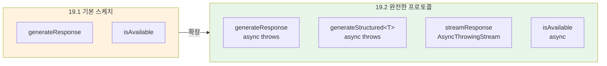
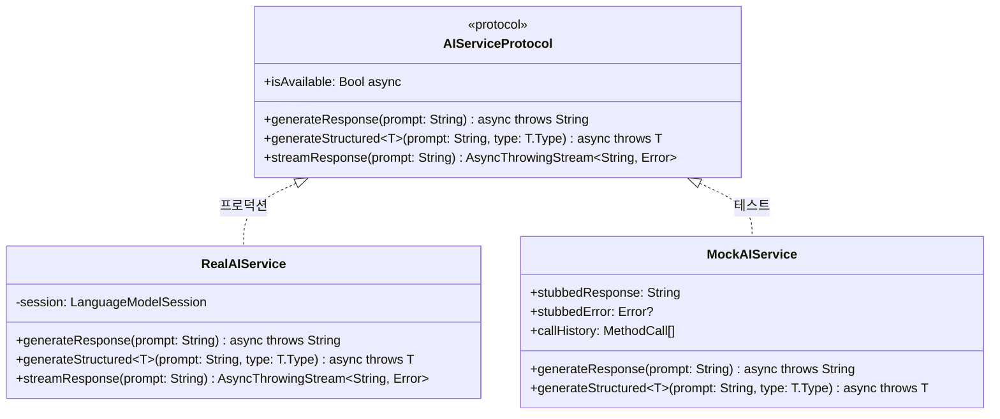
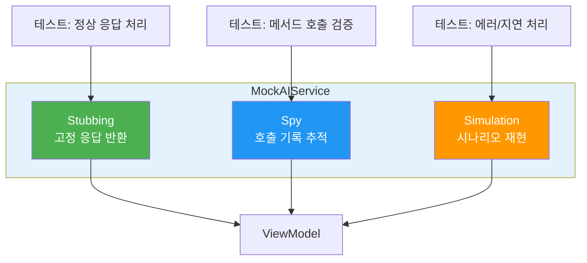
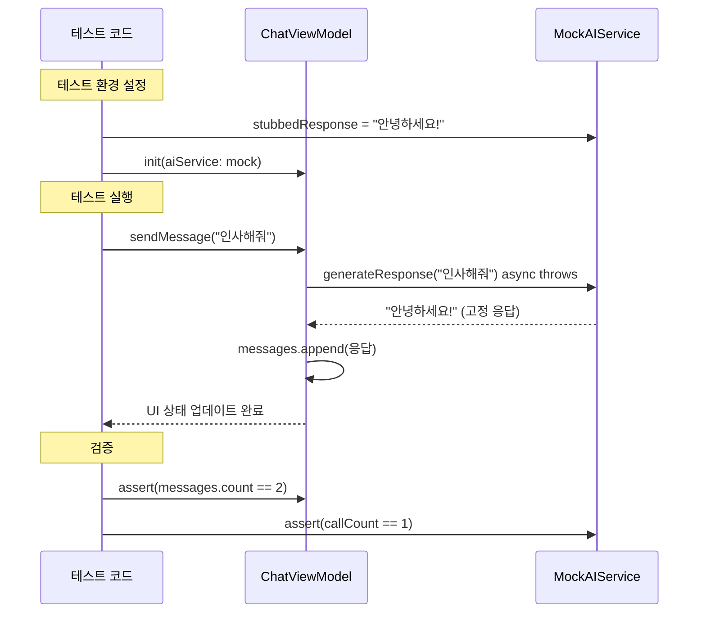
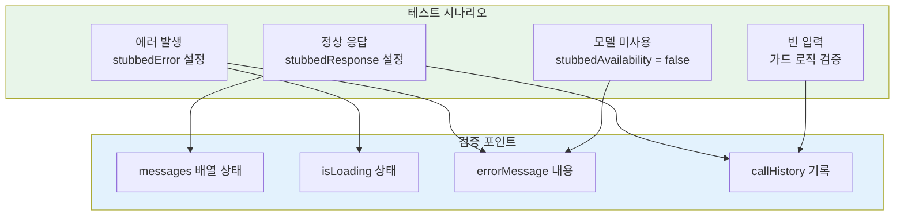
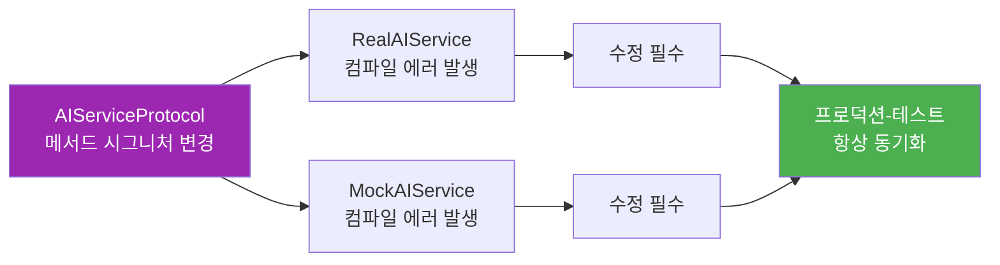

# AI 서비스 모킹과 단위 테스트

> 프로토콜 기반 AI 서비스 추상화로 Foundation Models 호출을 완벽하게 모킹하고, 결정적 단위 테스트를 작성합니다

## 개요

이 섹션에서는 [AI 기능 테스트 전략](19-ch19-테스트와-품질-보증/01-01-ai-기능-테스트-전략.md)에서 설계한 AI 테스트 피라미드의 **1층 — 결정적 로직 테스트**를 본격적으로 구현합니다. 이전 섹션에서 간단히 소개했던 `AIServiceProtocol`의 기본 스케치를 **완전한 프로토콜**로 확장하고, 정교한 Mock 서비스를 만들어 AI 모델 없이도 ViewModel과 비즈니스 로직을 완벽히 테스트하는 방법을 배웁니다.

**선수 지식**: [AI 기능 테스트 전략](19-ch19-테스트와-품질-보증/01-01-ai-기능-테스트-전략.md)에서 배운 `AIServiceProtocol` 기본 스케치(2~3개 메서드)와 테스트 피라미드, [AI 서비스 레이어 구현](10-ch10-실전-프로젝트-ai-채팅봇-앱/03-03-ai-서비스-레이어-구현.md)에서 다룬 서비스 계층 설계 패턴과 `async throws` 호출 규칙

**학습 목표**:
- 이전 섹션의 기본 스케치를 `LanguageModelSession`의 핵심 API를 완벽히 커버하는 프로토콜로 확장할 수 있다
- 고정 응답, 에러 시뮬레이션, 호출 추적이 가능한 정교한 Mock 서비스를 구현할 수 있다
- Mock 서비스를 활용하여 ViewModel의 모든 분기 로직을 단위 테스트할 수 있다
- Swift Testing 프레임워크로 AI 기능의 결정적 테스트를 작성할 수 있다

## 왜 알아야 할까?

이전 섹션에서 우리는 "AI 출력은 비결정적이므로, 결정적 로직과 확률적 출력을 분리해야 한다"는 원칙을 배웠습니다. 그런데 한 가지 현실적인 문제가 있죠 — **Foundation Models의 온디바이스 모델은 시뮬레이터에서 동작하지 않습니다.** 실제 Apple Silicon 기기에서만 추론이 가능하거든요.

이 말은 곧 CI 서버에서 `LanguageModelSession.respond()`를 호출하는 테스트는 실행 자체가 불가능하다는 뜻입니다. PR을 올릴 때마다 물리 디바이스를 연결해서 테스트를 돌릴 수는 없겠죠? 

이 문제의 해법이 바로 **모킹(Mocking)**입니다. AI 서비스를 프로토콜로 감싸고, 테스트 환경에서는 미리 준비된 고정 응답을 반환하는 Mock 객체를 주입합니다. 이렇게 하면 모델이 없어도, 시뮬레이터에서도, CI 서버에서도 앱의 모든 비즈니스 로직을 빠르고 안정적으로 검증할 수 있습니다.

이 접근법은 **프로토콜 기반 모킹 패턴**이라고 불리는데, AI 기능을 포함한 앱의 테스트 커버리지를 80% 이상 유지하면서도 테스트 실행 시간을 수 초 이내로 줄이는 핵심 기법입니다. 특히 Swift의 프로토콜 시스템은 이런 패턴을 언어 수준에서 자연스럽게 지원하기 때문에, 별도의 모킹 라이브러리 없이도 깔끔하게 구현할 수 있죠.

## 핵심 개념

### 개념 1: 기본 스케치에서 완전한 프로토콜로 확장하기

> 💡 **비유**: 전기 콘센트를 생각해보세요. 벽에 있는 콘센트(프로토콜)의 규격만 맞으면, 뒤에 연결된 게 화력발전소든 태양광 패널이든 전자제품은 상관하지 않습니다. AI 서비스 프로토콜도 마찬가지로, ViewModel은 뒤에 실제 모델이 있든 Mock이 있든 동일하게 동작합니다.

이전 섹션에서 `AIServiceProtocol`을 **기본 스케치** 수준으로 소개했습니다 — `generateResponse`와 `isAvailable` 정도의 최소한의 메서드만 보여주면서 "왜 프로토콜이 필요한가?"라는 동기를 설명했죠. 이제 이 스케치를 실전에서 쓸 수 있는 **완전한 프로토콜**로 확장할 차례입니다.

실전에서는 `LanguageModelSession`이 제공하는 **모든 핵심 기능**을 커버해야 합니다. 텍스트 응답, 구조화 출력, 스트리밍, 그리고 가용성 확인까지요. 그리고 Ch10에서 배운 것처럼, AI 서비스 메서드는 네트워크/모델 호출이므로 반드시 **`async throws`**로 선언해야 합니다.

> 📊 **그림 1**: 기본 스케치에서 완전한 프로토콜로의 확장



> 📊 **그림 2**: AI 서비스 프로토콜이 추상화해야 할 LanguageModelSession의 핵심 API



프로토콜 설계 시 핵심 원칙은 **"Foundation Models API의 표면적을 최소화하면서도, 앱에서 사용하는 모든 기능을 커버한다"**는 것입니다:

```swift
import Foundation

// MARK: - 완전한 AI 서비스 프로토콜

/// Foundation Models의 모든 핵심 기능을 추상화하는 프로토콜
/// 19.1의 기본 스케치(generateResponse, isAvailable)를 확장하여
/// 구조화 출력, 스트리밍까지 모든 핵심 API를 커버합니다
protocol AIServiceProtocol: Sendable {
    /// 단순 텍스트 프롬프트에 대한 응답 생성
    /// Ch10에서 배운 것처럼, 모델 호출은 반드시 async throws
    func generateResponse(prompt: String) async throws -> String
    
    /// 구조화 출력 생성 (@Generable 타입)
    func generateStructured<T: Generable & Sendable>(
        prompt: String,
        type: T.Type
    ) async throws -> T
    
    /// 스트리밍 응답 — 토큰 단위로 실시간 수신
    /// 스트림 자체는 동기적으로 반환하되, 내부에서 비동기 처리
    func streamResponse(prompt: String) -> AsyncThrowingStream<String, Error>
    
    /// 모델 가용성 확인 (시스템 상태 조회이므로 async)
    var isAvailable: Bool { get async }
}
```

여기서 주목할 점이 있습니다. 19.1에서 보았던 기본 스케치와 비교하면, `generateStructured`와 `streamResponse`가 추가되었고, 모든 모델 호출 메서드에 **`async throws`**가 명시되어 있습니다. Ch10의 서비스 레이어에서 확립한 규칙 — "AI 서비스 메서드는 항상 실패할 수 있으므로 `async throws`" — 을 그대로 따르는 거죠.

`LanguageModelSession`을 직접 노출하지 않고, **앱이 필요로 하는 기능 단위**로 메서드를 정의했습니다. 이렇게 하면 나중에 Apple이 API를 변경하더라도 프로토콜 구현체(RealAIService)만 수정하면 되고, 앱 코드와 테스트 코드는 영향을 받지 않죠.

> ⚠️ **흔한 오해**: "LanguageModelSession 자체를 Mock하면 되지 않나요?" — `LanguageModelSession`은 `final` 클래스이고 Apple이 제공하는 프레임워크 타입입니다. 서브클래싱이 불가능하고, Apple이 테스트용 프로토콜을 따로 제공하지 않기 때문에, **우리가 직접 프로토콜을 정의**해야 합니다.

### 개념 2: 정교한 Mock 서비스 구현

> 💡 **비유**: 영화 촬영에서 스턴트 배우는 실제 배우와 비슷하게 생겼지만, 미리 정해진 동작만 수행합니다. Mock 서비스도 마찬가지로 실제 AI 서비스처럼 보이지만, 우리가 미리 정해놓은 응답만 반환합니다. 차이점은 — Mock은 **자신이 어떤 동작을 수행했는지 기록까지** 해준다는 것이죠.

좋은 Mock은 단순히 고정 응답을 반환하는 것 이상의 역할을 합니다. 실전에서 유용한 Mock 서비스는 세 가지 능력을 갖춰야 합니다:

1. **Stubbing**: 미리 정의된 응답이나 에러를 반환
2. **Spy**: 어떤 메서드가 몇 번, 어떤 인자로 호출되었는지 기록
3. **Simulation**: 네트워크 지연, 부분 실패 등 현실적 시나리오를 시뮬레이션

> 📊 **그림 3**: Mock 서비스의 세 가지 역할



```swift
import Foundation

// MARK: - 정교한 Mock AI 서비스

/// Stub + Spy + Simulation 기능을 모두 갖춘 테스트용 Mock
/// AIServiceProtocol의 모든 async throws 메서드를 구현합니다
final class MockAIService: AIServiceProtocol, @unchecked Sendable {
    // MARK: - Stubbing: 반환할 응답 설정
    
    /// 텍스트 응답으로 반환할 문자열
    var stubbedResponse: String = "Mock 응답입니다"
    
    /// 구조화 출력 테스트용 — JSON 데이터를 직접 주입
    var stubbedJSONData: Data?
    
    /// 스트리밍 응답으로 반환할 토큰 배열
    var stubbedStreamTokens: [String] = ["Hello", ", ", "World", "!"]
    
    /// throw할 에러 (nil이면 정상 응답)
    var stubbedError: Error?
    
    /// 모델 가용성 상태
    var stubbedAvailability: Bool = true
    
    // MARK: - Spy: 호출 기록 추적
    
    /// 호출된 메서드와 프롬프트를 기록
    private(set) var callHistory: [MethodCall] = []
    
    /// 메서드 호출 기록 타입
    enum MethodCall: Equatable {
        case generateResponse(prompt: String)
        case generateStructured(prompt: String, typeName: String)
        case streamResponse(prompt: String)
        case checkAvailability
    }
    
    // MARK: - Simulation: 지연 시뮬레이션
    
    /// 응답 전 인위적 지연 시간 (초)
    var simulatedDelay: TimeInterval = 0
    
    // MARK: - AIServiceProtocol 구현 (모든 메서드가 async throws)
    
    func generateResponse(prompt: String) async throws -> String {
        // 호출 기록
        callHistory.append(.generateResponse(prompt: prompt))
        // 지연 시뮬레이션
        if simulatedDelay > 0 {
            try await Task.sleep(for: .seconds(simulatedDelay))
        }
        // 에러 시뮬레이션
        if let error = stubbedError { throw error }
        return stubbedResponse
    }
    
    func generateStructured<T: Generable & Sendable>(
        prompt: String,
        type: T.Type
    ) async throws -> T {
        callHistory.append(.generateStructured(
            prompt: prompt,
            typeName: String(describing: T.self)
        ))
        if let error = stubbedError { throw error }
        
        // JSON 데이터가 주입되었으면 디코딩하여 반환
        guard let data = stubbedJSONData else {
            throw MockError.noStubbedData(
                "구조화 출력 테스트에는 stubbedJSONData를 설정하세요"
            )
        }
        return try JSONDecoder().decode(T.self, from: data)
    }
    
    func streamResponse(prompt: String) -> AsyncThrowingStream<String, Error> {
        callHistory.append(.streamResponse(prompt: prompt))
        
        return AsyncThrowingStream { continuation in
            Task {
                for token in stubbedStreamTokens {
                    if simulatedDelay > 0 {
                        try? await Task.sleep(for: .seconds(simulatedDelay))
                    }
                    continuation.yield(token)
                }
                if let error = stubbedError {
                    continuation.finish(throwing: error)
                } else {
                    continuation.finish()
                }
            }
        }
    }
    
    var isAvailable: Bool {
        get async {
            callHistory.append(.checkAvailability)
            return stubbedAvailability
        }
    }
    
    // MARK: - Spy 헬퍼 메서드
    
    /// 특정 메서드가 호출된 횟수
    func callCount(for method: String) -> Int {
        callHistory.filter { call in
            switch call {
            case .generateResponse: return method == "generateResponse"
            case .generateStructured: return method == "generateStructured"
            case .streamResponse: return method == "streamResponse"
            case .checkAvailability: return method == "checkAvailability"
            }
        }.count
    }
    
    /// 호출 기록 초기화
    func reset() {
        callHistory.removeAll()
        stubbedError = nil
        stubbedResponse = "Mock 응답입니다"
    }
}

// MARK: - Mock 전용 에러 타입
enum MockError: Error, LocalizedError {
    case noStubbedData(String)
    case simulatedNetworkError
    case simulatedTimeout
    case modelUnavailable
    
    var errorDescription: String? {
        switch self {
        case .noStubbedData(let msg): return msg
        case .simulatedNetworkError: return "네트워크 연결 오류 (시뮬레이션)"
        case .simulatedTimeout: return "요청 시간 초과 (시뮬레이션)"
        case .modelUnavailable: return "AI 모델을 사용할 수 없습니다"
        }
    }
}
```

이 Mock 서비스의 강점은 **테스트별로 행동을 자유롭게 조절**할 수 있다는 점입니다. 정상 응답, 에러, 지연을 조합해서 온갖 시나리오를 재현할 수 있죠.

### 개념 3: Dependency Injection으로 ViewModel 테스트하기

> 💡 **비유**: 자동차 공장에서 신차 성능을 테스트할 때, 실제 도로 대신 롤러(dynamometer) 위에서 돌리듯이, ViewModel도 실제 AI 모델 대신 Mock 서비스 위에서 모든 동작을 검증합니다. 핵심은 자동차(ViewModel)가 **아래에 뭐가 있는지 모르게** 만드는 것이죠.

프로토콜 기반 추상화의 진가는 **의존성 주입(Dependency Injection)**과 결합했을 때 드러납니다. ViewModel이 `AIServiceProtocol`만 알게 하면, 프로덕션에서는 `RealAIService`를, 테스트에서는 `MockAIService`를 주입할 수 있습니다.

> 📊 **그림 4**: 의존성 주입을 통한 프로덕션/테스트 분리



```swift
import SwiftUI

// MARK: - 테스트 가능한 ChatViewModel

/// AI 서비스를 프로토콜로 주입받아 테스트가 용이한 ViewModel
@Observable
final class ChatViewModel {
    // MARK: - 상태
    var messages: [ChatMessage] = []
    var isLoading: Bool = false
    var errorMessage: String?
    var isModelAvailable: Bool = true
    
    // MARK: - 의존성
    private let aiService: AIServiceProtocol
    
    /// 프로토콜 타입으로 주입받아 테스트와 프로덕션 모두 대응
    init(aiService: AIServiceProtocol) {
        self.aiService = aiService
    }
    
    // MARK: - 메시지 전송
    
    /// 사용자 메시지를 보내고 AI 응답을 받는 메인 로직
    func sendMessage(_ text: String) async {
        // 빈 문자열 가드
        guard !text.trimmingCharacters(in: .whitespacesAndNewlines).isEmpty else {
            return
        }
        
        // 모델 가용성 확인
        guard await aiService.isAvailable else {
            errorMessage = "AI 모델을 사용할 수 없습니다. 설정에서 Apple Intelligence를 활성화해주세요."
            isModelAvailable = false
            return
        }
        
        // 사용자 메시지 추가
        let userMessage = ChatMessage(role: .user, content: text)
        messages.append(userMessage)
        isLoading = true
        errorMessage = nil
        
        do {
            // AI 응답 생성 — async throws 호출
            let response = try await aiService.generateResponse(prompt: text)
            let aiMessage = ChatMessage(role: .assistant, content: response)
            messages.append(aiMessage)
        } catch {
            // 에러 처리 — 사용자에게 의미 있는 메시지 표시
            errorMessage = "응답 생성에 실패했습니다: \(error.localizedDescription)"
            // 실패한 메시지를 히스토리에서 제거하지 않음 (재시도 가능하게)
        }
        
        isLoading = false
    }
    
    /// 대화 초기화
    func clearConversation() {
        messages.removeAll()
        errorMessage = nil
    }
}

// MARK: - 채팅 메시지 모델

struct ChatMessage: Identifiable, Equatable {
    let id = UUID()
    let role: Role
    let content: String
    let timestamp: Date = Date()
    
    enum Role {
        case user
        case assistant
    }
}
```

### 개념 4: Swift Testing으로 단위 테스트 작성

> 💡 **비유**: 요리 레시피를 검증할 때, "재료를 넣었을 때 예상한 맛이 나오는가?"를 확인하듯이, 단위 테스트는 "특정 입력을 넣었을 때 ViewModel이 예상한 상태가 되는가?"를 하나하나 확인하는 과정입니다.

이제 위에서 만든 `MockAIService`와 `ChatViewModel`을 조합하여 모든 분기 로직을 테스트합니다. Apple이 WWDC24에서 발표한 **Swift Testing** 프레임워크를 사용하면, `@Test` 매크로와 `#expect` 매크로로 더 직관적인 테스트 코드를 작성할 수 있습니다.

> 📊 **그림 5**: 테스트 시나리오별 Mock 설정과 검증 포인트



```swift
import Testing
import Foundation

// MARK: - ChatViewModel 단위 테스트

@Suite("ChatViewModel 테스트")
struct ChatViewModelTests {
    // 각 테스트마다 새로운 Mock과 ViewModel 생성
    let mockService = MockAIService()
    
    // MARK: - 정상 응답 테스트
    
    @Test("사용자 메시지 전송 시 AI 응답이 추가된다")
    func sendMessageAddsResponse() async {
        // Given: Mock이 정해진 응답을 반환하도록 설정
        mockService.stubbedResponse = "안녕하세요! 무엇을 도와드릴까요?"
        let viewModel = ChatViewModel(aiService: mockService)
        
        // When: 메시지 전송
        await viewModel.sendMessage("안녕")
        
        // Then: 사용자 메시지 + AI 응답 = 2개
        #expect(viewModel.messages.count == 2)
        #expect(viewModel.messages[0].role == .user)
        #expect(viewModel.messages[0].content == "안녕")
        #expect(viewModel.messages[1].role == .assistant)
        #expect(viewModel.messages[1].content == "안녕하세요! 무엇을 도와드릴까요?")
    }
    
    @Test("메시지 전송 후 로딩 상태가 해제된다")
    func sendMessageResetsLoading() async {
        mockService.stubbedResponse = "응답"
        let viewModel = ChatViewModel(aiService: mockService)
        
        await viewModel.sendMessage("테스트")
        
        // 비동기 작업 완료 후 isLoading은 false
        #expect(viewModel.isLoading == false)
    }
    
    // MARK: - 에러 처리 테스트
    
    @Test("AI 서비스 에러 시 errorMessage가 설정된다")
    func errorSetsErrorMessage() async {
        // Given: Mock이 에러를 throw하도록 설정
        mockService.stubbedError = MockError.simulatedNetworkError
        let viewModel = ChatViewModel(aiService: mockService)
        
        // When: 메시지 전송
        await viewModel.sendMessage("테스트")
        
        // Then: 에러 메시지가 표시되고, 로딩은 해제
        #expect(viewModel.errorMessage != nil)
        #expect(viewModel.errorMessage!.contains("실패"))
        #expect(viewModel.isLoading == false)
        // 사용자 메시지는 남아있지만 AI 응답은 없음
        #expect(viewModel.messages.count == 1)
    }
    
    // MARK: - 모델 가용성 테스트
    
    @Test("모델이 사용 불가능하면 메시지를 보내지 않는다")
    func unavailableModelPreventsMessage() async {
        // Given: 모델 사용 불가 상태
        mockService.stubbedAvailability = false
        let viewModel = ChatViewModel(aiService: mockService)
        
        // When: 메시지 전송 시도
        await viewModel.sendMessage("안녕")
        
        // Then: 메시지가 추가되지 않고, 에러 표시
        #expect(viewModel.messages.isEmpty)
        #expect(viewModel.isModelAvailable == false)
        #expect(viewModel.errorMessage?.contains("Apple Intelligence") == true)
        // AI 서비스의 generateResponse는 호출되지 않음
        #expect(mockService.callCount(for: "generateResponse") == 0)
    }
    
    // MARK: - 가드 로직 테스트
    
    @Test("빈 문자열은 무시된다")
    func emptyStringIsIgnored() async {
        let viewModel = ChatViewModel(aiService: mockService)
        
        await viewModel.sendMessage("")
        await viewModel.sendMessage("   ")
        await viewModel.sendMessage("\n\t")
        
        // 아무것도 추가되지 않음
        #expect(viewModel.messages.isEmpty)
        // AI 서비스가 전혀 호출되지 않음
        #expect(mockService.callHistory.isEmpty)
    }
    
    // MARK: - 대화 초기화 테스트
    
    @Test("clearConversation이 모든 상태를 리셋한다")
    func clearConversationResetsState() async {
        mockService.stubbedResponse = "응답"
        let viewModel = ChatViewModel(aiService: mockService)
        
        await viewModel.sendMessage("첫 번째")
        await viewModel.sendMessage("두 번째")
        
        // 대화 초기화
        viewModel.clearConversation()
        
        #expect(viewModel.messages.isEmpty)
        #expect(viewModel.errorMessage == nil)
    }
    
    // MARK: - Spy를 활용한 호출 검증
    
    @Test("연속 메시지가 순서대로 AI 서비스를 호출한다")
    func sequentialCallsAreTracked() async {
        mockService.stubbedResponse = "응답"
        let viewModel = ChatViewModel(aiService: mockService)
        
        await viewModel.sendMessage("첫 번째 질문")
        await viewModel.sendMessage("두 번째 질문")
        
        // Spy로 호출 이력 검증
        let responseCalls = mockService.callHistory.filter {
            if case .generateResponse = $0 { return true }
            return false
        }
        #expect(responseCalls.count == 2)
        
        // 호출 순서 검증
        if case .generateResponse(let prompt) = responseCalls[0] {
            #expect(prompt == "첫 번째 질문")
        }
        if case .generateResponse(let prompt) = responseCalls[1] {
            #expect(prompt == "두 번째 질문")
        }
    }
}
```

```run:swift
// Mock 서비스의 Spy 기능 시연
let mock = MockAIService()
mock.stubbedResponse = "테스트 응답"

let vm = ChatViewModel(aiService: mock)
await vm.sendMessage("안녕하세요")
await vm.sendMessage("날씨 알려줘")

print("총 메시지 수: \(vm.messages.count)")
print("AI 호출 횟수: \(mock.callCount(for: "generateResponse"))")
print("가용성 확인 횟수: \(mock.callCount(for: "checkAvailability"))")
print("에러 메시지: \(vm.errorMessage ?? "없음")")
```

```output
총 메시지 수: 4
AI 호출 횟수: 2
가용성 확인 횟수: 2
에러 메시지: 없음
```

### 개념 5: 프로덕션 구현과 테스트의 대칭성

> 💡 **비유**: 건축에서 설계 도면(프로토콜)이 하나이면, 실제 건물(프로덕션)과 모형(Mock)이 정확히 같은 구조를 갖게 됩니다. 도면이 바뀌면 양쪽 다 자동으로 컴파일 에러가 나니까, "테스트는 통과했는데 실제로는 안 되는" 상황을 방지할 수 있죠.

프로토콜 기반 접근의 강력한 장점은 **컴파일 타임 안전성**입니다. `RealAIService`와 `MockAIService`가 같은 프로토콜을 구현하므로, API가 변경되면 양쪽 모두 컴파일 에러가 발생합니다.

> 📊 **그림 6**: 프로토콜 변경 시 컴파일 타임 안전성 보장



```swift
import FoundationModels

// MARK: - 프로덕션 AI 서비스 구현

/// 실제 Foundation Models을 호출하는 프로덕션 서비스
/// 모든 메서드가 AIServiceProtocol의 async throws 시그니처를 준수합니다
struct RealAIService: AIServiceProtocol {
    private let session: LanguageModelSession
    
    init(instructions: String = "") {
        if instructions.isEmpty {
            self.session = LanguageModelSession()
        } else {
            self.session = LanguageModelSession(
                instructions: Instructions(instructions)
            )
        }
    }
    
    func generateResponse(prompt: String) async throws -> String {
        let response = try await session.respond(to: Prompt(prompt))
        return response.content
    }
    
    func generateStructured<T: Generable & Sendable>(
        prompt: String,
        type: T.Type
    ) async throws -> T {
        let response = try await session.respond(
            to: Prompt(prompt),
            generating: T.self
        )
        return response.content
    }
    
    func streamResponse(prompt: String) -> AsyncThrowingStream<String, Error> {
        AsyncThrowingStream { continuation in
            Task {
                do {
                    let stream = session.streamResponse(to: Prompt(prompt))
                    for try await partial in stream {
                        continuation.yield(partial.content)
                    }
                    continuation.finish()
                } catch {
                    continuation.finish(throwing: error)
                }
            }
        }
    }
    
    var isAvailable: Bool {
        get async {
            SystemLanguageModel.default.isAvailable
        }
    }
}
```

프로덕션과 테스트 코드에서 `AIServiceProtocol`을 사용하는 방법이 대칭적입니다:

```swift
// 프로덕션 코드 (앱 진입점)
let chatVM = ChatViewModel(
    aiService: RealAIService(instructions: "당신은 친절한 어시스턴트입니다")
)

// 테스트 코드
let mockService = MockAIService()
mockService.stubbedResponse = "테스트 응답"
let testVM = ChatViewModel(aiService: mockService)
```

## 실습: 직접 해보기

실전에서 자주 마주치는 시나리오를 모두 커버하는 종합 테스트 스위트를 작성해봅시다. 스트리밍 응답 처리, 구조화 출력 검증, 그리고 에러 복구 로직까지 테스트합니다.

```swift
import Testing
import Foundation

// MARK: - 실습 1: 스트리밍 ViewModel 테스트

/// 스트리밍 응답을 처리하는 ViewModel
@Observable
final class StreamingChatViewModel {
    var currentResponse: String = ""
    var isStreaming: Bool = false
    var messages: [ChatMessage] = []
    
    private let aiService: AIServiceProtocol
    
    init(aiService: AIServiceProtocol) {
        self.aiService = aiService
    }
    
    /// 스트리밍 방식으로 AI 응답을 받아 실시간 표시
    func sendMessageStreaming(_ text: String) async {
        guard !text.isEmpty else { return }
        
        messages.append(ChatMessage(role: .user, content: text))
        isStreaming = true
        currentResponse = ""
        
        do {
            let stream = aiService.streamResponse(prompt: text)
            for try await token in stream {
                // 토큰이 도착할 때마다 누적 표시
                currentResponse += token
            }
            // 스트리밍 완료 — 최종 응답을 메시지에 추가
            messages.append(ChatMessage(
                role: .assistant,
                content: currentResponse
            ))
        } catch {
            messages.append(ChatMessage(
                role: .assistant,
                content: "오류가 발생했습니다: \(error.localizedDescription)"
            ))
        }
        
        isStreaming = false
        currentResponse = ""
    }
}

// MARK: - 스트리밍 테스트

@Suite("스트리밍 ChatViewModel 테스트")
struct StreamingViewModelTests {
    
    @Test("스트리밍 응답이 토큰별로 누적된다")
    func streamingAccumulatesTokens() async {
        let mock = MockAIService()
        mock.stubbedStreamTokens = ["오늘", " ", "날씨가", " ", "좋습니다"]
        let vm = StreamingChatViewModel(aiService: mock)
        
        await vm.sendMessageStreaming("날씨 알려줘")
        
        // 스트리밍 완료 후 전체 응답이 메시지에 추가
        #expect(vm.messages.count == 2)
        #expect(vm.messages[1].content == "오늘 날씨가 좋습니다")
        #expect(vm.isStreaming == false)
    }
    
    @Test("스트리밍 중 에러 발생 시 에러 메시지가 표시된다")
    func streamingErrorShowsMessage() async {
        let mock = MockAIService()
        mock.stubbedStreamTokens = ["부분", " ", "응답"]
        mock.stubbedError = MockError.simulatedTimeout  // 토큰 후 에러
        let vm = StreamingChatViewModel(aiService: mock)
        
        await vm.sendMessageStreaming("테스트")
        
        // 에러가 메시지로 표시
        #expect(vm.messages.last?.content.contains("오류") == true)
        #expect(vm.isStreaming == false)
    }
}

// MARK: - 실습 2: 구조화 출력을 사용하는 ViewModel 테스트

/// 영화 추천 결과 (구조화 출력)
@Generable
struct MovieRecommendation: Codable, Sendable {
    @Guide(description: "영화 제목")
    var title: String
    
    @Guide(description: "추천 이유", maxCount: 100)
    var reason: String
    
    @Guide(description: "평점 (1-10)")
    var rating: Int
}

/// 구조화 출력을 사용하는 영화 추천 ViewModel
@Observable
final class MovieRecommenderViewModel {
    var recommendation: MovieRecommendation?
    var isLoading: Bool = false
    var error: String?
    
    private let aiService: AIServiceProtocol
    
    init(aiService: AIServiceProtocol) {
        self.aiService = aiService
    }
    
    func getRecommendation(genre: String) async {
        isLoading = true
        error = nil
        
        do {
            recommendation = try await aiService.generateStructured(
                prompt: "\(genre) 장르 영화 하나를 추천해주세요",
                type: MovieRecommendation.self
            )
        } catch {
            self.error = error.localizedDescription
        }
        
        isLoading = false
    }
}

@Suite("영화 추천 ViewModel 테스트")
struct MovieRecommenderTests {
    
    @Test("구조화 출력이 올바르게 ViewModel에 반영된다")
    func structuredOutputMapsToViewModel() async throws {
        // Given: Mock에 JSON 데이터 주입
        let mock = MockAIService()
        let movieJSON = """
        {
            "title": "인셉션",
            "reason": "꿈 속의 꿈이라는 독창적 컨셉",
            "rating": 9
        }
        """.data(using: .utf8)!
        mock.stubbedJSONData = movieJSON
        
        let vm = MovieRecommenderViewModel(aiService: mock)
        
        // When: 추천 요청
        await vm.getRecommendation(genre: "SF")
        
        // Then: 구조화 데이터가 정확히 반영
        #expect(vm.recommendation?.title == "인셉션")
        #expect(vm.recommendation?.rating == 9)
        #expect(vm.isLoading == false)
        
        // Spy: 올바른 프롬프트로 호출되었는지 확인
        if case .generateStructured(let prompt, let typeName) = mock.callHistory.last {
            #expect(prompt.contains("SF"))
            #expect(typeName == "MovieRecommendation")
        }
    }
    
    @Test("구조화 출력 실패 시 에러가 표시된다")
    func structuredOutputFailureShowsError() async {
        let mock = MockAIService()
        mock.stubbedError = MockError.simulatedNetworkError
        let vm = MovieRecommenderViewModel(aiService: mock)
        
        await vm.getRecommendation(genre: "액션")
        
        #expect(vm.recommendation == nil)
        #expect(vm.error != nil)
        #expect(vm.isLoading == false)
    }
}

// MARK: - 실습 3: 에러 복구 패턴 테스트

/// 재시도 로직이 포함된 AI 서비스 래퍼
struct RetryingAIService: AIServiceProtocol {
    private let wrapped: AIServiceProtocol
    let maxRetries: Int
    
    init(wrapping service: AIServiceProtocol, maxRetries: Int = 3) {
        self.wrapped = service
        self.maxRetries = maxRetries
    }
    
    func generateResponse(prompt: String) async throws -> String {
        var lastError: Error?
        for attempt in 1...maxRetries {
            do {
                return try await wrapped.generateResponse(prompt: prompt)
            } catch {
                lastError = error
                // 마지막 시도가 아니면 잠시 대기
                if attempt < maxRetries {
                    try? await Task.sleep(for: .milliseconds(100 * attempt))
                }
            }
        }
        throw lastError!
    }
    
    // 나머지 프로토콜 메서드는 래핑된 서비스로 위임
    func generateStructured<T: Generable & Sendable>(
        prompt: String, type: T.Type
    ) async throws -> T {
        try await wrapped.generateStructured(prompt: prompt, type: type)
    }
    
    func streamResponse(prompt: String) -> AsyncThrowingStream<String, Error> {
        wrapped.streamResponse(prompt: prompt)
    }
    
    var isAvailable: Bool {
        get async { await wrapped.isAvailable }
    }
}

@Suite("RetryingAIService 테스트")
struct RetryTests {
    
    @Test("3회 모두 실패하면 최종 에러를 throw한다")
    func allRetriesFailThrowsFinalError() async {
        let mock = MockAIService()
        mock.stubbedError = MockError.simulatedNetworkError
        let retrying = RetryingAIService(wrapping: mock, maxRetries: 3)
        
        do {
            _ = try await retrying.generateResponse(prompt: "테스트")
            Issue.record("에러가 발생해야 합니다")
        } catch {
            // 3회 시도 확인
            #expect(mock.callCount(for: "generateResponse") == 3)
        }
    }
}
```

```run:swift
// 재시도 서비스 동작 확인
let mock = MockAIService()
mock.stubbedError = MockError.simulatedNetworkError

let retrying = RetryingAIService(wrapping: mock, maxRetries: 3)

do {
    _ = try await retrying.generateResponse(prompt: "테스트")
} catch {
    print("최종 에러: \(error.localizedDescription)")
    print("총 시도 횟수: \(mock.callCount(for: "generateResponse"))")
}
```

```output
최종 에러: 네트워크 연결 오류 (시뮬레이션)
총 시도 횟수: 3
```

## 더 깊이 알아보기

### 모킹의 역사: Gerard Meszaros와 xUnit 테스트 패턴

모킹이라는 개념은 하루아침에 등장한 게 아닙니다. 2007년 Gerard Meszaros가 쓴 **"xUnit Test Patterns"**라는 책에서 테스트 더블(Test Double)이라는 개념을 체계화했는데, 이 용어는 영화에서 배우의 대역(Stunt Double)에서 빌려온 것입니다.

Meszaros는 테스트 더블을 다섯 가지로 분류했습니다:
- **Dummy**: 매개변수를 채우기 위해 전달되지만 실제로 사용되지 않는 객체
- **Stub**: 미리 준비된 답변을 반환하는 객체
- **Spy**: Stub이면서 호출 정보를 기록하는 객체
- **Mock**: 기대하는 호출을 사전에 정의하고, 기대와 다르면 실패하는 객체
- **Fake**: 실제와 유사하게 동작하지만 프로덕션에는 적합하지 않은 간소화된 구현

우리가 이 섹션에서 만든 `MockAIService`는 실제로는 **Stub + Spy** 패턴에 가깝습니다. "Mock"이라는 이름이 관례적으로 가장 많이 쓰이지만, 엄밀히 말하면 Meszaros의 정의와는 차이가 있죠.

흥미로운 점은 Swift 커뮤니티에서는 이런 학술적 구분보다 **프로토콜 기반 추상화**라는 실용적 접근이 더 주류가 되었다는 것입니다. John Sundell은 2018년 자신의 블로그에서 "Mocking in Swift"라는 글을 통해, Swift의 프로토콜 시스템이 Objective-C 시대의 복잡한 모킹 라이브러리(OCMock 등)를 대체할 수 있음을 보여주며 Swift 테스트 문화에 큰 영향을 미쳤습니다.

### AnyLanguageModel — 커뮤니티의 해법

Apple이 Foundation Models 프레임워크에 테스트용 프로토콜을 공식 제공하지 않자, 커뮤니티에서 자체적인 해결책이 등장했습니다. Mattt Thompson(NSHipster 창시자)이 만든 **AnyLanguageModel** 패키지는 Foundation Models의 API와 호환되는 드롭인 대체(drop-in replacement)를 제공합니다. `import FoundationModels`를 `import AnyLanguageModel`로 바꾸는 것만으로 OpenAI, Anthropic, 로컬 모델 등 다양한 백엔드를 연결할 수 있어, 테스트 환경을 구성하기가 훨씬 쉬워집니다.

## 흔한 오해와 팁

> ⚠️ **흔한 오해**: "Mock을 많이 쓰면 테스트가 실제 동작을 보장하지 않는다." — 맞는 말이지만, 이것은 Mock 테스트와 통합 테스트를 **함께** 써야 하는 이유이지, Mock을 쓰지 말아야 하는 이유가 아닙니다. AI 테스트 피라미드의 1층(Mock 기반 결정적 테스트)이 넓어야 2층(실제 모델 품질 테스트)과 3층(E2E)을 적은 수로도 효과적으로 커버할 수 있습니다.

> 💡 **알고 계셨나요?**: Swift Testing의 `@Test` 매크로는 XCTest의 `func test...()` 네이밍 규칙을 대체합니다. 더 나은 점은 **문자열 설명**을 함께 쓸 수 있어서, 테스트 실패 시 "무엇을 테스트하려 했는지"가 바로 보인다는 것입니다. `@Suite`로 테스트를 논리적으로 그룹화할 수도 있죠.

> 🔥 **실무 팁**: `MockAIService`에 `simulatedDelay`를 설정하면 스트리밍 UI의 **로딩 인디케이터** 동작을 시각적으로 확인할 수 있습니다. Xcode Previews에서 Mock 서비스를 주입하면 디자이너와 협업할 때도 실제 모델 없이 UI를 검토할 수 있어 개발 워크플로가 크게 개선됩니다.

## 핵심 정리

| 개념 | 설명 |
|------|------|
| **AIServiceProtocol** | Foundation Models의 핵심 API(텍스트/구조화/스트리밍)를 `async throws`로 추상화하는 프로토콜. 19.1의 기본 스케치를 완전한 형태로 확장 |
| **MockAIService** | Stub(고정 응답) + Spy(호출 추적) + Simulation(에러/지연)을 갖춘 테스트용 구현체 |
| **Dependency Injection** | ViewModel이 프로토콜 타입으로 서비스를 주입받아, 프로덕션과 테스트 환경을 자유롭게 전환 |
| **Swift Testing** | `@Test`, `#expect`, `@Suite` 매크로로 직관적인 테스트 코드 작성. XCTest보다 현대적 |
| **컴파일 타임 안전성** | 프로토콜 변경 시 Real/Mock 모두 컴파일 에러 → 테스트와 프로덕션이 항상 동기화 |
| **RetryingAIService** | 데코레이터 패턴으로 재시도 로직을 래핑. Mock으로 재시도 횟수까지 검증 가능 |
| **테스트 더블 분류** | Dummy, Stub, Spy, Mock, Fake — Gerard Meszaros의 xUnit Test Patterns 분류 체계 |

## 다음 섹션 미리보기

이번 섹션에서 텍스트 응답과 스트리밍의 Mock 테스트를 완성했으니, 다음 [구조화 출력과 Tool Calling 테스트](19-ch19-테스트와-품질-보증/03-03-구조화-출력과-tool-calling-테스트.md)에서는 한 단계 더 나아갑니다. `@Generable` 구조체의 **스키마 검증**, Tool 프로토콜의 **입출력 계약 테스트**, 그리고 Tool이 포함된 세션의 **엔드투엔드 흐름**을 Mock 기반으로 완벽히 테스트하는 방법을 다룹니다. 특히 Tool의 `call()` 메서드가 올바른 인자를 받고 예상한 결과를 반환하는지 검증하는 패턴은 실전 앱에서 매우 유용합니다.

## 참고 자료

- [Foundation Models — Apple Developer Documentation](https://developer.apple.com/documentation/FoundationModels) - Foundation Models 프레임워크의 공식 API 문서. `LanguageModelSession`, `SystemLanguageModel` 등 핵심 클래스 참조
- [Mocking in Swift — Swift by Sundell](https://www.swiftbysundell.com/articles/mocking-in-swift/) - Swift에서 프로토콜 기반 모킹의 베스트 프랙티스. 의존성 주입 패턴의 실전 예제
- [An Introduction to Apple's Foundation Model Framework — Superwall](https://superwall.com/blog/an-introduction-to-apples-foundation-model-framework/) - Foundation Models의 핵심 API 사용법과 실전 예제를 정리한 튜토리얼
- [AnyLanguageModel — GitHub (mattt)](https://github.com/mattt/AnyLanguageModel) - Foundation Models API 호환 드롭인 대체 패키지. 다양한 백엔드 지원으로 테스트 환경 구성에 유용
- [Unit Testing in Swift: XCTest vs. Swift Testing](https://medium.com/@nourhenekrichene_66918/unit-testing-in-swift-xctest-vs-swift-testing-241fb92abe39) - XCTest와 Swift Testing 프레임워크의 비교 분석. `@Test`, `#expect` 매크로 활용법

---
### 🔗 Related Sessions
- [aiserviceprotocol](10-ch10-실전-프로젝트-ai-채팅봇-앱/01-01-채팅봇-앱-아키텍처-설계.md) (prerequisite)
- [@generable](05-ch5-generable-구조화-출력/01-01-guided-generation-개념과-동작-원리.md) (prerequisite)
- [ai 테스트 피라미드](19-ch19-테스트와-품질-보증/01-01-ai-기능-테스트-전략.md) (prerequisite)
- [결정적 검증](19-ch19-테스트와-품질-보증/01-01-ai-기능-테스트-전략.md) (prerequisite)
- [확률적 검증](19-ch19-테스트와-품질-보증/01-01-ai-기능-테스트-전략.md) (prerequisite)
