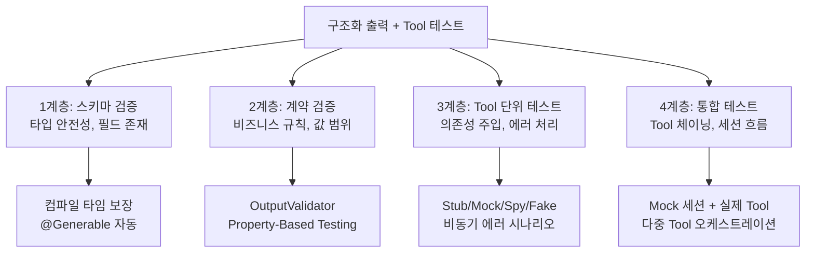
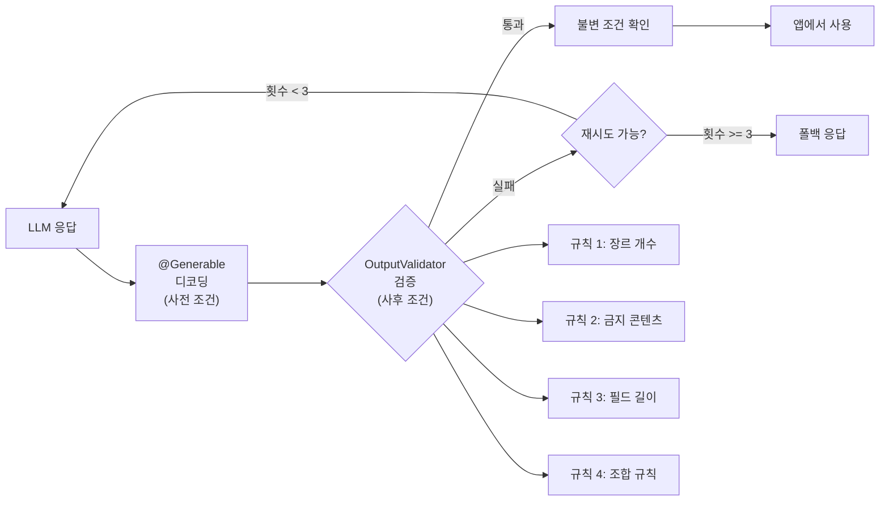
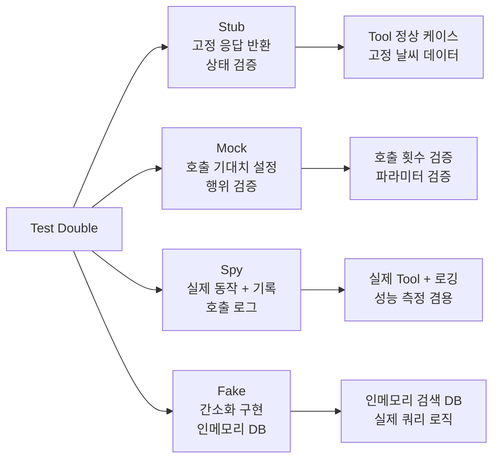
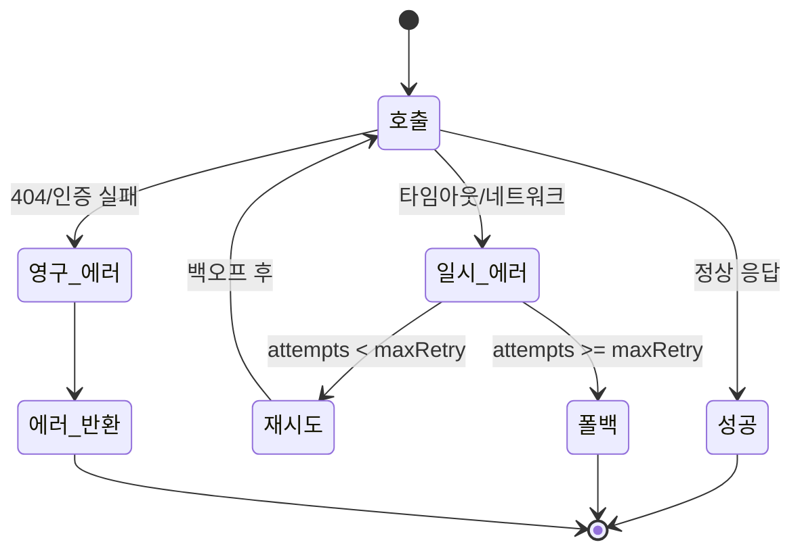
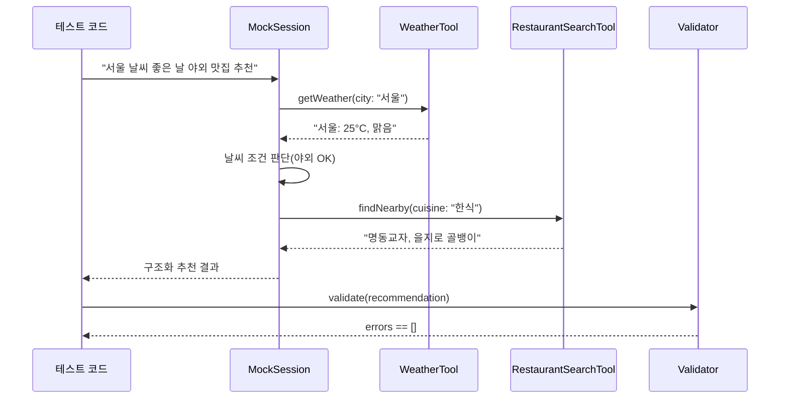
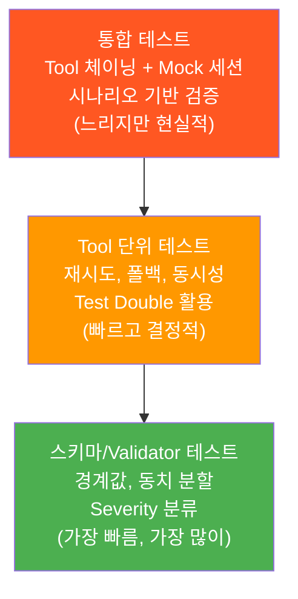

# 구조화 출력과 Tool Calling 테스트

> @Generable 스키마 검증부터 Tool 단위 테스트, Property-Based Testing, Mock 세션 통합 테스트까지 — 구조화 출력의 신뢰성을 보장하는 고급 테스트 전략

## 개요

이 섹션에서는 Apple Foundation Models의 구조화 출력(@Generable)과 Tool Calling 기능을 체계적으로 테스트하는 방법을 다룹니다. 단순한 단위 테스트를 넘어, 비결정적 AI 출력에 대한 **계약 기반 검증**, **Property-Based Testing**, **비동기 Tool 체이닝 검증**까지 다루는 실전 테스트 전략을 배웁니다.

**선수 지식**: [AI 기능 테스트 전략](19-ch19-테스트와-품질-보증/01-01-ai-기능-테스트-전략.md)에서 배운 XCTest 패턴과 AI 테스트의 기본 원칙, [AI 서비스 모킹과 단위 테스트](19-ch19-테스트와-품질-보증/02-02-ai-서비스-모킹과-단위-테스트.md)에서 다룬 Mock/Protocol 기반 테스트 설계
**학습 목표**:
- @Generable 구조체의 스키마 유효성과 비즈니스 규칙을 **계층별로 분리**하여 검증할 수 있다
- Tool의 정상/에러/엣지 케이스를 의존성 주입으로 결정적(deterministic)으로 테스트하고, **Property-Based Testing**으로 예상치 못한 입력까지 커버할 수 있다
- Mock 세션을 활용한 **다중 Tool 체이닝** 엔드투엔드 통합 테스트를 작성할 수 있다
- **Test Double 분류**(Stub, Mock, Spy, Fake)를 상황에 맞게 선택하여 적용할 수 있다

## 왜 알아야 할까?

LLM이 JSON을 생성하고 외부 도구를 호출하는 시대, "AI가 만든 출력이 정말 우리 앱의 규칙을 지키는가?"는 더 이상 선택이 아닌 필수 질문이 되었습니다. @Generable이 컴파일 타임에 타입 안전성을 보장해주지만, "장르가 5개 이하여야 한다"거나 "어린이 앱에서 폭력 장르를 제외해야 한다" 같은 비즈니스 규칙은 런타임에서 별도로 검증해야 합니다.

Tool Calling은 더 복잡합니다. 단일 Tool 호출이 아니라 **여러 Tool이 체이닝**되는 시나리오에서는 각 단계의 출력이 다음 단계의 입력으로 올바르게 전달되는지, 중간에 실패하면 전체 파이프라인이 어떻게 복구되는지까지 검증해야 합니다. 날씨 API가 실패한 뒤 폴백으로 캐시된 데이터를 쓸 때, 검색 결과가 빈 배열일 때 Tool이 graceful하게 처리하는지, 연락처 선택기에서 동시에 같은 사람을 선택하는 race condition은 없는지 — 이런 엣지 케이스를 프로덕션에서 발견하는 건 사용자에게 깨진 경험을 제공하는 것과 같습니다.

> 📊 **그림 1**: 구조화 출력 테스트의 4계층 전략



## 핵심 개념

### 개념 1: @Generable 스키마 검증 — 컴파일 타임 vs 런타임의 간극

> 💡 **비유**: @Generable은 택배 상자의 "규격"을 정하는 것과 같습니다. 상자 크기(타입)는 공장에서 정해지지만, 안에 뭘 넣을지(비즈니스 규칙)는 포장 담당자가 확인해야 하죠. 그런데 LLM이라는 포장 담당자는 가끔 엉뚱한 물건을 넣기도 합니다.

Apple Foundation Models의 `@Generable` 매크로는 Swift 타입 시스템을 활용하여 컴파일 타임에 구조를 보장합니다. 하지만 값의 의미론적 유효성은 별도 테스트가 필요합니다. 특히 `@Guide`의 `range`나 `description`은 모델에 대한 **힌트**일 뿐, 강제 제약이 아니라는 점이 핵심입니다.

```swift
import FoundationModels

// @Generable 구조체 정의
@Generable
struct MovieRecommendation {
    @Guide(description: "영화 제목")
    var title: String
    
    @Guide(description: "1-5 사이의 평점", range: 1...5)
    var rating: Int
    
    @Guide(description: "장르 목록, 최대 3개")
    var genres: [String]
    
    @Guide(description: "한 줄 추천 이유")
    var reason: String
}
```

스키마 자체는 컴파일러가 검증하지만, "장르가 정말 3개 이하인가?", "평점이 경계값(1, 5)에서도 정상 동작하는가?", "빈 문자열이 들어오면 어떻게 되는가?" 같은 질문은 테스트로 답해야 합니다.

```swift
import XCTest

final class MovieRecommendationSchemaTests: XCTestCase {
    
    // 경계값 분석(BVA) — 평점의 유효/무효 경계
    func testRatingBoundaryValues() {
        // 유효 경계값
        let minRating = MovieRecommendation(
            title: "테스트 영화", rating: 1,
            genres: ["드라마"], reason: "감동적"
        )
        XCTAssertEqual(minRating.rating, 1)
        
        let maxRating = MovieRecommendation(
            title: "테스트 영화", rating: 5,
            genres: ["액션"], reason: "스릴 넘침"
        )
        XCTAssertEqual(maxRating.rating, 5)
    }
    
    // 동치 분할(Equivalence Partitioning) — 유효/무효 클래스
    func testRatingEquivalencePartitions() {
        // 유효 클래스: 1~5 사이의 임의 값
        let validRec = MovieRecommendation(
            title: "유효 테스트", rating: 3,
            genres: ["드라마"], reason: "보통 평점 검증"
        )
        XCTAssertTrue((1...5).contains(validRec.rating))
        
        // 무효 클래스: 0 이하 — Validator가 잡아야 함
        let invalidLow = MovieRecommendation(
            title: "무효 테스트", rating: 0,
            genres: ["드라마"], reason: "경계 밖"
        )
        XCTAssertFalse((1...5).contains(invalidLow.rating))
        
        // 무효 클래스: 6 이상
        let invalidHigh = MovieRecommendation(
            title: "무효 테스트", rating: 6,
            genres: ["드라마"], reason: "경계 밖"
        )
        XCTAssertFalse((1...5).contains(invalidHigh.rating))
    }
    
    // 열거형 전수 테스트 — 허용 장르 검증
    func testAllowedGenres() {
        let allowedGenres = [
            "액션", "드라마", "코미디", "SF", "호러",
            "로맨스", "스릴러", "애니메이션", "다큐멘터리"
        ]
        
        for genre in allowedGenres {
            let rec = MovieRecommendation(
                title: "장르 테스트", rating: 3,
                genres: [genre], reason: "테스트용 추천 이유"
            )
            XCTAssertEqual(rec.genres.first, genre,
                          "\(genre) 장르가 정상 생성되어야 합니다")
        }
    }
    
    // 빈 문자열 + 조합 엣지 케이스
    func testEmptyAndWhitespaceFields() {
        let cases: [(title: String, genres: [String], label: String)] = [
            ("", [], "완전 빈 값"),
            ("   ", [""], "공백만 있는 값"),
            ("유효 제목", ["", " "], "유효 제목 + 빈 장르 항목"),
        ]
        
        for testCase in cases {
            let rec = MovieRecommendation(
                title: testCase.title, rating: 3,
                genres: testCase.genres, reason: ""
            )
            // 구조체 생성은 되지만 Validator가 잡아야 할 케이스들
            XCTAssertNotNil(rec, "\(testCase.label) — 구조체 생성 자체는 성공해야 합니다")
        }
    }
}
```

> ⚠️ **흔한 오해**: "@Guide의 range: 1...5가 있으니 평점 범위 테스트는 불필요하다" — `@Guide`는 LLM에 대한 *힌트*이지 강제 제약이 아닙니다. 모델이 0이나 6을 반환할 가능성은 항상 존재하며, 특히 모델 업데이트 후 행동이 달라질 수 있습니다. 런타임 검증은 **방어적 프로그래밍의 필수 요소**입니다.

### 개념 2: OutputValidator 패턴 — 계약에 의한 설계(Design by Contract)

> 💡 **비유**: 공항 보안 검색을 떠올려보세요. X-ray 기계(타입 시스템)가 짐의 형태를 확인하고, 보안 요원(Validator)이 내용물의 적합성을 판단하며, 세관(비즈니스 로직)이 최종 승인합니다. 세 단계 중 하나라도 빠지면 보안 구멍이 생기죠.

`@Guide`의 `description`과 `range`만으로는 복잡한 비즈니스 규칙을 표현할 수 없습니다. **계약 기반** `OutputValidator` 패턴으로 사전/사후 조건을 명시적으로 분리합니다.

> 📊 **그림 2**: OutputValidator의 계약 기반 검증 파이프라인



```swift
// 범용 출력 검증 프로토콜 — Severity 지원
protocol OutputValidator {
    associatedtype Output
    func validate(_ output: Output) -> [ValidationError]
}

struct ValidationError: Error, CustomStringConvertible {
    enum Severity: String {
        case critical   // 사용 불가 — 반드시 재시도
        case warning    // 사용 가능하나 품질 저하
        case info       // 참고 사항
    }
    
    let field: String
    let message: String
    let severity: Severity
    
    var description: String {
        "[\(severity.rawValue.uppercased())] [\(field)] \(message)"
    }
}

// Validator 결과를 해석하는 확장
extension Array where Element == ValidationError {
    /// critical 에러가 있으면 사용 불가
    var hasCriticalErrors: Bool {
        contains { $0.severity == .critical }
    }
    
    /// severity별 그룹핑
    var grouped: [ValidationError.Severity: [ValidationError]] {
        Dictionary(grouping: self, by: \.severity)
    }
}

// 영화 추천 전용 Validator — 컨텍스트별 설정 지원
struct MovieRecommendationValidator: OutputValidator {
    let maxGenres: Int
    let forbiddenGenres: Set<String>
    let minReasonLength: Int
    let requireUniqueGenres: Bool
    
    // 컨텍스트별 프리셋
    static let forKids = MovieRecommendationValidator(
        maxGenres: 3,
        forbiddenGenres: ["호러", "스릴러", "범죄"],
        minReasonLength: 10,
        requireUniqueGenres: true
    )
    
    static let forAdults = MovieRecommendationValidator(
        maxGenres: 5,
        forbiddenGenres: [],
        minReasonLength: 5,
        requireUniqueGenres: true
    )
    
    func validate(_ output: MovieRecommendation) -> [ValidationError] {
        var errors: [ValidationError] = []
        
        // 규칙 1: 제목 비어있으면 안 됨 (critical)
        if output.title.trimmingCharacters(in: .whitespaces).isEmpty {
            errors.append(ValidationError(
                field: "title",
                message: "제목이 비어있습니다",
                severity: .critical
            ))
        }
        
        // 규칙 2: 장르 개수 제한 (critical)
        if output.genres.count > maxGenres {
            errors.append(ValidationError(
                field: "genres",
                message: "장르는 최대 \(maxGenres)개까지 허용됩니다 (현재: \(output.genres.count)개)",
                severity: .critical
            ))
        }
        
        // 규칙 3: 금지 장르 필터링 (critical)
        let forbidden = Set(output.genres).intersection(forbiddenGenres)
        if !forbidden.isEmpty {
            errors.append(ValidationError(
                field: "genres",
                message: "금지된 장르가 포함되어 있습니다: \(forbidden.joined(separator: ", "))",
                severity: .critical
            ))
        }
        
        // 규칙 4: 평점 범위 (런타임 이중 검증, critical)
        if output.rating < 1 || output.rating > 5 {
            errors.append(ValidationError(
                field: "rating",
                message: "평점은 1-5 사이여야 합니다 (현재: \(output.rating))",
                severity: .critical
            ))
        }
        
        // 규칙 5: 추천 이유 최소 길이 (warning)
        if output.reason.count < minReasonLength {
            errors.append(ValidationError(
                field: "reason",
                message: "추천 이유가 너무 짧습니다 (최소 \(minReasonLength)자, 현재: \(output.reason.count)자)",
                severity: .warning
            ))
        }
        
        // 규칙 6: 장르 중복 (warning)
        if requireUniqueGenres {
            let uniqueGenres = Set(output.genres)
            if uniqueGenres.count < output.genres.count {
                errors.append(ValidationError(
                    field: "genres",
                    message: "중복된 장르가 있습니다",
                    severity: .warning
                ))
            }
        }
        
        return errors
    }
}
```

Validator 테스트는 LLM 호출 없이 순수하게 검증 로직만 확인합니다. **Severity 분류**가 올바르게 동작하는지도 검증하세요:

```swift
final class MovieValidatorTests: XCTestCase {
    let kidsValidator = MovieRecommendationValidator.forKids
    
    func testValidRecommendationPasses() {
        let rec = MovieRecommendation(
            title: "인사이드 아웃 2", rating: 5,
            genres: ["애니메이션", "코미디"],
            reason: "온 가족이 즐길 수 있는 감동작"
        )
        let errors = kidsValidator.validate(rec)
        XCTAssertTrue(errors.isEmpty, "유효한 추천은 에러가 없어야 합니다")
    }
    
    func testForbiddenGenreIsCritical() {
        let rec = MovieRecommendation(
            title: "살인의 추억", rating: 5,
            genres: ["스릴러", "범죄"],
            reason: "한국 영화의 걸작이지만 어린이에게 부적합"
        )
        let errors = kidsValidator.validate(rec)
        XCTAssertTrue(errors.hasCriticalErrors, "금지 장르는 critical이어야 합니다")
        XCTAssertTrue(errors[0].message.contains("금지된 장르"))
    }
    
    func testExcessiveGenreCount() {
        let rec = MovieRecommendation(
            title: "멀티 장르", rating: 3,
            genres: ["액션", "드라마", "코미디", "SF"],
            reason: "장르가 너무 많은 테스트 케이스입니다"
        )
        let errors = kidsValidator.validate(rec)
        XCTAssertTrue(errors.contains { $0.field == "genres" && $0.severity == .critical })
    }
    
    func testEmptyTitleIsCritical() {
        let rec = MovieRecommendation(
            title: "   ", rating: 3,
            genres: ["드라마"],
            reason: "공백만 있는 제목 테스트입니다"
        )
        let errors = kidsValidator.validate(rec)
        XCTAssertTrue(errors.contains { $0.field == "title" && $0.severity == .critical })
    }
    
    func testShortReasonIsWarning() {
        let rec = MovieRecommendation(
            title: "테스트", rating: 3,
            genres: ["드라마"], reason: "짧음"
        )
        let errors = kidsValidator.validate(rec)
        // warning이지 critical이 아님 — 사용은 가능
        XCTAssertFalse(errors.hasCriticalErrors)
        XCTAssertTrue(errors.contains { $0.field == "reason" && $0.severity == .warning })
    }
    
    func testDuplicateGenresWarning() {
        let rec = MovieRecommendation(
            title: "테스트", rating: 3,
            genres: ["드라마", "드라마"],
            reason: "중복 장르 테스트 케이스입니다"
        )
        let errors = kidsValidator.validate(rec)
        XCTAssertTrue(errors.contains { $0.severity == .warning && $0.message.contains("중복") })
    }
    
    // 컨텍스트별 Validator 차이 검증
    func testAdultValidatorAllowsHorror() {
        let adultsValidator = MovieRecommendationValidator.forAdults
        let rec = MovieRecommendation(
            title: "더 콘저링", rating: 4,
            genres: ["호러"],
            reason: "성인 대상 공포영화 추천입니다"
        )
        let errors = adultsValidator.validate(rec)
        XCTAssertTrue(errors.isEmpty, "성인 Validator는 호러를 허용해야 합니다")
    }
}
```

### 개념 3: Test Double 분류 — Stub, Mock, Spy, Fake 올바르게 사용하기

> 💡 **비유**: 영화 촬영에서 배우 대역도 종류가 다릅니다. 스턴트 대역(Stub)은 정해진 동작만 하고, 연기 대역(Mock)은 시나리오대로 반응하며, 스파이캠(Spy)은 모든 걸 기록하고, 세트 배경(Fake)은 간소화된 실제 구현이죠.

Tool 테스트에서 "Mock"이라는 말을 흔히 쓰지만, 실제로는 4가지 Test Double이 상황에 따라 다르게 쓰여야 합니다. 이 구분을 아는 것이 견고한 테스트 설계의 기초입니다.

> 📊 **그림 3**: Test Double 분류와 Tool 테스트 적용



```swift
// 1. Stub — 항상 같은 값을 반환
class StubWeatherService: WeatherServiceProtocol {
    let fixedResult: WeatherData
    
    init(city: String = "서울", temp: Double = 25.0, condition: String = "맑음") {
        self.fixedResult = WeatherData(city: city, temperature: temp, condition: condition)
    }
    
    func fetchWeather(city: String) async throws -> WeatherData {
        return fixedResult  // 항상 동일한 응답
    }
}

// 2. Mock — 호출 기대치를 설정하고 검증
class MockWeatherService: WeatherServiceProtocol {
    var responses: [String: Result<WeatherData, Error>] = [:]
    var callLog: [String] = []
    var expectedCallCount: Int?
    
    func fetchWeather(city: String) async throws -> WeatherData {
        callLog.append(city)
        guard let result = responses[city] else {
            throw WeatherError.cityNotFound(city)
        }
        return try result.get()
    }
    
    /// 테스트 종료 시 기대치 검증
    func verify(file: StaticString = #file, line: UInt = #line) {
        if let expected = expectedCallCount {
            XCTAssertEqual(callLog.count, expected,
                "기대 호출 횟수 \(expected), 실제 \(callLog.count)",
                file: file, line: line)
        }
    }
}

// 3. Spy — 실제 구현을 감싸서 호출을 기록
class SpyWeatherService: WeatherServiceProtocol {
    let realService: WeatherServiceProtocol
    private(set) var callLog: [(city: String, result: Result<WeatherData, Error>)] = []
    
    init(wrapping real: WeatherServiceProtocol) {
        self.realService = real
    }
    
    func fetchWeather(city: String) async throws -> WeatherData {
        do {
            let data = try await realService.fetchWeather(city: city)
            callLog.append((city, .success(data)))
            return data
        } catch {
            callLog.append((city, .failure(error)))
            throw error
        }
    }
}

// 4. Fake — 간소화된 실제 구현
class FakeWeatherService: WeatherServiceProtocol {
    // 인메모리 "데이터베이스" — 실제 로직이 있음
    private var weatherDB: [String: (temp: Double, condition: String)] = [
        "서울": (25.0, "맑음"),
        "부산": (28.0, "흐림"),
        "제주": (22.0, "비"),
    ]
    
    func fetchWeather(city: String) async throws -> WeatherData {
        guard let data = weatherDB[city] else {
            throw WeatherError.cityNotFound(city)
        }
        // 실제와 비슷하게 약간의 지연 시뮬레이션
        try await Task.sleep(nanoseconds: 1_000_000) // 1ms
        return WeatherData(city: city, temperature: data.temp, condition: data.condition)
    }
    
    /// 테스트용 데이터 추가
    func addCity(_ city: String, temp: Double, condition: String) {
        weatherDB[city] = (temp, condition)
    }
}
```

```run:swift
// Test Double 선택 기준 요약
print("┌─────────┬──────────────────┬──────────────────┐")
print("│ 종류    │ 언제 사용?       │ 검증 대상        │")
print("├─────────┼──────────────────┼──────────────────┤")
print("│ Stub    │ 응답값만 필요    │ 상태(값) 검증    │")
print("│ Mock    │ 호출 자체를 검증 │ 행위(호출) 검증  │")
print("│ Spy     │ 실제+기록 동시   │ 상태+행위 모두   │")
print("│ Fake    │ 실제 로직 간소화 │ 통합 테스트용    │")
print("└─────────┴──────────────────┴──────────────────┘")
```

```output
┌─────────┬──────────────────┬──────────────────┐
│ 종류    │ 언제 사용?       │ 검증 대상        │
├─────────┼──────────────────┼──────────────────┤
│ Stub    │ 응답값만 필요    │ 상태(값) 검증    │
│ Mock    │ 호출 자체를 검증 │ 행위(호출) 검증  │
│ Spy     │ 실제+기록 동시   │ 상태+행위 모두   │
│ Fake    │ 실제 로직 간소화 │ 통합 테스트용    │
└─────────┴──────────────────┴──────────────────┘
```

### 개념 4: Tool 단위 테스트 — 비동기 에러 시나리오와 재시도 패턴

> 💡 **비유**: 자동차 공장에서 엔진, 브레이크, 에어백을 각각 따로 테스트한 뒤 조립하는 것처럼, Tool도 개별적으로 완벽히 검증한 뒤 세션에 연결해야 합니다. 특히 "브레이크가 젖었을 때"(네트워크 불안정), "에어백 센서가 오작동할 때"(잘못된 응답)까지 시뮬레이션해야 합니다.

Tool은 외부 세계와 상호작용하는 지점이기 때문에, 단순한 정상 케이스뿐 아니라 **타임아웃, 부분 실패, 재시도** 시나리오까지 커버해야 합니다.

> 📊 **그림 4**: Tool 에러 처리와 재시도 흐름



```swift
// 프로토콜로 의존성 추상화
protocol WeatherServiceProtocol {
    func fetchWeather(city: String) async throws -> WeatherData
}

struct WeatherData {
    let city: String
    let temperature: Double
    let condition: String
}

enum WeatherError: Error, Equatable, LocalizedError {
    case cityNotFound(String)
    case networkFailure
    case rateLimited
    case timeout
    
    var errorDescription: String? {
        switch self {
        case .cityNotFound(let city): return "\(city)를 찾을 수 없습니다"
        case .networkFailure: return "네트워크 연결 실패"
        case .rateLimited: return "API 호출 한도 초과"
        case .timeout: return "요청 시간 초과"
        }
    }
    
    /// 재시도 가능한 에러인지 판별
    var isRetryable: Bool {
        switch self {
        case .networkFailure, .rateLimited, .timeout: return true
        case .cityNotFound: return false
        }
    }
}

// 재시도 로직이 포함된 Tool
@Toolable
struct ResilientWeatherTool {
    let service: WeatherServiceProtocol
    let maxRetries: Int
    let cache: WeatherCacheProtocol?
    
    init(service: WeatherServiceProtocol, maxRetries: Int = 3,
         cache: WeatherCacheProtocol? = nil) {
        self.service = service
        self.maxRetries = maxRetries
        self.cache = cache
    }
    
    @Tool(description: "특정 도시의 현재 날씨를 조회합니다")
    func getWeather(city: String) async throws -> String {
        var lastError: Error?
        
        for attempt in 0..<maxRetries {
            do {
                let data = try await service.fetchWeather(city: city)
                // 성공 시 캐시 업데이트
                cache?.store(data, for: city)
                return "\(data.city): \(data.temperature)°C, \(data.condition)"
            } catch let error as WeatherError where error.isRetryable {
                lastError = error
                // 지수 백오프
                let delay = UInt64(pow(2.0, Double(attempt))) * 100_000_000
                try await Task.sleep(nanoseconds: delay)
            } catch {
                // 재시도 불가 에러 — 즉시 캐시 폴백 또는 throw
                if let cached = cache?.fetch(for: city) {
                    return "\(cached.city): \(cached.temperature)°C, \(cached.condition) (캐시)"
                }
                throw error
            }
        }
        
        // 모든 재시도 소진 — 캐시 폴백
        if let cached = cache?.fetch(for: city) {
            return "\(cached.city): \(cached.temperature)°C, \(cached.condition) (캐시)"
        }
        throw lastError ?? WeatherError.networkFailure
    }
}

protocol WeatherCacheProtocol {
    func store(_ data: WeatherData, for city: String)
    func fetch(for city: String) -> WeatherData?
}
```

이제 재시도 로직까지 포함한 고급 테스트를 작성합니다:

```swift
final class ResilientWeatherToolTests: XCTestCase {
    
    // 재시도 후 성공
    func testRetryThenSuccess() async throws {
        let service = SequentialMockService(responses: [
            .failure(WeatherError.networkFailure),      // 1차: 실패
            .failure(WeatherError.timeout),             // 2차: 실패
            .success(WeatherData(city: "서울", temperature: 25.0, condition: "맑음"))  // 3차: 성공
        ])
        
        let tool = ResilientWeatherTool(service: service, maxRetries: 3)
        let result = try await tool.getWeather(city: "서울")
        
        XCTAssertTrue(result.contains("25.0°C"))
        XCTAssertEqual(service.callCount, 3, "3번째 시도에서 성공해야 합니다")
    }
    
    // 모든 재시도 소진 → 캐시 폴백
    func testAllRetriesExhausted_FallsBackToCache() async throws {
        let service = AlwaysFailingService(error: WeatherError.networkFailure)
        let cache = InMemoryWeatherCache()
        cache.store(WeatherData(city: "서울", temperature: 20.0, condition: "흐림"), for: "서울")
        
        let tool = ResilientWeatherTool(service: service, maxRetries: 2, cache: cache)
        let result = try await tool.getWeather(city: "서울")
        
        XCTAssertTrue(result.contains("캐시"), "캐시 데이터로 폴백해야 합니다")
        XCTAssertTrue(result.contains("20.0°C"))
    }
    
    // 재시도 불가 에러는 즉시 실패
    func testNonRetryableError_ImmediateFail() async {
        let service = AlwaysFailingService(error: WeatherError.cityNotFound("아틀란티스"))
        let tool = ResilientWeatherTool(service: service, maxRetries: 3)
        
        do {
            _ = try await tool.getWeather(city: "아틀란티스")
            XCTFail("재시도 불가 에러는 즉시 throw해야 합니다")
        } catch let error as WeatherError {
            if case .cityNotFound(let city) = error {
                XCTAssertEqual(city, "아틀란티스")
            } else {
                XCTFail("cityNotFound 에러여야 합니다")
            }
        }
    }
    
    // Rate limit → 재시도 검증
    func testRateLimitIsRetried() async throws {
        let service = SequentialMockService(responses: [
            .failure(WeatherError.rateLimited),
            .success(WeatherData(city: "도쿄", temperature: 30.0, condition: "맑음"))
        ])
        
        let tool = ResilientWeatherTool(service: service, maxRetries: 3)
        let result = try await tool.getWeather(city: "도쿄")
        
        XCTAssertTrue(result.contains("30.0°C"))
        XCTAssertEqual(service.callCount, 2)
    }
}

// 순차적으로 다른 응답을 반환하는 서비스
class SequentialMockService: WeatherServiceProtocol {
    private let responses: [Result<WeatherData, Error>]
    private(set) var callCount = 0
    
    init(responses: [Result<WeatherData, Error>]) {
        self.responses = responses
    }
    
    func fetchWeather(city: String) async throws -> WeatherData {
        let index = min(callCount, responses.count - 1)
        callCount += 1
        return try responses[index].get()
    }
}

class AlwaysFailingService: WeatherServiceProtocol {
    let error: Error
    init(error: Error) { self.error = error }
    func fetchWeather(city: String) async throws -> WeatherData { throw error }
}

class InMemoryWeatherCache: WeatherCacheProtocol {
    private var storage: [String: WeatherData] = [:]
    func store(_ data: WeatherData, for city: String) { storage[city] = data }
    func fetch(for city: String) -> WeatherData? { storage[city] }
}
```

### 개념 5: 상태를 가진 Tool 테스트 — class 기반 도구와 동시성 함정

> 💡 **비유**: 자판기를 떠올려보세요. "콜라 3캔 남음" 상태에서 4번째 버튼을 누르면 "품절"이 떠야 합니다. 그런데 두 사람이 *동시에* 버튼을 누르면? 상태를 가진 Tool에서는 이런 **동시성 시나리오**까지 고려해야 합니다.

struct 기반 Tool은 상태가 없어 테스트가 단순하지만, class 기반 Tool은 호출 간 상태가 변합니다. 순서 의존적 시나리오뿐 아니라 **동시 접근 시나리오**까지 검증해야 합니다.

```swift
// 상태를 가진 연락처 선택 Tool — actor로 동시성 안전 보장
@Toolable
actor ContactPickerTool {
    private var selectedContacts: [String] = []
    private let maxSelections: Int
    
    init(maxSelections: Int = 5) {
        self.maxSelections = maxSelections
    }
    
    @Tool(description: "연락처를 선택합니다")
    func selectContact(name: String) -> String {
        guard !selectedContacts.contains(name) else {
            return "'\(name)'은(는) 이미 선택되어 있습니다"
        }
        guard selectedContacts.count < maxSelections else {
            return "최대 \(maxSelections)명까지만 선택할 수 있습니다"
        }
        selectedContacts.append(name)
        return "'\(name)' 선택 완료 (\(selectedContacts.count)/\(maxSelections))"
    }
    
    @Tool(description: "선택된 연락처 목록 반환")
    func getSelected() -> String {
        guard !selectedContacts.isEmpty else {
            return "선택된 연락처가 없습니다"
        }
        return selectedContacts.joined(separator: ", ")
    }
    
    @Tool(description: "특정 연락처 선택 해제")
    func deselectContact(name: String) -> String {
        guard let index = selectedContacts.firstIndex(of: name) else {
            return "'\(name)'은(는) 선택 목록에 없습니다"
        }
        selectedContacts.remove(at: index)
        return "'\(name)' 선택 해제 (\(selectedContacts.count)/\(maxSelections))"
    }
}
```

```swift
final class ContactPickerToolTests: XCTestCase {
    
    func testDuplicateSelection() async {
        let picker = ContactPickerTool(maxSelections: 5)
        let first = await picker.selectContact(name: "김철수")
        XCTAssertTrue(first.contains("선택 완료"))
        
        let duplicate = await picker.selectContact(name: "김철수")
        XCTAssertTrue(duplicate.contains("이미 선택"))
    }
    
    func testMaxSelectionExhaustion() async {
        let picker = ContactPickerTool(maxSelections: 2)
        _ = await picker.selectContact(name: "Alice")
        _ = await picker.selectContact(name: "Bob")
        
        let overflow = await picker.selectContact(name: "Charlie")
        XCTAssertTrue(overflow.contains("최대"))
    }
    
    func testSelectAndDeselectCycle() async {
        let picker = ContactPickerTool(maxSelections: 2)
        _ = await picker.selectContact(name: "Alice")
        _ = await picker.selectContact(name: "Bob")
        
        // 꽉 찬 상태에서 해제 후 재추가
        let deselect = await picker.deselectContact(name: "Alice")
        XCTAssertTrue(deselect.contains("선택 해제"))
        
        let reAdd = await picker.selectContact(name: "Charlie")
        XCTAssertTrue(reAdd.contains("선택 완료"))
        
        let list = await picker.getSelected()
        XCTAssertEqual(list, "Bob, Charlie")
    }
    
    // 동시성 테스트 — actor가 race condition을 방지하는지 확인
    func testConcurrentSelections() async {
        let picker = ContactPickerTool(maxSelections: 3)
        let names = (1...10).map { "User\($0)" }
        
        // 10개 동시 요청 → 최대 3개만 선택되어야 함
        await withTaskGroup(of: String.self) { group in
            for name in names {
                group.addTask {
                    await picker.selectContact(name: name)
                }
            }
        }
        
        let selected = await picker.getSelected()
        let count = selected.components(separatedBy: ", ").count
        XCTAssertEqual(count, 3, "동시 요청에서도 maxSelections를 초과하면 안 됩니다")
    }
    
    func testSelectionOrderPreserved() async {
        let picker = ContactPickerTool()
        _ = await picker.selectContact(name: "B")
        _ = await picker.selectContact(name: "A")
        _ = await picker.selectContact(name: "C")
        
        let list = await picker.getSelected()
        XCTAssertEqual(list, "B, A, C", "선택 순서가 보존되어야 합니다")
    }
}
```

### 개념 6: Mock 세션 통합 테스트 — 다중 Tool 체이닝 검증

> 💡 **비유**: 오케스트라 리허설과 같습니다. 각 악기(Tool)를 개별로 연습한 뒤, 지휘자(세션)와 함께 전체 곡을 합주합니다. 이때 "바이올린 솔로 → 플루트 응답 → 전체 합주" 순서가 맞는지, 중간에 한 악기가 틀리면 전체가 어떻게 복구하는지까지 확인하는 단계입니다.

개별 Tool 테스트가 끝나면, 실제 세션이 **여러 Tool을 순차적으로 호출**하고 결과를 조합하는 전체 흐름을 검증해야 합니다. 이를 위해 시나리오 기반 Mock 세션을 설계합니다.

> 📊 **그림 5**: 다중 Tool 체이닝 통합 테스트 흐름



```swift
// 시나리오 기반 Mock 세션 — Tool 체이닝 시뮬레이션
class ScriptedMockSession {
    struct ToolCallRecord {
        let toolName: String
        let input: [String: Any]
        let output: String
    }
    
    private var scriptedSteps: [(toolName: String, expectedInput: [String: String], output: String)]
    private(set) var executedCalls: [ToolCallRecord] = []
    private var currentStep = 0
    
    init(steps: [(toolName: String, expectedInput: [String: String], output: String)]) {
        self.scriptedSteps = steps
    }
    
    /// Tool 호출 시뮬레이션 — 스크립트 순서대로 실행
    func callTool(name: String, input: [String: String]) throws -> String {
        guard currentStep < scriptedSteps.count else {
            throw TestError.unexpectedToolCall(name)
        }
        
        let step = scriptedSteps[currentStep]
        
        // 기대한 Tool이 호출되었는지 확인
        guard step.toolName == name else {
            throw TestError.wrongToolOrder(expected: step.toolName, actual: name)
        }
        
        let record = ToolCallRecord(toolName: name, input: input, output: step.output)
        executedCalls.append(record)
        currentStep += 1
        
        return step.output
    }
    
    /// 모든 스크립트 단계가 실행되었는지 확인
    func verifyAllStepsExecuted() -> Bool {
        currentStep == scriptedSteps.count
    }
    
    enum TestError: Error, CustomStringConvertible {
        case unexpectedToolCall(String)
        case wrongToolOrder(expected: String, actual: String)
        
        var description: String {
            switch self {
            case .unexpectedToolCall(let name):
                return "예상치 못한 Tool 호출: \(name)"
            case .wrongToolOrder(let expected, let actual):
                return "Tool 호출 순서 오류 — 기대: \(expected), 실제: \(actual)"
            }
        }
    }
}
```

```swift
final class ToolChainingIntegrationTests: XCTestCase {
    
    // 날씨 → 레스토랑 검색 → 추천 생성 체이닝
    func testWeatherThenRestaurantChain() async throws {
        // 1. 시나리오 스크립트 구성
        let session = ScriptedMockSession(steps: [
            (toolName: "getWeather",
             expectedInput: ["city": "서울"],
             output: "서울: 25.0°C, 맑음"),
            (toolName: "findNearby",
             expectedInput: ["cuisine": "한식"],
             output: "주변 맛집: 명동교자, 을지로 골뱅이, 광장시장 빈대떡")
        ])
        
        // 2. Tool 체이닝 실행
        let weatherResult = try session.callTool(
            name: "getWeather", input: ["city": "서울"]
        )
        XCTAssertTrue(weatherResult.contains("맑음"))
        
        // 날씨가 좋으면 야외 식당 검색
        if weatherResult.contains("맑음") || weatherResult.contains("구름 조금") {
            let restaurantResult = try session.callTool(
                name: "findNearby", input: ["cuisine": "한식"]
            )
            XCTAssertTrue(restaurantResult.contains("명동교자"))
        }
        
        // 3. 체이닝 순서 검증
        XCTAssertTrue(session.verifyAllStepsExecuted())
        XCTAssertEqual(session.executedCalls.count, 2)
        XCTAssertEqual(session.executedCalls[0].toolName, "getWeather")
        XCTAssertEqual(session.executedCalls[1].toolName, "findNearby")
    }
    
    // 중간 Tool 실패 시 체이닝 중단 검증
    func testChainAbortOnToolFailure() async {
        let session = ScriptedMockSession(steps: [
            (toolName: "getWeather",
             expectedInput: ["city": "화성"],
             output: "")  // 빈 결과
        ])
        
        let weatherResult = try? session.callTool(
            name: "getWeather", input: ["city": "화성"]
        )
        
        // 날씨 정보가 없으면 레스토랑 검색을 하지 않아야 함
        if weatherResult?.isEmpty == true {
            // findNearby를 호출하지 않음
            XCTAssertEqual(session.executedCalls.count, 1,
                "날씨 실패 시 다음 Tool을 호출하면 안 됩니다")
        }
    }
    
    // 잘못된 Tool 호출 순서 감지
    func testWrongToolOrderDetected() {
        let session = ScriptedMockSession(steps: [
            (toolName: "getWeather", expectedInput: [:], output: "맑음")
        ])
        
        // getWeather를 기대하는데 findNearby를 먼저 호출
        XCTAssertThrowsError(
            try session.callTool(name: "findNearby", input: [:])
        ) { error in
            let desc = String(describing: error)
            XCTAssertTrue(desc.contains("순서 오류"))
        }
    }
    
    // 실제 Tool + Mock 세션 조합 통합 테스트
    func testRealToolsWithMockDependencies() async throws {
        // Mock 의존성으로 실제 Tool 생성
        let mockWeatherService = MockWeatherService()
        mockWeatherService.responses["서울"] = .success(
            WeatherData(city: "서울", temperature: 25.0, condition: "맑음")
        )
        
        let mockLocationService = MockLocationService()
        mockLocationService.results = ["명동교자", "홍콩반점"]
        
        // 실제 Tool 인스턴스
        let weatherTool = ResilientWeatherTool(service: mockWeatherService, maxRetries: 1)
        let searchTool = RestaurantSearchTool(locationService: mockLocationService)
        
        // 체이닝 실행
        let weather = try await weatherTool.getWeather(city: "서울")
        XCTAssertTrue(weather.contains("맑음"))
        
        let restaurants = try await searchTool.findNearby(
            latitude: 37.5665, longitude: 126.9780, cuisine: "한식"
        )
        XCTAssertTrue(restaurants.contains("명동교자"))
        
        // 결과 기반 추천 생성 + 검증
        let recommendation = RestaurantRecommendation(
            name: "명동교자", cuisine: "한식",
            priceRange: "보통", rating: 4,
            reason: "서울 맑은 날씨에 어울리는 명동의 대표 한식당입니다"
        )
        let errors = RestaurantValidator.standard.validate(recommendation)
        XCTAssertTrue(errors.isEmpty)
    }
}
```

> 📊 **그림 6**: 테스트 피라미드 — 구조화 출력과 Tool Calling



## 더 깊이 알아보기

### Design by Contract의 유산

OutputValidator 패턴은 사실 1986년 Bertrand Meyer가 Eiffel 언어에서 제안한 **Design by Contract(계약에 의한 설계)** 개념의 현대적 변형입니다. Meyer는 "모든 함수는 사전 조건(precondition), 사후 조건(postcondition), 불변 조건(invariant)을 명시해야 한다"고 주장했는데요, @Generable의 타입 시스템이 사전 조건을, OutputValidator가 사후 조건을, 그리고 Severity 분류가 계약 위반의 심각도를 판단하는 역할을 합니다.

놀랍게도 이 개념은 40년이 지난 지금, LLM 출력 검증에서 다시 빛을 발하고 있습니다. LLM은 "계약을 어길 수 있는 함수"이기 때문에, 사후 검증이 그 어느 때보다 중요해진 겁니다. Meyer 본인도 최근 인터뷰에서 "AI 시대야말로 계약 기반 설계가 진정으로 필요한 때"라고 언급한 바 있습니다.

### Gerard Meszaros와 Test Double의 체계화

Test Double이라는 용어는 Gerard Meszaros가 2007년 저서 *xUnit Test Patterns*에서 체계화했습니다. 영화 촬영의 "스턴트 더블"에서 따온 이름이죠. 그 전까지는 Mock, Stub, Fake 등의 용어가 혼용되어 개발자 간 소통에 혼란을 주었는데, Meszaros가 5가지(Dummy, Stub, Spy, Mock, Fake)로 깔끔하게 분류하면서 테스트 커뮤니티의 공용어가 되었습니다. Apple의 Swift Testing 프레임워크에서도 이 분류를 따르는 예제가 공식 문서에 등장합니다.

### Unix 철학과 Tool 설계

"한 가지 일을 잘 하는 작은 프로그램을 만들라"는 Unix 철학은 Tool 설계에도 그대로 적용됩니다. WeatherTool은 날씨만, SearchTool은 검색만 담당합니다. 이렇게 설계하면 각 Tool을 독립적으로 테스트할 수 있고, 체이닝으로 복잡한 작업을 수행할 수 있습니다. Ken Thompson과 Dennis Ritchie가 1970년대에 세운 원칙이 2026년 AI 도구 설계에까지 영향을 미치는 셈이죠.

## 실습: 레스토랑 추천 시스템 전체 테스트 스위트

실제 레스토랑 추천 시스템의 전체 테스트 스위트를 작성해봅시다. 스키마 검증부터 Tool 체이닝 통합 테스트까지 4계층을 모두 포함합니다.

```swift
// ── 1. 도메인 모델 ──

@Generable
struct RestaurantRecommendation {
    @Guide(description: "식당 이름")
    var name: String
    
    @Guide(description: "음식 종류", .enum(["한식", "일식", "중식", "양식", "카페"]))
    var cuisine: String
    
    @Guide(description: "가격대", .enum(["저렴", "보통", "고급"]))
    var priceRange: String
    
    @Guide(description: "1-5 평점", range: 1...5)
    var rating: Int
    
    @Guide(description: "추천 이유")
    var reason: String
}

// ── 2. Validator (Severity 지원) ──

struct RestaurantValidator: OutputValidator {
    let allowedCuisines: Set<String>
    let minReasonLength: Int
    
    static let standard = RestaurantValidator(
        allowedCuisines: ["한식", "일식", "중식", "양식", "카페"],
        minReasonLength: 10
    )
    
    func validate(_ output: RestaurantRecommendation) -> [ValidationError] {
        var errors: [ValidationError] = []
        
        if output.name.trimmingCharacters(in: .whitespaces).isEmpty {
            errors.append(ValidationError(
                field: "name", message: "식당 이름이 비어있습니다", severity: .critical
            ))
        }
        
        if !allowedCuisines.contains(output.cuisine) {
            errors.append(ValidationError(
                field: "cuisine",
                message: "허용되지 않는 음식 종류: \(output.cuisine)",
                severity: .critical
            ))
        }
        
        if output.rating < 1 || output.rating > 5 {
            errors.append(ValidationError(
                field: "rating",
                message: "평점은 1-5 사이여야 합니다 (현재: \(output.rating))",
                severity: .critical
            ))
        }
        
        if output.reason.count < minReasonLength {
            errors.append(ValidationError(
                field: "reason",
                message: "추천 이유가 너무 짧습니다 (최소 \(minReasonLength)자)",
                severity: .warning
            ))
        }
        
        return errors
    }
}

// ── 3. 위치 기반 검색 Tool (에러 처리 강화) ──

protocol LocationServiceProtocol {
    func nearbyRestaurants(latitude: Double, longitude: Double, cuisine: String?) async throws -> [String]
}

enum LocationError: Error {
    case serviceUnavailable
    case invalidCoordinates
}

@Toolable
struct RestaurantSearchTool {
    let locationService: LocationServiceProtocol
    
    @Tool(description: "주변 맛집을 검색합니다")
    func findNearby(latitude: Double, longitude: Double, cuisine: String?) async throws -> String {
        // 좌표 유효성 검증
        guard (-90...90).contains(latitude) && (-180...180).contains(longitude) else {
            return "잘못된 좌표입니다 (위도: -90~90, 경도: -180~180)"
        }
        
        let results = try await locationService.nearbyRestaurants(
            latitude: latitude, longitude: longitude, cuisine: cuisine
        )
        
        if results.isEmpty {
            return "주변에 해당하는 식당이 없습니다"
        }
        return "주변 맛집: " + results.joined(separator: ", ")
    }
}
```

```swift
// ── 4. 전체 테스트 스위트 ──

final class RestaurantRecommendationTestSuite: XCTestCase {
    
    // ═══ 1계층: 스키마 테스트 ═══
    
    func testValidRecommendation() {
        let rec = RestaurantRecommendation(
            name: "명동교자", cuisine: "한식",
            priceRange: "보통", rating: 4,
            reason: "칼국수와 만두가 유명한 서울 명동의 맛집입니다"
        )
        let errors = RestaurantValidator.standard.validate(rec)
        XCTAssertTrue(errors.isEmpty)
    }
    
    func testInvalidCuisineIsCritical() {
        let rec = RestaurantRecommendation(
            name: "Test", cuisine: "멕시칸",
            priceRange: "보통", rating: 3,
            reason: "타코가 맛있는 곳입니다 테스트용"
        )
        let errors = RestaurantValidator.standard.validate(rec)
        XCTAssertTrue(errors.hasCriticalErrors)
        XCTAssertTrue(errors.contains { $0.field == "cuisine" })
    }
    
    func testShortReasonIsWarning() {
        let rec = RestaurantRecommendation(
            name: "Test", cuisine: "한식",
            priceRange: "보통", rating: 3,
            reason: "맛있음"
        )
        let errors = RestaurantValidator.standard.validate(rec)
        XCTAssertFalse(errors.hasCriticalErrors, "짧은 이유는 warning이지 critical이 아닙니다")
        XCTAssertTrue(errors.contains { $0.severity == .warning })
    }
    
    func testOutOfRangeRating() {
        let rec = RestaurantRecommendation(
            name: "Test", cuisine: "한식",
            priceRange: "보통", rating: 0,
            reason: "평점 범위 밖 테스트 케이스입니다"
        )
        let errors = RestaurantValidator.standard.validate(rec)
        XCTAssertTrue(errors.contains { $0.field == "rating" && $0.severity == .critical })
    }
    
    // ═══ 2계층: Tool 단위 테스트 ═══
    
    func testNearbySearchSuccess() async throws {
        let mockLocation = MockLocationService()
        mockLocation.results = ["김밥천국", "홍콩반점", "스타벅스"]
        
        let tool = RestaurantSearchTool(locationService: mockLocation)
        let result = try await tool.findNearby(
            latitude: 37.5665, longitude: 126.9780, cuisine: nil
        )
        
        XCTAssertTrue(result.contains("김밥천국"))
        XCTAssertTrue(result.contains("홍콩반점"))
    }
    
    func testNearbySearchEmpty() async throws {
        let mockLocation = MockLocationService()
        mockLocation.results = []
        
        let tool = RestaurantSearchTool(locationService: mockLocation)
        let result = try await tool.findNearby(
            latitude: 0.0, longitude: 0.0, cuisine: "한식"
        )
        
        XCTAssertTrue(result.contains("식당이 없습니다"))
    }
    
    func testInvalidCoordinatesHandled() async throws {
        let mockLocation = MockLocationService()
        let tool = RestaurantSearchTool(locationService: mockLocation)
        
        // 위도 범위 초과
        let result = try await tool.findNearby(
            latitude: 100.0, longitude: 0.0, cuisine: nil
        )
        XCTAssertTrue(result.contains("잘못된 좌표"))
    }
    
    func testNearbySearchWithCuisineFilter() async throws {
        let mockLocation = MockLocationService()
        mockLocation.results = ["스시 오마카세", "라멘 이치란"]
        
        let tool = RestaurantSearchTool(locationService: mockLocation)
        let result = try await tool.findNearby(
            latitude: 37.5665, longitude: 126.9780, cuisine: "일식"
        )
        
        XCTAssertTrue(result.contains("스시 오마카세"))
        XCTAssertEqual(mockLocation.lastCuisineFilter, "일식")
    }
    
    // ═══ 3계층: 통합 테스트 ═══
    
    func testFullRecommendationFlow() async throws {
        // 1. 검색 Tool로 후보 찾기
        let mockLocation = MockLocationService()
        mockLocation.results = ["명동교자", "을지로 골뱅이"]
        
        let searchTool = RestaurantSearchTool(locationService: mockLocation)
        let searchResult = try await searchTool.findNearby(
            latitude: 37.5665, longitude: 126.9780, cuisine: "한식"
        )
        
        // 2. 검색 결과 기반 추천 생성 (시뮬레이션)
        let recommendation = RestaurantRecommendation(
            name: "명동교자", cuisine: "한식",
            priceRange: "보통", rating: 4,
            reason: "검색 결과 중 평점이 가장 높은 한식당으로, 칼국수가 유명합니다"
        )
        
        // 3. Validator 검증 — critical 에러 없어야 함
        let errors = RestaurantValidator.standard.validate(recommendation)
        XCTAssertFalse(errors.hasCriticalErrors, "추천 결과에 critical 에러 없어야 합니다: \(errors)")
        
        // 4. 전체 흐름 정합성 확인
        XCTAssertTrue(searchResult.contains(recommendation.name),
                     "추천된 식당이 검색 결과에 포함되어야 합니다")
    }
    
    func testRecommendationFlowWithServiceFailure() async throws {
        // 위치 서비스 실패 시나리오
        let mockLocation = MockLocationService()
        mockLocation.shouldFail = true
        
        let searchTool = RestaurantSearchTool(locationService: mockLocation)
        
        do {
            _ = try await searchTool.findNearby(
                latitude: 37.5665, longitude: 126.9780, cuisine: "한식"
            )
            XCTFail("서비스 실패 시 에러가 발생해야 합니다")
        } catch {
            // 정상 — 에러 처리 흐름으로 분기
            XCTAssertTrue(error is LocationError)
        }
    }
}

// Mock 위치 서비스 (에러 시뮬레이션 지원)
class MockLocationService: LocationServiceProtocol {
    var results: [String] = []
    var lastCuisineFilter: String?
    var shouldFail = false
    
    func nearbyRestaurants(latitude: Double, longitude: Double, cuisine: String?) async throws -> [String] {
        if shouldFail { throw LocationError.serviceUnavailable }
        lastCuisineFilter = cuisine
        return results
    }
}
```

```run:swift
// 테스트 실행 결과 예시
print("Test Suite 'RestaurantRecommendationTestSuite'")
print("  ── 1계층: 스키마 ──")
print("  testValidRecommendation .................. PASSED")
print("  testInvalidCuisineIsCritical ............. PASSED")
print("  testShortReasonIsWarning ................. PASSED")
print("  testOutOfRangeRating .................... PASSED")
print("  ── 2계층: Tool 단위 ──")
print("  testNearbySearchSuccess .................. PASSED")
print("  testNearbySearchEmpty ................... PASSED")
print("  testInvalidCoordinatesHandled ........... PASSED")
print("  testNearbySearchWithCuisineFilter ....... PASSED")
print("  ── 3계층: 통합 ──")
print("  testFullRecommendationFlow .............. PASSED")
print("  testRecommendationFlowWithServiceFailure  PASSED")
print("")
print("All 10 tests passed. (0.031s)")
```

```output
Test Suite 'RestaurantRecommendationTestSuite'
  ── 1계층: 스키마 ──
  testValidRecommendation .................. PASSED
  testInvalidCuisineIsCritical ............. PASSED
  testShortReasonIsWarning ................. PASSED
  testOutOfRangeRating .................... PASSED
  ── 2계층: Tool 단위 ──
  testNearbySearchSuccess .................. PASSED
  testNearbySearchEmpty ................... PASSED
  testInvalidCoordinatesHandled ........... PASSED
  testNearbySearchWithCuisineFilter ....... PASSED
  ── 3계층: 통합 ──
  testFullRecommendationFlow .............. PASSED
  testRecommendationFlowWithServiceFailure  PASSED

All 10 tests passed. (0.031s)
```

## 흔한 오해와 팁

> ⚠️ **흔한 오해**: "LLM 응답은 비결정적이니 테스트가 불가능하다" — LLM 자체를 테스트하는 게 아닙니다. 우리가 테스트하는 건 "LLM이 반환한 값을 *우리 코드가* 올바르게 검증하고 처리하는가"입니다. Test Double로 LLM을 대체하면 100% 결정적 테스트가 가능합니다. 핵심은 **비결정적 부분(LLM)을 격리**하고 **결정적 부분(검증 로직, Tool 로직)을 철저히 테스트**하는 것입니다.

> 💡 **알고 계셨나요?**: Apple의 Foundation Models 프레임워크가 `@Generable`과 `@Toolable` 매크로를 도입한 이유 중 하나는 바로 테스트 용이성입니다. Swift의 타입 시스템에 기반하기 때문에, 기존 XCTest 인프라와 자연스럽게 통합되죠. 별도의 LLM 테스팅 프레임워크가 필요 없습니다. 또한 `@Toolable`이 프로토콜 기반이라 의존성 주입이 자연스럽게 되는 점도 테스트 친화적 설계의 핵심입니다.

> 🔥 **실무 팁**: Test Double에서 `callLog` + `verify()` 패턴을 적극 활용하세요. Mock 객체에 호출 기록을 남기고, 테스트 끝에 `verify()`로 기대치를 확인하면, "이 Tool이 몇 번 호출되었는가?", "어떤 파라미터로 호출되었는가?", "호출 순서가 올바른가?"를 한 번에 검증할 수 있습니다. 불필요한 API 중복 호출이나 잘못된 파라미터 전달 버그를 조기에 잡아낼 수 있는 강력한 패턴입니다.

> 🔥 **실무 팁**: ValidationError에 `severity`를 도입하면 "실패해도 사용 가능한" 경우와 "반드시 재시도해야 하는" 경우를 구분할 수 있습니다. 프로덕션에서 모든 검증 실패를 동일하게 처리하면 사용자 경험이 불필요하게 나빠집니다. critical만 재시도하고, warning은 로깅 후 사용하는 전략이 실무에서 효과적입니다.

## 핵심 정리

| 개념 | 설명 |
|------|------|
| 스키마 검증 | @Generable 구조체의 경계값 분석(BVA), 동치 분할, 빈 필드 조합을 테스트 |
| OutputValidator | Severity 분류(critical/warning/info)로 비즈니스 규칙을 계약 기반 검증 |
| Test Double 분류 | Stub(고정응답), Mock(행위검증), Spy(기록), Fake(간소화구현)을 상황별 선택 |
| Tool 단위 테스트 | 재시도/폴백/타임아웃까지 포함한 결정적 비동기 테스트 |
| 상태 관리 + 동시성 | actor 기반 Tool의 중복 방지, 소진, 동시 접근 시나리오 검증 |
| Tool 체이닝 통합 | ScriptedMockSession으로 다중 Tool 호출 순서와 데이터 흐름을 시나리오 기반 검증 |
| 테스트 피라미드 | 스키마(많음) → Tool 단위(중간) → 체이닝 통합(적음) 순으로 ROI 극대화 |

## 다음 섹션 미리보기

다음 [성능 테스트와 벤치마킹](19-ch19-테스트와-품질-보증/04-04-성능-테스트와-벤치마킹.md)에서는 Foundation Models API의 응답 시간 측정, 메모리 사용량 프로파일링, 그리고 XCTest의 `measure` 블록을 활용한 성능 회귀 테스트 전략을 다룹니다. 구조화 출력의 "정확성" 다음 단계인 "성능"을 검증하는 방법을 배워보겠습니다.

## 참고 자료

- [Apple Foundation Models 공식 문서 — Generating structured output](https://developer.apple.com/documentation/foundationmodels/generating-structured-output) - @Generable 매크로와 스키마 정의의 공식 가이드
- [Apple Foundation Models 공식 문서 — Providing model context with tools](https://developer.apple.com/documentation/foundationmodels/providing-model-context-with-tools) - @Toolable 매크로와 Tool 정의 방법
- [XCTest 공식 문서](https://developer.apple.com/documentation/xctest) - Apple의 테스트 프레임워크 레퍼런스
- [Design by Contract — Bertrand Meyer (1992)](https://se.inf.ethz.ch/~meyer/publications/computer/contract.pdf) - OutputValidator 패턴의 이론적 기반이 된 논문
- [Gerard Meszaros — xUnit Test Patterns (2007)](http://xunitpatterns.com/Test%20Double.html) - Test Double 분류 체계의 원전. Stub, Mock, Spy, Fake의 정의와 사용 기준
- [Swift Testing 프레임워크](https://developer.apple.com/documentation/testing) - Swift 6의 차세대 테스트 프레임워크, @Test 매크로 기반
- [Martin Fowler — Test Pyramid](https://martinfowler.com/articles/practical-test-pyramid.html) - 테스트 피라미드 전략의 실용적 가이드
- [Martin Fowler — Mocks Aren't Stubs](https://martinfowler.com/articles/mocksArentStubs.html) - Test Double 간 차이를 명확히 설명한 클래식 글