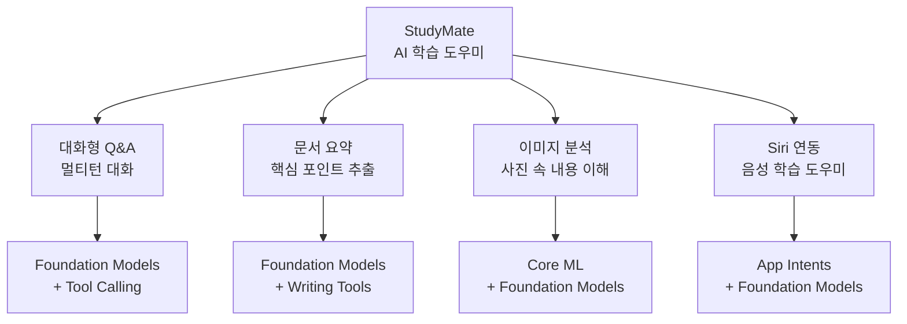
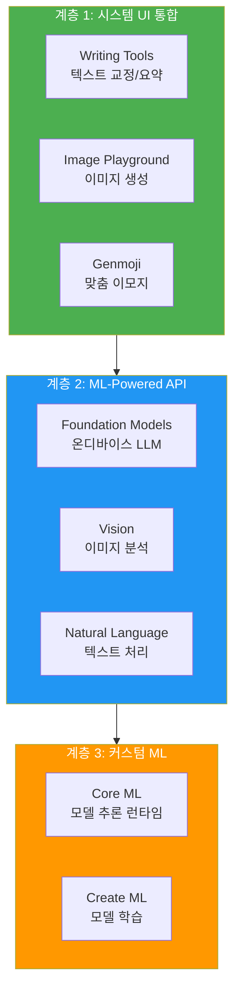
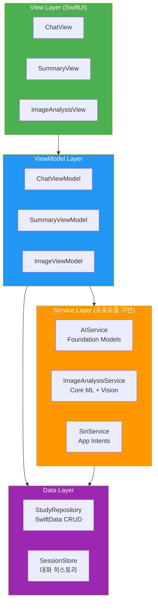
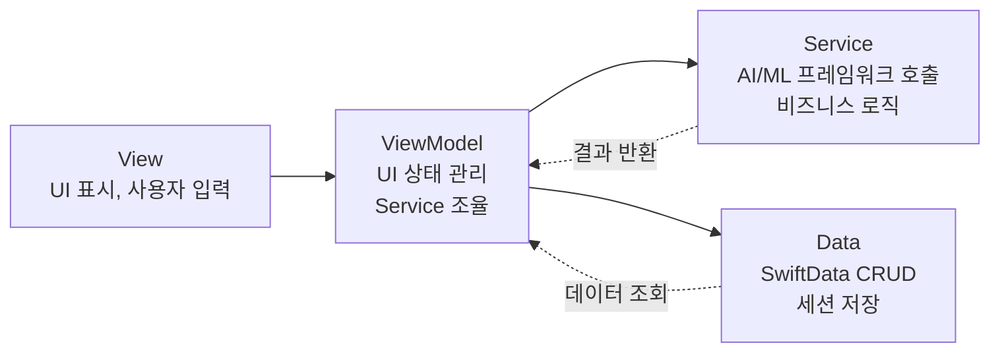
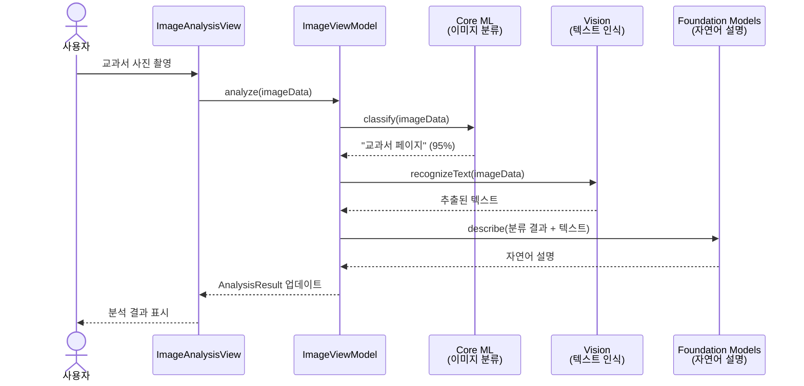
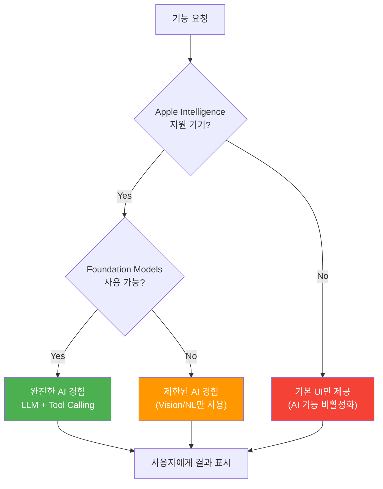
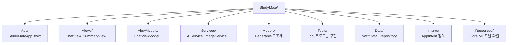

# 최종 프로젝트 설계와 아키텍처

> Foundation Models, Apple Intelligence 서비스, Core ML을 모두 통합하는 AI 학습 도우미 앱의 전체 설계도를 그립니다.

## 개요

이 섹션에서는 이 코스 전체에서 배운 모든 기술을 하나의 앱에 녹여내는 **최종 프로젝트**를 설계합니다. "StudyMate"라는 AI 학습 도우미 앱을 만들 건데요, 대화형 Q&A, 문서 요약, 이미지 분석, Siri 연동까지 — 지금까지 배운 모든 것이 톱니바퀴처럼 맞물려 돌아가는 앱입니다.

**선수 지식**: 이 코스의 Ch1~Ch19 전체 내용. 특히 [Foundation Models 프레임워크](03-ch3-foundation-models-프레임워크-시작하기/01-01-systemlanguagemodel-이해하기.md), [Tool Calling](07-ch7-tool-calling-기초/01-01-tool-calling-개념과-아키텍처.md), [Core ML](15-ch15-core-ml-기초/01-01-core-ml-프레임워크-소개.md), [App Intents](13-ch13-app-intents와-siri-연동/01-01-app-intents-프레임워크-개요.md)

**학습 목표**:
- AI 학습 도우미 앱의 기능 명세와 사용자 시나리오를 정의한다
- Foundation Models + Core ML + Apple Intelligence 서비스를 통합하는 모듈 아키텍처를 설계한다
- MVVM + Service 패턴으로 AI 기능별 책임을 분리한다
- 프레임워크 간 데이터 흐름과 의존성 관계를 이해한다

## 왜 알아야 할까?

자, 여기까지 오셨다면 여러분은 이미 Foundation Models로 텍스트를 생성하고, Tool Calling으로 외부 데이터를 가져오고, Core ML로 이미지를 분류하고, App Intents로 Siri와 대화하는 방법을 각각 알고 계시죠. 그런데 **실제 앱**은 이 기능들이 따로따로 동작하지 않습니다.

사용자가 교과서 사진을 찍으면 Core ML이 이미지를 분석하고, Foundation Models가 그 내용을 설명해주고, Writing Tools가 요약문을 다듬어주고, Siri에게 "오늘 배운 거 퀴즈 내줘"라고 말하면 App Intents가 학습 기록을 기반으로 퀴즈를 생성합니다. 이런 **통합 경험**이야말로 Apple Intelligence가 추구하는 방향이거든요.

Apple이 WWDC25에서 강조한 핵심 메시지가 있습니다: **"System features first, programmatic APIs when needed, custom models for specialized tasks"** — 시스템이 제공하는 걸 먼저 쓰고, 필요하면 API로 제어하고, 특수한 경우에만 커스텀 모델을 만들라는 거죠. 이 원칙이 바로 우리 최종 프로젝트의 설계 철학이 됩니다.

## 핵심 개념

### 개념 1: StudyMate 앱 컨셉과 기능 명세

> 💡 **비유**: StudyMate는 **만능 과외 선생님**이라고 생각하세요. 질문하면 대답해주고(Q&A), 두꺼운 교재를 한 페이지로 요약해주고(문서 요약), 칠판 사진을 찍으면 내용을 설명해주고(이미지 분석), "내일 시험인데 뭐 복습해야 해?"라고 물으면 학습 기록을 보고 알려주는(Siri 연동) — 그런 선생님입니다.

StudyMate는 **AI 학습 도우미 앱**으로, 다음 네 가지 핵심 기능을 제공합니다:

| 기능 | 설명 | 주요 프레임워크 |
|------|------|----------------|
| **대화형 Q&A** | 학습 주제에 대해 멀티턴 대화로 질문/답변 | Foundation Models, Tool Calling |
| **문서 요약** | 긴 텍스트를 핵심 포인트로 요약 | Foundation Models, Writing Tools |
| **이미지 분석** | 교과서/노트 사진을 분석하여 내용 추출 | Core ML, Foundation Models |
| **Siri 연동** | 음성으로 학습 기록 조회, 퀴즈 생성 | App Intents, Foundation Models |

> 📊 **그림 1**: StudyMate 앱의 4대 핵심 기능



각 기능의 **사용자 시나리오**를 구체적으로 살펴보겠습니다:

```swift
// MARK: - 기능 명세 정의

/// StudyMate 앱의 핵심 기능 열거
enum StudyMateFeature: String, CaseIterable, Identifiable {
    case conversationalQA    // 대화형 Q&A
    case documentSummary     // 문서 요약
    case imageAnalysis       // 이미지 분석
    case siriIntegration     // Siri 연동
    
    var id: String { rawValue }
    
    /// 각 기능에 필요한 Apple 프레임워크
    var requiredFrameworks: [String] {
        switch self {
        case .conversationalQA:
            return ["FoundationModels", "SwiftUI"]
        case .documentSummary:
            return ["FoundationModels", "WritingTools", "SwiftUI"]
        case .imageAnalysis:
            return ["CoreML", "Vision", "FoundationModels"]
        case .siriIntegration:
            return ["AppIntents", "FoundationModels"]
        }
    }
    
    /// 사용자 시나리오 설명
    var userScenario: String {
        switch self {
        case .conversationalQA:
            return "사용자가 '광합성이 뭐야?'라고 질문하면 쉬운 설명 + 후속 질문 제안"
        case .documentSummary:
            return "긴 아티클을 붙여넣으면 3줄 요약 + 핵심 키워드 추출"
        case .imageAnalysis:
            return "교과서 사진을 찍으면 텍스트 인식 + 내용 설명"
        case .siriIntegration:
            return "'오늘 배운 거 퀴즈 내줘' → 학습 기록 기반 퀴즈 생성"
        }
    }
}
```

### 개념 2: Apple AI/ML 프레임워크 계층 구조

> 💡 **비유**: Apple의 AI 프레임워크들은 **주방의 도구 세트**와 같습니다. Writing Tools나 Image Playground는 전자레인지처럼 버튼 하나로 결과가 나오는 **시스템 서비스**이고, Foundation Models는 다양한 요리를 만들 수 있는 **만능 조리대**, Core ML은 특정 레시피에 최적화된 **전문 조리기구**입니다. 좋은 셰프(개발자)는 상황에 맞는 도구를 고르죠.

WWDC25에서 Apple은 AI/ML 프레임워크를 세 계층으로 정리했습니다. 우리 StudyMate 앱도 이 계층 구조를 따릅니다:

> 📊 **그림 2**: Apple AI/ML 프레임워크 3계층 아키텍처



**계층별 설계 원칙**:

1. **계층 1 — 시스템 UI 통합** (Zero Effort): 표준 SwiftUI 컨트롤만 쓰면 자동으로 활성화됩니다. `TextEditor`를 쓰면 Writing Tools가 자동 통합되죠.
2. **계층 2 — ML-Powered API** (Programmatic): Foundation Models의 `LanguageModelSession`으로 직접 프롬프트를 보내고, Vision으로 이미지를 분석합니다.
3. **계층 3 — 커스텀 ML** (Specialized): Core ML로 사전 학습된 이미지 분류 모델을 돌리거나, Create ML로 도메인 특화 모델을 만듭니다.

```swift
// MARK: - 프레임워크 계층별 통합 전략

/// 각 계층의 통합 난이도와 제어 수준
struct FrameworkLayer {
    let name: String
    let integrationEffort: String   // "자동", "API 호출", "모델 학습"
    let controlLevel: String        // "낮음", "중간", "높음"
    let offlineSupport: Bool
}

let layers: [FrameworkLayer] = [
    // 계층 1: 시스템 UI — 가장 쉬움, 제어는 제한적
    FrameworkLayer(
        name: "Writing Tools / Image Playground",
        integrationEffort: "자동 (표준 UI 사용 시)",
        controlLevel: "낮음 — 시스템이 UI/UX 관리",
        offlineSupport: true
    ),
    // 계층 2: ML-Powered API — 적절한 균형
    FrameworkLayer(
        name: "Foundation Models / Vision",
        integrationEffort: "API 호출 (3~10줄 코드)",
        controlLevel: "중간 — 프롬프트/파라미터 제어",
        offlineSupport: true
    ),
    // 계층 3: 커스텀 ML — 높은 자유도, 높은 노력
    FrameworkLayer(
        name: "Core ML / Create ML",
        integrationEffort: "모델 학습 + 변환 + 배포",
        controlLevel: "높음 — 모델 아키텍처부터 제어",
        offlineSupport: true
    )
]
```

### 개념 3: 모듈 아키텍처 설계 (MVVM + Service)

> 💡 **비유**: 대형 레스토랑을 생각해보세요. 홀(View)에서 주문을 받으면, 매니저(ViewModel)가 주방에 전달하고, 주방(Service Layer)에는 파스타 담당, 스테이크 담당, 디저트 담당이 각각 있습니다. 그리고 식재료 창고(Data Layer)가 따로 있어서 셰프들이 직접 시장에 갈 필요 없죠. 각 셰프가 자기 전문 분야만 책임지면서도, 코스 요리로 함께 나가는 겁니다. 이게 바로 **모듈 아키텍처**입니다.

StudyMate 앱은 **MVVM + Service** 패턴을 채택합니다. AI 기능별로 Service를 분리하되, 서비스 인터페이스는 Ch19에서 완성한 프로토콜 체계를 그대로 가져옵니다. Data Layer에는 SwiftData 기반의 `StudyRepository`가 학습 기록 저장을 담당하는데, 이건 GoF의 Repository 패턴이라기보다는 **데이터 접근 객체(DAO)**에 가까운 역할입니다 — 비즈니스 로직 없이 CRUD만 수행하거든요.

> 📊 **그림 3**: StudyMate 모듈 아키텍처 전체 구조



왜 "MVVM + Service"라고 부를까요? 일반적인 MVVM에서는 ViewModel이 모든 비즈니스 로직을 품는 경향이 있습니다. 하지만 AI 앱에서는 Foundation Models 호출, Core ML 추론, Vision 분석 등 **프레임워크별 전문 로직**이 무겁기 때문에, 이걸 Service 레이어로 분리하는 거죠. ViewModel은 UI 상태 관리에 집중하고, 실제 AI 처리는 Service에 위임합니다.

> 📊 **그림 4**: MVVM + Service 패턴의 책임 분리



#### Ch19에서 완성한 프로토콜 체계 그대로 사용하기

[Ch19. 테스트와 품질 보증](19-ch19-테스트와-품질-보증/02-02-foundation-models-mock과-stub-전략.md)에서 우리는 `AIServiceProtocol`을 테스트 가능한 형태로 발전시켰습니다. StudyMate에서는 **그 최종 버전을 수정 없이 그대로 채택**합니다. 여기서 프로토콜을 다시 정의하는 대신, Ch19의 결과물과 이 프로젝트에서 추가로 필요한 도메인 전용 프로토콜의 관계를 정리하겠습니다:

```swift
import Foundation
import FoundationModels

// MARK: - 서비스 프로토콜 구성

// AIServiceProtocol — Ch19에서 완성한 버전을 그대로 import
// (ask, chat, summarize, streamResponse 등 이미 정의됨)
// 👉 Services/Protocols/AIServiceProtocol.swift 파일을 그대로 사용

/// 이미지 분석 서비스 — StudyMate 도메인 전용 프로토콜
/// AIServiceProtocol과 달리, 이 프로토콜은 Core ML + Vision 파이프라인에 특화
protocol ImageAnalysisServiceProtocol: Sendable {
    /// 이미지에서 텍스트 인식 (Vision)
    func recognizeText(in imageData: Data) async throws -> String
    
    /// 이미지 분류 (Core ML)
    func classify(_ imageData: Data) async throws -> ImageClassification
    
    /// 이미지 내용을 자연어로 설명 (Core ML 분류 + Vision OCR + Foundation Models 설명)
    func describe(_ imageData: Data) async throws -> String
}

/// 학습 데이터 접근 프로토콜
/// 비즈니스 로직 없이 SwiftData CRUD만 담당하는 데이터 접근 계층
protocol StudyRepositoryProtocol: Sendable {
    func saveSession(_ session: StudySession) async throws
    func fetchSessions(for topic: String) async throws -> [StudySession]
    func fetchRecentTopics(limit: Int) async throws -> [String]
}
```

> 🔥 **실무 팁**: 프로토콜을 "이 프로젝트에서 다시 정의"하고 싶은 유혹이 들 수 있지만, 이미 테스트까지 검증된 인터페이스를 수정하면 기존 Mock/Stub과의 호환성이 깨집니다. **새 기능이 필요하면 프로토콜 확장(extension)으로 추가**하고, 기존 시그니처는 건드리지 마세요.

### 개념 4: 프레임워크 간 데이터 흐름

> 💡 **비유**: 공장의 **컨베이어 벨트**를 떠올려보세요. 원재료(사용자 입력)가 들어오면, 각 공정(프레임워크)을 거치면서 가공됩니다. Core ML이 "이 사진은 교과서 페이지"라고 분류하면, Vision이 텍스트를 추출하고, Foundation Models가 그 텍스트를 설명해줍니다. 각 공정의 출력이 다음 공정의 입력이 되는 **파이프라인** 구조죠.

가장 복잡한 시나리오인 **이미지 분석 → AI 설명 → 요약** 파이프라인의 데이터 흐름을 보겠습니다:

> 📊 **그림 5**: 이미지 분석 파이프라인 데이터 흐름



이 파이프라인을 코드로 구현하면 이렇습니다:

```swift
import CoreML
import Vision
import FoundationModels

// MARK: - 데이터 흐름 모델 정의

/// 이미지 분석 파이프라인의 중간 결과물
struct ImageAnalysisPipeline {
    /// 1단계: Core ML 분류 결과
    struct ClassificationResult {
        let category: String      // "교과서", "노트필기", "화이트보드" 등
        let confidence: Float     // 신뢰도 (0.0~1.0)
    }
    
    /// 2단계: Vision 텍스트 인식 결과
    struct TextRecognitionResult {
        let fullText: String      // 인식된 전체 텍스트
        let blocks: [TextBlock]   // 영역별 텍스트 블록
    }
    
    struct TextBlock {
        let text: String
        let boundingBox: CGRect
        let confidence: Float
    }
    
    /// 3단계: Foundation Models 자연어 설명
    struct NaturalLanguageDescription {
        let summary: String       // 한 줄 요약
        let explanation: String   // 상세 설명
        let keyTerms: [String]    // 핵심 용어
    }
    
    /// 최종 통합 결과
    struct AnalysisResult {
        let classification: ClassificationResult
        let recognizedText: TextRecognitionResult
        let description: NaturalLanguageDescription
        let timestamp: Date
    }
}
```

### 개념 5: 기기 가용성 기반 폴백 설계

> 💡 **비유**: 여행 갈 때 계획을 세우잖아요. 날씨가 좋으면 해변에서 수영(최상의 경험), 흐리면 해변 산책(기본 경험), 비가 오면 카페에서 독서(최소 경험) — 상황에 따라 **가능한 최선의 경험**을 제공하는 거죠. Apple의 AI 기능도 마찬가지입니다.

Apple의 온디바이스 AI 기능은 모든 기기에서 동일하게 제공되지 않습니다. Foundation Models는 Apple Intelligence 지원 기기(A17 Pro 이상, M1 이상)에서만 동작하고, 일부 Writing Tools 기능은 최신 OS 버전에서만 사용 가능하죠. 이런 상황에서 앱이 크래시 없이 우아하게 동작하려면 **기기 가용성에 따른 폴백 패턴**이 필요합니다.

웹 개발에서는 이걸 "Progressive Enhancement(점진적 향상)"라고 부르는데요, Apple 플랫폼에서는 좀 더 구체적으로 **가용성 분기(availability branching)** 패턴으로 구현합니다. `#available` 체크와 `SystemLanguageModel.default`의 가용성 확인을 조합하는 방식이죠.

> 📊 **그림 6**: 기기 가용성 기반 폴백 흐름



```swift
import FoundationModels

// MARK: - 기기 가용성 기반 폴백 구현

/// 기기의 AI 기능 지원 수준을 판별
enum AICapabilityLevel {
    case full        // Foundation Models + Core ML + Vision 모두 가능
    case limited     // Core ML + Vision만 가능 (Foundation Models 미지원)
    case basic       // AI 기능 없음 (기본 UI만)
}

/// 현재 기기의 AI 가용성을 확인하는 유틸리티
struct DeviceCapabilityChecker {
    /// 기기의 AI 기능 지원 수준 판별
    static func currentLevel() -> AICapabilityLevel {
        // Foundation Models 가용성 확인
        let modelAvailability = SystemLanguageModel.default.availability
        
        switch modelAvailability {
        case .available:
            return .full      // 최상의 경험: LLM + Tool Calling
        case .unavailable(.deviceNotEligible):
            return .limited   // 기기 미지원: Vision/NL로 폴백
        case .unavailable(.appleIntelligenceNotEnabled):
            return .limited   // 사용자가 Apple Intelligence 비활성화
        case .unavailable(.modelNotReady):
            return .limited   // 모델 다운로드 중: 임시 폴백
        default:
            return .basic     // 그 외: 기본 UI만
        }
    }
}

/// ViewModel에서의 폴백 적용 예시
@Observable
final class SmartSummaryViewModel {
    var summary: String = ""
    var isLoading = false
    var capabilityLevel: AICapabilityLevel
    
    init() {
        self.capabilityLevel = DeviceCapabilityChecker.currentLevel()
    }
    
    func summarize(_ text: String) async {
        isLoading = true
        defer { isLoading = false }
        
        switch capabilityLevel {
        case .full:
            // Foundation Models로 구조화 요약
            // (AIService.summarize() 호출)
            summary = "AI가 생성한 구조화 요약..."
            
        case .limited:
            // Natural Language 프레임워크로 키워드/문장 추출
            summary = "키워드 기반 추출 요약..."
            
        case .basic:
            // AI 없이 앞부분만 표시
            summary = String(text.prefix(200)) + "..."
        }
    }
}
```

이 패턴이 중요한 이유는, App Store에 제출하는 앱은 **모든 지원 기기에서 크래시 없이 동작**해야 하기 때문입니다. Foundation Models를 `#available` 없이 호출하면, 미지원 기기에서 런타임 에러가 발생할 수 있어요. 항상 가용성을 먼저 확인하고, 그에 맞는 폴백 경험을 제공하는 것이 Apple 플랫폼에서 AI 앱을 만드는 기본 원칙입니다.

### 개념 6: 디렉토리 구조와 모듈 분리

> 💡 **비유**: 잘 정돈된 서재를 떠올려보세요. 소설, 학술서, 참고서가 각각 다른 선반에 있으면 원하는 책을 바로 찾을 수 있죠. 코드도 마찬가지입니다. AI 서비스, UI, 데이터 모델이 각각 자기 자리에 있어야 유지보수가 수월합니다.

> 📊 **그림 7**: StudyMate 프로젝트 디렉토리 구조



```swift
// MARK: - 프로젝트 디렉토리 구조

/*
StudyMate/
├── App/
│   ├── StudyMateApp.swift          // @main 진입점
│   └── AppDependencies.swift       // 의존성 주입 컨테이너
│
├── Views/
│   ├── Chat/
│   │   ├── ChatView.swift          // 대화형 Q&A 화면
│   │   └── MessageBubble.swift     // 메시지 말풍선 컴포넌트
│   ├── Summary/
│   │   ├── SummaryView.swift       // 문서 요약 화면
│   │   └── SummaryCard.swift       // 요약 결과 카드
│   ├── ImageAnalysis/
│   │   ├── ImageAnalysisView.swift // 이미지 분석 화면
│   │   └── CameraCapture.swift     // 카메라 촬영 뷰
│   └── Shared/
│       ├── LoadingIndicator.swift  // 공통 로딩 UI
│       └── ErrorBanner.swift       // 공통 에러 표시
│
├── ViewModels/
│   ├── ChatViewModel.swift         // 대화 로직 관리
│   ├── SummaryViewModel.swift      // 요약 로직 관리
│   └── ImageViewModel.swift        // 이미지 분석 로직
│
├── Services/
│   ├── Protocols/
│   │   ├── AIServiceProtocol.swift         // Ch19 최종 버전 그대로
│   │   └── ImageAnalysisServiceProtocol.swift
│   ├── AIService.swift             // Foundation Models 래핑
│   ├── ImageAnalysisService.swift  // Core ML + Vision 래핑
│   └── MockAIService.swift         // 테스트용 목 서비스 (Ch19에서 가져옴)
│
├── Models/
│   ├── DocumentSummary.swift       // @Generable 요약 구조체
│   ├── QuizQuestion.swift          // @Generable 퀴즈 구조체
│   └── ImageClassification.swift   // 이미지 분류 결과
│
├── Tools/
│   ├── WebSearchTool.swift         // 웹 검색 Tool
│   ├── StudyHistoryTool.swift      // 학습 기록 조회 Tool
│   └── QuizGeneratorTool.swift     // 퀴즈 생성 Tool
│
├── Data/
│   ├── StudySession.swift          // SwiftData 모델
│   ├── StudyRepository.swift       // 데이터 접근 (CRUD)
│   └── SessionStore.swift          // 대화 히스토리 관리
│
├── Intents/
│   ├── AskQuestionIntent.swift     // "질문하기" Siri 액션
│   ├── QuizIntent.swift            // "퀴즈 내줘" Siri 액션
│   └── StudyEntity.swift           // 학습 세션 Entity
│
└── Resources/
    └── DocumentClassifier.mlmodel  // 문서 분류 Core ML 모델
*/
```

## 실습: 직접 해보기

이제 StudyMate 앱의 **뼈대 코드**를 작성해봅시다. 핵심 데이터 모델, 의존성 주입 컨테이너, AI Service 구현체, 그리고 메인 앱 구조를 한번에 잡겠습니다. 서비스 프로토콜은 Ch19에서 이미 완성했으므로, 여기서는 **구현체와 통합 코드**에 집중합니다.

```swift
import SwiftUI
import SwiftData
import FoundationModels

// MARK: - 1. 핵심 데이터 모델 (@Generable 구조화 출력)

/// 문서 요약 결과 — Foundation Models가 구조화된 형태로 반환
@Generable
struct DocumentSummary {
    @Guide(description: "원문의 핵심 내용을 3문장 이내로 요약")
    var summary: String
    
    @Guide(description: "핵심 키워드 3~5개")
    var keywords: [String]
    
    @Guide(description: "난이도 (1: 초급, 2: 중급, 3: 고급)", range: 1...3)
    var difficultyLevel: Int
}

/// 퀴즈 문제 — Siri 연동 시 활용
@Generable
struct QuizQuestion {
    @Guide(description: "퀴즈 질문")
    var question: String
    
    @Guide(description: "4개의 선택지")
    var options: [String]
    
    @Guide(description: "정답 인덱스 (0~3)", range: 0...3)
    var correctIndex: Int
    
    @Guide(description: "정답 해설")
    var explanation: String
}

// MARK: - 2. SwiftData 영구 저장 모델

/// 학습 세션 기록 — SwiftData로 영구 저장
@Model
final class StudySession {
    var id: UUID
    var topic: String                    // 학습 주제
    var messages: [ChatMessage]          // 대화 내역
    var summaries: [String]             // 생성된 요약들
    var createdAt: Date
    var lastAccessedAt: Date
    
    init(topic: String) {
        self.id = UUID()
        self.topic = topic
        self.messages = []
        self.summaries = []
        self.createdAt = Date()
        self.lastAccessedAt = Date()
    }
}

/// 개별 채팅 메시지
struct ChatMessage: Codable {
    let id: UUID
    let role: Role
    let content: String
    let timestamp: Date
    
    enum Role: String, Codable {
        case user      // 사용자 메시지
        case assistant // AI 응답
    }
    
    init(role: Role, content: String) {
        self.id = UUID()
        self.role = role
        self.content = content
        self.timestamp = Date()
    }
}

// MARK: - 3. 의존성 주입 컨테이너

/// 앱 전체의 서비스 의존성을 관리하는 컨테이너
/// Ch19의 프로토콜 + MockAIService를 그대로 활용하여 테스트 환경 구성
@Observable
final class AppDependencies {
    let aiService: any AIServiceProtocol
    let imageService: any ImageAnalysisServiceProtocol
    let repository: any StudyRepositoryProtocol
    
    /// 프로덕션 환경: 실제 서비스 주입
    init() {
        self.aiService = AIService()
        self.imageService = ImageAnalysisService()
        self.repository = StudyRepository()
    }
    
    /// 테스트/프리뷰 환경: Mock 서비스 주입
    /// Ch19에서 만든 MockAIService를 여기서 그대로 사용
    init(
        aiService: any AIServiceProtocol,
        imageService: any ImageAnalysisServiceProtocol,
        repository: any StudyRepositoryProtocol
    ) {
        self.aiService = aiService
        self.imageService = imageService
        self.repository = repository
    }
}

// MARK: - 4. AI Service 구현 (Foundation Models 래핑)

/// Foundation Models 프레임워크를 래핑하는 핵심 서비스
/// AIServiceProtocol(Ch19 최종 버전)을 구현
final class AIService: AIServiceProtocol, @unchecked Sendable {
    /// 세션 ID별 LanguageModelSession을 캐시하여 멀티턴 대화 지원
    private var sessions: [UUID: LanguageModelSession] = [:]
    private let lock = NSLock()
    
    /// 기본 시스템 인스트럭션
    private let systemInstruction = """
    당신은 친절하고 지식이 풍부한 학습 도우미입니다.
    학생의 수준에 맞춰 쉽게 설명하되, 정확한 정보를 전달하세요.
    한국어로 답변하고, 필요하면 예시를 들어 설명하세요.
    """
    
    func ask(_ question: String) async throws -> String {
        // 단일 질문: 임시 세션 생성
        let session = LanguageModelSession(
            instructions: systemInstruction
        )
        let response = try await session.respond(to: question)
        return response.content
    }
    
    func chat(_ message: String, in sessionID: UUID) async throws -> String {
        // 멀티턴 대화: 세션 캐시에서 가져오거나 새로 생성
        let session = getOrCreateSession(for: sessionID)
        let response = try await session.respond(to: message)
        return response.content
    }
    
    func summarize(_ text: String) async throws -> DocumentSummary {
        // 구조화 출력: @Generable 타입으로 자동 파싱
        let session = LanguageModelSession(
            instructions: "주어진 텍스트를 분석하여 요약, 키워드, 난이도를 추출하세요."
        )
        let response = try await session.respond(
            to: "다음 텍스트를 분석해주세요:\n\n\(text)",
            generating: DocumentSummary.self
        )
        return response.content
    }
    
    func streamResponse(for prompt: String) -> AsyncThrowingStream<String, Error> {
        AsyncThrowingStream { continuation in
            Task {
                do {
                    let session = LanguageModelSession(
                        instructions: systemInstruction
                    )
                    // 스트리밍 응답 — 토큰 단위로 전달
                    for try await partial in session.streamResponse(to: prompt) {
                        continuation.yield(partial.content)
                    }
                    continuation.finish()
                } catch {
                    continuation.finish(throwing: error)
                }
            }
        }
    }
    
    // MARK: Private Helpers
    
    private func getOrCreateSession(for id: UUID) -> LanguageModelSession {
        lock.lock()
        defer { lock.unlock() }
        
        if let existing = sessions[id] {
            return existing
        }
        
        let session = LanguageModelSession(
            instructions: systemInstruction
        )
        sessions[id] = session
        return session
    }
}

// MARK: - 5. 앱 진입점

@main
struct StudyMateApp: App {
    @State private var dependencies = AppDependencies()
    
    var body: some Scene {
        WindowGroup {
            ContentView()
                .environment(dependencies)
        }
        .modelContainer(for: StudySession.self)
    }
}

/// 메인 탭 뷰 — 4대 기능을 탭으로 구분
struct ContentView: View {
    @Environment(AppDependencies.self) private var deps
    
    var body: some View {
        TabView {
            // 대화형 Q&A 탭
            ChatView(viewModel: ChatViewModel(aiService: deps.aiService))
                .tabItem {
                    Label("Q&A", systemImage: "bubble.left.and.bubble.right")
                }
            
            // 문서 요약 탭
            SummaryView(viewModel: SummaryViewModel(aiService: deps.aiService))
                .tabItem {
                    Label("요약", systemImage: "doc.text.magnifyingglass")
                }
            
            // 이미지 분석 탭
            ImageAnalysisView(
                viewModel: ImageViewModel(
                    imageService: deps.imageService,
                    aiService: deps.aiService
                )
            )
            .tabItem {
                Label("이미지", systemImage: "camera.viewfinder")
            }
            
            // 학습 기록 탭
            HistoryView()
                .tabItem {
                    Label("기록", systemImage: "clock.arrow.circlepath")
                }
        }
    }
}
```

```run:swift
// 설계 검증: 의존성 관계 출력
let features: [(String, [String])] = [
    ("대화형 Q&A", ["FoundationModels", "SwiftUI"]),
    ("문서 요약", ["FoundationModels", "WritingTools"]),
    ("이미지 분석", ["CoreML", "Vision", "FoundationModels"]),
    ("Siri 연동", ["AppIntents", "FoundationModels"])
]

print("=== StudyMate 프레임워크 의존성 매트릭스 ===\n")
var frameworkCount: [String: Int] = [:]

for (feature, frameworks) in features {
    print("[\(feature)]")
    print("  └─ \(frameworks.joined(separator: " → "))")
    for fw in frameworks {
        frameworkCount[fw, default: 0] += 1
    }
}

print("\n--- 프레임워크 사용 빈도 ---")
for (fw, count) in frameworkCount.sorted(by: { $0.value > $1.value }) {
    let bar = String(repeating: "█", count: count)
    print("\(fw.padding(toLength: 20, withPad: " ", startingAt: 0)) \(bar) (\(count)회)")
}
```

```output
=== StudyMate 프레임워크 의존성 매트릭스 ===

[대화형 Q&A]
  └─ FoundationModels → SwiftUI
[문서 요약]
  └─ FoundationModels → WritingTools
[이미지 분석]
  └─ CoreML → Vision → FoundationModels
[Siri 연동]
  └─ AppIntents → FoundationModels

--- 프레임워크 사용 빈도 ---
FoundationModels         ████ (4회)
SwiftUI                  █ (1회)
WritingTools             █ (1회)
CoreML                   █ (1회)
Vision                   █ (1회)
AppIntents               █ (1회)
```

이 출력에서 볼 수 있듯이, **Foundation Models가 모든 기능의 중심**에 있습니다. 이것이 바로 우리 아키텍처에서 `AIServiceProtocol`을 핵심 추상화로 설계한 이유이고, Ch19에서 이 프로토콜을 테스트 가능하게 다듬어놓은 것이 최종 프로젝트에서 바로 빛을 발하는 순간입니다.

## 더 깊이 알아보기

### Apple의 AI 프레임워크 진화 — "누구나 AI를 쓸 수 있게"

Apple이 AI 프레임워크를 이런 계층 구조로 설계한 데는 역사적 배경이 있습니다. 2017년 Core ML이 처음 등장했을 때, 개발자들은 모델을 직접 변환하고 최적화해야 했습니다. 당시 ML 기능을 앱에 넣는 건 전문가의 영역이었죠.

2023년 Vision이 대폭 개선되고 Natural Language 프레임워크가 강화되면서, Apple은 "개발자가 ML을 몰라도 ML 기능을 쓸 수 있어야 한다"는 방향으로 움직이기 시작했습니다. 그리고 2025년 WWDC25에서 Foundation Models 프레임워크를 발표하면서, 이 비전이 완성됩니다.

Craig Federighi가 WWDC25 키노트에서 한 말이 인상적입니다: *"3줄의 Swift 코드로 온디바이스 AI를 앱에 통합할 수 있다."* 이건 과장이 아니었습니다 — `SystemLanguageModel.default`를 가져오고, `LanguageModelSession`을 만들고, `respond(to:)`를 호출하면 끝이니까요.

우리 StudyMate 앱이 바로 이 철학을 체현합니다. Writing Tools는 `TextEditor`를 쓰는 것만으로 자동 통합되고, 복잡한 이미지 분석은 Core ML + Vision + Foundation Models의 파이프라인으로 처리하되, 각 프레임워크는 자기 역할만 수행합니다.

### 프로토콜 재사용이 주는 실전적 가치

Ch10에서 처음 `AIServiceProtocol`을 도입하고, Ch19에서 테스트를 위해 확장/정제하는 과정을 거쳤습니다. 최종 프로젝트인 StudyMate에서는 이 프로토콜을 **한 줄도 수정하지 않고** 그대로 쓰고 있죠. 이게 가능한 이유는 Ch19에서 Mock/Stub과의 호환성까지 고려해서 인터페이스를 설계했기 때문입니다. 만약 프로젝트마다 프로토콜을 새로 정의했다면, Mock도 매번 다시 만들어야 하고, 기존 테스트가 깨질 수 있었을 겁니다. 프로토콜 설계에 투자한 시간이 최종 프로젝트 단계에서 **통합 비용 절감**으로 돌아오는 셈이죠.

## 흔한 오해와 팁

> ⚠️ **흔한 오해**: "모든 AI 기능을 Foundation Models 하나로 처리하면 되지 않나요?"
> 
> Foundation Models는 **텍스트 기반 추론**에 특화된 ~3B 파라미터 LLM입니다. 이미지 분류, 객체 감지 같은 시각적 작업은 Core ML + Vision이 훨씬 정확하고 빠릅니다. 각 프레임워크의 강점을 살리는 **하이브리드 아키텍처**가 정답이에요. [하이브리드 아키텍처 설계 전략](17-ch17-foundation-models-core-ml-하이브리드/01-01-하이브리드-아키텍처-설계-전략.md)에서 이 원칙을 자세히 다뤘습니다.

> 💡 **알고 계셨나요?**: Apple의 온디바이스 Foundation Model은 2-bit Quantization-Aware Training으로 iPhone에서도 돌아갈 만큼 작지만, KV-Cache 공유 기법 덕분에 여러 세션을 동시에 운영해도 메모리가 37.5%밖에 늘지 않습니다. 그래서 StudyMate처럼 대화 + 요약 + 분석을 동시에 하는 앱도 충분히 가능한 거죠.

> 🔥 **실무 팁**: 프로젝트 초기에 `AppDependencies` 컨테이너를 만들어두세요. 나중에 서비스를 교체하거나 테스트 환경을 구성할 때 이 한 곳만 수정하면 됩니다. SwiftUI의 `@Environment`와 함께 쓰면 `ViewModel`에 의존성을 명시적으로 주입할 수 있어서, "이 ViewModel이 어떤 서비스에 의존하는지" 코드만 보고 바로 알 수 있습니다.

> ⚠️ **흔한 오해**: "Progressive Enhancement가 웹 개발 용어 아닌가요?"
>
> 맞습니다! 웹에서는 "기본 HTML부터 시작해서 CSS/JS를 점진적으로 추가"하는 의미인데요, Apple 플랫폼에서의 점진적 향상은 좀 다릅니다. **기기 가용성(availability)**에 따라 경험 수준을 조절하는 패턴이에요. Foundation Models 지원 기기에서는 풀 AI 경험을, 미지원 기기에서는 Vision/NL 기반 경험을, 구형 기기에서는 기본 UI만 제공하는 식이죠. 코드에서는 `#available` 체크와 `SystemLanguageModel.default.availability` 확인으로 구현합니다. Apple 공식 문서에서는 이를 "graceful degradation"에 가깝게 설명하기도 합니다.

## 핵심 정리

| 개념 | 설명 |
|------|------|
| **StudyMate 앱** | 대화형 Q&A, 문서 요약, 이미지 분석, Siri 연동을 갖춘 AI 학습 도우미 |
| **3계층 프레임워크 구조** | 시스템 UI(Writing Tools) → ML API(Foundation Models) → 커스텀 ML(Core ML) |
| **점진적 향상(가용성 폴백)** | 기기의 AI 지원 수준에 따라 최선의 경험을 제공하는 폴백 패턴 |
| **MVVM + Service 패턴** | View → ViewModel → Service(프로토콜) → Data, AI 기능별 책임 분리 |
| **Ch19 프로토콜 재사용** | `AIServiceProtocol` Ch19 최종 버전을 수정 없이 채택, Mock/Stub도 그대로 활용 |
| **데이터 파이프라인** | Core ML → Vision → Foundation Models 순으로 데이터가 흘러 최종 결과 생성 |
| **의존성 주입** | `AppDependencies` 컨테이너로 프로덕션/테스트 환경 분리 |

## 다음 섹션 미리보기

아키텍처 설계가 완료되었으니, 다음 섹션 [Foundation Models 코어 기능 구현](20-ch20-실전-프로젝트-ai-기능-통합-앱-완성/02-02-foundation-models-코어-기능-구현.md)에서는 이 설계를 바탕으로 **대화형 Q&A**와 **문서 요약** 기능을 실제로 구현합니다. `AIService`에 Tool Calling을 연결하고, `@Generable` 구조화 출력으로 요약 결과를 정형화하며, 스트리밍 응답을 SwiftUI에 연결하는 작업을 진행합니다.

## 참고 자료

- [Discover machine learning & AI frameworks on Apple platforms — WWDC25](https://developer.apple.com/videos/play/wwdc2025/360/) - Apple AI/ML 프레임워크 전체 계층 구조와 통합 전략을 보여주는 세션
- [Foundation Models — Apple Developer Documentation](https://developer.apple.com/documentation/FoundationModels) - Foundation Models 프레임워크의 공식 API 레퍼런스
- [Meet the Foundation Models framework — WWDC25](https://developer.apple.com/videos/play/wwdc2025/286/) - Foundation Models의 핵심 API 소개와 실전 데모
- [Deep dive into the Foundation Models framework — WWDC25](https://developer.apple.com/videos/play/wwdc2025/301/) - Guided Generation, Tool Calling, 세션 관리 심화
- [10 Best Practices for the Apple Foundation Models Framework — Datawizz](https://datawizz.ai/blog/apple-foundations-models-framework-10-best-practices-for-developing-ai-apps) - 상태 관리, 폴백 전략, 성능 최적화 등 실무 베스트 프랙티스
- [Code-along: Bring on-device AI to your app — WWDC25](https://developer.apple.com/videos/play/wwdc2025/259/) - Foundation Models를 앱에 통합하는 단계별 실습

---
### 🔗 Related Sessions
- [@generable](05-ch5-generable-구조화-출력/01-01-guided-generation-개념과-동작-원리.md) (prerequisite)
- [writing tools](01-ch1-apple-intelligence와-온디바이스-ai/01-01-apple-intelligence-개요.md) (prerequisite)
- [image playground](01-ch1-apple-intelligence와-온디바이스-ai/01-01-apple-intelligence-개요.md) (prerequisite)
- [core ml](01-ch1-apple-intelligence와-온디바이스-ai/02-02-apple-aiml-프레임워크-생태계.md) (prerequisite)
