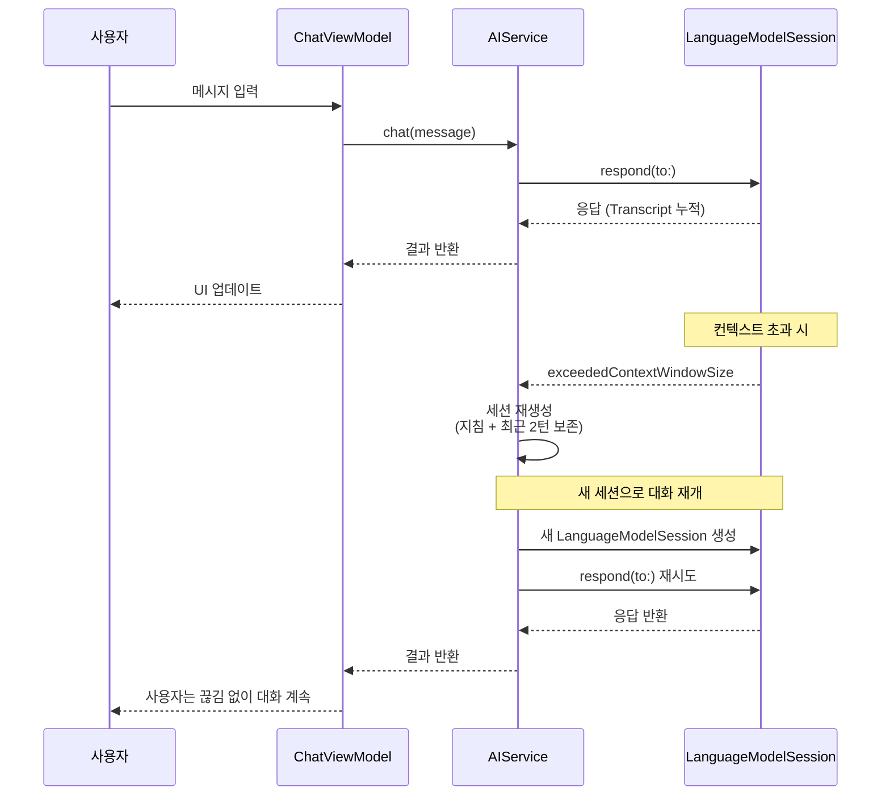
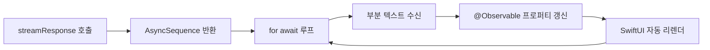
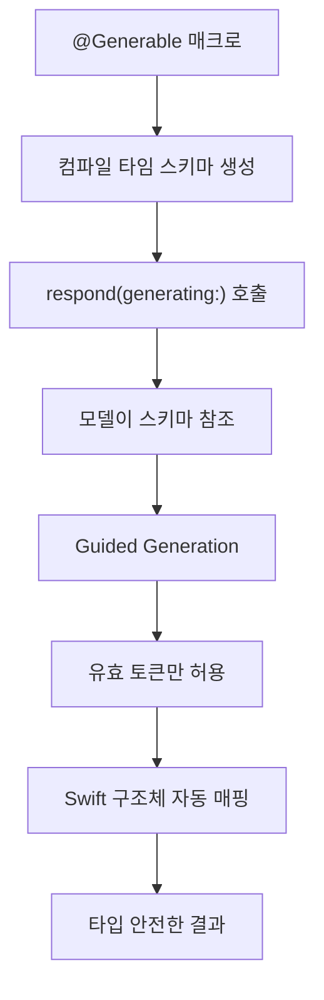
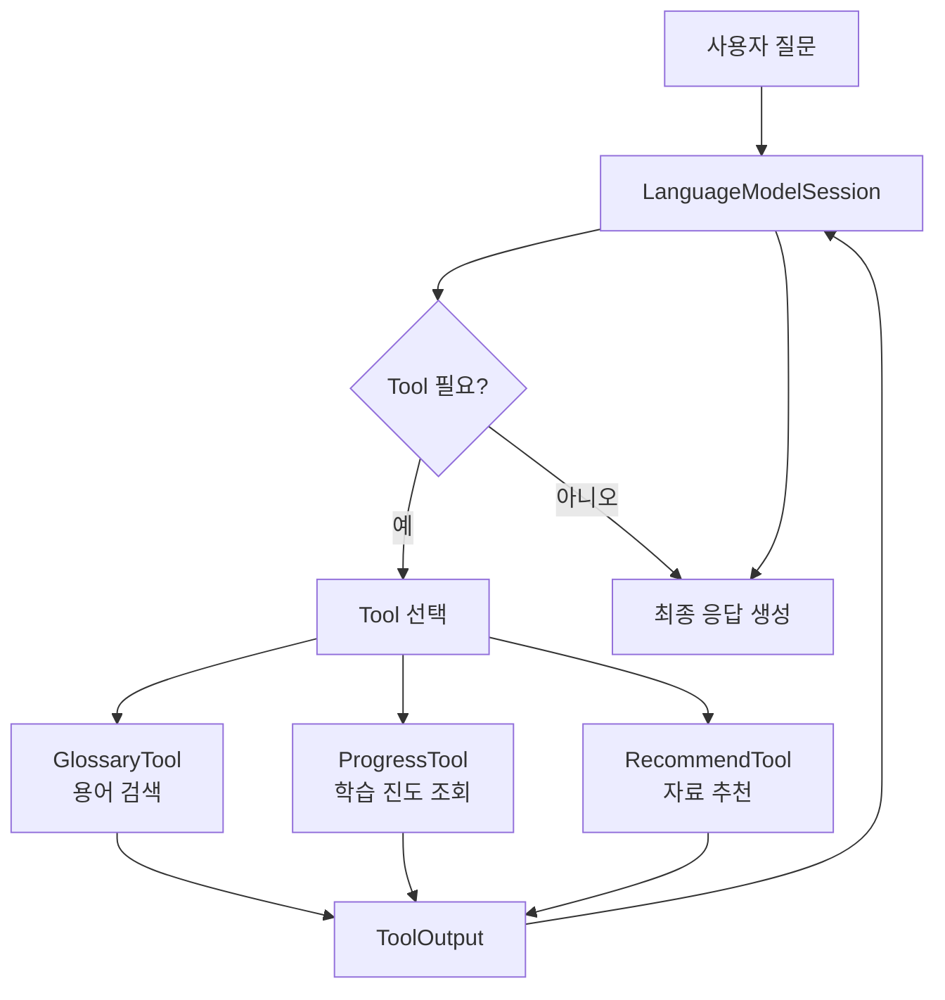
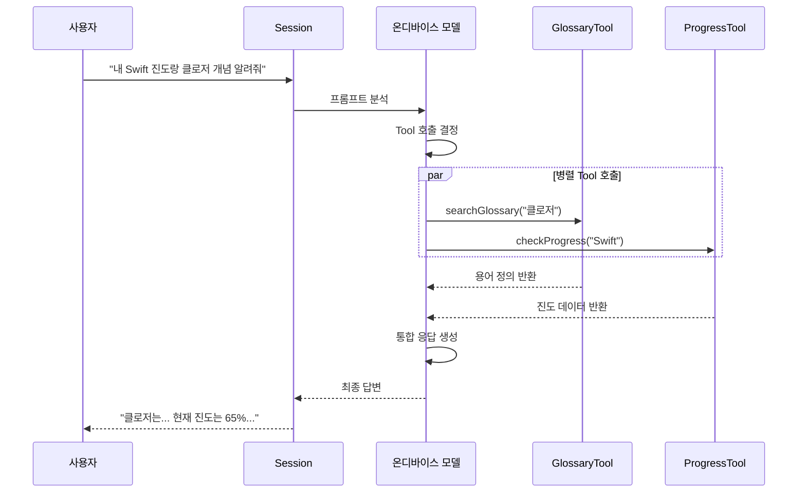

# Foundation Models 코어 기능 구현

> StudyMate 앱의 심장부를 만들어봅니다 — 대화형 Q&A, 문서 요약, 커스텀 Tool을 Foundation Models 프레임워크로 구현합니다.

## 개요

이전 세션에서 StudyMate 앱의 아키텍처와 프로토콜 기반 추상화를 설계했습니다. 이제 그 뼈대 위에 실제 AI 기능을 올릴 차례입니다. 이 세션에서는 `LanguageModelSession`을 활용한 대화형 Q&A, `@Generable` 구조화 출력을 활용한 문서 요약, 그리고 커스텀 Tool 세트를 하나의 `AIService`에 통합하는 과정을 다룹니다.

**선수 지식**: [이전 세션의 아키텍처 설계](20-ch20-실전-프로젝트-ai-기능-통합-앱-완성/01-01-최종-프로젝트-설계와-아키텍처.md)에서 정의한 `AIServiceProtocol`, `AppDependencies`, MVVM + Service 패턴, 그리고 `ChatMessage(role, content, timestamp)` 데이터 모델. [스트리밍 응답](06-ch6-스트리밍-응답과-실시간-ui/01-01-streamresponse-api-기초.md), [@Generable 구조화 출력](05-ch5-generable-구조화-출력/02-02-generable-매크로-적용하기.md), [Tool Calling](07-ch7-tool-calling-기초/02-02-tool-프로토콜-구현하기.md)의 기초 개념.

**학습 목표**:
- `LanguageModelSession` 기반 멀티턴 대화 서비스를 구현한다
- 스트리밍 응답을 SwiftUI 뷰에 실시간 연결한다
- `@Generable`로 문서 요약 구조를 정의하고 활용한다
- 학습 도우미용 커스텀 Tool 세트를 설계하고 세션에 통합한다

## 왜 알아야 할까?

앱 아키텍처를 아무리 잘 설계해도, 결국 사용자가 체감하는 건 AI가 얼마나 **자연스럽게** 대화하고, 얼마나 **구조적으로** 정보를 정리해주느냐입니다. 카카오톡처럼 메시지가 쭉 나오는데 AI 답변만 3초간 빈 화면이라면? 사용자는 앱이 멈춘 줄 알고 떠나버리죠.

실전 앱에서 Foundation Models의 세 핵심 축 — **스트리밍 멀티턴 대화**, **구조화 출력**, **Tool Calling** — 을 하나의 서비스 레이어로 결합하는 건, 마치 레스토랑에서 주방(Tool), 서빙(스트리밍), 메뉴판(구조화 출력)을 조율하는 매니저와 같습니다. 이 세 가지가 매끄럽게 맞물려야 비로소 "AI 앱"이라 부를 수 있는 제품이 됩니다.

## 핵심 개념

### 개념 1: AIService 구현 — 멀티턴 대화 엔진

> 💡 **비유**: `LanguageModelSession`은 카페의 단골 바리스타와 같습니다. 첫 방문에서 "저 아메리카노 좋아해요"라고 말해두면, 다음번에는 "오늘도 아메리카노요?"라고 맥락을 기억하죠. 세션이 바로 그 "기억"을 담당합니다.

[이전 세션](20-ch20-실전-프로젝트-ai-기능-통합-앱-완성/01-01-최종-프로젝트-설계와-아키텍처.md)에서 정의한 `AIServiceProtocol`을 실제로 구현해봅시다. 핵심은 세션 생명주기 관리와 컨텍스트 윈도우 오버플로 대응입니다.

> 📊 **그림 1**: AIService 멀티턴 대화 흐름 — 컨텍스트 초과 시 세션 재생성과 대화 재개



```swift
import FoundationModels
import Observation

@Observable
final class AIService: AIServiceProtocol {
    // MARK: - 세션 관리
    private var chatSession: LanguageModelSession
    private let instructions: String
    
    /// 세션 생성 시 도메인별 지침을 주입
    init() {
        self.instructions = """
            당신은 StudyMate의 학습 도우미입니다.
            학생의 질문에 친절하고 정확하게 답변하세요.
            이전 대화 맥락을 참고하여 답변하세요.
            """
        self.chatSession = LanguageModelSession(
            instructions: instructions
        )
    }
    
    /// 멀티턴 대화 — 컨텍스트 초과 시 자동 복구
    func chat(message: String) async throws -> String {
        do {
            let response = try await chatSession.respond(to: message)
            return response.content
        } catch LanguageModelSession.GenerationError
                    .exceededContextWindowSize {
            // 핵심 맥락만 보존하며 세션 재생성
            chatSession = rebuildSession(from: chatSession)
            let response = try await chatSession.respond(to: message)
            return response.content
        }
    }
    
    /// 세션 축약 — 최근 대화와 지침만 보존
    private func rebuildSession(
        from old: LanguageModelSession
    ) -> LanguageModelSession {
        let entries = old.transcript.entries
        var condensed = [Transcript.Entry]()
        
        // 시스템 지침 (첫 엔트리) 유지
        if let first = entries.first {
            condensed.append(first)
        }
        // 최근 2개 턴만 유지
        let recentEntries = entries.suffix(4)
        condensed.append(contentsOf: recentEntries)
        
        return LanguageModelSession(
            transcript: Transcript(entries: condensed)
        )
    }
    
    /// 대화 초기화
    func resetChat() {
        chatSession = LanguageModelSession(
            instructions: instructions
        )
    }
}
```

> ⚠️ **흔한 오해**: "세션을 길게 유지하면 AI가 더 똑똑해진다"고 생각하기 쉽지만, 온디바이스 모델은 컨텍스트 윈도우가 서버 모델보다 제한적입니다. 오히려 핵심 맥락만 간결하게 유지하는 것이 응답 품질과 속도 모두에 유리합니다.

### 개념 2: 스트리밍 응답과 실시간 UI 연결

> 💡 **비유**: 스트리밍은 뷔페 접시를 한 번에 가져오는 게 아니라, 요리사가 만드는 족족 접시에 올려주는 것과 같습니다. 사용자는 첫 글자부터 바로 읽기 시작할 수 있어요.

`streamResponse(to:)` API는 `AsyncSequence`를 반환하여, 토큰이 생성될 때마다 UI를 점진적으로 업데이트할 수 있습니다.

> 📊 **그림 2**: 스트리밍 응답 처리 파이프라인



```swift
@Observable
final class ChatViewModel {
    var currentResponse: String = ""
    var isStreaming: Bool = false
    
    private let aiService: AIService
    
    init(aiService: AIService) {
        self.aiService = aiService
    }
    
    /// 스트리밍 채팅 — 토큰 단위 UI 업데이트
    func sendMessage(_ text: String) async {
        isStreaming = true
        currentResponse = ""
        
        do {
            let stream = aiService.streamChat(message: text)
            
            for try await partial in stream {
                // 토큰이 도착할 때마다 UI 갱신
                currentResponse = partial
            }
        } catch {
            currentResponse = "오류가 발생했습니다: \(error.localizedDescription)"
        }
        
        isStreaming = false
    }
}
```

`AIService`에 스트리밍 메서드를 추가합니다:

```swift
extension AIService {
    /// 스트리밍 채팅 응답 반환
    func streamChat(
        message: String
    ) -> LanguageModelSession.StreamResponse<String> {
        chatSession.streamResponse(to: message)
    }
}
```

SwiftUI 뷰에서는 이렇게 연결하죠:

```swift
struct ChatBubbleView: View {
    let viewModel: ChatViewModel
    
    var body: some View {
        VStack(alignment: .leading) {
            Text(viewModel.currentResponse)
                .textSelection(.enabled)
                // 스트리밍 중 타이핑 커서 효과
                .overlay(alignment: .trailing) {
                    if viewModel.isStreaming {
                        Rectangle()
                            .frame(width: 2, height: 16)
                            .opacity(0.6)
                            .blinkAnimation()
                    }
                }
        }
        .animation(.easeInOut(duration: 0.05), value: viewModel.currentResponse)
    }
}
```

> 🔥 **실무 팁**: 스트리밍 텍스트에 `.animation()`을 걸 때, duration을 0.05~0.1초로 아주 짧게 설정하세요. 너무 길면 텍스트가 뭉텅이로 튀어나오는 느낌이 납니다. 토큰 하나하나가 자연스럽게 흘러가는 효과가 핵심입니다.

### 개념 3: @Generable 구조화 출력으로 문서 요약

> 💡 **비유**: 일반 텍스트 응답이 친구의 자유로운 수다라면, 구조화 출력은 표준화된 보고서 양식에 맞춰 쓴 답변입니다. "제목은 여기, 요약은 여기, 핵심 포인트는 3개"처럼 정해진 틀에 맞추니까 앱에서 바로 파싱해서 예쁘게 보여줄 수 있죠.

StudyMate의 문서 요약 기능을 `@Generable`로 구현합니다. 모델이 반환하는 값이 자동으로 Swift 구조체에 매핑되므로, JSON 파싱 같은 번거로운 후처리가 전혀 필요 없습니다.

> 📊 **그림 3**: Guided Generation의 동작 흐름



Apple은 이 기법을 공식적으로 **Guided Generation**이라 부릅니다. 학술 문헌에서는 **Constrained Decoding**이라는 용어가 더 일반적인데, 둘은 본질적으로 같은 개념입니다 — 모델의 디코딩 과정에서 유효하지 않은 토큰을 마스킹하여 출력 형식을 강제하는 것이죠. 이 세션에서는 Apple의 공식 명칭인 **Guided Generation**으로 통일하여 사용하겠습니다. [Ch5. Generable 구조화 출력](05-ch5-generable-구조화-출력/02-02-generable-매크로-적용하기.md)에서 이 메커니즘의 기초를 다룬 바 있습니다.

```swift
import FoundationModels

// MARK: - 문서 요약 구조 정의

@Generable
struct DocumentSummary {
    @Guide(description: "원문의 핵심을 한 문장으로 요약")
    let title: String
    
    @Guide(description: "3~5문장의 상세 요약")
    let summary: String
    
    @Guide(description: "핵심 키워드", .count(5))
    let keywords: [String]
    
    @Guide(description: "난이도 (1: 입문 ~ 5: 전문가)", .range(1...5))
    let difficultyLevel: Int
    
    @Guide(description: "관련 학습 주제 추천", .count(3))
    let relatedTopics: [String]
}

// MARK: - 퀴즈 생성 구조

@Generable
struct QuizQuestion {
    @Guide(description: "문제 텍스트")
    let question: String
    
    @Guide(description: "4개의 선택지", .count(4))
    let choices: [String]
    
    @Guide(description: "정답 인덱스 (0부터)", .range(0...3))
    let correctIndex: Int
    
    @Guide(description: "해설")
    let explanation: String
}

@Generable
struct StudyQuiz {
    @Guide(description: "퀴즈 제목")
    let title: String
    
    @Guide(description: "퀴즈 문제 목록", .count(3))
    let questions: [QuizQuestion]
}
```

`AIService`에 구조화 출력 메서드를 추가합니다:

```swift
extension AIService {
    /// 문서를 요약하여 구조화된 결과 반환
    func summarizeDocument(_ content: String) async throws -> DocumentSummary {
        let session = LanguageModelSession(
            instructions: "학습 자료를 분석하여 구조화된 요약을 생성하세요."
        )
        
        let response = try await session.respond(
            to: "다음 문서를 요약해주세요:\n\n\(content)",
            generating: DocumentSummary.self
        )
        
        return response.content
    }
    
    /// 문서 기반 퀴즈 생성
    func generateQuiz(from content: String) async throws -> StudyQuiz {
        let session = LanguageModelSession(
            instructions: """
                학습 자료를 기반으로 이해도를 점검하는 퀴즈를 생성하세요.
                각 문제는 개념 이해를 확인하는 데 초점을 맞추세요.
                """
        )
        
        let response = try await session.respond(
            to: "다음 내용으로 퀴즈를 만들어주세요:\n\n\(content)",
            generating: StudyQuiz.self
        )
        
        return response.content
    }
}
```

구조화 출력도 스트리밍과 결합할 수 있다는 점이 강력합니다:

```swift
extension AIService {
    /// 문서 요약을 스트리밍으로 수신 — 필드가 채워질 때마다 UI 업데이트
    func streamSummary(
        of content: String
    ) -> LanguageModelSession.StreamResponse<DocumentSummary> {
        let session = LanguageModelSession(
            instructions: "학습 자료를 분석하여 구조화된 요약을 생성하세요."
        )
        
        return session.streamResponse(
            to: "다음 문서를 요약해주세요:\n\n\(content)",
            generating: DocumentSummary.self
        )
    }
}
```

```run:swift
// 스트리밍 구조화 출력 사용 예시 (개념 코드)
let stream = aiService.streamSummary(of: articleText)

for try await partial in stream {
    // 프로퍼티가 선언 순서대로 채워짐
    print("제목: \(partial.title ?? "생성 중...")")
    print("요약: \(partial.summary ?? "생성 중...")")
    print("키워드: \(partial.keywords?.joined(separator: ", ") ?? "생성 중...")")
}
```

```output
제목: Swift Concurrency의 핵심 개념
요약: 생성 중...
키워드: 생성 중...
제목: Swift Concurrency의 핵심 개념
요약: Swift 5.5에서 도입된 async/await 패턴은...
키워드: 생성 중...
제목: Swift Concurrency의 핵심 개념
요약: Swift 5.5에서 도입된 async/await 패턴은...
키워드: async/await, Task, Actor, Sendable, Structured Concurrency
```

> 💡 **알고 계셨나요?**: `@Generable`의 내부에서는 **Guided Generation**(학술 문헌에서는 Constrained Decoding이라고도 부릅니다)이라는 기법이 작동합니다. 모델이 토큰을 생성할 때, 컴파일 타임에 만들어진 스키마를 참조하여 "이 위치에서 유효한 토큰"만 허용합니다. 그래서 JSON 파싱 에러 같은 건 구조적으로 발생할 수 없어요 — 마치 자판기에서 500원짜리 동전 구멍에는 500원만 들어가는 것과 같은 원리입니다.

### 개념 4: 커스텀 Tool 세트 통합

> 💡 **비유**: Tool Calling은 AI에게 "전화번호부"를 쥐여주는 것과 같습니다. AI가 혼자 답할 수 없는 질문이 오면, 전화번호부에서 적절한 전문가(Tool)를 찾아 전화를 걸고, 그 답변을 사용자에게 전달하죠. StudyMate에서는 용어 사전 검색, 학습 진도 조회, 관련 자료 추천이 바로 그 "전문가"입니다.

> 📊 **그림 4**: StudyMate Tool Calling 아키텍처



학습 도우미에 필요한 세 가지 Tool을 구현합니다:

```swift
import FoundationModels

// MARK: - Tool 1: 용어 사전 검색

struct GlossaryTool: Tool {
    let name = "searchGlossary"
    let description = "학습 중인 과목의 전문 용어를 검색하여 정의와 예시를 반환합니다."
    
    private let glossary: GlossaryRepository
    
    init(glossary: GlossaryRepository) {
        self.glossary = glossary
    }
    
    @Generable
    struct Arguments {
        @Guide(description: "검색할 용어 (한국어 또는 영어)")
        let term: String
    }
    
    func call(arguments: Arguments) async throws -> ToolOutput {
        // 용어 사전에서 검색
        if let entry = await glossary.search(term: arguments.term) {
            return ToolOutput("""
                용어: \(entry.term)
                정의: \(entry.definition)
                예시: \(entry.example)
                관련 용어: \(entry.relatedTerms.joined(separator: ", "))
                """)
        }
        return ToolOutput("'\(arguments.term)'에 대한 정보를 찾을 수 없습니다.")
    }
}

// MARK: - Tool 2: 학습 진도 조회

struct ProgressTool: Tool {
    let name = "checkProgress"
    let description = "사용자의 학습 진도와 완료한 챕터 정보를 조회합니다."
    
    private let repository: StudyRepositoryProtocol
    
    init(repository: StudyRepositoryProtocol) {
        self.repository = repository
    }
    
    @Generable
    struct Arguments {
        @Guide(description: "조회할 과목명")
        let subject: String
    }
    
    func call(arguments: Arguments) async throws -> ToolOutput {
        let progress = await repository.getProgress(for: arguments.subject)
        return ToolOutput("""
            과목: \(arguments.subject)
            전체 진도: \(progress.percentage)%
            완료 챕터: \(progress.completedChapters.joined(separator: ", "))
            다음 추천: \(progress.nextRecommended)
            """)
    }
}

// MARK: - Tool 3: 관련 자료 추천

struct RecommendTool: Tool {
    let name = "recommendResources"
    let description = "현재 학습 중인 주제에 맞는 추가 학습 자료를 추천합니다."
    
    private let repository: StudyRepositoryProtocol
    
    init(repository: StudyRepositoryProtocol) {
        self.repository = repository
    }
    
    @Generable
    struct Arguments {
        @Guide(description: "학습 주제")
        let topic: String
        
        @Guide(description: "원하는 자료 유형")
        let resourceType: ResourceType
        
        @Generable
        enum ResourceType {
            case article    // 글/블로그
            case video      // 동영상
            case exercise   // 연습 문제
        }
    }
    
    func call(arguments: Arguments) async throws -> ToolOutput {
        let resources = await repository.findResources(
            topic: arguments.topic,
            type: arguments.resourceType
        )
        
        let formatted = resources.prefix(3).map { resource in
            "- \(resource.title): \(resource.description)"
        }.joined(separator: "\n")
        
        return ToolOutput(formatted.isEmpty ? "관련 자료가 없습니다." : formatted)
    }
}
```

이 Tool들을 `AIService`에 통합합니다:

```swift
extension AIService {
    /// Tool 세트가 통합된 학습 세션 생성
    func createStudySession(
        glossary: GlossaryRepository,
        repository: StudyRepositoryProtocol
    ) -> LanguageModelSession {
        let tools: [any Tool] = [
            GlossaryTool(glossary: glossary),
            ProgressTool(repository: repository),
            RecommendTool(repository: repository)
        ]
        
        return LanguageModelSession(
            tools: tools,
            instructions: """
                당신은 StudyMate 학습 도우미입니다.
                사용자의 질문에 답하되, 필요하면 도구를 활용하세요:
                - 전문 용어가 나오면 용어 사전을 검색하세요
                - 학습 진도를 물으면 진도 도구를 사용하세요
                - 추가 자료 요청 시 자료 추천 도구를 활용하세요
                답변은 항상 한국어로, 친절한 선배 톤으로 해주세요.
                """
        )
    }
}
```

> 📊 **그림 5**: Tool Calling 실행 시퀀스 (병렬 호출 포함)



모델은 사용자 질문을 분석해서 **필요한 Tool을 자동으로 선택**합니다. "클로저가 뭐야?"라는 질문에는 `GlossaryTool`만 호출하고, "내 진도랑 클로저 개념 둘 다 알려줘"라고 하면 두 Tool을 **병렬로** 호출할 수도 있습니다. 이 판단은 모델이 알아서 하기 때문에, 개발자는 Tool의 `name`과 `description`을 명확하게 작성하는 데 집중하면 됩니다.

## 실습: 직접 해보기

모든 조각을 합쳐서, StudyMate의 대화형 학습 화면을 완성해봅시다. 여기서 사용하는 `ChatMessage` 모델은 [이전 세션의 데이터 모델 설계](20-ch20-실전-프로젝트-ai-기능-통합-앱-완성/01-01-최종-프로젝트-설계와-아키텍처.md)에서 `role`, `content`, `timestamp` 필드로 정의한 것입니다.

```swift
import SwiftUI
import FoundationModels
import Observation

// MARK: - 1. 데이터 모델 (20.1에서 정의한 ChatMessage 사용)

/// 20.1 아키텍처 세션에서 설계한 메시지 모델
/// role(user/assistant), content, timestamp를 포함
struct ChatMessage: Identifiable {
    let id = UUID()
    let role: Role
    let content: String
    let timestamp: Date
    
    enum Role {
        case user
        case assistant
    }
}

// MARK: - 2. 통합 AIService

@Observable
final class StudyAIService {
    private var session: LanguageModelSession
    private let instructions: String
    
    var isAvailable: Bool {
        SystemLanguageModel.default.availability == .available
    }
    
    init(
        glossary: GlossaryRepository,
        repository: StudyRepositoryProtocol
    ) {
        let tools: [any Tool] = [
            GlossaryTool(glossary: glossary),
            ProgressTool(repository: repository),
            RecommendTool(repository: repository)
        ]
        
        self.instructions = """
            당신은 StudyMate 학습 도우미입니다.
            학생의 질문에 친절하고 정확하게 답변하세요.
            전문 용어는 도구를 활용해 정확한 정의를 제공하세요.
            """
        
        self.session = LanguageModelSession(
            tools: tools,
            instructions: instructions
        )
    }
    
    /// 스트리밍 채팅
    func streamChat(message: String) -> LanguageModelSession.StreamResponse<String> {
        session.streamResponse(to: message)
    }
    
    /// 구조화 문서 요약
    func summarize(_ text: String) async throws -> DocumentSummary {
        let summarySession = LanguageModelSession(
            instructions: "학습 자료를 분석하여 구조화된 요약을 생성하세요."
        )
        let response = try await summarySession.respond(
            to: "다음 문서를 요약해주세요:\n\n\(text)",
            generating: DocumentSummary.self
        )
        return response.content
    }
    
    /// 세션 리셋
    func reset(
        glossary: GlossaryRepository,
        repository: StudyRepositoryProtocol
    ) {
        let tools: [any Tool] = [
            GlossaryTool(glossary: glossary),
            ProgressTool(repository: repository),
            RecommendTool(repository: repository)
        ]
        session = LanguageModelSession(
            tools: tools,
            instructions: instructions
        )
    }
}

// MARK: - 3. ViewModel

@Observable
final class StudyChatViewModel {
    var messages: [ChatMessage] = []
    var currentStreamText: String = ""
    var isStreaming: Bool = false
    var errorMessage: String?
    
    private let aiService: StudyAIService
    
    init(aiService: StudyAIService) {
        self.aiService = aiService
    }
    
    func send(_ text: String) async {
        // 사용자 메시지 추가
        let userMessage = ChatMessage(
            role: .user,
            content: text,
            timestamp: .now
        )
        messages.append(userMessage)
        
        // 스트리밍 시작
        isStreaming = true
        currentStreamText = ""
        errorMessage = nil
        
        do {
            let stream = aiService.streamChat(message: text)
            
            for try await partial in stream {
                currentStreamText = partial
            }
            
            // 스트리밍 완료 — 메시지 목록에 추가
            let assistantMessage = ChatMessage(
                role: .assistant,
                content: currentStreamText,
                timestamp: .now
            )
            messages.append(assistantMessage)
            currentStreamText = ""
            
        } catch {
            errorMessage = "응답 생성 중 오류: \(error.localizedDescription)"
        }
        
        isStreaming = false
    }
}

// MARK: - 4. SwiftUI 뷰

struct StudyChatView: View {
    @State private var inputText = ""
    @State private var viewModel: StudyChatViewModel
    
    init(viewModel: StudyChatViewModel) {
        _viewModel = State(initialValue: viewModel)
    }
    
    var body: some View {
        VStack(spacing: 0) {
            // 채팅 메시지 목록
            ScrollViewReader { proxy in
                ScrollView {
                    LazyVStack(alignment: .leading, spacing: 12) {
                        ForEach(viewModel.messages) { message in
                            MessageBubble(message: message)
                                .id(message.id)
                        }
                        
                        // 스트리밍 중인 응답 표시
                        if viewModel.isStreaming {
                            MessageBubble(
                                message: ChatMessage(
                                    role: .assistant,
                                    content: viewModel.currentStreamText,
                                    timestamp: .now
                                )
                            )
                            .id("streaming")
                        }
                    }
                    .padding()
                }
                .onChange(of: viewModel.messages.count) {
                    if let lastID = viewModel.messages.last?.id {
                        proxy.scrollTo(lastID, anchor: .bottom)
                    }
                }
            }
            
            // 에러 메시지
            if let error = viewModel.errorMessage {
                Text(error)
                    .font(.caption)
                    .foregroundStyle(.red)
                    .padding(.horizontal)
            }
            
            // 입력 영역
            HStack {
                TextField("질문을 입력하세요...", text: $inputText)
                    .textFieldStyle(.roundedBorder)
                    .disabled(viewModel.isStreaming)
                
                Button {
                    let text = inputText
                    inputText = ""
                    Task { await viewModel.send(text) }
                } label: {
                    Image(systemName: "paperplane.fill")
                }
                .disabled(inputText.isEmpty || viewModel.isStreaming)
            }
            .padding()
        }
        .navigationTitle("학습 도우미")
    }
}

struct MessageBubble: View {
    let message: ChatMessage
    
    var body: some View {
        HStack {
            if message.role == .user { Spacer() }
            
            Text(message.content)
                .padding(12)
                .background(
                    message.role == .user
                        ? Color.blue.opacity(0.2)
                        : Color.gray.opacity(0.15)
                )
                .clipShape(RoundedRectangle(cornerRadius: 12))
                .accessibilityLabel(
                    "\(message.role == .user ? "나" : "AI"): \(message.content)"
                )
            
            if message.role == .assistant { Spacer() }
        }
    }
}
```

```run:swift
// 통합 테스트 시나리오 (개념 코드)
let service = StudyAIService(
    glossary: InMemoryGlossary(),
    repository: MockStudyRepository()
)

// 1. 일반 대화
let stream = service.streamChat(message: "클로저가 뭐야?")
for try await text in stream {
    print(text)
}

// 2. 구조화 요약
let summary = try await service.summarize("Swift의 클로저는 독립적인 코드 블록으로...")
print("제목: \(summary.title)")
print("키워드: \(summary.keywords.joined(separator: ", "))")
print("난이도: \(summary.difficultyLevel)/5")
```

```output
클로저는 이름 없는 함수라고 생각하면 됩니다...
제목: Swift 클로저의 이해
키워드: 클로저, 캡처, 탈출 클로저, 후행 클로저, 값 타입
난이도: 3/5
```

## 더 깊이 알아보기

### Guided Generation의 탄생 배경

구조화 출력은 LLM 생태계에서 오랫동안 골칫거리였습니다. OpenAI는 2023년에 JSON Mode를 도입했고, 이후 Function Calling으로 발전시켰지만, 여전히 런타임에 JSON을 파싱하다 실패하는 경우가 빈번했죠. "99% 잘 되다가 1%에서 터진다"는 게 프로덕션에서 가장 무서운 문제입니다.

Apple의 `@Generable`은 이 문제를 근본적으로 다른 방식으로 해결했습니다. **컴파일 타임**에 Swift 매크로가 스키마를 생성하고, 모델의 디코딩 루프에서 **유효하지 않은 토큰을 아예 마스킹**합니다. Apple은 이를 공식적으로 **Guided Generation**이라 부르며, 학술 문헌에서는 **Constrained Decoding**이라는 이름으로 더 알려져 있습니다. 두 용어는 동의어입니다 — 출력이 "우연히 맞는" 게 아니라 "구조적으로 맞을 수밖에 없는" 방식인 거죠.

이 기법의 학술적 뿌리는 2022~2023년에 Microsoft Research와 여러 그룹이 연구한 "Grammar-Constrained Decoding"에 있습니다. 문맥 자유 문법(CFG)으로 출력 형식을 제약하는 아이디어인데, Apple이 이걸 Swift 타입 시스템과 결합하여 "매크로 하나 붙이면 끝"이라는 놀라운 개발자 경험으로 만들어낸 겁니다.

### Tool Calling의 진화

Tool Calling의 원조는 2023년 OpenAI의 Function Calling입니다. 하지만 Apple의 접근법은 두 가지 점에서 차별화됩니다. 첫째, Tool의 Arguments도 `@Generable`로 정의하므로 입력 유효성이 Guided Generation으로 보장됩니다. 둘째, 온디바이스 모델이 Tool 호출 판단까지 수행하므로 사용자 데이터가 외부 서버로 나가지 않습니다. 개인 연락처를 검색하는 Tool이 있어도 프라이버시가 지켜지는 이유죠.

## 흔한 오해와 팁

> ⚠️ **흔한 오해**: "Tool의 `description`은 대충 써도 모델이 알아서 이해한다." 사실은 그 반대입니다. 온디바이스 모델은 서버 모델보다 파라미터가 작기 때문에, `description`이 모호하면 Tool 선택 정확도가 크게 떨어집니다. "데이터를 가져온다" 대신 "사용자의 학습 진도와 완료한 챕터 정보를 조회합니다"처럼 구체적으로 써야 합니다.

> 💡 **알고 계셨나요?**: `@Generable` 구조체의 프로퍼티는 **선언 순서대로** 생성됩니다. 스트리밍에서 `title` → `summary` → `keywords` 순으로 보이는 이유가 바로 이것입니다. 따라서 사용자에게 가장 먼저 보여주고 싶은 필드를 구조체 맨 위에 선언하세요.

> 🔥 **실무 팁**: Tool의 `call()` 메서드에서 무거운 작업(네트워크 호출, DB 쿼리)을 할 때는 반드시 `nonisolated` 키워드를 확인하세요. Foundation Models 프레임워크는 Tool을 병렬로 호출할 수 있으므로, Thread Safety를 보장해야 합니다. Actor로 래핑하거나, Sendable을 준수하는 방법을 고려하세요.

> 🔥 **실무 팁**: 채팅 세션과 요약 세션을 **분리**하세요. 대화용 세션은 컨텍스트가 계속 누적되지만, 문서 요약은 1회성 요청입니다. 같은 세션을 쓰면 대화 맥락이 요약에 섞여 품질이 떨어지고, 컨텍스트 윈도우도 빨리 소진됩니다.

## 핵심 정리

| 개념 | 설명 |
|------|------|
| `LanguageModelSession` | 멀티턴 대화의 핵심. Transcript에 맥락이 누적되며, 컨텍스트 초과 시 세션 재생성으로 복구 |
| `streamResponse(to:)` | AsyncSequence 반환. `for await` 루프로 토큰 단위 실시간 UI 업데이트 |
| `@Generable` 구조화 출력 | 컴파일 타임 스키마 → Guided Generation. 타입 안전한 구조체 자동 매핑 |
| Guided Generation | Apple 공식 명칭. 학술 문헌의 Constrained Decoding과 동의어. 유효하지 않은 토큰을 마스킹하여 출력 형식 강제 |
| `@Guide` 제약 | `.range()`, `.count()`, `.anyOf()` 등으로 출력 값 범위 제한 |
| `Tool` 프로토콜 | `name` + `description` + `@Generable Arguments` + `call()`. 모델이 자동 선택 |
| 병렬 Tool 호출 | 프레임워크가 독립적 Tool을 동시 실행. Thread Safety 필수 |
| 세션 분리 전략 | 대화용(장기) vs 요약용(1회성) 세션을 분리하여 품질과 효율 확보 |
| `PartiallyGenerated` | 스트리밍 구조화 출력 시 Optional 프로퍼티로 점진적 수신 |

## 다음 섹션 미리보기

Foundation Models의 코어 기능을 `AIService`에 구현했으니, 다음 세션에서는 Apple Intelligence의 시스템 서비스 — [Writing Tools](20-ch20-실전-프로젝트-ai-기능-통합-앱-완성/03-03-apple-intelligence-서비스-통합.md)과 Image Playground — 를 StudyMate에 통합합니다. 학습 노트의 교정/요약 기능과 시각 자료 생성을 추가하여, 온디바이스 AI와 시스템 서비스가 어떻게 보완적으로 협력하는지 살펴봅시다.

## 참고 자료

- [Foundation Models — Apple Developer Documentation](https://developer.apple.com/documentation/FoundationModels) - Foundation Models 프레임워크의 공식 API 레퍼런스
- [Deep dive into the Foundation Models framework — WWDC25](https://developer.apple.com/videos/play/wwdc2025/301/) - @Generable, Tool Calling, 세션 관리의 심화 구현 패턴
- [The Ultimate Guide To The Foundation Models Framework — AzamSharp](https://azamsharp.com/2025/06/18/the-ultimate-guide-to-the-foundation-models-framework.html) - 스트리밍, Tool 프로토콜, 구조화 출력의 실전 코드 예제
- [Exploring the Foundation Models framework — Create with Swift](https://www.createwithswift.com/exploring-the-foundation-models-framework/) - Session 관리와 @Generable 활용 패턴 정리
- [Building AI features using Foundation Models — Swift with Majid](https://swiftwithmajid.com/2025/08/19/building-ai-features-using-foundation-models/) - SwiftUI 앱에서 Foundation Models를 활용하는 실전 가이드

---
### 🔗 Related Sessions
- [aiserviceprotocol](10-ch10-실전-프로젝트-ai-채팅봇-앱/01-01-채팅봇-앱-아키텍처-설계.md) (prerequisite)
- [studyrepositoryprotocol](20-ch20-실전-프로젝트-ai-기능-통합-앱-완성/01-01-최종-프로젝트-설계와-아키텍처.md) (prerequisite)
