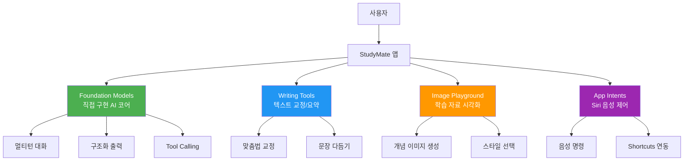
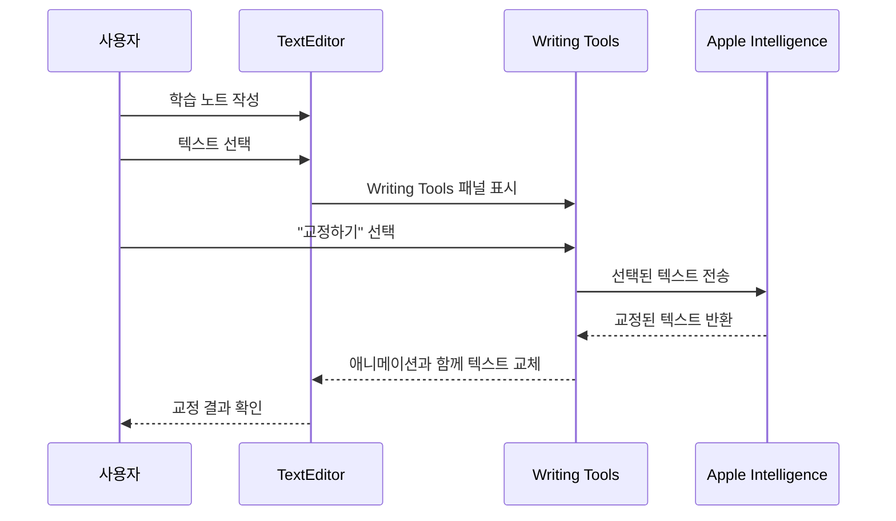
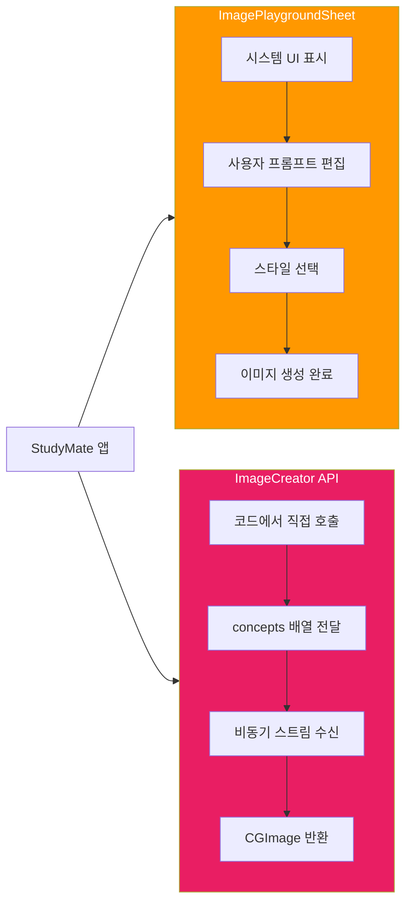
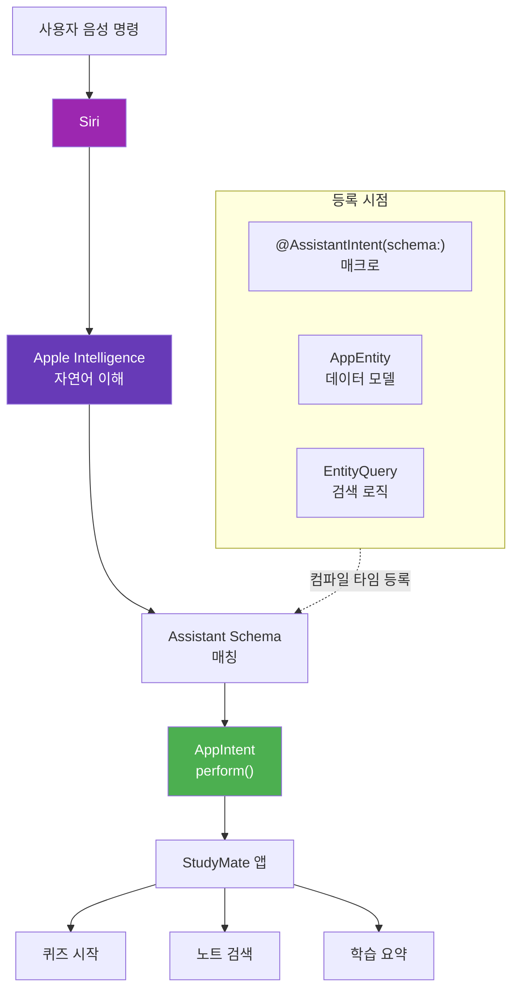
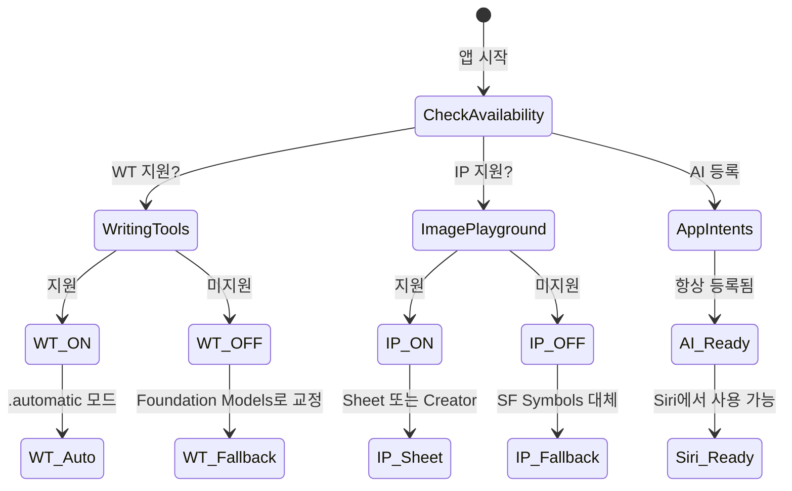

# 03. Apple Intelligence 서비스 통합

> Writing Tools로 학습 노트를 교정하고, Image Playground로 학습 자료를 시각화하며, App Intents로 Siri 음성 제어를 연결한다

## 개요

이 섹션에서는 StudyMate 앱에 Apple Intelligence의 세 가지 시스템 서비스를 통합합니다. [이전 세션](20-ch20-실전-프로젝트-ai-기능-통합-앱-완성/02-02-foundation-models-코어-기능-구현.md)에서 Foundation Models 프레임워크로 직접 구현한 AI 코어 위에, Apple이 미리 만들어놓은 시스템 레벨 AI 기능을 얹어 앱의 완성도를 한 단계 끌어올립니다.

**선수 지식**:
- [Ch11. Writing Tools 통합](11-ch11-writing-tools-통합/01-01-writing-tools-시스템-서비스-개요.md)에서 다룬 WritingToolsBehavior 개념
- [Ch12. Image Playground와 시각 AI](12-ch12-image-playground와-시각-ai/01-01-image-playground-프레임워크-개요.md)의 ImagePlaygroundSheet 사용법
- [Ch13. App Intents와 Siri 연동](13-ch13-app-intents와-siri-연동/01-01-app-intents-프레임워크-개요.md)의 AppIntent 프로토콜 기초

**학습 목표**:
- Writing Tools를 StudyMate의 노트 편집기에 통합하여 학습 노트 교정 기능을 구현한다
- Image Playground Sheet와 ImageCreator API로 학습 자료 시각화 기능을 추가한다
- App Intents와 `@AssistantIntent(schema:)` 매크로로 Siri 음성 제어를 연결한다
- 세 서비스의 가용성 체크와 폴백 전략을 설계한다

## 왜 알아야 할까?

Foundation Models 프레임워크로 AI 채팅과 구조화 출력을 직접 구현하는 건 강력하지만, 사용자가 기대하는 AI 경험은 그것만이 아닙니다. 글을 쓰다가 바로 교정받고(Writing Tools), 개념을 시각적으로 이해하고(Image Playground), "Siri야, 오늘 배운 거 퀴즈 내줘"라고 말하는 것(App Intents) — 이런 시스템 레벨 경험이 합쳐져야 진정한 Apple Intelligence 앱이 됩니다.

직접 만드는 AI와 시스템 AI는 경쟁이 아니라 **보완** 관계입니다. 텍스트 교정처럼 Apple이 이미 잘 만들어놓은 기능을 굳이 재발명할 필요 없고, 여러분의 앱 고유 로직(학습 퀴즈 생성, 개념 설명)은 Foundation Models로 직접 구현하는 게 맞죠. 이 세션에서는 그 경계를 실전 코드로 명확히 그어봅니다.

> 📊 **그림 1**: StudyMate 앱의 AI 서비스 계층 구조



## 핵심 개념

### 개념 1: Writing Tools로 학습 노트 교정

> 💡 **비유**: Writing Tools는 원고를 넘기면 알아서 빨간 펜으로 교정해주는 **편집자**와 같습니다. 여러분이 편집자를 직접 고용(Foundation Models로 교정 로직 구현)할 수도 있지만, Apple이 이미 세계적인 편집자를 무료로 제공한다면 — 당연히 쓰는 게 낫죠.

SwiftUI의 `TextEditor`와 `TextField`는 기본적으로 Writing Tools를 지원합니다. 사용자가 텍스트를 선택하면 교정, 다시 쓰기, 요약 등의 AI 기능이 자동으로 제공되죠. StudyMate에서는 학습 노트 편집기에 이 기능을 활용합니다.

핵심은 `writingToolsBehavior` 수정자입니다. 세 가지 모드가 있어요:

- **`.automatic`** (기본값): 텍스트 뷰에 자동으로 Writing Tools 활성화
- **`.limited`**: 오버레이 기반의 간소화된 편집 경험 제공
- **`.disabled`**: Writing Tools 완전 비활성화

> 📊 **그림 2**: Writing Tools 통합 흐름



StudyMate의 노트 편집 뷰에 Writing Tools를 통합하는 코드를 살펴봅시다:

```swift
import SwiftUI

// MARK: - 학습 노트 편집 뷰
struct StudyNoteEditorView: View {
    @Binding var note: StudyNote
    @State private var isEditing = false
    
    var body: some View {
        VStack(alignment: .leading, spacing: 12) {
            // 노트 제목
            TextField("노트 제목", text: $note.title)
                .font(.title2.bold())
                .writingToolsBehavior(.limited) // 제목은 간소화 모드
            
            Divider()
            
            // 노트 본문 — Writing Tools 완전 지원
            TextEditor(text: $note.content)
                .writingToolsBehavior(.automatic) // 전체 Writing Tools 활성화
                .frame(minHeight: 300)
                .overlay(alignment: .topLeading) {
                    if note.content.isEmpty {
                        Text("학습 내용을 정리해보세요...")
                            .foregroundStyle(.tertiary)
                            .padding(.top, 8)
                            .padding(.leading, 4)
                            .allowsHitTesting(false)
                    }
                }
        }
        .padding()
        .navigationTitle("노트 편집")
    }
}

// MARK: - 학습 노트 모델
struct StudyNote: Identifiable, Codable {
    let id: UUID
    var title: String
    var content: String
    var subject: String
    var lastModified: Date
    
    init(id: UUID = UUID(), title: String = "", content: String = "", subject: String = "") {
        self.id = id
        self.title = title
        self.content = content
        self.subject = subject
        self.lastModified = .now
    }
}
```

커스텀 텍스트 엔진을 쓰는 경우에는 `UIWritingToolsCoordinator`를 직접 사용해야 합니다. UIKit의 `UITextView`라면 가용성을 먼저 체크하고 coordinator를 연결하세요:

```swift
import UIKit

// MARK: - 커스텀 텍스트 뷰에 Writing Tools 연결 (UIKit)
class RichNoteTextView: UITextView {
    
    func configureWritingTools() {
        // 가용성 체크 — 미지원 기기에서는 조용히 스킵
        guard UIWritingToolsCoordinator.isWritingToolsAvailable else {
            print("Writing Tools를 사용할 수 없는 기기입니다")
            return
        }
        
        // coordinator 생성 및 연결
        let coordinator = UIWritingToolsCoordinator(delegate: self)
        addInteraction(coordinator)
    }
}

// MARK: - Writing Tools Delegate
extension RichNoteTextView: UIWritingToolsCoordinator.Delegate {
    func writingToolsCoordinator(
        _ coordinator: UIWritingToolsCoordinator,
        requestsContextsFor scope: UIWritingToolsCoordinator.ContextScope,
        completion: @escaping ([UIWritingToolsCoordinator.Context]) -> Void
    ) {
        // 현재 선택된 텍스트와 주변 문맥을 제공
        let selectedRange = self.selectedRange
        let context = UIWritingToolsCoordinator.Context(
            attributedString: self.attributedText,
            range: selectedRange
        )
        completion([context])
    }
    
    func writingToolsCoordinator(
        _ coordinator: UIWritingToolsCoordinator,
        replace range: NSRange,
        in context: UIWritingToolsCoordinator.Context,
        proposedText replacementText: NSAttributedString,
        reason: UIWritingToolsCoordinator.TextReplacementReason,
        animationParameters: UIWritingToolsCoordinator.AnimationParameters?,
        completion: @escaping (NSAttributedString?) -> Void
    ) {
        // 교정된 텍스트로 교체
        self.textStorage.replaceCharacters(in: range, with: replacementText)
        completion(nil) // nil = 제안된 텍스트 그대로 수락
    }
}
```

> 🔥 **실무 팁**: SwiftUI의 `TextEditor`를 쓴다면 `writingToolsBehavior(.automatic)`만으로 충분합니다. `UIWritingToolsCoordinator`는 커스텀 텍스트 렌더링 엔진(예: 마크다운 에디터, 코드 에디터)을 쓸 때만 필요해요.

### 개념 2: Image Playground로 학습 자료 시각화

> 💡 **비유**: Image Playground는 "이런 느낌의 그림 그려줘"라고 말하면 즉석에서 그려주는 **AI 일러스트레이터**입니다. 학습 앱에서 "광합성 과정"이라고 입력하면, 그에 맞는 시각 자료를 기기 위에서 바로 생성해줍니다.

Image Playground는 두 가지 통합 방식을 제공합니다:

1. **ImagePlaygroundSheet**: 시스템 UI를 그대로 사용하는 Sheet 방식. 사용자가 직접 프롬프트를 수정하고 스타일을 선택할 수 있음
2. **ImageCreator API**: 프로그래매틱하게 이미지를 생성. UI 없이 백그라운드에서 자동 생성 가능

> 📊 **그림 3**: Image Playground 통합 방식 비교



먼저 ImagePlaygroundSheet를 활용한 사용자 주도형 이미지 생성입니다:

```swift
import SwiftUI
import ImagePlayground

// MARK: - 학습 자료 시각화 뷰
struct StudyVisualizerView: View {
    let topic: String
    
    @State private var showPlayground = false
    @State private var generatedImageURL: URL?
    @Environment(\.supportsImagePlayground) private var supportsImagePlayground
    
    var body: some View {
        VStack(spacing: 20) {
            // 생성된 이미지 표시
            if let imageURL = generatedImageURL {
                AsyncImage(url: imageURL) { image in
                    image
                        .resizable()
                        .scaledToFit()
                        .clipShape(RoundedRectangle(cornerRadius: 16))
                } placeholder: {
                    ProgressView("이미지 로딩 중...")
                }
                .frame(maxHeight: 300)
            }
            
            // Image Playground 버튼 — 가용성 체크
            if supportsImagePlayground {
                Button {
                    showPlayground = true
                } label: {
                    Label("학습 자료 이미지 생성", systemImage: "apple.intelligence")
                        .frame(maxWidth: .infinity)
                }
                .buttonStyle(.borderedProminent)
            } else {
                // 폴백: 미지원 기기에서는 기본 아이콘 표시
                ContentUnavailableView(
                    "Image Playground 미지원",
                    systemImage: "photo.badge.exclamationmark",
                    description: Text("이 기기에서는 AI 이미지 생성을 사용할 수 없습니다")
                )
            }
        }
        .padding()
        // Sheet 방식: 시스템 UI를 띄워 사용자가 직접 생성
        .imagePlaygroundSheet(
            isPresented: $showPlayground,
            concepts: buildConcepts(),
            onCompletion: { url in
                generatedImageURL = url
            },
            onCancellation: {
                print("사용자가 이미지 생성을 취소했습니다")
            }
        )
    }
    
    // MARK: - 학습 주제를 Image Playground 개념으로 변환
    private func buildConcepts() -> [ImagePlaygroundConcept] {
        [
            // 짧은 키워드 기반 개념
            .text(topic),
            // 긴 텍스트에서 핵심 개념 자동 추출
            .extracted(
                from: "이 이미지는 \(topic)에 대한 교육 자료입니다. 학생이 쉽게 이해할 수 있는 시각적 표현이 필요합니다.",
                title: topic
            )
        ]
    }
}
```

다음은 ImageCreator API를 사용한 프로그래매틱 생성입니다. 사용자 개입 없이 백그라운드에서 이미지를 만들 수 있어요:

```swift
import ImagePlayground

// MARK: - 프로그래매틱 이미지 생성 서비스
actor StudyImageService {
    
    /// 학습 주제에 맞는 이미지를 자동 생성
    func generateStudyImage(
        for topic: String,
        style: ImagePlaygroundStyle = .illustration
    ) async throws -> CGImage {
        // ImageCreator 인스턴스 생성
        let creator = try await ImageCreator()
        
        // 개념 배열 구성
        let concepts: [ImagePlaygroundConcept] = [
            .text(topic)
        ]
        
        // 비동기 스트림으로 이미지 수신 (limit: 1 = 1장만 생성)
        let images = creator.images(
            for: concepts,
            style: style,
            limit: 1
        )
        
        // 첫 번째 이미지 반환
        for try await image in images {
            return image.cgImage
        }
        
        throw ImageServiceError.generationFailed
    }
    
    enum ImageServiceError: LocalizedError {
        case generationFailed
        case notSupported
        
        var errorDescription: String? {
            switch self {
            case .generationFailed: "이미지 생성에 실패했습니다"
            case .notSupported: "이 기기에서는 Image Playground를 지원하지 않습니다"
            }
        }
    }
}
```

Image Playground에서 지원하는 세 가지 스타일도 알아두세요:

| 스타일 | 열거형 값 | 특징 |
|--------|-----------|------|
| 애니메이션 | `.animation` | 3D 애니메이션 영화 느낌 |
| 일러스트레이션 | `.illustration` | 2D 평면 그래픽 |
| 스케치 | `.sketch` | 손으로 그린 스케치 느낌 |

> ⚠️ **흔한 오해**: Image Playground는 사진처럼 사실적인(photorealistic) 이미지를 생성하지 않습니다. Apple은 의도적으로 일러스트/애니메이션 스타일만 제공하여 딥페이크 우려를 차단했습니다. 사실적 이미지가 필요하다면 별도의 서버 사이드 AI 서비스를 고려하세요.

### 개념 3: App Intents로 Siri 음성 제어 연결

> 💡 **비유**: App Intents는 여러분 앱에 달아주는 **리모컨 수신기**입니다. Siri라는 범용 리모컨이 "퀴즈 시작해줘"라는 신호를 보내면, 앱에 설치된 수신기(Intent)가 이를 받아서 해당 기능을 실행하는 거죠.

App Intents 프레임워크는 앱의 기능을 Siri, Shortcuts, Spotlight에 노출합니다. Apple Intelligence와 결합하면 Siri가 앱의 맥락을 이해하고 자연어로 기능을 실행할 수 있게 됩니다.

> 📊 **그림 4**: App Intents 아키텍처와 Siri 연동 흐름



StudyMate에 필요한 Siri Intent를 구현해봅시다. 먼저 학습 노트를 검색하는 Entity부터:

```swift
import AppIntents

// MARK: - 학습 노트 Entity
struct StudyNoteEntity: AppEntity {
    static var typeDisplayRepresentation: TypeDisplayRepresentation {
        "학습 노트"
    }
    
    static var defaultQuery = StudyNoteEntityQuery()
    
    var id: UUID
    var title: String
    var subject: String
    var lastModified: Date
    
    var displayRepresentation: DisplayRepresentation {
        DisplayRepresentation(
            title: "\(title)",
            subtitle: "\(subject)"
        )
    }
    
    init(from note: StudyNote) {
        self.id = note.id
        self.title = note.title
        self.subject = note.subject
        self.lastModified = note.lastModified
    }
}

// MARK: - Entity Query
struct StudyNoteEntityQuery: EntityStringQuery {
    @Dependency
    private var repository: StudyRepository
    
    // 문자열 검색
    func entities(matching string: String) async throws -> [StudyNoteEntity] {
        let notes = try await repository.searchNotes(query: string)
        return notes.map { StudyNoteEntity(from: $0) }
    }
    
    // ID로 조회
    func entities(for identifiers: [UUID]) async throws -> [StudyNoteEntity] {
        let notes = try await repository.fetchNotes(ids: identifiers)
        return notes.map { StudyNoteEntity(from: $0) }
    }
    
    // 추천 목록 (최근 노트)
    func suggestedEntities() async throws -> [StudyNoteEntity] {
        let recent = try await repository.recentNotes(limit: 5)
        return recent.map { StudyNoteEntity(from: $0) }
    }
}
```

이제 Siri에서 호출할 수 있는 Intent를 정의합니다:

```swift
import AppIntents

// MARK: - "퀴즈 시작해줘" Intent
struct StartStudyQuizIntent: AppIntent {
    static var title: LocalizedStringResource = "학습 퀴즈 시작"
    static var description: IntentDescription = "선택한 주제로 AI 학습 퀴즈를 시작합니다"
    
    // Siri가 물어볼 파라미터
    @Parameter(title: "주제")
    var subject: String
    
    @Parameter(title: "문제 수", default: 5)
    var questionCount: Int
    
    // 앱의 네비게이션 매니저 의존성
    @Dependency
    private var navigationManager: NavigationManager
    
    // Siri에서 실행될 로직
    @MainActor
    func perform() async throws -> some IntentResult & ProvidesDialog {
        // 앱 내부 네비게이션으로 퀴즈 화면 열기
        navigationManager.startQuiz(
            subject: subject,
            questionCount: questionCount
        )
        
        return .result(
            dialog: "\(subject) 주제로 \(questionCount)문제 퀴즈를 시작할게요!"
        )
    }
    
    // Shortcuts 앱에서의 파라미터 요약
    static var parameterSummary: some ParameterSummary {
        Summary("'\(\.$subject)' 주제로 \(\.$questionCount)문제 퀴즈 시작")
    }
}

// MARK: - "오늘 배운 거 요약해줘" Intent
struct SummarizeStudyIntent: AppIntent {
    static var title: LocalizedStringResource = "오늘 학습 요약"
    static var description: IntentDescription = "오늘 학습한 내용을 AI로 요약합니다"
    
    @Dependency
    private var aiService: StudyAIService
    
    @Dependency
    private var repository: StudyRepository
    
    @MainActor
    func perform() async throws -> some IntentResult & ProvidesDialog {
        // 오늘 수정된 노트 가져오기
        let todayNotes = try await repository.todayNotes()
        
        guard !todayNotes.isEmpty else {
            return .result(dialog: "오늘 작성한 학습 노트가 없습니다.")
        }
        
        // Foundation Models로 요약 생성
        let combined = todayNotes.map(\.content).joined(separator: "\n\n")
        let summary = try await aiService.summarize(text: combined)
        
        return .result(dialog: "\(summary)")
    }
}
```

`@AssistantIntent(schema:)` 매크로를 사용하면 Apple Intelligence의 자연어 이해 시스템과 더 깊게 통합할 수 있습니다. 이 매크로는 `schema:` 파라미터로 Assistant Schema에 정의된 도메인(`.system.search`, `.system.createNote` 등)을 지정하는데요, 이렇게 매핑하면 Siri가 자연어를 더 정확히 해석합니다. [Ch13. App Intents와 Siri 연동](13-ch13-app-intents와-siri-연동/01-01-app-intents-프레임워크-개요.md)에서 배운 기본 패턴을 실전에 적용해봅시다:

```swift
import AppIntents

// MARK: - Assistant Schema 매핑 (Apple Intelligence 깊은 통합)
// @AssistantIntent(schema:)는 반드시 schema: 파라미터와 함께 사용
// Apple이 정의한 시스템 스키마(.system.search, .system.createNote 등)와 매핑됨
@AssistantIntent(schema: .system.search)
struct SearchStudyNotesIntent: AppIntent {
    // schema에서 정의된 criteria 파라미터를 자동 매핑
    // .system.search 스키마는 StringSearchCriteria를 기대함
    var criteria: StringSearchCriteria
    
    @Dependency
    private var repository: StudyRepository
    
    @MainActor
    func perform() async throws -> some IntentResult & ReturnsValue<[StudyNoteEntity]> {
        let results = try await repository.searchNotes(
            query: criteria.term
        )
        let entities = results.map { StudyNoteEntity(from: $0) }
        return .result(value: entities)
    }
}
```

> 💡 **알고 계셨나요?**: `@AssistantIntent(schema:)` 매크로를 적용하면 컴파일 타임에 Assistant Schema 메타데이터가 자동 생성됩니다. 이 메타데이터 덕분에 Siri는 "학습 노트 찾아줘"라는 자연어를 `.system.search` 스키마와 매칭하고, `criteria.term`에 검색어를 자동으로 채워넣을 수 있습니다. 일반 `AppIntent`만 사용했다면 정확한 `phrases`를 등록해야 하지만, `@AssistantIntent(schema:)`는 Apple Intelligence가 자연어 변형을 알아서 처리해줍니다.

마지막으로 `AppShortcutsProvider`를 등록하여 Siri에서 바로 발견할 수 있게 합니다:

```swift
import AppIntents

// MARK: - Shortcuts 등록
struct StudyMateShortcuts: AppShortcutsProvider {
    static var appShortcuts: [AppShortcut] {
        AppShortcut(
            intent: StartStudyQuizIntent(),
            phrases: [
                "Start a quiz in \(.applicationName)",
                "\(.applicationName)에서 퀴즈 시작해줘",
                "\(.applicationName) 퀴즈"
            ],
            shortTitle: "학습 퀴즈",
            systemImageName: "brain.head.profile"
        )
        
        AppShortcut(
            intent: SummarizeStudyIntent(),
            phrases: [
                "Summarize today's study in \(.applicationName)",
                "\(.applicationName)에서 오늘 공부 요약해줘"
            ],
            shortTitle: "학습 요약",
            systemImageName: "doc.text.magnifyingglass"
        )
    }
}
```

### 개념 4: 서비스 가용성 통합 관리

세 가지 시스템 서비스 모두 기기별로 지원 여부가 다릅니다. StudyMate에서는 이를 하나의 서비스 레이어에서 통합 관리해야 합니다.

> 📊 **그림 5**: 시스템 서비스 가용성 체크와 폴백 흐름



```swift
import SwiftUI
import ImagePlayground

// MARK: - Apple Intelligence 서비스 가용성 관리
@Observable
final class AppleIntelligenceManager {
    // Writing Tools는 UIKit 레벨에서 체크
    var isWritingToolsAvailable: Bool {
        UIWritingToolsCoordinator.isWritingToolsAvailable
    }
    
    // Image Playground는 환경 변수로 체크 (뷰 내에서)
    // 또는 ImageCreator 생성 시도로 체크
    var isImagePlaygroundAvailable: Bool = false
    
    // App Intents는 항상 사용 가능 (iOS 16+)
    let isAppIntentsAvailable = true
    
    func checkImagePlaygroundSupport() async {
        do {
            let _ = try await ImageCreator()
            isImagePlaygroundAvailable = true
        } catch {
            isImagePlaygroundAvailable = false
        }
    }
    
    /// 현재 기기에서 사용 가능한 AI 서비스 목록
    var availableServices: [AIServiceInfo] {
        var services: [AIServiceInfo] = []
        
        if isWritingToolsAvailable {
            services.append(AIServiceInfo(
                name: "Writing Tools",
                icon: "pencil.and.outline",
                status: .available
            ))
        }
        
        if isImagePlaygroundAvailable {
            services.append(AIServiceInfo(
                name: "Image Playground",
                icon: "apple.intelligence",
                status: .available
            ))
        }
        
        services.append(AIServiceInfo(
            name: "Siri & Shortcuts",
            icon: "mic.fill",
            status: .available
        ))
        
        return services
    }
}

struct AIServiceInfo: Identifiable {
    let id = UUID()
    let name: String
    let icon: String
    let status: ServiceStatus
    
    enum ServiceStatus {
        case available, unavailable, limited
    }
}
```

## 실습: 직접 해보기

세 가지 Apple Intelligence 서비스를 모두 결합한 StudyMate의 학습 노트 상세 화면을 만들어봅시다. 하나의 뷰에서 Writing Tools로 노트를 교정하고, Image Playground로 시각 자료를 생성하며, Siri에서도 접근 가능한 완성된 화면입니다.

```swift
import SwiftUI
import ImagePlayground

// MARK: - 학습 노트 상세 뷰 (모든 AI 서비스 통합)
struct StudyNoteDetailView: View {
    @Bindable var viewModel: StudyNoteDetailViewModel
    @Environment(\.supportsImagePlayground) private var supportsImagePlayground
    
    var body: some View {
        ScrollView {
            VStack(alignment: .leading, spacing: 20) {
                // 섹션 1: 노트 편집 (Writing Tools 자동 지원)
                noteEditorSection
                
                Divider()
                
                // 섹션 2: 시각 자료 생성 (Image Playground)
                visualizationSection
                
                Divider()
                
                // 섹션 3: AI 기능 상태 표시
                aiServicesStatusSection
            }
            .padding()
        }
        .navigationTitle(viewModel.note.title)
        .task {
            await viewModel.checkServiceAvailability()
        }
    }
    
    // MARK: - 노트 편집기 (Writing Tools 통합)
    private var noteEditorSection: some View {
        VStack(alignment: .leading, spacing: 8) {
            Label("학습 노트", systemImage: "note.text")
                .font(.headline)
            
            // TextEditor에 Writing Tools가 자동 활성화됨
            TextEditor(text: $viewModel.note.content)
                .writingToolsBehavior(.automatic)
                .frame(minHeight: 200)
                .padding(8)
                .background(.fill.tertiary)
                .clipShape(RoundedRectangle(cornerRadius: 12))
            
            Text("텍스트를 선택하면 Writing Tools로 교정할 수 있습니다")
                .font(.caption)
                .foregroundStyle(.secondary)
        }
    }
    
    // MARK: - 시각화 섹션 (Image Playground)
    private var visualizationSection: some View {
        VStack(alignment: .leading, spacing: 12) {
            Label("학습 자료 시각화", systemImage: "photo.artframe")
                .font(.headline)
            
            // 생성된 이미지 표시
            if let imageURL = viewModel.generatedImageURL {
                AsyncImage(url: imageURL) { phase in
                    switch phase {
                    case .success(let image):
                        image
                            .resizable()
                            .scaledToFit()
                            .clipShape(RoundedRectangle(cornerRadius: 16))
                            .shadow(radius: 4)
                    case .failure:
                        imageErrorView
                    case .empty:
                        ProgressView("이미지 로딩 중...")
                            .frame(height: 200)
                    @unknown default:
                        EmptyView()
                    }
                }
            }
            
            // Image Playground 버튼
            if supportsImagePlayground {
                Button {
                    viewModel.showImagePlayground = true
                } label: {
                    Label(
                        viewModel.generatedImageURL == nil
                            ? "이미지 생성하기"
                            : "다른 이미지 생성",
                        systemImage: "apple.intelligence"
                    )
                    .frame(maxWidth: .infinity)
                }
                .buttonStyle(.borderedProminent)
                .tint(.orange)
            } else {
                Text("이 기기에서는 Image Playground를 사용할 수 없습니다")
                    .font(.caption)
                    .foregroundStyle(.secondary)
            }
        }
        .imagePlaygroundSheet(
            isPresented: $viewModel.showImagePlayground,
            concepts: viewModel.imageConcepts,
            onCompletion: { url in
                viewModel.generatedImageURL = url
            },
            onCancellation: { }
        )
    }
    
    // MARK: - AI 서비스 상태
    private var aiServicesStatusSection: some View {
        VStack(alignment: .leading, spacing: 8) {
            Label("AI 서비스 상태", systemImage: "cpu")
                .font(.headline)
            
            ForEach(viewModel.aiManager.availableServices) { service in
                HStack {
                    Image(systemName: service.icon)
                        .foregroundStyle(.blue)
                        .frame(width: 24)
                    Text(service.name)
                    Spacer()
                    Image(systemName: "checkmark.circle.fill")
                        .foregroundStyle(.green)
                }
                .font(.subheadline)
            }
        }
        .padding()
        .background(.fill.quaternary)
        .clipShape(RoundedRectangle(cornerRadius: 12))
    }
    
    private var imageErrorView: some View {
        ContentUnavailableView(
            "이미지 로드 실패",
            systemImage: "exclamationmark.triangle",
            description: Text("다시 시도해주세요")
        )
        .frame(height: 200)
    }
}

// MARK: - ViewModel
@Observable
final class StudyNoteDetailViewModel {
    var note: StudyNote
    var showImagePlayground = false
    var generatedImageURL: URL?
    let aiManager = AppleIntelligenceManager()
    
    init(note: StudyNote) {
        self.note = note
    }
    
    /// Image Playground에 전달할 개념 배열
    var imageConcepts: [ImagePlaygroundConcept] {
        [
            .text(note.subject),
            .extracted(from: note.content, title: note.title)
        ]
    }
    
    func checkServiceAvailability() async {
        await aiManager.checkImagePlaygroundSupport()
    }
}
```

앱 진입점에서 의존성을 등록하고, Siri Shortcuts를 활성화하는 코드도 필요합니다:

```swift
import SwiftUI
import AppIntents

// MARK: - 앱 진입점
@main
struct StudyMateApp: App {
    let navigationManager: NavigationManager
    let repository: StudyRepository
    let aiService: StudyAIService
    
    init() {
        // 의존성 생성
        let nav = NavigationManager()
        let repo = StudyRepository()
        let ai = StudyAIService()
        
        // App Intents 의존성 등록
        AppDependencyManager.shared.add(dependency: nav)
        AppDependencyManager.shared.add(dependency: repo)
        AppDependencyManager.shared.add(dependency: ai)
        
        self.navigationManager = nav
        self.repository = repo
        self.aiService = ai
    }
    
    var body: some Scene {
        WindowGroup {
            ContentView()
                .environment(navigationManager)
        }
    }
}
```

```run:swift
// 시뮬레이터에서의 가용성 체크 예시 (개념 코드)
let services = [
    ("Writing Tools", true),
    ("Image Playground", false), // 시뮬레이터에서는 미지원
    ("App Intents", true)
]

for (name, available) in services {
    let status = available ? "사용 가능" : "미지원"
    print("[\(status)] \(name)")
}
print("\n사용 가능한 서비스: \(services.filter(\.1).count)/\(services.count)")
```

```output
[사용 가능] Writing Tools
[미지원] Image Playground
[사용 가능] App Intents

사용 가능한 서비스: 2/3
```

## 더 깊이 알아보기

### Writing Tools의 탄생 — Apple의 AI 교정 전략

Writing Tools는 2024년 WWDC에서 Apple Intelligence의 핵심 기능으로 처음 소개되었습니다. 흥미로운 점은 Apple이 처음부터 "모든 텍스트 뷰에 자동 통합"이라는 전략을 택했다는 거예요. Google의 Gemini나 Microsoft의 Copilot이 별도 앱이나 사이드바로 접근하는 것과 대조적이죠.

이 결정의 배경에는 Apple의 오랜 철학이 있습니다. Steve Jobs가 강조했던 "기술은 사라져야 한다(Technology should disappear)"는 원칙 — AI가 별도의 앱이 아니라 텍스트를 쓰는 모든 곳에 자연스럽게 녹아들어야 한다는 생각이었습니다. 그래서 `UITextView`와 `NSTextView`에 Writing Tools가 기본 탑재되었고, 개발자는 특별한 코드 없이도 혜택을 받게 되었죠.

iOS 26에서는 후속 요청(follow-up requests)이 추가되어, "좀 더 따뜻한 톤으로", "더 공식적으로" 같은 반복적인 톤 조절이 가능해졌습니다. ChatGPT 연동을 통한 새로운 콘텐츠 생성 기능도 추가되었고요.

### Image Playground의 의도적 제한

Apple이 Image Playground에서 사실적 이미지 생성을 의도적으로 배제한 것은 업계에서 큰 화제가 되었습니다. 2024년 당시 Midjourney와 DALL-E가 포토리얼리즘으로 경쟁하는 상황에서, Apple은 "애니메이션, 일러스트, 스케치" 세 가지 스타일만 제공한다고 발표했죠.

이 결정은 Tim Cook이 직접 언급한 "책임 있는 AI"라는 원칙에서 나왔습니다. 딥페이크 생성 가능성을 원천 차단하면서도, 교육 자료나 창작 보조 도구로서의 가치는 충분히 제공하겠다는 전략이었습니다. 실제로 StudyMate 같은 학습 앱에서는 일러스트 스타일이 오히려 더 적합합니다.

### App Intents의 진화 — SiriKit에서 App Intents로

App Intents 프레임워크는 2022년 WWDC에서 처음 발표되었지만, 그 뿌리는 2016년의 SiriKit까지 거슬러 올라갑니다. 초기 SiriKit은 미리 정의된 도메인(메시징, 결제 등)만 지원해서 개발자 불만이 컸어요. "왜 내 앱 기능은 Siri에 연결할 수 없지?"라는 피드백이 수년간 쌓였죠.

Apple은 2018년 Shortcuts를 도입하고, 2022년에 완전히 새로운 App Intents 프레임워크로 전환했습니다. 그리고 2024년, Apple Intelligence와 함께 `@AssistantIntent(schema:)` 매크로가 추가되면서 — Siri가 앱의 맥락을 진정으로 이해하기 시작한 거예요. "학습 노트 검색해줘"라는 자연어가 자동으로 올바른 Intent에 매핑되는 마법이 가능해진 겁니다.

## 흔한 오해와 팁

> ⚠️ **흔한 오해**: "Writing Tools를 쓰려면 특별한 코드를 작성해야 한다" — 아닙니다! SwiftUI의 `TextEditor`와 `TextField`는 기본적으로 Writing Tools를 지원합니다. 코드가 필요한 건 **비활성화**하거나 커스텀 텍스트 엔진을 쓸 때뿐이에요.

> 💡 **알고 계셨나요?**: Image Playground의 `.extracted(from:title:)` 메서드는 긴 텍스트에서 AI가 핵심 개념을 자동 추출합니다. 학습 노트 전체를 넣으면 가장 시각화하기 좋은 개념을 알아서 골라주죠. 직접 키워드를 뽑을 필요가 없습니다.

> 🔥 **실무 팁**: App Intents의 `@Dependency` 프로퍼티 래퍼는 앱 시작 시 `AppDependencyManager.shared.add(dependency:)`로 반드시 등록해야 합니다. 등록하지 않으면 Siri에서 Intent를 실행할 때 런타임 크래시가 발생합니다. 앱의 `init()`에서 모든 의존성을 등록하는 패턴을 꼭 따르세요.

> ⚠️ **흔한 오해**: "Image Playground는 시뮬레이터에서 테스트할 수 있다" — 아닙니다. Image Playground와 ImageCreator는 Apple Intelligence 지원 기기(iPhone 15 Pro 이상)에서만 동작합니다. 시뮬레이터에서는 `supportsImagePlayground` 환경 변수가 항상 `false`이므로, 반드시 폴백 UI를 구현해야 합니다.

> 🔥 **실무 팁**: `AppShortcutsProvider`에 등록하는 `phrases`에 `\(.applicationName)`을 반드시 포함하세요. 이것이 없으면 Siri가 어떤 앱의 기능인지 구분할 수 없어 Shortcut이 제대로 노출되지 않습니다.

## 핵심 정리

| 개념 | 설명 |
|------|------|
| Writing Tools | SwiftUI TextEditor/TextField에 기본 내장된 AI 교정 서비스. `.writingToolsBehavior()` 수정자로 제어 |
| UIWritingToolsCoordinator | 커스텀 텍스트 엔진에 Writing Tools를 연결하는 UIKit coordinator 클래스 |
| ImagePlaygroundSheet | 시스템 UI를 띄워 사용자가 직접 AI 이미지를 생성하는 Sheet 수정자 |
| ImageCreator | UI 없이 프로그래매틱하게 이미지를 생성하는 API. `async` 스트림으로 결과 수신 |
| ImagePlaygroundConcept | `.text()`, `.extracted()`, `.image()` 등 이미지 생성 힌트를 전달하는 타입 |
| AppIntent | Siri/Shortcuts에 노출할 앱 기능을 정의하는 프로토콜. `perform()` 메서드로 실행 |
| @AssistantIntent(schema:) | Apple Intelligence의 Assistant Schema에 매핑하는 매크로. `schema:` 파라미터로 도메인 지정하여 자연어 이해 정확도 향상 |
| AppEntity + EntityQuery | Siri가 앱 데이터를 검색/참조할 수 있게 하는 데이터 모델과 쿼리 시스템 |
| AppShortcutsProvider | Siri에서 바로 발견 가능한 Shortcut을 등록하는 프로토콜 |
| 가용성 체크 | 기기별로 서비스 지원이 다르므로 항상 체크 후 폴백 UI 제공 필수 |

## 다음 섹션 미리보기

Apple Intelligence 시스템 서비스까지 통합한 StudyMate는 이제 꽤 완성도 높은 AI 앱이 되었습니다. 하지만 아직 한 가지 퍼즐 조각이 남아있죠 — [다음 세션](20-ch20-실전-프로젝트-ai-기능-통합-앱-완성/04-04-core-ml-하이브리드-기능-추가.md)에서는 Core ML 커스텀 모델을 Foundation Models와 결합하는 하이브리드 기능을 추가합니다. 학습 노트의 이미지를 Core ML로 분류하고, 그 결과를 Foundation Models에 전달하여 맥락에 맞는 설명을 생성하는 파이프라인을 만들어봅니다.

## 참고 자료

- [Dive deeper into Writing Tools — WWDC25](https://developer.apple.com/videos/play/wwdc2025/265/) - iOS 26의 WritingToolsCoordinator API와 커스텀 텍스트 엔진 통합을 상세히 설명
- [Bringing Image Playground to your app — Create with Swift](https://www.createwithswift.com/bringing-image-playground-to-your-app/) - ImagePlaygroundSheet 통합의 단계별 튜토리얼
- [Generating images programmatically with Image Playground — Create with Swift](https://www.createwithswift.com/generating-images-programmatically-with-image-playground/) - ImageCreator API의 프로그래매틱 사용법과 코드 예제
- [Explore new advances in App Intents — WWDC25](https://developer.apple.com/videos/play/wwdc2025/275/) - App Intents의 최신 기능과 interactive snippets
- [Creating App Intents using Assistant Schemas — Create with Swift](https://www.createwithswift.com/creating-app-intents-using-assistant-schemas/) - @AssistantIntent(schema:) 매크로와 실전 코드 패턴
- [Integrating actions with Siri and Apple Intelligence — Apple Developer](https://developer.apple.com/documentation/appintents/integrating-actions-with-siri-and-apple-intelligence) - Siri 통합의 공식 가이드라인

---
### 🔗 Related Sessions
- [writingtoolsbehavior](11-ch11-writing-tools-통합/01-01-writing-tools-시스템-서비스-개요.md) (prerequisite)
- [imageplaygroundsheet](12-ch12-image-playground와-시각-ai/01-01-image-playground-프레임워크-개요.md) (prerequisite)
- [imagecreator](12-ch12-image-playground와-시각-ai/01-01-image-playground-프레임워크-개요.md) (prerequisite)
- [imageplaygroundconcept](12-ch12-image-playground와-시각-ai/01-01-image-playground-프레임워크-개요.md) (prerequisite)
- [appintent](13-ch13-app-intents와-siri-연동/01-01-app-intents-프레임워크-개요.md) (prerequisite)
- [appentity](13-ch13-app-intents와-siri-연동/01-01-app-intents-프레임워크-개요.md) (prerequisite)
- [entityquery](13-ch13-app-intents와-siri-연동/01-01-app-intents-프레임워크-개요.md) (prerequisite)
- [appshortcutsprovider](13-ch13-app-intents와-siri-연동/01-01-app-intents-프레임워크-개요.md) (prerequisite)
- [studyaiservice](20-ch20-실전-프로젝트-ai-기능-통합-앱-완성/02-02-foundation-models-코어-기능-구현.md) (prerequisite)
