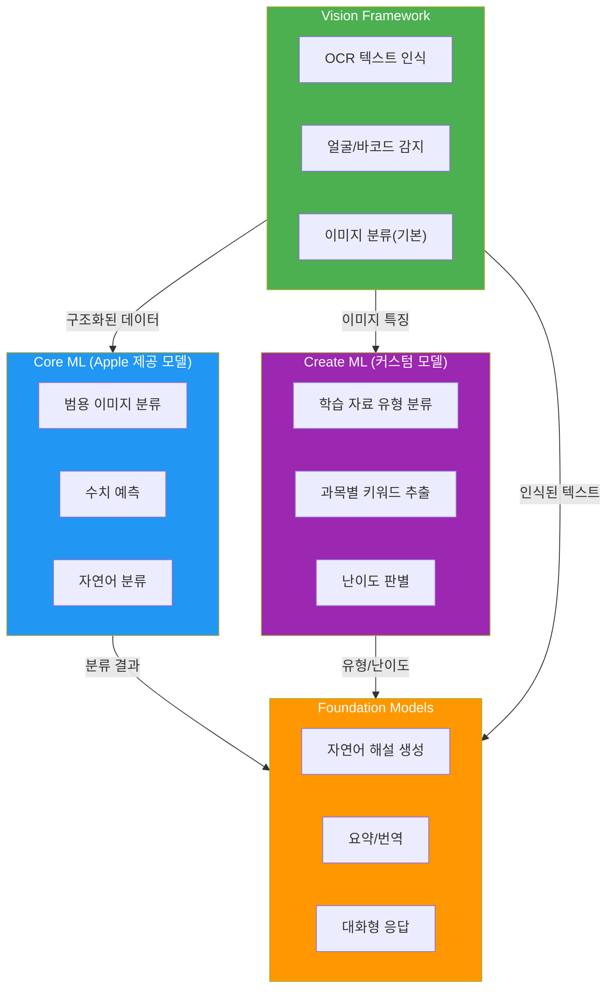
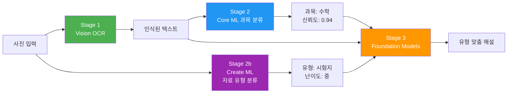
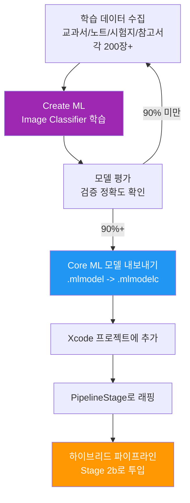
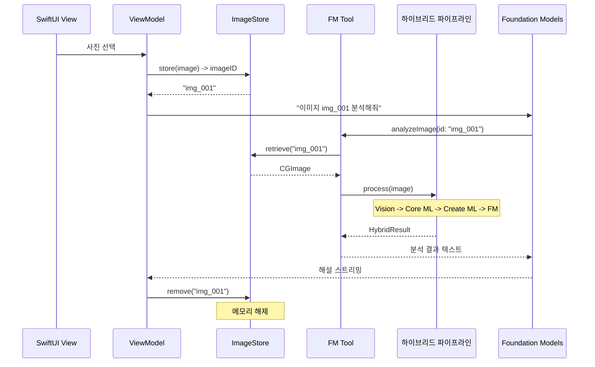
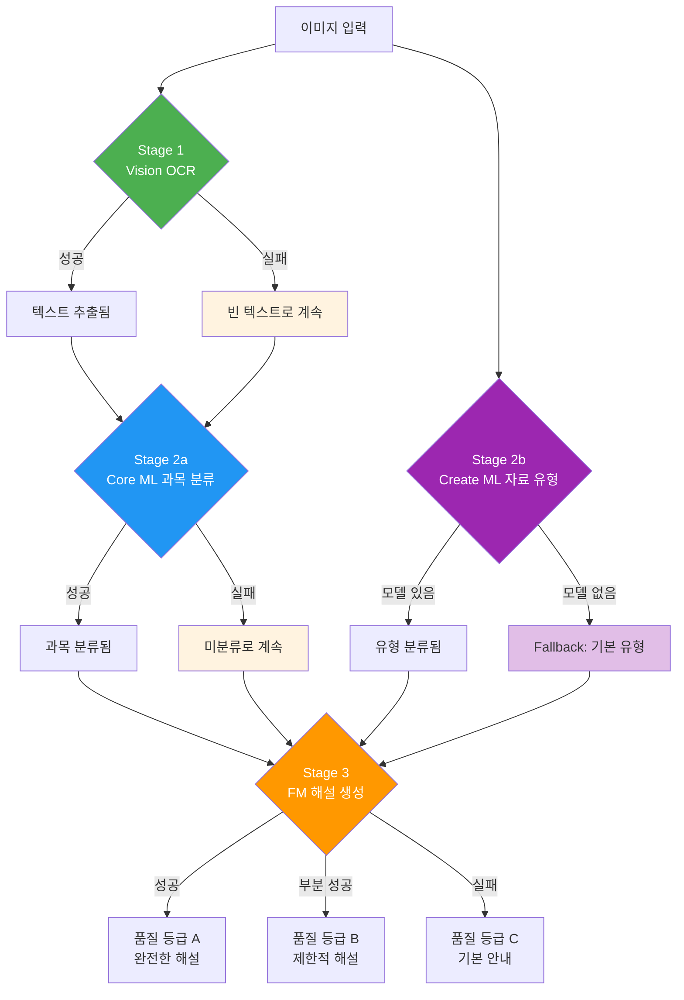
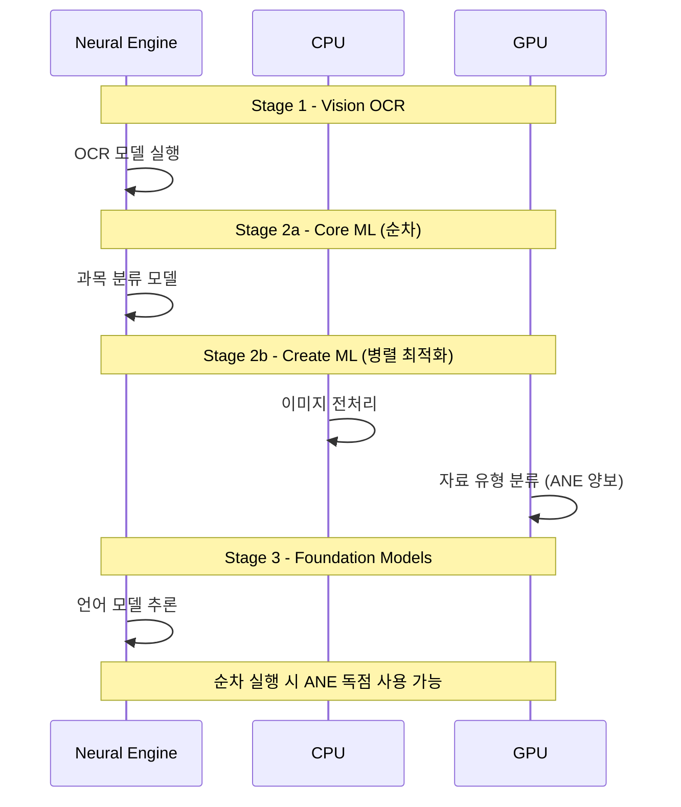
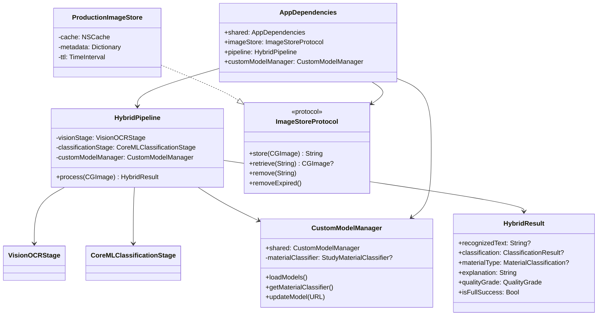

# Core ML 하이브리드 기능 추가

> Foundation Models의 언어 이해력과 Core ML의 특화 모델을 결합하여 하나의 앱에서 시너지를 만들어내는 하이브리드 파이프라인을 구축합니다.

## 개요

이 섹션에서는 [Ch17에서 배운 하이브리드 아키텍처](17-foundation-models-core-ml-하이브리드/01-하이브리드-아키텍처-설계-언제-어떤-모델을-쓸까.md)를 실전 프로젝트에 본격 적용합니다. Foundation Models만으로는 해결하기 어려운 **이미지 분류**, **객체 인식** 같은 특화 작업을 Core ML 모델이 담당하고, 그 결과를 Foundation Models가 받아서 **자연어 해설**을 생성하는 다단계 하이브리드 파이프라인을 만들어보겠습니다.

여기에 더해, [Ch16에서 배운 Create ML](16-create-ml-커스텀-모델-학습/01-create-ml-소개와-학습-워크플로.md)로 직접 학습한 **커스텀 분류 모델**까지 파이프라인에 통합하여, Apple AI 스택의 모든 레이어를 하나의 앱에서 활용하는 경험을 쌓겠습니다.

**선수 지식**: [Ch17의 하이브리드 아키텍처 설계](17-foundation-models-core-ml-하이브리드/01-하이브리드-아키텍처-설계-언제-어떤-모델을-쓸까.md), [Ch16의 Create ML 커스텀 모델 학습](16-create-ml-커스텀-모델-학습/01-create-ml-소개와-학습-워크플로.md), [20.2의 Foundation Models 코어 기능 구현](20-실전-프로젝트-ai-기능-통합-앱-완성/02-foundation-models-코어-기능-구현.md)

**학습 목표**:
- Vision + Core ML + Foundation Models를 연결하는 다단계 파이프라인 설계 및 구현
- Create ML로 학습한 커스텀 모델을 하이브리드 파이프라인에 통합
- 이미지 간접 참조 패턴으로 멀티모달 Tool 안전하게 구현
- Partial Success 전략과 Fallback Chain으로 프로덕션 수준의 에러 처리 구현
- Neural Engine 자원 경합 프로파일링 및 최적화 전략 수립

## 왜 알아야 할까?

Foundation Models는 텍스트 생성과 언어 이해에 탁월하지만, **이미지 분류나 수치 예측** 같은 작업에는 직접 학습된 Core ML 모델이 훨씬 정확합니다. [Ch17](17-foundation-models-core-ml-하이브리드/01-하이브리드-아키텍처-설계-언제-어떤-모델을-쓸까.md)에서 이론적으로 배운 이 원칙을, 이제 실제 앱에 적용할 차례입니다.

StudyMate 앱을 예로 들어보죠. 사용자가 교과서 사진을 찍으면:
1. **Vision**이 텍스트를 인식하고 (OCR)
2. **Core ML 모델**이 "이건 수학 문제야" 하고 과목을 분류하고
3. **Create ML로 학습한 커스텀 모델**이 학습 자료 유형(교과서, 노트, 시험지)을 판별하고
4. **Foundation Models**가 유형에 맞는 최적의 해설을 생성합니다

각 프레임워크가 **가장 잘하는 일**을 맡기는 거예요. 그리고 [Ch16](16-create-ml-커스텀-모델-학습/01-create-ml-소개와-학습-워크플로.md)에서 직접 학습한 모델까지 투입하면, Apple이 제공하지 않는 **도메인 특화 분류**까지 가능해집니다. 이게 바로 하이브리드 파이프라인의 진정한 힘이죠.

> 📊 **그림 1**: Apple AI 스택의 레이어별 역할과 StudyMate 적용



## 핵심 개념

### 개념 1: 다단계 하이브리드 파이프라인 아키텍처

> 💡 **비유**: 종합병원의 진료 프로세스를 떠올려보세요. 접수(Vision)에서 증상을 기록하고, 검사실(Core ML)에서 혈액검사·X-ray 결과를 분석하고, 전문의(Create ML 커스텀 모델)가 특화 소견을 내리고, 최종적으로 주치의(Foundation Models)가 모든 결과를 종합해 환자에게 설명합니다. 각 단계가 **자기 전문 영역**에서 최고의 결과를 내고, 그걸 다음 단계가 이어받죠.

[Ch17](17-foundation-models-core-ml-하이브리드/02-하이브리드-파이프라인-구축-vision-core-ml-fm-연결.md)에서 설계한 파이프라인 패턴을 확장하여, Create ML 커스텀 모델을 추가한 4단계 파이프라인을 구축합니다.

> 📊 **그림 2**: StudyMate의 4단계 하이브리드 파이프라인



각 단계를 Swift 프로토콜로 추상화하면 테스트와 교체가 쉬워집니다:

```swift
import Foundation
import CoreML
import Vision
import CreateML

// MARK: - 파이프라인 단계 프로토콜
protocol PipelineStage {
    associatedtype Input
    associatedtype Output
    var stageName: String { get }
    func process(_ input: Input) async throws -> Output
}

// MARK: - 파이프라인 이벤트 (진행 상태 추적)
enum PipelineEvent {
    case stageStarted(PipelineStageType)
    case stageCompleted(PipelineStageType, duration: TimeInterval)
    case stageFailed(PipelineStageType, Error)
    case stageSkipped(PipelineStageType, reason: String)
}

// MARK: - Stage 1: Vision OCR
struct VisionOCRStage: PipelineStage {
    let stageName = "Vision OCR"
    
    func process(_ image: CGImage) async throws -> RecognizedContent {
        let request = VNRecognizeTextRequest()
        request.recognitionLanguages = ["ko-KR", "en-US"]
        request.recognitionLevel = .accurate
        // 수학 기호 인식 향상을 위한 커스텀 단어 목록
        request.customWords = ["∫", "∑", "∂", "√", "≤", "≥", "π"]
        
        let handler = VNImageRequestHandler(cgImage: image)
        try handler.perform([request])
        
        guard let observations = request.results, !observations.isEmpty else {
            throw PipelineError.visionFailed("텍스트를 인식할 수 없습니다")
        }
        
        // 인식된 텍스트와 바운딩 박스를 구조화
        let texts = observations.compactMap { obs -> RecognizedText? in
            guard let candidate = obs.topCandidates(1).first,
                  candidate.confidence > 0.3 else { return nil }  // 낮은 신뢰도 필터링
            return RecognizedText(
                text: candidate.string,
                confidence: candidate.confidence,
                boundingBox: obs.boundingBox
            )
        }
        
        return RecognizedContent(texts: texts, sourceImageSize: CGSize(
            width: image.width, height: image.height
        ))
    }
}

// MARK: - Stage 2a: Core ML 과목 분류
struct CoreMLClassificationStage: PipelineStage {
    let stageName = "과목 분류"
    let model: SubjectClassifier  // Core ML 생성 클래스
    
    func process(_ content: RecognizedContent) async throws -> ClassificationResult {
        let fullText = content.texts.map(\.text).joined(separator: " ")
        
        guard !fullText.trimmingCharacters(in: .whitespacesAndNewlines).isEmpty else {
            throw PipelineError.classificationFailed("분류할 텍스트가 비어있습니다")
        }
        
        guard let prediction = try? model.prediction(text: fullText) else {
            throw PipelineError.classificationFailed("분류 모델 실행 실패")
        }
        
        return ClassificationResult(
            subject: prediction.label,           // "수학", "과학", "영어" 등
            confidence: prediction.labelProbability[prediction.label] ?? 0,
            recognizedText: fullText
        )
    }
}

// MARK: - Stage 2b: Create ML 커스텀 학습 자료 유형 분류
struct StudyMaterialClassificationStage: PipelineStage {
    let stageName = "자료 유형 분류"
    let imageClassifier: StudyMaterialClassifier  // Create ML로 학습한 모델
    
    func process(_ image: CGImage) async throws -> MaterialClassification {
        // Create ML Image Classifier로 학습한 커스텀 모델 사용
        // 학습 데이터: 교과서/노트/시험지/참고서 이미지 각 200장+
        let input = StudyMaterialClassifierInput(image: image)
        
        guard let prediction = try? imageClassifier.prediction(input: input) else {
            throw PipelineError.classificationFailed("자료 유형 분류 실패")
        }
        
        // 난이도 추정 (모델의 보조 출력 또는 휴리스틱)
        let difficulty = estimateDifficulty(
            materialType: prediction.label,
            probabilities: prediction.labelProbability
        )
        
        return MaterialClassification(
            materialType: MaterialType(rawValue: prediction.label) ?? .unknown,
            confidence: prediction.labelProbability[prediction.label] ?? 0,
            estimatedDifficulty: difficulty
        )
    }
    
    private func estimateDifficulty(
        materialType: String,
        probabilities: [String: Double]
    ) -> DifficultyLevel {
        // 시험지는 보통 중~상, 교과서는 기본, 노트는 요약본
        switch materialType {
        case "exam_paper": return .intermediate
        case "textbook": return .basic
        case "notebook": return .summary
        case "reference": return .advanced
        default: return .unknown
        }
    }
}

// MARK: - 자료 유형 모델 타입 정의
enum MaterialType: String, Codable {
    case textbook = "textbook"
    case notebook = "notebook"
    case examPaper = "exam_paper"
    case reference = "reference"
    case unknown = "unknown"
    
    var displayName: String {
        switch self {
        case .textbook: return "교과서"
        case .notebook: return "필기 노트"
        case .examPaper: return "시험지"
        case .reference: return "참고서"
        case .unknown: return "기타"
        }
    }
    
    /// Foundation Models에 전달할 해설 스타일 힌트
    var explanationStyle: String {
        switch self {
        case .textbook: return "교과서 내용을 쉽게 풀어서 설명해주세요"
        case .notebook: return "필기 내용을 정리하고 빠진 부분을 보충해주세요"
        case .examPaper: return "문제 풀이 과정을 단계별로 상세히 설명해주세요"
        case .reference: return "핵심 개념을 추출하고 연관 개념과 연결해주세요"
        case .unknown: return "내용을 분석하고 학습에 도움이 되는 해설을 작성해주세요"
        }
    }
}

enum DifficultyLevel: String, Codable {
    case basic, summary, intermediate, advanced, unknown
}

struct MaterialClassification {
    let materialType: MaterialType
    let confidence: Double
    let estimatedDifficulty: DifficultyLevel
}
```

> 🔥 **실무 팁**: 각 Stage를 프로토콜로 분리하면, 테스트 시 Mock Stage를 주입해서 특정 단계만 독립적으로 검증할 수 있습니다. 특히 Create ML 커스텀 모델은 학습 데이터에 따라 정확도가 크게 달라지므로, Mock을 활용한 단위 테스트가 필수입니다.

### 개념 2: Create ML 커스텀 모델의 파이프라인 통합

> 💡 **비유**: 대형 마트에서 파는 기성복(Apple 제공 Core ML 모델)도 좋지만, 정말 잘 맞는 옷은 맞춤 제작(Create ML 커스텀 모델)이죠. StudyMate 앱에서 "이 사진이 교과서인지 시험지인지"를 판별하는 건 Apple이 미리 학습해둔 모델에는 없는, **우리 앱만의 도메인 지식**입니다.

[Ch16](16-create-ml-커스텀-모델-학습/02-이미지-분류-모델-학습.md)에서 Create ML로 이미지 분류 모델을 학습하는 방법을 배웠습니다. 이제 그 모델을 실제 파이프라인에 통합하는 패턴을 살펴보겠습니다.

> 📊 **그림 3**: Create ML 모델 학습부터 파이프라인 투입까지



커스텀 모델을 파이프라인에 안전하게 통합하려면 **모델 버전 관리**와 **Fallback 전략**이 핵심입니다:

```swift
import CoreML

// MARK: - 커스텀 모델 관리자
actor CustomModelManager {
    static let shared = CustomModelManager()
    
    private var materialClassifier: StudyMaterialClassifier?
    private var modelVersion: String = "1.0"
    
    /// 모델 로드 (앱 시작 시 또는 lazy)
    func loadModels() async throws {
        let config = MLModelConfiguration()
        config.computeUnits = .cpuAndNeuralEngine  // ANE 활용
        
        // Create ML로 학습한 커스텀 모델 로드
        do {
            materialClassifier = try StudyMaterialClassifier(configuration: config)
            print("커스텀 모델 로드 성공 (v\(modelVersion))")
        } catch {
            print("커스텀 모델 로드 실패: \(error)")
            // Fallback: 모델 없이도 파이프라인 동작 가능
        }
    }
    
    /// 모델 가용 여부 확인
    var isMaterialClassifierAvailable: Bool {
        materialClassifier != nil
    }
    
    /// 안전한 모델 접근 (없으면 nil 반환, 파이프라인은 계속 진행)
    func getMaterialClassifier() -> StudyMaterialClassifier? {
        materialClassifier
    }
    
    /// 모델 업데이트 (OTA 또는 앱 업데이트 시)
    func updateModel(from url: URL) async throws {
        let compiledURL = try MLModel.compileModel(at: url)
        let config = MLModelConfiguration()
        config.computeUnits = .cpuAndNeuralEngine
        
        let newModel = try StudyMaterialClassifier(
            contentsOf: compiledURL,
            configuration: config
        )
        
        // 아토믹 스왑 — 기존 모델 요청 처리 후 교체
        materialClassifier = newModel
        modelVersion = "1.1"
    }
}
```

Create ML로 학습한 모델이 없거나 로드에 실패해도 파이프라인은 정상 동작해야 합니다. 이것이 바로 다음 개념인 Partial Success와 연결되는 핵심 설계입니다.

### 개념 3: 이미지 간접 참조 패턴

> 💡 **비유**: 도서관에서 책을 빌릴 때, 책 전체를 복사하지 않고 **대출 카드(ID)**만 가지고 다니죠? 이미지도 마찬가지입니다. Foundation Models의 Tool에 이미지 바이너리를 직접 전달하면 메모리와 성능에 문제가 생깁니다. 대신 **이미지 ID**만 전달하고, 필요할 때 저장소에서 꺼내 쓰는 패턴이에요.

Foundation Models의 Tool 호출 시 이미지 데이터를 직접 넘기는 것은 비효율적이고 위험합니다. [20.2](20-실전-프로젝트-ai-기능-통합-앱-완성/02-foundation-models-코어-기능-구현.md)에서 구현한 Tool 시스템에 `ImageStoreProtocol`을 통한 간접 참조를 결합합니다.

> 📊 **그림 4**: 이미지 간접 참조를 활용한 하이브리드 Tool 호출 흐름



```swift
import FoundationModels

// MARK: - 이미지 저장소 프로토콜
protocol ImageStoreProtocol: Sendable {
    func store(_ image: CGImage) -> String
    func retrieve(_ id: String) -> CGImage?
    func remove(_ id: String)
    func removeExpired()  // TTL 기반 자동 정리
}

// MARK: - 프로덕션 이미지 저장소 (NSCache 기반)
actor ProductionImageStore: ImageStoreProtocol {
    private let cache = NSCache<NSString, CGImageWrapper>()
    private var metadata: [String: Date] = [:]  // 저장 시각 추적
    private let ttl: TimeInterval = 300  // 5분 TTL
    
    init() {
        cache.countLimit = 20       // 최대 20장
        cache.totalCostLimit = 100_000_000  // ~100MB
    }
    
    func store(_ image: CGImage) -> String {
        let id = "img_\(UUID().uuidString.prefix(8))"
        let wrapper = CGImageWrapper(image: image)
        let cost = image.width * image.height * 4  // RGBA 바이트 추정
        cache.setObject(wrapper, forKey: id as NSString, cost: cost)
        metadata[id] = Date()
        return id
    }
    
    func retrieve(_ id: String) -> CGImage? {
        cache.object(forKey: id as NSString)?.image
    }
    
    func remove(_ id: String) {
        cache.removeObject(forKey: id as NSString)
        metadata.removeValue(forKey: id)
    }
    
    func removeExpired() {
        let now = Date()
        let expired = metadata.filter { now.timeIntervalSince($0.value) > ttl }
        for (id, _) in expired {
            remove(id)
        }
    }
}

// NSCache는 클래스 타입만 저장 가능
final class CGImageWrapper {
    let image: CGImage
    init(image: CGImage) { self.image = image }
}

// MARK: - Foundation Models Tool에서 간접 참조 사용
@Generable
struct ImageAnalysisTool {
    @Guide(description: "이미지 ID를 받아 OCR + 분류 + 해설을 수행합니다")
    static func analyzeImage(imageID: String) async throws -> String {
        guard let image = await AppDependencies.shared.imageStore.retrieve(imageID) else {
            return "이미지를 찾을 수 없습니다: \(imageID)"
        }
        
        // 4단계 하이브리드 파이프라인 실행
        let pipeline = HybridPipeline.shared
        let result = await pipeline.process(image)
        
        // 사용 후 메모리 해제
        await AppDependencies.shared.imageStore.remove(imageID)
        
        // 결과 포맷팅 (Partial Success 정보 포함)
        var response = result.explanation
        if !result.isFullSuccess {
            response += "\n\n⚠️ 일부 분석 단계가 완료되지 않았습니다: "
            response += result.warnings.joined(separator: ", ")
        }
        
        return response
    }
}
```

Apple의 Foundation Models 프레임워크가 Tool을 호출할 때 **문자열 기반 인자**만 전달하기 때문에, 이미지 같은 바이너리 데이터는 반드시 이런 간접 참조 방식을 써야 합니다. 프로토타입에서는 `InMemoryImageStore`(단순 딕셔너리)도 괜찮지만, 프로덕션에서는 위의 `ProductionImageStore`처럼 `NSCache` + TTL 조합이 필수입니다. 메모리 압박 시 자동 제거되어 OOM 크래시를 방지하죠.

### 개념 4: Partial Success와 Fallback Chain

> 💡 **비유**: 비행기에는 엔진이 여러 개 있어서, 하나가 고장 나도 나머지로 비행을 계속할 수 있죠. 하이브리드 파이프라인도 마찬가지입니다. OCR이 실패하면? Create ML 모델이 없으면? 각 단계의 실패를 **격리**해서 가능한 만큼 결과를 돌려주는 전략이 Partial Success입니다.

[Ch17의 에러 처리 전략](17-foundation-models-core-ml-하이브리드/03-에러-처리와-fallback-전략.md)에서 배운 Fallback 패턴을 실전에 적용합니다. 단순 try-catch를 넘어, **단계별 Fallback Chain**과 **품질 등급**까지 구현해보겠습니다.

> 📊 **그림 5**: Partial Success + Fallback Chain 흐름



```swift
// MARK: - 파이프라인 결과 (Partial Success + 품질 등급)
struct HybridResult {
    let recognizedText: String?
    let classification: ClassificationResult?
    let materialType: MaterialClassification?   // Create ML 결과
    let explanation: String
    let completedStages: Set<PipelineStageType>
    let warnings: [String]
    let qualityGrade: QualityGrade
    let processingTime: TimeInterval
    
    var isFullSuccess: Bool {
        completedStages.count == PipelineStageType.allCases.count
    }
}

enum PipelineStageType: String, CaseIterable {
    case vision, subjectClassification, materialClassification, generation
}

/// 결과 품질 등급 — UI에서 사용자에게 신뢰도 표시
enum QualityGrade: String {
    case excellent = "A"   // 모든 단계 성공
    case good = "B"        // 핵심 단계(OCR + FM) 성공
    case limited = "C"     // FM만 성공 (일반 응답)
    case failed = "F"      // 모든 단계 실패
    
    var userMessage: String {
        switch self {
        case .excellent: return "높은 정확도의 분석 결과입니다"
        case .good: return "주요 분석이 완료되었습니다"
        case .limited: return "일부 분석이 제한되었습니다"
        case .failed: return "분석에 실패했습니다. 다시 시도해주세요"
        }
    }
}

// MARK: - Partial Success 파이프라인 (확장)
class HybridPipeline {
    static let shared = HybridPipeline()
    
    private let visionStage = VisionOCRStage()
    private let classificationStage: CoreMLClassificationStage
    private let customModelManager = CustomModelManager.shared
    
    init() {
        let config = MLModelConfiguration()
        config.computeUnits = .cpuAndNeuralEngine
        let model = try! SubjectClassifier(configuration: config)
        self.classificationStage = CoreMLClassificationStage(model: model)
    }
    
    func process(_ image: CGImage) async -> HybridResult {
        let startTime = CFAbsoluteTimeGetCurrent()
        var completedStages: Set<PipelineStageType> = []
        var warnings: [String] = []
        
        // Stage 1: Vision OCR (실패해도 계속)
        var recognizedContent: RecognizedContent?
        do {
            recognizedContent = try await visionStage.process(image)
            completedStages.insert(.vision)
        } catch {
            warnings.append("텍스트 인식 실패: \(error.localizedDescription)")
        }
        
        // Stage 2a: Core ML 과목 분류 (Stage 1 실패 시 스킵)
        var classification: ClassificationResult?
        if let content = recognizedContent {
            do {
                classification = try await classificationStage.process(content)
                completedStages.insert(.subjectClassification)
            } catch {
                warnings.append("과목 분류 실패: \(error.localizedDescription)")
            }
        }
        
        // Stage 2b: Create ML 자료 유형 분류 (병렬 가능, 독립 단계)
        var materialResult: MaterialClassification?
        if let classifier = await customModelManager.getMaterialClassifier() {
            let materialStage = StudyMaterialClassificationStage(
                imageClassifier: classifier
            )
            do {
                materialResult = try await materialStage.process(image)
                completedStages.insert(.materialClassification)
            } catch {
                warnings.append("자료 유형 분류 실패: \(error.localizedDescription)")
            }
        } else {
            // Fallback: 커스텀 모델 없이도 기본 유형으로 진행
            materialResult = MaterialClassification(
                materialType: .unknown,
                confidence: 0,
                estimatedDifficulty: .unknown
            )
            warnings.append("커스텀 분류 모델 미사용 (기본 모드)")
        }
        
        // Stage 3: Foundation Models 해설 (항상 시도, 모든 가용 정보 활용)
        let explanation = await generateExplanation(
            text: recognizedContent?.texts.map(\.text).joined(separator: "\n"),
            classification: classification,
            material: materialResult
        )
        completedStages.insert(.generation)
        
        let elapsed = CFAbsoluteTimeGetCurrent() - startTime
        let grade = calculateQualityGrade(completedStages)
        
        return HybridResult(
            recognizedText: recognizedContent?.texts.map(\.text).joined(separator: "\n"),
            classification: classification,
            materialType: materialResult,
            explanation: explanation,
            completedStages: completedStages,
            warnings: warnings,
            qualityGrade: grade,
            processingTime: elapsed
        )
    }
    
    private func calculateQualityGrade(
        _ completed: Set<PipelineStageType>
    ) -> QualityGrade {
        if completed.count == PipelineStageType.allCases.count {
            return .excellent
        } else if completed.contains(.vision) && completed.contains(.generation) {
            return .good
        } else if completed.contains(.generation) {
            return .limited
        } else {
            return .failed
        }
    }
    
    private func generateExplanation(
        text: String?,
        classification: ClassificationResult?,
        material: MaterialClassification?
    ) async -> String {
        let session = LanguageModelSession()
        
        // 자료 유형에 따른 프롬프트 커스터마이징
        let styleHint = material?.materialType.explanationStyle
            ?? "내용을 분석하고 학습 해설을 작성해주세요"
        
        var prompt = "\(styleHint)\n\n"
        
        if let subject = classification?.subject {
            prompt += "과목: \(subject)\n"
        }
        if let materialType = material?.materialType, materialType != .unknown {
            prompt += "자료 유형: \(materialType.displayName)\n"
        }
        if let text = text {
            prompt += "내용:\n\(text)\n"
        } else {
            prompt += "이미지에서 텍스트를 추출하지 못했습니다. 일반적인 학습 조언을 제공해주세요.\n"
        }
        
        do {
            let response = try await session.respond(to: prompt)
            return response.content
        } catch {
            return "해설을 생성하지 못했습니다. 다시 시도해주세요."
        }
    }
}
```

이 패턴의 핵심은 **각 단계의 실패가 다음 단계로 전파되되, 전체를 중단시키지는 않는다**는 점입니다. Stage 1이 실패하면 Stage 2a는 건너뛰지만, Stage 2b(이미지 기반)는 독립적으로 실행됩니다. Stage 3은 가용한 정보로 최선의 결과를 만들어내고, `QualityGrade`로 사용자에게 결과의 신뢰도를 투명하게 전달합니다.

### 개념 5: Neural Engine 자원 경합과 성능 최적화

Vision, Core ML, Create ML 모델, Foundation Models 모두 Apple Neural Engine(ANE)을 사용합니다. 4단계 파이프라인에서 ANE 경합을 관리하는 전략이 중요해요.

> 📊 **그림 6**: ANE 자원 할당 전략



```swift
// MARK: - Compute Unit 전략별 모델 설정
struct ComputeStrategy {
    /// 순차 파이프라인: 모든 모델이 ANE를 풀로 사용
    static func sequential() -> [PipelineStageType: MLComputeUnits] {
        [
            .vision: .all,                  // ANE 우선
            .subjectClassification: .all,   // ANE 우선
            .materialClassification: .all,  // ANE 우선
            // Foundation Models는 시스템이 자동 관리
        ]
    }
    
    /// 병렬 파이프라인: Stage 2a와 2b가 동시 실행될 때
    static func parallel() -> [PipelineStageType: MLComputeUnits] {
        [
            .vision: .all,                          // Stage 1은 단독
            .subjectClassification: .cpuAndNeuralEngine,  // ANE 공유
            .materialClassification: .cpuAndGPU,          // GPU로 분산
        ]
    }
}

// MARK: - 파이프라인 성능 프로파일러
struct PipelineProfiler {
    struct StageMetrics {
        let stage: PipelineStageType
        let duration: TimeInterval
        let computeUnit: String  // 실제 사용된 컴퓨트 유닛
    }
    
    private var metrics: [StageMetrics] = []
    
    mutating func record(_ stage: PipelineStageType, duration: TimeInterval, unit: String) {
        metrics.append(StageMetrics(stage: stage, duration: duration, computeUnit: unit))
    }
    
    func summary() -> String {
        var lines = ["📊 파이프라인 성능 요약"]
        let total = metrics.reduce(0) { $0 + $1.duration }
        
        for m in metrics {
            let pct = (m.duration / total) * 100
            lines.append("  \(m.stage.rawValue): \(String(format: "%.0fms", m.duration * 1000)) (\(String(format: "%.0f%%", pct))) [\(m.computeUnit)]")
        }
        lines.append("  총 소요: \(String(format: "%.0fms", total * 1000))")
        return lines.joined(separator: "\n")
    }
}
```

> 💡 **알고 계셨나요?**: Apple Neural Engine은 iPhone 15 Pro 기준 초당 35조 회 연산(TOPS)을 처리합니다. 순차 파이프라인이라면 각 단계가 ANE를 온전히 활용할 수 있어 오히려 효율적입니다. Stage 2a와 2b를 병렬로 돌리면 총 시간은 줄지만, ANE 경합으로 인해 개별 단계는 느려질 수 있어요. Instruments의 Core ML Performance 도구로 실측해서 결정하는 것이 가장 좋습니다.

### 개념 6: 클래스 구조와 의존성 관리

> 📊 **그림 7**: 확장된 하이브리드 파이프라인의 전체 클래스 구조



[20.1의 프로젝트 설계](20-실전-프로젝트-ai-기능-통합-앱-완성/01-프로젝트-설계와-아키텍처.md)에서 만든 `AppDependencies`에 확장된 하이브리드 파이프라인을 통합합니다:

```swift
// MARK: - AppDependencies 확장
extension AppDependencies {
    func setupHybridPipeline() async {
        // 프로덕션 이미지 저장소 등록
        let imageStore = ProductionImageStore()
        self.register(imageStore as ImageStoreProtocol)
        
        // Create ML 커스텀 모델 로드
        try? await CustomModelManager.shared.loadModels()
        
        // 하이브리드 파이프라인 등록
        let pipeline = HybridPipeline()
        self.register(pipeline)
    }
}
```

## 실습: 직접 해보기

StudyMate 앱에 하이브리드 분석 화면을 추가해보겠습니다. 사용자가 교과서 사진을 찍으면, 4단계 파이프라인을 거쳐 AI 해설이 스트리밍되는 화면입니다. 품질 등급과 Create ML 분류 결과도 함께 표시합니다.

```swift
import SwiftUI
import PhotosUI
import FoundationModels

// MARK: - ViewModel
@Observable
class HybridAnalysisViewModel {
    var selectedImage: CGImage?
    var result: HybridResult?
    var isProcessing = false
    var streamingText = ""
    var stageProgress: [PipelineStageType: StageStatus] = [:]
    var profilingResult: String?
    
    enum StageStatus: String {
        case pending = "대기"
        case running = "실행 중"
        case success = "완료"
        case failed = "실패"
        case skipped = "건너뜀"
    }
    
    private let pipeline = AppDependencies.shared.resolve(HybridPipeline.self)
    private let imageStore = AppDependencies.shared.resolve(ImageStoreProtocol.self)
    
    func analyze() async {
        guard let image = selectedImage else { return }
        isProcessing = true
        stageProgress = Dictionary(
            uniqueKeysWithValues: PipelineStageType.allCases.map { ($0, .pending) }
        )
        
        let imageID = await imageStore.store(image)
        
        // 파이프라인 실행
        stageProgress[.vision] = .running
        let result = await pipeline.process(image)
        
        // 단계별 상태 반영
        for stage in PipelineStageType.allCases {
            if result.completedStages.contains(stage) {
                stageProgress[stage] = .success
            } else if stage == .materialClassification,
                      !(await CustomModelManager.shared.isMaterialClassifierAvailable) {
                stageProgress[stage] = .skipped
            } else {
                stageProgress[stage] = .failed
            }
        }
        
        self.result = result
        self.streamingText = result.explanation
        self.profilingResult = String(
            format: "처리 시간: %.0fms | 품질: %@",
            result.processingTime * 1000,
            result.qualityGrade.rawValue
        )
        isProcessing = false
        
        await imageStore.remove(imageID)
    }
}

// MARK: - SwiftUI 화면
struct HybridAnalysisView: View {
    @State private var viewModel = HybridAnalysisViewModel()
    @State private var photosItem: PhotosPickerItem?
    
    var body: some View {
        ScrollView {
            VStack(spacing: 20) {
                // 이미지 선택 영역
                PhotosPicker(selection: $photosItem, matching: .images) {
                    if viewModel.selectedImage != nil {
                        Text("다른 사진 선택")
                    } else {
                        Label("교과서 사진 선택", systemImage: "camera.fill")
                            .font(.headline)
                            .frame(maxWidth: .infinity)
                            .frame(height: 200)
                            .background(.quaternary)
                            .clipShape(RoundedRectangle(cornerRadius: 12))
                    }
                }
                
                // 파이프라인 진행 상태
                if viewModel.isProcessing || viewModel.result != nil {
                    PipelineProgressView(stages: viewModel.stageProgress)
                }
                
                // 품질 등급 배지
                if let result = viewModel.result {
                    QualityBadgeView(grade: result.qualityGrade)
                }
                
                // 자료 유형 정보 (Create ML 결과)
                if let material = viewModel.result?.materialType,
                   material.materialType != .unknown {
                    HStack {
                        Label(material.materialType.displayName,
                              systemImage: "doc.text.magnifyingglass")
                        Spacer()
                        Text("신뢰도: \(String(format: "%.0f%%", material.confidence * 100))")
                            .foregroundStyle(.secondary)
                    }
                    .padding()
                    .background(.purple.opacity(0.1))
                    .clipShape(RoundedRectangle(cornerRadius: 8))
                }
                
                // 경고 메시지 (Partial Success)
                if let result = viewModel.result, !result.warnings.isEmpty {
                    ForEach(result.warnings, id: \.self) { warning in
                        Label(warning, systemImage: "exclamationmark.triangle")
                            .foregroundStyle(.orange)
                            .font(.caption)
                    }
                }
                
                // AI 해설 결과
                if !viewModel.streamingText.isEmpty {
                    VStack(alignment: .leading, spacing: 8) {
                        Text("AI 학습 해설")
                            .font(.headline)
                        Text(viewModel.streamingText)
                            .textSelection(.enabled)
                    }
                    .padding()
                    .background(.background.secondary)
                    .clipShape(RoundedRectangle(cornerRadius: 12))
                }
                
                // 프로파일링 정보
                if let profiling = viewModel.profilingResult {
                    Text(profiling)
                        .font(.caption2)
                        .foregroundStyle(.secondary)
                }
            }
            .padding()
        }
        .navigationTitle("하이브리드 분석")
        .task(id: photosItem) {
            if let data = try? await photosItem?.loadTransferable(type: Data.self),
               let source = CGImageSourceCreateWithData(data as CFData, nil),
               let cgImage = CGImageSourceCreateImageAtIndex(source, 0, nil) {
                viewModel.selectedImage = cgImage
                await viewModel.analyze()
            }
        }
    }
}

// MARK: - 품질 등급 배지 뷰
struct QualityBadgeView: View {
    let grade: QualityGrade
    
    var body: some View {
        HStack {
            Text("분석 품질")
                .font(.subheadline)
            Spacer()
            Text(grade.rawValue)
                .font(.title3.bold())
                .foregroundStyle(gradeColor)
                .padding(.horizontal, 12)
                .padding(.vertical, 4)
                .background(gradeColor.opacity(0.15))
                .clipShape(Capsule())
            Text(grade.userMessage)
                .font(.caption)
                .foregroundStyle(.secondary)
        }
        .padding()
        .background(.background.secondary)
        .clipShape(RoundedRectangle(cornerRadius: 8))
    }
    
    private var gradeColor: Color {
        switch grade {
        case .excellent: .green
        case .good: .blue
        case .limited: .orange
        case .failed: .red
        }
    }
}

// MARK: - 파이프라인 진행 상태 뷰
struct PipelineProgressView: View {
    let stages: [PipelineStageType: HybridAnalysisViewModel.StageStatus]
    
    var body: some View {
        VStack(spacing: 8) {
            HStack(spacing: 4) {
                stageChip(.vision, label: "OCR", icon: "eye")
                Image(systemName: "arrow.right").foregroundStyle(.secondary)
                stageChip(.subjectClassification, label: "과목", icon: "tag")
            }
            HStack(spacing: 4) {
                stageChip(.materialClassification, label: "유형", icon: "doc.text")
                Image(systemName: "arrow.right").foregroundStyle(.secondary)
                stageChip(.generation, label: "해설", icon: "sparkles")
            }
        }
        .font(.caption)
    }
    
    @ViewBuilder
    private func stageChip(
        _ stage: PipelineStageType,
        label: String,
        icon: String
    ) -> some View {
        let status = stages[stage] ?? .pending
        Label(label, systemImage: icon)
            .padding(.horizontal, 8)
            .padding(.vertical, 4)
            .background(status.color.opacity(0.15))
            .foregroundStyle(status.color)
            .clipShape(Capsule())
    }
}

extension HybridAnalysisViewModel.StageStatus {
    var color: Color {
        switch self {
        case .pending: .secondary
        case .running: .blue
        case .success: .green
        case .failed: .red
        case .skipped: .orange
        }
    }
}
```

```run:swift
// 파이프라인 결과 시뮬레이션 — Partial Success 시나리오
let fullResult = HybridResult(
    recognizedText: "x² + 5x + 6 = 0",
    classification: ClassificationResult(
        subject: "수학", confidence: 0.94,
        recognizedText: "x² + 5x + 6 = 0"
    ),
    materialType: MaterialClassification(
        materialType: .examPaper, confidence: 0.87,
        estimatedDifficulty: .intermediate
    ),
    explanation: "이 이차방정식은 인수분해로 풀 수 있습니다...",
    completedStages: [.vision, .subjectClassification, .materialClassification, .generation],
    warnings: [],
    qualityGrade: .excellent,
    processingTime: 1.24
)

let partialResult = HybridResult(
    recognizedText: nil,
    classification: nil,
    materialType: MaterialClassification(
        materialType: .unknown, confidence: 0,
        estimatedDifficulty: .unknown
    ),
    explanation: "일반적인 학습 조언을 제공합니다...",
    completedStages: [.generation],
    warnings: ["텍스트 인식 실패", "커스텀 분류 모델 미사용"],
    qualityGrade: .limited,
    processingTime: 0.85
)

print("=== 전체 성공 시나리오 ===")
print("품질: \(fullResult.qualityGrade.rawValue) - \(fullResult.qualityGrade.userMessage)")
print("완료 단계: \(fullResult.completedStages.count)/4")
print("자료 유형: \(fullResult.materialType?.materialType.displayName ?? "없음")")
print("처리 시간: \(String(format: "%.0fms", fullResult.processingTime * 1000))")

print("\n=== Partial Success 시나리오 ===")
print("품질: \(partialResult.qualityGrade.rawValue) - \(partialResult.qualityGrade.userMessage)")
print("완료 단계: \(partialResult.completedStages.count)/4")
print("경고: \(partialResult.warnings.joined(separator: ", "))")
```

```output
=== 전체 성공 시나리오 ===
품질: A - 높은 정확도의 분석 결과입니다
완료 단계: 4/4
자료 유형: 시험지
처리 시간: 1240ms

=== Partial Success 시나리오 ===
품질: C - 일부 분석이 제한되었습니다
완료 단계: 1/4
경고: 텍스트 인식 실패, 커스텀 분류 모델 미사용
```

## 더 깊이 알아보기

### 하이브리드 AI의 역사: 전문가 시스템에서 파이프라인까지

하이브리드 AI라는 아이디어는 사실 1980년대 **전문가 시스템(Expert Systems)** 시대로 거슬러 올라갑니다. 당시에도 하나의 AI가 모든 걸 처리하기 어렵다는 걸 깨닫고, 여러 전문가 모듈을 연결하는 **블랙보드 아키텍처(Blackboard Architecture)**를 사용했죠.

1986년 바바라 헤이즈-로스(Barbara Hayes-Roth)가 제안한 블랙보드 모델에서는, 공유 작업 공간(블랙보드)에 여러 전문가가 자신의 결과를 써놓고 다른 전문가가 이를 참조하는 방식이었습니다. 오늘날의 하이브리드 파이프라인은 이 아이디어의 현대판이라고 볼 수 있어요. Vision이 OCR 결과를 "블랙보드"에 써놓으면 Core ML이 이를 읽어 분류하고, Create ML 커스텀 모델이 도메인 특화 분석을 추가하고, Foundation Models가 최종 해설을 작성하는 거죠.

Apple이 2025년 WWDC에서 Foundation Models 프레임워크를 발표하면서 강조한 것도 바로 이 **조합의 힘**이었습니다. "Foundation Models는 만능이 아닙니다. Vision, Core ML과 함께 쓸 때 진정한 가치가 나옵니다"라고 말했죠. 특히 Create ML로 학습한 커스텀 모델과의 조합은 앱 개발자만이 가질 수 있는 **도메인 우위**를 만들어줍니다.

### Stage 2a와 2b의 병렬 실행 최적화

Stage 2a(과목 분류)는 OCR 결과(텍스트)를 입력으로 받고, Stage 2b(자료 유형 분류)는 원본 이미지를 입력으로 받습니다. 둘은 서로 독립적이므로 **동시 실행**이 가능합니다:

```swift
// MARK: - Stage 2a/2b 병렬 실행 (고급)
func processParallelClassification(
    image: CGImage,
    recognizedContent: RecognizedContent?
) async -> (ClassificationResult?, MaterialClassification?) {
    
    await withTaskGroup(of: ClassificationOutput.self) { group in
        // Stage 2a: 과목 분류 (텍스트 기반)
        if let content = recognizedContent {
            group.addTask {
                do {
                    let result = try await self.classificationStage.process(content)
                    return .subject(result)
                } catch {
                    return .subjectFailed(error)
                }
            }
        }
        
        // Stage 2b: 자료 유형 분류 (이미지 기반)
        if let classifier = await self.customModelManager.getMaterialClassifier() {
            group.addTask {
                let stage = StudyMaterialClassificationStage(imageClassifier: classifier)
                do {
                    let result = try await stage.process(image)
                    return .material(result)
                } catch {
                    return .materialFailed(error)
                }
            }
        }
        
        var subjectResult: ClassificationResult?
        var materialResult: MaterialClassification?
        
        for await output in group {
            switch output {
            case .subject(let r): subjectResult = r
            case .material(let r): materialResult = r
            case .subjectFailed, .materialFailed: break
            }
        }
        
        return (subjectResult, materialResult)
    }
}

enum ClassificationOutput {
    case subject(ClassificationResult)
    case material(MaterialClassification)
    case subjectFailed(Error)
    case materialFailed(Error)
}
```

이렇게 하면 Stage 2의 총 시간이 **max(2a, 2b)**로 줄어듭니다. 다만 ANE 경합이 발생할 수 있으니, `ComputeStrategy.parallel()` 설정으로 컴퓨트 유닛을 분산시켜야 합니다.

## 흔한 오해와 팁

> ⚠️ **흔한 오해**: "Foundation Models에 이미지를 직접 넣을 수 있다"
> Apple의 on-device Foundation Models(2025 기준)는 텍스트 기반입니다. 이미지 처리는 반드시 Vision이나 Core ML을 거쳐 텍스트로 변환한 뒤 Foundation Models에 전달해야 합니다. 서버 기반 멀티모달 모델과 혼동하지 마세요.

> ⚠️ **흔한 오해**: "Create ML 모델은 Core ML 모델과 다르다"
> Create ML로 학습한 모델은 내보내면 `.mlmodel` 파일, 즉 **Core ML 모델**입니다. Create ML은 학습 도구이고, 추론은 Core ML이 담당합니다. 파이프라인에서 둘 다 `MLModel` API로 동일하게 다룰 수 있어요.

> 💡 **알고 계셨나요?**: Create ML의 Transfer Learning은 Apple이 사전 학습한 모델 위에 여러분의 데이터로 **마지막 레이어만 재학습**합니다. 그래서 200~500장의 이미지만으로도 90% 이상의 정확도를 달성할 수 있죠. StudyMate의 자료 유형 분류(교과서/노트/시험지/참고서)는 시각적 특징이 뚜렷하므로 Transfer Learning에 특히 적합합니다.

> 🔥 **실무 팁**: `ProductionImageStore`의 `removeExpired()`를 `scenePhase` 변화 시점에 호출하세요. 앱이 백그라운드로 갈 때 만료된 이미지를 정리하면, 포그라운드 복귀 시 메모리 여유가 확보됩니다. 또한 `NSCache`의 `totalCostLimit`은 디바이스 RAM의 10% 이내로 설정하는 것이 안전합니다.

## 핵심 정리

| 개념 | 설명 |
|------|------|
| 4단계 하이브리드 파이프라인 | Vision(OCR) → Core ML(과목 분류) + Create ML(자료 유형) → Foundation Models(해설) |
| Create ML 커스텀 모델 통합 | Transfer Learning으로 학습한 도메인 특화 모델을 Stage 2b로 투입 |
| 이미지 간접 참조 | `ImageStoreProtocol` + NSCache로 이미지 ID만 Tool에 전달, TTL 기반 자동 정리 |
| Partial Success + 품질 등급 | 단계별 실패 격리, QualityGrade(A/B/C/F)로 결과 신뢰도 투명 전달 |
| Fallback Chain | Create ML 모델 미사용 시 기본 유형으로 Fallback, 파이프라인 중단 없음 |
| ANE 자원 경합 관리 | `computeUnits` 설정 + ComputeStrategy로 순차/병렬 모드별 최적화 |
| Stage 병렬화 | Stage 2a(텍스트 기반)와 2b(이미지 기반)의 TaskGroup 병렬 실행 |

## 다음 섹션 미리보기

파이프라인이 완성되었으니, 이제 [테스트, 최적화, 배포 준비](20-실전-프로젝트-ai-기능-통합-앱-완성/05-테스트-최적화-배포-준비.md)로 넘어갑니다. Mock Stage를 활용한 파이프라인 단위 테스트, Instruments를 사용한 ANE 사용률 프로파일링, Create ML 모델의 정확도 검증, 그리고 App Store 제출 전 `@available` 가용성 체크까지 배워보겠습니다.

## 참고 자료

- [Integrating machine learning models into your app (Apple Developer)](https://developer.apple.com/documentation/coreml/integrating-a-core-ml-model-into-your-app) - Core ML 모델 통합의 공식 가이드
- [Recognizing text in images (Apple Developer)](https://developer.apple.com/documentation/vision/recognizing-text-in-images) - Vision OCR 구현 공식 문서
- [Foundation Models Framework (Apple Developer)](https://developer.apple.com/documentation/foundationmodels) - Foundation Models API 레퍼런스
- [Create ML Documentation (Apple Developer)](https://developer.apple.com/documentation/createml) - Create ML 프레임워크 공식 문서
- [WWDC25: Bring intelligence to your app with Foundation Models](https://developer.apple.com/videos/play/wwdc2025/10604/) - 하이브리드 아키텍처 권장 사례
- [WWDC25: Train machine learning and AI models on Apple GPUs](https://developer.apple.com/videos/play/wwdc2025/255/) - Create ML 및 학습 최적화
- [Blackboard Systems (Wikipedia)](https://en.wikipedia.org/wiki/Blackboard_system) - 하이브리드 AI의 역사적 배경