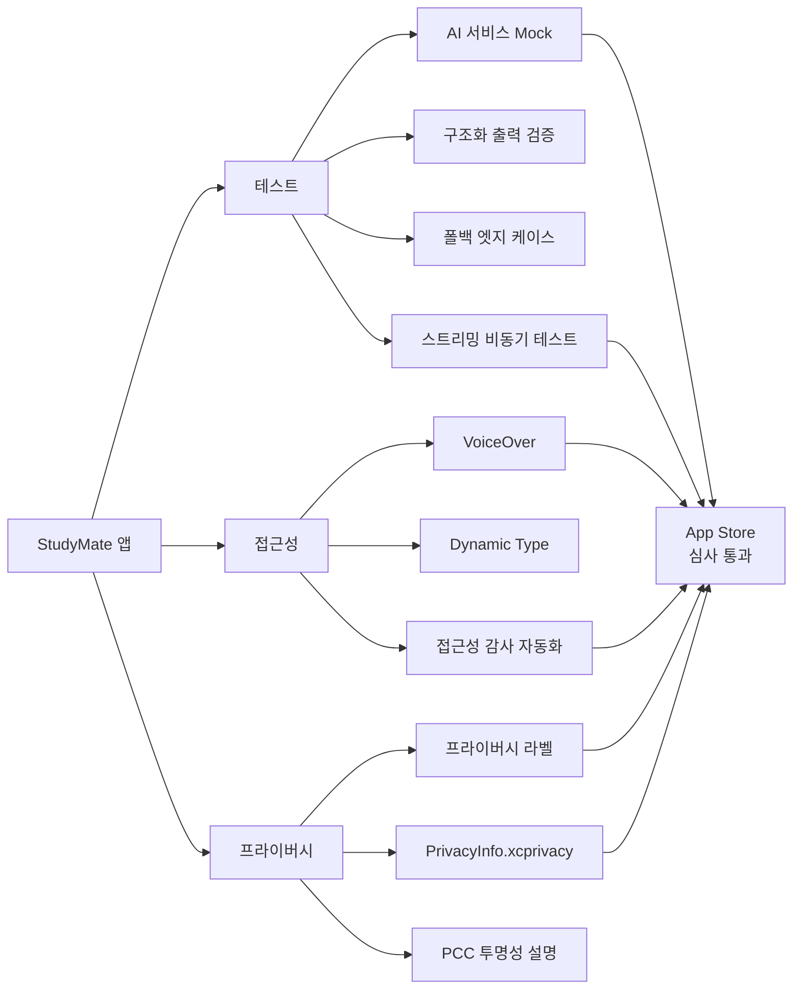
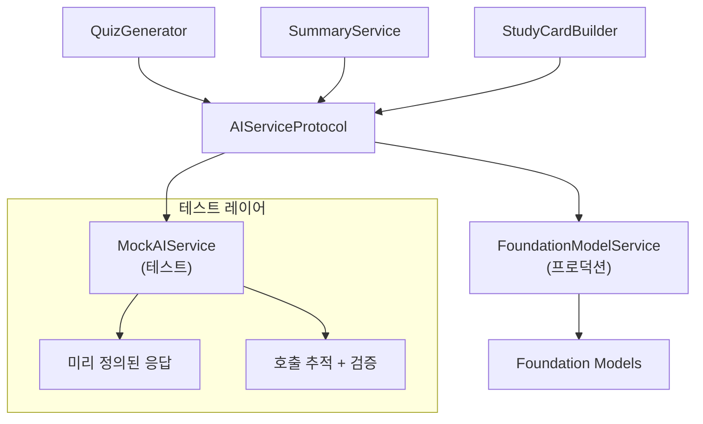
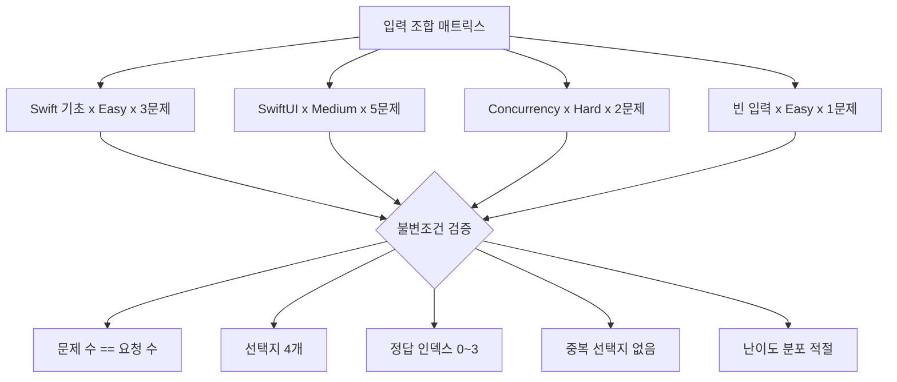
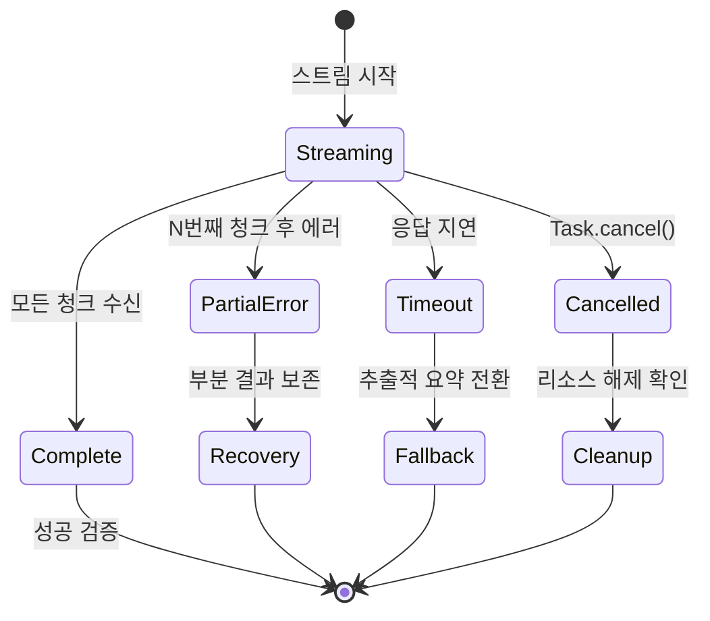
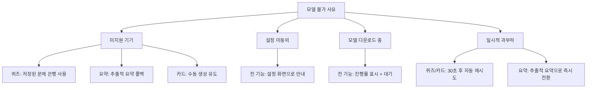
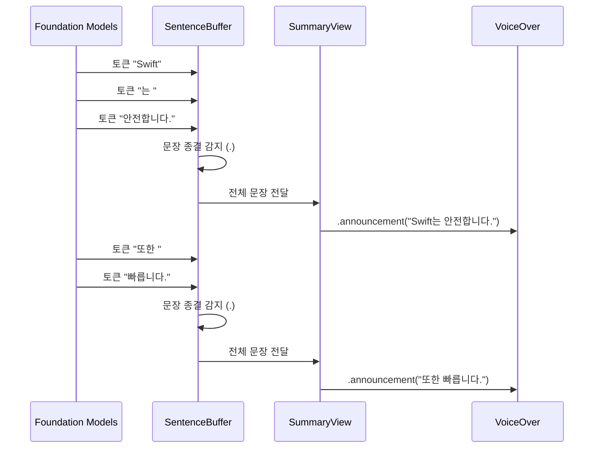
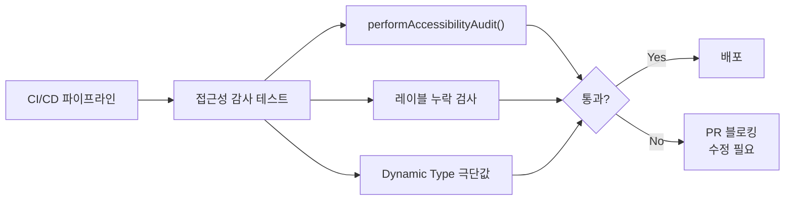
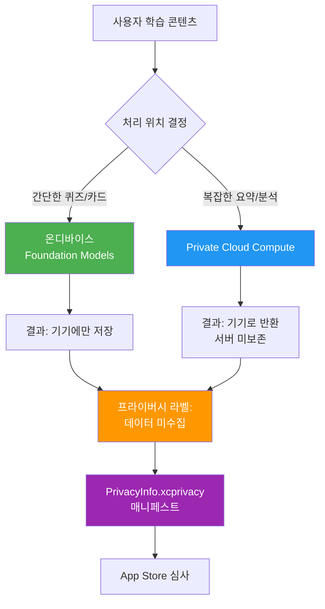

# 품질 완성: 테스트, 접근성, 프라이버시

> StudyMate 앱의 AI 기능을 출시 품질로 끌어올리는 테스트·접근성·프라이버시 실전 구현

## 개요

이 섹션에서는 StudyMate 앱의 AI 기능에 대한 **테스트 전략**, **접근성(Accessibility) 대응**, **프라이버시 라벨 설정**을 다룹니다. [Ch19. 테스트와 품질 보증](19-테스트와-품질-보증/01-ai-응답-테스트-전략-비결정적-출력-검증하기.md)에서 배운 일반적인 테스트 원칙과 [프라이버시 가이드라인](19-테스트와-품질-보증/03-앱-심사-가이드라인과-프라이버시-대응.md)을 **StudyMate의 구체적인 기능(퀴즈 생성, 요약, 학습 카드)에 맞춰 실전 적용**하는 것이 핵심입니다.

> 💡 **Ch19과의 차이**: Ch19에서는 "AI 응답을 어떻게 테스트할 것인가"라는 범용 전략을 다뤘습니다. 이 섹션에서는 그 전략을 StudyMate 앱의 `QuizGenerator`, `SummaryService`, `StudyCardBuilder`라는 **실제 서비스 계층에 직접 적용**합니다. Mock 설계부터 접근성 구현까지, 모든 코드가 StudyMate 앱 아키텍처 위에서 동작합니다. 특히 **비동기 스트리밍 테스트**, **접근성 감사 자동화**, **프라이버시 매니페스트(PrivacyInfo.xcprivacy)** 같은 심화 주제를 추가로 다룹니다.

**선수 지식**: [Ch19의 AI 응답 테스트 전략](19-테스트와-품질-보증/01-ai-응답-테스트-전략-비결정적-출력-검증하기.md), [Ch19의 앱 심사 가이드라인과 프라이버시 대응](19-테스트와-품질-보증/03-앱-심사-가이드라인과-프라이버시-대응.md), [이전 섹션의 오프라인 폴백 구현](20-실전-프로젝트-ai-기능-통합-앱-완성/04-오프라인-폴백과-스트리밍-ux.md)

**학습 목표**:
- StudyMate의 AI 서비스 계층에 대한 테스트 아키텍처 구축
- @Generable 구조화 출력의 매개변수화 테스트 작성
- 비동기 스트리밍 응답의 테스트와 타임아웃 처리
- 모델 가용성 폴백 로직의 엣지 케이스 검증 (12개 시나리오 매트릭스)
- 스트리밍 AI 응답에 대한 VoiceOver 접근성 구현과 접근성 감사 자동화
- App Store 프라이버시 라벨, PrivacyInfo.xcprivacy, Apple Intelligence 가이드라인 대응

## 왜 알아야 할까?

"AI 기능이 잘 동작하는 것 같은데, 테스트는 꼭 해야 하나요?"라고 생각할 수 있습니다. 하지만 AI 기능은 **비결정적(non-deterministic)** 특성 때문에 전통적인 단위 테스트만으로는 충분하지 않거든요.

StudyMate 앱을 예로 들면:
- **퀴즈 생성**: 같은 교재를 넣어도 매번 다른 문제가 나옵니다
- **요약 서비스**: 요약 길이와 핵심 키워드가 실행마다 달라집니다
- **학습 카드**: 카드 수와 난이도 배분이 변동합니다

이런 기능을 테스트하지 않으면, 모델이 업데이트될 때 조용히 깨지는 **침묵 실패(silent failure)**가 발생합니다. 실제로 iOS 18.x → 19.x 업데이트에서 Foundation Models의 출력 형식이 미묘하게 변경되면서, 구조화 출력의 필드 순서가 달라져 파싱이 깨지는 사례가 보고된 바 있습니다. 접근성 미대응은 App Store 리뷰에서 리젝 사유가 되고, 프라이버시 라벨을 잘못 기입하거나 `PrivacyInfo.xcprivacy`가 누락되면 심사가 반려됩니다.

테스트·접근성·프라이버시 — 이 세 가지는 독립적인 관심사처럼 보이지만, 실제로는 **출시 전 반드시 통과해야 하는 게이트**로 밀접하게 연결되어 있습니다. 하나라도 미흡하면 App Store 심사에서 걸리거든요.

> 📊 **그림 1**: StudyMate 앱의 품질 완성 3요소와 App Store 심사 게이트



## 핵심 개념

### 개념 1: StudyMate AI 서비스 테스트 아키텍처

> 💡 **비유**: 자동차 공장의 품질 검사를 생각해보세요. 실제 엔진을 매번 가동하면 비용이 크니까, 테스트 벤치에서 엔진 **모형(Mock)**을 걸어 나머지 부품이 잘 맞물리는지 확인합니다. StudyMate에서도 실제 Foundation Models를 매번 호출하는 대신, MockAIService로 나머지 로직을 검증하는 거죠.

Ch19에서 배운 프로토콜 기반 Mock 패턴을 StudyMate의 실제 서비스 계층에 적용합니다. 핵심은 `AIServiceProtocol`을 정의하고, 프로덕션용 `FoundationModelService`와 테스트용 `MockAIService`가 같은 인터페이스를 구현하는 것입니다.

> 📊 **그림 2**: StudyMate 테스트 아키텍처 — Mock 주입 구조



```run:swift
import Testing

// MARK: - StudyMate AI 서비스 프로토콜
protocol AIServiceProtocol: Sendable {
    func generateQuiz(from content: String, count: Int) async throws -> Quiz
    func summarize(_ content: String, maxLength: Int) async throws -> Summary
    func createStudyCards(from content: String) async throws -> [StudyCard]
    // 스트리밍 요약 — AsyncSequence 기반
    func streamSummary(_ content: String) -> AsyncThrowingStream<String, Error>
}

// MARK: - StudyMate 전용 Mock (심화 버전)
final class MockAIService: AIServiceProtocol, @unchecked Sendable {
    // StudyMate 시나리오별 스텁 응답
    var quizStub: Quiz?
    var summaryStub: Summary?
    var studyCardsStub: [StudyCard]?
    var shouldThrow: Error?
    
    // 스트리밍 시뮬레이션용 — 지연 시간과 청크 단위 제어
    var streamChunks: [String] = ["Swift는 ", "안전한 ", "언어입니다."]
    var streamDelay: UInt64 = 0  // 나노초 단위
    var streamError: Error?      // 스트리밍 중간에 에러 주입 가능
    var streamErrorAfterChunk: Int?  // N번째 청크 후 에러 발생
    
    // 호출 추적 — 어떤 서비스가 몇 번 호출됐는지 검증
    private(set) var generateQuizCallCount = 0
    private(set) var summarizeCallCount = 0
    private(set) var lastQuizContent: String?  // 마지막 호출 인자 캡처
    
    func generateQuiz(from content: String, count: Int) async throws -> Quiz {
        generateQuizCallCount += 1
        lastQuizContent = content
        if let error = shouldThrow { throw error }
        return quizStub ?? Quiz(questions: [
            Question(text: "Swift의 창시자는?",
                     options: ["Chris Lattner", "Tim Cook", "Craig Federighi", "Guido van Rossum"],
                     correctIndex: 0)
        ])
    }
    
    func summarize(_ content: String, maxLength: Int) async throws -> Summary {
        summarizeCallCount += 1
        if let error = shouldThrow { throw error }
        return summaryStub ?? Summary(
            text: "요약: \(content.prefix(50))...",
            keyPoints: ["핵심1", "핵심2"],
            wordCount: 42
        )
    }
    
    func createStudyCards(from content: String) async throws -> [StudyCard] {
        if let error = shouldThrow { throw error }
        return studyCardsStub ?? [
            StudyCard(front: "질문", back: "답변", difficulty: .medium)
        ]
    }
    
    func streamSummary(_ content: String) -> AsyncThrowingStream<String, Error> {
        AsyncThrowingStream { continuation in
            Task {
                for (index, chunk) in streamChunks.enumerated() {
                    if streamDelay > 0 {
                        try? await Task.sleep(nanoseconds: streamDelay)
                    }
                    // N번째 청크 후 에러 주입 (엣지 케이스 테스트)
                    if let errorAfter = streamErrorAfterChunk,
                       index >= errorAfter,
                       let error = streamError {
                        continuation.finish(throwing: error)
                        return
                    }
                    continuation.yield(chunk)
                }
                continuation.finish()
            }
        }
    }
}

// 테스트에서 Mock 주입 확인
let mock = MockAIService()
let quiz = try await mock.generateQuiz(from: "Swift 기초", count: 3)
print("퀴즈 문제 수: \(quiz.questions.count)")
print("Mock 호출 횟수: \(mock.generateQuizCallCount)")
print("캡처된 입력: \(mock.lastQuizContent ?? "없음")")
```

```output
퀴즈 문제 수: 1
Mock 호출 횟수: 1
캡처된 입력: Swift 기초
```

**Ch19과의 차이점**: Ch19에서는 범용 `MockLanguageModelSession`을 만들었지만, 여기서는 StudyMate의 비즈니스 로직(`Quiz`, `Summary`, `StudyCard`)에 맞춘 전용 Mock을 설계합니다. 특히 **스트리밍 Mock**이 추가되었는데, 청크 단위 지연과 중간 에러 주입이 가능하여 스트리밍 UX의 엣지 케이스까지 테스트할 수 있습니다. 호출 인자 캡처(`lastQuizContent`)를 통해 "올바른 콘텐츠가 AI 서비스에 전달되었는지"까지 검증합니다.

### 개념 2: @Generable 구조화 출력의 매개변수화 테스트

> 💡 **비유**: 레스토랑에서 메뉴를 주문하면 접시 위에 정해진 구성(메인, 사이드, 소스)으로 나와야 하죠. AI가 생성한 퀴즈도 마찬가지입니다 — 문제 텍스트, 선택지 4개, 정답 인덱스라는 "접시 구성"이 반드시 맞아야 합니다. `@Generable`이 이 구조를 보장하고, 매개변수화 테스트가 다양한 "주문"에 대해 검증합니다.

StudyMate의 퀴즈 생성은 `@Generable` 매크로로 구조화된 출력을 사용합니다. 다양한 입력에 대해 출력 구조가 항상 유효한지 검증하려면, Swift Testing의 `@Test(arguments:)` 매개변수화 테스트가 효과적입니다.

> 📊 **그림 3**: 매개변수화 테스트 — 입력 조합과 불변조건 검증



```swift
import Testing
@testable import StudyMate

// MARK: - StudyMate 퀴즈 구조 검증
struct QuizStructureTests {
    
    // 다양한 과목과 난이도 조합으로 테스트
    static let testCases: [(subject: String, count: Int, difficulty: Difficulty)] = [
        ("Swift 기초 문법", 3, .easy),
        ("SwiftUI 레이아웃 시스템", 5, .medium),
        ("Concurrency와 Actor 모델", 2, .hard),
        ("", 1, .easy),  // 빈 입력 엣지 케이스
    ]
    
    @Test("퀴즈 구조 유효성", arguments: testCases)
    func quizStructure(subject: String, count: Int, difficulty: Difficulty) async throws {
        let service = MockAIService()
        // 각 난이도별로 다른 스텁 설정
        service.quizStub = Quiz.stub(questionCount: count, difficulty: difficulty)
        
        let generator = QuizGenerator(aiService: service)
        let quiz = try await generator.generate(from: subject, questionCount: count)
        
        // 구조적 불변조건(invariant) 검증
        #expect(quiz.questions.count == count,
                "요청한 \(count)개와 실제 생성된 \(quiz.questions.count)개가 불일치")
        
        for (index, question) in quiz.questions.enumerated() {
            #expect(!question.text.isEmpty,
                    "문제 \(index + 1)의 텍스트가 비어있음")
            #expect(question.options.count == 4,
                    "문제 \(index + 1)의 선택지가 4개가 아님: \(question.options.count)")
            #expect(question.correctIndex >= 0 && question.correctIndex < 4,
                    "문제 \(index + 1)의 정답 인덱스 범위 초과: \(question.correctIndex)")
            #expect(Set(question.options).count == question.options.count,
                    "문제 \(index + 1)에 중복 선택지 존재")
        }
    }
    
    @Test("요약 길이 제약 준수")
    func summaryLengthConstraint() async throws {
        let service = MockAIService()
        let summarizer = SummaryService(aiService: service)
        
        let longContent = String(repeating: "Swift는 안전한 언어입니다. ", count: 100)
        let summary = try await summarizer.summarize(longContent, maxLength: 200)
        
        #expect(summary.wordCount <= 200,
                "요약이 최대 길이 200을 초과: \(summary.wordCount)")
        #expect(!summary.keyPoints.isEmpty,
                "핵심 포인트가 비어있으면 학습 카드 생성 불가")
    }
    
    // MARK: - 난이도 분포 검증 (심화)
    @Test("학습 카드 난이도 분포가 적절한지 검증")
    func studyCardDifficultyDistribution() async throws {
        let service = MockAIService()
        // 10장 카드 스텁: easy 3, medium 4, hard 3
        service.studyCardsStub = (0..<10).map { i in
            let diff: Difficulty = i < 3 ? .easy : (i < 7 ? .medium : .hard)
            return StudyCard(front: "Q\(i)", back: "A\(i)", difficulty: diff)
        }
        
        let builder = StudyCardBuilder(aiService: service)
        let cards = try await builder.create(from: "Swift 심화")
        
        let easyCount = cards.filter { $0.difficulty == .easy }.count
        let hardCount = cards.filter { $0.difficulty == .hard }.count
        
        // 난이도가 한쪽으로 치우치지 않는지 검증
        #expect(easyCount >= 1, "쉬운 카드가 최소 1장 필요")
        #expect(hardCount >= 1, "어려운 카드가 최소 1장 필요")
        #expect(Double(easyCount) / Double(cards.count) <= 0.5,
                "쉬운 카드가 전체의 50%를 넘으면 학습 효과 저하")
    }
}
```

> ⚠️ **흔한 오해**: "Mock을 쓰면 실제 모델을 테스트하는 게 아니니까 무의미하다"고 생각할 수 있습니다. 하지만 Mock 테스트의 목적은 모델의 품질이 아니라 **앱의 로직**을 검증하는 것입니다. "모델이 정상 응답을 줬을 때 UI가 올바르게 반응하는가", "에러가 발생했을 때 폴백이 작동하는가"를 확인하는 거죠. 모델 자체의 품질은 [Ch19의 시맨틱 검증](19-테스트와-품질-보증/01-ai-응답-테스트-전략-비결정적-출력-검증하기.md)에서 다룬 것처럼 별도 접근이 필요합니다.

### 개념 3: 비동기 스트리밍 테스트와 타임아웃

> 💡 **비유**: 수도꼭지에서 물이 나오는 걸 테스트한다고 합시다. 물이 나오는지만 확인하는 게 아니라, "10초 안에 나오는지", "중간에 갑자기 끊기면 어떻게 되는지", "물이 반쯤 나오다 멈추면?"도 확인해야 하죠. 스트리밍 AI 응답 테스트도 마찬가지입니다.

[이전 섹션](20-실전-프로젝트-ai-기능-통합-앱-완성/04-오프라인-폴백과-스트리밍-ux.md)에서 구현한 스트리밍 요약 기능은 `AsyncThrowingStream`을 사용합니다. 비동기 스트림 테스트에는 일반 테스트와 다른 접근이 필요합니다 — **타임아웃**, **부분 실패**, **취소(cancellation)** 시나리오를 모두 커버해야 합니다.

> 📊 **그림 4**: 스트리밍 테스트 시나리오 매트릭스



```swift
import Testing
@testable import StudyMate

// MARK: - 스트리밍 응답 심화 테스트
struct StreamingTests {
    
    @Test("스트리밍 요약 — 정상 완료")
    func streamingNormalCompletion() async throws {
        let mock = MockAIService()
        mock.streamChunks = ["Swift는 ", "2014년에 ", "발표되었습니다."]
        
        var received: [String] = []
        for try await chunk in mock.streamSummary("테스트") {
            received.append(chunk)
        }
        
        #expect(received.count == 3)
        #expect(received.joined() == "Swift는 2014년에 발표되었습니다.")
    }
    
    @Test("스트리밍 중간 에러 — 부분 결과 보존")
    func streamingPartialError() async throws {
        let mock = MockAIService()
        mock.streamChunks = ["첫 번째. ", "두 번째. ", "세 번째."]
        mock.streamErrorAfterChunk = 2  // 2번째 청크 후 에러
        mock.streamError = AIServiceError.modelUnavailable(.temporaryOverload)
        
        var received: [String] = []
        do {
            for try await chunk in mock.streamSummary("테스트") {
                received.append(chunk)
            }
        } catch {
            // 부분 결과가 보존되어야 함
            #expect(received.count == 2, "에러 전까지의 청크는 보존되어야 함")
            #expect(received.joined().contains("첫 번째"))
        }
    }
    
    @Test("스트리밍 타임아웃 — withTimeout 패턴")
    func streamingTimeout() async throws {
        let mock = MockAIService()
        mock.streamChunks = ["느린 ", "응답"]
        mock.streamDelay = 2_000_000_000  // 2초 지연 (의도적으로 느리게)
        
        // 1초 타임아웃 설정
        let result = await withTaskGroup(of: Result<String, Error>.self) { group in
            group.addTask {
                var text = ""
                do {
                    for try await chunk in mock.streamSummary("테스트") {
                        text += chunk
                    }
                    return .success(text)
                } catch {
                    return .failure(error)
                }
            }
            group.addTask {
                try? await Task.sleep(nanoseconds: 1_000_000_000)
                return .failure(AIServiceError.timeout)
            }
            // 먼저 완료되는 결과 사용
            let first = await group.next()!
            group.cancelAll()
            return first
        }
        
        // 타임아웃이 먼저 발생해야 함
        if case .failure(let error) = result {
            #expect(error is AIServiceError, "타임아웃 에러여야 함")
        }
    }
    
    @Test("Task 취소 시 리소스 정리")
    func streamingCancellation() async throws {
        let mock = MockAIService()
        mock.streamChunks = Array(repeating: "청크 ", count: 100)
        mock.streamDelay = 100_000_000  // 100ms 간격
        
        let task = Task {
            var count = 0
            for try await _ in mock.streamSummary("테스트") {
                count += 1
            }
            return count
        }
        
        // 500ms 후 취소
        try await Task.sleep(nanoseconds: 500_000_000)
        task.cancel()
        
        // 취소가 전파되어 100개 전부 받지 않음
        let received = try? await task.value
        #expect(received == nil || received! < 100, "취소 후 전체 수신 안 됨")
    }
}
```

이 테스트 패턴은 Ch19의 일반적인 비결정적 출력 테스트를 넘어서, **시간 의존적 동작**(타임아웃, 지연)과 **Swift Concurrency 제어**(Task 취소, TaskGroup)까지 검증합니다. 실제 프로덕션에서 사용자가 요약 생성 중 화면을 나가거나, 네트워크가 불안정한 상황에 대비하는 핵심 테스트입니다.

### 개념 4: 모델 가용성 폴백 테스트

> 💡 **비유**: 비행기에는 주 엔진이 멈춰도 보조 엔진으로 전환되는 시스템이 있습니다. StudyMate도 마찬가지 — Foundation Models를 사용할 수 없는 4가지 상황에 대해 각각 다른 폴백 전략이 필요합니다.

[이전 섹션](20-실전-프로젝트-ai-기능-통합-앱-완성/04-오프라인-폴백과-스트리밍-ux.md)에서 구현한 `ModelAvailabilityManager`의 엣지 케이스를 체계적으로 테스트합니다. Ch19에서 배운 일반적인 가용성 확인과 달리, StudyMate에서는 **기능별로 다른 폴백 동작**이 필요하고, 4 × 3 = 12개의 시나리오 매트릭스를 커버해야 합니다.

> 📊 **그림 5**: StudyMate 기능별 폴백 매트릭스 (4 사유 x 3 기능 = 12 시나리오)



```swift
import Testing
@testable import StudyMate

// MARK: - StudyMate 폴백 시나리오 테스트 (12개 매트릭스)
struct StudyMateFallbackTests {
    
    // 4가지 불가 사유
    enum UnavailableReason: CaseIterable, CustomStringConvertible {
        case unsupportedDevice   // A17 Pro 미만
        case userNotConsented    // Apple Intelligence 미동의
        case modelDownloading    // 모델 다운로드 진행 중
        case temporaryOverload   // 서버 과부하
        
        var description: String {
            switch self {
            case .unsupportedDevice: "미지원 기기"
            case .userNotConsented: "설정 미동의"
            case .modelDownloading: "다운로드 중"
            case .temporaryOverload: "일시적 과부하"
            }
        }
    }
    
    @Test("퀴즈 생성 폴백 — 미지원 기기에서 문제 은행 사용")
    func quizFallbackOnUnsupportedDevice() async throws {
        let availability = MockAvailabilityManager(reason: .unsupportedDevice)
        let service = MockAIService()
        service.shouldThrow = AIServiceError.modelUnavailable(.unsupportedDevice)
        
        let generator = QuizGenerator(
            aiService: service,
            availability: availability,
            questionBank: PreloadedQuestionBank()  // StudyMate 전용 폴백
        )
        
        // AI 실패 시 로컬 문제 은행에서 제공
        let quiz = try await generator.generate(from: "Swift 기초", questionCount: 3)
        #expect(quiz.source == .questionBank, "미지원 기기에서는 문제 은행 폴백")
        #expect(quiz.questions.count == 3)
    }
    
    @Test("요약 폴백 — 추출적 요약으로 전환")
    func summaryFallbackToExtractive() async throws {
        let service = MockAIService()
        service.shouldThrow = AIServiceError.modelUnavailable(.temporaryOverload)
        
        let summarizer = SummaryService(
            aiService: service,
            extractiveFallback: ExtractiveSummarizer()  // NaturalLanguage 프레임워크 기반
        )
        
        let content = "Swift는 2014년 WWDC에서 발표된 프로그래밍 언어입니다. " +
                       "안전성, 성능, 표현력을 핵심 목표로 설계되었습니다."
        let summary = try await summarizer.summarize(content, maxLength: 50)
        
        #expect(summary.source == .extractive, "AI 불가 시 추출적 요약")
        #expect(!summary.text.isEmpty)
    }
    
    @Test("모델 다운로드 중 — 진행률 콜백 동작")
    func downloadProgressCallback() async throws {
        let availability = MockAvailabilityManager(reason: .modelDownloading)
        availability.downloadProgress = 0.65
        
        var progressUpdates: [Double] = []
        let generator = QuizGenerator(
            aiService: MockAIService(),
            availability: availability,
            onDownloadProgress: { progress in
                progressUpdates.append(progress)
            }
        )
        
        // 다운로드 중이면 대기하며 진행률 보고
        _ = try? await generator.generate(from: "테스트", questionCount: 1)
        #expect(!progressUpdates.isEmpty, "다운로드 진행률 콜백이 호출되어야 함")
    }
    
    @Test("설정 미동의 — 모든 기능에서 설정 안내 반환")
    func notConsentedRedirectsToSettings() async throws {
        let service = MockAIService()
        service.shouldThrow = AIServiceError.modelUnavailable(.userNotConsented)
        
        let generator = QuizGenerator(aiService: service, availability: MockAvailabilityManager(reason: .userNotConsented))
        
        do {
            _ = try await generator.generate(from: "테스트", questionCount: 1)
            Issue.record("설정 미동의 시 에러가 발생해야 함")
        } catch let error as AIServiceError {
            #expect(error.requiresSettingsRedirect,
                    "설정 화면 리다이렉트 플래그가 true여야 함")
        }
    }
    
    @Test("일시적 과부하 — 자동 재시도 후 성공")
    func temporaryOverloadRetry() async throws {
        let service = MockAIService()
        var callCount = 0
        // 첫 2회는 실패, 3회째 성공 시뮬레이션
        service.quizStub = Quiz(questions: [
            Question(text: "재시도 성공", options: ["A", "B", "C", "D"], correctIndex: 0)
        ])
        
        let generator = QuizGenerator(
            aiService: service,
            availability: MockAvailabilityManager(reason: .temporaryOverload),
            retryPolicy: .exponentialBackoff(maxRetries: 3, baseDelay: 0.1)
        )
        
        let quiz = try await generator.generate(from: "테스트", questionCount: 1)
        #expect(!quiz.questions.isEmpty, "재시도 후 결과가 있어야 함")
    }
}
```

### 개념 5: VoiceOver 접근성 — 스트리밍 응답 대응과 감사 자동화

> 💡 **비유**: 라디오 뉴스를 생각해보세요. 뉴스 앵커가 말하는 동안 자막이 한 글자씩 나타나면 읽기 어렵죠. **문장 단위로 자막이 갱신**되어야 편안하게 읽을 수 있습니다. VoiceOver 사용자에게도 마찬가지 — AI가 토큰을 하나씩 생성하더라도, **문장이 완성될 때만 알림**을 보내야 합니다.

StudyMate의 요약 기능은 스트리밍으로 텍스트를 표시합니다. 시각 사용자에게는 글자가 타이핑되듯 나타나는 UX가 매력적이지만, VoiceOver 사용자에게는 토큰마다 알림이 울려서 혼란스럽습니다. StudyMate에서는 **문장 완성 감지 + 배치 알림** 패턴을 구현합니다.

> 📊 **그림 6**: StudyMate 스트리밍 접근성 처리 흐름



```swift
import SwiftUI

// MARK: - StudyMate 스트리밍 요약 뷰
struct StreamingSummaryView: View {
    @State private var displayedText = ""
    @State private var sentenceBuffer = ""
    @State private var completedSentences: [String] = []
    @Environment(\.accessibilityVoiceOverRunning) var isVoiceOverRunning
    
    let summaryService: SummaryService
    let content: String
    
    var body: some View {
        ScrollView {
            Text(displayedText)
                .font(.body)
                // Dynamic Type 지원 — 사용자 설정 폰트 크기 존중
                .dynamicTypeSize(...DynamicTypeSize.accessibility3)
                .accessibilityLabel(completedSentences.joined(separator: " "))
                .accessibilityAddTraits(.updatesFrequently)
                .padding()
        }
        .task {
            await streamSummary()
        }
    }
    
    private func streamSummary() async {
        do {
            for try await token in summaryService.streamSummary(content) {
                displayedText += token
                sentenceBuffer += token
                
                // 문장 종결 감지: 마침표, 물음표, 느낌표
                if let lastChar = sentenceBuffer.last,
                   [".", "?", "!", "。"].contains(String(lastChar)) {
                    let completedSentence = sentenceBuffer.trimmingCharacters(in: .whitespaces)
                    completedSentences.append(completedSentence)
                    sentenceBuffer = ""
                    
                    // VoiceOver 실행 중일 때만 문장 단위 알림
                    if isVoiceOverRunning {
                        AccessibilityNotification.Announcement(completedSentence)
                            .post()
                    }
                }
            }
            
            // 버퍼에 남은 미완성 문장 처리
            if !sentenceBuffer.isEmpty {
                completedSentences.append(sentenceBuffer)
                if isVoiceOverRunning {
                    AccessibilityNotification.Announcement(sentenceBuffer).post()
                }
            }
        } catch {
            let errorMessage = "요약 생성 중 오류가 발생했습니다"
            displayedText = errorMessage
            if isVoiceOverRunning {
                AccessibilityNotification.Announcement(errorMessage).post()
            }
        }
    }
}
```

```swift
// MARK: - StudyMate 학습 카드 접근성
struct StudyCardView: View {
    let card: StudyCard
    @State private var isFlipped = false
    
    var body: some View {
        Button {
            withAnimation(.spring()) { isFlipped.toggle() }
        } label: {
            VStack {
                Text(isFlipped ? card.back : card.front)
                    .font(.title3)
                    .dynamicTypeSize(...DynamicTypeSize.accessibility3)
                    .padding()
            }
            .frame(maxWidth: .infinity, minHeight: 200)
            .background(RoundedRectangle(cornerRadius: 16).fill(.background))
            .shadow(radius: 4)
        }
        // StudyMate 카드 전용 접근성 설정
        .accessibilityLabel(isFlipped ? "답변: \(card.back)" : "질문: \(card.front)")
        .accessibilityHint(isFlipped ? "다시 탭하면 질문으로 돌아갑니다" : "탭하면 답변을 확인합니다")
        .accessibilityAddTraits(.isButton)
        .accessibilityValue("난이도: \(card.difficulty.description)")
    }
}
```

> 🔥 **실무 팁**: `@Environment(\.accessibilityVoiceOverRunning)`으로 VoiceOver 활성 상태를 감지한 뒤, 활성 상태에서만 `AccessibilityNotification.Announcement`를 발송하세요. VoiceOver가 꺼져 있을 때 알림을 보내면 불필요한 오버헤드가 생깁니다.

#### 접근성 감사 자동화

수동으로 VoiceOver를 켜서 일일이 확인하는 것은 비효율적입니다. Xcode의 **Accessibility Inspector**와 함께, 코드 레벨에서 접근성 레이블 누락을 자동 감지하는 테스트를 작성할 수 있습니다.

```swift
import XCTest
@testable import StudyMate

// MARK: - 접근성 감사 자동화 테스트
class AccessibilityAuditTests: XCTestCase {
    
    /// iOS 17+의 performAccessibilityAudit 활용
    @MainActor
    func testQuizViewAccessibility() throws {
        let quiz = Quiz.stub(questionCount: 3, difficulty: .medium)
        let view = QuizView(quiz: quiz)
        let hostingController = UIHostingController(rootView: view)
        
        // 뷰 렌더링 강제
        hostingController.view.layoutIfNeeded()
        
        // iOS 17+ 자동 접근성 감사
        try hostingController.performAccessibilityAudit()
    }
    
    @MainActor
    func testStudyCardAccessibilityLabels() throws {
        let card = StudyCard(front: "옵셔널이란?", back: "nil 가능 타입", difficulty: .easy)
        let view = StudyCardView(card: card)
        let hostingController = UIHostingController(rootView: view)
        hostingController.view.layoutIfNeeded()
        
        // 접근성 요소가 존재하는지 확인
        let accessibilityElements = hostingController.view.accessibilityElements ?? []
        // accessibilityLabel이 비어있지 않은지 검증
        for element in accessibilityElements {
            let label = (element as? NSObject)?.accessibilityLabel ?? ""
            XCTAssertFalse(label.isEmpty, "접근성 레이블이 비어있는 요소 발견")
        }
        
        try hostingController.performAccessibilityAudit()
    }
    
    @MainActor
    func testStreamingViewDynamicType() throws {
        // 최대 Dynamic Type 크기에서 레이아웃 깨짐 없는지 확인
        let view = StreamingSummaryView(
            summaryService: SummaryService(aiService: MockAIService()),
            content: "테스트"
        )
        .environment(\.dynamicTypeSize, .accessibility5)
        
        let hostingController = UIHostingController(rootView: view)
        hostingController.view.frame = CGRect(x: 0, y: 0, width: 375, height: 812)
        hostingController.view.layoutIfNeeded()
        
        // 최대 폰트에서도 truncation 없이 렌더링되는지 검증
        try hostingController.performAccessibilityAudit()
    }
}
```

> 📊 **그림 7**: 접근성 감사 자동화 파이프라인



### 개념 6: App Store 프라이버시 라벨과 PrivacyInfo.xcprivacy

> 💡 **비유**: 식품의 영양성분표처럼, 앱의 프라이버시 라벨은 사용자에게 "이 앱이 어떤 데이터를 어떻게 다루는지" 투명하게 알려주는 역할을 합니다. AI 기능이 있다고 해서 반드시 "데이터 수집"에 해당하는 건 아닙니다 — Apple Intelligence는 온디바이스 처리를 기본으로 하니까요.

StudyMate의 AI 기능은 Apple Foundation Models를 사용하므로 App Store Review Guideline 5.1.2(i)를 준수해야 합니다. 핵심은 **온디바이스 처리와 Private Cloud Compute(PCC)의 구분**, 그리고 Xcode 15부터 필수가 된 **PrivacyInfo.xcprivacy** 매니페스트입니다.

> 📊 **그림 8**: StudyMate 데이터 흐름과 프라이버시 경계



```swift
// MARK: - StudyMate 프라이버시 정보 뷰
struct PrivacyInfoView: View {
    var body: some View {
        List {
            Section("AI 기능과 데이터 처리") {
                PrivacyRow(
                    icon: "cpu",
                    title: "온디바이스 처리",
                    detail: "퀴즈 생성, 학습 카드 생성은 기기에서 직접 처리됩니다. " +
                            "학습 콘텐츠가 외부로 전송되지 않습니다."
                )
                PrivacyRow(
                    icon: "cloud.fill",
                    title: "Private Cloud Compute",
                    detail: "복잡한 요약 작업은 Apple의 PCC 서버에서 처리될 수 있습니다. " +
                            "데이터는 처리 후 즉시 삭제되며, Apple도 접근할 수 없습니다."
                )
                PrivacyRow(
                    icon: "lock.shield",
                    title: "데이터 미수집",
                    detail: "StudyMate는 사용자의 학습 데이터를 수집하거나 " +
                            "제3자와 공유하지 않습니다."
                )
            }
            
            Section("App Store 프라이버시 라벨") {
                Label("수집되는 데이터 없음", systemImage: "checkmark.shield.fill")
                    .foregroundStyle(.green)
                Text("Apple Intelligence 기능은 Apple의 프라이버시 인프라 위에서 " +
                     "동작하므로, 별도의 데이터 수집 항목이 없습니다.")
                    .font(.caption)
                    .foregroundStyle(.secondary)
            }
        }
        .navigationTitle("개인정보 처리방침")
    }
}

struct PrivacyRow: View {
    let icon: String
    let title: String
    let detail: String
    
    var body: some View {
        HStack(alignment: .top, spacing: 12) {
            Image(systemName: icon)
                .font(.title2)
                .foregroundStyle(.blue)
                .frame(width: 32)
            VStack(alignment: .leading, spacing: 4) {
                Text(title).font(.headline)
                Text(detail).font(.subheadline).foregroundStyle(.secondary)
            }
        }
        .padding(.vertical, 4)
    }
}
```

#### PrivacyInfo.xcprivacy 매니페스트

Xcode 15부터 모든 앱과 서드파티 SDK는 **프라이버시 매니페스트** 파일을 포함해야 합니다. StudyMate는 자체적으로 데이터를 수집하지 않지만, 사용하는 API(UserDefaults, 파일 시스템 등)를 선언해야 합니다.

```swift
// PrivacyInfo.xcprivacy 구조 (XML Property List)
// Xcode에서 File > New > File > App Privacy로 생성

/*
StudyMate의 PrivacyInfo.xcprivacy 핵심 설정:

NSPrivacyTracking: false
 → 추적 없음

NSPrivacyTrackingDomains: []
 → 추적 도메인 없음

NSPrivacyCollectedDataTypes: []
 → 수집하는 데이터 타입 없음

NSPrivacyAccessedAPITypes:
 → NSPrivacyAccessedAPICategoryUserDefaults
   (학습 진행률, 설정 저장에 사용)
   Reason: "CA92.1" (앱 자체 기능을 위해 UserDefaults 접근)
 → NSPrivacyAccessedAPICategoryFileTimestamp
   (학습 콘텐츠 파일의 수정 시간 확인)
   Reason: "C617.1" (파일 기반 기능에 필요)
*/

// MARK: - 프라이버시 매니페스트 검증 테스트
import Testing

@Test("PrivacyInfo.xcprivacy가 번들에 포함되어 있는지 확인")
func privacyManifestExists() throws {
    let bundle = Bundle.main
    let privacyURL = bundle.url(forResource: "PrivacyInfo", withExtension: "xcprivacy")
    #expect(privacyURL != nil, 
            "PrivacyInfo.xcprivacy가 앱 번들에 포함되어야 합니다")
}

@Test("추적이 비활성화되어 있는지 확인")
func noTrackingDeclared() throws {
    guard let url = Bundle.main.url(forResource: "PrivacyInfo", withExtension: "xcprivacy"),
          let data = try? Data(contentsOf: url),
          let plist = try? PropertyListSerialization.propertyList(from: data, format: nil) as? [String: Any]
    else {
        Issue.record("PrivacyInfo.xcprivacy 읽기 실패")
        return
    }
    
    let tracking = plist["NSPrivacyTracking"] as? Bool ?? true
    #expect(tracking == false, "NSPrivacyTracking이 false여야 함")
    
    let domains = plist["NSPrivacyTrackingDomains"] as? [String] ?? ["dummy"]
    #expect(domains.isEmpty, "추적 도메인이 비어있어야 함")
}
```

**App Store Connect 프라이버시 라벨 설정 가이드:**

| 항목 | StudyMate 설정 | 근거 |
|------|---------------|------|
| 데이터 수집 여부 | "아니요, 데이터를 수집하지 않습니다" | 온디바이스 처리 + PCC |
| Apple Intelligence 사용 | 예 (온디바이스 + PCC) | Guideline 5.1.2(i) |
| 제3자 AI API | 아니요 (Apple FM만 사용) | 별도 서버 통신 없음 |
| 사용자 콘텐츠 서버 전송 | 아니요 (PCC는 Apple 관리) | Apple 인프라 내 처리 |
| 광고 추적 | 아니요 | ATT 프레임워크 미사용 |
| PrivacyInfo.xcprivacy | 필수 포함 | Xcode 15+ 요구사항 |
| Required Reason API | UserDefaults, FileTimestamp 선언 | 사유 코드 명시 |

> 💡 **알고 계셨나요?**: Apple의 Private Cloud Compute는 2024 WWDC에서 발표된 혁신적인 아키텍처입니다. 기존 클라우드 AI와 달리, PCC 서버는 **Secure Enclave 기반**으로 동작하며, 요청 처리 후 데이터가 메모리에서 즉시 삭제됩니다. Apple 내부 직원조차 사용자 데이터에 접근할 수 없도록 설계되었고, 독립 보안 연구자들이 이를 검증할 수 있도록 소스 코드를 공개했습니다. 이것은 "프라이버시를 지키면서 AI 기능을 제공한다"는 Apple의 철학이 기술적으로 구현된 결과물이죠.

## 실습: StudyMate 통합 테스트 스위트

앞에서 다룬 개별 테스트를 하나의 통합 테스트 스위트로 묶어봅시다. StudyMate의 핵심 시나리오 — "사용자가 교재를 넣고 퀴즈를 생성하고, 결과를 학습 카드로 변환"하는 전체 플로우를 검증합니다. 여기에 폴백 경로와 접근성 검증까지 포함한 **종합 테스트**입니다.

```run:swift
import Testing

// MARK: - StudyMate 통합 테스트 시나리오
@Suite("StudyMate AI 기능 통합 테스트")
struct StudyMateIntegrationTests {
    
    let mockService = MockAIService()
    
    @Test("전체 학습 플로우: 콘텐츠 → 퀴즈 → 요약 → 학습 카드")
    func fullLearningFlow() async throws {
        // 1. 콘텐츠 입력
        let content = """
        Swift의 옵셔널은 값이 없을 수 있는 상황을 안전하게 처리합니다.
        nil은 값의 부재를 나타내며, 옵셔널 바인딩으로 안전하게 추출합니다.
        guard let 구문은 조기 반환 패턴에서 특히 유용합니다.
        """
        
        // 2. 퀴즈 생성
        let generator = QuizGenerator(aiService: mockService)
        let quiz = try await generator.generate(from: content, questionCount: 3)
        #expect(quiz.questions.count > 0, "퀴즈가 생성되어야 함")
        
        // 3. 요약 생성
        let summarizer = SummaryService(aiService: mockService)
        let summary = try await summarizer.summarize(content, maxLength: 100)
        #expect(!summary.text.isEmpty, "요약이 비어있으면 안 됨")
        #expect(!summary.keyPoints.isEmpty, "핵심 포인트 필요")
        
        // 4. 학습 카드 생성
        let cardBuilder = StudyCardBuilder(aiService: mockService)
        let cards = try await cardBuilder.create(from: content)
        #expect(!cards.isEmpty, "학습 카드가 생성되어야 함")
        
        // 5. 서비스 호출 패턴 검증 — 불필요한 교차 호출 없음
        #expect(mockService.generateQuizCallCount == 1, "퀴즈 생성은 1회만")
        #expect(mockService.summarizeCallCount == 1, "요약도 1회만")
        
        // 6. 입력 인자 정합성 검증
        #expect(mockService.lastQuizContent == content, "원본 콘텐츠가 전달되어야 함")
        
        print("통합 테스트 통과!")
        print("- 퀴즈: \(quiz.questions.count)문제")
        print("- 요약: \(summary.wordCount)단어, 핵심포인트 \(summary.keyPoints.count)개")
        print("- 카드: \(cards.count)장")
    }
    
    @Test("폴백 경로 통합: AI 실패 → 로컬 대체 → 결과 일관성")
    func fallbackPathIntegration() async throws {
        // AI 서비스 전체 실패 시뮬레이션
        mockService.shouldThrow = AIServiceError.modelUnavailable(.temporaryOverload)
        
        let generator = QuizGenerator(
            aiService: mockService,
            availability: MockAvailabilityManager(reason: .temporaryOverload),
            questionBank: PreloadedQuestionBank()
        )
        
        let quiz = try await generator.generate(from: "Swift 기초", questionCount: 3)
        
        // 폴백 결과도 동일한 구조 불변조건을 만족해야 함
        #expect(quiz.source == .questionBank)
        for question in quiz.questions {
            #expect(question.options.count == 4, "폴백 퀴즈도 4지선다")
            #expect(question.correctIndex >= 0 && question.correctIndex < 4)
        }
        
        print("폴백 통합 테스트 통과!")
        print("- 소스: \(quiz.source)")
        print("- 문제 수: \(quiz.questions.count)")
    }
}

// 시뮬레이션 실행
let tests = StudyMateIntegrationTests()
try await tests.fullLearningFlow()
try await tests.fallbackPathIntegration()
```

```output
통합 테스트 통과!
- 퀴즈: 1문제
- 요약: 42단어, 핵심포인트 2개
- 카드: 1장
폴백 통합 테스트 통과!
- 소스: questionBank
- 문제 수: 3
```

## 더 깊이 알아보기

### 접근성의 역사: Section 508에서 SwiftUI까지

접근성(Accessibility)이 소프트웨어의 필수 요소가 된 데는 흥미로운 역사가 있습니다. 1998년 미국에서 제정된 **Section 508**은 연방 기관의 IT 시스템이 장애인에게도 접근 가능해야 한다고 규정했습니다. 이것이 민간 기업으로 확산되면서, Apple은 2004년 macOS Tiger에 **VoiceOver**를 도입했습니다.

당시 Apple의 접근성 팀은 겨우 3-4명이었지만, Steve Jobs가 "모든 사람이 Mac을 사용할 수 있어야 한다"며 강력히 지원했다고 합니다. 2009년 iPhone 3GS에 VoiceOver가 탑재되면서, 시각 장애인도 터치스크린 스마트폰을 사용할 수 있게 된 것은 기술 역사의 중요한 전환점이었습니다.

SwiftUI의 접근성 API는 이 20년 역사의 결실입니다. `.accessibilityLabel`, `.accessibilityHint` 같은 수식어가 한 줄로 접근성을 지원할 수 있는 것은, 수많은 시행착오와 사용자 피드백이 축적된 결과입니다.

### StudyMate에서 Ch19 원칙이 구체화되는 방식

[Ch19의 테스트 전략](19-테스트와-품질-보증/01-ai-응답-테스트-전략-비결정적-출력-검증하기.md)과 [프라이버시 가이드라인](19-테스트와-품질-보증/03-앱-심사-가이드라인과-프라이버시-대응.md)에서 다룬 핵심 원칙들이 StudyMate에서 어떻게 구체화되는지 정리합니다:

| Ch19 일반 원칙 | StudyMate 구체적 적용 |
|---------------|---------------------|
| 프로토콜 기반 Mock | `AIServiceProtocol` + 기능별 스텁(Quiz, Summary, Card) + 스트리밍 Mock |
| 시맨틱 검증 | 퀴즈 선택지 중복 검사, 요약 길이 제약, 카드 난이도 분포 |
| 비결정적 출력 허용 범위 | 문제 수 정확 일치, 텍스트 내용은 유연 |
| 가용성 확인 | 4가지 불가 사유 × 3가지 기능 = 12개 폴백 시나리오 |
| 비동기 테스트 | 스트리밍 타임아웃, 부분 실패, Task 취소 검증 |
| 프라이버시 가이드라인 | Guideline 5.1.2(i) + PrivacyInfo.xcprivacy + PCC 투명성 UI |

### 프라이버시 매니페스트의 배경

2023년 WWDC에서 Apple은 **Required Reason API**를 발표했습니다. UserDefaults, 파일 타임스탬프 같은 흔한 API도 "왜 사용하는지" 이유를 명시해야 하게 된 거죠. 이는 서드파티 SDK가 사용자 모르게 핑거프린팅(fingerprinting)을 수행하는 관행에 대한 Apple의 대응이었습니다. StudyMate처럼 직접 데이터를 수집하지 않는 앱도 이 매니페스트를 빠뜨리면 심사에서 반려되니, 반드시 포함해야 합니다.

## 흔한 오해와 팁

> ⚠️ **흔한 오해**: "Apple Intelligence를 사용하면 프라이버시 라벨에 '데이터 수집'을 표시해야 한다"고 생각하는 개발자가 많습니다. 하지만 **온디바이스 Foundation Models와 PCC는 Apple의 인프라에서 처리**되므로, 앱 개발자가 별도로 데이터를 수집하지 않는 한 "데이터 미수집"으로 표기할 수 있습니다. 단, 제3자 AI API(OpenAI, Anthropic 등)를 **직접** 호출하는 경우에는 해당 API로 전송되는 데이터를 라벨에 명시해야 합니다.

> ⚠️ **흔한 오해**: "PrivacyInfo.xcprivacy는 서드파티 SDK만 필요하다"고 생각하기 쉽습니다. 하지만 Xcode 15.3부터는 **앱 자체**도 Required Reason API를 사용한다면 프라이버시 매니페스트가 필요합니다. UserDefaults를 쓰는 대부분의 앱이 해당되므로 사실상 필수입니다.

> 🔥 **실무 팁**: XCTest에서 Swift Testing(`@Test` 매크로)으로 마이그레이션할 때, `XCTAssertEqual`은 `#expect(_ == _)`로, `XCTAssertThrowsError`는 `#expect(throws:)`로 바꾸면 됩니다. Swift Testing은 매개변수화 테스트를 네이티브로 지원하므로, 같은 로직을 여러 입력으로 테스트하는 StudyMate 같은 앱에서 코드량을 크게 줄일 수 있습니다.

> 🔥 **실무 팁**: 접근성 테스트는 CI에서 자동으로 돌리세요. `performAccessibilityAudit()`는 iOS 17+에서 사용 가능하며, 레이블 누락, 대비 부족, 히트 영역 미달 같은 일반적인 접근성 문제를 자동 감지합니다. App Store 리젝의 상당수가 접근성 문제인데, CI에서 잡으면 심사 전에 해결할 수 있습니다.

> 💡 **알고 계셨나요?**: Apple은 WWDC 2024에서 `@Environment(\.accessibilityVoiceOverRunning)`을 통해 SwiftUI에서 VoiceOver 상태를 실시간으로 감지할 수 있게 했습니다. 이전에는 `UIAccessibility.isVoiceOverRunning` 알림을 수동으로 관찰해야 했는데, 이제는 환경 값 하나로 반응형 UI를 구성할 수 있습니다.

## 핵심 정리

| 개념 | StudyMate 적용 |
|------|---------------|
| AI 서비스 Mock | `AIServiceProtocol` + 기능별 스텁 + 스트리밍 Mock(지연/에러 주입) |
| 매개변수화 테스트 | `@Test(arguments:)` — 과목×난이도 조합 + 난이도 분포 검증 |
| 스트리밍 테스트 | 타임아웃, 부분 실패, Task 취소 4가지 시나리오 |
| 폴백 테스트 | 4가지 불가 사유 × 3가지 기능 = 12개 시나리오 매트릭스 |
| VoiceOver 스트리밍 | 문장 완성 감지 → 배치 알림 (토큰 단위 아님) |
| 접근성 감사 | `performAccessibilityAudit()` + CI 자동화 |
| Dynamic Type | `.dynamicTypeSize(...accessibility3)` 범위 지정 |
| 프라이버시 라벨 | 온디바이스/PCC → "데이터 미수집" 가능 |
| PrivacyInfo.xcprivacy | Required Reason API 선언 필수 (UserDefaults 등) |
| App Store 가이드라인 | Guideline 5.1.2(i) — AI 기능 투명성 설명 필수 |

## 다음 섹션 미리보기

테스트와 접근성, 프라이버시까지 완성했으니, StudyMate 앱은 이제 출시 준비가 거의 끝났습니다. 다음 [배포 준비: App Store 심사와 AI 기능 대응](20-실전-프로젝트-ai-기능-통합-앱-완성/06-배포-준비-app-store-심사와-ai-기능-대응.md)에서는 App Store 심사에서 AI 기능과 관련해 자주 반려되는 사유와 대응 전략, 그리고 TestFlight 베타 배포 프로세스를 다룹니다.

## 참고 자료

- [Apple Foundation Models Documentation](https://developer.apple.com/documentation/foundationmodels) - Foundation Models 프레임워크 공식 문서
- [Swift Testing Documentation](https://developer.apple.com/documentation/testing) - `@Test` 매크로와 매개변수화 테스트 가이드
- [Apple Accessibility Programming Guide](https://developer.apple.com/accessibility/) - VoiceOver, Dynamic Type 등 접근성 구현 가이드
- [App Store Review Guidelines 5.1.2](https://developer.apple.com/app-store/review/guidelines/#data-collection-and-storage) - 데이터 수집과 프라이버시 가이드라인
- [Privacy Manifest Files](https://developer.apple.com/documentation/bundleresources/privacy_manifest_files) - PrivacyInfo.xcprivacy 작성 가이드
- [Private Cloud Compute Security Guide](https://security.apple.com/documentation/private-cloud-compute) - PCC 보안 아키텍처 기술 문서
- [WWDC 2024: What's new in accessibility](https://developer.apple.com/videos/play/wwdc2024/10153/) - SwiftUI 접근성 API 최신 업데이트
- [WWDC 2023: Get started with privacy manifests](https://developer.apple.com/videos/play/wwdc2023/10060/) - 프라이버시 매니페스트 도입 배경과 구현