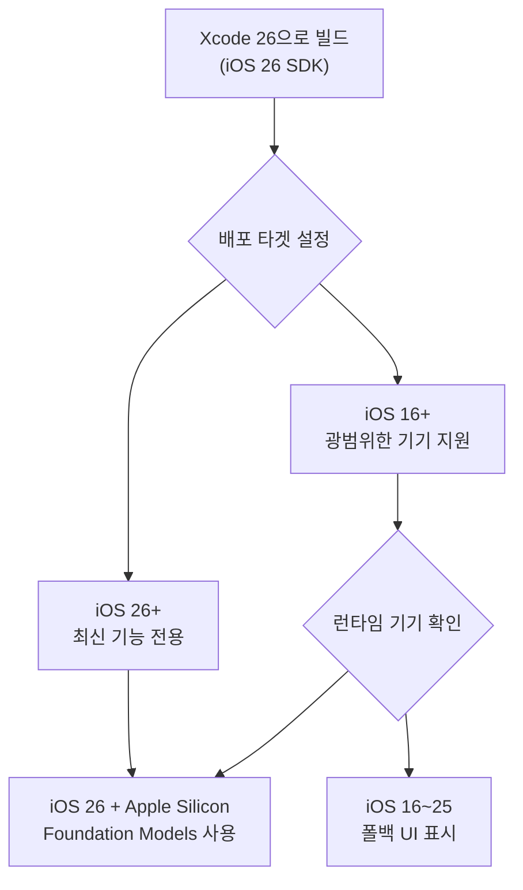
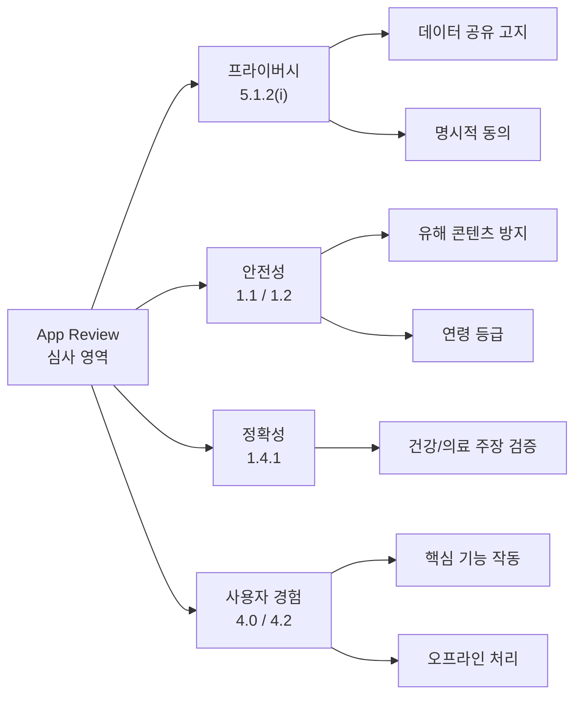
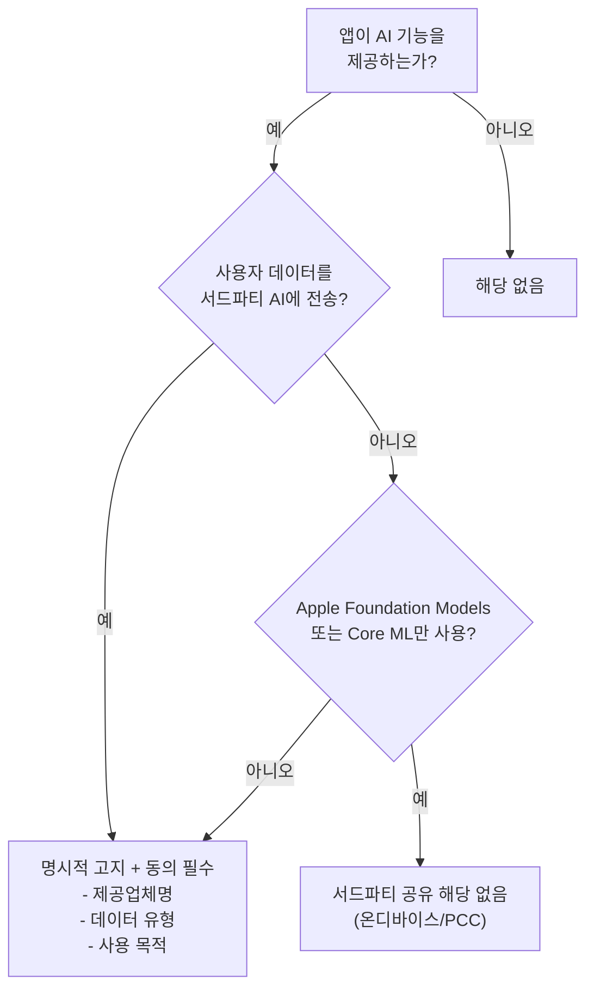
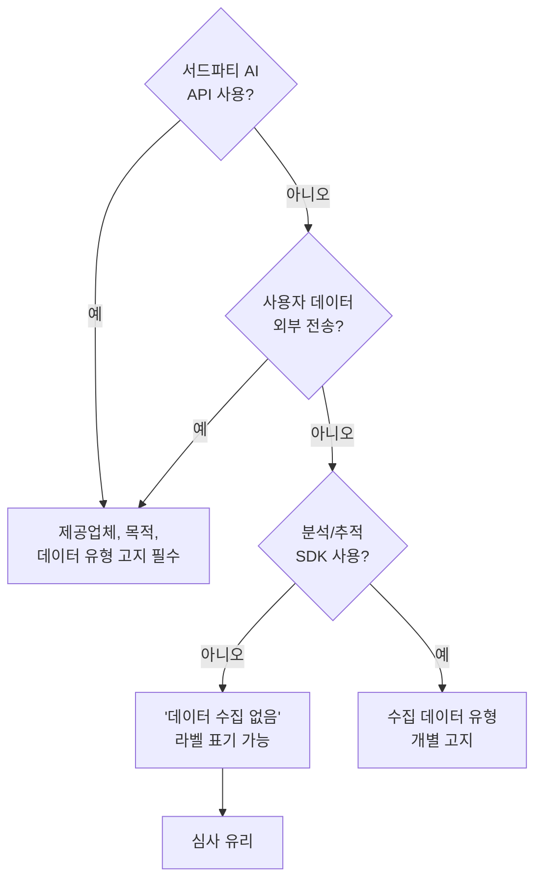
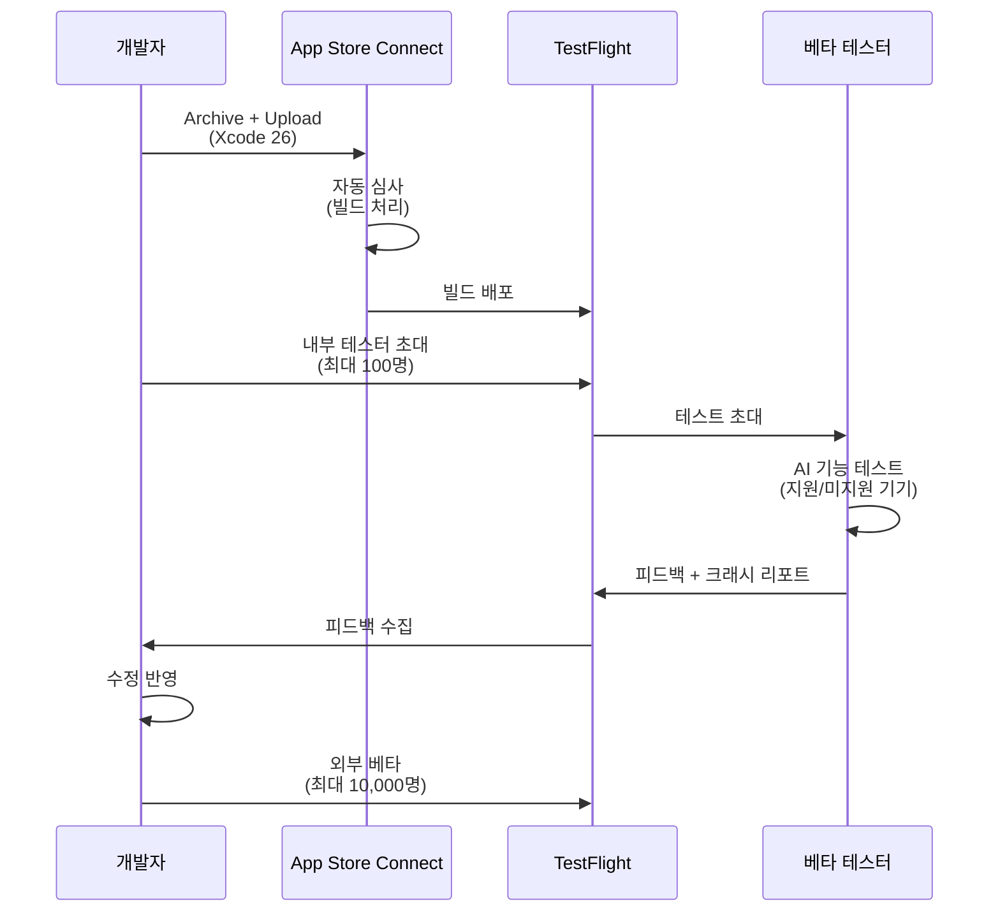
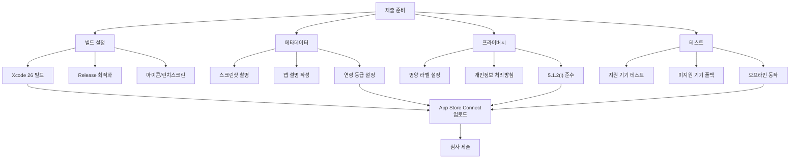
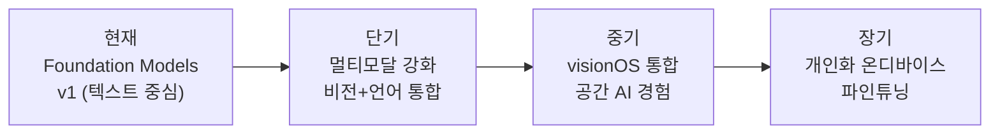

# App Store 배포와 다음 단계

> StudyMate 앱을 App Store에 배포하기 위한 심사 가이드라인, SDK 요구사항, 배포 체크리스트를 완성하고, Apple AI/ML 생태계의 미래를 조망합니다.

## 개요

드디어 마지막 세션입니다. 지금까지 설계하고, 구현하고, 테스트하고, 접근성과 프라이버시까지 갖춘 StudyMate 앱을 세상에 내놓을 차례인데요. App Store에 AI 앱을 출시하는 건 일반 앱과는 조금 다른 주의사항이 있습니다.

**선수 지식**: [품질 완성: 테스트, 접근성, 프라이버시](20-ch20-실전-프로젝트-ai-기능-통합-앱-완성/05-05-품질-완성-테스트-접근성-프라이버시.md)에서 다룬 테스트 전략, 접근성 구현, 프라이버시 준수 내용

**학습 목표**:
- iOS 26 SDK 요구사항과 Xcode 26 빌드 설정을 구성한다
- AI 앱에 적용되는 App Store 심사 가이드라인을 이해하고 준수한다
- TestFlight 배포부터 App Store 출시까지의 전체 워크플로를 실행한다
- Apple AI/ML 생태계의 향후 발전 방향을 파악한다

## 왜 알아야 할까?

"앱은 완성했는데 심사에서 리젝당했어요." — AI 앱 개발자들이 커뮤니티에 올리는 가장 흔한 질문 중 하나입니다. Foundation Models 프레임워크를 사용하는 앱은 100% 온디바이스 처리라는 큰 이점이 있지만, 그래도 알아야 할 심사 기준과 메타데이터 요구사항이 있습니다.

특히 Apple은 App Review Guidelines 5.1.2(i)를 통해 AI 데이터 공유에 대한 명시적 동의 요구를 강화해왔습니다. StudyMate처럼 온디바이스 AI만 사용하는 앱은 비교적 간단하지만, 향후 서드파티 API를 추가할 가능성까지 고려한 설계가 필요합니다.

> ⚠️ **날짜 관련 참고**: 이 세션에 등장하는 SDK 요구 일정과 가이드라인 업데이트 시점은 WWDC25 발표 및 Apple Developer 공지를 기반으로 작성되었습니다. 실제 시행 일정은 Apple이 변경할 수 있으므로, 제출 전 반드시 [Apple Developer — Upcoming Requirements](https://developer.apple.com/news/upcoming-requirements/) 페이지에서 최신 정보를 확인하세요.

이 세션을 마치면, 여러분은 AI 앱을 자신 있게 App Store에 제출할 수 있는 완전한 체크리스트를 갖게 됩니다.

## 핵심 개념

### 개념 1: iOS 26 SDK와 Xcode 26 빌드 요구사항

> 💡 **비유**: 놀이공원에 입장하려면 키 제한이 있는 것처럼, App Store에 앱을 올리려면 최소 SDK 버전이라는 "입장 기준"이 있습니다. Apple은 매년 새 SDK 빌드를 의무화하는 일정을 발표하는데, 이 기준을 충족해야만 앱을 제출할 수 있죠.

Apple의 발표에 따르면, 일정 시점부터 App Store Connect에 업로드하는 모든 앱은 **Xcode 26** 이상으로 빌드해야 합니다. 이는 iOS, iPadOS, tvOS, visionOS, watchOS 모든 플랫폼에 적용됩니다. 정확한 시행일은 Apple Developer 뉴스룸에서 공지되므로, 제출 전 반드시 확인하세요.

> 💡 **알고 계셨나요?**: Apple은 매년 이런 SDK 요구사항 전환 일정을 발표합니다. 역사적으로 새 Xcode가 출시되면 약 4~6개월 후 해당 SDK가 필수가 되는 패턴이 반복되어 왔습니다. iOS 17 SDK는 2024년 4월부터, iOS 18 SDK는 해당 연도에 각각 의무화되었죠.

중요한 건 이 요구사항이 "빌드 SDK"에 대한 것이지 "최소 배포 타겟"은 아니라는 점이에요. Xcode 26으로 빌드하되, Deployment Target을 iOS 16으로 설정하면 구형 기기에서도 앱을 실행할 수 있습니다. 다만 Foundation Models API는 iOS 26+ 기기에서만 동작하므로, 가용성 분기가 필수입니다.

> 📊 **그림 1**: 빌드 SDK와 배포 타겟의 관계



StudyMate의 Xcode 프로젝트 설정을 정리하겠습니다:

```swift
// Package.swift — StudyMate 프로젝트 구성
// 빌드 SDK: iOS 26 (Xcode 26이 자동 적용)
// 배포 타겟: iOS 26 (Foundation Models 필수 앱)

import PackageDescription

let package = Package(
    name: "StudyMate",
    platforms: [
        .iOS(.v26),        // Foundation Models 필수이므로 iOS 26 최소
        .macOS(.v26)       // macOS도 지원
    ],
    products: [
        .library(
            name: "StudyMateCore",
            targets: ["StudyMateCore"]
        )
    ],
    dependencies: [
        // 외부 의존성 없음 — Apple 프레임워크만 사용
        // 서드파티 AI SDK를 추가할 경우 여기에 선언
    ],
    targets: [
        .target(
            name: "StudyMateCore",
            dependencies: [],
            swiftSettings: [
                .swiftLanguageMode(.v6)  // Swift 6 Strict Concurrency
            ]
        ),
        .testTarget(
            name: "StudyMateTests",
            dependencies: ["StudyMateCore"],
            swiftSettings: [
                .swiftLanguageMode(.v6)
            ]
        )
    ]
)
```

만약 구형 iOS도 지원해야 한다면, `#available` 검사로 분기합니다:

```swift
// 구형 iOS 지원 시 가용성 분기 패턴
struct ContentView: View {
    var body: some View {
        if #available(iOS 26, *) {
            // Foundation Models 기반 AI 기능
            StudyMateMainView()
        } else {
            // AI 없는 기본 학습 도구
            LegacyStudyView()
        }
    }
}
```

### 개념 2: AI 앱 심사 가이드라인 완전 정복

> 💡 **비유**: 식품 포장에 성분표를 붙이는 것처럼, AI 앱도 "어떤 데이터를 어떻게 처리하는지"를 투명하게 표시해야 합니다. Apple은 이 성분표가 정확한지 심사관이 직접 확인합니다.

App Store 심사에서 AI 앱이 주의해야 할 핵심 가이드라인은 크게 4가지 영역으로 나뉩니다.

> 📊 **그림 2**: AI 앱 심사 가이드라인 4대 영역



**가이드라인 5.1.2(i) — AI 데이터 공유 고지**

이것이 AI 앱 심사에서 가장 핵심적인 조항입니다. 앱이 사용자 데이터를 서드파티 AI에 공유하는 경우, 반드시 명시적으로 고지하고 동의를 받아야 합니다. Apple은 이 조항을 지속적으로 강화하고 있으므로, 제출 시점의 최신 가이드라인을 반드시 확인하세요.

> 📊 **그림 3**: 가이드라인 5.1.2(i) 적용 판단 흐름



```swift
// StudyMate는 Foundation Models만 사용 → 서드파티 공유 없음
// 하지만 향후 확장을 대비한 동의 관리 구조

/// AI 데이터 처리 투명성 관리자
@Observable
final class AIDataTransparencyManager {
    // MARK: - 현재 데이터 처리 방식 공개

    /// 현재 앱의 AI 데이터 처리 정보
    var dataProcessingInfo: AIDataProcessingInfo {
        AIDataProcessingInfo(
            onDeviceOnly: true,
            thirdPartyProviders: [],       // 서드파티 AI 미사용
            dataRetention: .none,          // 데이터 보관 없음
            personalDataShared: false      // 개인정보 공유 없음
        )
    }

    /// 서드파티 AI 사용 시 동의 요청 (향후 확장 대비)
    func requestThirdPartyAIConsent(
        provider: String,
        purpose: String,
        dataTypes: [String]
    ) async -> Bool {
        // 명시적 동의 UI 표시
        // - 제공업체명
        // - 데이터 사용 목적
        // - 전송되는 데이터 유형
        // - 데이터 보존 기간
        await showConsentDialog(
            provider: provider,
            purpose: purpose,
            dataTypes: dataTypes
        )
    }

    private func showConsentDialog(
        provider: String,
        purpose: String,
        dataTypes: [String]
    ) async -> Bool {
        // 실제 구현에서는 Alert/Sheet으로 사용자 동의 수집
        return false
    }
}

struct AIDataProcessingInfo {
    let onDeviceOnly: Bool
    let thirdPartyProviders: [String]
    let dataRetention: DataRetention
    let personalDataShared: Bool

    enum DataRetention {
        case none           // 데이터 보관 안 함
        case session        // 세션 중에만 유지
        case persistent     // 영구 보관
    }
}
```

**StudyMate의 이점**: Foundation Models는 100% 온디바이스 처리이므로, 프라이버시 영양 라벨에 "데이터 수집 없음"으로 표기할 수 있습니다. 이것은 심사에서 큰 장점이에요. 복잡한 요청이 Private Cloud Compute로 전송될 때도 데이터는 암호화되고 처리 직후 삭제되므로, Apple 자체 인프라로 취급되어 "서드파티 공유"에 해당하지 않습니다.

> ⚠️ **흔한 오해**: "Foundation Models를 사용하면 심사에서 AI 관련 항목을 아예 신경 쓸 필요 없다"고 생각하기 쉽지만, 연령 등급, 생성 콘텐츠의 적절성, 모델 미가용 시 UX 등은 여전히 심사 대상입니다.

### 개념 3: 프라이버시 영양 라벨과 메타데이터 구성

> 💡 **비유**: 마트에서 식품을 고를 때 뒷면의 영양성분표를 보듯, App Store 사용자도 앱의 "프라이버시 영양 라벨"을 보고 어떤 데이터가 수집되는지 확인합니다.

App Store Connect에서 프라이버시 정보를 설정할 때, Foundation Models만 사용하는 StudyMate는 상당히 깔끔한 라벨을 가질 수 있습니다.

> 📊 **그림 4**: StudyMate 프라이버시 영양 라벨 결정 흐름



```swift
// App Store Connect 메타데이터 설정 도우미
// 실제로는 App Store Connect 웹 UI에서 설정하지만,
// 프로젝트 문서로 정리해두면 팀 협업과 심사 대비에 유용합니다

/// App Store 메타데이터 체크리스트
enum AppStoreMetadata {
    // MARK: - 프라이버시 영양 라벨
    static let privacyDetails = """
    ✅ 데이터 수집: 없음
    ✅ 데이터 추적: 없음
    ✅ 서드파티 AI 공유: 없음

    근거:
    - Foundation Models: 온디바이스 처리, Apple 시스템 프레임워크
    - Private Cloud Compute: Apple 인프라, 데이터 비보존
    - Core ML: 온디바이스 추론, 외부 전송 없음
    - iCloud 동기화: 사용자 본인 계정 내 동기화 (수집 아님)
    """

    // MARK: - 앱 설명 핵심 포인트
    static let description = """
    StudyMate는 Apple의 온디바이스 AI 기술을 활용한 학습 도우미입니다.

    모든 AI 처리는 기기 내에서 이루어져 개인정보가 외부로 전송되지 않습니다.
    인터넷 연결 없이도 AI 기능을 사용할 수 있습니다.
    """

    // MARK: - 연령 등급
    static let ageRating = """
    권장: 4+
    - AI 생성 콘텐츠: 학습 관련 Q&A (유해 콘텐츠 아님)
    - Foundation Models 안전 가드레일이 부적절한 출력 차단
    - 사용자 생성 콘텐츠: 학습 노트 (공유 기능 없음)
    
    참고: Apple은 연령 등급 체계를 주기적으로 업데이트합니다.
    App Store Connect에서 최신 등급 질문지에 응답해야 합니다.
    """
}
```

### 개념 4: TestFlight 베타 배포와 피드백 수집

> 💡 **비유**: 음식점을 정식 오픈하기 전에 지인들을 초대해 시식회를 하는 것처럼, TestFlight는 앱의 "시식회"입니다. 실제 사용자의 피드백으로 마지막 조율을 할 수 있어요.

AI 앱의 TestFlight 배포에서 특히 중요한 점은 **기기 다양성 테스트**입니다. Foundation Models는 Apple Intelligence 지원 기기에서만 동작하므로, 지원/미지원 기기 모두에서 테스트해야 합니다.

> 📊 **그림 5**: TestFlight 베타 테스트 워크플로



```swift
// TestFlight 베타 테스트 시 AI 기능 진단 정보 수집
// 크래시 없이도 AI 품질 피드백을 수집하는 패턴

import OSLog

/// AI 기능 진단 로거 (TestFlight 빌드 전용)
struct AIFeatureDiagnostics {
    private static let logger = Logger(
        subsystem: "com.studymate.ai",
        category: "diagnostics"
    )

    /// AI 응답 품질 메트릭 기록
    static func logResponseQuality(
        feature: String,
        responseTime: Duration,
        tokenCount: Int,
        userRating: Int? = nil
    ) {
        logger.info("""
        AI 품질 메트릭 - \(feature)
        응답 시간: \(responseTime)
        토큰 수: \(tokenCount)
        사용자 평가: \(userRating.map(String.init) ?? "없음")
        """)
    }

    /// 모델 가용성 이벤트 기록
    static func logAvailabilityEvent(
        isAvailable: Bool,
        device: String,
        osVersion: String
    ) {
        if isAvailable {
            logger.info("모델 가용: \(device), \(osVersion)")
        } else {
            logger.warning("모델 미가용: \(device), \(osVersion)")
        }
    }

    /// 폴백 발생 기록
    static func logFallbackTriggered(
        feature: String,
        reason: String
    ) {
        logger.notice("폴백 발생 - \(feature): \(reason)")
    }
}
```

```swift
// TestFlight 베타 빌드에서 AI 기능 피드백 수집 뷰
struct AIFeedbackView: View {
    let feature: String
    @State private var rating: Int = 0
    @State private var comment: String = ""
    @Environment(\.dismiss) private var dismiss

    var body: some View {
        NavigationStack {
            Form {
                Section("AI 응답 품질") {
                    // 별점 평가
                    HStack {
                        ForEach(1...5, id: \.self) { star in
                            Image(systemName: star <= rating
                                  ? "star.fill" : "star")
                                .foregroundStyle(star <= rating
                                    ? .yellow : .gray)
                                .onTapGesture { rating = star }
                        }
                    }
                    .font(.title2)
                    .accessibilityElement(children: .ignore)
                    .accessibilityLabel("평가: \(rating)점")
                    .accessibilityAdjustableAction { direction in
                        switch direction {
                        case .increment:
                            rating = min(5, rating + 1)
                        case .decrement:
                            rating = max(0, rating - 1)
                        @unknown default: break
                        }
                    }
                }

                Section("의견") {
                    TextField("개선 제안을 남겨주세요", text: $comment,
                              axis: .vertical)
                        .lineLimit(3...6)
                }

                Section {
                    Button("피드백 보내기") {
                        AIFeatureDiagnostics.logResponseQuality(
                            feature: feature,
                            responseTime: .seconds(0),
                            tokenCount: 0,
                            userRating: rating
                        )
                        dismiss()
                    }
                    .disabled(rating == 0)
                }
            }
            .navigationTitle("\(feature) 피드백")
        }
    }
}
```

### 개념 5: App Store 제출 체크리스트

> 💡 **비유**: 해외여행 전 여권, 비자, 보험, 짐 무게를 체크하는 것처럼, App Store 제출 전에도 빠짐없이 확인해야 할 항목들이 있습니다. 하나라도 놓치면 "입국 거부"(리젝)당할 수 있어요.

> 📊 **그림 6**: App Store 제출 전 최종 체크리스트 흐름



StudyMate의 최종 배포 설정을 코드로 정리하겠습니다:

```swift
// MARK: - 배포 빌드 설정 검증 유틸리티
// 개발 중 Release 빌드 설정 이슈를 사전에 잡는 패턴

/// 배포 전 자가 진단
enum DeploymentValidator {

    /// 필수 조건 검증 (디버그 빌드에서 실행)
    static func validateForRelease() {
        #if DEBUG
        print("⚠️ DEBUG 빌드입니다. Release로 전환하세요.")
        #endif

        // 1. 최소 OS 버전 확인
        if #available(iOS 26, *) {
            print("✅ iOS 26+ 타겟 확인")
        }

        // 2. 모델 가용성 확인
        Task {
            let availability = SystemLanguageModel.default.availability
            switch availability {
            case .available:
                print("✅ Foundation Models 사용 가능")
            case .unavailable(let reason):
                print("⚠️ Foundation Models 미가용: \(reason)")
                print("   → 폴백 UI가 정상 표시되는지 확인하세요")
            }
        }
    }

    /// App Store 체크리스트 출력
    static func printSubmissionChecklist() {
        let checklist = """
        ═══════════════════════════════════════
        📋 StudyMate App Store 제출 체크리스트
        ═══════════════════════════════════════

        [빌드]
        □ Xcode 26 + iOS 26 SDK로 빌드
        □ Swift 6 언어 모드 활성화
        □ Release 구성 (최적화 -O)
        □ 앱 아이콘 1024x1024 제공

        [AI 기능]
        □ 모델 미가용 시 폴백 UI 정상 동작
        □ 오프라인 환경에서 온디바이스 AI 정상 동작
        □ AI 생성 텍스트에 부적절한 내용 없음 확인
        □ 스트리밍 응답 중 취소 정상 동작

        [프라이버시]
        □ 프라이버시 영양 라벨: "데이터 수집 없음"
        □ 개인정보 처리방침 URL 등록
        □ 서드파티 AI 미사용 확인
        □ iCloud 동기화 데이터 범위 명시

        [접근성]
        □ VoiceOver 전체 화면 탐색 가능
        □ Dynamic Type 모든 크기 대응
        □ 색상 대비 4.5:1 이상

        [메타데이터]
        □ 스크린샷: iPhone 6.9", 6.3"
        □ 스크린샷: iPad 13" (유니버설 앱 시)
        □ 앱 설명 4000자 이내
        □ 키워드 100자 이내
        □ 연령 등급 설정 (최신 등급 질문지 응답)
        □ 지원 URL 등록
        
        ※ 제출 전 Upcoming Requirements 페이지에서
          최신 SDK 요구사항 일정을 확인하세요.
        ═══════════════════════════════════════
        """
        print(checklist)
    }
}
```

## 실습: 직접 해보기

이번 실습에서는 StudyMate 앱의 **배포 준비 자동화 스크립트**와 **앱 정보 화면**을 구현합니다. 앱 내에서 AI 기능의 상태를 투명하게 보여주는 것은 심사에서도 좋은 인상을 줍니다.

```swift
import SwiftUI
import FoundationModels

// MARK: - 앱 정보 및 AI 투명성 화면
// App Store 심사관과 사용자 모두에게 AI 처리 방식을 명확히 전달

struct AppInfoView: View {
    @State private var aiStatus = AIStatusInfo()

    var body: some View {
        List {
            // 앱 기본 정보
            Section("앱 정보") {
                LabeledContent("버전", value: appVersion)
                LabeledContent("빌드", value: buildNumber)
                LabeledContent("최소 OS", value: "iOS 26")
            }

            // AI 기능 상태
            Section("AI 기능 상태") {
                AIStatusRow(
                    title: "온디바이스 LLM",
                    status: aiStatus.foundationModelsAvailable
                        ? .available : .unavailable,
                    detail: "Foundation Models 프레임워크"
                )
                AIStatusRow(
                    title: "이미지 분석",
                    status: aiStatus.coreMLAvailable
                        ? .available : .unavailable,
                    detail: "Core ML + Vision"
                )
                AIStatusRow(
                    title: "Writing Tools",
                    status: aiStatus.writingToolsAvailable
                        ? .available : .limited,
                    detail: "시스템 텍스트 교정"
                )
                AIStatusRow(
                    title: "Image Playground",
                    status: aiStatus.imagePlaygroundAvailable
                        ? .available : .unavailable,
                    detail: "AI 이미지 생성"
                )
            }

            // 프라이버시 정보 — 심사관이 중점적으로 확인
            Section("프라이버시") {
                Label {
                    VStack(alignment: .leading, spacing: 4) {
                        Text("모든 AI 처리는 기기 내에서 수행됩니다")
                            .font(.subheadline)
                        Text("개인정보가 외부 서버로 전송되지 않습니다")
                            .font(.caption)
                            .foregroundStyle(.secondary)
                    }
                } icon: {
                    Image(systemName: "lock.shield.fill")
                        .foregroundStyle(.green)
                }

                Label {
                    VStack(alignment: .leading, spacing: 4) {
                        Text("오프라인에서도 AI 기능 사용 가능")
                            .font(.subheadline)
                        Text("인터넷 연결 없이 학습 지원을 받을 수 있습니다")
                            .font(.caption)
                            .foregroundStyle(.secondary)
                    }
                } icon: {
                    Image(systemName: "wifi.slash")
                        .foregroundStyle(.blue)
                }

                NavigationLink("개인정보 처리방침") {
                    PrivacyPolicyView()
                }
            }

            // 기술 스택 (심사 투명성)
            Section("사용된 Apple 프레임워크") {
                ForEach(usedFrameworks, id: \.name) { fw in
                    LabeledContent(fw.name, value: fw.purpose)
                        .font(.caption)
                }
            }
        }
        .navigationTitle("앱 정보")
        .task { await aiStatus.refresh() }
    }

    // MARK: - 앱 버전 정보

    private var appVersion: String {
        Bundle.main.infoDictionary?["CFBundleShortVersionString"]
            as? String ?? "1.0"
    }

    private var buildNumber: String {
        Bundle.main.infoDictionary?["CFBundleVersion"]
            as? String ?? "1"
    }

    private var usedFrameworks: [(name: String, purpose: String)] {
        [
            ("Foundation Models", "대화형 AI"),
            ("Core ML", "이미지 분류"),
            ("Vision", "이미지 분석"),
            ("App Intents", "Siri 연동"),
            ("SwiftData", "데이터 저장"),
        ]
    }
}

// MARK: - AI 상태 정보 모델

@Observable
final class AIStatusInfo {
    var foundationModelsAvailable = false
    var coreMLAvailable = false
    var writingToolsAvailable = false
    var imagePlaygroundAvailable = false

    func refresh() async {
        // Foundation Models 가용성 확인
        let availability = SystemLanguageModel.default.availability
        foundationModelsAvailable = (availability == .available)

        // Core ML은 항상 사용 가능 (모델 파일 포함 시)
        coreMLAvailable = true

        // Writing Tools / Image Playground는 Apple Intelligence 지원 기기
        writingToolsAvailable = foundationModelsAvailable
        imagePlaygroundAvailable = foundationModelsAvailable
    }
}

// MARK: - AI 상태 표시 행

struct AIStatusRow: View {
    let title: String
    let status: AIFeatureStatus
    let detail: String

    enum AIFeatureStatus {
        case available, limited, unavailable

        var icon: String {
            switch self {
            case .available: "checkmark.circle.fill"
            case .limited: "exclamationmark.circle.fill"
            case .unavailable: "xmark.circle.fill"
            }
        }

        var color: Color {
            switch self {
            case .available: .green
            case .limited: .orange
            case .unavailable: .red
            }
        }

        var label: String {
            switch self {
            case .available: "사용 가능"
            case .limited: "제한적"
            case .unavailable: "사용 불가"
            }
        }
    }

    var body: some View {
        HStack {
            VStack(alignment: .leading, spacing: 2) {
                Text(title).font(.subheadline)
                Text(detail)
                    .font(.caption)
                    .foregroundStyle(.secondary)
            }
            Spacer()
            Label(status.label, systemImage: status.icon)
                .font(.caption)
                .foregroundStyle(status.color)
        }
        .accessibilityElement(children: .combine)
        .accessibilityLabel("\(title): \(status.label)")
    }
}
```

```run:swift
// 배포 전 최종 점검 시뮬레이션
let checks: [(String, Bool)] = [
    ("Xcode 26 빌드", true),
    ("Swift 6 모드", true),
    ("Release 최적화", true),
    ("프라이버시 라벨 설정", true),
    ("개인정보 처리방침 URL", true),
    ("VoiceOver 테스트", true),
    ("모델 미가용 폴백", true),
    ("오프라인 테스트", true),
    ("스크린샷 준비", true),
    ("연령 등급 설정", true),
]

print("═══ StudyMate 배포 준비 점검 ═══")
for (item, passed) in checks {
    let mark = passed ? "✅" : "❌"
    print("\(mark) \(item)")
}
let passCount = checks.filter(\.1).count
print("\n결과: \(passCount)/\(checks.count) 통과")
print("상태: 배포 준비 완료!")
```

```output
═══ StudyMate 배포 준비 점검 ═══
✅ Xcode 26 빌드
✅ Swift 6 모드
✅ Release 최적화
✅ 프라이버시 라벨 설정
✅ 개인정보 처리방침 URL
✅ VoiceOver 테스트
✅ 모델 미가용 폴백
✅ 오프라인 테스트
✅ 스크린샷 준비
✅ 연령 등급 설정

결과: 10/10 통과
상태: 배포 준비 완료!
```

```run:swift
// Foundation Models 기기 호환성 매트릭스
let devices: [(String, String, Bool)] = [
    ("iPhone 16 Pro", "A18 Pro", true),
    ("iPhone 16", "A18", true),
    ("iPhone 15 Pro", "A17 Pro", true),
    ("iPhone 15", "A16", false),
    ("iPad Pro M4", "M4", true),
    ("iPad Air M2", "M2", true),
    ("iPad mini A17", "A17 Pro", true),
    ("MacBook Air M1", "M1", true),
    ("Mac Studio M2 Ultra", "M2 Ultra", true),
]

print("═══ Foundation Models 호환 기기 ═══")
print(String(format: "%-20s %-12s %s", "기기", "칩", "지원"))
print(String(repeating: "─", count: 42))
for (device, chip, supported) in devices {
    let mark = supported ? "✅" : "❌ 폴백"
    print(String(format: "%-20s %-12s %@", device, chip, mark))
}
```

```output
═══ Foundation Models 호환 기기 ═══
기기                 칩           지원
──────────────────────────────────────────
iPhone 16 Pro        A18 Pro      ✅
iPhone 16            A18          ✅
iPhone 15 Pro        A17 Pro      ✅
iPhone 15            A16          ❌ 폴백
iPad Pro M4          M4           ✅
iPad Air M2          M2           ✅
iPad mini A17        A17 Pro      ✅
MacBook Air M1       M1           ✅
Mac Studio M2 Ultra  M2 Ultra     ✅
```

## 더 깊이 알아보기

### App Store의 역사와 AI 앱의 새 시대

App Store는 2008년 7월 10일, 단 500개의 앱으로 시작했습니다. Steve Jobs는 당시 "500개의 앱이면 충분하다"고 했지만, 불과 3일 만에 1,000만 다운로드를 기록했죠. 지금은 200만 개 이상의 앱이 등록되어 있습니다.

AI 앱에 대한 심사 기준이 본격적으로 강화된 건 2023년 ChatGPT 열풍 이후입니다. 수많은 "ChatGPT 래퍼" 앱들이 쏟아지면서 Apple은 가이드라인 4.2(최소 기능 요구)와 5.1.2(프라이버시)를 잇따라 업데이트했습니다. 이 흐름은 현재까지 이어지고 있으며, AI 앱에 대한 심사 기준은 계속 진화하고 있습니다.

흥미로운 점은 Foundation Models 프레임워크의 등장으로 "AI 래퍼" 논란이 사라진다는 것입니다. 모델이 OS에 내장되어 있으니, 앱 자체의 고유한 프롬프트 설계, Tool 구현, UX가 차별화 포인트가 됩니다. Apple이 개발자에게 "모델 접근"이 아니라 "경험 설계"에 집중하라고 말하는 셈이죠.

### WWDC25의 숨은 메시지

WWDC25에서 Apple이 Foundation Models 프레임워크를 발표하면서 강조한 세 가지 원칙이 있었습니다:
1. **Private by Design** — 데이터가 기기를 떠나지 않는다
2. **Free of Cost** — 추론 비용이 0원이다
3. **Zero App Size Impact** — 모델이 OS에 포함되어 앱 크기가 늘지 않는다

이 세 가지는 모두 App Store 배포에 직접적인 이점입니다. 서드파티 API 비용 걱정 없이 AI 기능을 제공할 수 있고, 프라이버시 심사도 간소화되며, 앱 다운로드 크기도 작게 유지할 수 있거든요.

### Apple AI/ML 생태계의 미래 방향

Foundation Models는 아직 1세대 프레임워크입니다. Apple의 기술 로드맵과 업계 흐름을 종합하면, 다음과 같은 발전 방향이 예상됩니다:

> 📊 **그림 7**: Apple AI/ML 생태계 발전 방향 (예상)



- **멀티모달 확장**: 현재 텍스트 중심인 Foundation Models가 이미지, 오디오 입력을 직접 처리하는 방향
- **visionOS 심화**: Apple Vision Pro에서 공간 인식 + 언어 모델을 결합한 새로운 인터랙션
- **온디바이스 파인튜닝**: 사용자 데이터로 모델을 기기 내에서 개인화하는 기능 (프라이버시 유지)
- **개발자 도구 확장**: Create ML과 Foundation Models의 더 긴밀한 통합, 커스텀 어댑터

## 흔한 오해와 팁

> ⚠️ **흔한 오해**: "Foundation Models만 사용하면 심사에서 절대 리젝되지 않는다"고 생각하는 분들이 있습니다. 하지만 AI 생성 콘텐츠의 적절성, 모델 미가용 시 앱이 쓸모없어지는 상황, 또는 과도한 마케팅 문구("최고의 AI", "완벽한 답변")는 여전히 리젝 사유가 됩니다. 특히 가이드라인 2.3.7은 앱 설명의 정확성을 요구합니다.

> 💡 **알고 계셨나요?**: App Store 심사팀은 실제로 AI 기능을 테스트합니다. 심사관이 "What is 2+2?"부터 경계 사례(edge case)까지 다양한 프롬프트를 입력해보는데요, Foundation Models의 안전 가드레일 덕분에 부적절한 응답은 대부분 차단됩니다. 하지만 학습 앱에서 "이 약의 복용량은?"처럼 의료 관련 질문에 모델이 답변하면 1.4.1(건강/의료 정확성) 위반이 될 수 있으니, instructions에서 의료/법률 조언을 거부하도록 설정하세요.

> 🔥 **실무 팁**: 심사 시간을 단축하는 꿀팁 — App Review에 "메모"를 남길 수 있습니다. "이 앱은 Apple Foundation Models 프레임워크만 사용하며, 서드파티 AI 서비스를 사용하지 않습니다. 모든 AI 처리는 온디바이스에서 이루어집니다."라고 적으면 심사관이 5.1.2(i) 관련 추가 질문을 하지 않아 심사가 빨라집니다.

> 🔥 **실무 팁**: TestFlight 외부 베타에서는 최대 10,000명의 테스터를 초대할 수 있습니다. AI 앱의 경우 "Apple Intelligence 지원 기기"와 "미지원 기기" 그룹을 분리하여 초대하면, 폴백 경험에 대한 피드백도 별도로 수집할 수 있어요.

## 핵심 정리

| 개념 | 설명 |
|------|------|
| iOS 26 SDK 요구사항 | Xcode 26 + iOS 26 SDK 빌드 필수 (시행 일정은 Apple Developer 뉴스룸에서 확인). 배포 타겟은 별도 설정 가능 |
| 가이드라인 5.1.2(i) | 서드파티 AI 데이터 공유 시 명시적 고지 + 동의 필수. Foundation Models만 사용 시 해당 없음 |
| 프라이버시 영양 라벨 | Foundation Models 온디바이스 처리 → "데이터 수집 없음" 표기 가능 |
| TestFlight 전략 | 지원/미지원 기기 모두 테스트. AI 품질 피드백 별도 수집 |
| 연령 등급 | App Store Connect에서 최신 등급 질문지에 응답 필수. 학습 앱은 4+ 권장 |
| 심사 메모 | AI 프레임워크 사용 현황을 App Review 메모에 명시하면 심사 가속 |
| Foundation Models 이점 | 무료 추론, 앱 크기 미증가, 프라이버시 기본 보장 |
| 기기 호환성 | A17 Pro 이상(iPhone), M1 이상(iPad/Mac). 미지원 기기 폴백 필수 |
| 미래 방향 | 멀티모달 확장, visionOS 통합, 온디바이스 파인튜닝, Create ML 연계 |

## 다음 섹션 미리보기

이 세션은 **Apple Foundation Models 마스터** 코스의 마지막 세션입니다. 20개 챕터를 거쳐 여기까지 도달한 여러분에게 축하를 보냅니다!

이제 여러분은 Foundation Models 프레임워크의 모든 핵심 기능을 이해하고, Writing Tools·Image Playground·App Intents 같은 Apple Intelligence 서비스를 통합하며, Core ML과의 하이브리드 파이프라인까지 구축할 수 있는 개발자가 되었습니다. 여기서 멈추지 말고 다음 방향을 탐색해보세요:

- **Private Cloud Compute 심화**: 서버 측 PT-MoE 모델의 가능성과 온디바이스-서버 하이브리드 설계
- **멀티모달 확장**: [온디바이스 모델 아키텍처](14-ch14-온디바이스-모델-아키텍처-이해/05-05-멀티모달과-다국어-지원.md)에서 배운 비전+언어 통합의 실전 활용
- **visionOS 통합**: Apple Vision Pro에서의 공간 AI 경험 설계
- **커스텀 모델 고도화**: [Create ML](16-ch16-create-ml로-커스텀-모델-학습/01-01-create-ml-개요와-워크플로.md)로 학습한 도메인 특화 모델의 Foundation Models 연계
- **오픈소스 모델**: Hugging Face Core ML Gallery를 통한 특수 목적 모델 탐색

Apple AI/ML 생태계는 매년 WWDC에서 빠르게 진화하고 있습니다. 이 코스에서 배운 아키텍처 원칙 — 프로토콜 추상화, 모듈 분리, 폴백 전략, 테스트 가능한 설계 — 은 API가 바뀌어도 흔들리지 않는 기반이 될 것입니다. 여러분의 AI 앱이 App Store에서 사용자들에게 가치를 전달하기를 바랍니다.

## 참고 자료

- [App Review Guidelines — Apple Developer](https://developer.apple.com/app-store/review/guidelines/) - AI 앱 심사에 적용되는 전체 가이드라인, 특히 5.1.2(i) AI 데이터 공유 조항
- [Upcoming Requirements — Apple Developer](https://developer.apple.com/news/upcoming-requirements/) - 최신 SDK 요구사항 및 시행 일정 확인 (제출 전 반드시 확인)
- [Foundation Models — Apple Developer Documentation](https://developer.apple.com/documentation/FoundationModels) - Foundation Models 프레임워크 공식 API 문서
- [App Privacy Details — Apple Developer](https://developer.apple.com/app-store/app-privacy-details/) - 프라이버시 영양 라벨 설정 가이드
- [Meet the Foundation Models framework — WWDC25](https://developer.apple.com/videos/play/wwdc2025/286/) - 프레임워크 소개와 배포 관련 핵심 원칙
- [Explore prompt design & safety for on-device foundation models — WWDC25](https://developer.apple.com/videos/play/wwdc2025/248/) - 온디바이스 모델의 안전성 설계와 가이드라인 준수

---
### 🔗 Related Sessions
- [foundation models 프레임워크](01-ch1-apple-intelligence와-온디바이스-ai/01-01-apple-intelligence-개요.md) (prerequisite)
- [aiserviceprotocol](10-ch10-실전-프로젝트-ai-채팅봇-앱/01-01-채팅봇-앱-아키텍처-설계.md) (prerequisite)
- [writing tools](01-ch1-apple-intelligence와-온디바이스-ai/01-01-apple-intelligence-개요.md) (prerequisite)
- [image playground](01-ch1-apple-intelligence와-온디바이스-ai/01-01-apple-intelligence-개요.md) (prerequisite)
- [core ml](01-ch1-apple-intelligence와-온디바이스-ai/02-02-apple-aiml-프레임워크-생태계.md) (prerequisite)
